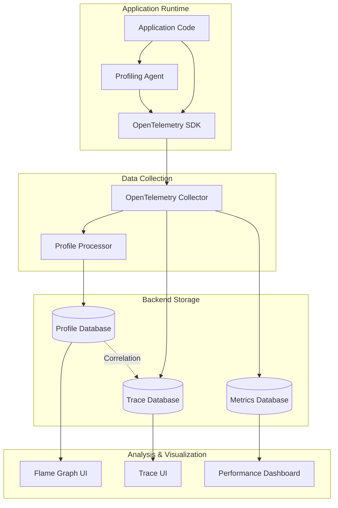
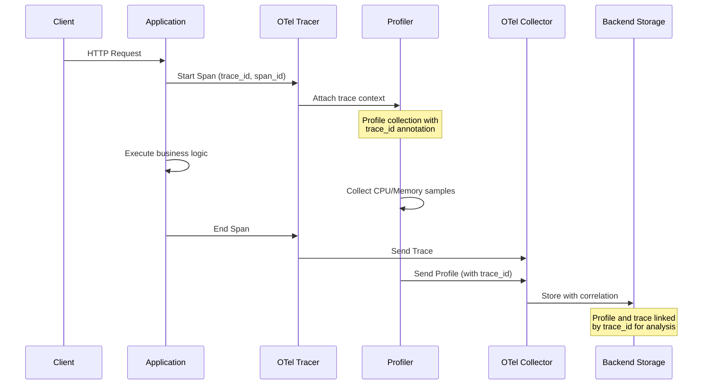

# How to Implement Continuous Profiling with OpenTelemetry

Author: [nawazdhandala](https://github.com/nawazdhandala)

Tags: OpenTelemetry, Observability, Profiling, Performance, CPU, Memory

Description: Learn how to set up continuous profiling with OpenTelemetry for production performance analysis.

---

Continuous profiling is a powerful observability technique that provides deep insights into application performance by continuously collecting profiling data in production environments. When combined with OpenTelemetry, you gain the ability to correlate profiling data with traces, metrics, and logs, creating a comprehensive view of your application's behavior.

In this guide, we will explore how to implement continuous profiling with OpenTelemetry, covering CPU and memory profiling, trace correlation, and production best practices.

## What is Continuous Profiling?

Continuous profiling is the practice of collecting profiling data from applications running in production on an ongoing basis, rather than only during development or troubleshooting sessions. This approach provides:

- **Always-on visibility**: Capture performance issues as they happen
- **Historical analysis**: Compare performance across deployments
- **Resource optimization**: Identify inefficient code paths and memory leaks
- **Cost reduction**: Optimize resource usage based on actual production behavior

## Architecture Overview

The following diagram illustrates how continuous profiling integrates with OpenTelemetry:



## Setting Up the Environment

Before we begin implementing continuous profiling, ensure you have the necessary dependencies installed.

The following commands set up a Go project with the required OpenTelemetry and profiling dependencies:

```bash
# Create a new Go project for continuous profiling
mkdir otel-profiling-demo
cd otel-profiling-demo
go mod init github.com/example/otel-profiling-demo

# Install OpenTelemetry SDK packages
go get go.opentelemetry.io/otel
go get go.opentelemetry.io/otel/sdk
go get go.opentelemetry.io/otel/exporters/otlp/otlptrace/otlptracegrpc

# Install profiling libraries
go get github.com/grafana/pyroscope-go
go get github.com/google/pprof
```

## Implementing CPU Profiling

CPU profiling helps identify which functions consume the most CPU time. Let's implement continuous CPU profiling with OpenTelemetry integration.

The following code sets up a CPU profiler that integrates with OpenTelemetry tracing. It captures CPU profiles at regular intervals and associates them with trace context:

```go
package profiling

import (
    "context"
    "fmt"
    "runtime/pprof"
    "sync"
    "time"

    "go.opentelemetry.io/otel"
    "go.opentelemetry.io/otel/attribute"
    "go.opentelemetry.io/otel/trace"
)

// CPUProfiler manages continuous CPU profiling with OpenTelemetry integration.
// It collects CPU profiles at configurable intervals and correlates them
// with active trace spans for unified observability.
type CPUProfiler struct {
    // interval defines how often CPU profiles are collected
    interval time.Duration

    // duration specifies how long each profiling session lasts
    duration time.Duration

    // tracer is used to create spans for profiling operations
    tracer trace.Tracer

    // stopChan signals the profiler to stop collecting
    stopChan chan struct{}

    // wg ensures graceful shutdown of the profiling goroutine
    wg sync.WaitGroup

    // profileCallback is invoked with each collected profile
    profileCallback func([]byte, time.Time)
}

// NewCPUProfiler creates a new CPU profiler instance.
// The interval parameter controls how frequently profiles are collected,
// while duration controls how long each profile collection runs.
func NewCPUProfiler(interval, duration time.Duration) *CPUProfiler {
    return &CPUProfiler{
        interval: interval,
        duration: duration,
        tracer:   otel.Tracer("cpu-profiler"),
        stopChan: make(chan struct{}),
    }
}

// SetProfileCallback sets the function that receives collected profiles.
// This callback is invoked with the raw profile data and collection timestamp.
func (p *CPUProfiler) SetProfileCallback(callback func([]byte, time.Time)) {
    p.profileCallback = callback
}

// Start begins the continuous profiling loop.
// It runs in a separate goroutine and collects profiles at the configured interval.
func (p *CPUProfiler) Start(ctx context.Context) error {
    p.wg.Add(1)
    go p.profileLoop(ctx)
    return nil
}

// profileLoop is the main profiling goroutine that runs continuously.
// It respects both the context cancellation and the stop channel for shutdown.
func (p *CPUProfiler) profileLoop(ctx context.Context) {
    defer p.wg.Done()

    // Create a ticker for regular profile collection
    ticker := time.NewTicker(p.interval)
    defer ticker.Stop()

    for {
        select {
        case <-ctx.Done():
            // Context cancelled, stop profiling
            return
        case <-p.stopChan:
            // Stop signal received
            return
        case <-ticker.C:
            // Time to collect a new profile
            p.collectProfile(ctx)
        }
    }
}

// collectProfile captures a single CPU profile and processes it.
// It creates a trace span to track the profiling operation itself.
func (p *CPUProfiler) collectProfile(ctx context.Context) {
    // Create a span for the profiling operation
    // This allows us to track profiling overhead in our traces
    ctx, span := p.tracer.Start(ctx, "cpu-profile-collection",
        trace.WithAttributes(
            attribute.String("profiler.type", "cpu"),
            attribute.Int64("profiler.duration_ms", p.duration.Milliseconds()),
        ),
    )
    defer span.End()

    // Create a buffer to store the profile data
    var profileBuffer bytes.Buffer

    // Start CPU profiling - this begins sampling CPU usage
    if err := pprof.StartCPUProfile(&profileBuffer); err != nil {
        span.RecordError(err)
        return
    }

    // Let the profiler collect samples for the specified duration
    time.Sleep(p.duration)

    // Stop profiling and finalize the profile data
    pprof.StopCPUProfile()

    // Record the profile size in the span for monitoring
    span.SetAttributes(
        attribute.Int("profiler.profile_size_bytes", profileBuffer.Len()),
    )

    // Invoke the callback with the collected profile
    if p.profileCallback != nil {
        p.profileCallback(profileBuffer.Bytes(), time.Now())
    }
}

// Stop gracefully shuts down the profiler.
// It waits for any in-progress profile collection to complete.
func (p *CPUProfiler) Stop() {
    close(p.stopChan)
    p.wg.Wait()
}
```

## Implementing Memory Profiling

Memory profiling helps identify memory leaks, excessive allocations, and inefficient memory usage patterns.

The following code implements a memory profiler that captures heap profiles and tracks allocation patterns:

```go
package profiling

import (
    "bytes"
    "context"
    "runtime"
    "runtime/pprof"
    "sync"
    "time"

    "go.opentelemetry.io/otel"
    "go.opentelemetry.io/otel/attribute"
    "go.opentelemetry.io/otel/metric"
    "go.opentelemetry.io/otel/trace"
)

// MemoryProfiler collects heap and allocation profiles continuously.
// It integrates with OpenTelemetry to provide correlated memory insights.
type MemoryProfiler struct {
    // interval defines how often memory profiles are collected
    interval time.Duration

    // tracer creates spans for profiling operations
    tracer trace.Tracer

    // meter records memory-related metrics
    meter metric.Meter

    // stopChan signals the profiler to stop
    stopChan chan struct{}

    // wg ensures graceful shutdown
    wg sync.WaitGroup

    // profileCallback receives collected profiles
    profileCallback func(profileType string, data []byte, timestamp time.Time)

    // Metrics instruments for tracking memory usage
    heapAllocGauge   metric.Int64ObservableGauge
    heapObjectsGauge metric.Int64ObservableGauge
    gcPauseHistogram metric.Float64Histogram
}

// NewMemoryProfiler creates a new memory profiler with the specified collection interval.
// It initializes OpenTelemetry instruments for memory metrics.
func NewMemoryProfiler(interval time.Duration) (*MemoryProfiler, error) {
    mp := &MemoryProfiler{
        interval: interval,
        tracer:   otel.Tracer("memory-profiler"),
        meter:    otel.Meter("memory-profiler"),
        stopChan: make(chan struct{}),
    }

    // Initialize metrics instruments
    if err := mp.initMetrics(); err != nil {
        return nil, err
    }

    return mp, nil
}

// initMetrics sets up OpenTelemetry metrics for memory monitoring.
// These metrics complement the profiling data with time-series visibility.
func (mp *MemoryProfiler) initMetrics() error {
    var err error

    // Heap allocation gauge tracks current heap memory usage
    // This provides real-time visibility into memory consumption
    mp.heapAllocGauge, err = mp.meter.Int64ObservableGauge(
        "runtime.memory.heap_alloc_bytes",
        metric.WithDescription("Current heap memory allocated in bytes"),
        metric.WithUnit("By"),
    )
    if err != nil {
        return err
    }

    // Heap objects gauge tracks the number of allocated objects
    // Useful for detecting object proliferation issues
    mp.heapObjectsGauge, err = mp.meter.Int64ObservableGauge(
        "runtime.memory.heap_objects",
        metric.WithDescription("Number of allocated heap objects"),
    )
    if err != nil {
        return err
    }

    // GC pause histogram tracks garbage collection pause durations
    // Helps identify GC-related latency issues
    mp.gcPauseHistogram, err = mp.meter.Float64Histogram(
        "runtime.gc.pause_duration_seconds",
        metric.WithDescription("GC pause duration in seconds"),
        metric.WithUnit("s"),
    )
    if err != nil {
        return err
    }

    // Register callback to collect memory stats
    _, err = mp.meter.RegisterCallback(
        mp.collectMemoryMetrics,
        mp.heapAllocGauge,
        mp.heapObjectsGauge,
    )

    return err
}

// collectMemoryMetrics is called by the metrics SDK to gather memory statistics.
// It reads runtime memory stats and reports them as gauge values.
func (mp *MemoryProfiler) collectMemoryMetrics(ctx context.Context, observer metric.Observer) error {
    var memStats runtime.MemStats
    runtime.ReadMemStats(&memStats)

    // Report current heap allocation
    observer.ObserveInt64(mp.heapAllocGauge, int64(memStats.HeapAlloc))

    // Report number of heap objects
    observer.ObserveInt64(mp.heapObjectsGauge, int64(memStats.HeapObjects))

    return nil
}

// SetProfileCallback sets the function that receives collected profiles.
// The callback receives the profile type, raw data, and collection timestamp.
func (mp *MemoryProfiler) SetProfileCallback(callback func(string, []byte, time.Time)) {
    mp.profileCallback = callback
}

// Start begins the continuous memory profiling loop.
func (mp *MemoryProfiler) Start(ctx context.Context) error {
    mp.wg.Add(1)
    go mp.profileLoop(ctx)
    return nil
}

// profileLoop continuously collects memory profiles at the configured interval.
func (mp *MemoryProfiler) profileLoop(ctx context.Context) {
    defer mp.wg.Done()

    ticker := time.NewTicker(mp.interval)
    defer ticker.Stop()

    // Track previous GC stats for calculating deltas
    var prevNumGC uint32
    var prevPauseTotal uint64

    for {
        select {
        case <-ctx.Done():
            return
        case <-mp.stopChan:
            return
        case <-ticker.C:
            // Collect heap profile
            mp.collectHeapProfile(ctx)

            // Collect allocation profile
            mp.collectAllocProfile(ctx)

            // Record GC pause metrics
            mp.recordGCMetrics(ctx, &prevNumGC, &prevPauseTotal)
        }
    }
}

// collectHeapProfile captures the current heap state.
// This profile shows where memory is currently allocated.
func (mp *MemoryProfiler) collectHeapProfile(ctx context.Context) {
    ctx, span := mp.tracer.Start(ctx, "heap-profile-collection",
        trace.WithAttributes(
            attribute.String("profiler.type", "heap"),
        ),
    )
    defer span.End()

    var buf bytes.Buffer

    // Collect heap profile - shows current memory allocation
    if err := pprof.WriteHeapProfile(&buf); err != nil {
        span.RecordError(err)
        return
    }

    span.SetAttributes(
        attribute.Int("profiler.profile_size_bytes", buf.Len()),
    )

    if mp.profileCallback != nil {
        mp.profileCallback("heap", buf.Bytes(), time.Now())
    }
}

// collectAllocProfile captures allocation samples.
// This profile shows where memory allocations occurred over time.
func (mp *MemoryProfiler) collectAllocProfile(ctx context.Context) {
    ctx, span := mp.tracer.Start(ctx, "alloc-profile-collection",
        trace.WithAttributes(
            attribute.String("profiler.type", "alloc"),
        ),
    )
    defer span.End()

    var buf bytes.Buffer

    // Get the allocs profile which tracks all allocations
    profile := pprof.Lookup("allocs")
    if profile == nil {
        span.SetAttributes(attribute.Bool("profiler.profile_available", false))
        return
    }

    // Write the profile with debug level 0 for protobuf format
    if err := profile.WriteTo(&buf, 0); err != nil {
        span.RecordError(err)
        return
    }

    span.SetAttributes(
        attribute.Int("profiler.profile_size_bytes", buf.Len()),
    )

    if mp.profileCallback != nil {
        mp.profileCallback("allocs", buf.Bytes(), time.Now())
    }
}

// recordGCMetrics tracks garbage collection pause times.
// It calculates the delta since the last collection for accurate measurements.
func (mp *MemoryProfiler) recordGCMetrics(ctx context.Context, prevNumGC *uint32, prevPauseTotal *uint64) {
    var memStats runtime.MemStats
    runtime.ReadMemStats(&memStats)

    // Calculate new GC pauses since last check
    if memStats.NumGC > *prevNumGC {
        // Calculate total pause time delta
        pauseDelta := memStats.PauseTotalNs - *prevPauseTotal
        numNewGCs := memStats.NumGC - *prevNumGC

        if numNewGCs > 0 {
            // Record average pause duration for new GCs
            avgPause := float64(pauseDelta) / float64(numNewGCs) / 1e9 // Convert to seconds
            mp.gcPauseHistogram.Record(ctx, avgPause)
        }

        *prevNumGC = memStats.NumGC
        *prevPauseTotal = memStats.PauseTotalNs
    }
}

// Stop gracefully shuts down the memory profiler.
func (mp *MemoryProfiler) Stop() {
    close(mp.stopChan)
    mp.wg.Wait()
}
```

## Trace Correlation with Profiles

One of the most powerful features of combining OpenTelemetry with continuous profiling is the ability to correlate profiles with traces. This allows you to see exactly which code paths are causing performance issues for specific requests.

The following diagram shows how trace and profile correlation works:



The following code implements trace-correlated profiling by embedding trace context into profile labels:

```go
package profiling

import (
    "context"
    "runtime/pprof"
    "sync"

    "go.opentelemetry.io/otel/trace"
)

// TracedProfiler wraps profiling operations with trace context.
// It ensures that all profile samples collected during a traced operation
// are annotated with the trace and span IDs for later correlation.
type TracedProfiler struct {
    // labelPool reduces allocation overhead for profile labels
    labelPool sync.Pool
}

// NewTracedProfiler creates a new traced profiler instance.
func NewTracedProfiler() *TracedProfiler {
    return &TracedProfiler{
        labelPool: sync.Pool{
            New: func() interface{} {
                // Pre-allocate label sets to reduce GC pressure
                return make(map[string]string, 4)
            },
        },
    }
}

// WithProfiling executes the given function with profiling labels attached.
// This allows profile samples to be correlated with the current trace context.
func (tp *TracedProfiler) WithProfiling(ctx context.Context, fn func(context.Context)) {
    // Extract the current span from context
    span := trace.SpanFromContext(ctx)
    if !span.IsRecording() {
        // No active span, execute without labels
        fn(ctx)
        return
    }

    // Get span context for trace correlation
    spanCtx := span.SpanContext()

    // Get a label set from the pool
    labels := tp.labelPool.Get().(map[string]string)
    defer func() {
        // Clear and return labels to pool
        for k := range labels {
            delete(labels, k)
        }
        tp.labelPool.Put(labels)
    }()

    // Set trace correlation labels
    // These labels will be attached to all profile samples collected
    // during the execution of the wrapped function
    labels["trace_id"] = spanCtx.TraceID().String()
    labels["span_id"] = spanCtx.SpanID().String()

    // Add service-level labels for filtering
    labels["service.name"] = "my-service"

    // Execute with pprof labels attached
    // The Do function ensures all goroutines spawned during execution
    // inherit these labels for accurate profiling attribution
    pprof.Do(ctx, pprof.Labels(
        "trace_id", labels["trace_id"],
        "span_id", labels["span_id"],
        "service.name", labels["service.name"],
    ), func(ctx context.Context) {
        fn(ctx)
    })
}

// ProfiledHandler wraps an HTTP handler with trace-correlated profiling.
// This is useful for automatically correlating all request processing
// with the associated trace.
func (tp *TracedProfiler) ProfiledHandler(handler func(context.Context)) func(context.Context) {
    return func(ctx context.Context) {
        tp.WithProfiling(ctx, handler)
    }
}
```

## Exporting Profiles to OpenTelemetry Collector

To integrate with the OpenTelemetry ecosystem, we need to export profiles in a format that the collector can process. While the OpenTelemetry profiling signal is still evolving, we can use the OTLP protocol with custom handling.

The following code implements a profile exporter that sends profiles to an OpenTelemetry-compatible backend:

```go
package profiling

import (
    "bytes"
    "compress/gzip"
    "context"
    "fmt"
    "net/http"
    "sync"
    "time"

    "go.opentelemetry.io/otel"
    "go.opentelemetry.io/otel/attribute"
    "go.opentelemetry.io/otel/trace"
)

// ProfileExporter sends collected profiles to a backend service.
// It handles batching, compression, and retry logic for reliable delivery.
type ProfileExporter struct {
    // endpoint is the URL where profiles are sent
    endpoint string

    // client is the HTTP client for sending profiles
    client *http.Client

    // tracer tracks exporter operations
    tracer trace.Tracer

    // batch collects profiles for batched sending
    batch     []ProfileData
    batchLock sync.Mutex

    // batchSize triggers a flush when reached
    batchSize int

    // flushInterval controls periodic flushing
    flushInterval time.Duration

    // stopChan signals shutdown
    stopChan chan struct{}
    wg       sync.WaitGroup
}

// ProfileData represents a single collected profile with metadata.
type ProfileData struct {
    // Type indicates the profile type (cpu, heap, allocs, etc.)
    Type string

    // Data contains the raw profile bytes in pprof format
    Data []byte

    // Timestamp is when the profile was collected
    Timestamp time.Time

    // Labels contains trace correlation and other metadata
    Labels map[string]string
}

// NewProfileExporter creates a new exporter configured for the given endpoint.
func NewProfileExporter(endpoint string) *ProfileExporter {
    return &ProfileExporter{
        endpoint:      endpoint,
        client:        &http.Client{Timeout: 30 * time.Second},
        tracer:        otel.Tracer("profile-exporter"),
        batch:         make([]ProfileData, 0, 100),
        batchSize:     100,
        flushInterval: 10 * time.Second,
        stopChan:      make(chan struct{}),
    }
}

// Start begins the background flush goroutine.
func (pe *ProfileExporter) Start() {
    pe.wg.Add(1)
    go pe.flushLoop()
}

// flushLoop periodically sends batched profiles to the backend.
func (pe *ProfileExporter) flushLoop() {
    defer pe.wg.Done()

    ticker := time.NewTicker(pe.flushInterval)
    defer ticker.Stop()

    for {
        select {
        case <-pe.stopChan:
            // Final flush before shutdown
            pe.flush(context.Background())
            return
        case <-ticker.C:
            pe.flush(context.Background())
        }
    }
}

// Export adds a profile to the batch for sending.
// It triggers an immediate flush if the batch size is reached.
func (pe *ProfileExporter) Export(ctx context.Context, profile ProfileData) error {
    pe.batchLock.Lock()
    pe.batch = append(pe.batch, profile)
    shouldFlush := len(pe.batch) >= pe.batchSize
    pe.batchLock.Unlock()

    if shouldFlush {
        return pe.flush(ctx)
    }

    return nil
}

// flush sends all batched profiles to the backend.
func (pe *ProfileExporter) flush(ctx context.Context) error {
    // Get and reset the batch atomically
    pe.batchLock.Lock()
    if len(pe.batch) == 0 {
        pe.batchLock.Unlock()
        return nil
    }
    profiles := pe.batch
    pe.batch = make([]ProfileData, 0, pe.batchSize)
    pe.batchLock.Unlock()

    // Create a span for the flush operation
    ctx, span := pe.tracer.Start(ctx, "profile-export-flush",
        trace.WithAttributes(
            attribute.Int("profiles.count", len(profiles)),
        ),
    )
    defer span.End()

    // Send each profile
    // In production, you would batch these into a single request
    for _, profile := range profiles {
        if err := pe.sendProfile(ctx, profile); err != nil {
            span.RecordError(err)
            // Continue with other profiles even if one fails
            continue
        }
    }

    return nil
}

// sendProfile sends a single profile to the backend.
func (pe *ProfileExporter) sendProfile(ctx context.Context, profile ProfileData) error {
    // Compress the profile data
    var compressed bytes.Buffer
    gzWriter := gzip.NewWriter(&compressed)
    if _, err := gzWriter.Write(profile.Data); err != nil {
        return fmt.Errorf("compression failed: %w", err)
    }
    if err := gzWriter.Close(); err != nil {
        return fmt.Errorf("compression close failed: %w", err)
    }

    // Create the HTTP request
    req, err := http.NewRequestWithContext(ctx, "POST", pe.endpoint, &compressed)
    if err != nil {
        return fmt.Errorf("request creation failed: %w", err)
    }

    // Set headers for profile ingestion
    req.Header.Set("Content-Type", "application/x-protobuf")
    req.Header.Set("Content-Encoding", "gzip")
    req.Header.Set("X-Profile-Type", profile.Type)
    req.Header.Set("X-Profile-Timestamp", profile.Timestamp.Format(time.RFC3339Nano))

    // Add trace correlation headers if available
    if traceID, ok := profile.Labels["trace_id"]; ok {
        req.Header.Set("X-Trace-ID", traceID)
    }

    // Send the request
    resp, err := pe.client.Do(req)
    if err != nil {
        return fmt.Errorf("request failed: %w", err)
    }
    defer resp.Body.Close()

    if resp.StatusCode >= 400 {
        return fmt.Errorf("backend returned status %d", resp.StatusCode)
    }

    return nil
}

// Stop gracefully shuts down the exporter.
func (pe *ProfileExporter) Stop() {
    close(pe.stopChan)
    pe.wg.Wait()
}
```

## OpenTelemetry Collector Configuration

To receive and process profiles, configure your OpenTelemetry Collector with the appropriate receivers and exporters.

The following configuration shows how to set up an OpenTelemetry Collector to receive profiles and forward them to a profiling backend like Pyroscope:

```yaml
# otel-collector-config.yaml
# This configuration enables the collector to receive profiles
# and forward them to a profiling backend

receivers:
  # OTLP receiver for traces, metrics, and logs
  otlp:
    protocols:
      grpc:
        endpoint: 0.0.0.0:4317
      http:
        endpoint: 0.0.0.0:4318

  # Custom receiver for profile data
  # Note: Native profiling support in OTel Collector is evolving
  # This uses an HTTP receiver as a placeholder
  httpcheck:
    targets:
      - endpoint: http://localhost:4040/profiles
        method: POST

processors:
  # Batch processor for efficient data transmission
  batch:
    timeout: 10s
    send_batch_size: 1000

  # Memory limiter to prevent OOM conditions
  memory_limiter:
    check_interval: 1s
    limit_mib: 1000
    spike_limit_mib: 200

  # Resource processor to add common attributes
  resource:
    attributes:
      - key: deployment.environment
        value: production
        action: upsert
      - key: service.version
        from_attribute: VERSION
        action: insert

exporters:
  # OTLP exporter for traces and metrics
  otlp:
    endpoint: "tempo:4317"
    tls:
      insecure: false
      cert_file: /etc/ssl/certs/collector.crt
      key_file: /etc/ssl/private/collector.key

  # Pyroscope exporter for profiles
  # This sends profile data to Pyroscope for visualization
  otlphttp:
    endpoint: "http://pyroscope:4040"
    headers:
      Authorization: "Bearer ${PYROSCOPE_API_KEY}"

extensions:
  # Health check for container orchestration
  health_check:
    endpoint: 0.0.0.0:13133

  # Performance profiling of the collector itself
  pprof:
    endpoint: 0.0.0.0:1777

service:
  extensions: [health_check, pprof]
  pipelines:
    # Traces pipeline
    traces:
      receivers: [otlp]
      processors: [memory_limiter, batch, resource]
      exporters: [otlp]

    # Metrics pipeline
    metrics:
      receivers: [otlp]
      processors: [memory_limiter, batch, resource]
      exporters: [otlp]
```

## Complete Integration Example

Now let's put everything together in a complete example that demonstrates continuous profiling with full OpenTelemetry integration.

The following code shows a complete HTTP server with integrated continuous profiling, tracing, and metrics:

```go
package main

import (
    "context"
    "fmt"
    "log"
    "net/http"
    "os"
    "os/signal"
    "syscall"
    "time"

    "go.opentelemetry.io/otel"
    "go.opentelemetry.io/otel/attribute"
    "go.opentelemetry.io/otel/exporters/otlp/otlptrace/otlptracegrpc"
    "go.opentelemetry.io/otel/propagation"
    "go.opentelemetry.io/otel/sdk/resource"
    sdktrace "go.opentelemetry.io/otel/sdk/trace"
    semconv "go.opentelemetry.io/otel/semconv/v1.21.0"
    "go.opentelemetry.io/otel/trace"
)

// Application constants
const (
    serviceName    = "profiling-demo-service"
    serviceVersion = "1.0.0"
)

// Global profilers and tracer
var (
    cpuProfiler    *CPUProfiler
    memoryProfiler *MemoryProfiler
    tracedProfiler *TracedProfiler
    profileExporter *ProfileExporter
    tracer         trace.Tracer
)

func main() {
    ctx, cancel := context.WithCancel(context.Background())
    defer cancel()

    // Initialize OpenTelemetry tracing
    shutdown, err := initTracing(ctx)
    if err != nil {
        log.Fatalf("Failed to initialize tracing: %v", err)
    }
    defer shutdown(ctx)

    // Initialize profilers
    if err := initProfilers(ctx); err != nil {
        log.Fatalf("Failed to initialize profilers: %v", err)
    }
    defer stopProfilers()

    // Get the tracer for our service
    tracer = otel.Tracer(serviceName)

    // Set up HTTP server with traced and profiled handlers
    mux := http.NewServeMux()
    mux.HandleFunc("/api/process", handleProcess)
    mux.HandleFunc("/api/compute", handleCompute)
    mux.HandleFunc("/health", handleHealth)

    server := &http.Server{
        Addr:    ":8080",
        Handler: mux,
    }

    // Start server in background
    go func() {
        log.Printf("Starting server on :8080")
        if err := server.ListenAndServe(); err != http.ErrServerClosed {
            log.Fatalf("Server error: %v", err)
        }
    }()

    // Wait for shutdown signal
    sigChan := make(chan os.Signal, 1)
    signal.Notify(sigChan, syscall.SIGINT, syscall.SIGTERM)
    <-sigChan

    // Graceful shutdown
    log.Println("Shutting down...")
    shutdownCtx, shutdownCancel := context.WithTimeout(context.Background(), 10*time.Second)
    defer shutdownCancel()
    server.Shutdown(shutdownCtx)
}

// initTracing sets up OpenTelemetry tracing with OTLP export.
func initTracing(ctx context.Context) (func(context.Context) error, error) {
    // Create OTLP trace exporter
    exporter, err := otlptracegrpc.New(ctx,
        otlptracegrpc.WithEndpoint("localhost:4317"),
        otlptracegrpc.WithInsecure(),
    )
    if err != nil {
        return nil, fmt.Errorf("failed to create exporter: %w", err)
    }

    // Create resource with service information
    res, err := resource.New(ctx,
        resource.WithAttributes(
            semconv.ServiceName(serviceName),
            semconv.ServiceVersion(serviceVersion),
            attribute.String("environment", "production"),
        ),
    )
    if err != nil {
        return nil, fmt.Errorf("failed to create resource: %w", err)
    }

    // Create trace provider with sampling
    // Use AlwaysSample for demo; use probability sampler in production
    tp := sdktrace.NewTracerProvider(
        sdktrace.WithBatcher(exporter),
        sdktrace.WithResource(res),
        sdktrace.WithSampler(sdktrace.AlwaysSample()),
    )

    // Set global trace provider
    otel.SetTracerProvider(tp)
    otel.SetTextMapPropagator(propagation.NewCompositeTextMapPropagator(
        propagation.TraceContext{},
        propagation.Baggage{},
    ))

    return tp.Shutdown, nil
}

// initProfilers starts all continuous profilers.
func initProfilers(ctx context.Context) error {
    // Initialize CPU profiler with 60-second interval, 10-second duration
    cpuProfiler = NewCPUProfiler(60*time.Second, 10*time.Second)

    // Initialize memory profiler with 30-second interval
    var err error
    memoryProfiler, err = NewMemoryProfiler(30 * time.Second)
    if err != nil {
        return fmt.Errorf("failed to create memory profiler: %w", err)
    }

    // Initialize traced profiler for request-level profiling
    tracedProfiler = NewTracedProfiler()

    // Initialize profile exporter
    profileExporter = NewProfileExporter("http://localhost:4040/ingest")

    // Set up profile callbacks to send profiles to exporter
    cpuProfiler.SetProfileCallback(func(data []byte, ts time.Time) {
        profileExporter.Export(ctx, ProfileData{
            Type:      "cpu",
            Data:      data,
            Timestamp: ts,
            Labels:    map[string]string{"service.name": serviceName},
        })
    })

    memoryProfiler.SetProfileCallback(func(profileType string, data []byte, ts time.Time) {
        profileExporter.Export(ctx, ProfileData{
            Type:      profileType,
            Data:      data,
            Timestamp: ts,
            Labels:    map[string]string{"service.name": serviceName},
        })
    })

    // Start all profilers
    profileExporter.Start()
    cpuProfiler.Start(ctx)
    memoryProfiler.Start(ctx)

    log.Println("Profilers started")
    return nil
}

// stopProfilers gracefully shuts down all profilers.
func stopProfilers() {
    cpuProfiler.Stop()
    memoryProfiler.Stop()
    profileExporter.Stop()
    log.Println("Profilers stopped")
}

// handleProcess is an HTTP handler that demonstrates traced profiling.
func handleProcess(w http.ResponseWriter, r *http.Request) {
    // Start a span for this request
    ctx, span := tracer.Start(r.Context(), "process-request",
        trace.WithAttributes(
            attribute.String("http.method", r.Method),
            attribute.String("http.url", r.URL.Path),
        ),
    )
    defer span.End()

    // Execute the business logic with profiling labels attached
    // This ensures CPU and memory samples are correlated with this trace
    tracedProfiler.WithProfiling(ctx, func(ctx context.Context) {
        // Simulate some work that we want to profile
        result := processData(ctx)
        span.SetAttributes(attribute.Int("result.size", len(result)))
    })

    w.WriteHeader(http.StatusOK)
    w.Write([]byte("Processing complete"))
}

// handleCompute demonstrates a CPU-intensive operation with profiling.
func handleCompute(w http.ResponseWriter, r *http.Request) {
    ctx, span := tracer.Start(r.Context(), "compute-request")
    defer span.End()

    tracedProfiler.WithProfiling(ctx, func(ctx context.Context) {
        // Perform CPU-intensive computation
        result := computeIntensive(ctx, 1000000)
        span.SetAttributes(attribute.Int64("computation.result", result))
    })

    w.WriteHeader(http.StatusOK)
    fmt.Fprintf(w, "Computation complete")
}

// handleHealth is a simple health check endpoint.
func handleHealth(w http.ResponseWriter, r *http.Request) {
    w.WriteHeader(http.StatusOK)
    w.Write([]byte("OK"))
}

// processData simulates data processing work.
func processData(ctx context.Context) []byte {
    _, span := tracer.Start(ctx, "process-data")
    defer span.End()

    // Simulate memory allocation
    data := make([]byte, 1024*1024) // 1MB
    for i := range data {
        data[i] = byte(i % 256)
    }

    // Simulate processing time
    time.Sleep(100 * time.Millisecond)

    return data
}

// computeIntensive simulates CPU-bound work.
func computeIntensive(ctx context.Context, iterations int) int64 {
    _, span := tracer.Start(ctx, "compute-intensive")
    defer span.End()

    var result int64
    for i := 0; i < iterations; i++ {
        result += int64(i * i)
    }

    return result
}
```

## Production Best Practices

When deploying continuous profiling in production, follow these best practices to ensure minimal overhead and maximum value.

### 1. Sampling Strategies

Not every request needs to be profiled. Use sampling to reduce overhead.

The following code implements an adaptive sampling strategy that adjusts based on system load:

```go
package profiling

import (
    "math/rand"
    "sync/atomic"
    "time"
)

// AdaptiveSampler adjusts sampling rate based on system metrics.
// It reduces profiling overhead during high-load periods while
// maintaining visibility during normal operation.
type AdaptiveSampler struct {
    // baseSampleRate is the default sampling rate (0.0 to 1.0)
    baseSampleRate float64

    // currentRate is atomically updated based on load
    currentRate atomic.Value

    // loadThreshold triggers rate reduction when exceeded
    loadThreshold float64

    // minRate is the minimum sampling rate even under high load
    minRate float64
}

// NewAdaptiveSampler creates a sampler with the given base rate.
// The loadThreshold determines when to reduce sampling (0.0 to 1.0).
func NewAdaptiveSampler(baseSampleRate, loadThreshold, minRate float64) *AdaptiveSampler {
    s := &AdaptiveSampler{
        baseSampleRate: baseSampleRate,
        loadThreshold:  loadThreshold,
        minRate:        minRate,
    }
    s.currentRate.Store(baseSampleRate)
    return s
}

// ShouldSample returns true if the current request should be profiled.
// It uses the current adaptive rate to make the decision.
func (s *AdaptiveSampler) ShouldSample() bool {
    rate := s.currentRate.Load().(float64)
    return rand.Float64() < rate
}

// UpdateLoad adjusts the sampling rate based on current system load.
// Call this periodically with the current load factor (0.0 to 1.0).
func (s *AdaptiveSampler) UpdateLoad(loadFactor float64) {
    var newRate float64

    if loadFactor > s.loadThreshold {
        // Reduce sampling under high load
        // Scale linearly from base rate to min rate
        excess := (loadFactor - s.loadThreshold) / (1.0 - s.loadThreshold)
        newRate = s.baseSampleRate - (s.baseSampleRate-s.minRate)*excess
    } else {
        // Normal load, use base rate
        newRate = s.baseSampleRate
    }

    // Ensure we don't go below minimum
    if newRate < s.minRate {
        newRate = s.minRate
    }

    s.currentRate.Store(newRate)
}

// GetCurrentRate returns the current sampling rate.
func (s *AdaptiveSampler) GetCurrentRate() float64 {
    return s.currentRate.Load().(float64)
}
```

### 2. Resource Limits

Implement resource limits to prevent profiling from impacting application performance.

The following configuration and code demonstrate resource limiting for profilers:

```go
package profiling

import (
    "context"
    "runtime"
    "sync"
    "time"
)

// ResourceLimits defines constraints for profiling operations.
type ResourceLimits struct {
    // MaxCPUPercent is the maximum CPU percentage for profiling (0-100)
    MaxCPUPercent float64

    // MaxMemoryMB is the maximum memory for profile buffers
    MaxMemoryMB int64

    // MaxProfilesPerMinute limits profile collection frequency
    MaxProfilesPerMinute int

    // ProfileTimeout is the maximum duration for a single profile
    ProfileTimeout time.Duration
}

// DefaultResourceLimits returns conservative default limits.
func DefaultResourceLimits() ResourceLimits {
    return ResourceLimits{
        MaxCPUPercent:        5.0,   // Use at most 5% CPU for profiling
        MaxMemoryMB:          100,   // 100MB max for profile buffers
        MaxProfilesPerMinute: 10,    // At most 10 profiles per minute
        ProfileTimeout:       30 * time.Second,
    }
}

// ResourceGuard enforces resource limits for profiling operations.
type ResourceGuard struct {
    limits ResourceLimits

    // profileCount tracks profiles collected in the current minute
    profileCount int
    countMu      sync.Mutex

    // memoryUsed tracks current profile buffer memory
    memoryUsed int64
    memoryMu   sync.Mutex
}

// NewResourceGuard creates a guard with the specified limits.
func NewResourceGuard(limits ResourceLimits) *ResourceGuard {
    rg := &ResourceGuard{limits: limits}

    // Start a goroutine to reset the per-minute counter
    go func() {
        ticker := time.NewTicker(time.Minute)
        for range ticker.C {
            rg.countMu.Lock()
            rg.profileCount = 0
            rg.countMu.Unlock()
        }
    }()

    return rg
}

// CanProfile checks if a new profile can be collected.
// It enforces rate limits and memory constraints.
func (rg *ResourceGuard) CanProfile() bool {
    // Check rate limit
    rg.countMu.Lock()
    if rg.profileCount >= rg.limits.MaxProfilesPerMinute {
        rg.countMu.Unlock()
        return false
    }
    rg.countMu.Unlock()

    // Check memory limit
    rg.memoryMu.Lock()
    if rg.memoryUsed >= rg.limits.MaxMemoryMB*1024*1024 {
        rg.memoryMu.Unlock()
        return false
    }
    rg.memoryMu.Unlock()

    // Check CPU usage (simplified - in production use more sophisticated monitoring)
    var memStats runtime.MemStats
    runtime.ReadMemStats(&memStats)

    return true
}

// RecordProfile marks that a profile was collected.
func (rg *ResourceGuard) RecordProfile(sizeBytes int64) {
    rg.countMu.Lock()
    rg.profileCount++
    rg.countMu.Unlock()

    rg.memoryMu.Lock()
    rg.memoryUsed += sizeBytes
    rg.memoryMu.Unlock()
}

// ReleaseMemory marks profile memory as freed.
func (rg *ResourceGuard) ReleaseMemory(sizeBytes int64) {
    rg.memoryMu.Lock()
    rg.memoryUsed -= sizeBytes
    if rg.memoryUsed < 0 {
        rg.memoryUsed = 0
    }
    rg.memoryMu.Unlock()
}

// WithTimeout wraps a context with the profile timeout.
func (rg *ResourceGuard) WithTimeout(ctx context.Context) (context.Context, context.CancelFunc) {
    return context.WithTimeout(ctx, rg.limits.ProfileTimeout)
}
```

### 3. Security Considerations

Profile data can contain sensitive information. Implement proper security measures.

The following code demonstrates secure profile handling:

```go
package profiling

import (
    "crypto/aes"
    "crypto/cipher"
    "crypto/rand"
    "encoding/base64"
    "fmt"
    "io"
    "regexp"
    "strings"
)

// ProfileSanitizer removes sensitive information from profiles.
type ProfileSanitizer struct {
    // patterns contains regex patterns for sensitive data
    patterns []*regexp.Regexp

    // replacements maps pattern indices to replacement strings
    replacements []string
}

// NewProfileSanitizer creates a sanitizer with common patterns.
func NewProfileSanitizer() *ProfileSanitizer {
    return &ProfileSanitizer{
        patterns: []*regexp.Regexp{
            // API keys and tokens
            regexp.MustCompile(`(?i)(api[_-]?key|token|secret|password)\s*[:=]\s*['"]?[\w-]+['"]?`),
            // Email addresses
            regexp.MustCompile(`[\w.+-]+@[\w.-]+\.[a-zA-Z]{2,}`),
            // IP addresses (optional - might be useful for debugging)
            // regexp.MustCompile(`\b\d{1,3}\.\d{1,3}\.\d{1,3}\.\d{1,3}\b`),
        },
        replacements: []string{
            "[REDACTED_SECRET]",
            "[REDACTED_EMAIL]",
        },
    }
}

// Sanitize removes sensitive data from profile labels and metadata.
func (ps *ProfileSanitizer) Sanitize(labels map[string]string) map[string]string {
    sanitized := make(map[string]string, len(labels))

    for key, value := range labels {
        sanitizedValue := value
        for i, pattern := range ps.patterns {
            if pattern.MatchString(value) {
                sanitizedValue = pattern.ReplaceAllString(sanitizedValue, ps.replacements[i])
            }
        }
        sanitized[key] = sanitizedValue
    }

    return sanitized
}

// ProfileEncryptor handles encryption of profile data for secure transmission.
type ProfileEncryptor struct {
    // gcm is the AES-GCM cipher for authenticated encryption
    gcm cipher.AEAD
}

// NewProfileEncryptor creates an encryptor with the given 32-byte key.
func NewProfileEncryptor(key []byte) (*ProfileEncryptor, error) {
    if len(key) != 32 {
        return nil, fmt.Errorf("key must be 32 bytes for AES-256")
    }

    block, err := aes.NewCipher(key)
    if err != nil {
        return nil, err
    }

    gcm, err := cipher.NewGCM(block)
    if err != nil {
        return nil, err
    }

    return &ProfileEncryptor{gcm: gcm}, nil
}

// Encrypt encrypts profile data using AES-256-GCM.
func (pe *ProfileEncryptor) Encrypt(plaintext []byte) (string, error) {
    // Generate a random nonce
    nonce := make([]byte, pe.gcm.NonceSize())
    if _, err := io.ReadFull(rand.Reader, nonce); err != nil {
        return "", err
    }

    // Encrypt and authenticate
    ciphertext := pe.gcm.Seal(nonce, nonce, plaintext, nil)

    // Return base64-encoded result
    return base64.StdEncoding.EncodeToString(ciphertext), nil
}

// Decrypt decrypts profile data.
func (pe *ProfileEncryptor) Decrypt(encrypted string) ([]byte, error) {
    ciphertext, err := base64.StdEncoding.DecodeString(encrypted)
    if err != nil {
        return nil, err
    }

    if len(ciphertext) < pe.gcm.NonceSize() {
        return nil, fmt.Errorf("ciphertext too short")
    }

    nonce := ciphertext[:pe.gcm.NonceSize()]
    ciphertext = ciphertext[pe.gcm.NonceSize():]

    return pe.gcm.Open(nil, nonce, ciphertext, nil)
}
```

## Visualization and Analysis

Once profiles are collected, visualization is key to extracting insights. Here's how to set up a complete visualization stack.

The following Docker Compose configuration sets up Grafana with Pyroscope for profile visualization:

```yaml
# docker-compose.yaml
# Complete observability stack with profiling

version: '3.8'

services:
  # OpenTelemetry Collector
  otel-collector:
    image: otel/opentelemetry-collector-contrib:latest
    command: ["--config=/etc/otel-collector-config.yaml"]
    volumes:
      - ./otel-collector-config.yaml:/etc/otel-collector-config.yaml
    ports:
      - "4317:4317"   # OTLP gRPC
      - "4318:4318"   # OTLP HTTP
      - "13133:13133" # Health check
    depends_on:
      - tempo
      - pyroscope

  # Pyroscope for profile storage and visualization
  pyroscope:
    image: grafana/pyroscope:latest
    ports:
      - "4040:4040"
    volumes:
      - pyroscope-data:/var/lib/pyroscope
    environment:
      - PYROSCOPE_LOG_LEVEL=info

  # Tempo for distributed tracing
  tempo:
    image: grafana/tempo:latest
    command: ["-config.file=/etc/tempo.yaml"]
    volumes:
      - ./tempo.yaml:/etc/tempo.yaml
      - tempo-data:/var/tempo
    ports:
      - "3200:3200"   # Tempo API
      - "9095:9095"   # Tempo gRPC

  # Prometheus for metrics
  prometheus:
    image: prom/prometheus:latest
    volumes:
      - ./prometheus.yaml:/etc/prometheus/prometheus.yml
      - prometheus-data:/prometheus
    ports:
      - "9090:9090"
    command:
      - '--config.file=/etc/prometheus/prometheus.yml'
      - '--storage.tsdb.path=/prometheus'
      - '--web.enable-lifecycle'

  # Grafana for unified visualization
  grafana:
    image: grafana/grafana:latest
    ports:
      - "3000:3000"
    volumes:
      - grafana-data:/var/lib/grafana
      - ./grafana/provisioning:/etc/grafana/provisioning
    environment:
      - GF_SECURITY_ADMIN_PASSWORD=admin
      - GF_FEATURE_TOGGLES_ENABLE=flameGraph traceToProfiles
    depends_on:
      - prometheus
      - tempo
      - pyroscope

volumes:
  pyroscope-data:
  tempo-data:
  prometheus-data:
  grafana-data:
```

## Troubleshooting Common Issues

Here are solutions to common issues when implementing continuous profiling:

### High Overhead

If profiling causes noticeable performance degradation, implement the following mitigations:

```go
// Reduce profiling frequency during high load
// This code shows how to dynamically adjust profiling based on CPU usage

package profiling

import (
    "runtime"
    "time"
)

// OverheadMonitor tracks profiling overhead and adjusts accordingly.
type OverheadMonitor struct {
    // targetOverhead is the maximum acceptable overhead percentage
    targetOverhead float64

    // baseInterval is the normal profiling interval
    baseInterval time.Duration

    // currentInterval is the adjusted interval
    currentInterval time.Duration

    // maxInterval is the maximum interval when under pressure
    maxInterval time.Duration
}

// NewOverheadMonitor creates a monitor with the specified parameters.
func NewOverheadMonitor(targetOverhead float64, baseInterval time.Duration) *OverheadMonitor {
    return &OverheadMonitor{
        targetOverhead:  targetOverhead,
        baseInterval:    baseInterval,
        currentInterval: baseInterval,
        maxInterval:     baseInterval * 10,
    }
}

// AdjustInterval calculates the optimal profiling interval.
// Call this after each profile collection with the collection duration.
func (om *OverheadMonitor) AdjustInterval(collectionDuration time.Duration) time.Duration {
    // Calculate current overhead
    overhead := float64(collectionDuration) / float64(om.currentInterval)

    if overhead > om.targetOverhead {
        // Increase interval to reduce overhead
        om.currentInterval = time.Duration(float64(om.currentInterval) * 1.5)
        if om.currentInterval > om.maxInterval {
            om.currentInterval = om.maxInterval
        }
    } else if overhead < om.targetOverhead/2 {
        // We have headroom, can decrease interval
        om.currentInterval = time.Duration(float64(om.currentInterval) * 0.8)
        if om.currentInterval < om.baseInterval {
            om.currentInterval = om.baseInterval
        }
    }

    return om.currentInterval
}

// GetCurrentInterval returns the current profiling interval.
func (om *OverheadMonitor) GetCurrentInterval() time.Duration {
    return om.currentInterval
}
```

### Missing Profile Data

If profiles are not appearing in your backend, check these common issues:

1. **Network connectivity**: Ensure the collector endpoint is reachable
2. **Authentication**: Verify API keys and tokens are correctly configured
3. **Format compatibility**: Ensure profile format matches backend expectations
4. **Buffer overflow**: Check if profiles are being dropped due to buffer limits

The following code implements comprehensive profile delivery verification:

```go
// ProfileDeliveryChecker verifies that profiles reach the backend
package profiling

import (
    "context"
    "fmt"
    "net/http"
    "sync/atomic"
    "time"
)

// DeliveryStats tracks profile delivery success/failure.
type DeliveryStats struct {
    Sent      int64
    Confirmed int64
    Failed    int64
    Pending   int64
}

// ProfileDeliveryChecker monitors profile delivery health.
type ProfileDeliveryChecker struct {
    stats           DeliveryStats
    backendEndpoint string
    checkInterval   time.Duration
}

// NewProfileDeliveryChecker creates a new delivery checker.
func NewProfileDeliveryChecker(endpoint string) *ProfileDeliveryChecker {
    return &ProfileDeliveryChecker{
        backendEndpoint: endpoint,
        checkInterval:   30 * time.Second,
    }
}

// RecordSent increments the sent counter when a profile is dispatched.
func (pdc *ProfileDeliveryChecker) RecordSent() {
    atomic.AddInt64(&pdc.stats.Sent, 1)
    atomic.AddInt64(&pdc.stats.Pending, 1)
}

// RecordConfirmed marks a profile as successfully delivered.
func (pdc *ProfileDeliveryChecker) RecordConfirmed() {
    atomic.AddInt64(&pdc.stats.Confirmed, 1)
    atomic.AddInt64(&pdc.stats.Pending, -1)
}

// RecordFailed marks a profile delivery as failed.
func (pdc *ProfileDeliveryChecker) RecordFailed() {
    atomic.AddInt64(&pdc.stats.Failed, 1)
    atomic.AddInt64(&pdc.stats.Pending, -1)
}

// GetStats returns current delivery statistics.
func (pdc *ProfileDeliveryChecker) GetStats() DeliveryStats {
    return DeliveryStats{
        Sent:      atomic.LoadInt64(&pdc.stats.Sent),
        Confirmed: atomic.LoadInt64(&pdc.stats.Confirmed),
        Failed:    atomic.LoadInt64(&pdc.stats.Failed),
        Pending:   atomic.LoadInt64(&pdc.stats.Pending),
    }
}

// CheckBackendHealth verifies the backend is accepting profiles.
func (pdc *ProfileDeliveryChecker) CheckBackendHealth(ctx context.Context) error {
    req, err := http.NewRequestWithContext(ctx, "GET", pdc.backendEndpoint+"/ready", nil)
    if err != nil {
        return fmt.Errorf("failed to create request: %w", err)
    }

    client := &http.Client{Timeout: 5 * time.Second}
    resp, err := client.Do(req)
    if err != nil {
        return fmt.Errorf("backend unreachable: %w", err)
    }
    defer resp.Body.Close()

    if resp.StatusCode != http.StatusOK {
        return fmt.Errorf("backend returned status %d", resp.StatusCode)
    }

    return nil
}

// SuccessRate returns the percentage of successfully delivered profiles.
func (pdc *ProfileDeliveryChecker) SuccessRate() float64 {
    sent := atomic.LoadInt64(&pdc.stats.Sent)
    if sent == 0 {
        return 100.0
    }
    confirmed := atomic.LoadInt64(&pdc.stats.Confirmed)
    return float64(confirmed) / float64(sent) * 100.0
}
```

## Conclusion

Continuous profiling with OpenTelemetry provides deep insights into application performance that complement traditional observability signals. By implementing the patterns and practices covered in this guide, you can:

- Collect CPU and memory profiles continuously with minimal overhead
- Correlate profiles with distributed traces for root cause analysis
- Export profiles to OpenTelemetry-compatible backends
- Apply production-grade resource limits and security measures
- Visualize and analyze performance data effectively

The key to successful continuous profiling is balance: collecting enough data to be useful while minimizing impact on production performance. Start with conservative settings and adjust based on your specific requirements and system characteristics.

## Further Reading

- [OpenTelemetry Profiling Specification](https://opentelemetry.io/docs/specs/otel/profiling/)
- [Go pprof Documentation](https://pkg.go.dev/runtime/pprof)
- [Grafana Pyroscope Documentation](https://grafana.com/docs/pyroscope/)
- [Continuous Profiling Best Practices](https://www.cncf.io/blog/2022/05/31/what-is-continuous-profiling/)
