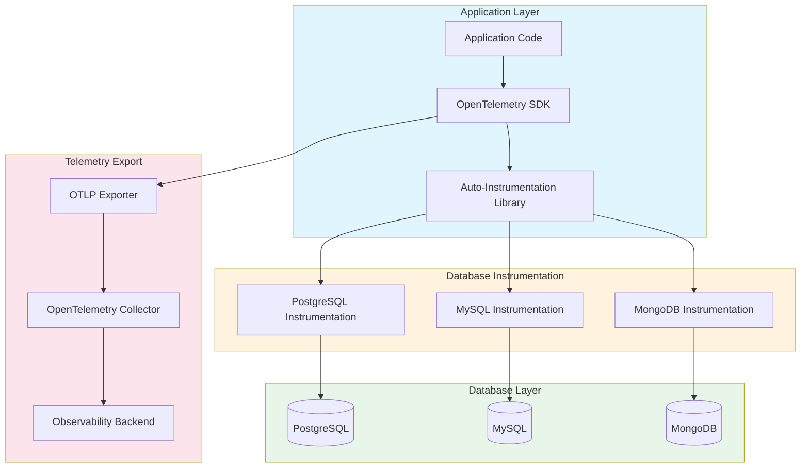
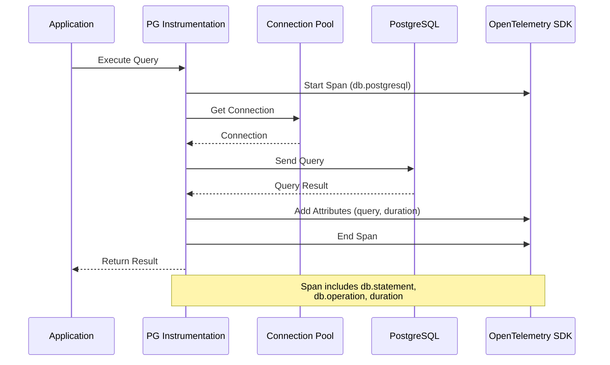
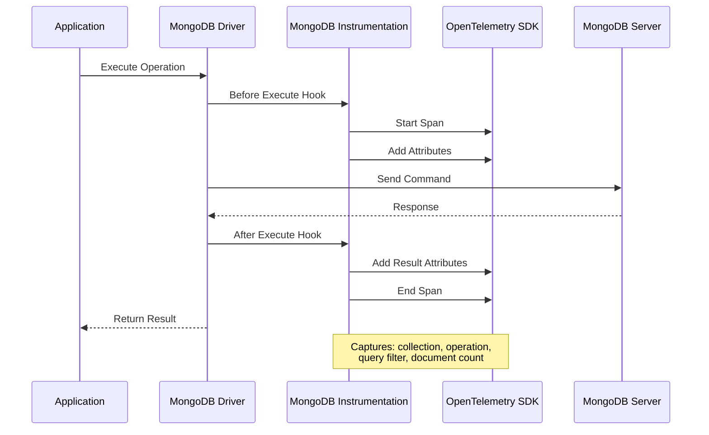
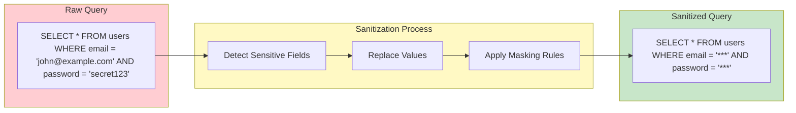

# How to Trace Database Queries with OpenTelemetry (PostgreSQL, MySQL, MongoDB)

Author: [nawazdhandala](https://github.com/nawazdhandala)

Tags: OpenTelemetry, Observability, Database, PostgreSQL, MySQL, MongoDB, Tracing

Description: A comprehensive guide to instrumenting database queries with OpenTelemetry for performance insights.

---

Database performance is often the hidden culprit behind slow applications. While application-level tracing tells you which endpoints are slow, database tracing reveals exactly which queries are causing bottlenecks. OpenTelemetry provides a standardized approach to instrument database operations across PostgreSQL, MySQL, and MongoDB, giving you deep visibility into query performance, connection pool behavior, and database latency.

In this comprehensive guide, you will learn how to instrument database queries using OpenTelemetry, implement query parameter sanitization for security, identify slow queries, and visualize the complete request flow from your application to the database.

## Table of Contents

1. [Understanding Database Tracing Architecture](#understanding-database-tracing-architecture)
2. [Setting Up OpenTelemetry for Database Tracing](#setting-up-opentelemetry-for-database-tracing)
3. [PostgreSQL Instrumentation](#postgresql-instrumentation)
4. [MySQL Instrumentation](#mysql-instrumentation)
5. [MongoDB Instrumentation](#mongodb-instrumentation)
6. [Query Parameter Sanitization](#query-parameter-sanitization)
7. [Identifying Slow Queries](#identifying-slow-queries)
8. [Best Practices and Production Tips](#best-practices-and-production-tips)

## Understanding Database Tracing Architecture

Before diving into implementation, let us understand how database tracing works within the OpenTelemetry ecosystem. The following diagram illustrates the flow of a traced database query:



The architecture consists of four main layers:

1. **Application Layer**: Your application code with the OpenTelemetry SDK and auto-instrumentation libraries
2. **Database Instrumentation**: Database-specific instrumentation libraries that capture query details
3. **Database Layer**: The actual database servers receiving queries
4. **Telemetry Export**: The pipeline that sends trace data to your observability backend

## Setting Up OpenTelemetry for Database Tracing

Let us start by setting up the foundational OpenTelemetry configuration that all database instrumentations will use.

The following code sets up the OpenTelemetry SDK with proper trace provider configuration. This is the foundation that all database instrumentations will build upon.

```javascript
// tracing.js - OpenTelemetry configuration file
// This file should be loaded before any other application code

const { NodeSDK } = require('@opentelemetry/sdk-node');
const { getNodeAutoInstrumentations } = require('@opentelemetry/auto-instrumentations-node');
const { OTLPTraceExporter } = require('@opentelemetry/exporter-trace-otlp-http');
const { Resource } = require('@opentelemetry/resources');
const { SemanticResourceAttributes } = require('@opentelemetry/semantic-conventions');
const { BatchSpanProcessor } = require('@opentelemetry/sdk-trace-base');

// Create the OTLP exporter to send traces to your collector
// The endpoint should point to your OpenTelemetry Collector or backend
const traceExporter = new OTLPTraceExporter({
  url: process.env.OTEL_EXPORTER_OTLP_ENDPOINT || 'http://localhost:4318/v1/traces',
  headers: {
    // Add authentication headers if required by your backend
    'Authorization': process.env.OTEL_AUTH_HEADER || '',
  },
});

// Configure the OpenTelemetry SDK with auto-instrumentation
// This automatically instruments supported libraries including database drivers
const sdk = new NodeSDK({
  // Define resource attributes to identify your service in traces
  resource: new Resource({
    [SemanticResourceAttributes.SERVICE_NAME]: process.env.SERVICE_NAME || 'my-application',
    [SemanticResourceAttributes.SERVICE_VERSION]: process.env.SERVICE_VERSION || '1.0.0',
    [SemanticResourceAttributes.DEPLOYMENT_ENVIRONMENT]: process.env.NODE_ENV || 'development',
  }),

  // Use batch processing to efficiently send spans to the collector
  // This reduces network overhead by batching multiple spans together
  spanProcessor: new BatchSpanProcessor(traceExporter, {
    // Maximum number of spans to batch before sending
    maxQueueSize: 2048,
    // Maximum time to wait before sending a batch
    scheduledDelayMillis: 5000,
    // Maximum number of spans per batch
    maxExportBatchSize: 512,
  }),

  // Enable auto-instrumentation for all supported libraries
  // This includes database drivers, HTTP clients, and more
  instrumentations: [
    getNodeAutoInstrumentations({
      // Enable enhanced database instrumentation with query details
      '@opentelemetry/instrumentation-pg': {
        enhancedDatabaseReporting: true,
      },
      '@opentelemetry/instrumentation-mysql': {
        enhancedDatabaseReporting: true,
      },
      '@opentelemetry/instrumentation-mongodb': {
        enhancedDatabaseReporting: true,
      },
    }),
  ],
});

// Start the SDK before your application loads
sdk.start();

// Ensure graceful shutdown to flush any pending traces
process.on('SIGTERM', () => {
  sdk.shutdown()
    .then(() => console.log('OpenTelemetry SDK shut down successfully'))
    .catch((error) => console.error('Error shutting down OpenTelemetry SDK', error))
    .finally(() => process.exit(0));
});

module.exports = sdk;
```

For Python applications, here is the equivalent setup. This configures the OpenTelemetry SDK with proper resource attributes and exports traces to your collector.

```python
# tracing.py - OpenTelemetry configuration for Python applications
# Import this module at the very beginning of your application

from opentelemetry import trace
from opentelemetry.sdk.trace import TracerProvider
from opentelemetry.sdk.trace.export import BatchSpanProcessor
from opentelemetry.exporter.otlp.proto.http.trace_exporter import OTLPSpanExporter
from opentelemetry.sdk.resources import Resource, SERVICE_NAME, SERVICE_VERSION
from opentelemetry.instrumentation.auto_instrumentation import sitecustomize
import os
import atexit

def configure_opentelemetry():
    """
    Configure OpenTelemetry with proper resource attributes and exporters.
    Call this function before importing any database libraries.
    """

    # Define resource attributes to identify your service
    # These attributes appear on every span and help filter traces
    resource = Resource.create({
        SERVICE_NAME: os.getenv("SERVICE_NAME", "my-python-app"),
        SERVICE_VERSION: os.getenv("SERVICE_VERSION", "1.0.0"),
        "deployment.environment": os.getenv("DEPLOYMENT_ENV", "development"),
    })

    # Create the tracer provider with the resource configuration
    provider = TracerProvider(resource=resource)

    # Configure the OTLP exporter to send traces to your collector
    # The endpoint should match your OpenTelemetry Collector configuration
    otlp_exporter = OTLPSpanExporter(
        endpoint=os.getenv("OTEL_EXPORTER_OTLP_ENDPOINT", "http://localhost:4318/v1/traces"),
        headers={
            "Authorization": os.getenv("OTEL_AUTH_HEADER", ""),
        },
    )

    # Use batch processing for efficient span export
    # This groups spans together to reduce network overhead
    span_processor = BatchSpanProcessor(
        otlp_exporter,
        max_queue_size=2048,
        schedule_delay_millis=5000,
        max_export_batch_size=512,
    )

    provider.add_span_processor(span_processor)

    # Set the global tracer provider
    trace.set_tracer_provider(provider)

    # Register shutdown handler to flush pending traces
    atexit.register(lambda: provider.shutdown())

    return provider

# Initialize OpenTelemetry when this module is imported
tracer_provider = configure_opentelemetry()

# Get a tracer for creating custom spans
tracer = trace.get_tracer(__name__)
```

## PostgreSQL Instrumentation

PostgreSQL is one of the most popular relational databases, and OpenTelemetry provides excellent instrumentation support for it. Let us look at how to trace PostgreSQL queries effectively.

The following diagram shows how a PostgreSQL query flows through the instrumentation layer:



### Node.js PostgreSQL Instrumentation

This example demonstrates comprehensive PostgreSQL instrumentation including connection pool tracing and query attribute capture.

```javascript
// database/postgres.js - PostgreSQL client with OpenTelemetry instrumentation
// Ensure tracing.js is imported before this file

const { Pool } = require('pg');
const { trace, SpanStatusCode, context } = require('@opentelemetry/api');

// Get a tracer for creating custom spans
// The tracer name helps identify the source of spans in your observability backend
const tracer = trace.getTracer('postgres-instrumentation', '1.0.0');

// Create a PostgreSQL connection pool with proper configuration
// Connection pooling is essential for production applications
const pool = new Pool({
  host: process.env.PG_HOST || 'localhost',
  port: parseInt(process.env.PG_PORT || '5432'),
  database: process.env.PG_DATABASE || 'myapp',
  user: process.env.PG_USER || 'postgres',
  password: process.env.PG_PASSWORD || 'password',

  // Pool configuration for optimal performance
  max: 20,                    // Maximum number of connections in pool
  idleTimeoutMillis: 30000,   // Close idle connections after 30 seconds
  connectionTimeoutMillis: 5000, // Timeout for acquiring a connection
});

// Log pool events for debugging connection issues
pool.on('connect', (client) => {
  console.log('PostgreSQL client connected');
});

pool.on('error', (err) => {
  console.error('Unexpected PostgreSQL pool error:', err);
});

/**
 * Execute a PostgreSQL query with comprehensive tracing
 *
 * @param {string} text - The SQL query string
 * @param {Array} params - Query parameters (for parameterized queries)
 * @returns {Promise<Object>} - Query result
 */
async function query(text, params = []) {
  // Start a new span for this database operation
  // The span will capture timing and attributes for the query
  return tracer.startActiveSpan('postgresql.query', async (span) => {
    try {
      // Add semantic database attributes following OpenTelemetry conventions
      // These attributes enable filtering and analysis in your observability tool
      span.setAttribute('db.system', 'postgresql');
      span.setAttribute('db.name', process.env.PG_DATABASE || 'myapp');
      span.setAttribute('db.user', process.env.PG_USER || 'postgres');
      span.setAttribute('db.connection_string', `${process.env.PG_HOST}:${process.env.PG_PORT}`);

      // Extract the SQL operation type (SELECT, INSERT, UPDATE, DELETE)
      // This helps categorize and filter queries by operation
      const operation = extractSqlOperation(text);
      span.setAttribute('db.operation', operation);

      // Store the sanitized SQL statement
      // Never log raw parameters that might contain sensitive data
      span.setAttribute('db.statement', sanitizeQuery(text, params));

      // Record the start time for accurate duration measurement
      const startTime = Date.now();

      // Execute the query using the connection pool
      const result = await pool.query(text, params);

      // Calculate and record the query duration
      const duration = Date.now() - startTime;
      span.setAttribute('db.query_duration_ms', duration);

      // Add result metadata for analysis
      span.setAttribute('db.rows_affected', result.rowCount || 0);

      // Flag slow queries for easy identification
      // Adjust the threshold based on your performance requirements
      if (duration > 100) {
        span.setAttribute('db.slow_query', true);
        span.addEvent('Slow query detected', {
          'duration_ms': duration,
          'threshold_ms': 100,
        });
      }

      // Mark the span as successful
      span.setStatus({ code: SpanStatusCode.OK });

      return result;

    } catch (error) {
      // Record the error details on the span
      // This helps with debugging and error analysis
      span.setStatus({
        code: SpanStatusCode.ERROR,
        message: error.message,
      });

      // Add error attributes for detailed analysis
      span.setAttribute('error.type', error.name);
      span.setAttribute('error.message', error.message);

      // Record the error as an event with stack trace
      span.recordException(error);

      throw error;

    } finally {
      // Always end the span to ensure it is exported
      span.end();
    }
  });
}

/**
 * Extract the SQL operation type from a query string
 *
 * @param {string} sql - The SQL query string
 * @returns {string} - The operation type (SELECT, INSERT, UPDATE, DELETE, or UNKNOWN)
 */
function extractSqlOperation(sql) {
  // Normalize the query by converting to uppercase and trimming whitespace
  const normalized = sql.trim().toUpperCase();

  // Match common SQL operations
  if (normalized.startsWith('SELECT')) return 'SELECT';
  if (normalized.startsWith('INSERT')) return 'INSERT';
  if (normalized.startsWith('UPDATE')) return 'UPDATE';
  if (normalized.startsWith('DELETE')) return 'DELETE';
  if (normalized.startsWith('CREATE')) return 'CREATE';
  if (normalized.startsWith('DROP')) return 'DROP';
  if (normalized.startsWith('ALTER')) return 'ALTER';
  if (normalized.startsWith('BEGIN')) return 'BEGIN';
  if (normalized.startsWith('COMMIT')) return 'COMMIT';
  if (normalized.startsWith('ROLLBACK')) return 'ROLLBACK';

  return 'UNKNOWN';
}

/**
 * Sanitize a SQL query by replacing parameter values with placeholders
 * This prevents sensitive data from appearing in traces
 *
 * @param {string} sql - The SQL query string
 * @param {Array} params - Query parameters
 * @returns {string} - Sanitized query string
 */
function sanitizeQuery(sql, params) {
  // For parameterized queries, the SQL already uses placeholders ($1, $2, etc.)
  // Just return the query with a note about the number of parameters
  if (params && params.length > 0) {
    return `${sql} [${params.length} parameters]`;
  }
  return sql;
}

/**
 * Execute a transaction with proper tracing
 * Transactions are wrapped in a parent span with child spans for each query
 *
 * @param {Function} callback - Async function receiving a client for queries
 * @returns {Promise<*>} - Result of the callback function
 */
async function transaction(callback) {
  return tracer.startActiveSpan('postgresql.transaction', async (span) => {
    // Get a dedicated client from the pool for the transaction
    const client = await pool.connect();

    try {
      span.setAttribute('db.system', 'postgresql');
      span.setAttribute('db.operation', 'TRANSACTION');

      // Start the transaction
      await client.query('BEGIN');
      span.addEvent('Transaction started');

      // Execute the callback with the client
      // The callback should use client.query() for all queries
      const result = await callback(client);

      // Commit the transaction
      await client.query('COMMIT');
      span.addEvent('Transaction committed');

      span.setStatus({ code: SpanStatusCode.OK });
      return result;

    } catch (error) {
      // Rollback on any error
      await client.query('ROLLBACK');
      span.addEvent('Transaction rolled back', {
        'error.message': error.message,
      });

      span.setStatus({
        code: SpanStatusCode.ERROR,
        message: error.message,
      });
      span.recordException(error);

      throw error;

    } finally {
      // Always release the client back to the pool
      client.release();
      span.end();
    }
  });
}

module.exports = {
  query,
  transaction,
  pool,
};
```

### Python PostgreSQL Instrumentation

For Python applications using psycopg2 or asyncpg, here is comprehensive instrumentation. This example uses psycopg2 with custom span creation.

```python
# database/postgres.py - PostgreSQL client with OpenTelemetry instrumentation

import psycopg2
from psycopg2 import pool
from opentelemetry import trace
from opentelemetry.trace import Status, StatusCode
from opentelemetry.semconv.trace import SpanAttributes
from contextlib import contextmanager
import os
import re
import time

# Get a tracer for creating custom spans
# The tracer name identifies the instrumentation in your observability backend
tracer = trace.get_tracer("postgres-instrumentation", "1.0.0")

# Create a thread-safe connection pool for PostgreSQL
# Connection pooling reduces overhead from establishing new connections
connection_pool = psycopg2.pool.ThreadedConnectionPool(
    minconn=5,    # Minimum connections to keep open
    maxconn=20,   # Maximum connections allowed
    host=os.getenv("PG_HOST", "localhost"),
    port=int(os.getenv("PG_PORT", "5432")),
    database=os.getenv("PG_DATABASE", "myapp"),
    user=os.getenv("PG_USER", "postgres"),
    password=os.getenv("PG_PASSWORD", "password"),
)


def extract_sql_operation(sql: str) -> str:
    """
    Extract the SQL operation type from a query string.

    Args:
        sql: The SQL query string

    Returns:
        The operation type (SELECT, INSERT, UPDATE, DELETE, or UNKNOWN)
    """
    # Normalize and extract the first word
    normalized = sql.strip().upper()

    # Map of prefixes to operation types
    operations = [
        "SELECT", "INSERT", "UPDATE", "DELETE",
        "CREATE", "DROP", "ALTER", "BEGIN", "COMMIT", "ROLLBACK"
    ]

    for op in operations:
        if normalized.startswith(op):
            return op

    return "UNKNOWN"


def sanitize_query(sql: str, params: tuple = None) -> str:
    """
    Sanitize a SQL query by indicating parameter count without exposing values.
    This prevents sensitive data from appearing in traces.

    Args:
        sql: The SQL query string
        params: Query parameters

    Returns:
        Sanitized query string with parameter count
    """
    if params:
        return f"{sql} [{len(params)} parameters]"
    return sql


def execute_query(sql: str, params: tuple = None, fetch: bool = True):
    """
    Execute a PostgreSQL query with comprehensive OpenTelemetry tracing.

    Args:
        sql: The SQL query to execute
        params: Optional tuple of query parameters
        fetch: Whether to fetch and return results (default True)

    Returns:
        Query results if fetch=True, otherwise the row count
    """
    # Start a span for this database operation
    with tracer.start_as_current_span("postgresql.query") as span:
        # Add semantic database attributes following OpenTelemetry conventions
        span.set_attribute("db.system", "postgresql")
        span.set_attribute("db.name", os.getenv("PG_DATABASE", "myapp"))
        span.set_attribute("db.user", os.getenv("PG_USER", "postgres"))

        # Extract and record the operation type
        operation = extract_sql_operation(sql)
        span.set_attribute("db.operation", operation)

        # Record the sanitized SQL statement (no sensitive parameter values)
        span.set_attribute("db.statement", sanitize_query(sql, params))

        # Get a connection from the pool
        conn = None
        cursor = None

        try:
            # Record the start time for duration measurement
            start_time = time.time()

            # Acquire a connection from the pool
            conn = connection_pool.getconn()
            cursor = conn.cursor()

            # Execute the query with parameters
            cursor.execute(sql, params)

            # Calculate query duration
            duration_ms = (time.time() - start_time) * 1000
            span.set_attribute("db.query_duration_ms", duration_ms)

            # Record rows affected
            span.set_attribute("db.rows_affected", cursor.rowcount)

            # Flag slow queries for easy identification in traces
            # Adjust threshold based on your performance requirements
            if duration_ms > 100:
                span.set_attribute("db.slow_query", True)
                span.add_event("Slow query detected", {
                    "duration_ms": duration_ms,
                    "threshold_ms": 100,
                })

            # Fetch results if requested
            if fetch and cursor.description:
                result = cursor.fetchall()
            else:
                result = cursor.rowcount

            # Commit the transaction for non-SELECT queries
            if operation != "SELECT":
                conn.commit()

            # Mark span as successful
            span.set_status(Status(StatusCode.OK))

            return result

        except Exception as e:
            # Record error details on the span
            span.set_status(Status(StatusCode.ERROR, str(e)))
            span.set_attribute("error.type", type(e).__name__)
            span.set_attribute("error.message", str(e))
            span.record_exception(e)

            # Rollback on error
            if conn:
                conn.rollback()

            raise

        finally:
            # Clean up resources
            if cursor:
                cursor.close()
            if conn:
                # Return connection to the pool
                connection_pool.putconn(conn)


@contextmanager
def transaction():
    """
    Context manager for executing multiple queries in a transaction.
    All queries within the context are wrapped in BEGIN/COMMIT or rolled back on error.

    Usage:
        with transaction() as execute:
            execute("INSERT INTO users (name) VALUES (%s)", ("John",))
            execute("INSERT INTO logs (message) VALUES (%s)", ("User created",))
    """
    # Start a parent span for the entire transaction
    with tracer.start_as_current_span("postgresql.transaction") as span:
        span.set_attribute("db.system", "postgresql")
        span.set_attribute("db.operation", "TRANSACTION")

        conn = None

        try:
            # Get a dedicated connection for the transaction
            conn = connection_pool.getconn()
            cursor = conn.cursor()

            # Start the transaction explicitly
            cursor.execute("BEGIN")
            span.add_event("Transaction started")

            def execute(sql: str, params: tuple = None):
                """Execute a query within the transaction."""
                # Create a child span for each query in the transaction
                with tracer.start_as_current_span("postgresql.query") as query_span:
                    query_span.set_attribute("db.operation", extract_sql_operation(sql))
                    query_span.set_attribute("db.statement", sanitize_query(sql, params))

                    start = time.time()
                    cursor.execute(sql, params)
                    duration = (time.time() - start) * 1000

                    query_span.set_attribute("db.query_duration_ms", duration)
                    query_span.set_attribute("db.rows_affected", cursor.rowcount)

                    return cursor

            # Yield the execute function to the context
            yield execute

            # Commit the transaction if no errors
            conn.commit()
            span.add_event("Transaction committed")
            span.set_status(Status(StatusCode.OK))

        except Exception as e:
            # Rollback on any error
            if conn:
                conn.rollback()

            span.add_event("Transaction rolled back", {"error.message": str(e)})
            span.set_status(Status(StatusCode.ERROR, str(e)))
            span.record_exception(e)

            raise

        finally:
            if conn:
                connection_pool.putconn(conn)
```

## MySQL Instrumentation

MySQL instrumentation follows similar patterns to PostgreSQL but with MySQL-specific considerations. Here is how to implement comprehensive MySQL tracing.

The following example demonstrates MySQL instrumentation in Node.js with connection pool tracing and prepared statement support.

```javascript
// database/mysql.js - MySQL client with OpenTelemetry instrumentation

const mysql = require('mysql2/promise');
const { trace, SpanStatusCode } = require('@opentelemetry/api');

// Get a tracer for MySQL operations
const tracer = trace.getTracer('mysql-instrumentation', '1.0.0');

// Create a MySQL connection pool
// Connection pooling is essential for handling concurrent requests efficiently
const pool = mysql.createPool({
  host: process.env.MYSQL_HOST || 'localhost',
  port: parseInt(process.env.MYSQL_PORT || '3306'),
  database: process.env.MYSQL_DATABASE || 'myapp',
  user: process.env.MYSQL_USER || 'root',
  password: process.env.MYSQL_PASSWORD || 'password',

  // Pool configuration
  connectionLimit: 20,        // Maximum connections in pool
  queueLimit: 0,              // Unlimited queued requests
  waitForConnections: true,   // Wait for available connection
  enableKeepAlive: true,      // Keep connections alive
  keepAliveInitialDelay: 10000, // Initial keepalive delay
});

/**
 * Extract the SQL operation type from a MySQL query
 *
 * @param {string} sql - The SQL query string
 * @returns {string} - The operation type
 */
function extractMySqlOperation(sql) {
  const normalized = sql.trim().toUpperCase();

  // Handle MySQL-specific operations
  const operations = [
    'SELECT', 'INSERT', 'UPDATE', 'DELETE', 'REPLACE',
    'CREATE', 'DROP', 'ALTER', 'TRUNCATE',
    'START TRANSACTION', 'BEGIN', 'COMMIT', 'ROLLBACK',
    'SHOW', 'DESCRIBE', 'EXPLAIN'
  ];

  for (const op of operations) {
    if (normalized.startsWith(op)) {
      return op.replace(' ', '_');
    }
  }

  return 'UNKNOWN';
}

/**
 * Sanitize MySQL query for safe logging
 * Replaces literal values with placeholders to prevent sensitive data exposure
 *
 * @param {string} sql - The SQL query string
 * @param {Array} params - Query parameters
 * @returns {string} - Sanitized query
 */
function sanitizeMySqlQuery(sql, params = []) {
  // For prepared statements, just indicate parameter count
  if (params && params.length > 0) {
    return `${sql} [${params.length} parameters]`;
  }

  // For raw queries, mask string literals and numbers
  // This is a basic sanitization - adjust based on your security requirements
  let sanitized = sql;

  // Replace string literals (both single and double quotes)
  sanitized = sanitized.replace(/'[^']*'/g, "'***'");
  sanitized = sanitized.replace(/"[^"]*"/g, '"***"');

  return sanitized;
}

/**
 * Execute a MySQL query with comprehensive OpenTelemetry tracing
 *
 * @param {string} sql - The SQL query to execute
 * @param {Array} params - Optional query parameters for prepared statements
 * @returns {Promise<Array>} - Query results
 */
async function query(sql, params = []) {
  return tracer.startActiveSpan('mysql.query', async (span) => {
    try {
      // Set semantic database attributes following OpenTelemetry conventions
      span.setAttribute('db.system', 'mysql');
      span.setAttribute('db.name', process.env.MYSQL_DATABASE || 'myapp');
      span.setAttribute('db.user', process.env.MYSQL_USER || 'root');
      span.setAttribute('db.connection_string',
        `${process.env.MYSQL_HOST}:${process.env.MYSQL_PORT}`);

      // Record the operation type and sanitized statement
      const operation = extractMySqlOperation(sql);
      span.setAttribute('db.operation', operation);
      span.setAttribute('db.statement', sanitizeMySqlQuery(sql, params));

      // Capture parameter count for debugging (never log actual values)
      span.setAttribute('db.parameter_count', params.length);

      // Record start time for duration calculation
      const startTime = Date.now();

      // Execute the query using the connection pool
      // mysql2/promise automatically handles connection acquisition and release
      const [rows, fields] = await pool.execute(sql, params);

      // Calculate and record duration
      const duration = Date.now() - startTime;
      span.setAttribute('db.query_duration_ms', duration);

      // Record result metadata
      if (Array.isArray(rows)) {
        span.setAttribute('db.rows_returned', rows.length);
      } else {
        // For INSERT, UPDATE, DELETE operations
        span.setAttribute('db.rows_affected', rows.affectedRows || 0);
        span.setAttribute('db.insert_id', rows.insertId || 0);
      }

      // Flag slow queries for monitoring and alerting
      const slowQueryThreshold = parseInt(process.env.SLOW_QUERY_THRESHOLD_MS || '100');
      if (duration > slowQueryThreshold) {
        span.setAttribute('db.slow_query', true);
        span.addEvent('Slow query detected', {
          'duration_ms': duration,
          'threshold_ms': slowQueryThreshold,
          'operation': operation,
        });
      }

      span.setStatus({ code: SpanStatusCode.OK });
      return [rows, fields];

    } catch (error) {
      // Capture MySQL-specific error details
      span.setStatus({
        code: SpanStatusCode.ERROR,
        message: error.message,
      });

      span.setAttribute('error.type', error.name);
      span.setAttribute('error.message', error.message);

      // MySQL-specific error codes are valuable for debugging
      if (error.code) {
        span.setAttribute('db.mysql.error_code', error.code);
      }
      if (error.errno) {
        span.setAttribute('db.mysql.error_number', error.errno);
      }
      if (error.sqlState) {
        span.setAttribute('db.mysql.sql_state', error.sqlState);
      }

      span.recordException(error);
      throw error;

    } finally {
      span.end();
    }
  });
}

/**
 * Execute multiple queries in a transaction with proper tracing
 *
 * @param {Function} callback - Async function receiving a connection for queries
 * @returns {Promise<*>} - Result of the callback
 */
async function transaction(callback) {
  return tracer.startActiveSpan('mysql.transaction', async (span) => {
    let connection;

    try {
      span.setAttribute('db.system', 'mysql');
      span.setAttribute('db.operation', 'TRANSACTION');

      // Get a dedicated connection for the transaction
      connection = await pool.getConnection();
      span.addEvent('Connection acquired from pool');

      // Start the transaction
      await connection.beginTransaction();
      span.addEvent('Transaction started');

      // Create a traced query function for use within the transaction
      const tracedQuery = async (sql, params = []) => {
        return tracer.startActiveSpan('mysql.query', async (querySpan) => {
          try {
            querySpan.setAttribute('db.operation', extractMySqlOperation(sql));
            querySpan.setAttribute('db.statement', sanitizeMySqlQuery(sql, params));

            const startTime = Date.now();
            const [rows, fields] = await connection.execute(sql, params);
            const duration = Date.now() - startTime;

            querySpan.setAttribute('db.query_duration_ms', duration);
            querySpan.setStatus({ code: SpanStatusCode.OK });

            return [rows, fields];

          } catch (error) {
            querySpan.setStatus({ code: SpanStatusCode.ERROR, message: error.message });
            querySpan.recordException(error);
            throw error;
          } finally {
            querySpan.end();
          }
        });
      };

      // Execute the callback with the traced query function
      const result = await callback(tracedQuery);

      // Commit the transaction
      await connection.commit();
      span.addEvent('Transaction committed');
      span.setStatus({ code: SpanStatusCode.OK });

      return result;

    } catch (error) {
      // Rollback on error
      if (connection) {
        await connection.rollback();
        span.addEvent('Transaction rolled back', { 'error.message': error.message });
      }

      span.setStatus({ code: SpanStatusCode.ERROR, message: error.message });
      span.recordException(error);
      throw error;

    } finally {
      // Release the connection back to the pool
      if (connection) {
        connection.release();
        span.addEvent('Connection released to pool');
      }
      span.end();
    }
  });
}

module.exports = {
  query,
  transaction,
  pool,
};
```

## MongoDB Instrumentation

MongoDB, being a document database, requires different instrumentation patterns than SQL databases. The following example shows comprehensive MongoDB tracing with support for various query types.

The flow of a MongoDB operation through the instrumentation layer:



Here is comprehensive MongoDB instrumentation for Node.js applications:

```javascript
// database/mongodb.js - MongoDB client with OpenTelemetry instrumentation

const { MongoClient, ObjectId } = require('mongodb');
const { trace, SpanStatusCode, context } = require('@opentelemetry/api');

// Get a tracer for MongoDB operations
const tracer = trace.getTracer('mongodb-instrumentation', '1.0.0');

// MongoDB connection configuration
const mongoUri = process.env.MONGODB_URI || 'mongodb://localhost:27017';
const dbName = process.env.MONGODB_DATABASE || 'myapp';

// Create the MongoDB client with connection pooling
// The driver handles connection pooling internally
const client = new MongoClient(mongoUri, {
  maxPoolSize: 50,           // Maximum connections in pool
  minPoolSize: 5,            // Minimum connections to maintain
  maxIdleTimeMS: 30000,      // Close idle connections after 30 seconds
  serverSelectionTimeoutMS: 5000, // Timeout for server selection
  socketTimeoutMS: 45000,    // Socket timeout for operations
});

// Track connection state
let isConnected = false;

/**
 * Connect to MongoDB with proper error handling
 *
 * @returns {Promise<Db>} - MongoDB database instance
 */
async function connect() {
  if (!isConnected) {
    await client.connect();
    isConnected = true;
    console.log('Connected to MongoDB');
  }
  return client.db(dbName);
}

/**
 * Sanitize MongoDB query/filter objects for safe logging
 * Replaces values with type indicators to prevent sensitive data exposure
 *
 * @param {Object} obj - The query or filter object
 * @param {number} depth - Current recursion depth
 * @returns {Object} - Sanitized object
 */
function sanitizeMongoQuery(obj, depth = 0) {
  // Prevent infinite recursion
  if (depth > 5) return '***DEPTH_LIMIT***';

  if (obj === null) return null;
  if (obj === undefined) return undefined;

  // Handle ObjectId specially
  if (obj instanceof ObjectId) {
    return '***ObjectId***';
  }

  // Handle arrays
  if (Array.isArray(obj)) {
    if (obj.length > 3) {
      return `[Array(${obj.length})]`;
    }
    return obj.map(item => sanitizeMongoQuery(item, depth + 1));
  }

  // Handle dates
  if (obj instanceof Date) {
    return '***Date***';
  }

  // Handle objects
  if (typeof obj === 'object') {
    const sanitized = {};
    for (const [key, value] of Object.entries(obj)) {
      // Keep MongoDB operators visible but sanitize their values
      if (key.startsWith('$')) {
        sanitized[key] = sanitizeMongoQuery(value, depth + 1);
      } else {
        // Replace field values with type indicators
        sanitized[key] = getTypeIndicator(value);
      }
    }
    return sanitized;
  }

  // For primitives, return type indicator
  return getTypeIndicator(obj);
}

/**
 * Get a type indicator string for a value
 *
 * @param {*} value - The value to analyze
 * @returns {string} - Type indicator string
 */
function getTypeIndicator(value) {
  if (value === null) return 'null';
  if (value === undefined) return 'undefined';
  if (typeof value === 'string') return '***string***';
  if (typeof value === 'number') return '***number***';
  if (typeof value === 'boolean') return '***boolean***';
  if (value instanceof ObjectId) return '***ObjectId***';
  if (value instanceof Date) return '***Date***';
  if (Array.isArray(value)) return `***Array(${value.length})***`;
  if (typeof value === 'object') return '***object***';
  return '***unknown***';
}

/**
 * Create a traced MongoDB collection wrapper
 * All operations on this collection will be automatically traced
 *
 * @param {string} collectionName - Name of the MongoDB collection
 * @returns {Object} - Traced collection wrapper
 */
function collection(collectionName) {
  const getCollection = async () => {
    const db = await connect();
    return db.collection(collectionName);
  };

  return {
    /**
     * Find documents in the collection with tracing
     *
     * @param {Object} filter - Query filter
     * @param {Object} options - Query options
     * @returns {Promise<Array>} - Matching documents
     */
    async find(filter = {}, options = {}) {
      return tracer.startActiveSpan('mongodb.find', async (span) => {
        try {
          setCommonAttributes(span, collectionName, 'find');

          // Record sanitized filter for debugging
          span.setAttribute('db.mongodb.filter',
            JSON.stringify(sanitizeMongoQuery(filter)));

          if (options.limit) {
            span.setAttribute('db.mongodb.limit', options.limit);
          }
          if (options.skip) {
            span.setAttribute('db.mongodb.skip', options.skip);
          }

          const startTime = Date.now();
          const col = await getCollection();
          const cursor = col.find(filter, options);
          const documents = await cursor.toArray();
          const duration = Date.now() - startTime;

          span.setAttribute('db.query_duration_ms', duration);
          span.setAttribute('db.mongodb.documents_returned', documents.length);

          checkSlowQuery(span, duration);
          span.setStatus({ code: SpanStatusCode.OK });

          return documents;

        } catch (error) {
          handleError(span, error);
          throw error;
        } finally {
          span.end();
        }
      });
    },

    /**
     * Find a single document with tracing
     *
     * @param {Object} filter - Query filter
     * @param {Object} options - Query options
     * @returns {Promise<Object|null>} - Matching document or null
     */
    async findOne(filter = {}, options = {}) {
      return tracer.startActiveSpan('mongodb.findOne', async (span) => {
        try {
          setCommonAttributes(span, collectionName, 'findOne');
          span.setAttribute('db.mongodb.filter',
            JSON.stringify(sanitizeMongoQuery(filter)));

          const startTime = Date.now();
          const col = await getCollection();
          const document = await col.findOne(filter, options);
          const duration = Date.now() - startTime;

          span.setAttribute('db.query_duration_ms', duration);
          span.setAttribute('db.mongodb.document_found', document !== null);

          checkSlowQuery(span, duration);
          span.setStatus({ code: SpanStatusCode.OK });

          return document;

        } catch (error) {
          handleError(span, error);
          throw error;
        } finally {
          span.end();
        }
      });
    },

    /**
     * Insert a single document with tracing
     *
     * @param {Object} document - Document to insert
     * @param {Object} options - Insert options
     * @returns {Promise<Object>} - Insert result
     */
    async insertOne(document, options = {}) {
      return tracer.startActiveSpan('mongodb.insertOne', async (span) => {
        try {
          setCommonAttributes(span, collectionName, 'insertOne');

          // Log document structure without actual values
          span.setAttribute('db.mongodb.document_keys',
            Object.keys(document).join(', '));

          const startTime = Date.now();
          const col = await getCollection();
          const result = await col.insertOne(document, options);
          const duration = Date.now() - startTime;

          span.setAttribute('db.query_duration_ms', duration);
          span.setAttribute('db.mongodb.acknowledged', result.acknowledged);
          span.setAttribute('db.mongodb.inserted_id',
            result.insertedId?.toString() || '');

          checkSlowQuery(span, duration);
          span.setStatus({ code: SpanStatusCode.OK });

          return result;

        } catch (error) {
          handleError(span, error);
          throw error;
        } finally {
          span.end();
        }
      });
    },

    /**
     * Insert multiple documents with tracing
     *
     * @param {Array} documents - Documents to insert
     * @param {Object} options - Insert options
     * @returns {Promise<Object>} - Insert result
     */
    async insertMany(documents, options = {}) {
      return tracer.startActiveSpan('mongodb.insertMany', async (span) => {
        try {
          setCommonAttributes(span, collectionName, 'insertMany');
          span.setAttribute('db.mongodb.document_count', documents.length);

          const startTime = Date.now();
          const col = await getCollection();
          const result = await col.insertMany(documents, options);
          const duration = Date.now() - startTime;

          span.setAttribute('db.query_duration_ms', duration);
          span.setAttribute('db.mongodb.acknowledged', result.acknowledged);
          span.setAttribute('db.mongodb.inserted_count', result.insertedCount);

          checkSlowQuery(span, duration);
          span.setStatus({ code: SpanStatusCode.OK });

          return result;

        } catch (error) {
          handleError(span, error);
          throw error;
        } finally {
          span.end();
        }
      });
    },

    /**
     * Update a single document with tracing
     *
     * @param {Object} filter - Query filter
     * @param {Object} update - Update operations
     * @param {Object} options - Update options
     * @returns {Promise<Object>} - Update result
     */
    async updateOne(filter, update, options = {}) {
      return tracer.startActiveSpan('mongodb.updateOne', async (span) => {
        try {
          setCommonAttributes(span, collectionName, 'updateOne');
          span.setAttribute('db.mongodb.filter',
            JSON.stringify(sanitizeMongoQuery(filter)));
          span.setAttribute('db.mongodb.update_operators',
            Object.keys(update).filter(k => k.startsWith('$')).join(', '));

          const startTime = Date.now();
          const col = await getCollection();
          const result = await col.updateOne(filter, update, options);
          const duration = Date.now() - startTime;

          span.setAttribute('db.query_duration_ms', duration);
          span.setAttribute('db.mongodb.matched_count', result.matchedCount);
          span.setAttribute('db.mongodb.modified_count', result.modifiedCount);
          span.setAttribute('db.mongodb.upserted', result.upsertedCount > 0);

          checkSlowQuery(span, duration);
          span.setStatus({ code: SpanStatusCode.OK });

          return result;

        } catch (error) {
          handleError(span, error);
          throw error;
        } finally {
          span.end();
        }
      });
    },

    /**
     * Update multiple documents with tracing
     *
     * @param {Object} filter - Query filter
     * @param {Object} update - Update operations
     * @param {Object} options - Update options
     * @returns {Promise<Object>} - Update result
     */
    async updateMany(filter, update, options = {}) {
      return tracer.startActiveSpan('mongodb.updateMany', async (span) => {
        try {
          setCommonAttributes(span, collectionName, 'updateMany');
          span.setAttribute('db.mongodb.filter',
            JSON.stringify(sanitizeMongoQuery(filter)));
          span.setAttribute('db.mongodb.update_operators',
            Object.keys(update).filter(k => k.startsWith('$')).join(', '));

          const startTime = Date.now();
          const col = await getCollection();
          const result = await col.updateMany(filter, update, options);
          const duration = Date.now() - startTime;

          span.setAttribute('db.query_duration_ms', duration);
          span.setAttribute('db.mongodb.matched_count', result.matchedCount);
          span.setAttribute('db.mongodb.modified_count', result.modifiedCount);

          checkSlowQuery(span, duration);
          span.setStatus({ code: SpanStatusCode.OK });

          return result;

        } catch (error) {
          handleError(span, error);
          throw error;
        } finally {
          span.end();
        }
      });
    },

    /**
     * Delete a single document with tracing
     *
     * @param {Object} filter - Query filter
     * @param {Object} options - Delete options
     * @returns {Promise<Object>} - Delete result
     */
    async deleteOne(filter, options = {}) {
      return tracer.startActiveSpan('mongodb.deleteOne', async (span) => {
        try {
          setCommonAttributes(span, collectionName, 'deleteOne');
          span.setAttribute('db.mongodb.filter',
            JSON.stringify(sanitizeMongoQuery(filter)));

          const startTime = Date.now();
          const col = await getCollection();
          const result = await col.deleteOne(filter, options);
          const duration = Date.now() - startTime;

          span.setAttribute('db.query_duration_ms', duration);
          span.setAttribute('db.mongodb.deleted_count', result.deletedCount);

          checkSlowQuery(span, duration);
          span.setStatus({ code: SpanStatusCode.OK });

          return result;

        } catch (error) {
          handleError(span, error);
          throw error;
        } finally {
          span.end();
        }
      });
    },

    /**
     * Execute an aggregation pipeline with tracing
     *
     * @param {Array} pipeline - Aggregation pipeline stages
     * @param {Object} options - Aggregation options
     * @returns {Promise<Array>} - Aggregation results
     */
    async aggregate(pipeline, options = {}) {
      return tracer.startActiveSpan('mongodb.aggregate', async (span) => {
        try {
          setCommonAttributes(span, collectionName, 'aggregate');

          // Log pipeline stage types without values
          const stageTypes = pipeline.map(stage => Object.keys(stage)[0]);
          span.setAttribute('db.mongodb.pipeline_stages', stageTypes.join(' -> '));
          span.setAttribute('db.mongodb.pipeline_length', pipeline.length);

          const startTime = Date.now();
          const col = await getCollection();
          const cursor = col.aggregate(pipeline, options);
          const results = await cursor.toArray();
          const duration = Date.now() - startTime;

          span.setAttribute('db.query_duration_ms', duration);
          span.setAttribute('db.mongodb.documents_returned', results.length);

          checkSlowQuery(span, duration);
          span.setStatus({ code: SpanStatusCode.OK });

          return results;

        } catch (error) {
          handleError(span, error);
          throw error;
        } finally {
          span.end();
        }
      });
    },
  };
}

/**
 * Set common span attributes for all MongoDB operations
 *
 * @param {Span} span - The current span
 * @param {string} collectionName - Collection being operated on
 * @param {string} operation - Operation type
 */
function setCommonAttributes(span, collectionName, operation) {
  span.setAttribute('db.system', 'mongodb');
  span.setAttribute('db.name', dbName);
  span.setAttribute('db.mongodb.collection', collectionName);
  span.setAttribute('db.operation', operation);
  span.setAttribute('db.connection_string', sanitizeConnectionString(mongoUri));
}

/**
 * Sanitize connection string to remove credentials
 *
 * @param {string} uri - MongoDB connection URI
 * @returns {string} - Sanitized URI
 */
function sanitizeConnectionString(uri) {
  try {
    const url = new URL(uri);
    url.password = '***';
    return url.toString();
  } catch {
    return '***connection_string***';
  }
}

/**
 * Check if query is slow and add appropriate attributes/events
 *
 * @param {Span} span - The current span
 * @param {number} duration - Query duration in milliseconds
 */
function checkSlowQuery(span, duration) {
  const threshold = parseInt(process.env.SLOW_QUERY_THRESHOLD_MS || '100');
  if (duration > threshold) {
    span.setAttribute('db.slow_query', true);
    span.addEvent('Slow query detected', {
      'duration_ms': duration,
      'threshold_ms': threshold,
    });
  }
}

/**
 * Handle errors by setting appropriate span attributes
 *
 * @param {Span} span - The current span
 * @param {Error} error - The error that occurred
 */
function handleError(span, error) {
  span.setStatus({
    code: SpanStatusCode.ERROR,
    message: error.message,
  });

  span.setAttribute('error.type', error.name);
  span.setAttribute('error.message', error.message);

  // MongoDB-specific error details
  if (error.code) {
    span.setAttribute('db.mongodb.error_code', error.code);
  }
  if (error.codeName) {
    span.setAttribute('db.mongodb.error_code_name', error.codeName);
  }

  span.recordException(error);
}

/**
 * Close the MongoDB connection
 * Should be called during application shutdown
 */
async function close() {
  if (isConnected) {
    await client.close();
    isConnected = false;
    console.log('MongoDB connection closed');
  }
}

module.exports = {
  collection,
  connect,
  close,
  client,
};
```

## Query Parameter Sanitization

Security is paramount when tracing database queries. You must ensure that sensitive data like passwords, personal information, and API keys are never logged in traces. Here is a comprehensive approach to query sanitization.

The following diagram illustrates the sanitization process:



Here is a comprehensive sanitization utility that handles multiple database types:

```javascript
// utils/query-sanitizer.js - Comprehensive query sanitization utility

/**
 * Configuration for sensitive field detection and sanitization
 */
const SANITIZATION_CONFIG = {
  // Field names that should always have their values masked
  sensitiveFields: [
    'password', 'passwd', 'pwd', 'secret',
    'token', 'api_key', 'apikey', 'auth',
    'credit_card', 'creditcard', 'card_number',
    'ssn', 'social_security', 'tax_id',
    'pin', 'cvv', 'cvc',
    'private_key', 'privatekey',
  ],

  // Patterns for detecting sensitive values (PII)
  sensitivePatterns: [
    // Email addresses
    /\b[A-Za-z0-9._%+-]+@[A-Za-z0-9.-]+\.[A-Z|a-z]{2,}\b/g,
    // Phone numbers (various formats)
    /\b\d{3}[-.]?\d{3}[-.]?\d{4}\b/g,
    // Credit card numbers
    /\b\d{4}[-\s]?\d{4}[-\s]?\d{4}[-\s]?\d{4}\b/g,
    // SSN
    /\b\d{3}[-]?\d{2}[-]?\d{4}\b/g,
    // IP addresses
    /\b\d{1,3}\.\d{1,3}\.\d{1,3}\.\d{1,3}\b/g,
  ],

  // Replacement text for masked values
  maskText: '***REDACTED***',
};

/**
 * SQL Query Sanitizer Class
 * Handles sanitization for PostgreSQL and MySQL queries
 */
class SqlQuerySanitizer {
  constructor(config = SANITIZATION_CONFIG) {
    this.config = config;

    // Build regex for sensitive field detection in SQL
    // This pattern matches field = 'value' or field = value
    this.fieldPatterns = this.config.sensitiveFields.map(field => ({
      // Match: field_name = 'value' or field_name = "value"
      pattern: new RegExp(
        `(\\b${field}\\b\\s*[=:]\\s*)('[^']*'|"[^"]*"|\\S+)`,
        'gi'
      ),
      replacement: `$1'${this.config.maskText}'`,
    }));
  }

  /**
   * Sanitize a SQL query string
   * Replaces sensitive field values and detects PII patterns
   *
   * @param {string} sql - The raw SQL query
   * @param {Array} params - Query parameters (for parameterized queries)
   * @returns {string} - Sanitized query safe for logging
   */
  sanitize(sql, params = []) {
    let sanitized = sql;

    // Step 1: Replace sensitive field values
    for (const { pattern, replacement } of this.fieldPatterns) {
      sanitized = sanitized.replace(pattern, replacement);
    }

    // Step 2: Replace string literals that match sensitive patterns
    sanitized = this.maskSensitivePatterns(sanitized);

    // Step 3: Handle parameterized queries
    if (params && params.length > 0) {
      // Don't include actual parameter values, just the count
      sanitized = `${sanitized} [${params.length} bound parameters]`;
    }

    return sanitized;
  }

  /**
   * Mask values matching sensitive patterns (emails, phone numbers, etc.)
   *
   * @param {string} sql - SQL query to process
   * @returns {string} - Query with sensitive patterns masked
   */
  maskSensitivePatterns(sql) {
    let result = sql;

    for (const pattern of this.config.sensitivePatterns) {
      result = result.replace(pattern, this.config.maskText);
    }

    return result;
  }

  /**
   * Extract SQL operation type for categorization
   *
   * @param {string} sql - SQL query
   * @returns {string} - Operation type
   */
  extractOperation(sql) {
    const normalized = sql.trim().toUpperCase();
    const operations = [
      'SELECT', 'INSERT', 'UPDATE', 'DELETE', 'CREATE',
      'DROP', 'ALTER', 'TRUNCATE', 'BEGIN', 'COMMIT', 'ROLLBACK',
    ];

    for (const op of operations) {
      if (normalized.startsWith(op)) return op;
    }
    return 'UNKNOWN';
  }
}

/**
 * MongoDB Query Sanitizer Class
 * Handles sanitization for MongoDB query documents
 */
class MongoQuerySanitizer {
  constructor(config = SANITIZATION_CONFIG) {
    this.config = config;
    this.sensitiveFieldSet = new Set(
      this.config.sensitiveFields.map(f => f.toLowerCase())
    );
  }

  /**
   * Sanitize a MongoDB query/filter object
   *
   * @param {Object} query - The MongoDB query object
   * @param {number} maxDepth - Maximum recursion depth
   * @returns {Object} - Sanitized query object
   */
  sanitize(query, maxDepth = 10) {
    return this.sanitizeObject(query, 0, maxDepth);
  }

  /**
   * Recursively sanitize an object
   *
   * @param {*} obj - Object to sanitize
   * @param {number} depth - Current depth
   * @param {number} maxDepth - Maximum depth
   * @returns {*} - Sanitized object
   */
  sanitizeObject(obj, depth, maxDepth) {
    // Prevent stack overflow from circular references
    if (depth > maxDepth) {
      return '***MAX_DEPTH_EXCEEDED***';
    }

    // Handle null/undefined
    if (obj === null || obj === undefined) {
      return obj;
    }

    // Handle primitives
    if (typeof obj !== 'object') {
      return this.sanitizeValue(obj);
    }

    // Handle arrays
    if (Array.isArray(obj)) {
      // For large arrays, just indicate size
      if (obj.length > 5) {
        return `[Array of ${obj.length} items]`;
      }
      return obj.map(item => this.sanitizeObject(item, depth + 1, maxDepth));
    }

    // Handle Date objects
    if (obj instanceof Date) {
      return '***DATE***';
    }

    // Handle ObjectId
    if (obj.constructor && obj.constructor.name === 'ObjectId') {
      return '***ObjectId***';
    }

    // Handle regular objects
    const sanitized = {};
    for (const [key, value] of Object.entries(obj)) {
      // MongoDB operators start with $ - keep the operator, sanitize the value
      if (key.startsWith('$')) {
        sanitized[key] = this.sanitizeObject(value, depth + 1, maxDepth);
      } else if (this.isSensitiveField(key)) {
        // Mask sensitive field values completely
        sanitized[key] = this.config.maskText;
      } else {
        // For non-sensitive fields, show type but not value
        sanitized[key] = this.getTypeIndicator(value);
      }
    }

    return sanitized;
  }

  /**
   * Check if a field name is sensitive
   *
   * @param {string} fieldName - Field name to check
   * @returns {boolean} - True if sensitive
   */
  isSensitiveField(fieldName) {
    return this.sensitiveFieldSet.has(fieldName.toLowerCase());
  }

  /**
   * Get a type indicator for a value
   *
   * @param {*} value - Value to analyze
   * @returns {string} - Type indicator
   */
  getTypeIndicator(value) {
    if (value === null) return '<null>';
    if (value === undefined) return '<undefined>';
    if (typeof value === 'string') return '<string>';
    if (typeof value === 'number') return '<number>';
    if (typeof value === 'boolean') return '<boolean>';
    if (value instanceof Date) return '<Date>';
    if (Array.isArray(value)) return `<Array[${value.length}]>`;
    if (typeof value === 'object') return '<object>';
    return '<unknown>';
  }

  /**
   * Sanitize a primitive value
   *
   * @param {*} value - Value to sanitize
   * @returns {string} - Type indicator
   */
  sanitizeValue(value) {
    // Check if string matches sensitive patterns
    if (typeof value === 'string') {
      for (const pattern of this.config.sensitivePatterns) {
        if (pattern.test(value)) {
          return this.config.maskText;
        }
      }
      return '<string>';
    }
    return this.getTypeIndicator(value);
  }

  /**
   * Convert sanitized query to a loggable string
   *
   * @param {Object} query - Query object to stringify
   * @returns {string} - JSON string representation
   */
  toLogString(query) {
    const sanitized = this.sanitize(query);
    return JSON.stringify(sanitized);
  }
}

/**
 * Factory function to create appropriate sanitizer
 *
 * @param {string} dbType - Database type ('sql', 'mongodb')
 * @param {Object} config - Optional custom configuration
 * @returns {SqlQuerySanitizer|MongoQuerySanitizer} - Appropriate sanitizer
 */
function createSanitizer(dbType, config = SANITIZATION_CONFIG) {
  switch (dbType.toLowerCase()) {
    case 'sql':
    case 'postgresql':
    case 'mysql':
      return new SqlQuerySanitizer(config);
    case 'mongodb':
    case 'mongo':
      return new MongoQuerySanitizer(config);
    default:
      throw new Error(`Unsupported database type: ${dbType}`);
  }
}

module.exports = {
  SqlQuerySanitizer,
  MongoQuerySanitizer,
  createSanitizer,
  SANITIZATION_CONFIG,
};
```

Usage examples for the sanitizers:

```javascript
// Example usage of query sanitizers

const { createSanitizer } = require('./utils/query-sanitizer');

// SQL Sanitization Example
const sqlSanitizer = createSanitizer('sql');

const rawQuery = `
  SELECT * FROM users
  WHERE email = 'john.doe@example.com'
  AND password = 'supersecret123'
  AND phone = '555-123-4567'
`;

const sanitizedSql = sqlSanitizer.sanitize(rawQuery);
console.log('Sanitized SQL:', sanitizedSql);
// Output: SELECT * FROM users WHERE email = '***REDACTED***'
//         AND password = '***REDACTED***' AND phone = '***REDACTED***'

// MongoDB Sanitization Example
const mongoSanitizer = createSanitizer('mongodb');

const mongoQuery = {
  email: 'john.doe@example.com',
  password: 'supersecret123',
  $and: [
    { status: 'active' },
    { age: { $gte: 18 } },
  ],
};

const sanitizedMongo = mongoSanitizer.toLogString(mongoQuery);
console.log('Sanitized MongoDB:', sanitizedMongo);
// Output: {"email":"***REDACTED***","password":"***REDACTED***",
//          "$and":[{"status":"<string>"},{"age":{"$gte":"<number>"}}]}
```

## Identifying Slow Queries

Identifying and alerting on slow queries is crucial for maintaining database performance. Here is a comprehensive approach to slow query detection and analysis.

The following example demonstrates a slow query detector that integrates with OpenTelemetry:

```javascript
// utils/slow-query-detector.js - Slow query detection and analysis

const { trace, metrics } = require('@opentelemetry/api');

// Get meter for recording metrics
const meter = metrics.getMeter('database-metrics', '1.0.0');

// Create histogram for query duration distribution
const queryDurationHistogram = meter.createHistogram('db.query.duration', {
  description: 'Distribution of database query durations',
  unit: 'ms',
});

// Create counter for slow queries
const slowQueryCounter = meter.createCounter('db.query.slow', {
  description: 'Count of slow database queries',
});

/**
 * Slow Query Detector Configuration
 */
const DEFAULT_CONFIG = {
  // Threshold in milliseconds for a query to be considered slow
  slowThresholdMs: 100,

  // Threshold for a query to be considered very slow (critical)
  criticalThresholdMs: 1000,

  // Whether to log slow queries to console
  logSlowQueries: true,

  // Whether to capture query execution plans for slow queries
  captureExplainPlan: false,

  // Callback for slow query alerts
  onSlowQuery: null,

  // Callback for critical slow query alerts
  onCriticalQuery: null,
};

/**
 * Slow Query Detector Class
 * Monitors query performance and generates alerts for slow queries
 */
class SlowQueryDetector {
  constructor(config = {}) {
    this.config = { ...DEFAULT_CONFIG, ...config };
    this.tracer = trace.getTracer('slow-query-detector', '1.0.0');

    // Track query statistics
    this.stats = {
      totalQueries: 0,
      slowQueries: 0,
      criticalQueries: 0,
      averageDuration: 0,
      maxDuration: 0,
      // Rolling window of recent query durations
      recentDurations: [],
    };
  }

  /**
   * Analyze a completed query and detect if it's slow
   *
   * @param {Object} queryInfo - Information about the query
   * @param {string} queryInfo.database - Database type
   * @param {string} queryInfo.operation - Query operation type
   * @param {string} queryInfo.statement - Sanitized query statement
   * @param {number} queryInfo.duration - Query duration in ms
   * @param {Span} queryInfo.span - OpenTelemetry span for the query
   * @returns {Object} - Analysis result
   */
  analyze(queryInfo) {
    const { database, operation, statement, duration, span } = queryInfo;

    // Update statistics
    this.updateStats(duration);

    // Record duration in histogram
    queryDurationHistogram.record(duration, {
      'db.system': database,
      'db.operation': operation,
    });

    // Determine severity level
    const severity = this.getSeverity(duration);

    if (severity !== 'normal') {
      // Increment slow query counter
      slowQueryCounter.add(1, {
        'db.system': database,
        'db.operation': operation,
        'severity': severity,
      });

      // Add attributes to the span
      if (span) {
        span.setAttribute('db.slow_query', true);
        span.setAttribute('db.slow_query_severity', severity);
        span.addEvent('Slow query detected', {
          'duration_ms': duration,
          'threshold_ms': this.config.slowThresholdMs,
          'severity': severity,
        });
      }

      // Create detailed analysis
      const analysis = this.createAnalysis(queryInfo, severity);

      // Log if configured
      if (this.config.logSlowQueries) {
        this.logSlowQuery(analysis);
      }

      // Trigger callbacks
      this.triggerCallbacks(analysis, severity);

      return analysis;
    }

    return { severity: 'normal', duration };
  }

  /**
   * Get severity level based on duration
   *
   * @param {number} duration - Query duration in ms
   * @returns {string} - Severity level
   */
  getSeverity(duration) {
    if (duration >= this.config.criticalThresholdMs) {
      return 'critical';
    } else if (duration >= this.config.slowThresholdMs) {
      return 'slow';
    }
    return 'normal';
  }

  /**
   * Create detailed analysis for a slow query
   *
   * @param {Object} queryInfo - Query information
   * @param {string} severity - Severity level
   * @returns {Object} - Analysis result
   */
  createAnalysis(queryInfo, severity) {
    const { database, operation, statement, duration } = queryInfo;

    // Calculate percentile based on recent queries
    const percentile = this.calculatePercentile(duration);

    return {
      timestamp: new Date().toISOString(),
      severity,
      database,
      operation,
      statement,
      duration,
      threshold: this.config.slowThresholdMs,
      exceedsThresholdBy: duration - this.config.slowThresholdMs,
      percentile,
      recommendations: this.generateRecommendations(queryInfo),
      stats: {
        totalQueries: this.stats.totalQueries,
        slowQueryRate: this.stats.slowQueries / this.stats.totalQueries,
        averageDuration: this.stats.averageDuration,
      },
    };
  }

  /**
   * Generate recommendations for optimizing a slow query
   *
   * @param {Object} queryInfo - Query information
   * @returns {Array} - List of recommendations
   */
  generateRecommendations(queryInfo) {
    const { database, operation, statement, duration } = queryInfo;
    const recommendations = [];

    // Check for common issues
    if (operation === 'SELECT') {
      recommendations.push('Consider adding indexes for frequently queried columns');
      recommendations.push('Review the query execution plan using EXPLAIN ANALYZE');

      if (statement.toLowerCase().includes('select *')) {
        recommendations.push('Avoid SELECT *; specify only needed columns');
      }

      if (!statement.toLowerCase().includes('limit')) {
        recommendations.push('Consider adding LIMIT clause to restrict result set');
      }
    }

    if (operation === 'UPDATE' || operation === 'DELETE') {
      recommendations.push('Ensure WHERE clause uses indexed columns');
      recommendations.push('Consider batching large updates/deletes');
    }

    if (duration > 1000) {
      recommendations.push('Consider query caching for frequently executed queries');
      recommendations.push('Review database connection pool configuration');
    }

    return recommendations;
  }

  /**
   * Update internal statistics with new query duration
   *
   * @param {number} duration - Query duration
   */
  updateStats(duration) {
    this.stats.totalQueries++;

    if (duration >= this.config.slowThresholdMs) {
      this.stats.slowQueries++;
    }

    if (duration >= this.config.criticalThresholdMs) {
      this.stats.criticalQueries++;
    }

    // Update max duration
    if (duration > this.stats.maxDuration) {
      this.stats.maxDuration = duration;
    }

    // Update rolling average
    this.stats.recentDurations.push(duration);
    if (this.stats.recentDurations.length > 100) {
      this.stats.recentDurations.shift();
    }

    this.stats.averageDuration = this.stats.recentDurations.reduce((a, b) => a + b, 0)
      / this.stats.recentDurations.length;
  }

  /**
   * Calculate what percentile a duration falls into
   *
   * @param {number} duration - Query duration
   * @returns {number} - Percentile (0-100)
   */
  calculatePercentile(duration) {
    if (this.stats.recentDurations.length < 10) {
      return null; // Not enough data
    }

    const sorted = [...this.stats.recentDurations].sort((a, b) => a - b);
    const index = sorted.findIndex(d => d >= duration);

    if (index === -1) {
      return 100;
    }

    return Math.round((index / sorted.length) * 100);
  }

  /**
   * Log slow query details
   *
   * @param {Object} analysis - Analysis result
   */
  logSlowQuery(analysis) {
    const emoji = analysis.severity === 'critical' ? '[CRITICAL]' : '[SLOW]';
    console.warn(`${emoji} Database Query Alert:
  Database: ${analysis.database}
  Operation: ${analysis.operation}
  Duration: ${analysis.duration}ms (threshold: ${analysis.threshold}ms)
  Statement: ${analysis.statement}
  Recommendations:
${analysis.recommendations.map(r => `    - ${r}`).join('\n')}
`);
  }

  /**
   * Trigger configured callbacks for slow queries
   *
   * @param {Object} analysis - Analysis result
   * @param {string} severity - Severity level
   */
  triggerCallbacks(analysis, severity) {
    if (severity === 'critical' && this.config.onCriticalQuery) {
      this.config.onCriticalQuery(analysis);
    } else if (this.config.onSlowQuery) {
      this.config.onSlowQuery(analysis);
    }
  }

  /**
   * Get current statistics
   *
   * @returns {Object} - Current statistics
   */
  getStats() {
    return { ...this.stats };
  }

  /**
   * Reset statistics
   */
  resetStats() {
    this.stats = {
      totalQueries: 0,
      slowQueries: 0,
      criticalQueries: 0,
      averageDuration: 0,
      maxDuration: 0,
      recentDurations: [],
    };
  }
}

/**
 * Create a middleware/wrapper for automatic slow query detection
 *
 * @param {Object} config - Detector configuration
 * @returns {Function} - Wrapper function for database queries
 */
function createSlowQueryMiddleware(config = {}) {
  const detector = new SlowQueryDetector(config);

  return function wrapQuery(queryFn, database, operation) {
    return async function wrappedQuery(...args) {
      const startTime = Date.now();

      try {
        const result = await queryFn(...args);
        const duration = Date.now() - startTime;

        // Analyze the query
        detector.analyze({
          database,
          operation,
          statement: args[0] || 'unknown',
          duration,
          span: trace.getActiveSpan(),
        });

        return result;
      } catch (error) {
        const duration = Date.now() - startTime;

        // Still analyze failed queries for performance insights
        detector.analyze({
          database,
          operation,
          statement: args[0] || 'unknown',
          duration,
          span: trace.getActiveSpan(),
        });

        throw error;
      }
    };
  };
}

module.exports = {
  SlowQueryDetector,
  createSlowQueryMiddleware,
  DEFAULT_CONFIG,
};
```

## Best Practices and Production Tips

When deploying database tracing to production, follow these best practices to ensure optimal performance and security.

### 1. Use Sampling for High-Volume Applications

For applications with high query volumes, implement sampling to reduce trace volume while maintaining visibility:

```javascript
// Configure trace sampling for high-volume production environments
// This example uses parent-based sampling with a ratio sampler

const { NodeSDK } = require('@opentelemetry/sdk-node');
const {
  ParentBasedSampler,
  TraceIdRatioBasedSampler
} = require('@opentelemetry/sdk-trace-base');

// Create a sampler that samples 10% of traces
// Adjust the ratio based on your volume and observability needs
const sampler = new ParentBasedSampler({
  // Root spans are sampled at 10%
  root: new TraceIdRatioBasedSampler(0.1),
  // Child spans follow their parent's sampling decision
  // This ensures complete traces when sampled
});

const sdk = new NodeSDK({
  sampler,
  // ... other configuration
});
```

### 2. Implement Connection Pool Monitoring

Monitor connection pool health alongside query performance:

```javascript
// Monitor database connection pool metrics
// This helps identify connection exhaustion issues

const { metrics } = require('@opentelemetry/api');

const meter = metrics.getMeter('db-pool-metrics', '1.0.0');

// Create observable gauges for pool metrics
const poolSizeGauge = meter.createObservableGauge('db.pool.size', {
  description: 'Current number of connections in the pool',
});

const poolActiveGauge = meter.createObservableGauge('db.pool.active', {
  description: 'Number of active connections',
});

const poolIdleGauge = meter.createObservableGauge('db.pool.idle', {
  description: 'Number of idle connections',
});

const poolWaitingGauge = meter.createObservableGauge('db.pool.waiting', {
  description: 'Number of requests waiting for a connection',
});

// Register callbacks to collect pool metrics
// The exact implementation depends on your database driver

function registerPoolMetrics(pool, database) {
  poolSizeGauge.addCallback((observableResult) => {
    observableResult.observe(pool.totalCount || 0, {
      'db.system': database,
    });
  });

  poolActiveGauge.addCallback((observableResult) => {
    observableResult.observe(pool.activeCount || 0, {
      'db.system': database,
    });
  });

  poolIdleGauge.addCallback((observableResult) => {
    observableResult.observe(pool.idleCount || 0, {
      'db.system': database,
    });
  });

  poolWaitingGauge.addCallback((observableResult) => {
    observableResult.observe(pool.waitingCount || 0, {
      'db.system': database,
    });
  });
}
```

### 3. Configure Span Attributes for Effective Filtering

Use consistent semantic conventions for span attributes to enable powerful filtering and analysis:

```javascript
// Standard span attributes for database operations
// Following OpenTelemetry semantic conventions

const DB_ATTRIBUTES = {
  // Required attributes
  SYSTEM: 'db.system',           // postgresql, mysql, mongodb
  NAME: 'db.name',               // Database name
  OPERATION: 'db.operation',     // SELECT, INSERT, UPDATE, DELETE
  STATEMENT: 'db.statement',     // Sanitized query

  // Recommended attributes
  USER: 'db.user',               // Database user
  CONNECTION_STRING: 'db.connection_string', // Sanitized connection string

  // Custom attributes for enhanced analysis
  DURATION_MS: 'db.query_duration_ms',
  ROWS_AFFECTED: 'db.rows_affected',
  SLOW_QUERY: 'db.slow_query',
  POOL_NAME: 'db.pool.name',

  // Error attributes
  ERROR_TYPE: 'error.type',
  ERROR_MESSAGE: 'error.message',
  ERROR_CODE: 'db.error_code',
};

// Helper function to set standard attributes
function setDatabaseAttributes(span, config) {
  span.setAttribute(DB_ATTRIBUTES.SYSTEM, config.system);
  span.setAttribute(DB_ATTRIBUTES.NAME, config.database);
  span.setAttribute(DB_ATTRIBUTES.OPERATION, config.operation);
  span.setAttribute(DB_ATTRIBUTES.STATEMENT, config.statement);

  if (config.user) {
    span.setAttribute(DB_ATTRIBUTES.USER, config.user);
  }

  if (config.duration) {
    span.setAttribute(DB_ATTRIBUTES.DURATION_MS, config.duration);
  }
}
```

### 4. Handle Trace Context Propagation in Distributed Systems

Ensure trace context flows correctly across service boundaries:

```javascript
// Trace context propagation for database operations
// This ensures database spans are connected to the overall request trace

const { context, propagation, trace } = require('@opentelemetry/api');

// When calling other services that access the same database,
// propagate the trace context

async function callDatabaseService(operation, data) {
  const tracer = trace.getTracer('my-service');

  return tracer.startActiveSpan('database-service-call', async (span) => {
    // Create headers with trace context
    const headers = {};
    propagation.inject(context.active(), headers);

    // Include trace context in your database operation
    // This helps correlate distributed database operations
    const result = await fetch('http://database-service/query', {
      method: 'POST',
      headers: {
        'Content-Type': 'application/json',
        ...headers, // Inject trace context headers
      },
      body: JSON.stringify({ operation, data }),
    });

    span.end();
    return result.json();
  });
}
```

### 5. Production Checklist

Before deploying database tracing to production, verify the following:

```markdown
## Database Tracing Production Checklist

### Security
- [ ] All query parameters are sanitized before logging
- [ ] Sensitive fields (passwords, tokens, PII) are never logged
- [ ] Connection strings are sanitized (no credentials in traces)
- [ ] Trace data is transmitted over secure channels (TLS)

### Performance
- [ ] Sampling is configured appropriately for your volume
- [ ] Batch span processing is enabled
- [ ] Connection pool monitoring is in place
- [ ] Slow query thresholds are defined

### Observability
- [ ] Service name and version are set in resource attributes
- [ ] Environment (staging/production) is tagged
- [ ] All database types are instrumented consistently
- [ ] Alerts are configured for slow queries

### Reliability
- [ ] Graceful shutdown flushes pending traces
- [ ] Error handling doesn't disrupt application flow
- [ ] Fallback behavior when collector is unavailable
- [ ] Trace context propagates correctly in distributed systems
```

## Conclusion

Database tracing with OpenTelemetry provides invaluable insights into your application's data layer performance. By implementing comprehensive instrumentation for PostgreSQL, MySQL, and MongoDB, you gain the ability to:

1. **Identify Performance Bottlenecks**: Quickly find slow queries that impact user experience
2. **Debug Production Issues**: Trace request flows from frontend to database and back
3. **Optimize Database Usage**: Understand query patterns and optimize accordingly
4. **Maintain Security**: Use proper sanitization to protect sensitive data in traces

The key to successful database tracing is balancing visibility with performance overhead. Use sampling for high-volume applications, implement proper sanitization from the start, and leverage the semantic conventions that OpenTelemetry provides for consistent analysis across different database technologies.

Remember that tracing is just one pillar of observability. Combine it with metrics for aggregate performance data and logs for detailed debugging to build a complete picture of your database performance.

## Further Reading

- [OpenTelemetry Database Semantic Conventions](https://opentelemetry.io/docs/specs/semconv/database/)
- [OpenTelemetry Node.js Instrumentation](https://opentelemetry.io/docs/languages/js/instrumentation/)
- [OpenTelemetry Python Instrumentation](https://opentelemetry.io/docs/languages/python/instrumentation/)
- [PostgreSQL EXPLAIN Documentation](https://www.postgresql.org/docs/current/sql-explain.html)
- [MySQL Query Optimization](https://dev.mysql.com/doc/refman/8.0/en/optimization.html)
- [MongoDB Performance Best Practices](https://www.mongodb.com/docs/manual/administration/analyzing-mongodb-performance/)
