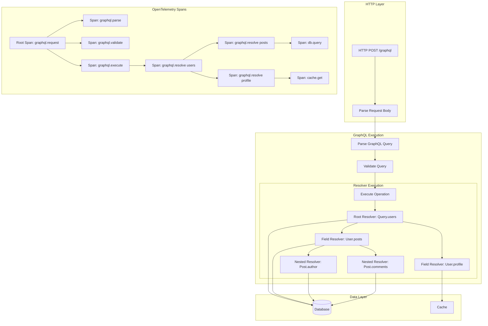
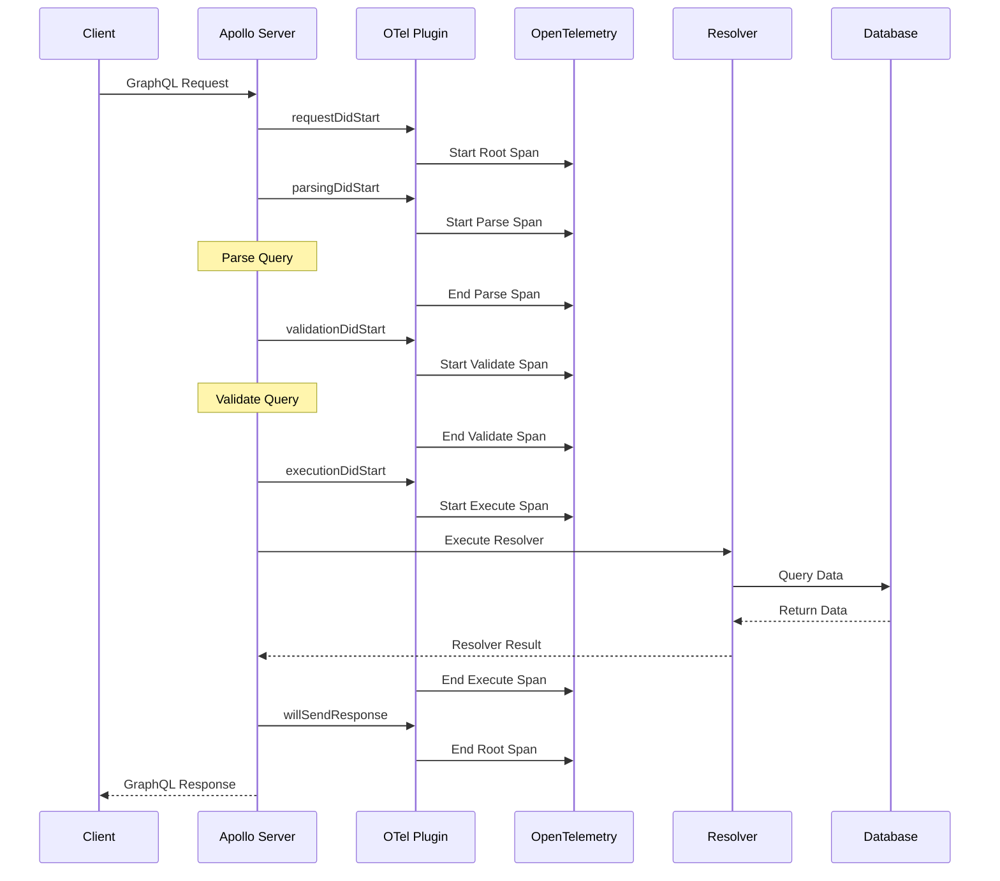
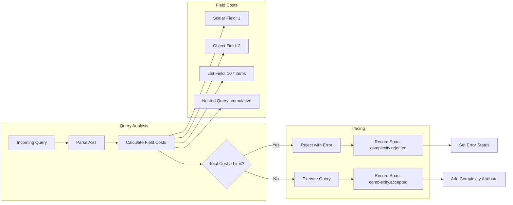
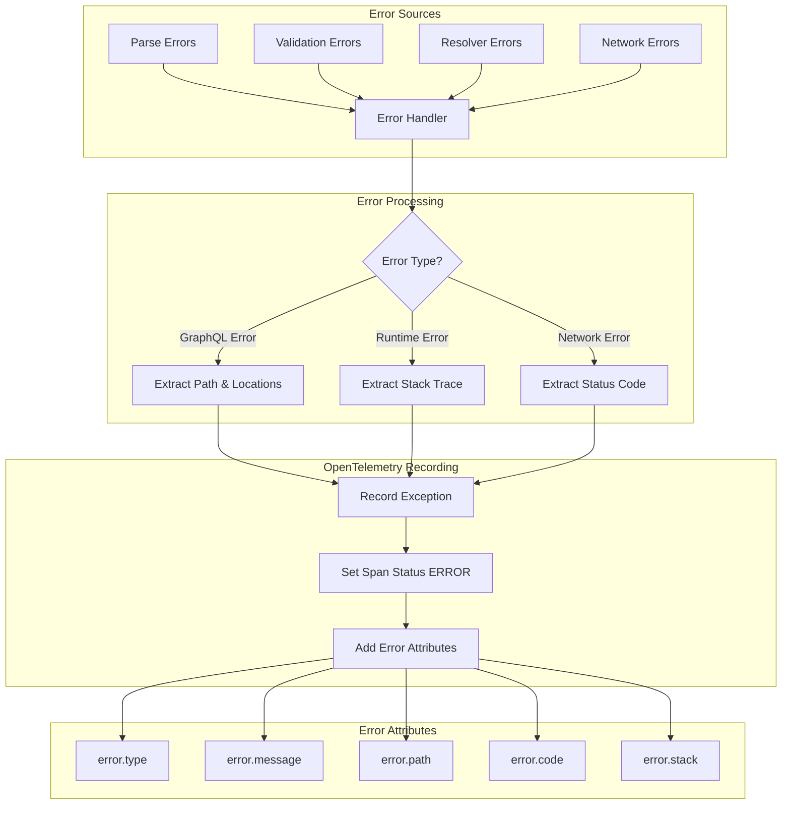
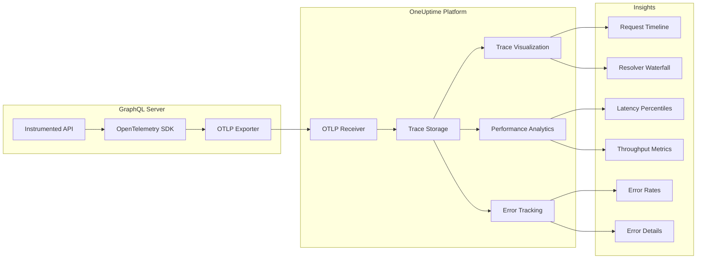

# How to Instrument GraphQL APIs with OpenTelemetry

Author: [nawazdhandala](https://github.com/nawazdhandala)

Tags: OpenTelemetry, GraphQL, API, Tracing, Observability, Performance

Description: A guide to adding OpenTelemetry instrumentation to GraphQL servers for query performance insights.

---

GraphQL APIs present unique observability challenges. Unlike REST endpoints where each URL corresponds to a specific operation, GraphQL uses a single endpoint for all queries and mutations. This makes traditional HTTP-based monitoring insufficient for understanding query performance, resolver bottlenecks, and error patterns. OpenTelemetry provides the instrumentation capabilities needed to gain deep visibility into GraphQL execution.

This guide covers instrumenting GraphQL servers using Apollo Server and GraphQL Yoga with OpenTelemetry, including resolver-level tracing, query complexity tracking, and comprehensive error handling.

## Understanding GraphQL Tracing Architecture

Before diving into implementation, let's understand how OpenTelemetry traces flow through a GraphQL request lifecycle.

The following diagram illustrates the trace structure for a typical GraphQL query:



Each GraphQL request creates a trace with multiple spans representing different phases of execution. This hierarchical structure helps identify exactly where time is spent and where errors occur.

## Setting Up the OpenTelemetry SDK

First, we need to configure the OpenTelemetry SDK with the necessary instrumentation packages. This setup forms the foundation for all GraphQL tracing.

Install the required dependencies for a Node.js environment:

```bash
# Core OpenTelemetry packages for SDK initialization and tracing
npm install @opentelemetry/sdk-node \
            @opentelemetry/api \
            @opentelemetry/sdk-trace-node \
            @opentelemetry/exporter-trace-otlp-http \
            @opentelemetry/resources \
            @opentelemetry/semantic-conventions

# GraphQL-specific instrumentation package
npm install @opentelemetry/instrumentation-graphql

# HTTP instrumentation to capture the transport layer
npm install @opentelemetry/instrumentation-http
```

Create a tracing initialization file that must be loaded before your application starts. This ensures all GraphQL operations are captured from the beginning:

```typescript
// tracing.ts
// This file initializes OpenTelemetry and MUST be imported before any other modules
// to ensure all GraphQL operations are properly instrumented

import { NodeSDK } from '@opentelemetry/sdk-node';
import { OTLPTraceExporter } from '@opentelemetry/exporter-trace-otlp-http';
import { Resource } from '@opentelemetry/resources';
import {
  SEMRESATTRS_SERVICE_NAME,
  SEMRESATTRS_SERVICE_VERSION,
  SEMRESATTRS_DEPLOYMENT_ENVIRONMENT
} from '@opentelemetry/semantic-conventions';
import { GraphQLInstrumentation } from '@opentelemetry/instrumentation-graphql';
import { HttpInstrumentation } from '@opentelemetry/instrumentation-http';

// Configure the OTLP exporter to send traces to your observability backend
// OneUptime, Jaeger, or any OTLP-compatible collector can receive these traces
const traceExporter = new OTLPTraceExporter({
  // The endpoint where your OpenTelemetry collector is running
  url: process.env.OTEL_EXPORTER_OTLP_ENDPOINT || 'http://localhost:4318/v1/traces',
  // Optional: Add authentication headers for production environments
  headers: {
    'x-oneuptime-token': process.env.ONEUPTIME_TOKEN || '',
  },
});

// Define resource attributes that identify this service in traces
// These attributes appear on every span and help filter/group traces
const resource = new Resource({
  [SEMRESATTRS_SERVICE_NAME]: 'graphql-api-service',
  [SEMRESATTRS_SERVICE_VERSION]: '1.0.0',
  [SEMRESATTRS_DEPLOYMENT_ENVIRONMENT]: process.env.NODE_ENV || 'development',
});

// Initialize the OpenTelemetry SDK with GraphQL-specific instrumentation
const sdk = new NodeSDK({
  resource,
  traceExporter,
  instrumentations: [
    // HTTP instrumentation captures the transport layer of GraphQL requests
    new HttpInstrumentation({
      // Optionally filter which HTTP requests to trace
      ignoreIncomingRequestHook: (request) => {
        // Ignore health check endpoints to reduce noise
        return request.url === '/health' || request.url === '/ready';
      },
    }),

    // GraphQL instrumentation provides detailed resolver-level tracing
    new GraphQLInstrumentation({
      // Capture the full GraphQL query in span attributes
      // Disable in production if queries contain sensitive data
      allowValues: true,

      // Set the depth of nested resolver tracing
      // Higher values provide more detail but increase overhead
      depth: 10,

      // Merge items with the same name to reduce span count
      // Useful for queries that resolve many items of the same type
      mergeItems: false,

      // Ignore trivial resolvers that just return scalar fields
      // This reduces noise from field-level resolvers
      ignoreTrivialResolveSpans: true,
    }),
  ],
});

// Start the SDK - this must complete before the application processes requests
sdk.start();

// Gracefully shut down the SDK when the process exits
// This ensures all pending traces are flushed to the backend
process.on('SIGTERM', () => {
  sdk
    .shutdown()
    .then(() => console.log('OpenTelemetry SDK shut down successfully'))
    .catch((error) => console.error('Error shutting down OpenTelemetry SDK', error))
    .finally(() => process.exit(0));
});

console.log('OpenTelemetry tracing initialized for GraphQL API');
```

## Instrumenting Apollo Server

Apollo Server is one of the most popular GraphQL server implementations. We'll add comprehensive instrumentation using Apollo's plugin system combined with OpenTelemetry.

The following diagram shows how Apollo Server plugins integrate with OpenTelemetry:



Here's a complete Apollo Server implementation with OpenTelemetry instrumentation:

```typescript
// apollo-server.ts
// Import tracing first to ensure instrumentation is active before Apollo loads
import './tracing';

import { ApolloServer } from '@apollo/server';
import { expressMiddleware } from '@apollo/server/express4';
import { ApolloServerPluginDrainHttpServer } from '@apollo/server/plugin/drainHttpServer';
import express from 'express';
import http from 'http';
import cors from 'cors';
import { trace, SpanStatusCode, context, SpanKind } from '@opentelemetry/api';

// Get the tracer instance for creating custom spans
// The tracer name helps identify spans created by this component
const tracer = trace.getTracer('graphql-apollo-server', '1.0.0');

// Define your GraphQL schema
// In production, this would typically be loaded from .graphql files
const typeDefs = `#graphql
  type User {
    id: ID!
    name: String!
    email: String!
    posts: [Post!]!
    profile: Profile
  }

  type Post {
    id: ID!
    title: String!
    content: String!
    author: User!
    comments: [Comment!]!
    createdAt: String!
  }

  type Comment {
    id: ID!
    text: String!
    author: User!
  }

  type Profile {
    bio: String
    avatar: String
    website: String
  }

  type Query {
    users: [User!]!
    user(id: ID!): User
    posts(limit: Int, offset: Int): [Post!]!
    post(id: ID!): Post
  }

  type Mutation {
    createPost(title: String!, content: String!): Post!
    updatePost(id: ID!, title: String, content: String): Post
    deletePost(id: ID!): Boolean!
  }
`;

// Helper function to simulate database operations with tracing
// In production, replace with actual database calls
async function simulateDbQuery<T>(
  operation: string,
  collection: string,
  queryFn: () => Promise<T>
): Promise<T> {
  // Create a span for the database operation
  // This allows you to see database latency in your traces
  return tracer.startActiveSpan(
    `db.${operation}`,
    {
      kind: SpanKind.CLIENT,
      attributes: {
        'db.system': 'postgresql',
        'db.operation': operation,
        'db.collection': collection,
      },
    },
    async (span) => {
      try {
        const result = await queryFn();
        span.setStatus({ code: SpanStatusCode.OK });
        return result;
      } catch (error) {
        span.setStatus({
          code: SpanStatusCode.ERROR,
          message: error instanceof Error ? error.message : 'Unknown error',
        });
        span.recordException(error as Error);
        throw error;
      } finally {
        span.end();
      }
    }
  );
}

// Define resolvers with built-in tracing for custom operations
const resolvers = {
  Query: {
    // The users resolver demonstrates tracing a database query
    users: async (_parent: unknown, _args: unknown, contextValue: any) => {
      return simulateDbQuery('findMany', 'users', async () => {
        // Simulate database latency
        await new Promise((resolve) => setTimeout(resolve, 50));
        return [
          { id: '1', name: 'Alice', email: 'alice@example.com' },
          { id: '2', name: 'Bob', email: 'bob@example.com' },
        ];
      });
    },

    // The user resolver shows parameter tracing
    user: async (_parent: unknown, args: { id: string }, contextValue: any) => {
      // Get the current span to add custom attributes
      const currentSpan = trace.getActiveSpan();
      if (currentSpan) {
        // Add the user ID as a span attribute for debugging
        currentSpan.setAttribute('graphql.user.id', args.id);
      }

      return simulateDbQuery('findUnique', 'users', async () => {
        await new Promise((resolve) => setTimeout(resolve, 30));
        if (args.id === '1') {
          return { id: '1', name: 'Alice', email: 'alice@example.com' };
        }
        return null;
      });
    },

    // The posts resolver shows pagination tracing
    posts: async (
      _parent: unknown,
      args: { limit?: number; offset?: number },
      contextValue: any
    ) => {
      const currentSpan = trace.getActiveSpan();
      if (currentSpan) {
        // Track pagination parameters for performance analysis
        currentSpan.setAttribute('graphql.posts.limit', args.limit || 10);
        currentSpan.setAttribute('graphql.posts.offset', args.offset || 0);
      }

      return simulateDbQuery('findMany', 'posts', async () => {
        await new Promise((resolve) => setTimeout(resolve, 40));
        return [
          {
            id: '1',
            title: 'First Post',
            content: 'Content here',
            authorId: '1',
            createdAt: new Date().toISOString(),
          },
        ];
      });
    },
  },

  // Field resolvers for nested data
  User: {
    // This resolver is called for each user when posts are requested
    posts: async (parent: { id: string }) => {
      return simulateDbQuery('findMany', 'posts', async () => {
        await new Promise((resolve) => setTimeout(resolve, 20));
        return [
          {
            id: '1',
            title: 'User Post',
            content: 'Content',
            authorId: parent.id,
            createdAt: new Date().toISOString(),
          },
        ];
      });
    },

    profile: async (parent: { id: string }) => {
      return simulateDbQuery('findUnique', 'profiles', async () => {
        await new Promise((resolve) => setTimeout(resolve, 15));
        return { bio: 'A developer', avatar: 'https://example.com/avatar.png' };
      });
    },
  },

  Post: {
    author: async (parent: { authorId: string }) => {
      return simulateDbQuery('findUnique', 'users', async () => {
        await new Promise((resolve) => setTimeout(resolve, 10));
        return { id: parent.authorId, name: 'Alice', email: 'alice@example.com' };
      });
    },

    comments: async (parent: { id: string }) => {
      return simulateDbQuery('findMany', 'comments', async () => {
        await new Promise((resolve) => setTimeout(resolve, 25));
        return [{ id: '1', text: 'Great post!', authorId: '2' }];
      });
    },
  },

  Mutation: {
    createPost: async (
      _parent: unknown,
      args: { title: string; content: string },
      contextValue: any
    ) => {
      const currentSpan = trace.getActiveSpan();
      if (currentSpan) {
        // Mark this as a write operation for analysis
        currentSpan.setAttribute('graphql.mutation.type', 'create');
        currentSpan.setAttribute('graphql.mutation.entity', 'post');
      }

      return simulateDbQuery('create', 'posts', async () => {
        await new Promise((resolve) => setTimeout(resolve, 60));
        return {
          id: '999',
          title: args.title,
          content: args.content,
          authorId: '1',
          createdAt: new Date().toISOString(),
        };
      });
    },
  },
};

// Custom Apollo Server plugin for enhanced OpenTelemetry integration
// This plugin adds detailed timing and context to GraphQL traces
const openTelemetryPlugin = {
  // Called at the start of each GraphQL request
  async requestDidStart(requestContext: any) {
    const span = trace.getActiveSpan();

    // Add the operation name to the span for easy identification
    if (span && requestContext.request.operationName) {
      span.updateName(`graphql.${requestContext.request.operationName}`);
      span.setAttribute('graphql.operation.name', requestContext.request.operationName);
    }

    // Track the query document for debugging (be careful with sensitive data)
    if (span && requestContext.request.query) {
      // Only store the first 1000 characters to avoid huge spans
      const truncatedQuery = requestContext.request.query.substring(0, 1000);
      span.setAttribute('graphql.query', truncatedQuery);
    }

    return {
      // Track parsing phase
      async parsingDidStart() {
        return async (err?: Error) => {
          if (err && span) {
            span.recordException(err);
            span.setAttribute('graphql.parse.error', true);
          }
        };
      },

      // Track validation phase
      async validationDidStart() {
        return async (errs?: readonly Error[]) => {
          if (errs && errs.length > 0 && span) {
            errs.forEach((err) => span.recordException(err));
            span.setAttribute('graphql.validation.error.count', errs.length);
          }
        };
      },

      // Track execution phase and capture operation details
      async executionDidStart() {
        return {
          // Called when execution completes with potential errors
          async executionDidEnd(err?: Error) {
            if (err && span) {
              span.recordException(err);
              span.setStatus({
                code: SpanStatusCode.ERROR,
                message: err.message,
              });
            }
          },
        };
      },

      // Capture errors from the response
      async willSendResponse(context: any) {
        if (span && context.response.body?.singleResult?.errors) {
          const errors = context.response.body.singleResult.errors;
          span.setAttribute('graphql.error.count', errors.length);

          // Record each GraphQL error
          errors.forEach((error: any, index: number) => {
            span.setAttribute(`graphql.error.${index}.message`, error.message);
            if (error.path) {
              span.setAttribute(`graphql.error.${index}.path`, error.path.join('.'));
            }
          });
        }
      },
    };
  },
};

// Initialize and start the Apollo Server
async function startServer() {
  const app = express();
  const httpServer = http.createServer(app);

  const server = new ApolloServer({
    typeDefs,
    resolvers,
    plugins: [
      // Properly drain the HTTP server on shutdown
      ApolloServerPluginDrainHttpServer({ httpServer }),
      // Our custom OpenTelemetry plugin
      openTelemetryPlugin,
    ],
  });

  await server.start();

  // Apply middleware with CORS and JSON parsing
  app.use(
    '/graphql',
    cors<cors.CorsRequest>(),
    express.json(),
    expressMiddleware(server, {
      // Pass request context to resolvers
      context: async ({ req }) => ({
        // You can add authentication, dataloaders, etc. here
        userId: req.headers['x-user-id'],
      }),
    })
  );

  const PORT = process.env.PORT || 4000;
  await new Promise<void>((resolve) => httpServer.listen({ port: PORT }, resolve));
  console.log(`Apollo Server running at http://localhost:${PORT}/graphql`);
}

startServer().catch(console.error);
```

## Instrumenting GraphQL Yoga

GraphQL Yoga is a modern, batteries-included GraphQL server. It provides excellent plugin support for OpenTelemetry integration.

Install Yoga-specific dependencies:

```bash
# GraphQL Yoga and related packages
npm install graphql-yoga graphql

# Yoga's built-in OpenTelemetry plugin
npm install @graphql-yoga/plugin-opentelemetry
```

Here's a complete GraphQL Yoga implementation with OpenTelemetry:

```typescript
// yoga-server.ts
// Import tracing initialization first
import './tracing';

import { createServer } from 'node:http';
import { createYoga, createSchema, Plugin } from 'graphql-yoga';
import { useOpenTelemetry } from '@graphql-yoga/plugin-opentelemetry';
import { trace, SpanStatusCode, context as otelContext, SpanKind } from '@opentelemetry/api';

// Get tracer for custom spans
const tracer = trace.getTracer('graphql-yoga-server', '1.0.0');

// Define the GraphQL schema using Yoga's schema builder
const schema = createSchema({
  typeDefs: /* GraphQL */ `
    type User {
      id: ID!
      name: String!
      email: String!
      posts: [Post!]!
    }

    type Post {
      id: ID!
      title: String!
      content: String!
      author: User!
      viewCount: Int!
    }

    type Query {
      users: [User!]!
      user(id: ID!): User
      posts(limit: Int): [Post!]!
      searchPosts(query: String!): [Post!]!
    }

    type Mutation {
      createUser(name: String!, email: String!): User!
      createPost(title: String!, content: String!, authorId: ID!): Post!
    }

    type Subscription {
      postCreated: Post!
    }
  `,
  resolvers: {
    Query: {
      users: async () => {
        // Create a child span for the database query
        return tracer.startActiveSpan('db.query.users', async (span) => {
          try {
            // Simulate database query
            await new Promise((r) => setTimeout(r, 50));
            const users = [
              { id: '1', name: 'Alice', email: 'alice@example.com' },
              { id: '2', name: 'Bob', email: 'bob@example.com' },
            ];
            span.setAttribute('db.result.count', users.length);
            span.setStatus({ code: SpanStatusCode.OK });
            return users;
          } catch (error) {
            span.recordException(error as Error);
            span.setStatus({ code: SpanStatusCode.ERROR });
            throw error;
          } finally {
            span.end();
          }
        });
      },

      user: async (_parent, args: { id: string }) => {
        return tracer.startActiveSpan(
          'db.query.user',
          { attributes: { 'db.query.id': args.id } },
          async (span) => {
            await new Promise((r) => setTimeout(r, 30));
            span.end();
            return { id: args.id, name: 'Alice', email: 'alice@example.com' };
          }
        );
      },

      searchPosts: async (_parent, args: { query: string }) => {
        // Add search-specific attributes for debugging slow searches
        return tracer.startActiveSpan(
          'search.posts',
          {
            kind: SpanKind.INTERNAL,
            attributes: {
              'search.query': args.query,
              'search.type': 'fulltext',
            },
          },
          async (span) => {
            // Simulate search latency
            await new Promise((r) => setTimeout(r, 100));
            const results = [
              { id: '1', title: 'Matching Post', content: 'Content', authorId: '1', viewCount: 100 },
            ];
            span.setAttribute('search.result.count', results.length);
            span.end();
            return results;
          }
        );
      },
    },

    User: {
      posts: async (parent: { id: string }) => {
        return tracer.startActiveSpan('db.query.userPosts', async (span) => {
          span.setAttribute('user.id', parent.id);
          await new Promise((r) => setTimeout(r, 40));
          span.end();
          return [
            { id: '1', title: 'Post 1', content: 'Content', authorId: parent.id, viewCount: 50 },
          ];
        });
      },
    },

    Post: {
      author: async (parent: { authorId: string }) => {
        return tracer.startActiveSpan('db.query.postAuthor', async (span) => {
          span.setAttribute('author.id', parent.authorId);
          await new Promise((r) => setTimeout(r, 20));
          span.end();
          return { id: parent.authorId, name: 'Author', email: 'author@example.com' };
        });
      },
    },
  },
});

// Custom plugin for enhanced tracing and metrics
const customTracingPlugin: Plugin = {
  // Hook into request processing
  onRequest({ request, fetchAPI, endResponse }) {
    const span = trace.getActiveSpan();
    if (span) {
      // Add HTTP method and URL to the span
      span.setAttribute('http.method', request.method);
      span.setAttribute('http.url', request.url);
    }
  },

  // Hook into GraphQL execution
  onExecute({ args }) {
    const span = trace.getActiveSpan();
    if (span && args.operationName) {
      span.updateName(`graphql.execute.${args.operationName}`);
    }
  },

  // Hook into subscription operations
  onSubscribe({ args }) {
    const span = trace.getActiveSpan();
    if (span) {
      span.setAttribute('graphql.operation.type', 'subscription');
    }
  },
};

// Create the Yoga server with OpenTelemetry plugin
const yoga = createYoga({
  schema,
  plugins: [
    // Yoga's built-in OpenTelemetry plugin provides automatic instrumentation
    useOpenTelemetry({
      // Use the existing tracer provider instead of creating a new one
      // This ensures traces go to the same backend as our custom spans

      // Include variables in traces (disable for sensitive data)
      variables: true,

      // Include the result in traces (can be large, use carefully)
      result: false,
    }),

    // Our custom tracing plugin for additional context
    customTracingPlugin,
  ],

  // Configure GraphQL error masking
  maskedErrors: {
    // In production, mask internal errors from clients
    maskError(error, message, isDev) {
      // Always log the full error for observability
      const span = trace.getActiveSpan();
      if (span) {
        span.recordException(error);
      }

      // Return masked error in production
      if (!isDev) {
        return new Error('Internal server error');
      }
      return error;
    },
  },
});

// Create and start the HTTP server
const server = createServer(yoga);
const PORT = process.env.PORT || 4000;

server.listen(PORT, () => {
  console.log(`GraphQL Yoga server running at http://localhost:${PORT}/graphql`);
});
```

## Implementing Query Complexity Tracking

Query complexity analysis helps prevent resource-intensive queries from overwhelming your server. By combining complexity tracking with OpenTelemetry, you can identify problematic queries and set appropriate limits.

The following diagram shows how query complexity is calculated and traced:



Here's a comprehensive implementation of query complexity tracking with OpenTelemetry:

```typescript
// complexity-tracking.ts
// This module provides query complexity analysis integrated with OpenTelemetry

import {
  GraphQLSchema,
  GraphQLObjectType,
  GraphQLField,
  GraphQLList,
  GraphQLNonNull,
  DocumentNode,
  OperationDefinitionNode,
  FieldNode,
  FragmentDefinitionNode,
  getNamedType,
  isListType,
  isObjectType,
} from 'graphql';
import { trace, SpanStatusCode } from '@opentelemetry/api';

const tracer = trace.getTracer('graphql-complexity', '1.0.0');

// Configuration for complexity calculation
// Adjust these values based on your API's resource costs
interface ComplexityConfig {
  // Base cost for any field
  defaultFieldCost: number;
  // Multiplier for list fields (cost * expected items)
  listMultiplier: number;
  // Maximum allowed complexity per query
  maxComplexity: number;
  // Cost overrides for specific fields
  fieldCosts: Record<string, number>;
}

const defaultConfig: ComplexityConfig = {
  defaultFieldCost: 1,
  listMultiplier: 10,
  maxComplexity: 1000,
  fieldCosts: {
    // Define custom costs for expensive fields
    'Query.searchPosts': 50,
    'Query.users': 20,
    'User.posts': 15,
    'Post.comments': 10,
  },
};

// Result of complexity analysis
interface ComplexityResult {
  complexity: number;
  fieldBreakdown: Record<string, number>;
  exceedsLimit: boolean;
  limit: number;
}

// Calculate the complexity of a GraphQL query
// This function walks the query AST and sums up field costs
export function calculateQueryComplexity(
  schema: GraphQLSchema,
  document: DocumentNode,
  variables: Record<string, any> = {},
  config: ComplexityConfig = defaultConfig
): ComplexityResult {
  // Create a span to track complexity calculation
  return tracer.startActiveSpan('graphql.complexity.calculate', (span) => {
    const fieldBreakdown: Record<string, number> = {};
    let totalComplexity = 0;

    // Find the operation definition in the document
    const operation = document.definitions.find(
      (def): def is OperationDefinitionNode => def.kind === 'OperationDefinition'
    );

    if (!operation) {
      span.setAttribute('graphql.complexity.error', 'No operation found');
      span.end();
      return {
        complexity: 0,
        fieldBreakdown,
        exceedsLimit: false,
        limit: config.maxComplexity,
      };
    }

    // Build a map of fragments for reference
    const fragments = new Map<string, FragmentDefinitionNode>();
    document.definitions.forEach((def) => {
      if (def.kind === 'FragmentDefinition') {
        fragments.set(def.name.value, def);
      }
    });

    // Get the root type based on operation type
    let rootType: GraphQLObjectType | null | undefined;
    switch (operation.operation) {
      case 'query':
        rootType = schema.getQueryType();
        break;
      case 'mutation':
        rootType = schema.getMutationType();
        break;
      case 'subscription':
        rootType = schema.getSubscriptionType();
        break;
    }

    if (!rootType) {
      span.setAttribute('graphql.complexity.error', 'Invalid operation type');
      span.end();
      return {
        complexity: 0,
        fieldBreakdown,
        exceedsLimit: false,
        limit: config.maxComplexity,
      };
    }

    // Recursive function to calculate field complexity
    function calculateFieldComplexity(
      field: FieldNode,
      parentType: GraphQLObjectType,
      path: string,
      depth: number
    ): number {
      const fieldName = field.name.value;
      const fullPath = path ? `${path}.${fieldName}` : fieldName;
      const schemaField = parentType.getFields()[fieldName];

      if (!schemaField) {
        return 0;
      }

      // Check for custom field cost
      const typePath = `${parentType.name}.${fieldName}`;
      let fieldCost = config.fieldCosts[typePath] ?? config.defaultFieldCost;

      // Apply list multiplier if the field returns a list
      const fieldType = schemaField.type;
      const namedType = getNamedType(fieldType);

      if (isListType(fieldType) || (fieldType instanceof GraphQLNonNull && isListType(fieldType.ofType))) {
        // Check for pagination arguments to estimate list size
        const limitArg = field.arguments?.find(
          (arg) => arg.name.value === 'limit' || arg.name.value === 'first'
        );

        let multiplier = config.listMultiplier;
        if (limitArg && limitArg.value.kind === 'IntValue') {
          multiplier = Math.min(parseInt(limitArg.value.value, 10), config.listMultiplier);
        }

        fieldCost *= multiplier;
      }

      // Add nested field complexity for object types
      if (isObjectType(namedType) && field.selectionSet) {
        let nestedCost = 0;
        for (const selection of field.selectionSet.selections) {
          if (selection.kind === 'Field') {
            nestedCost += calculateFieldComplexity(
              selection,
              namedType,
              fullPath,
              depth + 1
            );
          } else if (selection.kind === 'FragmentSpread') {
            const fragment = fragments.get(selection.name.value);
            if (fragment) {
              for (const fragmentSelection of fragment.selectionSet.selections) {
                if (fragmentSelection.kind === 'Field') {
                  nestedCost += calculateFieldComplexity(
                    fragmentSelection,
                    namedType,
                    fullPath,
                    depth + 1
                  );
                }
              }
            }
          }
        }
        fieldCost += nestedCost;
      }

      // Track individual field costs for debugging
      fieldBreakdown[fullPath] = fieldCost;

      return fieldCost;
    }

    // Calculate complexity for all root selections
    for (const selection of operation.selectionSet.selections) {
      if (selection.kind === 'Field') {
        totalComplexity += calculateFieldComplexity(selection, rootType, '', 0);
      }
    }

    // Add attributes to the span for observability
    span.setAttribute('graphql.complexity.total', totalComplexity);
    span.setAttribute('graphql.complexity.limit', config.maxComplexity);
    span.setAttribute('graphql.complexity.exceeds_limit', totalComplexity > config.maxComplexity);
    span.setAttribute('graphql.complexity.field_count', Object.keys(fieldBreakdown).length);

    // Add top 5 most expensive fields for quick debugging
    const sortedFields = Object.entries(fieldBreakdown)
      .sort(([, a], [, b]) => b - a)
      .slice(0, 5);

    sortedFields.forEach(([field, cost], index) => {
      span.setAttribute(`graphql.complexity.top_field.${index}.name`, field);
      span.setAttribute(`graphql.complexity.top_field.${index}.cost`, cost);
    });

    span.end();

    return {
      complexity: totalComplexity,
      fieldBreakdown,
      exceedsLimit: totalComplexity > config.maxComplexity,
      limit: config.maxComplexity,
    };
  });
}

// Apollo Server plugin for complexity tracking
export const complexityPlugin = {
  async requestDidStart(requestContext: any) {
    return {
      async didResolveOperation(context: any) {
        const { schema, document, request } = context;

        // Calculate query complexity
        const result = calculateQueryComplexity(
          schema,
          document,
          request.variables || {}
        );

        // Store complexity in context for later use
        context.contextValue.queryComplexity = result;

        // Reject queries that exceed the complexity limit
        if (result.exceedsLimit) {
          const span = trace.getActiveSpan();
          if (span) {
            span.setStatus({
              code: SpanStatusCode.ERROR,
              message: 'Query complexity limit exceeded',
            });
            span.setAttribute('graphql.rejected.reason', 'complexity_limit');
          }

          throw new Error(
            `Query complexity ${result.complexity} exceeds maximum allowed complexity ${result.limit}. ` +
            `Most expensive fields: ${Object.entries(result.fieldBreakdown)
              .sort(([, a], [, b]) => b - a)
              .slice(0, 3)
              .map(([field, cost]) => `${field}(${cost})`)
              .join(', ')}`
          );
        }

        // Add complexity to the trace even for successful queries
        const span = trace.getActiveSpan();
        if (span) {
          span.setAttribute('graphql.complexity.final', result.complexity);
        }
      },
    };
  },
};
```

## Comprehensive Error Tracking

GraphQL errors need special handling because they can occur at multiple levels: parsing, validation, execution, and within resolvers. Here's a comprehensive error tracking implementation:

The following diagram illustrates the error handling flow:



Here's the implementation for comprehensive error tracking:

```typescript
// error-tracking.ts
// Comprehensive error tracking for GraphQL with OpenTelemetry

import { GraphQLError, GraphQLFormattedError } from 'graphql';
import { trace, SpanStatusCode, Span } from '@opentelemetry/api';

const tracer = trace.getTracer('graphql-errors', '1.0.0');

// Custom error codes for categorization
export enum GraphQLErrorCode {
  PARSE_ERROR = 'PARSE_ERROR',
  VALIDATION_ERROR = 'VALIDATION_ERROR',
  RESOLVER_ERROR = 'RESOLVER_ERROR',
  AUTHORIZATION_ERROR = 'AUTHORIZATION_ERROR',
  NOT_FOUND = 'NOT_FOUND',
  RATE_LIMITED = 'RATE_LIMITED',
  INTERNAL_ERROR = 'INTERNAL_ERROR',
  BAD_USER_INPUT = 'BAD_USER_INPUT',
}

// Extended error information for tracing
interface TracedError {
  code: GraphQLErrorCode;
  message: string;
  path?: readonly (string | number)[];
  locations?: readonly { line: number; column: number }[];
  extensions?: Record<string, unknown>;
  originalError?: Error;
}

// Format an error with full trace information
export function formatErrorForTracing(error: GraphQLError): TracedError {
  // Determine error code from extensions or infer from error type
  let code = GraphQLErrorCode.INTERNAL_ERROR;

  if (error.extensions?.code) {
    code = error.extensions.code as GraphQLErrorCode;
  } else if (error.message.includes('parse')) {
    code = GraphQLErrorCode.PARSE_ERROR;
  } else if (error.message.includes('validation')) {
    code = GraphQLErrorCode.VALIDATION_ERROR;
  } else if (error.originalError?.name === 'AuthorizationError') {
    code = GraphQLErrorCode.AUTHORIZATION_ERROR;
  }

  return {
    code,
    message: error.message,
    path: error.path,
    locations: error.locations,
    extensions: error.extensions as Record<string, unknown>,
    originalError: error.originalError || undefined,
  };
}

// Record an error to the current span with full context
export function recordGraphQLError(error: TracedError, span?: Span): void {
  const activeSpan = span || trace.getActiveSpan();

  if (!activeSpan) {
    console.error('No active span to record error:', error);
    return;
  }

  // Set span status to error
  activeSpan.setStatus({
    code: SpanStatusCode.ERROR,
    message: error.message,
  });

  // Add error attributes for filtering and analysis
  activeSpan.setAttribute('error', true);
  activeSpan.setAttribute('error.type', 'GraphQLError');
  activeSpan.setAttribute('error.code', error.code);
  activeSpan.setAttribute('error.message', error.message);

  // Add path information if available
  if (error.path) {
    activeSpan.setAttribute('error.graphql.path', error.path.join('.'));
  }

  // Add location information if available
  if (error.locations && error.locations.length > 0) {
    activeSpan.setAttribute('error.graphql.line', error.locations[0].line);
    activeSpan.setAttribute('error.graphql.column', error.locations[0].column);
  }

  // Record the exception for stack trace capture
  if (error.originalError) {
    activeSpan.recordException(error.originalError);
  } else {
    activeSpan.recordException(new Error(error.message));
  }
}

// Create a custom error class that automatically records to OpenTelemetry
export class TracedGraphQLError extends GraphQLError {
  constructor(
    message: string,
    options?: {
      code?: GraphQLErrorCode;
      path?: readonly (string | number)[];
      originalError?: Error;
      extensions?: Record<string, unknown>;
    }
  ) {
    super(message, {
      path: options?.path,
      originalError: options?.originalError,
      extensions: {
        code: options?.code || GraphQLErrorCode.INTERNAL_ERROR,
        ...options?.extensions,
      },
    });

    // Automatically record the error to OpenTelemetry
    recordGraphQLError({
      code: options?.code || GraphQLErrorCode.INTERNAL_ERROR,
      message,
      path: options?.path,
      originalError: options?.originalError,
    });
  }
}

// Error handling wrapper for resolvers
// This wrapper catches errors and records them with full context
export function withErrorTracking<TArgs, TResult>(
  resolverName: string,
  resolver: (parent: any, args: TArgs, context: any, info: any) => Promise<TResult>
): (parent: any, args: TArgs, context: any, info: any) => Promise<TResult> {
  return async (parent, args, context, info) => {
    return tracer.startActiveSpan(
      `resolver.${resolverName}`,
      async (span) => {
        try {
          const result = await resolver(parent, args, context, info);
          span.setStatus({ code: SpanStatusCode.OK });
          return result;
        } catch (error) {
          // Determine error type and code
          let errorCode = GraphQLErrorCode.RESOLVER_ERROR;
          let errorMessage = 'An error occurred';

          if (error instanceof GraphQLError) {
            errorCode = (error.extensions?.code as GraphQLErrorCode) || errorCode;
            errorMessage = error.message;
          } else if (error instanceof Error) {
            errorMessage = error.message;

            // Map common error types to codes
            if (error.name === 'ValidationError') {
              errorCode = GraphQLErrorCode.BAD_USER_INPUT;
            } else if (error.name === 'NotFoundError') {
              errorCode = GraphQLErrorCode.NOT_FOUND;
            } else if (error.name === 'UnauthorizedError') {
              errorCode = GraphQLErrorCode.AUTHORIZATION_ERROR;
            }
          }

          // Record detailed error information
          recordGraphQLError({
            code: errorCode,
            message: errorMessage,
            path: info.path ? [info.parentType.name, info.fieldName] : undefined,
            originalError: error instanceof Error ? error : undefined,
          }, span);

          span.end();
          throw error;
        } finally {
          span.end();
        }
      }
    );
  };
}

// Apollo Server plugin for comprehensive error tracking
export const errorTrackingPlugin = {
  async requestDidStart() {
    const requestStartTime = Date.now();

    return {
      // Track parsing errors
      async parsingDidStart() {
        return async (err?: Error) => {
          if (err) {
            const span = trace.getActiveSpan();
            if (span) {
              recordGraphQLError({
                code: GraphQLErrorCode.PARSE_ERROR,
                message: err.message,
                originalError: err,
              }, span);
            }
          }
        };
      },

      // Track validation errors
      async validationDidStart() {
        return async (errs?: readonly GraphQLError[]) => {
          if (errs && errs.length > 0) {
            const span = trace.getActiveSpan();
            if (span) {
              span.setAttribute('graphql.validation.error_count', errs.length);

              errs.forEach((err, index) => {
                span.setAttribute(`graphql.validation.error.${index}.message`, err.message);
                if (err.locations && err.locations.length > 0) {
                  span.setAttribute(
                    `graphql.validation.error.${index}.location`,
                    `${err.locations[0].line}:${err.locations[0].column}`
                  );
                }
              });

              // Record the first validation error as the primary exception
              recordGraphQLError({
                code: GraphQLErrorCode.VALIDATION_ERROR,
                message: `${errs.length} validation error(s): ${errs[0].message}`,
                locations: errs[0].locations,
              }, span);
            }
          }
        };
      },

      // Track execution errors
      async executionDidStart() {
        return {
          async executionDidEnd(err?: Error) {
            if (err) {
              const span = trace.getActiveSpan();
              if (span) {
                recordGraphQLError({
                  code: GraphQLErrorCode.INTERNAL_ERROR,
                  message: err.message,
                  originalError: err,
                }, span);
              }
            }
          },
        };
      },

      // Capture errors from the final response
      async willSendResponse(context: any) {
        const span = trace.getActiveSpan();
        if (!span) return;

        const response = context.response;
        const errors = response.body?.singleResult?.errors;

        if (errors && errors.length > 0) {
          // Set overall error count
          span.setAttribute('graphql.response.error_count', errors.length);

          // Categorize errors by type
          const errorsByCode: Record<string, number> = {};
          errors.forEach((error: GraphQLFormattedError) => {
            const code = (error.extensions?.code as string) || 'UNKNOWN';
            errorsByCode[code] = (errorsByCode[code] || 0) + 1;
          });

          Object.entries(errorsByCode).forEach(([code, count]) => {
            span.setAttribute(`graphql.response.errors.${code}`, count);
          });

          // Record error paths for debugging resolver issues
          const errorPaths = errors
            .filter((e: GraphQLFormattedError) => e.path)
            .map((e: GraphQLFormattedError) => e.path!.join('.'));

          if (errorPaths.length > 0) {
            span.setAttribute('graphql.response.error_paths', errorPaths.join(', '));
          }
        }

        // Record response time
        const duration = Date.now() - requestStartTime;
        span.setAttribute('graphql.response.duration_ms', duration);
      },
    };
  },
};

// Example usage in resolvers
const resolvers = {
  Query: {
    // Using the error tracking wrapper
    user: withErrorTracking('Query.user', async (_parent, args: { id: string }, context) => {
      const user = await context.db.users.findById(args.id);

      if (!user) {
        // Throw a traced error that automatically records to OpenTelemetry
        throw new TracedGraphQLError('User not found', {
          code: GraphQLErrorCode.NOT_FOUND,
          path: ['user'],
          extensions: { userId: args.id },
        });
      }

      return user;
    }),

    // Manual error handling for more control
    posts: async (_parent: any, args: any, context: any) => {
      const span = trace.getActiveSpan();

      try {
        const posts = await context.db.posts.findMany({ limit: args.limit });
        return posts;
      } catch (error) {
        // Record error with custom attributes
        if (span && error instanceof Error) {
          recordGraphQLError({
            code: GraphQLErrorCode.RESOLVER_ERROR,
            message: error.message,
            path: ['posts'],
            extensions: { limit: args.limit },
            originalError: error,
          }, span);
        }
        throw error;
      }
    },
  },
};
```

## DataLoader Integration for N+1 Query Detection

DataLoader is essential for optimizing GraphQL resolvers by batching and caching database requests. Integrating it with OpenTelemetry helps detect and diagnose N+1 query problems.

```typescript
// dataloader-tracing.ts
// DataLoader integration with OpenTelemetry for batch query tracing

import DataLoader from 'dataloader';
import { trace, SpanKind, SpanStatusCode } from '@opentelemetry/api';

const tracer = trace.getTracer('graphql-dataloader', '1.0.0');

// Generic factory for creating traced DataLoaders
// This wrapper adds OpenTelemetry spans to all batch load operations
export function createTracedDataLoader<K, V>(
  name: string,
  batchLoadFn: (keys: readonly K[]) => Promise<(V | Error)[]>,
  options?: DataLoader.Options<K, V>
): DataLoader<K, V> {
  // Wrap the batch load function with tracing
  const tracedBatchLoadFn = async (keys: readonly K[]): Promise<(V | Error)[]> => {
    return tracer.startActiveSpan(
      `dataloader.batch.${name}`,
      {
        kind: SpanKind.INTERNAL,
        attributes: {
          'dataloader.name': name,
          'dataloader.batch_size': keys.length,
        },
      },
      async (span) => {
        try {
          const startTime = Date.now();
          const results = await batchLoadFn(keys);
          const duration = Date.now() - startTime;

          // Track batch statistics
          span.setAttribute('dataloader.duration_ms', duration);
          span.setAttribute('dataloader.avg_time_per_key_ms', duration / keys.length);

          // Count errors in the batch
          const errorCount = results.filter((r) => r instanceof Error).length;
          if (errorCount > 0) {
            span.setAttribute('dataloader.error_count', errorCount);
            span.setAttribute('dataloader.success_count', results.length - errorCount);
          }

          span.setStatus({ code: SpanStatusCode.OK });
          return results;
        } catch (error) {
          span.setStatus({
            code: SpanStatusCode.ERROR,
            message: error instanceof Error ? error.message : 'Batch load failed',
          });
          span.recordException(error as Error);
          throw error;
        } finally {
          span.end();
        }
      }
    );
  };

  return new DataLoader(tracedBatchLoadFn, {
    // Enable caching by default to prevent duplicate loads
    cache: true,
    // Set a maximum batch size to prevent oversized queries
    maxBatchSize: 100,
    ...options,
  });
}

// Example: Creating traced DataLoaders for a GraphQL context
export interface DataLoaders {
  users: DataLoader<string, User>;
  posts: DataLoader<string, Post>;
  comments: DataLoader<string, Comment[]>;
  userPosts: DataLoader<string, Post[]>;
}

interface User {
  id: string;
  name: string;
  email: string;
}

interface Post {
  id: string;
  title: string;
  authorId: string;
}

interface Comment {
  id: string;
  text: string;
  postId: string;
}

// Factory function to create DataLoaders for each request
// Each request should have its own DataLoader instances for proper batching
export function createDataLoaders(db: any): DataLoaders {
  return {
    // Batch load users by ID
    users: createTracedDataLoader<string, User>(
      'users',
      async (ids) => {
        // Single database query for all requested user IDs
        const users = await db.users.findMany({
          where: { id: { in: ids as string[] } },
        });

        // Map results back to the order of requested IDs
        const userMap = new Map(users.map((u: User) => [u.id, u]));
        return ids.map((id) => userMap.get(id) || new Error(`User ${id} not found`));
      }
    ),

    // Batch load posts by ID
    posts: createTracedDataLoader<string, Post>(
      'posts',
      async (ids) => {
        const posts = await db.posts.findMany({
          where: { id: { in: ids as string[] } },
        });

        const postMap = new Map(posts.map((p: Post) => [p.id, p]));
        return ids.map((id) => postMap.get(id) || new Error(`Post ${id} not found`));
      }
    ),

    // Batch load comments by post ID (one-to-many relationship)
    comments: createTracedDataLoader<string, Comment[]>(
      'comments',
      async (postIds) => {
        const comments = await db.comments.findMany({
          where: { postId: { in: postIds as string[] } },
        });

        // Group comments by post ID
        const commentsByPost = new Map<string, Comment[]>();
        postIds.forEach((id) => commentsByPost.set(id, []));
        comments.forEach((c: Comment) => {
          const existing = commentsByPost.get(c.postId) || [];
          existing.push(c);
          commentsByPost.set(c.postId, existing);
        });

        return postIds.map((id) => commentsByPost.get(id) || []);
      }
    ),

    // Batch load posts by author ID
    userPosts: createTracedDataLoader<string, Post[]>(
      'userPosts',
      async (authorIds) => {
        const posts = await db.posts.findMany({
          where: { authorId: { in: authorIds as string[] } },
        });

        // Group posts by author ID
        const postsByAuthor = new Map<string, Post[]>();
        authorIds.forEach((id) => postsByAuthor.set(id, []));
        posts.forEach((p: Post) => {
          const existing = postsByAuthor.get(p.authorId) || [];
          existing.push(p);
          postsByAuthor.set(p.authorId, existing);
        });

        return authorIds.map((id) => postsByAuthor.get(id) || []);
      }
    ),
  };
}

// N+1 detection plugin for Apollo Server
// This plugin tracks resolver calls and warns about potential N+1 issues
export const n1DetectionPlugin = {
  async requestDidStart() {
    // Track resolver calls per field path
    const resolverCalls = new Map<string, number>();

    return {
      async executionDidStart() {
        return {
          willResolveField({ info }: any) {
            // Build the field path
            const path = `${info.parentType.name}.${info.fieldName}`;
            const count = (resolverCalls.get(path) || 0) + 1;
            resolverCalls.set(path, count);

            return () => {
              // After field resolution, check for potential N+1
              const finalCount = resolverCalls.get(path) || 0;

              if (finalCount > 10) {
                const span = trace.getActiveSpan();
                if (span) {
                  // Flag potential N+1 query pattern
                  span.setAttribute(`n1_warning.${path}`, finalCount);
                  span.addEvent('potential_n1_query', {
                    field: path,
                    call_count: finalCount,
                    message: `Field ${path} was resolved ${finalCount} times. Consider using DataLoader.`,
                  });
                }
              }
            };
          },
        };
      },

      async willSendResponse() {
        // Log summary of resolver calls
        const span = trace.getActiveSpan();
        if (span) {
          // Find fields with high call counts (potential N+1)
          const hotFields = Array.from(resolverCalls.entries())
            .filter(([, count]) => count > 5)
            .sort(([, a], [, b]) => b - a);

          if (hotFields.length > 0) {
            span.setAttribute(
              'graphql.hot_fields',
              hotFields.map(([field, count]) => `${field}:${count}`).join(', ')
            );
          }
        }
      },
    };
  },
};
```

## Complete Integration Example

Here's a complete example that brings together all the concepts covered in this guide:

```typescript
// server.ts
// Complete GraphQL server with OpenTelemetry instrumentation

// IMPORTANT: Import tracing before any other modules
import './tracing';

import { ApolloServer } from '@apollo/server';
import { expressMiddleware } from '@apollo/server/express4';
import { ApolloServerPluginDrainHttpServer } from '@apollo/server/plugin/drainHttpServer';
import express from 'express';
import http from 'http';
import cors from 'cors';
import { trace } from '@opentelemetry/api';

// Import our custom modules
import { complexityPlugin } from './complexity-tracking';
import { errorTrackingPlugin, withErrorTracking, TracedGraphQLError, GraphQLErrorCode } from './error-tracking';
import { createDataLoaders, n1DetectionPlugin, DataLoaders } from './dataloader-tracing';

// Define context type
interface Context {
  dataloaders: DataLoaders;
  userId?: string;
  queryComplexity?: { complexity: number; limit: number };
}

// GraphQL type definitions
const typeDefs = `#graphql
  type User {
    id: ID!
    name: String!
    email: String!
    posts: [Post!]!
    profile: Profile
  }

  type Post {
    id: ID!
    title: String!
    content: String!
    author: User!
    comments: [Comment!]!
  }

  type Comment {
    id: ID!
    text: String!
    author: User!
  }

  type Profile {
    bio: String
    avatar: String
  }

  type Query {
    users: [User!]!
    user(id: ID!): User
    posts(limit: Int, offset: Int): [Post!]!
    post(id: ID!): Post
    searchPosts(query: String!): [Post!]!
  }

  type Mutation {
    createPost(title: String!, content: String!): Post!
  }
`;

// Mock database for demonstration
const mockDb = {
  users: {
    findMany: async (options?: any) => [
      { id: '1', name: 'Alice', email: 'alice@example.com' },
      { id: '2', name: 'Bob', email: 'bob@example.com' },
    ],
    findById: async (id: string) =>
      id === '1' ? { id: '1', name: 'Alice', email: 'alice@example.com' } : null,
  },
  posts: {
    findMany: async (options?: any) => [
      { id: '1', title: 'First Post', content: 'Content', authorId: '1' },
      { id: '2', title: 'Second Post', content: 'More content', authorId: '2' },
    ],
  },
  comments: {
    findMany: async (options?: any) => [
      { id: '1', text: 'Great post!', postId: '1', authorId: '2' },
    ],
  },
};

// Resolvers with full tracing integration
const resolvers = {
  Query: {
    users: withErrorTracking('Query.users', async (_parent, _args, context: Context) => {
      return mockDb.users.findMany();
    }),

    user: withErrorTracking('Query.user', async (_parent, args: { id: string }, context: Context) => {
      const user = await context.dataloaders.users.load(args.id);
      if (!user || user instanceof Error) {
        throw new TracedGraphQLError('User not found', {
          code: GraphQLErrorCode.NOT_FOUND,
          extensions: { userId: args.id },
        });
      }
      return user;
    }),

    posts: withErrorTracking('Query.posts', async (_parent, args, context: Context) => {
      return mockDb.posts.findMany({ take: args.limit, skip: args.offset });
    }),

    searchPosts: withErrorTracking('Query.searchPosts', async (_parent, args: { query: string }, context: Context) => {
      const span = trace.getActiveSpan();
      if (span) {
        span.setAttribute('search.query', args.query);
      }
      // Simulate search
      const posts = await mockDb.posts.findMany();
      return posts.filter((p) =>
        p.title.toLowerCase().includes(args.query.toLowerCase())
      );
    }),
  },

  User: {
    posts: async (parent: { id: string }, _args: unknown, context: Context) => {
      return context.dataloaders.userPosts.load(parent.id);
    },

    profile: async (parent: { id: string }) => {
      return { bio: 'A developer', avatar: 'https://example.com/avatar.png' };
    },
  },

  Post: {
    author: async (parent: { authorId: string }, _args: unknown, context: Context) => {
      return context.dataloaders.users.load(parent.authorId);
    },

    comments: async (parent: { id: string }, _args: unknown, context: Context) => {
      return context.dataloaders.comments.load(parent.id);
    },
  },

  Comment: {
    author: async (parent: { authorId: string }, _args: unknown, context: Context) => {
      return context.dataloaders.users.load(parent.authorId);
    },
  },

  Mutation: {
    createPost: withErrorTracking('Mutation.createPost', async (
      _parent,
      args: { title: string; content: string },
      context: Context
    ) => {
      if (!context.userId) {
        throw new TracedGraphQLError('Authentication required', {
          code: GraphQLErrorCode.AUTHORIZATION_ERROR,
        });
      }

      // Create post logic here
      return {
        id: '999',
        title: args.title,
        content: args.content,
        authorId: context.userId,
      };
    }),
  },
};

// Start the server
async function startServer() {
  const app = express();
  const httpServer = http.createServer(app);

  const server = new ApolloServer<Context>({
    typeDefs,
    resolvers,
    plugins: [
      ApolloServerPluginDrainHttpServer({ httpServer }),
      // Add our custom plugins in order
      complexityPlugin,
      errorTrackingPlugin,
      n1DetectionPlugin,
    ],
  });

  await server.start();

  app.use(
    '/graphql',
    cors<cors.CorsRequest>(),
    express.json(),
    expressMiddleware(server, {
      context: async ({ req }): Promise<Context> => {
        // Create fresh DataLoaders for each request
        const dataloaders = createDataLoaders(mockDb);

        return {
          dataloaders,
          userId: req.headers['x-user-id'] as string | undefined,
        };
      },
    })
  );

  const PORT = process.env.PORT || 4000;
  await new Promise<void>((resolve) => httpServer.listen({ port: PORT }, resolve));
  console.log(`GraphQL server with OpenTelemetry running at http://localhost:${PORT}/graphql`);
}

startServer().catch(console.error);
```

## Viewing Traces in OneUptime

Once your GraphQL API is instrumented and sending traces, you can visualize them in OneUptime or any OpenTelemetry-compatible observability platform.

The following diagram shows the trace visualization workflow:



Key metrics to monitor for GraphQL APIs:

1. **Query Complexity Distribution**: Track the complexity scores of incoming queries to identify expensive patterns
2. **Resolver Latency**: Monitor time spent in each resolver to find bottlenecks
3. **Error Rates by Type**: Categorize errors by GraphQL error codes
4. **DataLoader Efficiency**: Track batch sizes and cache hit rates
5. **N+1 Query Detection**: Identify resolvers that execute too many database queries

## Best Practices Summary

When instrumenting GraphQL APIs with OpenTelemetry, follow these best practices:

1. **Initialize tracing before anything else**: The OpenTelemetry SDK must be loaded before your GraphQL server to capture all operations.

2. **Use semantic naming for spans**: Name spans according to the GraphQL operation (e.g., `graphql.execute.GetUser`) rather than generic names.

3. **Track query complexity**: Implement complexity analysis to prevent resource-intensive queries and add complexity scores to spans.

4. **Use DataLoader with tracing**: Wrap DataLoader batch functions with tracing to monitor batching efficiency and detect N+1 issues.

5. **Categorize errors properly**: Use error codes to categorize GraphQL errors for easier filtering and alerting.

6. **Be careful with sensitive data**: Disable variable and result tracing in production if queries contain sensitive information.

7. **Set appropriate sampling rates**: For high-traffic APIs, use sampling to reduce overhead while maintaining visibility.

8. **Monitor resolver-level metrics**: Track individual resolver performance to identify slow field resolutions.

By implementing comprehensive OpenTelemetry instrumentation for your GraphQL APIs, you gain deep visibility into query execution, can quickly identify performance bottlenecks, and have the data needed to optimize your API for better user experience.
