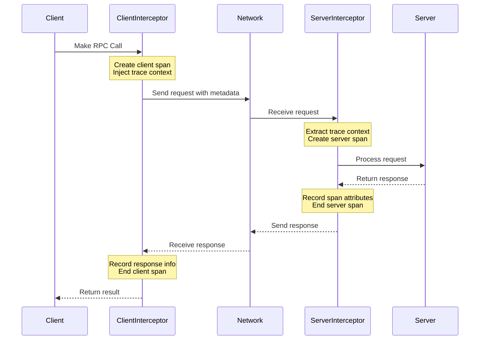
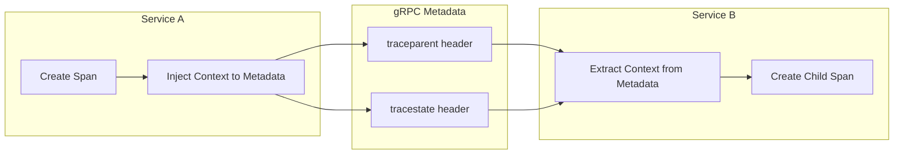

# How to Implement OpenTelemetry Tracing for gRPC Services

Author: [nawazdhandala](https://github.com/nawazdhandala)

Tags: OpenTelemetry, gRPC, Tracing, Microservices, Observability, Performance

Description: Learn how to add comprehensive tracing to gRPC services using OpenTelemetry interceptors.

---

## Introduction

gRPC has become the de facto standard for inter-service communication in microservices architectures. Its high performance, strong typing through Protocol Buffers, and support for streaming make it ideal for building distributed systems. However, debugging and monitoring gRPC services can be challenging without proper observability.

OpenTelemetry provides a vendor-neutral way to instrument your gRPC services, giving you deep insights into request flows, latencies, and errors across your entire system. In this comprehensive guide, we will walk through implementing OpenTelemetry tracing for gRPC services, covering both client and server instrumentation, streaming RPCs, and metadata propagation.

## Understanding gRPC Tracing Architecture

Before diving into implementation, let us understand how tracing works in a gRPC context:



The diagram above illustrates how trace context flows through gRPC interceptors. The client interceptor creates a span and injects trace context into gRPC metadata, while the server interceptor extracts this context to create a child span.

## Prerequisites

Before we begin, ensure you have the following installed:

- Go 1.21 or later (we will use Go for examples, but concepts apply to other languages)
- Protocol Buffers compiler (protoc)
- A trace backend (Jaeger, Zipkin, or an OTLP-compatible backend)

## Project Setup

First, let us set up our project with the necessary dependencies.

The following commands initialize a new Go module and install all required OpenTelemetry and gRPC packages. We need the core OpenTelemetry SDK, the OTLP exporter for sending traces, and the gRPC instrumentation library.

```bash
# Initialize a new Go module for our project
mkdir grpc-tracing-demo && cd grpc-tracing-demo
go mod init github.com/example/grpc-tracing-demo

# Install OpenTelemetry core packages
# - sdk/trace: The tracing SDK implementation
# - exporters/otlp/otlptrace: OTLP trace exporter
# - exporters/otlp/otlptrace/otlptracegrpc: gRPC transport for OTLP
go get go.opentelemetry.io/otel
go get go.opentelemetry.io/otel/sdk/trace
go get go.opentelemetry.io/otel/exporters/otlp/otlptrace
go get go.opentelemetry.io/otel/exporters/otlp/otlptrace/otlptracegrpc

# Install gRPC and the OpenTelemetry gRPC instrumentation
# The instrumentation package provides interceptors for automatic tracing
go get google.golang.org/grpc
go get go.opentelemetry.io/contrib/instrumentation/google.golang.org/grpc/otelgrpc
```

## Defining the gRPC Service

Let us create a simple user service for our examples.

This Protocol Buffer definition specifies our service interface. We include both unary RPCs (single request/response) and streaming RPCs to demonstrate tracing for different communication patterns.

```protobuf
// proto/user.proto
// This defines our User service with various RPC patterns

syntax = "proto3";

package user;

// Go package path for generated code
option go_package = "github.com/example/grpc-tracing-demo/proto";

// UserService demonstrates different RPC patterns
// Each pattern requires slightly different tracing approaches
service UserService {
  // Unary RPC: Single request, single response
  // This is the simplest pattern to trace
  rpc GetUser(GetUserRequest) returns (UserResponse);

  // Server streaming: Single request, stream of responses
  // We need to track the entire stream duration
  rpc ListUsers(ListUsersRequest) returns (stream UserResponse);

  // Client streaming: Stream of requests, single response
  // Useful for batch operations
  rpc CreateUsers(stream CreateUserRequest) returns (CreateUsersResponse);

  // Bidirectional streaming: Both sides stream
  // Most complex pattern requiring careful span management
  rpc SyncUsers(stream SyncUserRequest) returns (stream SyncUserResponse);
}

// Request message for fetching a single user
message GetUserRequest {
  // Unique identifier for the user
  string user_id = 1;
}

// Response message containing user details
message UserResponse {
  string user_id = 1;
  string name = 2;
  string email = 3;
  int64 created_at = 4;  // Unix timestamp
}

// Request message for listing users with pagination
message ListUsersRequest {
  int32 page_size = 1;   // Number of users per page
  string page_token = 2; // Token for pagination
}

// Request message for creating a new user
message CreateUserRequest {
  string name = 1;
  string email = 2;
}

// Response for batch user creation
message CreateUsersResponse {
  int32 created_count = 1;        // Number of successfully created users
  repeated string user_ids = 2;   // IDs of created users
}

// Request for bidirectional sync operation
message SyncUserRequest {
  string user_id = 1;
  string name = 2;
  string email = 3;
}

// Response for bidirectional sync operation
message SyncUserResponse {
  string user_id = 1;
  bool synced = 2;        // Whether the sync was successful
  string sync_status = 3; // Detailed status message
}
```

## Initializing the OpenTelemetry Tracer

The tracer provider is the core component that manages span creation and export. This initialization code should run once at application startup.

The following code creates a tracer provider configured with an OTLP exporter. We use a batch span processor for efficiency, which batches spans before sending them to reduce network overhead.

```go
// pkg/tracing/tracer.go
// This package handles OpenTelemetry initialization and configuration

package tracing

import (
	"context"
	"fmt"
	"time"

	"go.opentelemetry.io/otel"
	"go.opentelemetry.io/otel/attribute"
	"go.opentelemetry.io/otel/exporters/otlp/otlptrace"
	"go.opentelemetry.io/otel/exporters/otlp/otlptrace/otlptracegrpc"
	"go.opentelemetry.io/otel/propagation"
	"go.opentelemetry.io/otel/sdk/resource"
	sdktrace "go.opentelemetry.io/otel/sdk/trace"
	semconv "go.opentelemetry.io/otel/semconv/v1.24.0"
)

// TracerConfig holds configuration for the tracer provider
// These values can be loaded from environment variables or config files
type TracerConfig struct {
	ServiceName    string  // Name of the service (appears in traces)
	ServiceVersion string  // Version of the service
	Environment    string  // Deployment environment (dev, staging, prod)
	OTLPEndpoint   string  // OTLP collector endpoint (e.g., "localhost:4317")
	SampleRate     float64 // Sampling rate (1.0 = 100%, 0.1 = 10%)
}

// InitTracer initializes the OpenTelemetry tracer provider
// It returns a shutdown function that should be called when the application exits
func InitTracer(ctx context.Context, cfg TracerConfig) (func(context.Context) error, error) {
	// Create the OTLP exporter client
	// We use gRPC transport for better performance and streaming support
	client := otlptracegrpc.NewClient(
		// Connect to the OTLP collector
		otlptracegrpc.WithEndpoint(cfg.OTLPEndpoint),
		// For development, we disable TLS. In production, enable TLS!
		otlptracegrpc.WithInsecure(),
	)

	// Create the trace exporter using the client
	// The exporter is responsible for sending spans to the backend
	exporter, err := otlptrace.New(ctx, client)
	if err != nil {
		return nil, fmt.Errorf("failed to create trace exporter: %w", err)
	}

	// Create a resource that describes this service
	// Resources provide context about where telemetry data originates
	res, err := resource.Merge(
		resource.Default(), // Include default attributes (SDK info, etc.)
		resource.NewWithAttributes(
			semconv.SchemaURL,
			// Service identification attributes
			semconv.ServiceName(cfg.ServiceName),
			semconv.ServiceVersion(cfg.ServiceVersion),
			// Deployment environment attribute
			semconv.DeploymentEnvironment(cfg.Environment),
			// Custom attributes for additional context
			attribute.String("team", "platform"),
		),
	)
	if err != nil {
		return nil, fmt.Errorf("failed to create resource: %w", err)
	}

	// Configure the sampler based on the sample rate
	// Sampling is crucial for high-throughput services to control costs
	var sampler sdktrace.Sampler
	if cfg.SampleRate >= 1.0 {
		// Sample all traces (useful for development)
		sampler = sdktrace.AlwaysSample()
	} else if cfg.SampleRate <= 0 {
		// Never sample (not recommended)
		sampler = sdktrace.NeverSample()
	} else {
		// Sample a percentage of traces based on trace ID
		// This ensures consistent sampling decisions across services
		sampler = sdktrace.TraceIDRatioBased(cfg.SampleRate)
	}

	// Create the tracer provider with all our configuration
	tp := sdktrace.NewTracerProvider(
		// Use batch processor for better performance
		// Spans are batched and sent periodically rather than immediately
		sdktrace.WithBatcher(exporter,
			// Send spans every 5 seconds or when batch is full
			sdktrace.WithBatchTimeout(5*time.Second),
			// Maximum number of spans per batch
			sdktrace.WithMaxExportBatchSize(512),
		),
		// Attach our resource to all spans
		sdktrace.WithResource(res),
		// Apply our sampling configuration
		sdktrace.WithSampler(sampler),
	)

	// Register the tracer provider globally
	// This allows us to use otel.Tracer() anywhere in the application
	otel.SetTracerProvider(tp)

	// Set up context propagation
	// This determines how trace context is encoded in carrier formats
	otel.SetTextMapPropagator(propagation.NewCompositeTextMapPropagator(
		// W3C Trace Context - the standard format for trace propagation
		propagation.TraceContext{},
		// W3C Baggage - for propagating custom key-value pairs
		propagation.Baggage{},
	))

	// Return the shutdown function
	// This ensures all spans are flushed before the application exits
	return tp.Shutdown, nil
}
```

## Implementing Server-Side Tracing

Now let us implement the gRPC server with OpenTelemetry instrumentation.

The server uses interceptors to automatically create spans for each incoming RPC. We configure both unary and stream interceptors to handle all RPC patterns.

```go
// server/main.go
// gRPC server with OpenTelemetry tracing

package main

import (
	"context"
	"fmt"
	"log"
	"net"
	"os"
	"os/signal"
	"syscall"
	"time"

	"go.opentelemetry.io/contrib/instrumentation/google.golang.org/grpc/otelgrpc"
	"go.opentelemetry.io/otel"
	"go.opentelemetry.io/otel/attribute"
	"go.opentelemetry.io/otel/codes"
	"go.opentelemetry.io/otel/trace"
	"google.golang.org/grpc"
	"google.golang.org/grpc/metadata"
	"google.golang.org/grpc/status"

	pb "github.com/example/grpc-tracing-demo/proto"
	"github.com/example/grpc-tracing-demo/pkg/tracing"
)

// userServer implements the UserService gRPC interface
type userServer struct {
	// Embed the unimplemented server for forward compatibility
	pb.UnimplementedUserServiceServer
	// Tracer for creating custom spans within our handlers
	tracer trace.Tracer
}

// newUserServer creates a new user server with a tracer
func newUserServer() *userServer {
	return &userServer{
		// Get a tracer scoped to our service
		// The name appears in trace data and helps identify the source
		tracer: otel.Tracer("user-service"),
	}
}

// GetUser handles unary RPC for fetching a single user
// The interceptor automatically creates a span for this RPC
func (s *userServer) GetUser(ctx context.Context, req *pb.GetUserRequest) (*pb.UserResponse, error) {
	// Get the current span from context
	// This span was created by the gRPC interceptor
	span := trace.SpanFromContext(ctx)

	// Add custom attributes to the span for better debugging
	// These attributes help filter and analyze traces
	span.SetAttributes(
		attribute.String("user.id", req.UserId),
		attribute.String("rpc.method", "GetUser"),
	)

	// Simulate a database lookup with its own span
	// Child spans help break down where time is spent
	user, err := s.lookupUser(ctx, req.UserId)
	if err != nil {
		// Record the error on the span
		// This makes failed requests visible in the trace UI
		span.RecordError(err)
		span.SetStatus(codes.Error, err.Error())
		return nil, err
	}

	// Add result attributes for successful responses
	span.SetAttributes(
		attribute.String("user.name", user.Name),
		attribute.Bool("user.found", true),
	)

	return user, nil
}

// lookupUser simulates a database lookup with tracing
// This demonstrates creating child spans for internal operations
func (s *userServer) lookupUser(ctx context.Context, userID string) (*pb.UserResponse, error) {
	// Start a new child span for the database operation
	// The span is automatically linked to the parent from context
	ctx, span := s.tracer.Start(ctx, "db.lookup_user",
		// Specify that this is an internal operation
		trace.WithSpanKind(trace.SpanKindInternal),
		// Add attributes specific to database operations
		trace.WithAttributes(
			attribute.String("db.system", "postgresql"),
			attribute.String("db.operation", "SELECT"),
			attribute.String("db.table", "users"),
		),
	)
	// Always end the span when the function returns
	defer span.End()

	// Simulate database latency
	time.Sleep(10 * time.Millisecond)

	// Simulate user not found for specific IDs
	if userID == "unknown" {
		return nil, status.Errorf(codes.NotFound, "user not found: %s", userID)
	}

	// Return a mock user
	return &pb.UserResponse{
		UserId:    userID,
		Name:      "John Doe",
		Email:     "john@example.com",
		CreatedAt: time.Now().Unix(),
	}, nil
}

// ListUsers handles server streaming RPC
// The interceptor creates a span that covers the entire stream
func (s *userServer) ListUsers(req *pb.ListUsersRequest, stream pb.UserService_ListUsersServer) error {
	ctx := stream.Context()
	span := trace.SpanFromContext(ctx)

	// Record pagination parameters
	span.SetAttributes(
		attribute.Int("pagination.page_size", int(req.PageSize)),
		attribute.String("pagination.page_token", req.PageToken),
	)

	// Track how many users we send
	userCount := 0

	// Simulate streaming multiple users
	for i := 0; i < int(req.PageSize); i++ {
		// Check if the client cancelled the stream
		select {
		case <-ctx.Done():
			span.SetAttributes(attribute.Bool("stream.cancelled", true))
			return ctx.Err()
		default:
		}

		// Create a span for each user being processed
		// This helps identify slow individual operations
		_, itemSpan := s.tracer.Start(ctx, "process_user_item",
			trace.WithAttributes(
				attribute.Int("item.index", i),
			),
		)

		user := &pb.UserResponse{
			UserId:    fmt.Sprintf("user-%d", i),
			Name:      fmt.Sprintf("User %d", i),
			Email:     fmt.Sprintf("user%d@example.com", i),
			CreatedAt: time.Now().Unix(),
		}

		if err := stream.Send(user); err != nil {
			itemSpan.RecordError(err)
			itemSpan.End()
			return err
		}

		userCount++
		itemSpan.End()

		// Simulate processing time between sends
		time.Sleep(5 * time.Millisecond)
	}

	// Record final metrics on the parent span
	span.SetAttributes(
		attribute.Int("stream.items_sent", userCount),
		attribute.Bool("stream.completed", true),
	)

	return nil
}

// CreateUsers handles client streaming RPC
// Multiple requests come in, single response goes out
func (s *userServer) CreateUsers(stream pb.UserService_CreateUsersServer) error {
	ctx := stream.Context()
	span := trace.SpanFromContext(ctx)

	var userIDs []string
	createCount := 0

	// Process each incoming user creation request
	for {
		req, err := stream.Recv()
		if err != nil {
			// io.EOF means the client finished sending
			if err.Error() == "EOF" {
				break
			}
			span.RecordError(err)
			return err
		}

		// Create a span for processing each user
		_, createSpan := s.tracer.Start(ctx, "create_user",
			trace.WithAttributes(
				attribute.String("user.name", req.Name),
				attribute.String("user.email", req.Email),
			),
		)

		// Simulate user creation with database write
		userID := fmt.Sprintf("user-%d", createCount)
		userIDs = append(userIDs, userID)
		createCount++

		createSpan.SetAttributes(attribute.String("user.id", userID))
		createSpan.End()
	}

	// Record batch operation metrics
	span.SetAttributes(
		attribute.Int("batch.created_count", createCount),
		attribute.StringSlice("batch.user_ids", userIDs),
	)

	return stream.SendAndClose(&pb.CreateUsersResponse{
		CreatedCount: int32(createCount),
		UserIds:      userIDs,
	})
}

// SyncUsers handles bidirectional streaming RPC
// This is the most complex pattern with concurrent sends and receives
func (s *userServer) SyncUsers(stream pb.UserService_SyncUsersServer) error {
	ctx := stream.Context()
	span := trace.SpanFromContext(ctx)

	syncedCount := 0
	failedCount := 0

	for {
		// Receive sync request from client
		req, err := stream.Recv()
		if err != nil {
			if err.Error() == "EOF" {
				break
			}
			span.RecordError(err)
			return err
		}

		// Create a span for each sync operation
		_, syncSpan := s.tracer.Start(ctx, "sync_user",
			trace.WithAttributes(
				attribute.String("sync.user_id", req.UserId),
			),
		)

		// Simulate sync logic
		synced := true
		syncStatus := "success"

		// Simulate occasional failures for demonstration
		if req.UserId == "fail" {
			synced = false
			syncStatus = "validation_error"
			failedCount++
		} else {
			syncedCount++
		}

		syncSpan.SetAttributes(
			attribute.Bool("sync.success", synced),
			attribute.String("sync.status", syncStatus),
		)
		syncSpan.End()

		// Send response for this user
		if err := stream.Send(&pb.SyncUserResponse{
			UserId:     req.UserId,
			Synced:     synced,
			SyncStatus: syncStatus,
		}); err != nil {
			return err
		}
	}

	// Record final sync statistics
	span.SetAttributes(
		attribute.Int("sync.total_synced", syncedCount),
		attribute.Int("sync.total_failed", failedCount),
	)

	return nil
}

func main() {
	// Initialize the tracer
	ctx := context.Background()
	shutdown, err := tracing.InitTracer(ctx, tracing.TracerConfig{
		ServiceName:    "user-service",
		ServiceVersion: "1.0.0",
		Environment:    "development",
		OTLPEndpoint:   "localhost:4317",
		SampleRate:     1.0, // Sample everything in development
	})
	if err != nil {
		log.Fatalf("Failed to initialize tracer: %v", err)
	}
	// Ensure tracer is shut down properly on exit
	defer func() {
		if err := shutdown(ctx); err != nil {
			log.Printf("Error shutting down tracer: %v", err)
		}
	}()

	// Create the gRPC server with OpenTelemetry interceptors
	// The otelgrpc package provides automatic instrumentation
	server := grpc.NewServer(
		// StatsHandler is the recommended way to instrument gRPC
		// It provides both client and server instrumentation
		grpc.StatsHandler(otelgrpc.NewServerHandler(
			// Add RPC-specific attributes to spans
			otelgrpc.WithMessageEvents(otelgrpc.ReceivedEvents, otelgrpc.SentEvents),
		)),
	)

	// Register our service implementation
	pb.RegisterUserServiceServer(server, newUserServer())

	// Start listening
	listener, err := net.Listen("tcp", ":50051")
	if err != nil {
		log.Fatalf("Failed to listen: %v", err)
	}

	// Handle graceful shutdown
	sigChan := make(chan os.Signal, 1)
	signal.Notify(sigChan, syscall.SIGINT, syscall.SIGTERM)

	go func() {
		<-sigChan
		log.Println("Shutting down server...")
		server.GracefulStop()
	}()

	log.Println("Server listening on :50051")
	if err := server.Serve(listener); err != nil {
		log.Fatalf("Failed to serve: %v", err)
	}
}
```

## Implementing Client-Side Tracing

The client also uses interceptors to create spans for outgoing RPCs and inject trace context into metadata.

```go
// client/main.go
// gRPC client with OpenTelemetry tracing

package main

import (
	"context"
	"fmt"
	"io"
	"log"
	"time"

	"go.opentelemetry.io/contrib/instrumentation/google.golang.org/grpc/otelgrpc"
	"go.opentelemetry.io/otel"
	"go.opentelemetry.io/otel/attribute"
	"go.opentelemetry.io/otel/trace"
	"google.golang.org/grpc"
	"google.golang.org/grpc/credentials/insecure"

	pb "github.com/example/grpc-tracing-demo/proto"
	"github.com/example/grpc-tracing-demo/pkg/tracing"
)

// UserClient wraps the gRPC client with tracing capabilities
type UserClient struct {
	client pb.UserServiceClient
	tracer trace.Tracer
}

// NewUserClient creates a new traced user client
func NewUserClient(conn *grpc.ClientConn) *UserClient {
	return &UserClient{
		client: pb.NewUserServiceClient(conn),
		tracer: otel.Tracer("user-client"),
	}
}

// GetUser demonstrates unary RPC with tracing
func (c *UserClient) GetUser(ctx context.Context, userID string) (*pb.UserResponse, error) {
	// Create a span for the overall operation
	// The gRPC interceptor will create a child span for the RPC itself
	ctx, span := c.tracer.Start(ctx, "UserClient.GetUser",
		trace.WithAttributes(
			attribute.String("user.id", userID),
		),
	)
	defer span.End()

	// Perform pre-call validation (traced)
	if err := c.validateUserID(ctx, userID); err != nil {
		span.RecordError(err)
		return nil, err
	}

	// Make the RPC call
	// The interceptor automatically:
	// 1. Creates a client span for the RPC
	// 2. Injects trace context into gRPC metadata
	// 3. Records timing and error information
	resp, err := c.client.GetUser(ctx, &pb.GetUserRequest{
		UserId: userID,
	})
	if err != nil {
		span.RecordError(err)
		return nil, err
	}

	// Add response information to the span
	span.SetAttributes(
		attribute.String("user.name", resp.Name),
		attribute.String("user.email", resp.Email),
	)

	return resp, nil
}

// validateUserID demonstrates adding custom spans for business logic
func (c *UserClient) validateUserID(ctx context.Context, userID string) error {
	_, span := c.tracer.Start(ctx, "validateUserID",
		trace.WithSpanKind(trace.SpanKindInternal),
	)
	defer span.End()

	if userID == "" {
		return fmt.Errorf("user ID cannot be empty")
	}

	span.SetAttributes(attribute.Bool("validation.passed", true))
	return nil
}

// ListUsers demonstrates consuming a server stream with tracing
func (c *UserClient) ListUsers(ctx context.Context, pageSize int32) ([]*pb.UserResponse, error) {
	ctx, span := c.tracer.Start(ctx, "UserClient.ListUsers",
		trace.WithAttributes(
			attribute.Int("request.page_size", int(pageSize)),
		),
	)
	defer span.End()

	// Start the server streaming RPC
	stream, err := c.client.ListUsers(ctx, &pb.ListUsersRequest{
		PageSize: pageSize,
	})
	if err != nil {
		span.RecordError(err)
		return nil, err
	}

	var users []*pb.UserResponse

	// Receive all users from the stream
	for {
		// Create a span for receiving each item
		// This helps identify slow receive operations
		_, recvSpan := c.tracer.Start(ctx, "stream.Recv",
			trace.WithSpanKind(trace.SpanKindInternal),
		)

		user, err := stream.Recv()
		if err == io.EOF {
			recvSpan.SetAttributes(attribute.Bool("stream.eof", true))
			recvSpan.End()
			break
		}
		if err != nil {
			recvSpan.RecordError(err)
			recvSpan.End()
			span.RecordError(err)
			return nil, err
		}

		recvSpan.SetAttributes(
			attribute.String("user.id", user.UserId),
		)
		recvSpan.End()

		users = append(users, user)
	}

	// Record final metrics
	span.SetAttributes(
		attribute.Int("response.user_count", len(users)),
		attribute.Bool("stream.completed", true),
	)

	return users, nil
}

// CreateUsers demonstrates client streaming with tracing
func (c *UserClient) CreateUsers(ctx context.Context, users []struct{ Name, Email string }) (*pb.CreateUsersResponse, error) {
	ctx, span := c.tracer.Start(ctx, "UserClient.CreateUsers",
		trace.WithAttributes(
			attribute.Int("request.user_count", len(users)),
		),
	)
	defer span.End()

	// Start the client streaming RPC
	stream, err := c.client.CreateUsers(ctx)
	if err != nil {
		span.RecordError(err)
		return nil, err
	}

	// Send each user to the server
	for i, user := range users {
		// Create a span for each send operation
		_, sendSpan := c.tracer.Start(ctx, "stream.Send",
			trace.WithAttributes(
				attribute.Int("item.index", i),
				attribute.String("user.name", user.Name),
			),
		)

		err := stream.Send(&pb.CreateUserRequest{
			Name:  user.Name,
			Email: user.Email,
		})

		if err != nil {
			sendSpan.RecordError(err)
			sendSpan.End()
			span.RecordError(err)
			return nil, err
		}

		sendSpan.End()
	}

	// Close the send stream and receive the response
	resp, err := stream.CloseAndRecv()
	if err != nil {
		span.RecordError(err)
		return nil, err
	}

	span.SetAttributes(
		attribute.Int("response.created_count", int(resp.CreatedCount)),
	)

	return resp, nil
}

// SyncUsers demonstrates bidirectional streaming with tracing
func (c *UserClient) SyncUsers(ctx context.Context, users []pb.SyncUserRequest) ([]pb.SyncUserResponse, error) {
	ctx, span := c.tracer.Start(ctx, "UserClient.SyncUsers",
		trace.WithAttributes(
			attribute.Int("request.user_count", len(users)),
		),
	)
	defer span.End()

	// Start bidirectional streaming
	stream, err := c.client.SyncUsers(ctx)
	if err != nil {
		span.RecordError(err)
		return nil, err
	}

	var responses []pb.SyncUserResponse

	// Send and receive concurrently
	// In a real application, you might use goroutines for this
	for _, user := range users {
		// Create a span for the round-trip
		_, rtSpan := c.tracer.Start(ctx, "sync.roundtrip",
			trace.WithAttributes(
				attribute.String("user.id", user.UserId),
			),
		)

		// Send the sync request
		if err := stream.Send(&user); err != nil {
			rtSpan.RecordError(err)
			rtSpan.End()
			return nil, err
		}

		// Receive the sync response
		resp, err := stream.Recv()
		if err != nil {
			rtSpan.RecordError(err)
			rtSpan.End()
			return nil, err
		}

		rtSpan.SetAttributes(
			attribute.Bool("sync.success", resp.Synced),
			attribute.String("sync.status", resp.SyncStatus),
		)
		rtSpan.End()

		responses = append(responses, *resp)
	}

	// Close the send side
	if err := stream.CloseSend(); err != nil {
		span.RecordError(err)
		return nil, err
	}

	// Count successful syncs
	successCount := 0
	for _, resp := range responses {
		if resp.Synced {
			successCount++
		}
	}

	span.SetAttributes(
		attribute.Int("sync.success_count", successCount),
		attribute.Int("sync.total_count", len(responses)),
	)

	return responses, nil
}

func main() {
	// Initialize the tracer
	ctx := context.Background()
	shutdown, err := tracing.InitTracer(ctx, tracing.TracerConfig{
		ServiceName:    "user-client",
		ServiceVersion: "1.0.0",
		Environment:    "development",
		OTLPEndpoint:   "localhost:4317",
		SampleRate:     1.0,
	})
	if err != nil {
		log.Fatalf("Failed to initialize tracer: %v", err)
	}
	defer func() {
		if err := shutdown(ctx); err != nil {
			log.Printf("Error shutting down tracer: %v", err)
		}
	}()

	// Create a gRPC connection with tracing interceptors
	conn, err := grpc.Dial(
		"localhost:50051",
		grpc.WithTransportCredentials(insecure.NewCredentials()),
		// Use StatsHandler for comprehensive tracing
		grpc.WithStatsHandler(otelgrpc.NewClientHandler(
			// Include message events in traces
			otelgrpc.WithMessageEvents(otelgrpc.ReceivedEvents, otelgrpc.SentEvents),
		)),
	)
	if err != nil {
		log.Fatalf("Failed to connect: %v", err)
	}
	defer conn.Close()

	// Create the traced client
	client := NewUserClient(conn)

	// Demo: Unary RPC
	log.Println("=== Unary RPC Demo ===")
	user, err := client.GetUser(ctx, "user-123")
	if err != nil {
		log.Printf("GetUser failed: %v", err)
	} else {
		log.Printf("Got user: %+v", user)
	}

	// Demo: Server streaming
	log.Println("\n=== Server Streaming Demo ===")
	users, err := client.ListUsers(ctx, 5)
	if err != nil {
		log.Printf("ListUsers failed: %v", err)
	} else {
		log.Printf("Listed %d users", len(users))
	}

	// Demo: Client streaming
	log.Println("\n=== Client Streaming Demo ===")
	newUsers := []struct{ Name, Email string }{
		{"Alice", "alice@example.com"},
		{"Bob", "bob@example.com"},
		{"Charlie", "charlie@example.com"},
	}
	createResp, err := client.CreateUsers(ctx, newUsers)
	if err != nil {
		log.Printf("CreateUsers failed: %v", err)
	} else {
		log.Printf("Created %d users", createResp.CreatedCount)
	}

	// Demo: Bidirectional streaming
	log.Println("\n=== Bidirectional Streaming Demo ===")
	syncUsers := []pb.SyncUserRequest{
		{UserId: "user-1", Name: "User One", Email: "one@example.com"},
		{UserId: "user-2", Name: "User Two", Email: "two@example.com"},
	}
	syncResponses, err := client.SyncUsers(ctx, syncUsers)
	if err != nil {
		log.Printf("SyncUsers failed: %v", err)
	} else {
		log.Printf("Synced %d users", len(syncResponses))
	}

	// Wait for traces to be exported
	time.Sleep(2 * time.Second)
	log.Println("\nDone! Check your trace backend for the traces.")
}
```

## Metadata Propagation for Distributed Tracing

Proper trace context propagation is essential for connecting traces across service boundaries. The following diagram shows how context flows:



The otelgrpc interceptors handle this automatically, but you may need to manually propagate context in some scenarios.

The following code demonstrates manual context propagation, which is useful when you need custom handling or when working with legacy systems.

```go
// pkg/propagation/metadata.go
// Custom metadata propagation utilities

package propagation

import (
	"context"

	"go.opentelemetry.io/otel"
	"go.opentelemetry.io/otel/propagation"
	"google.golang.org/grpc/metadata"
)

// MetadataCarrier adapts gRPC metadata for OpenTelemetry propagation
// This implements the TextMapCarrier interface required by propagators
type MetadataCarrier struct {
	md metadata.MD
}

// NewMetadataCarrier creates a carrier from gRPC metadata
func NewMetadataCarrier(md metadata.MD) *MetadataCarrier {
	return &MetadataCarrier{md: md}
}

// Get retrieves a value from the metadata
// OpenTelemetry propagators use this to extract trace context
func (c *MetadataCarrier) Get(key string) string {
	values := c.md.Get(key)
	if len(values) == 0 {
		return ""
	}
	// Return the first value (trace headers typically have one value)
	return values[0]
}

// Set stores a value in the metadata
// OpenTelemetry propagators use this to inject trace context
func (c *MetadataCarrier) Set(key, value string) {
	c.md.Set(key, value)
}

// Keys returns all keys in the metadata
// This is used by some propagators to iterate over headers
func (c *MetadataCarrier) Keys() []string {
	keys := make([]string, 0, len(c.md))
	for key := range c.md {
		keys = append(keys, key)
	}
	return keys
}

// InjectTraceContext injects the current trace context into gRPC metadata
// Use this when you need to manually propagate context
func InjectTraceContext(ctx context.Context) metadata.MD {
	md := metadata.MD{}
	carrier := NewMetadataCarrier(md)

	// Get the global propagator and inject context
	propagator := otel.GetTextMapPropagator()
	propagator.Inject(ctx, carrier)

	return md
}

// ExtractTraceContext extracts trace context from gRPC metadata
// Use this when receiving requests without automatic instrumentation
func ExtractTraceContext(ctx context.Context, md metadata.MD) context.Context {
	carrier := NewMetadataCarrier(md)

	// Get the global propagator and extract context
	propagator := otel.GetTextMapPropagator()
	return propagator.Extract(ctx, carrier)
}

// PropagateToOutgoingContext creates a new context with trace headers
// This is useful for making downstream calls with trace context
func PropagateToOutgoingContext(ctx context.Context) context.Context {
	md := InjectTraceContext(ctx)

	// Check if there's existing outgoing metadata
	existingMD, ok := metadata.FromOutgoingContext(ctx)
	if ok {
		// Merge with existing metadata
		md = metadata.Join(existingMD, md)
	}

	return metadata.NewOutgoingContext(ctx, md)
}
```

## Custom gRPC Interceptors for Enhanced Tracing

While the otelgrpc package provides excellent automatic instrumentation, you might need custom interceptors for specific requirements like adding business-specific attributes or implementing custom sampling logic.

The following interceptors demonstrate how to add custom tracing behavior on top of the automatic instrumentation.

```go
// pkg/interceptors/tracing.go
// Custom gRPC interceptors for enhanced tracing

package interceptors

import (
	"context"
	"time"

	"go.opentelemetry.io/otel"
	"go.opentelemetry.io/otel/attribute"
	"go.opentelemetry.io/otel/codes"
	"go.opentelemetry.io/otel/trace"
	"google.golang.org/grpc"
	"google.golang.org/grpc/metadata"
	"google.golang.org/grpc/status"
)

// TracingConfig configures the custom tracing interceptors
type TracingConfig struct {
	// ServiceName is used in span attributes
	ServiceName string
	// SlowRequestThreshold marks requests as slow if they exceed this duration
	SlowRequestThreshold time.Duration
	// RecordPayloads determines if request/response payloads are recorded
	// Warning: This may expose sensitive data in traces!
	RecordPayloads bool
}

// UnaryServerInterceptor adds custom tracing to unary server calls
// This wraps the automatic otelgrpc instrumentation with additional features
func UnaryServerInterceptor(cfg TracingConfig) grpc.UnaryServerInterceptor {
	tracer := otel.Tracer(cfg.ServiceName + "-interceptor")

	return func(
		ctx context.Context,
		req interface{},
		info *grpc.UnaryServerInfo,
		handler grpc.UnaryHandler,
	) (interface{}, error) {
		// Get the span created by otelgrpc
		span := trace.SpanFromContext(ctx)

		// Extract custom headers from metadata
		if md, ok := metadata.FromIncomingContext(ctx); ok {
			// Add request ID if present
			if requestIDs := md.Get("x-request-id"); len(requestIDs) > 0 {
				span.SetAttributes(attribute.String("request.id", requestIDs[0]))
			}

			// Add user ID if present (for authenticated requests)
			if userIDs := md.Get("x-user-id"); len(userIDs) > 0 {
				span.SetAttributes(attribute.String("user.id", userIDs[0]))
			}

			// Add tenant ID for multi-tenant systems
			if tenantIDs := md.Get("x-tenant-id"); len(tenantIDs) > 0 {
				span.SetAttributes(attribute.String("tenant.id", tenantIDs[0]))
			}
		}

		// Record start time for latency tracking
		startTime := time.Now()

		// Call the actual handler
		resp, err := handler(ctx, req)

		// Calculate request duration
		duration := time.Since(startTime)

		// Add timing attributes
		span.SetAttributes(
			attribute.Float64("request.duration_ms", float64(duration.Milliseconds())),
		)

		// Mark slow requests
		if duration > cfg.SlowRequestThreshold {
			span.SetAttributes(attribute.Bool("request.slow", true))
			// Add an event for visibility in trace UI
			span.AddEvent("slow_request",
				trace.WithAttributes(
					attribute.String("threshold", cfg.SlowRequestThreshold.String()),
					attribute.String("actual", duration.String()),
				),
			)
		}

		// Handle errors with detailed status codes
		if err != nil {
			st, _ := status.FromError(err)
			span.SetAttributes(
				attribute.String("grpc.status_code", st.Code().String()),
				attribute.String("error.message", st.Message()),
			)
		}

		return resp, err
	}
}

// StreamServerInterceptor adds custom tracing to streaming server calls
func StreamServerInterceptor(cfg TracingConfig) grpc.StreamServerInterceptor {
	return func(
		srv interface{},
		ss grpc.ServerStream,
		info *grpc.StreamServerInfo,
		handler grpc.StreamHandler,
	) error {
		ctx := ss.Context()
		span := trace.SpanFromContext(ctx)

		// Add stream type information
		span.SetAttributes(
			attribute.Bool("stream.client_streaming", info.IsClientStream),
			attribute.Bool("stream.server_streaming", info.IsServerStream),
		)

		// Wrap the stream to count messages
		wrappedStream := &tracingServerStream{
			ServerStream: ss,
			span:        span,
		}

		startTime := time.Now()
		err := handler(srv, wrappedStream)
		duration := time.Since(startTime)

		// Record stream statistics
		span.SetAttributes(
			attribute.Int("stream.messages_received", wrappedStream.recvCount),
			attribute.Int("stream.messages_sent", wrappedStream.sendCount),
			attribute.Float64("stream.duration_ms", float64(duration.Milliseconds())),
		)

		return err
	}
}

// tracingServerStream wraps a server stream to count messages
type tracingServerStream struct {
	grpc.ServerStream
	span      trace.Span
	recvCount int
	sendCount int
}

// RecvMsg intercepts received messages
func (s *tracingServerStream) RecvMsg(m interface{}) error {
	err := s.ServerStream.RecvMsg(m)
	if err == nil {
		s.recvCount++
	}
	return err
}

// SendMsg intercepts sent messages
func (s *tracingServerStream) SendMsg(m interface{}) error {
	err := s.ServerStream.SendMsg(m)
	if err == nil {
		s.sendCount++
	}
	return err
}

// UnaryClientInterceptor adds custom tracing to unary client calls
func UnaryClientInterceptor(cfg TracingConfig) grpc.UnaryClientInterceptor {
	tracer := otel.Tracer(cfg.ServiceName + "-client-interceptor")

	return func(
		ctx context.Context,
		method string,
		req, reply interface{},
		cc *grpc.ClientConn,
		invoker grpc.UnaryInvoker,
		opts ...grpc.CallOption,
	) error {
		// Create or get the current span
		span := trace.SpanFromContext(ctx)

		// Add client-side attributes
		span.SetAttributes(
			attribute.String("grpc.target", cc.Target()),
			attribute.String("rpc.system", "grpc"),
		)

		// Add retry count if using retry policies
		// This helps identify flaky endpoints
		startTime := time.Now()
		err := invoker(ctx, method, req, reply, cc, opts...)
		duration := time.Since(startTime)

		// Record client-side timing
		span.SetAttributes(
			attribute.Float64("client.request_duration_ms", float64(duration.Milliseconds())),
		)

		// Mark slow client requests
		if duration > cfg.SlowRequestThreshold {
			span.AddEvent("slow_client_request")
		}

		if err != nil {
			span.SetStatus(codes.Error, err.Error())
		}

		return err
	}
}

// StreamClientInterceptor adds custom tracing to streaming client calls
func StreamClientInterceptor(cfg TracingConfig) grpc.StreamClientInterceptor {
	return func(
		ctx context.Context,
		desc *grpc.StreamDesc,
		cc *grpc.ClientConn,
		method string,
		streamer grpc.Streamer,
		opts ...grpc.CallOption,
	) (grpc.ClientStream, error) {
		span := trace.SpanFromContext(ctx)

		// Add stream metadata
		span.SetAttributes(
			attribute.String("grpc.target", cc.Target()),
			attribute.Bool("stream.client_streaming", desc.ClientStreams),
			attribute.Bool("stream.server_streaming", desc.ServerStreams),
		)

		stream, err := streamer(ctx, desc, cc, method, opts...)
		if err != nil {
			return nil, err
		}

		// Wrap stream for message counting
		return &tracingClientStream{
			ClientStream: stream,
			span:        span,
		}, nil
	}
}

// tracingClientStream wraps a client stream to count messages
type tracingClientStream struct {
	grpc.ClientStream
	span      trace.Span
	recvCount int
	sendCount int
}

func (s *tracingClientStream) RecvMsg(m interface{}) error {
	err := s.ClientStream.RecvMsg(m)
	if err == nil {
		s.recvCount++
		s.span.SetAttributes(attribute.Int("stream.messages_received", s.recvCount))
	}
	return err
}

func (s *tracingClientStream) SendMsg(m interface{}) error {
	err := s.ClientStream.SendMsg(m)
	if err == nil {
		s.sendCount++
		s.span.SetAttributes(attribute.Int("stream.messages_sent", s.sendCount))
	}
	return err
}
```

## Error Handling and Status Code Mapping

Proper error handling is crucial for useful traces. The following code shows how to map gRPC status codes to OpenTelemetry status codes and add meaningful error attributes.

```go
// pkg/errors/grpc_status.go
// Error handling utilities for gRPC tracing

package errors

import (
	"go.opentelemetry.io/otel/attribute"
	"go.opentelemetry.io/otel/codes"
	"go.opentelemetry.io/otel/trace"
	"google.golang.org/grpc/status"
	grpccodes "google.golang.org/grpc/codes"
)

// RecordGRPCError records a gRPC error on a span with proper status mapping
// This ensures errors are properly categorized in your trace backend
func RecordGRPCError(span trace.Span, err error) {
	if err == nil {
		return
	}

	// Extract the gRPC status from the error
	st, ok := status.FromError(err)
	if !ok {
		// Not a gRPC error, record as generic error
		span.RecordError(err)
		span.SetStatus(codes.Error, err.Error())
		return
	}

	// Record the gRPC status code
	span.SetAttributes(
		attribute.String("grpc.status_code", st.Code().String()),
		attribute.String("grpc.status_message", st.Message()),
	)

	// Map gRPC status codes to OpenTelemetry status
	// Only certain codes should be marked as errors
	switch st.Code() {
	case grpccodes.OK:
		// Success - no action needed
		span.SetStatus(codes.Ok, "")

	case grpccodes.Canceled:
		// Client cancelled - may or may not be an error
		span.SetAttributes(attribute.Bool("rpc.cancelled", true))
		span.SetStatus(codes.Error, "request cancelled")

	case grpccodes.Unknown:
		// Unknown error
		span.RecordError(err)
		span.SetStatus(codes.Error, st.Message())

	case grpccodes.InvalidArgument:
		// Client error - bad request
		span.SetAttributes(attribute.String("error.type", "client_error"))
		span.RecordError(err)
		span.SetStatus(codes.Error, st.Message())

	case grpccodes.DeadlineExceeded:
		// Timeout - important to track
		span.SetAttributes(
			attribute.Bool("rpc.timeout", true),
			attribute.String("error.type", "timeout"),
		)
		span.RecordError(err)
		span.SetStatus(codes.Error, "deadline exceeded")

	case grpccodes.NotFound:
		// Resource not found - may be expected behavior
		span.SetAttributes(
			attribute.Bool("resource.not_found", true),
			attribute.String("error.type", "not_found"),
		)
		// Don't necessarily mark as error status
		span.RecordError(err)

	case grpccodes.AlreadyExists:
		// Duplicate resource - client error
		span.SetAttributes(attribute.String("error.type", "conflict"))
		span.RecordError(err)

	case grpccodes.PermissionDenied:
		// Authorization failure
		span.SetAttributes(
			attribute.Bool("auth.failed", true),
			attribute.String("error.type", "permission_denied"),
		)
		span.RecordError(err)
		span.SetStatus(codes.Error, "permission denied")

	case grpccodes.ResourceExhausted:
		// Rate limiting or resource limits
		span.SetAttributes(
			attribute.Bool("rate.limited", true),
			attribute.String("error.type", "resource_exhausted"),
		)
		span.RecordError(err)
		span.SetStatus(codes.Error, "resource exhausted")

	case grpccodes.FailedPrecondition:
		// Operation rejected due to system state
		span.SetAttributes(attribute.String("error.type", "precondition_failed"))
		span.RecordError(err)
		span.SetStatus(codes.Error, st.Message())

	case grpccodes.Aborted:
		// Operation aborted (often due to concurrency)
		span.SetAttributes(attribute.String("error.type", "aborted"))
		span.RecordError(err)
		span.SetStatus(codes.Error, "operation aborted")

	case grpccodes.OutOfRange:
		// Value out of range - client error
		span.SetAttributes(attribute.String("error.type", "out_of_range"))
		span.RecordError(err)

	case grpccodes.Unimplemented:
		// Method not implemented
		span.SetAttributes(attribute.String("error.type", "unimplemented"))
		span.RecordError(err)
		span.SetStatus(codes.Error, "not implemented")

	case grpccodes.Internal:
		// Internal server error
		span.SetAttributes(attribute.String("error.type", "internal"))
		span.RecordError(err)
		span.SetStatus(codes.Error, "internal error")

	case grpccodes.Unavailable:
		// Service unavailable
		span.SetAttributes(
			attribute.Bool("service.unavailable", true),
			attribute.String("error.type", "unavailable"),
		)
		span.RecordError(err)
		span.SetStatus(codes.Error, "service unavailable")

	case grpccodes.DataLoss:
		// Unrecoverable data loss
		span.SetAttributes(attribute.String("error.type", "data_loss"))
		span.RecordError(err)
		span.SetStatus(codes.Error, "data loss")

	case grpccodes.Unauthenticated:
		// Authentication failure
		span.SetAttributes(
			attribute.Bool("auth.required", true),
			attribute.String("error.type", "unauthenticated"),
		)
		span.RecordError(err)
		span.SetStatus(codes.Error, "unauthenticated")

	default:
		// Unknown status code
		span.RecordError(err)
		span.SetStatus(codes.Error, st.Message())
	}
}

// IsRetryableError determines if an error should be retried
// This is useful for implementing retry logic with proper tracing
func IsRetryableError(err error) bool {
	if err == nil {
		return false
	}

	st, ok := status.FromError(err)
	if !ok {
		return false
	}

	// These status codes indicate transient failures
	switch st.Code() {
	case grpccodes.Unavailable,
		grpccodes.ResourceExhausted,
		grpccodes.Aborted,
		grpccodes.DeadlineExceeded:
		return true
	default:
		return false
	}
}
```

## Trace Visualization and Analysis

Understanding how to interpret gRPC traces is essential. Here is a typical trace structure:

```mermaid
gantt
    title gRPC Request Trace Timeline
    dateFormat X
    axisFormat %L ms

    section Client
    UserClient.GetUser : 0, 100
    validateUserID : 0, 5
    grpc.client/GetUser : 5, 95

    section Network
    Network Latency : 10, 20

    section Server
    grpc.server/GetUser : 25, 85
    db.lookup_user : 30, 50
    Response Processing : 55, 80
```



When analyzing gRPC traces, look for:

1. **High network latency**: Time between client send and server receive
2. **Slow database queries**: Child spans showing database operations
3. **Error patterns**: Status codes and error messages on spans
4. **Stream message counts**: For streaming RPCs, check message counts

## Best Practices for gRPC Tracing

The following recommendations will help you get the most value from your traces.

### 1. Use Semantic Conventions

OpenTelemetry defines semantic conventions for gRPC. Following these ensures consistency across services.

```go
// pkg/conventions/grpc.go
// Semantic conventions for gRPC tracing

package conventions

import (
	"go.opentelemetry.io/otel/attribute"
	semconv "go.opentelemetry.io/otel/semconv/v1.24.0"
)

// GRPCServerAttributes returns standard attributes for gRPC servers
func GRPCServerAttributes(service, method, peerAddress string) []attribute.KeyValue {
	return []attribute.KeyValue{
		// RPC system identifier
		semconv.RPCSystemGRPC,
		// Service and method being called
		semconv.RPCService(service),
		semconv.RPCMethod(method),
		// Network peer information
		semconv.NetPeerName(peerAddress),
	}
}

// GRPCClientAttributes returns standard attributes for gRPC clients
func GRPCClientAttributes(service, method, serverAddress string, serverPort int) []attribute.KeyValue {
	return []attribute.KeyValue{
		semconv.RPCSystemGRPC,
		semconv.RPCService(service),
		semconv.RPCMethod(method),
		semconv.ServerAddress(serverAddress),
		semconv.ServerPort(serverPort),
	}
}
```

### 2. Implement Sampling Strategies

For high-throughput services, sample traces to control costs while maintaining visibility.

```go
// pkg/sampling/sampler.go
// Custom sampling strategies for gRPC services

package sampling

import (
	"go.opentelemetry.io/otel/attribute"
	sdktrace "go.opentelemetry.io/otel/sdk/trace"
	"go.opentelemetry.io/otel/trace"
)

// PriorityBasedSampler samples all requests with priority headers
// and a percentage of normal requests
type PriorityBasedSampler struct {
	// BaseSampleRate for normal requests (0.0 to 1.0)
	BaseSampleRate float64
	// Inner sampler for rate-based sampling
	rateSampler sdktrace.Sampler
}

// NewPriorityBasedSampler creates a new priority-based sampler
func NewPriorityBasedSampler(baseSampleRate float64) *PriorityBasedSampler {
	return &PriorityBasedSampler{
		BaseSampleRate: baseSampleRate,
		rateSampler:    sdktrace.TraceIDRatioBased(baseSampleRate),
	}
}

// ShouldSample determines if a span should be sampled
func (s *PriorityBasedSampler) ShouldSample(p sdktrace.SamplingParameters) sdktrace.SamplingResult {
	// Check for priority attribute (set from gRPC metadata)
	for _, attr := range p.Attributes {
		if attr.Key == "request.priority" && attr.Value.AsString() == "high" {
			// Always sample high-priority requests
			return sdktrace.SamplingResult{
				Decision:   sdktrace.RecordAndSample,
				Attributes: p.Attributes,
				Tracestate: trace.SpanContextFromContext(p.ParentContext).TraceState(),
			}
		}
	}

	// Use rate-based sampling for normal requests
	return s.rateSampler.ShouldSample(p)
}

// Description returns a description of the sampler
func (s *PriorityBasedSampler) Description() string {
	return "PriorityBasedSampler"
}
```

### 3. Add Business Context to Spans

Include business-relevant attributes to make traces useful for debugging.

```go
// Example: Adding business context to spans
func (s *userServer) GetUser(ctx context.Context, req *pb.GetUserRequest) (*pb.UserResponse, error) {
	span := trace.SpanFromContext(ctx)

	// Add business context that helps with debugging
	span.SetAttributes(
		// User identification
		attribute.String("user.id", req.UserId),
		// Request classification
		attribute.String("request.type", "user_lookup"),
		// Feature flags that might affect behavior
		attribute.Bool("feature.new_cache_enabled", true),
		// A/B test groups
		attribute.String("experiment.group", "control"),
	)

	// ... rest of implementation
}
```

## Testing gRPC Tracing

Verify your tracing implementation works correctly with integration tests.

The following test validates that spans are created and linked correctly for gRPC calls.

```go
// tests/tracing_test.go
// Integration tests for gRPC tracing

package tests

import (
	"context"
	"testing"
	"time"

	"go.opentelemetry.io/otel"
	"go.opentelemetry.io/otel/sdk/trace"
	"go.opentelemetry.io/otel/sdk/trace/tracetest"
)

// TestUnaryRPCTracing verifies traces are created for unary RPCs
func TestUnaryRPCTracing(t *testing.T) {
	// Create an in-memory span exporter for testing
	exporter := tracetest.NewInMemoryExporter()

	// Create a tracer provider with the test exporter
	tp := trace.NewTracerProvider(
		// Use simple span processor for synchronous export in tests
		trace.WithSyncer(exporter),
	)
	otel.SetTracerProvider(tp)

	// Create test server and client
	// ... (setup code)

	// Make a test RPC call
	ctx := context.Background()
	// client.GetUser(ctx, "test-user")

	// Wait for spans to be exported
	time.Sleep(100 * time.Millisecond)

	// Verify spans were created
	spans := exporter.GetSpans()

	// Should have at least 2 spans: client and server
	if len(spans) < 2 {
		t.Errorf("Expected at least 2 spans, got %d", len(spans))
	}

	// Verify span relationships
	var clientSpan, serverSpan *tracetest.SpanStub
	for _, span := range spans {
		if span.SpanKind == trace.SpanKindClient {
			clientSpan = &span
		}
		if span.SpanKind == trace.SpanKindServer {
			serverSpan = &span
		}
	}

	if clientSpan == nil {
		t.Error("No client span found")
	}
	if serverSpan == nil {
		t.Error("No server span found")
	}

	// Verify spans share the same trace ID
	if clientSpan != nil && serverSpan != nil {
		if clientSpan.SpanContext.TraceID() != serverSpan.SpanContext.TraceID() {
			t.Error("Client and server spans have different trace IDs")
		}

		// Server span should be child of client span
		if serverSpan.Parent.SpanID() != clientSpan.SpanContext.SpanID() {
			t.Error("Server span is not child of client span")
		}
	}
}

// TestStreamingRPCTracing verifies traces are created for streaming RPCs
func TestStreamingRPCTracing(t *testing.T) {
	exporter := tracetest.NewInMemoryExporter()

	tp := trace.NewTracerProvider(
		trace.WithSyncer(exporter),
	)
	otel.SetTracerProvider(tp)

	// Create test server and client
	// ... (setup code)

	// Make a streaming RPC call
	ctx := context.Background()
	// stream := client.ListUsers(ctx, &pb.ListUsersRequest{PageSize: 5})
	// for { stream.Recv() ... }

	time.Sleep(100 * time.Millisecond)

	spans := exporter.GetSpans()

	// Find the streaming span
	var streamSpan *tracetest.SpanStub
	for _, span := range spans {
		if span.Name == "grpc.server/ListUsers" || span.Name == "grpc.client/ListUsers" {
			streamSpan = &span
			break
		}
	}

	if streamSpan == nil {
		t.Error("No streaming span found")
	}

	// Verify stream attributes are present
	hasMessageCount := false
	for _, attr := range streamSpan.Attributes {
		if attr.Key == "stream.messages_sent" || attr.Key == "stream.messages_received" {
			hasMessageCount = true
			break
		}
	}

	if !hasMessageCount {
		t.Error("Stream span missing message count attributes")
	}
}
```

## Deploying with OpenTelemetry Collector

For production deployments, use the OpenTelemetry Collector to process and export traces.

The following Docker Compose configuration sets up a complete observability stack.

```yaml
# docker-compose.yaml
# Development stack for gRPC tracing

version: '3.8'

services:
  # OpenTelemetry Collector receives, processes, and exports telemetry
  otel-collector:
    image: otel/opentelemetry-collector-contrib:latest
    command: ["--config", "/etc/otel/config.yaml"]
    volumes:
      - ./otel-config.yaml:/etc/otel/config.yaml
    ports:
      # OTLP gRPC receiver
      - "4317:4317"
      # OTLP HTTP receiver
      - "4318:4318"
      # Prometheus metrics endpoint
      - "8888:8888"
    depends_on:
      - jaeger

  # Jaeger for trace visualization
  jaeger:
    image: jaegertracing/all-in-one:latest
    ports:
      # Jaeger UI
      - "16686:16686"
      # Jaeger collector (OTLP)
      - "14250:14250"
    environment:
      - COLLECTOR_OTLP_ENABLED=true

  # Your gRPC server
  grpc-server:
    build:
      context: .
      dockerfile: Dockerfile.server
    environment:
      - OTEL_EXPORTER_OTLP_ENDPOINT=otel-collector:4317
      - OTEL_SERVICE_NAME=user-service
    ports:
      - "50051:50051"
    depends_on:
      - otel-collector

  # Your gRPC client (for testing)
  grpc-client:
    build:
      context: .
      dockerfile: Dockerfile.client
    environment:
      - OTEL_EXPORTER_OTLP_ENDPOINT=otel-collector:4317
      - OTEL_SERVICE_NAME=user-client
      - GRPC_SERVER_ADDRESS=grpc-server:50051
    depends_on:
      - grpc-server
      - otel-collector
```

The Collector configuration processes and routes traces:

```yaml
# otel-config.yaml
# OpenTelemetry Collector configuration

receivers:
  # OTLP receiver accepts traces from your gRPC services
  otlp:
    protocols:
      grpc:
        endpoint: 0.0.0.0:4317
      http:
        endpoint: 0.0.0.0:4318

processors:
  # Batch processor improves efficiency
  batch:
    timeout: 5s
    send_batch_size: 512
    send_batch_max_size: 1024

  # Memory limiter prevents OOM
  memory_limiter:
    check_interval: 1s
    limit_mib: 512
    spike_limit_mib: 128

  # Resource processor adds/modifies attributes
  resource:
    attributes:
      - key: environment
        value: development
        action: insert
      - key: collector.version
        value: "1.0"
        action: insert

  # Filter processor removes unwanted traces
  filter:
    traces:
      span:
        # Exclude health check spans
        - 'name == "grpc.health.v1.Health/Check"'

exporters:
  # Export to Jaeger
  otlp/jaeger:
    endpoint: jaeger:4317
    tls:
      insecure: true

  # Debug exporter for development
  debug:
    verbosity: detailed

  # Export to a commercial vendor (example)
  # otlp/vendor:
  #   endpoint: https://otlp.vendor.com:4317
  #   headers:
  #     api-key: ${VENDOR_API_KEY}

service:
  pipelines:
    traces:
      receivers: [otlp]
      processors: [memory_limiter, batch, resource, filter]
      exporters: [otlp/jaeger, debug]
```

## Conclusion

Implementing OpenTelemetry tracing for gRPC services provides invaluable visibility into your distributed system. We covered:

1. **Basic setup**: Initializing the tracer provider and configuring exporters
2. **Server tracing**: Using interceptors to automatically trace incoming RPCs
3. **Client tracing**: Instrumenting outgoing RPCs with context propagation
4. **Streaming RPCs**: Handling server, client, and bidirectional streaming
5. **Metadata propagation**: Ensuring trace context flows across service boundaries
6. **Custom interceptors**: Adding business-specific tracing logic
7. **Error handling**: Properly recording gRPC errors on spans
8. **Testing and deployment**: Validating traces and setting up the Collector

With proper gRPC tracing in place, you can:
- Debug complex issues across service boundaries
- Identify latency bottlenecks in your system
- Monitor error rates and patterns
- Understand service dependencies

Remember to:
- Follow semantic conventions for consistent traces
- Implement appropriate sampling for high-throughput services
- Add business context to make traces actionable
- Test your tracing implementation thoroughly

Start with basic instrumentation and gradually add more custom spans and attributes as you learn what information is most valuable for debugging your specific system.
