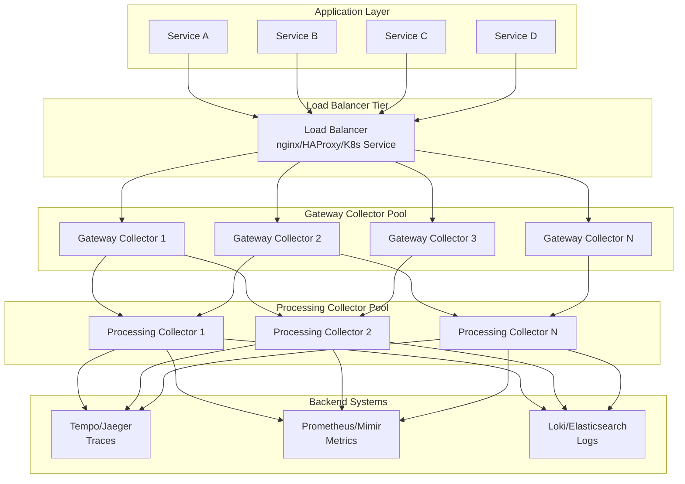
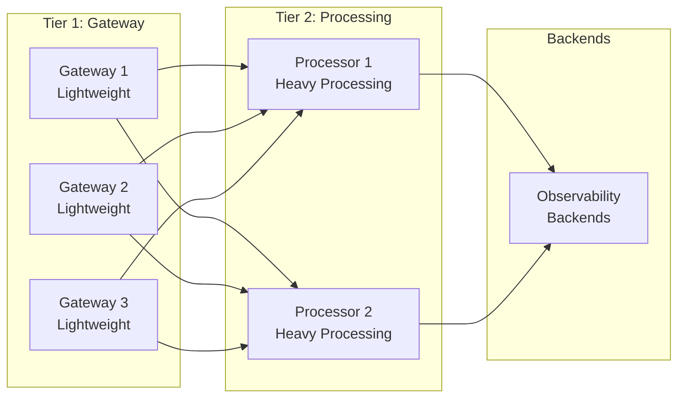
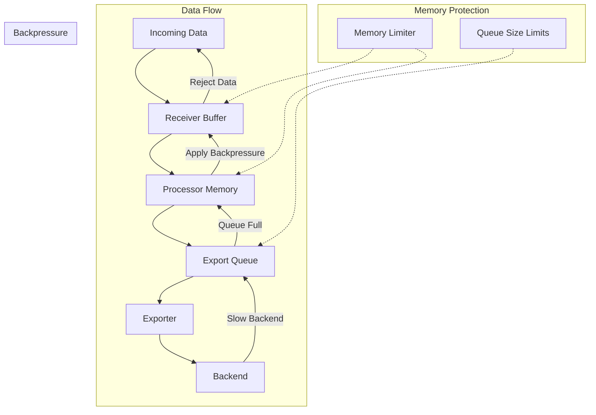
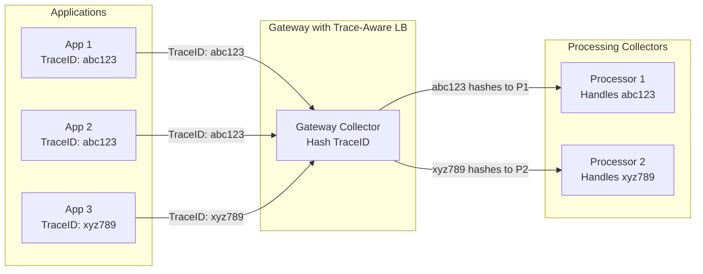
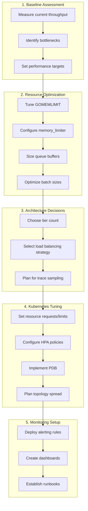

# How to Scale OpenTelemetry Collector for High-Throughput Environments

Author: [nawazdhandala](https://github.com/nawazdhandala)

Tags: OpenTelemetry, Collector, Scaling, High Availability, Performance, Cloud Native

Description: Learn how to deploy and scale OpenTelemetry Collector for high-volume telemetry ingestion.

---

## Introduction

As organizations embrace cloud-native architectures and microservices, the volume of telemetry data (traces, metrics, and logs) can grow exponentially. A single OpenTelemetry Collector instance may not be sufficient to handle millions of spans per second or terabytes of metrics data. This guide covers strategies for scaling the OpenTelemetry Collector horizontally, tuning memory and queues, implementing load balancing, and automating scaling with Kubernetes Horizontal Pod Autoscaler (HPA).

## Understanding the Scaling Challenge

Before diving into solutions, let's understand the typical bottlenecks in high-throughput environments:

1. **CPU saturation**: Processing, filtering, and transforming telemetry data is CPU-intensive
2. **Memory exhaustion**: Buffering data during export retries or backend slowdowns
3. **Network bandwidth**: Receiving and forwarding large volumes of telemetry
4. **Backend throughput**: The observability backend may become a bottleneck

## Scaled Architecture Overview

The following diagram illustrates a production-ready scaled OpenTelemetry Collector architecture:



## Deployment Patterns for Horizontal Scaling

### Two-Tier Collector Architecture

A two-tier architecture separates concerns between gateway collectors (ingestion) and processing collectors (transformation and export).



The gateway collectors are configured to be lightweight with minimal processing. They receive telemetry and forward it to processing collectors via the OTLP exporter with load balancing.

```yaml
# Gateway Collector Configuration (otel-gateway-config.yaml)
# This configuration is optimized for high-throughput ingestion with minimal processing.
# Gateway collectors accept incoming telemetry and forward it to processing collectors.

receivers:
  # OTLP receiver accepts traces, metrics, and logs over gRPC and HTTP
  # gRPC is preferred for high throughput due to better performance
  otlp:
    protocols:
      grpc:
        # Increase max receive message size to handle large batches
        max_recv_msg_size_mib: 16
        # Enable keepalive to maintain long-lived connections
        keepalive:
          server_parameters:
            max_connection_idle: 60s
            max_connection_age: 300s
            max_connection_age_grace: 60s
      http:
        # HTTP endpoint for applications that don't support gRPC
        endpoint: 0.0.0.0:4318

processors:
  # Memory limiter prevents out-of-memory conditions
  # This is critical for gateway collectors handling variable loads
  memory_limiter:
    # Start refusing data when memory reaches 80% of limit
    limit_percentage: 80
    # Start accepting data again when memory drops to 70%
    spike_limit_percentage: 70
    check_interval: 1s

  # Batch processor groups data to reduce export overhead
  # Smaller batches for gateway to maintain low latency
  batch:
    # Send batch when it reaches 1000 items
    send_batch_size: 1000
    # Or when 200ms has elapsed, whichever comes first
    timeout: 200ms
    # Maximum batch size to prevent memory issues
    send_batch_max_size: 2000

exporters:
  # Load balancing exporter distributes load across processing collectors
  # This is the key component for horizontal scaling
  loadbalancing:
    # Use round_robin for even distribution
    # Use trace_id_aware for trace-aware load balancing
    routing_key: traceID
    protocol:
      otlp:
        tls:
          insecure: true
        # Increase timeout for processing collectors
        timeout: 30s
    resolver:
      # DNS resolver automatically discovers processing collector endpoints
      dns:
        hostname: otel-processing-collector-headless.observability.svc.cluster.local
        port: 4317
        # How often to re-resolve DNS for new pods
        interval: 30s

extensions:
  # Health check endpoint for Kubernetes probes
  health_check:
    endpoint: 0.0.0.0:13133

  # zPages provides in-process debugging pages
  zpages:
    endpoint: 0.0.0.0:55679

service:
  extensions: [health_check, zpages]
  pipelines:
    # Traces pipeline with minimal processing
    traces:
      receivers: [otlp]
      processors: [memory_limiter, batch]
      exporters: [loadbalancing]

    # Metrics pipeline
    metrics:
      receivers: [otlp]
      processors: [memory_limiter, batch]
      exporters: [loadbalancing]

    # Logs pipeline
    logs:
      receivers: [otlp]
      processors: [memory_limiter, batch]
      exporters: [loadbalancing]

  # Telemetry configuration for the collector itself
  telemetry:
    logs:
      level: info
    metrics:
      # Expose collector's own metrics for monitoring
      address: 0.0.0.0:8888
```

### Processing Collector Configuration

The processing collectors handle heavy transformations, filtering, and export to multiple backends.

```yaml
# Processing Collector Configuration (otel-processor-config.yaml)
# This configuration handles heavy processing tasks: filtering, transforming,
# and exporting to multiple observability backends.

receivers:
  # Receive data from gateway collectors via OTLP
  otlp:
    protocols:
      grpc:
        endpoint: 0.0.0.0:4317
        max_recv_msg_size_mib: 32
        # Increase concurrent streams for high throughput
        max_concurrent_streams: 256
      http:
        endpoint: 0.0.0.0:4318

processors:
  # Memory limiter with higher limits for processing workloads
  memory_limiter:
    limit_percentage: 75
    spike_limit_percentage: 65
    check_interval: 1s

  # Larger batches for efficient backend writes
  batch:
    send_batch_size: 10000
    timeout: 1s
    send_batch_max_size: 20000

  # Resource processor adds common attributes to all telemetry
  # This reduces repetition across all signals
  resource:
    attributes:
      - key: environment
        value: production
        action: upsert
      - key: collector.tier
        value: processing
        action: insert

  # Filter processor removes unwanted telemetry to reduce costs
  # Be careful with filters to avoid losing important data
  filter/traces:
    traces:
      span:
        # Exclude health check spans that add noise
        - 'attributes["http.route"] == "/health"'
        - 'attributes["http.route"] == "/ready"'
        - 'attributes["http.route"] == "/metrics"'

  # Tail sampling makes intelligent sampling decisions
  # Requires trace-aware routing from gateway collectors
  tail_sampling:
    # Wait time to collect all spans of a trace
    decision_wait: 10s
    # Number of traces to keep in memory for decisions
    num_traces: 100000
    # Expected number of new traces per second
    expected_new_traces_per_sec: 10000
    policies:
      # Always sample traces with errors
      - name: errors-policy
        type: status_code
        status_code: {status_codes: [ERROR]}
      # Always sample slow traces (latency > 1 second)
      - name: latency-policy
        type: latency
        latency: {threshold_ms: 1000}
      # Sample 10% of remaining traces probabilistically
      - name: probabilistic-policy
        type: probabilistic
        probabilistic: {sampling_percentage: 10}

  # Transform processor for complex transformations
  transform:
    trace_statements:
      - context: span
        statements:
          # Truncate long attribute values to save storage
          - truncate_all(attributes, 4096)
          # Hash sensitive data
          - replace_pattern(attributes["http.url"], "password=[^&]*", "password=REDACTED")

  # Attributes processor for simple attribute modifications
  attributes/traces:
    actions:
      # Remove high-cardinality attributes that increase storage costs
      - key: http.request.header.authorization
        action: delete
      - key: http.request.header.cookie
        action: delete

exporters:
  # OTLP exporter to Tempo for traces
  otlp/tempo:
    endpoint: tempo.observability.svc.cluster.local:4317
    tls:
      insecure: true
    # Sending queue for buffering during backend issues
    sending_queue:
      enabled: true
      # Number of items in the queue
      queue_size: 10000
      # Number of concurrent export workers
      num_consumers: 20
    # Retry configuration for transient failures
    retry_on_failure:
      enabled: true
      initial_interval: 1s
      max_interval: 30s
      max_elapsed_time: 300s

  # Prometheus remote write for metrics
  prometheusremotewrite:
    endpoint: http://mimir.observability.svc.cluster.local:9009/api/v1/push
    # Resource to metric label conversion
    resource_to_telemetry_conversion:
      enabled: true
    sending_queue:
      enabled: true
      queue_size: 10000
      num_consumers: 10
    retry_on_failure:
      enabled: true
      initial_interval: 1s
      max_interval: 30s

  # OTLP exporter to Loki for logs
  otlp/loki:
    endpoint: loki.observability.svc.cluster.local:4317
    tls:
      insecure: true
    sending_queue:
      enabled: true
      queue_size: 20000
      num_consumers: 10

  # Debug exporter for troubleshooting (disable in production)
  debug:
    verbosity: basic
    sampling_initial: 5
    sampling_thereafter: 200

extensions:
  health_check:
    endpoint: 0.0.0.0:13133

  zpages:
    endpoint: 0.0.0.0:55679

  # Persistent storage for queues (prevents data loss during restarts)
  file_storage:
    directory: /var/lib/otelcol/storage
    timeout: 10s
    compaction:
      on_start: true
      on_rebound: true
      directory: /var/lib/otelcol/storage/compaction

service:
  extensions: [health_check, zpages, file_storage]
  pipelines:
    traces:
      receivers: [otlp]
      processors:
        - memory_limiter
        - filter/traces
        - tail_sampling
        - transform
        - attributes/traces
        - resource
        - batch
      exporters: [otlp/tempo]

    metrics:
      receivers: [otlp]
      processors: [memory_limiter, resource, batch]
      exporters: [prometheusremotewrite]

    logs:
      receivers: [otlp]
      processors: [memory_limiter, resource, batch]
      exporters: [otlp/loki]

  telemetry:
    logs:
      level: info
    metrics:
      address: 0.0.0.0:8888
```

## Memory and Queue Tuning

Memory management is critical for high-throughput collectors. The following diagram shows the memory flow:



### Memory Limiter Configuration Deep Dive

The memory limiter is your primary defense against OOM conditions.

```yaml
# Memory Limiter Best Practices Configuration
# This configuration provides detailed memory management settings

processors:
  memory_limiter:
    # Hard limit as percentage of total memory
    # For a pod with 4GB memory limit, this would be 3.2GB
    limit_percentage: 80

    # Soft limit for spike detection
    # When memory usage rapidly approaches the hard limit,
    # the collector starts applying backpressure earlier
    spike_limit_percentage: 65

    # How frequently to check memory usage
    # Lower values = faster reaction but higher CPU overhead
    check_interval: 1s

    # Alternative: Use fixed memory values instead of percentages
    # Useful when running outside containers or for fine-grained control
    # limit_mib: 3200
    # spike_limit_mib: 2600
```

### Queue Configuration for High Throughput

Proper queue sizing prevents data loss during backend outages.

```yaml
# Exporter Queue Configuration for High Throughput
# Queues buffer data when backends are slow or unavailable

exporters:
  otlp/tempo:
    endpoint: tempo:4317
    tls:
      insecure: true

    # Sending queue configuration
    sending_queue:
      enabled: true

      # Maximum number of batches in the queue
      # Each batch can be up to send_batch_max_size items
      # Total buffered = queue_size * batch_size
      # For 10000 * 10000 = 100 million items max buffered
      queue_size: 10000

      # Number of goroutines sending data concurrently
      # Higher values = more parallel exports
      # But also more connections to backend
      num_consumers: 20

      # Persistent storage to survive restarts
      # Requires file_storage extension
      storage: file_storage

    # Retry configuration for transient failures
    retry_on_failure:
      enabled: true

      # Start with 1 second delay between retries
      initial_interval: 1s

      # Exponential backoff multiplier (default 1.5)
      multiplier: 1.5

      # Maximum delay between retries
      max_interval: 30s

      # Stop retrying after this total elapsed time
      # Data is dropped after this if still failing
      max_elapsed_time: 300s

      # Randomization factor to prevent thundering herd
      randomization_factor: 0.5
```

### Batch Processor Optimization

The batch processor significantly impacts throughput and latency.

```yaml
# Batch Processor Configuration Comparison
# Different configurations for different use cases

processors:
  # Low-latency configuration for gateway collectors
  # Smaller batches, shorter timeouts
  batch/low-latency:
    # Send when batch reaches this size
    send_batch_size: 500
    # Or when timeout expires, whichever is first
    timeout: 100ms
    # Maximum allowed batch size
    send_batch_max_size: 1000

  # High-throughput configuration for processing collectors
  # Larger batches, longer timeouts
  batch/high-throughput:
    send_batch_size: 10000
    timeout: 1s
    send_batch_max_size: 20000

  # Balanced configuration for most use cases
  # Good trade-off between latency and throughput
  batch/balanced:
    send_batch_size: 2000
    timeout: 500ms
    send_batch_max_size: 4000

  # Memory-constrained configuration
  # Smaller batches to reduce memory pressure
  batch/memory-constrained:
    send_batch_size: 500
    timeout: 200ms
    send_batch_max_size: 1000
```

## Load Balancing Strategies

### DNS-Based Load Balancing

DNS-based load balancing is the simplest approach, relying on Kubernetes headless services.

```yaml
# Kubernetes Headless Service for Processing Collectors
# This creates DNS records for each pod IP, enabling direct pod-to-pod communication
apiVersion: v1
kind: Service
metadata:
  name: otel-processing-collector-headless
  namespace: observability
  labels:
    app: otel-processing-collector
spec:
  # ClusterIP: None makes this a headless service
  # DNS queries return all pod IPs instead of a virtual IP
  clusterIP: None
  selector:
    app: otel-processing-collector
  ports:
    - name: otlp-grpc
      port: 4317
      targetPort: 4317
    - name: otlp-http
      port: 4318
      targetPort: 4318
```

```yaml
# Load Balancing Exporter with DNS Resolver
# The loadbalancing exporter distributes traffic across discovered endpoints

exporters:
  loadbalancing:
    # Routing key determines how to distribute traffic
    # Options: traceID, service, resource, metric, streamID
    routing_key: traceID

    protocol:
      otlp:
        tls:
          insecure: true
        timeout: 30s
        # Compression reduces network bandwidth
        compression: gzip

    resolver:
      dns:
        # Headless service hostname
        hostname: otel-processing-collector-headless.observability.svc.cluster.local
        port: 4317
        # Re-resolve interval for scaling events
        # Lower values = faster detection of new pods
        interval: 10s
```

### Kubernetes Service Load Balancing

For simpler deployments, a standard Kubernetes Service provides load balancing.

```yaml
# Standard Kubernetes Service with Load Balancing
# This provides L4 load balancing via kube-proxy
apiVersion: v1
kind: Service
metadata:
  name: otel-processing-collector
  namespace: observability
spec:
  # ClusterIP is the default and provides load balancing
  type: ClusterIP
  selector:
    app: otel-processing-collector
  ports:
    - name: otlp-grpc
      port: 4317
      targetPort: 4317
    - name: otlp-http
      port: 4318
      targetPort: 4318
  # Session affinity for consistent routing (optional)
  # Useful when you need traces from the same source to go to the same collector
  sessionAffinity: None
```

### Trace-Aware Load Balancing

Trace-aware load balancing ensures all spans of a trace go to the same collector, which is required for tail sampling.



```yaml
# Trace-Aware Load Balancing Configuration
# All spans with the same TraceID are routed to the same processing collector

exporters:
  loadbalancing:
    # traceID routing ensures consistent routing for tail sampling
    routing_key: traceID

    protocol:
      otlp:
        tls:
          insecure: true
        timeout: 30s
        # gRPC compression for bandwidth efficiency
        compression: gzip
        # Configure retry at the protocol level
        retry_on_failure:
          enabled: true
          initial_interval: 500ms
          max_interval: 10s
          max_elapsed_time: 60s

    resolver:
      dns:
        hostname: otel-processing-collector-headless.observability.svc.cluster.local
        port: 4317
        interval: 10s
```

## Kubernetes Deployment with HPA

### Gateway Collector Deployment

The gateway collectors are stateless and can scale horizontally with ease.

```yaml
# Gateway Collector Kubernetes Deployment
# Optimized for high-throughput ingestion with horizontal scaling

apiVersion: apps/v1
kind: Deployment
metadata:
  name: otel-gateway-collector
  namespace: observability
  labels:
    app: otel-gateway-collector
    tier: gateway
spec:
  # Start with multiple replicas for availability
  replicas: 3
  selector:
    matchLabels:
      app: otel-gateway-collector
  template:
    metadata:
      labels:
        app: otel-gateway-collector
        tier: gateway
      annotations:
        # Prometheus scraping for collector metrics
        prometheus.io/scrape: "true"
        prometheus.io/port: "8888"
        prometheus.io/path: "/metrics"
    spec:
      # Spread pods across nodes for high availability
      topologySpreadConstraints:
        - maxSkew: 1
          topologyKey: kubernetes.io/hostname
          whenUnsatisfiable: ScheduleAnyway
          labelSelector:
            matchLabels:
              app: otel-gateway-collector

      containers:
        - name: otel-collector
          image: otel/opentelemetry-collector-contrib:0.92.0
          args:
            - --config=/etc/otelcol/config.yaml

          ports:
            - name: otlp-grpc
              containerPort: 4317
              protocol: TCP
            - name: otlp-http
              containerPort: 4318
              protocol: TCP
            - name: metrics
              containerPort: 8888
              protocol: TCP
            - name: health
              containerPort: 13133
              protocol: TCP

          # Resource requests and limits
          # Gateway collectors need less resources than processors
          resources:
            requests:
              cpu: 500m
              memory: 512Mi
            limits:
              cpu: 2000m
              memory: 2Gi

          # Environment variable for memory limiter percentage calculation
          env:
            - name: GOMEMLIMIT
              value: "1800MiB"

          # Liveness probe restarts unhealthy collectors
          livenessProbe:
            httpGet:
              path: /
              port: 13133
            initialDelaySeconds: 10
            periodSeconds: 10
            timeoutSeconds: 5
            failureThreshold: 3

          # Readiness probe removes collector from service during issues
          readinessProbe:
            httpGet:
              path: /
              port: 13133
            initialDelaySeconds: 5
            periodSeconds: 5
            timeoutSeconds: 3
            failureThreshold: 2

          volumeMounts:
            - name: config
              mountPath: /etc/otelcol
              readOnly: true

      volumes:
        - name: config
          configMap:
            name: otel-gateway-config

---
# Gateway Collector Service
# Load balancer for incoming telemetry from applications

apiVersion: v1
kind: Service
metadata:
  name: otel-gateway-collector
  namespace: observability
  labels:
    app: otel-gateway-collector
spec:
  type: ClusterIP
  selector:
    app: otel-gateway-collector
  ports:
    - name: otlp-grpc
      port: 4317
      targetPort: 4317
    - name: otlp-http
      port: 4318
      targetPort: 4318
    - name: metrics
      port: 8888
      targetPort: 8888
```

### Processing Collector StatefulSet

Processing collectors use StatefulSet for stable network identities, which is important for trace-aware routing.

```yaml
# Processing Collector Kubernetes StatefulSet
# StatefulSet provides stable identities for trace-aware load balancing

apiVersion: apps/v1
kind: StatefulSet
metadata:
  name: otel-processing-collector
  namespace: observability
  labels:
    app: otel-processing-collector
    tier: processing
spec:
  serviceName: otel-processing-collector-headless
  # Scale based on throughput requirements
  replicas: 3
  selector:
    matchLabels:
      app: otel-processing-collector

  # Parallel pod management for faster scaling
  podManagementPolicy: Parallel

  template:
    metadata:
      labels:
        app: otel-processing-collector
        tier: processing
      annotations:
        prometheus.io/scrape: "true"
        prometheus.io/port: "8888"
        prometheus.io/path: "/metrics"
    spec:
      topologySpreadConstraints:
        - maxSkew: 1
          topologyKey: kubernetes.io/hostname
          whenUnsatisfiable: ScheduleAnyway
          labelSelector:
            matchLabels:
              app: otel-processing-collector

      # Graceful shutdown to allow queue draining
      terminationGracePeriodSeconds: 60

      containers:
        - name: otel-collector
          image: otel/opentelemetry-collector-contrib:0.92.0
          args:
            - --config=/etc/otelcol/config.yaml

          ports:
            - name: otlp-grpc
              containerPort: 4317
              protocol: TCP
            - name: otlp-http
              containerPort: 4318
              protocol: TCP
            - name: metrics
              containerPort: 8888
              protocol: TCP
            - name: health
              containerPort: 13133
              protocol: TCP

          # Processing collectors need more resources
          resources:
            requests:
              cpu: 1000m
              memory: 2Gi
            limits:
              cpu: 4000m
              memory: 8Gi

          env:
            - name: GOMEMLIMIT
              value: "7200MiB"
            # Pod name for debugging
            - name: POD_NAME
              valueFrom:
                fieldRef:
                  fieldPath: metadata.name

          livenessProbe:
            httpGet:
              path: /
              port: 13133
            initialDelaySeconds: 15
            periodSeconds: 15
            timeoutSeconds: 10
            failureThreshold: 3

          readinessProbe:
            httpGet:
              path: /
              port: 13133
            initialDelaySeconds: 10
            periodSeconds: 10
            timeoutSeconds: 5
            failureThreshold: 2

          volumeMounts:
            - name: config
              mountPath: /etc/otelcol
              readOnly: true
            # Persistent storage for queue durability
            - name: queue-storage
              mountPath: /var/lib/otelcol/storage

      volumes:
        - name: config
          configMap:
            name: otel-processing-config

  # Persistent volume for queue storage
  volumeClaimTemplates:
    - metadata:
        name: queue-storage
      spec:
        accessModes: ["ReadWriteOnce"]
        storageClassName: fast-ssd
        resources:
          requests:
            storage: 50Gi

---
# Headless Service for StatefulSet DNS resolution
# Required for trace-aware load balancing from gateway collectors

apiVersion: v1
kind: Service
metadata:
  name: otel-processing-collector-headless
  namespace: observability
  labels:
    app: otel-processing-collector
spec:
  clusterIP: None
  selector:
    app: otel-processing-collector
  ports:
    - name: otlp-grpc
      port: 4317
      targetPort: 4317
    - name: otlp-http
      port: 4318
      targetPort: 4318
```

### Horizontal Pod Autoscaler Configuration

HPA automatically scales collectors based on metrics like CPU, memory, or custom metrics.

```yaml
# Gateway Collector HPA
# Scales based on CPU usage - good for ingestion workloads

apiVersion: autoscaling/v2
kind: HorizontalPodAutoscaler
metadata:
  name: otel-gateway-collector-hpa
  namespace: observability
spec:
  scaleTargetRef:
    apiVersion: apps/v1
    kind: Deployment
    name: otel-gateway-collector

  # Scaling bounds
  minReplicas: 3
  maxReplicas: 20

  metrics:
    # Scale based on CPU utilization
    # Target 60% to leave headroom for traffic spikes
    - type: Resource
      resource:
        name: cpu
        target:
          type: Utilization
          averageUtilization: 60

    # Also consider memory usage
    - type: Resource
      resource:
        name: memory
        target:
          type: Utilization
          averageUtilization: 70

  # Scaling behavior configuration
  behavior:
    # Scale up quickly to handle traffic spikes
    scaleUp:
      # Stabilization window prevents flapping
      stabilizationWindowSeconds: 30
      policies:
        # Add up to 4 pods at a time
        - type: Pods
          value: 4
          periodSeconds: 30
        # Or increase by 100%
        - type: Percent
          value: 100
          periodSeconds: 30
      # Use the policy that adds the most pods
      selectPolicy: Max

    # Scale down slowly to avoid dropping data
    scaleDown:
      stabilizationWindowSeconds: 300
      policies:
        # Remove at most 1 pod per minute
        - type: Pods
          value: 1
          periodSeconds: 60
      selectPolicy: Min

---
# Processing Collector HPA
# Scales based on custom metrics from the collector itself

apiVersion: autoscaling/v2
kind: HorizontalPodAutoscaler
metadata:
  name: otel-processing-collector-hpa
  namespace: observability
spec:
  scaleTargetRef:
    apiVersion: apps/v1
    kind: StatefulSet
    name: otel-processing-collector

  minReplicas: 3
  maxReplicas: 15

  metrics:
    # CPU-based scaling
    - type: Resource
      resource:
        name: cpu
        target:
          type: Utilization
          averageUtilization: 70

    # Memory-based scaling
    - type: Resource
      resource:
        name: memory
        target:
          type: Utilization
          averageUtilization: 75

    # Custom metric: exporter queue size
    # Requires Prometheus Adapter or KEDA
    - type: Pods
      pods:
        metric:
          name: otelcol_exporter_queue_size
        target:
          type: AverageValue
          # Scale when average queue size exceeds 5000
          averageValue: "5000"

  behavior:
    scaleUp:
      stabilizationWindowSeconds: 60
      policies:
        - type: Pods
          value: 2
          periodSeconds: 60
      selectPolicy: Max

    scaleDown:
      # Longer stabilization for processing collectors
      stabilizationWindowSeconds: 600
      policies:
        - type: Pods
          value: 1
          periodSeconds: 120
      selectPolicy: Min
```

### PodDisruptionBudget for High Availability

Ensure minimum availability during node maintenance or rolling updates.

```yaml
# PodDisruptionBudget for Gateway Collectors
# Ensures minimum availability during disruptions

apiVersion: policy/v1
kind: PodDisruptionBudget
metadata:
  name: otel-gateway-collector-pdb
  namespace: observability
spec:
  # At least 2 pods must always be available
  minAvailable: 2
  selector:
    matchLabels:
      app: otel-gateway-collector

---
# PodDisruptionBudget for Processing Collectors
# More conservative to protect tail sampling state

apiVersion: policy/v1
kind: PodDisruptionBudget
metadata:
  name: otel-processing-collector-pdb
  namespace: observability
spec:
  # Allow only 1 pod to be unavailable at a time
  maxUnavailable: 1
  selector:
    matchLabels:
      app: otel-processing-collector
```

## Monitoring the Collector Fleet

### Prometheus Rules for Collector Monitoring

Monitor your collector fleet with these Prometheus alerting rules.

```yaml
# PrometheusRule for OpenTelemetry Collector Monitoring
# These rules help detect scaling issues before they impact data collection

apiVersion: monitoring.coreos.com/v1
kind: PrometheusRule
metadata:
  name: otel-collector-alerts
  namespace: observability
spec:
  groups:
    - name: otel-collector
      rules:
        # Alert when data is being dropped due to memory pressure
        - alert: OtelCollectorMemoryLimitReached
          expr: |
            rate(otelcol_processor_refused_spans_total[5m]) > 0
          for: 2m
          labels:
            severity: warning
          annotations:
            summary: "Collector {{ $labels.pod }} is dropping spans due to memory limits"
            description: "Memory limiter is actively refusing data. Consider scaling up."

        # Alert when export queue is filling up
        - alert: OtelCollectorExportQueueHigh
          expr: |
            otelcol_exporter_queue_size > 8000
          for: 5m
          labels:
            severity: warning
          annotations:
            summary: "Export queue on {{ $labels.pod }} is above 80% capacity"
            description: "Queue size is {{ $value }}. Backend may be slow or unavailable."

        # Alert when exports are failing
        - alert: OtelCollectorExportErrors
          expr: |
            rate(otelcol_exporter_send_failed_spans_total[5m]) > 100
          for: 5m
          labels:
            severity: critical
          annotations:
            summary: "Collector {{ $labels.pod }} experiencing export failures"
            description: "{{ $value }} spans/second are failing to export."

        # Alert when receiver is dropping data
        - alert: OtelCollectorReceiverErrors
          expr: |
            rate(otelcol_receiver_refused_spans_total[5m]) > 0
          for: 2m
          labels:
            severity: warning
          annotations:
            summary: "Collector {{ $labels.pod }} is refusing incoming spans"
            description: "Receiver is under pressure. Check memory and CPU."

        # Alert when collector pods are not ready
        - alert: OtelCollectorPodsNotReady
          expr: |
            kube_statefulset_status_replicas_ready{statefulset="otel-processing-collector"}
            < kube_statefulset_status_replicas{statefulset="otel-processing-collector"}
          for: 5m
          labels:
            severity: warning
          annotations:
            summary: "Not all processing collector pods are ready"
            description: "{{ $value }} pods are not ready."

        # Alert on high CPU usage indicating need to scale
        - alert: OtelCollectorHighCPU
          expr: |
            avg(rate(container_cpu_usage_seconds_total{
              pod=~"otel-.*-collector-.*"
            }[5m])) by (pod) > 0.8
          for: 10m
          labels:
            severity: warning
          annotations:
            summary: "Collector {{ $labels.pod }} CPU usage above 80%"
            description: "Consider scaling horizontally if this persists."
```

### Grafana Dashboard Queries

Key metrics to visualize in your Grafana dashboard.

```promql
# Spans received per second across all collectors
sum(rate(otelcol_receiver_accepted_spans_total[5m])) by (receiver)

# Spans exported per second to each backend
sum(rate(otelcol_exporter_sent_spans_total[5m])) by (exporter)

# Export queue utilization percentage
(otelcol_exporter_queue_size / otelcol_exporter_queue_capacity) * 100

# Memory usage per collector pod
container_memory_usage_bytes{pod=~"otel-.*-collector-.*"} / container_spec_memory_limit_bytes{pod=~"otel-.*-collector-.*"} * 100

# Dropped data due to memory limits
sum(rate(otelcol_processor_refused_spans_total[5m])) by (pod)

# Export latency percentiles
histogram_quantile(0.95, sum(rate(otelcol_exporter_send_latency_bucket[5m])) by (le, exporter))

# Processing latency across the pipeline
histogram_quantile(0.95, sum(rate(otelcol_processor_latency_bucket[5m])) by (le, processor))
```

## Performance Tuning Checklist

Use this checklist when tuning your collector deployment:



## Best Practices Summary

1. **Use a two-tier architecture**: Separate ingestion (gateway) from processing to scale each tier independently.

2. **Enable trace-aware routing**: When using tail sampling, ensure all spans of a trace go to the same processing collector.

3. **Size memory appropriately**: Set GOMEMLIMIT to 90% of container memory limit, and configure memory_limiter at 80%.

4. **Use persistent queues**: Enable file_storage extension for queue durability during restarts.

5. **Scale horizontally first**: Add more collector instances before increasing individual pod resources.

6. **Monitor collector health**: Track queue sizes, drop rates, and export latencies to detect issues early.

7. **Use gradual scaling policies**: Scale up fast but scale down slowly to prevent data loss during traffic fluctuations.

8. **Implement PodDisruptionBudgets**: Ensure minimum availability during cluster maintenance.

9. **Spread pods across nodes**: Use topology spread constraints to prevent single points of failure.

10. **Test at scale**: Simulate production load in staging to validate your configuration before deploying.

## Conclusion

Scaling the OpenTelemetry Collector for high-throughput environments requires careful consideration of architecture, resource allocation, and operational practices. By implementing a tiered architecture with proper load balancing, tuning memory and queues appropriately, and leveraging Kubernetes autoscaling features, you can build a robust telemetry pipeline capable of handling millions of events per second.

The key is to start with a solid foundation, monitor extensively, and iterate based on real-world observations. As your telemetry volume grows, this infrastructure will scale with you, ensuring you never lose visibility into your systems.
