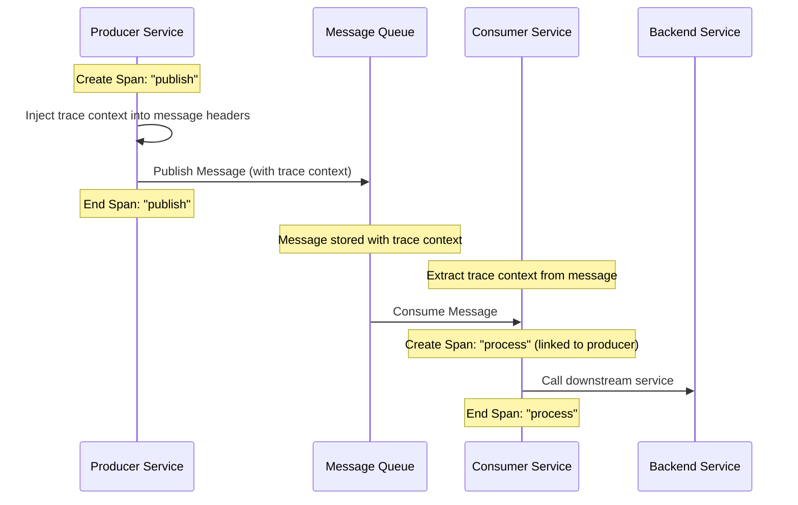
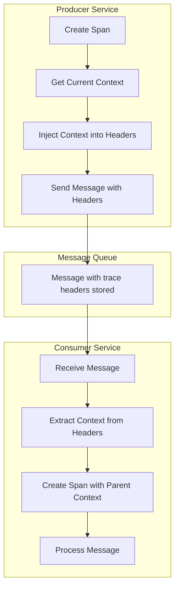

# How to Instrument Message Queues with OpenTelemetry (Kafka, RabbitMQ, SQS)

Author: [nawazdhandala](https://github.com/nawazdhandala)

Tags: OpenTelemetry, Observability, Kafka, RabbitMQ, AWS SQS, Messaging, Tracing

Description: Learn how to trace message-driven applications with OpenTelemetry for asynchronous workflow visibility.

---

Message queues are the backbone of modern distributed systems, enabling asynchronous communication between services. However, tracing requests through these asynchronous boundaries presents unique challenges. When a message is published to a queue and consumed later by a different service, how do you maintain end-to-end visibility? This is where OpenTelemetry shines.

In this comprehensive guide, we will explore how to instrument three popular message queue systems - Apache Kafka, RabbitMQ, and AWS SQS - using OpenTelemetry. You will learn how to propagate trace context through messages, create meaningful spans, and gain complete visibility into your asynchronous workflows.

## Table of Contents

1. [Understanding Async Tracing Challenges](#understanding-async-tracing-challenges)
2. [OpenTelemetry Messaging Semantic Conventions](#opentelemetry-messaging-semantic-conventions)
3. [Apache Kafka Instrumentation](#apache-kafka-instrumentation)
4. [RabbitMQ Instrumentation](#rabbitmq-instrumentation)
5. [AWS SQS Instrumentation](#aws-sqs-instrumentation)
6. [Context Propagation Deep Dive](#context-propagation-deep-dive)
7. [Best Practices and Common Patterns](#best-practices-and-common-patterns)
8. [Troubleshooting Guide](#troubleshooting-guide)

## Understanding Async Tracing Challenges

When tracing synchronous HTTP requests, the flow is straightforward - one service calls another, and the trace context travels in the request headers. Message queues introduce complexity because:

1. **Temporal Decoupling**: The producer and consumer operate at different times
2. **Spatial Decoupling**: Producer and consumer may be entirely different applications
3. **Multiple Consumers**: A single message might be processed by multiple consumers
4. **Retry and Dead Letter Queues**: Messages can be reprocessed or moved between queues

The following diagram illustrates the asynchronous tracing flow:



## OpenTelemetry Messaging Semantic Conventions

OpenTelemetry defines semantic conventions for messaging systems that ensure consistency across different queue implementations. Here are the key attributes:

| Attribute | Description | Example |
|-----------|-------------|---------|
| `messaging.system` | The messaging system identifier | `kafka`, `rabbitmq`, `aws_sqs` |
| `messaging.destination.name` | The message destination name | `orders-topic`, `user-events` |
| `messaging.operation` | The operation being performed | `publish`, `receive`, `process` |
| `messaging.message.id` | Unique identifier of the message | `msg-12345` |
| `messaging.kafka.partition` | Kafka partition (Kafka-specific) | `3` |
| `messaging.rabbitmq.routing_key` | Routing key (RabbitMQ-specific) | `user.created` |

## Apache Kafka Instrumentation

Apache Kafka is one of the most widely used distributed streaming platforms. Let's explore how to instrument both producers and consumers.

### Setting Up OpenTelemetry for Kafka

First, we need to set up the OpenTelemetry SDK and configure the necessary dependencies. The following code initializes the tracer provider with an OTLP exporter:

```python
# Initialize OpenTelemetry SDK with OTLP exporter for Kafka applications
# This setup is required before any instrumentation can work

from opentelemetry import trace
from opentelemetry.sdk.trace import TracerProvider
from opentelemetry.sdk.trace.export import BatchSpanProcessor
from opentelemetry.exporter.otlp.proto.grpc.trace_exporter import OTLPSpanExporter
from opentelemetry.sdk.resources import Resource, SERVICE_NAME

# Create a resource that identifies this service in traces
# This helps distinguish spans from different services in your trace viewer
resource = Resource(attributes={
    SERVICE_NAME: "kafka-order-service"
})

# Initialize the tracer provider with our service resource
# The tracer provider is the central configuration point for tracing
provider = TracerProvider(resource=resource)

# Configure the OTLP exporter to send traces to your collector
# Replace the endpoint with your actual OpenTelemetry Collector address
otlp_exporter = OTLPSpanExporter(
    endpoint="http://localhost:4317",  # gRPC endpoint
    insecure=True  # Set to False in production with TLS
)

# Use BatchSpanProcessor for better performance
# It batches spans and sends them periodically rather than one at a time
provider.add_span_processor(BatchSpanProcessor(otlp_exporter))

# Register the provider globally so all tracers use this configuration
trace.set_tracer_provider(provider)

# Create a tracer instance for this module
tracer = trace.get_tracer(__name__)
```

### Kafka Producer Instrumentation

The producer is responsible for creating the initial span and injecting the trace context into the message headers. This allows consumers to continue the trace:

```python
# Kafka Producer with OpenTelemetry instrumentation
# This example shows manual instrumentation for complete control

from kafka import KafkaProducer
from opentelemetry import trace
from opentelemetry.propagate import inject
from opentelemetry.trace import SpanKind
import json

# Get the tracer for this module
tracer = trace.get_tracer(__name__)

class InstrumentedKafkaProducer:
    """
    A Kafka producer wrapper that automatically creates spans
    and propagates trace context through message headers.
    """

    def __init__(self, bootstrap_servers: list):
        # Initialize the underlying Kafka producer
        # We use a custom serializer to handle JSON encoding
        self.producer = KafkaProducer(
            bootstrap_servers=bootstrap_servers,
            value_serializer=lambda v: json.dumps(v).encode('utf-8'),
            key_serializer=lambda k: k.encode('utf-8') if k else None
        )

    def send_message(self, topic: str, key: str, value: dict):
        """
        Send a message to Kafka with OpenTelemetry tracing.

        Args:
            topic: The Kafka topic to publish to
            key: The message key for partitioning
            value: The message payload as a dictionary
        """
        # Create a PRODUCER span for this publish operation
        # SpanKind.PRODUCER indicates this is a message producer
        with tracer.start_as_current_span(
            name=f"{topic} publish",  # Span name follows convention: <destination> <operation>
            kind=SpanKind.PRODUCER,
        ) as span:
            # Set semantic convention attributes for messaging
            # These attributes help with filtering and analysis in your trace viewer
            span.set_attribute("messaging.system", "kafka")
            span.set_attribute("messaging.destination.name", topic)
            span.set_attribute("messaging.operation", "publish")
            span.set_attribute("messaging.kafka.message.key", key)

            # Prepare headers dictionary for trace context injection
            # Kafka headers are key-value pairs where values are bytes
            headers = {}

            # Inject the current trace context into the headers
            # This is the critical step that enables distributed tracing
            # The inject function adds traceparent and tracestate headers
            inject(headers)

            # Convert headers to Kafka's expected format (list of tuples with bytes values)
            kafka_headers = [
                (k, v.encode('utf-8') if isinstance(v, str) else v)
                for k, v in headers.items()
            ]

            # Send the message with the trace context in headers
            future = self.producer.send(
                topic=topic,
                key=key,
                value=value,
                headers=kafka_headers
            )

            # Wait for the send to complete and get metadata
            # This allows us to capture partition and offset information
            try:
                record_metadata = future.get(timeout=10)

                # Add metadata to the span for debugging
                span.set_attribute("messaging.kafka.partition", record_metadata.partition)
                span.set_attribute("messaging.kafka.offset", record_metadata.offset)

            except Exception as e:
                # Record the exception in the span for error tracking
                span.record_exception(e)
                span.set_status(trace.StatusCode.ERROR, str(e))
                raise

# Example usage demonstrating the instrumented producer
if __name__ == "__main__":
    producer = InstrumentedKafkaProducer(
        bootstrap_servers=['localhost:9092']
    )

    # Send an order created event
    # The trace context will be automatically injected into the message
    producer.send_message(
        topic="orders",
        key="order-12345",
        value={
            "order_id": "order-12345",
            "customer_id": "cust-789",
            "items": [{"sku": "PROD-001", "quantity": 2}],
            "total": 99.99
        }
    )
```

### Kafka Consumer Instrumentation

The consumer extracts the trace context from the message headers and creates a new span that is linked to the producer's span:

```python
# Kafka Consumer with OpenTelemetry instrumentation
# Extracts trace context from message headers to continue the distributed trace

from kafka import KafkaConsumer
from opentelemetry import trace
from opentelemetry.propagate import extract
from opentelemetry.trace import SpanKind, Link
from opentelemetry.context import Context
import json

tracer = trace.get_tracer(__name__)

class InstrumentedKafkaConsumer:
    """
    A Kafka consumer wrapper that extracts trace context from messages
    and creates properly linked spans for processing.
    """

    def __init__(self, topic: str, group_id: str, bootstrap_servers: list):
        # Initialize the Kafka consumer with group management
        self.consumer = KafkaConsumer(
            topic,
            group_id=group_id,
            bootstrap_servers=bootstrap_servers,
            value_deserializer=lambda v: json.loads(v.decode('utf-8')),
            auto_offset_reset='earliest',
            enable_auto_commit=False  # Manual commit for reliability
        )
        self.topic = topic

    def _extract_context_from_headers(self, headers: list) -> Context:
        """
        Extract OpenTelemetry context from Kafka message headers.

        Args:
            headers: List of (key, value) tuples from Kafka message

        Returns:
            OpenTelemetry Context object containing trace information
        """
        # Convert Kafka headers (bytes) to a dictionary (strings)
        # The extract function expects string values
        carrier = {}
        if headers:
            for key, value in headers:
                if value is not None:
                    carrier[key] = value.decode('utf-8')

        # Extract the trace context using the configured propagator
        # This returns a Context object that can be used to create linked spans
        return extract(carrier)

    def process_messages(self, handler_func):
        """
        Consume and process messages with tracing.

        Args:
            handler_func: A function that processes each message value
        """
        for message in self.consumer:
            # Extract the trace context from the producer's headers
            # This context contains the trace ID and parent span ID
            ctx = self._extract_context_from_headers(message.headers)

            # Get the span context from the extracted context
            # This is used to create a link to the producer span
            span_context = trace.get_current_span(ctx).get_span_context()

            # Create links if the span context is valid
            # Links connect causally related spans that aren't parent-child
            links = []
            if span_context.is_valid:
                links.append(Link(span_context))

            # Create a CONSUMER span for processing this message
            # We use the extracted context as the parent to maintain trace continuity
            with tracer.start_as_current_span(
                name=f"{self.topic} process",
                context=ctx,  # Use extracted context as parent
                kind=SpanKind.CONSUMER,
                links=links,  # Link to producer span for additional context
            ) as span:
                # Set messaging semantic convention attributes
                span.set_attribute("messaging.system", "kafka")
                span.set_attribute("messaging.destination.name", self.topic)
                span.set_attribute("messaging.operation", "process")
                span.set_attribute("messaging.kafka.partition", message.partition)
                span.set_attribute("messaging.kafka.offset", message.offset)
                span.set_attribute("messaging.kafka.consumer.group",
                                   self.consumer.config['group_id'])

                # Add message key if present
                if message.key:
                    span.set_attribute("messaging.kafka.message.key",
                                       message.key.decode('utf-8'))

                try:
                    # Process the message using the provided handler
                    # Any spans created in the handler will be children of this span
                    handler_func(message.value)

                    # Commit the offset after successful processing
                    self.consumer.commit()

                except Exception as e:
                    # Record the exception for debugging
                    span.record_exception(e)
                    span.set_status(trace.StatusCode.ERROR, str(e))
                    # In production, you might want to implement retry logic
                    # or send to a dead letter queue
                    raise

# Example message handler that demonstrates nested tracing
def process_order(order_data: dict):
    """
    Process an order message.
    This function can create additional spans for sub-operations.
    """
    with tracer.start_as_current_span("validate_order") as span:
        span.set_attribute("order.id", order_data.get("order_id"))
        # Validation logic here
        print(f"Processing order: {order_data['order_id']}")

    with tracer.start_as_current_span("save_to_database") as span:
        span.set_attribute("order.id", order_data.get("order_id"))
        # Database save logic here
        pass

# Example usage
if __name__ == "__main__":
    consumer = InstrumentedKafkaConsumer(
        topic="orders",
        group_id="order-processor",
        bootstrap_servers=['localhost:9092']
    )
    consumer.process_messages(process_order)
```

### Using Auto-Instrumentation for Kafka

For simpler setups, you can use the OpenTelemetry auto-instrumentation library which automatically instruments the kafka-python library:

```python
# Auto-instrumentation approach for Kafka
# This is simpler but offers less control over span attributes

from opentelemetry.instrumentation.kafka import KafkaInstrumentor

# Enable automatic instrumentation for all Kafka operations
# This must be called before creating any Kafka producers or consumers
KafkaInstrumentor().instrument()

# Now any KafkaProducer or KafkaConsumer you create will be automatically traced
from kafka import KafkaProducer, KafkaConsumer

# This producer is automatically instrumented
producer = KafkaProducer(bootstrap_servers=['localhost:9092'])

# Spans will be created automatically for send() calls
producer.send('my-topic', b'my-message')
```

## RabbitMQ Instrumentation

RabbitMQ uses the AMQP protocol and has a different model with exchanges, queues, and routing keys. Here's how to instrument it properly.

### RabbitMQ Producer (Publisher) Instrumentation

The publisher creates a span and injects the trace context into the AMQP message properties:

```python
# RabbitMQ Publisher with OpenTelemetry instrumentation
# Uses pika library for AMQP communication

import pika
import json
from opentelemetry import trace
from opentelemetry.propagate import inject
from opentelemetry.trace import SpanKind

tracer = trace.get_tracer(__name__)

class InstrumentedRabbitMQPublisher:
    """
    A RabbitMQ publisher that creates tracing spans and propagates
    context through AMQP message headers.
    """

    def __init__(self, host: str, port: int = 5672):
        # Establish connection to RabbitMQ
        self.connection = pika.BlockingConnection(
            pika.ConnectionParameters(host=host, port=port)
        )
        self.channel = self.connection.channel()

    def declare_exchange(self, exchange: str, exchange_type: str = 'topic'):
        """Declare an exchange for publishing messages."""
        self.channel.exchange_declare(
            exchange=exchange,
            exchange_type=exchange_type,
            durable=True
        )

    def publish(self, exchange: str, routing_key: str, message: dict):
        """
        Publish a message with OpenTelemetry tracing.

        Args:
            exchange: The exchange to publish to
            routing_key: The routing key for message routing
            message: The message payload as a dictionary
        """
        # Create a PRODUCER span for this publish operation
        # The span name includes both exchange and routing key for clarity
        with tracer.start_as_current_span(
            name=f"{exchange} publish",
            kind=SpanKind.PRODUCER,
        ) as span:
            # Set RabbitMQ-specific semantic convention attributes
            span.set_attribute("messaging.system", "rabbitmq")
            span.set_attribute("messaging.destination.name", exchange)
            span.set_attribute("messaging.operation", "publish")
            span.set_attribute("messaging.rabbitmq.routing_key", routing_key)

            # Prepare headers for trace context injection
            # RabbitMQ supports arbitrary headers in message properties
            headers = {}
            inject(headers)

            # Create message properties with trace context headers
            # We also set delivery_mode=2 for persistent messages
            properties = pika.BasicProperties(
                headers=headers,
                content_type='application/json',
                delivery_mode=2,  # Persistent message
            )

            # Serialize and publish the message
            body = json.dumps(message).encode('utf-8')

            try:
                self.channel.basic_publish(
                    exchange=exchange,
                    routing_key=routing_key,
                    body=body,
                    properties=properties
                )

                # Add message size for performance analysis
                span.set_attribute("messaging.message.body.size", len(body))

            except Exception as e:
                span.record_exception(e)
                span.set_status(trace.StatusCode.ERROR, str(e))
                raise

    def close(self):
        """Clean up the connection."""
        self.connection.close()

# Example usage
if __name__ == "__main__":
    publisher = InstrumentedRabbitMQPublisher(host='localhost')
    publisher.declare_exchange('events', 'topic')

    # Publish a user registration event
    publisher.publish(
        exchange='events',
        routing_key='user.registered',
        message={
            'user_id': 'user-456',
            'email': 'user@example.com',
            'registered_at': '2024-01-15T10:30:00Z'
        }
    )

    publisher.close()
```

### RabbitMQ Consumer Instrumentation

The consumer extracts the trace context from the AMQP headers and creates a linked span:

```python
# RabbitMQ Consumer with OpenTelemetry instrumentation
# Handles message consumption with proper trace context extraction

import pika
import json
from opentelemetry import trace
from opentelemetry.propagate import extract
from opentelemetry.trace import SpanKind, Link

tracer = trace.get_tracer(__name__)

class InstrumentedRabbitMQConsumer:
    """
    A RabbitMQ consumer that extracts trace context from messages
    and creates spans for message processing.
    """

    def __init__(self, host: str, port: int = 5672):
        self.connection = pika.BlockingConnection(
            pika.ConnectionParameters(host=host, port=port)
        )
        self.channel = self.connection.channel()

    def declare_queue(self, queue: str, exchange: str, routing_keys: list):
        """
        Declare a queue and bind it to an exchange with routing keys.

        Args:
            queue: The queue name
            exchange: The exchange to bind to
            routing_keys: List of routing keys to bind
        """
        # Declare a durable queue that survives broker restarts
        self.channel.queue_declare(queue=queue, durable=True)

        # Bind the queue to the exchange for each routing key
        for routing_key in routing_keys:
            self.channel.queue_bind(
                queue=queue,
                exchange=exchange,
                routing_key=routing_key
            )

    def _create_callback(self, handler_func):
        """
        Create a callback wrapper that handles tracing for each message.

        Args:
            handler_func: The actual message processing function
        """
        def callback(ch, method, properties, body):
            # Extract trace context from AMQP message headers
            # Properties.headers contains our injected trace context
            headers = properties.headers or {}
            ctx = extract(headers)

            # Get the span context to create a link
            span_context = trace.get_current_span(ctx).get_span_context()
            links = []
            if span_context.is_valid:
                links.append(Link(span_context))

            # Create a CONSUMER span with the extracted context as parent
            # This maintains the trace chain from producer to consumer
            with tracer.start_as_current_span(
                name=f"{method.exchange} process",
                context=ctx,
                kind=SpanKind.CONSUMER,
                links=links,
            ) as span:
                # Set RabbitMQ-specific attributes
                span.set_attribute("messaging.system", "rabbitmq")
                span.set_attribute("messaging.destination.name", method.exchange)
                span.set_attribute("messaging.operation", "process")
                span.set_attribute("messaging.rabbitmq.routing_key", method.routing_key)
                span.set_attribute("messaging.message.body.size", len(body))

                try:
                    # Parse the message body
                    message = json.loads(body.decode('utf-8'))

                    # Process the message
                    handler_func(message, method.routing_key)

                    # Acknowledge the message after successful processing
                    ch.basic_ack(delivery_tag=method.delivery_tag)

                except json.JSONDecodeError as e:
                    # Handle malformed messages
                    span.record_exception(e)
                    span.set_status(trace.StatusCode.ERROR, "Invalid JSON")
                    # Reject without requeue for malformed messages
                    ch.basic_nack(delivery_tag=method.delivery_tag, requeue=False)

                except Exception as e:
                    # Handle processing errors
                    span.record_exception(e)
                    span.set_status(trace.StatusCode.ERROR, str(e))
                    # Reject with requeue for transient errors
                    ch.basic_nack(delivery_tag=method.delivery_tag, requeue=True)

        return callback

    def consume(self, queue: str, handler_func):
        """
        Start consuming messages from a queue.

        Args:
            queue: The queue to consume from
            handler_func: Function to process each message
        """
        # Set prefetch count to control how many unacked messages the consumer holds
        self.channel.basic_qos(prefetch_count=1)

        # Register the callback with tracing wrapper
        self.channel.basic_consume(
            queue=queue,
            on_message_callback=self._create_callback(handler_func)
        )

        print(f"Starting to consume from queue: {queue}")
        self.channel.start_consuming()

    def close(self):
        """Clean up the connection."""
        self.connection.close()

# Example message handler
def handle_user_event(message: dict, routing_key: str):
    """
    Handle user-related events.
    Creates child spans for different processing steps.
    """
    with tracer.start_as_current_span("process_user_event") as span:
        span.set_attribute("event.routing_key", routing_key)
        span.set_attribute("user.id", message.get('user_id'))

        if routing_key == 'user.registered':
            # Send welcome email
            with tracer.start_as_current_span("send_welcome_email"):
                print(f"Sending welcome email to {message.get('email')}")

        elif routing_key == 'user.updated':
            # Update search index
            with tracer.start_as_current_span("update_search_index"):
                print(f"Updating search index for user {message.get('user_id')}")

# Example usage
if __name__ == "__main__":
    consumer = InstrumentedRabbitMQConsumer(host='localhost')
    consumer.declare_queue(
        queue='user-events-processor',
        exchange='events',
        routing_keys=['user.registered', 'user.updated', 'user.deleted']
    )
    consumer.consume('user-events-processor', handle_user_event)
```

## AWS SQS Instrumentation

AWS SQS (Simple Queue Service) is a managed message queue service. Instrumenting it requires handling message attributes for context propagation.

### SQS Producer Instrumentation

The producer sends messages with trace context in the SQS message attributes:

```python
# AWS SQS Producer with OpenTelemetry instrumentation
# Uses boto3 for AWS SDK operations

import boto3
import json
from opentelemetry import trace
from opentelemetry.propagate import inject
from opentelemetry.trace import SpanKind

tracer = trace.get_tracer(__name__)

class InstrumentedSQSProducer:
    """
    An SQS producer that creates spans and propagates trace context
    through SQS message attributes.
    """

    def __init__(self, region_name: str = 'us-east-1'):
        # Initialize the SQS client
        # In production, credentials are typically handled via IAM roles
        self.sqs = boto3.client('sqs', region_name=region_name)

    def send_message(self, queue_url: str, message: dict, message_group_id: str = None):
        """
        Send a message to SQS with OpenTelemetry tracing.

        Args:
            queue_url: The URL of the SQS queue
            message: The message payload as a dictionary
            message_group_id: Required for FIFO queues
        """
        # Extract queue name from URL for the span name
        queue_name = queue_url.split('/')[-1]

        # Create a PRODUCER span for this send operation
        with tracer.start_as_current_span(
            name=f"{queue_name} publish",
            kind=SpanKind.PRODUCER,
        ) as span:
            # Set SQS-specific semantic convention attributes
            span.set_attribute("messaging.system", "aws_sqs")
            span.set_attribute("messaging.destination.name", queue_name)
            span.set_attribute("messaging.operation", "publish")
            span.set_attribute("messaging.url", queue_url)

            # Prepare a carrier for trace context injection
            carrier = {}
            inject(carrier)

            # Convert trace context to SQS message attributes format
            # SQS message attributes have a specific structure with DataType
            message_attributes = {}
            for key, value in carrier.items():
                message_attributes[key] = {
                    'DataType': 'String',
                    'StringValue': value
                }

            # Build the send message request
            send_params = {
                'QueueUrl': queue_url,
                'MessageBody': json.dumps(message),
                'MessageAttributes': message_attributes
            }

            # Add MessageGroupId for FIFO queues
            # FIFO queues require this for message ordering
            if message_group_id:
                send_params['MessageGroupId'] = message_group_id
                span.set_attribute("messaging.sqs.message_group_id", message_group_id)

            try:
                # Send the message
                response = self.sqs.send_message(**send_params)

                # Add response metadata to the span
                span.set_attribute("messaging.message.id", response['MessageId'])

                # For FIFO queues, also record the sequence number
                if 'SequenceNumber' in response:
                    span.set_attribute("messaging.sqs.sequence_number",
                                       response['SequenceNumber'])

                return response['MessageId']

            except Exception as e:
                span.record_exception(e)
                span.set_status(trace.StatusCode.ERROR, str(e))
                raise

    def send_message_batch(self, queue_url: str, messages: list):
        """
        Send multiple messages in a batch with individual tracing.

        Args:
            queue_url: The URL of the SQS queue
            messages: List of message dictionaries with 'id', 'body', and optional 'group_id'
        """
        queue_name = queue_url.split('/')[-1]

        # Create a parent span for the batch operation
        with tracer.start_as_current_span(
            name=f"{queue_name} publish_batch",
            kind=SpanKind.PRODUCER,
        ) as batch_span:
            batch_span.set_attribute("messaging.system", "aws_sqs")
            batch_span.set_attribute("messaging.destination.name", queue_name)
            batch_span.set_attribute("messaging.operation", "publish")
            batch_span.set_attribute("messaging.batch.message_count", len(messages))

            # Build batch entries with trace context
            entries = []
            for msg in messages:
                # Each message in the batch gets the current trace context
                carrier = {}
                inject(carrier)

                message_attributes = {
                    key: {'DataType': 'String', 'StringValue': value}
                    for key, value in carrier.items()
                }

                entry = {
                    'Id': msg['id'],
                    'MessageBody': json.dumps(msg['body']),
                    'MessageAttributes': message_attributes
                }

                if msg.get('group_id'):
                    entry['MessageGroupId'] = msg['group_id']

                entries.append(entry)

            try:
                response = self.sqs.send_message_batch(
                    QueueUrl=queue_url,
                    Entries=entries
                )

                # Record success and failure counts
                successful = response.get('Successful', [])
                failed = response.get('Failed', [])

                batch_span.set_attribute("messaging.batch.successful_count", len(successful))
                batch_span.set_attribute("messaging.batch.failed_count", len(failed))

                if failed:
                    batch_span.set_status(trace.StatusCode.ERROR,
                                          f"{len(failed)} messages failed")

                return response

            except Exception as e:
                batch_span.record_exception(e)
                batch_span.set_status(trace.StatusCode.ERROR, str(e))
                raise

# Example usage
if __name__ == "__main__":
    producer = InstrumentedSQSProducer(region_name='us-east-1')

    # Send a single message
    message_id = producer.send_message(
        queue_url='https://sqs.us-east-1.amazonaws.com/123456789/orders-queue',
        message={
            'order_id': 'order-789',
            'action': 'process',
            'priority': 'high'
        }
    )
    print(f"Sent message: {message_id}")
```

### SQS Consumer Instrumentation

The consumer polls messages and extracts trace context from message attributes:

```python
# AWS SQS Consumer with OpenTelemetry instrumentation
# Implements long polling with proper trace context extraction

import boto3
import json
from opentelemetry import trace
from opentelemetry.propagate import extract
from opentelemetry.trace import SpanKind, Link

tracer = trace.get_tracer(__name__)

class InstrumentedSQSConsumer:
    """
    An SQS consumer that extracts trace context from message attributes
    and creates spans for message processing.
    """

    def __init__(self, region_name: str = 'us-east-1'):
        self.sqs = boto3.client('sqs', region_name=region_name)

    def _extract_context_from_attributes(self, message_attributes: dict):
        """
        Extract OpenTelemetry context from SQS message attributes.

        Args:
            message_attributes: Dictionary of SQS message attributes

        Returns:
            OpenTelemetry Context object
        """
        # Convert SQS message attributes to a simple carrier dictionary
        # The extract function expects simple string key-value pairs
        carrier = {}
        for key, attr in message_attributes.items():
            if attr.get('DataType') == 'String':
                carrier[key] = attr.get('StringValue')

        return extract(carrier)

    def poll_and_process(self, queue_url: str, handler_func,
                          max_messages: int = 10, wait_time: int = 20):
        """
        Poll messages from SQS and process them with tracing.

        Args:
            queue_url: The URL of the SQS queue
            handler_func: Function to process each message
            max_messages: Maximum number of messages to receive per poll
            wait_time: Long polling wait time in seconds
        """
        queue_name = queue_url.split('/')[-1]

        while True:
            # Create a span for the receive operation
            with tracer.start_as_current_span(
                name=f"{queue_name} receive",
                kind=SpanKind.CONSUMER,
            ) as receive_span:
                receive_span.set_attribute("messaging.system", "aws_sqs")
                receive_span.set_attribute("messaging.destination.name", queue_name)
                receive_span.set_attribute("messaging.operation", "receive")

                try:
                    # Receive messages with long polling
                    # Long polling reduces empty responses and API calls
                    response = self.sqs.receive_message(
                        QueueUrl=queue_url,
                        MaxNumberOfMessages=max_messages,
                        WaitTimeSeconds=wait_time,
                        MessageAttributeNames=['All'],  # Required to get trace context
                        AttributeNames=['All']  # Get system attributes too
                    )

                    messages = response.get('Messages', [])
                    receive_span.set_attribute("messaging.batch.message_count",
                                               len(messages))

                except Exception as e:
                    receive_span.record_exception(e)
                    receive_span.set_status(trace.StatusCode.ERROR, str(e))
                    continue

            # Process each message with its own span
            for message in messages:
                self._process_message(queue_url, queue_name, message, handler_func)

    def _process_message(self, queue_url: str, queue_name: str,
                         message: dict, handler_func):
        """
        Process a single message with tracing.

        Args:
            queue_url: The SQS queue URL
            queue_name: The queue name for span naming
            message: The SQS message dictionary
            handler_func: The message processing function
        """
        # Extract trace context from message attributes
        message_attributes = message.get('MessageAttributes', {})
        ctx = self._extract_context_from_attributes(message_attributes)

        # Create a link to the producer span
        span_context = trace.get_current_span(ctx).get_span_context()
        links = []
        if span_context.is_valid:
            links.append(Link(span_context))

        # Create the processing span with the extracted context as parent
        with tracer.start_as_current_span(
            name=f"{queue_name} process",
            context=ctx,
            kind=SpanKind.CONSUMER,
            links=links,
        ) as span:
            span.set_attribute("messaging.system", "aws_sqs")
            span.set_attribute("messaging.destination.name", queue_name)
            span.set_attribute("messaging.operation", "process")
            span.set_attribute("messaging.message.id", message['MessageId'])

            # Add SQS-specific attributes
            attributes = message.get('Attributes', {})
            if 'ApproximateReceiveCount' in attributes:
                span.set_attribute("messaging.sqs.receive_count",
                                   int(attributes['ApproximateReceiveCount']))

            try:
                # Parse and process the message body
                body = json.loads(message['Body'])
                handler_func(body)

                # Delete the message after successful processing
                self.sqs.delete_message(
                    QueueUrl=queue_url,
                    ReceiptHandle=message['ReceiptHandle']
                )

            except json.JSONDecodeError as e:
                span.record_exception(e)
                span.set_status(trace.StatusCode.ERROR, "Invalid JSON")
                # For malformed messages, delete to prevent infinite retries
                self.sqs.delete_message(
                    QueueUrl=queue_url,
                    ReceiptHandle=message['ReceiptHandle']
                )

            except Exception as e:
                span.record_exception(e)
                span.set_status(trace.StatusCode.ERROR, str(e))
                # Don't delete - let SQS retry based on redrive policy
                # Message will become visible again after visibility timeout

# Example handler for order processing
def process_order(body: dict):
    """Process an order message with child spans."""
    with tracer.start_as_current_span("validate_order") as span:
        order_id = body.get('order_id')
        span.set_attribute("order.id", order_id)
        print(f"Validating order: {order_id}")

    with tracer.start_as_current_span("charge_payment") as span:
        span.set_attribute("order.id", body.get('order_id'))
        print(f"Charging payment for order: {body.get('order_id')}")

    with tracer.start_as_current_span("notify_fulfillment") as span:
        span.set_attribute("order.id", body.get('order_id'))
        print(f"Notifying fulfillment for order: {body.get('order_id')}")

# Example usage
if __name__ == "__main__":
    consumer = InstrumentedSQSConsumer(region_name='us-east-1')
    consumer.poll_and_process(
        queue_url='https://sqs.us-east-1.amazonaws.com/123456789/orders-queue',
        handler_func=process_order
    )
```

### Using AWS Lambda with SQS

When using AWS Lambda as an SQS consumer, the instrumentation pattern is slightly different. Here's how to handle Lambda functions:

```python
# AWS Lambda function with SQS trigger and OpenTelemetry instrumentation
# Uses the AWS Lambda OpenTelemetry layer for automatic context handling

import json
from opentelemetry import trace
from opentelemetry.propagate import extract
from opentelemetry.trace import SpanKind, Link

tracer = trace.get_tracer(__name__)

def extract_context_from_sqs_record(record: dict):
    """
    Extract OpenTelemetry context from an SQS event record.

    Args:
        record: A single SQS record from the Lambda event

    Returns:
        OpenTelemetry Context object
    """
    # SQS records in Lambda have messageAttributes in a different format
    message_attributes = record.get('messageAttributes', {})

    carrier = {}
    for key, attr in message_attributes.items():
        if attr.get('dataType') == 'String':
            carrier[key] = attr.get('stringValue')

    return extract(carrier)

def lambda_handler(event, context):
    """
    Lambda handler for SQS-triggered function with tracing.

    Args:
        event: The Lambda event containing SQS records
        context: The Lambda context object
    """
    # Process each record in the batch
    # Lambda receives multiple SQS messages in a single invocation
    batch_item_failures = []

    for record in event.get('Records', []):
        # Extract trace context from the message
        ctx = extract_context_from_sqs_record(record)

        # Create link to producer span
        span_context = trace.get_current_span(ctx).get_span_context()
        links = [Link(span_context)] if span_context.is_valid else []

        # Create a processing span
        with tracer.start_as_current_span(
            name="sqs_message process",
            context=ctx,
            kind=SpanKind.CONSUMER,
            links=links,
        ) as span:
            span.set_attribute("messaging.system", "aws_sqs")
            span.set_attribute("messaging.operation", "process")
            span.set_attribute("messaging.message.id", record['messageId'])
            span.set_attribute("cloud.platform", "aws_lambda")
            span.set_attribute("faas.execution", context.aws_request_id)

            try:
                # Parse and process the message
                body = json.loads(record['body'])
                process_message(body)

            except Exception as e:
                span.record_exception(e)
                span.set_status(trace.StatusCode.ERROR, str(e))

                # Add to batch item failures for partial batch response
                # This enables SQS to retry only failed messages
                batch_item_failures.append({
                    'itemIdentifier': record['messageId']
                })

    # Return partial batch response if any messages failed
    # This is a Lambda feature for SQS that allows partial success
    return {
        'batchItemFailures': batch_item_failures
    }

def process_message(body: dict):
    """Process the message body with additional tracing."""
    with tracer.start_as_current_span("business_logic") as span:
        span.set_attribute("message.type", body.get('type'))
        # Your business logic here
        print(f"Processing message: {body}")
```

## Context Propagation Deep Dive

Understanding context propagation is crucial for distributed tracing. Let's explore the mechanisms in detail.

### How Context Propagation Works

The following diagram shows the flow of trace context through a message queue:



### Custom Propagator for Message Queues

Sometimes you need a custom propagator for message queue systems that have specific header format requirements:

```python
# Custom propagator for message queues with header limitations
# Some queues have restrictions on header names or values

from opentelemetry.propagators.textmap import TextMapPropagator
from opentelemetry.context import Context
from opentelemetry.trace import get_current_span, SpanContext
from opentelemetry.trace.propagation import set_span_in_context
from typing import Optional, Mapping, MutableMapping

class MessageQueuePropagator(TextMapPropagator):
    """
    Custom propagator designed for message queue systems.
    Handles encoding/decoding of trace context in queue-specific formats.
    """

    # Header keys used for propagation
    # Using underscores instead of hyphens for compatibility
    TRACE_ID_KEY = "trace_id"
    SPAN_ID_KEY = "span_id"
    TRACE_FLAGS_KEY = "trace_flags"
    TRACE_STATE_KEY = "trace_state"

    @property
    def fields(self):
        """Return the fields used by this propagator."""
        return {
            self.TRACE_ID_KEY,
            self.SPAN_ID_KEY,
            self.TRACE_FLAGS_KEY,
            self.TRACE_STATE_KEY
        }

    def inject(
        self,
        carrier: MutableMapping[str, str],
        context: Optional[Context] = None,
        setter=None
    ) -> None:
        """
        Inject trace context into a carrier dictionary.

        Args:
            carrier: The mutable mapping to inject context into
            context: Optional context to use (defaults to current context)
            setter: Optional setter function (not used in simple dict case)
        """
        # Get the span from the provided or current context
        span = get_current_span(context)
        span_context = span.get_span_context()

        # Only inject if the span context is valid
        if not span_context.is_valid:
            return

        # Inject trace ID as hex string
        carrier[self.TRACE_ID_KEY] = format(span_context.trace_id, '032x')

        # Inject span ID as hex string
        carrier[self.SPAN_ID_KEY] = format(span_context.span_id, '016x')

        # Inject trace flags
        carrier[self.TRACE_FLAGS_KEY] = str(span_context.trace_flags)

        # Inject trace state if present
        if span_context.trace_state:
            carrier[self.TRACE_STATE_KEY] = str(span_context.trace_state)

    def extract(
        self,
        carrier: Mapping[str, str],
        context: Optional[Context] = None,
        getter=None
    ) -> Context:
        """
        Extract trace context from a carrier dictionary.

        Args:
            carrier: The mapping containing trace context
            context: Optional context to build upon
            getter: Optional getter function

        Returns:
            A new context with the extracted span context
        """
        if context is None:
            context = Context()

        # Get trace ID
        trace_id_hex = carrier.get(self.TRACE_ID_KEY)
        if not trace_id_hex:
            return context

        # Get span ID
        span_id_hex = carrier.get(self.SPAN_ID_KEY)
        if not span_id_hex:
            return context

        try:
            # Parse hex strings to integers
            trace_id = int(trace_id_hex, 16)
            span_id = int(span_id_hex, 16)

            # Parse trace flags
            trace_flags_str = carrier.get(self.TRACE_FLAGS_KEY, '0')
            trace_flags = int(trace_flags_str)

            # Create span context
            from opentelemetry.trace import TraceFlags
            span_context = SpanContext(
                trace_id=trace_id,
                span_id=span_id,
                is_remote=True,
                trace_flags=TraceFlags(trace_flags)
            )

            # Return context with the span set
            return set_span_in_context(
                trace.NonRecordingSpan(span_context),
                context
            )

        except (ValueError, TypeError):
            # Return original context if parsing fails
            return context

# Register the custom propagator globally
from opentelemetry.propagate import set_global_textmap

# You can use a composite propagator to support multiple formats
from opentelemetry.propagators.composite import CompositePropagator
from opentelemetry.trace.propagation.tracecontext import TraceContextTextMapPropagator

# Combine the standard W3C propagator with our custom one
composite_propagator = CompositePropagator([
    TraceContextTextMapPropagator(),  # Standard W3C format
    MessageQueuePropagator(),          # Our custom format
])

set_global_textmap(composite_propagator)
```

### Handling Context Across Multiple Queues

When a message passes through multiple queues (like a retry queue or dead letter queue), maintaining trace continuity is important:

```python
# Handling multi-hop message tracing
# Preserves trace context through multiple queue hops

from opentelemetry import trace
from opentelemetry.propagate import inject, extract
from opentelemetry.trace import SpanKind, Link

tracer = trace.get_tracer(__name__)

class MultiHopMessageProcessor:
    """
    Processes messages that may hop through multiple queues.
    Maintains trace continuity while adding links for each hop.
    """

    def __init__(self, producer, consumer):
        self.producer = producer
        self.consumer = consumer

    def forward_to_retry_queue(self, original_message: dict,
                                original_headers: dict, retry_queue: str):
        """
        Forward a message to a retry queue while preserving trace context.

        This creates a new span for the retry operation while maintaining
        links to both the original message and the current processing context.
        """
        # Extract the original context from incoming message
        original_ctx = extract(original_headers)
        original_span_ctx = trace.get_current_span(original_ctx).get_span_context()

        # Create links to both the original producer and current span
        links = []
        if original_span_ctx.is_valid:
            links.append(Link(
                original_span_ctx,
                attributes={"relationship": "original_message"}
            ))

        current_span_ctx = trace.get_current_span().get_span_context()
        if current_span_ctx.is_valid:
            links.append(Link(
                current_span_ctx,
                attributes={"relationship": "processing_attempt"}
            ))

        # Create a new span for the retry forward
        with tracer.start_as_current_span(
            name=f"{retry_queue} forward_retry",
            kind=SpanKind.PRODUCER,
            links=links,
        ) as span:
            span.set_attribute("messaging.operation", "retry")
            span.set_attribute("messaging.destination.name", retry_queue)

            # Increment retry count in the message
            retry_count = original_message.get('_retry_count', 0) + 1
            original_message['_retry_count'] = retry_count
            span.set_attribute("messaging.retry.count", retry_count)

            # Inject NEW trace context (new span becomes parent for future processing)
            # while preserving links to original context
            new_headers = {}
            inject(new_headers)

            # Preserve original trace info as additional headers for reference
            new_headers['x-original-trace-id'] = original_headers.get('traceparent', '')

            # Send to retry queue
            self.producer.send(retry_queue, original_message, new_headers)

    def forward_to_dlq(self, original_message: dict,
                       original_headers: dict, dlq: str, error: str):
        """
        Forward a failed message to the dead letter queue.
        Includes error information and preserves full trace lineage.
        """
        original_ctx = extract(original_headers)
        original_span_ctx = trace.get_current_span(original_ctx).get_span_context()

        links = []
        if original_span_ctx.is_valid:
            links.append(Link(
                original_span_ctx,
                attributes={"relationship": "original_message"}
            ))

        with tracer.start_as_current_span(
            name=f"{dlq} forward_dlq",
            kind=SpanKind.PRODUCER,
            links=links,
        ) as span:
            span.set_attribute("messaging.operation", "dlq")
            span.set_attribute("messaging.destination.name", dlq)
            span.set_attribute("error.message", error)

            # Wrap original message with error metadata
            dlq_message = {
                'original_message': original_message,
                'error': error,
                'failed_at': str(trace.get_current_span().get_span_context().trace_id),
                'retry_count': original_message.get('_retry_count', 0)
            }

            # Inject new context for the DLQ message
            new_headers = {}
            inject(new_headers)
            new_headers['x-original-trace-id'] = original_headers.get('traceparent', '')

            self.producer.send(dlq, dlq_message, new_headers)
```

## Best Practices and Common Patterns

### 1. Consistent Span Naming

Follow a consistent naming convention for message queue spans:

```python
# Span naming conventions for message queues
# Format: <destination> <operation>

# Good examples:
"orders-topic publish"     # Kafka producer
"orders-topic receive"     # Kafka consumer (receive phase)
"orders-topic process"     # Kafka consumer (process phase)
"user-events publish"      # RabbitMQ publisher
"order-queue publish"      # SQS producer
"order-queue process"      # SQS consumer

# Avoid these patterns:
"kafka_send"               # Missing destination
"process_message"          # Missing context
"OrderService.handleOrder" # Use method spans as children instead
```

### 2. Attribute Enrichment

Add meaningful attributes to your spans for better debugging:

```python
# Comprehensive span attributes for message queue operations
# These attributes help with filtering, aggregation, and debugging

def enrich_producer_span(span, message: dict, topic: str, partition: int = None):
    """
    Add comprehensive attributes to a producer span.

    These attributes follow OpenTelemetry semantic conventions
    and add business context for debugging.
    """
    # Semantic convention attributes
    span.set_attribute("messaging.system", "kafka")
    span.set_attribute("messaging.destination.name", topic)
    span.set_attribute("messaging.operation", "publish")

    # Message characteristics
    span.set_attribute("messaging.message.body.size", len(json.dumps(message)))

    # Business context (adapt to your domain)
    if 'order_id' in message:
        span.set_attribute("business.order_id", message['order_id'])
    if 'customer_id' in message:
        span.set_attribute("business.customer_id", message['customer_id'])
    if 'type' in message:
        span.set_attribute("message.type", message['type'])

    # Infrastructure context
    if partition is not None:
        span.set_attribute("messaging.kafka.partition", partition)

def enrich_consumer_span(span, message: dict, topic: str,
                          consumer_group: str, partition: int, offset: int):
    """
    Add comprehensive attributes to a consumer span.
    """
    # Semantic convention attributes
    span.set_attribute("messaging.system", "kafka")
    span.set_attribute("messaging.destination.name", topic)
    span.set_attribute("messaging.operation", "process")
    span.set_attribute("messaging.kafka.consumer.group", consumer_group)
    span.set_attribute("messaging.kafka.partition", partition)
    span.set_attribute("messaging.kafka.offset", offset)

    # Processing context
    span.set_attribute("messaging.kafka.consumer.lag",
                       calculate_consumer_lag(topic, partition, offset))

    # Business context
    if 'order_id' in message:
        span.set_attribute("business.order_id", message['order_id'])
```

### 3. Error Handling and Status

Properly record errors and set span status:

```python
# Proper error handling in message queue spans
# Always record exceptions and set appropriate status

from opentelemetry.trace import StatusCode

def process_with_error_handling(message: dict):
    """
    Process a message with comprehensive error handling.
    Demonstrates proper span status and exception recording.
    """
    with tracer.start_as_current_span("process_message") as span:
        try:
            # Attempt processing
            result = do_processing(message)

            # Explicitly set success status
            span.set_status(StatusCode.OK)
            return result

        except ValidationError as e:
            # Client error - bad message format
            span.record_exception(e)
            span.set_status(StatusCode.ERROR, f"Validation failed: {e}")
            span.set_attribute("error.type", "validation")
            # Don't retry validation errors
            raise

        except TransientError as e:
            # Transient error - can be retried
            span.record_exception(e)
            span.set_status(StatusCode.ERROR, f"Transient error: {e}")
            span.set_attribute("error.type", "transient")
            span.set_attribute("error.retryable", True)
            raise

        except Exception as e:
            # Unknown error
            span.record_exception(e)
            span.set_status(StatusCode.ERROR, str(e))
            span.set_attribute("error.type", "unknown")
            raise
```

### 4. Batch Processing Pattern

When processing message batches, create appropriate span hierarchies:

```python
# Batch processing with proper span hierarchy
# Creates a parent span for the batch and child spans for each message

def process_batch(messages: list):
    """
    Process a batch of messages with proper tracing hierarchy.

    Creates a parent span for the entire batch and child spans
    for each individual message.
    """
    with tracer.start_as_current_span(
        name="process_batch",
        kind=SpanKind.CONSUMER,
    ) as batch_span:
        batch_span.set_attribute("messaging.batch.message_count", len(messages))

        successful = 0
        failed = 0

        for i, message in enumerate(messages):
            # Create a child span for each message
            with tracer.start_as_current_span(
                name=f"process_message_{i}",
            ) as msg_span:
                msg_span.set_attribute("messaging.message.index", i)

                try:
                    process_single_message(message)
                    successful += 1
                except Exception as e:
                    msg_span.record_exception(e)
                    msg_span.set_status(StatusCode.ERROR, str(e))
                    failed += 1

        # Update batch span with results
        batch_span.set_attribute("batch.successful_count", successful)
        batch_span.set_attribute("batch.failed_count", failed)

        if failed > 0:
            batch_span.set_status(
                StatusCode.ERROR,
                f"{failed}/{len(messages)} messages failed"
            )
```

### 5. Async Processing with Background Workers

When using background workers or async processing, maintain context properly:

```python
# Async message processing with context preservation
# Uses contextvars to maintain trace context across async boundaries

import asyncio
from opentelemetry import context as otel_context
from opentelemetry.context import attach, detach

async def async_process_message(message: dict, trace_ctx):
    """
    Process a message asynchronously while preserving trace context.

    Args:
        message: The message to process
        trace_ctx: The OpenTelemetry context to use
    """
    # Attach the trace context for this async operation
    token = attach(trace_ctx)

    try:
        with tracer.start_as_current_span("async_process") as span:
            span.set_attribute("message.id", message.get('id'))

            # Perform async operations
            await asyncio.gather(
                validate_message(message),
                enrich_message(message),
            )

            await save_message(message)

    finally:
        # Always detach the context when done
        detach(token)

async def message_handler(messages: list):
    """
    Handle multiple messages concurrently with proper context.
    """
    with tracer.start_as_current_span("handle_messages") as parent_span:
        parent_span.set_attribute("message.count", len(messages))

        # Capture the current context to pass to async tasks
        current_ctx = otel_context.get_current()

        # Process messages concurrently
        tasks = [
            async_process_message(msg, current_ctx)
            for msg in messages
        ]

        await asyncio.gather(*tasks, return_exceptions=True)
```

## Troubleshooting Guide

### Common Issues and Solutions

#### 1. Broken Trace Links

**Symptom**: Producer and consumer spans don't appear in the same trace.

**Solutions**:

```python
# Debugging broken trace links
# Add logging to verify context propagation

import logging
from opentelemetry import trace
from opentelemetry.propagate import inject, extract

logger = logging.getLogger(__name__)

def debug_inject(headers: dict):
    """Inject with debugging to verify context is being set."""
    current_span = trace.get_current_span()
    span_ctx = current_span.get_span_context()

    logger.debug(f"Injecting context - Trace ID: {span_ctx.trace_id:032x}")
    logger.debug(f"Injecting context - Span ID: {span_ctx.span_id:016x}")

    inject(headers)

    logger.debug(f"Headers after injection: {headers}")
    return headers

def debug_extract(headers: dict):
    """Extract with debugging to verify context is being read."""
    logger.debug(f"Headers before extraction: {headers}")

    ctx = extract(headers)
    extracted_span = trace.get_current_span(ctx)
    span_ctx = extracted_span.get_span_context()

    logger.debug(f"Extracted context - Valid: {span_ctx.is_valid}")
    logger.debug(f"Extracted context - Trace ID: {span_ctx.trace_id:032x}")
    logger.debug(f"Extracted context - Span ID: {span_ctx.span_id:016x}")

    return ctx
```

#### 2. Missing Spans

**Symptom**: Some messages don't have associated spans.

**Check**:
- Ensure the tracer provider is properly initialized
- Verify the sampler isn't dropping spans
- Check that BatchSpanProcessor is flushing

```python
# Force flush spans before shutdown
# Important for short-lived processes

import atexit
from opentelemetry.sdk.trace import TracerProvider

provider = TracerProvider()

# Register shutdown handler to flush pending spans
def shutdown():
    provider.force_flush(timeout_millis=5000)
    provider.shutdown()

atexit.register(shutdown)
```

#### 3. High Cardinality Attributes

**Symptom**: Too many unique attribute values causing performance issues.

**Solution**: Avoid using high-cardinality values directly:

```python
# Avoid high cardinality in span attributes
# High cardinality can overwhelm your tracing backend

# BAD: User IDs create too many unique values
span.set_attribute("user.id", user_id)  # Millions of unique values

# BETTER: Use bounded cardinality
span.set_attribute("user.tier", get_user_tier(user_id))  # Few values: free, pro, enterprise

# If you must include high cardinality, use events instead
span.add_event(
    "user_context",
    attributes={"user.id": user_id}  # Events are better for high cardinality
)
```

#### 4. Trace Context Lost in Serialization

**Symptom**: Context doesn't survive message serialization/deserialization.

**Solution**: Ensure headers are properly serialized:

```python
# Proper header serialization for different queue systems

# Kafka: Headers must be bytes
def serialize_kafka_headers(headers: dict) -> list:
    """Convert dict headers to Kafka's list of tuples format."""
    return [
        (key, value.encode('utf-8') if isinstance(value, str) else value)
        for key, value in headers.items()
    ]

def deserialize_kafka_headers(kafka_headers: list) -> dict:
    """Convert Kafka headers back to dict."""
    if not kafka_headers:
        return {}
    return {
        key: value.decode('utf-8') if isinstance(value, bytes) else value
        for key, value in kafka_headers
    }

# SQS: MessageAttributes have specific structure
def serialize_sqs_attributes(headers: dict) -> dict:
    """Convert dict to SQS MessageAttributes format."""
    return {
        key: {'DataType': 'String', 'StringValue': str(value)}
        for key, value in headers.items()
    }

def deserialize_sqs_attributes(attributes: dict) -> dict:
    """Extract values from SQS MessageAttributes."""
    return {
        key: attr.get('StringValue') or attr.get('stringValue', '')
        for key, attr in attributes.items()
        if attr.get('DataType') == 'String' or attr.get('dataType') == 'String'
    }
```

## Conclusion

Instrumenting message queues with OpenTelemetry enables end-to-end visibility across your asynchronous workflows. By following the patterns and practices outlined in this guide, you can:

1. **Trace messages across queue boundaries** - Maintain context as messages flow through Kafka, RabbitMQ, and SQS
2. **Debug async issues effectively** - See the complete path of a message from producer to consumer
3. **Monitor queue performance** - Track processing times, error rates, and consumer lag
4. **Identify bottlenecks** - Spot slow consumers or problematic message patterns

Remember the key principles:
- Always inject context on the producer side
- Always extract context on the consumer side
- Use appropriate span kinds (PRODUCER/CONSUMER)
- Add meaningful attributes following semantic conventions
- Handle errors properly with exception recording

With these tools in place, your message-driven architecture becomes observable and debuggable, enabling you to build more reliable distributed systems.

## Further Reading

- [OpenTelemetry Messaging Semantic Conventions](https://opentelemetry.io/docs/reference/specification/trace/semantic_conventions/messaging/)
- [OpenTelemetry Python SDK Documentation](https://opentelemetry.io/docs/instrumentation/python/)
- [Distributed Tracing with OpenTelemetry](https://opentelemetry.io/docs/concepts/signals/traces/)
- [Apache Kafka Documentation](https://kafka.apache.org/documentation/)
- [RabbitMQ Tutorials](https://www.rabbitmq.com/getstarted.html)
- [AWS SQS Developer Guide](https://docs.aws.amazon.com/AWSSimpleQueueService/latest/SQSDeveloperGuide/welcome.html)
