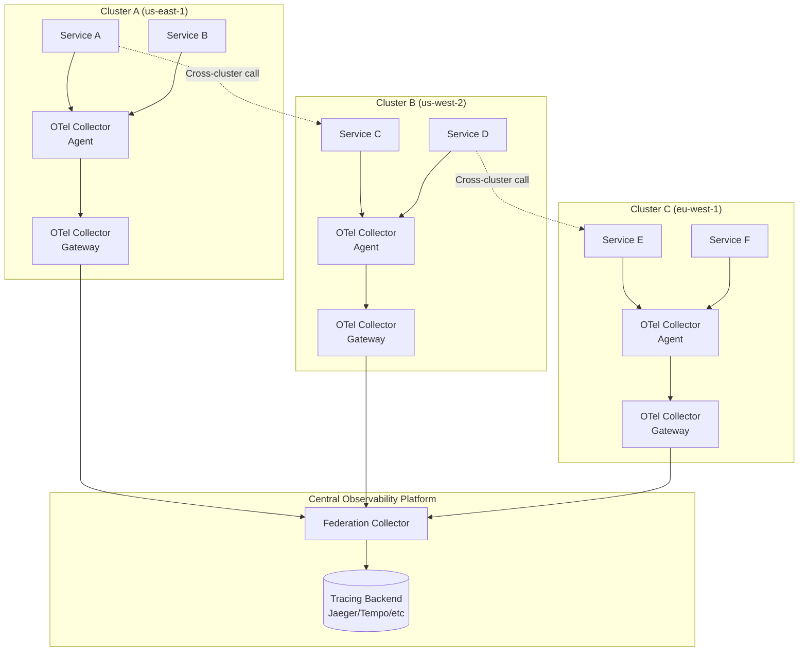
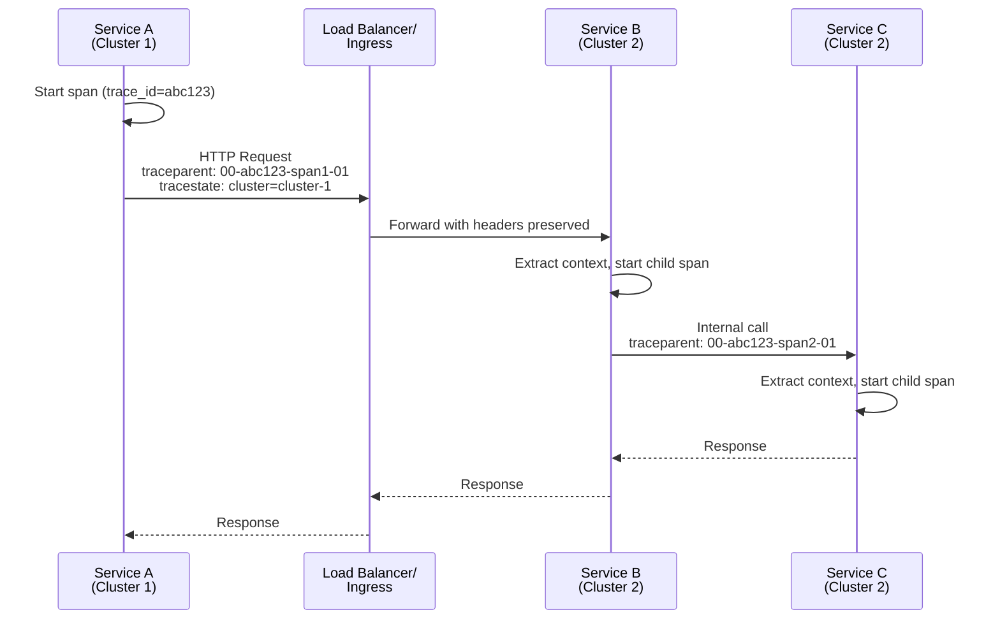
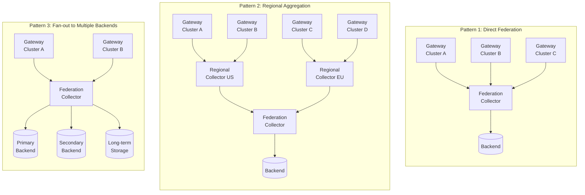
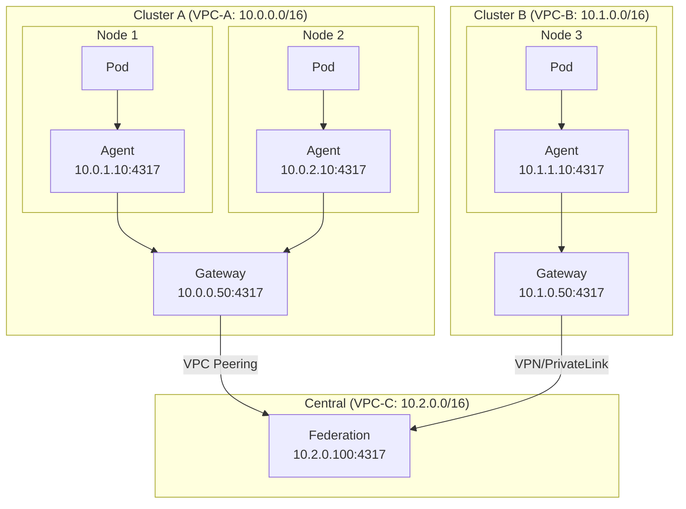
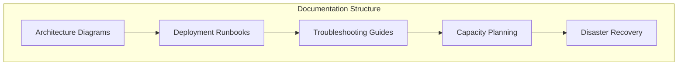

# How to Set Up OpenTelemetry for Multi-Cluster Kubernetes Tracing

Author: [nawazdhandala](https://github.com/nawazdhandala)

Tags: OpenTelemetry, Kubernetes, Multi-Cluster, Tracing, Observability, Cloud Native

Description: A guide to implementing distributed tracing across multiple Kubernetes clusters with OpenTelemetry.

---

Distributed tracing becomes significantly more complex when your applications span multiple Kubernetes clusters. Whether you are running a multi-region deployment, have separate clusters for different environments, or operate a hybrid cloud infrastructure, maintaining end-to-end visibility requires careful planning and configuration.

This guide walks you through setting up OpenTelemetry for multi-cluster Kubernetes tracing, covering cross-cluster context propagation, Collector federation patterns, cluster identification, and network considerations.

## Table of Contents

1. [Understanding Multi-Cluster Tracing Challenges](#understanding-multi-cluster-tracing-challenges)
2. [Architecture Overview](#architecture-overview)
3. [Prerequisites](#prerequisites)
4. [Setting Up the OpenTelemetry Collector](#setting-up-the-opentelemetry-collector)
5. [Cross-Cluster Context Propagation](#cross-cluster-context-propagation)
6. [Collector Federation Patterns](#collector-federation-patterns)
7. [Cluster Identification in Traces](#cluster-identification-in-traces)
8. [Network Considerations](#network-considerations)
9. [Complete Multi-Cluster Configuration](#complete-multi-cluster-configuration)
10. [Verification and Testing](#verification-and-testing)
11. [Best Practices](#best-practices)

## Understanding Multi-Cluster Tracing Challenges

When implementing distributed tracing across multiple Kubernetes clusters, you face several unique challenges:

- **Context Propagation**: Trace context must flow seamlessly between services in different clusters
- **Collector Coordination**: Data from multiple collectors needs to be aggregated and correlated
- **Cluster Identification**: Each span must be identifiable by its source cluster
- **Network Connectivity**: Collectors and services must communicate across cluster boundaries
- **Data Volume**: Multi-cluster setups generate significantly more telemetry data

## Architecture Overview

The following diagram illustrates the high-level architecture for multi-cluster OpenTelemetry tracing:



This architecture employs a three-tier collection strategy:

1. **Agent Collectors**: DaemonSets running on each node, collecting traces from local pods
2. **Gateway Collectors**: Cluster-level aggregators that process and forward data
3. **Federation Collector**: Central aggregator that correlates traces from all clusters

## Prerequisites

Before proceeding, ensure you have:

- Multiple Kubernetes clusters (v1.24+) with network connectivity
- `kubectl` configured with contexts for each cluster
- Helm v3.x installed
- A tracing backend (Jaeger, Tempo, or similar)
- Basic understanding of OpenTelemetry concepts

## Setting Up the OpenTelemetry Collector

We will deploy the OpenTelemetry Collector using a tiered approach. First, let us set up the namespace and base configuration that will be used across all clusters.

The following command creates a dedicated namespace for OpenTelemetry components. Using a dedicated namespace helps with resource isolation and RBAC management.

```bash
kubectl create namespace opentelemetry
```

### Agent Collector Configuration

The Agent Collector runs as a DaemonSet on every node, collecting traces from all pods on that node. This configuration includes resource detection processors that automatically enrich spans with Kubernetes metadata.

```yaml
# otel-agent-config.yaml
# This ConfigMap defines the OpenTelemetry Collector agent configuration.
# The agent runs on each node and collects telemetry from local pods.
apiVersion: v1
kind: ConfigMap
metadata:
  name: otel-agent-config
  namespace: opentelemetry
data:
  config.yaml: |
    # Receivers define how data gets into the collector.
    # We use OTLP receiver which accepts data in OpenTelemetry Protocol format.
    receivers:
      otlp:
        protocols:
          # gRPC is preferred for high-performance telemetry ingestion
          grpc:
            endpoint: 0.0.0.0:4317
          # HTTP is useful for environments where gRPC is not available
          http:
            endpoint: 0.0.0.0:4318

    # Processors modify telemetry data before export.
    # Order matters - they are applied in the sequence listed.
    processors:
      # Memory limiter prevents out-of-memory conditions
      memory_limiter:
        check_interval: 1s
        limit_percentage: 75
        spike_limit_percentage: 15

      # Batch processor improves performance by batching telemetry
      batch:
        send_batch_size: 1000
        timeout: 10s

      # Resource detection automatically adds Kubernetes metadata to spans
      # This is crucial for identifying which pod, node, and namespace generated each span
      resourcedetection:
        detectors:
          - env
          - system
          - docker
          - kubernetes
        timeout: 5s
        override: false

      # K8s attributes processor enriches spans with additional Kubernetes metadata
      # by querying the Kubernetes API for pod information
      k8sattributes:
        auth_type: "serviceAccount"
        passthrough: false
        extract:
          metadata:
            - k8s.pod.name
            - k8s.pod.uid
            - k8s.deployment.name
            - k8s.namespace.name
            - k8s.node.name
            - k8s.pod.start_time
          labels:
            - tag_name: app
              key: app
              from: pod
            - tag_name: version
              key: version
              from: pod
        pod_association:
          - sources:
              - from: resource_attribute
                name: k8s.pod.ip
          - sources:
              - from: resource_attribute
                name: k8s.pod.uid
          - sources:
              - from: connection

    # Exporters define where processed data is sent.
    # The agent forwards all data to the gateway collector within the same cluster.
    exporters:
      # OTLP exporter sends data to the gateway collector
      otlp:
        # The gateway is accessible via its Kubernetes service DNS name
        endpoint: otel-gateway.opentelemetry.svc.cluster.local:4317
        tls:
          insecure: true

      # Debug exporter is useful for troubleshooting during setup
      debug:
        verbosity: basic

    # Extensions provide additional functionality
    extensions:
      health_check:
        endpoint: 0.0.0.0:13133
      zpages:
        endpoint: 0.0.0.0:55679

    # Service section defines the telemetry pipelines
    service:
      extensions: [health_check, zpages]
      pipelines:
        traces:
          receivers: [otlp]
          processors: [memory_limiter, resourcedetection, k8sattributes, batch]
          exporters: [otlp]
```

Deploy the agent as a DaemonSet. The DaemonSet ensures one collector pod runs on each node, minimizing network hops for telemetry data.

```yaml
# otel-agent-daemonset.yaml
# This DaemonSet deploys the OpenTelemetry Collector agent on every node.
# Using a DaemonSet ensures low-latency collection from all pods on the node.
apiVersion: apps/v1
kind: DaemonSet
metadata:
  name: otel-agent
  namespace: opentelemetry
  labels:
    app: otel-agent
spec:
  selector:
    matchLabels:
      app: otel-agent
  template:
    metadata:
      labels:
        app: otel-agent
    spec:
      serviceAccountName: otel-collector
      containers:
        - name: otel-agent
          image: otel/opentelemetry-collector-contrib:0.92.0
          # Reference the configuration from our ConfigMap
          args:
            - --config=/conf/config.yaml
          # Resource limits prevent the collector from consuming excessive resources
          resources:
            limits:
              cpu: 500m
              memory: 512Mi
            requests:
              cpu: 100m
              memory: 128Mi
          ports:
            # OTLP gRPC receiver port
            - containerPort: 4317
              hostPort: 4317
              protocol: TCP
            # OTLP HTTP receiver port
            - containerPort: 4318
              hostPort: 4318
              protocol: TCP
            # Health check endpoint
            - containerPort: 13133
              protocol: TCP
          # Environment variables used by the resource detection processor
          env:
            # Node name is used for resource attribution
            - name: K8S_NODE_NAME
              valueFrom:
                fieldRef:
                  fieldPath: spec.nodeName
            # Pod IP is used for pod association in k8sattributes processor
            - name: K8S_POD_IP
              valueFrom:
                fieldRef:
                  fieldPath: status.podIP
            # Host IP helps identify the node's network identity
            - name: HOST_IP
              valueFrom:
                fieldRef:
                  fieldPath: status.hostIP
          volumeMounts:
            - name: config
              mountPath: /conf
          livenessProbe:
            httpGet:
              path: /
              port: 13133
            initialDelaySeconds: 10
            periodSeconds: 10
          readinessProbe:
            httpGet:
              path: /
              port: 13133
            initialDelaySeconds: 5
            periodSeconds: 5
      volumes:
        - name: config
          configMap:
            name: otel-agent-config
```

### Gateway Collector Configuration

The Gateway Collector serves as the cluster-level aggregation point. It receives data from all agents in the cluster, adds cluster-specific metadata, and forwards to the federation layer.

```yaml
# otel-gateway-config.yaml
# This ConfigMap defines the OpenTelemetry Collector gateway configuration.
# The gateway aggregates data from all agents in the cluster and adds cluster identification.
apiVersion: v1
kind: ConfigMap
metadata:
  name: otel-gateway-config
  namespace: opentelemetry
data:
  config.yaml: |
    receivers:
      otlp:
        protocols:
          grpc:
            endpoint: 0.0.0.0:4317
          http:
            endpoint: 0.0.0.0:4318

    processors:
      # Memory limiter with higher limits for gateway role
      memory_limiter:
        check_interval: 1s
        limit_percentage: 80
        spike_limit_percentage: 20

      # Larger batch sizes for efficiency at the gateway level
      batch:
        send_batch_size: 5000
        timeout: 15s

      # CRITICAL: This processor adds cluster identification to every span.
      # The cluster name and region are added as resource attributes,
      # enabling filtering and correlation in the tracing backend.
      resource:
        attributes:
          # Cluster name should be unique across your infrastructure
          - key: k8s.cluster.name
            value: "${CLUSTER_NAME}"
            action: upsert
          # Region helps with geographic analysis and compliance
          - key: cloud.region
            value: "${CLOUD_REGION}"
            action: upsert
          # Availability zone for more granular location tracking
          - key: cloud.availability_zone
            value: "${CLOUD_ZONE}"
            action: upsert
          # Environment tag helps distinguish prod/staging/dev
          - key: deployment.environment
            value: "${ENVIRONMENT}"
            action: upsert

      # Filter processor to drop unwanted spans (optional)
      # This example drops health check spans to reduce noise
      filter:
        error_mode: ignore
        traces:
          span:
            - 'attributes["http.route"] == "/health"'
            - 'attributes["http.route"] == "/ready"'
            - 'attributes["http.route"] == "/metrics"'

      # Tail-based sampling for intelligent trace selection
      # Only complete traces that meet criteria are sampled
      tail_sampling:
        decision_wait: 30s
        num_traces: 100000
        expected_new_traces_per_sec: 1000
        policies:
          # Always sample traces with errors
          - name: errors-policy
            type: status_code
            status_code:
              status_codes: [ERROR]
          # Sample slow traces (latency > 1 second)
          - name: latency-policy
            type: latency
            latency:
              threshold_ms: 1000
          # Probabilistic sampling for remaining traces
          - name: probabilistic-policy
            type: probabilistic
            probabilistic:
              sampling_percentage: 10

    exporters:
      # Export to the federation collector
      # This endpoint should be accessible from within the cluster network
      otlp:
        endpoint: "${FEDERATION_COLLECTOR_ENDPOINT}"
        tls:
          # In production, use proper TLS certificates
          insecure: false
          cert_file: /certs/tls.crt
          key_file: /certs/tls.key
          ca_file: /certs/ca.crt
        # Headers can include authentication tokens
        headers:
          authorization: "Bearer ${OTEL_AUTH_TOKEN}"
        # Retry configuration for resilience
        retry_on_failure:
          enabled: true
          initial_interval: 5s
          max_interval: 30s
          max_elapsed_time: 300s
        # Sending queue for buffering during outages
        sending_queue:
          enabled: true
          num_consumers: 10
          queue_size: 10000

      # Secondary exporter for local debugging
      debug:
        verbosity: detailed

    extensions:
      health_check:
        endpoint: 0.0.0.0:13133
      pprof:
        endpoint: 0.0.0.0:1777
      zpages:
        endpoint: 0.0.0.0:55679

    service:
      extensions: [health_check, pprof, zpages]
      pipelines:
        traces:
          receivers: [otlp]
          processors: [memory_limiter, resource, filter, tail_sampling, batch]
          exporters: [otlp]
      # Telemetry configuration for the collector itself
      telemetry:
        logs:
          level: info
        metrics:
          address: 0.0.0.0:8888
```

Deploy the gateway as a Deployment with a Service. The gateway runs as a Deployment rather than a DaemonSet because it serves as a centralized aggregation point.

```yaml
# otel-gateway-deployment.yaml
# This Deployment runs the OpenTelemetry Collector gateway.
# The gateway acts as a cluster-level aggregation and processing point.
apiVersion: apps/v1
kind: Deployment
metadata:
  name: otel-gateway
  namespace: opentelemetry
  labels:
    app: otel-gateway
spec:
  # Multiple replicas for high availability
  replicas: 3
  selector:
    matchLabels:
      app: otel-gateway
  template:
    metadata:
      labels:
        app: otel-gateway
    spec:
      serviceAccountName: otel-collector
      # Anti-affinity ensures replicas run on different nodes
      affinity:
        podAntiAffinity:
          preferredDuringSchedulingIgnoredDuringExecution:
            - weight: 100
              podAffinityTerm:
                labelSelector:
                  matchLabels:
                    app: otel-gateway
                topologyKey: kubernetes.io/hostname
      containers:
        - name: otel-gateway
          image: otel/opentelemetry-collector-contrib:0.92.0
          args:
            - --config=/conf/config.yaml
          resources:
            limits:
              cpu: 2000m
              memory: 4Gi
            requests:
              cpu: 500m
              memory: 1Gi
          ports:
            - containerPort: 4317
              protocol: TCP
              name: otlp-grpc
            - containerPort: 4318
              protocol: TCP
              name: otlp-http
            - containerPort: 13133
              protocol: TCP
              name: health
            - containerPort: 8888
              protocol: TCP
              name: metrics
          env:
            # These environment variables are injected from a ConfigMap or Secret
            # They enable cluster-specific configuration without changing the base config
            - name: CLUSTER_NAME
              valueFrom:
                configMapKeyRef:
                  name: cluster-info
                  key: cluster-name
            - name: CLOUD_REGION
              valueFrom:
                configMapKeyRef:
                  name: cluster-info
                  key: region
            - name: CLOUD_ZONE
              valueFrom:
                configMapKeyRef:
                  name: cluster-info
                  key: zone
            - name: ENVIRONMENT
              valueFrom:
                configMapKeyRef:
                  name: cluster-info
                  key: environment
            - name: FEDERATION_COLLECTOR_ENDPOINT
              valueFrom:
                secretKeyRef:
                  name: otel-federation-config
                  key: endpoint
            - name: OTEL_AUTH_TOKEN
              valueFrom:
                secretKeyRef:
                  name: otel-federation-config
                  key: auth-token
          volumeMounts:
            - name: config
              mountPath: /conf
            - name: tls-certs
              mountPath: /certs
              readOnly: true
          livenessProbe:
            httpGet:
              path: /
              port: 13133
            initialDelaySeconds: 15
            periodSeconds: 10
          readinessProbe:
            httpGet:
              path: /
              port: 13133
            initialDelaySeconds: 10
            periodSeconds: 5
      volumes:
        - name: config
          configMap:
            name: otel-gateway-config
        - name: tls-certs
          secret:
            secretName: otel-tls-certs
---
# Service for the gateway, allowing agents to send data
apiVersion: v1
kind: Service
metadata:
  name: otel-gateway
  namespace: opentelemetry
spec:
  selector:
    app: otel-gateway
  ports:
    - name: otlp-grpc
      port: 4317
      targetPort: 4317
      protocol: TCP
    - name: otlp-http
      port: 4318
      targetPort: 4318
      protocol: TCP
  type: ClusterIP
```

## Cross-Cluster Context Propagation

Cross-cluster context propagation ensures that trace context flows seamlessly when a service in one cluster calls a service in another cluster. The W3C Trace Context standard is the recommended propagation format.

The following diagram illustrates how context propagates across clusters:



### Configuring Context Propagation in Applications

For applications to propagate context correctly, they must be instrumented to extract and inject trace headers. Here is an example using the OpenTelemetry SDK in Go:

```go
// main.go
// This example demonstrates how to configure OpenTelemetry with W3C Trace Context
// propagation for cross-cluster communication.
package main

import (
	"context"
	"log"
	"net/http"
	"os"

	"go.opentelemetry.io/contrib/instrumentation/net/http/otelhttp"
	"go.opentelemetry.io/otel"
	"go.opentelemetry.io/otel/exporters/otlp/otlptrace/otlptracegrpc"
	"go.opentelemetry.io/otel/propagation"
	"go.opentelemetry.io/otel/sdk/resource"
	sdktrace "go.opentelemetry.io/otel/sdk/trace"
	semconv "go.opentelemetry.io/otel/semconv/v1.21.0"
)

func initTracer() (*sdktrace.TracerProvider, error) {
	ctx := context.Background()

	// Create the OTLP exporter that sends traces to the local collector agent
	// The agent then forwards to the gateway
	exporter, err := otlptracegrpc.New(ctx,
		// The collector agent endpoint - typically the node-local agent
		otlptracegrpc.WithEndpoint(os.Getenv("OTEL_EXPORTER_OTLP_ENDPOINT")),
		otlptracegrpc.WithInsecure(),
	)
	if err != nil {
		return nil, err
	}

	// Create a resource with service identification
	// These attributes help identify the service in traces
	res, err := resource.New(ctx,
		resource.WithAttributes(
			// Service name is required for proper trace identification
			semconv.ServiceName(os.Getenv("OTEL_SERVICE_NAME")),
			// Service version helps track deployments
			semconv.ServiceVersion(os.Getenv("SERVICE_VERSION")),
			// Service namespace groups related services
			semconv.ServiceNamespace(os.Getenv("SERVICE_NAMESPACE")),
		),
		// Automatically detect additional resource attributes
		resource.WithFromEnv(),
		resource.WithHost(),
		resource.WithOS(),
		resource.WithProcess(),
	)
	if err != nil {
		return nil, err
	}

	// Create the trace provider with batch processing
	tp := sdktrace.NewTracerProvider(
		// Use batch span processor for efficiency
		sdktrace.WithBatcher(exporter),
		sdktrace.WithResource(res),
		// Sample all spans in development, adjust for production
		sdktrace.WithSampler(sdktrace.AlwaysSample()),
	)

	// Set the global trace provider
	otel.SetTracerProvider(tp)

	// CRITICAL: Configure the propagator to use W3C Trace Context
	// This ensures trace context is properly propagated across service boundaries
	// including cross-cluster calls
	otel.SetTextMapPropagator(propagation.NewCompositeTextMapPropagator(
		// W3C Trace Context propagator for traceparent and tracestate headers
		propagation.TraceContext{},
		// W3C Baggage propagator for application-specific key-value pairs
		propagation.Baggage{},
	))

	return tp, nil
}

func main() {
	tp, err := initTracer()
	if err != nil {
		log.Fatalf("Failed to initialize tracer: %v", err)
	}
	defer func() {
		if err := tp.Shutdown(context.Background()); err != nil {
			log.Printf("Error shutting down tracer provider: %v", err)
		}
	}()

	// Create an HTTP client with automatic trace propagation
	// This client automatically injects trace context into outgoing requests
	client := &http.Client{
		Transport: otelhttp.NewTransport(http.DefaultTransport),
	}

	// Create an HTTP handler with automatic trace extraction
	// This handler automatically extracts trace context from incoming requests
	handler := otelhttp.NewHandler(http.HandlerFunc(func(w http.ResponseWriter, r *http.Request) {
		ctx := r.Context()

		// Get the current span from context
		span := trace.SpanFromContext(ctx)

		// Add custom attributes to the span
		span.SetAttributes(
			attribute.String("custom.attribute", "value"),
		)

		// When making cross-cluster calls, the trace context is automatically
		// propagated via the instrumented HTTP client
		req, _ := http.NewRequestWithContext(ctx, "GET", "http://service-in-other-cluster/api", nil)
		resp, err := client.Do(req)
		if err != nil {
			span.RecordError(err)
			http.Error(w, err.Error(), http.StatusInternalServerError)
			return
		}
		defer resp.Body.Close()

		w.WriteHeader(http.StatusOK)
		w.Write([]byte("OK"))
	}), "my-service")

	log.Println("Starting server on :8080")
	log.Fatal(http.ListenAndServe(":8080", handler))
}
```

### Kubernetes Service Mesh Integration

When using a service mesh like Istio, trace context propagation can be enhanced at the infrastructure level. The following Istio configuration ensures headers are propagated:

```yaml
# istio-telemetry.yaml
# This configuration enables trace context propagation in Istio service mesh.
# It ensures that the Envoy sidecars properly propagate trace headers.
apiVersion: telemetry.istio.io/v1alpha1
kind: Telemetry
metadata:
  name: mesh-default
  namespace: istio-system
spec:
  # Configure tracing for the entire mesh
  tracing:
    - providers:
        - name: opentelemetry
      # Sample all traces at the mesh level
      # Fine-grained sampling is done at the collector
      randomSamplingPercentage: 100.0
      # Custom tags added to all spans
      customTags:
        # Add cluster identification at the mesh level
        cluster.name:
          literal:
            value: "${CLUSTER_NAME}"
        # Add mesh identifier for multi-mesh scenarios
        mesh.name:
          literal:
            value: "production-mesh"
---
# Configure the OpenTelemetry provider
apiVersion: install.istio.io/v1alpha1
kind: IstioOperator
metadata:
  name: istio-control-plane
  namespace: istio-system
spec:
  meshConfig:
    # Enable access logging for debugging
    accessLogFile: /dev/stdout
    # Configure default tracing behavior
    defaultConfig:
      tracing:
        # Set sampling rate (percentage)
        sampling: 100.0
        # Configure OpenTelemetry as the tracing provider
        opentelemetry:
          # Point to the cluster's OTel collector gateway
          otel_service: otel-gateway.opentelemetry.svc.cluster.local
          port: 4317
    # Define the OpenTelemetry extension provider
    extensionProviders:
      - name: opentelemetry
        opentelemetry:
          service: otel-gateway.opentelemetry.svc.cluster.local
          port: 4317
          # Specify the resource detectors to use
          resource_detectors:
            - environment
            - dynatrace
```

## Collector Federation Patterns

Collector federation is the process of aggregating telemetry data from multiple cluster-level collectors into a central location. There are several patterns to consider:



### Federation Collector Configuration

The Federation Collector receives data from all cluster gateways and provides a unified view. This example shows a comprehensive configuration:

```yaml
# otel-federation-config.yaml
# This configuration defines the central Federation Collector that aggregates
# telemetry from all cluster gateways. It is deployed in a central location
# accessible by all cluster gateways.
apiVersion: v1
kind: ConfigMap
metadata:
  name: otel-federation-config
  namespace: opentelemetry
data:
  config.yaml: |
    receivers:
      otlp:
        protocols:
          grpc:
            endpoint: 0.0.0.0:4317
            # TLS configuration for secure communication
            tls:
              cert_file: /certs/server.crt
              key_file: /certs/server.key
              client_ca_file: /certs/ca.crt
              # Require client certificates for mutual TLS
              require_client_auth: true
          http:
            endpoint: 0.0.0.0:4318
            tls:
              cert_file: /certs/server.crt
              key_file: /certs/server.key

    processors:
      # High memory limits for the federation collector
      memory_limiter:
        check_interval: 1s
        limit_percentage: 85
        spike_limit_percentage: 10

      # Large batches for efficiency at scale
      batch:
        send_batch_size: 10000
        timeout: 20s

      # Span metrics connector generates metrics from trace data
      # This provides RED metrics (Rate, Errors, Duration) automatically
      spanmetrics:
        dimensions:
          - name: k8s.cluster.name
          - name: service.name
          - name: service.namespace
          - name: http.method
          - name: http.status_code
        exemplars:
          enabled: true
        histogram:
          explicit:
            buckets: [5ms, 10ms, 25ms, 50ms, 100ms, 250ms, 500ms, 1s, 2.5s, 5s, 10s]

      # Group by trace processor ensures complete traces are processed together
      # This is important for accurate tail-based sampling
      groupbytrace:
        wait_duration: 30s
        num_traces: 1000000

      # Transform processor for data manipulation
      transform:
        error_mode: ignore
        trace_statements:
          - context: span
            statements:
              # Normalize service names across clusters
              - set(attributes["normalized.service.name"],
                  Concat([resource.attributes["k8s.cluster.name"], "/",
                         resource.attributes["service.name"]], ""))

    connectors:
      # Spanmetrics connector generates metrics from traces
      spanmetrics:
        dimensions:
          - name: k8s.cluster.name
          - name: service.name
        histogram:
          explicit:
            buckets: [5ms, 10ms, 25ms, 50ms, 100ms, 250ms, 500ms, 1s, 2.5s, 5s, 10s]

    exporters:
      # Primary tracing backend (e.g., Jaeger)
      otlp/jaeger:
        endpoint: jaeger-collector.observability.svc.cluster.local:4317
        tls:
          insecure: true

      # Alternative: Grafana Tempo
      otlp/tempo:
        endpoint: tempo-distributor.observability.svc.cluster.local:4317
        tls:
          insecure: true

      # Prometheus for metrics derived from traces
      prometheus:
        endpoint: 0.0.0.0:8889
        namespace: otel
        const_labels:
          collector: federation

      # Long-term storage in object storage
      otlp/storage:
        endpoint: storage-gateway.observability.svc.cluster.local:4317
        tls:
          insecure: true

    extensions:
      health_check:
        endpoint: 0.0.0.0:13133
      pprof:
        endpoint: 0.0.0.0:1777
      zpages:
        endpoint: 0.0.0.0:55679
      # Bearer token authentication for incoming connections
      bearertokenauth:
        token: "${FEDERATION_AUTH_TOKEN}"

    service:
      extensions: [health_check, pprof, zpages, bearertokenauth]
      pipelines:
        # Main traces pipeline
        traces:
          receivers: [otlp]
          processors: [memory_limiter, groupbytrace, transform, batch]
          exporters: [otlp/jaeger, otlp/tempo, otlp/storage]
        # Metrics pipeline for span metrics
        metrics:
          receivers: [spanmetrics]
          processors: [memory_limiter, batch]
          exporters: [prometheus]
      telemetry:
        logs:
          level: info
        metrics:
          address: 0.0.0.0:8888
```

### Load Balancing for Federation

For high availability and load distribution, deploy the federation collector behind a load balancer:

```yaml
# otel-federation-deployment.yaml
# This Deployment runs the Federation Collector with high availability.
# It should be deployed in a central, highly available location.
apiVersion: apps/v1
kind: Deployment
metadata:
  name: otel-federation
  namespace: opentelemetry
spec:
  replicas: 5
  selector:
    matchLabels:
      app: otel-federation
  template:
    metadata:
      labels:
        app: otel-federation
    spec:
      # Spread replicas across availability zones
      topologySpreadConstraints:
        - maxSkew: 1
          topologyKey: topology.kubernetes.io/zone
          whenUnsatisfiable: DoNotSchedule
          labelSelector:
            matchLabels:
              app: otel-federation
      containers:
        - name: otel-federation
          image: otel/opentelemetry-collector-contrib:0.92.0
          args:
            - --config=/conf/config.yaml
          resources:
            limits:
              cpu: 4000m
              memory: 8Gi
            requests:
              cpu: 1000m
              memory: 2Gi
          ports:
            - containerPort: 4317
              protocol: TCP
              name: otlp-grpc
            - containerPort: 4318
              protocol: TCP
              name: otlp-http
            - containerPort: 8889
              protocol: TCP
              name: prometheus
          volumeMounts:
            - name: config
              mountPath: /conf
            - name: tls-certs
              mountPath: /certs
              readOnly: true
          env:
            - name: FEDERATION_AUTH_TOKEN
              valueFrom:
                secretKeyRef:
                  name: federation-auth
                  key: token
      volumes:
        - name: config
          configMap:
            name: otel-federation-config
        - name: tls-certs
          secret:
            secretName: federation-tls-certs
---
# Load balancer service for the federation collector
apiVersion: v1
kind: Service
metadata:
  name: otel-federation
  namespace: opentelemetry
  annotations:
    # Cloud provider specific annotations for load balancer configuration
    service.beta.kubernetes.io/aws-load-balancer-type: nlb
    service.beta.kubernetes.io/aws-load-balancer-cross-zone-load-balancing-enabled: "true"
spec:
  type: LoadBalancer
  selector:
    app: otel-federation
  ports:
    - name: otlp-grpc
      port: 4317
      targetPort: 4317
      protocol: TCP
    - name: otlp-http
      port: 4318
      targetPort: 4318
      protocol: TCP
```

## Cluster Identification in Traces

Proper cluster identification is essential for filtering and analyzing traces in a multi-cluster environment. There are several strategies to ensure every span is tagged with its origin cluster.

### Resource Attributes Approach

The most reliable approach is to add cluster identification as resource attributes at the collector level:

```yaml
# cluster-info-configmap.yaml
# This ConfigMap contains cluster-specific information.
# Create this ConfigMap with appropriate values in each cluster.
apiVersion: v1
kind: ConfigMap
metadata:
  name: cluster-info
  namespace: opentelemetry
data:
  # Unique identifier for this cluster
  cluster-name: "production-us-east-1"
  # Cloud provider region
  region: "us-east-1"
  # Availability zone (if applicable)
  zone: "us-east-1a"
  # Environment designation
  environment: "production"
  # Cluster purpose or tier
  tier: "primary"
```

### Processor Configuration for Cluster Tagging

Use the resource processor to ensure consistent tagging:

```yaml
# In the collector configuration
processors:
  # Resource processor adds cluster-specific attributes
  resource:
    attributes:
      # Primary cluster identifier
      - key: k8s.cluster.name
        value: "${CLUSTER_NAME}"
        action: upsert
      # Unique cluster ID (useful when names might not be unique)
      - key: k8s.cluster.uid
        value: "${CLUSTER_UID}"
        action: upsert
      # Cloud provider information
      - key: cloud.provider
        value: "${CLOUD_PROVIDER}"
        action: upsert
      - key: cloud.region
        value: "${CLOUD_REGION}"
        action: upsert
      - key: cloud.availability_zone
        value: "${CLOUD_ZONE}"
        action: upsert
      # Environment and deployment context
      - key: deployment.environment
        value: "${ENVIRONMENT}"
        action: upsert
      # Custom organizational attributes
      - key: organization.team
        value: "${TEAM_NAME}"
        action: upsert
      - key: organization.cost_center
        value: "${COST_CENTER}"
        action: upsert
```

### Querying by Cluster in Tracing Backends

With proper cluster identification, you can query traces by cluster in your backend. Here are examples for common backends:

For Jaeger:

```
# Find traces from a specific cluster
service="my-service" && k8s.cluster.name="production-us-east-1"

# Find traces that span multiple clusters
k8s.cluster.name="production-us-east-1" OR k8s.cluster.name="production-us-west-2"

# Find cross-cluster calls
k8s.cluster.name="production-us-east-1" && span.kind="client"
```

For Grafana Tempo with TraceQL:

```
// Find traces from a specific cluster
{ resource.k8s.cluster.name = "production-us-east-1" }

// Find slow traces across clusters
{ resource.k8s.cluster.name =~ "production-.*" && duration > 1s }

// Find traces with errors in a specific cluster
{ resource.k8s.cluster.name = "production-us-east-1" && status = error }
```

## Network Considerations

Multi-cluster tracing requires careful network planning to ensure reliable communication between collectors.

### Network Topology



### Network Policies

Implement network policies to control traffic flow:

```yaml
# otel-network-policy.yaml
# This NetworkPolicy controls traffic to and from the OpenTelemetry collectors.
# It ensures only authorized sources can send telemetry data.
apiVersion: networking.k8s.io/v1
kind: NetworkPolicy
metadata:
  name: otel-gateway-policy
  namespace: opentelemetry
spec:
  podSelector:
    matchLabels:
      app: otel-gateway
  policyTypes:
    - Ingress
    - Egress
  ingress:
    # Allow ingress from all pods in the cluster (agents and applications)
    - from:
        - namespaceSelector: {}
      ports:
        - protocol: TCP
          port: 4317
        - protocol: TCP
          port: 4318
  egress:
    # Allow egress to the federation collector
    - to:
        - ipBlock:
            # Replace with your federation collector's IP range
            cidr: 10.2.0.0/16
      ports:
        - protocol: TCP
          port: 4317
    # Allow DNS resolution
    - to:
        - namespaceSelector:
            matchLabels:
              kubernetes.io/metadata.name: kube-system
      ports:
        - protocol: UDP
          port: 53
```

### Firewall Rules

Ensure the following ports are open between clusters:

```yaml
# Example Terraform for AWS Security Group rules
# These rules allow telemetry traffic between clusters

# Security group rule for OTLP gRPC traffic
resource "aws_security_group_rule" "otel_grpc_ingress" {
  type              = "ingress"
  from_port         = 4317
  to_port           = 4317
  protocol          = "tcp"
  # Allow from all cluster VPC CIDRs
  cidr_blocks       = var.cluster_vpc_cidrs
  security_group_id = aws_security_group.federation_collector.id
  description       = "Allow OTLP gRPC from cluster gateways"
}

# Security group rule for OTLP HTTP traffic
resource "aws_security_group_rule" "otel_http_ingress" {
  type              = "ingress"
  from_port         = 4318
  to_port           = 4318
  protocol          = "tcp"
  cidr_blocks       = var.cluster_vpc_cidrs
  security_group_id = aws_security_group.federation_collector.id
  description       = "Allow OTLP HTTP from cluster gateways"
}
```

### TLS Configuration

Secure all cross-cluster communication with TLS:

```yaml
# otel-tls-secret.yaml
# This Secret contains TLS certificates for secure collector communication.
# Generate these certificates using your PKI or a tool like cfssl/cert-manager.
apiVersion: v1
kind: Secret
metadata:
  name: otel-tls-certs
  namespace: opentelemetry
type: kubernetes.io/tls
data:
  # Base64-encoded TLS certificate
  tls.crt: LS0tLS1CRUdJTi...
  # Base64-encoded TLS private key
  tls.key: LS0tLS1CRUdJTi...
  # Base64-encoded CA certificate for client verification
  ca.crt: LS0tLS1CRUdJTi...
---
# Certificate configuration using cert-manager
apiVersion: cert-manager.io/v1
kind: Certificate
metadata:
  name: otel-gateway-cert
  namespace: opentelemetry
spec:
  secretName: otel-tls-certs
  duration: 8760h  # 1 year
  renewBefore: 720h  # 30 days before expiry
  subject:
    organizations:
      - Your Organization
  # Common name for the certificate
  commonName: otel-gateway
  # DNS names for the certificate
  dnsNames:
    - otel-gateway
    - otel-gateway.opentelemetry
    - otel-gateway.opentelemetry.svc
    - otel-gateway.opentelemetry.svc.cluster.local
  # IP addresses (useful for direct IP access)
  ipAddresses:
    - 10.0.0.50
  issuerRef:
    name: internal-ca-issuer
    kind: ClusterIssuer
```

## Complete Multi-Cluster Configuration

Here is a complete, production-ready configuration that you can adapt for your environment:

### Cluster-Specific Values

Create a Helm values file for each cluster:

```yaml
# values-cluster-a.yaml
# Cluster-specific configuration for Cluster A (us-east-1)
clusterInfo:
  name: "production-us-east-1"
  region: "us-east-1"
  zone: "us-east-1a"
  environment: "production"
  provider: "aws"

federation:
  endpoint: "otel-federation.central.example.com:4317"
  tls:
    enabled: true
    certSecretName: "federation-tls"

agent:
  enabled: true
  resources:
    limits:
      cpu: 500m
      memory: 512Mi
    requests:
      cpu: 100m
      memory: 128Mi

gateway:
  enabled: true
  replicas: 3
  resources:
    limits:
      cpu: 2000m
      memory: 4Gi
    requests:
      cpu: 500m
      memory: 1Gi
  sampling:
    probabilistic: 10
    errorSampling: 100
    latencyThreshold: 1000

# Enable service mesh integration
serviceMesh:
  istio:
    enabled: true

# Network configuration
network:
  podCIDR: "10.0.0.0/16"
  serviceCIDR: "10.100.0.0/16"
```

### Deployment Script

Use this script to deploy the collectors across all clusters:

```bash
#!/bin/bash
# deploy-otel-multi-cluster.sh
# This script deploys OpenTelemetry collectors to multiple Kubernetes clusters.
# It uses Helm for deployment and kubectl for cluster switching.

set -euo pipefail

# Configuration
CLUSTERS=("cluster-a" "cluster-b" "cluster-c")
CHART_PATH="./charts/otel-multi-cluster"
NAMESPACE="opentelemetry"

# Colors for output
RED='\033[0;31m'
GREEN='\033[0;32m'
YELLOW='\033[1;33m'
NC='\033[0m' # No Color

log_info() {
    echo -e "${GREEN}[INFO]${NC} $1"
}

log_warn() {
    echo -e "${YELLOW}[WARN]${NC} $1"
}

log_error() {
    echo -e "${RED}[ERROR]${NC} $1"
}

# Function to deploy to a single cluster
deploy_to_cluster() {
    local cluster=$1
    local context="$cluster-context"
    local values_file="values-${cluster}.yaml"

    log_info "Deploying to cluster: $cluster"

    # Switch kubectl context to the target cluster
    if ! kubectl config use-context "$context" > /dev/null 2>&1; then
        log_error "Failed to switch to context: $context"
        return 1
    fi

    # Create namespace if it doesn't exist
    kubectl create namespace "$NAMESPACE" --dry-run=client -o yaml | kubectl apply -f -

    # Deploy using Helm
    helm upgrade --install otel-collectors "$CHART_PATH" \
        --namespace "$NAMESPACE" \
        --values "$values_file" \
        --wait \
        --timeout 10m

    # Verify deployment
    if kubectl -n "$NAMESPACE" rollout status daemonset/otel-agent --timeout=5m && \
       kubectl -n "$NAMESPACE" rollout status deployment/otel-gateway --timeout=5m; then
        log_info "Successfully deployed to $cluster"
    else
        log_error "Deployment to $cluster failed"
        return 1
    fi
}

# Main deployment loop
main() {
    log_info "Starting multi-cluster OpenTelemetry deployment"

    local failed_clusters=()

    for cluster in "${CLUSTERS[@]}"; do
        if ! deploy_to_cluster "$cluster"; then
            failed_clusters+=("$cluster")
        fi
    done

    # Summary
    echo ""
    log_info "Deployment Summary:"
    log_info "==================="

    for cluster in "${CLUSTERS[@]}"; do
        if [[ " ${failed_clusters[*]} " =~ " ${cluster} " ]]; then
            log_error "$cluster: FAILED"
        else
            log_info "$cluster: SUCCESS"
        fi
    done

    if [ ${#failed_clusters[@]} -gt 0 ]; then
        log_error "Some deployments failed. Please check the logs."
        exit 1
    fi

    log_info "All deployments completed successfully!"
}

main "$@"
```

## Verification and Testing

After deployment, verify that multi-cluster tracing is working correctly.

### Connectivity Tests

Test connectivity between collectors:

```bash
#!/bin/bash
# test-otel-connectivity.sh
# This script tests connectivity between OpenTelemetry collectors across clusters.

# Test agent to gateway connectivity within a cluster
echo "Testing agent to gateway connectivity..."
kubectl -n opentelemetry exec -it ds/otel-agent -- \
    wget -q -O - http://otel-gateway:13133/

# Test gateway to federation collector connectivity
echo "Testing gateway to federation collector connectivity..."
kubectl -n opentelemetry exec -it deployment/otel-gateway -- \
    nc -zv otel-federation.central.example.com 4317

# Verify TLS handshake
echo "Testing TLS connectivity..."
kubectl -n opentelemetry exec -it deployment/otel-gateway -- \
    openssl s_client -connect otel-federation.central.example.com:4317 \
    -CAfile /certs/ca.crt < /dev/null
```

### Generate Test Traces

Create a test application that generates cross-cluster traces:

```yaml
# trace-test-job.yaml
# This Job generates test traces across clusters to verify the setup.
apiVersion: batch/v1
kind: Job
metadata:
  name: trace-test
  namespace: default
spec:
  template:
    spec:
      containers:
        - name: trace-generator
          image: otel/opentelemetry-collector-contrib:0.92.0
          command:
            - /bin/sh
            - -c
            - |
              # Generate test traces using telemetrygen
              telemetrygen traces \
                --otlp-endpoint otel-gateway.opentelemetry.svc.cluster.local:4317 \
                --otlp-insecure \
                --traces 100 \
                --workers 4 \
                --service my-test-service \
                --span-duration 100ms
          env:
            - name: OTEL_RESOURCE_ATTRIBUTES
              value: "k8s.cluster.name=test-cluster,deployment.environment=test"
      restartPolicy: Never
  backoffLimit: 0
```

### Verify in Backend

Query your tracing backend to confirm traces are arriving with correct cluster identification:

```bash
# For Jaeger, use the API to query traces
curl "http://jaeger-query:16686/api/traces?service=my-test-service&tags=%7B%22k8s.cluster.name%22%3A%22production-us-east-1%22%7D&limit=10"

# For Tempo, use the TraceQL endpoint
curl -G "http://tempo-query:3100/api/search" \
    --data-urlencode 'q={ resource.k8s.cluster.name = "production-us-east-1" }'
```

### Monitoring Dashboard

Create a Grafana dashboard to monitor the collector health:

```json
{
  "dashboard": {
    "title": "OpenTelemetry Multi-Cluster Health",
    "panels": [
      {
        "title": "Spans Received by Cluster",
        "type": "timeseries",
        "targets": [
          {
            "expr": "sum by (k8s_cluster_name) (rate(otelcol_receiver_accepted_spans_total[5m]))",
            "legendFormat": "{{k8s_cluster_name}}"
          }
        ]
      },
      {
        "title": "Export Errors by Cluster",
        "type": "timeseries",
        "targets": [
          {
            "expr": "sum by (k8s_cluster_name) (rate(otelcol_exporter_send_failed_spans_total[5m]))",
            "legendFormat": "{{k8s_cluster_name}}"
          }
        ]
      },
      {
        "title": "Queue Size by Gateway",
        "type": "gauge",
        "targets": [
          {
            "expr": "otelcol_exporter_queue_size",
            "legendFormat": "{{k8s_cluster_name}}"
          }
        ]
      }
    ]
  }
}
```

## Best Practices

### 1. Use Consistent Naming Conventions

Establish naming conventions for clusters, services, and namespaces that work across your organization:

```yaml
# Recommended resource attribute naming
resource.attributes:
  # Cluster identification
  k8s.cluster.name: "<environment>-<region>-<number>"  # e.g., prod-us-east-1-01
  k8s.cluster.uid: "<unique-uuid>"

  # Service identification
  service.name: "<team>-<service>-<component>"  # e.g., payments-api-gateway
  service.namespace: "<team>/<domain>"  # e.g., payments/transactions
  service.version: "<semver>"  # e.g., 1.2.3

  # Environment context
  deployment.environment: "<env>"  # production, staging, development
```

### 2. Implement Sampling Strategies

In a multi-cluster environment, consistent sampling is crucial:

```yaml
processors:
  # Use tail-based sampling at the gateway level
  tail_sampling:
    decision_wait: 30s
    policies:
      # Always capture errors
      - name: error-policy
        type: status_code
        status_code:
          status_codes: [ERROR]

      # Capture slow requests
      - name: latency-policy
        type: latency
        latency:
          threshold_ms: 1000

      # Capture a percentage of normal traffic
      - name: probabilistic-policy
        type: probabilistic
        probabilistic:
          sampling_percentage: 5

      # Always capture cross-cluster traces
      - name: cross-cluster-policy
        type: string_attribute
        string_attribute:
          key: span.kind
          values: [client, server]
```

### 3. Plan for Failure Scenarios

Implement resilience patterns for when clusters or the federation collector become unavailable:

```yaml
exporters:
  otlp/primary:
    endpoint: "${PRIMARY_COLLECTOR_ENDPOINT}"
    retry_on_failure:
      enabled: true
      initial_interval: 5s
      max_interval: 30s
      max_elapsed_time: 300s
    sending_queue:
      enabled: true
      num_consumers: 10
      queue_size: 10000
      # Persistent queue survives collector restarts
      storage: file_storage

  # Fallback exporter for disaster recovery
  otlp/fallback:
    endpoint: "${FALLBACK_COLLECTOR_ENDPOINT}"
    retry_on_failure:
      enabled: true

extensions:
  file_storage:
    directory: /var/lib/otelcol/queue
    timeout: 10s
```

### 4. Monitor Collector Health

Set up alerting for collector issues:

```yaml
# Prometheus alerting rules for OpenTelemetry collectors
groups:
  - name: otel-collector-alerts
    rules:
      # Alert when spans are being dropped
      - alert: OtelCollectorSpansDropped
        expr: rate(otelcol_processor_dropped_spans_total[5m]) > 0
        for: 5m
        labels:
          severity: warning
        annotations:
          summary: "OpenTelemetry Collector dropping spans"
          description: "Collector {{ $labels.instance }} is dropping {{ $value }} spans/sec"

      # Alert when export queue is backing up
      - alert: OtelCollectorQueueBacklog
        expr: otelcol_exporter_queue_size > 5000
        for: 10m
        labels:
          severity: warning
        annotations:
          summary: "OpenTelemetry export queue backlog"
          description: "Collector {{ $labels.instance }} queue size is {{ $value }}"

      # Alert when export is failing
      - alert: OtelCollectorExportFailure
        expr: rate(otelcol_exporter_send_failed_spans_total[5m]) > 0
        for: 5m
        labels:
          severity: critical
        annotations:
          summary: "OpenTelemetry Collector export failures"
          description: "Collector {{ $labels.instance }} failing to export spans"
```

### 5. Document Your Architecture

Maintain up-to-date documentation of your multi-cluster tracing architecture:



## Conclusion

Setting up OpenTelemetry for multi-cluster Kubernetes tracing requires careful planning and configuration, but the visibility it provides is invaluable for understanding and debugging distributed systems. By following the patterns and configurations in this guide, you can establish a robust, scalable tracing infrastructure that spans multiple clusters while maintaining trace context and cluster identification.

Key takeaways:

1. Use a tiered collector architecture (agent, gateway, federation) for scalability
2. Ensure proper context propagation using W3C Trace Context headers
3. Add cluster identification at the collector level using resource attributes
4. Secure cross-cluster communication with TLS and network policies
5. Implement consistent sampling strategies across all clusters
6. Monitor collector health and set up alerting for issues

With this foundation in place, you can extend your observability practice to include metrics and logs, creating a comprehensive multi-cluster observability platform.

## Additional Resources

- [OpenTelemetry Collector Documentation](https://opentelemetry.io/docs/collector/)
- [OpenTelemetry Kubernetes Operator](https://github.com/open-telemetry/opentelemetry-operator)
- [W3C Trace Context Specification](https://www.w3.org/TR/trace-context/)
- [OpenTelemetry Semantic Conventions](https://opentelemetry.io/docs/specs/semconv/)
