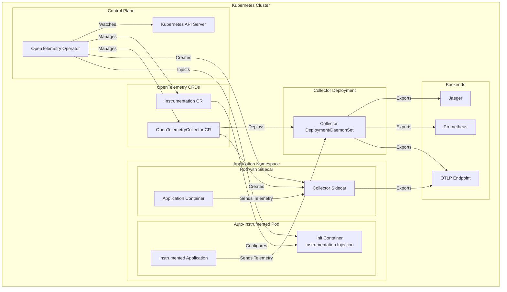
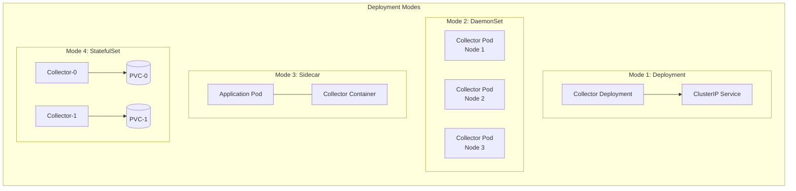
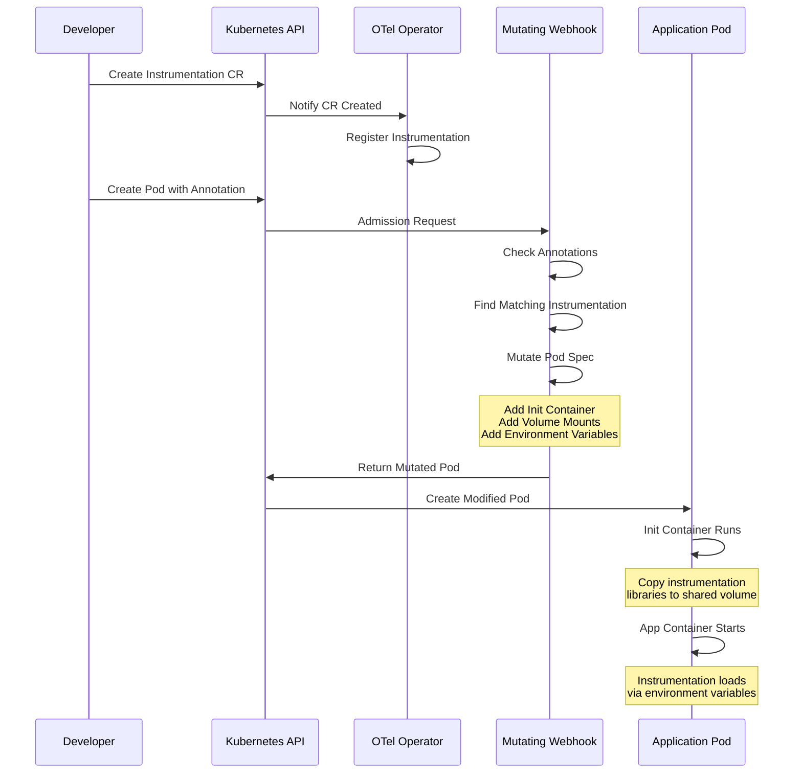
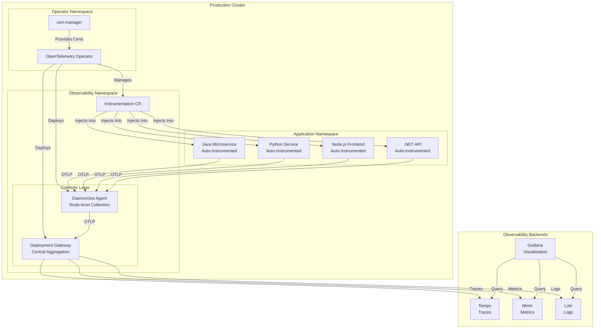

# How to Deploy OpenTelemetry Operator for Kubernetes Auto-Instrumentation

Author: [nawazdhandala](https://github.com/nawazdhandala)

Tags: OpenTelemetry, Kubernetes, Operators, Auto-Instrumentation, Observability, Cloud Native

Description: A guide to deploying the OpenTelemetry Operator for automatic instrumentation of Kubernetes workloads.

---

## Introduction

The OpenTelemetry Operator is a Kubernetes operator that manages OpenTelemetry components in a Kubernetes environment. It simplifies the deployment and configuration of OpenTelemetry Collectors and enables automatic instrumentation of applications without requiring code changes. This comprehensive guide will walk you through deploying the OpenTelemetry Operator and configuring auto-instrumentation for various programming languages.

## What is the OpenTelemetry Operator?

The OpenTelemetry Operator extends Kubernetes with Custom Resource Definitions (CRDs) that allow you to:

- Deploy and manage OpenTelemetry Collectors in various modes (sidecar, deployment, daemonset, statefulset)
- Automatically inject instrumentation libraries into application pods
- Configure telemetry pipelines declaratively
- Manage the lifecycle of OpenTelemetry components

## Architecture Overview

The following diagram illustrates how the OpenTelemetry Operator works within a Kubernetes cluster:



## Prerequisites

Before deploying the OpenTelemetry Operator, ensure you have:

- A Kubernetes cluster (version 1.23 or later)
- kubectl configured to communicate with your cluster
- Helm 3.x installed
- cert-manager installed (required for webhook certificates)

## Step 1: Install cert-manager

The OpenTelemetry Operator requires cert-manager for managing TLS certificates used by its webhooks. Install cert-manager if not already present:

```bash
# Add the Jetstack Helm repository which hosts cert-manager charts
helm repo add jetstack https://charts.jetstack.io

# Update your local Helm chart repository cache to get the latest charts
helm repo update

# Install cert-manager with CRDs included
# The installCRDs flag ensures Custom Resource Definitions are created automatically
# We're installing into a dedicated namespace for better resource isolation
helm install cert-manager jetstack/cert-manager \
  --namespace cert-manager \
  --create-namespace \
  --set installCRDs=true

# Verify cert-manager pods are running before proceeding
# All three pods (controller, webhook, cainjector) should be in Running state
kubectl wait --for=condition=Ready pods --all -n cert-manager --timeout=120s
```

## Step 2: Install OpenTelemetry Operator with Helm

Now install the OpenTelemetry Operator using Helm:

```bash
# Add the OpenTelemetry Helm repository
# This repository contains the official OpenTelemetry Operator chart
helm repo add open-telemetry https://open-telemetry.github.io/opentelemetry-helm-charts

# Update repositories to fetch the latest chart versions
helm repo update

# Install the OpenTelemetry Operator
# We create a dedicated namespace for the operator components
# The admissionWebhooks settings configure the mutating webhook for pod injection
helm install opentelemetry-operator open-telemetry/opentelemetry-operator \
  --namespace opentelemetry-operator-system \
  --create-namespace \
  --set admissionWebhooks.certManager.enabled=true \
  --set manager.collectorImage.repository=otel/opentelemetry-collector-contrib

# Verify the operator deployment is ready
kubectl wait --for=condition=Ready pods --all -n opentelemetry-operator-system --timeout=120s
```

### Advanced Helm Configuration

For production environments, you may want to customize the operator installation:

```yaml
# values.yaml - Custom Helm values for OpenTelemetry Operator
# This configuration file allows fine-grained control over operator behavior

# Manager configuration controls the operator's own behavior
manager:
  # Use the contrib collector image which includes additional receivers/exporters
  collectorImage:
    repository: otel/opentelemetry-collector-contrib
    tag: "0.92.0"

  # Resource limits for the operator manager pod
  # Adjust these based on your cluster size and workload
  resources:
    limits:
      cpu: 200m
      memory: 256Mi
    requests:
      cpu: 100m
      memory: 128Mi

  # Enable leader election for high availability deployments
  # This ensures only one operator instance is active at a time
  leaderElection:
    enabled: true

# Admission webhooks are required for pod mutation (auto-instrumentation injection)
admissionWebhooks:
  # Use cert-manager to automatically provision and rotate certificates
  certManager:
    enabled: true
    # Certificate validity duration - 1 year is recommended for production
    duration: 8760h
  # Failure policy determines behavior when webhook is unavailable
  # "Fail" is safer for production to prevent uninstrumented pods
  failurePolicy: Fail

# Kubernetes scheduler configuration
# Use a dedicated priority class to ensure operator runs during resource pressure
priorityClassName: system-cluster-critical

# Pod anti-affinity rules for high availability
# Spreads operator replicas across different nodes
affinity:
  podAntiAffinity:
    preferredDuringSchedulingIgnoredDuringExecution:
      - weight: 100
        podAffinityTerm:
          labelSelector:
            matchExpressions:
              - key: app.kubernetes.io/name
                operator: In
                values:
                  - opentelemetry-operator
          topologyKey: kubernetes.io/hostname
```

Install with custom values:

```bash
# Apply the custom configuration during installation
# The -f flag specifies our custom values file
helm install opentelemetry-operator open-telemetry/opentelemetry-operator \
  --namespace opentelemetry-operator-system \
  --create-namespace \
  -f values.yaml
```

## Step 3: Deploy an OpenTelemetry Collector

The OpenTelemetry Operator supports multiple deployment modes for the Collector. Here's a diagram showing the different modes:



### Deployment Mode Collector

The Deployment mode is ideal for centralized collection with horizontal scaling:

```yaml
# collector-deployment.yaml
# This creates a centralized OpenTelemetry Collector as a Kubernetes Deployment
# Use this mode when you need a scalable, centralized telemetry pipeline

apiVersion: opentelemetry.io/v1alpha1
kind: OpenTelemetryCollector
metadata:
  name: otel-collector
  namespace: observability
spec:
  # Deployment mode creates a standard Kubernetes Deployment
  # This is the most common mode for centralized collection
  mode: deployment

  # Number of collector replicas for high availability
  # Scale this based on your telemetry volume
  replicas: 3

  # Resource configuration for each collector pod
  resources:
    limits:
      cpu: 500m
      memory: 512Mi
    requests:
      cpu: 200m
      memory: 256Mi

  # The collector configuration follows the standard OTEL Collector config format
  config: |
    # Receivers define how data enters the collector
    receivers:
      # OTLP receiver accepts data over gRPC and HTTP protocols
      # This is the primary receiver for OpenTelemetry SDK data
      otlp:
        protocols:
          grpc:
            # gRPC endpoint for receiving telemetry
            endpoint: 0.0.0.0:4317
          http:
            # HTTP endpoint for receiving telemetry (useful for browsers/serverless)
            endpoint: 0.0.0.0:4318

      # Prometheus receiver scrapes metrics from Prometheus-format endpoints
      # Useful for integrating existing Prometheus instrumentation
      prometheus:
        config:
          scrape_configs:
            - job_name: 'otel-collector'
              # Scrape the collector's own metrics for self-monitoring
              scrape_interval: 30s
              static_configs:
                - targets: ['localhost:8888']

    # Processors transform and enrich telemetry data
    processors:
      # Batch processor groups data for efficient export
      # This significantly improves throughput and reduces network overhead
      batch:
        # Wait up to 5 seconds before sending a batch
        timeout: 5s
        # Send batch when it reaches 10000 items
        send_batch_size: 10000
        # Maximum batch size to prevent memory issues
        send_batch_max_size: 11000

      # Memory limiter prevents out-of-memory crashes
      # Essential for production stability
      memory_limiter:
        # Start refusing data at 80% memory usage
        limit_percentage: 80
        # Force garbage collection at 70% memory usage
        spike_limit_percentage: 70
        # How often to check memory usage
        check_interval: 1s

      # Resource processor adds/modifies resource attributes
      # Useful for adding cluster-wide metadata
      resource:
        attributes:
          - key: k8s.cluster.name
            value: production-cluster
            action: upsert

    # Exporters define where telemetry data is sent
    exporters:
      # Debug exporter logs data to stdout (useful for troubleshooting)
      debug:
        verbosity: detailed

      # OTLP exporter sends data to another OTLP-compatible backend
      # This could be a managed observability service or self-hosted backend
      otlp:
        endpoint: "jaeger-collector.observability.svc:4317"
        tls:
          # Disable TLS for internal cluster communication
          # Enable and configure for external endpoints
          insecure: true

      # Prometheus exporter exposes metrics in Prometheus format
      # This allows Prometheus to scrape metrics from the collector
      prometheus:
        endpoint: "0.0.0.0:8889"
        namespace: otel
        # Add resource attributes as metric labels
        resource_to_telemetry_conversion:
          enabled: true

    # Service section ties together receivers, processors, and exporters
    service:
      # Pipelines define the flow of telemetry data
      pipelines:
        # Traces pipeline configuration
        traces:
          receivers: [otlp]
          # Memory limiter should be first in the processor chain
          processors: [memory_limiter, batch, resource]
          exporters: [otlp, debug]

        # Metrics pipeline configuration
        metrics:
          receivers: [otlp, prometheus]
          processors: [memory_limiter, batch, resource]
          exporters: [prometheus, debug]

        # Logs pipeline configuration
        logs:
          receivers: [otlp]
          processors: [memory_limiter, batch, resource]
          exporters: [debug]

      # Telemetry configuration for the collector itself
      telemetry:
        logs:
          level: info
        metrics:
          # Expose collector's own metrics on this address
          address: 0.0.0.0:8888
```

Apply the collector configuration:

```bash
# Create the observability namespace if it doesn't exist
kubectl create namespace observability --dry-run=client -o yaml | kubectl apply -f -

# Apply the collector configuration
# The operator will create the necessary Deployment, Service, and ConfigMap
kubectl apply -f collector-deployment.yaml

# Verify the collector pods are running
kubectl get pods -n observability -l app.kubernetes.io/name=otel-collector
```

### DaemonSet Mode Collector

DaemonSet mode runs a collector on every node, ideal for collecting node-level metrics and logs:

```yaml
# collector-daemonset.yaml
# DaemonSet mode ensures a collector runs on every node in the cluster
# This is ideal for collecting node-level metrics, logs, and infrastructure data

apiVersion: opentelemetry.io/v1alpha1
kind: OpenTelemetryCollector
metadata:
  name: otel-collector-agent
  namespace: observability
spec:
  # DaemonSet mode - one pod per node
  mode: daemonset

  # Host network access allows collecting host-level metrics
  # Enable only if required for your use case
  hostNetwork: false

  # Resource limits should be conservative for daemonsets
  # since they run on every node
  resources:
    limits:
      cpu: 200m
      memory: 256Mi
    requests:
      cpu: 100m
      memory: 128Mi

  # Volume mounts for accessing host filesystem
  # Required for collecting container logs and host metrics
  volumeMounts:
    - name: varlog
      mountPath: /var/log
      readOnly: true
    - name: hostfs
      mountPath: /hostfs
      readOnly: true

  volumes:
    - name: varlog
      hostPath:
        path: /var/log
    - name: hostfs
      hostPath:
        path: /

  # Tolerations allow the daemonset to run on all nodes
  # including control plane nodes if needed
  tolerations:
    - operator: Exists

  config: |
    receivers:
      otlp:
        protocols:
          grpc:
            endpoint: 0.0.0.0:4317
          http:
            endpoint: 0.0.0.0:4318

      # Host metrics receiver collects system-level metrics
      # This requires access to the host filesystem
      hostmetrics:
        # Root path for accessing host filesystem from container
        root_path: /hostfs
        collection_interval: 30s
        scrapers:
          # CPU usage metrics per core and total
          cpu:
            metrics:
              system.cpu.utilization:
                enabled: true
          # Memory usage including buffers and cache
          memory:
            metrics:
              system.memory.utilization:
                enabled: true
          # Disk I/O metrics
          disk: {}
          # Filesystem usage metrics
          filesystem:
            exclude_mount_points:
              mount_points: ["/dev/*", "/proc/*", "/sys/*"]
              match_type: regexp
          # Network interface metrics
          network: {}
          # Process metrics (optional, can be resource-intensive)
          processes: {}

      # Filelog receiver for container logs
      # Collects logs from container runtime log files
      filelog:
        include:
          - /var/log/pods/*/*/*.log
        # Parse container runtime log format
        operators:
          - type: container
            id: container-parser

    processors:
      batch:
        timeout: 5s
        send_batch_size: 1000

      memory_limiter:
        limit_percentage: 75
        spike_limit_percentage: 25
        check_interval: 1s

      # K8s attributes processor enriches telemetry with pod metadata
      # This automatically adds labels, annotations, and other k8s context
      k8sattributes:
        auth_type: "serviceAccount"
        passthrough: false
        extract:
          metadata:
            - k8s.pod.name
            - k8s.pod.uid
            - k8s.deployment.name
            - k8s.namespace.name
            - k8s.node.name
            - k8s.pod.start_time
          labels:
            - tag_name: app
              key: app
              from: pod

    exporters:
      # Forward to central collector for aggregation
      otlp:
        endpoint: "otel-collector.observability.svc:4317"
        tls:
          insecure: true

    service:
      pipelines:
        traces:
          receivers: [otlp]
          processors: [memory_limiter, k8sattributes, batch]
          exporters: [otlp]

        metrics:
          receivers: [otlp, hostmetrics]
          processors: [memory_limiter, k8sattributes, batch]
          exporters: [otlp]

        logs:
          receivers: [otlp, filelog]
          processors: [memory_limiter, k8sattributes, batch]
          exporters: [otlp]
```

### Sidecar Mode Collector

Sidecar mode injects a collector container into application pods:

```yaml
# collector-sidecar.yaml
# Sidecar mode injects a collector container into annotated pods
# This provides per-pod telemetry collection with isolation

apiVersion: opentelemetry.io/v1alpha1
kind: OpenTelemetryCollector
metadata:
  name: otel-sidecar
  namespace: observability
spec:
  # Sidecar mode - collector is injected into application pods
  mode: sidecar

  # Resource limits for the sidecar container
  # Keep these minimal to reduce overhead on application pods
  resources:
    limits:
      cpu: 100m
      memory: 128Mi
    requests:
      cpu: 50m
      memory: 64Mi

  config: |
    receivers:
      otlp:
        protocols:
          grpc:
            # Listen on localhost since we're in the same pod
            endpoint: 0.0.0.0:4317
          http:
            endpoint: 0.0.0.0:4318

    processors:
      batch:
        # Smaller batch size for sidecar to reduce latency
        timeout: 2s
        send_batch_size: 500

      memory_limiter:
        limit_mib: 100
        spike_limit_mib: 30
        check_interval: 1s

    exporters:
      otlp:
        # Forward to central collector
        endpoint: "otel-collector.observability.svc:4317"
        tls:
          insecure: true

    service:
      pipelines:
        traces:
          receivers: [otlp]
          processors: [memory_limiter, batch]
          exporters: [otlp]
        metrics:
          receivers: [otlp]
          processors: [memory_limiter, batch]
          exporters: [otlp]
        logs:
          receivers: [otlp]
          processors: [memory_limiter, batch]
          exporters: [otlp]
```

To inject the sidecar into your pods, add the following annotation:

```yaml
# example-pod-with-sidecar.yaml
# This pod will have the sidecar collector injected automatically

apiVersion: v1
kind: Pod
metadata:
  name: my-app
  annotations:
    # This annotation triggers sidecar injection
    # The value must match the name of the OpenTelemetryCollector CR
    sidecar.opentelemetry.io/inject: "otel-sidecar"
spec:
  containers:
    - name: my-app
      image: my-app:latest
      env:
        # Configure the application to send telemetry to the sidecar
        # The sidecar is accessible via localhost since it's in the same pod
        - name: OTEL_EXPORTER_OTLP_ENDPOINT
          value: "http://localhost:4317"
```

## Step 4: Configure Auto-Instrumentation

Auto-instrumentation allows you to instrument applications without modifying their code. The operator injects instrumentation libraries using init containers.



### Create Instrumentation Custom Resources

Create instrumentation configurations for different programming languages:

```yaml
# instrumentation.yaml
# This Instrumentation CR configures auto-instrumentation for multiple languages
# The operator uses this to inject appropriate instrumentation into annotated pods

apiVersion: opentelemetry.io/v1alpha1
kind: Instrumentation
metadata:
  name: otel-instrumentation
  namespace: observability
spec:
  # OTLP exporter configuration
  # This tells the injected instrumentation where to send telemetry
  exporter:
    # Endpoint of the collector - use the central collector service
    endpoint: http://otel-collector.observability.svc:4317

  # Propagators determine how trace context is passed between services
  # W3C tracecontext and baggage are the standard propagators
  propagators:
    - tracecontext    # W3C Trace Context propagation
    - baggage         # W3C Baggage propagation
    - b3              # B3 propagation for Zipkin compatibility

  # Sampler configuration controls which traces are collected
  # This is critical for managing telemetry volume in production
  sampler:
    # parentbased_traceidratio respects parent span's sampling decision
    # and applies ratio sampling to root spans
    type: parentbased_traceidratio
    # Sample 50% of traces - adjust based on your needs
    # Use 1.0 for development, lower values for high-traffic production
    argument: "0.5"

  # Resource attributes added to all telemetry from instrumented apps
  resource:
    # Add custom attributes to identify the source of telemetry
    resourceAttributes:
      service.namespace: production
      deployment.environment: production

  # Environment variables injected into all instrumented containers
  # These configure the OpenTelemetry SDK behavior
  env:
    # Enable debug logging for troubleshooting (disable in production)
    - name: OTEL_LOG_LEVEL
      value: info
    # Service name can be overridden per-pod using annotations
    - name: OTEL_SERVICE_NAME
      valueFrom:
        fieldRef:
          fieldPath: metadata.labels['app']

  # Java-specific instrumentation configuration
  java:
    # Container image containing the Java agent
    image: ghcr.io/open-telemetry/opentelemetry-operator/autoinstrumentation-java:latest
    # Environment variables specific to Java instrumentation
    env:
      # Configure which instrumentations to enable/disable
      - name: OTEL_INSTRUMENTATION_COMMON_DEFAULT_ENABLED
        value: "true"
      # Capture HTTP request/response headers
      - name: OTEL_INSTRUMENTATION_HTTP_CAPTURE_HEADERS_CLIENT_REQUEST
        value: "content-type,x-request-id"
      - name: OTEL_INSTRUMENTATION_HTTP_CAPTURE_HEADERS_CLIENT_RESPONSE
        value: "content-type"
      # Configure JDBC instrumentation
      - name: OTEL_INSTRUMENTATION_JDBC_ENABLED
        value: "true"
    # Resource limits for the init container that copies the Java agent
    resources:
      limits:
        cpu: 500m
        memory: 64Mi
      requests:
        cpu: 50m
        memory: 32Mi

  # Node.js-specific instrumentation configuration
  nodejs:
    # Container image containing Node.js instrumentation
    image: ghcr.io/open-telemetry/opentelemetry-operator/autoinstrumentation-nodejs:latest
    env:
      # Configure Node.js SDK options
      - name: OTEL_NODEJS_ENABLED_INSTRUMENTATIONS
        value: "http,express,mongodb,mysql,pg,redis,ioredis,grpc"
      # Enable experimental features if needed
      - name: OTEL_NODEJS_EXPERIMENTAL_EXPORTER_OTLP_HTTP_JSON
        value: "true"
    resources:
      limits:
        cpu: 500m
        memory: 128Mi
      requests:
        cpu: 50m
        memory: 64Mi

  # Python-specific instrumentation configuration
  python:
    # Container image containing Python instrumentation
    image: ghcr.io/open-telemetry/opentelemetry-operator/autoinstrumentation-python:latest
    env:
      # Configure Python SDK options
      - name: OTEL_PYTHON_LOGGING_AUTO_INSTRUMENTATION_ENABLED
        value: "true"
      # Configure which libraries to instrument
      - name: OTEL_PYTHON_DISABLED_INSTRUMENTATIONS
        value: ""
    resources:
      limits:
        cpu: 500m
        memory: 128Mi
      requests:
        cpu: 50m
        memory: 64Mi

  # .NET-specific instrumentation configuration
  dotnet:
    # Container image containing .NET instrumentation
    image: ghcr.io/open-telemetry/opentelemetry-operator/autoinstrumentation-dotnet:latest
    env:
      # Configure .NET CLR profiler for auto-instrumentation
      - name: OTEL_DOTNET_AUTO_TRACES_ENABLED
        value: "true"
      - name: OTEL_DOTNET_AUTO_METRICS_ENABLED
        value: "true"
      - name: OTEL_DOTNET_AUTO_LOGS_ENABLED
        value: "true"
      # Configure specific instrumentations
      - name: OTEL_DOTNET_AUTO_INSTRUMENTATION_ENABLED
        value: "true"
    resources:
      limits:
        cpu: 500m
        memory: 128Mi
      requests:
        cpu: 50m
        memory: 64Mi

  # Go-specific instrumentation configuration (requires eBPF)
  go:
    # Go auto-instrumentation uses eBPF and requires privileged access
    image: ghcr.io/open-telemetry/opentelemetry-go-instrumentation/autoinstrumentation-go:latest
    env:
      - name: OTEL_GO_AUTO_TARGET_EXE
        value: "/app/main"
    resources:
      limits:
        cpu: 500m
        memory: 128Mi
      requests:
        cpu: 50m
        memory: 64Mi
```

Apply the instrumentation configuration:

```bash
# Apply the instrumentation CR
kubectl apply -f instrumentation.yaml

# Verify the instrumentation was created
kubectl get instrumentation -n observability
```

## Step 5: Instrument Your Applications

### Java Application

To auto-instrument a Java application, add the appropriate annotation to your deployment:

```yaml
# java-deployment.yaml
# Example Java application with auto-instrumentation enabled

apiVersion: apps/v1
kind: Deployment
metadata:
  name: java-app
  namespace: default
spec:
  replicas: 2
  selector:
    matchLabels:
      app: java-app
  template:
    metadata:
      labels:
        app: java-app
      annotations:
        # This annotation enables Java auto-instrumentation
        # The value points to the Instrumentation CR in the observability namespace
        instrumentation.opentelemetry.io/inject-java: "observability/otel-instrumentation"

        # Optional: Override service name (defaults to deployment name)
        # instrumentation.opentelemetry.io/container-names: "java-app"
    spec:
      containers:
        - name: java-app
          image: my-java-app:latest
          ports:
            - containerPort: 8080
          # The operator will inject these environment variables:
          # - JAVA_TOOL_OPTIONS: -javaagent:/otel-auto-instrumentation-java/javaagent.jar
          # - OTEL_SERVICE_NAME: java-app
          # - OTEL_EXPORTER_OTLP_ENDPOINT: http://otel-collector.observability.svc:4317
          # - OTEL_RESOURCE_ATTRIBUTES: various attributes
          resources:
            limits:
              cpu: 500m
              # Increase memory limit to account for the Java agent overhead
              memory: 768Mi
            requests:
              cpu: 200m
              memory: 512Mi
```

### Python Application

For Python applications:

```yaml
# python-deployment.yaml
# Example Python application with auto-instrumentation enabled

apiVersion: apps/v1
kind: Deployment
metadata:
  name: python-app
  namespace: default
spec:
  replicas: 2
  selector:
    matchLabels:
      app: python-app
  template:
    metadata:
      labels:
        app: python-app
      annotations:
        # Enable Python auto-instrumentation
        instrumentation.opentelemetry.io/inject-python: "observability/otel-instrumentation"
    spec:
      containers:
        - name: python-app
          image: my-python-app:latest
          ports:
            - containerPort: 8000
          # The operator will inject:
          # - PYTHONPATH with the instrumentation packages
          # - OTEL_* environment variables for configuration
          env:
            # Your application environment variables
            - name: FLASK_ENV
              value: production
          resources:
            limits:
              cpu: 300m
              memory: 384Mi
            requests:
              cpu: 100m
              memory: 256Mi
```

### Node.js Application

For Node.js applications:

```yaml
# nodejs-deployment.yaml
# Example Node.js application with auto-instrumentation enabled

apiVersion: apps/v1
kind: Deployment
metadata:
  name: nodejs-app
  namespace: default
spec:
  replicas: 2
  selector:
    matchLabels:
      app: nodejs-app
  template:
    metadata:
      labels:
        app: nodejs-app
      annotations:
        # Enable Node.js auto-instrumentation
        instrumentation.opentelemetry.io/inject-nodejs: "observability/otel-instrumentation"
    spec:
      containers:
        - name: nodejs-app
          image: my-nodejs-app:latest
          ports:
            - containerPort: 3000
          # The operator will inject:
          # - NODE_OPTIONS with --require for the instrumentation
          # - OTEL_* environment variables
          env:
            - name: NODE_ENV
              value: production
          resources:
            limits:
              cpu: 300m
              memory: 384Mi
            requests:
              cpu: 100m
              memory: 256Mi
```

### .NET Application

For .NET applications:

```yaml
# dotnet-deployment.yaml
# Example .NET application with auto-instrumentation enabled

apiVersion: apps/v1
kind: Deployment
metadata:
  name: dotnet-app
  namespace: default
spec:
  replicas: 2
  selector:
    matchLabels:
      app: dotnet-app
  template:
    metadata:
      labels:
        app: dotnet-app
      annotations:
        # Enable .NET auto-instrumentation
        instrumentation.opentelemetry.io/inject-dotnet: "observability/otel-instrumentation"
    spec:
      containers:
        - name: dotnet-app
          image: my-dotnet-app:latest
          ports:
            - containerPort: 5000
          # The operator will inject:
          # - CORECLR_ENABLE_PROFILING=1
          # - CORECLR_PROFILER and CORECLR_PROFILER_PATH
          # - OTEL_* environment variables
          env:
            - name: ASPNETCORE_ENVIRONMENT
              value: Production
          resources:
            limits:
              cpu: 500m
              memory: 512Mi
            requests:
              cpu: 200m
              memory: 256Mi
```

### Multi-Language Deployment

For pods with multiple containers requiring different instrumentation:

```yaml
# multi-container-deployment.yaml
# Example deployment with multiple containers using different languages

apiVersion: apps/v1
kind: Deployment
metadata:
  name: multi-app
  namespace: default
spec:
  replicas: 1
  selector:
    matchLabels:
      app: multi-app
  template:
    metadata:
      labels:
        app: multi-app
      annotations:
        # Specify which container to instrument with which language
        # Format: instrumentation.opentelemetry.io/inject-<language>: "<namespace>/<instrumentation-name>"
        # Use container-names annotation to target specific containers
        instrumentation.opentelemetry.io/inject-java: "observability/otel-instrumentation"
        instrumentation.opentelemetry.io/container-names: "java-backend"
    spec:
      containers:
        # This container will be instrumented (matched by container-names annotation)
        - name: java-backend
          image: my-java-backend:latest
          ports:
            - containerPort: 8080

        # This container will NOT be instrumented (not in container-names)
        - name: sidecar-proxy
          image: envoy:latest
          ports:
            - containerPort: 9090
```

## Step 6: Verify Auto-Instrumentation

After deploying your instrumented applications, verify that instrumentation is working:

```bash
# Check if the init container was injected
# You should see an init container named "opentelemetry-auto-instrumentation-*"
kubectl get pod -l app=java-app -o jsonpath='{.items[0].spec.initContainers[*].name}'

# Check the environment variables injected into your container
# Look for JAVA_TOOL_OPTIONS, OTEL_SERVICE_NAME, OTEL_EXPORTER_OTLP_ENDPOINT
kubectl get pod -l app=java-app -o jsonpath='{.items[0].spec.containers[0].env[*]}'

# View the logs of the instrumented application to confirm telemetry is being sent
kubectl logs -l app=java-app --tail=100 | grep -i otel

# Check the collector logs to verify telemetry is being received
kubectl logs -l app.kubernetes.io/name=otel-collector -n observability --tail=100
```

## Complete Architecture Example

Here's a complete example showing a production-ready setup with all components:



## Troubleshooting

### Common Issues and Solutions

1. **Pods not being instrumented**

```bash
# Check if the webhook is working
kubectl get mutatingwebhookconfiguration | grep opentelemetry

# Verify the instrumentation CR exists and is valid
kubectl describe instrumentation otel-instrumentation -n observability

# Check operator logs for errors
kubectl logs -l app.kubernetes.io/name=opentelemetry-operator -n opentelemetry-operator-system

# Ensure the annotation is correctly formatted
# Correct: instrumentation.opentelemetry.io/inject-java: "namespace/name"
# Wrong: instrumentation.opentelemetry.io/java: "true"
```

2. **Init container crashes**

```bash
# Check init container logs
kubectl logs <pod-name> -c opentelemetry-auto-instrumentation-java --previous

# Verify the instrumentation image is accessible
kubectl run test-pull --image=ghcr.io/open-telemetry/opentelemetry-operator/autoinstrumentation-java:latest --rm -it --restart=Never -- /bin/sh

# Check for resource constraints
kubectl describe pod <pod-name> | grep -A 5 "Init Containers"
```

3. **Telemetry not reaching the collector**

```bash
# Verify the collector is receiving data
kubectl port-forward svc/otel-collector 8888:8888 -n observability
# Then check metrics at http://localhost:8888/metrics

# Check the exporter endpoint configuration
kubectl get instrumentation otel-instrumentation -n observability -o yaml | grep endpoint

# Verify network connectivity from application pod to collector
kubectl exec -it <app-pod> -- wget -qO- http://otel-collector.observability.svc:4317 || echo "Connection test"
```

4. **High memory usage in Java applications**

```yaml
# Adjust the Java agent configuration to reduce memory footprint
# Add these environment variables to your Instrumentation CR

spec:
  java:
    env:
      # Disable instrumentations you don't need
      - name: OTEL_INSTRUMENTATION_COMMON_DEFAULT_ENABLED
        value: "false"
      # Enable only specific instrumentations
      - name: OTEL_INSTRUMENTATION_HTTP_ENABLED
        value: "true"
      - name: OTEL_INSTRUMENTATION_JDBC_ENABLED
        value: "true"
      # Reduce span limits
      - name: OTEL_SPAN_ATTRIBUTE_VALUE_LENGTH_LIMIT
        value: "256"
      - name: OTEL_SPAN_ATTRIBUTE_COUNT_LIMIT
        value: "64"
```

## Best Practices

### 1. Use Namespace-Scoped Instrumentation

Create separate Instrumentation CRs for different environments or teams:

```yaml
# production-instrumentation.yaml
# Instrumentation CR for production workloads with conservative sampling

apiVersion: opentelemetry.io/v1alpha1
kind: Instrumentation
metadata:
  name: production-instrumentation
  namespace: production
spec:
  exporter:
    endpoint: http://otel-collector.observability.svc:4317
  sampler:
    # Lower sampling rate for high-traffic production services
    type: parentbased_traceidratio
    argument: "0.1"  # Sample only 10% of traces
  resource:
    resourceAttributes:
      deployment.environment: production
```

### 2. Configure Resource Limits Appropriately

Always set resource limits for both the operator and collectors:

```yaml
# Consider the overhead of instrumentation when setting limits
# Java agent typically adds 50-100MB of heap usage
# Node.js instrumentation adds 20-50MB
# Python instrumentation adds 30-60MB

resources:
  limits:
    # Add headroom for instrumentation overhead
    memory: "512Mi"  # Base 256Mi + 256Mi for instrumentation
```

### 3. Implement Proper Sampling Strategies

Use different sampling strategies based on your needs:

```yaml
# For development/debugging - capture all traces
sampler:
  type: always_on

# For production - use tail-based sampling at the collector level
# Combined with head-based probability sampling at the SDK level
sampler:
  type: parentbased_traceidratio
  argument: "0.25"  # 25% of traces sampled at head
```

### 4. Use Labels for Service Identification

Configure proper service identification:

```yaml
# Use Kubernetes labels to automatically set service name
env:
  - name: OTEL_SERVICE_NAME
    valueFrom:
      fieldRef:
        fieldPath: metadata.labels['app.kubernetes.io/name']
  - name: OTEL_SERVICE_VERSION
    valueFrom:
      fieldRef:
        fieldPath: metadata.labels['app.kubernetes.io/version']
```

## Conclusion

The OpenTelemetry Operator significantly simplifies the deployment and management of observability infrastructure in Kubernetes. By leveraging auto-instrumentation, you can achieve comprehensive telemetry coverage across your applications without modifying code. Key takeaways:

1. **Start with cert-manager** - It's a prerequisite for the operator's webhooks
2. **Choose the right collector mode** - Deployment for centralized collection, DaemonSet for node-level data, Sidecar for per-pod isolation
3. **Configure language-specific instrumentation** - Each language has unique configuration options
4. **Implement proper sampling** - Balance between visibility and resource usage
5. **Monitor the operator itself** - Use the collector's self-monitoring capabilities

With the OpenTelemetry Operator, you have a powerful, standardized approach to observability that can grow with your Kubernetes infrastructure.

## Additional Resources

- [OpenTelemetry Operator Documentation](https://opentelemetry.io/docs/kubernetes/operator/)
- [OpenTelemetry Collector Configuration](https://opentelemetry.io/docs/collector/configuration/)
- [Auto-instrumentation Language Support](https://opentelemetry.io/docs/kubernetes/operator/automatic/)
- [OpenTelemetry Helm Charts](https://github.com/open-telemetry/opentelemetry-helm-charts)
