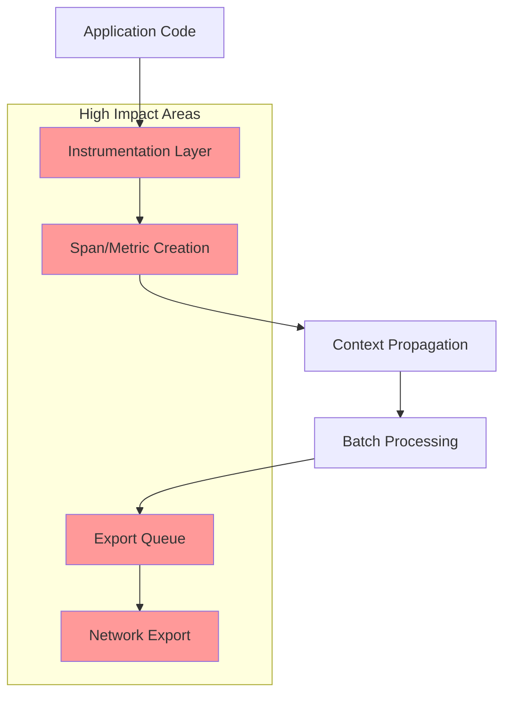
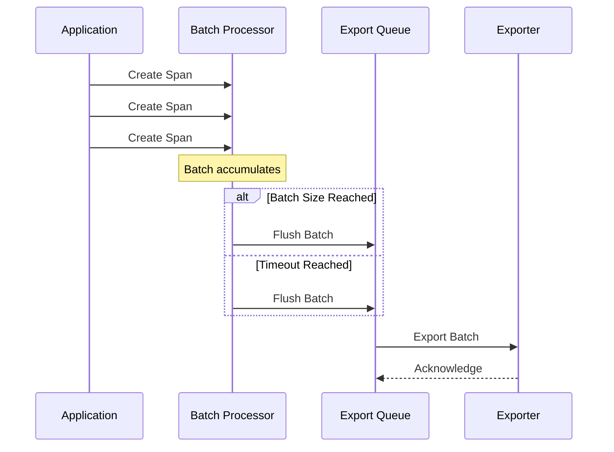
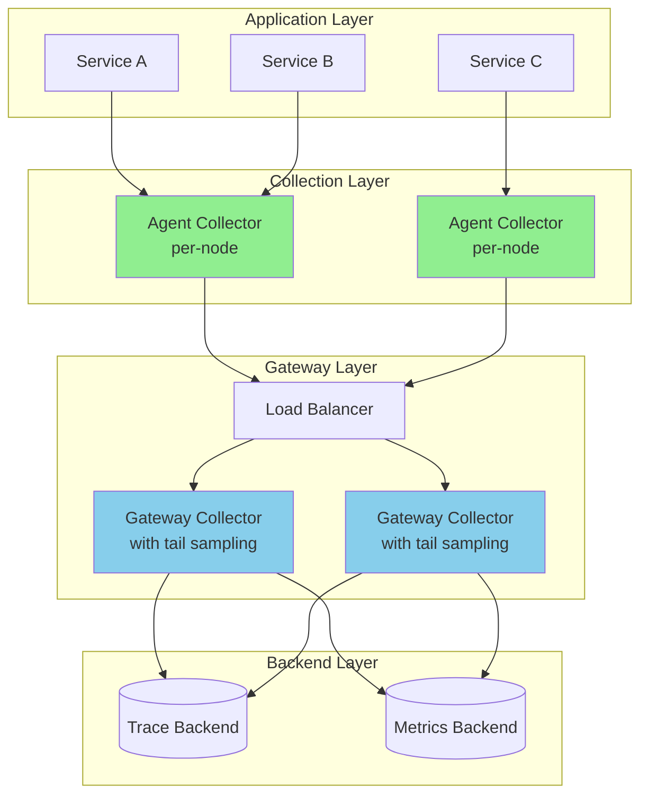

# How to Minimize OpenTelemetry Performance Overhead in Production

Author: [nawazdhandala](https://github.com/nawazdhandala)

Tags: OpenTelemetry, Performance, Optimization, Production, Observability

Description: A guide to optimizing OpenTelemetry instrumentation for minimal performance impact in production.

---

OpenTelemetry has become the industry standard for observability, providing unified APIs for traces, metrics, and logs. However, improper configuration can introduce significant performance overhead in production environments. This comprehensive guide covers strategies to minimize OpenTelemetry's performance impact while maintaining observability effectiveness.

## Understanding OpenTelemetry's Performance Impact

Before diving into optimization strategies, it's essential to understand where OpenTelemetry introduces overhead:



The main sources of overhead include:

1. **Instrumentation overhead**: Creating spans and recording attributes
2. **Memory allocation**: Storing span data and attributes
3. **Context propagation**: Passing trace context across threads and services
4. **Export operations**: Serialization and network I/O
5. **Batch processing**: Queue management and batching logic

## Sampling Strategies

Sampling is the most effective way to reduce overhead while maintaining visibility. OpenTelemetry supports several sampling strategies.

### Head-Based Sampling

Head-based sampling makes the decision at the start of a trace. This is the most efficient approach as it avoids processing spans that won't be exported.

The following configuration demonstrates how to set up different sampling strategies in Python. We start with a basic TraceIdRatioBased sampler that samples 10% of all traces:

```python
from opentelemetry import trace
from opentelemetry.sdk.trace import TracerProvider
from opentelemetry.sdk.trace.sampling import (
    TraceIdRatioBased,
    ParentBased,
    ALWAYS_ON,
    ALWAYS_OFF,
)

# TraceIdRatioBased samples a percentage of traces based on the trace ID.
# A ratio of 0.1 means 10% of traces will be sampled.
# This is deterministic - the same trace ID will always produce the same
# sampling decision, which is crucial for distributed tracing consistency.
ratio_sampler = TraceIdRatioBased(0.1)

# ParentBased wraps another sampler and respects the parent span's decision.
# If the parent was sampled, the child will be sampled too.
# This ensures complete traces rather than fragmented ones.
# The root parameter defines sampling behavior when there's no parent span.
parent_based_sampler = ParentBased(root=ratio_sampler)

# Configure the TracerProvider with our sampler.
# All traces created through this provider will use this sampling strategy.
provider = TracerProvider(sampler=parent_based_sampler)
trace.set_tracer_provider(provider)
```

### Custom Composite Sampler

For production environments, you often need more sophisticated sampling logic. The following example shows a custom sampler that combines multiple strategies - it always samples errors and slow requests while applying rate-based sampling to normal traffic:

```python
from opentelemetry.sdk.trace.sampling import Sampler, SamplingResult, Decision
from opentelemetry.trace import SpanKind
from typing import Optional, Sequence
import time

class ProductionSampler(Sampler):
    """
    A composite sampler designed for production use cases.

    Sampling strategy:
    - Always sample errors (identified by attributes)
    - Always sample slow requests (above threshold)
    - Rate-limit sample normal requests

    This ensures you never miss critical issues while controlling overhead.
    """

    def __init__(
        self,
        base_rate: float = 0.01,           # Sample 1% of normal traffic
        slow_threshold_ms: float = 1000,    # Always sample if > 1 second
        error_sample_rate: float = 1.0,     # Always sample errors
    ):
        self._base_rate = base_rate
        self._slow_threshold_ms = slow_threshold_ms
        self._error_sample_rate = error_sample_rate
        # TraceIdRatioBased provides deterministic sampling based on trace ID
        self._base_sampler = TraceIdRatioBased(base_rate)

    def should_sample(
        self,
        parent_context: Optional["Context"],
        trace_id: int,
        name: str,
        kind: SpanKind = None,
        attributes: Optional[dict] = None,
        links: Optional[Sequence] = None,
    ) -> SamplingResult:
        """
        Determine whether to sample this span.

        The decision is made based on:
        1. Error status in attributes (highest priority)
        2. Expected duration hints
        3. Base rate sampling (fallback)
        """
        attributes = attributes or {}

        # Priority 1: Always sample if this is an error span.
        # Errors are rare and critical - never drop them.
        if attributes.get("error", False) or attributes.get("http.status_code", 200) >= 500:
            return SamplingResult(
                Decision.RECORD_AND_SAMPLE,
                attributes,
                # TraceState can carry vendor-specific sampling info
            )

        # Priority 2: Sample slow operations based on hints.
        # Some instrumentation libraries set duration hints for known slow operations.
        expected_duration = attributes.get("expected_duration_ms", 0)
        if expected_duration > self._slow_threshold_ms:
            return SamplingResult(Decision.RECORD_AND_SAMPLE, attributes)

        # Priority 3: Fall back to base rate sampling.
        # This applies to the majority of "normal" traffic.
        return self._base_sampler.should_sample(
            parent_context, trace_id, name, kind, attributes, links
        )

    def get_description(self) -> str:
        return f"ProductionSampler(base_rate={self._base_rate})"
```

### Tail-Based Sampling with the Collector

For more sophisticated sampling decisions that require complete trace information, use the OpenTelemetry Collector's tail sampling processor. This configuration shows how to set up tail sampling that keeps traces based on latency, error status, and rate limiting:

```yaml
# OpenTelemetry Collector configuration for tail-based sampling.
# Tail sampling makes decisions after the entire trace is complete,
# allowing for more intelligent sampling based on trace characteristics.

processors:
  # The tail_sampling processor buffers complete traces before deciding.
  # This requires more memory but enables smarter sampling decisions.
  tail_sampling:
    # How long to wait for spans before making a decision.
    # Longer values capture more complete traces but use more memory.
    decision_wait: 10s

    # Maximum number of traces held in memory.
    # Tune based on your trace volume and available memory.
    # Formula: num_traces * avg_spans_per_trace * avg_span_size
    num_traces: 100000

    # Cache size for sampling decisions.
    # Helps when late-arriving spans reference already-decided traces.
    expected_new_traces_per_sec: 1000

    policies:
      # Policy 1: Always keep traces with errors.
      # Errors are your highest-priority debugging data.
      - name: errors-policy
        type: status_code
        status_code:
          status_codes: [ERROR]

      # Policy 2: Keep slow traces above latency threshold.
      # These indicate performance issues worth investigating.
      - name: latency-policy
        type: latency
        latency:
          # Threshold in milliseconds
          threshold_ms: 2000

      # Policy 3: Probabilistic sampling for remaining traces.
      # Provides baseline visibility without overwhelming storage.
      - name: probabilistic-policy
        type: probabilistic
        probabilistic:
          sampling_percentage: 5

      # Policy 4: Rate limiting as a safety valve.
      # Prevents runaway costs during traffic spikes.
      - name: rate-limiting-policy
        type: rate_limiting
        rate_limiting:
          spans_per_second: 1000
```

## Batch Processor Tuning

The batch processor is critical for reducing export overhead. Proper configuration can significantly reduce network calls and CPU usage.

### Understanding Batch Processor Parameters

The following diagram illustrates how spans flow through the batch processor:



### Optimized Batch Configuration (Python)

The batch processor queues spans and exports them in batches to reduce network overhead. This configuration is tuned for high-throughput production environments:

```python
from opentelemetry.sdk.trace import TracerProvider
from opentelemetry.sdk.trace.export import BatchSpanProcessor
from opentelemetry.exporter.otlp.proto.grpc.trace_exporter import OTLPSpanExporter

# Create the OTLP exporter with compression enabled.
# gzip compression typically reduces payload size by 80-90%,
# significantly reducing network bandwidth and costs.
exporter = OTLPSpanExporter(
    endpoint="otel-collector:4317",
    # Enable compression to reduce network bandwidth
    compression="gzip",
)

# Configure BatchSpanProcessor with production-optimized settings.
# These parameters control the tradeoff between latency and throughput.
batch_processor = BatchSpanProcessor(
    exporter,

    # max_queue_size: Maximum spans held in memory before dropping.
    # Larger values handle traffic spikes better but use more memory.
    # Memory usage: max_queue_size * avg_span_size (typically 1-5 KB each)
    max_queue_size=8192,

    # schedule_delay_millis: How often to flush batches.
    # Lower values = lower latency but more network calls.
    # Higher values = better batching efficiency but delayed visibility.
    # 5000ms (5 seconds) is a good balance for most production workloads.
    schedule_delay_millis=5000,

    # max_export_batch_size: Spans per batch export.
    # Larger batches are more efficient but increase memory pressure.
    # Should be <= max_queue_size. 512 is optimal for most gRPC setups.
    max_export_batch_size=512,

    # export_timeout_millis: Timeout for export operations.
    # Should be long enough to handle network latency and collector processing.
    # Too short = dropped spans during brief network issues.
    # Too long = backed-up queue during prolonged outages.
    export_timeout_millis=30000,
)

provider = TracerProvider()
provider.add_span_processor(batch_processor)
```

### Batch Configuration for Java

Java applications can configure the batch processor through environment variables or programmatically. The following shows programmatic configuration with detailed explanations:

```java
import io.opentelemetry.sdk.trace.SdkTracerProvider;
import io.opentelemetry.sdk.trace.export.BatchSpanProcessor;
import io.opentelemetry.exporter.otlp.trace.OtlpGrpcSpanExporter;

import java.time.Duration;

public class TracingConfiguration {

    /**
     * Creates an optimized BatchSpanProcessor for high-throughput production use.
     *
     * Key tuning considerations:
     * - Higher batch sizes reduce network overhead but increase memory usage
     * - Longer delays improve batching but increase data loss risk on crash
     * - Queue size should handle traffic spikes without dropping spans
     */
    public static BatchSpanProcessor createOptimizedProcessor() {
        // Configure the OTLP exporter with compression and reasonable timeouts.
        // gRPC is preferred over HTTP for better performance and streaming support.
        OtlpGrpcSpanExporter exporter = OtlpGrpcSpanExporter.builder()
            .setEndpoint("http://otel-collector:4317")
            // Compression reduces bandwidth by ~85% for typical trace data
            .setCompression("gzip")
            // Connection timeout - how long to wait for initial connection
            .setTimeout(Duration.ofSeconds(10))
            .build();

        return BatchSpanProcessor.builder(exporter)
            // Maximum time between batch exports.
            // 5 seconds balances latency vs efficiency for most workloads.
            .setScheduleDelay(Duration.ofSeconds(5))

            // Maximum batch size per export.
            // 512 spans is optimal for gRPC message size limits.
            .setMaxExportBatchSize(512)

            // Queue capacity for buffering spans.
            // Size for 30-60 seconds of peak traffic as a safety buffer.
            // Formula: peak_spans_per_second * buffer_seconds
            .setMaxQueueSize(8192)

            // Timeout for export operations.
            // Should exceed network RTT + collector processing time.
            .setExporterTimeout(Duration.ofSeconds(30))

            .build();
    }
}
```

### Environment Variable Configuration

For containerized deployments, environment variables provide flexible configuration without code changes. These are the key variables for tuning the batch processor:

```bash
# Batch Span Processor Configuration
# These environment variables configure the OTLP exporter and batch processor.

# Exporter endpoint - use gRPC (4317) for better performance than HTTP (4318)
export OTEL_EXPORTER_OTLP_ENDPOINT="http://otel-collector:4317"

# Enable gzip compression to reduce network bandwidth by ~85%
export OTEL_EXPORTER_OTLP_COMPRESSION="gzip"

# Maximum spans to queue in memory before dropping
# Tune based on: peak_traffic * acceptable_buffer_seconds
# Higher values handle spikes better but use more memory
export OTEL_BSP_MAX_QUEUE_SIZE=8192

# Milliseconds between batch exports
# Lower = fresher data but more network calls
# Higher = better efficiency but more data at risk during crashes
export OTEL_BSP_SCHEDULE_DELAY=5000

# Maximum spans per export batch
# 512 is optimal for gRPC, reduce for HTTP to stay under body size limits
export OTEL_BSP_MAX_EXPORT_BATCH_SIZE=512

# Timeout for export operations in milliseconds
# Should cover network latency + collector processing
export OTEL_BSP_EXPORT_TIMEOUT=30000
```

## Async Export Configuration

Asynchronous exports prevent blocking application threads during telemetry operations.

### Go Implementation with Async Export

The following Go code demonstrates a complete async export setup with proper resource management and graceful shutdown handling:

```go
package main

import (
    "context"
    "log"
    "time"

    "go.opentelemetry.io/otel"
    "go.opentelemetry.io/otel/exporters/otlp/otlptrace"
    "go.opentelemetry.io/otel/exporters/otlp/otlptrace/otlptracegrpc"
    "go.opentelemetry.io/otel/sdk/resource"
    sdktrace "go.opentelemetry.io/otel/sdk/trace"
    semconv "go.opentelemetry.io/otel/semconv/v1.21.0"
    "google.golang.org/grpc"
    "google.golang.org/grpc/credentials/insecure"
)

// initTracer sets up an optimized OpenTelemetry tracer for production use.
// It returns a shutdown function that should be called during graceful shutdown
// to ensure all pending spans are exported before the application exits.
func initTracer(ctx context.Context) (func(context.Context) error, error) {
    // Create a gRPC connection to the collector.
    // Using a connection pool with keepalive reduces connection overhead.
    conn, err := grpc.DialContext(ctx, "otel-collector:4317",
        // Use insecure for internal cluster communication.
        // For external/cross-network, use TLS credentials instead.
        grpc.WithTransportCredentials(insecure.NewCredentials()),

        // Connection pooling reduces overhead for high-volume exports.
        // The block option ensures the connection is established before returning.
        grpc.WithBlock(),
    )
    if err != nil {
        return nil, err
    }

    // Create the OTLP trace exporter using the gRPC connection.
    // gRPC provides better performance than HTTP for high-volume telemetry
    // due to connection reuse, multiplexing, and efficient serialization.
    exporter, err := otlptrace.New(ctx,
        otlptracegrpc.NewClient(
            otlptracegrpc.WithGRPCConn(conn),
            // Enable gzip compression to reduce bandwidth by ~85%.
            // The CPU cost is typically negligible compared to network savings.
            otlptracegrpc.WithCompressor("gzip"),
            // Retry configuration for transient failures.
            // Exponential backoff prevents overwhelming a recovering collector.
            otlptracegrpc.WithRetry(otlptracegrpc.RetryConfig{
                Enabled:         true,
                InitialInterval: 500 * time.Millisecond,
                MaxInterval:     5 * time.Second,
                MaxElapsedTime:  30 * time.Second,
            }),
        ),
    )
    if err != nil {
        return nil, err
    }

    // Define the resource that identifies this service.
    // Resources are attached to all telemetry and enable filtering/grouping.
    res, err := resource.Merge(
        resource.Default(),
        resource.NewWithAttributes(
            semconv.SchemaURL,
            semconv.ServiceName("my-service"),
            semconv.ServiceVersion("1.0.0"),
            semconv.DeploymentEnvironment("production"),
        ),
    )
    if err != nil {
        return nil, err
    }

    // Configure the batch span processor with production-optimized settings.
    // The batch processor is key to minimizing export overhead.
    batchProcessor := sdktrace.NewBatchSpanProcessor(
        exporter,
        // Maximum time to wait before exporting a batch.
        // 5 seconds balances freshness vs. network efficiency.
        sdktrace.WithBatchTimeout(5*time.Second),

        // Maximum spans per batch. 512 is optimal for gRPC.
        // Larger batches = fewer network calls but more memory.
        sdktrace.WithMaxExportBatchSize(512),

        // Queue size for buffering during traffic spikes.
        // Size for 30-60 seconds of peak traffic.
        sdktrace.WithMaxQueueSize(8192),

        // Timeout for export operations.
        // Should exceed network RTT + collector processing time.
        sdktrace.WithExportTimeout(30*time.Second),
    )

    // Create the tracer provider with our optimized configuration.
    tp := sdktrace.NewTracerProvider(
        sdktrace.WithSpanProcessor(batchProcessor),
        sdktrace.WithResource(res),
        // Use ParentBased sampler to respect upstream sampling decisions.
        // TraceIDRatioBased samples 10% of new traces.
        sdktrace.WithSampler(
            sdktrace.ParentBased(sdktrace.TraceIDRatioBased(0.1)),
        ),
    )

    // Set the global tracer provider.
    // This allows instrumentation libraries to access the tracer.
    otel.SetTracerProvider(tp)

    // Return the shutdown function.
    // CRITICAL: Call this during graceful shutdown to flush pending spans.
    return tp.Shutdown, nil
}
```

### Node.js Async Configuration

The following Node.js configuration demonstrates async export setup with proper error handling and graceful shutdown:

```javascript
const { NodeSDK } = require('@opentelemetry/sdk-node');
const { OTLPTraceExporter } = require('@opentelemetry/exporter-trace-otlp-grpc');
const { BatchSpanProcessor } = require('@opentelemetry/sdk-trace-base');
const { Resource } = require('@opentelemetry/resources');
const { SemanticResourceAttributes } = require('@opentelemetry/semantic-conventions');
const { ParentBasedSampler, TraceIdRatioBasedSampler } = require('@opentelemetry/sdk-trace-base');
const { CompressionAlgorithm } = require('@opentelemetry/otlp-exporter-base');

/**
 * Creates an optimized OpenTelemetry SDK configuration for Node.js.
 *
 * Key optimizations:
 * - gRPC transport for efficient, multiplexed connections
 * - Compression to reduce network bandwidth
 * - Tuned batch processor for high throughput
 * - Sampling to reduce volume while maintaining visibility
 */
function createOptimizedSDK() {
    // Configure the OTLP exporter with gRPC transport.
    // gRPC provides better performance than HTTP for high-volume telemetry.
    const traceExporter = new OTLPTraceExporter({
        url: 'grpc://otel-collector:4317',
        // gzip compression reduces payload size by ~85%
        compression: CompressionAlgorithm.GZIP,
        // Timeout for export operations (milliseconds)
        timeoutMillis: 30000,
    });

    // Configure the batch span processor with production settings.
    // The batch processor queues spans and exports them efficiently.
    const spanProcessor = new BatchSpanProcessor(traceExporter, {
        // Maximum batch size per export.
        // 512 is optimal for gRPC message size limits.
        maxExportBatchSize: 512,

        // Maximum spans to queue before dropping oldest.
        // Size for handling traffic spikes: peak_rate * buffer_seconds
        maxQueueSize: 8192,

        // Milliseconds to wait before forcing a batch export.
        // 5000ms balances latency vs. network efficiency.
        scheduledDelayMillis: 5000,

        // Timeout for export operations.
        exportTimeoutMillis: 30000,
    });

    // Create the SDK with all components configured.
    const sdk = new NodeSDK({
        // Resource identifies this service in telemetry data.
        resource: new Resource({
            [SemanticResourceAttributes.SERVICE_NAME]: 'my-node-service',
            [SemanticResourceAttributes.SERVICE_VERSION]: '1.0.0',
            [SemanticResourceAttributes.DEPLOYMENT_ENVIRONMENT]: 'production',
        }),

        // Use the configured span processor.
        spanProcessor: spanProcessor,

        // Configure sampling to reduce volume.
        // ParentBased respects upstream sampling decisions.
        // TraceIdRatioBased samples 10% of new traces.
        sampler: new ParentBasedSampler({
            root: new TraceIdRatioBasedSampler(0.1),
        }),
    });

    return sdk;
}

// Initialize the SDK.
const sdk = createOptimizedSDK();
sdk.start();

// CRITICAL: Handle graceful shutdown to flush pending telemetry.
// Without this, spans in the queue may be lost on shutdown.
process.on('SIGTERM', () => {
    sdk.shutdown()
        .then(() => {
            console.log('OpenTelemetry SDK shut down successfully');
            process.exit(0);
        })
        .catch((error) => {
            console.error('Error shutting down OpenTelemetry SDK:', error);
            process.exit(1);
        });
});

// Also handle SIGINT (Ctrl+C) for local development.
process.on('SIGINT', () => {
    sdk.shutdown()
        .then(() => process.exit(0))
        .catch(() => process.exit(1));
});
```

## Resource and Attribute Optimization

Excessive attributes and inefficient resource configuration can significantly impact memory usage and export overhead.

### Attribute Limits Configuration

Limiting attributes prevents runaway memory usage from unbounded data:

```python
from opentelemetry.sdk.trace import TracerProvider, SpanLimits

# Configure span limits to prevent memory issues from excessive attributes.
# These limits are especially important when using auto-instrumentation,
# which may capture more data than expected.
span_limits = SpanLimits(
    # Maximum attributes per span.
    # Each attribute consumes memory for key and value storage.
    # 128 is sufficient for most use cases; reduce if memory-constrained.
    max_attributes=128,

    # Maximum events (logs) per span.
    # Events can grow unbounded in long-running spans.
    # 128 events is typically more than enough for debugging.
    max_events=128,

    # Maximum links to other traces.
    # Links are rarely needed in high volume; 32 is generous.
    max_links=32,

    # Maximum length of attribute values.
    # Prevents large strings (e.g., request bodies) from bloating spans.
    # Truncated values are marked with "..." suffix.
    max_attribute_length=1024,
)

# Apply limits to the tracer provider.
provider = TracerProvider(span_limits=span_limits)
```

### Views for Metric Optimization

Views allow you to control metric cardinality and reduce storage costs by dropping unnecessary attributes:

```python
from opentelemetry.sdk.metrics import MeterProvider
from opentelemetry.sdk.metrics.view import View, ExplicitBucketHistogramAggregation

# Views control how metrics are aggregated and what attributes are retained.
# This is crucial for controlling metric cardinality and storage costs.

# View 1: Optimize histogram buckets for HTTP latency.
# Default buckets often don't match your latency distribution.
# Custom buckets provide better resolution where it matters.
http_latency_view = View(
    # Match metrics by name pattern
    instrument_name="http.server.duration",

    # Use explicit buckets optimized for typical web latency.
    # Buckets in milliseconds: [5, 10, 25, 50, 100, 250, 500, 1000, 2500, 5000, 10000]
    aggregation=ExplicitBucketHistogramAggregation(
        boundaries=[5, 10, 25, 50, 100, 250, 500, 1000, 2500, 5000, 10000]
    ),

    # Only keep essential attributes to reduce cardinality.
    # High-cardinality attributes like user_id would explode storage.
    attribute_keys=["http.method", "http.status_code", "http.route"],
)

# View 2: Drop high-cardinality attributes from database metrics.
# Attributes like db.statement can have millions of unique values.
db_metrics_view = View(
    instrument_name="db.*",
    # Keep only essential dimensions for aggregation
    attribute_keys=["db.system", "db.operation", "db.name"],
)

# View 3: Completely drop internal/debug metrics in production.
# Some instrumentation libraries emit verbose metrics not needed in prod.
drop_debug_metrics = View(
    instrument_name="*.debug.*",
    # Empty aggregation effectively drops the metric
    aggregation=None,
)

provider = MeterProvider(
    views=[http_latency_view, db_metrics_view, drop_debug_metrics]
)
```

## Context Propagation Optimization

Context propagation can introduce overhead, especially in async environments. Here's how to optimize it.

### Efficient Context Propagation in Python

This example shows how to properly propagate context in async code while minimizing overhead:

```python
import asyncio
from opentelemetry import trace, context
from opentelemetry.context import attach, detach, get_current

tracer = trace.get_tracer(__name__)

async def process_request(request_data: dict):
    """
    Demonstrates efficient context propagation in async code.

    Key principles:
    1. Capture context before spawning concurrent tasks
    2. Use context tokens for explicit lifecycle management
    3. Avoid unnecessary context copies in hot paths
    """
    with tracer.start_as_current_span("process_request") as span:
        # Capture the current context ONCE before spawning tasks.
        # This is more efficient than calling get_current() repeatedly.
        current_context = get_current()

        # Spawn multiple concurrent tasks that share the same trace.
        # Each task will properly parent its spans to the current span.
        tasks = [
            process_item_with_context(item, current_context)
            for item in request_data.get("items", [])
        ]

        # asyncio.gather runs tasks concurrently while maintaining context.
        results = await asyncio.gather(*tasks)

        return results


async def process_item_with_context(item: dict, parent_context):
    """
    Process an item with explicit context propagation.

    Using explicit context attachment is more efficient than relying on
    automatic context propagation, especially in high-concurrency scenarios.
    """
    # Attach the parent context to this async task.
    # This ensures spans created here are properly parented.
    token = attach(parent_context)

    try:
        # Create a child span within the attached context.
        with tracer.start_as_current_span("process_item") as span:
            span.set_attribute("item.id", item.get("id"))

            # Perform the actual processing
            result = await do_processing(item)

            return result
    finally:
        # ALWAYS detach to prevent context leaks.
        # Context leaks cause memory issues and incorrect span parenting.
        detach(token)
```

### W3C Trace Context Propagation

For cross-service communication, W3C Trace Context is the standard. Configure propagators efficiently:

```python
from opentelemetry import propagate
from opentelemetry.propagators.composite import CompositePropagator
from opentelemetry.trace.propagation.tracecontext import TraceContextTextMapPropagator
from opentelemetry.baggage.propagation import W3CBaggagePropagator

# Configure propagators for cross-service context propagation.
# Only enable the propagators you actually need to minimize overhead.

# W3C Trace Context is the standard for distributed tracing.
# It propagates trace_id, span_id, and sampling decision.
trace_propagator = TraceContextTextMapPropagator()

# Baggage propagates key-value pairs across services.
# Only enable if you actually use baggage; it adds header overhead.
baggage_propagator = W3CBaggagePropagator()

# Composite propagator combines multiple propagators.
# Order matters: propagators are invoked in sequence.
propagate.set_global_textmap(
    CompositePropagator([
        trace_propagator,
        baggage_propagator,  # Remove if not using baggage
    ])
)

# Injection example: Add trace context to outgoing requests.
# This is typically done by HTTP client instrumentation automatically.
def inject_context(headers: dict) -> dict:
    """Inject trace context into outgoing request headers."""
    propagate.inject(headers)
    return headers

# Extraction example: Extract context from incoming requests.
# This is typically done by HTTP server instrumentation automatically.
def extract_context(headers: dict):
    """Extract trace context from incoming request headers."""
    return propagate.extract(headers)
```

## Benchmarking and Monitoring Overhead

### Measuring Instrumentation Overhead

The following code demonstrates how to benchmark OpenTelemetry overhead in your application:

```python
import time
import statistics
from contextlib import contextmanager
from opentelemetry import trace

tracer = trace.get_tracer(__name__)

class OverheadBenchmark:
    """
    Utility class for measuring OpenTelemetry instrumentation overhead.

    Use this to:
    1. Establish baseline overhead for your configuration
    2. Compare different sampling strategies
    3. Identify high-overhead instrumentation
    4. Validate optimization changes
    """

    def __init__(self, iterations: int = 10000):
        self.iterations = iterations
        self.results = {}

    def benchmark_span_creation(self) -> dict:
        """
        Measure the overhead of creating spans.

        This isolates span creation cost from your business logic,
        helping you understand the fixed cost per operation.
        """
        times = []

        for _ in range(self.iterations):
            start = time.perf_counter_ns()

            # Create a span with typical attributes
            with tracer.start_as_current_span("benchmark_span") as span:
                span.set_attribute("benchmark.iteration", _)
                span.set_attribute("benchmark.type", "creation_test")

            end = time.perf_counter_ns()
            times.append(end - start)

        return self._calculate_stats(times, "span_creation")

    def benchmark_with_business_logic(self, business_func) -> dict:
        """
        Measure overhead relative to actual business logic.

        This provides a realistic picture of overhead as a percentage
        of total operation time.
        """
        # First, measure business logic without tracing
        baseline_times = []
        for _ in range(self.iterations):
            start = time.perf_counter_ns()
            business_func()
            end = time.perf_counter_ns()
            baseline_times.append(end - start)

        baseline_mean = statistics.mean(baseline_times)

        # Then measure with tracing
        traced_times = []
        for _ in range(self.iterations):
            start = time.perf_counter_ns()
            with tracer.start_as_current_span("business_operation"):
                business_func()
            end = time.perf_counter_ns()
            traced_times.append(end - start)

        traced_mean = statistics.mean(traced_times)

        # Calculate overhead percentage
        overhead_ns = traced_mean - baseline_mean
        overhead_pct = (overhead_ns / baseline_mean) * 100

        return {
            "baseline_mean_ns": baseline_mean,
            "traced_mean_ns": traced_mean,
            "overhead_ns": overhead_ns,
            "overhead_percent": overhead_pct,
        }

    def _calculate_stats(self, times: list, name: str) -> dict:
        """Calculate statistical summary of timing data."""
        return {
            "name": name,
            "iterations": len(times),
            "mean_ns": statistics.mean(times),
            "median_ns": statistics.median(times),
            "stdev_ns": statistics.stdev(times) if len(times) > 1 else 0,
            "min_ns": min(times),
            "max_ns": max(times),
            "p95_ns": sorted(times)[int(len(times) * 0.95)],
            "p99_ns": sorted(times)[int(len(times) * 0.99)],
        }


# Example usage:
# benchmark = OverheadBenchmark(iterations=10000)
# results = benchmark.benchmark_span_creation()
# print(f"Span creation overhead: {results['mean_ns'] / 1000:.2f} microseconds")
```

### Collector Performance Metrics

Configure the Collector to expose its own metrics for monitoring pipeline health:

```yaml
# OpenTelemetry Collector configuration with self-monitoring enabled.
# This helps you identify bottlenecks and tune performance.

extensions:
  # Health check endpoint for container orchestration.
  health_check:
    endpoint: 0.0.0.0:13133

  # Prometheus metrics for Collector self-monitoring.
  # Scrape these to monitor Collector performance.
  prometheus:
    endpoint: 0.0.0.0:8888

service:
  extensions: [health_check, prometheus]

  # Telemetry configuration for the Collector itself.
  telemetry:
    # Log level: debug, info, warn, error
    logs:
      level: info

    # Collector self-metrics
    metrics:
      level: detailed  # basic, normal, or detailed
      address: 0.0.0.0:8888

      # Key metrics to monitor:
      # - otelcol_processor_batch_batch_send_size: Batch sizes being exported
      # - otelcol_exporter_queue_size: Current queue depth
      # - otelcol_exporter_sent_spans: Successfully exported spans
      # - otelcol_exporter_failed_spans: Failed span exports
      # - otelcol_processor_dropped_spans: Spans dropped due to queue overflow
      # - otelcol_receiver_accepted_spans: Spans received from applications

receivers:
  otlp:
    protocols:
      grpc:
        endpoint: 0.0.0.0:4317
        # Increase max message size for large batches
        max_recv_msg_size_mib: 16
      http:
        endpoint: 0.0.0.0:4318

processors:
  # Memory limiter prevents OOM by applying backpressure.
  # Configure based on your container memory limits.
  memory_limiter:
    # Start limiting at 80% of memory limit
    limit_mib: 1600
    # Start refusing data at 90% of limit
    spike_limit_mib: 400
    # How often to check memory usage
    check_interval: 1s

  # Batch processor for efficient exports
  batch:
    timeout: 5s
    send_batch_size: 512
    send_batch_max_size: 1024

exporters:
  otlp:
    endpoint: "backend:4317"
    sending_queue:
      # Enable persistent queue to survive restarts
      enabled: true
      # Queue size in batches (not spans)
      num_consumers: 10
      queue_size: 1000
    retry_on_failure:
      enabled: true
      initial_interval: 5s
      max_interval: 30s
      max_elapsed_time: 300s

service:
  pipelines:
    traces:
      receivers: [otlp]
      # Memory limiter should be first processor
      processors: [memory_limiter, batch]
      exporters: [otlp]
```

## Production Deployment Architecture

Here's a recommended architecture for production OpenTelemetry deployment:



### Agent Collector Configuration (per-node)

The agent collector runs as a sidecar or DaemonSet, providing local buffering and filtering:

```yaml
# Agent collector configuration - runs on each node.
# Responsibilities:
# - Receive telemetry from local applications
# - Apply initial filtering and batching
# - Forward to gateway collectors

receivers:
  otlp:
    protocols:
      grpc:
        endpoint: 0.0.0.0:4317
        # Keepalive settings for long-lived connections
        keepalive:
          server_parameters:
            max_connection_age: 60s
            max_connection_age_grace: 10s

processors:
  # Memory limiter is critical for node stability.
  # Prevents OOM that could affect other workloads on the node.
  memory_limiter:
    limit_mib: 512
    spike_limit_mib: 128
    check_interval: 1s

  # Initial batching before forwarding to gateway.
  # Smaller batches than gateway since we're optimizing for low latency.
  batch:
    timeout: 1s
    send_batch_size: 256

  # Resource detection adds node/pod information automatically.
  # This enriches telemetry without application code changes.
  resourcedetection:
    detectors: [env, system, docker, ec2, gcp, azure]
    timeout: 5s

exporters:
  # Forward to gateway collector via load balancer.
  otlp:
    endpoint: "gateway-lb:4317"
    tls:
      insecure: true
    # Aggressive retry for gateway communication
    retry_on_failure:
      enabled: true
      initial_interval: 1s
      max_interval: 10s

service:
  pipelines:
    traces:
      receivers: [otlp]
      processors: [memory_limiter, resourcedetection, batch]
      exporters: [otlp]
```

### Gateway Collector Configuration

The gateway collector handles tail sampling and final processing:

```yaml
# Gateway collector configuration - centralized processing.
# Responsibilities:
# - Tail-based sampling decisions
# - Final batching and compression
# - Export to observability backends

receivers:
  otlp:
    protocols:
      grpc:
        endpoint: 0.0.0.0:4317
        max_recv_msg_size_mib: 32

processors:
  memory_limiter:
    limit_mib: 4096
    spike_limit_mib: 1024
    check_interval: 1s

  # Tail sampling requires complete traces.
  # Size the decision_wait and num_traces based on your traffic.
  tail_sampling:
    decision_wait: 30s
    num_traces: 500000
    policies:
      - name: keep-errors
        type: status_code
        status_code:
          status_codes: [ERROR]
      - name: keep-slow
        type: latency
        latency:
          threshold_ms: 5000
      - name: baseline
        type: probabilistic
        probabilistic:
          sampling_percentage: 1

  # Large batches for efficient backend exports
  batch:
    timeout: 10s
    send_batch_size: 1024
    send_batch_max_size: 2048

exporters:
  otlp:
    endpoint: "trace-backend:4317"
    compression: gzip
    sending_queue:
      enabled: true
      num_consumers: 20
      queue_size: 5000
    retry_on_failure:
      enabled: true
      initial_interval: 5s
      max_interval: 60s
      max_elapsed_time: 600s

service:
  pipelines:
    traces:
      receivers: [otlp]
      processors: [memory_limiter, tail_sampling, batch]
      exporters: [otlp]
```

## Summary and Best Practices

### Performance Optimization Checklist

1. **Sampling**
   - Use head-based sampling for maximum efficiency
   - Implement custom samplers for error/latency prioritization
   - Use tail sampling at the collector level for complete trace decisions

2. **Batch Processing**
   - Configure batch size based on your throughput (512-1024 spans typical)
   - Set appropriate queue sizes for traffic spikes (30-60 seconds buffer)
   - Enable compression (gzip) to reduce network overhead by ~85%

3. **Export Configuration**
   - Use gRPC over HTTP for better performance
   - Configure reasonable timeouts (10-30 seconds)
   - Enable retry with exponential backoff

4. **Attribute Management**
   - Set span limits to prevent unbounded growth
   - Use views to control metric cardinality
   - Drop high-cardinality attributes early

5. **Architecture**
   - Deploy agent collectors per-node for local buffering
   - Use gateway collectors for centralized sampling
   - Implement memory limiters at all levels

### Overhead Targets

For most production workloads, aim for these overhead targets:

| Metric | Target | Maximum |
|--------|--------|---------|
| Span creation latency | < 10 microseconds | < 50 microseconds |
| Memory per span | < 5 KB | < 10 KB |
| CPU overhead | < 1% | < 5% |
| Network bandwidth | < 100 KB/s per service | Varies |

### Monitoring Your Telemetry Pipeline

Always monitor the health of your telemetry pipeline:

- **Queue depth**: Indicates backpressure; should stay below 50% capacity
- **Dropped spans**: Should be zero under normal conditions
- **Export latency**: Should be consistent; spikes indicate backend issues
- **Memory usage**: Should be stable; growth indicates leaks

By following these practices, you can maintain comprehensive observability while keeping OpenTelemetry's performance impact minimal. Remember that observability is a tradeoff between visibility and overhead, so tune these settings based on your specific requirements and continuously monitor the impact.
