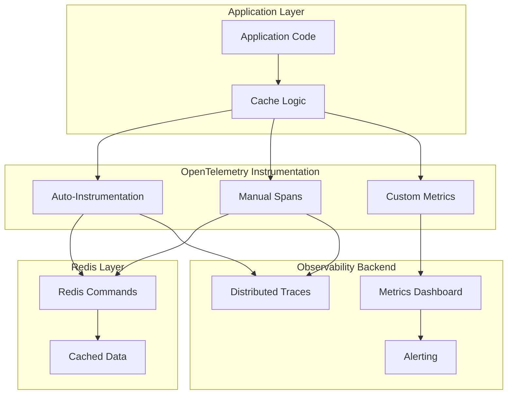
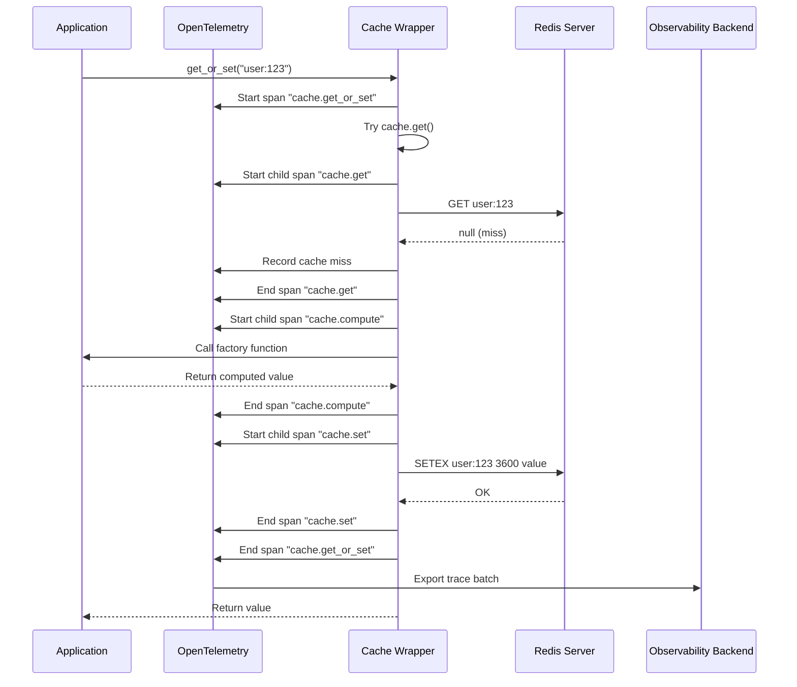
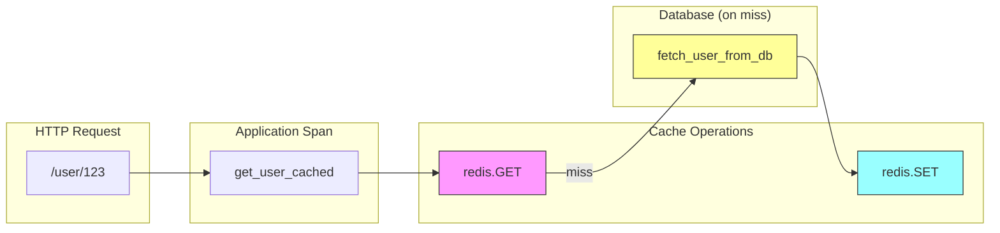

# How to Monitor Redis Cache Performance with OpenTelemetry

Author: [nawazdhandala](https://github.com/nawazdhandala)

Tags: OpenTelemetry, Observability, Redis, Caching, Performance, Tracing

Description: A guide to instrumenting Redis operations with OpenTelemetry for cache performance monitoring.

---

> Redis is the backbone of modern application caching, but without proper observability, cache performance issues can silently degrade your application. OpenTelemetry provides a vendor-neutral way to instrument Redis operations, giving you deep visibility into cache hit rates, latency patterns, and command-level performance.

This guide covers everything you need to monitor Redis cache performance effectively: from basic instrumentation to advanced cache analytics with custom metrics and distributed tracing.

---

## Understanding Redis Cache Observability

Before diving into implementation, let's understand what we need to monitor for effective cache observability:



Key metrics to track include:
- **Cache hit/miss ratio** - The effectiveness of your caching strategy
- **Command latency** - How long Redis operations take
- **Connection pool health** - Available vs. used connections
- **Memory usage** - Redis memory consumption patterns
- **Command distribution** - Which commands are most frequent

---

## Getting Started

### Installation

Install the required packages for OpenTelemetry with Redis instrumentation:

```bash
pip install opentelemetry-api \
            opentelemetry-sdk \
            opentelemetry-instrumentation-redis \
            opentelemetry-exporter-otlp \
            redis
```

### Basic OpenTelemetry Setup

Configure OpenTelemetry with OTLP exporter for sending telemetry data to your observability backend:

```python
# otel_config.py
from opentelemetry import trace
from opentelemetry.sdk.trace import TracerProvider
from opentelemetry.sdk.trace.export import BatchSpanProcessor
from opentelemetry.exporter.otlp.proto.grpc.trace_exporter import OTLPSpanExporter
from opentelemetry.sdk.resources import Resource, SERVICE_NAME

def configure_opentelemetry(service_name: str = "redis-cache-service"):
    """
    Configure OpenTelemetry with OTLP exporter for distributed tracing.

    Args:
        service_name: The name of your service for trace identification
    """
    # Create a resource that identifies your service in traces
    # This helps distinguish traces from different services
    resource = Resource(attributes={
        SERVICE_NAME: service_name,
        "service.version": "1.0.0",
        "deployment.environment": "production"
    })

    # Initialize the tracer provider with the resource
    # The provider manages all tracers in your application
    provider = TracerProvider(resource=resource)

    # Configure the OTLP exporter to send traces to your backend
    # Default endpoint is localhost:4317 for OTLP gRPC
    otlp_exporter = OTLPSpanExporter(
        endpoint="http://localhost:4317",  # Your OTLP collector endpoint
        insecure=True  # Set to False in production with TLS
    )

    # Use BatchSpanProcessor for efficient batching of spans
    # This reduces network overhead by sending spans in batches
    processor = BatchSpanProcessor(otlp_exporter)
    provider.add_span_processor(processor)

    # Set the global tracer provider
    trace.set_tracer_provider(provider)

    return trace.get_tracer(__name__)
```

---

## Auto-Instrumenting Redis

### Automatic Instrumentation

The simplest way to get started is with auto-instrumentation. This automatically captures all Redis commands with minimal code changes:

```python
# redis_client.py
import redis
from opentelemetry.instrumentation.redis import RedisInstrumentor

# Instrument Redis globally before creating any clients
# This patches the redis library to automatically create spans for all operations
RedisInstrumentor().instrument()

def create_redis_client():
    """
    Create an instrumented Redis client.
    All operations will automatically generate OpenTelemetry spans.
    """
    return redis.Redis(
        host='localhost',
        port=6379,
        db=0,
        # Use connection pooling for better performance
        # The pool maintains persistent connections to Redis
        max_connections=20,
        # Decode responses to strings automatically
        decode_responses=True,
        # Socket timeout prevents hanging on network issues
        socket_timeout=5.0,
        # Connection timeout for initial connection
        socket_connect_timeout=2.0
    )

# Create the client - all operations are now traced
redis_client = create_redis_client()
```

### What Auto-Instrumentation Captures

Auto-instrumentation automatically records the following span attributes:

```python
# Example of what a span looks like from auto-instrumentation
# These attributes are captured automatically for each Redis command

"""
Span Name: redis.GET
Attributes:
    db.system: redis
    db.statement: GET user:123:profile
    db.redis.database_index: 0
    net.peer.name: localhost
    net.peer.port: 6379
    db.redis.response_length: 256
"""

# Usage example showing automatic span creation
def get_user_profile(user_id: str) -> dict:
    """
    Fetch user profile from cache.
    This operation is automatically traced by OpenTelemetry.
    """
    # This GET command automatically creates a span with:
    # - Command name (GET)
    # - Key being accessed
    # - Response size
    # - Latency timing
    cached = redis_client.get(f"user:{user_id}:profile")

    if cached:
        return json.loads(cached)
    return None
```

---

## Cache Hit/Miss Tracking

### Implementing Cache Hit/Miss Metrics

Track cache effectiveness with custom metrics that measure hit and miss rates:

```python
# cache_metrics.py
from opentelemetry import metrics
from opentelemetry.sdk.metrics import MeterProvider
from opentelemetry.sdk.metrics.export import PeriodicExportingMetricReader
from opentelemetry.exporter.otlp.proto.grpc.metric_exporter import OTLPMetricExporter

def configure_metrics():
    """
    Configure OpenTelemetry metrics for cache monitoring.
    Sets up a meter provider with OTLP exporter for metrics.
    """
    # Create metric exporter to send metrics to your backend
    metric_exporter = OTLPMetricExporter(
        endpoint="http://localhost:4317",
        insecure=True
    )

    # Configure periodic export every 60 seconds
    # Adjust interval based on your monitoring needs
    metric_reader = PeriodicExportingMetricReader(
        metric_exporter,
        export_interval_millis=60000
    )

    # Set up the meter provider
    provider = MeterProvider(metric_readers=[metric_reader])
    metrics.set_meter_provider(provider)

    return metrics.get_meter(__name__)

# Initialize the meter for creating instruments
meter = configure_metrics()

# Create counters for cache hits and misses
# Counters are cumulative - they only increase
cache_hits = meter.create_counter(
    name="cache.hits",
    description="Number of cache hits",
    unit="1"
)

cache_misses = meter.create_counter(
    name="cache.misses",
    description="Number of cache misses",
    unit="1"
)

# Create a histogram for cache operation latency
# Histograms capture the distribution of values
cache_latency = meter.create_histogram(
    name="cache.latency",
    description="Cache operation latency in milliseconds",
    unit="ms"
)
```

### Cache Wrapper with Hit/Miss Tracking

Create a wrapper class that tracks cache performance automatically:

```python
# cache_wrapper.py
import json
import time
from typing import Optional, Any, Callable
from opentelemetry import trace

class InstrumentedCache:
    """
    A Redis cache wrapper with built-in OpenTelemetry instrumentation.
    Tracks cache hits, misses, and latency automatically.
    """

    def __init__(self, redis_client, meter):
        """
        Initialize the instrumented cache.

        Args:
            redis_client: The Redis client instance
            meter: OpenTelemetry meter for creating instruments
        """
        self.redis = redis_client
        self.tracer = trace.get_tracer(__name__)

        # Create metric instruments for cache monitoring
        self.hits_counter = meter.create_counter(
            "cache.hits",
            description="Cache hit count",
            unit="1"
        )

        self.misses_counter = meter.create_counter(
            "cache.misses",
            description="Cache miss count",
            unit="1"
        )

        self.latency_histogram = meter.create_histogram(
            "cache.operation.latency",
            description="Cache operation latency",
            unit="ms"
        )

        # Track cache hit rate with an observable gauge
        # This calculates the ratio periodically
        self._hits = 0
        self._misses = 0

    def get(self, key: str, cache_group: str = "default") -> Optional[Any]:
        """
        Get a value from cache with automatic hit/miss tracking.

        Args:
            key: The cache key to retrieve
            cache_group: Logical grouping for metrics (e.g., 'user', 'product')

        Returns:
            The cached value or None if not found
        """
        # Create a custom span for detailed cache operation tracking
        with self.tracer.start_as_current_span("cache.get") as span:
            # Add semantic attributes for better trace analysis
            span.set_attribute("cache.key", key)
            span.set_attribute("cache.group", cache_group)

            start_time = time.perf_counter()

            try:
                # Attempt to retrieve from Redis
                value = self.redis.get(key)

                # Calculate operation latency
                latency_ms = (time.perf_counter() - start_time) * 1000

                # Record latency with dimensional attributes
                self.latency_histogram.record(
                    latency_ms,
                    {"operation": "get", "cache_group": cache_group}
                )

                if value is not None:
                    # Cache hit - record success
                    self._hits += 1
                    self.hits_counter.add(1, {"cache_group": cache_group})
                    span.set_attribute("cache.hit", True)
                    span.set_attribute("cache.value_size", len(value))

                    # Deserialize JSON data
                    return json.loads(value)
                else:
                    # Cache miss - record miss
                    self._misses += 1
                    self.misses_counter.add(1, {"cache_group": cache_group})
                    span.set_attribute("cache.hit", False)

                    return None

            except Exception as e:
                # Record error in span for debugging
                span.set_attribute("error", True)
                span.set_attribute("error.message", str(e))
                span.record_exception(e)
                raise

    def set(
        self,
        key: str,
        value: Any,
        ttl_seconds: int = 3600,
        cache_group: str = "default"
    ) -> bool:
        """
        Set a value in cache with automatic instrumentation.

        Args:
            key: The cache key
            value: The value to cache (will be JSON serialized)
            ttl_seconds: Time-to-live in seconds
            cache_group: Logical grouping for metrics

        Returns:
            True if successful, False otherwise
        """
        with self.tracer.start_as_current_span("cache.set") as span:
            span.set_attribute("cache.key", key)
            span.set_attribute("cache.group", cache_group)
            span.set_attribute("cache.ttl_seconds", ttl_seconds)

            start_time = time.perf_counter()

            try:
                # Serialize value to JSON
                serialized = json.dumps(value)
                span.set_attribute("cache.value_size", len(serialized))

                # Set in Redis with TTL
                result = self.redis.setex(key, ttl_seconds, serialized)

                # Record latency
                latency_ms = (time.perf_counter() - start_time) * 1000
                self.latency_histogram.record(
                    latency_ms,
                    {"operation": "set", "cache_group": cache_group}
                )

                return result

            except Exception as e:
                span.set_attribute("error", True)
                span.record_exception(e)
                raise

    def get_or_set(
        self,
        key: str,
        factory: Callable[[], Any],
        ttl_seconds: int = 3600,
        cache_group: str = "default"
    ) -> Any:
        """
        Get from cache or compute and store if missing.
        This is the cache-aside pattern with full instrumentation.

        Args:
            key: The cache key
            factory: Function to call if cache misses
            ttl_seconds: TTL for cached value
            cache_group: Logical grouping for metrics

        Returns:
            The cached or computed value
        """
        with self.tracer.start_as_current_span("cache.get_or_set") as span:
            span.set_attribute("cache.key", key)
            span.set_attribute("cache.group", cache_group)

            # Try to get from cache first
            cached_value = self.get(key, cache_group)

            if cached_value is not None:
                span.set_attribute("cache.source", "cache")
                return cached_value

            # Cache miss - compute the value
            span.set_attribute("cache.source", "computed")

            with self.tracer.start_as_current_span("cache.compute") as compute_span:
                # Call the factory function to compute the value
                computed_value = factory()
                compute_span.set_attribute("computed", True)

            # Store in cache for future requests
            self.set(key, computed_value, ttl_seconds, cache_group)

            return computed_value

    def delete(self, key: str, cache_group: str = "default") -> bool:
        """
        Delete a key from cache with instrumentation.

        Args:
            key: The cache key to delete
            cache_group: Logical grouping for metrics

        Returns:
            True if key was deleted, False if key didn't exist
        """
        with self.tracer.start_as_current_span("cache.delete") as span:
            span.set_attribute("cache.key", key)
            span.set_attribute("cache.group", cache_group)

            start_time = time.perf_counter()

            result = self.redis.delete(key)

            latency_ms = (time.perf_counter() - start_time) * 1000
            self.latency_histogram.record(
                latency_ms,
                {"operation": "delete", "cache_group": cache_group}
            )

            span.set_attribute("cache.deleted", result > 0)
            return result > 0

    def get_hit_rate(self) -> float:
        """
        Calculate the current cache hit rate.

        Returns:
            Hit rate as a percentage (0-100)
        """
        total = self._hits + self._misses
        if total == 0:
            return 0.0
        return (self._hits / total) * 100
```

---

## Command-Level Tracing

### Tracing Flow for Redis Operations

Understanding how traces flow through your application helps with debugging:



### Detailed Command Tracing

Capture detailed information about each Redis command for debugging:

```python
# command_tracer.py
from opentelemetry import trace
from opentelemetry.trace import Status, StatusCode
import functools
import time

class RedisCommandTracer:
    """
    Decorator-based tracer for Redis commands.
    Provides detailed command-level tracing with performance metrics.
    """

    def __init__(self, redis_client, tracer_name: str = "redis.commands"):
        """
        Initialize the command tracer.

        Args:
            redis_client: The Redis client to wrap
            tracer_name: Name for the tracer (appears in spans)
        """
        self.redis = redis_client
        self.tracer = trace.get_tracer(tracer_name)

    def trace_command(self, command_name: str):
        """
        Decorator to trace a Redis command with detailed attributes.

        Args:
            command_name: The Redis command being executed (e.g., 'GET', 'SET')

        Returns:
            Decorated function with tracing
        """
        def decorator(func):
            @functools.wraps(func)
            def wrapper(*args, **kwargs):
                # Create span with redis command prefix for easy filtering
                span_name = f"redis.{command_name}"

                with self.tracer.start_as_current_span(span_name) as span:
                    # Record the full command for debugging
                    # Be careful with sensitive data - consider masking
                    span.set_attribute("db.system", "redis")
                    span.set_attribute("db.operation", command_name)

                    # Record arguments (first arg is usually the key)
                    if args:
                        span.set_attribute("db.redis.key", str(args[0]))

                    # Record additional arguments count
                    span.set_attribute("db.redis.args_count", len(args))

                    start_time = time.perf_counter()

                    try:
                        # Execute the actual Redis command
                        result = func(*args, **kwargs)

                        # Calculate and record latency
                        latency_ms = (time.perf_counter() - start_time) * 1000
                        span.set_attribute("db.redis.latency_ms", latency_ms)

                        # Record response information
                        if result is not None:
                            if isinstance(result, (str, bytes)):
                                span.set_attribute("db.redis.response_size", len(result))
                            elif isinstance(result, (list, set)):
                                span.set_attribute("db.redis.response_count", len(result))

                        span.set_status(Status(StatusCode.OK))
                        return result

                    except Exception as e:
                        # Record error details in the span
                        latency_ms = (time.perf_counter() - start_time) * 1000
                        span.set_attribute("db.redis.latency_ms", latency_ms)
                        span.set_status(Status(StatusCode.ERROR, str(e)))
                        span.record_exception(e)
                        raise

            return wrapper
        return decorator


class TracedRedisClient:
    """
    A fully traced Redis client wrapper.
    Each command creates a detailed span for observability.
    """

    def __init__(self, redis_client):
        """
        Initialize with an existing Redis client.

        Args:
            redis_client: The base Redis client to wrap
        """
        self.redis = redis_client
        self.tracer = trace.get_tracer("redis.traced_client")

    def get(self, key: str):
        """
        GET command with tracing.
        Retrieves the value of a key.
        """
        with self.tracer.start_as_current_span("redis.GET") as span:
            span.set_attribute("db.system", "redis")
            span.set_attribute("db.operation", "GET")
            span.set_attribute("db.redis.key", key)

            start = time.perf_counter()
            result = self.redis.get(key)
            latency = (time.perf_counter() - start) * 1000

            span.set_attribute("db.redis.latency_ms", latency)
            span.set_attribute("db.redis.hit", result is not None)

            if result:
                span.set_attribute("db.redis.response_size", len(result))

            return result

    def set(self, key: str, value: str, ex: int = None):
        """
        SET command with tracing.
        Sets the value of a key with optional expiration.
        """
        with self.tracer.start_as_current_span("redis.SET") as span:
            span.set_attribute("db.system", "redis")
            span.set_attribute("db.operation", "SET")
            span.set_attribute("db.redis.key", key)
            span.set_attribute("db.redis.value_size", len(value))

            if ex:
                span.set_attribute("db.redis.ttl_seconds", ex)

            start = time.perf_counter()
            result = self.redis.set(key, value, ex=ex)
            latency = (time.perf_counter() - start) * 1000

            span.set_attribute("db.redis.latency_ms", latency)

            return result

    def mget(self, keys: list):
        """
        MGET command with tracing.
        Gets multiple keys in a single operation.
        """
        with self.tracer.start_as_current_span("redis.MGET") as span:
            span.set_attribute("db.system", "redis")
            span.set_attribute("db.operation", "MGET")
            span.set_attribute("db.redis.key_count", len(keys))

            start = time.perf_counter()
            results = self.redis.mget(keys)
            latency = (time.perf_counter() - start) * 1000

            span.set_attribute("db.redis.latency_ms", latency)

            # Count hits and misses for multi-get
            hits = sum(1 for r in results if r is not None)
            misses = len(results) - hits

            span.set_attribute("db.redis.hits", hits)
            span.set_attribute("db.redis.misses", misses)
            span.set_attribute("db.redis.hit_rate", hits / len(results) * 100 if results else 0)

            return results

    def hgetall(self, key: str):
        """
        HGETALL command with tracing.
        Gets all fields and values in a hash.
        """
        with self.tracer.start_as_current_span("redis.HGETALL") as span:
            span.set_attribute("db.system", "redis")
            span.set_attribute("db.operation", "HGETALL")
            span.set_attribute("db.redis.key", key)

            start = time.perf_counter()
            result = self.redis.hgetall(key)
            latency = (time.perf_counter() - start) * 1000

            span.set_attribute("db.redis.latency_ms", latency)
            span.set_attribute("db.redis.field_count", len(result))

            return result

    def pipeline(self):
        """
        Create a traced pipeline for batch operations.
        Pipelines reduce network round-trips by batching commands.
        """
        return TracedPipeline(self.redis.pipeline(), self.tracer)


class TracedPipeline:
    """
    A traced Redis pipeline for batch operations.
    Captures the entire pipeline execution as a single span with details.
    """

    def __init__(self, pipeline, tracer):
        """
        Initialize the traced pipeline.

        Args:
            pipeline: The Redis pipeline object
            tracer: OpenTelemetry tracer instance
        """
        self.pipeline = pipeline
        self.tracer = tracer
        self.commands = []

    def get(self, key: str):
        """Queue a GET command in the pipeline."""
        self.commands.append(("GET", key))
        self.pipeline.get(key)
        return self

    def set(self, key: str, value: str, ex: int = None):
        """Queue a SET command in the pipeline."""
        self.commands.append(("SET", key))
        self.pipeline.set(key, value, ex=ex)
        return self

    def delete(self, key: str):
        """Queue a DELETE command in the pipeline."""
        self.commands.append(("DEL", key))
        self.pipeline.delete(key)
        return self

    def execute(self):
        """
        Execute all queued commands with tracing.
        Creates a span that captures the entire pipeline execution.
        """
        with self.tracer.start_as_current_span("redis.PIPELINE") as span:
            span.set_attribute("db.system", "redis")
            span.set_attribute("db.operation", "PIPELINE")
            span.set_attribute("db.redis.command_count", len(self.commands))

            # Record the types of commands in the pipeline
            command_types = {}
            for cmd, _ in self.commands:
                command_types[cmd] = command_types.get(cmd, 0) + 1

            for cmd_type, count in command_types.items():
                span.set_attribute(f"db.redis.pipeline.{cmd_type.lower()}_count", count)

            start = time.perf_counter()
            results = self.pipeline.execute()
            latency = (time.perf_counter() - start) * 1000

            span.set_attribute("db.redis.latency_ms", latency)
            span.set_attribute("db.redis.latency_per_command_ms", latency / len(self.commands) if self.commands else 0)

            return results
```

---

## Latency Monitoring

### Latency Distribution Analysis

Create comprehensive latency monitoring with percentile tracking:

```python
# latency_monitor.py
from opentelemetry import metrics
from opentelemetry.sdk.metrics import MeterProvider
from opentelemetry.sdk.metrics.view import View, ExplicitBucketHistogramAggregation
import time
from contextlib import contextmanager
from typing import Optional

def configure_latency_metrics():
    """
    Configure metrics with custom histogram buckets optimized for Redis latency.
    Redis operations are typically fast, so we use fine-grained buckets.
    """
    # Define histogram buckets optimized for Redis latency patterns
    # Most Redis operations complete in under 10ms
    redis_latency_buckets = [
        0.1,    # 100 microseconds
        0.5,    # 500 microseconds
        1.0,    # 1 millisecond
        2.5,    # 2.5 milliseconds
        5.0,    # 5 milliseconds
        10.0,   # 10 milliseconds
        25.0,   # 25 milliseconds
        50.0,   # 50 milliseconds
        100.0,  # 100 milliseconds (slow)
        250.0,  # 250 milliseconds (very slow)
        500.0,  # 500 milliseconds (problematic)
        1000.0  # 1 second (critical)
    ]

    # Create a view that applies custom buckets to Redis latency metrics
    latency_view = View(
        instrument_name="redis.operation.latency",
        aggregation=ExplicitBucketHistogramAggregation(redis_latency_buckets)
    )

    return latency_view


class LatencyMonitor:
    """
    Comprehensive latency monitoring for Redis operations.
    Tracks latency distributions, slow queries, and provides alerts.
    """

    def __init__(self, meter):
        """
        Initialize the latency monitor with metric instruments.

        Args:
            meter: OpenTelemetry meter for creating instruments
        """
        # Histogram for latency distribution analysis
        self.latency_histogram = meter.create_histogram(
            name="redis.operation.latency",
            description="Redis operation latency in milliseconds",
            unit="ms"
        )

        # Counter for slow query tracking
        self.slow_query_counter = meter.create_counter(
            name="redis.slow_queries",
            description="Count of Redis queries exceeding threshold",
            unit="1"
        )

        # Gauge for tracking current operation count
        # Useful for detecting operation spikes
        self._active_operations = 0
        meter.create_observable_gauge(
            name="redis.active_operations",
            description="Number of active Redis operations",
            callbacks=[lambda options: [(self._active_operations, {})]],
            unit="1"
        )

        # Configurable slow query threshold (default 50ms)
        self.slow_query_threshold_ms = 50.0

    @contextmanager
    def track_operation(
        self,
        operation: str,
        key: Optional[str] = None,
        cache_group: str = "default"
    ):
        """
        Context manager for tracking operation latency.

        Usage:
            with latency_monitor.track_operation("GET", "user:123"):
                result = redis.get("user:123")

        Args:
            operation: The Redis operation name (GET, SET, etc.)
            key: The key being operated on (for logging)
            cache_group: Logical grouping for metrics

        Yields:
            None - latency is recorded on context exit
        """
        self._active_operations += 1
        start_time = time.perf_counter()

        try:
            yield
        finally:
            # Calculate latency in milliseconds
            latency_ms = (time.perf_counter() - start_time) * 1000

            self._active_operations -= 1

            # Record latency with dimensional attributes
            attributes = {
                "operation": operation,
                "cache_group": cache_group
            }

            self.latency_histogram.record(latency_ms, attributes)

            # Check for slow queries
            if latency_ms > self.slow_query_threshold_ms:
                self.slow_query_counter.add(1, {
                    "operation": operation,
                    "cache_group": cache_group
                })

                # Log slow query for debugging
                print(f"SLOW QUERY: {operation} on {key} took {latency_ms:.2f}ms")

    def record_batch_operation(
        self,
        operation: str,
        latency_ms: float,
        item_count: int,
        cache_group: str = "default"
    ):
        """
        Record latency for batch operations (MGET, MSET, Pipeline).

        Args:
            operation: The operation name
            latency_ms: Total operation latency
            item_count: Number of items in the batch
            cache_group: Logical grouping
        """
        # Record total latency
        self.latency_histogram.record(latency_ms, {
            "operation": operation,
            "cache_group": cache_group,
            "batch": "true"
        })

        # Calculate and record per-item latency for comparison
        per_item_latency = latency_ms / item_count if item_count > 0 else 0
        self.latency_histogram.record(per_item_latency, {
            "operation": f"{operation}_per_item",
            "cache_group": cache_group
        })


class LatencyAnalyzer:
    """
    Analyze latency patterns and provide insights.
    Useful for identifying performance trends and anomalies.
    """

    def __init__(self, window_size: int = 1000):
        """
        Initialize the analyzer with a sliding window.

        Args:
            window_size: Number of samples to keep for analysis
        """
        self.window_size = window_size
        self.samples = []

    def add_sample(self, latency_ms: float, operation: str):
        """
        Add a latency sample for analysis.

        Args:
            latency_ms: The latency value
            operation: The operation type
        """
        self.samples.append({
            "latency": latency_ms,
            "operation": operation,
            "timestamp": time.time()
        })

        # Maintain sliding window
        if len(self.samples) > self.window_size:
            self.samples.pop(0)

    def get_percentiles(self) -> dict:
        """
        Calculate latency percentiles from the sample window.

        Returns:
            Dictionary with p50, p90, p95, p99 percentiles
        """
        if not self.samples:
            return {"p50": 0, "p90": 0, "p95": 0, "p99": 0}

        latencies = sorted([s["latency"] for s in self.samples])
        n = len(latencies)

        return {
            "p50": latencies[int(n * 0.50)],
            "p90": latencies[int(n * 0.90)],
            "p95": latencies[int(n * 0.95)],
            "p99": latencies[int(n * 0.99)] if n > 100 else latencies[-1]
        }

    def get_operation_breakdown(self) -> dict:
        """
        Get average latency broken down by operation type.

        Returns:
            Dictionary mapping operation type to average latency
        """
        operation_latencies = {}

        for sample in self.samples:
            op = sample["operation"]
            if op not in operation_latencies:
                operation_latencies[op] = []
            operation_latencies[op].append(sample["latency"])

        return {
            op: sum(latencies) / len(latencies)
            for op, latencies in operation_latencies.items()
        }
```

---

## Complete Integration Example

### Full Application Setup

Here's a complete example bringing everything together:

```python
# app.py
import redis
import json
from flask import Flask, jsonify
from opentelemetry import trace, metrics
from opentelemetry.sdk.trace import TracerProvider
from opentelemetry.sdk.trace.export import BatchSpanProcessor
from opentelemetry.sdk.metrics import MeterProvider
from opentelemetry.sdk.metrics.export import PeriodicExportingMetricReader
from opentelemetry.exporter.otlp.proto.grpc.trace_exporter import OTLPSpanExporter
from opentelemetry.exporter.otlp.proto.grpc.metric_exporter import OTLPMetricExporter
from opentelemetry.sdk.resources import Resource, SERVICE_NAME
from opentelemetry.instrumentation.flask import FlaskInstrumentor
from opentelemetry.instrumentation.redis import RedisInstrumentor

# Initialize Flask application
app = Flask(__name__)

def setup_telemetry():
    """
    Complete OpenTelemetry setup for Redis monitoring.
    Configures both tracing and metrics with OTLP export.
    """
    # Create resource identifying this service
    resource = Resource(attributes={
        SERVICE_NAME: "redis-cache-demo",
        "service.version": "1.0.0",
        "deployment.environment": "production"
    })

    # Configure tracing
    trace_provider = TracerProvider(resource=resource)
    trace_exporter = OTLPSpanExporter(endpoint="http://localhost:4317", insecure=True)
    trace_provider.add_span_processor(BatchSpanProcessor(trace_exporter))
    trace.set_tracer_provider(trace_provider)

    # Configure metrics
    metric_exporter = OTLPMetricExporter(endpoint="http://localhost:4317", insecure=True)
    metric_reader = PeriodicExportingMetricReader(metric_exporter, export_interval_millis=30000)
    metric_provider = MeterProvider(resource=resource, metric_readers=[metric_reader])
    metrics.set_meter_provider(metric_provider)

    # Auto-instrument Flask and Redis
    FlaskInstrumentor().instrument_app(app)
    RedisInstrumentor().instrument()

    return trace.get_tracer(__name__), metrics.get_meter(__name__)

# Initialize telemetry
tracer, meter = setup_telemetry()

# Create Redis client - automatically instrumented
redis_client = redis.Redis(
    host='localhost',
    port=6379,
    db=0,
    decode_responses=True,
    max_connections=20
)

# Create custom metrics for cache monitoring
cache_hits = meter.create_counter("app.cache.hits", description="Cache hits", unit="1")
cache_misses = meter.create_counter("app.cache.misses", description="Cache misses", unit="1")
cache_latency = meter.create_histogram("app.cache.latency", description="Cache latency", unit="ms")


def get_user_cached(user_id: str) -> dict:
    """
    Get user data with caching and full observability.

    This function demonstrates the cache-aside pattern with:
    - Automatic Redis command tracing (via auto-instrumentation)
    - Custom cache hit/miss metrics
    - Manual spans for business logic

    Args:
        user_id: The user ID to fetch

    Returns:
        User data dictionary
    """
    import time
    cache_key = f"user:{user_id}"

    # Create a span for the entire cache operation
    with tracer.start_as_current_span("get_user_cached") as span:
        span.set_attribute("user.id", user_id)
        span.set_attribute("cache.key", cache_key)

        start_time = time.perf_counter()

        # Try to get from cache (Redis GET is auto-traced)
        cached_data = redis_client.get(cache_key)

        latency_ms = (time.perf_counter() - start_time) * 1000
        cache_latency.record(latency_ms, {"operation": "get"})

        if cached_data:
            # Cache hit
            cache_hits.add(1, {"cache_group": "users"})
            span.set_attribute("cache.hit", True)
            span.set_attribute("cache.source", "redis")
            return json.loads(cached_data)

        # Cache miss - fetch from database
        cache_misses.add(1, {"cache_group": "users"})
        span.set_attribute("cache.hit", False)

        # Simulate database fetch with its own span
        with tracer.start_as_current_span("fetch_user_from_db") as db_span:
            db_span.set_attribute("db.operation", "SELECT")
            db_span.set_attribute("db.table", "users")

            # Simulated database query
            import time
            time.sleep(0.05)  # Simulate 50ms database latency

            user_data = {
                "id": user_id,
                "name": f"User {user_id}",
                "email": f"user{user_id}@example.com",
                "created_at": "2024-01-01T00:00:00Z"
            }

        # Store in cache for future requests (Redis SET is auto-traced)
        start_time = time.perf_counter()
        redis_client.setex(cache_key, 3600, json.dumps(user_data))
        latency_ms = (time.perf_counter() - start_time) * 1000
        cache_latency.record(latency_ms, {"operation": "set"})

        span.set_attribute("cache.source", "database")

        return user_data


@app.route('/user/<user_id>')
def get_user(user_id):
    """
    API endpoint for fetching user data.
    Demonstrates full request tracing from HTTP to Redis.
    """
    user_data = get_user_cached(user_id)
    return jsonify(user_data)


@app.route('/users/batch')
def get_users_batch():
    """
    Batch user fetch demonstrating MGET instrumentation.
    """
    user_ids = ["1", "2", "3", "4", "5"]
    cache_keys = [f"user:{uid}" for uid in user_ids]

    with tracer.start_as_current_span("get_users_batch") as span:
        span.set_attribute("batch.size", len(user_ids))

        # MGET is auto-traced and shows all keys accessed
        results = redis_client.mget(cache_keys)

        # Count hits and misses
        hits = sum(1 for r in results if r is not None)
        misses = len(results) - hits

        span.set_attribute("cache.hits", hits)
        span.set_attribute("cache.misses", misses)
        span.set_attribute("cache.hit_rate", hits / len(results) * 100)

        cache_hits.add(hits, {"cache_group": "users_batch"})
        cache_misses.add(misses, {"cache_group": "users_batch"})

        users = []
        for i, result in enumerate(results):
            if result:
                users.append(json.loads(result))
            else:
                # Fetch missing users
                users.append(get_user_cached(user_ids[i]))

        return jsonify(users)


@app.route('/cache/stats')
def cache_stats():
    """
    Endpoint to view cache statistics.
    Uses Redis INFO command with tracing.
    """
    with tracer.start_as_current_span("get_cache_stats") as span:
        info = redis_client.info("stats")
        memory = redis_client.info("memory")

        stats = {
            "keyspace_hits": info.get("keyspace_hits", 0),
            "keyspace_misses": info.get("keyspace_misses", 0),
            "total_commands": info.get("total_commands_processed", 0),
            "used_memory_human": memory.get("used_memory_human", "0B"),
            "connected_clients": redis_client.info("clients").get("connected_clients", 0)
        }

        # Calculate hit rate from Redis server stats
        total = stats["keyspace_hits"] + stats["keyspace_misses"]
        stats["hit_rate"] = (stats["keyspace_hits"] / total * 100) if total > 0 else 0

        span.set_attribute("cache.hit_rate", stats["hit_rate"])
        span.set_attribute("cache.memory_used", stats["used_memory_human"])

        return jsonify(stats)


if __name__ == '__main__':
    app.run(debug=True, port=5000)
```

---

## Visualizing Cache Performance

### Understanding Trace Structure

The following diagram shows how traces flow through a typical cache operation:



### Dashboard Metrics

Key metrics to display on your observability dashboard:

```python
# dashboard_metrics.py
"""
Example Prometheus/Grafana queries for Redis cache monitoring.
These queries work with the metrics exported by our instrumentation.
"""

# Cache Hit Rate (percentage)
# Shows the effectiveness of your caching strategy
"""
sum(rate(app_cache_hits_total[5m])) /
(sum(rate(app_cache_hits_total[5m])) + sum(rate(app_cache_misses_total[5m])))
* 100
"""

# P95 Cache Latency by Operation
# Identifies slow operations
"""
histogram_quantile(0.95,
  sum(rate(app_cache_latency_bucket[5m])) by (le, operation)
)
"""

# Slow Query Rate
# Alerts when queries exceed threshold
"""
sum(rate(redis_slow_queries_total[5m])) by (operation)
"""

# Cache Operations per Second
# Shows cache load
"""
sum(rate(app_cache_hits_total[1m])) + sum(rate(app_cache_misses_total[1m]))
"""

# Memory Usage Trend
# Track Redis memory consumption
"""
redis_memory_used_bytes / redis_memory_max_bytes * 100
"""
```

---

## Advanced Patterns

### Connection Pool Monitoring

Monitor the health of your Redis connection pool:

```python
# connection_pool_monitor.py
from opentelemetry import metrics
import redis

class ConnectionPoolMonitor:
    """
    Monitor Redis connection pool health.
    Tracks available connections, usage patterns, and connection errors.
    """

    def __init__(self, redis_client, meter):
        """
        Initialize the connection pool monitor.

        Args:
            redis_client: Redis client with connection pool
            meter: OpenTelemetry meter
        """
        self.redis = redis_client
        self.pool = redis_client.connection_pool

        # Observable gauge for pool size metrics
        # These are polled periodically by the meter
        meter.create_observable_gauge(
            name="redis.connection_pool.size",
            description="Total connections in pool",
            callbacks=[self._get_pool_size],
            unit="connections"
        )

        meter.create_observable_gauge(
            name="redis.connection_pool.available",
            description="Available connections in pool",
            callbacks=[self._get_available_connections],
            unit="connections"
        )

        meter.create_observable_gauge(
            name="redis.connection_pool.in_use",
            description="Connections currently in use",
            callbacks=[self._get_in_use_connections],
            unit="connections"
        )

        # Counter for connection errors
        self.connection_errors = meter.create_counter(
            name="redis.connection_errors",
            description="Redis connection errors",
            unit="1"
        )

    def _get_pool_size(self, options):
        """Callback to get total pool size."""
        try:
            # Get max connections from pool configuration
            max_connections = self.pool.max_connections
            return [(max_connections, {})]
        except Exception:
            return [(0, {})]

    def _get_available_connections(self, options):
        """Callback to get available connections."""
        try:
            # Available = pool queue size
            available = len(self.pool._available_connections)
            return [(available, {})]
        except Exception:
            return [(0, {})]

    def _get_in_use_connections(self, options):
        """Callback to get in-use connections."""
        try:
            in_use = len(self.pool._in_use_connections)
            return [(in_use, {})]
        except Exception:
            return [(0, {})]

    def record_connection_error(self, error_type: str):
        """
        Record a connection error.

        Args:
            error_type: The type of connection error
        """
        self.connection_errors.add(1, {"error_type": error_type})
```

### Cache Warming with Tracing

Implement cache warming with full observability:

```python
# cache_warmer.py
from opentelemetry import trace
import concurrent.futures
from typing import List, Callable, Any

class CacheWarmer:
    """
    Warm cache with frequently accessed data.
    Includes full tracing for monitoring warm-up performance.
    """

    def __init__(self, cache, tracer_name: str = "cache.warmer"):
        """
        Initialize the cache warmer.

        Args:
            cache: The instrumented cache instance
            tracer_name: Name for the tracer
        """
        self.cache = cache
        self.tracer = trace.get_tracer(tracer_name)

    def warm_keys(
        self,
        keys: List[str],
        factory: Callable[[str], Any],
        ttl_seconds: int = 3600,
        max_workers: int = 10
    ):
        """
        Warm multiple cache keys in parallel.

        Args:
            keys: List of cache keys to warm
            factory: Function to generate value for each key
            ttl_seconds: TTL for cached values
            max_workers: Maximum parallel workers
        """
        with self.tracer.start_as_current_span("cache.warm") as span:
            span.set_attribute("cache.warm.key_count", len(keys))
            span.set_attribute("cache.warm.max_workers", max_workers)

            warmed = 0
            errors = 0

            # Use thread pool for parallel warming
            with concurrent.futures.ThreadPoolExecutor(max_workers=max_workers) as executor:
                # Submit all warming tasks
                future_to_key = {
                    executor.submit(self._warm_single_key, key, factory, ttl_seconds): key
                    for key in keys
                }

                # Collect results
                for future in concurrent.futures.as_completed(future_to_key):
                    key = future_to_key[future]
                    try:
                        future.result()
                        warmed += 1
                    except Exception as e:
                        errors += 1
                        span.record_exception(e)

            span.set_attribute("cache.warm.success_count", warmed)
            span.set_attribute("cache.warm.error_count", errors)

            return {"warmed": warmed, "errors": errors}

    def _warm_single_key(self, key: str, factory: Callable, ttl_seconds: int):
        """
        Warm a single cache key.

        Args:
            key: The cache key
            factory: Function to generate the value
            ttl_seconds: TTL for the cached value
        """
        with self.tracer.start_as_current_span("cache.warm.key") as span:
            span.set_attribute("cache.key", key)

            # Generate the value
            value = factory(key)

            # Store in cache
            self.cache.set(key, value, ttl_seconds)

    def warm_from_database(
        self,
        query_func: Callable[[], List[dict]],
        key_func: Callable[[dict], str],
        ttl_seconds: int = 3600
    ):
        """
        Warm cache from database query results.

        Args:
            query_func: Function that returns list of items to cache
            key_func: Function to generate cache key from item
            ttl_seconds: TTL for cached values
        """
        with self.tracer.start_as_current_span("cache.warm.from_database") as span:
            # Fetch data from database
            with self.tracer.start_as_current_span("cache.warm.db_query"):
                items = query_func()

            span.set_attribute("cache.warm.item_count", len(items))

            # Cache each item
            for item in items:
                key = key_func(item)
                with self.tracer.start_as_current_span("cache.warm.set") as set_span:
                    set_span.set_attribute("cache.key", key)
                    self.cache.set(key, item, ttl_seconds)

            return len(items)
```

---

## Best Practices

### 1. Use Semantic Attributes

Follow OpenTelemetry semantic conventions for Redis:

```python
# Always use standard attribute names for consistency
span.set_attribute("db.system", "redis")
span.set_attribute("db.operation", "GET")
span.set_attribute("db.redis.database_index", 0)
span.set_attribute("net.peer.name", "redis.example.com")
span.set_attribute("net.peer.port", 6379)
```

### 2. Sample Appropriately

Configure sampling to balance visibility with overhead:

```python
from opentelemetry.sdk.trace.sampling import TraceIdRatioBased, ParentBased

# Sample 10% of traces in production
# Parent-based ensures child spans follow parent's decision
sampler = ParentBased(root=TraceIdRatioBased(0.1))

provider = TracerProvider(
    resource=resource,
    sampler=sampler
)
```

### 3. Mask Sensitive Data

Never log sensitive cache values:

```python
def mask_value(value: str, max_length: int = 50) -> str:
    """Mask sensitive values for logging."""
    if len(value) <= max_length:
        return "[MASKED]"
    return f"[MASKED:{len(value)} bytes]"

# Use in spans
span.set_attribute("cache.value_size", len(value))
# Don't do: span.set_attribute("cache.value", value)
```

### 4. Set Appropriate Timeouts

Configure timeouts to prevent hanging traces:

```python
redis_client = redis.Redis(
    host='localhost',
    port=6379,
    socket_timeout=5.0,        # Read timeout
    socket_connect_timeout=2.0, # Connection timeout
    retry_on_timeout=True,      # Retry on timeout
    health_check_interval=30    # Connection health check
)
```

---

## Troubleshooting

### Common Issues and Solutions

**High Cache Miss Rate**
- Check TTL settings - values may be expiring too quickly
- Analyze access patterns with traces to identify cache key issues
- Verify cache warming is running correctly

**Increased Latency**
- Check connection pool utilization metrics
- Look for slow queries in traces
- Monitor Redis server memory usage

**Missing Spans**
- Verify RedisInstrumentor().instrument() is called before client creation
- Check that tracer provider is configured correctly
- Ensure BatchSpanProcessor is flushing properly

---

## Conclusion

Monitoring Redis cache performance with OpenTelemetry provides comprehensive visibility into your caching layer. Key takeaways:

- **Auto-instrumentation** captures all Redis commands with minimal effort
- **Custom metrics** track cache hit rates and latency distributions
- **Command-level tracing** helps debug performance issues
- **Connection pool monitoring** ensures healthy resource utilization
- **Semantic attributes** enable consistent querying across services

With proper instrumentation, you can quickly identify cache performance issues, optimize hit rates, and ensure your caching layer delivers the performance benefits you expect.

---

*Need comprehensive Redis monitoring? [OneUptime](https://oneuptime.com) provides end-to-end observability for Redis caches with built-in dashboards, alerting, and trace analysis.*
