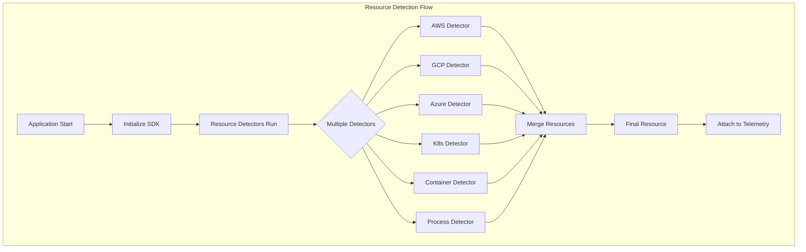
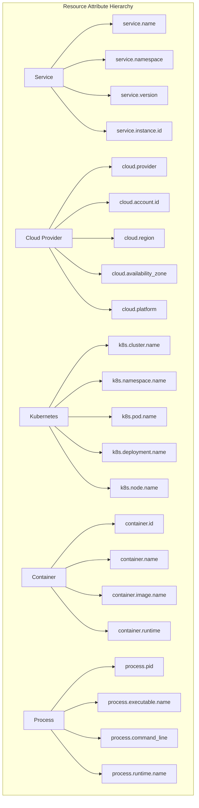
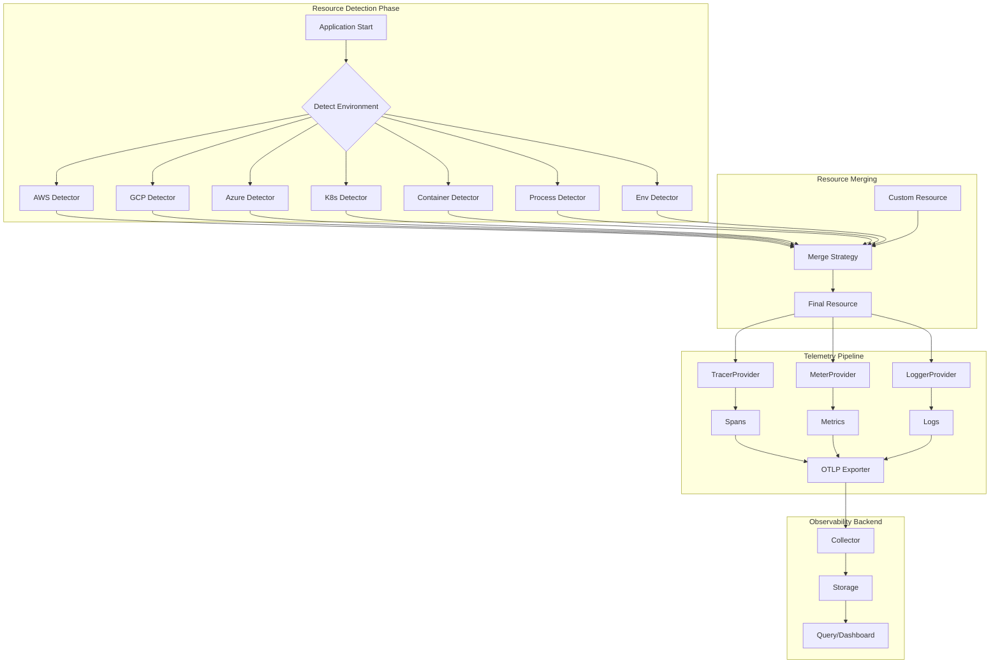

# How to Configure OpenTelemetry Resource Detection for Cloud Environments

Author: [nawazdhandala](https://github.com/nawazdhandala)

Tags: OpenTelemetry, Observability, Cloud, AWS, GCP, Azure, Kubernetes

Description: A guide to automatically detecting and attaching resource attributes in OpenTelemetry for cloud and container environments.

---

## Introduction

Resource detection is a fundamental concept in OpenTelemetry that enables automatic discovery and attachment of metadata about the environment where your application runs. This metadata, called resource attributes, provides crucial context for your telemetry data, making it easier to filter, aggregate, and correlate metrics, traces, and logs across distributed systems.

In cloud-native environments, resource detection becomes even more valuable. When your applications run across multiple cloud providers, Kubernetes clusters, or container orchestration platforms, manually configuring resource attributes becomes impractical and error-prone. OpenTelemetry's resource detectors solve this problem by automatically discovering environment-specific information at runtime.

This guide covers comprehensive configuration of resource detection for major cloud providers (AWS, GCP, Azure), Kubernetes environments, containers, and processes, along with custom resource attribute configuration.

## Understanding Resource Detection Architecture

Before diving into configuration, let's understand how resource detection works in OpenTelemetry.



Resource detectors are components that query the environment for specific attributes. When multiple detectors run, their results are merged into a single Resource object. If there are conflicts (same attribute key from multiple detectors), the later detector in the chain typically wins, though this behavior can be configured.

## Resource Hierarchy and Semantic Conventions

OpenTelemetry defines semantic conventions for resource attributes. Understanding this hierarchy helps you choose the right detectors and configure custom attributes correctly.



## Prerequisites

Before configuring resource detection, ensure you have the following:

- Node.js 18+ or Python 3.8+ (depending on your language preference)
- Access to your cloud provider's metadata services
- Appropriate IAM permissions for cloud metadata access
- For Kubernetes: RBAC permissions for pod metadata access

## Installing Resource Detection Packages

### Node.js/TypeScript Installation

The following commands install the core OpenTelemetry SDK along with resource detectors for various cloud and container environments:

```bash
# Install core OpenTelemetry packages
npm install @opentelemetry/sdk-node \
            @opentelemetry/api \
            @opentelemetry/resources \
            @opentelemetry/semantic-conventions

# Install cloud-specific resource detectors
npm install @opentelemetry/resource-detector-aws \
            @opentelemetry/resource-detector-gcp \
            @opentelemetry/resource-detector-azure

# Install container and infrastructure detectors
npm install @opentelemetry/resource-detector-container \
            @opentelemetry/resource-detector-docker
```

### Python Installation

Python packages follow a similar structure, with cloud detectors available as separate installable packages:

```bash
# Install core OpenTelemetry packages
pip install opentelemetry-api \
            opentelemetry-sdk \
            opentelemetry-semantic-conventions

# Install cloud-specific resource detectors
pip install opentelemetry-resource-detector-aws \
            opentelemetry-resource-detector-gcp \
            opentelemetry-resource-detector-azure

# Install container and Kubernetes detectors
pip install opentelemetry-resource-detector-container
```

## AWS Resource Detection

AWS resource detection automatically discovers EC2 instance metadata, ECS task information, EKS cluster details, and Lambda function context.

### Basic AWS Resource Detection

This configuration sets up AWS resource detection to automatically capture EC2 instance details, ECS container metadata, and EKS cluster information:

```typescript
// aws-resource-detection.ts
import { NodeSDK } from '@opentelemetry/sdk-node';
import { Resource } from '@opentelemetry/resources';
import {
  // Detects EC2 instance metadata including instance ID, type, AMI, and placement
  awsEc2Detector,
  // Detects ECS task metadata including task ARN, cluster, and container info
  awsEcsDetector,
  // Detects EKS cluster information when running in Amazon EKS
  awsEksDetector,
  // Detects AWS Lambda function context including function name and version
  awsLambdaDetector,
  // Detects AWS Elastic Beanstalk environment details
  awsBeanstalkDetector,
} from '@opentelemetry/resource-detector-aws';
import {
  SEMRESATTRS_SERVICE_NAME,
  SEMRESATTRS_SERVICE_VERSION,
  SEMRESATTRS_DEPLOYMENT_ENVIRONMENT,
} from '@opentelemetry/semantic-conventions';

// Create a base resource with service-specific attributes that won't be
// auto-detected. These attributes identify your application regardless
// of where it runs.
const baseResource = new Resource({
  [SEMRESATTRS_SERVICE_NAME]: 'my-payment-service',
  [SEMRESATTRS_SERVICE_VERSION]: '2.1.0',
  [SEMRESATTRS_DEPLOYMENT_ENVIRONMENT]: process.env.NODE_ENV || 'development',
});

// Configure the SDK with AWS resource detectors. The order matters because
// later detectors can override attributes from earlier ones. We place
// more specific detectors (EKS, ECS) after more general ones (EC2).
const sdk = new NodeSDK({
  // Merge base resource with detected resources
  resource: baseResource,
  // Configure resource detectors - they run in order and merge results
  resourceDetectors: [
    // EC2 detector queries the instance metadata service (IMDS) at
    // http://169.254.169.254/latest/meta-data/ to retrieve instance info
    awsEc2Detector,
    // ECS detector reads from the ECS_CONTAINER_METADATA_URI environment
    // variable to get task and container metadata
    awsEcsDetector,
    // EKS detector combines EC2 metadata with Kubernetes downward API
    // to provide comprehensive cluster information
    awsEksDetector,
    // Lambda detector reads from AWS_LAMBDA_* environment variables
    // set automatically by the Lambda runtime
    awsLambdaDetector,
    // Beanstalk detector reads from the environment manifest file
    awsBeanstalkDetector,
  ],
});

// Start the SDK - resource detection happens asynchronously during startup.
// The SDK will wait for all detectors to complete before the promise resolves.
sdk.start()
  .then(() => {
    console.log('OpenTelemetry SDK initialized with AWS resource detection');
  })
  .catch((error) => {
    console.error('Failed to initialize OpenTelemetry SDK:', error);
  });

// Ensure graceful shutdown to flush any pending telemetry data
process.on('SIGTERM', () => {
  sdk.shutdown()
    .then(() => console.log('SDK shut down successfully'))
    .catch((error) => console.error('Error shutting down SDK:', error))
    .finally(() => process.exit(0));
});
```

### AWS Lambda Resource Detection

Lambda functions require special handling because they run in a unique execution environment. The Lambda detector extracts function context from environment variables:

```typescript
// lambda-resource-detection.ts
import { NodeSDK } from '@opentelemetry/sdk-node';
import { Resource } from '@opentelemetry/resources';
import { awsLambdaDetector } from '@opentelemetry/resource-detector-aws';
import { OTLPTraceExporter } from '@opentelemetry/exporter-trace-otlp-http';
import {
  SEMRESATTRS_SERVICE_NAME,
  SEMRESATTRS_FAAS_NAME,
  SEMRESATTRS_FAAS_VERSION,
} from '@opentelemetry/semantic-conventions';

// Lambda-specific configuration that handles the cold start scenario
// and ensures telemetry is flushed before the function freezes
const configureLambdaTracing = () => {
  // Read Lambda-specific environment variables for service identification.
  // AWS_LAMBDA_FUNCTION_NAME is always available in the Lambda runtime.
  const functionName = process.env.AWS_LAMBDA_FUNCTION_NAME || 'unknown-function';
  const functionVersion = process.env.AWS_LAMBDA_FUNCTION_VERSION || '$LATEST';

  // Create base resource with FaaS-specific attributes. These follow the
  // OpenTelemetry FaaS (Function as a Service) semantic conventions.
  const lambdaResource = new Resource({
    [SEMRESATTRS_SERVICE_NAME]: functionName,
    [SEMRESATTRS_FAAS_NAME]: functionName,
    [SEMRESATTRS_FAAS_VERSION]: functionVersion,
    // Custom attribute to track cold starts for performance analysis
    'faas.cold_start': process.env._COLD_START !== 'false',
  });

  // Configure OTLP exporter with Lambda-optimized settings.
  // Use a shorter timeout because Lambda has strict execution limits.
  const traceExporter = new OTLPTraceExporter({
    url: process.env.OTEL_EXPORTER_OTLP_ENDPOINT || 'http://localhost:4318/v1/traces',
    // Set shorter timeout for Lambda's time constraints
    timeoutMillis: 5000,
  });

  const sdk = new NodeSDK({
    resource: lambdaResource,
    resourceDetectors: [awsLambdaDetector],
    traceExporter,
  });

  return sdk;
};

// Export the configured SDK for use in Lambda handler
export const otelSdk = configureLambdaTracing();

// Mark subsequent invocations as warm starts
process.env._COLD_START = 'false';
```

### AWS ECS/Fargate Resource Detection

ECS and Fargate environments provide rich metadata through the container metadata endpoint:

```typescript
// ecs-resource-detection.ts
import { NodeSDK } from '@opentelemetry/sdk-node';
import { Resource } from '@opentelemetry/resources';
import { awsEcsDetector } from '@opentelemetry/resource-detector-aws';
import { containerDetector } from '@opentelemetry/resource-detector-container';

// ECS detector automatically discovers the following attributes:
// - cloud.provider: "aws"
// - cloud.platform: "aws_ecs" or "aws_fargate"
// - cloud.account.id: AWS account ID
// - cloud.region: AWS region
// - cloud.availability_zone: Availability zone
// - aws.ecs.cluster.arn: Full ARN of the ECS cluster
// - aws.ecs.task.arn: Full ARN of the running task
// - aws.ecs.task.family: Task definition family name
// - aws.ecs.task.revision: Task definition revision
// - aws.ecs.container.arn: Container ARN in the task
// - aws.ecs.launchtype: "EC2" or "FARGATE"

// Create custom resource with ECS-specific service identification
const ecsServiceResource = new Resource({
  // Use ECS service name from environment or fall back to task family
  'service.name': process.env.ECS_SERVICE_NAME || 'ecs-service',
  // Track the deployment version using task definition revision
  'service.version': process.env.ECS_TASK_REVISION || 'unknown',
  // Custom attribute for cost allocation and team identification
  'service.team': process.env.TEAM_NAME || 'platform',
});

const sdk = new NodeSDK({
  resource: ecsServiceResource,
  resourceDetectors: [
    // Container detector provides container.id and container.runtime
    containerDetector,
    // ECS detector provides comprehensive task and cluster metadata
    awsEcsDetector,
  ],
});

sdk.start();
```

## GCP Resource Detection

Google Cloud Platform provides resource detection for Compute Engine, Google Kubernetes Engine (GKE), Cloud Run, and Cloud Functions.

### Basic GCP Resource Detection

This configuration enables automatic detection of GCP environment attributes:

```typescript
// gcp-resource-detection.ts
import { NodeSDK } from '@opentelemetry/sdk-node';
import { Resource } from '@opentelemetry/resources';
import {
  // Detects GCP environment by querying the metadata server
  gcpDetector,
} from '@opentelemetry/resource-detector-gcp';
import {
  SEMRESATTRS_SERVICE_NAME,
  SEMRESATTRS_SERVICE_NAMESPACE,
} from '@opentelemetry/semantic-conventions';

// The GCP detector automatically identifies the runtime environment and
// populates appropriate attributes. It queries the metadata server at
// http://metadata.google.internal/computeMetadata/v1/

// Detected attributes vary by environment:
//
// For Compute Engine:
// - cloud.provider: "gcp"
// - cloud.platform: "gcp_compute_engine"
// - cloud.account.id: Project ID
// - cloud.region: Region (e.g., "us-central1")
// - cloud.availability_zone: Zone (e.g., "us-central1-a")
// - host.id: Instance ID
// - host.name: Instance name
// - host.type: Machine type
//
// For GKE:
// - All Compute Engine attributes plus:
// - k8s.cluster.name: GKE cluster name
// - k8s.namespace.name: Kubernetes namespace
// - k8s.pod.name: Pod name
//
// For Cloud Run:
// - cloud.provider: "gcp"
// - cloud.platform: "gcp_cloud_run"
// - faas.name: Service name
// - faas.version: Revision name
// - cloud.region: Region

const gcpServiceResource = new Resource({
  [SEMRESATTRS_SERVICE_NAME]: 'order-processing-service',
  [SEMRESATTRS_SERVICE_NAMESPACE]: 'ecommerce',
  // Custom business attributes for filtering in observability tools
  'business.domain': 'orders',
  'business.tier': 'critical',
});

const sdk = new NodeSDK({
  resource: gcpServiceResource,
  resourceDetectors: [
    // GCP detector handles all GCP environments automatically
    // It detects the platform type and queries appropriate metadata
    gcpDetector,
  ],
});

sdk.start()
  .then(() => {
    console.log('OpenTelemetry initialized with GCP resource detection');
  })
  .catch((error) => {
    console.error('GCP resource detection failed:', error);
    // Continue without GCP attributes - useful for local development
  });
```

### GKE-Specific Resource Detection

When running in Google Kubernetes Engine, you can combine GCP detection with Kubernetes-specific detection for comprehensive metadata:

```typescript
// gke-resource-detection.ts
import { NodeSDK } from '@opentelemetry/sdk-node';
import { Resource, detectResources } from '@opentelemetry/resources';
import { gcpDetector } from '@opentelemetry/resource-detector-gcp';
import {
  SEMRESATTRS_SERVICE_NAME,
  SEMRESATTRS_K8S_NAMESPACE_NAME,
  SEMRESATTRS_K8S_POD_NAME,
  SEMRESATTRS_K8S_DEPLOYMENT_NAME,
} from '@opentelemetry/semantic-conventions';

// For GKE workloads, we can access Kubernetes downward API to get
// pod-specific metadata. These are typically mounted as environment
// variables or files in the pod specification.

// Example Kubernetes deployment configuration that exposes metadata:
// env:
//   - name: POD_NAME
//     valueFrom:
//       fieldRef:
//         fieldPath: metadata.name
//   - name: POD_NAMESPACE
//     valueFrom:
//       fieldRef:
//         fieldPath: metadata.namespace
//   - name: NODE_NAME
//     valueFrom:
//       fieldRef:
//         fieldPath: spec.nodeName

const gkeResource = new Resource({
  [SEMRESATTRS_SERVICE_NAME]: process.env.SERVICE_NAME || 'gke-service',
  // Read Kubernetes metadata from downward API environment variables
  [SEMRESATTRS_K8S_NAMESPACE_NAME]: process.env.POD_NAMESPACE,
  [SEMRESATTRS_K8S_POD_NAME]: process.env.POD_NAME,
  [SEMRESATTRS_K8S_DEPLOYMENT_NAME]: process.env.DEPLOYMENT_NAME,
  // GKE-specific custom attributes
  'gcp.gke.nodepool': process.env.NODE_POOL || 'default-pool',
  'gcp.gke.preemptible': process.env.PREEMPTIBLE === 'true',
});

// Perform resource detection asynchronously for flexibility
const initializeWithGkeDetection = async () => {
  // Detect GCP resources first
  const detectedResource = await detectResources({
    detectors: [gcpDetector],
  });

  // Merge with our explicit GKE resource - explicit values take precedence
  const mergedResource = gkeResource.merge(detectedResource);

  const sdk = new NodeSDK({
    resource: mergedResource,
  });

  await sdk.start();
  return sdk;
};

initializeWithGkeDetection()
  .then(() => console.log('GKE resource detection complete'))
  .catch(console.error);
```

## Azure Resource Detection

Azure resource detection supports Virtual Machines, Azure Kubernetes Service (AKS), Azure Functions, and Azure App Service.

### Basic Azure Resource Detection

This configuration enables detection of Azure-specific resource attributes:

```typescript
// azure-resource-detection.ts
import { NodeSDK } from '@opentelemetry/sdk-node';
import { Resource } from '@opentelemetry/resources';
import {
  // Detects Azure VM metadata from the Instance Metadata Service
  azureVmDetector,
  // Detects Azure Functions runtime context
  azureFunctionsDetector,
  // Detects Azure App Service environment
  azureAppServiceDetector,
} from '@opentelemetry/resource-detector-azure';
import {
  SEMRESATTRS_SERVICE_NAME,
  SEMRESATTRS_SERVICE_VERSION,
} from '@opentelemetry/semantic-conventions';

// Azure VM detector queries the Azure Instance Metadata Service (IMDS) at:
// http://169.254.169.254/metadata/instance?api-version=2021-02-01
//
// Detected attributes include:
// - cloud.provider: "azure"
// - cloud.platform: "azure_vm"
// - cloud.region: Azure region (e.g., "eastus")
// - cloud.account.id: Subscription ID
// - host.id: VM ID
// - host.name: VM name
// - host.type: VM size (e.g., "Standard_D2s_v3")
// - azure.vm.scaleset.name: Scale set name (if applicable)

const azureServiceResource = new Resource({
  [SEMRESATTRS_SERVICE_NAME]: 'inventory-service',
  [SEMRESATTRS_SERVICE_VERSION]: '1.5.2',
  // Azure-specific organizational attributes
  'azure.resource_group': process.env.AZURE_RESOURCE_GROUP,
  'azure.subscription': process.env.AZURE_SUBSCRIPTION_ID,
});

const sdk = new NodeSDK({
  resource: azureServiceResource,
  resourceDetectors: [
    // Order matters - more specific detectors should come later
    // as they may override attributes from earlier detectors
    azureVmDetector,
    azureAppServiceDetector,
    azureFunctionsDetector,
  ],
});

sdk.start()
  .then(() => {
    console.log('OpenTelemetry SDK with Azure resource detection started');
  })
  .catch((error) => {
    // Log but don't fail - allows local development without Azure
    console.warn('Azure resource detection encountered an error:', error.message);
  });
```

### Azure Functions Resource Detection

Azure Functions have a unique execution model similar to AWS Lambda. Here's how to configure resource detection for serverless Azure workloads:

```typescript
// azure-functions-resource-detection.ts
import { NodeSDK } from '@opentelemetry/sdk-node';
import { Resource } from '@opentelemetry/resources';
import { azureFunctionsDetector } from '@opentelemetry/resource-detector-azure';
import {
  SEMRESATTRS_SERVICE_NAME,
  SEMRESATTRS_FAAS_NAME,
  SEMRESATTRS_FAAS_VERSION,
  SEMRESATTRS_FAAS_INSTANCE,
} from '@opentelemetry/semantic-conventions';

// Azure Functions detector reads from these environment variables:
// - WEBSITE_SITE_NAME: Function app name
// - FUNCTIONS_EXTENSION_VERSION: Runtime version (e.g., "~4")
// - WEBSITE_INSTANCE_ID: Unique instance identifier
// - REGION_NAME: Azure region
// - WEBSITE_RESOURCE_GROUP: Resource group name

// Create a comprehensive FaaS resource for Azure Functions
const azureFunctionsResource = new Resource({
  [SEMRESATTRS_SERVICE_NAME]: process.env.WEBSITE_SITE_NAME || 'azure-function',
  [SEMRESATTRS_FAAS_NAME]: process.env.WEBSITE_SITE_NAME,
  [SEMRESATTRS_FAAS_VERSION]: process.env.FUNCTIONS_EXTENSION_VERSION,
  [SEMRESATTRS_FAAS_INSTANCE]: process.env.WEBSITE_INSTANCE_ID,
  // Custom attributes for Azure Functions monitoring
  'azure.functions.runtime': process.env.FUNCTIONS_WORKER_RUNTIME || 'node',
  'azure.functions.trigger_type': 'http', // Set based on actual trigger
});

// Configure with batching optimized for serverless execution
const sdk = new NodeSDK({
  resource: azureFunctionsResource,
  resourceDetectors: [azureFunctionsDetector],
});

// Export for use in function entry points
export const initializeAzureFunctionsTracing = async () => {
  await sdk.start();
  return sdk;
};

// Shutdown helper for function completion
export const shutdownTracing = async () => {
  await sdk.shutdown();
};
```

### AKS Resource Detection

Azure Kubernetes Service combines Azure cloud detection with Kubernetes-specific metadata:

```typescript
// aks-resource-detection.ts
import { NodeSDK } from '@opentelemetry/sdk-node';
import { Resource, detectResources } from '@opentelemetry/resources';
import { azureVmDetector } from '@opentelemetry/resource-detector-azure';
import { containerDetector } from '@opentelemetry/resource-detector-container';
import {
  SEMRESATTRS_SERVICE_NAME,
  SEMRESATTRS_K8S_CLUSTER_NAME,
  SEMRESATTRS_K8S_NAMESPACE_NAME,
  SEMRESATTRS_K8S_POD_NAME,
  SEMRESATTRS_K8S_NODE_NAME,
} from '@opentelemetry/semantic-conventions';

// AKS provides Kubernetes metadata through the downward API.
// Configure your deployment to expose these values as environment variables.
//
// Example AKS deployment spec:
// spec:
//   containers:
//   - name: app
//     env:
//     - name: AKS_CLUSTER_NAME
//       value: "my-aks-cluster"  # Set during deployment
//     - name: POD_NAME
//       valueFrom:
//         fieldRef:
//           fieldPath: metadata.name
//     - name: POD_NAMESPACE
//       valueFrom:
//         fieldRef:
//           fieldPath: metadata.namespace
//     - name: NODE_NAME
//       valueFrom:
//         fieldRef:
//           fieldPath: spec.nodeName

const createAksResource = (): Resource => {
  // Combine Azure and Kubernetes attributes
  return new Resource({
    [SEMRESATTRS_SERVICE_NAME]: process.env.SERVICE_NAME || 'aks-service',
    // AKS cluster information
    [SEMRESATTRS_K8S_CLUSTER_NAME]: process.env.AKS_CLUSTER_NAME,
    [SEMRESATTRS_K8S_NAMESPACE_NAME]: process.env.POD_NAMESPACE,
    [SEMRESATTRS_K8S_POD_NAME]: process.env.POD_NAME,
    [SEMRESATTRS_K8S_NODE_NAME]: process.env.NODE_NAME,
    // AKS-specific attributes for Azure integration
    'azure.aks.nodepool': process.env.AKS_NODEPOOL || 'default',
    'azure.aks.managed_identity': process.env.AZURE_CLIENT_ID ? 'true' : 'false',
  });
};

const initializeAksTracing = async () => {
  const aksResource = createAksResource();

  // Detect Azure and container resources
  const detectedResource = await detectResources({
    detectors: [azureVmDetector, containerDetector],
  });

  // Merge detected resources with explicit AKS configuration
  const finalResource = aksResource.merge(detectedResource);

  const sdk = new NodeSDK({
    resource: finalResource,
  });

  await sdk.start();
  console.log('AKS resource detection initialized');

  return sdk;
};

initializeAksTracing().catch(console.error);
```

## Kubernetes Resource Detection

Kubernetes resource detection works across any Kubernetes distribution, including self-managed clusters, managed services, and local development environments like Minikube.

### Comprehensive Kubernetes Detection

This configuration provides complete Kubernetes environment detection:

```typescript
// kubernetes-resource-detection.ts
import { NodeSDK } from '@opentelemetry/sdk-node';
import { Resource, detectResources } from '@opentelemetry/resources';
import { containerDetector } from '@opentelemetry/resource-detector-container';
import {
  SEMRESATTRS_SERVICE_NAME,
  SEMRESATTRS_SERVICE_VERSION,
  SEMRESATTRS_K8S_CLUSTER_NAME,
  SEMRESATTRS_K8S_NAMESPACE_NAME,
  SEMRESATTRS_K8S_POD_NAME,
  SEMRESATTRS_K8S_POD_UID,
  SEMRESATTRS_K8S_DEPLOYMENT_NAME,
  SEMRESATTRS_K8S_REPLICASET_NAME,
  SEMRESATTRS_K8S_NODE_NAME,
  SEMRESATTRS_K8S_CONTAINER_NAME,
  SEMRESATTRS_CONTAINER_ID,
  SEMRESATTRS_CONTAINER_IMAGE_NAME,
  SEMRESATTRS_CONTAINER_IMAGE_TAG,
} from '@opentelemetry/semantic-conventions';
import * as fs from 'fs';

// Kubernetes provides several ways to access pod metadata:
// 1. Downward API - environment variables or mounted files
// 2. Kubernetes API - requires API access permissions
// 3. Container runtime - cgroup info for container ID

// Helper function to read Kubernetes downward API mounted files
const readK8sDownwardApiFile = (filename: string): string | undefined => {
  // Downward API files are typically mounted at /etc/podinfo/
  const filepath = `/etc/podinfo/${filename}`;
  try {
    return fs.readFileSync(filepath, 'utf8').trim();
  } catch {
    return undefined;
  }
};

// Helper function to extract container ID from cgroup
const getContainerIdFromCgroup = (): string | undefined => {
  try {
    // Container ID is embedded in cgroup path
    const cgroupContent = fs.readFileSync('/proc/self/cgroup', 'utf8');
    // Look for docker or containerd patterns
    const match = cgroupContent.match(/[a-f0-9]{64}/);
    return match ? match[0] : undefined;
  } catch {
    return undefined;
  }
};

// Build comprehensive Kubernetes resource from all available sources
const createK8sResource = (): Resource => {
  // Read from environment variables (Downward API)
  const podName = process.env.POD_NAME || process.env.HOSTNAME;
  const podNamespace = process.env.POD_NAMESPACE || readK8sDownwardApiFile('namespace');
  const podUid = process.env.POD_UID || readK8sDownwardApiFile('uid');
  const nodeName = process.env.NODE_NAME;
  const containerName = process.env.CONTAINER_NAME;

  // Read deployment info from labels (if mounted via Downward API)
  const deploymentName = process.env.DEPLOYMENT_NAME || readK8sDownwardApiFile('deployment');
  const replicaSetName = process.env.REPLICASET_NAME;

  // Get container runtime information
  const containerId = getContainerIdFromCgroup();

  // Build resource with all available Kubernetes attributes
  const attributes: Record<string, string | undefined> = {
    [SEMRESATTRS_SERVICE_NAME]: process.env.SERVICE_NAME || deploymentName || podName,
    [SEMRESATTRS_SERVICE_VERSION]: process.env.SERVICE_VERSION || 'unknown',
    // Cluster-level attributes
    [SEMRESATTRS_K8S_CLUSTER_NAME]: process.env.CLUSTER_NAME,
    // Namespace-level attributes
    [SEMRESATTRS_K8S_NAMESPACE_NAME]: podNamespace,
    // Pod-level attributes
    [SEMRESATTRS_K8S_POD_NAME]: podName,
    [SEMRESATTRS_K8S_POD_UID]: podUid,
    // Workload-level attributes
    [SEMRESATTRS_K8S_DEPLOYMENT_NAME]: deploymentName,
    [SEMRESATTRS_K8S_REPLICASET_NAME]: replicaSetName,
    // Node-level attributes
    [SEMRESATTRS_K8S_NODE_NAME]: nodeName,
    // Container-level attributes
    [SEMRESATTRS_K8S_CONTAINER_NAME]: containerName,
    [SEMRESATTRS_CONTAINER_ID]: containerId,
    // Image information (typically set via environment variables in deployment)
    [SEMRESATTRS_CONTAINER_IMAGE_NAME]: process.env.CONTAINER_IMAGE_NAME,
    [SEMRESATTRS_CONTAINER_IMAGE_TAG]: process.env.CONTAINER_IMAGE_TAG,
  };

  // Filter out undefined values before creating resource
  const definedAttributes = Object.fromEntries(
    Object.entries(attributes).filter(([_, v]) => v !== undefined)
  ) as Record<string, string>;

  return new Resource(definedAttributes);
};

// Initialize SDK with Kubernetes resource detection
const sdk = new NodeSDK({
  resource: createK8sResource(),
  resourceDetectors: [containerDetector],
});

sdk.start();
```

### Kubernetes Deployment Configuration

To fully utilize Kubernetes resource detection, configure your deployment to expose metadata:

```yaml
# kubernetes-deployment.yaml
# This deployment configuration exposes all necessary metadata
# for comprehensive OpenTelemetry resource detection.
apiVersion: apps/v1
kind: Deployment
metadata:
  name: otel-demo-app
  namespace: production
  labels:
    app: otel-demo
    version: v1.2.3
spec:
  replicas: 3
  selector:
    matchLabels:
      app: otel-demo
  template:
    metadata:
      labels:
        app: otel-demo
        version: v1.2.3
      annotations:
        # Annotations can be read via Downward API
        prometheus.io/scrape: "true"
    spec:
      containers:
      - name: app
        image: myregistry/otel-demo:v1.2.3
        env:
        # Service identification
        - name: SERVICE_NAME
          value: "otel-demo-app"
        - name: SERVICE_VERSION
          value: "v1.2.3"

        # Cluster identification (set per-cluster)
        - name: CLUSTER_NAME
          value: "production-cluster-us-east"

        # Pod metadata from Downward API
        - name: POD_NAME
          valueFrom:
            fieldRef:
              fieldPath: metadata.name
        - name: POD_NAMESPACE
          valueFrom:
            fieldRef:
              fieldPath: metadata.namespace
        - name: POD_UID
          valueFrom:
            fieldRef:
              fieldPath: metadata.uid
        - name: POD_IP
          valueFrom:
            fieldRef:
              fieldPath: status.podIP

        # Node information from Downward API
        - name: NODE_NAME
          valueFrom:
            fieldRef:
              fieldPath: spec.nodeName

        # Container metadata
        - name: CONTAINER_NAME
          value: "app"
        - name: CONTAINER_IMAGE_NAME
          value: "myregistry/otel-demo"
        - name: CONTAINER_IMAGE_TAG
          value: "v1.2.3"

        # Resource limits (useful for capacity planning)
        - name: CONTAINER_CPU_LIMIT
          valueFrom:
            resourceFieldRef:
              containerName: app
              resource: limits.cpu
        - name: CONTAINER_MEMORY_LIMIT
          valueFrom:
            resourceFieldRef:
              containerName: app
              resource: limits.memory

        # Deployment metadata (requires setting during CI/CD)
        - name: DEPLOYMENT_NAME
          value: "otel-demo-app"

        resources:
          limits:
            cpu: "500m"
            memory: "256Mi"
          requests:
            cpu: "100m"
            memory: "128Mi"

        # Mount Downward API as files for additional metadata
        volumeMounts:
        - name: podinfo
          mountPath: /etc/podinfo
          readOnly: true

      # Downward API volume for label and annotation access
      volumes:
      - name: podinfo
        downwardAPI:
          items:
          - path: "labels"
            fieldRef:
              fieldPath: metadata.labels
          - path: "annotations"
            fieldRef:
              fieldPath: metadata.annotations
          - path: "namespace"
            fieldRef:
              fieldPath: metadata.namespace
          - path: "name"
            fieldRef:
              fieldPath: metadata.name
          - path: "uid"
            fieldRef:
              fieldPath: metadata.uid
```

## Container Resource Detection

Container detection works for Docker, containerd, and other OCI-compliant runtimes:

```typescript
// container-resource-detection.ts
import { NodeSDK } from '@opentelemetry/sdk-node';
import { Resource, detectResources } from '@opentelemetry/resources';
import { containerDetector } from '@opentelemetry/resource-detector-container';
import {
  SEMRESATTRS_CONTAINER_ID,
  SEMRESATTRS_CONTAINER_NAME,
  SEMRESATTRS_CONTAINER_RUNTIME,
  SEMRESATTRS_CONTAINER_IMAGE_NAME,
  SEMRESATTRS_CONTAINER_IMAGE_TAG,
} from '@opentelemetry/semantic-conventions';
import * as fs from 'fs';
import * as os from 'os';

// Container detector extracts information from:
// 1. /proc/self/cgroup - Container ID from cgroup path
// 2. /proc/1/cpuset - Alternative container ID source
// 3. Environment variables - HOSTNAME typically equals container ID prefix

// Custom container detection for enhanced metadata
const detectContainerMetadata = (): Resource => {
  const attributes: Record<string, string> = {};

  // Detect container ID from cgroup
  try {
    const cgroupContent = fs.readFileSync('/proc/self/cgroup', 'utf8');

    // Docker pattern: /docker/<container-id>
    // containerd pattern: /system.slice/containerd.service/.../<container-id>
    // CRI-O pattern: /crio-<container-id>.scope

    const patterns = [
      /\/docker\/([a-f0-9]{64})/,
      /\/containerd\/([a-f0-9]{64})/,
      /\/crio-([a-f0-9]{64})/,
      /([a-f0-9]{64})/,
    ];

    for (const pattern of patterns) {
      const match = cgroupContent.match(pattern);
      if (match) {
        attributes[SEMRESATTRS_CONTAINER_ID] = match[1];
        break;
      }
    }
  } catch {
    // Not running in a container or unable to read cgroup
  }

  // Detect container runtime from cgroup content
  try {
    const cgroupContent = fs.readFileSync('/proc/self/cgroup', 'utf8');
    if (cgroupContent.includes('docker')) {
      attributes[SEMRESATTRS_CONTAINER_RUNTIME] = 'docker';
    } else if (cgroupContent.includes('containerd')) {
      attributes[SEMRESATTRS_CONTAINER_RUNTIME] = 'containerd';
    } else if (cgroupContent.includes('crio')) {
      attributes[SEMRESATTRS_CONTAINER_RUNTIME] = 'cri-o';
    }
  } catch {
    // Unable to detect runtime
  }

  // Container name from environment or hostname
  attributes[SEMRESATTRS_CONTAINER_NAME] =
    process.env.CONTAINER_NAME ||
    process.env.HOSTNAME ||
    os.hostname();

  // Image information from environment (must be set explicitly)
  if (process.env.CONTAINER_IMAGE) {
    const [imageName, imageTag] = process.env.CONTAINER_IMAGE.split(':');
    attributes[SEMRESATTRS_CONTAINER_IMAGE_NAME] = imageName;
    attributes[SEMRESATTRS_CONTAINER_IMAGE_TAG] = imageTag || 'latest';
  }

  return new Resource(attributes);
};

// Combine built-in detector with custom detection
const initializeContainerTracing = async () => {
  // Use built-in container detector
  const detectedResource = await detectResources({
    detectors: [containerDetector],
  });

  // Merge with custom container metadata
  const customResource = detectContainerMetadata();
  const finalResource = customResource.merge(detectedResource);

  const sdk = new NodeSDK({
    resource: finalResource,
  });

  await sdk.start();
  return sdk;
};

initializeContainerTracing().catch(console.error);
```

## Process Resource Detection

Process detection captures information about the running process, useful for debugging and performance analysis:

```typescript
// process-resource-detection.ts
import { NodeSDK } from '@opentelemetry/sdk-node';
import { Resource } from '@opentelemetry/resources';
import {
  SEMRESATTRS_PROCESS_PID,
  SEMRESATTRS_PROCESS_EXECUTABLE_NAME,
  SEMRESATTRS_PROCESS_EXECUTABLE_PATH,
  SEMRESATTRS_PROCESS_COMMAND,
  SEMRESATTRS_PROCESS_COMMAND_LINE,
  SEMRESATTRS_PROCESS_COMMAND_ARGS,
  SEMRESATTRS_PROCESS_OWNER,
  SEMRESATTRS_PROCESS_RUNTIME_NAME,
  SEMRESATTRS_PROCESS_RUNTIME_VERSION,
  SEMRESATTRS_PROCESS_RUNTIME_DESCRIPTION,
} from '@opentelemetry/semantic-conventions';
import * as os from 'os';
import * as path from 'path';

// Create comprehensive process resource with runtime details
const createProcessResource = (): Resource => {
  // Get process and runtime information from Node.js APIs
  const processInfo = {
    // Process identification
    [SEMRESATTRS_PROCESS_PID]: process.pid,
    // Executable information
    [SEMRESATTRS_PROCESS_EXECUTABLE_NAME]: path.basename(process.execPath),
    [SEMRESATTRS_PROCESS_EXECUTABLE_PATH]: process.execPath,
    // Command information
    [SEMRESATTRS_PROCESS_COMMAND]: process.argv[1] || '',
    [SEMRESATTRS_PROCESS_COMMAND_LINE]: process.argv.join(' '),
    // Owner information (useful for debugging permission issues)
    [SEMRESATTRS_PROCESS_OWNER]: os.userInfo().username,
    // Runtime information
    [SEMRESATTRS_PROCESS_RUNTIME_NAME]: 'nodejs',
    [SEMRESATTRS_PROCESS_RUNTIME_VERSION]: process.versions.node,
    [SEMRESATTRS_PROCESS_RUNTIME_DESCRIPTION]: `Node.js ${process.versions.node}`,
  };

  // Add Node.js specific attributes for debugging
  const nodeSpecificInfo = {
    // V8 engine version
    'process.runtime.v8.version': process.versions.v8,
    // OpenSSL version (important for security audits)
    'process.runtime.openssl.version': process.versions.openssl,
    // Memory usage at startup (baseline for memory leak detection)
    'process.memory.rss.startup': process.memoryUsage().rss,
    // Node.js execution flags (useful for debugging configuration)
    'process.node.flags': process.execArgv.join(' '),
  };

  return new Resource({
    ...processInfo,
    ...nodeSpecificInfo,
  });
};

// Python equivalent for process resource detection
// Shown here for reference when implementing in Python codebases
const pythonProcessDetectionExample = `
# python-process-detection.py
import os
import sys
import platform
from opentelemetry.sdk.resources import Resource

def create_process_resource() -> Resource:
    """Create a resource with process and runtime attributes."""
    return Resource.create({
        # Process identification
        "process.pid": os.getpid(),
        # Executable information
        "process.executable.name": os.path.basename(sys.executable),
        "process.executable.path": sys.executable,
        # Command information
        "process.command": sys.argv[0] if sys.argv else "",
        "process.command_line": " ".join(sys.argv),
        # Owner information
        "process.owner": os.getlogin() if hasattr(os, 'getlogin') else os.environ.get('USER', 'unknown'),
        # Runtime information
        "process.runtime.name": "python",
        "process.runtime.version": platform.python_version(),
        "process.runtime.description": f"Python {platform.python_version()}",
        # Python-specific attributes
        "process.runtime.python.implementation": platform.python_implementation(),
        "process.runtime.python.compiler": platform.python_compiler(),
    })
`;

const sdk = new NodeSDK({
  resource: createProcessResource(),
});

sdk.start();
```

## Custom Resource Attribute Configuration

Beyond automatic detection, you can define custom resource attributes to capture business-specific context:

```typescript
// custom-resource-attributes.ts
import { NodeSDK } from '@opentelemetry/sdk-node';
import { Resource, detectResources, ResourceDetectionConfig } from '@opentelemetry/resources';
import { awsEc2Detector, awsEcsDetector } from '@opentelemetry/resource-detector-aws';
import { gcpDetector } from '@opentelemetry/resource-detector-gcp';
import { containerDetector } from '@opentelemetry/resource-detector-container';
import {
  SEMRESATTRS_SERVICE_NAME,
  SEMRESATTRS_SERVICE_VERSION,
  SEMRESATTRS_SERVICE_NAMESPACE,
  SEMRESATTRS_SERVICE_INSTANCE_ID,
  SEMRESATTRS_DEPLOYMENT_ENVIRONMENT,
} from '@opentelemetry/semantic-conventions';
import { v4 as uuidv4 } from 'uuid';

// Define custom semantic attributes for your organization.
// These should follow OpenTelemetry naming conventions:
// - Use dot notation for namespacing
// - Use lowercase with underscores
// - Be specific but not too verbose
const CUSTOM_ATTRIBUTES = {
  // Business domain attributes
  BUSINESS_UNIT: 'business.unit',
  BUSINESS_DOMAIN: 'business.domain',
  COST_CENTER: 'business.cost_center',

  // Team ownership attributes
  TEAM_NAME: 'team.name',
  TEAM_SLACK_CHANNEL: 'team.slack_channel',
  TEAM_ONCALL_GROUP: 'team.oncall_group',

  // Deployment attributes
  DEPLOYMENT_PIPELINE: 'deployment.pipeline',
  DEPLOYMENT_COMMIT_SHA: 'deployment.commit_sha',
  DEPLOYMENT_BUILD_NUMBER: 'deployment.build_number',

  // Feature flag context
  FEATURE_FLAGS_ENABLED: 'feature.flags_enabled',

  // SLO/SLA tier
  SERVICE_TIER: 'service.tier',
  SERVICE_SLA: 'service.sla_target',
} as const;

// Create a comprehensive resource that includes both standard
// and custom attributes for complete observability context
const createComprehensiveResource = (): Resource => {
  // Generate a unique instance ID for this process
  // This helps distinguish between multiple instances of the same service
  const instanceId = process.env.SERVICE_INSTANCE_ID ||
                     process.env.HOSTNAME ||
                     uuidv4();

  // Standard OpenTelemetry service attributes
  const serviceAttributes = {
    [SEMRESATTRS_SERVICE_NAME]: process.env.SERVICE_NAME || 'unknown-service',
    [SEMRESATTRS_SERVICE_VERSION]: process.env.SERVICE_VERSION || 'unknown',
    [SEMRESATTRS_SERVICE_NAMESPACE]: process.env.SERVICE_NAMESPACE || 'default',
    [SEMRESATTRS_SERVICE_INSTANCE_ID]: instanceId,
    [SEMRESATTRS_DEPLOYMENT_ENVIRONMENT]: process.env.DEPLOYMENT_ENVIRONMENT ||
                                           process.env.NODE_ENV ||
                                           'development',
  };

  // Business context attributes - help with cost allocation and impact analysis
  const businessAttributes = {
    [CUSTOM_ATTRIBUTES.BUSINESS_UNIT]: process.env.BUSINESS_UNIT || 'engineering',
    [CUSTOM_ATTRIBUTES.BUSINESS_DOMAIN]: process.env.BUSINESS_DOMAIN || 'platform',
    [CUSTOM_ATTRIBUTES.COST_CENTER]: process.env.COST_CENTER || 'shared',
  };

  // Team ownership attributes - critical for incident response
  const teamAttributes = {
    [CUSTOM_ATTRIBUTES.TEAM_NAME]: process.env.TEAM_NAME || 'platform-team',
    [CUSTOM_ATTRIBUTES.TEAM_SLACK_CHANNEL]: process.env.TEAM_SLACK || '#platform-alerts',
    [CUSTOM_ATTRIBUTES.TEAM_ONCALL_GROUP]: process.env.ONCALL_GROUP || 'platform-oncall',
  };

  // CI/CD and deployment tracking attributes
  const deploymentAttributes = {
    [CUSTOM_ATTRIBUTES.DEPLOYMENT_PIPELINE]: process.env.CI_PIPELINE_NAME || 'unknown',
    [CUSTOM_ATTRIBUTES.DEPLOYMENT_COMMIT_SHA]: process.env.GIT_COMMIT_SHA ||
                                                 process.env.GITHUB_SHA ||
                                                 'unknown',
    [CUSTOM_ATTRIBUTES.DEPLOYMENT_BUILD_NUMBER]: process.env.BUILD_NUMBER ||
                                                   process.env.GITHUB_RUN_NUMBER ||
                                                   'unknown',
  };

  // Service tier for SLO/SLA differentiation
  const sloAttributes = {
    [CUSTOM_ATTRIBUTES.SERVICE_TIER]: process.env.SERVICE_TIER || 'standard',
    [CUSTOM_ATTRIBUTES.SERVICE_SLA]: process.env.SERVICE_SLA || '99.9',
  };

  return new Resource({
    ...serviceAttributes,
    ...businessAttributes,
    ...teamAttributes,
    ...deploymentAttributes,
    ...sloAttributes,
  });
};

// Intelligent detector selection based on environment
const selectDetectors = () => {
  const detectors = [];

  // Always include container detector
  detectors.push(containerDetector);

  // Detect cloud environment and add appropriate detectors
  // AWS detection based on environment variables or metadata availability
  if (process.env.AWS_REGION ||
      process.env.AWS_EXECUTION_ENV ||
      process.env.ECS_CONTAINER_METADATA_URI) {
    detectors.push(awsEc2Detector, awsEcsDetector);
  }

  // GCP detection based on environment variables
  if (process.env.GOOGLE_CLOUD_PROJECT ||
      process.env.GCLOUD_PROJECT ||
      process.env.K_SERVICE) { // Cloud Run
    detectors.push(gcpDetector);
  }

  // Note: Azure detector would be added here if Azure env vars detected

  return detectors;
};

// Initialize with comprehensive resource detection
const initializeTracing = async () => {
  // Get custom resource with all business attributes
  const customResource = createComprehensiveResource();

  // Detect cloud and container resources
  const detectedResource = await detectResources({
    detectors: selectDetectors(),
  });

  // Merge resources - custom attributes take precedence
  const finalResource = customResource.merge(detectedResource);

  // Log detected resources for debugging (remove in production)
  console.log('Detected resource attributes:', finalResource.attributes);

  const sdk = new NodeSDK({
    resource: finalResource,
  });

  await sdk.start();
  return sdk;
};

initializeTracing().catch(console.error);
```

## Environment Variable Configuration

OpenTelemetry supports resource configuration through environment variables, making it easy to configure without code changes:

```bash
# Standard OpenTelemetry environment variables for resource configuration
# These are automatically picked up by the SDK

# Service identification (required)
export OTEL_SERVICE_NAME="payment-service"

# Resource attributes as a comma-separated key=value list
# This is the primary way to set custom resource attributes without code changes
export OTEL_RESOURCE_ATTRIBUTES="service.version=1.2.3,deployment.environment=production,team.name=payments,service.namespace=ecommerce"

# Disable specific resource detectors if needed
# Comma-separated list of detector names to skip
export OTEL_NODE_RESOURCE_DETECTORS="aws,container,process"

# Enable debug logging for resource detection troubleshooting
export OTEL_LOG_LEVEL="debug"

# Example of setting multiple attributes with proper escaping
export OTEL_RESOURCE_ATTRIBUTES="service.name=my-service,service.version=1.0.0,deployment.environment=staging,cloud.region=us-east-1,team.name=backend,team.slack=#backend-alerts"
```

### Using Environment Variables in Code

Here's how to properly handle environment variable configuration alongside programmatic configuration:

```typescript
// env-based-resource-config.ts
import { NodeSDK } from '@opentelemetry/sdk-node';
import { Resource, envDetector, processDetector } from '@opentelemetry/resources';
import { containerDetector } from '@opentelemetry/resource-detector-container';
import {
  SEMRESATTRS_SERVICE_NAME,
  SEMRESATTRS_SERVICE_VERSION,
} from '@opentelemetry/semantic-conventions';

// The envDetector reads from OTEL_RESOURCE_ATTRIBUTES environment variable
// and parses the comma-separated key=value pairs into resource attributes.
//
// Example OTEL_RESOURCE_ATTRIBUTES value:
// "key1=value1,key2=value2,namespace.key=value"

// Parse OTEL_RESOURCE_ATTRIBUTES manually if needed for validation
const parseResourceAttributes = (): Record<string, string> => {
  const envAttributes = process.env.OTEL_RESOURCE_ATTRIBUTES;
  if (!envAttributes) return {};

  const attributes: Record<string, string> = {};

  // Split by comma and parse each key=value pair
  envAttributes.split(',').forEach(pair => {
    const [key, ...valueParts] = pair.split('=');
    if (key && valueParts.length > 0) {
      // Rejoin in case value contained '=' characters
      attributes[key.trim()] = valueParts.join('=').trim();
    }
  });

  return attributes;
};

// Create fallback resource for attributes not set via environment
const createFallbackResource = (): Resource => {
  const envAttrs = parseResourceAttributes();

  // Only set fallbacks for attributes not already in environment
  const fallbacks: Record<string, string> = {};

  if (!envAttrs[SEMRESATTRS_SERVICE_NAME] && !process.env.OTEL_SERVICE_NAME) {
    fallbacks[SEMRESATTRS_SERVICE_NAME] = 'default-service';
  }

  if (!envAttrs[SEMRESATTRS_SERVICE_VERSION]) {
    // Try to read from package.json
    try {
      const pkg = require('./package.json');
      fallbacks[SEMRESATTRS_SERVICE_VERSION] = pkg.version;
    } catch {
      fallbacks[SEMRESATTRS_SERVICE_VERSION] = 'unknown';
    }
  }

  return new Resource(fallbacks);
};

// Initialize SDK with environment-based configuration
const sdk = new NodeSDK({
  resource: createFallbackResource(),
  resourceDetectors: [
    // envDetector reads OTEL_RESOURCE_ATTRIBUTES
    envDetector,
    // processDetector adds process.* attributes
    processDetector,
    // containerDetector adds container.* attributes
    containerDetector,
  ],
});

sdk.start();
```

## Multi-Cloud Resource Detection

When your services span multiple cloud providers, you need a unified approach to resource detection:

```typescript
// multi-cloud-resource-detection.ts
import { NodeSDK } from '@opentelemetry/sdk-node';
import { Resource, detectResources, ResourceDetectionConfig } from '@opentelemetry/resources';
import { awsEc2Detector, awsEcsDetector, awsEksDetector, awsLambdaDetector } from '@opentelemetry/resource-detector-aws';
import { gcpDetector } from '@opentelemetry/resource-detector-gcp';
import { azureVmDetector, azureFunctionsDetector, azureAppServiceDetector } from '@opentelemetry/resource-detector-azure';
import { containerDetector } from '@opentelemetry/resource-detector-container';
import {
  SEMRESATTRS_SERVICE_NAME,
  SEMRESATTRS_CLOUD_PROVIDER,
} from '@opentelemetry/semantic-conventions';

// Cloud provider detection order and timeout configuration
// We run all detectors but only the appropriate one will succeed
const DETECTOR_TIMEOUT_MS = 5000;

// Type-safe cloud provider enum
enum CloudProvider {
  AWS = 'aws',
  GCP = 'gcp',
  AZURE = 'azure',
  UNKNOWN = 'unknown',
}

// Detect which cloud provider we're running on based on environment
const detectCloudProvider = (): CloudProvider => {
  // AWS indicators
  if (process.env.AWS_REGION ||
      process.env.AWS_EXECUTION_ENV ||
      process.env.ECS_CONTAINER_METADATA_URI ||
      process.env.AWS_LAMBDA_FUNCTION_NAME) {
    return CloudProvider.AWS;
  }

  // GCP indicators
  if (process.env.GOOGLE_CLOUD_PROJECT ||
      process.env.GCLOUD_PROJECT ||
      process.env.K_SERVICE ||  // Cloud Run
      process.env.FUNCTION_NAME) {  // Cloud Functions
    return CloudProvider.GCP;
  }

  // Azure indicators
  if (process.env.WEBSITE_SITE_NAME ||  // App Service / Functions
      process.env.AZURE_FUNCTIONS_ENVIRONMENT ||
      process.env.IDENTITY_ENDPOINT) {  // Managed Identity
    return CloudProvider.AZURE;
  }

  return CloudProvider.UNKNOWN;
};

// Get appropriate detectors for the current cloud provider
const getCloudDetectors = (provider: CloudProvider) => {
  switch (provider) {
    case CloudProvider.AWS:
      return [
        awsEc2Detector,
        awsEcsDetector,
        awsEksDetector,
        awsLambdaDetector,
      ];
    case CloudProvider.GCP:
      return [gcpDetector];
    case CloudProvider.AZURE:
      return [
        azureVmDetector,
        azureAppServiceDetector,
        azureFunctionsDetector,
      ];
    default:
      return [];
  }
};

// Initialize multi-cloud resource detection
const initializeMultiCloudTracing = async () => {
  const cloudProvider = detectCloudProvider();
  console.log(`Detected cloud provider: ${cloudProvider}`);

  // Get cloud-specific detectors
  const cloudDetectors = getCloudDetectors(cloudProvider);

  // Always include container detector
  const allDetectors = [containerDetector, ...cloudDetectors];

  // Detect resources with timeout protection
  const detectedResource = await detectResources({
    detectors: allDetectors,
  });

  // Create base resource with provider identification
  const baseResource = new Resource({
    [SEMRESATTRS_SERVICE_NAME]: process.env.SERVICE_NAME || 'multi-cloud-service',
    [SEMRESATTRS_CLOUD_PROVIDER]: cloudProvider,
    'cloud.detection.method': 'environment_variables',
  });

  // Merge base with detected resources
  const finalResource = baseResource.merge(detectedResource);

  const sdk = new NodeSDK({
    resource: finalResource,
  });

  await sdk.start();
  return sdk;
};

initializeMultiCloudTracing().catch(console.error);
```

## Resource Detection Best Practices

### Performance Considerations

Resource detection happens during SDK initialization. Here's how to optimize it:

```typescript
// optimized-resource-detection.ts
import { NodeSDK } from '@opentelemetry/sdk-node';
import { Resource, detectResourcesSync, ResourceDetectionConfig } from '@opentelemetry/resources';
import { containerDetector } from '@opentelemetry/resource-detector-container';
import {
  SEMRESATTRS_SERVICE_NAME,
} from '@opentelemetry/semantic-conventions';

// For performance-critical applications, consider these optimizations:

// 1. Use only necessary detectors
// Don't include cloud detectors if you're not running in that cloud
const productionDetectors = [
  containerDetector,
  // Add only the detectors you actually need
];

// 2. Set appropriate timeouts to prevent slow startup
const detectorConfig: ResourceDetectionConfig = {
  detectors: productionDetectors,
  // Individual detector timeout (default is 5000ms)
};

// 3. Cache detected resources if restarting frequently
// This is useful for Lambda/Functions with cold starts
const RESOURCE_CACHE_KEY = 'OTEL_CACHED_RESOURCE';

const getCachedOrDetectResource = async (): Promise<Resource> => {
  // In serverless, check for cached resource from previous invocation
  const cached = process.env[RESOURCE_CACHE_KEY];
  if (cached) {
    try {
      return new Resource(JSON.parse(cached));
    } catch {
      // Cache invalid, proceed with detection
    }
  }

  // Detect resources
  const detected = await detectResourcesSync(detectorConfig);

  // Cache for next invocation (in serverless warm starts)
  process.env[RESOURCE_CACHE_KEY] = JSON.stringify(detected.attributes);

  return detected;
};

// 4. Use static resource for known attributes
// This avoids detection overhead for attributes you already know
const createStaticResource = (): Resource => {
  return new Resource({
    [SEMRESATTRS_SERVICE_NAME]: 'my-service',
    // Add all known static attributes here
    'service.version': process.env.npm_package_version || 'unknown',
    'deployment.environment': process.env.NODE_ENV || 'development',
  });
};
```

### Error Handling

Robust error handling ensures your application starts even when detection fails:

```typescript
// robust-resource-detection.ts
import { NodeSDK } from '@opentelemetry/sdk-node';
import { Resource, detectResources, diag, DiagConsoleLogger, DiagLogLevel } from '@opentelemetry/resources';
import { awsEc2Detector, awsEcsDetector } from '@opentelemetry/resource-detector-aws';
import { containerDetector } from '@opentelemetry/resource-detector-container';
import {
  SEMRESATTRS_SERVICE_NAME,
} from '@opentelemetry/semantic-conventions';

// Enable diagnostic logging to troubleshoot detection issues
diag.setLogger(new DiagConsoleLogger(), DiagLogLevel.INFO);

// Wrap resource detection with comprehensive error handling
const safeResourceDetection = async (): Promise<Resource> => {
  // Minimum required resource - ensures telemetry always has context
  const fallbackResource = new Resource({
    [SEMRESATTRS_SERVICE_NAME]: process.env.SERVICE_NAME || 'fallback-service',
    'resource.detection.status': 'fallback',
  });

  try {
    const detected = await detectResources({
      detectors: [
        containerDetector,
        awsEc2Detector,
        awsEcsDetector,
      ],
    });

    // Mark successful detection
    const successResource = new Resource({
      'resource.detection.status': 'success',
    });

    return fallbackResource.merge(detected).merge(successResource);

  } catch (error) {
    // Log the error but don't fail - use fallback resource
    console.warn('Resource detection failed, using fallback:', error);

    const errorResource = new Resource({
      'resource.detection.status': 'error',
      'resource.detection.error': error instanceof Error ? error.message : 'unknown',
    });

    return fallbackResource.merge(errorResource);
  }
};

// Initialize with safe detection
const initializeSafeTracing = async () => {
  const resource = await safeResourceDetection();

  const sdk = new NodeSDK({
    resource,
  });

  await sdk.start();
  console.log('SDK started with resource:', resource.attributes);
};

initializeSafeTracing().catch(console.error);
```

## Resource Flow Diagram

This diagram shows how resources flow through the OpenTelemetry SDK:



## Testing Resource Detection

Verify your resource detection configuration with these testing approaches:

```typescript
// test-resource-detection.ts
import { Resource, detectResources } from '@opentelemetry/resources';
import { containerDetector } from '@opentelemetry/resource-detector-container';
import { awsEc2Detector } from '@opentelemetry/resource-detector-aws';
import {
  SEMRESATTRS_SERVICE_NAME,
  SEMRESATTRS_SERVICE_VERSION,
  SEMRESATTRS_CLOUD_PROVIDER,
  SEMRESATTRS_K8S_POD_NAME,
} from '@opentelemetry/semantic-conventions';

// Test utility to verify resource attributes
const testResourceDetection = async () => {
  console.log('=== Resource Detection Test ===\n');

  // Test 1: Verify environment variables are set
  console.log('1. Environment Variables:');
  const envVars = [
    'SERVICE_NAME',
    'SERVICE_VERSION',
    'NODE_ENV',
    'POD_NAME',
    'POD_NAMESPACE',
    'AWS_REGION',
    'GOOGLE_CLOUD_PROJECT',
  ];

  envVars.forEach(varName => {
    const value = process.env[varName];
    console.log(`   ${varName}: ${value || '(not set)'}`);
  });
  console.log('');

  // Test 2: Run resource detection
  console.log('2. Detected Resources:');
  try {
    const detected = await detectResources({
      detectors: [containerDetector, awsEc2Detector],
    });

    // Print all detected attributes
    Object.entries(detected.attributes).forEach(([key, value]) => {
      console.log(`   ${key}: ${value}`);
    });
  } catch (error) {
    console.log('   Detection failed:', error);
  }
  console.log('');

  // Test 3: Verify critical attributes are present
  console.log('3. Critical Attributes Check:');
  const criticalAttributes = [
    SEMRESATTRS_SERVICE_NAME,
    SEMRESATTRS_SERVICE_VERSION,
  ];

  const customResource = new Resource({
    [SEMRESATTRS_SERVICE_NAME]: process.env.SERVICE_NAME,
    [SEMRESATTRS_SERVICE_VERSION]: process.env.SERVICE_VERSION,
  });

  criticalAttributes.forEach(attr => {
    const value = customResource.attributes[attr];
    const status = value ? 'OK' : 'MISSING';
    console.log(`   ${attr}: ${status} (${value || 'undefined'})`);
  });
  console.log('');

  // Test 4: Simulate full resource creation
  console.log('4. Full Resource Simulation:');
  const fullResource = customResource.merge(
    await detectResources({ detectors: [containerDetector] })
  );
  console.log(`   Total attributes: ${Object.keys(fullResource.attributes).length}`);
  console.log('   Attributes:', JSON.stringify(fullResource.attributes, null, 2));
};

// Run the test
testResourceDetection().catch(console.error);
```

## Troubleshooting Common Issues

### 1. Detector Not Finding Metadata

If cloud detectors aren't detecting attributes, check metadata service accessibility:

```bash
# Test AWS metadata service accessibility (from EC2/ECS)
curl -s http://169.254.169.254/latest/meta-data/instance-id

# Test GCP metadata service accessibility
curl -s -H "Metadata-Flavor: Google" \
  http://metadata.google.internal/computeMetadata/v1/project/project-id

# Test Azure metadata service accessibility
curl -s -H "Metadata: true" \
  "http://169.254.169.254/metadata/instance?api-version=2021-02-01"
```

### 2. Kubernetes Downward API Not Working

Verify your deployment configuration mounts the downward API correctly:

```bash
# Check if environment variables are set in the pod
kubectl exec -it <pod-name> -- env | grep -E 'POD_|NODE_|NAMESPACE'

# Check if downward API volume is mounted
kubectl exec -it <pod-name> -- ls -la /etc/podinfo/
```

### 3. Attribute Conflicts

When multiple detectors set the same attribute, use explicit ordering:

```typescript
// Handle attribute conflicts by controlling detector order
// Later detectors override earlier ones
const orderedDetectors = [
  // General detectors first (lower priority)
  containerDetector,
  // Cloud-specific detectors (higher priority)
  awsEc2Detector,
  awsEcsDetector,
  // Custom detector last (highest priority)
  customDetector,
];
```

## Conclusion

OpenTelemetry resource detection is essential for building observable cloud-native applications. By properly configuring resource detectors, you ensure that all telemetry data carries the context needed for effective troubleshooting, performance analysis, and capacity planning.

Key takeaways:
- Use appropriate cloud-specific detectors for your environment
- Combine automatic detection with explicit custom attributes for complete context
- Configure Kubernetes deployments to expose metadata via the Downward API
- Implement robust error handling to ensure application startup even when detection fails
- Test resource detection thoroughly before production deployment

The investment in proper resource configuration pays dividends when debugging production issues, as every trace, metric, and log will carry the full context of where it originated.

## Additional Resources

- [OpenTelemetry Resource Semantic Conventions](https://opentelemetry.io/docs/concepts/resources/)
- [OpenTelemetry JavaScript SDK Documentation](https://opentelemetry.io/docs/instrumentation/js/)
- [OpenTelemetry Python SDK Documentation](https://opentelemetry.io/docs/instrumentation/python/)
- [AWS OpenTelemetry Documentation](https://aws-otel.github.io/)
- [GCP Cloud Operations Suite](https://cloud.google.com/products/operations)
- [Azure Monitor OpenTelemetry](https://docs.microsoft.com/en-us/azure/azure-monitor/app/opentelemetry-overview)
