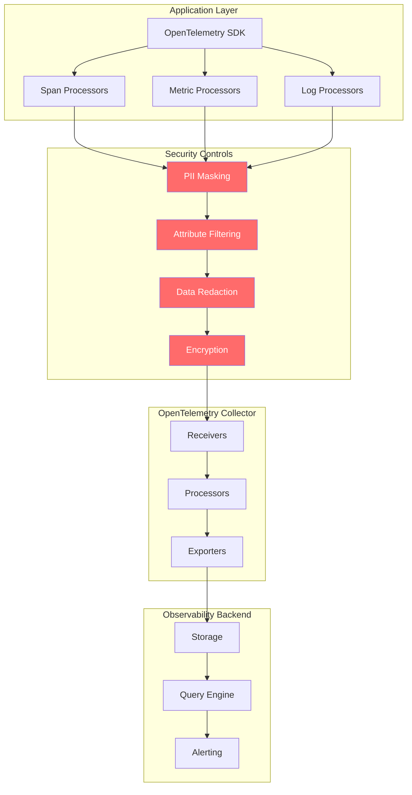
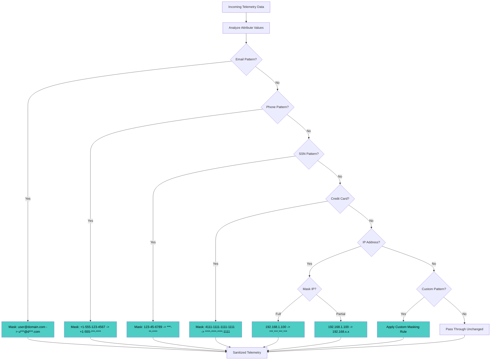
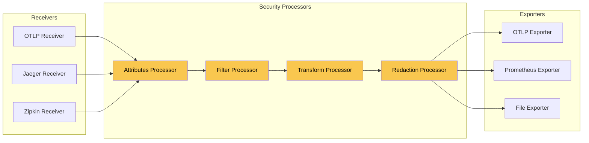
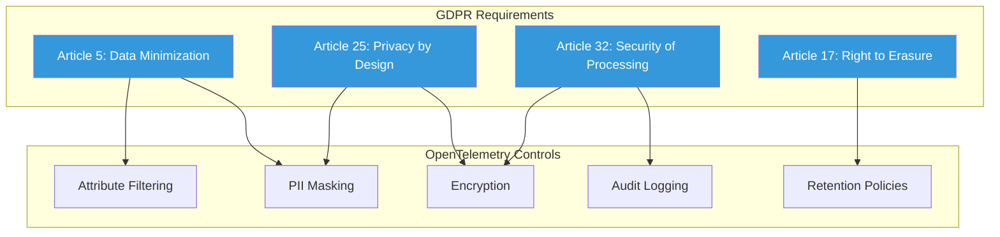
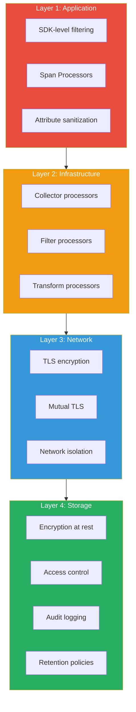

# How to Secure OpenTelemetry Data (PII Masking, Data Filtering)

Author: [nawazdhandala](https://github.com/nawazdhandala)

Tags: OpenTelemetry, Security, PII, Data Protection, Compliance, Observability

Description: Learn how to protect sensitive data in OpenTelemetry telemetry through masking, filtering, and encryption.

---

## Introduction

OpenTelemetry has become the de facto standard for collecting telemetry data from distributed systems. While this observability data is invaluable for debugging, performance optimization, and system monitoring, it often contains sensitive information that must be protected. Personal Identifiable Information (PII), financial data, healthcare records, and other sensitive information can inadvertently end up in your traces, metrics, and logs.

This comprehensive guide covers the essential techniques for securing OpenTelemetry data, including PII masking, attribute filtering, data sanitization, and compliance considerations for regulations like GDPR and HIPAA.

## Why OpenTelemetry Security Matters

Before diving into implementation details, let's understand why securing telemetry data is critical:

1. **Regulatory Compliance**: GDPR, HIPAA, PCI-DSS, and other regulations require protection of sensitive data
2. **Data Breach Prevention**: Telemetry backends can become attack vectors if they contain sensitive data
3. **Privacy Protection**: User trust depends on proper handling of their personal information
4. **Legal Liability**: Mishandling sensitive data can result in significant fines and legal consequences
5. **Third-Party Risk**: Telemetry data often flows to external observability platforms

## Data Flow Security Architecture

The following diagram illustrates where security controls should be applied in the OpenTelemetry data pipeline:



## PII Detection and Masking Strategies

The following diagram shows the decision flow for handling different types of sensitive data:



## Implementing Span Processors for Data Sanitization

Span processors are the first line of defense for securing trace data. They intercept spans before they leave your application.

### Basic PII Masking Span Processor in Go

This span processor intercepts all spans and applies PII masking rules to attribute values before they are exported:

```go
package security

import (
    "context"
    "regexp"
    "strings"

    "go.opentelemetry.io/otel/attribute"
    "go.opentelemetry.io/otel/sdk/trace"
)

// PIIMaskingSpanProcessor implements a span processor that masks
// sensitive data in span attributes before export
type PIIMaskingSpanProcessor struct {
    // next is the next span processor in the chain
    next trace.SpanProcessor

    // patterns holds compiled regex patterns for different PII types
    patterns map[string]*regexp.Regexp

    // sensitiveKeys is a set of attribute keys that should always be masked
    sensitiveKeys map[string]bool
}

// NewPIIMaskingSpanProcessor creates a new PII masking processor
// that wraps an existing span processor
func NewPIIMaskingSpanProcessor(next trace.SpanProcessor) *PIIMaskingSpanProcessor {
    return &PIIMaskingSpanProcessor{
        next: next,
        // Compile regex patterns once for performance
        patterns: map[string]*regexp.Regexp{
            // Email pattern: matches standard email format
            "email": regexp.MustCompile(`[a-zA-Z0-9._%+-]+@[a-zA-Z0-9.-]+\.[a-zA-Z]{2,}`),

            // Phone pattern: matches various phone formats including international
            "phone": regexp.MustCompile(`(\+?1[-.\s]?)?\(?\d{3}\)?[-.\s]?\d{3}[-.\s]?\d{4}`),

            // SSN pattern: matches US Social Security Numbers
            "ssn": regexp.MustCompile(`\d{3}-\d{2}-\d{4}`),

            // Credit card pattern: matches common card number formats
            "creditCard": regexp.MustCompile(`\d{4}[-\s]?\d{4}[-\s]?\d{4}[-\s]?\d{4}`),

            // IP address pattern: matches IPv4 addresses
            "ipv4": regexp.MustCompile(`\b\d{1,3}\.\d{1,3}\.\d{1,3}\.\d{1,3}\b`),
        },
        // Define attribute keys that should always be masked regardless of content
        sensitiveKeys: map[string]bool{
            "user.email":        true,
            "user.phone":        true,
            "user.ssn":          true,
            "http.request.body": true,
            "db.statement":      true,
            "user.password":     true,
            "auth.token":        true,
            "api.key":           true,
        },
    }
}

// OnStart is called when a span starts. We don't modify spans here
// because attributes may still be added during the span's lifetime
func (p *PIIMaskingSpanProcessor) OnStart(parent context.Context, s trace.ReadWriteSpan) {
    // Pass through to the next processor
    p.next.OnStart(parent, s)
}

// OnEnd is called when a span ends. This is where we mask PII
// since all attributes have been set by this point
func (p *PIIMaskingSpanProcessor) OnEnd(s trace.ReadOnlySpan) {
    // Create a wrapper that masks sensitive attributes
    maskedSpan := &maskedSpan{
        ReadOnlySpan:  s,
        processor:     p,
        maskedAttrs:   p.maskAttributes(s.Attributes()),
    }

    // Pass the masked span to the next processor
    p.next.OnEnd(maskedSpan)
}

// maskAttributes iterates through all attributes and applies masking
func (p *PIIMaskingSpanProcessor) maskAttributes(attrs []attribute.KeyValue) []attribute.KeyValue {
    masked := make([]attribute.KeyValue, len(attrs))

    for i, attr := range attrs {
        key := string(attr.Key)
        value := attr.Value.AsString()

        // Check if this is a known sensitive key
        if p.sensitiveKeys[key] {
            // Completely redact known sensitive fields
            masked[i] = attribute.String(key, "[REDACTED]")
            continue
        }

        // Apply pattern-based masking to the value
        maskedValue := p.maskValue(value)
        masked[i] = attribute.String(key, maskedValue)
    }

    return masked
}

// maskValue applies all PII patterns to mask sensitive data in a string
func (p *PIIMaskingSpanProcessor) maskValue(value string) string {
    result := value

    // Apply email masking: user@domain.com -> u***@d***.com
    result = p.patterns["email"].ReplaceAllStringFunc(result, func(email string) string {
        parts := strings.Split(email, "@")
        if len(parts) != 2 {
            return "[MASKED_EMAIL]"
        }
        // Keep first character of local part and domain
        return string(parts[0][0]) + "***@" + string(parts[1][0]) + "***." +
               strings.Split(parts[1], ".")[len(strings.Split(parts[1], "."))-1]
    })

    // Apply phone masking: keep area code, mask rest
    result = p.patterns["phone"].ReplaceAllStringFunc(result, func(phone string) string {
        // Keep first 6 characters, mask the rest
        if len(phone) > 6 {
            return phone[:6] + strings.Repeat("*", len(phone)-6)
        }
        return "[MASKED_PHONE]"
    })

    // Apply SSN masking: completely redact
    result = p.patterns["ssn"].ReplaceAllString(result, "***-**-****")

    // Apply credit card masking: keep last 4 digits
    result = p.patterns["creditCard"].ReplaceAllStringFunc(result, func(cc string) string {
        // Remove separators to get raw digits
        digits := regexp.MustCompile(`\D`).ReplaceAllString(cc, "")
        if len(digits) >= 4 {
            return "****-****-****-" + digits[len(digits)-4:]
        }
        return "[MASKED_CC]"
    })

    // Apply IP masking: mask last two octets
    result = p.patterns["ipv4"].ReplaceAllStringFunc(result, func(ip string) string {
        parts := strings.Split(ip, ".")
        if len(parts) == 4 {
            return parts[0] + "." + parts[1] + ".x.x"
        }
        return "[MASKED_IP]"
    })

    return result
}

// Shutdown gracefully shuts down the processor
func (p *PIIMaskingSpanProcessor) Shutdown(ctx context.Context) error {
    return p.next.Shutdown(ctx)
}

// ForceFlush flushes any pending spans
func (p *PIIMaskingSpanProcessor) ForceFlush(ctx context.Context) error {
    return p.next.ForceFlush(ctx)
}
```

### Implementing a Custom Masking Span Wrapper

The masked span wrapper allows us to override attribute access without modifying the original span:

```go
package security

import (
    "go.opentelemetry.io/otel/attribute"
    "go.opentelemetry.io/otel/sdk/trace"
)

// maskedSpan wraps a ReadOnlySpan and returns masked attributes
// This ensures the original span data is preserved while exporters
// receive only the sanitized version
type maskedSpan struct {
    trace.ReadOnlySpan
    processor   *PIIMaskingSpanProcessor
    maskedAttrs []attribute.KeyValue
}

// Attributes returns the masked version of span attributes
// This method is called by exporters when serializing the span
func (m *maskedSpan) Attributes() []attribute.KeyValue {
    return m.maskedAttrs
}
```

### Configuring the Span Processor in Your Application

Here's how to wire up the PII masking span processor when initializing OpenTelemetry:

```go
package main

import (
    "context"
    "log"

    "go.opentelemetry.io/otel"
    "go.opentelemetry.io/otel/exporters/otlp/otlptrace/otlptracegrpc"
    "go.opentelemetry.io/otel/sdk/resource"
    "go.opentelemetry.io/otel/sdk/trace"
    semconv "go.opentelemetry.io/otel/semconv/v1.21.0"

    "yourproject/security"
)

func initTracer() (*trace.TracerProvider, error) {
    ctx := context.Background()

    // Create the OTLP exporter that sends traces to the collector
    exporter, err := otlptracegrpc.New(ctx,
        otlptracegrpc.WithEndpoint("localhost:4317"),
        otlptracegrpc.WithInsecure(), // Use TLS in production!
    )
    if err != nil {
        return nil, err
    }

    // Create the base batch span processor for efficient export
    batchProcessor := trace.NewBatchSpanProcessor(exporter)

    // Wrap the batch processor with our PII masking processor
    // This ensures all spans are sanitized before being batched for export
    piiMaskingProcessor := security.NewPIIMaskingSpanProcessor(batchProcessor)

    // Create the tracer provider with our security-enhanced processor chain
    tp := trace.NewTracerProvider(
        trace.WithSpanProcessor(piiMaskingProcessor),
        trace.WithResource(resource.NewWithAttributes(
            semconv.SchemaURL,
            semconv.ServiceNameKey.String("secure-service"),
            semconv.ServiceVersionKey.String("1.0.0"),
        )),
    )

    // Set the global tracer provider
    otel.SetTracerProvider(tp)

    return tp, nil
}

func main() {
    tp, err := initTracer()
    if err != nil {
        log.Fatalf("Failed to initialize tracer: %v", err)
    }
    defer tp.Shutdown(context.Background())

    // Your application code here
    log.Println("OpenTelemetry initialized with PII masking")
}
```

## OpenTelemetry Collector Attribute Filtering

The OpenTelemetry Collector provides powerful processors for filtering and transforming telemetry data at the infrastructure level.

### Collector Pipeline Architecture



### Comprehensive Collector Configuration for Security

This collector configuration demonstrates multiple layers of security processing:

```yaml
# OpenTelemetry Collector configuration with security-focused processors
# This configuration implements defense-in-depth for telemetry data

receivers:
  # OTLP receiver accepts telemetry from instrumented applications
  otlp:
    protocols:
      grpc:
        endpoint: 0.0.0.0:4317
        # Enable TLS for secure transport
        tls:
          cert_file: /etc/otel/certs/server.crt
          key_file: /etc/otel/certs/server.key
          # Require client certificates for mutual TLS
          client_ca_file: /etc/otel/certs/ca.crt
      http:
        endpoint: 0.0.0.0:4318
        tls:
          cert_file: /etc/otel/certs/server.crt
          key_file: /etc/otel/certs/server.key

processors:
  # Attributes processor: Remove or hash sensitive attributes
  # This is the first line of defense in the collector
  attributes/remove-sensitive:
    actions:
      # Completely remove highly sensitive attributes
      # These should never be in telemetry data
      - key: user.password
        action: delete
      - key: auth.token
        action: delete
      - key: api.key
        action: delete
      - key: db.password
        action: delete
      - key: http.request.header.authorization
        action: delete
      - key: http.request.header.cookie
        action: delete
      - key: http.request.header.x-api-key
        action: delete

      # Hash values that need to be trackable but not readable
      # SHA256 allows correlation without exposing actual values
      - key: user.id
        action: hash
      - key: session.id
        action: hash
      - key: customer.id
        action: hash

  # Attributes processor: Mask PII patterns using regex
  # This catches PII that slipped through application-level filters
  attributes/mask-pii:
    actions:
      # Mask email addresses in any attribute value
      - key: user.email
        pattern: ^(.)(.*?)(@.*)$
        replacement: $1***$3
        action: extract

      # Mask phone numbers
      - key: user.phone
        pattern: ^(\+?1[-.\s]?\(?\d{3}\)?[-.\s]?)(\d{3}[-.\s]?\d{4})$
        replacement: $1***-****
        action: extract

      # Replace IP addresses with anonymized versions
      - key: http.client_ip
        pattern: ^(\d{1,3})\.(\d{1,3})\.(\d{1,3})\.(\d{1,3})$
        replacement: $1.$2.0.0
        action: extract

      # Mask credit card numbers (keep last 4 digits)
      - key: payment.card_number
        pattern: ^(\d{4}[-\s]?\d{4}[-\s]?\d{4}[-\s]?)(\d{4})$
        replacement: ****-****-****-$2
        action: extract

  # Filter processor: Drop spans/metrics that shouldn't be collected
  # This prevents sensitive operations from being recorded at all
  filter/security:
    error_mode: ignore
    traces:
      span:
        # Drop spans from authentication endpoints that might contain credentials
        - 'attributes["http.target"] == "/api/v1/auth/login"'
        - 'attributes["http.target"] == "/api/v1/auth/register"'
        - 'attributes["http.target"] == "/api/v1/password/reset"'
        # Drop spans from health check endpoints (not needed for debugging)
        - 'name == "health_check"'
        - 'attributes["http.route"] == "/health"'
        - 'attributes["http.route"] == "/ready"'
    metrics:
      metric:
        # Drop metrics that might contain sensitive labels
        - 'name == "user_password_attempts"'
        - 'name == "authentication_tokens_issued"'
    logs:
      log_record:
        # Drop log records with sensitive content
        - 'severity_text == "DEBUG"'
        - 'body contains "password"'
        - 'body contains "secret"'
        - 'body contains "token"'

  # Transform processor: Advanced data transformation
  # Use OTTL (OpenTelemetry Transformation Language) for complex rules
  transform/security:
    error_mode: ignore
    trace_statements:
      - context: span
        statements:
          # Truncate potentially long values that might contain sensitive data
          - truncate_all(attributes, 256)
          # Remove query parameters from URLs (often contain sensitive data)
          - replace_pattern(attributes["http.url"], "\\?.*$", "")
          # Mask email patterns found anywhere in attribute values
          - replace_all_patterns(attributes, "value",
              "[a-zA-Z0-9._%+-]+@[a-zA-Z0-9.-]+\\.[a-zA-Z]{2,}",
              "[MASKED_EMAIL]")
          # Mask SSN patterns
          - replace_all_patterns(attributes, "value",
              "\\d{3}-\\d{2}-\\d{4}",
              "[MASKED_SSN]")
    log_statements:
      - context: log
        statements:
          # Mask sensitive patterns in log bodies
          - replace_pattern(body, "password[\"']?\\s*[:=]\\s*[\"']?[^\"'\\s]+",
              "password=[REDACTED]")
          - replace_pattern(body, "token[\"']?\\s*[:=]\\s*[\"']?[^\"'\\s]+",
              "token=[REDACTED]")

  # Batch processor for efficient export
  batch:
    timeout: 5s
    send_batch_size: 1000
    send_batch_max_size: 1500

  # Memory limiter to prevent OOM
  memory_limiter:
    check_interval: 1s
    limit_mib: 1000
    spike_limit_mib: 200

exporters:
  # OTLP exporter with TLS for secure transport
  otlp/secure:
    endpoint: observability-backend.internal:4317
    tls:
      cert_file: /etc/otel/certs/client.crt
      key_file: /etc/otel/certs/client.key
      ca_file: /etc/otel/certs/ca.crt
    headers:
      # Authentication header for backend
      Authorization: Bearer ${OTEL_EXPORTER_AUTH_TOKEN}

  # Debug exporter for local development (disable in production!)
  debug:
    verbosity: basic
    sampling_initial: 5
    sampling_thereafter: 200

service:
  pipelines:
    # Traces pipeline with full security processing
    traces:
      receivers: [otlp]
      processors:
        - memory_limiter
        - attributes/remove-sensitive
        - attributes/mask-pii
        - filter/security
        - transform/security
        - batch
      exporters: [otlp/secure]

    # Metrics pipeline with security processing
    metrics:
      receivers: [otlp]
      processors:
        - memory_limiter
        - attributes/remove-sensitive
        - filter/security
        - batch
      exporters: [otlp/secure]

    # Logs pipeline with security processing
    logs:
      receivers: [otlp]
      processors:
        - memory_limiter
        - attributes/remove-sensitive
        - filter/security
        - transform/security
        - batch
      exporters: [otlp/secure]

  # Telemetry for the collector itself
  telemetry:
    logs:
      level: info
    metrics:
      address: 0.0.0.0:8888
```

## Python SDK: Implementing Secure Span Processors

For Python applications, here's how to implement PII masking in the OpenTelemetry SDK:

The following span processor integrates with Python's OpenTelemetry SDK to sanitize trace data:

```python
"""
PII Masking Span Processor for OpenTelemetry Python SDK.

This module provides a span processor that detects and masks personally
identifiable information (PII) in span attributes before they are exported.
"""

import re
from typing import Optional, Sequence, Dict, Pattern, Callable
from opentelemetry.sdk.trace import SpanProcessor, ReadableSpan
from opentelemetry.sdk.trace.export import SpanExporter, SpanExportResult
from opentelemetry.trace import Span


class PIIMaskingSpanProcessor(SpanProcessor):
    """
    A span processor that masks PII in span attributes.

    This processor intercepts spans at export time and applies regex-based
    masking rules to protect sensitive data. It supports both pattern-based
    detection (emails, phones, etc.) and key-based filtering (known sensitive
    attribute names).

    Attributes:
        exporter: The underlying span exporter to send sanitized spans to.
        patterns: Compiled regex patterns for PII detection.
        sensitive_keys: Set of attribute keys that should always be masked.
        custom_maskers: Dict of custom masking functions for specific patterns.
    """

    def __init__(
        self,
        exporter: SpanExporter,
        additional_patterns: Optional[Dict[str, str]] = None,
        additional_sensitive_keys: Optional[Sequence[str]] = None,
    ):
        """
        Initialize the PII masking span processor.

        Args:
            exporter: The span exporter to wrap with PII masking.
            additional_patterns: Optional dict of pattern_name -> regex_string
                to add custom PII detection patterns.
            additional_sensitive_keys: Optional list of additional attribute
                keys that should always be completely masked.
        """
        self._exporter = exporter

        # Build the pattern dictionary with common PII patterns
        # Each pattern is compiled once for performance
        self._patterns: Dict[str, Pattern] = {
            # RFC 5322 compliant email pattern (simplified)
            "email": re.compile(
                r'[a-zA-Z0-9._%+-]+@[a-zA-Z0-9.-]+\.[a-zA-Z]{2,}'
            ),
            # Phone numbers with various formats (US-centric)
            "phone": re.compile(
                r'(\+?1[-.\s]?)?\(?\d{3}\)?[-.\s]?\d{3}[-.\s]?\d{4}'
            ),
            # US Social Security Numbers
            "ssn": re.compile(r'\d{3}-\d{2}-\d{4}'),
            # Credit card numbers (Visa, MC, Amex, Discover patterns)
            "credit_card": re.compile(
                r'\b(?:4[0-9]{12}(?:[0-9]{3})?|'  # Visa
                r'5[1-5][0-9]{14}|'               # MasterCard
                r'3[47][0-9]{13}|'                 # Amex
                r'6(?:011|5[0-9]{2})[0-9]{12})\b'  # Discover
            ),
            # Credit card with separators
            "credit_card_formatted": re.compile(
                r'\d{4}[-\s]?\d{4}[-\s]?\d{4}[-\s]?\d{4}'
            ),
            # IPv4 addresses
            "ipv4": re.compile(
                r'\b(?:(?:25[0-5]|2[0-4][0-9]|[01]?[0-9][0-9]?)\.){3}'
                r'(?:25[0-5]|2[0-4][0-9]|[01]?[0-9][0-9]?)\b'
            ),
            # AWS Access Key IDs
            "aws_key": re.compile(r'AKIA[0-9A-Z]{16}'),
            # Generic API keys (base64-like strings)
            "api_key": re.compile(r'\b[A-Za-z0-9+/]{32,}={0,2}\b'),
            # JWT tokens
            "jwt": re.compile(
                r'eyJ[A-Za-z0-9_-]*\.eyJ[A-Za-z0-9_-]*\.[A-Za-z0-9_-]*'
            ),
        }

        # Add any custom patterns provided by the user
        if additional_patterns:
            for name, pattern in additional_patterns.items():
                self._patterns[name] = re.compile(pattern)

        # Define attribute keys that should always be completely masked
        # These are known to contain sensitive data
        self._sensitive_keys: set = {
            "user.password",
            "user.email",
            "user.phone",
            "user.ssn",
            "user.credit_card",
            "http.request.body",
            "http.response.body",
            "db.statement",
            "db.query",
            "auth.token",
            "api.key",
            "aws.secret_key",
            "password",
            "secret",
            "token",
            "authorization",
            "cookie",
        }

        # Add any additional sensitive keys
        if additional_sensitive_keys:
            self._sensitive_keys.update(additional_sensitive_keys)

        # Define custom masking functions for specific patterns
        # These provide more intelligent masking than simple redaction
        self._maskers: Dict[str, Callable[[str], str]] = {
            "email": self._mask_email,
            "phone": self._mask_phone,
            "ssn": self._mask_ssn,
            "credit_card": self._mask_credit_card,
            "credit_card_formatted": self._mask_credit_card,
            "ipv4": self._mask_ip,
            "aws_key": lambda x: "AKIA" + "*" * 16,
            "api_key": lambda x: "[MASKED_API_KEY]",
            "jwt": lambda x: "[MASKED_JWT]",
        }

    def _mask_email(self, email: str) -> str:
        """
        Mask an email address while preserving structure.

        Example: john.doe@example.com -> j***@e***.com
        """
        try:
            local, domain = email.split("@")
            domain_parts = domain.split(".")
            # Keep first char of local part and domain
            masked_local = local[0] + "***" if local else "***"
            masked_domain = domain_parts[0][0] + "***" if domain_parts[0] else "***"
            tld = domain_parts[-1] if len(domain_parts) > 1 else "***"
            return f"{masked_local}@{masked_domain}.{tld}"
        except (ValueError, IndexError):
            return "[MASKED_EMAIL]"

    def _mask_phone(self, phone: str) -> str:
        """
        Mask a phone number while preserving area code.

        Example: +1-555-123-4567 -> +1-555-***-****
        """
        # Remove non-digit characters for processing
        digits = re.sub(r'\D', '', phone)
        if len(digits) >= 10:
            # Keep country code and area code visible
            if len(digits) == 11:  # With country code
                return f"+{digits[0]}-{digits[1:4]}-***-****"
            else:  # Without country code
                return f"{digits[:3]}-***-****"
        return "[MASKED_PHONE]"

    def _mask_ssn(self, ssn: str) -> str:
        """
        Completely mask SSN - these should never be visible.

        Example: 123-45-6789 -> ***-**-****
        """
        return "***-**-****"

    def _mask_credit_card(self, cc: str) -> str:
        """
        Mask credit card number, keeping last 4 digits.

        Example: 4111-1111-1111-1111 -> ****-****-****-1111
        """
        digits = re.sub(r'\D', '', cc)
        if len(digits) >= 4:
            return f"****-****-****-{digits[-4:]}"
        return "[MASKED_CC]"

    def _mask_ip(self, ip: str) -> str:
        """
        Partially mask IP address for privacy while keeping network info.

        Example: 192.168.1.100 -> 192.168.x.x
        """
        parts = ip.split(".")
        if len(parts) == 4:
            return f"{parts[0]}.{parts[1]}.x.x"
        return "[MASKED_IP]"

    def _mask_value(self, value: str) -> str:
        """
        Apply all PII patterns to mask sensitive data in a string.

        This method iterates through all defined patterns and applies
        the corresponding masking function when a match is found.

        Args:
            value: The string value to scan and mask.

        Returns:
            The masked string with all detected PII patterns replaced.
        """
        result = value

        # Apply each pattern's masker
        for pattern_name, pattern in self._patterns.items():
            masker = self._maskers.get(pattern_name, lambda x: "[MASKED]")
            result = pattern.sub(
                lambda m: masker(m.group()),
                result
            )

        return result

    def _mask_attributes(
        self,
        attributes: Dict[str, any]
    ) -> Dict[str, any]:
        """
        Mask all sensitive attributes in a dictionary.

        Args:
            attributes: Dictionary of span attributes.

        Returns:
            New dictionary with masked values.
        """
        masked = {}

        for key, value in attributes.items():
            # Check if this is a known sensitive key
            key_lower = key.lower()
            if any(sensitive in key_lower for sensitive in self._sensitive_keys):
                masked[key] = "[REDACTED]"
                continue

            # Apply pattern-based masking for string values
            if isinstance(value, str):
                masked[key] = self._mask_value(value)
            elif isinstance(value, (list, tuple)):
                # Handle array values
                masked[key] = [
                    self._mask_value(v) if isinstance(v, str) else v
                    for v in value
                ]
            else:
                # Pass through non-string values unchanged
                masked[key] = value

        return masked

    def on_start(
        self,
        span: Span,
        parent_context: Optional[any] = None
    ) -> None:
        """
        Called when a span starts.

        We don't mask here because attributes may still be added.
        """
        pass

    def on_end(self, span: ReadableSpan) -> None:
        """
        Called when a span ends.

        This is where we create a masked copy of the span and export it.
        Note: We cannot modify the span directly, so we create a wrapper.
        """
        # The actual masking happens in the force_flush/shutdown export
        pass

    def shutdown(self) -> None:
        """Shutdown the underlying exporter."""
        self._exporter.shutdown()

    def force_flush(self, timeout_millis: int = 30000) -> bool:
        """Force flush the underlying exporter."""
        return self._exporter.force_flush(timeout_millis)


class MaskedSpanExporter(SpanExporter):
    """
    A span exporter wrapper that masks PII before exporting.

    This wrapper intercepts spans before they are sent to the actual
    exporter and applies PII masking to all attributes.
    """

    def __init__(
        self,
        exporter: SpanExporter,
        processor: PIIMaskingSpanProcessor,
    ):
        """
        Initialize the masked span exporter.

        Args:
            exporter: The underlying exporter to send masked spans to.
            processor: The PII masking processor with masking logic.
        """
        self._exporter = exporter
        self._processor = processor

    def export(self, spans: Sequence[ReadableSpan]) -> SpanExportResult:
        """
        Export spans after applying PII masking.

        Args:
            spans: Sequence of spans to export.

        Returns:
            The export result from the underlying exporter.
        """
        # Create masked copies of all spans
        masked_spans = []
        for span in spans:
            # Create a masked version of the span's attributes
            masked_attrs = self._processor._mask_attributes(
                dict(span.attributes) if span.attributes else {}
            )
            # Create a new span data object with masked attributes
            masked_span = MaskedSpanData(span, masked_attrs)
            masked_spans.append(masked_span)

        return self._exporter.export(masked_spans)

    def shutdown(self) -> None:
        """Shutdown the underlying exporter."""
        self._exporter.shutdown()


class MaskedSpanData:
    """
    A wrapper around ReadableSpan that returns masked attributes.

    This class proxies all attribute access to return masked values
    while delegating other properties to the original span.
    """

    def __init__(self, span: ReadableSpan, masked_attributes: Dict[str, any]):
        """
        Initialize the masked span data wrapper.

        Args:
            span: The original span to wrap.
            masked_attributes: The pre-masked attributes dictionary.
        """
        self._span = span
        self._masked_attributes = masked_attributes

    @property
    def attributes(self) -> Dict[str, any]:
        """Return the masked attributes."""
        return self._masked_attributes

    def __getattr__(self, name: str) -> any:
        """Delegate all other attribute access to the original span."""
        return getattr(self._span, name)
```

### Using the Python PII Masking Processor

Here's how to configure your Python application to use the PII masking processor:

```python
"""
Example usage of the PII Masking Span Processor.

This demonstrates how to configure OpenTelemetry in a Python application
with PII masking enabled.
"""

from opentelemetry import trace
from opentelemetry.sdk.trace import TracerProvider
from opentelemetry.sdk.trace.export import BatchSpanProcessor
from opentelemetry.exporter.otlp.proto.grpc.trace_exporter import OTLPSpanExporter

# Import our custom PII masking components
from pii_masking import PIIMaskingSpanProcessor, MaskedSpanExporter


def configure_secure_tracing():
    """
    Configure OpenTelemetry with PII masking enabled.

    This function sets up a tracer provider with a custom span processor
    chain that masks sensitive data before export.
    """
    # Create the OTLP exporter that sends traces to the collector
    otlp_exporter = OTLPSpanExporter(
        endpoint="localhost:4317",
        insecure=True,  # Use TLS in production!
    )

    # Create the PII masking processor with custom configuration
    pii_processor = PIIMaskingSpanProcessor(
        exporter=otlp_exporter,
        # Add custom patterns specific to your application
        additional_patterns={
            # Match your internal user ID format
            "internal_user_id": r"USR-[A-Z0-9]{8}",
            # Match your order ID format
            "order_id": r"ORD-\d{10}",
        },
        # Add additional sensitive attribute keys
        additional_sensitive_keys=[
            "customer.billing_address",
            "customer.shipping_address",
            "payment.cvv",
        ],
    )

    # Wrap the exporter with the masking exporter
    masked_exporter = MaskedSpanExporter(
        exporter=otlp_exporter,
        processor=pii_processor,
    )

    # Create a batch processor for efficient export
    batch_processor = BatchSpanProcessor(masked_exporter)

    # Create and configure the tracer provider
    provider = TracerProvider()
    provider.add_span_processor(batch_processor)

    # Set as the global tracer provider
    trace.set_tracer_provider(provider)

    return provider


# Example usage in your application
if __name__ == "__main__":
    # Initialize tracing with PII masking
    provider = configure_secure_tracing()

    # Get a tracer for your application
    tracer = trace.get_tracer("my-application", "1.0.0")

    # Create spans that might contain sensitive data
    # The PII masking processor will sanitize them before export
    with tracer.start_as_current_span("process-user-request") as span:
        # Even if you accidentally add PII, it will be masked
        span.set_attribute("user.email", "john.doe@example.com")
        span.set_attribute("user.phone", "+1-555-123-4567")
        span.set_attribute("http.client_ip", "192.168.1.100")

        # This will be completely redacted due to sensitive key detection
        span.set_attribute("auth.token", "secret-bearer-token-12345")

        # Process the request...
        print("Processing request with masked telemetry")

    # Shutdown the provider to flush remaining spans
    provider.shutdown()
```

## JavaScript/TypeScript: Implementing Secure Span Processors

For Node.js applications, here's a comprehensive PII masking implementation:

This implementation provides a configurable span processor for Node.js OpenTelemetry SDK:

```typescript
/**
 * PII Masking Span Processor for OpenTelemetry Node.js SDK
 *
 * This module provides a span processor that detects and masks personally
 * identifiable information in span attributes before export.
 */

import {
  SpanProcessor,
  ReadableSpan,
  Span,
} from '@opentelemetry/sdk-trace-base';
import { Context } from '@opentelemetry/api';

/**
 * Configuration options for the PII masking processor
 */
interface PIIMaskingConfig {
  /** Additional regex patterns to detect PII */
  additionalPatterns?: Record<string, RegExp>;
  /** Additional attribute keys to always mask */
  additionalSensitiveKeys?: string[];
  /** Whether to hash values instead of masking (for correlation) */
  hashInsteadOfMask?: boolean;
  /** Custom masking functions for specific pattern types */
  customMaskers?: Record<string, (value: string) => string>;
}

/**
 * A span processor that masks PII in span attributes.
 *
 * This processor intercepts spans and applies regex-based masking rules
 * to protect sensitive data before it leaves the application.
 */
export class PIIMaskingSpanProcessor implements SpanProcessor {
  private readonly nextProcessor: SpanProcessor;
  private readonly patterns: Map<string, RegExp>;
  private readonly sensitiveKeys: Set<string>;
  private readonly maskers: Map<string, (value: string) => string>;
  private readonly config: PIIMaskingConfig;

  /**
   * Create a new PII masking span processor.
   *
   * @param nextProcessor - The next processor in the chain (usually BatchSpanProcessor)
   * @param config - Configuration options for masking behavior
   */
  constructor(nextProcessor: SpanProcessor, config: PIIMaskingConfig = {}) {
    this.nextProcessor = nextProcessor;
    this.config = config;

    // Initialize pattern map with common PII patterns
    // Each pattern is designed to match specific types of sensitive data
    this.patterns = new Map([
      // Email addresses (RFC 5322 simplified)
      ['email', /[a-zA-Z0-9._%+-]+@[a-zA-Z0-9.-]+\.[a-zA-Z]{2,}/g],

      // Phone numbers (various formats, US-centric)
      ['phone', /(\+?1[-.\s]?)?\(?\d{3}\)?[-.\s]?\d{3}[-.\s]?\d{4}/g],

      // US Social Security Numbers
      ['ssn', /\d{3}-\d{2}-\d{4}/g],

      // Credit card numbers (major brands)
      ['creditCard', /\b(?:4[0-9]{12}(?:[0-9]{3})?|5[1-5][0-9]{14}|3[47][0-9]{13}|6(?:011|5[0-9]{2})[0-9]{12})\b/g],

      // Credit cards with separators
      ['creditCardFormatted', /\d{4}[-\s]?\d{4}[-\s]?\d{4}[-\s]?\d{4}/g],

      // IPv4 addresses
      ['ipv4', /\b(?:(?:25[0-5]|2[0-4][0-9]|[01]?[0-9][0-9]?)\.){3}(?:25[0-5]|2[0-4][0-9]|[01]?[0-9][0-9]?)\b/g],

      // AWS Access Key IDs
      ['awsKey', /AKIA[0-9A-Z]{16}/g],

      // JWT tokens
      ['jwt', /eyJ[A-Za-z0-9_-]*\.eyJ[A-Za-z0-9_-]*\.[A-Za-z0-9_-]*/g],

      // Generic API keys (long alphanumeric strings)
      ['apiKey', /\b[A-Za-z0-9]{32,}\b/g],

      // UUIDs (often used as user IDs)
      ['uuid', /[0-9a-f]{8}-[0-9a-f]{4}-[0-9a-f]{4}-[0-9a-f]{4}-[0-9a-f]{12}/gi],
    ]);

    // Add any additional patterns from config
    if (config.additionalPatterns) {
      Object.entries(config.additionalPatterns).forEach(([name, pattern]) => {
        this.patterns.set(name, pattern);
      });
    }

    // Initialize sensitive keys set
    // These attribute keys will always be completely masked
    this.sensitiveKeys = new Set([
      'user.password',
      'user.email',
      'user.phone',
      'user.ssn',
      'user.credit_card',
      'http.request.body',
      'http.response.body',
      'db.statement',
      'db.query',
      'auth.token',
      'api.key',
      'aws.secret_key',
      'password',
      'secret',
      'token',
      'authorization',
      'cookie',
      'session',
      ...(config.additionalSensitiveKeys || []),
    ]);

    // Initialize masking functions for each pattern type
    this.maskers = new Map([
      ['email', this.maskEmail.bind(this)],
      ['phone', this.maskPhone.bind(this)],
      ['ssn', () => '***-**-****'],
      ['creditCard', this.maskCreditCard.bind(this)],
      ['creditCardFormatted', this.maskCreditCard.bind(this)],
      ['ipv4', this.maskIP.bind(this)],
      ['awsKey', () => 'AKIA****************'],
      ['jwt', () => '[MASKED_JWT]'],
      ['apiKey', () => '[MASKED_API_KEY]'],
      ['uuid', config.hashInsteadOfMask ? this.hashValue.bind(this) : () => '[MASKED_UUID]'],
    ]);

    // Add custom maskers from config
    if (config.customMaskers) {
      Object.entries(config.customMaskers).forEach(([name, masker]) => {
        this.maskers.set(name, masker);
      });
    }
  }

  /**
   * Mask an email address while preserving structure.
   * Example: john.doe@example.com -> j***@e***.com
   */
  private maskEmail(email: string): string {
    try {
      const [local, domain] = email.split('@');
      const domainParts = domain.split('.');
      const maskedLocal = local[0] + '***';
      const maskedDomain = domainParts[0][0] + '***';
      const tld = domainParts[domainParts.length - 1];
      return `${maskedLocal}@${maskedDomain}.${tld}`;
    } catch {
      return '[MASKED_EMAIL]';
    }
  }

  /**
   * Mask a phone number while preserving area code.
   * Example: +1-555-123-4567 -> +1-555-***-****
   */
  private maskPhone(phone: string): string {
    const digits = phone.replace(/\D/g, '');
    if (digits.length >= 10) {
      if (digits.length === 11) {
        return `+${digits[0]}-${digits.slice(1, 4)}-***-****`;
      }
      return `${digits.slice(0, 3)}-***-****`;
    }
    return '[MASKED_PHONE]';
  }

  /**
   * Mask credit card number, keeping last 4 digits.
   * Example: 4111111111111111 -> ****-****-****-1111
   */
  private maskCreditCard(cc: string): string {
    const digits = cc.replace(/\D/g, '');
    if (digits.length >= 4) {
      return `****-****-****-${digits.slice(-4)}`;
    }
    return '[MASKED_CC]';
  }

  /**
   * Mask IP address, keeping network portion.
   * Example: 192.168.1.100 -> 192.168.x.x
   */
  private maskIP(ip: string): string {
    const parts = ip.split('.');
    if (parts.length === 4) {
      return `${parts[0]}.${parts[1]}.x.x`;
    }
    return '[MASKED_IP]';
  }

  /**
   * Hash a value for correlation without exposing the actual data.
   * Uses a simple hash for demonstration - use crypto.createHash in production.
   */
  private hashValue(value: string): string {
    // Simple hash for demonstration
    // In production, use: crypto.createHash('sha256').update(value).digest('hex').slice(0, 16)
    let hash = 0;
    for (let i = 0; i < value.length; i++) {
      const char = value.charCodeAt(i);
      hash = ((hash << 5) - hash) + char;
      hash = hash & hash;
    }
    return `[HASHED:${Math.abs(hash).toString(16)}]`;
  }

  /**
   * Apply all PII patterns to mask sensitive data in a string.
   */
  private maskValue(value: string): string {
    let result = value;

    // Apply each pattern's masker
    this.patterns.forEach((pattern, patternName) => {
      const masker = this.maskers.get(patternName) || (() => '[MASKED]');
      // Reset regex lastIndex for global patterns
      pattern.lastIndex = 0;
      result = result.replace(pattern, (match) => masker(match));
    });

    return result;
  }

  /**
   * Check if an attribute key is considered sensitive.
   */
  private isSensitiveKey(key: string): boolean {
    const keyLower = key.toLowerCase();
    return Array.from(this.sensitiveKeys).some(
      sensitive => keyLower.includes(sensitive.toLowerCase())
    );
  }

  /**
   * Mask all sensitive attributes in an object.
   */
  private maskAttributes(
    attributes: Record<string, unknown>
  ): Record<string, unknown> {
    const masked: Record<string, unknown> = {};

    Object.entries(attributes).forEach(([key, value]) => {
      // Check if this is a known sensitive key
      if (this.isSensitiveKey(key)) {
        masked[key] = '[REDACTED]';
        return;
      }

      // Apply pattern-based masking for string values
      if (typeof value === 'string') {
        masked[key] = this.maskValue(value);
      } else if (Array.isArray(value)) {
        // Handle array values
        masked[key] = value.map(v =>
          typeof v === 'string' ? this.maskValue(v) : v
        );
      } else {
        // Pass through non-string values unchanged
        masked[key] = value;
      }
    });

    return masked;
  }

  /**
   * Called when a span starts. We don't mask here because
   * attributes may still be added during the span's lifetime.
   */
  onStart(span: Span, parentContext: Context): void {
    this.nextProcessor.onStart(span, parentContext);
  }

  /**
   * Called when a span ends. This is where we apply masking
   * and pass the sanitized span to the next processor.
   */
  onEnd(span: ReadableSpan): void {
    // Create a proxy that returns masked attributes
    const maskedSpan = this.createMaskedSpan(span);
    this.nextProcessor.onEnd(maskedSpan);
  }

  /**
   * Create a proxy span that returns masked attributes.
   */
  private createMaskedSpan(span: ReadableSpan): ReadableSpan {
    const maskedAttributes = this.maskAttributes(
      span.attributes as Record<string, unknown>
    );

    // Create a proxy that intercepts attribute access
    return new Proxy(span, {
      get: (target, prop) => {
        if (prop === 'attributes') {
          return maskedAttributes;
        }
        return Reflect.get(target, prop);
      },
    });
  }

  /**
   * Shutdown the processor chain.
   */
  async shutdown(): Promise<void> {
    return this.nextProcessor.shutdown();
  }

  /**
   * Force flush pending spans.
   */
  async forceFlush(): Promise<void> {
    return this.nextProcessor.forceFlush();
  }
}
```

### Using the TypeScript PII Masking Processor

Here's how to configure your Node.js application:

```typescript
/**
 * Example configuration for OpenTelemetry with PII masking in Node.js.
 */

import { NodeSDK } from '@opentelemetry/sdk-node';
import { OTLPTraceExporter } from '@opentelemetry/exporter-trace-otlp-grpc';
import { BatchSpanProcessor } from '@opentelemetry/sdk-trace-base';
import { Resource } from '@opentelemetry/resources';
import { SemanticResourceAttributes } from '@opentelemetry/semantic-conventions';
import { PIIMaskingSpanProcessor } from './pii-masking-processor';

/**
 * Initialize OpenTelemetry with security-focused configuration.
 */
function initializeSecureTracing(): NodeSDK {
  // Create the OTLP exporter for sending traces to collector
  const traceExporter = new OTLPTraceExporter({
    url: 'http://localhost:4317',
    // In production, configure TLS:
    // credentials: grpc.credentials.createSsl(rootCert, privateKey, certChain),
  });

  // Create the batch processor for efficient export
  const batchProcessor = new BatchSpanProcessor(traceExporter, {
    maxQueueSize: 1000,
    scheduledDelayMillis: 5000,
    maxExportBatchSize: 100,
  });

  // Wrap with PII masking processor
  const piiMaskingProcessor = new PIIMaskingSpanProcessor(batchProcessor, {
    // Add custom patterns for your application
    additionalPatterns: {
      // Match internal employee IDs
      employeeId: /EMP-[A-Z]{2}\d{6}/g,
      // Match internal order references
      orderRef: /ORD-\d{10}/g,
    },
    // Add additional sensitive keys
    additionalSensitiveKeys: [
      'customer.address',
      'customer.dob',
      'payment.cvv',
      'medical.record_id',
    ],
    // Hash UUIDs instead of masking for correlation
    hashInsteadOfMask: true,
  });

  // Create the SDK with security configuration
  const sdk = new NodeSDK({
    resource: new Resource({
      [SemanticResourceAttributes.SERVICE_NAME]: 'secure-nodejs-service',
      [SemanticResourceAttributes.SERVICE_VERSION]: '1.0.0',
      [SemanticResourceAttributes.DEPLOYMENT_ENVIRONMENT]: 'production',
    }),
    spanProcessor: piiMaskingProcessor,
  });

  return sdk;
}

// Initialize and start the SDK
const sdk = initializeSecureTracing();
sdk.start();

// Graceful shutdown
process.on('SIGTERM', () => {
  sdk.shutdown()
    .then(() => console.log('Tracing terminated'))
    .catch((error) => console.error('Error terminating tracing', error))
    .finally(() => process.exit(0));
});

console.log('OpenTelemetry initialized with PII masking');
```

## Compliance Considerations

### GDPR Compliance

The General Data Protection Regulation requires specific handling of personal data. Here's how OpenTelemetry security measures map to GDPR requirements:



### GDPR-Compliant Collector Configuration

This configuration ensures GDPR compliance by minimizing data collection and enabling data lifecycle management:

```yaml
# GDPR-compliant OpenTelemetry Collector configuration
# This configuration implements data minimization and privacy-by-design principles

receivers:
  otlp:
    protocols:
      grpc:
        endpoint: 0.0.0.0:4317

processors:
  # Data minimization: Only collect necessary attributes
  # GDPR Article 5(1)(c) requires collecting only data necessary for the purpose
  attributes/gdpr-minimize:
    actions:
      # Remove all user-identifiable attributes
      - key: user.email
        action: delete
      - key: user.name
        action: delete
      - key: user.phone
        action: delete
      - key: user.address
        action: delete
      - key: user.ip
        action: delete
      # Remove location data (considered PII under GDPR)
      - key: geo.city
        action: delete
      - key: geo.postal_code
        action: delete
      - key: geo.coordinates
        action: delete
      # Hash identifiers for correlation without identification
      - key: user.id
        action: hash
      - key: session.id
        action: hash
      - key: device.id
        action: hash

  # Transform processor for GDPR-specific masking
  transform/gdpr:
    error_mode: ignore
    trace_statements:
      - context: span
        statements:
          # Remove IP addresses from all attributes (considered PII in GDPR)
          - replace_all_patterns(attributes, "value",
              "\\b(?:(?:25[0-5]|2[0-4][0-9]|[01]?[0-9][0-9]?)\\.){3}(?:25[0-5]|2[0-4][0-9]|[01]?[0-9][0-9]?)\\b",
              "[IP_REMOVED]")
          # Remove email addresses
          - replace_all_patterns(attributes, "value",
              "[a-zA-Z0-9._%+-]+@[a-zA-Z0-9.-]+\\.[a-zA-Z]{2,}",
              "[EMAIL_REMOVED]")

  # Resource processor to add GDPR metadata
  resource:
    attributes:
      # Add data processing metadata for compliance auditing
      - key: gdpr.data_processor
        value: "your-company-name"
        action: upsert
      - key: gdpr.processing_purpose
        value: "service-monitoring"
        action: upsert
      - key: gdpr.legal_basis
        value: "legitimate-interest"
        action: upsert
      - key: gdpr.data_retention_days
        value: "30"
        action: upsert

  batch:
    timeout: 5s
    send_batch_size: 1000

exporters:
  # Export to EU-based storage for data residency compliance
  otlp/eu-storage:
    endpoint: eu-observability.internal:4317
    tls:
      cert_file: /etc/otel/certs/client.crt
      key_file: /etc/otel/certs/client.key

service:
  pipelines:
    traces:
      receivers: [otlp]
      processors: [attributes/gdpr-minimize, transform/gdpr, resource, batch]
      exporters: [otlp/eu-storage]
```

### HIPAA Compliance

For healthcare applications, HIPAA requires protection of Protected Health Information (PHI). Here's a comprehensive configuration:

HIPAA requires encryption at rest and in transit, audit trails, and strict access controls for PHI:

```yaml
# HIPAA-compliant OpenTelemetry Collector configuration
# This configuration implements safeguards for Protected Health Information (PHI)

receivers:
  otlp:
    protocols:
      grpc:
        endpoint: 0.0.0.0:4317
        # HIPAA requires encryption in transit
        tls:
          cert_file: /etc/otel/certs/server.crt
          key_file: /etc/otel/certs/server.key
          client_ca_file: /etc/otel/certs/ca.crt
          # Require client certificate authentication
          min_version: "1.3"

processors:
  # Remove all PHI identifiers as defined by HIPAA Safe Harbor
  # 18 identifiers that must be removed for de-identification
  attributes/hipaa-phi-removal:
    actions:
      # Names
      - key: patient.name
        action: delete
      - key: patient.first_name
        action: delete
      - key: patient.last_name
        action: delete
      - key: provider.name
        action: delete

      # Geographic data smaller than state
      - key: patient.address
        action: delete
      - key: patient.city
        action: delete
      - key: patient.zip
        action: delete
      - key: patient.street
        action: delete

      # Dates (except year) related to individual
      - key: patient.birth_date
        action: delete
      - key: patient.admission_date
        action: delete
      - key: patient.discharge_date
        action: delete

      # Contact information
      - key: patient.phone
        action: delete
      - key: patient.fax
        action: delete
      - key: patient.email
        action: delete

      # Identification numbers
      - key: patient.ssn
        action: delete
      - key: patient.medical_record_number
        action: delete
      - key: patient.health_plan_beneficiary
        action: delete
      - key: patient.account_number
        action: delete
      - key: patient.certificate_license
        action: delete
      - key: patient.vehicle_id
        action: delete
      - key: patient.device_id
        action: delete

      # Web/Internet identifiers
      - key: patient.ip
        action: delete
      - key: patient.url
        action: delete

      # Biometric identifiers
      - key: patient.fingerprint
        action: delete
      - key: patient.retinal_scan
        action: delete
      - key: patient.voice_print
        action: delete

      # Photographs and images
      - key: patient.photo
        action: delete
      - key: patient.image
        action: delete

      # Hash identifiers that need correlation
      - key: encounter.id
        action: hash
      - key: claim.id
        action: hash

  # Transform for additional PHI pattern detection
  transform/hipaa:
    error_mode: ignore
    trace_statements:
      - context: span
        statements:
          # Remove medical record number patterns (varies by organization)
          - replace_all_patterns(attributes, "value",
              "MRN[-:]?\\s*\\d{6,10}",
              "[MRN_REMOVED]")
          # Remove health plan ID patterns
          - replace_all_patterns(attributes, "value",
              "\\b[A-Z]{3}\\d{9}\\b",
              "[HPID_REMOVED]")
          # Remove diagnosis codes from free text (ICD-10)
          - replace_all_patterns(attributes, "value",
              "\\b[A-Z]\\d{2}\\.?\\d{0,4}\\b",
              "[DX_CODE]")

  # Add HIPAA audit metadata
  resource:
    attributes:
      - key: hipaa.covered_entity
        value: "your-healthcare-org"
        action: upsert
      - key: hipaa.business_associate
        value: "your-ba-name"
        action: upsert
      - key: hipaa.data_classification
        value: "phi-sanitized"
        action: upsert

  # Memory limiter for stability
  memory_limiter:
    check_interval: 1s
    limit_mib: 1000
    spike_limit_mib: 200

  batch:
    timeout: 5s
    send_batch_size: 500

exporters:
  # Export to HIPAA-compliant storage
  otlp/hipaa-compliant-storage:
    endpoint: hipaa-observability.internal:4317
    tls:
      cert_file: /etc/otel/certs/client.crt
      key_file: /etc/otel/certs/client.key
      ca_file: /etc/otel/certs/ca.crt
    headers:
      X-HIPAA-Audit-User: ${OTEL_HIPAA_AUDIT_USER}
      X-HIPAA-Audit-Action: "telemetry-export"

  # Audit log exporter for HIPAA compliance
  file/audit:
    path: /var/log/otel/hipaa-audit.log
    rotation:
      max_megabytes: 100
      max_days: 2555  # 7 years retention for HIPAA
      max_backups: 100

service:
  pipelines:
    traces:
      receivers: [otlp]
      processors:
        - memory_limiter
        - attributes/hipaa-phi-removal
        - transform/hipaa
        - resource
        - batch
      exporters: [otlp/hipaa-compliant-storage, file/audit]
```

### PCI-DSS Compliance

For payment card processing, PCI-DSS requires strict protection of cardholder data:

```yaml
# PCI-DSS compliant OpenTelemetry Collector configuration
# This configuration protects cardholder data as required by PCI-DSS

receivers:
  otlp:
    protocols:
      grpc:
        endpoint: 0.0.0.0:4317
        tls:
          cert_file: /etc/otel/certs/server.crt
          key_file: /etc/otel/certs/server.key
          min_version: "1.2"  # PCI-DSS 4.0 requires TLS 1.2+

processors:
  # PCI-DSS Requirement 3: Protect stored cardholder data
  # Never store full PAN, CVV, or PIN data
  attributes/pci-cardholder-data:
    actions:
      # Remove primary account numbers (PANs)
      - key: payment.card_number
        action: delete
      - key: payment.pan
        action: delete
      # Remove CVV/CVC
      - key: payment.cvv
        action: delete
      - key: payment.cvc
        action: delete
      - key: payment.security_code
        action: delete
      # Remove PIN data
      - key: payment.pin
        action: delete
      - key: payment.pin_block
        action: delete
      # Remove magnetic stripe data
      - key: payment.track1
        action: delete
      - key: payment.track2
        action: delete
      # Remove expiration date
      - key: payment.expiry
        action: delete
      - key: payment.exp_date
        action: delete

  # Transform for pattern-based PAN detection
  transform/pci:
    error_mode: ignore
    trace_statements:
      - context: span
        statements:
          # Detect and mask PANs (Visa, MC, Amex, Discover)
          - replace_all_patterns(attributes, "value",
              "\\b(?:4[0-9]{12}(?:[0-9]{3})?|5[1-5][0-9]{14}|3[47][0-9]{13}|6(?:011|5[0-9]{2})[0-9]{12})\\b",
              "[PAN_REMOVED]")
          # Detect formatted card numbers
          - replace_all_patterns(attributes, "value",
              "\\d{4}[-\\s]?\\d{4}[-\\s]?\\d{4}[-\\s]?\\d{4}",
              "[PAN_REMOVED]")
          # Remove CVV patterns
          - replace_all_patterns(attributes, "value",
              "\\bcvv[\"']?\\s*[:=]\\s*[\"']?\\d{3,4}",
              "cvv=[REMOVED]")

  # Add PCI audit metadata
  resource:
    attributes:
      - key: pci.merchant_id
        value: ${PCI_MERCHANT_ID}
        action: upsert
      - key: pci.compliance_level
        value: "level-1"
        action: upsert

  batch:
    timeout: 5s
    send_batch_size: 500

exporters:
  # Export to PCI-DSS compliant infrastructure
  otlp/pci-zone:
    endpoint: pci-observability.internal:4317
    tls:
      cert_file: /etc/otel/certs/client.crt
      key_file: /etc/otel/certs/client.key

service:
  pipelines:
    traces:
      receivers: [otlp]
      processors: [attributes/pci-cardholder-data, transform/pci, resource, batch]
      exporters: [otlp/pci-zone]
```

## Best Practices for Secure OpenTelemetry Deployment

### Defense in Depth Strategy

Implement security at multiple layers:



### Security Checklist

Use this checklist to validate your OpenTelemetry security posture:

```yaml
# OpenTelemetry Security Checklist
# Use this as a template for security audits

application_layer:
  - name: "PII Detection"
    description: "Implement pattern-based PII detection in SDK"
    status: pending
    priority: critical

  - name: "Sensitive Key Filtering"
    description: "Configure known sensitive attribute keys for removal"
    status: pending
    priority: critical

  - name: "Span Processor Chain"
    description: "Use span processors for data sanitization before export"
    status: pending
    priority: high

  - name: "SDK Configuration Review"
    description: "Review SDK configuration for unintended data collection"
    status: pending
    priority: high

collector_layer:
  - name: "Attributes Processor"
    description: "Configure attributes processor to remove/hash sensitive data"
    status: pending
    priority: critical

  - name: "Filter Processor"
    description: "Configure filter processor to drop sensitive spans/metrics"
    status: pending
    priority: high

  - name: "Transform Processor"
    description: "Use OTTL for complex masking rules"
    status: pending
    priority: medium

  - name: "Processor Order"
    description: "Ensure security processors run before batch processor"
    status: pending
    priority: high

transport_security:
  - name: "TLS Encryption"
    description: "Enable TLS for all collector endpoints"
    status: pending
    priority: critical

  - name: "Mutual TLS"
    description: "Implement mTLS for collector-to-collector communication"
    status: pending
    priority: high

  - name: "Certificate Management"
    description: "Implement certificate rotation and monitoring"
    status: pending
    priority: high

storage_security:
  - name: "Encryption at Rest"
    description: "Ensure backend storage encrypts data at rest"
    status: pending
    priority: critical

  - name: "Access Control"
    description: "Implement RBAC for telemetry data access"
    status: pending
    priority: critical

  - name: "Retention Policies"
    description: "Configure data retention aligned with compliance requirements"
    status: pending
    priority: high

  - name: "Audit Logging"
    description: "Enable audit logging for data access"
    status: pending
    priority: high

compliance:
  - name: "GDPR Compliance"
    description: "Verify data minimization and privacy-by-design"
    status: pending
    priority: critical
    applicable: eu_data

  - name: "HIPAA Compliance"
    description: "Verify PHI protection and audit controls"
    status: pending
    priority: critical
    applicable: healthcare

  - name: "PCI-DSS Compliance"
    description: "Verify cardholder data protection"
    status: pending
    priority: critical
    applicable: payment_processing
```

## Testing Your Security Configuration

### Unit Testing PII Masking

Here's how to test your PII masking implementation:

```go
package security

import (
    "testing"
)

// TestEmailMasking verifies that email addresses are properly masked
func TestEmailMasking(t *testing.T) {
    processor := NewPIIMaskingSpanProcessor(nil)

    testCases := []struct {
        name     string
        input    string
        expected string
    }{
        {
            name:     "simple email",
            input:    "Contact: john.doe@example.com for help",
            expected: "Contact: j***@e***.com for help",
        },
        {
            name:     "multiple emails",
            input:    "From: alice@test.org to bob@company.net",
            expected: "From: a***@t***.org to b***@c***.net",
        },
    }

    for _, tc := range testCases {
        t.Run(tc.name, func(t *testing.T) {
            result := processor.maskValue(tc.input)
            if result != tc.expected {
                t.Errorf("Expected %q, got %q", tc.expected, result)
            }
        })
    }
}

// TestCreditCardMasking verifies credit card numbers are masked correctly
func TestCreditCardMasking(t *testing.T) {
    processor := NewPIIMaskingSpanProcessor(nil)

    testCases := []struct {
        name     string
        input    string
        expected string
    }{
        {
            name:     "visa card",
            input:    "Card: 4111-1111-1111-1111",
            expected: "Card: ****-****-****-1111",
        },
        {
            name:     "card without dashes",
            input:    "Payment: 5500000000000004",
            expected: "Payment: ****-****-****-0004",
        },
    }

    for _, tc := range testCases {
        t.Run(tc.name, func(t *testing.T) {
            result := processor.maskValue(tc.input)
            if result != tc.expected {
                t.Errorf("Expected %q, got %q", tc.expected, result)
            }
        })
    }
}

// TestSensitiveKeyDetection verifies that sensitive keys are identified
func TestSensitiveKeyDetection(t *testing.T) {
    processor := NewPIIMaskingSpanProcessor(nil)

    sensitiveKeys := []string{
        "user.password",
        "auth.token",
        "api.key",
        "db.password",
    }

    for _, key := range sensitiveKeys {
        if !processor.sensitiveKeys[key] {
            t.Errorf("Expected %q to be detected as sensitive", key)
        }
    }
}
```

### Integration Testing with Collector

Here's a test configuration for validating collector security:

```yaml
# test-security-config.yaml
# Configuration for testing security processors

receivers:
  otlp:
    protocols:
      grpc:
        endpoint: localhost:4317

processors:
  # Same processors as production config
  attributes/remove-sensitive:
    actions:
      - key: user.password
        action: delete
      - key: auth.token
        action: delete

exporters:
  # Use file exporter for test validation
  file:
    path: /tmp/otel-test-output.json

service:
  pipelines:
    traces:
      receivers: [otlp]
      processors: [attributes/remove-sensitive]
      exporters: [file]
```

Run the test and validate output:

```bash
#!/bin/bash
# test-collector-security.sh
# Script to test collector security configuration

# Start collector with test config
otelcol --config test-security-config.yaml &
COLLECTOR_PID=$!

# Wait for collector to start
sleep 5

# Send test trace with sensitive data
# Using a simple trace generator or your application

# Wait for export
sleep 10

# Check output file for sensitive data
echo "Checking for sensitive data leakage..."

# These patterns should NOT appear in output
PATTERNS=(
    "user.password"
    "auth.token"
    "@example.com"  # Emails should be masked
    "\d{3}-\d{2}-\d{4}"  # SSN pattern
)

FAILED=0
for pattern in "${PATTERNS[@]}"; do
    if grep -q "$pattern" /tmp/otel-test-output.json; then
        echo "FAIL: Found sensitive pattern: $pattern"
        FAILED=1
    fi
done

if [ $FAILED -eq 0 ]; then
    echo "PASS: No sensitive data found in output"
fi

# Cleanup
kill $COLLECTOR_PID
rm /tmp/otel-test-output.json
```

## Monitoring Security Controls

### Alerting on Security Violations

Configure alerts for potential security issues:

```yaml
# prometheus-alerts.yaml
# Alerting rules for OpenTelemetry security monitoring

groups:
  - name: otel-security
    rules:
      # Alert if sensitive attributes are detected in exported data
      - alert: SensitiveDataInTelemetry
        expr: otel_processor_filtered_spans{reason="sensitive_data"} > 0
        for: 1m
        labels:
          severity: critical
        annotations:
          summary: "Sensitive data detected in telemetry"
          description: "The collector has filtered {{ $value }} spans containing sensitive data in the last minute"

      # Alert on TLS certificate expiration
      - alert: OtelCertificateExpiringSoon
        expr: otel_receiver_tls_cert_expiry_seconds < 604800  # 7 days
        labels:
          severity: warning
        annotations:
          summary: "OpenTelemetry TLS certificate expiring soon"
          description: "Certificate expires in {{ $value | humanizeDuration }}"

      # Alert on failed authentication
      - alert: OtelAuthenticationFailures
        expr: rate(otel_receiver_authentication_failures_total[5m]) > 0
        for: 5m
        labels:
          severity: warning
        annotations:
          summary: "OpenTelemetry authentication failures detected"
          description: "{{ $value }} authentication failures per second"
```

## Conclusion

Securing OpenTelemetry data requires a comprehensive approach that addresses:

1. **Application-level security**: Implement span processors and SDK-level filtering to catch sensitive data at the source
2. **Collector-level processing**: Use attributes, filter, and transform processors for defense in depth
3. **Transport security**: Enable TLS and mTLS for all communications
4. **Compliance alignment**: Configure specific controls for GDPR, HIPAA, PCI-DSS, and other regulations
5. **Monitoring and auditing**: Implement alerts and audit logs for security violations

By following the patterns and configurations in this guide, you can build a secure observability pipeline that protects sensitive data while still providing the visibility needed to operate your systems effectively.

## Additional Resources

- [OpenTelemetry Collector Security Documentation](https://opentelemetry.io/docs/collector/security/)
- [OpenTelemetry Transformation Language (OTTL)](https://github.com/open-telemetry/opentelemetry-collector-contrib/tree/main/pkg/ottl)
- [GDPR Guidelines for Technical Measures](https://gdpr.eu/article-32-security-of-processing/)
- [HIPAA Security Rule](https://www.hhs.gov/hipaa/for-professionals/security/index.html)
- [PCI-DSS Requirements](https://www.pcisecuritystandards.org/document_library/)
