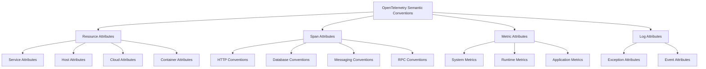
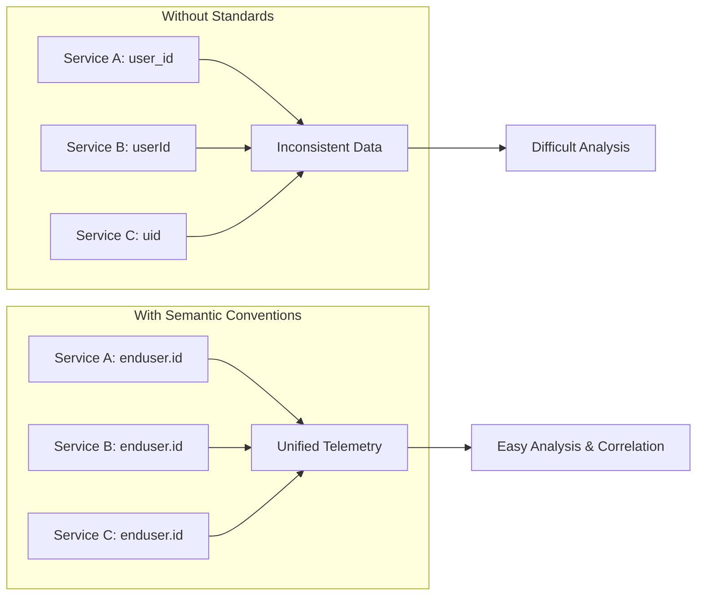
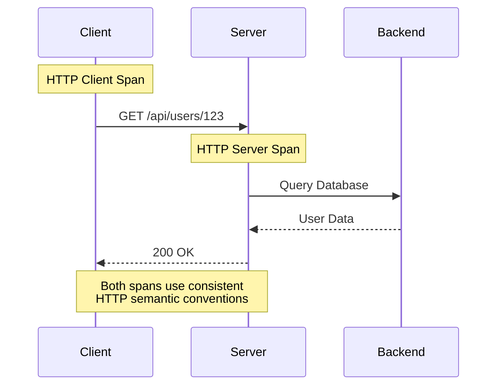
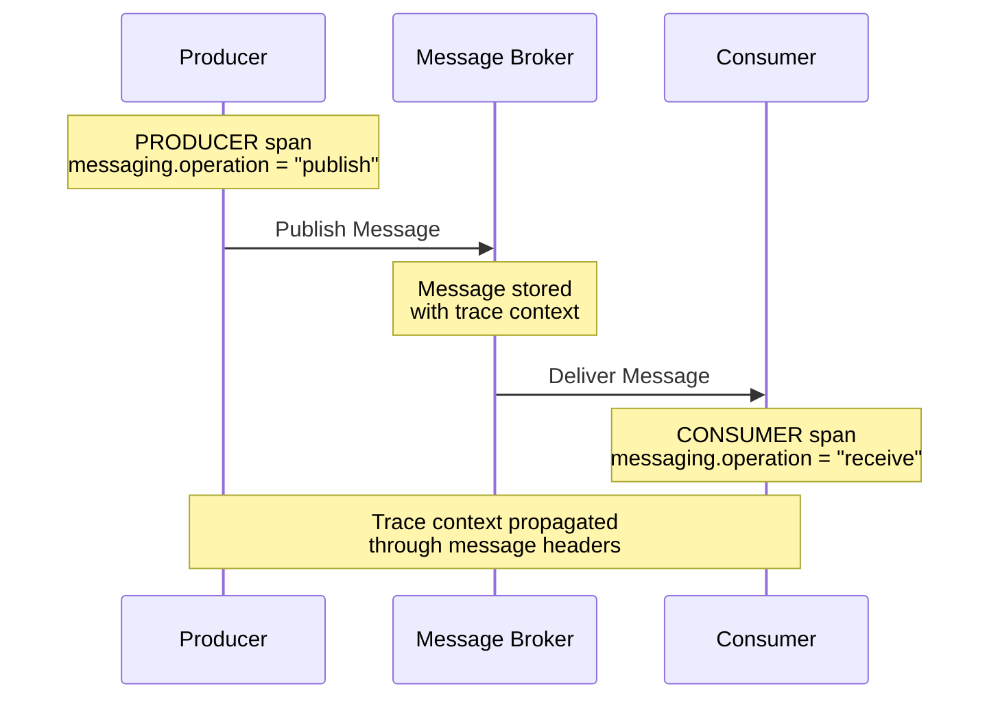

# How to Use OpenTelemetry Semantic Conventions for Standardized Telemetry

Author: [nawazdhandala](https://github.com/nawazdhandala)

Tags: OpenTelemetry, Observability, Standards, Tracing, Metrics, Semantic Conventions

Description: Learn how to apply OpenTelemetry semantic conventions for consistent and interoperable telemetry data.

---

## Introduction

In the world of distributed systems and microservices, observability is crucial for understanding system behavior, debugging issues, and maintaining reliable services. However, when different teams or services use inconsistent naming conventions for telemetry data, it creates chaos in your observability pipeline. OpenTelemetry Semantic Conventions solve this problem by providing a standardized vocabulary for describing telemetry data.

This comprehensive guide will teach you how to leverage OpenTelemetry Semantic Conventions to create consistent, interoperable, and meaningful telemetry data across your entire organization.

## What Are OpenTelemetry Semantic Conventions?

OpenTelemetry Semantic Conventions are a set of standardized attribute names, values, and descriptions for common telemetry concepts. They define how to name and structure attributes for various domains such as HTTP requests, database operations, messaging systems, and more.



## Why Standardization Matters

### Benefits of Using Semantic Conventions

1. **Interoperability**: Different services can produce telemetry that works together seamlessly
2. **Tooling Compatibility**: Observability backends can automatically understand and visualize your data
3. **Reduced Cognitive Load**: Teams use consistent terminology across the organization
4. **Better Correlation**: Traces, metrics, and logs can be correlated using standard attributes
5. **Future-Proofing**: As tooling evolves, standardized data remains compatible



## Core Semantic Convention Categories

### 1. Resource Semantic Conventions

Resource attributes describe the entity producing telemetry. These remain constant throughout the lifetime of the application.

The following Python example demonstrates how to configure resource attributes that identify your service, deployment environment, and runtime version:

```python
# Python example: Configuring resource attributes
from opentelemetry import trace
from opentelemetry.sdk.trace import TracerProvider
from opentelemetry.sdk.resources import Resource
from opentelemetry.semconv.resource import ResourceAttributes

# Create a resource with semantic convention attributes
# These attributes identify your service and its environment
resource = Resource.create({
    # service.name: Logical name of the service (required)
    ResourceAttributes.SERVICE_NAME: "payment-service",

    # service.version: Version of the service (e.g., semver)
    ResourceAttributes.SERVICE_VERSION: "1.2.3",

    # service.namespace: Namespace for the service (e.g., team or product)
    ResourceAttributes.SERVICE_NAMESPACE: "ecommerce",

    # service.instance.id: Unique identifier for this service instance
    ResourceAttributes.SERVICE_INSTANCE_ID: "payment-service-pod-abc123",

    # deployment.environment: Environment where service is deployed
    ResourceAttributes.DEPLOYMENT_ENVIRONMENT: "production",

    # telemetry.sdk.name: Name of the telemetry SDK
    ResourceAttributes.TELEMETRY_SDK_NAME: "opentelemetry",

    # telemetry.sdk.language: Language of the SDK
    ResourceAttributes.TELEMETRY_SDK_LANGUAGE: "python",

    # telemetry.sdk.version: Version of the SDK
    ResourceAttributes.TELEMETRY_SDK_VERSION: "1.20.0",
})

# Initialize the tracer provider with the configured resource
provider = TracerProvider(resource=resource)
trace.set_tracer_provider(provider)
```

The equivalent configuration in Go uses the semconv package to access standardized attribute keys:

```go
// Go example: Configuring resource attributes
package main

import (
    "go.opentelemetry.io/otel"
    "go.opentelemetry.io/otel/sdk/resource"
    "go.opentelemetry.io/otel/sdk/trace"
    semconv "go.opentelemetry.io/otel/semconv/v1.24.0"
)

func initTracer() (*trace.TracerProvider, error) {
    // Create a resource with semantic convention attributes
    // The semconv package provides type-safe attribute constructors
    res, err := resource.Merge(
        resource.Default(),
        resource.NewWithAttributes(
            semconv.SchemaURL,
            // ServiceName identifies your service in the observability backend
            semconv.ServiceName("payment-service"),
            // ServiceVersion helps correlate issues with specific releases
            semconv.ServiceVersion("1.2.3"),
            // ServiceNamespace groups related services together
            semconv.ServiceNamespace("ecommerce"),
            // DeploymentEnvironment distinguishes prod from staging/dev
            semconv.DeploymentEnvironment("production"),
        ),
    )
    if err != nil {
        return nil, err
    }

    // Create tracer provider with the configured resource
    tp := trace.NewTracerProvider(
        trace.WithResource(res),
    )

    otel.SetTracerProvider(tp)
    return tp, nil
}
```

### 2. HTTP Semantic Conventions

HTTP is one of the most common protocols in modern applications. The semantic conventions for HTTP provide standardized attributes for both client and server spans.



The following JavaScript example shows how to properly instrument an HTTP server with all required semantic convention attributes:

```javascript
// JavaScript/Node.js example: HTTP server instrumentation
const { trace } = require('@opentelemetry/api');
const {
    SEMATTRS_HTTP_METHOD,
    SEMATTRS_HTTP_URL,
    SEMATTRS_HTTP_TARGET,
    SEMATTRS_HTTP_HOST,
    SEMATTRS_HTTP_SCHEME,
    SEMATTRS_HTTP_STATUS_CODE,
    SEMATTRS_HTTP_REQUEST_CONTENT_LENGTH,
    SEMATTRS_HTTP_RESPONSE_CONTENT_LENGTH,
    SEMATTRS_HTTP_USER_AGENT,
    SEMATTRS_HTTP_ROUTE,
    SEMATTRS_NET_HOST_NAME,
    SEMATTRS_NET_HOST_PORT,
    SEMATTRS_NET_PEER_IP,
} = require('@opentelemetry/semantic-conventions');

const tracer = trace.getTracer('http-server');

// Middleware function to add OpenTelemetry instrumentation to HTTP requests
function instrumentedHandler(req, res, next) {
    // Create a span for the incoming HTTP request
    // SpanKind.SERVER indicates this is a server-side span
    const span = tracer.startSpan('HTTP Request', {
        kind: trace.SpanKind.SERVER,
        attributes: {
            // http.method: HTTP request method (GET, POST, etc.)
            [SEMATTRS_HTTP_METHOD]: req.method,

            // http.url: Full HTTP request URL
            [SEMATTRS_HTTP_URL]: `${req.protocol}://${req.headers.host}${req.url}`,

            // http.target: The path and query string of the request
            [SEMATTRS_HTTP_TARGET]: req.url,

            // http.host: Value of the HTTP host header
            [SEMATTRS_HTTP_HOST]: req.headers.host,

            // http.scheme: URI scheme (http or https)
            [SEMATTRS_HTTP_SCHEME]: req.protocol,

            // http.route: The matched route template (parameterized)
            // Using the template preserves cardinality while showing the pattern
            [SEMATTRS_HTTP_ROUTE]: req.route?.path || req.path,

            // http.user_agent: Value of the User-Agent header
            [SEMATTRS_HTTP_USER_AGENT]: req.headers['user-agent'],

            // net.host.name: Local hostname or IP
            [SEMATTRS_NET_HOST_NAME]: req.hostname,

            // net.host.port: Local port number
            [SEMATTRS_NET_HOST_PORT]: req.socket.localPort,

            // net.peer.ip: Remote client IP address
            [SEMATTRS_NET_PEER_IP]: req.ip,
        },
    });

    // Capture response details when the response finishes
    res.on('finish', () => {
        // http.status_code: HTTP response status code
        span.setAttribute(SEMATTRS_HTTP_STATUS_CODE, res.statusCode);

        // http.response_content_length: Size of response body
        const contentLength = res.getHeader('content-length');
        if (contentLength) {
            span.setAttribute(SEMATTRS_HTTP_RESPONSE_CONTENT_LENGTH, parseInt(contentLength));
        }

        // Mark span as error if status code indicates failure
        if (res.statusCode >= 400) {
            span.setStatus({ code: trace.SpanStatusCode.ERROR });
        }

        span.end();
    });

    next();
}
```

For HTTP client instrumentation in Python, use similar attributes but with SpanKind.CLIENT:

```python
# Python example: HTTP client instrumentation with semantic conventions
from opentelemetry import trace
from opentelemetry.trace import SpanKind, Status, StatusCode
from opentelemetry.semconv.trace import SpanAttributes
import requests

tracer = trace.get_tracer(__name__)

def make_http_request(method: str, url: str, **kwargs) -> requests.Response:
    """
    Make an HTTP request with OpenTelemetry instrumentation.
    This wrapper adds proper semantic convention attributes to the span.
    """
    # Parse URL components for attribute values
    from urllib.parse import urlparse
    parsed = urlparse(url)

    # Start a CLIENT span for the outgoing HTTP request
    with tracer.start_as_current_span(
        f"HTTP {method}",
        kind=SpanKind.CLIENT,
        attributes={
            # http.method: The HTTP method being used
            SpanAttributes.HTTP_METHOD: method.upper(),

            # http.url: The full URL being requested
            SpanAttributes.HTTP_URL: url,

            # http.scheme: Protocol scheme (http/https)
            SpanAttributes.HTTP_SCHEME: parsed.scheme,

            # net.peer.name: Remote hostname
            SpanAttributes.NET_PEER_NAME: parsed.hostname,

            # net.peer.port: Remote port (default 443 for https, 80 for http)
            SpanAttributes.NET_PEER_PORT: parsed.port or (443 if parsed.scheme == 'https' else 80),
        }
    ) as span:
        try:
            # Make the actual HTTP request
            response = requests.request(method, url, **kwargs)

            # Add response attributes after the request completes
            # http.status_code: The HTTP response status code
            span.set_attribute(SpanAttributes.HTTP_STATUS_CODE, response.status_code)

            # http.response_content_length: Size of response body if available
            if 'content-length' in response.headers:
                span.set_attribute(
                    SpanAttributes.HTTP_RESPONSE_CONTENT_LENGTH,
                    int(response.headers['content-length'])
                )

            # Set span status based on HTTP status code
            if response.status_code >= 400:
                span.set_status(Status(StatusCode.ERROR, f"HTTP {response.status_code}"))

            return response

        except Exception as e:
            # Record exception details on the span
            span.record_exception(e)
            span.set_status(Status(StatusCode.ERROR, str(e)))
            raise
```

### 3. Database Semantic Conventions

Database operations are critical to trace for understanding application performance. Semantic conventions provide consistent attributes across different database types.

The following example demonstrates comprehensive database span instrumentation in Python:

```python
# Python example: Database instrumentation with semantic conventions
from opentelemetry import trace
from opentelemetry.trace import SpanKind
from opentelemetry.semconv.trace import SpanAttributes

tracer = trace.get_tracer(__name__)

class DatabaseClient:
    """
    A database client wrapper that adds OpenTelemetry instrumentation
    following semantic conventions for database operations.
    """

    def __init__(self, host: str, port: int, database: str, user: str):
        self.host = host
        self.port = port
        self.database = database
        self.user = user
        # In real implementation, create actual database connection here
        self.connection = self._create_connection()

    def execute_query(self, query: str, operation: str = "SELECT", table: str = None):
        """
        Execute a database query with proper OpenTelemetry instrumentation.

        Args:
            query: The SQL query to execute
            operation: The database operation (SELECT, INSERT, UPDATE, DELETE)
            table: The target table name
        """
        # Span name should follow pattern: {db.operation} {db.name}.{db.sql.table}
        span_name = f"{operation} {self.database}"
        if table:
            span_name += f".{table}"

        # Start a CLIENT span for the database operation
        with tracer.start_as_current_span(
            span_name,
            kind=SpanKind.CLIENT,
            attributes={
                # db.system: Database management system identifier
                # Examples: postgresql, mysql, mongodb, redis, elasticsearch
                SpanAttributes.DB_SYSTEM: "postgresql",

                # db.name: Name of the database being accessed
                SpanAttributes.DB_NAME: self.database,

                # db.user: Username for database access
                SpanAttributes.DB_USER: self.user,

                # db.operation: The type of operation (SELECT, INSERT, etc.)
                SpanAttributes.DB_OPERATION: operation,

                # db.statement: The database statement being executed
                # CAUTION: May contain sensitive data - consider sanitization
                SpanAttributes.DB_STATEMENT: query,

                # net.peer.name: Hostname of the database server
                SpanAttributes.NET_PEER_NAME: self.host,

                # net.peer.port: Port number of the database server
                SpanAttributes.NET_PEER_PORT: self.port,

                # net.transport: Transport protocol (tcp, udp, unix, etc.)
                SpanAttributes.NET_TRANSPORT: "ip_tcp",
            }
        ) as span:
            # Add table-specific attributes if provided
            if table:
                # db.sql.table: The primary table being operated on
                span.set_attribute(SpanAttributes.DB_SQL_TABLE, table)

            try:
                # Execute the actual database query
                result = self._execute(query)

                # Optionally record row count for applicable operations
                if hasattr(result, 'rowcount'):
                    span.set_attribute("db.rows_affected", result.rowcount)

                return result

            except Exception as e:
                # Record the exception on the span
                span.record_exception(e)
                span.set_status(trace.Status(trace.StatusCode.ERROR, str(e)))
                raise

    def _create_connection(self):
        # Placeholder for actual connection logic
        pass

    def _execute(self, query):
        # Placeholder for actual query execution
        pass
```

Here's an equivalent example in Java using the OpenTelemetry Java SDK:

```java
// Java example: Database instrumentation with semantic conventions
import io.opentelemetry.api.OpenTelemetry;
import io.opentelemetry.api.trace.Span;
import io.opentelemetry.api.trace.SpanKind;
import io.opentelemetry.api.trace.StatusCode;
import io.opentelemetry.api.trace.Tracer;
import io.opentelemetry.semconv.trace.attributes.SemanticAttributes;

public class InstrumentedDatabaseClient {

    private final Tracer tracer;
    private final String host;
    private final int port;
    private final String database;
    private final String user;

    public InstrumentedDatabaseClient(OpenTelemetry openTelemetry,
                                       String host, int port,
                                       String database, String user) {
        // Create a tracer with the name of the instrumentation library
        this.tracer = openTelemetry.getTracer("database-client", "1.0.0");
        this.host = host;
        this.port = port;
        this.database = database;
        this.user = user;
    }

    /**
     * Execute a database query with OpenTelemetry instrumentation.
     * Follows semantic conventions for database client spans.
     */
    public ResultSet executeQuery(String sql, String operation, String table) {
        // Build span name following convention: {operation} {database}.{table}
        String spanName = String.format("%s %s.%s", operation, database, table);

        // Start a new CLIENT span for the database operation
        Span span = tracer.spanBuilder(spanName)
            .setSpanKind(SpanKind.CLIENT)
            // db.system: The database management system product
            .setAttribute(SemanticAttributes.DB_SYSTEM, "mysql")
            // db.name: The name of the database being accessed
            .setAttribute(SemanticAttributes.DB_NAME, database)
            // db.user: The username for database access
            .setAttribute(SemanticAttributes.DB_USER, user)
            // db.operation: The database operation type
            .setAttribute(SemanticAttributes.DB_OPERATION, operation)
            // db.statement: The SQL statement (sanitize sensitive data!)
            .setAttribute(SemanticAttributes.DB_STATEMENT, sql)
            // db.sql.table: The primary table for the operation
            .setAttribute(SemanticAttributes.DB_SQL_TABLE, table)
            // net.peer.name: Database server hostname
            .setAttribute(SemanticAttributes.NET_PEER_NAME, host)
            // net.peer.port: Database server port
            .setAttribute(SemanticAttributes.NET_PEER_PORT, port)
            .startSpan();

        try {
            // Execute the actual database operation
            ResultSet result = this.doExecute(sql);

            // Record the number of rows returned/affected
            span.setAttribute("db.rows_affected", result.getRowCount());

            return result;

        } catch (Exception e) {
            // Record exception details on the span
            span.recordException(e);
            span.setStatus(StatusCode.ERROR, e.getMessage());
            throw e;

        } finally {
            // Always end the span
            span.end();
        }
    }

    private ResultSet doExecute(String sql) {
        // Placeholder for actual execution logic
        return null;
    }
}
```

### 4. Messaging Semantic Conventions

Messaging systems like Kafka, RabbitMQ, and AWS SQS require specific attributes to properly trace message flows across distributed systems.



The following Python example shows how to instrument a message producer:

```python
# Python example: Message producer instrumentation
from opentelemetry import trace
from opentelemetry.trace import SpanKind
from opentelemetry.semconv.trace import SpanAttributes
from opentelemetry.propagate import inject

tracer = trace.get_tracer(__name__)

class MessageProducer:
    """
    A message producer with OpenTelemetry instrumentation
    following messaging semantic conventions.
    """

    def __init__(self, broker_host: str, broker_port: int):
        self.broker_host = broker_host
        self.broker_port = broker_port

    def publish(self, destination: str, message: bytes,
                message_id: str = None, correlation_id: str = None):
        """
        Publish a message with proper tracing instrumentation.

        Args:
            destination: The queue or topic name
            message: The message payload
            message_id: Unique identifier for this message
            correlation_id: ID to correlate with related messages
        """
        # Span name convention for messaging: {destination} {operation}
        span_name = f"{destination} publish"

        with tracer.start_as_current_span(
            span_name,
            kind=SpanKind.PRODUCER,  # PRODUCER for message send operations
            attributes={
                # messaging.system: The messaging system identifier
                # Examples: kafka, rabbitmq, activemq, aws_sqs, azure_servicebus
                SpanAttributes.MESSAGING_SYSTEM: "kafka",

                # messaging.destination: Queue or topic name
                SpanAttributes.MESSAGING_DESTINATION: destination,

                # messaging.destination_kind: Type of destination
                # Values: "queue" or "topic"
                SpanAttributes.MESSAGING_DESTINATION_KIND: "topic",

                # messaging.operation: The messaging operation type
                # Values: "publish", "receive", "process"
                SpanAttributes.MESSAGING_OPERATION: "publish",

                # messaging.protocol: The messaging protocol
                SpanAttributes.MESSAGING_PROTOCOL: "kafka",

                # messaging.protocol_version: Protocol version if applicable
                SpanAttributes.MESSAGING_PROTOCOL_VERSION: "3.0",

                # net.peer.name: Broker hostname
                SpanAttributes.NET_PEER_NAME: self.broker_host,

                # net.peer.port: Broker port
                SpanAttributes.NET_PEER_PORT: self.broker_port,

                # messaging.message_payload_size_bytes: Size of message body
                SpanAttributes.MESSAGING_MESSAGE_PAYLOAD_SIZE_BYTES: len(message),
            }
        ) as span:
            # Add message-specific attributes if provided
            if message_id:
                # messaging.message_id: Unique ID for this message
                span.set_attribute(SpanAttributes.MESSAGING_MESSAGE_ID, message_id)

            if correlation_id:
                # messaging.conversation_id: ID to correlate related messages
                span.set_attribute(SpanAttributes.MESSAGING_CONVERSATION_ID, correlation_id)

            # Prepare message headers for context propagation
            # This allows the consumer to continue the same trace
            headers = {}
            inject(headers)

            try:
                # Publish the message with trace context in headers
                self._do_publish(destination, message, headers)

                # Optionally record the partition and offset after successful publish
                # span.set_attribute("messaging.kafka.partition", partition)
                # span.set_attribute("messaging.kafka.offset", offset)

            except Exception as e:
                span.record_exception(e)
                span.set_status(trace.Status(trace.StatusCode.ERROR, str(e)))
                raise

    def _do_publish(self, destination, message, headers):
        # Placeholder for actual publish logic
        pass
```

And the corresponding consumer instrumentation:

```python
# Python example: Message consumer instrumentation
from opentelemetry import trace
from opentelemetry.trace import SpanKind
from opentelemetry.semconv.trace import SpanAttributes
from opentelemetry.propagate import extract

tracer = trace.get_tracer(__name__)

class MessageConsumer:
    """
    A message consumer with OpenTelemetry instrumentation
    that properly links to producer spans via context propagation.
    """

    def consume(self, destination: str, message: bytes, headers: dict):
        """
        Process a received message with proper tracing instrumentation.

        Args:
            destination: The queue or topic the message was received from
            message: The message payload
            headers: Message headers containing trace context
        """
        # Extract trace context from message headers
        # This links the consumer span to the producer span
        ctx = extract(headers)

        # Span name convention: {destination} {operation}
        span_name = f"{destination} receive"

        with tracer.start_as_current_span(
            span_name,
            context=ctx,  # Link to the producer's trace context
            kind=SpanKind.CONSUMER,  # CONSUMER for message receive operations
            attributes={
                # messaging.system: The messaging system identifier
                SpanAttributes.MESSAGING_SYSTEM: "kafka",

                # messaging.destination: Queue or topic name
                SpanAttributes.MESSAGING_DESTINATION: destination,

                # messaging.destination_kind: Type of destination
                SpanAttributes.MESSAGING_DESTINATION_KIND: "topic",

                # messaging.operation: Operation type
                # "receive" for getting the message
                SpanAttributes.MESSAGING_OPERATION: "receive",

                # messaging.message_payload_size_bytes: Size of message body
                SpanAttributes.MESSAGING_MESSAGE_PAYLOAD_SIZE_BYTES: len(message),
            }
        ) as span:
            try:
                # Process the message
                # Create a child span for the actual processing logic
                with tracer.start_as_current_span(
                    f"{destination} process",
                    kind=SpanKind.INTERNAL,
                    attributes={
                        SpanAttributes.MESSAGING_OPERATION: "process",
                    }
                ):
                    self._process_message(message)

            except Exception as e:
                span.record_exception(e)
                span.set_status(trace.Status(trace.StatusCode.ERROR, str(e)))
                raise

    def _process_message(self, message):
        # Placeholder for actual message processing logic
        pass
```

### 5. RPC Semantic Conventions

For RPC frameworks like gRPC, semantic conventions ensure consistent tracing across service boundaries.

This Go example demonstrates proper gRPC client instrumentation:

```go
// Go example: gRPC client instrumentation with semantic conventions
package main

import (
    "context"

    "go.opentelemetry.io/otel"
    "go.opentelemetry.io/otel/attribute"
    "go.opentelemetry.io/otel/codes"
    "go.opentelemetry.io/otel/trace"
    semconv "go.opentelemetry.io/otel/semconv/v1.24.0"
    "google.golang.org/grpc"
    "google.golang.org/grpc/status"
)

// InstrumentedGRPCClient wraps a gRPC client with OpenTelemetry instrumentation
type InstrumentedGRPCClient struct {
    tracer trace.Tracer
    conn   *grpc.ClientConn
}

// NewInstrumentedGRPCClient creates a new instrumented gRPC client
func NewInstrumentedGRPCClient(conn *grpc.ClientConn) *InstrumentedGRPCClient {
    return &InstrumentedGRPCClient{
        tracer: otel.Tracer("grpc-client"),
        conn:   conn,
    }
}

// CallService makes an instrumented gRPC call following semantic conventions
func (c *InstrumentedGRPCClient) CallService(
    ctx context.Context,
    service string,
    method string,
    req interface{},
    resp interface{},
) error {
    // Span name for gRPC follows pattern: {package}.{service}/{method}
    spanName := service + "/" + method

    // Start a CLIENT span for the outgoing RPC call
    ctx, span := c.tracer.Start(ctx, spanName,
        trace.WithSpanKind(trace.SpanKindClient),
        trace.WithAttributes(
            // rpc.system: The RPC system being used
            semconv.RPCSystemGRPC,

            // rpc.service: The full name of the service being called
            semconv.RPCService(service),

            // rpc.method: The name of the method being called
            semconv.RPCMethod(method),

            // net.peer.name: Remote hostname
            semconv.NetPeerName("grpc-server.example.com"),

            // net.peer.port: Remote port
            semconv.NetPeerPort(50051),

            // net.transport: Transport protocol
            semconv.NetTransportTCP,
        ),
    )
    defer span.End()

    // Make the actual gRPC call
    err := c.conn.Invoke(ctx, "/"+service+"/"+method, req, resp)

    if err != nil {
        // Extract gRPC status code from error
        st, ok := status.FromError(err)
        if ok {
            // rpc.grpc.status_code: The gRPC status code
            span.SetAttributes(semconv.RPCGRPCStatusCodeKey.Int(int(st.Code())))
        }

        // Record error details
        span.RecordError(err)
        span.SetStatus(codes.Error, err.Error())
        return err
    }

    // Record successful status
    span.SetAttributes(semconv.RPCGRPCStatusCodeKey.Int(0)) // OK

    return nil
}
```

### 6. Exception Semantic Conventions

Properly recording exceptions ensures consistent error tracking across your telemetry.

The following example shows how to record exceptions with all relevant semantic convention attributes:

```python
# Python example: Recording exceptions with semantic conventions
from opentelemetry import trace
from opentelemetry.semconv.trace import SpanAttributes
import traceback

tracer = trace.get_tracer(__name__)

def process_with_exception_handling():
    """
    Demonstrates proper exception recording following semantic conventions.
    """
    with tracer.start_as_current_span("process_data") as span:
        try:
            # Simulate some processing that might fail
            result = perform_risky_operation()
            return result

        except Exception as e:
            # Record the exception using semantic conventions
            # This automatically sets several standard attributes:
            # - exception.type: The fully qualified exception class name
            # - exception.message: The exception message
            # - exception.stacktrace: The full stack trace
            span.record_exception(
                e,
                attributes={
                    # exception.escaped: Whether the exception escaped the span
                    # True means the exception propagated outside the span scope
                    SpanAttributes.EXCEPTION_ESCAPED: True,
                }
            )

            # Also manually add context about what was happening
            span.set_attribute("error.context", "Failed during data processing")

            # Set span status to error
            span.set_status(trace.Status(
                trace.StatusCode.ERROR,
                description=str(e)
            ))

            raise


def record_exception_manually(span, exception):
    """
    Shows all semantic convention attributes for exceptions.
    Use span.record_exception() in practice - this is for illustration.
    """
    span.add_event(
        "exception",
        attributes={
            # exception.type: Full qualified class name of exception
            SpanAttributes.EXCEPTION_TYPE: type(exception).__module__ + "." + type(exception).__name__,

            # exception.message: The exception message/description
            SpanAttributes.EXCEPTION_MESSAGE: str(exception),

            # exception.stacktrace: Full stack trace as a string
            SpanAttributes.EXCEPTION_STACKTRACE: traceback.format_exc(),

            # exception.escaped: Did the exception escape the span's scope?
            SpanAttributes.EXCEPTION_ESCAPED: False,
        }
    )
```

## Using Semantic Convention Packages

Each OpenTelemetry language SDK provides packages with pre-defined semantic convention constants. Here's how to use them in different languages:

### Python

Install and use the semantic conventions package in Python:

```python
# Python: Installing and using semantic conventions

# Install via pip:
# pip install opentelemetry-semantic-conventions

# Import semantic convention constants
from opentelemetry.semconv.resource import ResourceAttributes
from opentelemetry.semconv.trace import SpanAttributes

# Resource attributes for service identification
print(ResourceAttributes.SERVICE_NAME)        # "service.name"
print(ResourceAttributes.SERVICE_VERSION)     # "service.version"
print(ResourceAttributes.DEPLOYMENT_ENVIRONMENT)  # "deployment.environment"

# HTTP span attributes
print(SpanAttributes.HTTP_METHOD)             # "http.method"
print(SpanAttributes.HTTP_STATUS_CODE)        # "http.status_code"
print(SpanAttributes.HTTP_URL)                # "http.url"

# Database span attributes
print(SpanAttributes.DB_SYSTEM)               # "db.system"
print(SpanAttributes.DB_STATEMENT)            # "db.statement"

# Using in practice - always use constants, never string literals
span.set_attribute(SpanAttributes.HTTP_METHOD, "GET")  # Correct
span.set_attribute("http.method", "GET")               # Avoid - error-prone
```

### JavaScript/TypeScript

Install and use semantic conventions in Node.js:

```javascript
// JavaScript: Installing and using semantic conventions

// Install via npm:
// npm install @opentelemetry/semantic-conventions

// Import semantic convention constants
const {
    SemanticAttributes,
    SemanticResourceAttributes,
    DbSystemValues,
    HttpFlavorValues,
} = require('@opentelemetry/semantic-conventions');

// Using resource attributes
console.log(SemanticResourceAttributes.SERVICE_NAME);     // "service.name"
console.log(SemanticResourceAttributes.SERVICE_VERSION);  // "service.version"

// Using span attributes
console.log(SemanticAttributes.HTTP_METHOD);              // "http.method"
console.log(SemanticAttributes.DB_SYSTEM);                // "db.system"

// Using enumerated values for consistency
console.log(DbSystemValues.POSTGRESQL);  // "postgresql"
console.log(DbSystemValues.MYSQL);       // "mysql"
console.log(DbSystemValues.MONGODB);     // "mongodb"

// Practical usage example
const span = tracer.startSpan('database-query', {
    attributes: {
        // Use constants for attribute keys
        [SemanticAttributes.DB_SYSTEM]: DbSystemValues.POSTGRESQL,
        [SemanticAttributes.DB_NAME]: 'users_db',
        [SemanticAttributes.DB_OPERATION]: 'SELECT',
    }
});
```

### Go

Use semantic conventions in Go:

```go
// Go: Using semantic conventions

// Import the semconv package (version-specific)
import (
    semconv "go.opentelemetry.io/otel/semconv/v1.24.0"
)

// The semconv package provides attribute constructors
// These return attribute.KeyValue pairs for type safety

func exampleUsage() {
    // Resource attributes - use constructors for type safety
    serviceAttrs := []attribute.KeyValue{
        semconv.ServiceName("my-service"),
        semconv.ServiceVersion("1.0.0"),
        semconv.DeploymentEnvironment("production"),
    }

    // HTTP attributes
    httpAttrs := []attribute.KeyValue{
        semconv.HTTPMethod("GET"),
        semconv.HTTPStatusCode(200),
        semconv.HTTPRoute("/api/users/{id}"),
        semconv.HTTPTarget("/api/users/123"),
    }

    // Database attributes
    dbAttrs := []attribute.KeyValue{
        semconv.DBSystemPostgreSQL,  // Pre-defined constant for PostgreSQL
        semconv.DBName("mydb"),
        semconv.DBOperation("SELECT"),
        semconv.DBStatement("SELECT * FROM users WHERE id = $1"),
    }

    // Create a span with attributes
    ctx, span := tracer.Start(ctx, "handle-request",
        trace.WithAttributes(httpAttrs...),
    )
    defer span.End()
}
```

### Java

Use semantic conventions in Java:

```java
// Java: Using semantic conventions

// Add dependency in pom.xml:
// <dependency>
//     <groupId>io.opentelemetry</groupId>
//     <artifactId>opentelemetry-semconv</artifactId>
//     <version>1.24.0-alpha</version>
// </dependency>

import io.opentelemetry.semconv.resource.attributes.ResourceAttributes;
import io.opentelemetry.semconv.trace.attributes.SemanticAttributes;

public class SemanticConventionsExample {

    public void demonstrateUsage() {
        // Resource attributes
        System.out.println(ResourceAttributes.SERVICE_NAME);        // AttributeKey<String>
        System.out.println(ResourceAttributes.SERVICE_VERSION);     // AttributeKey<String>

        // Span attributes
        System.out.println(SemanticAttributes.HTTP_METHOD);         // AttributeKey<String>
        System.out.println(SemanticAttributes.HTTP_STATUS_CODE);    // AttributeKey<Long>
        System.out.println(SemanticAttributes.DB_SYSTEM);           // AttributeKey<String>

        // Enumerated values for db.system
        System.out.println(SemanticAttributes.DbSystemValues.POSTGRESQL);
        System.out.println(SemanticAttributes.DbSystemValues.MYSQL);

        // Using in span creation
        Span span = tracer.spanBuilder("database-operation")
            .setAttribute(SemanticAttributes.DB_SYSTEM,
                         SemanticAttributes.DbSystemValues.POSTGRESQL)
            .setAttribute(SemanticAttributes.DB_NAME, "users")
            .setAttribute(SemanticAttributes.DB_OPERATION, "SELECT")
            .startSpan();
    }
}
```

## Metrics Semantic Conventions

Semantic conventions also apply to metrics, ensuring consistent naming across your metric instrumentation.

This example shows how to create metrics following semantic conventions:

```python
# Python example: Metrics with semantic conventions
from opentelemetry import metrics
from opentelemetry.sdk.metrics import MeterProvider
from opentelemetry.semconv.metrics import MetricInstruments

# Initialize meter provider
metrics.set_meter_provider(MeterProvider())
meter = metrics.get_meter(__name__)

# HTTP server metrics following semantic conventions
# These metric names are standardized for HTTP servers

# http.server.request.duration: Duration of HTTP server requests
# Unit: seconds (s)
http_server_duration = meter.create_histogram(
    name="http.server.request.duration",
    description="Duration of HTTP server requests",
    unit="s",
)

# http.server.active_requests: Number of active HTTP server requests
http_active_requests = meter.create_up_down_counter(
    name="http.server.active_requests",
    description="Number of active HTTP server requests",
    unit="{request}",
)

# http.server.request.size: Size of HTTP server request bodies
http_request_size = meter.create_histogram(
    name="http.server.request.size",
    description="Size of HTTP server request bodies",
    unit="By",  # Bytes
)

# http.server.response.size: Size of HTTP server response bodies
http_response_size = meter.create_histogram(
    name="http.server.response.size",
    description="Size of HTTP server response bodies",
    unit="By",
)


def record_http_request_metrics(method: str, route: str, status_code: int,
                                 duration: float, request_size: int,
                                 response_size: int):
    """
    Record HTTP server metrics following semantic conventions.
    """
    # Common attributes for all HTTP metrics
    attributes = {
        "http.request.method": method,
        "http.route": route,
        "http.response.status_code": status_code,
        # Include status code category for easier aggregation
        "http.response.status_code_class": f"{status_code // 100}xx",
    }

    # Record the request duration
    http_server_duration.record(duration, attributes)

    # Record request and response sizes
    http_request_size.record(request_size, attributes)
    http_response_size.record(response_size, attributes)


# Database client metrics
# db.client.connections.usage: Number of connections in the pool
db_connection_usage = meter.create_up_down_counter(
    name="db.client.connections.usage",
    description="Number of connections that are currently in a specific state",
    unit="{connection}",
)

# db.client.connections.max: Maximum number of connections in the pool
db_connection_max = meter.create_up_down_counter(
    name="db.client.connections.max",
    description="Maximum number of connections configured in the pool",
    unit="{connection}",
)


def record_db_pool_metrics(pool_name: str, state: str, count: int):
    """
    Record database connection pool metrics.

    Args:
        pool_name: Name of the connection pool
        state: Connection state (idle, used)
        count: Number of connections in this state
    """
    attributes = {
        "db.client.connections.pool.name": pool_name,
        "db.client.connections.state": state,  # "idle" or "used"
    }

    db_connection_usage.add(count, attributes)
```

## Best Practices for Semantic Conventions

### 1. Use Constants, Not String Literals

Always use the semantic convention constants provided by the SDK:

```python
# Python: Best practice for using semantic conventions

from opentelemetry.semconv.trace import SpanAttributes

# GOOD: Use semantic convention constants
# Benefits: Type checking, IDE autocomplete, refactoring safety
span.set_attribute(SpanAttributes.HTTP_METHOD, "GET")
span.set_attribute(SpanAttributes.HTTP_STATUS_CODE, 200)
span.set_attribute(SpanAttributes.DB_SYSTEM, "postgresql")

# BAD: String literals are error-prone
# Problems: Typos, inconsistency, no IDE support
span.set_attribute("http.method", "GET")     # Could mistype as "http.methods"
span.set_attribute("http.status", 200)       # Wrong attribute name!
span.set_attribute("database.type", "pg")    # Non-standard naming
```

### 2. Follow Naming Conventions

Semantic conventions follow specific naming patterns:

```python
# Attribute naming patterns in OpenTelemetry

# Namespace hierarchy with dots
# Format: {namespace}.{object}.{attribute}

# Examples:
# http.request.method      - HTTP request method
# http.response.status_code - HTTP response status code
# db.system                - Database system type
# db.statement             - Database query statement
# messaging.system         - Messaging system type
# messaging.destination    - Message destination (queue/topic)
# rpc.system               - RPC system type
# rpc.method               - RPC method name

# Boolean attributes end with a verb or adjective
# http.request.has_body    - Does request have a body?
# net.sock.peer.verified   - Is peer certificate verified?

# Size/count attributes include unit in name
# http.request.body.size   - Size in bytes
# messaging.message.payload_size_bytes

# Duration attributes specify unit
# http.request.duration_ms - Duration in milliseconds
```

### 3. Handle Sensitive Data

Be careful with attributes that might contain sensitive information:

```python
# Python: Handling sensitive data in telemetry

from opentelemetry import trace
from opentelemetry.semconv.trace import SpanAttributes
import re

tracer = trace.get_tracer(__name__)

def sanitize_sql(sql: str) -> str:
    """
    Sanitize SQL statements to remove sensitive data.
    Replace literal values with placeholders.
    """
    # Replace string literals
    sql = re.sub(r"'[^']*'", "'?'", sql)
    # Replace numeric literals
    sql = re.sub(r"\b\d+\b", "?", sql)
    return sql


def sanitize_url(url: str) -> str:
    """
    Remove sensitive query parameters from URLs.
    """
    sensitive_params = ['token', 'password', 'api_key', 'secret', 'auth']
    for param in sensitive_params:
        url = re.sub(f'{param}=[^&]*', f'{param}=REDACTED', url, flags=re.IGNORECASE)
    return url


def instrumented_db_query(sql: str, params: tuple):
    """
    Execute a database query with sanitized SQL in telemetry.
    """
    with tracer.start_as_current_span("db.query") as span:
        # GOOD: Sanitize SQL before recording
        span.set_attribute(SpanAttributes.DB_STATEMENT, sanitize_sql(sql))

        # BAD: Never log raw SQL with user data
        # span.set_attribute(SpanAttributes.DB_STATEMENT, sql)

        # Execute query...


def instrumented_http_request(url: str):
    """
    Make HTTP request with sanitized URL in telemetry.
    """
    with tracer.start_as_current_span("http.request") as span:
        # GOOD: Sanitize URL before recording
        span.set_attribute(SpanAttributes.HTTP_URL, sanitize_url(url))

        # Don't record Authorization headers
        # span.set_attribute("http.request.header.authorization", auth_header)  # BAD!
```

### 4. Use Appropriate Cardinality

Avoid high-cardinality attributes that can cause metrics explosion:

```python
# Python: Managing attribute cardinality

from opentelemetry import trace
from opentelemetry.semconv.trace import SpanAttributes

tracer = trace.get_tracer(__name__)

def handle_request(user_id: str, request_id: str, path: str):
    """
    Demonstrates good vs bad cardinality choices for attributes.
    """
    with tracer.start_as_current_span("handle_request") as span:
        # GOOD: Low cardinality - use parameterized route
        # This groups all /users/123, /users/456, etc. together
        span.set_attribute(SpanAttributes.HTTP_ROUTE, "/users/{id}")

        # BAD: High cardinality - unique per request
        # This creates a new metric time series for each request!
        # span.set_attribute(SpanAttributes.HTTP_TARGET, f"/users/{user_id}")

        # GOOD: User ID as a separate, optional attribute
        # Can be sampled or excluded from metrics if needed
        span.set_attribute("enduser.id", user_id)

        # BAD: Request ID in attributes creates infinite cardinality
        # This will cause metrics storage to explode
        # span.set_attribute("request.id", request_id)

        # GOOD: Use span context for unique identifiers
        # Request ID is already captured in trace_id/span_id
        # span.get_span_context().trace_id  # Already unique per request
```

### 5. Version Your Schema

Always specify the schema URL for forward compatibility:

```go
// Go: Specifying schema URL for version compatibility
package main

import (
    "go.opentelemetry.io/otel/sdk/resource"
    semconv "go.opentelemetry.io/otel/semconv/v1.24.0"
)

func createResource() *resource.Resource {
    // Always include the schema URL when creating resources
    // This allows backends to understand which version of
    // semantic conventions your telemetry uses
    res, _ := resource.New(
        context.Background(),
        resource.WithSchemaURL(semconv.SchemaURL),  // Include schema version
        resource.WithAttributes(
            semconv.ServiceName("my-service"),
            semconv.ServiceVersion("1.0.0"),
        ),
    )
    return res
}
```

## Migrating to Newer Semantic Conventions

Semantic conventions evolve over time. Here's how to handle migrations:

```python
# Python: Handling semantic convention migrations

from opentelemetry import trace
from opentelemetry.semconv.trace import SpanAttributes

# Some attribute names have changed between versions
# For example, in HTTP semantic conventions:
# Old: http.method, http.status_code
# New: http.request.method, http.response.status_code

# Strategy 1: Use the SDK's migration support
# The SDK may automatically emit both old and new attributes
# Check your SDK version's documentation

# Strategy 2: Emit both old and new attributes during migration
class MigrationHelper:
    """
    Helper class for semantic convention migrations.
    Emits both old and new attribute names during transition period.
    """

    @staticmethod
    def set_http_method(span, method: str):
        """Set HTTP method with backward compatibility."""
        # New convention (v1.21+)
        span.set_attribute("http.request.method", method)
        # Old convention (deprecated but still widely used)
        span.set_attribute(SpanAttributes.HTTP_METHOD, method)

    @staticmethod
    def set_http_status_code(span, status_code: int):
        """Set HTTP status code with backward compatibility."""
        # New convention
        span.set_attribute("http.response.status_code", status_code)
        # Old convention
        span.set_attribute(SpanAttributes.HTTP_STATUS_CODE, status_code)


# Strategy 3: Use feature flags for migration
import os

SEMCONV_VERSION = os.getenv("OTEL_SEMCONV_VERSION", "v1.24")

def set_http_attributes(span, method: str, status_code: int):
    """
    Set HTTP attributes based on configured semantic convention version.
    """
    if SEMCONV_VERSION >= "v1.21":
        span.set_attribute("http.request.method", method)
        span.set_attribute("http.response.status_code", status_code)
    else:
        span.set_attribute("http.method", method)
        span.set_attribute("http.status_code", status_code)
```

## Conclusion

OpenTelemetry Semantic Conventions are essential for creating consistent, interoperable telemetry across your distributed systems. By following these conventions, you ensure that:

1. **All services speak the same language** - Whether instrumenting HTTP, databases, or messaging, standardized attributes make data universally understandable
2. **Observability tools work out of the box** - Backends can automatically parse and visualize your data without custom configuration
3. **Teams collaborate effectively** - Consistent naming reduces confusion and accelerates debugging
4. **Your telemetry is future-proof** - Following standards ensures compatibility with evolving tooling

Key takeaways:

- Always use semantic convention constants from your SDK, never string literals
- Apply conventions consistently across HTTP, database, messaging, and RPC instrumentation
- Be mindful of sensitive data and attribute cardinality
- Include schema URLs for version compatibility
- Plan for semantic convention migrations as standards evolve

By investing in proper semantic conventions from the start, you build a solid foundation for observability that scales with your organization.

## Additional Resources

- [OpenTelemetry Semantic Conventions Specification](https://opentelemetry.io/docs/specs/semconv/)
- [HTTP Semantic Conventions](https://opentelemetry.io/docs/specs/semconv/http/)
- [Database Semantic Conventions](https://opentelemetry.io/docs/specs/semconv/database/)
- [Messaging Semantic Conventions](https://opentelemetry.io/docs/specs/semconv/messaging/)
- [Python Semantic Conventions Package](https://pypi.org/project/opentelemetry-semantic-conventions/)
- [JavaScript Semantic Conventions Package](https://www.npmjs.com/package/@opentelemetry/semantic-conventions)
- [Go Semantic Conventions Package](https://pkg.go.dev/go.opentelemetry.io/otel/semconv)
