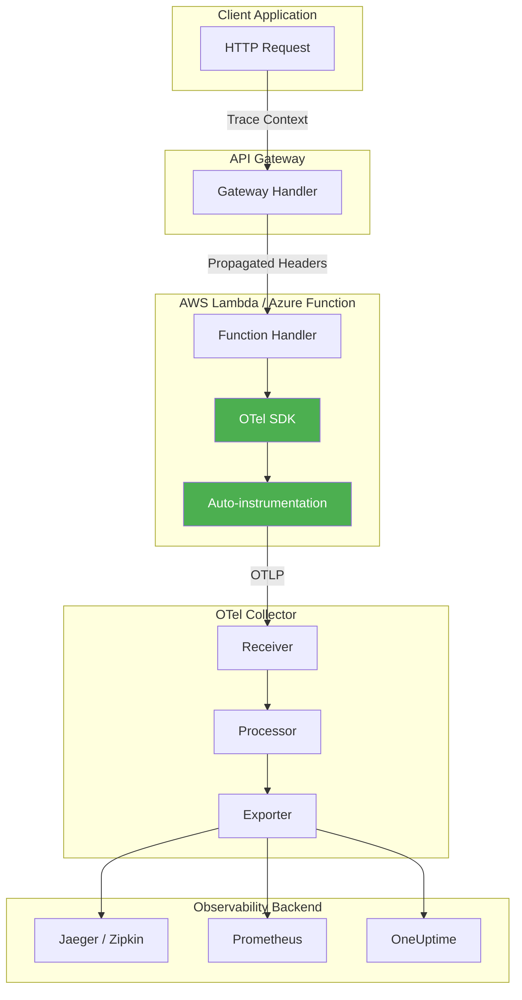
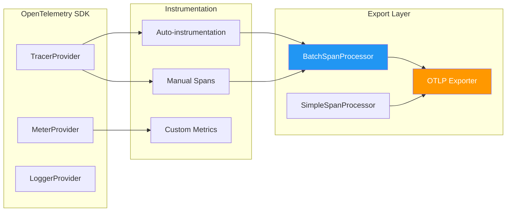
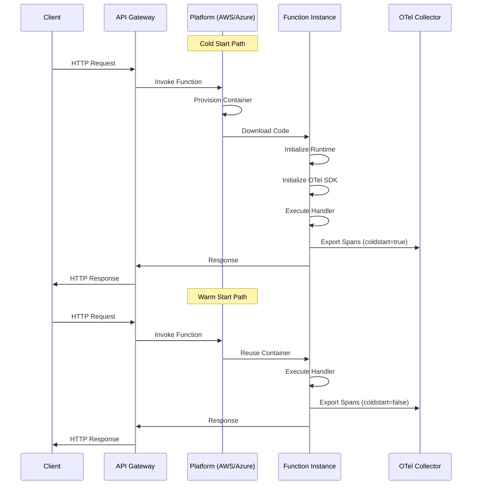
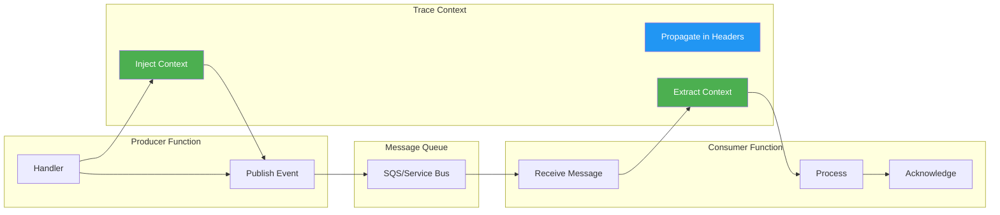

# How to Instrument Serverless Functions with OpenTelemetry (AWS Lambda, Azure Functions)

Author: [nawazdhandala](https://github.com/nawazdhandala)

Tags: OpenTelemetry, Observability, Serverless, AWS Lambda, Azure Functions, Tracing

Description: A complete guide to adding OpenTelemetry instrumentation to serverless functions for observability.

---

Serverless computing has revolutionized how we build and deploy applications, offering automatic scaling, reduced operational overhead, and pay-per-use pricing. However, the ephemeral and distributed nature of serverless functions introduces unique observability challenges. Understanding what happens inside your functions, tracking cold starts, and tracing requests across multiple services requires specialized instrumentation.

OpenTelemetry (OTel) provides a vendor-neutral, open-source solution for collecting telemetry data from serverless functions. In this comprehensive guide, we will explore how to instrument AWS Lambda and Azure Functions with OpenTelemetry, enabling deep visibility into your serverless applications.

## Table of Contents

1. [Understanding Serverless Observability Challenges](#understanding-serverless-observability-challenges)
2. [OpenTelemetry Architecture for Serverless](#opentelemetry-architecture-for-serverless)
3. [AWS Lambda Instrumentation](#aws-lambda-instrumentation)
4. [Azure Functions Instrumentation](#azure-functions-instrumentation)
5. [Cold Start Tracking](#cold-start-tracking)
6. [Best Practices for Serverless Observability](#best-practices-for-serverless-observability)
7. [Advanced Patterns](#advanced-patterns)

## Understanding Serverless Observability Challenges

Serverless functions present unique observability challenges that differ from traditional applications:

- **Short-lived execution**: Functions may run for milliseconds to minutes, requiring efficient instrumentation
- **Cold starts**: Initial invocations incur latency from container provisioning
- **Distributed context**: Traces must propagate across function invocations and services
- **Limited resources**: Memory and CPU constraints affect instrumentation overhead
- **Asynchronous patterns**: Event-driven architectures require careful trace correlation

The following diagram illustrates the flow of telemetry data in a serverless environment:



## OpenTelemetry Architecture for Serverless

Before diving into implementation, let's understand the key components of OpenTelemetry in serverless environments:



### Key Considerations for Serverless

1. **Use Simple Span Processor**: Unlike batch processing, simple processors export spans immediately, crucial for short-lived functions
2. **Minimize cold start impact**: Initialize the SDK outside the handler when possible
3. **Handle function lifecycle**: Ensure all spans are exported before the function terminates

## AWS Lambda Instrumentation

AWS Lambda supports OpenTelemetry through Lambda Layers, which provide pre-packaged instrumentation that can be added to your functions without code changes.

### Method 1: Using AWS-Managed OpenTelemetry Layer

AWS provides a managed OpenTelemetry Lambda layer that includes auto-instrumentation for common frameworks.

The following configuration adds the AWS-managed OpenTelemetry layer to your Lambda function. The layer ARN varies by region - replace `us-east-1` with your target region.

```yaml
# serverless.yml - Serverless Framework configuration
service: otel-instrumented-lambda

provider:
  name: aws
  runtime: nodejs18.x
  region: us-east-1

  # Environment variables configure the OpenTelemetry SDK behavior
  environment:
    # Enable the wrapper script that initializes OTel before your handler
    AWS_LAMBDA_EXEC_WRAPPER: /opt/otel-handler
    # Set your service name for identification in traces
    OTEL_SERVICE_NAME: ${self:service}
    # Configure the OTLP exporter endpoint (collector sidecar or remote)
    OTEL_EXPORTER_OTLP_ENDPOINT: http://localhost:4317
    # Set log level for debugging instrumentation issues
    OTEL_LOG_LEVEL: info

functions:
  api:
    handler: src/handler.main
    # Attach the OpenTelemetry Lambda layer
    layers:
      # AWS-managed ADOT (AWS Distro for OpenTelemetry) layer
      - arn:aws:lambda:us-east-1:901920570463:layer:aws-otel-nodejs-amd64-ver-1-18-1:1
    events:
      - http:
          path: /api
          method: get
```

### Method 2: Manual Instrumentation with Custom Layer

For more control over instrumentation, you can create a custom OpenTelemetry setup. This approach allows fine-grained configuration and custom span attributes.

First, install the required dependencies. These packages provide the core SDK, Node.js-specific instrumentation, and export capabilities.

```bash
# Install OpenTelemetry core packages
npm install @opentelemetry/api @opentelemetry/sdk-node

# Install Lambda-specific instrumentation
npm install @opentelemetry/instrumentation-aws-lambda

# Install auto-instrumentation for common libraries (HTTP, database clients, etc.)
npm install @opentelemetry/auto-instrumentations-node

# Install the OTLP exporter for sending data to collectors
npm install @opentelemetry/exporter-trace-otlp-grpc

# Install resource detectors for AWS environment metadata
npm install @opentelemetry/resource-detector-aws
```

Create a tracing configuration file that initializes OpenTelemetry before your handler executes. This file should be loaded at the top of your Lambda function.

```javascript
// src/tracing.js - OpenTelemetry initialization for AWS Lambda

const { NodeSDK } = require('@opentelemetry/sdk-node');
const { getNodeAutoInstrumentations } = require('@opentelemetry/auto-instrumentations-node');
const { OTLPTraceExporter } = require('@opentelemetry/exporter-trace-otlp-grpc');
const { awsLambdaDetector } = require('@opentelemetry/resource-detector-aws');
const { Resource } = require('@opentelemetry/resources');
const { SemanticResourceAttributes } = require('@opentelemetry/semantic-conventions');
const { AwsLambdaInstrumentation } = require('@opentelemetry/instrumentation-aws-lambda');
const { SimpleSpanProcessor } = require('@opentelemetry/sdk-trace-base');

// Track whether this is a cold start (first invocation in this container)
// This variable persists across warm invocations
let isColdStart = true;

// Create the OTLP exporter configured to send traces to the collector
// The endpoint can be a local collector sidecar or remote collector
const traceExporter = new OTLPTraceExporter({
  url: process.env.OTEL_EXPORTER_OTLP_ENDPOINT || 'http://localhost:4317',
});

// Initialize the OpenTelemetry SDK with serverless-optimized configuration
const sdk = new NodeSDK({
  // Define resource attributes that identify this service
  resource: new Resource({
    [SemanticResourceAttributes.SERVICE_NAME]: process.env.OTEL_SERVICE_NAME || 'lambda-function',
    [SemanticResourceAttributes.SERVICE_VERSION]: process.env.SERVICE_VERSION || '1.0.0',
    // Custom attribute to track cold starts at the resource level
    'faas.coldstart': isColdStart,
  }),

  // Use SimpleSpanProcessor for immediate export - critical for Lambda
  // BatchSpanProcessor may not flush before the function freezes
  spanProcessor: new SimpleSpanProcessor(traceExporter),

  // Configure auto-instrumentation for common libraries
  instrumentations: [
    // AWS Lambda-specific instrumentation captures invocation details
    new AwsLambdaInstrumentation({
      // Add the event source information to spans
      requestHook: (span, { event, context }) => {
        // Record cold start status on each invocation span
        span.setAttribute('faas.coldstart', isColdStart);
        // Add Lambda-specific context attributes
        span.setAttribute('faas.execution', context.awsRequestId);
        span.setAttribute('cloud.account.id', context.invokedFunctionArn.split(':')[4]);

        // After first invocation, mark subsequent calls as warm starts
        if (isColdStart) {
          isColdStart = false;
        }
      },
      // Capture response details for debugging
      responseHook: (span, { response }) => {
        if (response && response.statusCode) {
          span.setAttribute('http.status_code', response.statusCode);
        }
      },
    }),

    // Auto-instrument common Node.js libraries
    getNodeAutoInstrumentations({
      // Disable file system instrumentation to reduce noise
      '@opentelemetry/instrumentation-fs': { enabled: false },
      // Configure HTTP instrumentation
      '@opentelemetry/instrumentation-http': {
        // Ignore health check endpoints to reduce trace volume
        ignoreIncomingRequestHook: (request) => {
          return request.url === '/health' || request.url === '/ready';
        },
      },
    }),
  ],

  // Automatically detect AWS Lambda resource attributes
  resourceDetectors: [awsLambdaDetector],
});

// Start the SDK - this must complete before processing requests
sdk.start();

// Ensure graceful shutdown when the Lambda execution environment terminates
// This flushes any pending spans before the container is destroyed
process.on('SIGTERM', async () => {
  try {
    await sdk.shutdown();
    console.log('OpenTelemetry SDK shut down successfully');
  } catch (error) {
    console.error('Error shutting down OpenTelemetry SDK:', error);
  } finally {
    process.exit(0);
  }
});

module.exports = { sdk };
```

Now create your Lambda handler with custom span creation for business logic tracing.

```javascript
// src/handler.js - AWS Lambda handler with OpenTelemetry instrumentation

// IMPORTANT: Import tracing first to ensure SDK initializes before handler
require('./tracing');

const { trace, SpanStatusCode, context } = require('@opentelemetry/api');

// Get a tracer instance for creating custom spans
// The tracer name should match your service/module name
const tracer = trace.getTracer('lambda-handler', '1.0.0');

// Main Lambda handler function
// The AwsLambdaInstrumentation automatically wraps this with a parent span
exports.main = async (event, lambdaContext) => {
  // Create a custom span for business logic
  // This becomes a child of the auto-created Lambda invocation span
  return tracer.startActiveSpan('processRequest', async (span) => {
    try {
      // Add relevant attributes to help with debugging and analysis
      span.setAttribute('request.path', event.path || '/');
      span.setAttribute('request.method', event.httpMethod || 'GET');

      // Extract user information if available (be careful with PII)
      if (event.requestContext && event.requestContext.identity) {
        span.setAttribute('user.ip', event.requestContext.identity.sourceIp);
      }

      // Process the request with traced database operations
      const result = await processBusinessLogic(event);

      // Record success status
      span.setStatus({ code: SpanStatusCode.OK });

      return {
        statusCode: 200,
        headers: {
          'Content-Type': 'application/json',
          // Propagate trace context in response headers for client correlation
          'X-Trace-Id': span.spanContext().traceId,
        },
        body: JSON.stringify(result),
      };
    } catch (error) {
      // Record error details in the span for debugging
      span.setStatus({
        code: SpanStatusCode.ERROR,
        message: error.message,
      });

      // Record the exception with stack trace
      span.recordException(error);

      // Add error-specific attributes
      span.setAttribute('error.type', error.name);

      return {
        statusCode: 500,
        body: JSON.stringify({ error: 'Internal server error' }),
      };
    } finally {
      // Always end the span to ensure it's exported
      span.end();
    }
  });
};

// Example business logic function with nested spans
async function processBusinessLogic(event) {
  // Create a child span for database operations
  return tracer.startActiveSpan('database.query', async (dbSpan) => {
    try {
      // Add database-specific attributes following semantic conventions
      dbSpan.setAttribute('db.system', 'dynamodb');
      dbSpan.setAttribute('db.operation', 'GetItem');
      dbSpan.setAttribute('db.name', 'users-table');

      // Simulate database operation
      const startTime = Date.now();
      const result = await simulateDatabaseQuery(event.queryStringParameters);

      // Record query duration as an event
      dbSpan.addEvent('query.completed', {
        'query.duration_ms': Date.now() - startTime,
        'query.result_count': result.items?.length || 0,
      });

      return result;
    } finally {
      dbSpan.end();
    }
  });
}

// Simulated database query (replace with actual DynamoDB/database calls)
async function simulateDatabaseQuery(params) {
  await new Promise(resolve => setTimeout(resolve, 50));
  return { items: [{ id: 1, name: 'Example' }] };
}
```

### Using AWS Lambda with Collector Extension

For production deployments, use the OpenTelemetry Collector as a Lambda extension. This decouples your function from the export destination and provides buffering.

The following CloudFormation template deploys a Lambda function with the OTel Collector extension.

```yaml
# cloudformation-template.yaml - Lambda with OTel Collector extension

AWSTemplateFormatVersion: '2010-09-09'
Description: Lambda function with OpenTelemetry instrumentation

Parameters:
  OtelCollectorEndpoint:
    Type: String
    Description: Endpoint for the OpenTelemetry collector
    Default: https://otel-collector.example.com:4317

Resources:
  # IAM role allowing Lambda to execute and write logs
  LambdaExecutionRole:
    Type: AWS::IAM::Role
    Properties:
      RoleName: otel-lambda-execution-role
      AssumeRolePolicyDocument:
        Version: '2012-10-17'
        Statement:
          - Effect: Allow
            Principal:
              Service: lambda.amazonaws.com
            Action: sts:AssumeRole
      ManagedPolicyArns:
        - arn:aws:iam::aws:policy/service-role/AWSLambdaBasicExecutionRole
      Policies:
        # Additional policy for X-Ray if using AWS X-Ray as backend
        - PolicyName: XRayAccess
          PolicyDocument:
            Version: '2012-10-17'
            Statement:
              - Effect: Allow
                Action:
                  - xray:PutTraceSegments
                  - xray:PutTelemetryRecords
                Resource: '*'

  # Lambda function with OpenTelemetry instrumentation
  InstrumentedFunction:
    Type: AWS::Lambda::Function
    Properties:
      FunctionName: otel-instrumented-function
      Runtime: nodejs18.x
      Handler: index.handler
      Role: !GetAtt LambdaExecutionRole.Arn
      Timeout: 30
      MemorySize: 256

      # Attach both the OTel SDK layer and Collector extension
      Layers:
        # OpenTelemetry Node.js SDK layer
        - arn:aws:lambda:us-east-1:901920570463:layer:aws-otel-nodejs-amd64-ver-1-18-1:1
        # OpenTelemetry Collector extension layer
        - arn:aws:lambda:us-east-1:901920570463:layer:aws-otel-collector-amd64-ver-0-88-0:1

      Environment:
        Variables:
          # Enable the OTel wrapper
          AWS_LAMBDA_EXEC_WRAPPER: /opt/otel-handler
          # Service identification
          OTEL_SERVICE_NAME: my-lambda-service
          # Configure propagators for distributed tracing
          OTEL_PROPAGATORS: tracecontext,baggage,xray
          # Point SDK to the local collector extension
          OTEL_EXPORTER_OTLP_ENDPOINT: http://localhost:4317
          # Configure collector to forward to your backend
          OPENTELEMETRY_COLLECTOR_CONFIG_FILE: /var/task/collector.yaml

      Code:
        ZipFile: |
          // Inline handler for demonstration
          exports.handler = async (event) => {
            return { statusCode: 200, body: 'Hello from Lambda!' };
          };

Outputs:
  FunctionArn:
    Description: ARN of the instrumented Lambda function
    Value: !GetAtt InstrumentedFunction.Arn
```

Create a collector configuration file to include in your deployment package.

```yaml
# collector.yaml - OpenTelemetry Collector configuration for Lambda extension

# Receivers define how data enters the collector
receivers:
  # OTLP receiver accepts data from the Lambda function's SDK
  otlp:
    protocols:
      grpc:
        endpoint: localhost:4317
      http:
        endpoint: localhost:4318

# Processors transform and enrich telemetry data
processors:
  # Batch processor groups spans for efficient export
  # Use small batch sizes for Lambda due to short execution times
  batch:
    timeout: 1s
    send_batch_size: 50
    send_batch_max_size: 100

  # Add resource attributes to all telemetry
  resource:
    attributes:
      - key: deployment.environment
        value: production
        action: upsert
      - key: cloud.provider
        value: aws
        action: upsert

# Exporters define where telemetry data is sent
exporters:
  # OTLP exporter sends to your observability backend
  otlp:
    endpoint: ${OTEL_COLLECTOR_ENDPOINT}
    headers:
      # Add authentication header if required
      Authorization: Bearer ${OTEL_AUTH_TOKEN}
    tls:
      insecure: false

  # Debug exporter for troubleshooting (disable in production)
  logging:
    loglevel: debug

# Extensions provide additional capabilities
extensions:
  # Health check endpoint for monitoring
  health_check:
    endpoint: localhost:13133

# Service section ties everything together
service:
  extensions: [health_check]
  pipelines:
    # Traces pipeline
    traces:
      receivers: [otlp]
      processors: [resource, batch]
      exporters: [otlp]

    # Metrics pipeline
    metrics:
      receivers: [otlp]
      processors: [resource, batch]
      exporters: [otlp]
```

## Azure Functions Instrumentation

Azure Functions supports OpenTelemetry through the Azure Monitor OpenTelemetry Distro and custom instrumentation. Let's explore both approaches.

### Method 1: Using Azure Monitor OpenTelemetry Distro

Azure provides an official OpenTelemetry distribution that integrates with Application Insights.

Install the required packages for Azure Functions with OpenTelemetry support.

```bash
# Install Azure Functions extensions and OpenTelemetry distro
npm install @azure/functions
npm install @azure/monitor-opentelemetry
npm install @opentelemetry/api

# Install additional instrumentation packages
npm install @opentelemetry/instrumentation-http
npm install @opentelemetry/instrumentation-express
```

Configure OpenTelemetry in your Azure Functions startup file. This file runs once when the function app starts.

```javascript
// src/startup.js - Azure Functions OpenTelemetry initialization

const { useAzureMonitor } = require('@azure/monitor-opentelemetry');
const { trace } = require('@opentelemetry/api');

// Track cold start status across invocations
let isColdStart = true;

// Configure Azure Monitor OpenTelemetry
// This sets up automatic instrumentation and export to Application Insights
useAzureMonitor({
  // Connection string from Azure Application Insights resource
  // Store this in Azure Key Vault or app settings, not in code
  azureMonitorExporterOptions: {
    connectionString: process.env.APPLICATIONINSIGHTS_CONNECTION_STRING,
  },

  // Configure sampling to manage telemetry volume
  samplingRatio: 1.0, // 100% sampling - adjust for high-volume functions

  // Enable specific instrumentations
  instrumentationOptions: {
    // Capture incoming HTTP requests
    http: { enabled: true },
    // Capture Azure SDK calls (Blob, Queue, etc.)
    azureSdk: { enabled: true },
    // Capture MongoDB operations
    mongoDb: { enabled: true },
    // Capture MySQL operations
    mySql: { enabled: true },
    // Capture PostgreSQL operations
    postgreSql: { enabled: true },
    // Capture Redis operations
    redis: { enabled: true },
  },

  // Add custom resource attributes
  resource: {
    'service.name': process.env.WEBSITE_SITE_NAME || 'azure-function',
    'service.version': process.env.SERVICE_VERSION || '1.0.0',
    'deployment.environment': process.env.AZURE_FUNCTIONS_ENVIRONMENT || 'production',
  },
});

// Export cold start tracker for use in function handlers
module.exports = {
  getColdStartStatus: () => {
    const wasColStart = isColdStart;
    isColdStart = false;
    return wasColStart;
  },
};
```

Create an Azure Function with custom tracing using the HTTP trigger pattern.

```javascript
// src/functions/httpTrigger.js - Azure Function with OpenTelemetry

const { app } = require('@azure/functions');
const { trace, SpanStatusCode, context } = require('@opentelemetry/api');
const { getColdStartStatus } = require('../startup');

// Get a tracer instance for this function
const tracer = trace.getTracer('azure-function-handler', '1.0.0');

// Register the HTTP trigger function
app.http('processOrder', {
  methods: ['POST'],
  authLevel: 'function',
  route: 'orders',

  // The handler function with OpenTelemetry instrumentation
  handler: async (request, invocationContext) => {
    // Check if this is a cold start invocation
    const coldStart = getColdStartStatus();

    // Create a span for the entire request processing
    return tracer.startActiveSpan('processOrder', async (span) => {
      try {
        // Record cold start status and function metadata
        span.setAttribute('faas.coldstart', coldStart);
        span.setAttribute('faas.name', invocationContext.functionName);
        span.setAttribute('faas.execution', invocationContext.invocationId);

        // Parse and validate request body
        const orderData = await parseRequestBody(request, span);

        // Process the order with traced sub-operations
        const result = await processOrder(orderData, span);

        // Set success status
        span.setStatus({ code: SpanStatusCode.OK });

        return {
          status: 200,
          jsonBody: {
            success: true,
            orderId: result.orderId,
            traceId: span.spanContext().traceId,
          },
        };

      } catch (error) {
        // Record error details
        span.setStatus({
          code: SpanStatusCode.ERROR,
          message: error.message,
        });
        span.recordException(error);

        invocationContext.error('Error processing order:', error);

        return {
          status: error.statusCode || 500,
          jsonBody: {
            success: false,
            error: error.message,
          },
        };
      } finally {
        span.end();
      }
    });
  },
});

// Parse request body with validation span
async function parseRequestBody(request, parentSpan) {
  return tracer.startActiveSpan('parseRequest', { parent: parentSpan }, async (span) => {
    try {
      const body = await request.json();

      // Validate required fields
      if (!body.items || !Array.isArray(body.items)) {
        const error = new Error('Invalid order: items array required');
        error.statusCode = 400;
        throw error;
      }

      span.setAttribute('order.item_count', body.items.length);
      span.setAttribute('order.customer_id', body.customerId || 'anonymous');

      return body;
    } finally {
      span.end();
    }
  });
}

// Process order with database and external service calls
async function processOrder(orderData, parentSpan) {
  return tracer.startActiveSpan('processOrder.execute', async (span) => {
    try {
      // Calculate order total
      const total = orderData.items.reduce((sum, item) => {
        return sum + (item.price * item.quantity);
      }, 0);

      span.setAttribute('order.total', total);
      span.setAttribute('order.currency', orderData.currency || 'USD');

      // Save to database (traced automatically by Azure SDK instrumentation)
      const orderId = await saveOrderToDatabase(orderData, total);

      // Send confirmation (traced automatically)
      await sendOrderConfirmation(orderId, orderData);

      span.addEvent('order.completed', {
        'order.id': orderId,
        'order.total': total,
      });

      return { orderId, total };
    } finally {
      span.end();
    }
  });
}

// Simulated database operation
async function saveOrderToDatabase(orderData, total) {
  await new Promise(resolve => setTimeout(resolve, 100));
  return `ORD-${Date.now()}`;
}

// Simulated notification
async function sendOrderConfirmation(orderId, orderData) {
  await new Promise(resolve => setTimeout(resolve, 50));
}
```

### Method 2: Custom OpenTelemetry Setup for Azure Functions

For more control or when not using Azure Monitor, you can configure OpenTelemetry manually.

```javascript
// src/otel-config.js - Custom OpenTelemetry configuration for Azure Functions

const { NodeSDK } = require('@opentelemetry/sdk-node');
const { getNodeAutoInstrumentations } = require('@opentelemetry/auto-instrumentations-node');
const { OTLPTraceExporter } = require('@opentelemetry/exporter-trace-otlp-http');
const { OTLPMetricExporter } = require('@opentelemetry/exporter-metrics-otlp-http');
const { Resource } = require('@opentelemetry/resources');
const { SemanticResourceAttributes } = require('@opentelemetry/semantic-conventions');
const { SimpleSpanProcessor, BatchSpanProcessor } = require('@opentelemetry/sdk-trace-base');
const { PeriodicExportingMetricReader } = require('@opentelemetry/sdk-metrics');

// Determine if running in consumption plan (short-lived) or premium/dedicated
const isConsumptionPlan = process.env.WEBSITE_SKU === 'Dynamic';

// Create trace exporter pointing to your collector
const traceExporter = new OTLPTraceExporter({
  url: process.env.OTEL_EXPORTER_OTLP_TRACES_ENDPOINT || 'http://localhost:4318/v1/traces',
  headers: {
    // Add any required authentication headers
    'Authorization': `Bearer ${process.env.OTEL_AUTH_TOKEN}`,
  },
});

// Create metrics exporter
const metricExporter = new OTLPMetricExporter({
  url: process.env.OTEL_EXPORTER_OTLP_METRICS_ENDPOINT || 'http://localhost:4318/v1/metrics',
});

// Configure the SDK with Azure Functions optimizations
const sdk = new NodeSDK({
  // Resource attributes identify this service in your observability platform
  resource: new Resource({
    [SemanticResourceAttributes.SERVICE_NAME]: process.env.WEBSITE_SITE_NAME || 'azure-function',
    [SemanticResourceAttributes.SERVICE_VERSION]: process.env.SERVICE_VERSION || '1.0.0',
    [SemanticResourceAttributes.SERVICE_INSTANCE_ID]: process.env.WEBSITE_INSTANCE_ID,
    [SemanticResourceAttributes.CLOUD_PROVIDER]: 'azure',
    [SemanticResourceAttributes.CLOUD_PLATFORM]: 'azure_functions',
    [SemanticResourceAttributes.CLOUD_REGION]: process.env.REGION_NAME,
    // Custom attribute for function app name
    'faas.name': process.env.WEBSITE_SITE_NAME,
  }),

  // Use SimpleSpanProcessor for consumption plan, BatchSpanProcessor for premium
  // Consumption plan functions may terminate before batch export
  spanProcessor: isConsumptionPlan
    ? new SimpleSpanProcessor(traceExporter)
    : new BatchSpanProcessor(traceExporter, {
        maxQueueSize: 100,
        maxExportBatchSize: 50,
        scheduledDelayMillis: 5000,
      }),

  // Configure metric reader with appropriate interval
  metricReader: new PeriodicExportingMetricReader({
    exporter: metricExporter,
    exportIntervalMillis: isConsumptionPlan ? 10000 : 30000,
  }),

  // Configure auto-instrumentation
  instrumentations: [
    getNodeAutoInstrumentations({
      // Disable noisy instrumentations
      '@opentelemetry/instrumentation-fs': { enabled: false },
      '@opentelemetry/instrumentation-dns': { enabled: false },
      // Configure HTTP instrumentation
      '@opentelemetry/instrumentation-http': {
        requestHook: (span, request) => {
          // Add Azure-specific headers to spans
          if (request.headers && request.headers['x-ms-request-id']) {
            span.setAttribute('azure.request_id', request.headers['x-ms-request-id']);
          }
        },
      },
    }),
  ],
});

// Start the SDK
sdk.start();

// Handle graceful shutdown
const shutdown = async () => {
  try {
    await sdk.shutdown();
    console.log('OpenTelemetry SDK shut down successfully');
  } catch (error) {
    console.error('Error during OpenTelemetry shutdown:', error);
  }
};

// Azure Functions sends SIGTERM before scaling down or updating
process.on('SIGTERM', shutdown);
process.on('SIGINT', shutdown);

module.exports = { sdk };
```

### Azure Functions with Service Bus Trigger

Here's an example of instrumenting an Azure Function triggered by Service Bus messages, showing context propagation from message headers.

```javascript
// src/functions/serviceBusTrigger.js - Service Bus triggered function with tracing

const { app } = require('@azure/functions');
const { trace, context, propagation, SpanStatusCode, SpanKind } = require('@opentelemetry/api');

// Import the OTel configuration
require('../otel-config');

const tracer = trace.getTracer('servicebus-processor', '1.0.0');

// Cold start tracking
let coldStart = true;

// Register the Service Bus trigger
app.serviceBusQueue('processMessage', {
  queueName: 'orders-queue',
  connection: 'ServiceBusConnection',

  handler: async (message, invocationContext) => {
    // Extract trace context from message properties for distributed tracing
    // This links this function's span to the producer's trace
    const parentContext = extractContextFromMessage(message);

    // Create a consumer span with the extracted parent context
    return context.with(parentContext, async () => {
      return tracer.startActiveSpan('process.servicebus.message', {
        kind: SpanKind.CONSUMER,
        attributes: {
          // Service Bus semantic conventions
          'messaging.system': 'azure_servicebus',
          'messaging.destination': 'orders-queue',
          'messaging.destination_kind': 'queue',
          'messaging.message_id': message.messageId,
          'messaging.operation': 'process',
          // Cold start tracking
          'faas.coldstart': coldStart,
          'faas.execution': invocationContext.invocationId,
        },
      }, async (span) => {
        // Mark subsequent invocations as warm
        if (coldStart) coldStart = false;

        try {
          // Parse and validate the message
          const orderData = typeof message === 'string' ? JSON.parse(message) : message;

          span.setAttribute('order.id', orderData.orderId);
          span.setAttribute('order.type', orderData.type);

          // Process the order based on type
          switch (orderData.type) {
            case 'new':
              await processNewOrder(orderData, span);
              break;
            case 'update':
              await processOrderUpdate(orderData, span);
              break;
            case 'cancel':
              await processOrderCancellation(orderData, span);
              break;
            default:
              throw new Error(`Unknown order type: ${orderData.type}`);
          }

          span.setStatus({ code: SpanStatusCode.OK });
          invocationContext.log(`Successfully processed order ${orderData.orderId}`);

        } catch (error) {
          span.setStatus({
            code: SpanStatusCode.ERROR,
            message: error.message,
          });
          span.recordException(error);

          // Add error details for debugging
          span.setAttribute('error.type', error.name);
          span.setAttribute('error.message', error.message);

          invocationContext.error(`Failed to process message: ${error.message}`);

          // Rethrow to trigger dead-letter queue
          throw error;
        } finally {
          span.end();
        }
      });
    });
  },
});

// Extract W3C Trace Context from Service Bus message application properties
function extractContextFromMessage(message) {
  // Service Bus stores trace context in applicationProperties
  const carrier = message.applicationProperties || {};

  // Use the W3C trace context propagator to extract parent context
  return propagation.extract(context.active(), carrier);
}

// Process new order with nested spans
async function processNewOrder(orderData, parentSpan) {
  return tracer.startActiveSpan('order.create', async (span) => {
    try {
      span.setAttribute('order.item_count', orderData.items?.length || 0);

      // Validate inventory
      await tracer.startActiveSpan('inventory.check', async (inventorySpan) => {
        try {
          await checkInventory(orderData.items);
          inventorySpan.setAttribute('inventory.available', true);
        } finally {
          inventorySpan.end();
        }
      });

      // Process payment
      await tracer.startActiveSpan('payment.process', async (paymentSpan) => {
        try {
          const paymentResult = await processPayment(orderData);
          paymentSpan.setAttribute('payment.status', paymentResult.status);
          paymentSpan.setAttribute('payment.provider', 'stripe');
        } finally {
          paymentSpan.end();
        }
      });

      span.addEvent('order.created', { 'order.id': orderData.orderId });

    } finally {
      span.end();
    }
  });
}

// Simulated operations
async function checkInventory(items) {
  await new Promise(resolve => setTimeout(resolve, 50));
}

async function processPayment(orderData) {
  await new Promise(resolve => setTimeout(resolve, 100));
  return { status: 'completed' };
}

async function processOrderUpdate(orderData, span) {
  span.addEvent('order.updated');
  await new Promise(resolve => setTimeout(resolve, 75));
}

async function processOrderCancellation(orderData, span) {
  span.addEvent('order.cancelled');
  await new Promise(resolve => setTimeout(resolve, 50));
}
```

## Cold Start Tracking

Cold starts are a critical performance metric for serverless functions. Let's implement comprehensive cold start tracking.

The following diagram shows how cold starts affect the request lifecycle:



### Advanced Cold Start Metrics

Create a dedicated module for tracking cold start metrics and initialization timing.

```javascript
// src/cold-start-tracker.js - Comprehensive cold start tracking

const { trace, metrics } = require('@opentelemetry/api');

// Get meter for recording metrics
const meter = metrics.getMeter('cold-start-metrics', '1.0.0');

// Track cold start state at module level (persists across invocations)
let isColdStart = true;
let initializationStartTime = Date.now();
let initializationDuration = 0;

// Create metrics for cold start monitoring
const coldStartCounter = meter.createCounter('faas.cold_starts', {
  description: 'Number of cold start invocations',
  unit: '1',
});

const warmStartCounter = meter.createCounter('faas.warm_starts', {
  description: 'Number of warm start invocations',
  unit: '1',
});

const initDurationHistogram = meter.createHistogram('faas.init_duration', {
  description: 'Function initialization duration in milliseconds',
  unit: 'ms',
});

const invocationDurationHistogram = meter.createHistogram('faas.invocation_duration', {
  description: 'Function invocation duration in milliseconds',
  unit: 'ms',
});

// Mark initialization as complete
// Call this after all module-level initialization is done
function markInitializationComplete() {
  initializationDuration = Date.now() - initializationStartTime;

  // Record initialization duration metric
  initDurationHistogram.record(initializationDuration, {
    'faas.name': process.env.AWS_LAMBDA_FUNCTION_NAME || process.env.WEBSITE_SITE_NAME,
    'cloud.provider': process.env.AWS_LAMBDA_FUNCTION_NAME ? 'aws' : 'azure',
  });
}

// Get cold start status and record metrics
// Call this at the beginning of each invocation
function trackInvocation(additionalAttributes = {}) {
  const wasColdStart = isColdStart;
  const tracer = trace.getTracer('cold-start-tracker');

  // Base attributes for metrics
  const attributes = {
    'faas.name': process.env.AWS_LAMBDA_FUNCTION_NAME || process.env.WEBSITE_SITE_NAME,
    'cloud.provider': process.env.AWS_LAMBDA_FUNCTION_NAME ? 'aws' : 'azure',
    ...additionalAttributes,
  };

  if (wasColdStart) {
    // Record cold start metric
    coldStartCounter.add(1, attributes);

    // Create a span for the cold start initialization
    const span = tracer.startSpan('faas.cold_start_init', {
      startTime: initializationStartTime,
    });

    span.setAttribute('faas.coldstart', true);
    span.setAttribute('faas.init_duration_ms', initializationDuration);
    span.end(initializationStartTime + initializationDuration);

    // Mark subsequent invocations as warm
    isColdStart = false;
  } else {
    // Record warm start metric
    warmStartCounter.add(1, attributes);
  }

  return {
    isColdStart: wasColdStart,
    initializationDuration: wasColdStart ? initializationDuration : 0,
  };
}

// Create a wrapper for tracking invocation duration
function createInvocationTracker() {
  const startTime = Date.now();

  return {
    // Call this when the invocation completes
    complete: (success = true, additionalAttributes = {}) => {
      const duration = Date.now() - startTime;

      invocationDurationHistogram.record(duration, {
        'faas.name': process.env.AWS_LAMBDA_FUNCTION_NAME || process.env.WEBSITE_SITE_NAME,
        'faas.invocation.success': success,
        ...additionalAttributes,
      });

      return duration;
    },
  };
}

module.exports = {
  markInitializationComplete,
  trackInvocation,
  createInvocationTracker,
};
```

Integrate cold start tracking into your Lambda handler.

```javascript
// src/handler-with-cold-start.js - Lambda handler with cold start tracking

// IMPORTANT: Initialize tracing first
require('./tracing');

const { trace, SpanStatusCode } = require('@opentelemetry/api');
const {
  markInitializationComplete,
  trackInvocation,
  createInvocationTracker
} = require('./cold-start-tracker');

// Mark module initialization complete after all imports
markInitializationComplete();

const tracer = trace.getTracer('lambda-handler', '1.0.0');

exports.handler = async (event, context) => {
  // Track this invocation and get cold start status
  const { isColdStart, initializationDuration } = trackInvocation({
    'faas.trigger': event.httpMethod ? 'http' : 'other',
    'aws.region': process.env.AWS_REGION,
  });

  // Create invocation duration tracker
  const invocationTracker = createInvocationTracker();

  return tracer.startActiveSpan('handler', async (span) => {
    // Add cold start information to the span
    span.setAttribute('faas.coldstart', isColdStart);

    if (isColdStart) {
      // Record initialization details for cold starts
      span.setAttribute('faas.init_duration_ms', initializationDuration);
      span.addEvent('cold_start', {
        'init_duration_ms': initializationDuration,
        'memory_limit_mb': context.memoryLimitInMB,
        'runtime_deadline': new Date(context.getRemainingTimeInMillis() + Date.now()).toISOString(),
      });
    }

    try {
      // Add Lambda context information
      span.setAttribute('faas.execution', context.awsRequestId);
      span.setAttribute('faas.memory_limit', context.memoryLimitInMB);
      span.setAttribute('faas.max_duration_ms', context.getRemainingTimeInMillis());

      // Process the request
      const result = await processRequest(event);

      span.setStatus({ code: SpanStatusCode.OK });

      // Track successful invocation
      invocationTracker.complete(true, { 'http.status_code': 200 });

      return {
        statusCode: 200,
        body: JSON.stringify(result),
      };

    } catch (error) {
      span.setStatus({ code: SpanStatusCode.ERROR, message: error.message });
      span.recordException(error);

      // Track failed invocation
      invocationTracker.complete(false, {
        'http.status_code': 500,
        'error.type': error.name,
      });

      return {
        statusCode: 500,
        body: JSON.stringify({ error: error.message }),
      };
    } finally {
      span.end();
    }
  });
};

async function processRequest(event) {
  // Your business logic here
  return { message: 'Success', timestamp: new Date().toISOString() };
}
```

## Best Practices for Serverless Observability

### 1. Optimize SDK Initialization

Initialize the OpenTelemetry SDK outside your handler to minimize cold start impact and ensure the SDK is ready for the first invocation.

```javascript
// best-practice-initialization.js - Optimized SDK initialization

const { NodeSDK } = require('@opentelemetry/sdk-node');
const { SimpleSpanProcessor } = require('@opentelemetry/sdk-trace-base');
const { OTLPTraceExporter } = require('@opentelemetry/exporter-trace-otlp-http');

// Initialize SDK at module load time, not in handler
// This runs once per container, not per invocation
const exporter = new OTLPTraceExporter({
  url: process.env.OTEL_EXPORTER_OTLP_ENDPOINT,
  // Use shorter timeout for serverless to avoid hanging
  timeoutMillis: 5000,
});

const sdk = new NodeSDK({
  // Use SimpleSpanProcessor for guaranteed export before freeze
  spanProcessor: new SimpleSpanProcessor(exporter),
  // Minimal auto-instrumentation to reduce init time
  instrumentations: [],
});

// Start SDK synchronously during module load
sdk.start();

// Handler is exported after SDK is initialized
exports.handler = async (event, context) => {
  // SDK is already running, no initialization delay
  // ... handler logic
};
```

### 2. Implement Proper Context Propagation

Ensure trace context propagates across function invocations for complete distributed traces.

```javascript
// context-propagation.js - Proper context propagation patterns

const { trace, context, propagation } = require('@opentelemetry/api');

// Propagate context when invoking another Lambda
async function invokeLambdaWithContext(functionName, payload) {
  const tracer = trace.getTracer('lambda-invoker');

  return tracer.startActiveSpan('invoke.lambda', async (span) => {
    span.setAttribute('faas.invoked_name', functionName);

    // Inject trace context into the payload headers
    const carrier = {};
    propagation.inject(context.active(), carrier);

    // Include trace context in the invocation payload
    const enrichedPayload = {
      ...payload,
      headers: {
        ...payload.headers,
        ...carrier,
      },
    };

    try {
      const result = await lambda.invoke({
        FunctionName: functionName,
        Payload: JSON.stringify(enrichedPayload),
      }).promise();

      span.setStatus({ code: SpanStatusCode.OK });
      return JSON.parse(result.Payload);

    } catch (error) {
      span.setStatus({ code: SpanStatusCode.ERROR, message: error.message });
      span.recordException(error);
      throw error;
    } finally {
      span.end();
    }
  });
}

// Extract context in the receiving Lambda
function extractIncomingContext(event) {
  // Try to extract from various sources
  const carriers = [
    event.headers,                    // HTTP API Gateway
    event.Records?.[0]?.attributes,   // SQS
    event.detail?.traceContext,       // EventBridge
  ].filter(Boolean);

  for (const carrier of carriers) {
    const extractedContext = propagation.extract(context.active(), carrier);
    if (extractedContext !== context.active()) {
      return extractedContext;
    }
  }

  return context.active();
}
```

### 3. Use Semantic Conventions

Follow OpenTelemetry semantic conventions for consistent and interoperable telemetry.

```javascript
// semantic-conventions.js - Using standard attribute names

const { SemanticAttributes } = require('@opentelemetry/semantic-conventions');

function addHttpAttributes(span, request, response) {
  // HTTP semantic conventions
  span.setAttribute(SemanticAttributes.HTTP_METHOD, request.method);
  span.setAttribute(SemanticAttributes.HTTP_URL, request.url);
  span.setAttribute(SemanticAttributes.HTTP_STATUS_CODE, response.statusCode);
  span.setAttribute(SemanticAttributes.HTTP_TARGET, request.path);
  span.setAttribute(SemanticAttributes.HTTP_USER_AGENT, request.headers['user-agent']);

  // Request/response size
  if (request.headers['content-length']) {
    span.setAttribute(SemanticAttributes.HTTP_REQUEST_CONTENT_LENGTH,
      parseInt(request.headers['content-length']));
  }
}

function addFaasAttributes(span, context) {
  // FaaS (Function as a Service) semantic conventions
  span.setAttribute(SemanticAttributes.FAAS_EXECUTION, context.awsRequestId);
  span.setAttribute(SemanticAttributes.FAAS_TRIGGER, 'http');
  span.setAttribute(SemanticAttributes.FAAS_COLDSTART, isColdStart);
  span.setAttribute(SemanticAttributes.CLOUD_PROVIDER, 'aws');
  span.setAttribute(SemanticAttributes.CLOUD_REGION, process.env.AWS_REGION);
}

function addDatabaseAttributes(span, operation) {
  // Database semantic conventions
  span.setAttribute(SemanticAttributes.DB_SYSTEM, 'dynamodb');
  span.setAttribute(SemanticAttributes.DB_NAME, operation.tableName);
  span.setAttribute(SemanticAttributes.DB_OPERATION, operation.type);
  span.setAttribute(SemanticAttributes.DB_STATEMENT, JSON.stringify(operation.params));
}
```

### 4. Implement Sampling Strategies

Configure intelligent sampling to balance observability with cost.

```javascript
// sampling-config.js - Production sampling configuration

const { ParentBasedSampler, TraceIdRatioBasedSampler, AlwaysOnSampler } = require('@opentelemetry/sdk-trace-base');

// Create a custom sampler that adjusts based on conditions
class ServerlessSampler {
  constructor(baseRatio = 0.1) {
    this.baseRatio = baseRatio;
    this.errorSampler = new AlwaysOnSampler();
    this.ratioSampler = new TraceIdRatioBasedSampler(baseRatio);
  }

  shouldSample(context, traceId, name, spanKind, attributes, links) {
    // Always sample errors and slow requests
    if (attributes && attributes['error']) {
      return this.errorSampler.shouldSample(context, traceId, name, spanKind, attributes, links);
    }

    // Always sample cold starts for performance analysis
    if (attributes && attributes['faas.coldstart'] === true) {
      return this.errorSampler.shouldSample(context, traceId, name, spanKind, attributes, links);
    }

    // Use ratio sampling for normal requests
    return this.ratioSampler.shouldSample(context, traceId, name, spanKind, attributes, links);
  }

  toString() {
    return `ServerlessSampler{ratio=${this.baseRatio}}`;
  }
}

// Use parent-based sampling to respect upstream decisions
const sampler = new ParentBasedSampler({
  root: new ServerlessSampler(parseFloat(process.env.OTEL_SAMPLING_RATIO) || 0.1),
});

module.exports = { sampler, ServerlessSampler };
```

### 5. Handle Timeouts Gracefully

Ensure spans are exported even when functions approach timeout.

```javascript
// timeout-handling.js - Graceful timeout handling

const { trace, SpanStatusCode } = require('@opentelemetry/api');

// Create a timeout-aware handler wrapper
function withTimeoutHandling(handler, options = {}) {
  const { bufferMs = 1000 } = options;
  const tracer = trace.getTracer('timeout-handler');

  return async (event, context) => {
    const timeoutMs = context.getRemainingTimeInMillis();
    const safeTimeoutMs = timeoutMs - bufferMs;

    // Create a span for the overall invocation
    return tracer.startActiveSpan('handler.withTimeout', async (span) => {
      span.setAttribute('faas.timeout_ms', timeoutMs);
      span.setAttribute('faas.safe_timeout_ms', safeTimeoutMs);

      // Create a timeout promise that completes just before Lambda timeout
      let timeoutHandle;
      const timeoutPromise = new Promise((_, reject) => {
        timeoutHandle = setTimeout(() => {
          const error = new Error(`Function approaching timeout (${safeTimeoutMs}ms)`);
          error.name = 'ApproachingTimeoutError';
          reject(error);
        }, safeTimeoutMs);
      });

      try {
        // Race the handler against the timeout
        const result = await Promise.race([
          handler(event, context),
          timeoutPromise,
        ]);

        clearTimeout(timeoutHandle);
        span.setStatus({ code: SpanStatusCode.OK });
        return result;

      } catch (error) {
        clearTimeout(timeoutHandle);

        span.setStatus({
          code: SpanStatusCode.ERROR,
          message: error.message,
        });
        span.recordException(error);

        // Add timeout-specific attributes
        if (error.name === 'ApproachingTimeoutError') {
          span.setAttribute('faas.timeout_approaching', true);
          span.setAttribute('faas.remaining_time_ms', context.getRemainingTimeInMillis());
        }

        throw error;

      } finally {
        span.end();

        // Force flush spans before function freezes
        const provider = trace.getTracerProvider();
        if (provider.forceFlush) {
          await provider.forceFlush();
        }
      }
    });
  };
}

module.exports = { withTimeoutHandling };
```

## Advanced Patterns

### Multi-Region Tracing

When deploying functions across multiple regions, ensure traces can be correlated.

```javascript
// multi-region-tracing.js - Cross-region trace correlation

const { trace, context, propagation } = require('@opentelemetry/api');
const { Resource } = require('@opentelemetry/resources');

// Add region-specific resource attributes
const resource = new Resource({
  'cloud.region': process.env.AWS_REGION,
  'cloud.availability_zone': process.env.AWS_AVAILABILITY_ZONE,
  'deployment.region': process.env.DEPLOYMENT_REGION,
  'service.instance.id': `${process.env.AWS_REGION}-${process.env.AWS_LAMBDA_FUNCTION_NAME}`,
});

// When invoking cross-region functions, propagate context
async function invokeCrossRegion(region, functionName, payload) {
  const tracer = trace.getTracer('cross-region-invoker');

  return tracer.startActiveSpan('invoke.crossRegion', async (span) => {
    span.setAttribute('faas.invoked_region', region);
    span.setAttribute('faas.invoked_name', functionName);
    span.setAttribute('faas.source_region', process.env.AWS_REGION);

    // Inject context
    const carrier = {};
    propagation.inject(context.active(), carrier);

    const regionalLambda = new AWS.Lambda({ region });

    const result = await regionalLambda.invoke({
      FunctionName: functionName,
      Payload: JSON.stringify({
        ...payload,
        _traceContext: carrier,
      }),
    }).promise();

    span.setAttribute('faas.response_status', result.StatusCode);
    span.end();

    return JSON.parse(result.Payload);
  });
}
```

### Event-Driven Architecture Tracing

Trace asynchronous event flows through message queues and event buses.



```javascript
// event-driven-tracing.js - Event-driven architecture tracing

const { trace, context, propagation, SpanKind, SpanStatusCode } = require('@opentelemetry/api');
const AWS = require('aws-sdk');

const sqs = new AWS.SQS();
const tracer = trace.getTracer('event-processor');

// Producer: Publish message with trace context
async function publishEvent(queueUrl, event) {
  return tracer.startActiveSpan('sqs.publish', {
    kind: SpanKind.PRODUCER,
    attributes: {
      'messaging.system': 'aws_sqs',
      'messaging.destination': queueUrl,
      'messaging.destination_kind': 'queue',
    },
  }, async (span) => {
    // Inject trace context into message attributes
    const carrier = {};
    propagation.inject(context.active(), carrier);

    // Convert carrier to SQS MessageAttributes format
    const messageAttributes = {};
    for (const [key, value] of Object.entries(carrier)) {
      messageAttributes[key] = {
        DataType: 'String',
        StringValue: value,
      };
    }

    try {
      const result = await sqs.sendMessage({
        QueueUrl: queueUrl,
        MessageBody: JSON.stringify(event),
        MessageAttributes: messageAttributes,
      }).promise();

      span.setAttribute('messaging.message_id', result.MessageId);
      span.setStatus({ code: SpanStatusCode.OK });

      return result;

    } catch (error) {
      span.setStatus({ code: SpanStatusCode.ERROR, message: error.message });
      span.recordException(error);
      throw error;
    } finally {
      span.end();
    }
  });
}

// Consumer: Process message with extracted trace context
async function processSQSRecord(record) {
  // Extract trace context from message attributes
  const carrier = {};
  if (record.messageAttributes) {
    for (const [key, attr] of Object.entries(record.messageAttributes)) {
      if (attr.stringValue) {
        carrier[key] = attr.stringValue;
      }
    }
  }

  const parentContext = propagation.extract(context.active(), carrier);

  // Create consumer span linked to producer
  return context.with(parentContext, async () => {
    return tracer.startActiveSpan('sqs.process', {
      kind: SpanKind.CONSUMER,
      attributes: {
        'messaging.system': 'aws_sqs',
        'messaging.message_id': record.messageId,
        'messaging.operation': 'process',
      },
    }, async (span) => {
      try {
        const body = JSON.parse(record.body);

        // Add event-specific attributes
        span.setAttribute('event.type', body.type);
        span.setAttribute('event.source', body.source);

        // Process the event
        await handleEvent(body);

        span.setStatus({ code: SpanStatusCode.OK });

      } catch (error) {
        span.setStatus({ code: SpanStatusCode.ERROR, message: error.message });
        span.recordException(error);
        throw error;
      } finally {
        span.end();
      }
    });
  });
}

async function handleEvent(event) {
  // Event processing logic
}

module.exports = { publishEvent, processSQSRecord };
```

### Python Lambda Instrumentation

For Python-based Lambda functions, here's the equivalent setup.

```python
# tracing.py - OpenTelemetry initialization for Python Lambda

import os
from opentelemetry import trace
from opentelemetry.sdk.trace import TracerProvider
from opentelemetry.sdk.trace.export import SimpleSpanProcessor
from opentelemetry.exporter.otlp.proto.grpc.trace_exporter import OTLPSpanExporter
from opentelemetry.sdk.resources import Resource, SERVICE_NAME, SERVICE_VERSION
from opentelemetry.instrumentation.aws_lambda import AwsLambdaInstrumentor
from opentelemetry.instrumentation.botocore import BotocoreInstrumentor
from opentelemetry.instrumentation.requests import RequestsInstrumentor

# Track cold start at module level
_is_cold_start = True

def get_cold_start():
    """Get and reset cold start flag."""
    global _is_cold_start
    was_cold_start = _is_cold_start
    _is_cold_start = False
    return was_cold_start

# Configure resource attributes
resource = Resource.create({
    SERVICE_NAME: os.environ.get('OTEL_SERVICE_NAME', 'python-lambda'),
    SERVICE_VERSION: os.environ.get('SERVICE_VERSION', '1.0.0'),
    'cloud.provider': 'aws',
    'cloud.region': os.environ.get('AWS_REGION', 'unknown'),
})

# Create and configure tracer provider
provider = TracerProvider(resource=resource)

# Configure OTLP exporter
otlp_exporter = OTLPSpanExporter(
    endpoint=os.environ.get('OTEL_EXPORTER_OTLP_ENDPOINT', 'http://localhost:4317'),
)

# Use SimpleSpanProcessor for Lambda (immediate export)
provider.add_span_processor(SimpleSpanProcessor(otlp_exporter))

# Set as global tracer provider
trace.set_tracer_provider(provider)

# Auto-instrument AWS SDK and HTTP libraries
AwsLambdaInstrumentor().instrument()
BotocoreInstrumentor().instrument()
RequestsInstrumentor().instrument()

# Get tracer for manual instrumentation
tracer = trace.get_tracer(__name__)
```

```python
# handler.py - Python Lambda handler with OpenTelemetry

import json
from opentelemetry import trace
from opentelemetry.trace import SpanKind, StatusCode
from tracing import tracer, get_cold_start

def handler(event, context):
    """
    Main Lambda handler with OpenTelemetry instrumentation.
    The AwsLambdaInstrumentor automatically creates a parent span.
    """
    # Check if this is a cold start
    cold_start = get_cold_start()

    # Create a custom span for business logic
    with tracer.start_as_current_span(
        "process_request",
        kind=SpanKind.SERVER
    ) as span:
        # Add cold start and Lambda context attributes
        span.set_attribute("faas.coldstart", cold_start)
        span.set_attribute("faas.execution", context.aws_request_id)
        span.set_attribute("faas.name", context.function_name)
        span.set_attribute("faas.memory_limit", context.memory_limit_in_mb)

        try:
            # Parse request
            body = json.loads(event.get('body', '{}')) if event.get('body') else {}

            # Add request-specific attributes
            span.set_attribute("request.method", event.get('httpMethod', 'UNKNOWN'))
            span.set_attribute("request.path", event.get('path', '/'))

            # Process the request
            result = process_data(body)

            # Mark success
            span.set_status(StatusCode.OK)

            return {
                'statusCode': 200,
                'headers': {
                    'Content-Type': 'application/json',
                    'X-Trace-Id': format(span.get_span_context().trace_id, '032x'),
                },
                'body': json.dumps(result)
            }

        except Exception as e:
            # Record error
            span.set_status(StatusCode.ERROR, str(e))
            span.record_exception(e)

            return {
                'statusCode': 500,
                'body': json.dumps({'error': str(e)})
            }


def process_data(data):
    """Process incoming data with nested span."""
    with tracer.start_as_current_span("process_data") as span:
        span.set_attribute("data.size", len(json.dumps(data)))

        # Your business logic here
        result = {"processed": True, "input_keys": list(data.keys())}

        span.add_event("processing_complete", {
            "result_size": len(json.dumps(result))
        })

        return result
```

## Conclusion

Instrumenting serverless functions with OpenTelemetry provides critical visibility into your distributed applications. By following the patterns and best practices outlined in this guide, you can:

- **Track cold starts** to identify performance bottlenecks
- **Propagate context** across function invocations for complete traces
- **Collect meaningful metrics** for capacity planning and alerting
- **Debug issues faster** with detailed span attributes and events

Key takeaways:

1. **Use SimpleSpanProcessor** in serverless environments to ensure spans are exported before function freeze
2. **Initialize the SDK outside handlers** to minimize cold start impact
3. **Follow semantic conventions** for consistent, interoperable telemetry
4. **Implement intelligent sampling** to balance observability with cost
5. **Handle timeouts gracefully** to ensure trace completeness

Whether you're using AWS Lambda, Azure Functions, or other serverless platforms, OpenTelemetry provides the vendor-neutral observability layer you need to understand and optimize your serverless applications.

## Additional Resources

- [OpenTelemetry JavaScript Documentation](https://opentelemetry.io/docs/languages/js/)
- [OpenTelemetry Python Documentation](https://opentelemetry.io/docs/languages/python/)
- [AWS Lambda OpenTelemetry Layer](https://aws-otel.github.io/docs/getting-started/lambda)
- [Azure Monitor OpenTelemetry Distro](https://learn.microsoft.com/en-us/azure/azure-monitor/app/opentelemetry-enable)
- [OpenTelemetry Semantic Conventions for FaaS](https://opentelemetry.io/docs/specs/semconv/faas/)
