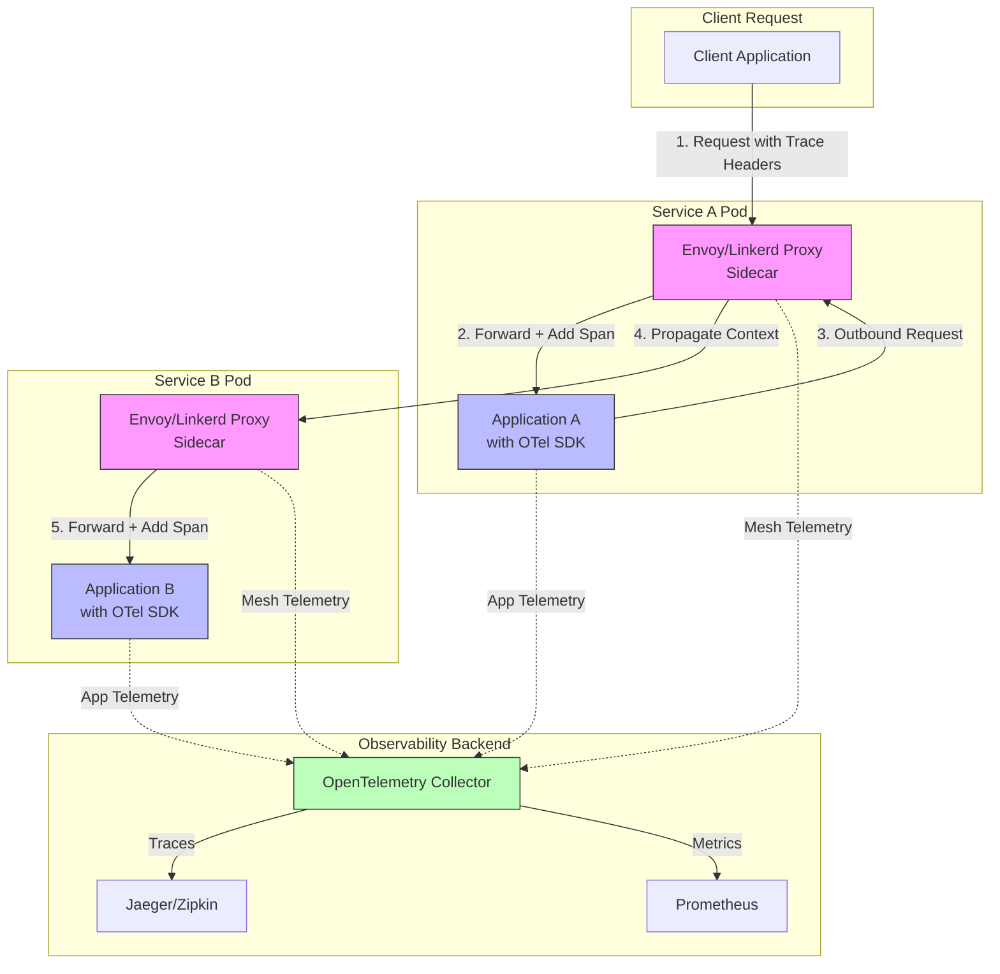
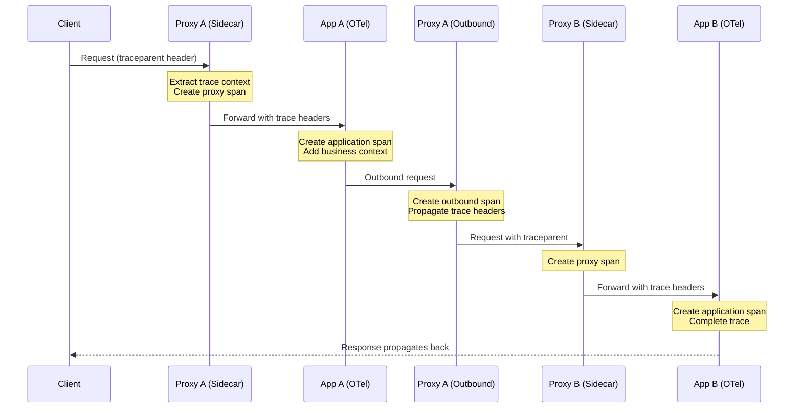
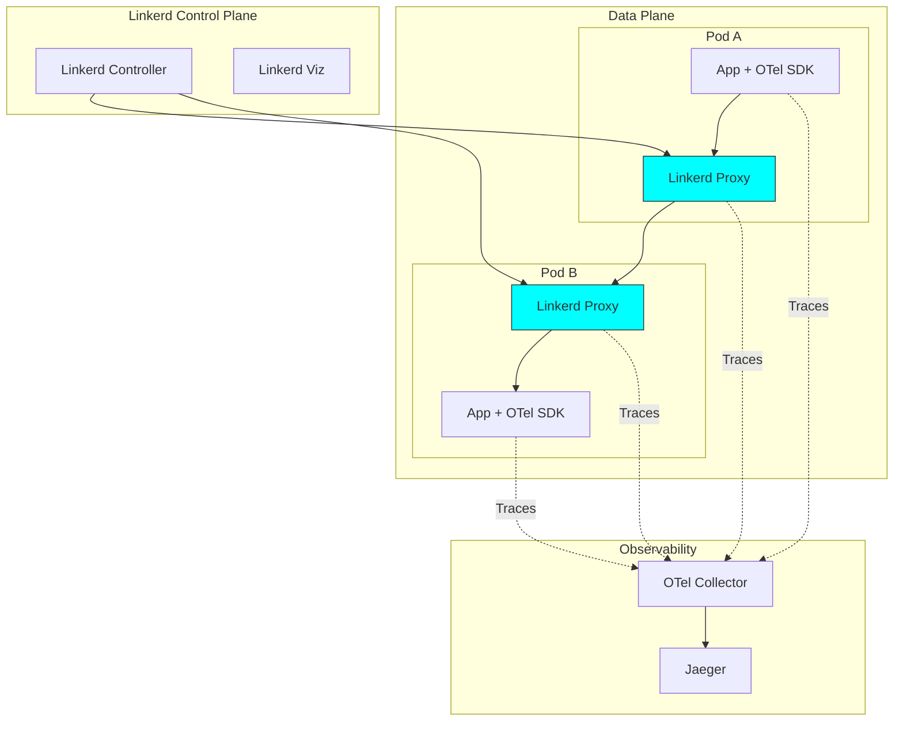
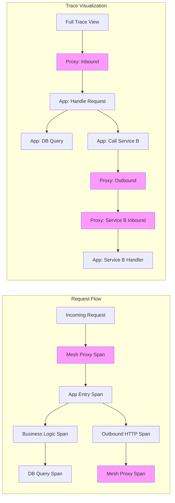
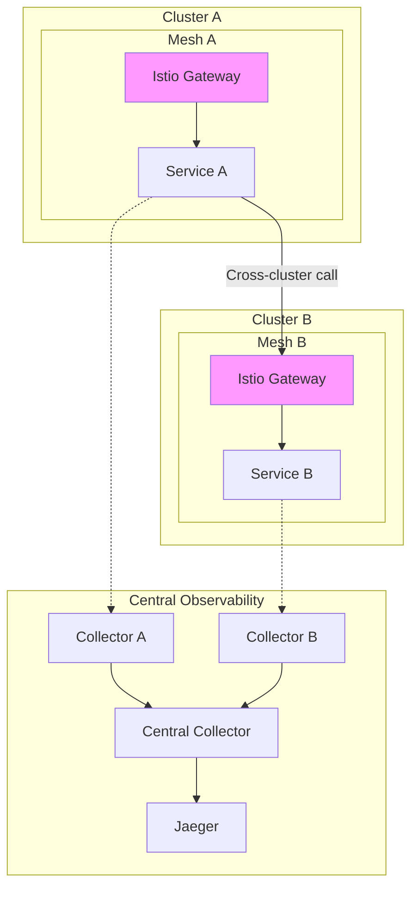

# How to Integrate OpenTelemetry with Service Mesh (Istio, Linkerd)

Author: [nawazdhandala](https://github.com/nawazdhandala)

Tags: OpenTelemetry, Observability, Service Mesh, Istio, Linkerd, Tracing

Description: Learn how to combine OpenTelemetry instrumentation with service mesh observability features.

---

Service meshes like Istio and Linkerd provide powerful observability capabilities out of the box, including automatic tracing, metrics, and logging for service-to-service communication. However, combining these mesh-level insights with application-level telemetry from OpenTelemetry creates a comprehensive observability solution that gives you visibility into both infrastructure and application behavior.

This guide walks you through integrating OpenTelemetry with Istio and Linkerd, showing you how to propagate trace context through service mesh proxies and correlate application telemetry with mesh-generated data.

## Understanding the Architecture

Before diving into implementation, let's understand how OpenTelemetry and service meshes work together.

### Service Mesh Tracing Architecture

The following diagram illustrates how traces flow through a service mesh with OpenTelemetry integration:



### Trace Context Propagation Flow

Understanding how trace context propagates through proxies is essential:



## Part 1: Integrating OpenTelemetry with Istio

Istio uses Envoy proxies as sidecars, which natively support distributed tracing. Let's configure Istio to work seamlessly with OpenTelemetry.

### Prerequisites

Ensure you have the following installed:
- Kubernetes cluster (1.24+)
- Istio (1.18+)
- kubectl configured for your cluster

### Step 1: Configure Istio for OpenTelemetry Tracing

First, we need to configure Istio's mesh-wide tracing settings to use OpenTelemetry. This configuration tells Istio's Envoy proxies where to send trace data and how to format it.

Create an Istio configuration that enables OpenTelemetry tracing:

```yaml
# istio-otel-config.yaml
# This ConfigMap configures Istio's mesh-wide settings for OpenTelemetry
# It tells all Envoy sidecars to export traces using the OpenTelemetry protocol
apiVersion: install.istio.io/v1alpha1
kind: IstioOperator
metadata:
  name: istio-otel-config
  namespace: istio-system
spec:
  meshConfig:
    # Enable access logging for debugging
    accessLogFile: /dev/stdout

    # Configure the default tracing provider
    defaultProviders:
      tracing:
        - opentelemetry

    # Enable proxy-level tracing with 100% sampling for development
    # In production, reduce this to avoid overwhelming your backend
    enableTracing: true

    # Define the OpenTelemetry tracing provider
    extensionProviders:
      - name: opentelemetry
        opentelemetry:
          # Point to your OpenTelemetry Collector service
          # This should be accessible from all pods in the mesh
          service: otel-collector.observability.svc.cluster.local
          port: 4317

          # Use gRPC for better performance
          # Alternative: http with port 4318
          resource_detectors:
            environment: {}
```

Apply the configuration:

```bash
# Apply the Istio configuration to enable OpenTelemetry tracing
# This will restart Istio components to pick up the new settings
kubectl apply -f istio-otel-config.yaml

# Verify the configuration was applied successfully
# Check that the mesh config shows the opentelemetry provider
istioctl analyze
```

### Step 2: Deploy the OpenTelemetry Collector

Deploy an OpenTelemetry Collector that receives traces from both Istio proxies and application instrumentation. This collector acts as a central hub for all telemetry data.

```yaml
# otel-collector.yaml
# This deploys the OpenTelemetry Collector in your cluster
# It receives telemetry from Istio proxies and applications, then exports to backends
apiVersion: v1
kind: Namespace
metadata:
  name: observability
  labels:
    # Enable Istio sidecar injection for the collector itself
    istio-injection: enabled
---
apiVersion: v1
kind: ConfigMap
metadata:
  name: otel-collector-config
  namespace: observability
data:
  config.yaml: |
    # Receivers define how data gets into the collector
    receivers:
      # OTLP receiver for OpenTelemetry protocol
      # This accepts both gRPC (4317) and HTTP (4318) connections
      otlp:
        protocols:
          grpc:
            endpoint: 0.0.0.0:4317
          http:
            endpoint: 0.0.0.0:4318

      # Zipkin receiver for legacy applications
      # Istio can also export in Zipkin format
      zipkin:
        endpoint: 0.0.0.0:9411

    # Processors transform and enrich telemetry data
    processors:
      # Batch processor improves performance by sending data in batches
      batch:
        timeout: 1s
        send_batch_size: 1024

      # Memory limiter prevents the collector from using too much memory
      memory_limiter:
        check_interval: 1s
        limit_mib: 2048
        spike_limit_mib: 512

      # Resource processor adds common attributes to all telemetry
      resource:
        attributes:
          - key: service.mesh
            value: istio
            action: upsert
          - key: deployment.environment
            from_attribute: k8s.namespace.name
            action: insert

      # Span processor for trace-specific transformations
      # This helps correlate mesh spans with application spans
      attributes:
        actions:
          # Add a custom attribute to identify the source
          - key: telemetry.source
            value: opentelemetry-collector
            action: insert

    # Exporters define where processed data is sent
    exporters:
      # Jaeger exporter for trace visualization
      otlp/jaeger:
        endpoint: jaeger-collector.observability.svc.cluster.local:4317
        tls:
          insecure: true

      # Prometheus exporter for metrics
      prometheus:
        endpoint: 0.0.0.0:8889
        namespace: otel

      # Debug exporter for troubleshooting (logs to stdout)
      debug:
        verbosity: detailed
        sampling_initial: 5
        sampling_thereafter: 200

    # Extensions provide additional collector capabilities
    extensions:
      # Health check endpoint for Kubernetes probes
      health_check:
        endpoint: 0.0.0.0:13133

      # pprof for performance profiling
      pprof:
        endpoint: 0.0.0.0:1777

    # Service section ties everything together
    service:
      extensions: [health_check, pprof]
      pipelines:
        # Traces pipeline: receive, process, and export trace data
        traces:
          receivers: [otlp, zipkin]
          processors: [memory_limiter, resource, attributes, batch]
          exporters: [otlp/jaeger, debug]

        # Metrics pipeline for Prometheus integration
        metrics:
          receivers: [otlp]
          processors: [memory_limiter, batch]
          exporters: [prometheus]
---
apiVersion: apps/v1
kind: Deployment
metadata:
  name: otel-collector
  namespace: observability
spec:
  replicas: 2
  selector:
    matchLabels:
      app: otel-collector
  template:
    metadata:
      labels:
        app: otel-collector
      annotations:
        # Ensure Prometheus can scrape the collector's metrics
        prometheus.io/scrape: "true"
        prometheus.io/port: "8889"
    spec:
      containers:
        - name: collector
          image: otel/opentelemetry-collector-contrib:0.92.0
          args:
            - --config=/conf/config.yaml
          ports:
            - containerPort: 4317  # OTLP gRPC
            - containerPort: 4318  # OTLP HTTP
            - containerPort: 9411  # Zipkin
            - containerPort: 8889  # Prometheus metrics
            - containerPort: 13133 # Health check
          volumeMounts:
            - name: config
              mountPath: /conf
          resources:
            requests:
              memory: 512Mi
              cpu: 200m
            limits:
              memory: 2Gi
              cpu: 1000m
          livenessProbe:
            httpGet:
              path: /
              port: 13133
            initialDelaySeconds: 10
          readinessProbe:
            httpGet:
              path: /
              port: 13133
            initialDelaySeconds: 5
      volumes:
        - name: config
          configMap:
            name: otel-collector-config
---
apiVersion: v1
kind: Service
metadata:
  name: otel-collector
  namespace: observability
spec:
  selector:
    app: otel-collector
  ports:
    - name: otlp-grpc
      port: 4317
      targetPort: 4317
    - name: otlp-http
      port: 4318
      targetPort: 4318
    - name: zipkin
      port: 9411
      targetPort: 9411
    - name: metrics
      port: 8889
      targetPort: 8889
```

Apply the collector configuration:

```bash
# Deploy the OpenTelemetry Collector to your cluster
kubectl apply -f otel-collector.yaml

# Wait for the collector pods to be ready
kubectl wait --for=condition=ready pod -l app=otel-collector -n observability --timeout=120s

# Verify the collector is receiving connections
kubectl logs -l app=otel-collector -n observability --tail=50
```

### Step 3: Configure Trace Context Propagation in Istio

For traces to flow correctly through the mesh, applications must propagate trace headers. Istio uses W3C Trace Context by default. Configure your Istio mesh to handle multiple propagation formats:

```yaml
# istio-tracing-headers.yaml
# This EnvoyFilter ensures proper trace header propagation
# It configures Envoy to use W3C Trace Context format
apiVersion: networking.istio.io/v1alpha3
kind: EnvoyFilter
metadata:
  name: tracing-config
  namespace: istio-system
spec:
  configPatches:
    # Patch the tracing configuration for all sidecars
    - applyTo: NETWORK_FILTER
      match:
        context: SIDECAR_INBOUND
        listener:
          filterChain:
            filter:
              name: envoy.filters.network.http_connection_manager
      patch:
        operation: MERGE
        value:
          typed_config:
            "@type": type.googleapis.com/envoy.extensions.filters.network.http_connection_manager.v3.HttpConnectionManager
            tracing:
              # Set the maximum path tag length for better trace context
              max_path_tag_length: 256

              # Always create a span for better visibility
              spawn_upstream_span: true

              # Custom tags to add to all proxy spans
              custom_tags:
                - tag: mesh.component
                  literal:
                    value: istio-proxy
                - tag: request.id
                  request_header:
                    name: x-request-id
                    default_value: unknown
```

### Step 4: Instrument Your Application with OpenTelemetry

Now instrument your application to create spans that connect with Istio's proxy spans. This example shows a Python Flask application:

```python
# app.py
# A Flask application instrumented with OpenTelemetry
# This demonstrates how to create application spans that correlate with Istio proxy spans

from flask import Flask, request
import requests
from opentelemetry import trace
from opentelemetry.sdk.trace import TracerProvider
from opentelemetry.sdk.trace.export import BatchSpanProcessor
from opentelemetry.exporter.otlp.proto.grpc.trace_exporter import OTLPSpanExporter
from opentelemetry.sdk.resources import Resource, SERVICE_NAME, SERVICE_VERSION
from opentelemetry.instrumentation.flask import FlaskInstrumentor
from opentelemetry.instrumentation.requests import RequestsInstrumentor
from opentelemetry.propagate import inject, extract
from opentelemetry.trace.propagation.tracecontext import TraceContextTextMapPropagator
import os

# Create a resource that describes your service
# These attributes will be attached to all telemetry from this service
resource = Resource.create({
    SERVICE_NAME: os.getenv("SERVICE_NAME", "my-service"),
    SERVICE_VERSION: os.getenv("SERVICE_VERSION", "1.0.0"),
    # Add custom attributes for mesh correlation
    "service.mesh": "istio",
    "deployment.environment": os.getenv("ENVIRONMENT", "development"),
})

# Initialize the tracer provider with our resource
# This is the central configuration for all tracing in the application
provider = TracerProvider(resource=resource)

# Configure the OTLP exporter to send traces to the collector
# The collector endpoint is typically provided via environment variable
otlp_exporter = OTLPSpanExporter(
    # Use the collector service discovered through Kubernetes DNS
    endpoint=os.getenv("OTEL_EXPORTER_OTLP_ENDPOINT", "otel-collector.observability.svc.cluster.local:4317"),
    insecure=True,  # Set to False in production with proper TLS
)

# Add a batch processor for efficient trace export
# This batches spans before sending to reduce network overhead
provider.add_span_processor(BatchSpanProcessor(otlp_exporter))

# Set the global tracer provider
trace.set_tracer_provider(provider)

# Get a tracer for creating spans
tracer = trace.get_tracer(__name__)

# Create the Flask application
app = Flask(__name__)

# Auto-instrument Flask to capture incoming request spans
# This automatically extracts trace context from incoming headers
FlaskInstrumentor().instrument_app(app)

# Auto-instrument requests library for outgoing HTTP calls
# This automatically injects trace context into outgoing headers
RequestsInstrumentor().instrument()


@app.route('/api/orders', methods=['GET'])
def get_orders():
    """
    Handle order retrieval requests.
    This endpoint demonstrates how application spans nest within mesh proxy spans.
    """
    # Get the current span (created by Flask instrumentation)
    current_span = trace.get_current_span()

    # Add business-relevant attributes to the span
    # These attributes help correlate traces with business events
    current_span.set_attribute("user.id", request.headers.get("X-User-ID", "anonymous"))
    current_span.set_attribute("request.type", "order_retrieval")

    # Create a child span for database operations
    # This provides granular visibility into what the application is doing
    with tracer.start_as_current_span("fetch_orders_from_db") as db_span:
        db_span.set_attribute("db.system", "postgresql")
        db_span.set_attribute("db.operation", "SELECT")
        db_span.set_attribute("db.table", "orders")

        # Simulate database query
        orders = fetch_orders_from_database()
        db_span.set_attribute("db.row_count", len(orders))

    # Create a span for calling another microservice
    # The requests instrumentation will propagate trace context automatically
    with tracer.start_as_current_span("call_inventory_service") as service_span:
        service_span.set_attribute("peer.service", "inventory-service")

        # Make the HTTP call - trace headers are automatically injected
        response = requests.get(
            "http://inventory-service.default.svc.cluster.local:8080/api/stock",
            timeout=5
        )
        service_span.set_attribute("http.status_code", response.status_code)

    return {"orders": orders, "status": "success"}


@app.route('/api/orders', methods=['POST'])
def create_order():
    """
    Handle order creation requests.
    Demonstrates adding business events to traces for better observability.
    """
    current_span = trace.get_current_span()

    # Add an event to mark the start of order processing
    # Events are timestamped and help understand the sequence of operations
    current_span.add_event("order_processing_started", {
        "order.source": request.headers.get("X-Order-Source", "web"),
    })

    with tracer.start_as_current_span("validate_order") as validation_span:
        order_data = request.get_json()
        validation_span.set_attribute("order.items_count", len(order_data.get("items", [])))

        # Validate the order
        is_valid, errors = validate_order(order_data)
        validation_span.set_attribute("validation.passed", is_valid)

        if not is_valid:
            validation_span.set_attribute("validation.errors", str(errors))
            current_span.add_event("order_validation_failed", {"errors": str(errors)})
            return {"error": "Invalid order", "details": errors}, 400

    with tracer.start_as_current_span("process_payment") as payment_span:
        payment_span.set_attribute("payment.method", order_data.get("payment_method", "unknown"))

        # Call the payment service - Istio will add its proxy span
        response = requests.post(
            "http://payment-service.default.svc.cluster.local:8080/api/charge",
            json={"amount": order_data.get("total"), "method": order_data.get("payment_method")},
            timeout=10
        )
        payment_span.set_attribute("payment.status", response.json().get("status"))

    current_span.add_event("order_processing_completed")
    return {"order_id": "12345", "status": "created"}, 201


def fetch_orders_from_database():
    """Simulate fetching orders from database."""
    return [{"id": 1, "product": "Widget"}]


def validate_order(order_data):
    """Validate order data."""
    if not order_data.get("items"):
        return False, ["No items in order"]
    return True, []


if __name__ == '__main__':
    app.run(host='0.0.0.0', port=8080)
```

### Step 5: Deploy the Instrumented Application

Deploy your application with the necessary environment variables for OpenTelemetry:

```yaml
# app-deployment.yaml
# Kubernetes deployment for the instrumented application
# Note: Istio sidecar injection should be enabled for the namespace
apiVersion: apps/v1
kind: Deployment
metadata:
  name: order-service
  namespace: default
  labels:
    app: order-service
    version: v1
spec:
  replicas: 3
  selector:
    matchLabels:
      app: order-service
  template:
    metadata:
      labels:
        app: order-service
        version: v1
      annotations:
        # Enable Istio sidecar injection
        sidecar.istio.io/inject: "true"
        # Configure proxy to preserve original headers
        proxy.istio.io/config: |
          tracing:
            sampling: 100
            custom_tags:
              app_name:
                literal:
                  value: order-service
    spec:
      containers:
        - name: order-service
          image: my-registry/order-service:v1.0.0
          ports:
            - containerPort: 8080
          env:
            # Service identification for OpenTelemetry
            - name: SERVICE_NAME
              value: order-service
            - name: SERVICE_VERSION
              value: "1.0.0"
            - name: ENVIRONMENT
              valueFrom:
                fieldRef:
                  fieldPath: metadata.namespace

            # OpenTelemetry SDK configuration
            # These environment variables configure the OTel SDK behavior
            - name: OTEL_EXPORTER_OTLP_ENDPOINT
              value: "http://otel-collector.observability.svc.cluster.local:4317"
            - name: OTEL_EXPORTER_OTLP_PROTOCOL
              value: "grpc"

            # Enable trace context propagation using W3C format
            # This ensures compatibility with Istio's trace headers
            - name: OTEL_PROPAGATORS
              value: "tracecontext,baggage"

            # Set sampling rate (1.0 = 100% for development)
            - name: OTEL_TRACES_SAMPLER
              value: "parentbased_traceidratio"
            - name: OTEL_TRACES_SAMPLER_ARG
              value: "1.0"

            # Resource attributes for the service
            - name: OTEL_RESOURCE_ATTRIBUTES
              value: "service.namespace=default,deployment.environment=production"

          resources:
            requests:
              memory: 256Mi
              cpu: 100m
            limits:
              memory: 512Mi
              cpu: 500m
---
apiVersion: v1
kind: Service
metadata:
  name: order-service
  namespace: default
spec:
  selector:
    app: order-service
  ports:
    - port: 8080
      targetPort: 8080
      name: http
```

## Part 2: Integrating OpenTelemetry with Linkerd

Linkerd is a lightweight service mesh that also supports distributed tracing. Its integration with OpenTelemetry follows a similar pattern but with some key differences.

### Linkerd Tracing Architecture



### Step 1: Install Linkerd with Tracing Support

First, install Linkerd with the Jaeger extension enabled. This extension adds tracing capabilities to Linkerd:

```bash
# Install the Linkerd CLI if not already installed
curl --proto '=https' --tlsv1.2 -sSfL https://run.linkerd.io/install | sh
export PATH=$PATH:$HOME/.linkerd2/bin

# Verify the cluster is ready for Linkerd
linkerd check --pre

# Install Linkerd control plane with tracing enabled
linkerd install --set proxyInit.runAsRoot=true | kubectl apply -f -

# Wait for the control plane to be ready
linkerd check

# Install the Linkerd Viz extension for observability
linkerd viz install | kubectl apply -f -

# Install the Jaeger extension for distributed tracing
linkerd jaeger install | kubectl apply -f -

# Verify all extensions are installed
linkerd check
```

### Step 2: Configure Linkerd for OpenTelemetry

Configure Linkerd to export traces to your OpenTelemetry Collector:

```yaml
# linkerd-otel-config.yaml
# This ConfigMap configures Linkerd's trace collector
# It points the Jaeger extension to use OpenTelemetry Collector
apiVersion: v1
kind: ConfigMap
metadata:
  name: linkerd-jaeger-config
  namespace: linkerd-jaeger
data:
  # Configure the OpenCensus collector to forward to OTel Collector
  collector: |
    receivers:
      otlp:
        protocols:
          grpc:
            endpoint: 0.0.0.0:4317
          http:
            endpoint: 0.0.0.0:4318

      # Receive traces from Linkerd proxies via OpenCensus
      opencensus:
        endpoint: 0.0.0.0:55678

    processors:
      batch:
        timeout: 1s
        send_batch_size: 512

      # Add Linkerd-specific attributes
      resource:
        attributes:
          - key: service.mesh
            value: linkerd
            action: upsert

    exporters:
      # Forward to your main OpenTelemetry Collector
      otlp:
        endpoint: otel-collector.observability.svc.cluster.local:4317
        tls:
          insecure: true

    service:
      pipelines:
        traces:
          receivers: [otlp, opencensus]
          processors: [resource, batch]
          exporters: [otlp]
---
# Annotation configuration for enabling tracing on namespaces
# Apply this to namespaces where you want Linkerd tracing
apiVersion: v1
kind: Namespace
metadata:
  name: my-app
  annotations:
    # Enable Linkerd injection
    linkerd.io/inject: enabled
    # Enable tracing for this namespace
    config.linkerd.io/trace-collector: collector.linkerd-jaeger:55678
    # Set the sampling rate (0.0 to 1.0)
    config.linkerd.io/trace-sampling: "1.0"
```

### Step 3: Instrument Applications for Linkerd

Create a Node.js application instrumented with OpenTelemetry for Linkerd:

```javascript
// server.js
// Node.js application with OpenTelemetry instrumentation for Linkerd
// This example shows how to create traces that correlate with Linkerd proxy spans

const express = require('express');
const { NodeSDK } = require('@opentelemetry/sdk-node');
const { getNodeAutoInstrumentations } = require('@opentelemetry/auto-instrumentations-node');
const { OTLPTraceExporter } = require('@opentelemetry/exporter-trace-otlp-grpc');
const { Resource } = require('@opentelemetry/resources');
const { SemanticResourceAttributes } = require('@opentelemetry/semantic-conventions');
const { W3CTraceContextPropagator } = require('@opentelemetry/core');
const { trace, context, SpanStatusCode } = require('@opentelemetry/api');

// Configure the resource that identifies this service
// These attributes will appear on all spans from this service
const resource = new Resource({
  [SemanticResourceAttributes.SERVICE_NAME]: process.env.SERVICE_NAME || 'node-service',
  [SemanticResourceAttributes.SERVICE_VERSION]: process.env.SERVICE_VERSION || '1.0.0',
  [SemanticResourceAttributes.DEPLOYMENT_ENVIRONMENT]: process.env.NODE_ENV || 'development',
  // Custom attribute to identify this as a Linkerd-meshed service
  'service.mesh': 'linkerd',
});

// Create the OTLP exporter to send traces to the collector
// The endpoint should point to your OpenTelemetry Collector
const traceExporter = new OTLPTraceExporter({
  url: process.env.OTEL_EXPORTER_OTLP_ENDPOINT || 'grpc://otel-collector.observability.svc.cluster.local:4317',
});

// Initialize the OpenTelemetry SDK with auto-instrumentation
// This automatically instruments common Node.js libraries
const sdk = new NodeSDK({
  resource: resource,
  traceExporter: traceExporter,
  // Use W3C Trace Context for header propagation
  // This is compatible with Linkerd's tracing implementation
  textMapPropagator: new W3CTraceContextPropagator(),
  instrumentations: [
    getNodeAutoInstrumentations({
      // Configure specific instrumentations
      '@opentelemetry/instrumentation-http': {
        // Capture request and response headers for debugging
        requestHook: (span, request) => {
          span.setAttribute('http.request.header.x-request-id',
            request.headers?.['x-request-id'] || 'none');
        },
      },
      '@opentelemetry/instrumentation-express': {
        // Capture route parameters
        requestHook: (span, info) => {
          if (info.route) {
            span.setAttribute('express.route', info.route);
          }
        },
      },
    }),
  ],
});

// Start the SDK before any other code runs
sdk.start();

// Gracefully shut down the SDK on process exit
process.on('SIGTERM', () => {
  sdk.shutdown()
    .then(() => console.log('Tracing terminated'))
    .catch((error) => console.log('Error terminating tracing', error))
    .finally(() => process.exit(0));
});

const app = express();
app.use(express.json());

// Get a tracer for creating custom spans
const tracer = trace.getTracer('node-service');

// Middleware to extract trace context from Linkerd headers
// Linkerd propagates trace context via standard W3C headers
app.use((req, res, next) => {
  const currentSpan = trace.getSpan(context.active());

  if (currentSpan) {
    // Add Linkerd-specific headers as span attributes
    // These help correlate application spans with Linkerd proxy spans
    currentSpan.setAttribute('linkerd.request-id', req.headers['l5d-ctx-trace'] || 'none');
    currentSpan.setAttribute('linkerd.client-id', req.headers['l5d-client-id'] || 'none');
  }

  next();
});

// Health check endpoint
app.get('/health', (req, res) => {
  res.json({ status: 'healthy' });
});

// Example API endpoint with custom tracing
app.get('/api/products', async (req, res) => {
  // Get the current span created by auto-instrumentation
  const parentSpan = trace.getSpan(context.active());

  // Add business context to the span
  parentSpan.setAttribute('user.authenticated', !!req.headers['authorization']);
  parentSpan.setAttribute('request.category', req.query.category || 'all');

  try {
    // Create a child span for database query
    const products = await tracer.startActiveSpan('query-products-db', async (span) => {
      span.setAttribute('db.system', 'postgresql');
      span.setAttribute('db.operation', 'SELECT');
      span.setAttribute('db.sql.table', 'products');

      // Simulate database query
      const result = await queryProducts(req.query.category);

      span.setAttribute('db.result_count', result.length);
      span.end();

      return result;
    });

    // Create a span for calling another service
    // The HTTP instrumentation will automatically propagate trace context
    const inventory = await tracer.startActiveSpan('fetch-inventory', async (span) => {
      span.setAttribute('peer.service', 'inventory-service');

      // Make HTTP call - trace headers are injected automatically
      const response = await fetch('http://inventory-service.my-app.svc.cluster.local:8080/api/stock', {
        headers: {
          // Pass through any authentication headers
          'Authorization': req.headers['authorization'] || '',
        },
      });

      span.setAttribute('http.status_code', response.status);
      span.end();

      return response.json();
    });

    // Add an event to mark successful completion
    parentSpan.addEvent('products_fetched_successfully', {
      'products.count': products.length,
      'inventory.available': inventory.available,
    });

    res.json({ products, inventory });

  } catch (error) {
    // Record the error in the span
    parentSpan.recordException(error);
    parentSpan.setStatus({ code: SpanStatusCode.ERROR, message: error.message });

    res.status(500).json({ error: 'Internal server error' });
  }
});

// Order processing endpoint demonstrating span links
app.post('/api/orders', async (req, res) => {
  const tracer = trace.getTracer('order-processor');

  // Create a span for order processing
  await tracer.startActiveSpan('process-order', async (span) => {
    span.setAttribute('order.items_count', req.body.items?.length || 0);
    span.setAttribute('order.total', req.body.total || 0);

    // Validate order
    const validationSpan = tracer.startSpan('validate-order', {
      attributes: {
        'validation.type': 'schema',
      },
    });

    const isValid = validateOrder(req.body);
    validationSpan.setAttribute('validation.passed', isValid);
    validationSpan.end();

    if (!isValid) {
      span.setStatus({ code: SpanStatusCode.ERROR, message: 'Validation failed' });
      span.end();
      return res.status(400).json({ error: 'Invalid order' });
    }

    // Process payment through payment service
    await tracer.startActiveSpan('charge-payment', async (paymentSpan) => {
      paymentSpan.setAttribute('payment.method', req.body.paymentMethod);

      try {
        const response = await fetch('http://payment-service.my-app.svc.cluster.local:8080/api/charge', {
          method: 'POST',
          headers: { 'Content-Type': 'application/json' },
          body: JSON.stringify({
            amount: req.body.total,
            method: req.body.paymentMethod,
          }),
        });

        paymentSpan.setAttribute('payment.status', response.status === 200 ? 'success' : 'failed');
        paymentSpan.end();

      } catch (error) {
        paymentSpan.recordException(error);
        paymentSpan.setStatus({ code: SpanStatusCode.ERROR });
        paymentSpan.end();
        throw error;
      }
    });

    span.addEvent('order_completed', { 'order.id': '12345' });
    span.end();

    res.json({ orderId: '12345', status: 'created' });
  });
});

// Helper functions
async function queryProducts(category) {
  // Simulate async database query
  return new Promise(resolve => {
    setTimeout(() => {
      resolve([
        { id: 1, name: 'Widget', category: category || 'general' },
        { id: 2, name: 'Gadget', category: category || 'general' },
      ]);
    }, 50);
  });
}

function validateOrder(order) {
  return order && order.items && order.items.length > 0;
}

const PORT = process.env.PORT || 8080;
app.listen(PORT, () => {
  console.log(`Server listening on port ${PORT}`);
});
```

### Step 4: Deploy for Linkerd

Deploy the application with Linkerd annotations:

```yaml
# node-app-linkerd.yaml
# Kubernetes deployment configured for Linkerd mesh
apiVersion: apps/v1
kind: Deployment
metadata:
  name: node-service
  namespace: my-app
  annotations:
    # Enable Linkerd proxy injection
    linkerd.io/inject: enabled
spec:
  replicas: 3
  selector:
    matchLabels:
      app: node-service
  template:
    metadata:
      labels:
        app: node-service
      annotations:
        # Enable tracing for this pod
        config.linkerd.io/trace-collector: collector.linkerd-jaeger:55678
        # Optionally override the sampling rate per-pod
        config.linkerd.io/trace-sampling: "1.0"
        # Enable access logging for debugging
        config.alpha.linkerd.io/proxy-log-level: info
    spec:
      containers:
        - name: node-service
          image: my-registry/node-service:v1.0.0
          ports:
            - containerPort: 8080
              name: http
          env:
            # Service identification
            - name: SERVICE_NAME
              value: node-service
            - name: SERVICE_VERSION
              value: "1.0.0"
            - name: NODE_ENV
              value: production

            # OpenTelemetry configuration
            - name: OTEL_EXPORTER_OTLP_ENDPOINT
              value: "grpc://otel-collector.observability.svc.cluster.local:4317"
            - name: OTEL_PROPAGATORS
              value: "tracecontext,baggage"
            - name: OTEL_TRACES_SAMPLER
              value: "parentbased_always_on"

          resources:
            requests:
              memory: 128Mi
              cpu: 100m
            limits:
              memory: 256Mi
              cpu: 500m

          readinessProbe:
            httpGet:
              path: /health
              port: 8080
            initialDelaySeconds: 5
          livenessProbe:
            httpGet:
              path: /health
              port: 8080
            initialDelaySeconds: 10
---
apiVersion: v1
kind: Service
metadata:
  name: node-service
  namespace: my-app
spec:
  selector:
    app: node-service
  ports:
    - port: 8080
      targetPort: 8080
      name: http
```

## Part 3: Correlating Application and Mesh Telemetry

One of the key benefits of combining OpenTelemetry with a service mesh is the ability to correlate application-level telemetry with mesh-level telemetry. This section shows techniques for achieving this correlation.

### Trace Correlation Architecture



### Technique 1: Common Trace Context Headers

Both Istio and Linkerd support W3C Trace Context headers. Ensure your application propagates these headers:

```go
// main.go
// Go application demonstrating trace context propagation
// This ensures application spans connect with mesh proxy spans

package main

import (
	"context"
	"fmt"
	"io"
	"net/http"
	"os"

	"go.opentelemetry.io/contrib/instrumentation/net/http/otelhttp"
	"go.opentelemetry.io/otel"
	"go.opentelemetry.io/otel/attribute"
	"go.opentelemetry.io/otel/exporters/otlp/otlptrace/otlptracegrpc"
	"go.opentelemetry.io/otel/propagation"
	"go.opentelemetry.io/otel/sdk/resource"
	sdktrace "go.opentelemetry.io/otel/sdk/trace"
	semconv "go.opentelemetry.io/otel/semconv/v1.21.0"
	"go.opentelemetry.io/otel/trace"
)

// TracePropagationMiddleware ensures trace context is properly extracted and propagated
// This middleware is essential for connecting application spans with mesh proxy spans
type TracePropagationMiddleware struct {
	next http.Handler
}

func (m *TracePropagationMiddleware) ServeHTTP(w http.ResponseWriter, r *http.Request) {
	// Extract trace context from incoming headers
	// The propagator handles W3C Trace Context format used by service meshes
	ctx := otel.GetTextMapPropagator().Extract(r.Context(), propagation.HeaderCarrier(r.Header))

	// Get the current span (created by otelhttp instrumentation)
	span := trace.SpanFromContext(ctx)

	// Add mesh-specific attributes to help with correlation
	// These attributes help identify the request path through the mesh
	span.SetAttributes(
		attribute.String("mesh.request_id", r.Header.Get("x-request-id")),
		attribute.String("mesh.b3_trace_id", r.Header.Get("x-b3-traceid")),
		attribute.String("mesh.forwarded_for", r.Header.Get("x-forwarded-for")),
	)

	// Continue with the request using the enriched context
	m.next.ServeHTTP(w, r.WithContext(ctx))
}

// initTracer initializes the OpenTelemetry tracer with proper configuration
// for service mesh integration
func initTracer() (*sdktrace.TracerProvider, error) {
	// Create the OTLP exporter to send traces to the collector
	exporter, err := otlptracegrpc.New(
		context.Background(),
		otlptracegrpc.WithEndpoint(os.Getenv("OTEL_EXPORTER_OTLP_ENDPOINT")),
		otlptracegrpc.WithInsecure(),
	)
	if err != nil {
		return nil, fmt.Errorf("failed to create exporter: %w", err)
	}

	// Create resource with service information
	// These attributes help identify the service in distributed traces
	res, err := resource.Merge(
		resource.Default(),
		resource.NewWithAttributes(
			semconv.SchemaURL,
			semconv.ServiceName(os.Getenv("SERVICE_NAME")),
			semconv.ServiceVersion(os.Getenv("SERVICE_VERSION")),
			attribute.String("service.mesh", os.Getenv("SERVICE_MESH")),
			attribute.String("deployment.environment", os.Getenv("ENVIRONMENT")),
		),
	)
	if err != nil {
		return nil, fmt.Errorf("failed to create resource: %w", err)
	}

	// Create tracer provider with batch processing
	tp := sdktrace.NewTracerProvider(
		sdktrace.WithBatcher(exporter),
		sdktrace.WithResource(res),
		// Sample all traces in development, reduce in production
		sdktrace.WithSampler(sdktrace.ParentBased(sdktrace.AlwaysSample())),
	)

	// Set the global tracer provider
	otel.SetTracerProvider(tp)

	// Configure propagators for W3C Trace Context
	// This is critical for service mesh integration
	otel.SetTextMapPropagator(propagation.NewCompositeTextMapPropagator(
		propagation.TraceContext{}, // W3C Trace Context
		propagation.Baggage{},      // W3C Baggage
	))

	return tp, nil
}

// makeOutboundRequest demonstrates making HTTP calls with trace context propagation
// The otelhttp client automatically injects trace headers
func makeOutboundRequest(ctx context.Context, url string) (string, error) {
	tracer := otel.Tracer("http-client")

	// Create a span for the outbound request
	ctx, span := tracer.Start(ctx, "outbound-http-call",
		trace.WithAttributes(
			attribute.String("http.url", url),
			attribute.String("http.method", "GET"),
		),
	)
	defer span.End()

	// Create HTTP request with context
	req, err := http.NewRequestWithContext(ctx, "GET", url, nil)
	if err != nil {
		span.RecordError(err)
		return "", err
	}

	// Use otelhttp.Transport to automatically inject trace headers
	// This ensures the service mesh proxy can correlate the spans
	client := &http.Client{
		Transport: otelhttp.NewTransport(http.DefaultTransport),
	}

	resp, err := client.Do(req)
	if err != nil {
		span.RecordError(err)
		return "", err
	}
	defer resp.Body.Close()

	span.SetAttributes(attribute.Int("http.status_code", resp.StatusCode))

	body, err := io.ReadAll(resp.Body)
	if err != nil {
		span.RecordError(err)
		return "", err
	}

	return string(body), nil
}

func main() {
	// Initialize tracer
	tp, err := initTracer()
	if err != nil {
		fmt.Printf("Failed to initialize tracer: %v\n", err)
		os.Exit(1)
	}
	defer tp.Shutdown(context.Background())

	// Create handler with tracing
	handler := http.HandlerFunc(func(w http.ResponseWriter, r *http.Request) {
		ctx := r.Context()
		tracer := otel.Tracer("api-handler")

		// Create a span for the business logic
		ctx, span := tracer.Start(ctx, "process-request",
			trace.WithAttributes(
				attribute.String("request.path", r.URL.Path),
				attribute.String("request.method", r.Method),
			),
		)
		defer span.End()

		// Add an event to mark processing started
		span.AddEvent("processing_started")

		// Make outbound request to another service
		result, err := makeOutboundRequest(ctx, "http://backend-service:8080/api/data")
		if err != nil {
			span.RecordError(err)
			http.Error(w, "Internal error", http.StatusInternalServerError)
			return
		}

		span.AddEvent("processing_completed")
		w.Write([]byte(result))
	})

	// Wrap handler with OpenTelemetry HTTP instrumentation
	// This creates spans for incoming requests and extracts trace context
	otelHandler := otelhttp.NewHandler(handler, "http-server")

	// Add our custom middleware for additional trace context handling
	wrappedHandler := &TracePropagationMiddleware{next: otelHandler}

	// Start the server
	fmt.Println("Server starting on :8080")
	http.ListenAndServe(":8080", wrappedHandler)
}
```

### Technique 2: Custom Span Attributes for Mesh Correlation

Add custom attributes to your spans that help correlate with mesh telemetry:

```python
# correlation_middleware.py
# Middleware for adding mesh correlation attributes to spans
# This helps correlate application spans with Istio/Linkerd proxy spans

from opentelemetry import trace
from opentelemetry.trace import SpanKind
from flask import request, g
import time

# Get the tracer for this module
tracer = trace.get_tracer(__name__)


class MeshCorrelationMiddleware:
    """
    Flask middleware that adds service mesh correlation attributes to spans.
    This helps you see the full request path in your distributed traces,
    connecting application-level spans with mesh proxy spans.
    """

    # Headers that Istio propagates for tracing
    ISTIO_TRACE_HEADERS = [
        'x-request-id',
        'x-b3-traceid',
        'x-b3-spanid',
        'x-b3-parentspanid',
        'x-b3-sampled',
        'x-b3-flags',
        'x-ot-span-context',
        'traceparent',
        'tracestate',
    ]

    # Headers that Linkerd propagates for tracing
    LINKERD_TRACE_HEADERS = [
        'l5d-ctx-trace',
        'l5d-ctx-span',
        'l5d-ctx-parent',
        'l5d-ctx-deadline',
        'l5d-client-id',
        'l5d-server-id',
    ]

    def __init__(self, app):
        """Initialize the middleware with a Flask application."""
        self.app = app
        self.app.before_request(self._before_request)
        self.app.after_request(self._after_request)
        self.app.teardown_request(self._teardown_request)

    def _before_request(self):
        """
        Called before each request is processed.
        Extracts mesh headers and adds them as span attributes.
        """
        g.request_start_time = time.time()

        # Get the current span
        span = trace.get_current_span()

        if span.is_recording():
            # Add Istio trace headers as attributes
            for header in self.ISTIO_TRACE_HEADERS:
                value = request.headers.get(header)
                if value:
                    # Use a consistent naming convention for mesh headers
                    span.set_attribute(f"mesh.istio.{header.replace('-', '_')}", value)

            # Add Linkerd trace headers as attributes
            for header in self.LINKERD_TRACE_HEADERS:
                value = request.headers.get(header)
                if value:
                    span.set_attribute(f"mesh.linkerd.{header.replace('-', '_')}", value)

            # Add general mesh routing information
            span.set_attribute("mesh.routing.host", request.headers.get("host", "unknown"))
            span.set_attribute("mesh.routing.forwarded_host",
                              request.headers.get("x-forwarded-host", "none"))
            span.set_attribute("mesh.routing.forwarded_proto",
                              request.headers.get("x-forwarded-proto", "none"))

            # Add Envoy-specific headers (used by Istio)
            envoy_route = request.headers.get("x-envoy-decorator-operation")
            if envoy_route:
                span.set_attribute("mesh.envoy.route", envoy_route)

            # Add upstream service information
            upstream_cluster = request.headers.get("x-envoy-upstream-service-time")
            if upstream_cluster:
                span.set_attribute("mesh.envoy.upstream_service_time_ms", int(upstream_cluster))

    def _after_request(self, response):
        """
        Called after the request is processed.
        Adds response information to the span.
        """
        span = trace.get_current_span()

        if span.is_recording():
            # Calculate request duration
            if hasattr(g, 'request_start_time'):
                duration_ms = (time.time() - g.request_start_time) * 1000
                span.set_attribute("app.request_duration_ms", duration_ms)

            # Add response headers that help with correlation
            span.set_attribute("http.response.status_code", response.status_code)

            # Add Envoy response headers
            x_envoy_upstream_time = response.headers.get("x-envoy-upstream-service-time")
            if x_envoy_upstream_time:
                span.set_attribute("mesh.envoy.response_upstream_time_ms",
                                  int(x_envoy_upstream_time))

        return response

    def _teardown_request(self, exception):
        """
        Called at the end of request handling.
        Records any exceptions that occurred.
        """
        if exception:
            span = trace.get_current_span()
            if span.is_recording():
                span.record_exception(exception)
                span.set_attribute("app.error", True)
                span.set_attribute("app.error_type", type(exception).__name__)


def propagate_headers_to_outbound(headers_dict):
    """
    Helper function to propagate mesh trace headers to outbound requests.
    Call this when making HTTP requests to other services to ensure
    trace context is properly propagated through the mesh.

    Args:
        headers_dict: Dictionary to add propagation headers to

    Returns:
        The headers dictionary with propagation headers added
    """
    from flask import has_request_context

    if not has_request_context():
        return headers_dict

    # Propagate W3C Trace Context headers (primary)
    for header in ['traceparent', 'tracestate']:
        if header in request.headers:
            headers_dict[header] = request.headers[header]

    # Propagate B3 headers for backward compatibility
    for header in ['x-b3-traceid', 'x-b3-spanid', 'x-b3-sampled', 'x-b3-flags']:
        if header in request.headers:
            headers_dict[header] = request.headers[header]

    # Propagate request ID for correlation
    if 'x-request-id' in request.headers:
        headers_dict['x-request-id'] = request.headers['x-request-id']

    # Propagate Linkerd headers if present
    for header in ['l5d-ctx-trace', 'l5d-ctx-span']:
        if header in request.headers:
            headers_dict[header] = request.headers[header]

    return headers_dict


# Example usage in a Flask application
"""
from flask import Flask
from correlation_middleware import MeshCorrelationMiddleware, propagate_headers_to_outbound
import requests

app = Flask(__name__)
MeshCorrelationMiddleware(app)

@app.route('/api/process')
def process():
    # When making outbound requests, propagate trace headers
    headers = {}
    propagate_headers_to_outbound(headers)

    response = requests.get(
        'http://backend-service:8080/api/data',
        headers=headers
    )
    return response.json()
"""
```

### Technique 3: Unified Telemetry Processing in the Collector

Configure your OpenTelemetry Collector to process and correlate mesh and application telemetry:

```yaml
# otel-collector-correlation.yaml
# OpenTelemetry Collector configuration for correlating mesh and app telemetry
# This configuration enriches spans with mesh information and processes both sources

receivers:
  # Receive OTLP from both applications and mesh proxies
  otlp:
    protocols:
      grpc:
        endpoint: 0.0.0.0:4317
      http:
        endpoint: 0.0.0.0:4318

  # Receive Zipkin traces from Istio proxies
  zipkin:
    endpoint: 0.0.0.0:9411

processors:
  # Batch processor for efficient export
  batch:
    timeout: 1s
    send_batch_size: 1024

  # Memory limiter to prevent OOM
  memory_limiter:
    check_interval: 1s
    limit_mib: 2048

  # Transform processor to normalize span attributes
  # This helps correlate spans from different sources
  transform:
    trace_statements:
      - context: span
        statements:
          # Add a common correlation ID based on trace context
          - set(attributes["correlation.trace_id"], TraceID())
          - set(attributes["correlation.span_id"], SpanID())

          # Normalize mesh source identification
          - set(attributes["telemetry.source"], "istio-proxy")
            where attributes["component"] == "proxy"
          - set(attributes["telemetry.source"], "application")
            where attributes["component"] != "proxy"

          # Extract service mesh routing information
          - set(attributes["mesh.source_service"], attributes["source.workload"])
          - set(attributes["mesh.destination_service"], attributes["destination.workload"])

  # Span processor for additional transformations
  attributes:
    actions:
      # Add collector processing timestamp
      - key: collector.processed_at
        action: insert
        value: "${TIMESTAMP}"

      # Normalize status codes across different naming conventions
      - key: http.status_code
        action: upsert
        from_attribute: http.response.status_code

      # Add environment identification
      - key: deployment.environment
        action: insert
        value: "${ENVIRONMENT}"

  # Group by trace ID for correlation analysis
  groupbytrace:
    wait_duration: 10s
    num_traces: 10000

  # Tail sampling to keep interesting traces
  tail_sampling:
    decision_wait: 10s
    num_traces: 100000
    policies:
      # Keep all error traces
      - name: errors-policy
        type: status_code
        status_code: {status_codes: [ERROR]}

      # Keep slow traces (over 2 seconds)
      - name: latency-policy
        type: latency
        latency: {threshold_ms: 2000}

      # Sample normal traces at 10%
      - name: probabilistic-policy
        type: probabilistic
        probabilistic: {sampling_percentage: 10}

exporters:
  # Export to Jaeger for visualization
  otlp/jaeger:
    endpoint: jaeger-collector:4317
    tls:
      insecure: true

  # Export to Tempo for long-term storage
  otlp/tempo:
    endpoint: tempo:4317
    tls:
      insecure: true

  # Export metrics derived from traces
  prometheusremotewrite:
    endpoint: http://prometheus:9090/api/v1/write
    resource_to_telemetry_conversion:
      enabled: true

# Connector to generate metrics from traces
connectors:
  spanmetrics:
    histogram:
      explicit:
        buckets: [1ms, 5ms, 10ms, 50ms, 100ms, 250ms, 500ms, 1s, 2s, 5s]
    dimensions:
      - name: service.name
      - name: service.mesh
      - name: http.method
      - name: http.status_code
    exemplars:
      enabled: true

service:
  pipelines:
    # Main traces pipeline
    traces:
      receivers: [otlp, zipkin]
      processors: [memory_limiter, transform, attributes, groupbytrace, tail_sampling, batch]
      exporters: [otlp/jaeger, otlp/tempo]

    # Metrics derived from traces
    metrics:
      receivers: [spanmetrics]
      processors: [memory_limiter, batch]
      exporters: [prometheusremotewrite]
```

## Part 4: Advanced Patterns

### Pattern 1: Multi-Cluster Tracing with Service Mesh

When running across multiple clusters with a service mesh, trace context propagation requires additional configuration:



Configuration for multi-cluster trace correlation:

```yaml
# multi-cluster-collector.yaml
# Collector configuration for multi-cluster trace correlation
# This configuration aggregates traces from multiple clusters

receivers:
  otlp:
    protocols:
      grpc:
        endpoint: 0.0.0.0:4317

processors:
  batch:
    timeout: 1s

  # Add cluster identification to all spans
  resource:
    attributes:
      - key: k8s.cluster.name
        value: ${CLUSTER_NAME}
        action: upsert

  # Transform spans to include cross-cluster correlation
  transform:
    trace_statements:
      - context: span
        statements:
          # Preserve original cluster information
          - set(attributes["source.cluster"], resource.attributes["k8s.cluster.name"])

          # Extract destination cluster from service name patterns
          - set(attributes["destination.cluster"], "cluster-b")
            where IsMatch(attributes["peer.service"], ".*\\.cluster-b\\..*")

exporters:
  # Send to central collector for aggregation
  otlp:
    endpoint: central-collector.observability.svc.cluster.local:4317
    headers:
      x-cluster-name: ${CLUSTER_NAME}

service:
  pipelines:
    traces:
      receivers: [otlp]
      processors: [resource, transform, batch]
      exporters: [otlp]
```

### Pattern 2: Canary Deployment Tracing

Track traces through canary deployments to compare performance:

```yaml
# canary-tracing-config.yaml
# Configure tracing for canary deployments with Istio
# This allows you to compare traces between stable and canary versions

apiVersion: networking.istio.io/v1beta1
kind: VirtualService
metadata:
  name: my-service
spec:
  hosts:
    - my-service
  http:
    - match:
        # Route 10% of traffic to canary with tracing headers
        - headers:
            x-canary:
              exact: "true"
        - queryParams:
            canary:
              exact: "true"
      route:
        - destination:
            host: my-service
            subset: canary
      headers:
        request:
          # Add canary identification for trace correlation
          add:
            x-deployment-version: canary
    - route:
        - destination:
            host: my-service
            subset: stable
          weight: 90
        - destination:
            host: my-service
            subset: canary
          weight: 10
      headers:
        request:
          add:
            x-deployment-version: stable
---
apiVersion: networking.istio.io/v1beta1
kind: DestinationRule
metadata:
  name: my-service
spec:
  host: my-service
  subsets:
    - name: stable
      labels:
        version: v1
    - name: canary
      labels:
        version: v2
  trafficPolicy:
    connectionPool:
      tcp:
        maxConnections: 100
```

Application code to capture canary information:

```python
# canary_tracing.py
# Helper module for canary deployment tracing
# Adds deployment version information to spans for comparison

from opentelemetry import trace
from flask import request

def add_canary_attributes():
    """
    Add canary deployment attributes to the current span.
    Call this at the start of request processing to capture
    which deployment version handled the request.
    """
    span = trace.get_current_span()

    if span.is_recording():
        # Get deployment version from mesh-injected header
        deployment_version = request.headers.get('x-deployment-version', 'unknown')
        span.set_attribute('deployment.version', deployment_version)

        # Add canary flag for easy filtering
        is_canary = deployment_version == 'canary'
        span.set_attribute('deployment.is_canary', is_canary)

        # Add pod information for detailed analysis
        import os
        span.set_attribute('k8s.pod.name', os.getenv('POD_NAME', 'unknown'))
        span.set_attribute('k8s.pod.ip', os.getenv('POD_IP', 'unknown'))

        # Add version label for correlation
        span.set_attribute('service.version', os.getenv('APP_VERSION', 'unknown'))
```

### Pattern 3: mTLS and Trace Context Security

When using mTLS with service mesh, ensure trace headers are properly handled:

```yaml
# mtls-tracing-config.yaml
# Configure mTLS with proper trace header handling
# Ensures trace context is preserved even with mutual TLS

apiVersion: security.istio.io/v1beta1
kind: PeerAuthentication
metadata:
  name: default
  namespace: my-namespace
spec:
  mtls:
    mode: STRICT
---
# Ensure the OpenTelemetry Collector can receive traces over mTLS
apiVersion: security.istio.io/v1beta1
kind: PeerAuthentication
metadata:
  name: otel-collector
  namespace: observability
spec:
  selector:
    matchLabels:
      app: otel-collector
  mtls:
    # Allow both mTLS and plaintext for collector
    # This supports both mesh and non-mesh clients
    mode: PERMISSIVE
  portLevelMtls:
    # OTLP gRPC port - permissive to allow non-mesh clients
    4317:
      mode: PERMISSIVE
    # Zipkin port - permissive for Istio proxy traces
    9411:
      mode: PERMISSIVE
---
# Configure destination rule for collector with mTLS
apiVersion: networking.istio.io/v1beta1
kind: DestinationRule
metadata:
  name: otel-collector
  namespace: observability
spec:
  host: otel-collector.observability.svc.cluster.local
  trafficPolicy:
    tls:
      mode: ISTIO_MUTUAL
```

## Best Practices and Recommendations

### 1. Sampling Strategy

Configure sampling appropriately for production environments:

```yaml
# sampling-config.yaml
# Production-ready sampling configuration
# Balances trace coverage with resource usage

# Istio sampling configuration
apiVersion: telemetry.istio.io/v1alpha1
kind: Telemetry
metadata:
  name: mesh-wide-sampling
  namespace: istio-system
spec:
  tracing:
    - providers:
        - name: opentelemetry
      # Use 1% sampling for high-traffic production environments
      randomSamplingPercentage: 1.0
      customTags:
        environment:
          literal:
            value: production
---
# Override sampling for specific services that need more visibility
apiVersion: telemetry.istio.io/v1alpha1
kind: Telemetry
metadata:
  name: critical-service-sampling
  namespace: critical-services
spec:
  tracing:
    - providers:
        - name: opentelemetry
      # Higher sampling for critical services
      randomSamplingPercentage: 10.0
      customTags:
        service_tier:
          literal:
            value: critical
```

### 2. Header Propagation Checklist

Ensure these headers are propagated through your application:

```python
# header_propagation.py
# Complete list of headers to propagate for mesh tracing

# W3C Trace Context (primary - required)
W3C_HEADERS = [
    'traceparent',    # Required: trace-id, parent-id, trace-flags
    'tracestate',     # Optional: vendor-specific trace information
]

# B3 Headers (backward compatibility with older systems)
B3_HEADERS = [
    'x-b3-traceid',      # 128-bit or 64-bit trace identifier
    'x-b3-spanid',       # 64-bit span identifier
    'x-b3-parentspanid', # 64-bit parent span identifier
    'x-b3-sampled',      # Sampling decision (0 or 1)
    'x-b3-flags',        # Debug flag
    'b3',                # Single-header format alternative
]

# Envoy/Istio specific headers
ENVOY_HEADERS = [
    'x-request-id',          # Unique request identifier
    'x-ot-span-context',     # OpenTracing span context
    'x-cloud-trace-context', # GCP Cloud Trace format
]

# Linkerd specific headers
LINKERD_HEADERS = [
    'l5d-ctx-trace',    # Linkerd trace context
    'l5d-ctx-span',     # Linkerd span context
    'l5d-ctx-parent',   # Linkerd parent span
    'l5d-ctx-deadline', # Request deadline
]

# Application context headers (optional but useful)
APP_HEADERS = [
    'x-correlation-id',  # Application correlation ID
    'x-session-id',      # User session identifier
    'x-user-id',         # User identifier for debugging
]

def get_all_propagation_headers():
    """Return all headers that should be propagated for distributed tracing."""
    return (W3C_HEADERS + B3_HEADERS + ENVOY_HEADERS +
            LINKERD_HEADERS + APP_HEADERS)
```

### 3. Troubleshooting Common Issues

When traces don't connect properly, check these common issues:

```bash
#!/bin/bash
# troubleshoot-tracing.sh
# Script to diagnose tracing issues in service mesh environments

echo "=== Checking Istio Tracing Configuration ==="

# Verify Istio is configured for tracing
echo "Checking mesh configuration..."
kubectl get configmap istio -n istio-system -o yaml | grep -A 20 "tracing"

# Check if proxies are sending traces
echo "Checking proxy trace exports..."
kubectl exec -it deploy/my-service -c istio-proxy -- \
  pilot-agent request GET stats | grep tracing

# Verify the collector is receiving data
echo "Checking collector metrics..."
kubectl port-forward -n observability svc/otel-collector 8888:8888 &
sleep 2
curl -s localhost:8888/metrics | grep otelcol_receiver_accepted_spans

# Check for trace header propagation
echo "Testing header propagation..."
kubectl exec -it deploy/my-service -c my-app -- \
  curl -v http://other-service:8080/health 2>&1 | grep -i "traceparent\|x-b3"

echo "=== Checking Linkerd Tracing Configuration ==="

# Verify Linkerd tracing is enabled
echo "Checking Linkerd configuration..."
linkerd viz stat deploy/my-service

# Check trace collector connectivity
echo "Checking trace collector..."
kubectl get pods -n linkerd-jaeger

echo "=== Common Issues and Solutions ==="
echo "1. Missing traces: Check that sampling rate > 0"
echo "2. Disconnected spans: Verify header propagation in application"
echo "3. No mesh spans: Ensure sidecar injection is enabled"
echo "4. Collector errors: Check collector logs for export failures"
```

## Conclusion

Integrating OpenTelemetry with service meshes like Istio and Linkerd provides comprehensive observability across your distributed systems. By combining mesh-level telemetry with application instrumentation, you gain visibility into both infrastructure and business logic behavior.

Key takeaways:

1. **Configure proper trace context propagation** - Use W3C Trace Context format for compatibility with both Istio and Linkerd.

2. **Deploy a central OpenTelemetry Collector** - This acts as a hub for telemetry from both mesh proxies and applications.

3. **Instrument applications with OpenTelemetry SDKs** - Add business context to your traces that complements mesh-level visibility.

4. **Use consistent attribute naming** - This enables correlation between mesh and application spans in your observability backend.

5. **Configure appropriate sampling** - Balance trace coverage with resource usage, using higher rates for critical services.

By following the patterns and configurations in this guide, you can build a robust observability foundation that scales with your microservices architecture and provides the insights needed to operate complex distributed systems effectively.

## References

- [OpenTelemetry Documentation](https://opentelemetry.io/docs/)
- [Istio Distributed Tracing](https://istio.io/latest/docs/tasks/observability/distributed-tracing/)
- [Linkerd Distributed Tracing](https://linkerd.io/2/tasks/distributed-tracing/)
- [W3C Trace Context Specification](https://www.w3.org/TR/trace-context/)
- [OpenTelemetry Collector Configuration](https://opentelemetry.io/docs/collector/configuration/)
