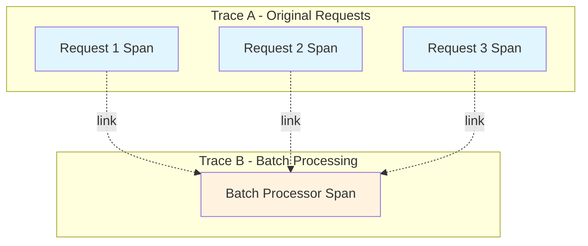
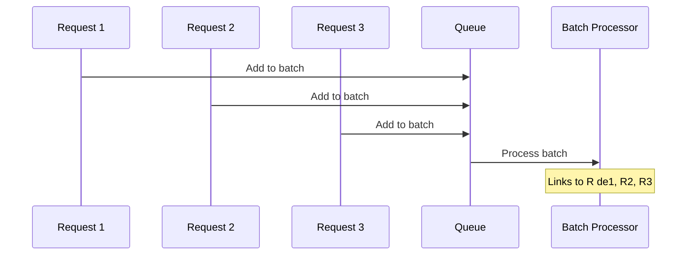
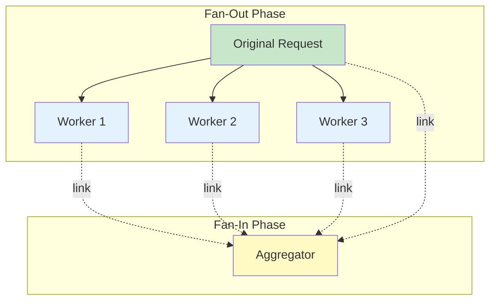
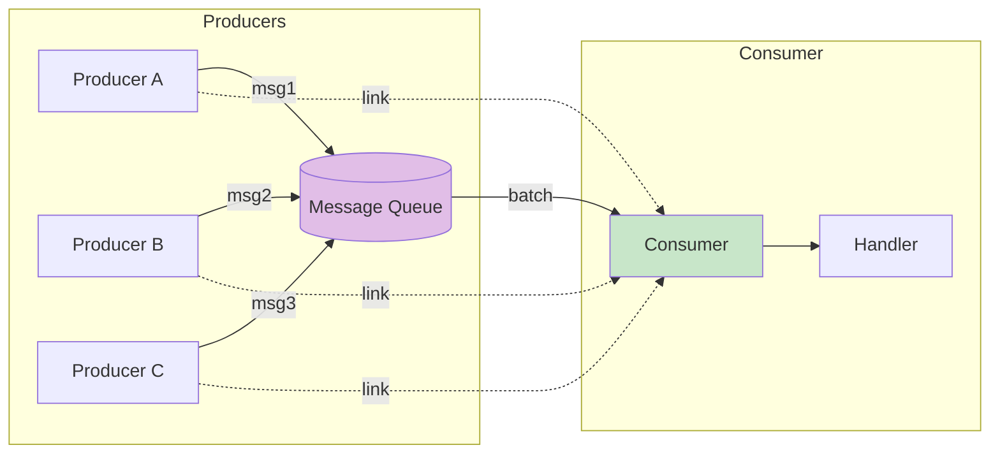
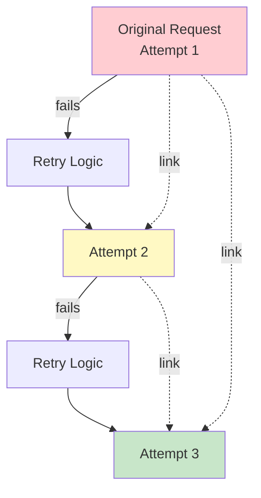
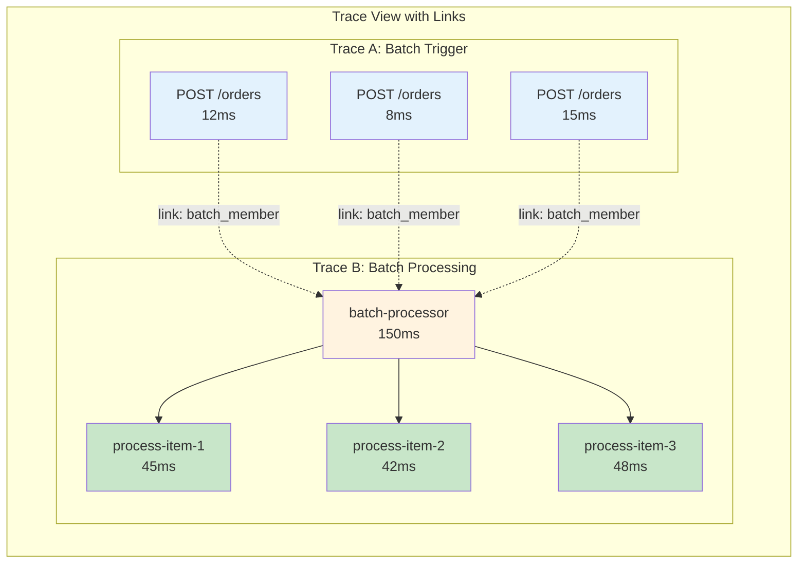

# How to Use OpenTelemetry Span Links for Complex Trace Relationships

Author: [nawazdhandala](https://github.com/nawazdhandala)

Tags: OpenTelemetry, Observability, Tracing, Span Links, Distributed Systems

Description: Learn how to use span links to represent complex relationships between traces in OpenTelemetry.

---

## Introduction

In distributed systems, understanding the relationships between operations is crucial for effective debugging and performance optimization. While OpenTelemetry's parent-child span relationships work well for synchronous, linear request flows, many real-world scenarios involve more complex relationships that cannot be represented by a simple hierarchy.

This is where **span links** come into play. Span links allow you to connect spans across different traces or within the same trace, representing causal relationships that are not strictly parent-child. They are essential for understanding batch processing, fan-out/fan-in patterns, and asynchronous workflows.

## What Are Span Links?

A span link is a reference from one span to another that indicates a causal relationship without implying a parent-child hierarchy. Unlike parent spans, linked spans:

- Can exist in different traces
- Can be created at different times
- Represent "influenced by" rather than "created by" relationships
- Support many-to-many relationships



## When to Use Span Links

Span links are particularly useful in the following scenarios:

1. **Batch Processing**: When multiple requests are collected and processed together
2. **Fan-out/Fan-in Patterns**: When one operation triggers multiple parallel operations
3. **Async Message Queues**: When messages from different sources are consumed together
4. **Retries and Reprocessing**: Linking retry attempts to original requests
5. **Scheduled Jobs**: Linking scheduled work to the events that triggered it

## Basic Span Link Implementation

The following example demonstrates how to create a basic span link in Python. We first create a span that will be linked to, then create another span and add the link reference.

```python
# Import the required OpenTelemetry modules for tracing
from opentelemetry import trace
from opentelemetry.trace import Link, SpanContext, TraceFlags

# Get a tracer instance from the global tracer provider
# The tracer name should identify your application or library
tracer = trace.get_tracer("my-service")

# Create the first span that we will later link to
# This could represent an initial request or trigger event
with tracer.start_as_current_span("original-request") as original_span:
    # Get the span context which contains the trace_id and span_id
    # This context is what we will use to create the link
    original_context = original_span.get_span_context()

    # Perform the original operation
    process_request()

# Later, in a different trace or operation, create a link to the original span
# The Link object requires the SpanContext of the span we want to link to
link = Link(
    context=original_context,
    # Attributes provide additional context about the relationship
    attributes={"link.reason": "triggered_by_request"}
)

# Create a new span with the link attached
# The links parameter accepts a sequence of Link objects
with tracer.start_as_current_span("batch-processor", links=[link]) as batch_span:
    # This span is now linked to the original request span
    # Observability tools can show this relationship
    process_batch()
```

## Batch Processing with Span Links

One of the most common use cases for span links is batch processing, where multiple incoming requests are collected and processed together. Here is a complete implementation:



The following code demonstrates a batch processor that collects items from a queue and processes them together, creating span links to each original request:

```python
# Import required modules for batch processing with OpenTelemetry
from opentelemetry import trace
from opentelemetry.trace import Link
from typing import List, Tuple
from dataclasses import dataclass
import time

# Get tracer instance for the batch processing service
tracer = trace.get_tracer("batch-processor-service")

@dataclass
class BatchItem:
    """
    Represents an item in the batch queue.
    Each item stores its data along with the span context
    from the original request that created it.
    """
    data: dict
    # Store the original span context so we can link to it later
    span_context: trace.SpanContext


class BatchProcessor:
    """
    A batch processor that collects items and processes them together.
    Uses span links to maintain traceability back to original requests.
    """

    def __init__(self, batch_size: int = 10, flush_interval: float = 5.0):
        # Initialize the batch queue and configuration
        self.queue: List[BatchItem] = []
        self.batch_size = batch_size
        self.flush_interval = flush_interval

    def add_item(self, data: dict) -> None:
        """
        Add an item to the batch queue.
        Captures the current span context to enable linking later.
        """
        # Create a span for the incoming request
        # This span represents the original operation that created this item
        with tracer.start_as_current_span("receive-item") as span:
            # Add contextual attributes to help with debugging
            span.set_attribute("item.id", data.get("id", "unknown"))
            span.set_attribute("item.type", data.get("type", "unknown"))

            # Create a BatchItem that stores both the data and span context
            # The span context allows us to create links during batch processing
            item = BatchItem(
                data=data,
                span_context=span.get_span_context()
            )

            self.queue.append(item)

            # Log the queue size for monitoring
            span.set_attribute("queue.size", len(self.queue))

        # Check if we should trigger batch processing
        if len(self.queue) >= self.batch_size:
            self.process_batch()

    def process_batch(self) -> None:
        """
        Process all items in the queue as a batch.
        Creates span links to all original request spans.
        """
        if not self.queue:
            return

        # Create links to all original request spans
        # Each link connects the batch processing span to an original request
        links = []
        for index, item in enumerate(self.queue):
            # Create a Link object for each item in the batch
            # Include attributes that describe the relationship
            link = Link(
                context=item.span_context,
                attributes={
                    # Describe why this link exists
                    "link.relationship": "batch_member",
                    # Track position in the batch for debugging
                    "batch.item.index": index,
                    # Include the original item ID for correlation
                    "original.item.id": item.data.get("id", "unknown")
                }
            )
            links.append(link)

        # Create the batch processing span with all links attached
        # This span represents the unified batch operation
        with tracer.start_as_current_span(
            "process-batch",
            links=links
        ) as batch_span:
            # Record batch metadata for observability
            batch_span.set_attribute("batch.size", len(self.queue))
            batch_span.set_attribute("batch.item_ids",
                [item.data.get("id") for item in self.queue])

            try:
                # Process each item in the batch
                # Create child spans for individual item processing
                for item in self.queue:
                    with tracer.start_as_current_span("process-item") as item_span:
                        item_span.set_attribute("item.id", item.data.get("id"))
                        self._process_single_item(item.data)

                batch_span.set_attribute("batch.status", "success")

            except Exception as e:
                # Record the error and mark the batch as failed
                batch_span.set_attribute("batch.status", "error")
                batch_span.record_exception(e)
                raise

            finally:
                # Clear the queue after processing
                self.queue.clear()

    def _process_single_item(self, data: dict) -> None:
        """Process a single item from the batch."""
        # Simulate processing work
        time.sleep(0.01)


# Example usage demonstrating the batch processor
def example_usage():
    """
    Demonstrates how the batch processor works with span links.
    """
    processor = BatchProcessor(batch_size=3)

    # Simulate incoming requests
    # Each request creates its own span, and the context is preserved
    for i in range(5):
        processor.add_item({
            "id": f"item-{i}",
            "type": "order",
            "payload": {"quantity": i + 1}
        })
```

## Fan-Out/Fan-In Pattern with Span Links

The fan-out/fan-in pattern occurs when a single request triggers multiple parallel operations, which then need to be collected and aggregated. This pattern requires bidirectional span links.



The following implementation shows how to trace a complete fan-out/fan-in workflow:

```python
# Import required modules for fan-out/fan-in tracing
from opentelemetry import trace
from opentelemetry.trace import Link, SpanContext
from concurrent.futures import ThreadPoolExecutor, Future
from typing import List, Dict, Any
import asyncio

tracer = trace.get_tracer("fan-out-service")


class FanOutFanInProcessor:
    """
    Implements the fan-out/fan-in pattern with comprehensive span linking.
    Tracks relationships between the original request, parallel workers,
    and the final aggregation step.
    """

    def __init__(self, num_workers: int = 4):
        # Initialize the thread pool for parallel processing
        self.executor = ThreadPoolExecutor(max_workers=num_workers)
        self.num_workers = num_workers

    def process(self, request: Dict[str, Any]) -> Dict[str, Any]:
        """
        Main entry point for fan-out/fan-in processing.

        This method:
        1. Creates the initial request span
        2. Fans out work to multiple workers
        3. Collects results and creates an aggregation span with links
        """
        # Create the root span for the entire operation
        with tracer.start_as_current_span("fan-out-request") as request_span:
            request_id = request.get("id", "unknown")
            request_span.set_attribute("request.id", request_id)

            # Capture the request span context for linking in aggregation
            request_context = request_span.get_span_context()

            # Split the work into chunks for parallel processing
            work_chunks = self._split_work(request)
            request_span.set_attribute("fan_out.num_chunks", len(work_chunks))

            # Fan out: dispatch work to parallel workers
            # Each worker will create its own span and return the context
            worker_results = self._fan_out(work_chunks, request_context)

            # Fan in: aggregate results with links to all worker spans
            final_result = self._fan_in(
                worker_results,
                request_context
            )

            request_span.set_attribute("result.status", "success")
            return final_result

    def _split_work(self, request: Dict[str, Any]) -> List[Dict[str, Any]]:
        """
        Split the incoming request into smaller work chunks.
        Each chunk will be processed by a separate worker.
        """
        data = request.get("data", [])
        chunk_size = max(1, len(data) // self.num_workers)

        chunks = []
        for i in range(0, len(data), chunk_size):
            chunks.append({
                "chunk_id": i // chunk_size,
                "items": data[i:i + chunk_size],
                "parent_request_id": request.get("id")
            })

        return chunks

    def _fan_out(
        self,
        chunks: List[Dict[str, Any]],
        request_context: SpanContext
    ) -> List[Dict[str, Any]]:
        """
        Fan out work to parallel workers.
        Each worker creates its own span linked to the original request.
        """
        # Create a span for the fan-out coordination phase
        with tracer.start_as_current_span("coordinate-fan-out") as coord_span:
            coord_span.set_attribute("num_workers", len(chunks))

            # Submit work to workers and collect futures
            futures: List[Future] = []
            for chunk in chunks:
                future = self.executor.submit(
                    self._worker_process,
                    chunk,
                    request_context
                )
                futures.append(future)

            # Collect results from all workers
            results = []
            for future in futures:
                result = future.result()
                results.append(result)

            coord_span.set_attribute("completed_workers", len(results))
            return results

    def _worker_process(
        self,
        chunk: Dict[str, Any],
        request_context: SpanContext
    ) -> Dict[str, Any]:
        """
        Worker function that processes a single chunk.
        Creates a span linked to the original request.
        """
        # Create a link to the original request span
        # This shows that this worker was triggered by that request
        request_link = Link(
            context=request_context,
            attributes={
                "link.relationship": "triggered_by",
                "link.description": "Worker spawned from fan-out request"
            }
        )

        # Create the worker span with the link to the original request
        with tracer.start_as_current_span(
            "worker-process",
            links=[request_link]
        ) as worker_span:
            chunk_id = chunk.get("chunk_id", 0)
            worker_span.set_attribute("worker.chunk_id", chunk_id)
            worker_span.set_attribute("worker.item_count", len(chunk.get("items", [])))

            # Process the items in this chunk
            processed_items = []
            for item in chunk.get("items", []):
                processed = self._process_item(item)
                processed_items.append(processed)

            # Return both the result and the worker's span context
            # The context will be used for linking in the fan-in phase
            return {
                "chunk_id": chunk_id,
                "results": processed_items,
                "worker_span_context": worker_span.get_span_context()
            }

    def _process_item(self, item: Any) -> Any:
        """Process a single item. Override in subclasses."""
        # Simulate processing
        return {"processed": item, "status": "complete"}

    def _fan_in(
        self,
        worker_results: List[Dict[str, Any]],
        request_context: SpanContext
    ) -> Dict[str, Any]:
        """
        Fan in: aggregate results from all workers.
        Creates links to both the original request and all worker spans.
        """
        # Build links to all related spans
        links = []

        # Link to the original request span
        # This shows the aggregator's relationship to the triggering request
        links.append(Link(
            context=request_context,
            attributes={
                "link.relationship": "aggregates_request",
                "link.description": "Aggregating results for original request"
            }
        ))

        # Link to each worker span
        # This shows which worker results are being aggregated
        for result in worker_results:
            worker_context = result.get("worker_span_context")
            if worker_context:
                links.append(Link(
                    context=worker_context,
                    attributes={
                        "link.relationship": "aggregates_worker",
                        "worker.chunk_id": result.get("chunk_id")
                    }
                ))

        # Create the aggregation span with all links
        with tracer.start_as_current_span(
            "aggregate-results",
            links=links
        ) as agg_span:
            agg_span.set_attribute("aggregation.num_workers", len(worker_results))

            # Combine all results into a single response
            all_results = []
            for worker_result in worker_results:
                all_results.extend(worker_result.get("results", []))

            agg_span.set_attribute("aggregation.total_items", len(all_results))

            return {
                "status": "success",
                "total_processed": len(all_results),
                "results": all_results
            }
```

## Async Message Queue Linking

When processing messages from a queue, span links help maintain the connection between message producers and consumers. This is especially important when multiple messages are processed together.



The following example shows how to implement span linking for message queue consumers:

```python
# Import required modules for message queue processing
from opentelemetry import trace
from opentelemetry.trace import Link, SpanContext
from opentelemetry.propagate import extract, inject
from typing import List, Dict, Any, Optional
import json

tracer = trace.get_tracer("message-queue-service")


class Message:
    """
    Represents a message from the queue with tracing context.
    The trace context is propagated in the message headers.
    """

    def __init__(self, body: Dict[str, Any], headers: Dict[str, str]):
        self.body = body
        self.headers = headers
        # Extract the span context from message headers
        # This context was injected by the producer
        self.producer_context: Optional[SpanContext] = self._extract_context()

    def _extract_context(self) -> Optional[SpanContext]:
        """
        Extract the OpenTelemetry context from message headers.
        Uses the W3C Trace Context format by default.
        """
        # The extract function parses trace context from carriers (like headers)
        context = extract(self.headers)
        span = trace.get_current_span(context)
        if span and span.get_span_context().is_valid:
            return span.get_span_context()
        return None


class MessageProducer:
    """
    Produces messages to a queue with tracing context.
    Injects the current span context into message headers.
    """

    def send_message(self, queue_name: str, body: Dict[str, Any]) -> None:
        """
        Send a message to the queue with tracing context.
        """
        with tracer.start_as_current_span("send-message") as span:
            span.set_attribute("messaging.system", "custom_queue")
            span.set_attribute("messaging.destination", queue_name)
            span.set_attribute("messaging.message_id", body.get("id", "unknown"))

            # Inject the current trace context into headers
            # This allows consumers to link back to this span
            headers: Dict[str, str] = {}
            inject(headers)

            # Create the message with trace context in headers
            message = {
                "body": body,
                "headers": headers
            }

            # Send to queue (implementation depends on your queue system)
            self._send_to_queue(queue_name, message)

            span.set_attribute("messaging.operation", "send")

    def _send_to_queue(self, queue_name: str, message: Dict) -> None:
        """Send message to the actual queue system."""
        # Implementation depends on your queue (RabbitMQ, Kafka, SQS, etc.)
        pass


class MessageConsumer:
    """
    Consumes messages from a queue with span linking.
    Links consumption spans to original producer spans.
    """

    def __init__(self, batch_size: int = 10):
        self.batch_size = batch_size

    def process_messages(self, messages: List[Message]) -> None:
        """
        Process a batch of messages with span links to producers.
        """
        # Create links to all producer spans
        # This maintains the causal relationship between production and consumption
        links = []
        for idx, message in enumerate(messages):
            if message.producer_context and message.producer_context.is_valid:
                link = Link(
                    context=message.producer_context,
                    attributes={
                        "link.relationship": "consumed_from",
                        "messaging.message_id": message.body.get("id", "unknown"),
                        "batch.index": idx
                    }
                )
                links.append(link)

        # Create the batch consumption span with all producer links
        with tracer.start_as_current_span(
            "consume-message-batch",
            links=links
        ) as batch_span:
            batch_span.set_attribute("messaging.batch_size", len(messages))
            batch_span.set_attribute("messaging.operation", "receive")
            batch_span.set_attribute("messaging.linked_producers", len(links))

            # Process each message individually
            for message in messages:
                self._process_single_message(message)

    def _process_single_message(self, message: Message) -> None:
        """
        Process a single message from the batch.
        Creates a child span for individual message processing.
        """
        with tracer.start_as_current_span("process-message") as span:
            message_id = message.body.get("id", "unknown")
            span.set_attribute("messaging.message_id", message_id)

            try:
                # Handle the message based on its type
                message_type = message.body.get("type", "unknown")
                span.set_attribute("messaging.message_type", message_type)

                self._handle_message(message.body)

                span.set_attribute("processing.status", "success")

            except Exception as e:
                span.set_attribute("processing.status", "error")
                span.record_exception(e)
                raise

    def _handle_message(self, body: Dict[str, Any]) -> None:
        """Handle the message content. Override in subclasses."""
        pass
```

## Retry and Reprocessing Links

When operations fail and need to be retried, span links help track the relationship between the original attempt and subsequent retries:



Here is an implementation of a retry mechanism with span linking:

```python
# Import required modules for retry handling with tracing
from opentelemetry import trace
from opentelemetry.trace import Link, SpanContext, StatusCode
from typing import Callable, Any, List, Optional
from dataclasses import dataclass, field
import time

tracer = trace.get_tracer("retry-service")


@dataclass
class AttemptRecord:
    """
    Records information about a single attempt.
    Stores the span context for linking in subsequent attempts.
    """
    attempt_number: int
    span_context: SpanContext
    error: Optional[str] = None
    duration_ms: float = 0


class RetryableOperation:
    """
    Wraps operations with retry logic and span linking.
    Each retry attempt is linked to all previous attempts.
    """

    def __init__(
        self,
        max_retries: int = 3,
        base_delay: float = 1.0,
        backoff_multiplier: float = 2.0
    ):
        self.max_retries = max_retries
        self.base_delay = base_delay
        self.backoff_multiplier = backoff_multiplier

    def execute(
        self,
        operation: Callable[[], Any],
        operation_name: str
    ) -> Any:
        """
        Execute an operation with retry logic and span linking.

        Each attempt creates a span linked to all previous attempts,
        providing full visibility into the retry history.
        """
        # Track all previous attempts for linking
        previous_attempts: List[AttemptRecord] = []
        last_error: Optional[Exception] = None

        for attempt in range(self.max_retries + 1):
            # Build links to all previous attempts
            # This creates a chain showing the full retry history
            links = []
            for prev_attempt in previous_attempts:
                link = Link(
                    context=prev_attempt.span_context,
                    attributes={
                        "link.relationship": "retry_of",
                        "previous.attempt_number": prev_attempt.attempt_number,
                        "previous.error": prev_attempt.error or "none"
                    }
                )
                links.append(link)

            # Create the span for this attempt
            span_name = f"{operation_name}-attempt-{attempt + 1}"
            with tracer.start_as_current_span(
                span_name,
                links=links
            ) as span:
                start_time = time.time()

                # Record attempt metadata
                span.set_attribute("retry.attempt_number", attempt + 1)
                span.set_attribute("retry.max_attempts", self.max_retries + 1)
                span.set_attribute("retry.is_retry", attempt > 0)
                span.set_attribute("retry.previous_attempts", len(previous_attempts))

                try:
                    # Execute the operation
                    result = operation()

                    # Success - record metrics and return
                    duration_ms = (time.time() - start_time) * 1000
                    span.set_attribute("retry.duration_ms", duration_ms)
                    span.set_attribute("retry.status", "success")
                    span.set_status(StatusCode.OK)

                    # If this was a retry, add success context
                    if attempt > 0:
                        span.set_attribute("retry.succeeded_on_attempt", attempt + 1)
                        span.set_attribute("retry.total_attempts_made", attempt + 1)

                    return result

                except Exception as e:
                    # Record the failure
                    duration_ms = (time.time() - start_time) * 1000
                    span.set_attribute("retry.duration_ms", duration_ms)
                    span.set_attribute("retry.status", "failed")
                    span.record_exception(e)

                    # Store this attempt for linking in the next retry
                    attempt_record = AttemptRecord(
                        attempt_number=attempt + 1,
                        span_context=span.get_span_context(),
                        error=str(e),
                        duration_ms=duration_ms
                    )
                    previous_attempts.append(attempt_record)
                    last_error = e

                    # Check if we should retry
                    if attempt < self.max_retries:
                        delay = self.base_delay * (self.backoff_multiplier ** attempt)
                        span.set_attribute("retry.next_delay_seconds", delay)
                        span.set_status(StatusCode.ERROR, f"Retrying in {delay}s")
                        time.sleep(delay)
                    else:
                        span.set_attribute("retry.exhausted", True)
                        span.set_status(StatusCode.ERROR, "Max retries exhausted")

        # All retries exhausted
        raise last_error


# Example usage demonstrating retry with span links
def example_retry_usage():
    """
    Demonstrates the retry mechanism with span linking.
    """
    retry_handler = RetryableOperation(max_retries=3)

    call_count = 0

    def flaky_operation():
        """An operation that fails the first two times."""
        nonlocal call_count
        call_count += 1
        if call_count < 3:
            raise Exception(f"Temporary failure on attempt {call_count}")
        return {"status": "success", "data": "processed"}

    # Execute with retries - span links will show the retry chain
    with tracer.start_as_current_span("retry-example"):
        result = retry_handler.execute(flaky_operation, "flaky-operation")
        print(f"Operation succeeded: {result}")
```

## Adding Rich Attributes to Span Links

Span links support attributes that provide additional context about the relationship between spans. Here are best practices for link attributes:

```python
# Import required modules
from opentelemetry import trace
from opentelemetry.trace import Link
from datetime import datetime
from typing import Dict, Any

tracer = trace.get_tracer("attribute-examples")


def create_rich_span_link(
    context: trace.SpanContext,
    relationship_type: str,
    metadata: Dict[str, Any]
) -> Link:
    """
    Create a span link with comprehensive attributes.
    Well-attributed links make debugging and analysis much easier.
    """
    # Build the attributes dictionary with meaningful information
    attributes = {
        # Always include the relationship type
        # This describes why the link exists
        "link.relationship": relationship_type,

        # Add a human-readable description
        "link.description": metadata.get("description", ""),

        # Include timing information when relevant
        "link.created_at": datetime.utcnow().isoformat(),

        # Add the source of the link for debugging
        "link.source.service": metadata.get("source_service", "unknown"),
        "link.source.operation": metadata.get("source_operation", "unknown"),
    }

    # Add correlation IDs if available
    # These help with cross-service debugging
    if "correlation_id" in metadata:
        attributes["link.correlation_id"] = metadata["correlation_id"]

    # Add business context when available
    if "business_entity" in metadata:
        attributes["link.business.entity_type"] = metadata["business_entity"]
    if "business_id" in metadata:
        attributes["link.business.entity_id"] = metadata["business_id"]

    return Link(context=context, attributes=attributes)


# Common relationship types and their recommended attributes
RELATIONSHIP_EXAMPLES = {
    "triggered_by": {
        # Used when one operation causes another to start
        "attributes": ["trigger.reason", "trigger.delay_ms"]
    },
    "follows_from": {
        # Used for async continuation of work
        "attributes": ["continuation.type", "continuation.delay_ms"]
    },
    "aggregates": {
        # Used when combining results from multiple sources
        "attributes": ["aggregation.index", "aggregation.total_count"]
    },
    "batch_member": {
        # Used for items processed in a batch
        "attributes": ["batch.id", "batch.position", "batch.size"]
    },
    "retry_of": {
        # Used for retry attempts
        "attributes": ["retry.attempt", "retry.reason", "retry.delay_ms"]
    },
    "child_of": {
        # Used when parent-child doesn't fit trace hierarchy
        "attributes": ["child.reason", "child.async"]
    }
}
```

## Best Practices for Span Links

### 1. Choose the Right Relationship Type

Understanding when to use span links versus parent-child relationships is crucial:

```python
# Use PARENT-CHILD when:
# - The child operation is synchronously called by the parent
# - The child cannot exist without the parent
# - There is a clear hierarchical relationship

# Use SPAN LINKS when:
# - Operations are in different traces
# - Operations happen asynchronously
# - Multiple operations contribute to one result (batch processing)
# - One operation triggers multiple parallel operations (fan-out)

# Example: Choosing the right relationship
def process_with_correct_relationships(order_id: str, items: List[str]):
    """
    Demonstrates when to use parent-child vs links.
    """
    with tracer.start_as_current_span("process-order") as order_span:
        # Parent-child: Validation is synchronous and hierarchical
        with tracer.start_as_current_span("validate-order") as validate_span:
            validate_order(order_id)

        # Parent-child: Checking inventory is part of the order flow
        with tracer.start_as_current_span("check-inventory") as inventory_span:
            inventory_result = check_inventory(items)

        # Links: These items will be processed in separate traces later
        # Store the context for linking in the batch processor
        store_for_batch_processing(order_id, order_span.get_span_context())
```

### 2. Limit the Number of Links

While there is no hard limit on span links, too many links can make traces difficult to understand:

```python
# Configure maximum links based on your use case
MAX_LINKS_PER_SPAN = 32  # OpenTelemetry SDK default

def create_bounded_links(
    contexts: List[SpanContext],
    relationship: str
) -> List[Link]:
    """
    Create links with a reasonable upper bound.
    Prioritize the most important relationships.
    """
    links = []

    if len(contexts) > MAX_LINKS_PER_SPAN:
        # Log a warning about link truncation
        print(f"Warning: Truncating {len(contexts)} links to {MAX_LINKS_PER_SPAN}")

        # Take the first MAX_LINKS_PER_SPAN contexts
        # Consider sorting by importance first
        contexts = contexts[:MAX_LINKS_PER_SPAN]

    for ctx in contexts:
        links.append(Link(
            context=ctx,
            attributes={"link.relationship": relationship}
        ))

    return links
```

### 3. Preserve Context Across Boundaries

When working with span links across service boundaries, ensure proper context propagation:

```python
# Import propagation utilities
from opentelemetry.propagate import inject, extract
from opentelemetry.trace import SpanContext
import json


def serialize_span_context(context: SpanContext) -> str:
    """
    Serialize a span context for storage or transmission.
    Useful when you need to store context for later linking.
    """
    # Use the standard W3C trace context format
    carrier = {}
    # Note: inject uses the current context, so we need to use a custom approach
    return json.dumps({
        "trace_id": format(context.trace_id, '032x'),
        "span_id": format(context.span_id, '016x'),
        "trace_flags": context.trace_flags,
        "trace_state": str(context.trace_state) if context.trace_state else None
    })


def deserialize_span_context(data: str) -> SpanContext:
    """
    Deserialize a stored span context for linking.
    """
    parsed = json.loads(data)
    return SpanContext(
        trace_id=int(parsed["trace_id"], 16),
        span_id=int(parsed["span_id"], 16),
        is_remote=True,  # Mark as remote since it came from storage
        trace_flags=trace.TraceFlags(parsed["trace_flags"]),
        trace_state=trace.TraceState.from_header(parsed.get("trace_state") or "")
    )
```

### 4. Document Link Semantics

Create clear documentation for your team about what different link relationships mean:

```python
# Define a standard vocabulary for link relationships in your organization
LINK_RELATIONSHIP_DEFINITIONS = """
Standard Link Relationships:

1. triggered_by
   - Use when: An event or request caused this operation to start
   - Example: A scheduled job linked to the cron trigger

2. batch_member
   - Use when: This operation processes multiple items together
   - Example: Batch processor linked to individual request spans

3. follows_from
   - Use when: This operation is a logical continuation of another
   - Example: Async callback linked to the initiating request

4. aggregates
   - Use when: This operation combines results from multiple sources
   - Example: Fan-in aggregator linked to parallel worker spans

5. retry_of
   - Use when: This is a retry attempt of a previous operation
   - Example: Third attempt linked to first and second attempts

6. compensates
   - Use when: This operation reverses or compensates for another
   - Example: Refund operation linked to original payment

7. derived_from
   - Use when: Data in this operation came from another operation
   - Example: Report generation linked to data collection spans
"""


def validate_link_relationship(relationship: str) -> bool:
    """
    Validate that a link relationship follows the standard vocabulary.
    """
    valid_relationships = {
        "triggered_by", "batch_member", "follows_from",
        "aggregates", "retry_of", "compensates", "derived_from"
    }
    return relationship in valid_relationships
```

## Visualizing Span Links

Modern observability tools display span links alongside the trace waterfall. Here is how links appear in common tools:



## Complete Example: Order Processing System

Here is a complete example that demonstrates all span linking patterns in a realistic order processing system:

```python
# Complete order processing system with comprehensive span linking
# This example demonstrates batch processing, fan-out/fan-in, and retry patterns

from opentelemetry import trace
from opentelemetry.trace import Link, SpanContext, StatusCode
from concurrent.futures import ThreadPoolExecutor
from dataclasses import dataclass
from typing import List, Dict, Any, Optional
from datetime import datetime
import time
import random

tracer = trace.get_tracer("order-processing-service")


@dataclass
class Order:
    """Represents a customer order."""
    order_id: str
    customer_id: str
    items: List[Dict[str, Any]]
    total_amount: float
    span_context: Optional[SpanContext] = None


class OrderProcessor:
    """
    Comprehensive order processor demonstrating all span link patterns.
    """

    def __init__(self):
        # Initialize components
        self.order_queue: List[Order] = []
        self.executor = ThreadPoolExecutor(max_workers=4)
        self.batch_size = 5

    def receive_order(self, order_data: Dict[str, Any]) -> str:
        """
        Receive an order and add it to the processing queue.
        Captures span context for later batch processing links.
        """
        with tracer.start_as_current_span("receive-order") as span:
            # Create the order object with the current span context
            order = Order(
                order_id=order_data["order_id"],
                customer_id=order_data["customer_id"],
                items=order_data["items"],
                total_amount=order_data["total_amount"],
                # Store the span context for linking during batch processing
                span_context=span.get_span_context()
            )

            span.set_attribute("order.id", order.order_id)
            span.set_attribute("order.customer_id", order.customer_id)
            span.set_attribute("order.item_count", len(order.items))
            span.set_attribute("order.total_amount", order.total_amount)

            self.order_queue.append(order)
            span.set_attribute("queue.size", len(self.order_queue))

            # Trigger batch processing if threshold reached
            if len(self.order_queue) >= self.batch_size:
                self._process_order_batch()

            return order.order_id

    def _process_order_batch(self) -> None:
        """
        Process a batch of orders with span links to each order's receive span.
        Implements the batch processing pattern.
        """
        if not self.order_queue:
            return

        # Get orders to process and clear the queue
        orders_to_process = self.order_queue[:self.batch_size]
        self.order_queue = self.order_queue[self.batch_size:]

        # Create links to all order receive spans
        # This connects the batch to each individual order
        links = []
        for order in orders_to_process:
            if order.span_context:
                links.append(Link(
                    context=order.span_context,
                    attributes={
                        "link.relationship": "batch_member",
                        "order.id": order.order_id,
                        "order.received_at": datetime.utcnow().isoformat()
                    }
                ))

        # Create the batch processing span with all order links
        with tracer.start_as_current_span(
            "process-order-batch",
            links=links
        ) as batch_span:
            batch_span.set_attribute("batch.size", len(orders_to_process))
            batch_span.set_attribute("batch.order_ids",
                [o.order_id for o in orders_to_process])

            batch_context = batch_span.get_span_context()

            # Fan out: Process each order's items in parallel
            # Each worker will be linked back to this batch span
            worker_contexts = self._fan_out_order_processing(
                orders_to_process,
                batch_context
            )

            # Fan in: Aggregate results from all workers
            self._fan_in_results(worker_contexts, batch_context)

    def _fan_out_order_processing(
        self,
        orders: List[Order],
        batch_context: SpanContext
    ) -> List[Dict[str, Any]]:
        """
        Fan out order processing to parallel workers.
        Each worker handles one order's items.
        """
        with tracer.start_as_current_span("fan-out-orders") as span:
            span.set_attribute("fan_out.num_orders", len(orders))

            # Submit each order to a worker
            futures = []
            for order in orders:
                future = self.executor.submit(
                    self._process_single_order,
                    order,
                    batch_context
                )
                futures.append((order.order_id, future))

            # Collect results
            results = []
            for order_id, future in futures:
                result = future.result()
                results.append({
                    "order_id": order_id,
                    "worker_context": result["span_context"],
                    "status": result["status"]
                })

            span.set_attribute("fan_out.completed", len(results))
            return results

    def _process_single_order(
        self,
        order: Order,
        batch_context: SpanContext
    ) -> Dict[str, Any]:
        """
        Process a single order in a worker thread.
        Links back to the batch processing span.
        """
        # Link to the batch that triggered this processing
        batch_link = Link(
            context=batch_context,
            attributes={
                "link.relationship": "triggered_by",
                "batch.operation": "order_processing"
            }
        )

        # Also link to the original order receive span if available
        links = [batch_link]
        if order.span_context:
            links.append(Link(
                context=order.span_context,
                attributes={
                    "link.relationship": "processes",
                    "order.id": order.order_id
                }
            ))

        with tracer.start_as_current_span(
            "process-order-worker",
            links=links
        ) as span:
            span.set_attribute("order.id", order.order_id)
            span.set_attribute("order.item_count", len(order.items))

            try:
                # Process each item with retry logic
                for item in order.items:
                    self._process_item_with_retry(item)

                span.set_attribute("processing.status", "success")
                return {
                    "span_context": span.get_span_context(),
                    "status": "success"
                }

            except Exception as e:
                span.set_attribute("processing.status", "error")
                span.record_exception(e)
                return {
                    "span_context": span.get_span_context(),
                    "status": "error"
                }

    def _process_item_with_retry(self, item: Dict[str, Any]) -> None:
        """
        Process a single item with retry logic and span linking.
        """
        max_attempts = 3
        previous_attempts: List[SpanContext] = []

        for attempt in range(max_attempts):
            # Build links to previous attempts
            links = []
            for idx, prev_context in enumerate(previous_attempts):
                links.append(Link(
                    context=prev_context,
                    attributes={
                        "link.relationship": "retry_of",
                        "retry.previous_attempt": idx + 1
                    }
                ))

            with tracer.start_as_current_span(
                f"process-item-attempt-{attempt + 1}",
                links=links
            ) as span:
                span.set_attribute("item.id", item.get("id", "unknown"))
                span.set_attribute("item.sku", item.get("sku", "unknown"))
                span.set_attribute("retry.attempt", attempt + 1)
                span.set_attribute("retry.is_retry", attempt > 0)

                try:
                    # Simulate processing with random failures
                    if random.random() < 0.3 and attempt < max_attempts - 1:
                        raise Exception("Temporary processing error")

                    # Simulate work
                    time.sleep(0.01)

                    span.set_status(StatusCode.OK)
                    return

                except Exception as e:
                    previous_attempts.append(span.get_span_context())
                    span.record_exception(e)

                    if attempt == max_attempts - 1:
                        span.set_status(StatusCode.ERROR, "Max retries exhausted")
                        raise

                    span.set_status(StatusCode.ERROR, f"Retrying...")
                    time.sleep(0.05 * (attempt + 1))  # Backoff

    def _fan_in_results(
        self,
        worker_results: List[Dict[str, Any]],
        batch_context: SpanContext
    ) -> None:
        """
        Fan in: Aggregate results from all workers.
        Links to both the batch span and all worker spans.
        """
        # Build links to batch and all workers
        links = [
            Link(
                context=batch_context,
                attributes={
                    "link.relationship": "aggregates_batch",
                    "aggregation.type": "order_results"
                }
            )
        ]

        for result in worker_results:
            if result.get("worker_context"):
                links.append(Link(
                    context=result["worker_context"],
                    attributes={
                        "link.relationship": "aggregates_worker",
                        "order.id": result["order_id"],
                        "worker.status": result["status"]
                    }
                ))

        with tracer.start_as_current_span(
            "aggregate-order-results",
            links=links
        ) as span:
            # Calculate aggregation metrics
            total_orders = len(worker_results)
            successful = sum(1 for r in worker_results if r["status"] == "success")
            failed = total_orders - successful

            span.set_attribute("aggregation.total_orders", total_orders)
            span.set_attribute("aggregation.successful", successful)
            span.set_attribute("aggregation.failed", failed)
            span.set_attribute("aggregation.success_rate",
                successful / total_orders if total_orders > 0 else 0)

            if failed > 0:
                span.set_status(StatusCode.ERROR, f"{failed} orders failed")
            else:
                span.set_status(StatusCode.OK)


# Example usage
def run_order_processing_example():
    """
    Demonstrates the complete order processing system.
    """
    processor = OrderProcessor()

    # Simulate receiving multiple orders
    for i in range(7):
        order_data = {
            "order_id": f"ORD-{i:04d}",
            "customer_id": f"CUST-{i % 3:03d}",
            "items": [
                {"id": f"ITEM-{j}", "sku": f"SKU-{j:04d}", "quantity": j + 1}
                for j in range(random.randint(1, 4))
            ],
            "total_amount": random.uniform(50, 500)
        }

        order_id = processor.receive_order(order_data)
        print(f"Received order: {order_id}")


if __name__ == "__main__":
    run_order_processing_example()
```

## Conclusion

Span links are a powerful feature in OpenTelemetry that enable you to represent complex relationships between operations that go beyond simple parent-child hierarchies. By using span links effectively, you can:

1. **Trace batch processing**: Connect batch operations back to individual requests
2. **Understand fan-out/fan-in patterns**: Track parallel processing and result aggregation
3. **Debug async workflows**: Follow message flows across queues and services
4. **Analyze retry behavior**: See the complete history of retry attempts

Key takeaways:

- Use span links when parent-child relationships do not fit the actual causality
- Always include meaningful attributes that describe the relationship
- Keep the number of links reasonable for readability
- Document your link semantics for team consistency
- Leverage visualization tools to explore linked traces

With proper span linking, your distributed traces will provide much deeper insights into complex system behaviors, making debugging and performance optimization significantly more effective.

## Additional Resources

- [OpenTelemetry Specification: Links](https://opentelemetry.io/docs/concepts/signals/traces/#span-links)
- [OpenTelemetry Python SDK Documentation](https://opentelemetry.io/docs/instrumentation/python/)
- [W3C Trace Context Specification](https://www.w3.org/TR/trace-context/)
- [Distributed Tracing Best Practices](https://opentelemetry.io/docs/concepts/signals/traces/)
