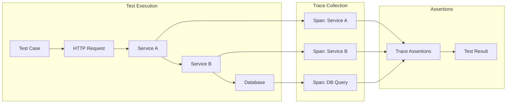
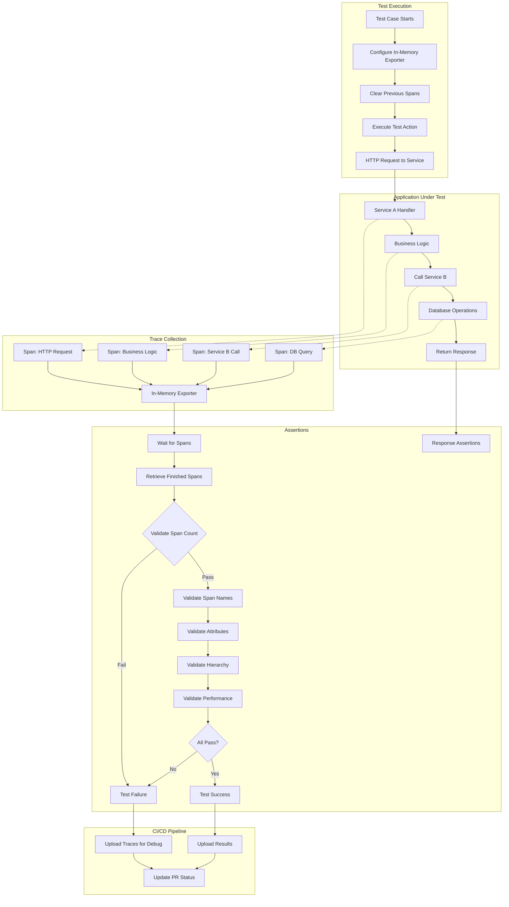

# How to Implement Trace-Based Testing with OpenTelemetry

Author: [nawazdhandala](https://github.com/nawazdhandala)

Tags: OpenTelemetry, Observability, Testing, Tracing, Quality Assurance, DevOps

Description: A guide to using OpenTelemetry traces for automated testing and quality validation.

---

Trace-based testing represents a paradigm shift in how we validate distributed systems. Instead of testing components in isolation, trace-based testing leverages OpenTelemetry traces to verify the actual behavior of requests as they flow through your entire system. This approach provides unprecedented visibility into integration points, service boundaries, and end-to-end functionality.

In this comprehensive guide, we will explore how to implement trace-based testing using OpenTelemetry, covering assertion libraries, integration test instrumentation, span validation patterns, and CI/CD integration.

## What is Trace-Based Testing?

Trace-based testing uses distributed traces captured during test execution to make assertions about system behavior. Rather than mocking external dependencies or relying solely on response data, you can verify:

- The exact sequence of service calls
- Timing and performance characteristics
- Error propagation across service boundaries
- Data flow through your distributed system
- Correct instrumentation of critical paths



## Setting Up the Testing Environment

### Prerequisites

Before diving into trace-based testing, ensure you have the following components set up:

- OpenTelemetry SDK installed in your application
- A trace collector (Jaeger, Zipkin, or OTLP endpoint)
- A test framework (Jest, pytest, Go testing, etc.)
- Access to trace data via API or in-memory exporter

### Installing Required Dependencies

The following commands install the OpenTelemetry SDK along with testing utilities for trace-based testing in a Node.js environment:

```bash
# Install OpenTelemetry core packages for trace generation and export
npm install @opentelemetry/api @opentelemetry/sdk-trace-node

# Install the in-memory exporter which captures spans for test assertions
npm install @opentelemetry/sdk-trace-base

# Install testing framework and HTTP client for making test requests
npm install jest supertest --save-dev
```

For Python projects, install the following packages:

```bash
# Install the OpenTelemetry API and SDK for Python trace instrumentation
pip install opentelemetry-api opentelemetry-sdk

# Install pytest for test execution and requests for HTTP testing
pip install pytest requests
```

## Configuring OpenTelemetry for Testing

### In-Memory Span Exporter

The in-memory exporter is crucial for trace-based testing as it allows you to capture and inspect spans without sending them to an external collector. This enables fast, isolated test execution.

The following configuration sets up an in-memory exporter that stores all spans in memory for later assertion:

```javascript
// test-tracer-setup.js
// This module configures OpenTelemetry with an in-memory exporter
// specifically designed for testing environments

const { NodeTracerProvider } = require('@opentelemetry/sdk-trace-node');
const {
  SimpleSpanProcessor,
  InMemorySpanExporter
} = require('@opentelemetry/sdk-trace-base');
const { Resource } = require('@opentelemetry/resources');
const {
  SemanticResourceAttributes
} = require('@opentelemetry/semantic-conventions');

// Create an in-memory exporter that stores spans in an array
// This allows us to retrieve and assert on spans after test execution
const memoryExporter = new InMemorySpanExporter();

// Configure the tracer provider with service identification
// The resource attributes help identify which service generated the spans
const provider = new NodeTracerProvider({
  resource: new Resource({
    [SemanticResourceAttributes.SERVICE_NAME]: 'test-service',
    [SemanticResourceAttributes.SERVICE_VERSION]: '1.0.0',
    // Add environment attribute to distinguish test traces
    [SemanticResourceAttributes.DEPLOYMENT_ENVIRONMENT]: 'test',
  }),
});

// Use SimpleSpanProcessor for synchronous span export
// This ensures spans are immediately available for assertions
// Note: In production, use BatchSpanProcessor for better performance
provider.addSpanProcessor(new SimpleSpanProcessor(memoryExporter));

// Register the provider globally so all instrumentation uses it
provider.register();

// Export both the exporter (for accessing spans) and provider (for cleanup)
module.exports = { memoryExporter, provider };
```

### Test Helper Utilities

Create helper functions that simplify trace assertions in your tests. These utilities abstract the complexity of working with raw span data:

```javascript
// trace-test-helpers.js
// Utility functions for making assertions on captured trace data

const { memoryExporter } = require('./test-tracer-setup');

/**
 * Retrieves all captured spans from the in-memory exporter
 * Call this after your test action to get spans for assertion
 * @returns {Array} Array of ReadableSpan objects
 */
function getSpans() {
  return memoryExporter.getFinishedSpans();
}

/**
 * Clears all captured spans from the exporter
 * Call this in beforeEach() to ensure test isolation
 */
function clearSpans() {
  memoryExporter.reset();
}

/**
 * Finds all spans matching a specific operation name
 * Useful for asserting on specific operations in your trace
 * @param {string} name - The span name to search for
 * @returns {Array} Array of matching spans
 */
function findSpansByName(name) {
  return getSpans().filter(span => span.name === name);
}

/**
 * Retrieves the root span (the span with no parent)
 * The root span represents the entry point of the trace
 * @returns {Object|undefined} The root span or undefined if not found
 */
function getRootSpan() {
  const spans = getSpans();
  return spans.find(span => !span.parentSpanId);
}

/**
 * Builds a hierarchical tree structure from flat span data
 * Useful for asserting on parent-child relationships
 * @returns {Object} Tree structure with root span and children
 */
function getSpanTree() {
  const spans = getSpans();
  const spanMap = new Map();

  // First pass: create a map of all spans by their ID
  spans.forEach(span => {
    spanMap.set(span.spanContext().spanId, {
      span,
      children: []
    });
  });

  // Second pass: build the tree by linking children to parents
  let root = null;
  spans.forEach(span => {
    const node = spanMap.get(span.spanContext().spanId);
    if (span.parentSpanId) {
      // This span has a parent, add it to parent's children array
      const parent = spanMap.get(span.parentSpanId);
      if (parent) {
        parent.children.push(node);
      }
    } else {
      // No parent means this is the root span
      root = node;
    }
  });

  return root;
}

/**
 * Waits for a specific number of spans to be captured
 * Useful when testing async operations that generate spans over time
 * @param {number} count - Expected number of spans
 * @param {number} timeout - Maximum time to wait in milliseconds
 * @returns {Promise<Array>} Resolves with spans when count is reached
 */
async function waitForSpans(count, timeout = 5000) {
  const startTime = Date.now();

  while (Date.now() - startTime < timeout) {
    const spans = getSpans();
    if (spans.length >= count) {
      return spans;
    }
    // Small delay before checking again to avoid busy waiting
    await new Promise(resolve => setTimeout(resolve, 50));
  }

  throw new Error(
    `Timeout: Expected ${count} spans but only found ${getSpans().length}`
  );
}

module.exports = {
  getSpans,
  clearSpans,
  findSpansByName,
  getRootSpan,
  getSpanTree,
  waitForSpans,
};
```

## Trace Assertion Libraries

### Using Tracetest

Tracetest is a dedicated tool for trace-based testing that integrates with OpenTelemetry. It provides a declarative way to define trace assertions.

The following YAML configuration defines a Tracetest test that validates an order creation flow:

```yaml
# tracetest-order-test.yaml
# This test definition validates the complete order creation flow
# Tracetest will execute the trigger and then assert on the resulting trace

type: Test
spec:
  # Unique identifier for this test
  id: order-creation-test
  name: Order Creation Flow Test
  description: Validates that order creation properly spans all required services

  # The trigger defines how to initiate the test
  # This HTTP request will generate the trace we want to validate
  trigger:
    type: http
    httpRequest:
      method: POST
      url: ${var:API_URL}/api/orders
      headers:
        - key: Content-Type
          value: application/json
      body: |
        {
          "customerId": "cust-123",
          "items": [
            {"productId": "prod-456", "quantity": 2}
          ]
        }

  # Specs define the assertions to make on the captured trace
  # Each spec targets specific spans and makes assertions on their attributes
  specs:
    # Assert that an HTTP span exists with successful status
    - selector: span[tracetest.span.type="http"]
      name: HTTP request completes successfully
      assertions:
        # Verify the HTTP response code is 201 (Created)
        - attr:http.status_code = 201
        # Ensure the request method matches what we sent
        - attr:http.method = "POST"

    # Assert on the order service span
    - selector: span[name="OrderService.createOrder"]
      name: Order service processes the request
      assertions:
        # Verify no errors occurred in the order service
        - attr:error.message = ""
        # Check that the order was assigned an ID
        - attr:order.id != ""

    # Assert on the inventory service span
    - selector: span[name="InventoryService.reserveStock"]
      name: Inventory is properly reserved
      assertions:
        # Verify stock reservation was successful
        - attr:inventory.reserved = true
        # Ensure the correct quantity was reserved
        - attr:inventory.quantity = 2

    # Assert on the payment service span
    - selector: span[name="PaymentService.processPayment"]
      name: Payment is processed
      assertions:
        # Verify payment was approved
        - attr:payment.status = "approved"
        # Check that payment ID was generated
        - attr:payment.id != ""

    # Assert on database operations
    - selector: span[tracetest.span.type="database"]
      name: Database operations complete
      assertions:
        # Ensure DB operations don't take too long
        - attr:tracetest.span.duration < 500ms
        # Verify the correct database is being used
        - attr:db.name = "orders"
```

### Custom Jest Assertions

For teams using Jest, you can create custom matchers that provide expressive trace assertions:

```javascript
// jest-trace-matchers.js
// Custom Jest matchers for asserting on OpenTelemetry trace data

const { SpanStatusCode } = require('@opentelemetry/api');

// Extend Jest with custom matchers for trace assertions
expect.extend({
  /**
   * Asserts that a span has a specific attribute with the expected value
   * Usage: expect(span).toHaveSpanAttribute('http.method', 'POST')
   */
  toHaveSpanAttribute(span, attributeName, expectedValue) {
    // Span attributes are stored in a Map-like structure
    const actualValue = span.attributes[attributeName];
    const pass = actualValue === expectedValue;

    return {
      pass,
      message: () => pass
        ? `Expected span NOT to have attribute ${attributeName}=${expectedValue}`
        : `Expected span to have attribute ${attributeName}=${expectedValue}, ` +
          `but got ${attributeName}=${actualValue}`,
    };
  },

  /**
   * Asserts that a span completed with OK status (no errors)
   * Usage: expect(span).toHaveSuccessStatus()
   */
  toHaveSuccessStatus(span) {
    const pass = span.status.code === SpanStatusCode.OK ||
                 span.status.code === SpanStatusCode.UNSET;

    return {
      pass,
      message: () => pass
        ? `Expected span NOT to have success status`
        : `Expected span to have success status, but got ` +
          `code=${span.status.code}, message=${span.status.message}`,
    };
  },

  /**
   * Asserts that a span completed with ERROR status
   * Optionally checks for a specific error message
   * Usage: expect(span).toHaveErrorStatus('Connection refused')
   */
  toHaveErrorStatus(span, expectedMessage = null) {
    const hasError = span.status.code === SpanStatusCode.ERROR;
    const messageMatches = expectedMessage
      ? span.status.message?.includes(expectedMessage)
      : true;
    const pass = hasError && messageMatches;

    return {
      pass,
      message: () => {
        if (!hasError) {
          return `Expected span to have error status, but got code=${span.status.code}`;
        }
        if (!messageMatches) {
          return `Expected error message to contain "${expectedMessage}", ` +
                 `but got "${span.status.message}"`;
        }
        return `Expected span NOT to have error status`;
      },
    };
  },

  /**
   * Asserts that a span's duration is within the expected threshold
   * Duration is in nanoseconds, so we convert from milliseconds
   * Usage: expect(span).toHaveDurationLessThan(100) // 100ms
   */
  toHaveDurationLessThan(span, maxDurationMs) {
    // Calculate duration in milliseconds from hrtime
    // startTime and endTime are [seconds, nanoseconds] tuples
    const durationNs = span.duration[0] * 1e9 + span.duration[1];
    const durationMs = durationNs / 1e6;
    const pass = durationMs < maxDurationMs;

    return {
      pass,
      message: () => pass
        ? `Expected span duration NOT to be less than ${maxDurationMs}ms`
        : `Expected span duration to be less than ${maxDurationMs}ms, ` +
          `but was ${durationMs.toFixed(2)}ms`,
    };
  },

  /**
   * Asserts that a span has a specific parent span
   * Useful for verifying trace hierarchy
   * Usage: expect(childSpan).toHaveParent(parentSpan)
   */
  toHaveParent(span, parentSpan) {
    const expectedParentId = parentSpan.spanContext().spanId;
    const actualParentId = span.parentSpanId;
    const pass = actualParentId === expectedParentId;

    return {
      pass,
      message: () => pass
        ? `Expected span NOT to have parent ${expectedParentId}`
        : `Expected span to have parent ${expectedParentId}, ` +
          `but had parent ${actualParentId}`,
    };
  },

  /**
   * Asserts that a collection of spans contains a span with the given name
   * Usage: expect(spans).toContainSpanWithName('HTTP GET /api/users')
   */
  toContainSpanWithName(spans, expectedName) {
    const found = spans.some(span => span.name === expectedName);
    const spanNames = spans.map(s => s.name);

    return {
      pass: found,
      message: () => found
        ? `Expected spans NOT to contain span named "${expectedName}"`
        : `Expected spans to contain span named "${expectedName}". ` +
          `Found spans: ${JSON.stringify(spanNames)}`,
    };
  },
});
```

## Integration Test Instrumentation

### Instrumenting Test Requests

When writing integration tests, you need to ensure that traces are properly propagated through your test requests. The following example shows how to instrument HTTP requests in your tests:

```javascript
// integration-test-example.test.js
// Integration test demonstrating trace-based testing patterns

const request = require('supertest');
const { trace, context, SpanKind } = require('@opentelemetry/api');
const app = require('../src/app');
const {
  clearSpans,
  getSpans,
  findSpansByName,
  waitForSpans,
  getSpanTree
} = require('./trace-test-helpers');

// Import custom Jest matchers for trace assertions
require('./jest-trace-matchers');

// Get a tracer instance for creating test spans
const tracer = trace.getTracer('integration-tests');

describe('Order API Integration Tests', () => {
  // Clear spans before each test to ensure isolation
  // This prevents spans from previous tests affecting current assertions
  beforeEach(() => {
    clearSpans();
  });

  describe('POST /api/orders', () => {
    it('should create order with complete trace through all services', async () => {
      // Create a parent span to wrap our test
      // This helps identify which spans belong to this specific test
      await tracer.startActiveSpan('test:create-order', async (testSpan) => {
        try {
          // Make the HTTP request to create an order
          // supertest automatically handles the request/response cycle
          const response = await request(app)
            .post('/api/orders')
            .send({
              customerId: 'cust-123',
              items: [
                { productId: 'prod-456', quantity: 2, price: 29.99 }
              ]
            })
            .expect(201);

          // Verify the response body contains expected data
          expect(response.body).toHaveProperty('orderId');
          expect(response.body.status).toBe('created');

          // Wait for all async spans to be captured
          // Our order flow should generate at least 5 spans
          const spans = await waitForSpans(5);

          // Assert on the trace structure
          // Verify that all expected service calls were made
          expect(spans).toContainSpanWithName('POST /api/orders');
          expect(spans).toContainSpanWithName('OrderService.createOrder');
          expect(spans).toContainSpanWithName('InventoryService.checkStock');
          expect(spans).toContainSpanWithName('PaymentService.authorize');
          expect(spans).toContainSpanWithName('INSERT orders');

          // Find and assert on specific spans
          const orderSpan = findSpansByName('OrderService.createOrder')[0];
          expect(orderSpan).toHaveSpanAttribute('order.id', response.body.orderId);
          expect(orderSpan).toHaveSpanAttribute('order.item_count', 1);
          expect(orderSpan).toHaveSuccessStatus();

          // Assert on database span performance
          const dbSpan = findSpansByName('INSERT orders')[0];
          expect(dbSpan).toHaveDurationLessThan(100); // 100ms max
          expect(dbSpan).toHaveSpanAttribute('db.system', 'postgresql');

          // Verify the trace hierarchy is correct
          const tree = getSpanTree();
          expect(tree).not.toBeNull();
          // Root should be our HTTP request span
          expect(tree.span.name).toBe('POST /api/orders');
          // It should have child spans for each service call
          expect(tree.children.length).toBeGreaterThanOrEqual(1);

        } finally {
          // Always end the test span, even if assertions fail
          testSpan.end();
        }
      });
    });

    it('should record error traces when inventory is insufficient', async () => {
      await tracer.startActiveSpan('test:insufficient-inventory', async (testSpan) => {
        try {
          // Request more items than available in inventory
          const response = await request(app)
            .post('/api/orders')
            .send({
              customerId: 'cust-123',
              items: [
                { productId: 'prod-456', quantity: 9999, price: 29.99 }
              ]
            })
            .expect(400);

          expect(response.body.error).toBe('Insufficient inventory');

          // Wait for spans to be captured
          const spans = await waitForSpans(3);

          // Find the inventory check span - it should have an error
          const inventorySpan = findSpansByName('InventoryService.checkStock')[0];
          expect(inventorySpan).toHaveErrorStatus('Insufficient stock');
          expect(inventorySpan).toHaveSpanAttribute('inventory.requested', 9999);
          expect(inventorySpan).toHaveSpanAttribute('inventory.available', 100);

          // Verify that payment was NOT called (should short-circuit on error)
          const paymentSpans = findSpansByName('PaymentService.authorize');
          expect(paymentSpans).toHaveLength(0);

          // The root span should also reflect the error
          const httpSpan = findSpansByName('POST /api/orders')[0];
          expect(httpSpan).toHaveSpanAttribute('http.status_code', 400);

        } finally {
          testSpan.end();
        }
      });
    });
  });
});
```

### Python Integration Test Example

The following Python example demonstrates trace-based testing with pytest:

```python
# test_order_api.py
# Integration tests for the order API with trace-based assertions

import pytest
import requests
from opentelemetry import trace
from opentelemetry.sdk.trace import TracerProvider
from opentelemetry.sdk.trace.export.in_memory_span_exporter import InMemorySpanExporter
from opentelemetry.sdk.trace.export import SimpleSpanProcessor
from opentelemetry.trace import StatusCode

# Module-level exporter that captures all spans during test execution
memory_exporter = InMemorySpanExporter()


@pytest.fixture(scope="session", autouse=True)
def setup_tracing():
    """
    Configure OpenTelemetry with an in-memory exporter for the test session.
    This fixture runs once before all tests and sets up global tracing.
    """
    # Create a tracer provider for the test session
    provider = TracerProvider()

    # Add the in-memory exporter with synchronous processing
    # SimpleSpanProcessor ensures spans are immediately available
    processor = SimpleSpanProcessor(memory_exporter)
    provider.add_span_processor(processor)

    # Register as the global tracer provider
    trace.set_tracer_provider(provider)

    yield

    # Cleanup: shutdown the provider after all tests complete
    provider.shutdown()


@pytest.fixture(autouse=True)
def clear_spans():
    """
    Clear captured spans before each test.
    This ensures test isolation - spans from one test don't affect another.
    """
    memory_exporter.clear()
    yield


def get_spans():
    """Retrieve all captured spans from the in-memory exporter."""
    return memory_exporter.get_finished_spans()


def find_span_by_name(name: str):
    """
    Find the first span matching the given name.
    Returns None if no matching span is found.
    """
    spans = get_spans()
    for span in spans:
        if span.name == name:
            return span
    return None


def find_all_spans_by_name(name: str):
    """Find all spans matching the given name."""
    return [s for s in get_spans() if s.name == name]


class TestOrderAPI:
    """Integration tests for the Order API with trace-based assertions."""

    # Base URL for the API under test
    BASE_URL = "http://localhost:8080"

    def test_create_order_success(self):
        """
        Test successful order creation and verify the complete trace.
        This test validates that all expected services are called
        and that spans contain the correct attributes.
        """
        # Prepare the order request payload
        order_data = {
            "customer_id": "cust-123",
            "items": [
                {"product_id": "prod-456", "quantity": 2, "price": 29.99}
            ]
        }

        # Make the HTTP request to create an order
        response = requests.post(
            f"{self.BASE_URL}/api/orders",
            json=order_data
        )

        # Assert on the HTTP response
        assert response.status_code == 201
        response_data = response.json()
        assert "order_id" in response_data

        # Retrieve and assert on the captured spans
        spans = get_spans()
        span_names = [s.name for s in spans]

        # Verify all expected spans are present
        assert "POST /api/orders" in span_names, \
            f"Expected HTTP span, found: {span_names}"
        assert "OrderService.create_order" in span_names, \
            f"Expected OrderService span, found: {span_names}"
        assert "InventoryService.reserve_stock" in span_names, \
            f"Expected InventoryService span, found: {span_names}"
        assert "PaymentService.process" in span_names, \
            f"Expected PaymentService span, found: {span_names}"

        # Assert on specific span attributes
        order_span = find_span_by_name("OrderService.create_order")
        assert order_span is not None, "OrderService span not found"

        # Verify the order ID was recorded in the span
        order_id_attr = order_span.attributes.get("order.id")
        assert order_id_attr == response_data["order_id"], \
            f"Order ID mismatch: span has {order_id_attr}, response has {response_data['order_id']}"

        # Verify the span completed successfully
        assert order_span.status.status_code == StatusCode.OK, \
            f"Expected OK status, got {order_span.status.status_code}"

        # Assert on database span
        db_spans = [s for s in spans if "db" in s.attributes.get("db.system", "")]
        assert len(db_spans) > 0, "Expected at least one database span"

        # Verify database operations were fast
        for db_span in db_spans:
            # Duration is in nanoseconds
            duration_ms = db_span.end_time - db_span.start_time
            duration_ms = duration_ms / 1_000_000  # Convert to milliseconds
            assert duration_ms < 100, \
                f"Database operation took {duration_ms}ms, expected < 100ms"

    def test_create_order_insufficient_inventory(self):
        """
        Test order creation failure due to insufficient inventory.
        Verify that the trace correctly records the error and that
        downstream services are not called after the failure.
        """
        # Request an unreasonably large quantity
        order_data = {
            "customer_id": "cust-123",
            "items": [
                {"product_id": "prod-456", "quantity": 99999, "price": 29.99}
            ]
        }

        response = requests.post(
            f"{self.BASE_URL}/api/orders",
            json=order_data
        )

        # Should fail with 400 Bad Request
        assert response.status_code == 400
        assert "inventory" in response.json().get("error", "").lower()

        # Get the inventory span and verify it has an error
        inventory_span = find_span_by_name("InventoryService.reserve_stock")
        assert inventory_span is not None, "InventoryService span not found"
        assert inventory_span.status.status_code == StatusCode.ERROR, \
            "Expected ERROR status on inventory span"

        # Verify payment was NOT called (short-circuit behavior)
        payment_spans = find_all_spans_by_name("PaymentService.process")
        assert len(payment_spans) == 0, \
            "Payment service should not be called when inventory fails"

        # Verify the error details are recorded
        assert "insufficient" in inventory_span.status.description.lower(), \
            f"Expected 'insufficient' in error message, got: {inventory_span.status.description}"

    def test_trace_parent_child_relationships(self):
        """
        Test that spans have the correct parent-child relationships.
        This validates that trace context is properly propagated
        through all service calls.
        """
        order_data = {
            "customer_id": "cust-456",
            "items": [{"product_id": "prod-789", "quantity": 1, "price": 9.99}]
        }

        response = requests.post(
            f"{self.BASE_URL}/api/orders",
            json=order_data
        )
        assert response.status_code == 201

        spans = get_spans()

        # Build a map of span ID to span for easy lookup
        span_by_id = {
            s.context.span_id: s for s in spans
        }

        # Find the root span (no parent)
        root_spans = [s for s in spans if s.parent is None]
        assert len(root_spans) == 1, \
            f"Expected exactly one root span, found {len(root_spans)}"

        root_span = root_spans[0]
        assert root_span.name == "POST /api/orders", \
            f"Expected root span to be HTTP request, got {root_span.name}"

        # Verify all other spans have the correct trace ID
        trace_id = root_span.context.trace_id
        for span in spans:
            assert span.context.trace_id == trace_id, \
                f"Span {span.name} has different trace ID"

        # Verify the OrderService span is a child of the root
        order_span = find_span_by_name("OrderService.create_order")
        assert order_span.parent is not None, \
            "OrderService span should have a parent"
        assert order_span.parent.span_id == root_span.context.span_id, \
            "OrderService span should be child of root HTTP span"
```

## Span Validation Patterns

### Pattern 1: Service Call Verification

Ensure that your distributed system calls the expected services in the correct order:

```javascript
// span-validation-patterns.js
// Common patterns for validating span data in trace-based tests

const { getSpans, findSpansByName } = require('./trace-test-helpers');

/**
 * Verifies that services were called in the expected order.
 * This pattern is useful for validating orchestration logic.
 *
 * @param {string[]} expectedOrder - Array of span names in expected order
 * @throws {Error} If order doesn't match or spans are missing
 */
function assertServiceCallOrder(expectedOrder) {
  const spans = getSpans();

  // Sort spans by their start time to determine actual order
  const sortedSpans = [...spans].sort((a, b) => {
    // startTime is [seconds, nanoseconds]
    const aTime = a.startTime[0] * 1e9 + a.startTime[1];
    const bTime = b.startTime[0] * 1e9 + b.startTime[1];
    return aTime - bTime;
  });

  // Filter to only the spans we're interested in
  const relevantSpans = sortedSpans.filter(span =>
    expectedOrder.includes(span.name)
  );

  // Verify all expected spans are present
  const foundNames = relevantSpans.map(s => s.name);
  for (const expected of expectedOrder) {
    if (!foundNames.includes(expected)) {
      throw new Error(`Missing expected span: ${expected}`);
    }
  }

  // Verify the order matches
  let orderIndex = 0;
  for (const span of relevantSpans) {
    if (span.name === expectedOrder[orderIndex]) {
      orderIndex++;
    }
  }

  if (orderIndex !== expectedOrder.length) {
    throw new Error(
      `Service call order mismatch.\n` +
      `Expected: ${expectedOrder.join(' -> ')}\n` +
      `Actual: ${foundNames.join(' -> ')}`
    );
  }
}

/**
 * Validates that a span contains all required attributes.
 * This pattern ensures instrumentation completeness.
 *
 * @param {Object} span - The span to validate
 * @param {Object} requiredAttributes - Map of attribute name to expected value
 * @throws {Error} If any attribute is missing or has wrong value
 */
function assertSpanAttributes(span, requiredAttributes) {
  const errors = [];

  for (const [key, expectedValue] of Object.entries(requiredAttributes)) {
    const actualValue = span.attributes[key];

    if (actualValue === undefined) {
      errors.push(`Missing attribute: ${key}`);
    } else if (expectedValue !== null && actualValue !== expectedValue) {
      errors.push(
        `Attribute ${key}: expected ${expectedValue}, got ${actualValue}`
      );
    }
  }

  if (errors.length > 0) {
    throw new Error(
      `Span ${span.name} attribute validation failed:\n` +
      errors.map(e => `  - ${e}`).join('\n')
    );
  }
}

/**
 * Validates the complete trace structure matches an expected shape.
 * Useful for ensuring consistent instrumentation across deployments.
 *
 * @param {Object} expectedStructure - Nested object describing expected spans
 */
function assertTraceStructure(expectedStructure) {
  const spans = getSpans();

  // Recursive function to validate structure
  function validateNode(expected, parentSpanId = null) {
    // Find spans matching this level
    const matchingSpans = spans.filter(span => {
      const nameMatches = span.name === expected.name ||
                          span.name.match(new RegExp(expected.name));
      const parentMatches = parentSpanId === null
        ? !span.parentSpanId
        : span.parentSpanId === parentSpanId;
      return nameMatches && parentMatches;
    });

    if (matchingSpans.length === 0) {
      throw new Error(
        `Expected span "${expected.name}" with parent ${parentSpanId} not found`
      );
    }

    const span = matchingSpans[0];

    // Validate attributes if specified
    if (expected.attributes) {
      assertSpanAttributes(span, expected.attributes);
    }

    // Validate children recursively
    if (expected.children) {
      for (const child of expected.children) {
        validateNode(child, span.spanContext().spanId);
      }
    }
  }

  validateNode(expectedStructure);
}

// Example usage of assertTraceStructure
const expectedOrderTraceStructure = {
  name: 'POST /api/orders',
  attributes: {
    'http.method': 'POST',
    'http.status_code': 201,
  },
  children: [
    {
      name: 'OrderService.createOrder',
      attributes: {
        'order.id': null, // null means just check existence
      },
      children: [
        {
          name: 'InventoryService.checkStock',
          attributes: {
            'inventory.available': null,
          },
        },
        {
          name: 'PaymentService.authorize',
          attributes: {
            'payment.status': 'approved',
          },
        },
        {
          name: 'INSERT orders',
          attributes: {
            'db.system': 'postgresql',
          },
        },
      ],
    },
  ],
};

module.exports = {
  assertServiceCallOrder,
  assertSpanAttributes,
  assertTraceStructure,
  expectedOrderTraceStructure,
};
```

### Pattern 2: Performance Validation

Use traces to enforce performance requirements on critical paths:

```javascript
// performance-validation.js
// Patterns for validating performance characteristics from traces

const { getSpans, findSpansByName } = require('./trace-test-helpers');

/**
 * Performance thresholds for different operation types.
 * These values should be based on your SLOs and SLAs.
 */
const PERFORMANCE_THRESHOLDS = {
  // HTTP endpoints
  'GET /api/users': { p50: 50, p95: 200, p99: 500 },
  'POST /api/orders': { p50: 100, p95: 300, p99: 800 },

  // Database operations
  'SELECT': { p50: 10, p95: 50, p99: 100 },
  'INSERT': { p50: 20, p95: 80, p99: 150 },

  // External service calls
  'PaymentService': { p50: 200, p95: 500, p99: 1000 },
};

/**
 * Calculates the duration of a span in milliseconds.
 *
 * @param {Object} span - The span to measure
 * @returns {number} Duration in milliseconds
 */
function getSpanDurationMs(span) {
  // duration is stored as [seconds, nanoseconds]
  const durationNs = span.duration[0] * 1e9 + span.duration[1];
  return durationNs / 1e6;
}

/**
 * Asserts that a span's duration is within acceptable limits.
 *
 * @param {Object} span - The span to validate
 * @param {number} maxDurationMs - Maximum allowed duration in milliseconds
 * @param {string} [context] - Additional context for error messages
 */
function assertSpanDuration(span, maxDurationMs, context = '') {
  const actualDuration = getSpanDurationMs(span);

  if (actualDuration > maxDurationMs) {
    const contextStr = context ? ` (${context})` : '';
    throw new Error(
      `Performance threshold exceeded${contextStr}: ` +
      `${span.name} took ${actualDuration.toFixed(2)}ms, ` +
      `max allowed is ${maxDurationMs}ms`
    );
  }
}

/**
 * Validates that the total trace duration is within limits.
 * This is useful for end-to-end latency requirements.
 *
 * @param {number} maxTotalMs - Maximum total trace duration
 */
function assertTotalTraceDuration(maxTotalMs) {
  const spans = getSpans();

  if (spans.length === 0) {
    throw new Error('No spans captured for duration validation');
  }

  // Find the earliest start and latest end times
  let earliestStart = Infinity;
  let latestEnd = 0;

  for (const span of spans) {
    const startNs = span.startTime[0] * 1e9 + span.startTime[1];
    const endNs = span.endTime[0] * 1e9 + span.endTime[1];

    if (startNs < earliestStart) earliestStart = startNs;
    if (endNs > latestEnd) latestEnd = endNs;
  }

  const totalDurationMs = (latestEnd - earliestStart) / 1e6;

  if (totalDurationMs > maxTotalMs) {
    throw new Error(
      `Total trace duration ${totalDurationMs.toFixed(2)}ms ` +
      `exceeds maximum ${maxTotalMs}ms`
    );
  }
}

/**
 * Identifies the critical path in the trace (longest chain of dependent spans).
 * This helps identify which operations are blocking request completion.
 *
 * @returns {Object[]} Array of spans representing the critical path
 */
function getCriticalPath() {
  const spans = getSpans();
  const spanById = new Map();

  // Build lookup map
  for (const span of spans) {
    spanById.set(span.spanContext().spanId, span);
  }

  // Find all paths from root to leaves
  function findPaths(spanId, currentPath = []) {
    const span = spanById.get(spanId);
    if (!span) return [currentPath];

    const newPath = [...currentPath, span];

    // Find all children of this span
    const children = spans.filter(s => s.parentSpanId === spanId);

    if (children.length === 0) {
      // This is a leaf node
      return [newPath];
    }

    // Recursively find paths through all children
    const allPaths = [];
    for (const child of children) {
      const childPaths = findPaths(child.spanContext().spanId, newPath);
      allPaths.push(...childPaths);
    }

    return allPaths;
  }

  // Start from root span
  const rootSpan = spans.find(s => !s.parentSpanId);
  if (!rootSpan) return [];

  const allPaths = findPaths(rootSpan.spanContext().spanId);

  // Find the path with the longest total duration
  let criticalPath = [];
  let maxDuration = 0;

  for (const path of allPaths) {
    const duration = path.reduce((sum, span) => sum + getSpanDurationMs(span), 0);
    if (duration > maxDuration) {
      maxDuration = duration;
      criticalPath = path;
    }
  }

  return criticalPath;
}

/**
 * Generates a performance report for the captured trace.
 * Useful for debugging slow requests.
 *
 * @returns {Object} Performance report with timing breakdown
 */
function generatePerformanceReport() {
  const spans = getSpans();
  const criticalPath = getCriticalPath();

  // Calculate statistics
  const report = {
    spanCount: spans.length,
    criticalPath: criticalPath.map(s => ({
      name: s.name,
      duration: getSpanDurationMs(s).toFixed(2) + 'ms',
    })),
    byName: {},
    slowestSpans: [],
  };

  // Group spans by name and calculate statistics
  const spansByName = new Map();
  for (const span of spans) {
    if (!spansByName.has(span.name)) {
      spansByName.set(span.name, []);
    }
    spansByName.get(span.name).push(span);
  }

  for (const [name, nameSpans] of spansByName) {
    const durations = nameSpans.map(getSpanDurationMs).sort((a, b) => a - b);
    const count = durations.length;

    report.byName[name] = {
      count,
      min: durations[0].toFixed(2) + 'ms',
      max: durations[count - 1].toFixed(2) + 'ms',
      avg: (durations.reduce((a, b) => a + b, 0) / count).toFixed(2) + 'ms',
      p50: durations[Math.floor(count * 0.5)].toFixed(2) + 'ms',
      p95: durations[Math.floor(count * 0.95)].toFixed(2) + 'ms',
    };
  }

  // Find the slowest spans
  const sortedByDuration = [...spans].sort(
    (a, b) => getSpanDurationMs(b) - getSpanDurationMs(a)
  );

  report.slowestSpans = sortedByDuration.slice(0, 5).map(s => ({
    name: s.name,
    duration: getSpanDurationMs(s).toFixed(2) + 'ms',
  }));

  return report;
}

module.exports = {
  PERFORMANCE_THRESHOLDS,
  getSpanDurationMs,
  assertSpanDuration,
  assertTotalTraceDuration,
  getCriticalPath,
  generatePerformanceReport,
};
```

### Pattern 3: Error Propagation Validation

Verify that errors are correctly captured and propagated through the trace:

```javascript
// error-validation.js
// Patterns for validating error handling through traces

const { SpanStatusCode } = require('@opentelemetry/api');
const { getSpans, findSpansByName, getSpanTree } = require('./trace-test-helpers');

/**
 * Validates that an error was properly recorded in the trace.
 * Checks both the span status and error events.
 *
 * @param {string} spanName - Name of the span that should have the error
 * @param {Object} options - Validation options
 * @param {string} [options.errorMessage] - Expected error message (substring match)
 * @param {string} [options.errorType] - Expected error type/class
 * @param {boolean} [options.hasStackTrace] - Whether stack trace should be present
 */
function assertErrorRecorded(spanName, options = {}) {
  const spans = findSpansByName(spanName);

  if (spans.length === 0) {
    throw new Error(`Span "${spanName}" not found`);
  }

  const span = spans[0];

  // Check span status indicates an error
  if (span.status.code !== SpanStatusCode.ERROR) {
    throw new Error(
      `Expected span "${spanName}" to have ERROR status, ` +
      `but got ${span.status.code}`
    );
  }

  // Check error message if specified
  if (options.errorMessage) {
    const statusMessage = span.status.message || '';
    if (!statusMessage.includes(options.errorMessage)) {
      throw new Error(
        `Expected error message to contain "${options.errorMessage}", ` +
        `but got "${statusMessage}"`
      );
    }
  }

  // Check for exception event
  const exceptionEvent = span.events?.find(e => e.name === 'exception');

  if (options.errorType && exceptionEvent) {
    const actualType = exceptionEvent.attributes?.['exception.type'];
    if (actualType !== options.errorType) {
      throw new Error(
        `Expected error type "${options.errorType}", got "${actualType}"`
      );
    }
  }

  if (options.hasStackTrace && exceptionEvent) {
    const stackTrace = exceptionEvent.attributes?.['exception.stacktrace'];
    if (!stackTrace) {
      throw new Error('Expected stack trace in exception event, but none found');
    }
  }
}

/**
 * Validates that errors propagate correctly up the span hierarchy.
 * When a child span has an error, parent spans should also reflect this.
 *
 * @param {string} errorSourceSpan - Name of the span where error originated
 */
function assertErrorPropagation(errorSourceSpan) {
  const spans = getSpans();
  const sourceSpan = findSpansByName(errorSourceSpan)[0];

  if (!sourceSpan) {
    throw new Error(`Error source span "${errorSourceSpan}" not found`);
  }

  // Verify the source span has an error
  if (sourceSpan.status.code !== SpanStatusCode.ERROR) {
    throw new Error(
      `Source span "${errorSourceSpan}" should have ERROR status`
    );
  }

  // Build path from source to root
  const path = [];
  let currentSpan = sourceSpan;

  while (currentSpan) {
    path.push(currentSpan);

    // Find parent span
    if (currentSpan.parentSpanId) {
      currentSpan = spans.find(
        s => s.spanContext().spanId === currentSpan.parentSpanId
      );
    } else {
      currentSpan = null;
    }
  }

  // Verify all spans in the path (except possibly the root) have errors
  // Note: It's acceptable for the HTTP root span to not have ERROR status
  // if it returned a non-5xx error code
  for (let i = 0; i < path.length - 1; i++) {
    const span = path[i];
    if (span.status.code !== SpanStatusCode.ERROR) {
      console.warn(
        `Warning: Span "${span.name}" in error path does not have ERROR status`
      );
    }
  }

  return path.map(s => s.name);
}

/**
 * Validates that error spans have all required semantic conventions.
 * This ensures observability tools can properly display and alert on errors.
 *
 * @param {Object} span - The span to validate
 */
function assertErrorSemantics(span) {
  const requiredAttributes = [
    'exception.type',
    'exception.message',
  ];

  const exceptionEvent = span.events?.find(e => e.name === 'exception');

  if (!exceptionEvent) {
    throw new Error(
      `Span "${span.name}" with ERROR status should have exception event`
    );
  }

  const missing = [];
  for (const attr of requiredAttributes) {
    if (!exceptionEvent.attributes?.[attr]) {
      missing.push(attr);
    }
  }

  if (missing.length > 0) {
    throw new Error(
      `Exception event missing required attributes: ${missing.join(', ')}`
    );
  }
}

/**
 * Validates that retry behavior is correctly traced.
 * Checks that retry attempts are recorded as separate spans.
 *
 * @param {string} spanNamePattern - Pattern to match retry span names
 * @param {Object} options - Validation options
 * @param {number} options.expectedAttempts - Expected number of attempts
 * @param {number} options.expectedSuccesses - Expected successful attempts
 */
function assertRetryBehavior(spanNamePattern, options) {
  const spans = getSpans();
  const regex = new RegExp(spanNamePattern);

  const retrySpans = spans.filter(s => regex.test(s.name));

  if (retrySpans.length !== options.expectedAttempts) {
    throw new Error(
      `Expected ${options.expectedAttempts} retry attempts, ` +
      `found ${retrySpans.length}`
    );
  }

  const successfulAttempts = retrySpans.filter(
    s => s.status.code !== SpanStatusCode.ERROR
  );

  if (successfulAttempts.length !== options.expectedSuccesses) {
    throw new Error(
      `Expected ${options.expectedSuccesses} successful attempts, ` +
      `found ${successfulAttempts.length}`
    );
  }

  // Verify retry attempts have attempt number attribute
  for (const span of retrySpans) {
    const attemptNumber = span.attributes['retry.attempt'];
    if (attemptNumber === undefined) {
      console.warn(
        `Retry span "${span.name}" missing retry.attempt attribute`
      );
    }
  }
}

module.exports = {
  assertErrorRecorded,
  assertErrorPropagation,
  assertErrorSemantics,
  assertRetryBehavior,
};
```

## CI/CD Integration

### GitHub Actions Workflow

The following workflow configuration runs trace-based tests as part of your CI/CD pipeline:

```yaml
# .github/workflows/trace-based-tests.yml
# GitHub Actions workflow for running trace-based tests

name: Trace-Based Tests

# Trigger on pull requests and pushes to main branch
on:
  push:
    branches: [main, master]
  pull_request:
    branches: [main, master]

# Environment variables available to all jobs
env:
  # Configure OpenTelemetry to export traces to the test collector
  OTEL_EXPORTER_OTLP_ENDPOINT: http://localhost:4317
  OTEL_SERVICE_NAME: test-service
  # Disable sampling for tests - we want all traces
  OTEL_TRACES_SAMPLER: always_on

jobs:
  trace-tests:
    runs-on: ubuntu-latest

    # Define services that should run alongside the job
    services:
      # Jaeger for trace collection and storage
      jaeger:
        image: jaegertracing/all-in-one:1.50
        ports:
          - 16686:16686  # Jaeger UI
          - 4317:4317    # OTLP gRPC
          - 4318:4318    # OTLP HTTP
        options: >-
          --health-cmd "wget -q -O- http://localhost:14269/health"
          --health-interval 10s
          --health-timeout 5s
          --health-retries 5

      # Tracetest for trace-based test execution
      tracetest:
        image: kubeshop/tracetest:latest
        ports:
          - 11633:11633
        env:
          TRACETEST_DEV: true
        options: >-
          --health-cmd "wget -q -O- http://localhost:11633/api/health"
          --health-interval 10s
          --health-timeout 5s
          --health-retries 5

    steps:
      # Check out the repository code
      - name: Checkout code
        uses: actions/checkout@v4

      # Set up Node.js environment
      - name: Setup Node.js
        uses: actions/setup-node@v4
        with:
          node-version: '20'
          cache: 'npm'

      # Install project dependencies
      - name: Install dependencies
        run: npm ci

      # Start the application under test in the background
      # The app should be instrumented with OpenTelemetry
      - name: Start application
        run: |
          npm run start:test &
          # Wait for the application to be ready
          sleep 10
          curl --retry 10 --retry-delay 2 --retry-connrefused http://localhost:3000/health

      # Run the trace-based tests using Jest
      - name: Run trace-based tests
        run: npm run test:traces
        env:
          # Point tests to the application
          TEST_API_URL: http://localhost:3000
          # Configure test timeouts for trace collection
          TRACE_COLLECTION_TIMEOUT_MS: 5000

      # Run Tracetest tests if defined
      - name: Run Tracetest tests
        run: |
          # Install Tracetest CLI
          curl -L https://raw.githubusercontent.com/kubeshop/tracetest/main/install-cli.sh | bash

          # Configure Tracetest to connect to local server
          tracetest configure --endpoint http://localhost:11633

          # Run all test definitions in the tracetest directory
          tracetest run test --file ./tracetest/*.yaml
        continue-on-error: false

      # Upload trace data as artifacts for debugging
      - name: Export trace data
        if: always()
        run: |
          # Query Jaeger for traces from this test run
          curl -s "http://localhost:16686/api/traces?service=test-service&limit=100" \
            > trace-data.json

      # Upload artifacts for debugging failed tests
      - name: Upload trace artifacts
        if: failure()
        uses: actions/upload-artifact@v4
        with:
          name: trace-data
          path: |
            trace-data.json
            test-results/

      # Generate trace-based test report
      - name: Generate test report
        if: always()
        run: |
          npm run test:traces -- --json --outputFile=test-results/trace-tests.json

      # Comment on PR with test results
      - name: Comment PR with results
        if: github.event_name == 'pull_request' && failure()
        uses: actions/github-script@v7
        with:
          script: |
            const fs = require('fs');
            const results = JSON.parse(fs.readFileSync('test-results/trace-tests.json'));

            const failedTests = results.testResults
              .flatMap(r => r.assertionResults)
              .filter(t => t.status === 'failed')
              .map(t => `- ${t.fullName}: ${t.failureMessages[0]}`)
              .join('\n');

            github.rest.issues.createComment({
              owner: context.repo.owner,
              repo: context.repo.repo,
              issue_number: context.issue.number,
              body: `## Trace-Based Test Failures\n\n${failedTests}\n\n[View Traces](http://localhost:16686)`
            });
```

### GitLab CI Configuration

The following GitLab CI configuration demonstrates trace-based testing integration:

```yaml
# .gitlab-ci.yml
# GitLab CI configuration for trace-based tests

# Define pipeline stages
stages:
  - build
  - test
  - trace-test
  - deploy

# Global variables for OpenTelemetry configuration
variables:
  OTEL_EXPORTER_OTLP_ENDPOINT: http://jaeger:4317
  OTEL_SERVICE_NAME: $CI_PROJECT_NAME
  OTEL_TRACES_SAMPLER: always_on
  # Disable batch processing for tests to ensure spans are available immediately
  OTEL_BSP_SCHEDULE_DELAY: 0

# Build the application image
build:
  stage: build
  image: docker:24
  services:
    - docker:24-dind
  script:
    - docker build -t $CI_REGISTRY_IMAGE:$CI_COMMIT_SHA .
    - docker push $CI_REGISTRY_IMAGE:$CI_COMMIT_SHA

# Run standard unit tests
unit-tests:
  stage: test
  image: node:20
  script:
    - npm ci
    - npm run test:unit
  artifacts:
    reports:
      junit: test-results/junit.xml

# Run trace-based integration tests
trace-tests:
  stage: trace-test
  image: node:20

  # Define services needed for trace-based testing
  services:
    # Jaeger for trace collection
    - name: jaegertracing/all-in-one:1.50
      alias: jaeger

    # PostgreSQL for application database
    - name: postgres:15
      alias: db
      variables:
        POSTGRES_DB: testdb
        POSTGRES_USER: test
        POSTGRES_PASSWORD: test

    # Application under test
    - name: $CI_REGISTRY_IMAGE:$CI_COMMIT_SHA
      alias: app
      variables:
        DATABASE_URL: postgres://test:test@db:5432/testdb
        OTEL_EXPORTER_OTLP_ENDPOINT: http://jaeger:4317

  # Wait for services to be ready before running tests
  before_script:
    - npm ci
    # Wait for Jaeger to be ready
    - |
      for i in $(seq 1 30); do
        curl -s http://jaeger:16686/api/services && break
        echo "Waiting for Jaeger..."
        sleep 2
      done
    # Wait for application to be ready
    - |
      for i in $(seq 1 30); do
        curl -s http://app:3000/health && break
        echo "Waiting for application..."
        sleep 2
      done

  script:
    # Run trace-based tests
    - npm run test:traces -- --ci --reporters=default --reporters=jest-junit

    # Export traces for debugging
    - |
      curl -s "http://jaeger:16686/api/traces?service=$CI_PROJECT_NAME&limit=100" \
        > traces.json

  # Save test artifacts
  artifacts:
    when: always
    paths:
      - traces.json
      - test-results/
    reports:
      junit: test-results/junit.xml
    expire_in: 1 week

  # Only run on merge requests and main branch
  rules:
    - if: $CI_PIPELINE_SOURCE == "merge_request_event"
    - if: $CI_COMMIT_BRANCH == $CI_DEFAULT_BRANCH
```

## Complete Test Workflow Diagram

The following diagram illustrates the complete trace-based testing workflow from test execution to assertion:



## Advanced Testing Patterns

### Contract Testing with Traces

Use traces to verify service contracts in a microservices architecture:

```javascript
// contract-testing.js
// Use traces to verify service contracts between microservices

const { getSpans, findSpansByName } = require('./trace-test-helpers');

/**
 * Defines the expected contract for a service endpoint.
 * This contract specifies what spans and attributes should be present
 * when the endpoint is called correctly.
 */
const orderServiceContract = {
  endpoint: 'POST /api/orders',
  expectedSpans: [
    {
      name: 'OrderService.createOrder',
      requiredAttributes: ['order.id', 'order.total', 'order.item_count'],
      optionalAttributes: ['order.discount_applied'],
    },
    {
      name: 'InventoryService.reserveStock',
      requiredAttributes: ['inventory.items_reserved'],
    },
    {
      name: 'PaymentService.processPayment',
      requiredAttributes: ['payment.amount', 'payment.currency', 'payment.status'],
    },
  ],
  // Maximum allowed latency for the entire operation
  maxLatencyMs: 1000,
};

/**
 * Validates that a trace conforms to the specified service contract.
 * This helps ensure backward compatibility when making changes.
 *
 * @param {Object} contract - The contract definition
 * @returns {Object} Validation result with pass/fail and details
 */
function validateContract(contract) {
  const spans = getSpans();
  const results = {
    passed: true,
    failures: [],
    warnings: [],
  };

  // Check each expected span
  for (const expectedSpan of contract.expectedSpans) {
    const matchingSpans = findSpansByName(expectedSpan.name);

    if (matchingSpans.length === 0) {
      results.passed = false;
      results.failures.push({
        type: 'missing_span',
        span: expectedSpan.name,
        message: `Expected span "${expectedSpan.name}" not found in trace`,
      });
      continue;
    }

    const span = matchingSpans[0];

    // Check required attributes
    for (const attr of expectedSpan.requiredAttributes) {
      if (span.attributes[attr] === undefined) {
        results.passed = false;
        results.failures.push({
          type: 'missing_attribute',
          span: expectedSpan.name,
          attribute: attr,
          message: `Required attribute "${attr}" missing from span "${expectedSpan.name}"`,
        });
      }
    }

    // Check for deprecated attributes (warnings only)
    for (const attr of Object.keys(span.attributes)) {
      if (attr.startsWith('deprecated.')) {
        results.warnings.push({
          type: 'deprecated_attribute',
          span: expectedSpan.name,
          attribute: attr,
          message: `Deprecated attribute "${attr}" found in span "${expectedSpan.name}"`,
        });
      }
    }
  }

  return results;
}

/**
 * Generates a contract definition from an existing trace.
 * Useful for creating initial contract definitions from working code.
 *
 * @param {string} endpointName - Name of the endpoint to generate contract for
 * @returns {Object} Generated contract definition
 */
function generateContractFromTrace(endpointName) {
  const spans = getSpans();

  const contract = {
    endpoint: endpointName,
    expectedSpans: [],
    generatedAt: new Date().toISOString(),
  };

  // Extract span information
  for (const span of spans) {
    const spanContract = {
      name: span.name,
      requiredAttributes: Object.keys(span.attributes),
    };

    // Infer attribute types for documentation
    spanContract.attributeTypes = {};
    for (const [key, value] of Object.entries(span.attributes)) {
      spanContract.attributeTypes[key] = typeof value;
    }

    contract.expectedSpans.push(spanContract);
  }

  return contract;
}

module.exports = {
  orderServiceContract,
  validateContract,
  generateContractFromTrace,
};
```

### Chaos Testing Integration

Combine trace-based testing with chaos engineering to validate resilience:

```javascript
// chaos-trace-testing.js
// Integrate trace-based testing with chaos engineering scenarios

const { getSpans, findSpansByName, waitForSpans } = require('./trace-test-helpers');
const { SpanStatusCode } = require('@opentelemetry/api');

/**
 * Chaos scenarios that can be applied during testing.
 * Each scenario simulates a specific type of failure.
 */
const chaosScenarios = {
  // Simulates network latency to a downstream service
  NETWORK_LATENCY: {
    name: 'network_latency',
    target: 'PaymentService',
    delayMs: 2000,
  },

  // Simulates service unavailability
  SERVICE_UNAVAILABLE: {
    name: 'service_unavailable',
    target: 'InventoryService',
    failureRate: 1.0, // 100% failure
  },

  // Simulates intermittent failures
  INTERMITTENT_FAILURE: {
    name: 'intermittent_failure',
    target: 'DatabasePool',
    failureRate: 0.5, // 50% failure
  },
};

/**
 * Validates that the system properly handles a chaos scenario.
 * Checks that errors are recorded, retries are attempted, and
 * fallbacks are triggered as expected.
 *
 * @param {Object} scenario - The chaos scenario that was applied
 * @param {Object} expectations - Expected system behavior
 */
async function validateChaosResponse(scenario, expectations) {
  const spans = await waitForSpans(expectations.minSpanCount, 10000);
  const results = {
    passed: true,
    details: [],
  };

  // Find spans related to the chaos target
  const targetSpans = spans.filter(s =>
    s.name.includes(scenario.target) ||
    s.attributes['peer.service'] === scenario.target
  );

  // Validate error recording
  if (expectations.shouldRecordError) {
    const errorSpans = targetSpans.filter(
      s => s.status.code === SpanStatusCode.ERROR
    );

    if (errorSpans.length === 0) {
      results.passed = false;
      results.details.push({
        check: 'error_recording',
        passed: false,
        message: 'Expected error to be recorded but none found',
      });
    } else {
      results.details.push({
        check: 'error_recording',
        passed: true,
        message: `Found ${errorSpans.length} error span(s)`,
      });
    }
  }

  // Validate retry behavior
  if (expectations.expectedRetries > 0) {
    const retrySpans = targetSpans.filter(
      s => s.attributes['retry.attempt'] !== undefined
    );

    if (retrySpans.length < expectations.expectedRetries) {
      results.passed = false;
      results.details.push({
        check: 'retry_behavior',
        passed: false,
        message: `Expected ${expectations.expectedRetries} retries, found ${retrySpans.length}`,
      });
    } else {
      results.details.push({
        check: 'retry_behavior',
        passed: true,
        message: `Found expected ${retrySpans.length} retry attempts`,
      });
    }
  }

  // Validate circuit breaker activation
  if (expectations.circuitBreakerShouldOpen) {
    const circuitBreakerSpan = spans.find(
      s => s.name.includes('circuit_breaker') ||
           s.attributes['circuit_breaker.state'] === 'open'
    );

    if (!circuitBreakerSpan) {
      results.passed = false;
      results.details.push({
        check: 'circuit_breaker',
        passed: false,
        message: 'Expected circuit breaker to open but no evidence found',
      });
    } else {
      results.details.push({
        check: 'circuit_breaker',
        passed: true,
        message: 'Circuit breaker opened as expected',
      });
    }
  }

  // Validate fallback execution
  if (expectations.fallbackShouldExecute) {
    const fallbackSpan = spans.find(
      s => s.name.includes('fallback') ||
           s.attributes['fallback.executed'] === true
    );

    if (!fallbackSpan) {
      results.passed = false;
      results.details.push({
        check: 'fallback_execution',
        passed: false,
        message: 'Expected fallback to execute but none found',
      });
    } else {
      results.details.push({
        check: 'fallback_execution',
        passed: true,
        message: `Fallback executed: ${fallbackSpan.name}`,
      });
    }
  }

  return results;
}

module.exports = {
  chaosScenarios,
  validateChaosResponse,
};
```

## Best Practices for Trace-Based Testing

### 1. Test Isolation

Always clear spans between tests to prevent cross-test pollution:

```javascript
// Ensure each test starts with a clean slate
beforeEach(() => {
  memoryExporter.reset();
});

// Use unique identifiers to correlate test actions with traces
afterEach(() => {
  // Log span count for debugging
  console.log(`Test generated ${memoryExporter.getFinishedSpans().length} spans`);
});
```

### 2. Timeout Handling

Distributed systems have inherent latency. Account for this in your tests:

```javascript
// Configure appropriate timeouts for span collection
const SPAN_COLLECTION_TIMEOUT = 5000; // 5 seconds

// Use async waiting patterns instead of fixed delays
await waitForSpans(expectedCount, SPAN_COLLECTION_TIMEOUT);
```

### 3. Meaningful Span Names

Use consistent, descriptive span names that make assertions readable:

```javascript
// Good span naming
tracer.startSpan('OrderService.createOrder');
tracer.startSpan('PaymentGateway.authorize');
tracer.startSpan('PostgreSQL.INSERT orders');

// Avoid generic names
tracer.startSpan('process'); // Too vague
tracer.startSpan('doWork');  // Not descriptive
```

### 4. Semantic Conventions

Follow OpenTelemetry semantic conventions for consistent attribute naming:

```javascript
// Use standard semantic conventions for attributes
span.setAttribute(SemanticAttributes.HTTP_METHOD, 'POST');
span.setAttribute(SemanticAttributes.HTTP_STATUS_CODE, 201);
span.setAttribute(SemanticAttributes.DB_SYSTEM, 'postgresql');
span.setAttribute(SemanticAttributes.DB_STATEMENT, 'INSERT INTO orders...');

// Use namespaced custom attributes for business logic
span.setAttribute('order.id', orderId);
span.setAttribute('order.total', total);
span.setAttribute('order.item_count', items.length);
```

## Conclusion

Trace-based testing with OpenTelemetry provides a powerful approach to validating distributed systems. By leveraging the traces your application already produces, you can:

- Verify end-to-end request flows across service boundaries
- Validate error handling and propagation
- Enforce performance requirements on critical paths
- Ensure instrumentation completeness and correctness
- Integrate observability validation into your CI/CD pipeline

The investment in setting up trace-based testing pays dividends through:

1. **Earlier bug detection**: Catch integration issues before they reach production
2. **Reduced debugging time**: Traces provide context that traditional tests lack
3. **Living documentation**: Tests serve as executable specifications of expected behavior
4. **Confidence in refactoring**: Validate that traces remain consistent after changes

Start with simple span presence assertions, then gradually add attribute validation, performance checks, and hierarchy verification as your testing maturity grows. The patterns and examples in this guide provide a solid foundation for implementing trace-based testing in your own distributed systems.

## Additional Resources

- [OpenTelemetry Documentation](https://opentelemetry.io/docs/)
- [Tracetest - Trace-Based Testing Tool](https://tracetest.io/)
- [OpenTelemetry Semantic Conventions](https://opentelemetry.io/docs/specs/semconv/)
- [Jaeger Documentation](https://www.jaegertracing.io/docs/)
- [OpenTelemetry JavaScript SDK](https://opentelemetry.io/docs/instrumentation/js/)
- [OpenTelemetry Python SDK](https://opentelemetry.io/docs/instrumentation/python/)
