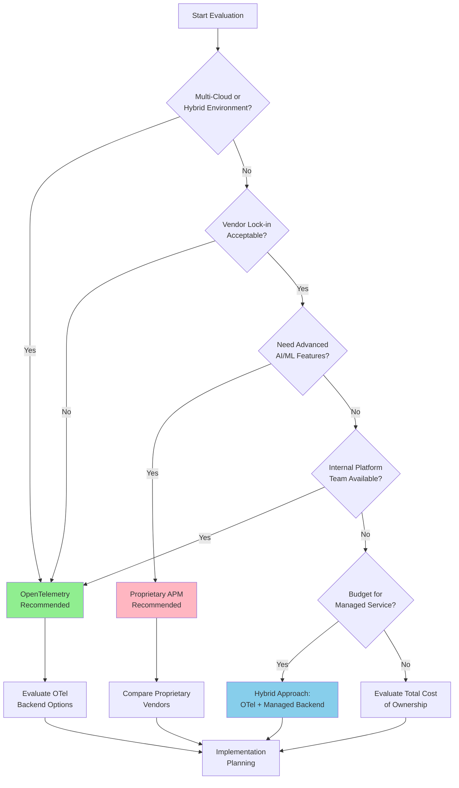
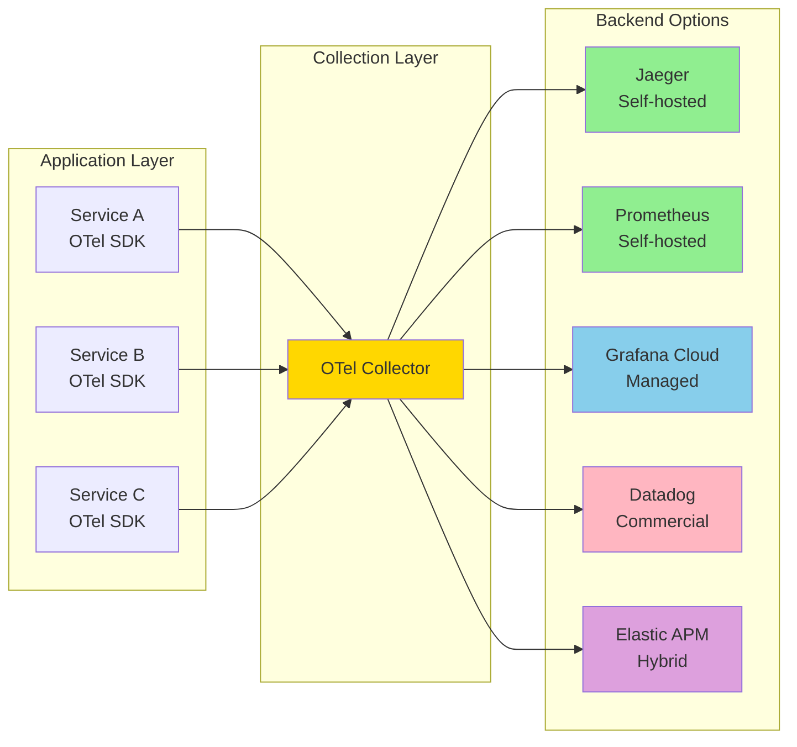
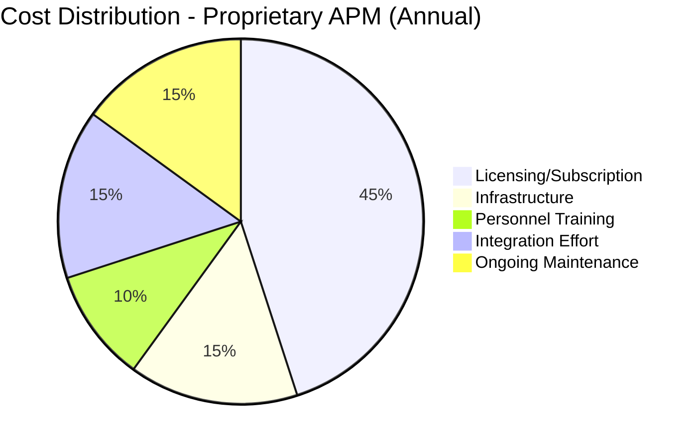
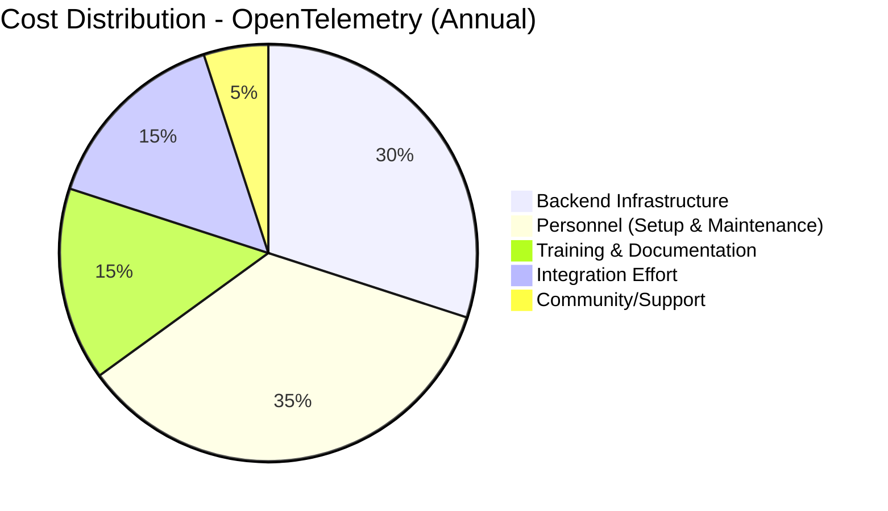
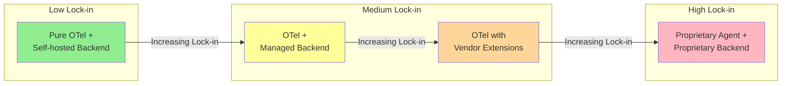
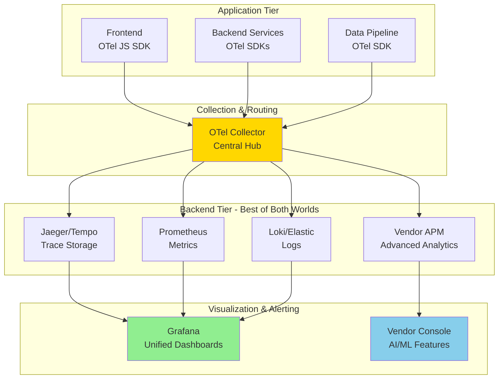
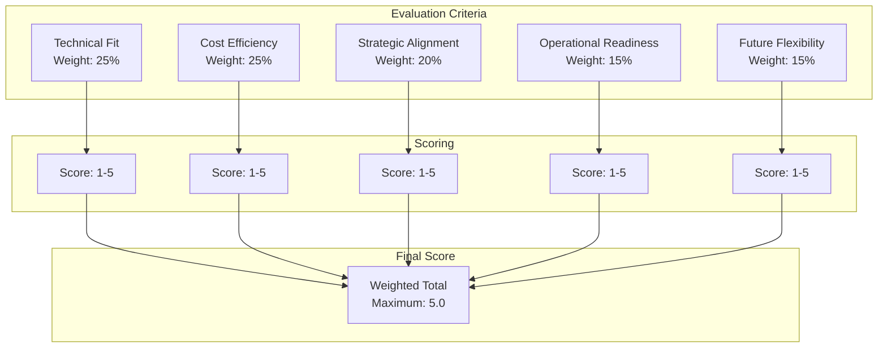

# How to Evaluate OpenTelemetry vs Proprietary APM Solutions

Author: [nawazdhandala](https://github.com/nawazdhandala)

Tags: OpenTelemetry, APM, Observability, Vendor Lock-in, Open Source

Description: A practical guide to comparing OpenTelemetry with proprietary APM solutions for your organization.

---

Choosing the right Application Performance Monitoring (APM) solution is a critical decision that impacts your organization's observability strategy, operational costs, and engineering flexibility for years to come. This guide provides a comprehensive framework for evaluating OpenTelemetry against proprietary APM solutions like Datadog, New Relic, Dynatrace, and Splunk APM.

## Understanding the Landscape

Before diving into evaluation criteria, it's essential to understand the fundamental differences between OpenTelemetry and proprietary APM solutions.

### What is OpenTelemetry?

OpenTelemetry (OTel) is an open-source, vendor-neutral observability framework that provides APIs, SDKs, and tools for collecting telemetry data (traces, metrics, and logs). It's a CNCF (Cloud Native Computing Foundation) incubating project backed by major cloud providers and observability vendors.

### What are Proprietary APM Solutions?

Proprietary APM solutions are commercial products that provide end-to-end observability capabilities, including data collection agents, storage backends, visualization, alerting, and advanced analytics features like AI-powered anomaly detection.

## Evaluation Decision Framework

The following diagram illustrates the key decision points when choosing between OpenTelemetry and proprietary APM solutions:



## Feature Comparison Criteria

### 1. Data Collection Capabilities

When evaluating data collection, consider the breadth and depth of instrumentation available.

The following table compares key data collection features across OpenTelemetry and major proprietary solutions:

| Feature | OpenTelemetry | Datadog | New Relic | Dynatrace |
|---------|---------------|---------|-----------|-----------|
| Auto-instrumentation | Yes (varies by language) | Yes | Yes | Yes (OneAgent) |
| Custom instrumentation | Full control | Limited API | Limited API | Limited API |
| Language support | 11+ languages | 15+ languages | 10+ languages | Most major languages |
| Trace context propagation | W3C Trace Context | Proprietary + W3C | Proprietary + W3C | Proprietary |
| Metrics collection | Yes | Yes | Yes | Yes |
| Log collection | Yes (stable) | Yes | Yes | Yes |
| Profiling | In development | Yes | Yes | Yes |

### 2. Instrumentation Comparison

Here's how instrumentation differs between OpenTelemetry and a proprietary solution:

The OpenTelemetry approach provides vendor-neutral instrumentation that can send data to any compatible backend. This example shows manual span creation with custom attributes:

```python
# OpenTelemetry instrumentation example
# This code is vendor-neutral and can send data to any OTel-compatible backend

from opentelemetry import trace
from opentelemetry.sdk.trace import TracerProvider
from opentelemetry.sdk.trace.export import BatchSpanProcessor
from opentelemetry.exporter.otlp.proto.grpc.trace_exporter import OTLPSpanExporter
from opentelemetry.instrumentation.flask import FlaskInstrumentor
from opentelemetry.instrumentation.requests import RequestsInstrumentor

# Initialize the tracer provider - this is the core OTel component
# that manages span creation and export
provider = TracerProvider()

# Configure OTLP exporter to send data to any compatible backend
# The endpoint can be changed without modifying instrumentation code
exporter = OTLPSpanExporter(
    endpoint="http://otel-collector:4317",  # Can point to Jaeger, Zipkin, or any vendor
    insecure=True
)

# BatchSpanProcessor batches spans before export for better performance
# This reduces network overhead compared to exporting each span individually
provider.add_span_processor(BatchSpanProcessor(exporter))
trace.set_tracer_provider(provider)

# Get a tracer instance for creating spans
# The name helps identify the source of telemetry data
tracer = trace.get_tracer(__name__)

# Auto-instrument Flask and requests libraries
# These instrumentors automatically create spans for HTTP operations
FlaskInstrumentor().instrument()
RequestsInstrumentor().instrument()

# Example of manual instrumentation for custom business logic
# Use this when you need fine-grained control over span attributes
def process_order(order_id: str):
    # Create a span to track the order processing operation
    # The span will automatically capture timing and any exceptions
    with tracer.start_as_current_span("process_order") as span:
        # Add custom attributes that provide business context
        # These attributes are searchable in your observability backend
        span.set_attribute("order.id", order_id)
        span.set_attribute("order.type", "standard")

        # Add events to mark significant points within the span
        # Events are timestamped and can include attributes
        span.add_event("validation_started")
        validate_order(order_id)
        span.add_event("validation_completed")

        # Nested operations automatically become child spans
        # This creates a trace hierarchy showing the full request flow
        with tracer.start_as_current_span("charge_payment") as payment_span:
            payment_span.set_attribute("payment.method", "credit_card")
            charge_customer(order_id)
```

In contrast, proprietary solutions typically use their own SDK with vendor-specific APIs. This example shows similar functionality but with vendor lock-in:

```python
# Proprietary APM instrumentation example (conceptual Datadog-like SDK)
# Note: This code is tightly coupled to a specific vendor's API

from ddtrace import tracer, patch_all

# Patch all supported libraries for automatic instrumentation
# This is convenient but creates dependency on the vendor's agent
patch_all()

# Vendor-specific configuration
# Changing vendors would require rewriting this configuration
tracer.configure(
    hostname='datadog-agent',
    port=8126,
    # Proprietary features like continuous profiling
    profiling=True,
    # Vendor-specific security monitoring
    appsec_enabled=True
)

# The decorator syntax is vendor-specific
# This creates tight coupling between your code and the APM vendor
@tracer.wrap(service="order-service", resource="process_order")
def process_order(order_id: str):
    # Get the current span to add custom tags
    # The API differs significantly from OpenTelemetry
    span = tracer.current_span()

    # Tags are the proprietary equivalent of attributes
    # Different vendors use different terminology and APIs
    span.set_tag("order.id", order_id)
    span.set_tag("order.type", "standard")

    validate_order(order_id)

    # Nested spans use the same proprietary API
    with tracer.trace("charge_payment") as payment_span:
        payment_span.set_tag("payment.method", "credit_card")
        charge_customer(order_id)
```

### 3. Backend Flexibility

One of OpenTelemetry's greatest strengths is backend flexibility. The following diagram shows possible data flow architectures:



Here's an example OpenTelemetry Collector configuration that demonstrates multi-backend export:

```yaml
# OpenTelemetry Collector configuration for multi-backend export
# This configuration demonstrates OTel's flexibility in routing telemetry data

receivers:
  # OTLP receiver accepts data from OTel SDKs
  # This is the standard protocol for OpenTelemetry
  otlp:
    protocols:
      grpc:
        endpoint: 0.0.0.0:4317
      http:
        endpoint: 0.0.0.0:4318

processors:
  # Batch processor improves export efficiency
  # It groups spans together before sending to reduce overhead
  batch:
    timeout: 1s
    send_batch_size: 1024

  # Memory limiter prevents collector from consuming too much memory
  # This is essential for production stability
  memory_limiter:
    check_interval: 1s
    limit_mib: 2048
    spike_limit_mib: 512

  # Resource processor adds metadata to all telemetry
  # This helps identify the source environment
  resource:
    attributes:
      - key: environment
        value: production
        action: insert

exporters:
  # Export to Jaeger for self-hosted trace visualization
  # Jaeger is a popular open-source choice for tracing
  jaeger:
    endpoint: jaeger-collector:14250
    tls:
      insecure: true

  # Export to Prometheus for metrics
  # This integrates with existing Prometheus/Grafana setups
  prometheus:
    endpoint: 0.0.0.0:8889
    namespace: myapp

  # Export to a commercial vendor (optional)
  # This shows how OTel can integrate with proprietary backends
  otlphttp:
    endpoint: https://otlp.vendor.com:443
    headers:
      api-key: ${VENDOR_API_KEY}

  # Export to a file for debugging or compliance
  # Useful for audit trails or troubleshooting
  file:
    path: /var/log/otel/traces.json

# Service pipeline configuration
# This defines how data flows through the collector
service:
  pipelines:
    # Traces pipeline sends to multiple backends simultaneously
    traces:
      receivers: [otlp]
      processors: [memory_limiter, batch, resource]
      exporters: [jaeger, otlphttp, file]

    # Metrics pipeline goes to Prometheus
    metrics:
      receivers: [otlp]
      processors: [memory_limiter, batch]
      exporters: [prometheus]
```

## Cost Analysis Framework

Understanding the true cost of each approach requires examining multiple factors beyond licensing fees.

### Total Cost of Ownership Comparison





### Cost Calculation Worksheet

The following code provides a framework for calculating and comparing costs:

```python
# Cost analysis framework for APM solution comparison
# Use this to calculate total cost of ownership for your organization

from dataclasses import dataclass
from typing import Optional

@dataclass
class APMCostAnalysis:
    """
    Comprehensive cost analysis for APM solutions.
    All costs are in USD per month unless otherwise specified.
    """

    # Data volume metrics - essential for accurate cost estimation
    # Measure these in your actual environment before calculation
    hosts_count: int
    containers_count: int
    monthly_spans_billions: float
    monthly_metrics_millions: float
    monthly_logs_gb: float

    # Personnel costs - often the largest hidden cost
    platform_engineers: int
    engineer_monthly_salary: float

    def calculate_proprietary_cost(
        self,
        per_host_cost: float = 31.0,  # Typical per-host pricing
        per_million_spans: float = 1.70,  # Trace ingestion cost
        per_million_metrics: float = 0.05,  # Custom metrics cost
        per_gb_logs: float = 0.10,  # Log ingestion cost
        retention_multiplier: float = 1.5  # Extra for extended retention
    ) -> dict:
        """
        Calculate monthly cost for a typical proprietary APM solution.
        Prices are approximate and vary by vendor and contract.
        """

        # Base infrastructure monitoring cost
        # This covers APM, infrastructure, and basic features
        infra_cost = self.hosts_count * per_host_cost
        container_cost = self.containers_count * (per_host_cost * 0.5)

        # Trace ingestion cost - often the largest variable cost
        # Can grow rapidly with microservices architectures
        trace_cost = self.monthly_spans_billions * 1000 * per_million_spans

        # Metrics cost - custom metrics can add up quickly
        metrics_cost = self.monthly_metrics_millions * per_million_metrics

        # Log management cost
        logs_cost = self.monthly_logs_gb * per_gb_logs

        # Calculate subtotal before retention adjustments
        subtotal = infra_cost + container_cost + trace_cost + metrics_cost + logs_cost

        # Apply retention multiplier for 13+ month retention
        # Most vendors charge significantly more for extended retention
        total_with_retention = subtotal * retention_multiplier

        return {
            "infrastructure": infra_cost + container_cost,
            "traces": trace_cost,
            "metrics": metrics_cost,
            "logs": logs_cost,
            "retention_premium": subtotal * (retention_multiplier - 1),
            "monthly_total": total_with_retention,
            "annual_total": total_with_retention * 12
        }

    def calculate_opentelemetry_cost(
        self,
        backend_choice: str = "self-hosted",  # self-hosted, managed, or hybrid
        cloud_compute_per_hour: float = 0.10,
        storage_per_gb_month: float = 0.023,
        managed_backend_multiplier: float = 0.4  # Managed backends cost ~40% of proprietary
    ) -> dict:
        """
        Calculate monthly cost for an OpenTelemetry-based solution.
        Includes infrastructure, storage, and personnel costs.
        """

        # Collector infrastructure cost
        # Estimate: 1 collector per 50 hosts, 2 vCPU, 4GB RAM each
        collector_count = max(2, self.hosts_count // 50)  # Minimum 2 for HA
        collector_hours = collector_count * 24 * 30
        collector_cost = collector_hours * cloud_compute_per_hour

        # Storage estimation for self-hosted backend
        # Traces: ~1KB per span, Metrics: ~100 bytes per data point
        trace_storage_gb = self.monthly_spans_billions * 1000 * 1 / 1024  # Convert to GB
        metrics_storage_gb = self.monthly_metrics_millions * 0.0001  # MB to GB
        logs_storage_gb = self.monthly_logs_gb
        total_storage_gb = trace_storage_gb + metrics_storage_gb + logs_storage_gb

        # Backend compute (Jaeger, Prometheus, etc.)
        # Sizing depends heavily on query patterns
        backend_compute_hours = 720 * 4  # 4 servers running 24/7
        backend_compute_cost = backend_compute_hours * cloud_compute_per_hour

        # Storage cost (assuming cloud object storage for long-term)
        storage_cost = total_storage_gb * storage_per_gb_month * 3  # 3x for replication

        # Personnel cost - the biggest factor for self-hosted
        # Assume 20% of platform engineer time for OTel maintenance
        personnel_cost = (
            self.platform_engineers *
            self.engineer_monthly_salary *
            0.20  # 20% time allocation
        )

        if backend_choice == "self-hosted":
            infrastructure_cost = collector_cost + backend_compute_cost + storage_cost
        elif backend_choice == "managed":
            # Managed backends like Grafana Cloud are more expensive
            # but reduce personnel overhead
            infrastructure_cost = (collector_cost + storage_cost) * 2
            personnel_cost *= 0.5  # Less maintenance required
        else:  # hybrid
            infrastructure_cost = (collector_cost + backend_compute_cost + storage_cost) * 1.3
            personnel_cost *= 0.7

        total = infrastructure_cost + personnel_cost

        return {
            "collectors": collector_cost,
            "backend_compute": backend_compute_cost if backend_choice == "self-hosted" else 0,
            "storage": storage_cost,
            "personnel": personnel_cost,
            "monthly_total": total,
            "annual_total": total * 12
        }

# Example cost comparison calculation
# Adjust these values to match your organization's profile
analysis = APMCostAnalysis(
    hosts_count=100,
    containers_count=500,
    monthly_spans_billions=10,
    monthly_metrics_millions=500,
    monthly_logs_gb=1000,
    platform_engineers=3,
    engineer_monthly_salary=12000
)

# Calculate and compare costs
proprietary = analysis.calculate_proprietary_cost()
otel_self_hosted = analysis.calculate_opentelemetry_cost("self-hosted")
otel_managed = analysis.calculate_opentelemetry_cost("managed")

print(f"Proprietary APM Annual Cost: ${proprietary['annual_total']:,.0f}")
print(f"OpenTelemetry (Self-hosted) Annual Cost: ${otel_self_hosted['annual_total']:,.0f}")
print(f"OpenTelemetry (Managed Backend) Annual Cost: ${otel_managed['annual_total']:,.0f}")
```

### Cost Factors Comparison Table

| Cost Factor | Proprietary APM | OpenTelemetry |
|-------------|-----------------|---------------|
| Initial licensing | High | None |
| Per-host costs | $15-50/host/month | Infrastructure only |
| Data ingestion | $1-5/GB | Storage costs only |
| Retention costs | Premium pricing | Storage costs |
| Training | Vendor-provided | Community + docs |
| Support | Included/tiered | Community or paid |
| Engineering time | Low-medium | Medium-high |
| Migration cost | High (lock-in) | Low |

## Vendor Lock-in Analysis

### Lock-in Risk Assessment

The following diagram shows the spectrum of vendor lock-in across different choices:



### Technical Lock-in Points

Here's a practical example showing how vendor lock-in manifests in code:

```javascript
// Example: Vendor-specific features that create lock-in
// These patterns are common in proprietary APM solutions

// LOCKED-IN: Proprietary custom metrics API
// This code only works with a specific vendor's SDK
// Migrating requires rewriting all metric definitions
datadogClient.gauge('order.processing_time', processingTime, {
  tags: ['env:production', 'service:order-api'],
  // Vendor-specific features
  alert_type: 'error',
  histogram: true,
  distributions: true
});

// PORTABLE: OpenTelemetry equivalent
// This code works with any OTel-compatible backend
// The meter and metric definitions are vendor-neutral
const meter = opentelemetry.metrics.getMeter('order-service');
const processingTimeHistogram = meter.createHistogram('order.processing_time', {
  description: 'Time taken to process orders',
  unit: 'ms'
});

// Record the metric with attributes (portable across backends)
processingTimeHistogram.record(processingTime, {
  environment: 'production',
  service: 'order-api'
});
```

### Migration Complexity Matrix

When evaluating lock-in, consider the effort required to migrate:

| Component | Migration Effort | Technical Complexity |
|-----------|------------------|---------------------|
| Instrumentation code | High | Rewrite SDKs |
| Custom dashboards | Medium | Recreate visualizations |
| Alert definitions | Medium | Re-implement logic |
| Runbooks/playbooks | Low | Update references |
| Team knowledge | High | Retrain on new tools |
| Integrations | Medium-High | Reconnect systems |

### Lock-in Mitigation Strategies

The following code demonstrates a vendor abstraction pattern that reduces lock-in:

```typescript
// Vendor abstraction layer to minimize lock-in
// This pattern allows swapping backends without changing application code

import { Span, Tracer, SpanContext, SpanKind } from '@opentelemetry/api';

// Define a vendor-neutral interface for observability operations
// This abstraction layer protects your code from vendor-specific APIs
interface ObservabilityProvider {
  startSpan(name: string, options?: SpanOptions): Span;
  recordMetric(name: string, value: number, labels?: Record<string, string>): void;
  logEvent(level: string, message: string, attributes?: Record<string, unknown>): void;
}

interface SpanOptions {
  kind?: SpanKind;
  attributes?: Record<string, string | number | boolean>;
  parent?: SpanContext;
}

// OpenTelemetry implementation of the abstraction
// This is the recommended approach for new projects
class OpenTelemetryProvider implements ObservabilityProvider {
  private tracer: Tracer;
  private meter: any;  // Meter type from OTel SDK

  constructor(serviceName: string) {
    // Initialize OTel tracer and meter
    // Configuration is centralized here, not scattered through the codebase
    const { trace, metrics } = require('@opentelemetry/api');
    this.tracer = trace.getTracer(serviceName);
    this.meter = metrics.getMeter(serviceName);
  }

  startSpan(name: string, options?: SpanOptions): Span {
    // Create a span using the standard OTel API
    // The underlying exporter can be changed without modifying this code
    return this.tracer.startSpan(name, {
      kind: options?.kind,
      attributes: options?.attributes
    });
  }

  recordMetric(name: string, value: number, labels?: Record<string, string>): void {
    // Record metrics using OTel's histogram type
    // This works with Prometheus, Datadog, or any OTel-compatible backend
    const histogram = this.meter.createHistogram(name);
    histogram.record(value, labels);
  }

  logEvent(level: string, message: string, attributes?: Record<string, unknown>): void {
    // Use OTel's logging API when available
    // Falls back to structured console logging for compatibility
    const logRecord = {
      timestamp: Date.now(),
      severityText: level,
      body: message,
      attributes: attributes
    };
    // Send to OTel log exporter or fallback logger
    console.log(JSON.stringify(logRecord));
  }
}

// Factory function to create the appropriate provider
// This makes it easy to swap implementations during migration
export function createObservabilityProvider(
  serviceName: string,
  providerType: 'opentelemetry' | 'legacy' = 'opentelemetry'
): ObservabilityProvider {
  if (providerType === 'opentelemetry') {
    return new OpenTelemetryProvider(serviceName);
  }
  // Add other provider implementations here for migration scenarios
  throw new Error(`Unknown provider type: ${providerType}`);
}

// Usage in application code - completely vendor-neutral
// This code never needs to change regardless of backend choice
const observability = createObservabilityProvider('order-service');

async function handleOrder(orderId: string): Promise<void> {
  // Start a trace span for this operation
  const span = observability.startSpan('handle_order', {
    kind: SpanKind.SERVER,
    attributes: { 'order.id': orderId }
  });

  try {
    // Record business metrics
    const startTime = Date.now();
    await processOrder(orderId);
    const duration = Date.now() - startTime;

    // These calls work with any backend
    observability.recordMetric('order.processing_time', duration, {
      status: 'success'
    });
    observability.logEvent('info', `Order ${orderId} processed successfully`);

  } catch (error) {
    observability.logEvent('error', `Order processing failed: ${error.message}`, {
      orderId,
      error: error.stack
    });
    throw error;
  } finally {
    span.end();
  }
}
```

## Hybrid Approaches

A hybrid approach often provides the best balance between flexibility and capability.

### Hybrid Architecture Patterns



### Hybrid Configuration Example

Here's a complete OpenTelemetry Collector configuration for a hybrid setup:

```yaml
# Hybrid OpenTelemetry Collector Configuration
# This setup routes data to both open-source and commercial backends
# Providing flexibility while leveraging advanced vendor features

receivers:
  # Accept OTLP data from all services
  otlp:
    protocols:
      grpc:
        endpoint: 0.0.0.0:4317
      http:
        endpoint: 0.0.0.0:4318

  # Also accept Prometheus metrics from legacy systems
  prometheus:
    config:
      scrape_configs:
        - job_name: 'kubernetes-pods'
          kubernetes_sd_configs:
            - role: pod
          relabel_configs:
            - source_labels: [__meta_kubernetes_pod_annotation_prometheus_io_scrape]
              action: keep
              regex: true

processors:
  # Essential processors for production deployments
  batch:
    timeout: 5s
    send_batch_size: 5000
    send_batch_max_size: 10000

  memory_limiter:
    check_interval: 1s
    limit_percentage: 80
    spike_limit_percentage: 25

  # Filter processor to route specific data to the commercial backend
  # Only send high-value traces to the paid service
  filter/critical:
    traces:
      span:
        # Only forward spans with error status or high latency
        - 'status.code == STATUS_CODE_ERROR'
        - 'attributes["http.status_code"] >= 500'
        - 'attributes["processing.time_ms"] > 5000'

  # Add resource attributes for context
  resource:
    attributes:
      - key: deployment.environment
        value: ${ENVIRONMENT}
        action: insert
      - key: service.namespace
        value: ${NAMESPACE}
        action: insert

  # Tail sampling to reduce trace volume intelligently
  # This preserves interesting traces while reducing costs
  tail_sampling:
    decision_wait: 10s
    num_traces: 100000
    expected_new_traces_per_sec: 1000
    policies:
      # Always keep error traces
      - name: errors-policy
        type: status_code
        status_code: {status_codes: [ERROR]}
      # Always keep slow traces
      - name: latency-policy
        type: latency
        latency: {threshold_ms: 1000}
      # Sample other traces probabilistically
      - name: probabilistic-policy
        type: probabilistic
        probabilistic: {sampling_percentage: 10}

exporters:
  # Self-hosted Tempo for cost-effective trace storage
  # All traces go here for full retention
  otlp/tempo:
    endpoint: tempo-distributor:4317
    tls:
      insecure: true

  # Prometheus remote write for metrics
  prometheusremotewrite:
    endpoint: http://prometheus:9090/api/v1/write
    resource_to_telemetry_conversion:
      enabled: true

  # Loki for logs
  loki:
    endpoint: http://loki:3100/loki/api/v1/push
    labels:
      resource:
        service.name: "service_name"
        service.namespace: "namespace"

  # Commercial APM for critical traces only
  # This receives filtered data to manage costs
  otlphttp/vendor:
    endpoint: https://otlp.vendor.com/v1/traces
    headers:
      api-key: ${VENDOR_API_KEY}

  # Debug exporter for troubleshooting
  logging:
    verbosity: detailed
    sampling_initial: 5
    sampling_thereafter: 200

extensions:
  # Health check endpoint for Kubernetes probes
  health_check:
    endpoint: 0.0.0.0:13133

  # Performance profiling for the collector itself
  pprof:
    endpoint: 0.0.0.0:1777

  # Prometheus metrics about the collector
  zpages:
    endpoint: 0.0.0.0:55679

service:
  extensions: [health_check, pprof, zpages]

  pipelines:
    # All traces go to Tempo for complete retention
    traces/full:
      receivers: [otlp]
      processors: [memory_limiter, resource, tail_sampling, batch]
      exporters: [otlp/tempo]

    # Critical traces also go to commercial vendor for AI analysis
    traces/critical:
      receivers: [otlp]
      processors: [memory_limiter, resource, filter/critical, batch]
      exporters: [otlphttp/vendor]

    # Metrics pipeline
    metrics:
      receivers: [otlp, prometheus]
      processors: [memory_limiter, resource, batch]
      exporters: [prometheusremotewrite]

    # Logs pipeline
    logs:
      receivers: [otlp]
      processors: [memory_limiter, resource, batch]
      exporters: [loki]
```

### Benefits of Hybrid Approach

| Aspect | Benefit |
|--------|---------|
| Cost optimization | Route only critical data to expensive backends |
| Feature access | Leverage vendor AI/ML without full lock-in |
| Data ownership | Maintain full copy in self-hosted storage |
| Migration path | Gradually shift between backends as needed |
| Risk mitigation | No single point of failure for observability |

## Evaluation Scorecard

Use this scorecard to systematically evaluate your options:



### Detailed Evaluation Checklist

The following code provides a complete evaluation framework you can use:

```python
# APM Solution Evaluation Framework
# Use this to score and compare different observability options

from dataclasses import dataclass, field
from typing import Dict, List
from enum import Enum

class EvaluationCategory(Enum):
    TECHNICAL_FIT = "technical_fit"
    COST_EFFICIENCY = "cost_efficiency"
    STRATEGIC_ALIGNMENT = "strategic_alignment"
    OPERATIONAL_READINESS = "operational_readiness"
    FUTURE_FLEXIBILITY = "future_flexibility"

@dataclass
class EvaluationCriterion:
    """Individual evaluation criterion with scoring"""
    name: str
    category: EvaluationCategory
    weight: float  # Within category weight
    score: float = 0.0  # 1-5 scale
    notes: str = ""

    @property
    def weighted_score(self) -> float:
        return self.score * self.weight

@dataclass
class APMEvaluation:
    """
    Complete evaluation framework for APM solutions.
    Provides structured scoring across multiple dimensions.
    """

    solution_name: str
    criteria: List[EvaluationCriterion] = field(default_factory=list)

    # Category weights (must sum to 1.0)
    category_weights: Dict[EvaluationCategory, float] = field(default_factory=lambda: {
        EvaluationCategory.TECHNICAL_FIT: 0.25,
        EvaluationCategory.COST_EFFICIENCY: 0.25,
        EvaluationCategory.STRATEGIC_ALIGNMENT: 0.20,
        EvaluationCategory.OPERATIONAL_READINESS: 0.15,
        EvaluationCategory.FUTURE_FLEXIBILITY: 0.15
    })

    def add_default_criteria(self) -> None:
        """
        Add standard evaluation criteria for APM solutions.
        Customize weights based on your organization's priorities.
        """

        # Technical Fit Criteria
        self.criteria.extend([
            EvaluationCriterion(
                name="Language/Framework Support",
                category=EvaluationCategory.TECHNICAL_FIT,
                weight=0.20,
                notes="Coverage for your tech stack"
            ),
            EvaluationCriterion(
                name="Auto-Instrumentation Quality",
                category=EvaluationCategory.TECHNICAL_FIT,
                weight=0.15,
                notes="Out-of-box instrumentation depth"
            ),
            EvaluationCriterion(
                name="Custom Instrumentation Flexibility",
                category=EvaluationCategory.TECHNICAL_FIT,
                weight=0.15,
                notes="Ability to add custom spans/metrics"
            ),
            EvaluationCriterion(
                name="Data Model Compatibility",
                category=EvaluationCategory.TECHNICAL_FIT,
                weight=0.15,
                notes="Fit with existing data models"
            ),
            EvaluationCriterion(
                name="Query and Analytics Capability",
                category=EvaluationCategory.TECHNICAL_FIT,
                weight=0.20,
                notes="Trace search, aggregation, correlation"
            ),
            EvaluationCriterion(
                name="Integration Ecosystem",
                category=EvaluationCategory.TECHNICAL_FIT,
                weight=0.15,
                notes="Third-party integrations available"
            ),
        ])

        # Cost Efficiency Criteria
        self.criteria.extend([
            EvaluationCriterion(
                name="Initial Implementation Cost",
                category=EvaluationCategory.COST_EFFICIENCY,
                weight=0.20,
                notes="Setup, integration, training costs"
            ),
            EvaluationCriterion(
                name="Ongoing Licensing/Subscription",
                category=EvaluationCategory.COST_EFFICIENCY,
                weight=0.30,
                notes="Monthly/annual subscription costs"
            ),
            EvaluationCriterion(
                name="Data Volume Scaling Cost",
                category=EvaluationCategory.COST_EFFICIENCY,
                weight=0.25,
                notes="Cost as data grows 2x, 5x, 10x"
            ),
            EvaluationCriterion(
                name="Operational Overhead",
                category=EvaluationCategory.COST_EFFICIENCY,
                weight=0.25,
                notes="Personnel time for maintenance"
            ),
        ])

        # Strategic Alignment Criteria
        self.criteria.extend([
            EvaluationCriterion(
                name="Vendor Independence",
                category=EvaluationCategory.STRATEGIC_ALIGNMENT,
                weight=0.30,
                notes="Ability to switch vendors/backends"
            ),
            EvaluationCriterion(
                name="Cloud Strategy Fit",
                category=EvaluationCategory.STRATEGIC_ALIGNMENT,
                weight=0.25,
                notes="Alignment with multi-cloud/hybrid"
            ),
            EvaluationCriterion(
                name="Standards Compliance",
                category=EvaluationCategory.STRATEGIC_ALIGNMENT,
                weight=0.25,
                notes="Use of open standards (W3C, OTel)"
            ),
            EvaluationCriterion(
                name="Data Sovereignty",
                category=EvaluationCategory.STRATEGIC_ALIGNMENT,
                weight=0.20,
                notes="Control over data location/access"
            ),
        ])

        # Operational Readiness Criteria
        self.criteria.extend([
            EvaluationCriterion(
                name="Team Expertise",
                category=EvaluationCategory.OPERATIONAL_READINESS,
                weight=0.30,
                notes="Current team familiarity"
            ),
            EvaluationCriterion(
                name="Documentation Quality",
                category=EvaluationCategory.OPERATIONAL_READINESS,
                weight=0.20,
                notes="Docs, tutorials, examples"
            ),
            EvaluationCriterion(
                name="Support Availability",
                category=EvaluationCategory.OPERATIONAL_READINESS,
                weight=0.25,
                notes="Vendor or community support"
            ),
            EvaluationCriterion(
                name="Rollout Complexity",
                category=EvaluationCategory.OPERATIONAL_READINESS,
                weight=0.25,
                notes="Effort to deploy across services"
            ),
        ])

        # Future Flexibility Criteria
        self.criteria.extend([
            EvaluationCriterion(
                name="Technology Roadmap",
                category=EvaluationCategory.FUTURE_FLEXIBILITY,
                weight=0.30,
                notes="Future development direction"
            ),
            EvaluationCriterion(
                name="Community/Ecosystem Growth",
                category=EvaluationCategory.FUTURE_FLEXIBILITY,
                weight=0.25,
                notes="Adoption trends, contributor activity"
            ),
            EvaluationCriterion(
                name="Extensibility",
                category=EvaluationCategory.FUTURE_FLEXIBILITY,
                weight=0.25,
                notes="Ability to extend/customize"
            ),
            EvaluationCriterion(
                name="Migration Path Clarity",
                category=EvaluationCategory.FUTURE_FLEXIBILITY,
                weight=0.20,
                notes="How easy to evolve/migrate"
            ),
        ])

    def score_criterion(self, name: str, score: float, notes: str = "") -> None:
        """Score a specific criterion (1-5 scale)"""
        for criterion in self.criteria:
            if criterion.name == name:
                criterion.score = max(1.0, min(5.0, score))  # Clamp to 1-5
                if notes:
                    criterion.notes = notes
                return
        raise ValueError(f"Criterion not found: {name}")

    def calculate_category_scores(self) -> Dict[EvaluationCategory, float]:
        """Calculate weighted score for each category"""
        category_scores = {}

        for category in EvaluationCategory:
            category_criteria = [c for c in self.criteria if c.category == category]
            if category_criteria:
                total_weighted = sum(c.weighted_score for c in category_criteria)
                category_scores[category] = total_weighted

        return category_scores

    def calculate_total_score(self) -> float:
        """Calculate overall weighted score (1-5 scale)"""
        category_scores = self.calculate_category_scores()
        total = 0.0

        for category, score in category_scores.items():
            total += score * self.category_weights[category]

        return total

    def generate_report(self) -> str:
        """Generate a summary evaluation report"""
        category_scores = self.calculate_category_scores()
        total_score = self.calculate_total_score()

        report = f"\n{'='*60}\n"
        report += f"EVALUATION REPORT: {self.solution_name}\n"
        report += f"{'='*60}\n\n"

        for category in EvaluationCategory:
            score = category_scores.get(category, 0)
            weight = self.category_weights[category] * 100
            report += f"{category.value.replace('_', ' ').title()}: "
            report += f"{score:.2f}/5.0 (Weight: {weight:.0f}%)\n"

            # List individual criteria scores
            for criterion in self.criteria:
                if criterion.category == category:
                    report += f"  - {criterion.name}: {criterion.score:.1f}/5.0\n"
            report += "\n"

        report += f"{'='*60}\n"
        report += f"TOTAL WEIGHTED SCORE: {total_score:.2f}/5.0\n"
        report += f"{'='*60}\n"

        # Recommendation based on score
        if total_score >= 4.0:
            recommendation = "STRONG CANDIDATE - Proceed with implementation planning"
        elif total_score >= 3.0:
            recommendation = "VIABLE OPTION - Address identified gaps before proceeding"
        elif total_score >= 2.0:
            recommendation = "MARGINAL FIT - Consider alternatives or significant customization"
        else:
            recommendation = "NOT RECOMMENDED - Significant gaps in critical areas"

        report += f"\nRECOMMENDATION: {recommendation}\n"

        return report


# Example usage: Evaluate OpenTelemetry for your organization
otel_eval = APMEvaluation(solution_name="OpenTelemetry + Grafana Stack")
otel_eval.add_default_criteria()

# Score each criterion based on your organization's assessment
# These are example scores - adjust based on your evaluation
otel_eval.score_criterion("Language/Framework Support", 4.5, "Excellent coverage for our stack")
otel_eval.score_criterion("Auto-Instrumentation Quality", 4.0, "Good but some gaps in legacy frameworks")
otel_eval.score_criterion("Custom Instrumentation Flexibility", 5.0, "Full control over instrumentation")
otel_eval.score_criterion("Vendor Independence", 5.0, "Complete portability")
otel_eval.score_criterion("Ongoing Licensing/Subscription", 5.0, "Open source - no licensing costs")
otel_eval.score_criterion("Operational Overhead", 3.0, "Requires dedicated platform team")
# ... continue scoring all criteria

print(otel_eval.generate_report())
```

## Decision Framework Summary

### When to Choose OpenTelemetry

OpenTelemetry is the better choice when:

1. **Multi-cloud or hybrid deployments** - You operate across multiple cloud providers or have on-premises workloads
2. **Vendor independence is critical** - Your organization wants to avoid long-term vendor commitments
3. **You have platform engineering capacity** - A team can maintain the observability infrastructure
4. **Cost optimization is a priority** - You need to control costs as data volumes grow
5. **Customization is required** - You need fine-grained control over instrumentation and data processing
6. **You're building a platform** - You're providing observability as a service to internal teams

### When to Choose Proprietary APM

Proprietary APM solutions may be better when:

1. **Time-to-value is critical** - You need comprehensive observability quickly
2. **Limited platform engineering resources** - You prefer managed solutions
3. **Advanced AI/ML features are required** - You need anomaly detection, root cause analysis
4. **Compliance requirements exist** - You need SOC2, HIPAA compliance out-of-box
5. **Single-vendor simplicity** - Your organization prefers consolidated tooling
6. **Enterprise support is required** - You need guaranteed SLAs and dedicated support

### Recommended Evaluation Process

1. **Define requirements** - Document your specific observability needs
2. **Assess current state** - Inventory existing instrumentation and tools
3. **Calculate TCO** - Use the cost framework for 3-year projections
4. **Run proof of concept** - Test both approaches with representative workloads
5. **Score alternatives** - Use the evaluation scorecard systematically
6. **Plan migration path** - Document how you'll transition from current state
7. **Make decision** - Choose based on weighted scores and strategic factors

## Conclusion

The choice between OpenTelemetry and proprietary APM solutions is not binary. Many organizations find success with hybrid approaches that leverage OpenTelemetry's flexibility for instrumentation while using commercial backends for advanced features.

Key takeaways:

- **OpenTelemetry provides maximum flexibility** but requires investment in platform engineering
- **Proprietary APM offers faster time-to-value** but creates vendor dependencies
- **Hybrid approaches can optimize costs** by routing different data to different backends
- **Evaluate based on your specific context** using a structured scoring framework
- **Plan for the long term** - consider where your organization will be in 3-5 years

Whatever you choose, ensure your observability strategy aligns with your organization's broader technical and business objectives. The best solution is the one that helps your teams understand and improve system behavior effectively.

## Additional Resources

- [OpenTelemetry Official Documentation](https://opentelemetry.io/docs/)
- [CNCF Observability Landscape](https://landscape.cncf.io/card-mode?category=observability-and-analysis)
- [OpenTelemetry Collector Configuration](https://opentelemetry.io/docs/collector/configuration/)
- [W3C Trace Context Specification](https://www.w3.org/TR/trace-context/)
