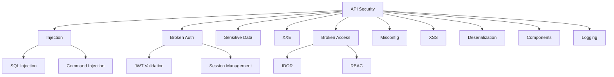

# How to Secure Rust APIs Against Common Vulnerabilities

Author: [nawazdhandala](https://www.github.com/nawazdhandala)

Tags: Rust, Security, API, OWASP, Input Validation, SQL Injection, XSS, CSRF, Authentication

Description: Learn how to secure Rust APIs against OWASP Top 10 vulnerabilities. This guide covers input validation, SQL injection prevention, authentication security, rate limiting, and secure headers.

---

> Rust's memory safety doesn't make your API secure. SQL injection, broken authentication, and insecure direct object references can still compromise your application. This guide shows you how to defend against the most common web vulnerabilities.

Security is a continuous process, not a feature. Let's build secure Rust APIs from the ground up.

---

## OWASP Top 10 Coverage



---

## Project Setup

```toml
[dependencies]
# Web framework
axum = "0.7"
tokio = { version = "1", features = ["full"] }

# Security
argon2 = "0.5"           # Password hashing
jsonwebtoken = "9"       # JWT
uuid = { version = "1", features = ["v4"] }
validator = { version = "0.16", features = ["derive"] }

# Database (parameterized queries)
sqlx = { version = "0.7", features = ["runtime-tokio", "postgres"] }

# Rate limiting
governor = "0.6"

# Serialization
serde = { version = "1", features = ["derive"] }
serde_json = "1"

# Headers and CORS
tower-http = { version = "0.5", features = ["cors", "set-header", "limit"] }
```

---

## Input Validation

Always validate and sanitize input before processing.

```rust
// src/validation.rs
// Input validation with the validator crate

use serde::Deserialize;
use validator::{Validate, ValidationError};
use axum::{Json, http::StatusCode, response::IntoResponse};

/// User registration request with validation rules
#[derive(Debug, Deserialize, Validate)]
pub struct RegisterRequest {
    // Email must be valid format
    #[validate(email(message = "Invalid email format"))]
    pub email: String,

    // Password: 8-128 chars, must contain uppercase, lowercase, number
    #[validate(
        length(min = 8, max = 128, message = "Password must be 8-128 characters"),
        custom = "validate_password_strength"
    )]
    pub password: String,

    // Username: alphanumeric, 3-30 chars
    #[validate(
        length(min = 3, max = 30),
        regex(path = "USERNAME_REGEX", message = "Username must be alphanumeric")
    )]
    pub username: String,
}

lazy_static::lazy_static! {
    static ref USERNAME_REGEX: regex::Regex = regex::Regex::new(r"^[a-zA-Z0-9_]+$").unwrap();
}

/// Custom password strength validation
fn validate_password_strength(password: &str) -> Result<(), ValidationError> {
    let has_uppercase = password.chars().any(|c| c.is_uppercase());
    let has_lowercase = password.chars().any(|c| c.is_lowercase());
    let has_digit = password.chars().any(|c| c.is_numeric());
    let has_special = password.chars().any(|c| !c.is_alphanumeric());

    if has_uppercase && has_lowercase && has_digit && has_special {
        Ok(())
    } else {
        let mut error = ValidationError::new("password_strength");
        error.message = Some("Password must contain uppercase, lowercase, number, and special character".into());
        Err(error)
    }
}

/// Validation middleware for request handlers
pub async fn validate_request<T: Validate>(
    Json(payload): Json<T>,
) -> Result<Json<T>, impl IntoResponse> {
    match payload.validate() {
        Ok(_) => Ok(Json(payload)),
        Err(errors) => Err((
            StatusCode::BAD_REQUEST,
            Json(serde_json::json!({
                "error": "Validation failed",
                "details": errors.field_errors()
            }))
        ))
    }
}

/// HTML/XSS sanitization
pub fn sanitize_html(input: &str) -> String {
    // Replace dangerous characters with HTML entities
    input
        .replace('&', "&amp;")
        .replace('<', "&lt;")
        .replace('>', "&gt;")
        .replace('"', "&quot;")
        .replace('\'', "&#x27;")
}

/// URL path sanitization to prevent path traversal
pub fn sanitize_path(input: &str) -> Option<String> {
    // Reject any path containing traversal sequences
    if input.contains("..") || input.contains('\0') {
        return None;
    }

    // Only allow alphanumeric, hyphen, underscore, and forward slash
    let sanitized: String = input
        .chars()
        .filter(|c| c.is_alphanumeric() || *c == '-' || *c == '_' || *c == '/')
        .collect();

    Some(sanitized)
}
```

---

## SQL Injection Prevention

Always use parameterized queries, never string concatenation.

```rust
// src/database.rs
// SQL injection prevention with parameterized queries

use sqlx::{PgPool, Row};
use uuid::Uuid;

#[derive(Debug)]
pub struct User {
    pub id: Uuid,
    pub email: String,
    pub username: String,
}

/// VULNERABLE: Never do this - SQL injection possible
#[allow(dead_code)]
async fn get_user_vulnerable(pool: &PgPool, username: &str) -> Result<User, sqlx::Error> {
    // DANGER: String interpolation allows SQL injection
    // Input: "admin' OR '1'='1" would bypass authentication
    let query = format!("SELECT * FROM users WHERE username = '{}'", username);
    sqlx::query_as::<_, (Uuid, String, String)>(&query)
        .fetch_one(pool)
        .await
        .map(|(id, email, username)| User { id, email, username })
}

/// SECURE: Use parameterized queries
pub async fn get_user_by_username(pool: &PgPool, username: &str) -> Result<Option<User>, sqlx::Error> {
    // Parameters are properly escaped by the database driver
    sqlx::query_as!(
        User,
        r#"SELECT id, email, username FROM users WHERE username = $1"#,
        username
    )
    .fetch_optional(pool)
    .await
}

/// SECURE: Multiple parameters
pub async fn authenticate_user(
    pool: &PgPool,
    email: &str,
) -> Result<Option<(Uuid, String)>, sqlx::Error> {
    // Returns user ID and password hash for verification
    let result = sqlx::query!(
        r#"SELECT id, password_hash FROM users WHERE email = $1 AND active = true"#,
        email
    )
    .fetch_optional(pool)
    .await?;

    Ok(result.map(|row| (row.id, row.password_hash)))
}

/// SECURE: Dynamic filtering with query builder
pub async fn search_users(
    pool: &PgPool,
    filters: UserFilters,
) -> Result<Vec<User>, sqlx::Error> {
    // Build query dynamically but safely
    let mut query = sqlx::QueryBuilder::new("SELECT id, email, username FROM users WHERE 1=1");

    if let Some(ref email_pattern) = filters.email_contains {
        // Parameters are still escaped
        query.push(" AND email LIKE ");
        query.push_bind(format!("%{}%", email_pattern));
    }

    if let Some(ref username) = filters.username {
        query.push(" AND username = ");
        query.push_bind(username);
    }

    if let Some(active) = filters.active {
        query.push(" AND active = ");
        query.push_bind(active);
    }

    // Add pagination safely
    query.push(" LIMIT ");
    query.push_bind(filters.limit.unwrap_or(100) as i64);
    query.push(" OFFSET ");
    query.push_bind(filters.offset.unwrap_or(0) as i64);

    query
        .build_query_as::<User>()
        .fetch_all(pool)
        .await
}

#[derive(Default)]
pub struct UserFilters {
    pub email_contains: Option<String>,
    pub username: Option<String>,
    pub active: Option<bool>,
    pub limit: Option<usize>,
    pub offset: Option<usize>,
}
```

---

## Password Security

Use strong hashing algorithms with proper configuration.

```rust
// src/password.rs
// Secure password hashing with Argon2

use argon2::{
    password_hash::{
        rand_core::OsRng, PasswordHash, PasswordHasher, PasswordVerifier, SaltString,
    },
    Argon2, Algorithm, Params, Version,
};
use thiserror::Error;

#[derive(Error, Debug)]
pub enum PasswordError {
    #[error("Failed to hash password")]
    HashError,
    #[error("Invalid password")]
    InvalidPassword,
    #[error("Hash verification failed")]
    VerificationError,
}

/// Configure Argon2 with secure parameters
fn get_argon2() -> Argon2<'static> {
    // Use Argon2id (recommended variant)
    // Parameters chosen for ~0.5 second hashing time on modern hardware
    let params = Params::new(
        65536,  // Memory cost: 64 MB
        3,      // Time cost: 3 iterations
        4,      // Parallelism: 4 threads
        Some(32), // Output length: 32 bytes
    )
    .expect("Invalid Argon2 params");

    Argon2::new(Algorithm::Argon2id, Version::V0x13, params)
}

/// Hash a password securely
pub fn hash_password(password: &str) -> Result<String, PasswordError> {
    let salt = SaltString::generate(&mut OsRng);
    let argon2 = get_argon2();

    argon2
        .hash_password(password.as_bytes(), &salt)
        .map(|hash| hash.to_string())
        .map_err(|_| PasswordError::HashError)
}

/// Verify a password against a hash
pub fn verify_password(password: &str, hash: &str) -> Result<bool, PasswordError> {
    let parsed_hash = PasswordHash::new(hash)
        .map_err(|_| PasswordError::VerificationError)?;

    let argon2 = get_argon2();

    match argon2.verify_password(password.as_bytes(), &parsed_hash) {
        Ok(()) => Ok(true),
        Err(argon2::password_hash::Error::Password) => Ok(false),
        Err(_) => Err(PasswordError::VerificationError),
    }
}

/// Check if a hash needs rehashing (algorithm/params changed)
pub fn needs_rehash(hash: &str) -> bool {
    let Ok(parsed) = PasswordHash::new(hash) else {
        return true;
    };

    // Check if using current algorithm
    if parsed.algorithm != argon2::ARGON2ID_IDENT {
        return true;
    }

    // Check memory cost (should be at least 64MB)
    if let Some(m_cost) = parsed.params.get("m") {
        if m_cost.decimal().unwrap_or(0) < 65536 {
            return true;
        }
    }

    false
}
```

---

## Authentication Security

Secure JWT handling with proper validation.

```rust
// src/auth.rs
// Secure authentication with JWT

use axum::{
    async_trait,
    extract::FromRequestParts,
    http::{request::Parts, StatusCode, header},
    response::{IntoResponse, Response},
    Json,
};
use jsonwebtoken::{decode, encode, DecodingKey, EncodingKey, Header, Validation, Algorithm};
use serde::{Deserialize, Serialize};
use std::time::{SystemTime, UNIX_EPOCH};
use uuid::Uuid;

/// JWT claims with security-relevant fields
#[derive(Debug, Serialize, Deserialize)]
pub struct Claims {
    // Subject (user ID)
    pub sub: Uuid,
    // Issued at
    pub iat: u64,
    // Expiration
    pub exp: u64,
    // Not before
    pub nbf: u64,
    // JWT ID (for revocation)
    pub jti: Uuid,
    // Issuer
    pub iss: String,
    // Audience
    pub aud: Vec<String>,
    // User roles
    pub roles: Vec<String>,
}

pub struct JwtConfig {
    pub secret: String,
    pub issuer: String,
    pub audience: Vec<String>,
    pub access_token_ttl: u64,  // seconds
    pub refresh_token_ttl: u64,
}

impl JwtConfig {
    /// Create access token with short TTL
    pub fn create_access_token(&self, user_id: Uuid, roles: Vec<String>) -> Result<String, AuthError> {
        let now = SystemTime::now()
            .duration_since(UNIX_EPOCH)
            .unwrap()
            .as_secs();

        let claims = Claims {
            sub: user_id,
            iat: now,
            exp: now + self.access_token_ttl,
            nbf: now,
            jti: Uuid::new_v4(),
            iss: self.issuer.clone(),
            aud: self.audience.clone(),
            roles,
        };

        // Use HS256 for symmetric signing (use RS256 for asymmetric)
        encode(
            &Header::new(Algorithm::HS256),
            &claims,
            &EncodingKey::from_secret(self.secret.as_bytes()),
        )
        .map_err(|_| AuthError::TokenCreation)
    }

    /// Validate and decode token
    pub fn validate_token(&self, token: &str) -> Result<Claims, AuthError> {
        let mut validation = Validation::new(Algorithm::HS256);

        // Strict validation
        validation.validate_exp = true;
        validation.validate_nbf = true;
        validation.set_issuer(&[&self.issuer]);
        validation.set_audience(&self.audience);
        validation.leeway = 0; // No clock skew tolerance

        decode::<Claims>(
            token,
            &DecodingKey::from_secret(self.secret.as_bytes()),
            &validation,
        )
        .map(|data| data.claims)
        .map_err(|e| match e.kind() {
            jsonwebtoken::errors::ErrorKind::ExpiredSignature => AuthError::TokenExpired,
            jsonwebtoken::errors::ErrorKind::InvalidIssuer => AuthError::InvalidToken,
            jsonwebtoken::errors::ErrorKind::InvalidAudience => AuthError::InvalidToken,
            _ => AuthError::InvalidToken,
        })
    }
}

#[derive(Debug)]
pub enum AuthError {
    MissingToken,
    InvalidToken,
    TokenExpired,
    TokenCreation,
    InsufficientPermissions,
}

impl IntoResponse for AuthError {
    fn into_response(self) -> Response {
        let (status, message) = match self {
            // Don't leak information about why auth failed
            AuthError::MissingToken => (StatusCode::UNAUTHORIZED, "Authentication required"),
            AuthError::InvalidToken => (StatusCode::UNAUTHORIZED, "Invalid credentials"),
            AuthError::TokenExpired => (StatusCode::UNAUTHORIZED, "Session expired"),
            AuthError::TokenCreation => (StatusCode::INTERNAL_SERVER_ERROR, "Authentication error"),
            AuthError::InsufficientPermissions => (StatusCode::FORBIDDEN, "Access denied"),
        };

        (status, Json(serde_json::json!({ "error": message }))).into_response()
    }
}

/// Extractor for authenticated requests
pub struct AuthenticatedUser {
    pub user_id: Uuid,
    pub roles: Vec<String>,
}

#[async_trait]
impl<St> FromRequestParts<St> for AuthenticatedUser
where
    St: Send + Sync,
{
    type Rejection = AuthError;

    async fn from_request_parts(parts: &mut Parts, _state: &St) -> Result<Self, Self::Rejection> {
        // Extract token from Authorization header
        let auth_header = parts
            .headers
            .get(header::AUTHORIZATION)
            .and_then(|value| value.to_str().ok())
            .ok_or(AuthError::MissingToken)?;

        // Expect "Bearer <token>" format
        let token = auth_header
            .strip_prefix("Bearer ")
            .ok_or(AuthError::InvalidToken)?;

        // Get JWT config from extensions (set by middleware)
        let jwt_config = parts
            .extensions
            .get::<JwtConfig>()
            .expect("JwtConfig not in extensions");

        let claims = jwt_config.validate_token(token)?;

        Ok(AuthenticatedUser {
            user_id: claims.sub,
            roles: claims.roles,
        })
    }
}

/// Role-based access control
pub fn require_role(user: &AuthenticatedUser, required_role: &str) -> Result<(), AuthError> {
    if user.roles.contains(&required_role.to_string()) {
        Ok(())
    } else {
        Err(AuthError::InsufficientPermissions)
    }
}
```

---

## Broken Access Control (IDOR Prevention)

Prevent users from accessing resources they don't own.

```rust
// src/access_control.rs
// Prevent Insecure Direct Object References (IDOR)

use sqlx::PgPool;
use uuid::Uuid;

#[derive(Debug)]
pub enum AccessError {
    NotFound,
    Forbidden,
    DatabaseError(sqlx::Error),
}

/// Check resource ownership before access
pub async fn get_user_document(
    pool: &PgPool,
    document_id: Uuid,
    requesting_user_id: Uuid,
) -> Result<Document, AccessError> {
    // Always filter by both document ID AND owner ID
    let document = sqlx::query_as!(
        Document,
        r#"
        SELECT id, title, content, owner_id, created_at
        FROM documents
        WHERE id = $1 AND owner_id = $2
        "#,
        document_id,
        requesting_user_id
    )
    .fetch_optional(pool)
    .await
    .map_err(AccessError::DatabaseError)?;

    // Return 404 instead of 403 to avoid leaking existence
    document.ok_or(AccessError::NotFound)
}

/// Check organization membership for shared resources
pub async fn get_organization_resource(
    pool: &PgPool,
    resource_id: Uuid,
    user_id: Uuid,
) -> Result<Resource, AccessError> {
    // Join through membership table to verify access
    let resource = sqlx::query_as!(
        Resource,
        r#"
        SELECT r.id, r.name, r.data, r.organization_id
        FROM resources r
        INNER JOIN organization_members om ON r.organization_id = om.organization_id
        WHERE r.id = $1 AND om.user_id = $2 AND om.active = true
        "#,
        resource_id,
        user_id
    )
    .fetch_optional(pool)
    .await
    .map_err(AccessError::DatabaseError)?;

    resource.ok_or(AccessError::NotFound)
}

/// Role-based access with row-level security
pub async fn update_document(
    pool: &PgPool,
    document_id: Uuid,
    user_id: Uuid,
    required_permission: Permission,
    updates: DocumentUpdate,
) -> Result<Document, AccessError> {
    // Check permission in same query (atomic)
    let result = sqlx::query_as!(
        Document,
        r#"
        UPDATE documents d
        SET
            title = COALESCE($3, d.title),
            content = COALESCE($4, d.content),
            updated_at = NOW()
        FROM document_permissions dp
        WHERE d.id = $1
            AND dp.document_id = d.id
            AND dp.user_id = $2
            AND dp.permission >= $5
        RETURNING d.id, d.title, d.content, d.owner_id, d.created_at
        "#,
        document_id,
        user_id,
        updates.title,
        updates.content,
        required_permission as i32
    )
    .fetch_optional(pool)
    .await
    .map_err(AccessError::DatabaseError)?;

    result.ok_or(AccessError::NotFound)
}

#[derive(Debug, Clone, Copy, PartialEq, Eq, PartialOrd, Ord)]
#[repr(i32)]
pub enum Permission {
    Read = 1,
    Write = 2,
    Admin = 3,
}

#[derive(Debug)]
pub struct Document {
    pub id: Uuid,
    pub title: String,
    pub content: String,
    pub owner_id: Uuid,
    pub created_at: chrono::DateTime<chrono::Utc>,
}

#[derive(Debug)]
pub struct Resource {
    pub id: Uuid,
    pub name: String,
    pub data: serde_json::Value,
    pub organization_id: Uuid,
}

#[derive(Debug)]
pub struct DocumentUpdate {
    pub title: Option<String>,
    pub content: Option<String>,
}
```

---

## Security Headers

Configure proper HTTP security headers.

```rust
// src/headers.rs
// Security headers middleware

use axum::{
    Router,
    middleware::{self, Next},
    http::{Request, Response, HeaderValue, header},
    body::Body,
};
use tower_http::cors::{CorsLayer, Any};

/// Add security headers to all responses
pub async fn security_headers<Bd>(
    request: Request<Bd>,
    next: Next<Bd>,
) -> Response<Body> {
    let mut response = next.run(request).await;
    let headers = response.headers_mut();

    // Prevent clickjacking
    headers.insert(
        "X-Frame-Options",
        HeaderValue::from_static("DENY")
    );

    // Prevent MIME type sniffing
    headers.insert(
        "X-Content-Type-Options",
        HeaderValue::from_static("nosniff")
    );

    // Enable XSS filter (legacy browsers)
    headers.insert(
        "X-XSS-Protection",
        HeaderValue::from_static("1; mode=block")
    );

    // Referrer policy
    headers.insert(
        "Referrer-Policy",
        HeaderValue::from_static("strict-origin-when-cross-origin")
    );

    // Content Security Policy
    headers.insert(
        "Content-Security-Policy",
        HeaderValue::from_static(
            "default-src 'self'; \
             script-src 'self'; \
             style-src 'self' 'unsafe-inline'; \
             img-src 'self' data: https:; \
             font-src 'self'; \
             connect-src 'self'; \
             frame-ancestors 'none'"
        )
    );

    // HSTS (only in production with HTTPS)
    headers.insert(
        "Strict-Transport-Security",
        HeaderValue::from_static("max-age=31536000; includeSubDomains")
    );

    // Permissions Policy
    headers.insert(
        "Permissions-Policy",
        HeaderValue::from_static(
            "accelerometer=(), camera=(), geolocation=(), gyroscope=(), \
             magnetometer=(), microphone=(), payment=(), usb=()"
        )
    );

    response
}

/// Configure CORS properly
pub fn cors_layer() -> CorsLayer {
    CorsLayer::new()
        // Only allow specific origins in production
        .allow_origin([
            "https://example.com".parse().unwrap(),
            "https://app.example.com".parse().unwrap(),
        ])
        // Specify allowed methods
        .allow_methods([
            http::Method::GET,
            http::Method::POST,
            http::Method::PUT,
            http::Method::DELETE,
        ])
        // Specify allowed headers
        .allow_headers([
            header::AUTHORIZATION,
            header::CONTENT_TYPE,
            header::ACCEPT,
        ])
        // Don't send credentials to untrusted origins
        .allow_credentials(true)
        // Cache preflight for 1 hour
        .max_age(std::time::Duration::from_secs(3600))
}

/// Apply all security middleware to router
pub fn apply_security(router: Router) -> Router {
    router
        .layer(middleware::from_fn(security_headers))
        .layer(cors_layer())
}
```

---

## Rate Limiting

Prevent brute force and DoS attacks.

```rust
// src/rate_limit.rs
// Rate limiting for API protection

use axum::{
    extract::ConnectInfo,
    http::{Request, StatusCode},
    middleware::Next,
    response::{IntoResponse, Response},
    body::Body,
};
use governor::{
    clock::DefaultClock,
    state::{InMemoryState, NotKeyed},
    Quota, RateLimiter,
};
use std::{
    collections::HashMap,
    net::SocketAddr,
    num::NonZeroU32,
    sync::Arc,
    time::Duration,
};
use tokio::sync::RwLock;

/// Per-IP rate limiter
pub struct IpRateLimiter {
    limiters: RwLock<HashMap<String, Arc<RateLimiter<NotKeyed, InMemoryState, DefaultClock>>>>,
    quota: Quota,
}

impl IpRateLimiter {
    /// Create rate limiter with quota (requests per period)
    pub fn new(requests: u32, period: Duration) -> Self {
        let quota = Quota::with_period(period)
            .unwrap()
            .allow_burst(NonZeroU32::new(requests).unwrap());

        Self {
            limiters: RwLock::new(HashMap::new()),
            quota,
        }
    }

    /// Check if request is allowed
    pub async fn check(&self, ip: &str) -> bool {
        // Get or create limiter for this IP
        let limiter = {
            let read_guard = self.limiters.read().await;
            if let Some(limiter) = read_guard.get(ip) {
                limiter.clone()
            } else {
                drop(read_guard);
                let mut write_guard = self.limiters.write().await;
                let limiter = Arc::new(RateLimiter::direct(self.quota));
                write_guard.insert(ip.to_string(), limiter.clone());
                limiter
            }
        };

        limiter.check().is_ok()
    }
}

/// Rate limiting middleware
pub async fn rate_limit_middleware(
    ConnectInfo(addr): ConnectInfo<SocketAddr>,
    request: Request<Body>,
    next: Next<Body>,
) -> Response {
    // Get rate limiter from extensions
    let rate_limiter = request
        .extensions()
        .get::<Arc<IpRateLimiter>>()
        .expect("Rate limiter not configured");

    let ip = addr.ip().to_string();

    if !rate_limiter.check(&ip).await {
        return (
            StatusCode::TOO_MANY_REQUESTS,
            [("Retry-After", "60")],
            "Rate limit exceeded"
        ).into_response();
    }

    next.run(request).await
}

/// Stricter rate limit for authentication endpoints
pub struct AuthRateLimiter {
    limiter: IpRateLimiter,
}

impl AuthRateLimiter {
    pub fn new() -> Self {
        // 5 attempts per minute for auth endpoints
        Self {
            limiter: IpRateLimiter::new(5, Duration::from_secs(60)),
        }
    }

    pub async fn check(&self, ip: &str) -> bool {
        self.limiter.check(ip).await
    }
}
```

---

## Secure Error Handling

Don't leak internal information in error responses.

```rust
// src/errors.rs
// Secure error handling

use axum::{
    http::StatusCode,
    response::{IntoResponse, Response},
    Json,
};
use tracing::error;

/// Internal error types (not exposed to clients)
#[derive(Debug)]
pub enum InternalError {
    Database(sqlx::Error),
    Validation(String),
    NotFound(String),
    Unauthorized,
    Forbidden,
    RateLimit,
    Internal(String),
}

/// Client-safe error response
#[derive(serde::Serialize)]
struct ErrorResponse {
    error: String,
    #[serde(skip_serializing_if = "Option::is_none")]
    code: Option<String>,
}

impl IntoResponse for InternalError {
    fn into_response(self) -> Response {
        // Log the actual error internally
        match &self {
            InternalError::Database(e) => {
                error!(error = %e, "Database error");
            }
            InternalError::Internal(msg) => {
                error!(error = %msg, "Internal error");
            }
            _ => {}
        }

        // Return generic error to client (no internal details)
        let (status, message, code) = match self {
            InternalError::Database(_) => (
                StatusCode::INTERNAL_SERVER_ERROR,
                "An error occurred processing your request",
                Some("DB_ERROR"),
            ),
            InternalError::Validation(msg) => (
                StatusCode::BAD_REQUEST,
                // Validation errors are safe to show
                &msg as &str,
                Some("VALIDATION_ERROR"),
            ),
            InternalError::NotFound(_) => (
                StatusCode::NOT_FOUND,
                "Resource not found",
                Some("NOT_FOUND"),
            ),
            InternalError::Unauthorized => (
                StatusCode::UNAUTHORIZED,
                "Authentication required",
                Some("UNAUTHORIZED"),
            ),
            InternalError::Forbidden => (
                StatusCode::FORBIDDEN,
                "Access denied",
                Some("FORBIDDEN"),
            ),
            InternalError::RateLimit => (
                StatusCode::TOO_MANY_REQUESTS,
                "Too many requests",
                Some("RATE_LIMIT"),
            ),
            InternalError::Internal(_) => (
                StatusCode::INTERNAL_SERVER_ERROR,
                "An error occurred processing your request",
                Some("INTERNAL_ERROR"),
            ),
        };

        (
            status,
            Json(ErrorResponse {
                error: message.to_string(),
                code: code.map(String::from),
            }),
        )
            .into_response()
    }
}

// Implement From for automatic conversion
impl From<sqlx::Error> for InternalError {
    fn from(err: sqlx::Error) -> Self {
        InternalError::Database(err)
    }
}
```

---

## Security Checklist

| Category | Check | Implementation |
|----------|-------|----------------|
| Input | Validate all inputs | validator crate |
| SQL | Use parameterized queries | sqlx with bind params |
| Auth | Hash passwords with Argon2 | argon2 crate |
| Auth | Short-lived JWTs | 15-minute access tokens |
| Access | Check ownership in queries | WHERE owner_id = $user_id |
| Headers | Set security headers | tower-http middleware |
| Rate | Limit authentication attempts | governor crate |
| Errors | Don't leak internal details | Generic error messages |
| CORS | Restrict origins | Explicit allow list |
| TLS | Enforce HTTPS | HSTS header |

---

*Need to monitor security events in your APIs? [OneUptime](https://oneuptime.com) provides security monitoring with alerting on suspicious activity patterns.*

**Related Reading:**
- [How to Build REST APIs with Axum](https://oneuptime.com/blog/post/2026-01-07-rust-axum-rest-api/view)
- [How to Implement JWT Authentication in Rust](https://oneuptime.com/blog/post/2026-01-07-rust-jwt-authentication/view)
- [How to Implement Rate Limiting in Rust](https://oneuptime.com/blog/post/2026-01-07-rust-rate-limiting/view)
