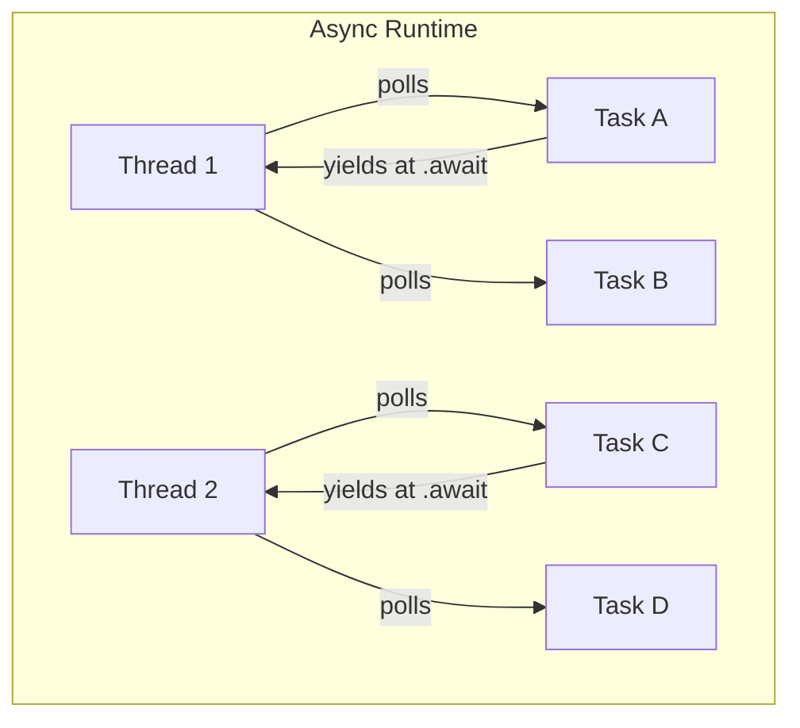

# How to Use async Rust Without Blocking the Runtime

Author: [nawazdhandala](https://www.github.com/nawazdhandala)

Tags: Rust, Async, tokio, Concurrency, Performance, Runtime, Blocking

Description: Learn how to properly use async Rust without blocking the runtime. This guide covers common anti-patterns like block_on in async contexts, spawn_blocking for CPU work, and proper async/await patterns.

---

> Async Rust gives you the performance of threads with the simplicity of sequential code, but only if you follow the rules. One blocking call can grind your entire async runtime to a halt. This guide shows you how to avoid the pitfalls and write truly non-blocking async code.

The async runtime (like Tokio) uses a small number of threads to handle many concurrent tasks. When you block a thread, you're not just blocking your task-you're stealing a thread from all other tasks. Understanding this is crucial for building performant async applications.

---

## How Async Runtimes Work

Tokio's multi-threaded runtime typically uses N threads (where N = CPU cores) to execute M tasks (where M >> N).



When a task calls `.await`:
1. The task yields control back to the runtime
2. The thread picks up another task
3. When the awaited operation completes, the task is scheduled again

When a task **blocks**:
1. The thread is stuck on that task
2. Other tasks can't run on that thread
3. Throughput drops proportionally

---

## Anti-Pattern: Blocking in Async Context

### The Problem

```rust
// BAD: This blocks the runtime thread
async fn process_file_bad(path: &str) -> String {
    // std::fs is blocking - this freezes the runtime thread!
    std::fs::read_to_string(path).unwrap()
}

// BAD: CPU-intensive work blocks the runtime
async fn hash_password_bad(password: &str) -> String {
    // Argon2 is CPU-intensive - blocks for hundreds of milliseconds
    argon2::hash_password(password)
}

// BAD: Using block_on inside async context
async fn nested_block_on_bad() {
    let handle = tokio::runtime::Handle::current();
    // PANIC or DEADLOCK: Can't block_on from async context
    handle.block_on(async { do_work().await });
}
```

### Why It's Bad

When you run this server:

```rust
// Server with blocking handler
async fn handle_request(req: Request) -> Response {
    // Each request blocks a runtime thread for 100ms
    std::thread::sleep(Duration::from_millis(100));
    Response::ok()
}

#[tokio::main]
async fn main() {
    // Default runtime: 4 threads on 4-core machine
    // Maximum throughput: 40 requests/second
    // Because: 4 threads * (1000ms / 100ms) = 40 req/s
    serve(handle_request).await;
}
```

If you have 4 runtime threads and each request blocks for 100ms, you can only handle 40 requests per second-regardless of how many tasks are waiting!

---

## Solution: Use spawn_blocking for CPU Work

Move CPU-intensive or blocking operations to a dedicated thread pool.

```rust
use tokio::task;

/// Properly handle CPU-intensive password hashing
async fn hash_password(password: String) -> Result<String, HashError> {
    // spawn_blocking runs the closure on a dedicated blocking thread pool
    // The async task yields and resumes when the blocking work completes
    task::spawn_blocking(move || {
        // This runs on a blocking thread, not a runtime thread
        argon2::hash_password(&password)
    })
    .await
    .map_err(|e| HashError::JoinError(e))?
}

/// File operations should also use spawn_blocking
async fn read_large_file(path: String) -> Result<Vec<u8>, std::io::Error> {
    task::spawn_blocking(move || {
        std::fs::read(&path)
    })
    .await
    .unwrap()
}

/// Image processing example
async fn resize_image(image_data: Vec<u8>, width: u32, height: u32) -> Vec<u8> {
    task::spawn_blocking(move || {
        // CPU-intensive image processing
        let img = image::load_from_memory(&image_data).unwrap();
        let resized = img.resize(width, height, image::imageops::FilterType::Lanczos3);
        let mut output = Vec::new();
        resized.write_to(&mut std::io::Cursor::new(&mut output), image::ImageFormat::Png).unwrap();
        output
    })
    .await
    .unwrap()
}
```

### When to Use spawn_blocking

| Operation | Use spawn_blocking? |
|-----------|-------------------|
| std::fs file operations | Yes |
| Password hashing (argon2, bcrypt) | Yes |
| Image processing | Yes |
| Compression/decompression | Yes |
| JSON parsing (large documents) | Maybe |
| Database queries (async driver) | No |
| HTTP requests (async client) | No |
| Timer/sleep | No (use tokio::time::sleep) |

Rule of thumb: If it takes >1ms of CPU time or uses std blocking APIs, use `spawn_blocking`.

---

## Solution: Use Async APIs

Prefer async-native libraries over blocking equivalents.

### File I/O

```rust
// BAD: Blocking file read
async fn read_bad(path: &str) -> String {
    std::fs::read_to_string(path).unwrap()  // Blocks!
}

// GOOD: Async file read with tokio
use tokio::fs;

async fn read_good(path: &str) -> String {
    fs::read_to_string(path).await.unwrap()  // Non-blocking
}
```

### HTTP Requests

```rust
// BAD: Blocking HTTP client
async fn fetch_bad(url: &str) -> String {
    reqwest::blocking::get(url).unwrap().text().unwrap()  // Blocks!
}

// GOOD: Async HTTP client
async fn fetch_good(url: &str) -> String {
    reqwest::get(url).await.unwrap().text().await.unwrap()  // Non-blocking
}
```

### Database Access

```rust
// BAD: Blocking database driver
async fn query_bad(pool: &diesel::PgPool) -> Vec<User> {
    pool.get().unwrap().query(...)  // Blocks!
}

// GOOD: Async database driver (sqlx)
use sqlx::PgPool;

async fn query_good(pool: &PgPool) -> Vec<User> {
    sqlx::query_as!(User, "SELECT * FROM users")
        .fetch_all(pool)
        .await
        .unwrap()
}
```

---

## Solution: Yield Periodically in Long Computations

For computations that can't easily be moved to spawn_blocking, yield periodically.

```rust
use tokio::task;

/// Process items with periodic yielding
async fn process_many_items(items: Vec<Item>) -> Vec<Result> {
    let mut results = Vec::with_capacity(items.len());

    for (i, item) in items.into_iter().enumerate() {
        // Process item (quick operation)
        let result = process_item(item);
        results.push(result);

        // Yield every 100 items to let other tasks run
        if i % 100 == 0 {
            task::yield_now().await;
        }
    }

    results
}

/// Alternative: Use channels for streaming processing
async fn process_stream(mut rx: tokio::sync::mpsc::Receiver<Item>) {
    while let Some(item) = rx.recv().await {
        // Each recv().await is a yield point
        process_item(item);
    }
}
```

---

## Anti-Pattern: Holding Locks Across Await

### The Problem

```rust
use std::sync::Mutex;

// BAD: Holding std::sync::Mutex across await
async fn update_bad(data: &Mutex<Data>) {
    let mut guard = data.lock().unwrap();
    // If we await here, we block the runtime thread holding the lock
    fetch_update().await;  // BAD: Lock held across await!
    guard.value = new_value;
}
```

Problems:
1. `std::sync::Mutex` is not async-aware
2. The runtime thread is blocked while waiting for the lock
3. Other tasks on that thread can't make progress
4. Potential deadlock if another task needs the lock

### Solution: Use Async-Aware Locks

```rust
use tokio::sync::Mutex;

// GOOD: Use tokio::sync::Mutex for async contexts
async fn update_good(data: &Mutex<Data>) {
    let mut guard = data.lock().await;  // Async lock - yields while waiting
    let update = fetch_update().await;
    guard.value = update;
}

// BETTER: Minimize lock scope
async fn update_better(data: &Mutex<Data>) {
    // Fetch update without holding lock
    let update = fetch_update().await;

    // Hold lock only for the mutation
    {
        let mut guard = data.lock().await;
        guard.value = update;
    }  // Lock released immediately
}

// BEST: Use RwLock for read-heavy workloads
use tokio::sync::RwLock;

async fn read_heavy(data: &RwLock<Data>) {
    // Multiple readers can proceed concurrently
    let guard = data.read().await;
    process(&guard.value);
}
```

### When std::sync::Mutex is OK

```rust
use std::sync::Mutex;

// OK: Lock is not held across await points
async fn quick_update(data: &Mutex<Data>) {
    {
        let mut guard = data.lock().unwrap();
        guard.counter += 1;
        // No await here - lock released immediately
    }

    // Now we can await
    notify_update().await;
}

// OK: Using parking_lot for quick critical sections
use parking_lot::Mutex;

async fn quick_access(data: &Mutex<Data>) {
    // parking_lot::Mutex is faster for uncontended cases
    let value = {
        let guard = data.lock();
        guard.value.clone()
    };

    process(value).await;
}
```

---

## Anti-Pattern: Creating Runtime Inside Runtime

### The Problem

```rust
// BAD: Creating nested runtime
#[tokio::main]
async fn main() {
    process_requests().await;
}

async fn process_requests() {
    for request in get_requests() {
        // PANIC: Cannot start a runtime from within a runtime
        let rt = tokio::runtime::Runtime::new().unwrap();
        rt.block_on(handle_request(request));
    }
}
```

### Solution: Use Proper Task Spawning

```rust
// GOOD: Spawn tasks on existing runtime
#[tokio::main]
async fn main() {
    process_requests().await;
}

async fn process_requests() {
    let handles: Vec<_> = get_requests()
        .into_iter()
        .map(|request| {
            tokio::spawn(async move {
                handle_request(request).await
            })
        })
        .collect();

    // Wait for all tasks
    for handle in handles {
        handle.await.unwrap();
    }
}

// GOOD: Using join_all for concurrent execution
use futures::future::join_all;

async fn process_requests_concurrent() {
    let futures: Vec<_> = get_requests()
        .into_iter()
        .map(|request| handle_request(request))
        .collect();

    let results = join_all(futures).await;
}
```

---

## Proper sync/async Boundary

When you need to call async code from sync context (e.g., in tests or CLI tools):

```rust
// Create runtime at program entry point
fn main() {
    let runtime = tokio::runtime::Runtime::new().unwrap();

    runtime.block_on(async {
        // All async code goes here
        run_application().await;
    });
}

// Or use the macro for simple cases
#[tokio::main]
async fn main() {
    run_application().await;
}

// For libraries: Provide both sync and async APIs
pub struct Client {
    inner: AsyncClient,
    runtime: Option<tokio::runtime::Runtime>,
}

impl Client {
    /// Async method for use in async contexts
    pub async fn fetch_async(&self, url: &str) -> Result<Response, Error> {
        self.inner.fetch(url).await
    }

    /// Sync wrapper for use in non-async contexts
    pub fn fetch(&self, url: &str) -> Result<Response, Error> {
        self.runtime
            .as_ref()
            .expect("Runtime required for sync API")
            .block_on(self.inner.fetch(url))
    }
}
```

---

## Detecting Blocking in Tests

Use tokio-test to detect blocking operations.

```rust
#[cfg(test)]
mod tests {
    use tokio::time::{timeout, Duration};

    #[tokio::test]
    async fn test_non_blocking() {
        // If this times out, the operation is likely blocking
        let result = timeout(
            Duration::from_millis(100),
            should_be_fast()
        ).await;

        assert!(result.is_ok(), "Operation took too long - might be blocking");
    }

    // Use console-subscriber in tests to detect blocking
    #[tokio::test]
    async fn test_with_console() {
        // console_subscriber::init();  // Uncomment to enable tokio-console

        // Run your test
        my_async_function().await;

        // Check tokio-console for blocked tasks
    }
}
```

---

## Configuration for Production

```rust
// Configure runtime for production workloads
fn build_runtime() -> tokio::runtime::Runtime {
    tokio::runtime::Builder::new_multi_thread()
        .worker_threads(num_cpus::get())  // One per CPU core
        .max_blocking_threads(512)         // Pool for spawn_blocking
        .thread_name("my-app-worker")
        .thread_stack_size(3 * 1024 * 1024)  // 3MB stack
        .enable_all()
        .build()
        .unwrap()
}

// Monitor runtime health
async fn monitor_runtime() {
    let metrics = tokio::runtime::Handle::current().metrics();

    loop {
        tokio::time::sleep(Duration::from_secs(10)).await;

        // Log runtime metrics
        tracing::info!(
            workers = metrics.num_workers(),
            blocking_threads = metrics.num_blocking_threads(),
            "Runtime metrics"
        );
    }
}
```

---

## Summary: Async Best Practices

| Do | Don't |
|----|-------|
| Use async I/O libraries (tokio::fs, reqwest) | Use std::fs, blocking HTTP clients |
| spawn_blocking for CPU work | Run CPU-intensive code directly |
| Use tokio::sync::Mutex | Hold std::sync::Mutex across await |
| Yield in long loops | Block the runtime indefinitely |
| Create runtime at program entry | Create runtime from async context |
| Use async-aware channel (tokio::sync::mpsc) | Use std::sync::mpsc in async code |

---

*Need to monitor your async Rust services? [OneUptime](https://oneuptime.com) provides observability for async applications with trace-based performance analysis.*

**Related Reading:**
- [How to Instrument Rust Applications with OpenTelemetry](https://oneuptime.com/blog/post/2026-01-07-rust-opentelemetry-instrumentation/view)
- [How to Profile Rust Applications](https://oneuptime.com/blog/post/2026-01-07-rust-profiling-perf-flamegraph/view)
