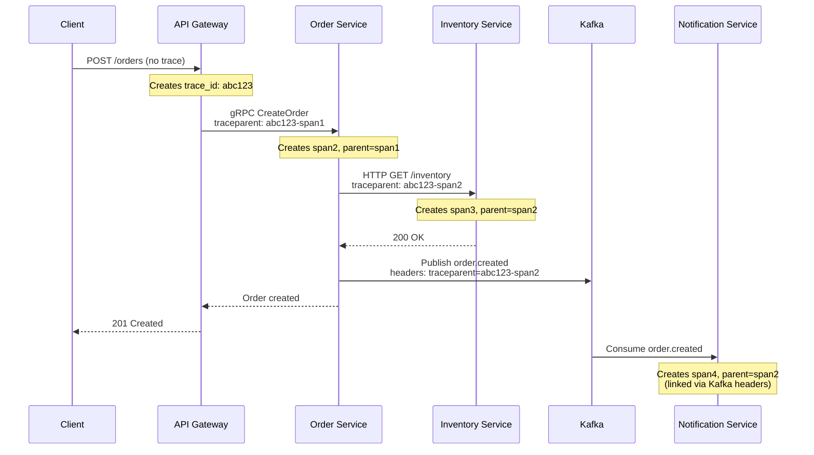

# How to Implement Distributed Tracing in Rust Microservices

Author: [nawazdhandala](https://www.github.com/nawazdhandala)

Tags: Rust, Distributed Tracing, OpenTelemetry, Microservices, axum, tonic, gRPC, Kafka, Context Propagation

Description: Learn how to implement distributed tracing across Rust microservices using OpenTelemetry. This guide covers context propagation for HTTP (axum/actix-web), gRPC (tonic), and message queues with practical examples.

---

> In a microservices architecture, a single user request can touch dozens of services. Without distributed tracing, debugging becomes a guessing game. This guide shows you how to propagate trace context across HTTP, gRPC, and message queues in Rust.

Distributed tracing connects the dots between service calls, showing you the complete path of a request through your system. OpenTelemetry provides the standards and tools to make this work across different protocols and services.

---

## Understanding Context Propagation

Context propagation carries trace information (trace ID, span ID, sampling decisions) between services. The W3C Trace Context standard defines headers for HTTP:

```
traceparent: 00-<trace-id>-<span-id>-<flags>
tracestate: <vendor-specific-data>
```

OpenTelemetry handles this automatically when configured correctly.

---

## HTTP Context Propagation with Axum

### Server-Side: Extracting Context

This middleware extracts trace context from incoming HTTP requests and creates a new span as a child of the caller's span.

```rust
// src/http/tracing_middleware.rs
// Axum middleware for trace context extraction

use axum::{
    body::Body,
    extract::Request,
    http::{HeaderMap, StatusCode},
    middleware::Next,
    response::Response,
};
use opentelemetry::{
    global,
    propagation::Extractor,
    trace::{SpanKind, Status, TraceContextExt, Tracer},
    Context,
};
use std::time::Instant;
use tracing::{info_span, Instrument, Span};

/// Extractor for HTTP headers - implements OpenTelemetry's Extractor trait
struct HeaderExtractor<'a>(&'a HeaderMap);

impl<'a> Extractor for HeaderExtractor<'a> {
    fn get(&self, key: &str) -> Option<&str> {
        self.0.get(key).and_then(|v| v.to_str().ok())
    }

    fn keys(&self) -> Vec<&str> {
        self.0.keys().map(|k| k.as_str()).collect()
    }
}

/// Tracing middleware that extracts context and creates spans for requests
pub async fn tracing_middleware(request: Request, next: Next) -> Result<Response, StatusCode> {
    let start = Instant::now();

    // Extract incoming trace context from headers
    let parent_context = global::get_text_map_propagator(|propagator| {
        propagator.extract(&HeaderExtractor(request.headers()))
    });

    // Get request details for span attributes
    let method = request.method().to_string();
    let uri = request.uri().path().to_string();
    let version = format!("{:?}", request.version());

    // Create a span as a child of the extracted context
    let tracer = global::tracer("http-server");
    let span = tracer
        .span_builder(format!("{} {}", method, uri))
        .with_kind(SpanKind::Server)
        .with_attributes(vec![
            opentelemetry::KeyValue::new("http.method", method.clone()),
            opentelemetry::KeyValue::new("http.route", uri.clone()),
            opentelemetry::KeyValue::new("http.flavor", version),
        ])
        .start_with_context(&tracer, &parent_context);

    // Create a tracing span linked to OpenTelemetry
    let tracing_span = info_span!(
        "http_request",
        http.method = %method,
        http.route = %uri,
        otel.kind = "server"
    );

    // Execute the request handler within the span context
    let response = next.run(request).instrument(tracing_span).await;

    // Record response status and latency
    let status_code = response.status().as_u16();
    let latency_ms = start.elapsed().as_secs_f64() * 1000.0;

    // Set span status based on HTTP status code
    if status_code >= 400 {
        span.set_status(Status::error(format!("HTTP {}", status_code)));
    }

    span.set_attribute(opentelemetry::KeyValue::new(
        "http.status_code",
        status_code as i64,
    ));
    span.set_attribute(opentelemetry::KeyValue::new(
        "http.response_latency_ms",
        latency_ms,
    ));

    span.end();

    Ok(response)
}
```

### Client-Side: Injecting Context

When making HTTP requests to other services, inject the current trace context into headers.

```rust
// src/http/client.rs
// HTTP client with trace context injection

use opentelemetry::{
    global,
    propagation::Injector,
    trace::{SpanKind, TraceContextExt, Tracer},
    Context,
};
use reqwest::{Client, RequestBuilder, Response};
use std::collections::HashMap;
use tracing::instrument;

/// Injector for HTTP headers
struct HeaderInjector<'a>(&'a mut HashMap<String, String>);

impl<'a> Injector for HeaderInjector<'a> {
    fn set(&mut self, key: &str, value: String) {
        self.0.insert(key.to_string(), value);
    }
}

/// Traced HTTP client that propagates context
pub struct TracedHttpClient {
    client: Client,
}

impl TracedHttpClient {
    pub fn new() -> Self {
        Self {
            client: Client::new(),
        }
    }

    /// Make a GET request with trace context propagation
    #[instrument(skip(self), fields(http.method = "GET", http.url = %url))]
    pub async fn get(&self, url: &str) -> Result<Response, reqwest::Error> {
        self.request(reqwest::Method::GET, url, None).await
    }

    /// Make a POST request with trace context propagation
    #[instrument(skip(self, body), fields(http.method = "POST", http.url = %url))]
    pub async fn post(&self, url: &str, body: Option<String>) -> Result<Response, reqwest::Error> {
        self.request(reqwest::Method::POST, url, body).await
    }

    /// Internal request method that handles context injection
    async fn request(
        &self,
        method: reqwest::Method,
        url: &str,
        body: Option<String>,
    ) -> Result<Response, reqwest::Error> {
        // Create a client span for this outgoing request
        let tracer = global::tracer("http-client");
        let span = tracer
            .span_builder(format!("{} {}", method, url))
            .with_kind(SpanKind::Client)
            .start(&tracer);

        // Create context with the active span
        let cx = Context::current_with_span(span);

        // Prepare headers with trace context
        let mut headers = HashMap::new();
        global::get_text_map_propagator(|propagator| {
            propagator.inject_context(&cx, &mut HeaderInjector(&mut headers))
        });

        // Build the request
        let mut request_builder = self.client.request(method, url);

        // Add propagation headers
        for (key, value) in headers {
            request_builder = request_builder.header(&key, &value);
        }

        // Add body if present
        if let Some(b) = body {
            request_builder = request_builder.body(b);
        }

        // Execute and return response
        request_builder.send().await
    }
}

// Example usage in a service that calls another service
#[instrument]
async fn call_inventory_service(product_id: &str) -> Result<InventoryResponse, ServiceError> {
    let client = TracedHttpClient::new();

    let url = format!("http://inventory-service/api/products/{}", product_id);
    let response = client.get(&url).await?;

    if response.status().is_success() {
        let inventory: InventoryResponse = response.json().await?;
        Ok(inventory)
    } else {
        Err(ServiceError::InventoryUnavailable)
    }
}

#[derive(serde::Deserialize)]
struct InventoryResponse {
    product_id: String,
    quantity: u32,
    location: String,
}

#[derive(Debug)]
enum ServiceError {
    InventoryUnavailable,
    HttpError(reqwest::Error),
}

impl From<reqwest::Error> for ServiceError {
    fn from(err: reqwest::Error) -> Self {
        ServiceError::HttpError(err)
    }
}
```

---

## gRPC Context Propagation with Tonic

For gRPC services using Tonic, context propagation uses metadata headers.

### gRPC Server Interceptor

```rust
// src/grpc/server.rs
// Tonic server with trace context extraction

use opentelemetry::{
    global,
    propagation::Extractor,
    trace::{SpanKind, TraceContextExt, Tracer},
    Context,
};
use tonic::{Request, Status};

/// Extractor for gRPC metadata
struct MetadataExtractor<'a>(&'a tonic::metadata::MetadataMap);

impl<'a> Extractor for MetadataExtractor<'a> {
    fn get(&self, key: &str) -> Option<&str> {
        self.0.get(key).and_then(|v| v.to_str().ok())
    }

    fn keys(&self) -> Vec<&str> {
        self.0
            .keys()
            .filter_map(|k| match k {
                tonic::metadata::KeyRef::Ascii(key) => Some(key.as_str()),
                _ => None,
            })
            .collect()
    }
}

/// Extract trace context from incoming gRPC request
pub fn extract_trace_context<T>(request: &Request<T>) -> Context {
    global::get_text_map_propagator(|propagator| {
        propagator.extract(&MetadataExtractor(request.metadata()))
    })
}

/// Server interceptor that creates spans for incoming requests
pub fn tracing_interceptor(request: Request<()>) -> Result<Request<()>, Status> {
    // Extract parent context from metadata
    let parent_context = extract_trace_context(&request);

    // Create a server span
    let tracer = global::tracer("grpc-server");
    let _span = tracer
        .span_builder("grpc_request")
        .with_kind(SpanKind::Server)
        .start_with_context(&tracer, &parent_context);

    Ok(request)
}

// Example gRPC service implementation
use tonic::{Response, Status};

pub mod orders {
    tonic::include_proto!("orders");
}

use orders::{
    order_service_server::{OrderService, OrderServiceServer},
    CreateOrderRequest, CreateOrderResponse, GetOrderRequest, GetOrderResponse,
};

pub struct OrderServiceImpl {
    // Service dependencies
}

#[tonic::async_trait]
impl OrderService for OrderServiceImpl {
    #[tracing::instrument(skip(self, request), fields(grpc.method = "CreateOrder"))]
    async fn create_order(
        &self,
        request: Request<CreateOrderRequest>,
    ) -> Result<Response<CreateOrderResponse>, Status> {
        // Extract trace context for this request
        let _parent_cx = extract_trace_context(&request);

        let req = request.into_inner();

        tracing::info!(
            customer_id = %req.customer_id,
            items_count = req.items.len(),
            "Creating order via gRPC"
        );

        // Process order...
        let order_id = format!("ord_{}", uuid::Uuid::new_v4());

        Ok(Response::new(CreateOrderResponse {
            order_id,
            status: "created".to_string(),
        }))
    }

    #[tracing::instrument(skip(self, request), fields(grpc.method = "GetOrder"))]
    async fn get_order(
        &self,
        request: Request<GetOrderRequest>,
    ) -> Result<Response<GetOrderResponse>, Status> {
        let _parent_cx = extract_trace_context(&request);
        let req = request.into_inner();

        tracing::info!(order_id = %req.order_id, "Fetching order via gRPC");

        // Fetch order...
        Ok(Response::new(GetOrderResponse {
            order_id: req.order_id,
            customer_id: "cust_123".to_string(),
            status: "completed".to_string(),
        }))
    }
}
```

### gRPC Client Interceptor

```rust
// src/grpc/client.rs
// Tonic client with trace context injection

use opentelemetry::{
    global,
    propagation::Injector,
    trace::{SpanKind, Tracer},
    Context,
};
use tonic::{
    metadata::{MetadataKey, MetadataValue},
    Request,
};

/// Injector for gRPC metadata
struct MetadataInjector<'a>(&'a mut tonic::metadata::MetadataMap);

impl<'a> Injector for MetadataInjector<'a> {
    fn set(&mut self, key: &str, value: String) {
        if let Ok(key) = MetadataKey::from_bytes(key.as_bytes()) {
            if let Ok(val) = MetadataValue::try_from(&value) {
                self.0.insert(key, val);
            }
        }
    }
}

/// Inject trace context into outgoing gRPC request
pub fn inject_trace_context<T>(request: &mut Request<T>) {
    let cx = Context::current();
    global::get_text_map_propagator(|propagator| {
        propagator.inject_context(&cx, &mut MetadataInjector(request.metadata_mut()))
    });
}

/// Create a traced gRPC request
pub fn traced_request<T>(inner: T, method_name: &str) -> Request<T> {
    // Create a client span for this outgoing request
    let tracer = global::tracer("grpc-client");
    let _span = tracer
        .span_builder(method_name)
        .with_kind(SpanKind::Client)
        .start(&tracer);

    // Create request and inject context
    let mut request = Request::new(inner);
    inject_trace_context(&mut request);

    request
}

// Example client usage
use orders::order_service_client::OrderServiceClient;
use orders::GetOrderRequest;

#[tracing::instrument]
async fn fetch_order_from_service(order_id: &str) -> Result<GetOrderResponse, tonic::Status> {
    let mut client = OrderServiceClient::connect("http://order-service:50051")
        .await
        .map_err(|e| tonic::Status::unavailable(format!("Failed to connect: {}", e)))?;

    // Create traced request
    let request = traced_request(
        GetOrderRequest {
            order_id: order_id.to_string(),
        },
        "orders.OrderService/GetOrder",
    );

    let response = client.get_order(request).await?;

    Ok(response.into_inner())
}
```

---

## Message Queue Context Propagation

For asynchronous communication via message queues like Kafka, embed trace context in message headers.

### Kafka Producer with Context

```rust
// src/kafka/producer.rs
// Kafka producer with trace context injection

use opentelemetry::{
    global,
    propagation::Injector,
    trace::{SpanKind, Tracer},
    Context,
};
use rdkafka::{
    producer::{FutureProducer, FutureRecord},
    ClientConfig,
};
use std::collections::HashMap;
use std::time::Duration;

/// Traced Kafka producer
pub struct TracedKafkaProducer {
    producer: FutureProducer,
}

impl TracedKafkaProducer {
    pub fn new(bootstrap_servers: &str) -> Result<Self, rdkafka::error::KafkaError> {
        let producer: FutureProducer = ClientConfig::new()
            .set("bootstrap.servers", bootstrap_servers)
            .set("message.timeout.ms", "5000")
            .create()?;

        Ok(Self { producer })
    }

    /// Publish a message with trace context in headers
    #[tracing::instrument(skip(self, payload), fields(kafka.topic = %topic))]
    pub async fn publish(
        &self,
        topic: &str,
        key: &str,
        payload: &[u8],
    ) -> Result<(), KafkaPublishError> {
        // Create a producer span
        let tracer = global::tracer("kafka-producer");
        let span = tracer
            .span_builder(format!("kafka.publish {}", topic))
            .with_kind(SpanKind::Producer)
            .start(&tracer);

        let cx = Context::current_with_span(span);

        // Prepare headers with trace context
        let mut trace_headers: HashMap<String, String> = HashMap::new();
        global::get_text_map_propagator(|propagator| {
            propagator.inject_context(&cx, &mut MapInjector(&mut trace_headers))
        });

        // Build Kafka headers from trace context
        let mut headers = rdkafka::message::OwnedHeaders::new();
        for (k, v) in &trace_headers {
            headers = headers.insert(rdkafka::message::Header {
                key: k,
                value: Some(v.as_bytes()),
            });
        }

        // Create and send the record
        let record = FutureRecord::to(topic)
            .key(key)
            .payload(payload)
            .headers(headers);

        self.producer
            .send(record, Duration::from_secs(5))
            .await
            .map_err(|(err, _)| KafkaPublishError::SendError(err))?;

        tracing::info!(topic, key, "Message published to Kafka");

        Ok(())
    }
}

/// Injector for HashMap (used for Kafka headers)
struct MapInjector<'a>(&'a mut HashMap<String, String>);

impl<'a> Injector for MapInjector<'a> {
    fn set(&mut self, key: &str, value: String) {
        self.0.insert(key.to_string(), value);
    }
}

#[derive(Debug)]
pub enum KafkaPublishError {
    SendError(rdkafka::error::KafkaError),
}
```

### Kafka Consumer with Context

```rust
// src/kafka/consumer.rs
// Kafka consumer with trace context extraction

use opentelemetry::{
    global,
    propagation::Extractor,
    trace::{SpanKind, TraceContextExt, Tracer},
    Context,
};
use rdkafka::{
    consumer::{Consumer, StreamConsumer},
    message::BorrowedMessage,
    ClientConfig, Message,
};
use std::collections::HashMap;

/// Traced Kafka consumer
pub struct TracedKafkaConsumer {
    consumer: StreamConsumer,
}

impl TracedKafkaConsumer {
    pub fn new(
        bootstrap_servers: &str,
        group_id: &str,
        topics: &[&str],
    ) -> Result<Self, rdkafka::error::KafkaError> {
        let consumer: StreamConsumer = ClientConfig::new()
            .set("bootstrap.servers", bootstrap_servers)
            .set("group.id", group_id)
            .set("auto.offset.reset", "earliest")
            .create()?;

        consumer.subscribe(topics)?;

        Ok(Self { consumer })
    }

    /// Process messages with trace context extraction
    pub async fn consume<F, Fut>(&self, handler: F) -> Result<(), KafkaConsumeError>
    where
        F: Fn(ProcessableMessage) -> Fut,
        Fut: std::future::Future<Output = Result<(), ProcessingError>>,
    {
        loop {
            match self.consumer.recv().await {
                Ok(message) => {
                    // Extract trace context from message headers
                    let parent_context = extract_context_from_message(&message);

                    // Create a consumer span as a child of the producer span
                    let tracer = global::tracer("kafka-consumer");
                    let span = tracer
                        .span_builder(format!(
                            "kafka.consume {}",
                            message.topic()
                        ))
                        .with_kind(SpanKind::Consumer)
                        .start_with_context(&tracer, &parent_context);

                    let _guard = Context::current_with_span(span).attach();

                    tracing::info!(
                        topic = message.topic(),
                        partition = message.partition(),
                        offset = message.offset(),
                        "Processing Kafka message"
                    );

                    // Extract payload
                    let payload = message.payload().unwrap_or_default().to_vec();
                    let key = message
                        .key()
                        .map(|k| String::from_utf8_lossy(k).to_string());

                    let processable = ProcessableMessage {
                        topic: message.topic().to_string(),
                        key,
                        payload,
                        partition: message.partition(),
                        offset: message.offset(),
                    };

                    // Process with handler
                    if let Err(e) = handler(processable).await {
                        tracing::error!(error = ?e, "Failed to process message");
                    }
                }
                Err(e) => {
                    tracing::error!(error = ?e, "Error receiving Kafka message");
                }
            }
        }
    }
}

/// Extract trace context from Kafka message headers
fn extract_context_from_message(message: &BorrowedMessage) -> Context {
    let mut headers_map: HashMap<String, String> = HashMap::new();

    if let Some(headers) = message.headers() {
        for header in headers.iter() {
            if let Some(value) = header.value {
                if let Ok(v) = std::str::from_utf8(value) {
                    headers_map.insert(header.key.to_string(), v.to_string());
                }
            }
        }
    }

    global::get_text_map_propagator(|propagator| {
        propagator.extract(&MapExtractor(&headers_map))
    })
}

/// Extractor for HashMap (used for Kafka headers)
struct MapExtractor<'a>(&'a HashMap<String, String>);

impl<'a> Extractor for MapExtractor<'a> {
    fn get(&self, key: &str) -> Option<&str> {
        self.0.get(key).map(|v| v.as_str())
    }

    fn keys(&self) -> Vec<&str> {
        self.0.keys().map(|k| k.as_str()).collect()
    }
}

pub struct ProcessableMessage {
    pub topic: String,
    pub key: Option<String>,
    pub payload: Vec<u8>,
    pub partition: i32,
    pub offset: i64,
}

#[derive(Debug)]
pub enum KafkaConsumeError {
    ReceiveError(rdkafka::error::KafkaError),
}

#[derive(Debug)]
pub enum ProcessingError {
    DeserializationError,
    BusinessLogicError(String),
}
```

---

## Complete Microservices Example

Here's a diagram showing trace context flow across services:



---

## Visualizing Distributed Traces

Once configured, your traces will show the complete request flow:

```
Trace: abc123def456...
├── API Gateway: POST /api/orders (150ms)
│   ├── Order Service: CreateOrder (120ms)
│   │   ├── Inventory Service: GET /inventory (30ms)
│   │   ├── Database: INSERT orders (15ms)
│   │   └── Kafka: publish order.created (5ms)
│   └── Response serialization (2ms)
└── [Async] Notification Service: process order.created (50ms)
    └── Email Service: send confirmation (45ms)
```

---

## Best Practices

1. **Use consistent propagators** - Ensure all services use W3C Trace Context
2. **Set span kind correctly** - SERVER for incoming, CLIENT for outgoing, PRODUCER/CONSUMER for async
3. **Add semantic attributes** - Follow OpenTelemetry conventions for HTTP, gRPC, messaging
4. **Handle missing context** - Create new traces when context is absent (edge of system)
5. **Test propagation** - Verify trace IDs flow through your entire request path

---

*Need to visualize traces across your Rust microservices? [OneUptime](https://oneuptime.com) provides end-to-end distributed tracing with service maps and latency analysis.*

**Related Reading:**
- [How to Instrument Rust Applications with OpenTelemetry](https://oneuptime.com/blog/post/2026-01-07-rust-opentelemetry-instrumentation/view)
- [Traces and Spans in OpenTelemetry](https://oneuptime.com/blog/post/2025-08-27-traces-and-spans-in-opentelemetry/view)
