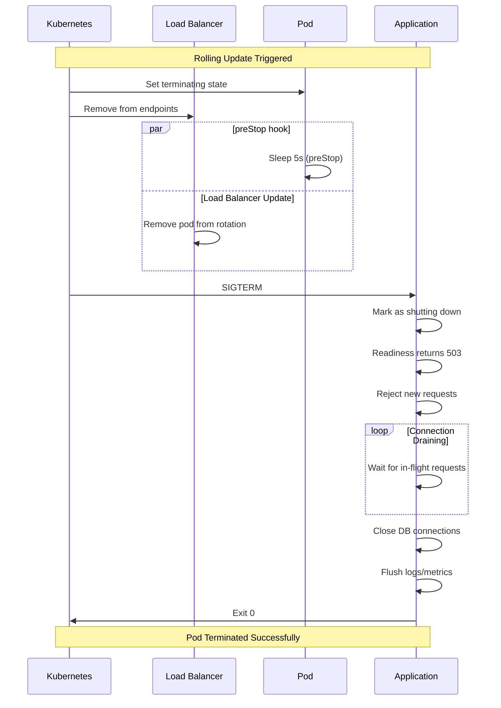

# How to Build a Graceful Shutdown Handler in Rust

Author: [nawazdhandala](https://www.github.com/nawazdhandala)

Tags: Rust, Graceful Shutdown, SIGTERM, Kubernetes, Zero Downtime, Connection Draining, Production

Description: Learn how to implement graceful shutdown in Rust applications. This guide covers SIGTERM handling, connection draining, resource cleanup, and zero-downtime deployment patterns.

---

> A graceful shutdown is the difference between "process killed" and "service unavailable for maintenance". When your application receives SIGTERM, it should stop accepting new requests, complete in-flight work, and clean up resources before exiting.

Proper shutdown handling is essential for zero-downtime deployments in Kubernetes and any production environment. This guide shows you how to implement it correctly in Rust.

---

## Why Graceful Shutdown Matters

Without graceful shutdown:
```
SIGTERM → Process killed immediately
         → Active requests fail
         → Database transactions left incomplete
         → Connections forcibly closed
```

With graceful shutdown:
```
SIGTERM → Stop accepting new requests
        → Wait for active requests to complete
        → Close database connections properly
        → Flush logs and metrics
        → Exit cleanly
```

---

## Basic Signal Handling

Rust's `tokio` provides cross-platform signal handling.

```rust
// src/shutdown.rs
// Basic signal handling for graceful shutdown

use tokio::signal;
use tokio::sync::broadcast;

/// Creates a shutdown signal that triggers on SIGTERM or Ctrl+C
pub async fn shutdown_signal() {
    let ctrl_c = async {
        signal::ctrl_c()
            .await
            .expect("Failed to install Ctrl+C handler");
    };

    #[cfg(unix)]
    let terminate = async {
        signal::unix::signal(signal::unix::SignalKind::terminate())
            .expect("Failed to install SIGTERM handler")
            .recv()
            .await;
    };

    #[cfg(not(unix))]
    let terminate = std::future::pending::<()>();

    tokio::select! {
        _ = ctrl_c => {
            tracing::info!("Received Ctrl+C, initiating shutdown");
        }
        _ = terminate => {
            tracing::info!("Received SIGTERM, initiating shutdown");
        }
    }
}

/// Shutdown coordinator using broadcast channel
pub struct ShutdownCoordinator {
    /// Sender to notify all listeners
    notify_shutdown: broadcast::Sender<()>,
    /// Tracks if shutdown has been initiated
    shutdown_initiated: std::sync::atomic::AtomicBool,
}

impl ShutdownCoordinator {
    pub fn new() -> Self {
        let (tx, _) = broadcast::channel(1);
        Self {
            notify_shutdown: tx,
            shutdown_initiated: std::sync::atomic::AtomicBool::new(false),
        }
    }

    /// Get a receiver for shutdown notifications
    pub fn subscribe(&self) -> broadcast::Receiver<()> {
        self.notify_shutdown.subscribe()
    }

    /// Trigger shutdown
    pub fn trigger_shutdown(&self) {
        self.shutdown_initiated.store(true, std::sync::atomic::Ordering::SeqCst);
        let _ = self.notify_shutdown.send(());
    }

    /// Check if shutdown has been initiated
    pub fn is_shutting_down(&self) -> bool {
        self.shutdown_initiated.load(std::sync::atomic::Ordering::SeqCst)
    }
}

impl Default for ShutdownCoordinator {
    fn default() -> Self {
        Self::new()
    }
}
```

---

## Axum Server with Graceful Shutdown

```rust
// src/main.rs
// Complete application with graceful shutdown

mod shutdown;

use axum::{routing::get, Router};
use std::sync::Arc;
use std::time::Duration;
use tokio::sync::watch;

#[tokio::main]
async fn main() {
    // Initialize tracing
    tracing_subscriber::fmt::init();

    // Create shutdown coordinator
    let shutdown = Arc::new(shutdown::ShutdownCoordinator::new());

    // Create application state
    let state = AppState {
        shutdown: shutdown.clone(),
    };

    // Build router
    let app = Router::new()
        .route("/health", get(health_check))
        .route("/api/work", get(do_work))
        .with_state(state);

    // Start server
    let listener = tokio::net::TcpListener::bind("0.0.0.0:3000")
        .await
        .unwrap();

    tracing::info!("Server listening on 0.0.0.0:3000");

    // Spawn signal handler
    let shutdown_clone = shutdown.clone();
    tokio::spawn(async move {
        shutdown::shutdown_signal().await;
        shutdown_clone.trigger_shutdown();
    });

    // Run server with graceful shutdown
    axum::serve(listener, app)
        .with_graceful_shutdown(async move {
            let mut rx = shutdown.subscribe();
            let _ = rx.recv().await;
            tracing::info!("Shutdown signal received, stopping server");
        })
        .await
        .unwrap();

    tracing::info!("Server stopped");

    // Perform cleanup
    cleanup().await;

    tracing::info!("Shutdown complete");
}

#[derive(Clone)]
struct AppState {
    shutdown: Arc<shutdown::ShutdownCoordinator>,
}

async fn health_check() -> &'static str {
    "OK"
}

async fn do_work() -> &'static str {
    // Simulate work
    tokio::time::sleep(Duration::from_secs(2)).await;
    "Done"
}

async fn cleanup() {
    tracing::info!("Running cleanup tasks...");
    // Close database connections, flush metrics, etc.
    tokio::time::sleep(Duration::from_millis(100)).await;
    tracing::info!("Cleanup complete");
}
```

---

## Connection Draining

Wait for in-flight requests to complete before shutting down.

```rust
// src/connection_tracker.rs
// Track active connections for graceful draining

use std::sync::atomic::{AtomicUsize, Ordering};
use std::sync::Arc;
use std::time::Duration;
use tokio::sync::Notify;

/// Tracks active connections and signals when all are drained
pub struct ConnectionTracker {
    active_count: AtomicUsize,
    all_drained: Notify,
}

impl ConnectionTracker {
    pub fn new() -> Arc<Self> {
        Arc::new(Self {
            active_count: AtomicUsize::new(0),
            all_drained: Notify::new(),
        })
    }

    /// Increment active connection count
    pub fn connection_started(&self) {
        self.active_count.fetch_add(1, Ordering::SeqCst);
    }

    /// Decrement active connection count
    pub fn connection_ended(&self) {
        let prev = self.active_count.fetch_sub(1, Ordering::SeqCst);
        if prev == 1 {
            // Last connection ended
            self.all_drained.notify_waiters();
        }
    }

    /// Get current active connection count
    pub fn active_count(&self) -> usize {
        self.active_count.load(Ordering::SeqCst)
    }

    /// Wait for all connections to drain with timeout
    pub async fn wait_for_drain(&self, timeout: Duration) -> bool {
        if self.active_count() == 0 {
            return true;
        }

        tokio::select! {
            _ = self.all_drained.notified() => true,
            _ = tokio::time::sleep(timeout) => {
                tracing::warn!(
                    active = self.active_count(),
                    "Timeout waiting for connections to drain"
                );
                false
            }
        }
    }
}

/// RAII guard for tracking connection lifecycle
pub struct ConnectionGuard {
    tracker: Arc<ConnectionTracker>,
}

impl ConnectionGuard {
    pub fn new(tracker: Arc<ConnectionTracker>) -> Self {
        tracker.connection_started();
        Self { tracker }
    }
}

impl Drop for ConnectionGuard {
    fn drop(&mut self) {
        self.tracker.connection_ended();
    }
}
```

### Using Connection Tracking in Middleware

```rust
// src/middleware/connection_tracking.rs
// Middleware to track active requests

use axum::{
    extract::State,
    http::Request,
    middleware::Next,
    response::Response,
};
use std::sync::Arc;

use crate::connection_tracker::{ConnectionGuard, ConnectionTracker};

pub async fn track_connections<Bd>(
    State(tracker): State<Arc<ConnectionTracker>>,
    request: Request<Bd>,
    next: Next<Bd>,
) -> Response {
    // Create guard - increments count on creation, decrements on drop
    let _guard = ConnectionGuard::new(tracker);

    // Process request
    next.run(request).await

    // Guard dropped here, decrementing count
}
```

---

## Complete Graceful Shutdown Implementation

```rust
// src/main.rs
// Production-ready graceful shutdown

use axum::{
    extract::State,
    http::StatusCode,
    middleware,
    routing::get,
    Router,
};
use std::sync::atomic::{AtomicBool, Ordering};
use std::sync::Arc;
use std::time::Duration;
use tokio::sync::broadcast;

/// Application state with shutdown coordination
#[derive(Clone)]
struct AppState {
    /// Tracks active requests
    connections: Arc<ConnectionTracker>,
    /// Shutdown signal
    shutdown_tx: broadcast::Sender<()>,
    /// Whether shutdown is in progress
    is_shutting_down: Arc<AtomicBool>,
    /// Database pool
    db_pool: sqlx::PgPool,
}

impl AppState {
    fn is_shutting_down(&self) -> bool {
        self.is_shutting_down.load(Ordering::SeqCst)
    }
}

#[tokio::main]
async fn main() -> Result<(), Box<dyn std::error::Error>> {
    tracing_subscriber::fmt::init();

    // Initialize resources
    let db_pool = create_db_pool().await?;
    let connections = ConnectionTracker::new();
    let (shutdown_tx, _) = broadcast::channel(1);
    let is_shutting_down = Arc::new(AtomicBool::new(false));

    let state = AppState {
        connections: connections.clone(),
        shutdown_tx: shutdown_tx.clone(),
        is_shutting_down: is_shutting_down.clone(),
        db_pool: db_pool.clone(),
    };

    // Build application
    let app = Router::new()
        .route("/health/live", get(liveness))
        .route("/health/ready", get(readiness))
        .route("/api/process", get(process_request))
        // Track connections middleware
        .layer(middleware::from_fn_with_state(
            connections.clone(),
            track_connections,
        ))
        // Reject new requests during shutdown
        .layer(middleware::from_fn_with_state(
            state.clone(),
            reject_during_shutdown,
        ))
        .with_state(state);

    // Create listener
    let listener = tokio::net::TcpListener::bind("0.0.0.0:3000").await?;
    tracing::info!("Server listening on 0.0.0.0:3000");

    // Run server with graceful shutdown
    let server = axum::serve(listener, app);

    // Handle shutdown
    let shutdown_handle = tokio::spawn(async move {
        // Wait for shutdown signal
        shutdown_signal().await;

        tracing::info!("Shutdown initiated");

        // Mark as shutting down (rejects new requests)
        is_shutting_down.store(true, Ordering::SeqCst);

        // Signal shutdown to all listeners
        let _ = shutdown_tx.send(());

        // Wait for active connections to drain (max 30 seconds)
        tracing::info!(
            active = connections.active_count(),
            "Waiting for connections to drain"
        );

        connections.wait_for_drain(Duration::from_secs(30)).await;

        tracing::info!("Connections drained");

        // Close database pool
        tracing::info!("Closing database connections");
        db_pool.close().await;

        tracing::info!("Cleanup complete");
    });

    // Run server until shutdown
    let mut shutdown_rx = shutdown_tx.subscribe();
    server
        .with_graceful_shutdown(async move {
            let _ = shutdown_rx.recv().await;
        })
        .await?;

    // Wait for cleanup to complete
    shutdown_handle.await?;

    tracing::info!("Server shutdown complete");
    Ok(())
}

/// Middleware to reject requests during shutdown
async fn reject_during_shutdown<Bd>(
    State(state): State<AppState>,
    request: axum::http::Request<Bd>,
    next: middleware::Next<Bd>,
) -> Result<axum::response::Response, StatusCode> {
    if state.is_shutting_down() {
        // Return 503 during shutdown
        return Err(StatusCode::SERVICE_UNAVAILABLE);
    }

    Ok(next.run(request).await)
}

/// Liveness probe - always healthy if process is running
async fn liveness() -> StatusCode {
    StatusCode::OK
}

/// Readiness probe - not ready during shutdown
async fn readiness(State(state): State<AppState>) -> StatusCode {
    if state.is_shutting_down() {
        StatusCode::SERVICE_UNAVAILABLE
    } else {
        StatusCode::OK
    }
}

/// Example endpoint that does work
async fn process_request() -> &'static str {
    // Simulate processing
    tokio::time::sleep(Duration::from_secs(1)).await;
    "Processed"
}
```

---

## Background Task Shutdown

Coordinate shutdown of background tasks.

```rust
// src/background_tasks.rs
// Graceful shutdown for background workers

use std::sync::Arc;
use tokio::sync::broadcast;
use tokio::task::JoinHandle;

/// Manager for background tasks
pub struct BackgroundTaskManager {
    shutdown_tx: broadcast::Sender<()>,
    tasks: Vec<JoinHandle<()>>,
}

impl BackgroundTaskManager {
    pub fn new() -> Self {
        let (shutdown_tx, _) = broadcast::channel(1);
        Self {
            shutdown_tx,
            tasks: Vec::new(),
        }
    }

    /// Spawn a task that listens for shutdown
    pub fn spawn<F, Fut>(&mut self, name: &'static str, f: F)
    where
        F: FnOnce(broadcast::Receiver<()>) -> Fut + Send + 'static,
        Fut: std::future::Future<Output = ()> + Send,
    {
        let rx = self.shutdown_tx.subscribe();

        let handle = tokio::spawn(async move {
            tracing::info!(task = name, "Background task started");
            f(rx).await;
            tracing::info!(task = name, "Background task stopped");
        });

        self.tasks.push(handle);
    }

    /// Signal shutdown and wait for all tasks to complete
    pub async fn shutdown(self, timeout: std::time::Duration) {
        tracing::info!("Shutting down background tasks");

        // Signal shutdown
        let _ = self.shutdown_tx.send(());

        // Wait for all tasks with timeout
        let shutdown_future = async {
            for handle in self.tasks {
                let _ = handle.await;
            }
        };

        if tokio::time::timeout(timeout, shutdown_future).await.is_err() {
            tracing::warn!("Background tasks did not complete within timeout");
        }

        tracing::info!("Background tasks shutdown complete");
    }
}

/// Example: Periodic task that respects shutdown
pub async fn metrics_reporter(mut shutdown_rx: broadcast::Receiver<()>) {
    let mut interval = tokio::time::interval(std::time::Duration::from_secs(10));

    loop {
        tokio::select! {
            _ = interval.tick() => {
                // Report metrics
                tracing::debug!("Reporting metrics");
            }
            _ = shutdown_rx.recv() => {
                tracing::info!("Metrics reporter received shutdown signal");
                break;
            }
        }
    }

    // Final metrics flush
    tracing::info!("Flushing final metrics");
}

/// Example: Queue consumer that completes current item before stopping
pub async fn queue_consumer(mut shutdown_rx: broadcast::Receiver<()>) {
    loop {
        tokio::select! {
            biased; // Prioritize shutdown check

            _ = shutdown_rx.recv() => {
                tracing::info!("Queue consumer received shutdown signal");
                break;
            }

            // item = queue.recv() => {
            //     if let Some(item) = item {
            //         process_item(item).await;
            //     }
            // }

            _ = tokio::time::sleep(std::time::Duration::from_millis(100)) => {
                // Simulate queue polling
            }
        }
    }

    tracing::info!("Queue consumer stopped");
}
```

---

## Kubernetes Integration

Configure Kubernetes to work with your graceful shutdown.

```yaml
# deployment.yaml
apiVersion: apps/v1
kind: Deployment
metadata:
  name: rust-app
spec:
  replicas: 3
  template:
    spec:
      containers:
      - name: app
        image: myregistry/rust-app:latest

        # Readiness probe - removed from LB when shutting down
        readinessProbe:
          httpGet:
            path: /health/ready
            port: 3000
          initialDelaySeconds: 5
          periodSeconds: 5

        lifecycle:
          preStop:
            exec:
              # Give time for LB to remove from rotation
              command: ["/bin/sh", "-c", "sleep 5"]

      # Allow enough time for graceful shutdown
      # Should be longer than your drain timeout
      terminationGracePeriodSeconds: 45
```

### Shutdown Timeline



---

## Testing Graceful Shutdown

```rust
#[cfg(test)]
mod tests {
    use super::*;
    use std::time::Duration;

    #[tokio::test]
    async fn test_graceful_shutdown() {
        let tracker = ConnectionTracker::new();

        // Simulate 3 active connections
        let guards: Vec<_> = (0..3)
            .map(|_| ConnectionGuard::new(tracker.clone()))
            .collect();

        assert_eq!(tracker.active_count(), 3);

        // Drop one connection
        drop(guards.into_iter().next());

        assert_eq!(tracker.active_count(), 2);
    }

    #[tokio::test]
    async fn test_drain_timeout() {
        let tracker = ConnectionTracker::new();

        // Hold a connection
        let _guard = ConnectionGuard::new(tracker.clone());

        // Try to drain with short timeout
        let drained = tracker.wait_for_drain(Duration::from_millis(10)).await;

        assert!(!drained);
    }
}
```

---

## Best Practices

1. **Set readiness to false first** - Kubernetes removes from LB
2. **Use preStop hook** - Gives time for LB to update
3. **Track active connections** - Know when it's safe to stop
4. **Set appropriate timeouts** - terminationGracePeriodSeconds > drain timeout
5. **Clean up resources** - Close DB connections, flush buffers
6. **Log shutdown progress** - Helps debug issues

---

*Need to monitor your service health during deployments? [OneUptime](https://oneuptime.com) provides deployment tracking with health status monitoring.*

**Related Reading:**
- [How to Implement Health Checks in Rust for Kubernetes](https://oneuptime.com/blog/post/2026-01-07-rust-kubernetes-health-checks/view)
- [Node.js Graceful Shutdown Handler](https://oneuptime.com/blog/post/2026-01-06-nodejs-graceful-shutdown-handler/view)
