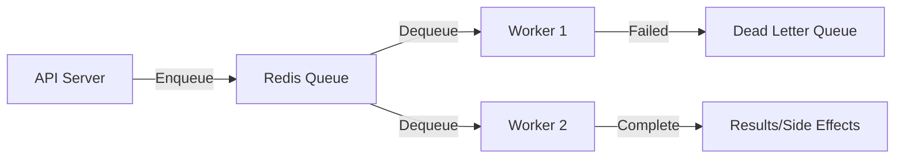

# How to Build a Job Queue in Rust with Tokio and Redis

Author: [nawazdhandala](https://www.github.com/nawazdhandala)

Tags: Rust, Job Queue, Redis, tokio, Background Tasks, Async, Retry, Dead Letter Queue

Description: Learn how to build a robust job queue in Rust using Tokio and Redis. This guide covers job scheduling, retries, dead letter queues, and patterns for reliable background processing.

---

> Not everything needs to happen in the request-response cycle. Email sending, image processing, report generation-these belong in a job queue. This guide shows you how to build a production-ready job queue in Rust with proper retry handling and failure recovery.

A well-designed job queue decouples slow operations from user requests, improves system resilience, and enables horizontal scaling of workers.

---

## Architecture Overview



---

## Dependencies

```toml
[dependencies]
# Async runtime
tokio = { version = "1", features = ["full"] }

# Redis client
redis = { version = "0.24", features = ["tokio-comp", "connection-manager"] }

# Serialization
serde = { version = "1", features = ["derive"] }
serde_json = "1"

# Utilities
uuid = { version = "1", features = ["v4", "serde"] }
chrono = { version = "0.4", features = ["serde"] }
thiserror = "1"
tracing = "0.1"
```

---

## Job Definition

Define jobs as serializable types with metadata.

```rust
// src/job.rs
// Job type definitions

use chrono::{DateTime, Utc};
use serde::{Deserialize, Serialize};
use uuid::Uuid;

/// Job metadata
#[derive(Debug, Clone, Serialize, Deserialize)]
pub struct JobMeta {
    pub id: Uuid,
    pub job_type: String,
    pub created_at: DateTime<Utc>,
    pub scheduled_at: Option<DateTime<Utc>>,
    pub attempts: u32,
    pub max_attempts: u32,
    pub last_error: Option<String>,
}

impl JobMeta {
    pub fn new(job_type: &str) -> Self {
        Self {
            id: Uuid::new_v4(),
            job_type: job_type.to_string(),
            created_at: Utc::now(),
            scheduled_at: None,
            attempts: 0,
            max_attempts: 3,
            last_error: None,
        }
    }

    pub fn with_max_attempts(mut self, max: u32) -> Self {
        self.max_attempts = max;
        self
    }

    pub fn with_delay(mut self, delay: chrono::Duration) -> Self {
        self.scheduled_at = Some(Utc::now() + delay);
        self
    }
}

/// Generic job envelope
#[derive(Debug, Clone, Serialize, Deserialize)]
pub struct Job<T> {
    pub meta: JobMeta,
    pub payload: T,
}

impl<T: Serialize> Job<T> {
    pub fn new(job_type: &str, payload: T) -> Self {
        Self {
            meta: JobMeta::new(job_type),
            payload,
        }
    }

    pub fn with_max_attempts(mut self, max: u32) -> Self {
        self.meta = self.meta.with_max_attempts(max);
        self
    }

    pub fn with_delay(mut self, delay: chrono::Duration) -> Self {
        self.meta = self.meta.with_delay(delay);
        self
    }
}

// Example job payloads
#[derive(Debug, Clone, Serialize, Deserialize)]
pub struct SendEmailJob {
    pub to: String,
    pub subject: String,
    pub body: String,
}

#[derive(Debug, Clone, Serialize, Deserialize)]
pub struct ProcessImageJob {
    pub image_id: Uuid,
    pub operations: Vec<String>,
}

#[derive(Debug, Clone, Serialize, Deserialize)]
pub struct GenerateReportJob {
    pub report_type: String,
    pub parameters: serde_json::Value,
}
```

---

## Queue Implementation

```rust
// src/queue.rs
// Redis-backed job queue

use redis::{AsyncCommands, Client};
use serde::{de::DeserializeOwned, Serialize};
use std::time::Duration;
use uuid::Uuid;

use crate::job::{Job, JobMeta};

const DEFAULT_QUEUE: &str = "jobs:default";
const PROCESSING_QUEUE: &str = "jobs:processing";
const DEAD_LETTER_QUEUE: &str = "jobs:dead";
const SCHEDULED_QUEUE: &str = "jobs:scheduled";

#[derive(Clone)]
pub struct JobQueue {
    client: redis::aio::ConnectionManager,
}

impl JobQueue {
    pub async fn new(redis_url: &str) -> Result<Self, redis::RedisError> {
        let client = Client::open(redis_url)?;
        let connection = client.get_connection_manager().await?;
        Ok(Self { client: connection })
    }

    /// Enqueue a job for immediate processing
    pub async fn enqueue<T: Serialize>(
        &self,
        job: Job<T>,
    ) -> Result<Uuid, QueueError> {
        let mut conn = self.client.clone();
        let job_id = job.meta.id;

        // Check if job should be delayed
        if let Some(scheduled_at) = job.meta.scheduled_at {
            let score = scheduled_at.timestamp() as f64;
            let job_json = serde_json::to_string(&job)?;

            // Add to sorted set for scheduled jobs
            conn.zadd(SCHEDULED_QUEUE, &job_json, score).await?;

            tracing::info!(
                job_id = %job_id,
                scheduled_at = %scheduled_at,
                "Job scheduled"
            );
        } else {
            let job_json = serde_json::to_string(&job)?;

            // Push to queue
            conn.rpush(DEFAULT_QUEUE, &job_json).await?;

            tracing::info!(job_id = %job_id, "Job enqueued");
        }

        Ok(job_id)
    }

    /// Dequeue a job for processing (blocking)
    pub async fn dequeue<T: DeserializeOwned>(
        &self,
        timeout: Duration,
    ) -> Result<Option<Job<T>>, QueueError> {
        let mut conn = self.client.clone();

        // First, move any ready scheduled jobs to the main queue
        self.process_scheduled_jobs().await?;

        // Blocking pop with move to processing queue
        let result: Option<(String, String)> = conn
            .blmove(
                DEFAULT_QUEUE,
                PROCESSING_QUEUE,
                redis::Direction::Left,
                redis::Direction::Right,
                timeout.as_secs_f64(),
            )
            .await?;

        match result {
            Some((_, job_json)) => {
                let job: Job<T> = serde_json::from_str(&job_json)?;
                tracing::debug!(job_id = %job.meta.id, "Job dequeued");
                Ok(Some(job))
            }
            None => Ok(None),
        }
    }

    /// Mark job as completed
    pub async fn complete<T: Serialize>(&self, job: &Job<T>) -> Result<(), QueueError> {
        let mut conn = self.client.clone();
        let job_json = serde_json::to_string(job)?;

        // Remove from processing queue
        conn.lrem::<_, _, i32>(PROCESSING_QUEUE, 1, &job_json).await?;

        tracing::info!(job_id = %job.meta.id, "Job completed");
        Ok(())
    }

    /// Mark job as failed and handle retry or dead letter
    pub async fn fail<T: Serialize + Clone>(
        &self,
        mut job: Job<T>,
        error: &str,
    ) -> Result<(), QueueError> {
        let mut conn = self.client.clone();
        let original_json = serde_json::to_string(&job)?;

        // Remove from processing queue
        conn.lrem::<_, _, i32>(PROCESSING_QUEUE, 1, &original_json).await?;

        // Update job metadata
        job.meta.attempts += 1;
        job.meta.last_error = Some(error.to_string());

        if job.meta.attempts < job.meta.max_attempts {
            // Calculate backoff delay
            let delay_seconds = 2_i64.pow(job.meta.attempts);
            job.meta.scheduled_at = Some(
                chrono::Utc::now() + chrono::Duration::seconds(delay_seconds)
            );

            let job_json = serde_json::to_string(&job)?;
            let score = job.meta.scheduled_at.unwrap().timestamp() as f64;

            // Add to scheduled queue for retry
            conn.zadd(SCHEDULED_QUEUE, &job_json, score).await?;

            tracing::warn!(
                job_id = %job.meta.id,
                attempt = job.meta.attempts,
                retry_in_seconds = delay_seconds,
                error,
                "Job failed, scheduling retry"
            );
        } else {
            // Move to dead letter queue
            let job_json = serde_json::to_string(&job)?;
            conn.rpush(DEAD_LETTER_QUEUE, &job_json).await?;

            tracing::error!(
                job_id = %job.meta.id,
                attempts = job.meta.attempts,
                error,
                "Job failed permanently, moved to DLQ"
            );
        }

        Ok(())
    }

    /// Process scheduled jobs that are ready
    async fn process_scheduled_jobs(&self) -> Result<(), QueueError> {
        let mut conn = self.client.clone();
        let now = chrono::Utc::now().timestamp() as f64;

        // Get jobs scheduled before now
        let ready_jobs: Vec<String> = conn
            .zrangebyscore(SCHEDULED_QUEUE, 0f64, now)
            .await?;

        for job_json in ready_jobs {
            // Remove from scheduled and add to main queue
            conn.zrem(SCHEDULED_QUEUE, &job_json).await?;
            conn.rpush(DEFAULT_QUEUE, &job_json).await?;
        }

        Ok(())
    }

    /// Get queue statistics
    pub async fn stats(&self) -> Result<QueueStats, QueueError> {
        let mut conn = self.client.clone();

        let pending: i64 = conn.llen(DEFAULT_QUEUE).await?;
        let processing: i64 = conn.llen(PROCESSING_QUEUE).await?;
        let scheduled: i64 = conn.zcard(SCHEDULED_QUEUE).await?;
        let dead: i64 = conn.llen(DEAD_LETTER_QUEUE).await?;

        Ok(QueueStats {
            pending: pending as u64,
            processing: processing as u64,
            scheduled: scheduled as u64,
            dead: dead as u64,
        })
    }
}

#[derive(Debug)]
pub struct QueueStats {
    pub pending: u64,
    pub processing: u64,
    pub scheduled: u64,
    pub dead: u64,
}

#[derive(Debug, thiserror::Error)]
pub enum QueueError {
    #[error("Redis error: {0}")]
    Redis(#[from] redis::RedisError),

    #[error("Serialization error: {0}")]
    Serialization(#[from] serde_json::Error),
}
```

---

## Worker Implementation

```rust
// src/worker.rs
// Job worker that processes jobs

use std::sync::Arc;
use std::time::Duration;
use tokio::sync::broadcast;
use tokio::task::JoinHandle;

use crate::job::Job;
use crate::queue::{JobQueue, QueueError};

/// Job handler trait
#[async_trait::async_trait]
pub trait JobHandler<T>: Send + Sync {
    async fn handle(&self, job: &Job<T>) -> Result<(), JobError>;
}

#[derive(Debug, thiserror::Error)]
pub enum JobError {
    #[error("Processing failed: {0}")]
    Processing(String),

    #[error("Transient error: {0}")]
    Transient(String),
}

/// Worker configuration
pub struct WorkerConfig {
    pub concurrency: usize,
    pub poll_interval: Duration,
    pub job_timeout: Duration,
}

impl Default for WorkerConfig {
    fn default() -> Self {
        Self {
            concurrency: 4,
            poll_interval: Duration::from_secs(1),
            job_timeout: Duration::from_secs(300),
        }
    }
}

/// Worker that processes jobs from the queue
pub struct Worker<T, H> {
    queue: JobQueue,
    handler: Arc<H>,
    config: WorkerConfig,
    shutdown_rx: broadcast::Receiver<()>,
    _marker: std::marker::PhantomData<T>,
}

impl<T, H> Worker<T, H>
where
    T: serde::de::DeserializeOwned + serde::Serialize + Clone + Send + Sync + 'static,
    H: JobHandler<T> + 'static,
{
    pub fn new(
        queue: JobQueue,
        handler: H,
        config: WorkerConfig,
        shutdown_rx: broadcast::Receiver<()>,
    ) -> Self {
        Self {
            queue,
            handler: Arc::new(handler),
            config,
            shutdown_rx,
            _marker: std::marker::PhantomData,
        }
    }

    /// Start the worker
    pub async fn run(mut self) {
        tracing::info!(
            concurrency = self.config.concurrency,
            "Worker starting"
        );

        loop {
            tokio::select! {
                // Check for shutdown signal
                _ = self.shutdown_rx.recv() => {
                    tracing::info!("Worker received shutdown signal");
                    break;
                }

                // Poll for jobs
                result = self.queue.dequeue::<T>(self.config.poll_interval) => {
                    match result {
                        Ok(Some(job)) => {
                            let queue = self.queue.clone();
                            let handler = self.handler.clone();
                            let timeout = self.config.job_timeout;

                            // Spawn job processing task
                            tokio::spawn(async move {
                                process_job(queue, handler, job, timeout).await;
                            });
                        }
                        Ok(None) => {
                            // No jobs available, continue polling
                        }
                        Err(e) => {
                            tracing::error!(error = %e, "Error dequeuing job");
                            tokio::time::sleep(Duration::from_secs(1)).await;
                        }
                    }
                }
            }
        }

        tracing::info!("Worker stopped");
    }
}

/// Process a single job with timeout
async fn process_job<T, H>(
    queue: JobQueue,
    handler: Arc<H>,
    job: Job<T>,
    timeout: Duration,
)
where
    T: serde::Serialize + Clone + Send + Sync,
    H: JobHandler<T>,
{
    let job_id = job.meta.id;
    let job_type = job.meta.job_type.clone();

    tracing::info!(
        job_id = %job_id,
        job_type = %job_type,
        attempt = job.meta.attempts + 1,
        "Processing job"
    );

    let start = std::time::Instant::now();

    // Execute with timeout
    let result = tokio::time::timeout(timeout, handler.handle(&job)).await;

    let duration = start.elapsed();

    match result {
        Ok(Ok(())) => {
            // Job completed successfully
            if let Err(e) = queue.complete(&job).await {
                tracing::error!(
                    job_id = %job_id,
                    error = %e,
                    "Failed to mark job complete"
                );
            }

            tracing::info!(
                job_id = %job_id,
                duration_ms = duration.as_millis(),
                "Job completed successfully"
            );
        }
        Ok(Err(e)) => {
            // Job failed
            if let Err(qe) = queue.fail(job, &e.to_string()).await {
                tracing::error!(
                    job_id = %job_id,
                    error = %qe,
                    "Failed to mark job as failed"
                );
            }
        }
        Err(_) => {
            // Job timed out
            if let Err(qe) = queue.fail(job, "Job timed out").await {
                tracing::error!(
                    job_id = %job_id,
                    error = %qe,
                    "Failed to mark job as failed"
                );
            }

            tracing::error!(
                job_id = %job_id,
                timeout_seconds = timeout.as_secs(),
                "Job timed out"
            );
        }
    }
}
```

---

## Example: Email Job Handler

```rust
// src/handlers/email.rs
// Email sending job handler

use async_trait::async_trait;
use crate::job::{Job, SendEmailJob};
use crate::worker::{JobHandler, JobError};

pub struct EmailHandler {
    smtp_client: SmtpClient,
}

impl EmailHandler {
    pub fn new(smtp_url: &str) -> Self {
        Self {
            smtp_client: SmtpClient::new(smtp_url),
        }
    }
}

#[async_trait]
impl JobHandler<SendEmailJob> for EmailHandler {
    async fn handle(&self, job: &Job<SendEmailJob>) -> Result<(), JobError> {
        let payload = &job.payload;

        tracing::info!(
            to = %payload.to,
            subject = %payload.subject,
            "Sending email"
        );

        // Validate email address
        if !payload.to.contains('@') {
            return Err(JobError::Processing("Invalid email address".to_string()));
        }

        // Send email
        self.smtp_client
            .send(&payload.to, &payload.subject, &payload.body)
            .await
            .map_err(|e| JobError::Transient(e.to_string()))?;

        tracing::info!(to = %payload.to, "Email sent successfully");

        Ok(())
    }
}

// Placeholder SMTP client
struct SmtpClient {
    _url: String,
}

impl SmtpClient {
    fn new(url: &str) -> Self {
        Self { _url: url.to_string() }
    }

    async fn send(&self, _to: &str, _subject: &str, _body: &str) -> Result<(), std::io::Error> {
        // Simulate sending
        tokio::time::sleep(std::time::Duration::from_millis(100)).await;
        Ok(())
    }
}
```

---

## Complete Application

```rust
// src/main.rs
// Complete job queue application

mod job;
mod queue;
mod worker;
mod handlers;

use job::{Job, SendEmailJob};
use queue::JobQueue;
use worker::{Worker, WorkerConfig};
use handlers::email::EmailHandler;

use tokio::sync::broadcast;

#[tokio::main]
async fn main() -> Result<(), Box<dyn std::error::Error>> {
    tracing_subscriber::fmt::init();

    // Create queue
    let queue = JobQueue::new("redis://localhost:6379").await?;

    // Create shutdown channel
    let (shutdown_tx, _) = broadcast::channel(1);

    // Start workers
    let worker_queue = queue.clone();
    let worker_shutdown = shutdown_tx.subscribe();
    let worker_handle = tokio::spawn(async move {
        let handler = EmailHandler::new("smtp://localhost:25");
        let config = WorkerConfig {
            concurrency: 4,
            ..Default::default()
        };

        let worker = Worker::new(worker_queue, handler, config, worker_shutdown);
        worker.run().await;
    });

    // Enqueue some jobs
    for i in 0..10 {
        let job = Job::new(
            "send_email",
            SendEmailJob {
                to: format!("user{}@example.com", i),
                subject: "Welcome!".to_string(),
                body: "Thanks for signing up.".to_string(),
            },
        );

        queue.enqueue(job).await?;
    }

    // Wait for interrupt
    tokio::signal::ctrl_c().await?;

    // Trigger shutdown
    tracing::info!("Shutting down...");
    let _ = shutdown_tx.send(());

    // Wait for worker to stop
    worker_handle.await?;

    tracing::info!("Shutdown complete");
    Ok(())
}
```

---

## Best Practices

1. **Idempotent jobs** - Jobs may be processed multiple times
2. **Job timeouts** - Prevent hung jobs from blocking workers
3. **Dead letter queues** - Capture failed jobs for investigation
4. **Graceful shutdown** - Complete in-progress jobs before stopping
5. **Monitoring** - Track queue depth, processing time, failure rates
6. **Backpressure** - Limit queue size to prevent overload

---

*Need to monitor your job queues? [OneUptime](https://oneuptime.com) provides queue monitoring with depth tracking and processing time alerts.*

**Related Reading:**
- [How to Implement Retry Logic in Rust](https://oneuptime.com/blog/post/2026-01-07-rust-retry-exponential-backoff/view)
- [How to Build a Graceful Shutdown Handler in Rust](https://oneuptime.com/blog/post/2026-01-07-rust-graceful-shutdown/view)
