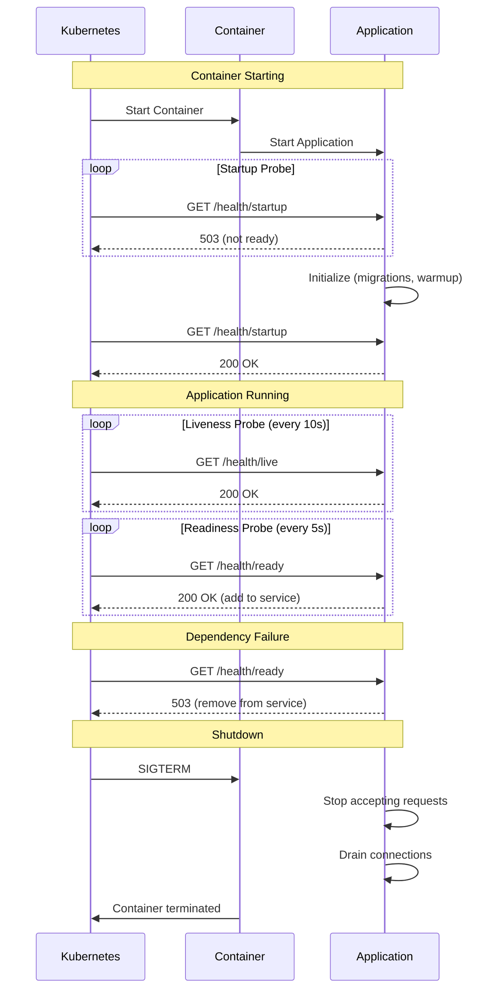

# How to Implement Health Checks and Readiness Probes in Rust for Kubernetes

Author: [nawazdhandala](https://www.github.com/nawazdhandala)

Tags: Rust, Kubernetes, Health Checks, Readiness Probes, Liveness Probes, axum, Production, High Availability

Description: Learn how to implement health checks and readiness probes in Rust applications for Kubernetes deployments. This guide covers liveness, readiness, and startup probes with dependency checking and graceful degradation.

---

> Kubernetes uses health probes to determine when to restart containers, route traffic, and manage deployments. Implementing proper health checks is crucial for running reliable Rust services in Kubernetes.

Health checks tell Kubernetes the difference between "starting up", "ready to serve", and "unhealthy and needs restart". Getting these right means zero-downtime deployments and automatic recovery from failures.

---

## Understanding Kubernetes Probes

| Probe | Purpose | Failure Action |
|-------|---------|----------------|
| **Startup** | Is the app finished initializing? | Keep waiting |
| **Liveness** | Is the app still working? | Restart container |
| **Readiness** | Can the app handle traffic? | Remove from service |

---

## Basic Health Check Endpoints

Implement separate endpoints for each probe type.

```rust
// src/health.rs
// Health check endpoints for Kubernetes

use axum::{
    extract::State,
    http::StatusCode,
    response::{IntoResponse, Response},
    routing::get,
    Json, Router,
};
use serde::Serialize;
use std::sync::atomic::{AtomicBool, Ordering};
use std::sync::Arc;

/// Health check response
#[derive(Serialize)]
pub struct HealthResponse {
    pub status: &'static str,
    pub version: &'static str,
    #[serde(skip_serializing_if = "Option::is_none")]
    pub checks: Option<Vec<CheckResult>>,
}

#[derive(Serialize)]
pub struct CheckResult {
    pub name: &'static str,
    pub status: &'static str,
    #[serde(skip_serializing_if = "Option::is_none")]
    pub message: Option<String>,
}

/// Application state with health status
pub struct AppHealth {
    /// Has the application finished startup?
    pub started: AtomicBool,
    /// Is the application ready to serve traffic?
    pub ready: AtomicBool,
}

impl Default for AppHealth {
    fn default() -> Self {
        Self {
            started: AtomicBool::new(false),
            ready: AtomicBool::new(false),
        }
    }
}

impl AppHealth {
    /// Mark application as started
    pub fn set_started(&self) {
        self.started.store(true, Ordering::SeqCst);
    }

    /// Mark application as ready to serve traffic
    pub fn set_ready(&self, ready: bool) {
        self.ready.store(ready, Ordering::SeqCst);
    }

    pub fn is_started(&self) -> bool {
        self.started.load(Ordering::SeqCst)
    }

    pub fn is_ready(&self) -> bool {
        self.ready.load(Ordering::SeqCst)
    }
}

/// Create health check router
pub fn health_router() -> Router<Arc<AppState>> {
    Router::new()
        .route("/health", get(health))
        .route("/health/live", get(liveness))
        .route("/health/ready", get(readiness))
        .route("/health/startup", get(startup))
}

/// General health endpoint with detailed status
async fn health(State(state): State<Arc<AppState>>) -> Json<HealthResponse> {
    Json(HealthResponse {
        status: if state.health.is_ready() { "healthy" } else { "degraded" },
        version: env!("CARGO_PKG_VERSION"),
        checks: None,
    })
}

/// Liveness probe - is the application alive?
/// Returns 200 if the application process is running correctly
/// Kubernetes will restart the container if this fails
async fn liveness() -> StatusCode {
    // Simple check - if we can respond, we're alive
    // Add checks for deadlocks, resource exhaustion, etc.
    StatusCode::OK
}

/// Readiness probe - can the application serve traffic?
/// Returns 200 only if all dependencies are available
/// Kubernetes will remove from service if this fails
async fn readiness(State(state): State<Arc<AppState>>) -> Response {
    if !state.health.is_ready() {
        return StatusCode::SERVICE_UNAVAILABLE.into_response();
    }

    // Check critical dependencies
    let checks = check_dependencies(&state).await;
    let all_healthy = checks.iter().all(|c| c.status == "healthy");

    if all_healthy {
        (StatusCode::OK, Json(HealthResponse {
            status: "ready",
            version: env!("CARGO_PKG_VERSION"),
            checks: Some(checks),
        })).into_response()
    } else {
        (StatusCode::SERVICE_UNAVAILABLE, Json(HealthResponse {
            status: "not_ready",
            version: env!("CARGO_PKG_VERSION"),
            checks: Some(checks),
        })).into_response()
    }
}

/// Startup probe - has the application finished initializing?
/// Returns 503 until startup is complete
/// Kubernetes will keep waiting (not restart) if this fails
async fn startup(State(state): State<Arc<AppState>>) -> StatusCode {
    if state.health.is_started() {
        StatusCode::OK
    } else {
        StatusCode::SERVICE_UNAVAILABLE
    }
}

/// Check all dependencies
async fn check_dependencies(state: &AppState) -> Vec<CheckResult> {
    let mut checks = Vec::new();

    // Check database
    checks.push(check_database(&state.db_pool).await);

    // Check Redis cache
    // checks.push(check_redis(&state.redis_client).await);

    // Check external services
    // checks.push(check_external_api(&state.http_client).await);

    checks
}

/// Check database connectivity
async fn check_database(pool: &sqlx::PgPool) -> CheckResult {
    match sqlx::query("SELECT 1").execute(pool).await {
        Ok(_) => CheckResult {
            name: "database",
            status: "healthy",
            message: None,
        },
        Err(e) => CheckResult {
            name: "database",
            status: "unhealthy",
            message: Some(e.to_string()),
        },
    }
}

// Application state
pub struct AppState {
    pub health: AppHealth,
    pub db_pool: sqlx::PgPool,
}
```

---

## Application Lifecycle Management

Properly manage health status during application lifecycle.

```rust
// src/main.rs
// Application with health check lifecycle

mod health;

use health::{health_router, AppHealth, AppState};
use std::sync::Arc;
use tokio::signal;

#[tokio::main]
async fn main() {
    tracing_subscriber::fmt::init();

    // Create health state
    let health = AppHealth::default();

    // Initialize database pool
    let db_pool = create_db_pool().await;

    // Create application state
    let state = Arc::new(AppState {
        health,
        db_pool,
    });

    // Build router
    let app = build_router(state.clone());

    // Start server in background
    let server_handle = tokio::spawn(async move {
        let listener = tokio::net::TcpListener::bind("0.0.0.0:3000")
            .await
            .unwrap();

        tracing::info!("Server starting on 0.0.0.0:3000");

        axum::serve(listener, app)
            .with_graceful_shutdown(shutdown_signal())
            .await
            .unwrap();
    });

    // Perform initialization tasks
    perform_startup_tasks(&state).await;

    // Mark as started and ready
    state.health.set_started();
    state.health.set_ready(true);

    tracing::info!("Application ready to serve traffic");

    // Wait for server to complete
    server_handle.await.unwrap();

    // Cleanup
    tracing::info!("Application shutdown complete");
}

/// Perform startup initialization
async fn perform_startup_tasks(state: &AppState) {
    tracing::info!("Running startup tasks...");

    // Run database migrations
    tracing::info!("Running database migrations");
    sqlx::migrate!("./migrations")
        .run(&state.db_pool)
        .await
        .expect("Failed to run migrations");

    // Warm up caches
    tracing::info!("Warming up caches");
    // cache_warmup(&state).await;

    // Verify external service connectivity
    tracing::info!("Verifying external services");
    // verify_external_services(&state).await;

    tracing::info!("Startup tasks complete");
}

async fn shutdown_signal() {
    let ctrl_c = async {
        signal::ctrl_c().await.unwrap();
    };

    #[cfg(unix)]
    let terminate = async {
        signal::unix::signal(signal::unix::SignalKind::terminate())
            .unwrap()
            .recv()
            .await;
    };

    #[cfg(not(unix))]
    let terminate = std::future::pending::<()>();

    tokio::select! {
        _ = ctrl_c => {},
        _ = terminate => {},
    }
}
```

---

## Advanced Health Checks

### Dependency Health with Timeouts

```rust
// src/health/checks.rs
// Advanced health checks with timeouts

use std::time::Duration;
use tokio::time::timeout;

/// Health check with timeout
pub async fn check_with_timeout<F, T>(
    name: &'static str,
    check_fn: F,
    timeout_duration: Duration,
) -> CheckResult
where
    F: std::future::Future<Output = Result<T, Box<dyn std::error::Error + Send + Sync>>>,
{
    match timeout(timeout_duration, check_fn).await {
        Ok(Ok(_)) => CheckResult {
            name,
            status: "healthy",
            message: None,
        },
        Ok(Err(e)) => CheckResult {
            name,
            status: "unhealthy",
            message: Some(e.to_string()),
        },
        Err(_) => CheckResult {
            name,
            status: "unhealthy",
            message: Some("Health check timed out".to_string()),
        },
    }
}

/// Check database with connection pool stats
pub async fn detailed_db_check(pool: &sqlx::PgPool) -> DetailedCheckResult {
    let start = std::time::Instant::now();

    let query_result = sqlx::query("SELECT 1").execute(pool).await;
    let latency = start.elapsed();

    let pool_size = pool.size();
    let idle_connections = pool.num_idle();

    match query_result {
        Ok(_) => DetailedCheckResult {
            name: "database",
            status: if latency > Duration::from_millis(100) {
                "degraded"
            } else {
                "healthy"
            },
            latency_ms: latency.as_millis() as u64,
            details: Some(serde_json::json!({
                "pool_size": pool_size,
                "idle_connections": idle_connections,
                "active_connections": pool_size - idle_connections,
            })),
            message: None,
        },
        Err(e) => DetailedCheckResult {
            name: "database",
            status: "unhealthy",
            latency_ms: latency.as_millis() as u64,
            details: None,
            message: Some(e.to_string()),
        },
    }
}

#[derive(serde::Serialize)]
pub struct DetailedCheckResult {
    pub name: &'static str,
    pub status: &'static str,
    pub latency_ms: u64,
    #[serde(skip_serializing_if = "Option::is_none")]
    pub details: Option<serde_json::Value>,
    #[serde(skip_serializing_if = "Option::is_none")]
    pub message: Option<String>,
}

/// Background health checker that updates readiness status
pub async fn background_health_checker(state: Arc<AppState>) {
    let mut interval = tokio::time::interval(Duration::from_secs(10));

    loop {
        interval.tick().await;

        // Check all critical dependencies
        let db_healthy = check_database(&state.db_pool).await.status == "healthy";
        // let redis_healthy = check_redis(&state.redis).await.status == "healthy";

        let all_healthy = db_healthy; // && redis_healthy;

        // Update readiness based on dependency health
        state.health.set_ready(all_healthy);

        if !all_healthy {
            tracing::warn!("Service degraded: some health checks failing");
        }
    }
}
```

### Circuit Breaker Integration

```rust
// src/health/circuit_breaker.rs
// Health checks with circuit breaker awareness

use std::sync::atomic::{AtomicU32, AtomicBool, Ordering};
use std::sync::Arc;
use std::time::{Duration, Instant};
use tokio::sync::RwLock;

/// Simple circuit breaker for dependency health
pub struct CircuitBreaker {
    failures: AtomicU32,
    successes: AtomicU32,
    is_open: AtomicBool,
    last_failure: RwLock<Option<Instant>>,
    failure_threshold: u32,
    success_threshold: u32,
    reset_timeout: Duration,
}

impl CircuitBreaker {
    pub fn new(failure_threshold: u32, success_threshold: u32, reset_timeout: Duration) -> Self {
        Self {
            failures: AtomicU32::new(0),
            successes: AtomicU32::new(0),
            is_open: AtomicBool::new(false),
            last_failure: RwLock::new(None),
            failure_threshold,
            success_threshold,
            reset_timeout,
        }
    }

    pub fn is_open(&self) -> bool {
        self.is_open.load(Ordering::SeqCst)
    }

    pub async fn record_success(&self) {
        self.failures.store(0, Ordering::SeqCst);
        let successes = self.successes.fetch_add(1, Ordering::SeqCst) + 1;

        if successes >= self.success_threshold {
            self.is_open.store(false, Ordering::SeqCst);
            self.successes.store(0, Ordering::SeqCst);
        }
    }

    pub async fn record_failure(&self) {
        self.successes.store(0, Ordering::SeqCst);
        let failures = self.failures.fetch_add(1, Ordering::SeqCst) + 1;

        if failures >= self.failure_threshold {
            self.is_open.store(true, Ordering::SeqCst);
            *self.last_failure.write().await = Some(Instant::now());
        }
    }

    pub async fn should_attempt(&self) -> bool {
        if !self.is_open() {
            return true;
        }

        // Check if reset timeout has passed
        if let Some(last) = *self.last_failure.read().await {
            if last.elapsed() > self.reset_timeout {
                // Allow a single request through (half-open state)
                return true;
            }
        }

        false
    }
}

/// Health check with circuit breaker
pub async fn check_with_circuit_breaker<F, T>(
    name: &'static str,
    circuit_breaker: &CircuitBreaker,
    check_fn: F,
) -> CheckResult
where
    F: std::future::Future<Output = Result<T, Box<dyn std::error::Error + Send + Sync>>>,
{
    // Skip check if circuit is open
    if !circuit_breaker.should_attempt().await {
        return CheckResult {
            name,
            status: "unhealthy",
            message: Some("Circuit breaker open".to_string()),
        };
    }

    match check_fn.await {
        Ok(_) => {
            circuit_breaker.record_success().await;
            CheckResult {
                name,
                status: "healthy",
                message: None,
            }
        }
        Err(e) => {
            circuit_breaker.record_failure().await;
            CheckResult {
                name,
                status: "unhealthy",
                message: Some(e.to_string()),
            }
        }
    }
}
```

---

## Kubernetes Deployment Configuration

```yaml
# deployment.yaml
apiVersion: apps/v1
kind: Deployment
metadata:
  name: rust-app
spec:
  replicas: 3
  selector:
    matchLabels:
      app: rust-app
  template:
    metadata:
      labels:
        app: rust-app
    spec:
      containers:
      - name: app
        image: myregistry/rust-app:latest
        ports:
        - containerPort: 3000

        # Startup probe - wait for app initialization
        startupProbe:
          httpGet:
            path: /health/startup
            port: 3000
          initialDelaySeconds: 5
          periodSeconds: 5
          timeoutSeconds: 3
          failureThreshold: 30  # Allow up to 150s for startup

        # Liveness probe - restart if unhealthy
        livenessProbe:
          httpGet:
            path: /health/live
            port: 3000
          initialDelaySeconds: 0  # Start immediately after startup probe passes
          periodSeconds: 10
          timeoutSeconds: 3
          failureThreshold: 3

        # Readiness probe - remove from service if not ready
        readinessProbe:
          httpGet:
            path: /health/ready
            port: 3000
          initialDelaySeconds: 0
          periodSeconds: 5
          timeoutSeconds: 3
          failureThreshold: 3
          successThreshold: 1

        resources:
          requests:
            memory: "64Mi"
            cpu: "100m"
          limits:
            memory: "256Mi"
            cpu: "500m"

        # Graceful shutdown
        lifecycle:
          preStop:
            exec:
              command: ["/bin/sh", "-c", "sleep 5"]

      terminationGracePeriodSeconds: 30
```

---

## Probe Types Summary



---

## Best Practices

1. **Startup probe first** - Use startup probes for slow-starting apps
2. **Lightweight liveness** - Keep liveness checks simple (don't check dependencies)
3. **Thorough readiness** - Check all dependencies in readiness probes
4. **Reasonable timeouts** - Set timeouts shorter than probe periods
5. **Graceful degradation** - Mark unready before shutdown
6. **Background monitoring** - Update readiness based on background checks

---

*Need to monitor your Kubernetes health checks? [OneUptime](https://oneuptime.com) provides Kubernetes monitoring with probe status tracking and alerting.*

**Related Reading:**
- [How to Build a Graceful Shutdown Handler in Rust](https://oneuptime.com/blog/post/2026-01-07-rust-graceful-shutdown/view)
- [Probes and Auto-Healing in Kubernetes](https://oneuptime.com/blog/post/2025-11-27-probes-auto-healing/view)
