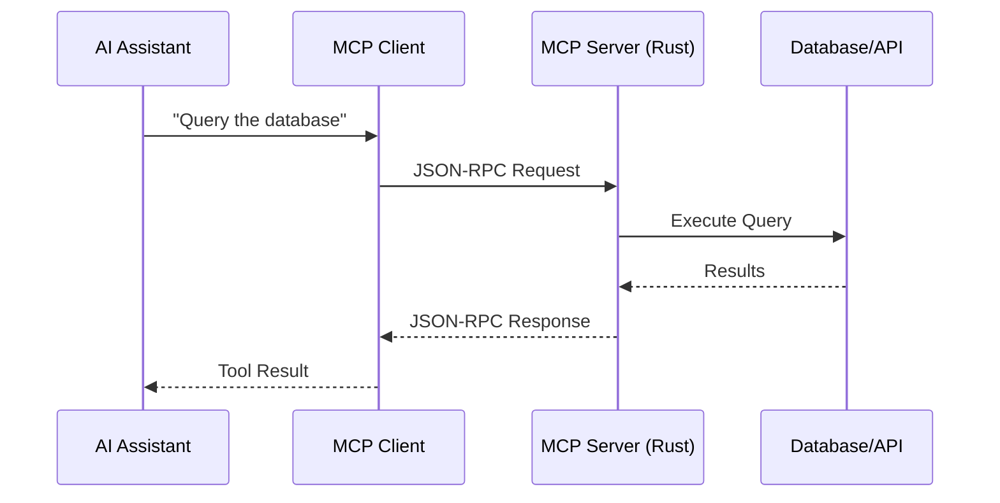

# How to Build an MCP Server in Rust

Author: [nawazdhandala](https://www.github.com/nawazdhandala)

Tags: Rust, MCP, Model Context Protocol, AI, LLM, Tools, Claude, JSON-RPC, Async

Description: Learn how to build an MCP (Model Context Protocol) server in Rust. This guide covers the MCP specification, implementing tools and resources, handling JSON-RPC communication, and integrating with AI assistants.

---

> MCP (Model Context Protocol) enables AI assistants to interact with external systems through a standardized protocol. Building MCP servers in Rust gives you performance, safety, and low resource overhead for your AI tool integrations.

MCP servers expose tools, resources, and prompts that AI models can use to accomplish tasks. Let's build one in Rust.

---

## MCP Architecture



---

## Project Setup

```toml
[package]
name = "mcp-server"
version = "0.1.0"
edition = "2021"

[dependencies]
# Async runtime
tokio = { version = "1", features = ["full", "io-std"] }

# JSON-RPC and serialization
serde = { version = "1", features = ["derive"] }
serde_json = "1"

# Async I/O
futures = "0.3"

# Error handling
thiserror = "1"
anyhow = "1"

# Logging
tracing = "0.1"
tracing-subscriber = { version = "0.3", features = ["env-filter"] }

# Optional: Database connectivity
sqlx = { version = "0.7", features = ["runtime-tokio", "postgres"], optional = true }

# Optional: HTTP client for API integrations
reqwest = { version = "0.11", features = ["json"], optional = true }

[features]
default = []
database = ["sqlx"]
http = ["reqwest"]
```

---

## MCP Types

```rust
// src/types.rs
// Core MCP protocol types

use serde::{Deserialize, Serialize};
use std::collections::HashMap;

/// JSON-RPC request envelope
#[derive(Debug, Serialize, Deserialize)]
pub struct JsonRpcRequest {
    pub jsonrpc: String,
    pub id: Option<JsonRpcId>,
    pub method: String,
    #[serde(default)]
    pub params: Option<serde_json::Value>,
}

/// JSON-RPC response envelope
#[derive(Debug, Serialize, Deserialize)]
pub struct JsonRpcResponse {
    pub jsonrpc: String,
    #[serde(skip_serializing_if = "Option::is_none")]
    pub id: Option<JsonRpcId>,
    #[serde(skip_serializing_if = "Option::is_none")]
    pub result: Option<serde_json::Value>,
    #[serde(skip_serializing_if = "Option::is_none")]
    pub error: Option<JsonRpcError>,
}

#[derive(Debug, Clone, Serialize, Deserialize)]
#[serde(untagged)]
pub enum JsonRpcId {
    Number(i64),
    String(String),
}

#[derive(Debug, Serialize, Deserialize)]
pub struct JsonRpcError {
    pub code: i32,
    pub message: String,
    #[serde(skip_serializing_if = "Option::is_none")]
    pub data: Option<serde_json::Value>,
}

/// Server capabilities
#[derive(Debug, Serialize, Deserialize)]
pub struct ServerCapabilities {
    #[serde(skip_serializing_if = "Option::is_none")]
    pub tools: Option<ToolsCapability>,
    #[serde(skip_serializing_if = "Option::is_none")]
    pub resources: Option<ResourcesCapability>,
    #[serde(skip_serializing_if = "Option::is_none")]
    pub prompts: Option<PromptsCapability>,
}

#[derive(Debug, Serialize, Deserialize)]
pub struct ToolsCapability {
    #[serde(rename = "listChanged")]
    pub list_changed: bool,
}

#[derive(Debug, Serialize, Deserialize)]
pub struct ResourcesCapability {
    #[serde(rename = "listChanged")]
    pub list_changed: bool,
    pub subscribe: bool,
}

#[derive(Debug, Serialize, Deserialize)]
pub struct PromptsCapability {
    #[serde(rename = "listChanged")]
    pub list_changed: bool,
}

/// Tool definition
#[derive(Debug, Clone, Serialize, Deserialize)]
pub struct Tool {
    pub name: String,
    pub description: String,
    #[serde(rename = "inputSchema")]
    pub input_schema: serde_json::Value,
}

/// Tool call arguments
#[derive(Debug, Serialize, Deserialize)]
pub struct CallToolParams {
    pub name: String,
    #[serde(default)]
    pub arguments: HashMap<String, serde_json::Value>,
}

/// Tool call result
#[derive(Debug, Serialize, Deserialize)]
pub struct CallToolResult {
    pub content: Vec<Content>,
    #[serde(rename = "isError", skip_serializing_if = "Option::is_none")]
    pub is_error: Option<bool>,
}

/// Content types for responses
#[derive(Debug, Clone, Serialize, Deserialize)]
#[serde(tag = "type")]
pub enum Content {
    #[serde(rename = "text")]
    Text { text: String },
    #[serde(rename = "image")]
    Image { data: String, mime_type: String },
    #[serde(rename = "resource")]
    Resource { resource: ResourceContent },
}

#[derive(Debug, Clone, Serialize, Deserialize)]
pub struct ResourceContent {
    pub uri: String,
    pub text: Option<String>,
    pub blob: Option<String>,
    pub mime_type: Option<String>,
}

/// Resource definition
#[derive(Debug, Clone, Serialize, Deserialize)]
pub struct Resource {
    pub uri: String,
    pub name: String,
    #[serde(skip_serializing_if = "Option::is_none")]
    pub description: Option<String>,
    #[serde(rename = "mimeType", skip_serializing_if = "Option::is_none")]
    pub mime_type: Option<String>,
}

/// Prompt definition
#[derive(Debug, Clone, Serialize, Deserialize)]
pub struct Prompt {
    pub name: String,
    #[serde(skip_serializing_if = "Option::is_none")]
    pub description: Option<String>,
    #[serde(skip_serializing_if = "Option::is_none")]
    pub arguments: Option<Vec<PromptArgument>>,
}

#[derive(Debug, Clone, Serialize, Deserialize)]
pub struct PromptArgument {
    pub name: String,
    #[serde(skip_serializing_if = "Option::is_none")]
    pub description: Option<String>,
    pub required: bool,
}
```

---

## MCP Server Implementation

```rust
// src/server.rs
// MCP server core implementation

use crate::types::*;
use anyhow::Result;
use std::collections::HashMap;
use std::sync::Arc;
use tokio::io::{AsyncBufReadExt, AsyncWriteExt, BufReader, BufWriter};
use tokio::sync::RwLock;
use tracing::{debug, error, info};

/// Tool handler trait - implement this for each tool
#[async_trait::async_trait]
pub trait ToolHandler: Send + Sync {
    fn definition(&self) -> Tool;
    async fn call(&self, arguments: HashMap<String, serde_json::Value>) -> Result<CallToolResult>;
}

/// MCP Server
pub struct McpServer {
    name: String,
    version: String,
    tools: Arc<RwLock<HashMap<String, Arc<dyn ToolHandler>>>>,
    resources: Arc<RwLock<Vec<Resource>>>,
    prompts: Arc<RwLock<Vec<Prompt>>>,
}

impl McpServer {
    pub fn new(name: &str, version: &str) -> Self {
        Self {
            name: name.to_string(),
            version: version.to_string(),
            tools: Arc::new(RwLock::new(HashMap::new())),
            resources: Arc::new(RwLock::new(Vec::new())),
            prompts: Arc::new(RwLock::new(Vec::new())),
        }
    }

    /// Register a tool handler
    pub async fn register_tool<T: ToolHandler + 'static>(&self, handler: T) {
        let tool = handler.definition();
        let name = tool.name.clone();
        self.tools.write().await.insert(name, Arc::new(handler));
    }

    /// Register a resource
    pub async fn register_resource(&self, resource: Resource) {
        self.resources.write().await.push(resource);
    }

    /// Register a prompt
    pub async fn register_prompt(&self, prompt: Prompt) {
        self.prompts.write().await.push(prompt);
    }

    /// Run the server on stdio
    pub async fn run_stdio(&self) -> Result<()> {
        let stdin = tokio::io::stdin();
        let stdout = tokio::io::stdout();

        let reader = BufReader::new(stdin);
        let mut writer = BufWriter::new(stdout);
        let mut lines = reader.lines();

        info!("MCP Server started");

        while let Some(line) = lines.next_line().await? {
            debug!("Received: {}", line);

            let response = self.handle_request(&line).await;

            if let Some(resp) = response {
                let json = serde_json::to_string(&resp)?;
                debug!("Sending: {}", json);
                writer.write_all(json.as_bytes()).await?;
                writer.write_all(b"\n").await?;
                writer.flush().await?;
            }
        }

        Ok(())
    }

    /// Handle a single request
    async fn handle_request(&self, line: &str) -> Option<JsonRpcResponse> {
        let request: JsonRpcRequest = match serde_json::from_str(line) {
            Ok(req) => req,
            Err(e) => {
                error!("Failed to parse request: {}", e);
                return Some(JsonRpcResponse {
                    jsonrpc: "2.0".to_string(),
                    id: None,
                    result: None,
                    error: Some(JsonRpcError {
                        code: -32700,
                        message: "Parse error".to_string(),
                        data: None,
                    }),
                });
            }
        };

        let result = self.dispatch(&request).await;

        Some(JsonRpcResponse {
            jsonrpc: "2.0".to_string(),
            id: request.id,
            result: result.as_ref().ok().cloned(),
            error: result.err(),
        })
    }

    /// Dispatch request to appropriate handler
    async fn dispatch(&self, request: &JsonRpcRequest) -> Result<serde_json::Value, JsonRpcError> {
        match request.method.as_str() {
            "initialize" => self.handle_initialize(request).await,
            "tools/list" => self.handle_tools_list().await,
            "tools/call" => self.handle_tools_call(request).await,
            "resources/list" => self.handle_resources_list().await,
            "resources/read" => self.handle_resources_read(request).await,
            "prompts/list" => self.handle_prompts_list().await,
            "prompts/get" => self.handle_prompts_get(request).await,
            _ => Err(JsonRpcError {
                code: -32601,
                message: format!("Method not found: {}", request.method),
                data: None,
            }),
        }
    }

    async fn handle_initialize(&self, _request: &JsonRpcRequest) -> Result<serde_json::Value, JsonRpcError> {
        let response = serde_json::json!({
            "protocolVersion": "2024-11-05",
            "capabilities": {
                "tools": { "listChanged": false },
                "resources": { "listChanged": false, "subscribe": false },
                "prompts": { "listChanged": false }
            },
            "serverInfo": {
                "name": self.name,
                "version": self.version
            }
        });

        Ok(response)
    }

    async fn handle_tools_list(&self) -> Result<serde_json::Value, JsonRpcError> {
        let tools = self.tools.read().await;
        let tool_list: Vec<Tool> = tools.values().map(|h| h.definition()).collect();

        Ok(serde_json::json!({ "tools": tool_list }))
    }

    async fn handle_tools_call(&self, request: &JsonRpcRequest) -> Result<serde_json::Value, JsonRpcError> {
        let params: CallToolParams = serde_json::from_value(
            request.params.clone().unwrap_or(serde_json::Value::Null)
        ).map_err(|e| JsonRpcError {
            code: -32602,
            message: format!("Invalid params: {}", e),
            data: None,
        })?;

        let tools = self.tools.read().await;
        let handler = tools.get(&params.name).ok_or_else(|| JsonRpcError {
            code: -32602,
            message: format!("Unknown tool: {}", params.name),
            data: None,
        })?;

        let result = handler.call(params.arguments).await.map_err(|e| JsonRpcError {
            code: -32603,
            message: format!("Tool execution failed: {}", e),
            data: None,
        })?;

        serde_json::to_value(result).map_err(|e| JsonRpcError {
            code: -32603,
            message: format!("Failed to serialize result: {}", e),
            data: None,
        })
    }

    async fn handle_resources_list(&self) -> Result<serde_json::Value, JsonRpcError> {
        let resources = self.resources.read().await;
        Ok(serde_json::json!({ "resources": *resources }))
    }

    async fn handle_resources_read(&self, request: &JsonRpcRequest) -> Result<serde_json::Value, JsonRpcError> {
        let params = request.params.clone().unwrap_or(serde_json::Value::Null);
        let uri = params.get("uri").and_then(|v| v.as_str()).ok_or_else(|| JsonRpcError {
            code: -32602,
            message: "Missing uri parameter".to_string(),
            data: None,
        })?;

        // Resource reading logic would go here
        Ok(serde_json::json!({
            "contents": [{
                "uri": uri,
                "text": "Resource content here"
            }]
        }))
    }

    async fn handle_prompts_list(&self) -> Result<serde_json::Value, JsonRpcError> {
        let prompts = self.prompts.read().await;
        Ok(serde_json::json!({ "prompts": *prompts }))
    }

    async fn handle_prompts_get(&self, request: &JsonRpcRequest) -> Result<serde_json::Value, JsonRpcError> {
        let params = request.params.clone().unwrap_or(serde_json::Value::Null);
        let name = params.get("name").and_then(|v| v.as_str()).ok_or_else(|| JsonRpcError {
            code: -32602,
            message: "Missing name parameter".to_string(),
            data: None,
        })?;

        let prompts = self.prompts.read().await;
        let prompt = prompts.iter().find(|p| p.name == name).ok_or_else(|| JsonRpcError {
            code: -32602,
            message: format!("Unknown prompt: {}", name),
            data: None,
        })?;

        Ok(serde_json::json!({
            "description": prompt.description,
            "messages": [{
                "role": "user",
                "content": {
                    "type": "text",
                    "text": format!("Prompt: {}", name)
                }
            }]
        }))
    }
}
```

---

## Implementing Tools

```rust
// src/tools.rs
// Example tool implementations

use crate::server::ToolHandler;
use crate::types::*;
use anyhow::Result;
use async_trait::async_trait;
use std::collections::HashMap;

/// Echo tool - returns the input text
pub struct EchoTool;

#[async_trait]
impl ToolHandler for EchoTool {
    fn definition(&self) -> Tool {
        Tool {
            name: "echo".to_string(),
            description: "Echoes back the provided text".to_string(),
            input_schema: serde_json::json!({
                "type": "object",
                "properties": {
                    "text": {
                        "type": "string",
                        "description": "The text to echo back"
                    }
                },
                "required": ["text"]
            }),
        }
    }

    async fn call(&self, arguments: HashMap<String, serde_json::Value>) -> Result<CallToolResult> {
        let text = arguments
            .get("text")
            .and_then(|v| v.as_str())
            .unwrap_or("No text provided");

        Ok(CallToolResult {
            content: vec![Content::Text {
                text: text.to_string(),
            }],
            is_error: None,
        })
    }
}

/// Calculator tool - performs basic math operations
pub struct CalculatorTool;

#[async_trait]
impl ToolHandler for CalculatorTool {
    fn definition(&self) -> Tool {
        Tool {
            name: "calculate".to_string(),
            description: "Performs basic mathematical operations".to_string(),
            input_schema: serde_json::json!({
                "type": "object",
                "properties": {
                    "operation": {
                        "type": "string",
                        "enum": ["add", "subtract", "multiply", "divide"],
                        "description": "The mathematical operation to perform"
                    },
                    "a": {
                        "type": "number",
                        "description": "First operand"
                    },
                    "b": {
                        "type": "number",
                        "description": "Second operand"
                    }
                },
                "required": ["operation", "a", "b"]
            }),
        }
    }

    async fn call(&self, arguments: HashMap<String, serde_json::Value>) -> Result<CallToolResult> {
        let operation = arguments
            .get("operation")
            .and_then(|v| v.as_str())
            .ok_or_else(|| anyhow::anyhow!("Missing operation"))?;

        let a = arguments
            .get("a")
            .and_then(|v| v.as_f64())
            .ok_or_else(|| anyhow::anyhow!("Missing or invalid 'a'"))?;

        let b = arguments
            .get("b")
            .and_then(|v| v.as_f64())
            .ok_or_else(|| anyhow::anyhow!("Missing or invalid 'b'"))?;

        let result = match operation {
            "add" => a + b,
            "subtract" => a - b,
            "multiply" => a * b,
            "divide" => {
                if b == 0.0 {
                    return Ok(CallToolResult {
                        content: vec![Content::Text {
                            text: "Error: Division by zero".to_string(),
                        }],
                        is_error: Some(true),
                    });
                }
                a / b
            }
            _ => return Err(anyhow::anyhow!("Unknown operation: {}", operation)),
        };

        Ok(CallToolResult {
            content: vec![Content::Text {
                text: format!("{} {} {} = {}", a, operation, b, result),
            }],
            is_error: None,
        })
    }
}

/// File reader tool - reads files from allowed directories
pub struct FileReaderTool {
    allowed_dirs: Vec<String>,
}

impl FileReaderTool {
    pub fn new(allowed_dirs: Vec<String>) -> Self {
        Self { allowed_dirs }
    }
}

#[async_trait]
impl ToolHandler for FileReaderTool {
    fn definition(&self) -> Tool {
        Tool {
            name: "read_file".to_string(),
            description: "Reads the contents of a file".to_string(),
            input_schema: serde_json::json!({
                "type": "object",
                "properties": {
                    "path": {
                        "type": "string",
                        "description": "Path to the file to read"
                    }
                },
                "required": ["path"]
            }),
        }
    }

    async fn call(&self, arguments: HashMap<String, serde_json::Value>) -> Result<CallToolResult> {
        let path = arguments
            .get("path")
            .and_then(|v| v.as_str())
            .ok_or_else(|| anyhow::anyhow!("Missing path"))?;

        // Security check: ensure path is in allowed directories
        let canonical = std::fs::canonicalize(path)?;
        let is_allowed = self.allowed_dirs.iter().any(|dir| {
            canonical.starts_with(dir)
        });

        if !is_allowed {
            return Ok(CallToolResult {
                content: vec![Content::Text {
                    text: "Error: Access denied - path not in allowed directories".to_string(),
                }],
                is_error: Some(true),
            });
        }

        let content = tokio::fs::read_to_string(path).await?;

        Ok(CallToolResult {
            content: vec![Content::Text { text: content }],
            is_error: None,
        })
    }
}

/// HTTP fetch tool - fetches data from URLs
#[cfg(feature = "http")]
pub struct HttpFetchTool {
    client: reqwest::Client,
    allowed_hosts: Vec<String>,
}

#[cfg(feature = "http")]
impl HttpFetchTool {
    pub fn new(allowed_hosts: Vec<String>) -> Self {
        Self {
            client: reqwest::Client::new(),
            allowed_hosts,
        }
    }
}

#[cfg(feature = "http")]
#[async_trait]
impl ToolHandler for HttpFetchTool {
    fn definition(&self) -> Tool {
        Tool {
            name: "http_fetch".to_string(),
            description: "Fetches content from a URL".to_string(),
            input_schema: serde_json::json!({
                "type": "object",
                "properties": {
                    "url": {
                        "type": "string",
                        "description": "The URL to fetch"
                    },
                    "method": {
                        "type": "string",
                        "enum": ["GET", "POST"],
                        "description": "HTTP method",
                        "default": "GET"
                    }
                },
                "required": ["url"]
            }),
        }
    }

    async fn call(&self, arguments: HashMap<String, serde_json::Value>) -> Result<CallToolResult> {
        let url = arguments
            .get("url")
            .and_then(|v| v.as_str())
            .ok_or_else(|| anyhow::anyhow!("Missing url"))?;

        // Security check: ensure host is allowed
        let parsed = url::Url::parse(url)?;
        let host = parsed.host_str().unwrap_or("");

        if !self.allowed_hosts.iter().any(|h| host.ends_with(h)) {
            return Ok(CallToolResult {
                content: vec![Content::Text {
                    text: format!("Error: Host '{}' not in allowed list", host),
                }],
                is_error: Some(true),
            });
        }

        let response = self.client.get(url).send().await?;
        let body = response.text().await?;

        Ok(CallToolResult {
            content: vec![Content::Text { text: body }],
            is_error: None,
        })
    }
}

/// Database query tool
#[cfg(feature = "database")]
pub struct DatabaseTool {
    pool: sqlx::PgPool,
}

#[cfg(feature = "database")]
impl DatabaseTool {
    pub fn new(pool: sqlx::PgPool) -> Self {
        Self { pool }
    }
}

#[cfg(feature = "database")]
#[async_trait]
impl ToolHandler for DatabaseTool {
    fn definition(&self) -> Tool {
        Tool {
            name: "query_database".to_string(),
            description: "Executes a read-only SQL query".to_string(),
            input_schema: serde_json::json!({
                "type": "object",
                "properties": {
                    "query": {
                        "type": "string",
                        "description": "The SQL query to execute (SELECT only)"
                    }
                },
                "required": ["query"]
            }),
        }
    }

    async fn call(&self, arguments: HashMap<String, serde_json::Value>) -> Result<CallToolResult> {
        let query = arguments
            .get("query")
            .and_then(|v| v.as_str())
            .ok_or_else(|| anyhow::anyhow!("Missing query"))?;

        // Security: Only allow SELECT queries
        let query_upper = query.trim().to_uppercase();
        if !query_upper.starts_with("SELECT") {
            return Ok(CallToolResult {
                content: vec![Content::Text {
                    text: "Error: Only SELECT queries are allowed".to_string(),
                }],
                is_error: Some(true),
            });
        }

        let rows: Vec<serde_json::Value> = sqlx::query(query)
            .fetch_all(&self.pool)
            .await?
            .iter()
            .map(|row| {
                // Convert row to JSON (simplified)
                serde_json::json!({})
            })
            .collect();

        Ok(CallToolResult {
            content: vec![Content::Text {
                text: serde_json::to_string_pretty(&rows)?,
            }],
            is_error: None,
        })
    }
}
```

---

## Main Entry Point

```rust
// src/main.rs
// MCP server entry point

mod server;
mod tools;
mod types;

use server::McpServer;
use tools::{EchoTool, CalculatorTool, FileReaderTool};
use tracing::info;
use tracing_subscriber::{layer::SubscriberExt, util::SubscriberInitExt};

#[tokio::main]
async fn main() -> anyhow::Result<()> {
    // Initialize logging to stderr (stdout is for JSON-RPC)
    tracing_subscriber::registry()
        .with(tracing_subscriber::EnvFilter::new(
            std::env::var("RUST_LOG").unwrap_or_else(|_| "info".into()),
        ))
        .with(tracing_subscriber::fmt::layer().with_writer(std::io::stderr))
        .init();

    info!("Starting MCP server");

    // Create server
    let server = McpServer::new("rust-mcp-server", "0.1.0");

    // Register tools
    server.register_tool(EchoTool).await;
    server.register_tool(CalculatorTool).await;
    server.register_tool(FileReaderTool::new(vec![
        "/tmp".to_string(),
        std::env::current_dir()?.to_string_lossy().to_string(),
    ])).await;

    // Register resources
    server.register_resource(types::Resource {
        uri: "file:///config".to_string(),
        name: "Configuration".to_string(),
        description: Some("Server configuration".to_string()),
        mime_type: Some("application/json".to_string()),
    }).await;

    // Register prompts
    server.register_prompt(types::Prompt {
        name: "summarize".to_string(),
        description: Some("Summarize text or data".to_string()),
        arguments: Some(vec![
            types::PromptArgument {
                name: "content".to_string(),
                description: Some("Content to summarize".to_string()),
                required: true,
            }
        ]),
    }).await;

    // Run on stdio
    server.run_stdio().await?;

    Ok(())
}
```

---

## Configuration for Claude Desktop

```json
{
  "mcpServers": {
    "rust-tools": {
      "command": "/path/to/rust-mcp-server",
      "args": [],
      "env": {
        "RUST_LOG": "info"
      }
    }
  }
}
```

---

## Testing the Server

```rust
// tests/server_test.rs
// Tests for MCP server

use mcp_server::server::McpServer;
use mcp_server::tools::EchoTool;

#[tokio::test]
async fn test_tool_registration() {
    let server = McpServer::new("test", "1.0.0");
    server.register_tool(EchoTool).await;

    // Simulate tools/list request
    let request = r#"{"jsonrpc":"2.0","id":1,"method":"tools/list"}"#;
    // Parse and verify response contains echo tool
}

#[tokio::test]
async fn test_echo_tool() {
    let server = McpServer::new("test", "1.0.0");
    server.register_tool(EchoTool).await;

    let request = r#"{
        "jsonrpc": "2.0",
        "id": 1,
        "method": "tools/call",
        "params": {
            "name": "echo",
            "arguments": {
                "text": "Hello, World!"
            }
        }
    }"#;

    // Verify response contains "Hello, World!"
}
```

---

## Best Practices

| Practice | Reason |
|----------|--------|
| Validate all inputs | Prevent injection attacks |
| Use allowlists | Restrict file/network access |
| Log to stderr | Keep stdout for JSON-RPC |
| Return structured errors | Help clients handle failures |
| Document tool schemas | Enable AI to use tools correctly |
| Test thoroughly | MCP tools directly affect AI behavior |

---

*Building AI-powered tools? [OneUptime](https://oneuptime.com) provides monitoring for your MCP servers with uptime tracking and error alerting.*

**Related Reading:**
- [How to Build REST APIs with Axum](https://oneuptime.com/blog/post/2026-01-07-rust-axum-rest-api/view)
- [How to Secure Rust APIs Against Common Vulnerabilities](https://oneuptime.com/blog/post/2026-01-07-rust-api-security/view)
