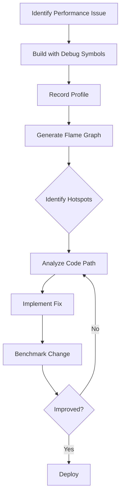

# How to Profile Rust Applications with perf, flamegraph, and samply

Author: [nawazdhandala](https://www.github.com/nawazdhandala)

Tags: Rust, Profiling, Performance, perf, flamegraph, samply, CPU, Optimization

Description: Learn how to profile Rust applications using perf, flamegraph, and samply. This guide covers CPU profiling, flame graph generation, and identifying performance bottlenecks in production Rust code.

---

> You can't optimize what you can't measure. Profiling reveals where your Rust application actually spends its time, often in places you'd never suspect. This guide shows you how to use industry-standard profiling tools to find and fix performance bottlenecks.

Rust's zero-cost abstractions mean the compiler does heavy lifting, but your algorithms and data structures still determine performance. Profiling helps you find the 20% of code that consumes 80% of CPU time.

---

## Profiling Tool Landscape

| Tool | Platform | Use Case |
|------|----------|----------|
| `perf` | Linux | Low-overhead sampling profiler |
| `flamegraph` | Linux/macOS | Flame graph visualization |
| `samply` | macOS/Linux | Modern profiler with Firefox UI |
| `cargo-flamegraph` | All | Easy flame graphs from Cargo |
| `Instruments` | macOS | Apple's profiling suite |

---

## Preparing Your Build

Debug symbols are essential for meaningful profiles. Configure your release build to include them.

```toml
# Cargo.toml
# Release profile with debug symbols for profiling

[profile.release]
debug = true              # Include debug symbols
lto = "thin"             # Enable link-time optimization
codegen-units = 1        # Better optimization (slower compile)

# Separate profile for profiling (keeps release fast)
[profile.profiling]
inherits = "release"
debug = true             # Full debug info for symbols
strip = false           # Don't strip symbols
```

Build with profiling profile:

```bash
# Build with profiling profile
cargo build --profile profiling

# Or build release with debug symbols
cargo build --release
```

---

## Using perf (Linux)

`perf` is Linux's built-in profiler with minimal overhead.

### Basic CPU Profiling

```bash
# Install perf (Ubuntu/Debian)
sudo apt-get install linux-tools-common linux-tools-$(uname -r)

# Record CPU samples for your application
# -g: Enable call graph recording
# -F 99: Sample at 99 Hz (avoids lockstep with other timers)
sudo perf record -g -F 99 ./target/release/myapp

# Generate a text report
sudo perf report

# Or view annotated source
sudo perf annotate
```

### Profiling a Running Process

```bash
# Find your process ID
pgrep myapp

# Attach to running process for 30 seconds
sudo perf record -g -F 99 -p $(pgrep myapp) -- sleep 30

# Generate report
sudo perf report --sort comm,dso
```

### Interpreting perf Output

The `perf report` output shows functions sorted by CPU time:

```
Overhead  Command  Shared Object       Symbol
  23.45%  myapp    myapp               [.] myapp::process_items
  15.23%  myapp    myapp               [.] alloc::vec::Vec<T>::push
  12.11%  myapp    libc.so.6           [.] __memmove_avx_unaligned
   8.76%  myapp    myapp               [.] core::str::pattern::TwoWaySearcher::next
```

Key insights:
- High `Vec::push` suggests reallocation overhead (pre-allocate with `Vec::with_capacity`)
- `memmove` indicates data copying (consider references or `Cow`)
- String pattern matching might benefit from specialized algorithms

---

## Generating Flame Graphs

Flame graphs visualize call stacks, making it easy to spot hot paths.

### Using cargo-flamegraph

The easiest way to generate flame graphs for Rust projects.

```bash
# Install cargo-flamegraph
cargo install flamegraph

# Generate flame graph (runs your app and profiles it)
cargo flamegraph --bin myapp -- --your-args

# For tests
cargo flamegraph --test integration_tests

# For benchmarks
cargo flamegraph --bench my_benchmark

# Output: flamegraph.svg (open in browser)
```

### Manual Flame Graph Generation

For more control over the profiling process:

```bash
# Install flamegraph scripts
git clone https://github.com/brendangregg/FlameGraph.git

# Record with perf
sudo perf record -g -F 99 ./target/release/myapp

# Convert perf data to folded stacks
sudo perf script | ./FlameGraph/stackcollapse-perf.pl > out.folded

# Generate SVG flame graph
./FlameGraph/flamegraph.pl out.folded > flamegraph.svg
```

### Reading Flame Graphs

```
         ┌─────────────────────────────────────────────────────┐
         │                    main (100%)                       │
         ├─────────────────────────────┬───────────────────────┤
         │   process_orders (60%)      │  load_config (10%)    │
         ├───────────────┬─────────────┼───────────────────────┤
         │ validate (30%)│ save (25%)  │                       │
         ├───────────────┴─────────────┴───────────────────────┤
```

- **Width** = time spent in that function (including children)
- **Y-axis** = stack depth (callers below, callees above)
- **Color** = random (no meaning, just visual distinction)

Look for:
- **Wide boxes** at the top = functions consuming lots of time
- **Plateaus** = deep call stacks that might be simplified
- **Repeated patterns** = tight loops or recursion

---

## Using samply (Modern Profiler)

`samply` is a modern profiler with an excellent web-based UI using Firefox Profiler.

### Installation and Usage

```bash
# Install samply
cargo install samply

# Profile your application
samply record ./target/release/myapp

# Profile with arguments
samply record ./target/release/myapp -- --input data.json

# Profile for a specific duration
samply record --duration 30 ./target/release/myapp
```

This opens Firefox Profiler with an interactive view showing:
- Call tree
- Flame graph
- Timeline
- Markers and annotations

### Profiling Server Applications

For long-running servers, attach to the process:

```bash
# Start your server
./target/release/myapp &

# Attach samply to the running process
samply record --pid $(pgrep myapp) --duration 60
```

---

## Profiling Async Rust

Async applications require special consideration because tasks switch executors.

### Tracing Async Tasks

```rust
// src/profiling.rs
// Add tracing instrumentation for async profiling

use tracing::{info_span, Instrument};

// Instrument async functions for profiling visibility
#[tracing::instrument]
async fn process_request(id: u64) -> Result<Response, Error> {
    // Create spans for significant work
    let result = async {
        validate_request(id).await?;
        fetch_data(id).await?;
        transform_data(id).await
    }
    .instrument(info_span!("process_request_inner"))
    .await;

    result
}

// Use tokio-console for async runtime introspection
// Add to Cargo.toml: console-subscriber = "0.2"

fn main() {
    // Initialize console subscriber for tokio-console
    console_subscriber::init();

    let runtime = tokio::runtime::Builder::new_multi_thread()
        .enable_all()
        .build()
        .unwrap();

    runtime.block_on(async {
        // Your async code here
    });
}
```

### Using tokio-console

```bash
# Install tokio-console
cargo install tokio-console

# Run your app with TOKIO_CONSOLE=1
RUSTFLAGS="--cfg tokio_unstable" cargo run --release

# In another terminal, run console
tokio-console

# View tasks, their state, poll times, and wake patterns
```

---

## Memory Profiling with heaptrack

For memory allocation profiling, use heaptrack (Linux) or Instruments (macOS).

```bash
# Install heaptrack (Ubuntu)
sudo apt-get install heaptrack heaptrack-gui

# Profile memory allocations
heaptrack ./target/release/myapp

# Analyze results
heaptrack_gui heaptrack.myapp.*.gz
```

### Using DHAT (Valgrind)

```bash
# Profile with DHAT
valgrind --tool=dhat ./target/release/myapp

# View results in browser
dh_view.html dhat.out.*
```

---

## Micro-Benchmarking with Criterion

For targeted benchmarks of specific functions:

```toml
# Cargo.toml
[dev-dependencies]
criterion = { version = "0.5", features = ["html_reports"] }

[[bench]]
name = "my_benchmark"
harness = false
```

```rust
// benches/my_benchmark.rs
// Criterion benchmark for micro-profiling

use criterion::{black_box, criterion_group, criterion_main, Criterion, BenchmarkId};

fn process_items(items: &[u32]) -> u64 {
    items.iter().map(|&x| x as u64).sum()
}

fn benchmark_process_items(c: &mut Criterion) {
    let sizes = [100, 1000, 10000, 100000];

    let mut group = c.benchmark_group("process_items");

    for size in sizes {
        let items: Vec<u32> = (0..size).collect();

        group.bench_with_input(
            BenchmarkId::from_parameter(size),
            &items,
            |b, items| {
                b.iter(|| process_items(black_box(items)))
            },
        );
    }

    group.finish();
}

criterion_group!(benches, benchmark_process_items);
criterion_main!(benches);
```

Run benchmarks:

```bash
# Run benchmarks
cargo bench

# Generate flame graph for benchmark
cargo flamegraph --bench my_benchmark
```

---

## Production Profiling

For production systems, use low-overhead continuous profiling.

### eBPF-based Profiling

```bash
# Install bpftrace
sudo apt-get install bpftrace

# Profile CPU usage by function
sudo bpftrace -e 'profile:hz:99 /comm == "myapp"/ { @[ustack] = count(); }'

# Profile syscalls
sudo bpftrace -e 'tracepoint:syscalls:sys_enter_* /comm == "myapp"/ { @[probe] = count(); }'
```

### Continuous Profiling with pyroscope

```rust
// Cargo.toml
// [dependencies]
// pyroscope = "0.5"
// pyroscope_pprofrs = "0.2"

use pyroscope::PyroscopeAgent;
use pyroscope_pprofrs::{pprof_backend, PprofConfig};

fn main() {
    // Start continuous profiling
    let agent = PyroscopeAgent::builder("http://pyroscope:4040", "myapp")
        .backend(pprof_backend(PprofConfig::new().sample_rate(100)))
        .build()
        .unwrap();

    agent.start().unwrap();

    // Your application code
    run_server();

    agent.stop().unwrap();
}
```

---

## Common Performance Patterns

### Pattern: Excessive Allocations

**Symptom**: `alloc::` functions high in profile

```rust
// Before: Allocates on every iteration
fn process(items: &[String]) -> Vec<String> {
    let mut results = Vec::new();  // Grows incrementally
    for item in items {
        results.push(item.to_uppercase());
    }
    results
}

// After: Pre-allocate capacity
fn process(items: &[String]) -> Vec<String> {
    let mut results = Vec::with_capacity(items.len());  // Single allocation
    for item in items {
        results.push(item.to_uppercase());
    }
    results
}

// Even better: Use iterator
fn process(items: &[String]) -> Vec<String> {
    items.iter().map(|s| s.to_uppercase()).collect()
}
```

### Pattern: String Copying

**Symptom**: `memcpy`/`memmove` high in profile

```rust
// Before: Clones strings unnecessarily
fn greet(name: String) -> String {
    format!("Hello, {}!", name)
}

// After: Borrow instead of own
fn greet(name: &str) -> String {
    format!("Hello, {}!", name)
}

// For conditional ownership, use Cow
use std::borrow::Cow;

fn process(input: &str) -> Cow<str> {
    if input.contains("bad") {
        Cow::Owned(input.replace("bad", "good"))
    } else {
        Cow::Borrowed(input)  // No allocation
    }
}
```

### Pattern: Lock Contention

**Symptom**: `pthread_mutex` or `parking_lot` high in profile

```rust
// Before: Global lock for all operations
use std::sync::Mutex;

static CACHE: Mutex<HashMap<String, Data>> = Mutex::new(HashMap::new());

fn get(key: &str) -> Option<Data> {
    CACHE.lock().unwrap().get(key).cloned()
}

// After: Sharded locks reduce contention
use dashmap::DashMap;

static CACHE: DashMap<String, Data> = DashMap::new();

fn get(key: &str) -> Option<Data> {
    CACHE.get(key).map(|v| v.clone())
}
```

---

## Profiling Workflow



---

## Best Practices

1. **Profile release builds** - Debug builds have different performance characteristics
2. **Use representative workloads** - Profile with realistic data and traffic patterns
3. **Profile before optimizing** - Measure first, never guess
4. **Compare before/after** - Quantify improvements with benchmarks
5. **Profile in production-like environments** - Container limits and VM overhead matter

---

*Want to track your application's performance continuously? [OneUptime](https://oneuptime.com) provides APM with trace-based profiling to identify performance issues in production.*

**Related Reading:**
- [Basics of Profiling](https://oneuptime.com/blog/post/2025-09-09-basics-of-profiling/view)
- [How to Instrument Rust Applications with OpenTelemetry](https://oneuptime.com/blog/post/2026-01-07-rust-opentelemetry-instrumentation/view)
