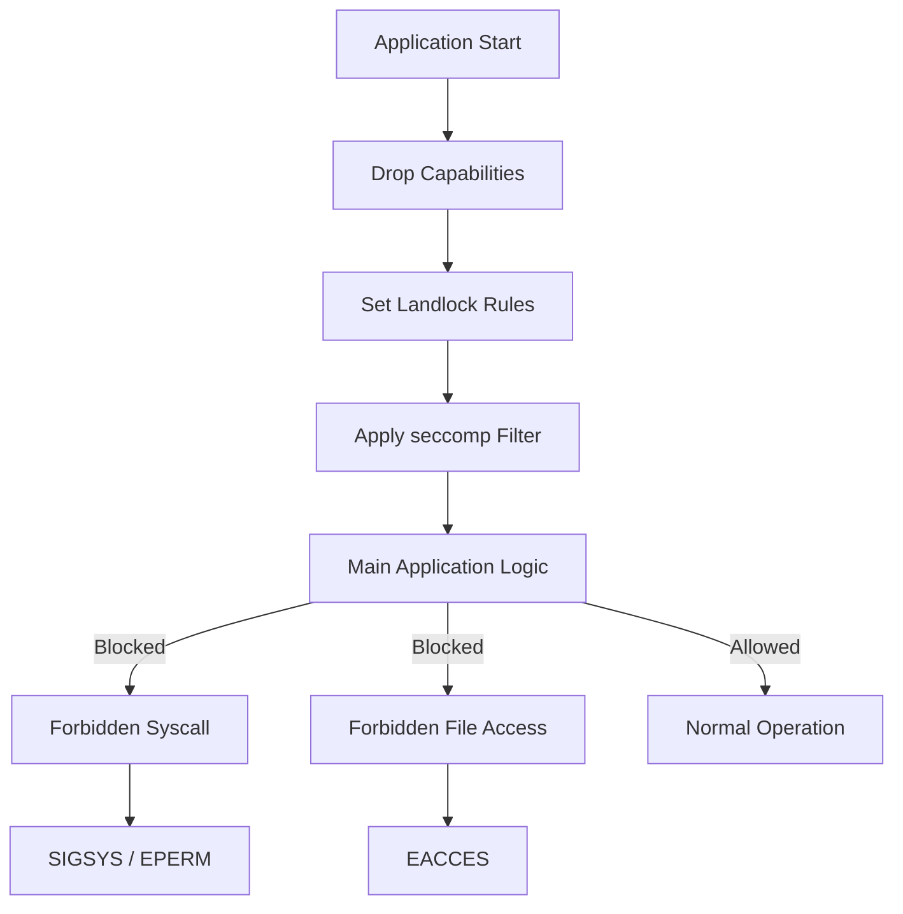

# How to Run Rust Binaries Without Root Using Sandboxing

Author: [nawazdhandala](https://www.github.com/nawazdhandala)

Tags: Rust, Security, Sandboxing, seccomp, Landlock, Linux, Capabilities, Privilege Dropping

Description: Learn how to sandbox Rust applications for defense-in-depth security. This guide covers seccomp filters, Landlock filesystem restrictions, capability dropping, and privilege separation patterns.

---

> Defense in depth means assuming your code will be compromised. Sandboxing limits what attackers can do even after gaining code execution. This guide shows you how to run Rust binaries with minimal privileges.

Modern Linux provides powerful sandboxing primitives. Let's use them to build secure applications that can't be weaponized against the system.

---

## Sandboxing Architecture



---

## Project Setup

```toml
[dependencies]
# Seccomp filtering
seccompiler = "0.4"

# Landlock filesystem sandboxing
landlock = "0.3"

# Capability management
caps = "0.5"

# User namespace and privilege separation
nix = { version = "0.27", features = ["user", "process", "mount"] }

# Error handling
anyhow = "1"
thiserror = "1"

# Logging
tracing = "0.1"
tracing-subscriber = "0.3"
```

---

## Capability Dropping

Linux capabilities allow fine-grained privilege control.

```rust
// src/capabilities.rs
// Drop unnecessary capabilities for defense in depth

use caps::{CapSet, Capability, CapsHashSet};
use anyhow::{Result, Context};
use tracing::{info, warn};

/// Drop all capabilities except those explicitly needed
pub fn drop_capabilities(keep: &[Capability]) -> Result<()> {
    let keep_set: CapsHashSet = keep.iter().cloned().collect();

    // Clear all capabilities from all sets
    for cap_set in [CapSet::Effective, CapSet::Permitted, CapSet::Inheritable] {
        // Get current capabilities
        let current = caps::read(None, cap_set)
            .context("Failed to read capabilities")?;

        // Drop capabilities not in keep list
        for cap in current {
            if !keep_set.contains(&cap) {
                caps::drop(None, cap_set, cap)
                    .with_context(|| format!("Failed to drop {:?} from {:?}", cap, cap_set))?;
            }
        }
    }

    // Clear ambient capabilities
    caps::clear(None, CapSet::Ambient)
        .context("Failed to clear ambient capabilities")?;

    // Lock capabilities so they can't be regained
    lock_capabilities()?;

    info!("Dropped capabilities, keeping: {:?}", keep);
    Ok(())
}

/// Lock capabilities to prevent regaining them
fn lock_capabilities() -> Result<()> {
    // Set SECBIT_NOROOT to prevent root from regaining caps
    // Set SECBIT_NO_SETUID_FIXUP to prevent setuid changes
    use nix::sys::prctl;

    // These prevent the process from ever gaining new capabilities
    unsafe {
        let current = libc::prctl(libc::PR_GET_SECUREBITS);
        let new_bits = current
            | libc::SECBIT_NOROOT
            | libc::SECBIT_NOROOT_LOCKED
            | libc::SECBIT_NO_SETUID_FIXUP
            | libc::SECBIT_NO_SETUID_FIXUP_LOCKED
            | libc::SECBIT_NO_CAP_AMBIENT_RAISE
            | libc::SECBIT_NO_CAP_AMBIENT_RAISE_LOCKED;

        if libc::prctl(libc::PR_SET_SECUREBITS, new_bits) != 0 {
            warn!("Failed to set securebits (may require CAP_SETPCAP)");
        }
    }

    Ok(())
}

/// Common capability sets for different application types
pub mod presets {
    use caps::Capability;

    /// Network server: only needs to bind to ports
    pub const NETWORK_SERVER: &[Capability] = &[
        Capability::CAP_NET_BIND_SERVICE, // Bind to ports < 1024
    ];

    /// File processor: no special capabilities needed
    pub const FILE_PROCESSOR: &[Capability] = &[];

    /// Container runtime: needs namespace capabilities
    pub const CONTAINER_RUNTIME: &[Capability] = &[
        Capability::CAP_SYS_ADMIN,    // Create namespaces
        Capability::CAP_SETUID,       // Change UID
        Capability::CAP_SETGID,       // Change GID
        Capability::CAP_NET_ADMIN,    // Network configuration
    ];
}

/// Drop to unprivileged user
pub fn drop_privileges(uid: u32, gid: u32) -> Result<()> {
    use nix::unistd::{setgid, setuid, Gid, Uid};

    // Set supplementary groups to empty
    nix::unistd::setgroups(&[])
        .context("Failed to clear supplementary groups")?;

    // Change group first (can't change after dropping root)
    setgid(Gid::from_raw(gid))
        .context("Failed to set GID")?;

    // Change user
    setuid(Uid::from_raw(uid))
        .context("Failed to set UID")?;

    info!("Dropped privileges to UID {} GID {}", uid, gid);
    Ok(())
}
```

---

## Seccomp Filtering

Restrict which system calls the process can make.

```rust
// src/seccomp.rs
// Seccomp system call filtering

use seccompiler::{
    BpfMap, SeccompAction, SeccompCmpArgLen, SeccompCmpOp,
    SeccompCondition, SeccompFilter, SeccompRule, TargetArch,
};
use std::collections::BTreeMap;
use anyhow::{Result, Context};
use tracing::info;

/// Apply a seccomp filter that only allows specified syscalls
pub fn apply_seccomp_filter(profile: SeccompProfile) -> Result<()> {
    let filter = build_filter(profile)?;

    // Apply filter to current thread
    seccompiler::apply_filter(&filter)
        .context("Failed to apply seccomp filter")?;

    info!("Applied seccomp filter");
    Ok(())
}

/// Build seccomp filter based on profile
fn build_filter(profile: SeccompProfile) -> Result<BpfMap> {
    let rules = match profile {
        SeccompProfile::Strict => strict_rules(),
        SeccompProfile::NetworkServer => network_server_rules(),
        SeccompProfile::FileProcessor => file_processor_rules(),
        SeccompProfile::Custom(rules) => rules,
    };

    // Default action: kill process on disallowed syscall
    let filter = SeccompFilter::new(
        rules,
        SeccompAction::KillProcess, // or Errno(libc::EPERM) for less harsh
        SeccompAction::Allow,
        TargetArch::x86_64,
    )
    .context("Failed to create seccomp filter")?;

    filter.try_into().context("Failed to compile seccomp filter")
}

pub enum SeccompProfile {
    /// Minimal syscalls for computation-only tasks
    Strict,
    /// Syscalls needed for network servers
    NetworkServer,
    /// Syscalls needed for file processing
    FileProcessor,
    /// Custom ruleset
    Custom(BTreeMap<i64, Vec<SeccompRule>>),
}

/// Minimal syscall set - computation only
fn strict_rules() -> BTreeMap<i64, Vec<SeccompRule>> {
    let mut rules = BTreeMap::new();

    // Basic process operations
    allow(&mut rules, libc::SYS_exit);
    allow(&mut rules, libc::SYS_exit_group);
    allow(&mut rules, libc::SYS_brk);          // Memory allocation

    // Thread operations
    allow(&mut rules, libc::SYS_futex);        // Mutex/condvar
    allow(&mut rules, libc::SYS_sched_yield);

    // Memory operations
    allow(&mut rules, libc::SYS_mmap);
    allow(&mut rules, libc::SYS_munmap);
    allow(&mut rules, libc::SYS_mprotect);

    // Time operations
    allow(&mut rules, libc::SYS_clock_gettime);
    allow(&mut rules, libc::SYS_gettimeofday);

    // Signals
    allow(&mut rules, libc::SYS_rt_sigaction);
    allow(&mut rules, libc::SYS_rt_sigprocmask);
    allow(&mut rules, libc::SYS_rt_sigreturn);

    rules
}

/// Syscalls for network servers
fn network_server_rules() -> BTreeMap<i64, Vec<SeccompRule>> {
    let mut rules = strict_rules();

    // File descriptor operations
    allow(&mut rules, libc::SYS_read);
    allow(&mut rules, libc::SYS_write);
    allow(&mut rules, libc::SYS_close);
    allow(&mut rules, libc::SYS_dup);
    allow(&mut rules, libc::SYS_dup2);

    // Network operations
    allow(&mut rules, libc::SYS_socket);
    allow(&mut rules, libc::SYS_bind);
    allow(&mut rules, libc::SYS_listen);
    allow(&mut rules, libc::SYS_accept);
    allow(&mut rules, libc::SYS_accept4);
    allow(&mut rules, libc::SYS_connect);
    allow(&mut rules, libc::SYS_sendto);
    allow(&mut rules, libc::SYS_recvfrom);
    allow(&mut rules, libc::SYS_setsockopt);
    allow(&mut rules, libc::SYS_getsockopt);
    allow(&mut rules, libc::SYS_shutdown);

    // Async I/O
    allow(&mut rules, libc::SYS_epoll_create1);
    allow(&mut rules, libc::SYS_epoll_ctl);
    allow(&mut rules, libc::SYS_epoll_wait);
    allow(&mut rules, libc::SYS_epoll_pwait);

    // Process info
    allow(&mut rules, libc::SYS_getpid);
    allow(&mut rules, libc::SYS_gettid);

    rules
}

/// Syscalls for file processing
fn file_processor_rules() -> BTreeMap<i64, Vec<SeccompRule>> {
    let mut rules = strict_rules();

    // File operations
    allow(&mut rules, libc::SYS_open);
    allow(&mut rules, libc::SYS_openat);
    allow(&mut rules, libc::SYS_read);
    allow(&mut rules, libc::SYS_write);
    allow(&mut rules, libc::SYS_close);
    allow(&mut rules, libc::SYS_lseek);
    allow(&mut rules, libc::SYS_fstat);
    allow(&mut rules, libc::SYS_stat);

    // Directory operations
    allow(&mut rules, libc::SYS_getdents64);

    // Memory-mapped files
    allow(&mut rules, libc::SYS_mmap);
    allow(&mut rules, libc::SYS_munmap);

    rules
}

/// Helper to allow a syscall unconditionally
fn allow(rules: &mut BTreeMap<i64, Vec<SeccompRule>>, syscall: i64) {
    rules.insert(syscall, vec![SeccompRule::new(vec![]).unwrap()]);
}

/// Restrict syscall with argument conditions
#[allow(dead_code)]
fn allow_with_condition(
    rules: &mut BTreeMap<i64, Vec<SeccompRule>>,
    syscall: i64,
    conditions: Vec<SeccompCondition>,
) {
    rules.insert(syscall, vec![SeccompRule::new(conditions).unwrap()]);
}

/// Example: Only allow opening files read-only
#[allow(dead_code)]
fn restrict_open_readonly(rules: &mut BTreeMap<i64, Vec<SeccompRule>>) {
    // Only allow O_RDONLY (value 0) for the flags argument
    let condition = SeccompCondition::new(
        1, // Second argument (flags)
        SeccompCmpArgLen::Dword,
        SeccompCmpOp::Eq,
        libc::O_RDONLY as u64,
    )
    .unwrap();

    allow_with_condition(rules, libc::SYS_open, vec![condition]);
}
```

---

## Landlock Filesystem Restrictions

Restrict filesystem access using Landlock.

```rust
// src/landlock.rs
// Landlock filesystem sandboxing

use landlock::{
    Access, AccessFs, PathBeneath, PathFd, Ruleset, RulesetAttr,
    RulesetCreated, RulesetCreatedAttr, RulesetStatus, ABI,
};
use std::path::Path;
use anyhow::{Result, Context, bail};
use tracing::{info, warn};

/// Filesystem access restrictions
pub struct FilesystemSandbox {
    ruleset: RulesetCreated,
}

impl FilesystemSandbox {
    /// Create a new filesystem sandbox
    pub fn new() -> Result<Self> {
        // Check if Landlock is supported
        let abi = ABI::V3; // Use latest stable ABI

        let ruleset = Ruleset::new()
            .handle_access(AccessFs::from_all(abi))
            .context("Failed to create Landlock ruleset")?
            .create()
            .context("Failed to create Landlock ruleset")?;

        Ok(Self { ruleset })
    }

    /// Allow read-only access to a path
    pub fn allow_read(mut self, path: impl AsRef<Path>) -> Result<Self> {
        let path = path.as_ref();
        let path_fd = PathFd::new(path)
            .with_context(|| format!("Failed to open path: {}", path.display()))?;

        self.ruleset = self.ruleset
            .add_rule(PathBeneath::new(path_fd, AccessFs::ReadFile | AccessFs::ReadDir))
            .with_context(|| format!("Failed to add read rule for: {}", path.display()))?;

        Ok(self)
    }

    /// Allow read-write access to a path
    pub fn allow_read_write(mut self, path: impl AsRef<Path>) -> Result<Self> {
        let path = path.as_ref();
        let path_fd = PathFd::new(path)
            .with_context(|| format!("Failed to open path: {}", path.display()))?;

        let access = AccessFs::ReadFile
            | AccessFs::ReadDir
            | AccessFs::WriteFile
            | AccessFs::RemoveFile
            | AccessFs::RemoveDir
            | AccessFs::MakeReg
            | AccessFs::MakeDir;

        self.ruleset = self.ruleset
            .add_rule(PathBeneath::new(path_fd, access))
            .with_context(|| format!("Failed to add read-write rule for: {}", path.display()))?;

        Ok(self)
    }

    /// Allow execute access (for loading shared libraries)
    pub fn allow_execute(mut self, path: impl AsRef<Path>) -> Result<Self> {
        let path = path.as_ref();
        let path_fd = PathFd::new(path)
            .with_context(|| format!("Failed to open path: {}", path.display()))?;

        self.ruleset = self.ruleset
            .add_rule(PathBeneath::new(path_fd, AccessFs::Execute))
            .with_context(|| format!("Failed to add execute rule for: {}", path.display()))?;

        Ok(self)
    }

    /// Apply the sandbox restrictions
    pub fn apply(self) -> Result<()> {
        let status = self.ruleset
            .restrict_self()
            .context("Failed to apply Landlock restrictions")?;

        match status.ruleset {
            RulesetStatus::FullyEnforced => {
                info!("Landlock sandbox fully enforced");
            }
            RulesetStatus::PartiallyEnforced => {
                warn!("Landlock sandbox only partially enforced");
            }
            RulesetStatus::NotEnforced => {
                bail!("Landlock sandbox not enforced (kernel support missing?)");
            }
        }

        Ok(())
    }
}

/// Common sandbox profiles
pub mod profiles {
    use super::*;

    /// Sandbox for a web server
    pub fn web_server(
        static_files: impl AsRef<Path>,
        data_dir: impl AsRef<Path>,
        log_dir: impl AsRef<Path>,
    ) -> Result<()> {
        FilesystemSandbox::new()?
            // Read-only access to static files
            .allow_read(static_files)?
            // Read-write access to data directory
            .allow_read_write(data_dir)?
            // Write-only to logs (read not needed)
            .allow_read_write(log_dir)?
            // Read system libraries and certificates
            .allow_read("/usr/lib")?
            .allow_read("/lib")?
            .allow_read("/etc/ssl/certs")?
            .allow_execute("/usr/lib")?
            .allow_execute("/lib")?
            .apply()
    }

    /// Sandbox for a file processor
    pub fn file_processor(
        input_dir: impl AsRef<Path>,
        output_dir: impl AsRef<Path>,
    ) -> Result<()> {
        FilesystemSandbox::new()?
            // Read-only input
            .allow_read(input_dir)?
            // Write-only output
            .allow_read_write(output_dir)?
            // System libraries
            .allow_read("/usr/lib")?
            .allow_execute("/usr/lib")?
            .apply()
    }

    /// Minimal sandbox - no filesystem access
    pub fn computation_only() -> Result<()> {
        // Only allow access to system libraries needed for execution
        FilesystemSandbox::new()?
            .allow_read("/usr/lib")?
            .allow_read("/lib")?
            .allow_execute("/usr/lib")?
            .allow_execute("/lib")?
            .apply()
    }
}
```

---

## Complete Sandbox Setup

Combine all sandboxing techniques.

```rust
// src/sandbox.rs
// Complete sandboxing setup

use crate::capabilities::{drop_capabilities, drop_privileges, presets};
use crate::seccomp::{apply_seccomp_filter, SeccompProfile};
use crate::landlock::FilesystemSandbox;
use anyhow::{Result, Context};
use tracing::info;
use std::path::Path;

/// Sandbox configuration
pub struct SandboxConfig {
    /// User ID to drop to (None = keep current)
    pub uid: Option<u32>,
    /// Group ID to drop to (None = keep current)
    pub gid: Option<u32>,
    /// Capabilities to keep (empty = drop all)
    pub capabilities: Vec<caps::Capability>,
    /// Seccomp profile
    pub seccomp: SeccompProfile,
    /// Filesystem restrictions
    pub filesystem: FilesystemConfig,
}

pub enum FilesystemConfig {
    /// No restrictions
    None,
    /// Restrict to specific paths
    Restricted {
        read_only: Vec<String>,
        read_write: Vec<String>,
    },
}

impl Default for SandboxConfig {
    fn default() -> Self {
        Self {
            uid: None,
            gid: None,
            capabilities: vec![],
            seccomp: SeccompProfile::Strict,
            filesystem: FilesystemConfig::None,
        }
    }
}

/// Apply sandbox configuration
/// Order matters: filesystem -> capabilities -> seccomp -> privileges
pub fn apply_sandbox(config: SandboxConfig) -> Result<()> {
    info!("Applying sandbox configuration");

    // 1. Set up filesystem restrictions (before dropping privileges)
    apply_filesystem_restrictions(&config.filesystem)?;

    // 2. Drop capabilities (except those needed)
    drop_capabilities(&config.capabilities)?;

    // 3. Apply seccomp filter (before dropping privileges for TSYNC)
    apply_seccomp_filter(config.seccomp)?;

    // 4. Drop privileges last (can't undo)
    if let (Some(uid), Some(gid)) = (config.uid, config.gid) {
        drop_privileges(uid, gid)?;
    }

    info!("Sandbox fully applied");
    Ok(())
}

fn apply_filesystem_restrictions(config: &FilesystemConfig) -> Result<()> {
    match config {
        FilesystemConfig::None => {
            info!("No filesystem restrictions applied");
            Ok(())
        }
        FilesystemConfig::Restricted { read_only, read_write } => {
            let mut sandbox = FilesystemSandbox::new()?;

            for path in read_only {
                sandbox = sandbox.allow_read(path)?;
            }

            for path in read_write {
                sandbox = sandbox.allow_read_write(path)?;
            }

            // Always allow system libraries
            sandbox = sandbox
                .allow_read("/usr/lib")?
                .allow_read("/lib")?
                .allow_execute("/usr/lib")?
                .allow_execute("/lib")?;

            sandbox.apply()
        }
    }
}

/// Preset sandbox for network services
pub fn sandbox_network_service(
    data_dir: impl AsRef<Path>,
    log_dir: impl AsRef<Path>,
) -> Result<()> {
    let config = SandboxConfig {
        uid: Some(65534), // nobody
        gid: Some(65534), // nogroup
        capabilities: presets::NETWORK_SERVER.to_vec(),
        seccomp: SeccompProfile::NetworkServer,
        filesystem: FilesystemConfig::Restricted {
            read_only: vec![
                "/etc/ssl/certs".to_string(),
                "/etc/resolv.conf".to_string(),
            ],
            read_write: vec![
                data_dir.as_ref().to_string_lossy().to_string(),
                log_dir.as_ref().to_string_lossy().to_string(),
            ],
        },
    };

    apply_sandbox(config)
}

/// Preset sandbox for file processing jobs
pub fn sandbox_file_processor(
    input_dir: impl AsRef<Path>,
    output_dir: impl AsRef<Path>,
) -> Result<()> {
    let config = SandboxConfig {
        uid: Some(65534),
        gid: Some(65534),
        capabilities: presets::FILE_PROCESSOR.to_vec(),
        seccomp: SeccompProfile::FileProcessor,
        filesystem: FilesystemConfig::Restricted {
            read_only: vec![input_dir.as_ref().to_string_lossy().to_string()],
            read_write: vec![output_dir.as_ref().to_string_lossy().to_string()],
        },
    };

    apply_sandbox(config)
}
```

---

## Usage Example

```rust
// src/main.rs
// Example application with sandboxing

use anyhow::Result;
use tracing::info;

mod capabilities;
mod seccomp;
mod landlock;
mod sandbox;

#[tokio::main]
async fn main() -> Result<()> {
    // Initialize logging before sandbox (might need filesystem access)
    tracing_subscriber::fmt::init();

    info!("Starting application");

    // Parse config, bind to ports, etc. BEFORE sandboxing
    let listener = tokio::net::TcpListener::bind("127.0.0.1:8080").await?;
    info!("Bound to port 8080");

    // Now apply sandbox
    sandbox::sandbox_network_service("/var/lib/myapp", "/var/log/myapp")?;
    info!("Sandbox applied");

    // Main application loop runs sandboxed
    loop {
        let (socket, addr) = listener.accept().await?;
        info!("Connection from {}", addr);

        tokio::spawn(async move {
            handle_connection(socket).await;
        });
    }
}

async fn handle_connection(mut socket: tokio::net::TcpStream) {
    use tokio::io::{AsyncReadExt, AsyncWriteExt};

    let mut buf = [0; 1024];
    loop {
        let n = match socket.read(&mut buf).await {
            Ok(0) => return, // Connection closed
            Ok(n) => n,
            Err(_) => return,
        };

        if socket.write_all(&buf[..n]).await.is_err() {
            return;
        }
    }
}
```

---

## Privilege Separation Pattern

Run privileged operations in a separate process.

```rust
// src/privsep.rs
// Privilege separation pattern

use std::os::unix::net::UnixStream;
use std::process::{Command, Stdio};
use std::io::{Read, Write};
use serde::{Serialize, Deserialize};
use anyhow::Result;

/// Messages from unprivileged child to privileged parent
#[derive(Serialize, Deserialize)]
pub enum PrivilegedRequest {
    /// Bind to a privileged port
    BindPort { port: u16 },
    /// Read a protected file
    ReadFile { path: String },
    /// Perform privileged operation
    Authenticate { user: String, password: String },
}

/// Responses from privileged parent
#[derive(Serialize, Deserialize)]
pub enum PrivilegedResponse {
    Success(Vec<u8>),
    Error(String),
    FileDescriptor, // Sent via SCM_RIGHTS
}

/// Parent process that retains privileges
pub fn run_privileged_parent(socket: UnixStream) -> Result<()> {
    let mut socket = socket;
    let mut buf = vec![0u8; 65536];

    loop {
        let n = socket.read(&mut buf)?;
        if n == 0 {
            break;
        }

        let request: PrivilegedRequest = bincode::deserialize(&buf[..n])?;

        let response = handle_privileged_request(request);
        let response_bytes = bincode::serialize(&response)?;
        socket.write_all(&response_bytes)?;
    }

    Ok(())
}

fn handle_privileged_request(request: PrivilegedRequest) -> PrivilegedResponse {
    match request {
        PrivilegedRequest::BindPort { port } => {
            // Bind to port and pass file descriptor back
            // (Would use SCM_RIGHTS in real implementation)
            PrivilegedResponse::Success(vec![])
        }
        PrivilegedRequest::ReadFile { path } => {
            match std::fs::read(&path) {
                Ok(data) => PrivilegedResponse::Success(data),
                Err(e) => PrivilegedResponse::Error(e.to_string()),
            }
        }
        PrivilegedRequest::Authenticate { user, password } => {
            // Check PAM or shadow file
            PrivilegedResponse::Success(vec![])
        }
    }
}

/// Fork and set up privilege separation
pub fn setup_privsep() -> Result<UnixStream> {
    let (parent_sock, child_sock) = UnixStream::pair()?;

    match unsafe { libc::fork() } {
        -1 => Err(anyhow::anyhow!("Fork failed")),
        0 => {
            // Child process - drop privileges and run main application
            drop(parent_sock);

            // Apply sandbox before returning to main code
            crate::sandbox::apply_sandbox(crate::sandbox::SandboxConfig::default())?;

            Ok(child_sock)
        }
        _pid => {
            // Parent process - stay privileged, handle requests
            drop(child_sock);
            run_privileged_parent(parent_sock)?;
            std::process::exit(0);
        }
    }
}
```

---

## Testing Sandbox Effectiveness

```rust
#[cfg(test)]
mod tests {
    use super::*;
    use std::panic;

    #[test]
    fn test_seccomp_blocks_forbidden_syscall() {
        // Apply strict seccomp filter
        apply_seccomp_filter(SeccompProfile::Strict).unwrap();

        // Try to open a file (not in allowed syscalls)
        let result = panic::catch_unwind(|| {
            std::fs::File::open("/etc/passwd")
        });

        // Should have been killed or returned error
        assert!(result.is_err() || result.unwrap().is_err());
    }

    #[test]
    fn test_landlock_blocks_forbidden_path() {
        // Set up sandbox allowing only /tmp
        FilesystemSandbox::new()
            .unwrap()
            .allow_read_write("/tmp")
            .unwrap()
            .apply()
            .unwrap();

        // Should fail to read outside sandbox
        let result = std::fs::read_to_string("/etc/passwd");
        assert!(result.is_err());

        // Should succeed inside sandbox
        std::fs::write("/tmp/test.txt", "hello").unwrap();
        let content = std::fs::read_to_string("/tmp/test.txt").unwrap();
        assert_eq!(content, "hello");
    }

    #[test]
    fn test_capability_drop() {
        // Drop all capabilities
        drop_capabilities(&[]).unwrap();

        // Verify we can't do privileged operations
        let result = std::net::TcpListener::bind("127.0.0.1:80");
        assert!(result.is_err()); // Can't bind to privileged port
    }
}
```

---

## Best Practices

| Practice | Reason |
|----------|--------|
| Apply sandbox early | Before processing any untrusted input |
| Use all layers | Capabilities + seccomp + Landlock together |
| Deny by default | Only allow what's explicitly needed |
| Test coverage | Verify sandbox blocks expected operations |
| Privilege separation | Keep privileged code minimal and separate |
| No PTRACE | Prevent sandbox escape via debugging |

---

*Need to monitor sandboxed services? [OneUptime](https://oneuptime.com) provides process monitoring with security event alerting.*

**Related Reading:**
- [How to Secure Rust APIs Against Common Vulnerabilities](https://oneuptime.com/blog/post/2026-01-07-rust-api-security/view)
- [How to Build Minimal Docker Images for Rust](https://oneuptime.com/blog/post/2026-01-07-rust-minimal-docker-images/view)
