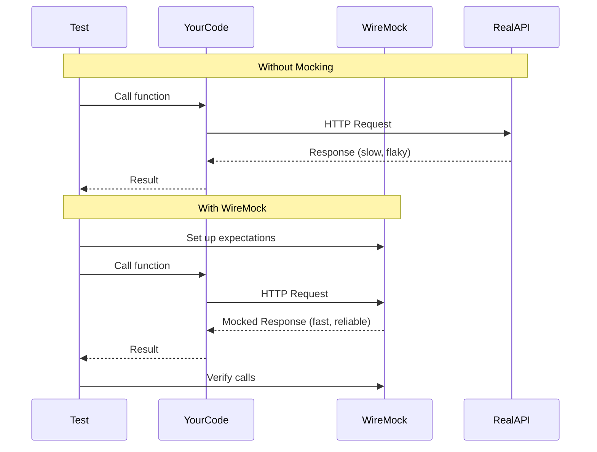

# How to Mock External APIs in Rust Tests with wiremock

Author: [nawazdhandala](https://www.github.com/nawazdhandala)

Tags: Rust, Testing, Mocking, wiremock, HTTP, API Testing, Integration Tests, Test Doubles

Description: Learn how to mock external HTTP APIs in Rust tests using wiremock. This guide covers request matching, response templating, verification, stateful mocks, and testing error scenarios.

---

> External API calls make tests slow, flaky, and expensive. Wiremock provides a mock HTTP server that runs locally, letting you test your HTTP client code without hitting real services. Tests become fast, deterministic, and free.

Mocking external dependencies isolates your tests from network issues, API rate limits, and third-party outages.

---

## Why Mock External APIs?



---

## Project Setup

```toml
[dependencies]
# HTTP client
reqwest = { version = "0.11", features = ["json"] }
tokio = { version = "1", features = ["full"] }

# Serialization
serde = { version = "1", features = ["derive"] }
serde_json = "1"

# Error handling
thiserror = "1"
anyhow = "1"

[dev-dependencies]
# HTTP mocking
wiremock = "0.5"

# Assertions
claims = "0.7"
```

---

## Basic Mocking

```rust
// src/github_client.rs
// GitHub API client that we'll test with mocks

use reqwest::Client;
use serde::{Deserialize, Serialize};
use thiserror::Error;

#[derive(Debug, Serialize, Deserialize)]
pub struct GithubUser {
    pub login: String,
    pub id: u64,
    pub name: Option<String>,
    pub email: Option<String>,
    pub public_repos: u32,
}

#[derive(Debug, Serialize, Deserialize)]
pub struct GithubRepo {
    pub id: u64,
    pub name: String,
    pub full_name: String,
    pub description: Option<String>,
    pub stargazers_count: u32,
}

#[derive(Error, Debug)]
pub enum GithubError {
    #[error("User not found")]
    NotFound,
    #[error("Rate limit exceeded")]
    RateLimited,
    #[error("Request failed: {0}")]
    RequestFailed(#[from] reqwest::Error),
}

/// GitHub API client with configurable base URL for testing
pub struct GithubClient {
    client: Client,
    base_url: String,
}

impl GithubClient {
    pub fn new() -> Self {
        Self {
            client: Client::new(),
            base_url: "https://api.github.com".to_string(),
        }
    }

    /// Create client with custom base URL (for testing)
    pub fn with_base_url(base_url: &str) -> Self {
        Self {
            client: Client::new(),
            base_url: base_url.to_string(),
        }
    }

    /// Get user by username
    pub async fn get_user(&self, username: &str) -> Result<GithubUser, GithubError> {
        let url = format!("{}/users/{}", self.base_url, username);

        let response = self.client.get(&url).send().await?;

        match response.status().as_u16() {
            200 => Ok(response.json().await?),
            404 => Err(GithubError::NotFound),
            403 => Err(GithubError::RateLimited),
            _ => Err(GithubError::RequestFailed(
                response.error_for_status().unwrap_err()
            )),
        }
    }

    /// Get user's repositories
    pub async fn get_user_repos(&self, username: &str) -> Result<Vec<GithubRepo>, GithubError> {
        let url = format!("{}/users/{}/repos", self.base_url, username);

        let response = self.client
            .get(&url)
            .query(&[("sort", "updated"), ("per_page", "100")])
            .send()
            .await?;

        match response.status().as_u16() {
            200 => Ok(response.json().await?),
            404 => Err(GithubError::NotFound),
            403 => Err(GithubError::RateLimited),
            _ => Err(GithubError::RequestFailed(
                response.error_for_status().unwrap_err()
            )),
        }
    }
}
```

---

## Basic Mock Tests

```rust
// tests/github_client_test.rs
// Tests using wiremock

use wiremock::matchers::{method, path, query_param};
use wiremock::{Mock, MockServer, ResponseTemplate};
use myapi::github_client::{GithubClient, GithubUser, GithubError};

#[tokio::test]
async fn test_get_user_success() {
    // Arrange: Start mock server
    let mock_server = MockServer::start().await;

    // Configure mock response
    Mock::given(method("GET"))
        .and(path("/users/testuser"))
        .respond_with(ResponseTemplate::new(200).set_body_json(serde_json::json!({
            "login": "testuser",
            "id": 12345,
            "name": "Test User",
            "email": "test@example.com",
            "public_repos": 42
        })))
        .mount(&mock_server)
        .await;

    // Act: Call the client with mock server URL
    let client = GithubClient::with_base_url(&mock_server.uri());
    let user = client.get_user("testuser").await.unwrap();

    // Assert: Verify response was parsed correctly
    assert_eq!(user.login, "testuser");
    assert_eq!(user.id, 12345);
    assert_eq!(user.name, Some("Test User".to_string()));
    assert_eq!(user.public_repos, 42);
}

#[tokio::test]
async fn test_get_user_not_found() {
    let mock_server = MockServer::start().await;

    Mock::given(method("GET"))
        .and(path("/users/nonexistent"))
        .respond_with(ResponseTemplate::new(404).set_body_json(serde_json::json!({
            "message": "Not Found"
        })))
        .mount(&mock_server)
        .await;

    let client = GithubClient::with_base_url(&mock_server.uri());
    let result = client.get_user("nonexistent").await;

    assert!(matches!(result, Err(GithubError::NotFound)));
}

#[tokio::test]
async fn test_get_user_rate_limited() {
    let mock_server = MockServer::start().await;

    Mock::given(method("GET"))
        .and(path("/users/anyuser"))
        .respond_with(
            ResponseTemplate::new(403)
                .set_body_json(serde_json::json!({
                    "message": "API rate limit exceeded"
                }))
                .insert_header("X-RateLimit-Remaining", "0")
        )
        .mount(&mock_server)
        .await;

    let client = GithubClient::with_base_url(&mock_server.uri());
    let result = client.get_user("anyuser").await;

    assert!(matches!(result, Err(GithubError::RateLimited)));
}
```

---

## Request Matching

```rust
// tests/request_matching_test.rs
// Advanced request matching

use wiremock::matchers::{
    method, path, path_regex, query_param, header, header_exists,
    body_json, body_string, body_string_contains,
};
use wiremock::{Mock, MockServer, ResponseTemplate, Request};

#[tokio::test]
async fn test_query_parameters() {
    let mock_server = MockServer::start().await;

    // Match specific query parameters
    Mock::given(method("GET"))
        .and(path("/users/testuser/repos"))
        .and(query_param("sort", "updated"))
        .and(query_param("per_page", "100"))
        .respond_with(ResponseTemplate::new(200).set_body_json(serde_json::json!([])))
        .mount(&mock_server)
        .await;

    let client = GithubClient::with_base_url(&mock_server.uri());
    let repos = client.get_user_repos("testuser").await.unwrap();

    assert!(repos.is_empty());
}

#[tokio::test]
async fn test_header_matching() {
    let mock_server = MockServer::start().await;

    // Require Authorization header
    Mock::given(method("GET"))
        .and(path("/user"))
        .and(header("Authorization", "token ghp_xxxx"))
        .respond_with(ResponseTemplate::new(200).set_body_json(serde_json::json!({
            "login": "authenticated_user",
            "id": 1
        })))
        .mount(&mock_server)
        .await;

    // Without auth header - no mock matches, request fails
    // With auth header - mock matches
}

#[tokio::test]
async fn test_regex_path_matching() {
    let mock_server = MockServer::start().await;

    // Match any user path
    Mock::given(method("GET"))
        .and(path_regex(r"^/users/[a-zA-Z0-9_-]+$"))
        .respond_with(ResponseTemplate::new(200).set_body_json(serde_json::json!({
            "login": "matched_user",
            "id": 1,
            "name": null,
            "email": null,
            "public_repos": 0
        })))
        .mount(&mock_server)
        .await;

    let client = GithubClient::with_base_url(&mock_server.uri());

    // Both should match the regex
    let user1 = client.get_user("any-user").await.unwrap();
    let user2 = client.get_user("another_user123").await.unwrap();

    assert_eq!(user1.login, "matched_user");
    assert_eq!(user2.login, "matched_user");
}

#[tokio::test]
async fn test_body_matching() {
    let mock_server = MockServer::start().await;

    // Match POST body
    Mock::given(method("POST"))
        .and(path("/repos/owner/repo/issues"))
        .and(body_json(serde_json::json!({
            "title": "Bug report",
            "body": "Something is broken"
        })))
        .respond_with(ResponseTemplate::new(201).set_body_json(serde_json::json!({
            "id": 1,
            "number": 42,
            "title": "Bug report"
        })))
        .mount(&mock_server)
        .await;
}

/// Custom matcher for complex conditions
fn has_valid_api_key() -> impl wiremock::Match {
    wiremock::matchers::header_exists("X-API-Key")
}

#[tokio::test]
async fn test_custom_matcher() {
    let mock_server = MockServer::start().await;

    Mock::given(method("GET"))
        .and(path("/secure"))
        .and(has_valid_api_key())
        .respond_with(ResponseTemplate::new(200))
        .mount(&mock_server)
        .await;
}
```

---

## Response Templating

```rust
// tests/response_templates_test.rs
// Dynamic response generation

use wiremock::{Mock, MockServer, ResponseTemplate, Request};
use wiremock::matchers::{method, path};

#[tokio::test]
async fn test_delay_response() {
    let mock_server = MockServer::start().await;

    // Simulate slow API
    Mock::given(method("GET"))
        .and(path("/slow"))
        .respond_with(
            ResponseTemplate::new(200)
                .set_delay(std::time::Duration::from_millis(500))
                .set_body_string("slow response")
        )
        .mount(&mock_server)
        .await;
}

#[tokio::test]
async fn test_response_headers() {
    let mock_server = MockServer::start().await;

    Mock::given(method("GET"))
        .and(path("/users/testuser"))
        .respond_with(
            ResponseTemplate::new(200)
                .set_body_json(serde_json::json!({
                    "login": "testuser",
                    "id": 1,
                    "name": null,
                    "email": null,
                    "public_repos": 0
                }))
                .insert_header("X-RateLimit-Limit", "60")
                .insert_header("X-RateLimit-Remaining", "59")
                .insert_header("X-RateLimit-Reset", "1234567890")
                .insert_header("Cache-Control", "private, max-age=60")
        )
        .mount(&mock_server)
        .await;
}

/// Dynamic response based on request
#[tokio::test]
async fn test_dynamic_response() {
    let mock_server = MockServer::start().await;

    // Use a responder function for dynamic responses
    Mock::given(method("GET"))
        .and(path_regex(r"^/users/([a-zA-Z0-9_-]+)$"))
        .respond_with(|req: &Request| {
            // Extract username from path
            let path = req.url.path();
            let username = path.strip_prefix("/users/").unwrap_or("unknown");

            ResponseTemplate::new(200).set_body_json(serde_json::json!({
                "login": username,
                "id": username.len() as u64, // Dynamic ID based on username
                "name": null,
                "email": null,
                "public_repos": 0
            }))
        })
        .mount(&mock_server)
        .await;

    let client = GithubClient::with_base_url(&mock_server.uri());

    let user1 = client.get_user("alice").await.unwrap();
    assert_eq!(user1.login, "alice");
    assert_eq!(user1.id, 5); // "alice".len()

    let user2 = client.get_user("bob").await.unwrap();
    assert_eq!(user2.login, "bob");
    assert_eq!(user2.id, 3); // "bob".len()
}

use wiremock::matchers::path_regex;
use myapi::github_client::GithubClient;
```

---

## Request Verification

```rust
// tests/verification_test.rs
// Verify requests were made as expected

use wiremock::{Mock, MockServer, ResponseTemplate};
use wiremock::matchers::{method, path};

#[tokio::test]
async fn test_verify_request_count() {
    let mock_server = MockServer::start().await;

    Mock::given(method("GET"))
        .and(path("/users/testuser"))
        .respond_with(ResponseTemplate::new(200).set_body_json(serde_json::json!({
            "login": "testuser",
            "id": 1,
            "name": null,
            "email": null,
            "public_repos": 0
        })))
        // Expect exactly 2 calls
        .expect(2)
        .mount(&mock_server)
        .await;

    let client = GithubClient::with_base_url(&mock_server.uri());

    // Make exactly 2 calls
    client.get_user("testuser").await.unwrap();
    client.get_user("testuser").await.unwrap();

    // Verification happens on mock_server drop
    // If not exactly 2 calls, test will fail
}

#[tokio::test]
async fn test_verify_no_calls() {
    let mock_server = MockServer::start().await;

    Mock::given(method("DELETE"))
        .and(path("/dangerous"))
        .respond_with(ResponseTemplate::new(204))
        // Expect zero calls
        .expect(0)
        .mount(&mock_server)
        .await;

    // Do NOT call the dangerous endpoint

    // Verification ensures it was never called
}

#[tokio::test]
async fn test_verify_at_least() {
    let mock_server = MockServer::start().await;

    Mock::given(method("GET"))
        .and(path("/users/testuser"))
        .respond_with(ResponseTemplate::new(200).set_body_json(serde_json::json!({
            "login": "testuser",
            "id": 1,
            "name": null,
            "email": null,
            "public_repos": 0
        })))
        // Expect at least 1 call (up to any number)
        .expect(1..)
        .mount(&mock_server)
        .await;

    let client = GithubClient::with_base_url(&mock_server.uri());

    client.get_user("testuser").await.unwrap();
    client.get_user("testuser").await.unwrap();
    client.get_user("testuser").await.unwrap();
    // Any number >= 1 is fine
}

use myapi::github_client::GithubClient;
```

---

## Stateful Mocks

```rust
// tests/stateful_test.rs
// Mocks that change behavior based on previous calls

use wiremock::{Mock, MockServer, ResponseTemplate};
use wiremock::matchers::{method, path};
use std::sync::atomic::{AtomicU32, Ordering};
use std::sync::Arc;

#[tokio::test]
async fn test_retry_then_succeed() {
    let mock_server = MockServer::start().await;
    let call_count = Arc::new(AtomicU32::new(0));
    let call_count_clone = call_count.clone();

    // First call fails, subsequent calls succeed
    Mock::given(method("GET"))
        .and(path("/flaky"))
        .respond_with(move |_: &wiremock::Request| {
            let count = call_count_clone.fetch_add(1, Ordering::SeqCst);
            if count == 0 {
                // First call: fail with 503
                ResponseTemplate::new(503)
                    .set_body_string("Service temporarily unavailable")
            } else {
                // Subsequent calls: succeed
                ResponseTemplate::new(200)
                    .set_body_string("Success!")
            }
        })
        .mount(&mock_server)
        .await;

    let client = reqwest::Client::new();

    // First call fails
    let resp1 = client
        .get(&format!("{}/flaky", mock_server.uri()))
        .send()
        .await
        .unwrap();
    assert_eq!(resp1.status(), 503);

    // Second call succeeds
    let resp2 = client
        .get(&format!("{}/flaky", mock_server.uri()))
        .send()
        .await
        .unwrap();
    assert_eq!(resp2.status(), 200);
}

#[tokio::test]
async fn test_pagination() {
    let mock_server = MockServer::start().await;

    // Page 1
    Mock::given(method("GET"))
        .and(path("/items"))
        .and(wiremock::matchers::query_param("page", "1"))
        .respond_with(ResponseTemplate::new(200).set_body_json(serde_json::json!({
            "items": [{"id": 1}, {"id": 2}],
            "next_page": 2
        })))
        .mount(&mock_server)
        .await;

    // Page 2
    Mock::given(method("GET"))
        .and(path("/items"))
        .and(wiremock::matchers::query_param("page", "2"))
        .respond_with(ResponseTemplate::new(200).set_body_json(serde_json::json!({
            "items": [{"id": 3}, {"id": 4}],
            "next_page": null
        })))
        .mount(&mock_server)
        .await;

    // Test pagination logic
    let client = reqwest::Client::new();

    let page1: serde_json::Value = client
        .get(&format!("{}/items?page=1", mock_server.uri()))
        .send()
        .await
        .unwrap()
        .json()
        .await
        .unwrap();

    assert_eq!(page1["items"].as_array().unwrap().len(), 2);
    assert_eq!(page1["next_page"], 2);

    let page2: serde_json::Value = client
        .get(&format!("{}/items?page=2", mock_server.uri()))
        .send()
        .await
        .unwrap()
        .json()
        .await
        .unwrap();

    assert_eq!(page2["items"].as_array().unwrap().len(), 2);
    assert!(page2["next_page"].is_null());
}
```

---

## Error Scenario Testing

```rust
// tests/error_scenarios_test.rs
// Testing error handling with mocks

use wiremock::{Mock, MockServer, ResponseTemplate};
use wiremock::matchers::{method, path, any};

#[tokio::test]
async fn test_timeout_handling() {
    let mock_server = MockServer::start().await;

    // Simulate very slow response (effectively a timeout)
    Mock::given(method("GET"))
        .and(path("/slow"))
        .respond_with(
            ResponseTemplate::new(200)
                .set_delay(std::time::Duration::from_secs(30))
        )
        .mount(&mock_server)
        .await;

    let client = reqwest::Client::builder()
        .timeout(std::time::Duration::from_millis(100))
        .build()
        .unwrap();

    let result = client
        .get(&format!("{}/slow", mock_server.uri()))
        .send()
        .await;

    assert!(result.is_err());
    // Error should be timeout
}

#[tokio::test]
async fn test_malformed_json_response() {
    let mock_server = MockServer::start().await;

    Mock::given(method("GET"))
        .and(path("/users/testuser"))
        .respond_with(
            ResponseTemplate::new(200)
                .set_body_string("{ invalid json }")
                .insert_header("Content-Type", "application/json")
        )
        .mount(&mock_server)
        .await;

    let client = GithubClient::with_base_url(&mock_server.uri());
    let result = client.get_user("testuser").await;

    assert!(result.is_err());
}

#[tokio::test]
async fn test_connection_refused() {
    // Use a port that's definitely not listening
    let client = GithubClient::with_base_url("http://localhost:59999");
    let result = client.get_user("anyone").await;

    assert!(result.is_err());
}

#[tokio::test]
async fn test_500_error() {
    let mock_server = MockServer::start().await;

    Mock::given(method("GET"))
        .and(path("/users/testuser"))
        .respond_with(
            ResponseTemplate::new(500)
                .set_body_json(serde_json::json!({
                    "message": "Internal Server Error"
                }))
        )
        .mount(&mock_server)
        .await;

    let client = GithubClient::with_base_url(&mock_server.uri());
    let result = client.get_user("testuser").await;

    assert!(result.is_err());
}

#[tokio::test]
async fn test_unexpected_status_codes() {
    let mock_server = MockServer::start().await;

    for status in [400, 401, 402, 405, 408, 429, 500, 502, 503, 504] {
        Mock::given(any())
            .respond_with(ResponseTemplate::new(status))
            .mount(&mock_server)
            .await;

        let client = reqwest::Client::new();
        let response = client
            .get(&format!("{}/test", mock_server.uri()))
            .send()
            .await
            .unwrap();

        assert_eq!(response.status().as_u16(), status);

        mock_server.reset().await;
    }
}

use myapi::github_client::GithubClient;
```

---

## Testing Webhooks

```rust
// tests/webhook_test.rs
// Testing webhook receivers

use wiremock::{Mock, MockServer, ResponseTemplate};
use wiremock::matchers::{method, path, header, body_json};

/// Webhook receiver that we're testing
struct WebhookReceiver {
    base_url: String,
}

impl WebhookReceiver {
    async fn handle_github_webhook(&self, payload: serde_json::Value) -> Result<(), String> {
        let client = reqwest::Client::new();

        let response = client
            .post(&format!("{}/webhooks/github", self.base_url))
            .header("X-GitHub-Event", "push")
            .header("X-Hub-Signature-256", "sha256=xxx")
            .json(&payload)
            .send()
            .await
            .map_err(|e| e.to_string())?;

        if response.status().is_success() {
            Ok(())
        } else {
            Err(format!("Webhook failed: {}", response.status()))
        }
    }
}

#[tokio::test]
async fn test_webhook_delivery() {
    let mock_server = MockServer::start().await;

    // Set up expectation for webhook
    Mock::given(method("POST"))
        .and(path("/webhooks/github"))
        .and(header("X-GitHub-Event", "push"))
        .and(body_json(serde_json::json!({
            "ref": "refs/heads/main",
            "repository": {
                "full_name": "owner/repo"
            }
        })))
        .respond_with(ResponseTemplate::new(200))
        .expect(1)
        .mount(&mock_server)
        .await;

    let receiver = WebhookReceiver {
        base_url: mock_server.uri(),
    };

    let result = receiver.handle_github_webhook(serde_json::json!({
        "ref": "refs/heads/main",
        "repository": {
            "full_name": "owner/repo"
        }
    })).await;

    assert!(result.is_ok());
}
```

---

## Shared Test Fixtures

```rust
// tests/common/mocks.rs
// Reusable mock configurations

use wiremock::{Mock, MockServer, ResponseTemplate};
use wiremock::matchers::{method, path, path_regex};

/// Standard mock for GitHub user endpoint
pub async fn mock_github_user(mock_server: &MockServer, username: &str, user_data: serde_json::Value) {
    Mock::given(method("GET"))
        .and(path(format!("/users/{}", username)))
        .respond_with(ResponseTemplate::new(200).set_body_json(user_data))
        .mount(mock_server)
        .await;
}

/// Mock that returns 404 for any user
pub async fn mock_all_users_not_found(mock_server: &MockServer) {
    Mock::given(method("GET"))
        .and(path_regex(r"^/users/[a-zA-Z0-9_-]+$"))
        .respond_with(
            ResponseTemplate::new(404)
                .set_body_json(serde_json::json!({"message": "Not Found"}))
        )
        .mount(mock_server)
        .await;
}

/// Mock rate limiting
pub async fn mock_rate_limited(mock_server: &MockServer) {
    Mock::given(method("GET"))
        .respond_with(
            ResponseTemplate::new(403)
                .set_body_json(serde_json::json!({
                    "message": "API rate limit exceeded"
                }))
                .insert_header("X-RateLimit-Remaining", "0")
        )
        .mount(mock_server)
        .await;
}

// Usage in tests:
// #[tokio::test]
// async fn test_with_fixtures() {
//     let mock_server = MockServer::start().await;
//     mock_github_user(&mock_server, "testuser", json!({...})).await;
//     // ... test code
// }
```

---

## Best Practices

| Practice | Reason |
|----------|--------|
| Inject base URL | Makes client testable without code changes |
| Use exact matchers first | More specific mocks prevent false matches |
| Verify call counts | Ensure expected interactions happened |
| Test error cases | 4xx, 5xx, timeouts, malformed responses |
| Reset between tests | Prevent mock leakage between tests |
| Use shared fixtures | DRY up common mock configurations |

---

*Need to monitor API integrations in production? [OneUptime](https://oneuptime.com) provides API monitoring with response time tracking and error alerting.*

**Related Reading:**
- [How to Write Integration Tests for Rust APIs with Testcontainers](https://oneuptime.com/blog/post/2026-01-07-rust-testcontainers/view)
- [How to Build REST APIs with Axum](https://oneuptime.com/blog/post/2026-01-07-rust-axum-rest-api/view)
