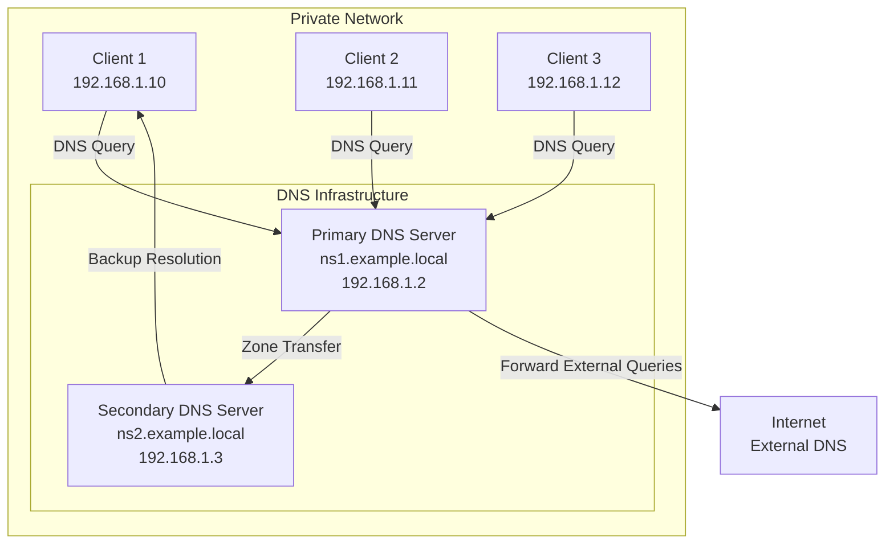
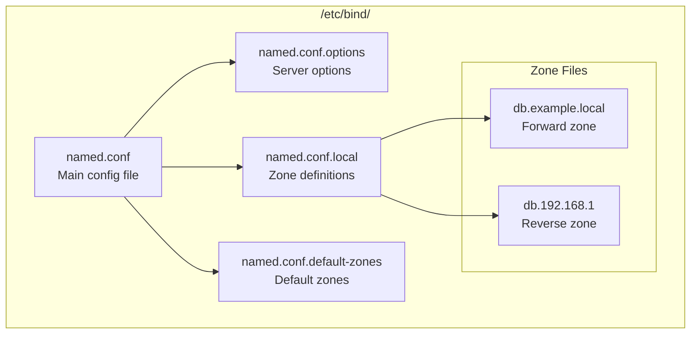
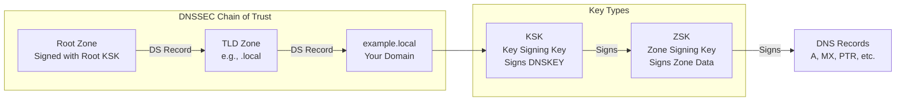
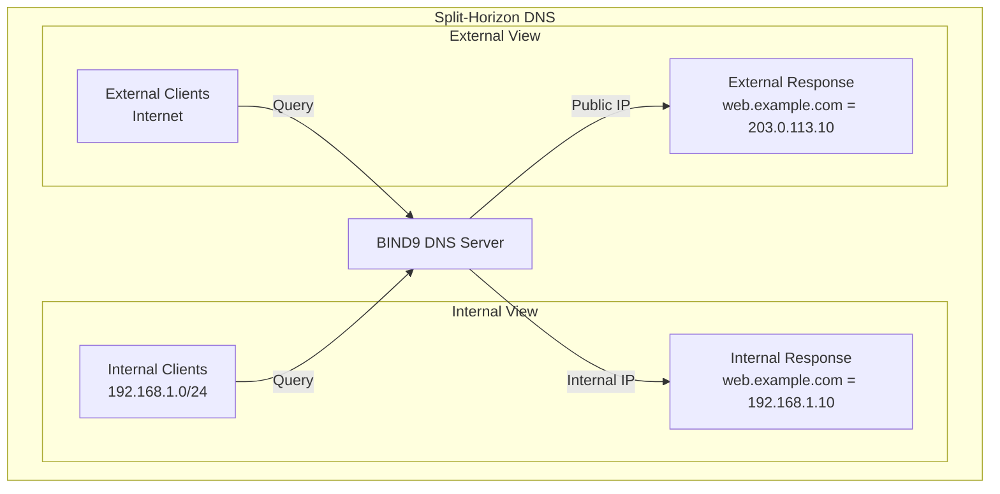
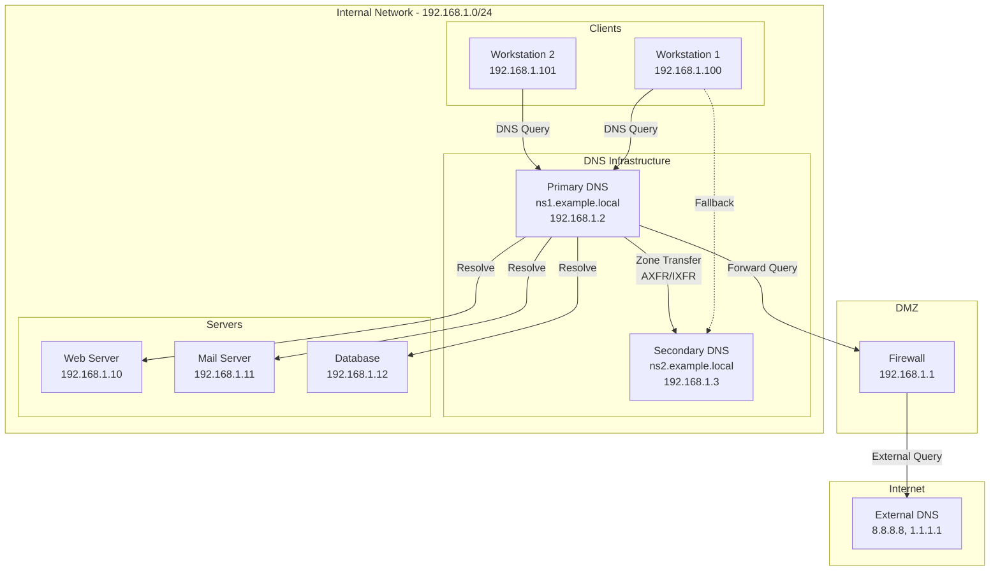

# How to Set Up a Private DNS Server with Bind9 on Ubuntu

Author: [nawazdhandala](https://github.com/nawazdhandala)

Tags: Ubuntu, Linux, DNS, Networking, Infrastructure, Security

Description: Learn how to install and configure Bind9 as a private DNS server for your network on Ubuntu.

---

## Introduction

A private DNS server is essential for managing internal network resources, improving security, and reducing external DNS query latency. BIND9 (Berkeley Internet Name Domain version 9) is the most widely used DNS software on the Internet and provides a robust, full-featured DNS server solution.

In this comprehensive guide, we will walk through setting up a private DNS server using BIND9 on Ubuntu, covering everything from basic installation to advanced configurations like DNSSEC and split-horizon DNS.

## DNS Architecture Overview

Before diving into the configuration, let's understand the architecture of a private DNS setup:



## Prerequisites

Before starting, ensure you have:

- Ubuntu 22.04 LTS or newer
- Root or sudo access
- A static IP address configured on your server
- Basic understanding of DNS concepts
- Firewall access to ports 53 (TCP/UDP)

## Step 1: Installing BIND9

First, update your system packages and install BIND9 along with useful DNS utilities.

```bash
# Update the package index to ensure we get the latest versions
sudo apt update

# Install BIND9, DNS utilities for testing, and documentation
# - bind9: The main DNS server package
# - bind9utils: Additional utilities for managing BIND
# - bind9-doc: Documentation for reference
# - dnsutils: Tools like dig, nslookup for DNS queries
sudo apt install -y bind9 bind9utils bind9-doc dnsutils
```

Verify the installation and check the BIND9 version.

```bash
# Check the installed BIND9 version
# This confirms successful installation and shows version info
named -v
```

## Step 2: Understanding BIND9 Configuration Structure

BIND9 configuration files are located in `/etc/bind/`. Here's the structure:



## Step 3: Configuring BIND9 Options

Edit the main options file to configure server behavior, forwarders, and access control.

```bash
# Create a backup of the original configuration before making changes
sudo cp /etc/bind/named.conf.options /etc/bind/named.conf.options.backup
```

Now edit the options file with your preferred text editor.

```bash
# Open the options file for editing
sudo nano /etc/bind/named.conf.options
```

Replace the contents with the following configuration:

```bind
// /etc/bind/named.conf.options
// Main BIND9 options configuration file
// This file controls the overall behavior of the DNS server

// Access Control List (ACL) - Define trusted networks
// This ACL will be used to restrict DNS queries to authorized clients only
acl "trusted" {
    192.168.1.0/24;    // Local network subnet
    10.0.0.0/8;        // Additional private network (optional)
    localhost;          // Allow queries from the server itself
    localnets;          // Allow queries from directly connected networks
};

options {
    // Directory where BIND stores its working files
    // Zone files and cache data are stored here
    directory "/var/cache/bind";

    // Enable recursion for trusted clients only
    // Recursion allows the server to query other DNS servers on behalf of clients
    recursion yes;

    // Only allow recursion for clients in the trusted ACL
    // This prevents the server from being used in DNS amplification attacks
    allow-recursion { trusted; };

    // Listen on the local network interface
    // Replace 192.168.1.2 with your server's actual IP address
    listen-on { 127.0.0.1; 192.168.1.2; };

    // Disable IPv6 listening if not needed (optional)
    // Remove or modify if you're using IPv6
    listen-on-v6 { none; };

    // Allow queries only from trusted networks
    // This adds an additional layer of security
    allow-query { trusted; };

    // Allow zone transfers only to secondary DNS servers
    // Replace with your secondary DNS server IP
    allow-transfer { 192.168.1.3; };

    // Forwarders - External DNS servers for queries we can't resolve locally
    // These handle queries for domains we don't have authority over
    forwarders {
        8.8.8.8;        // Google Public DNS (primary)
        8.8.4.4;        // Google Public DNS (secondary)
        1.1.1.1;        // Cloudflare DNS (alternative)
    };

    // Forward mode: 'first' tries forwarders first, then does recursive lookup
    // Use 'only' to exclusively use forwarders (no recursive lookups)
    forward first;

    // DNSSEC validation for enhanced security
    // Validates signed DNS responses to prevent DNS spoofing
    dnssec-validation auto;

    // Query source port randomization for security
    // Helps prevent cache poisoning attacks
    query-source address * port *;

    // Limit the rate of responses to prevent DNS amplification attacks
    // Adjust values based on your network's legitimate traffic patterns
    rate-limit {
        responses-per-second 10;  // Max responses per second per client
        window 5;                  // Time window in seconds
    };

    // Hide BIND version for security through obscurity
    // Prevents attackers from knowing your exact BIND version
    version "DNS Server";

    // Disable the built-in server info zone
    server-id none;

    // Logging and performance tuning
    // Maximum cache size in MB (adjust based on available RAM)
    max-cache-size 256m;

    // Maximum time to cache records (1 week)
    max-cache-ttl 604800;

    // Minimum time to cache negative responses (1 hour)
    max-ncache-ttl 3600;
};
```

## Step 4: Creating Forward Zone

The forward zone maps hostnames to IP addresses. First, define the zone in the local configuration file.

```bash
# Edit the local zones configuration file
sudo nano /etc/bind/named.conf.local
```

Add the following zone definitions:

```bind
// /etc/bind/named.conf.local
// Local zone definitions for our private DNS server
// This file defines zones for which this server is authoritative

// Forward zone for example.local domain
// Maps hostnames to IP addresses (A records)
zone "example.local" {
    type master;                           // This is the primary/master server
    file "/etc/bind/zones/db.example.local";  // Path to zone file
    allow-transfer { 192.168.1.3; };       // Allow transfers to secondary DNS
    also-notify { 192.168.1.3; };          // Notify secondary of changes
    allow-update { none; };                 // Disable dynamic updates (security)
};

// Reverse zone for 192.168.1.0/24 network
// Maps IP addresses to hostnames (PTR records)
zone "1.168.192.in-addr.arpa" {
    type master;                           // This is the primary/master server
    file "/etc/bind/zones/db.192.168.1";   // Path to reverse zone file
    allow-transfer { 192.168.1.3; };       // Allow transfers to secondary DNS
    also-notify { 192.168.1.3; };          // Notify secondary of changes
    allow-update { none; };                 // Disable dynamic updates (security)
};
```

Now create the zones directory and forward zone file.

```bash
# Create the zones directory to store zone files
sudo mkdir -p /etc/bind/zones
```

Create the forward zone file for your domain.

```bash
# Create the forward zone file
sudo nano /etc/bind/zones/db.example.local
```

Add the following zone data:

```bind
; /etc/bind/zones/db.example.local
; Forward zone file for example.local domain
; This file maps hostnames to IP addresses

; $TTL - Default Time To Live for records (1 day)
; This tells caching resolvers how long to cache these records
$TTL    86400

; SOA (Start of Authority) Record
; Defines authoritative information about the zone
; Format: @ IN SOA primary-ns admin-email ( serial refresh retry expire minimum )
@       IN      SOA     ns1.example.local. admin.example.local. (
                        2024010701      ; Serial number (YYYYMMDDNN format)
                                        ; Increment this when making changes!
                        3600            ; Refresh - Secondary checks every 1 hour
                        1800            ; Retry - If refresh fails, retry in 30 min
                        604800          ; Expire - Zone data expires after 1 week
                        86400           ; Minimum TTL - Negative cache TTL (1 day)
)

; NS (Name Server) Records
; Defines the authoritative name servers for this zone
; At least two NS records are recommended for redundancy
@       IN      NS      ns1.example.local.
@       IN      NS      ns2.example.local.

; A (Address) Records for Name Servers
; These MUST be defined since NS records reference them
ns1     IN      A       192.168.1.2
ns2     IN      A       192.168.1.3

; A Records for Infrastructure Servers
; Define your servers, workstations, and network devices here

; Gateway/Router
gateway IN      A       192.168.1.1
router  IN      CNAME   gateway         ; Alias for gateway

; DNS Servers (same as NS records above)
dns1    IN      A       192.168.1.2
dns2    IN      A       192.168.1.3

; Application Servers
web     IN      A       192.168.1.10    ; Web server
www     IN      CNAME   web             ; Alias for web server
mail    IN      A       192.168.1.11    ; Mail server
db      IN      A       192.168.1.12    ; Database server
app     IN      A       192.168.1.13    ; Application server

; Development Servers
dev     IN      A       192.168.1.20
staging IN      A       192.168.1.21
jenkins IN      A       192.168.1.22

; Monitoring and Management
monitor IN      A       192.168.1.30
grafana IN      A       192.168.1.31
prometheus IN   A       192.168.1.32

; Workstations (example)
workstation1 IN A       192.168.1.100
workstation2 IN A       192.168.1.101

; MX (Mail Exchanger) Records
; Defines mail servers for the domain
; Lower preference number = higher priority
@       IN      MX      10 mail.example.local.
@       IN      MX      20 mail2.example.local.

; Additional mail server
mail2   IN      A       192.168.1.14

; TXT Records for SPF and other purposes
; SPF record to help prevent email spoofing
@       IN      TXT     "v=spf1 mx ip4:192.168.1.0/24 -all"

; SRV Records (Service Location)
; Format: _service._protocol TTL class SRV priority weight port target
; Example: LDAP service
_ldap._tcp      IN      SRV     0 0 389 ldap.example.local.
ldap    IN      A       192.168.1.40

; Example: Kerberos service
_kerberos._tcp  IN      SRV     0 0 88 kdc.example.local.
kdc     IN      A       192.168.1.41
```

## Step 5: Creating Reverse Zone

The reverse zone maps IP addresses to hostnames, which is essential for reverse DNS lookups.

```bash
# Create the reverse zone file
sudo nano /etc/bind/zones/db.192.168.1
```

Add the following reverse zone data:

```bind
; /etc/bind/zones/db.192.168.1
; Reverse zone file for 192.168.1.0/24 network
; This file maps IP addresses to hostnames (PTR records)

; $TTL - Default Time To Live (1 day)
$TTL    86400

; SOA (Start of Authority) Record
; Same structure as forward zone
@       IN      SOA     ns1.example.local. admin.example.local. (
                        2024010701      ; Serial - MUST be incremented on changes
                        3600            ; Refresh - 1 hour
                        1800            ; Retry - 30 minutes
                        604800          ; Expire - 1 week
                        86400           ; Minimum TTL - 1 day
)

; NS Records
; Name servers for this reverse zone
@       IN      NS      ns1.example.local.
@       IN      NS      ns2.example.local.

; PTR (Pointer) Records
; Map the last octet of IP to fully qualified domain name
; Format: last-octet IN PTR hostname.domain.

; Gateway
1       IN      PTR     gateway.example.local.

; DNS Servers
2       IN      PTR     ns1.example.local.
3       IN      PTR     ns2.example.local.

; Application Servers
10      IN      PTR     web.example.local.
11      IN      PTR     mail.example.local.
12      IN      PTR     db.example.local.
13      IN      PTR     app.example.local.
14      IN      PTR     mail2.example.local.

; Development Servers
20      IN      PTR     dev.example.local.
21      IN      PTR     staging.example.local.
22      IN      PTR     jenkins.example.local.

; Monitoring Servers
30      IN      PTR     monitor.example.local.
31      IN      PTR     grafana.example.local.
32      IN      PTR     prometheus.example.local.

; Directory Services
40      IN      PTR     ldap.example.local.
41      IN      PTR     kdc.example.local.

; Workstations
100     IN      PTR     workstation1.example.local.
101     IN      PTR     workstation2.example.local.
```

## Step 6: Validating Configuration

Before starting BIND9, validate your configuration files to catch any syntax errors.

```bash
# Check the main BIND configuration syntax
# This validates named.conf and all included files
sudo named-checkconf

# If there are no errors, the command returns silently
# Any syntax errors will be displayed with line numbers
```

Validate the zone files individually.

```bash
# Validate the forward zone file
# Syntax: named-checkzone zone-name zone-file
sudo named-checkzone example.local /etc/bind/zones/db.example.local

# Expected output: "zone example.local/IN: loaded serial 2024010701"
# The "OK" status indicates no errors
```

```bash
# Validate the reverse zone file
sudo named-checkzone 1.168.192.in-addr.arpa /etc/bind/zones/db.192.168.1

# Expected output similar to forward zone
```

## Step 7: Starting and Enabling BIND9

Start the BIND9 service and enable it to start on boot.

```bash
# Restart BIND9 to apply all configuration changes
sudo systemctl restart bind9

# Enable BIND9 to start automatically at boot
sudo systemctl enable bind9

# Check the service status to verify it's running correctly
sudo systemctl status bind9
```

Check if BIND9 is listening on the correct ports.

```bash
# Verify BIND9 is listening on port 53 (TCP and UDP)
# You should see entries for both 127.0.0.1:53 and your server IP
sudo ss -tlnup | grep named
```

## Step 8: Configuring Firewall

Allow DNS traffic through the firewall.

```bash
# Allow DNS traffic on port 53 (both TCP and UDP)
# TCP is used for zone transfers and large responses
# UDP is used for standard queries
sudo ufw allow 53/tcp
sudo ufw allow 53/udp

# Or use the named service profile if available
# sudo ufw allow Bind9

# Reload firewall to apply changes
sudo ufw reload

# Verify the rules are active
sudo ufw status verbose
```

## Step 9: Testing DNS Resolution

Test your DNS server using dig (Domain Information Groper).

```bash
# Test forward lookup - resolve hostname to IP
# Query the local DNS server (127.0.0.1) for web.example.local
dig @127.0.0.1 web.example.local

# You should see an ANSWER SECTION with:
# web.example.local.    86400   IN      A       192.168.1.10
```

```bash
# Test reverse lookup - resolve IP to hostname
# Use -x flag for reverse lookup
dig @127.0.0.1 -x 192.168.1.10

# You should see:
# 10.1.168.192.in-addr.arpa. 86400 IN   PTR     web.example.local.
```

```bash
# Test short format output for quick verification
dig @127.0.0.1 web.example.local +short
# Output: 192.168.1.10
```

```bash
# Test MX records for email configuration
dig @127.0.0.1 example.local MX

# Verify NS records
dig @127.0.0.1 example.local NS
```

## Step 10: Configuring Client Machines

Configure client machines to use your private DNS server.

For Ubuntu clients using Netplan:

```bash
# Edit the Netplan configuration
sudo nano /etc/netplan/01-netcfg.yaml
```

```yaml
# /etc/netplan/01-netcfg.yaml
# Network configuration for DNS client
network:
  version: 2
  renderer: networkd  # or NetworkManager
  ethernets:
    eth0:  # Replace with your interface name
      dhcp4: no
      addresses:
        - 192.168.1.100/24
      routes:
        - to: default
          via: 192.168.1.1
      nameservers:
        # Use your private DNS servers
        addresses:
          - 192.168.1.2    # Primary DNS (your BIND server)
          - 192.168.1.3    # Secondary DNS
        # Search domain for short hostnames
        search:
          - example.local
```

Apply the network configuration.

```bash
# Apply Netplan configuration
sudo netplan apply

# Verify DNS settings
resolvectl status
```

## Step 11: Setting Up DNSSEC

DNSSEC (DNS Security Extensions) adds cryptographic signatures to DNS records, providing authentication and integrity.



Generate DNSSEC keys for your zone.

```bash
# Create a directory for DNSSEC keys
sudo mkdir -p /etc/bind/keys
cd /etc/bind/keys

# Generate the Key Signing Key (KSK)
# - Algorithm 13 = ECDSAP256SHA256 (recommended for new deployments)
# - KSK is used to sign the DNSKEY record
sudo dnssec-keygen -a ECDSAP256SHA256 -b 256 -n ZONE -f KSK example.local

# Generate the Zone Signing Key (ZSK)
# - ZSK signs all other records in the zone
# - Smaller key for faster signing/verification
sudo dnssec-keygen -a ECDSAP256SHA256 -b 256 -n ZONE example.local

# Set proper permissions on the key files
sudo chown -R bind:bind /etc/bind/keys
sudo chmod 640 /etc/bind/keys/*
```

Include the keys in your zone file.

```bash
# Append the public keys to your zone file
# The $INCLUDE directive adds the DNSKEY records
sudo bash -c 'cat /etc/bind/keys/*.key >> /etc/bind/zones/db.example.local'
```

Sign the zone with DNSSEC.

```bash
# Sign the zone file with both KSK and ZSK
# This creates a signed zone file with RRSIG, NSEC, and DNSKEY records
cd /etc/bind/zones
sudo dnssec-signzone -A -3 $(head -c 16 /dev/random | od -A n -t x | tr -d ' ') \
    -N INCREMENT -o example.local -t db.example.local

# This creates:
# - db.example.local.signed (the signed zone file)
# - dsset-example.local. (DS records for parent zone)
```

Update the zone configuration to use the signed zone.

```bash
# Edit named.conf.local to use the signed zone file
sudo nano /etc/bind/named.conf.local
```

```bind
// Update the zone definition to use signed zone file
zone "example.local" {
    type master;
    file "/etc/bind/zones/db.example.local.signed";  // Changed to signed file
    allow-transfer { 192.168.1.3; };
    also-notify { 192.168.1.3; };
    allow-update { none; };

    // Enable inline signing for automatic re-signing
    // This keeps the zone signed when changes are made
    inline-signing yes;
    auto-dnssec maintain;

    // Key directory for DNSSEC keys
    key-directory "/etc/bind/keys";
};
```

Verify DNSSEC is working.

```bash
# Restart BIND to apply DNSSEC changes
sudo systemctl restart bind9

# Query with DNSSEC validation
# The 'ad' flag (Authenticated Data) indicates successful DNSSEC validation
dig @127.0.0.1 web.example.local +dnssec

# Verify DNSKEY records are published
dig @127.0.0.1 example.local DNSKEY +short
```

## Step 12: Split-Horizon DNS Configuration

Split-horizon DNS (also called split-brain DNS) returns different responses based on the client's network location. This is useful when you have different IP addresses for internal and external access.



Create separate zone files for internal and external views.

```bash
# Create external zone file
sudo nano /etc/bind/zones/db.example.com.external
```

```bind
; /etc/bind/zones/db.example.com.external
; External zone file - returned to clients outside the trusted network
; Contains public IP addresses visible from the Internet

$TTL    86400

@       IN      SOA     ns1.example.com. admin.example.com. (
                        2024010701
                        3600
                        1800
                        604800
                        86400
)

; NS Records - Public DNS servers
@       IN      NS      ns1.example.com.
@       IN      NS      ns2.example.com.

; A Records with PUBLIC IP addresses
; These IPs are routable on the Internet
ns1     IN      A       203.0.113.2     ; Public IP for ns1
ns2     IN      A       203.0.113.3     ; Public IP for ns2

; Public-facing services
@       IN      A       203.0.113.10    ; Main website
www     IN      A       203.0.113.10    ; WWW subdomain
mail    IN      A       203.0.113.11    ; Mail server
api     IN      A       203.0.113.12    ; API endpoint

; MX Records
@       IN      MX      10 mail.example.com.

; SPF Record
@       IN      TXT     "v=spf1 mx ip4:203.0.113.0/24 -all"
```

Create internal zone file.

```bash
# Create internal zone file
sudo nano /etc/bind/zones/db.example.com.internal
```

```bind
; /etc/bind/zones/db.example.com.internal
; Internal zone file - returned to clients inside the trusted network
; Contains private IP addresses for direct internal access

$TTL    86400

@       IN      SOA     ns1.example.com. admin.example.com. (
                        2024010701
                        3600
                        1800
                        604800
                        86400
)

; NS Records
@       IN      NS      ns1.example.com.
@       IN      NS      ns2.example.com.

; A Records with INTERNAL IP addresses
; These bypass the firewall/NAT for direct access
ns1     IN      A       192.168.1.2     ; Internal IP for ns1
ns2     IN      A       192.168.1.3     ; Internal IP for ns2

; Internal services - same hostnames, different IPs
@       IN      A       192.168.1.10    ; Main website (internal)
www     IN      A       192.168.1.10
mail    IN      A       192.168.1.11
api     IN      A       192.168.1.12

; Additional internal-only services
; These are NOT accessible from external view
intranet IN     A       192.168.1.50
wiki    IN      A       192.168.1.51
gitlab  IN      A       192.168.1.52
jenkins IN      A       192.168.1.53
vault   IN      A       192.168.1.54

; MX Records
@       IN      MX      10 mail.example.com.

; Development servers (internal only)
dev     IN      A       192.168.1.60
staging IN      A       192.168.1.61
test    IN      A       192.168.1.62
```

Configure BIND9 with views.

```bash
# Backup existing configuration
sudo cp /etc/bind/named.conf.local /etc/bind/named.conf.local.backup

# Edit the configuration to use views
sudo nano /etc/bind/named.conf.local
```

```bind
// /etc/bind/named.conf.local
// Split-Horizon DNS configuration with views
// Views allow different responses based on client source IP

// ACL for internal networks
// Add all your internal network ranges here
acl "internal-networks" {
    192.168.1.0/24;     // Primary office network
    192.168.2.0/24;     // Secondary office network
    10.0.0.0/8;         // VPN clients
    127.0.0.0/8;        // Localhost
};

// ACL for external networks (everyone else)
acl "external-networks" {
    !internal-networks;  // NOT internal (negation)
    any;                 // Everyone else
};

// =============================================================================
// INTERNAL VIEW - For clients inside the network
// =============================================================================
view "internal" {
    // Match clients from internal networks
    match-clients { internal-networks; };

    // Recursion enabled for internal clients
    recursion yes;

    // Additional server settings for internal view
    allow-query { internal-networks; };

    // Include default zones (root hints, localhost)
    include "/etc/bind/named.conf.default-zones";

    // Internal view of example.com
    zone "example.com" {
        type master;
        file "/etc/bind/zones/db.example.com.internal";
        allow-transfer { 192.168.1.3; };
    };

    // Internal private domain (not visible externally)
    zone "example.local" {
        type master;
        file "/etc/bind/zones/db.example.local";
        allow-transfer { 192.168.1.3; };
    };

    // Reverse zone for internal network
    zone "1.168.192.in-addr.arpa" {
        type master;
        file "/etc/bind/zones/db.192.168.1";
        allow-transfer { 192.168.1.3; };
    };
};

// =============================================================================
// EXTERNAL VIEW - For clients outside the network
// =============================================================================
view "external" {
    // Match all clients not matched by internal view
    match-clients { external-networks; };

    // Disable recursion for external clients (security best practice)
    // External clients should only query for zones we're authoritative for
    recursion no;

    // Only allow queries from anyone (we're authoritative)
    allow-query { any; };

    // External view of example.com
    zone "example.com" {
        type master;
        file "/etc/bind/zones/db.example.com.external";
        // No zone transfers to external servers
        allow-transfer { none; };
    };

    // Note: example.local is NOT defined in external view
    // This makes it invisible to external clients (security)
};
```

Update the main options file to remove conflicting settings.

```bash
# When using views, some options must be inside views
# Edit named.conf.options to be compatible with views
sudo nano /etc/bind/named.conf.options
```

```bind
// /etc/bind/named.conf.options
// Updated for split-horizon DNS with views

options {
    directory "/var/cache/bind";

    // Listen on appropriate interfaces
    listen-on { 127.0.0.1; 192.168.1.2; };
    listen-on-v6 { none; };

    // Forwarders for recursive queries
    forwarders {
        8.8.8.8;
        8.8.4.4;
    };
    forward first;

    // DNSSEC validation
    dnssec-validation auto;

    // Security settings
    version "DNS Server";
    server-id none;

    // Note: recursion, allow-query, allow-recursion
    // are now defined per-view in named.conf.local

    // Rate limiting still applies globally
    rate-limit {
        responses-per-second 10;
        window 5;
    };
};
```

Validate and restart the service.

```bash
# Check configuration syntax
sudo named-checkconf

# Validate both zone files
sudo named-checkzone example.com /etc/bind/zones/db.example.com.internal
sudo named-checkzone example.com /etc/bind/zones/db.example.com.external

# Restart BIND9
sudo systemctl restart bind9
```

## Step 13: Logging Configuration

Configure comprehensive logging for troubleshooting and security monitoring.

```bash
# Create log directory
sudo mkdir -p /var/log/bind
sudo chown bind:bind /var/log/bind

# Edit named.conf to add logging configuration
sudo nano /etc/bind/named.conf
```

Add the logging configuration.

```bind
// Add this logging section to /etc/bind/named.conf
// Place it after the options include

logging {
    // Define log channels (destinations)

    // General query log - logs all DNS queries
    channel query_log {
        file "/var/log/bind/query.log" versions 5 size 10m;
        severity info;
        print-time yes;
        print-severity yes;
        print-category yes;
    };

    // Security events log
    channel security_log {
        file "/var/log/bind/security.log" versions 5 size 10m;
        severity dynamic;
        print-time yes;
        print-severity yes;
        print-category yes;
    };

    // General server log
    channel default_log {
        file "/var/log/bind/default.log" versions 3 size 5m;
        severity info;
        print-time yes;
        print-severity yes;
        print-category yes;
    };

    // Zone transfer log
    channel xfer_log {
        file "/var/log/bind/xfer.log" versions 3 size 5m;
        severity info;
        print-time yes;
        print-severity yes;
        print-category yes;
    };

    // DNSSEC validation log
    channel dnssec_log {
        file "/var/log/bind/dnssec.log" versions 3 size 5m;
        severity info;
        print-time yes;
        print-severity yes;
        print-category yes;
    };

    // Syslog for critical errors
    channel syslog_channel {
        syslog daemon;
        severity error;
    };

    // Route categories to appropriate channels
    category queries { query_log; };
    category security { security_log; };
    category default { default_log; syslog_channel; };
    category xfer-in { xfer_log; };
    category xfer-out { xfer_log; };
    category dnssec { dnssec_log; };
    category notify { xfer_log; };
    category update { security_log; };
    category update-security { security_log; };
};
```

Set up log rotation for BIND9 logs.

```bash
# Create logrotate configuration
sudo nano /etc/logrotate.d/bind9
```

```
# /etc/logrotate.d/bind9
# Log rotation configuration for BIND9 logs

/var/log/bind/*.log {
    daily                  # Rotate daily
    missingok             # Don't error if log is missing
    rotate 14             # Keep 14 days of logs
    compress              # Compress rotated logs
    delaycompress         # Delay compression by one rotation
    notifempty            # Don't rotate empty logs
    create 0640 bind bind # Create new log with these permissions
    sharedscripts         # Run scripts once for all logs
    postrotate
        # Signal BIND to reopen log files
        /usr/sbin/rndc reopen > /dev/null 2>&1 || true
    endscript
}
```

## Step 14: Setting Up Secondary DNS Server

For redundancy, configure a secondary DNS server that receives zone transfers from the primary.

On the secondary server (192.168.1.3):

```bash
# Install BIND9 on secondary server
sudo apt update && sudo apt install -y bind9 bind9utils dnsutils
```

Configure the secondary server.

```bash
# Edit named.conf.local on secondary server
sudo nano /etc/bind/named.conf.local
```

```bind
// /etc/bind/named.conf.local on SECONDARY DNS server
// This server receives zone data from the primary via zone transfers

// Forward zone - slave/secondary
zone "example.local" {
    type slave;                         // This is a secondary/slave server
    file "/var/cache/bind/db.example.local";  // Local cache of zone data
    masters { 192.168.1.2; };           // Primary server IP
    allow-notify { 192.168.1.2; };      // Accept notify from primary
    allow-transfer { none; };            // Don't allow transfers from secondary
};

// Reverse zone - slave/secondary
zone "1.168.192.in-addr.arpa" {
    type slave;
    file "/var/cache/bind/db.192.168.1";
    masters { 192.168.1.2; };
    allow-notify { 192.168.1.2; };
    allow-transfer { none; };
};
```

Test zone transfer manually.

```bash
# On secondary server, check zone transfer status
sudo rndc retransfer example.local

# Check if zone file was received
ls -la /var/cache/bind/

# Verify zone content
dig @localhost example.local AXFR
```

## Step 15: Performance Tuning

Optimize BIND9 for better performance in production environments.

```bash
# Edit named.conf.options for performance tuning
sudo nano /etc/bind/named.conf.options
```

Add these performance-related options.

```bind
options {
    // ... existing options ...

    // Performance tuning

    // Number of recursive queries allowed simultaneously
    // Increase for high-traffic servers (default: 1000)
    recursive-clients 2000;

    // Number of concurrent TCP connections
    // Increase for servers handling many zone transfers
    tcp-clients 200;

    // Size of the EDNS0 UDP buffer
    // Larger values reduce fragmentation for DNSSEC
    edns-udp-size 4096;
    max-udp-size 4096;

    // Reduce memory usage on idle connections
    tcp-listen-queue 10;

    // Cache tuning
    max-cache-size 512m;        // Increase cache size (adjust for RAM)
    max-cache-ttl 604800;       // Max cache time: 1 week
    max-ncache-ttl 3600;        // Negative cache: 1 hour

    // Prefetch expiring records to maintain cache freshness
    // Refetch when TTL drops below 10 seconds with 2 second coverage
    prefetch 10 2;

    // Number of threads for query processing
    // Set to number of CPU cores for optimal performance
    // Uncomment and adjust for your system
    // resolver-query-timeout 10;

    // Minimal responses for faster queries
    // Only include answer section, not additional records
    minimal-responses yes;

    // Disable empty zones for private IP ranges if not needed
    // Reduces unnecessary NXDOMAIN responses
    // empty-zones-enable no;
};
```

## Step 16: Monitoring and Health Checks

Set up monitoring scripts to ensure DNS health.

```bash
# Create a DNS health check script
sudo nano /usr/local/bin/dns-health-check.sh
```

```bash
#!/bin/bash
# /usr/local/bin/dns-health-check.sh
# DNS Server Health Check Script
# This script monitors BIND9 DNS server health and alerts on issues

# Configuration
DNS_SERVER="192.168.1.2"
TEST_DOMAIN="web.example.local"
EXPECTED_IP="192.168.1.10"
LOG_FILE="/var/log/bind/health-check.log"
ALERT_EMAIL="admin@example.local"

# Function to log messages with timestamp
log_message() {
    echo "$(date '+%Y-%m-%d %H:%M:%S') - $1" >> "$LOG_FILE"
}

# Function to send alert (modify for your alerting system)
send_alert() {
    local message="$1"
    log_message "ALERT: $message"
    # Uncomment to enable email alerts
    # echo "$message" | mail -s "DNS Alert: $(hostname)" "$ALERT_EMAIL"
}

# Check if BIND9 service is running
check_service() {
    if systemctl is-active --quiet bind9; then
        log_message "INFO: BIND9 service is running"
        return 0
    else
        send_alert "BIND9 service is NOT running!"
        return 1
    fi
}

# Check if DNS resolution is working
check_resolution() {
    local result=$(dig @"$DNS_SERVER" "$TEST_DOMAIN" +short 2>/dev/null)

    if [ "$result" = "$EXPECTED_IP" ]; then
        log_message "INFO: DNS resolution working - $TEST_DOMAIN = $result"
        return 0
    else
        send_alert "DNS resolution failed! Expected: $EXPECTED_IP, Got: $result"
        return 1
    fi
}

# Check response time
check_response_time() {
    local query_time=$(dig @"$DNS_SERVER" "$TEST_DOMAIN" | grep "Query time" | awk '{print $4}')

    if [ -n "$query_time" ] && [ "$query_time" -lt 100 ]; then
        log_message "INFO: Query time acceptable: ${query_time}ms"
        return 0
    else
        send_alert "High query time detected: ${query_time}ms"
        return 1
    fi
}

# Check zone serial numbers (for primary/secondary sync)
check_zone_serial() {
    local serial=$(dig @"$DNS_SERVER" example.local SOA +short | awk '{print $3}')
    log_message "INFO: Zone serial: $serial"
}

# Main execution
log_message "===== Starting DNS Health Check ====="

check_service
check_resolution
check_response_time
check_zone_serial

log_message "===== Health Check Complete ====="
```

Make the script executable and schedule it.

```bash
# Make the script executable
sudo chmod +x /usr/local/bin/dns-health-check.sh

# Add to cron for regular monitoring (every 5 minutes)
echo "*/5 * * * * root /usr/local/bin/dns-health-check.sh" | sudo tee /etc/cron.d/dns-health-check
```

## Step 17: Security Hardening

Implement additional security measures for your DNS server.

```bash
# Restrict file permissions
sudo chmod 640 /etc/bind/named.conf*
sudo chmod 640 /etc/bind/zones/*
sudo chown -R root:bind /etc/bind

# Ensure BIND runs as non-root user (default on Ubuntu)
grep "^bind:" /etc/passwd

# Check that BIND is running with reduced privileges
ps aux | grep named
```

Configure AppArmor for BIND9 (if available).

```bash
# Check AppArmor status for BIND
sudo aa-status | grep named

# If not enforced, enforce the profile
sudo aa-enforce /etc/apparmor.d/usr.sbin.named

# Reload AppArmor
sudo systemctl reload apparmor
```

Implement response rate limiting in detail.

```bind
// Add to options section in named.conf.options
// This helps prevent DNS amplification attacks

rate-limit {
    // Responses per second for identical queries
    responses-per-second 10;

    // Responses per second for NXDOMAIN
    nxdomains-per-second 5;

    // Responses per second for referrals
    referrals-per-second 5;

    // Responses per second for NODATA
    nodata-per-second 5;

    // Responses per second for errors
    errors-per-second 5;

    // Time window in seconds
    window 5;

    // Log rate limiting events
    log-only no;

    // Slip ratio (1 = drop all, 2 = respond to every 2nd)
    slip 2;

    // IPv4 prefix length for rate limiting
    ipv4-prefix-length 24;

    // IPv6 prefix length for rate limiting
    ipv6-prefix-length 56;
};
```

## Troubleshooting Common Issues

### Issue 1: BIND9 fails to start

```bash
# Check for configuration errors
sudo named-checkconf -z

# Check system logs for BIND errors
sudo journalctl -u bind9 -n 50

# Check for port conflicts
sudo lsof -i :53
```

### Issue 2: Zone transfer fails

```bash
# On primary, check transfer permissions
# Ensure secondary IP is in allow-transfer

# On secondary, manually request transfer
sudo rndc retransfer example.local

# Check for firewall blocking port 53/TCP
sudo ufw status
```

### Issue 3: Slow DNS resolution

```bash
# Check forwarder connectivity
dig @8.8.8.8 google.com

# Check BIND cache statistics
sudo rndc stats
cat /var/cache/bind/named.stats

# Analyze query patterns
tail -f /var/log/bind/query.log
```

### Issue 4: DNSSEC validation failures

```bash
# Check DNSSEC status
dig @127.0.0.1 example.local +dnssec

# Verify keys are loaded
sudo rndc signing -list example.local

# Re-sign zone if needed
cd /etc/bind/zones
sudo dnssec-signzone -A -N INCREMENT -o example.local -t db.example.local
sudo systemctl restart bind9
```

## Complete Architecture Diagram



## Summary

You have successfully set up a comprehensive private DNS infrastructure with BIND9 on Ubuntu, including:

1. **Basic DNS Server**: Installed and configured BIND9 with secure options
2. **Forward Zone**: Created DNS records to map hostnames to IP addresses
3. **Reverse Zone**: Configured PTR records for reverse lookups
4. **DNSSEC**: Implemented cryptographic signing for DNS security
5. **Split-Horizon DNS**: Configured different responses for internal/external clients
6. **Secondary DNS**: Set up redundancy with zone transfers
7. **Logging**: Comprehensive logging for troubleshooting and auditing
8. **Security**: Hardened the server against common attacks
9. **Monitoring**: Health check scripts for proactive monitoring

This setup provides a robust, secure, and highly available DNS infrastructure suitable for production environments.

## Further Reading

- [BIND 9 Administrator Reference Manual](https://bind9.readthedocs.io/)
- [DNSSEC Guide](https://www.isc.org/dnssec/)
- [Ubuntu Server Documentation](https://ubuntu.com/server/docs)
- [DNS Best Practices](https://www.rfc-editor.org/rfc/rfc1912)
