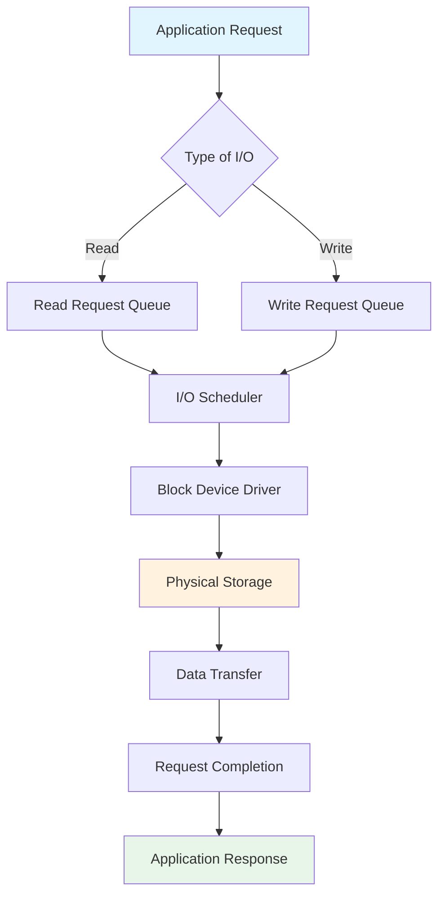
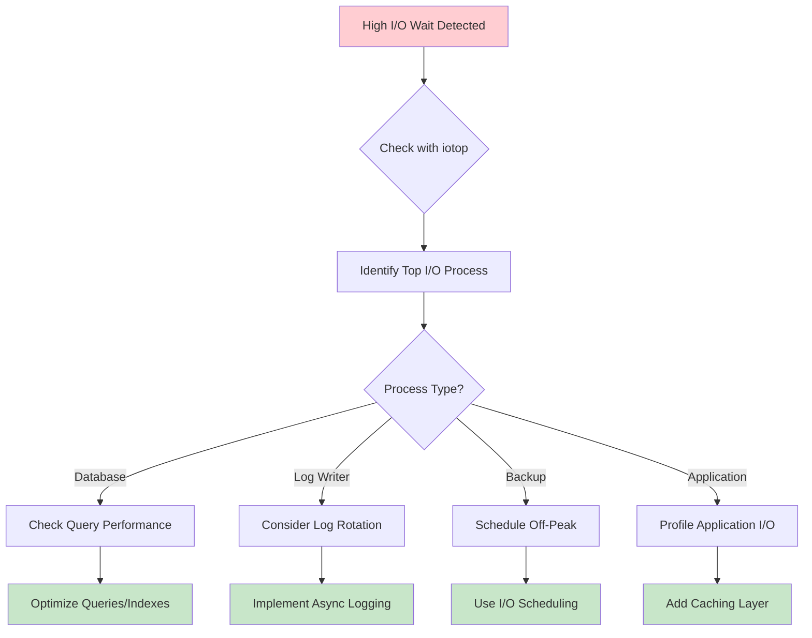

# How to Monitor Disk I/O and Identify Storage Bottlenecks on Ubuntu

Author: [nawazdhandala](https://github.com/nawazdhandala)

Tags: Ubuntu, Linux, Monitoring, Storage, Performance, Troubleshooting

Description: Learn how to monitor disk I/O performance and identify storage bottlenecks on Ubuntu using iostat, iotop, and other tools.

---

Storage performance is often the silent killer of application responsiveness. While CPU and memory issues tend to be obvious, disk I/O bottlenecks can be subtle yet devastating to system performance. This comprehensive guide will teach you how to monitor disk I/O on Ubuntu, interpret performance metrics, identify bottlenecks, and troubleshoot storage-related issues.

## Understanding Disk I/O Fundamentals

Before diving into monitoring tools, it is essential to understand what disk I/O metrics actually mean and how they affect system performance.



### Key I/O Metrics

| Metric | Description | Healthy Range |
|--------|-------------|---------------|
| **IOPS** | I/O Operations Per Second | Varies by disk type (HDD: 100-200, SSD: 10,000-100,000+) |
| **Throughput** | Data transfer rate (MB/s) | Depends on interface and disk type |
| **Latency** | Time to complete an I/O operation | < 10ms for SSD, < 20ms for HDD |
| **Queue Depth** | Number of pending I/O requests | Should stay low during normal operation |
| **Utilization** | Percentage of time disk is busy | < 80% for optimal performance |

## Installing Required Monitoring Tools

Most monitoring tools are available in the default Ubuntu repositories. Let us install the essential packages.

```bash
# Update package lists to ensure we get the latest versions
sudo apt update

# Install sysstat package which includes iostat, sar, and other monitoring tools
sudo apt install -y sysstat

# Install iotop for real-time per-process I/O monitoring
sudo apt install -y iotop

# Install dstat for versatile resource statistics
sudo apt install -y dstat

# Install blktrace for detailed block device tracing (advanced users)
sudo apt install -y blktrace

# Enable sysstat data collection for historical analysis
# This modifies /etc/default/sysstat to set ENABLED="true"
sudo sed -i 's/ENABLED="false"/ENABLED="true"/' /etc/default/sysstat

# Restart the sysstat service to apply changes
sudo systemctl restart sysstat
sudo systemctl enable sysstat
```

## Using iostat for Disk I/O Analysis

The `iostat` command is the most comprehensive tool for disk I/O monitoring. It provides detailed statistics about CPU utilization and device I/O performance.

### Basic iostat Usage

```bash
# Display basic I/O statistics for all devices
# The output shows average statistics since the last boot
iostat

# Display extended statistics with human-readable output
# -x: Extended statistics including await, svctm, and %util
# -h: Human-readable format with proper units
iostat -xh

# Monitor I/O statistics every 2 seconds, 10 times
# First argument (2): interval in seconds
# Second argument (10): number of reports to generate
iostat -x 2 10

# Display statistics for specific devices only
# -d: Device statistics only (no CPU stats)
# sda sdb: Specific devices to monitor
iostat -xd sda sdb 1

# Show statistics in megabytes per second instead of blocks
# -m: Display statistics in megabytes
iostat -xm 1
```

### Understanding iostat Output

```bash
# Run iostat with extended statistics and explanatory output
iostat -x 1 1
```

Here is a detailed breakdown of each column in the iostat output:

```
Device     r/s     w/s    rkB/s    wkB/s  rrqm/s  wrqm/s  %rrqm  %wrqm  r_await  w_await  aqu-sz  rareq-sz  wareq-sz  svctm  %util
sda       12.50   45.30   512.00  1024.00    0.50    3.20   3.85   6.60     1.20     2.50    0.15     40.96     22.61   0.85   4.89
```

| Column | Meaning | Interpretation |
|--------|---------|----------------|
| `r/s` | Reads per second | Number of read operations completed |
| `w/s` | Writes per second | Number of write operations completed |
| `rkB/s` | Kilobytes read per second | Read throughput |
| `wkB/s` | Kilobytes written per second | Write throughput |
| `rrqm/s` | Read requests merged per second | Requests combined by the scheduler |
| `wrqm/s` | Write requests merged per second | Requests combined by the scheduler |
| `r_await` | Average read latency (ms) | Time from request to completion |
| `w_await` | Average write latency (ms) | Time from request to completion |
| `aqu-sz` | Average queue size | Number of requests waiting |
| `svctm` | Service time (deprecated) | Use await instead |
| `%util` | Device utilization | Percentage of time device was busy |

### Practical iostat Monitoring Script

```bash
#!/bin/bash
# disk_io_monitor.sh - Continuous disk I/O monitoring with alerts
# This script monitors disk I/O and alerts when thresholds are exceeded

# Configuration variables for alert thresholds
UTIL_THRESHOLD=80      # Alert if utilization exceeds 80%
AWAIT_THRESHOLD=50     # Alert if average wait time exceeds 50ms
INTERVAL=5             # Check every 5 seconds
LOG_FILE="/var/log/disk_io_alerts.log"

# Function to log messages with timestamps
log_message() {
    echo "[$(date '+%Y-%m-%d %H:%M:%S')] $1" | tee -a "$LOG_FILE"
}

# Function to check disk I/O metrics and alert on issues
check_disk_io() {
    # Get iostat output, skip the first report (averages since boot)
    # Use awk to parse and check threshold values
    iostat -x 1 2 | tail -n +7 | head -n -1 | while read line; do
        # Skip empty lines and header lines
        if [[ -z "$line" ]] || [[ "$line" == Device* ]]; then
            continue
        fi

        # Parse the iostat output into variables
        device=$(echo "$line" | awk '{print $1}')
        util=$(echo "$line" | awk '{print $NF}' | cut -d'.' -f1)
        r_await=$(echo "$line" | awk '{print $10}' | cut -d'.' -f1)
        w_await=$(echo "$line" | awk '{print $11}' | cut -d'.' -f1)

        # Check utilization threshold
        if [[ "$util" -gt "$UTIL_THRESHOLD" ]]; then
            log_message "WARNING: Device $device utilization at ${util}% (threshold: ${UTIL_THRESHOLD}%)"
        fi

        # Check read await threshold
        if [[ "$r_await" -gt "$AWAIT_THRESHOLD" ]]; then
            log_message "WARNING: Device $device read latency at ${r_await}ms (threshold: ${AWAIT_THRESHOLD}ms)"
        fi

        # Check write await threshold
        if [[ "$w_await" -gt "$AWAIT_THRESHOLD" ]]; then
            log_message "WARNING: Device $device write latency at ${w_await}ms (threshold: ${AWAIT_THRESHOLD}ms)"
        fi
    done
}

# Main monitoring loop
log_message "Starting disk I/O monitoring..."
while true; do
    check_disk_io
    sleep "$INTERVAL"
done
```

## Using iotop for Process-Level I/O Monitoring

While `iostat` shows device-level statistics, `iotop` reveals which processes are consuming I/O resources.

### Basic iotop Usage

```bash
# Run iotop with root privileges (required for I/O statistics)
# This shows real-time I/O usage by process
sudo iotop

# Show only processes actively performing I/O
# -o: Only show processes doing I/O
sudo iotop -o

# Non-interactive batch mode for scripting and logging
# -b: Batch mode (no ncurses interface)
# -n 5: Run 5 iterations then exit
sudo iotop -b -n 5

# Show accumulated I/O instead of bandwidth
# -a: Accumulated I/O (total bytes read/written)
sudo iotop -a

# Combine options for targeted monitoring
# -o: Only active processes
# -P: Show only processes (not threads)
# -d 2: Update every 2 seconds
sudo iotop -oP -d 2
```

### Understanding iotop Output

```
Total DISK READ:       15.75 M/s | Total DISK WRITE:       25.50 M/s
Actual DISK READ:      15.75 M/s | Actual DISK WRITE:       8.25 M/s
    TID  PRIO  USER     DISK READ  DISK WRITE  SWAPIN     IO>    COMMAND
  12345 be/4  mysql        5.00 M/s   12.00 M/s  0.00 %  85.00 % mysqld
  23456 be/4  www-data     8.00 M/s    2.00 M/s  0.00 %  45.00 % apache2
```

| Column | Description |
|--------|-------------|
| `TID` | Thread ID (or Process ID with -P flag) |
| `PRIO` | I/O priority (be = best effort, rt = real-time) |
| `DISK READ` | Current read bandwidth |
| `DISK WRITE` | Current write bandwidth |
| `SWAPIN` | Percentage of time waiting for swap |
| `IO>` | Percentage of time waiting for I/O |
| `COMMAND` | Process name |

### Logging iotop Output for Analysis

```bash
#!/bin/bash
# iotop_logger.sh - Log top I/O consuming processes over time
# Useful for identifying patterns and intermittent I/O spikes

LOG_DIR="/var/log/iotop"
DURATION=3600  # Log for 1 hour
INTERVAL=10    # Sample every 10 seconds

# Create log directory if it does not exist
mkdir -p "$LOG_DIR"

# Generate timestamped log filename
LOG_FILE="$LOG_DIR/iotop_$(date '+%Y%m%d_%H%M%S').log"

echo "Logging iotop output to $LOG_FILE for $DURATION seconds..."

# Run iotop in batch mode, only showing active processes
# Output is redirected to the log file with timestamps
sudo iotop -botqq -d "$INTERVAL" -n $((DURATION / INTERVAL)) | \
    while IFS= read -r line; do
        # Add timestamp to each line for correlation
        echo "[$(date '+%Y-%m-%d %H:%M:%S')] $line"
    done > "$LOG_FILE"

echo "Logging complete. Results saved to $LOG_FILE"
```

## Using dstat for Comprehensive Resource Monitoring

`dstat` is a versatile tool that combines the functionality of vmstat, iostat, netstat, and more into a single command.

### Basic dstat Usage

```bash
# Run dstat with default output (CPU, disk, net, paging, system)
dstat

# Focus on disk I/O statistics with detailed breakdown
# -d: Disk I/O statistics
# -D sda,sdb: Specific devices to monitor
dstat -d -D sda,sdb

# Combine disk I/O with CPU and memory for correlation
# -c: CPU statistics
# -m: Memory statistics
# -d: Disk statistics
dstat -cmd

# Monitor disk I/O with timestamp for logging
# -t: Add timestamp to each line
# --output: Write to CSV file for later analysis
dstat -tdcm --output /var/log/dstat_$(date +%Y%m%d).csv

# Full disk statistics including read/write operations
# --disk-util: Show disk utilization percentage
# --disk-tps: Show transactions per second
dstat -d --disk-util --disk-tps

# Monitor for specific duration with interval
# 5: Update every 5 seconds
# 60: Run for 60 iterations
dstat -tdcm 5 60
```

### Custom dstat Monitoring

```bash
#!/bin/bash
# dstat_comprehensive.sh - Comprehensive system monitoring with dstat
# Monitors disk I/O correlated with CPU, memory, and network

OUTPUT_DIR="/var/log/performance"
mkdir -p "$OUTPUT_DIR"

# Generate unique filename with timestamp
TIMESTAMP=$(date '+%Y%m%d_%H%M%S')
CSV_FILE="$OUTPUT_DIR/system_stats_$TIMESTAMP.csv"

echo "Starting comprehensive monitoring..."
echo "Output file: $CSV_FILE"
echo "Press Ctrl+C to stop"

# Run dstat with comprehensive options
# -t: Timestamp
# -c: CPU usage
# -d: Disk I/O
# -n: Network I/O
# -m: Memory usage
# -p: Process stats (runnable, blocked, new)
# --disk-util: Disk utilization percentage
# --top-io: Show top I/O consuming process
dstat -tcdnmp --disk-util --top-io --output "$CSV_FILE" 5
```

## Using vmstat for System-Wide I/O Overview

`vmstat` provides a quick overview of system performance including I/O wait times and block device activity.

### Basic vmstat Usage

```bash
# Display system statistics with 2-second intervals
# First line shows averages since boot, subsequent lines show real-time data
vmstat 2

# Include disk statistics in the output
# -d: Disk statistics (reads, writes, I/O time)
vmstat -d

# Show detailed disk statistics with partition breakdown
# -p sda1: Statistics for specific partition
vmstat -p sda1

# Wide output format for better readability
# -w: Wide output (does not truncate columns)
vmstat -w 2

# Include timestamp for logging purposes
# -t: Add timestamp to each line
vmstat -t 2

# Show statistics in megabytes
# -S M: Use megabytes for memory/swap display
vmstat -S M 2
```

### Understanding vmstat Output

```
procs -----------memory---------- ---swap-- -----io---- -system-- ------cpu-----
 r  b   swpd   free   buff  cache   si   so    bi    bo   in   cs us sy id wa st
 2  1  10240 512000 128000 2048000   0    0   150   300 1500 3000  5  3 85  7  0
```

Key I/O-related columns:

| Column | Meaning | Significance |
|--------|---------|--------------|
| `b` | Blocked processes | Processes waiting for I/O (high = bottleneck) |
| `si` | Swap in | Memory pages swapped in from disk |
| `so` | Swap out | Memory pages swapped out to disk |
| `bi` | Blocks in | Blocks received from block device |
| `bo` | Blocks out | Blocks sent to block device |
| `wa` | I/O wait | CPU time waiting for I/O (high = bottleneck) |

### vmstat I/O Wait Monitoring

```bash
#!/bin/bash
# vmstat_io_wait_monitor.sh - Monitor I/O wait percentage
# Alerts when I/O wait exceeds threshold indicating storage bottleneck

IO_WAIT_THRESHOLD=20  # Alert if I/O wait exceeds 20%
BLOCKED_THRESHOLD=5   # Alert if more than 5 processes blocked
INTERVAL=5

echo "Monitoring I/O wait percentage..."
echo "Threshold: ${IO_WAIT_THRESHOLD}%"

# Use vmstat to continuously monitor, parse the wa (I/O wait) column
vmstat "$INTERVAL" | while read -r line; do
    # Skip header lines
    if [[ "$line" =~ ^[[:space:]]*r ]]; then
        continue
    fi
    if [[ "$line" =~ ^procs ]]; then
        continue
    fi

    # Extract I/O wait percentage (15th column) and blocked processes (2nd column)
    io_wait=$(echo "$line" | awk '{print $16}')
    blocked=$(echo "$line" | awk '{print $2}')

    # Validate we got numeric values
    if [[ "$io_wait" =~ ^[0-9]+$ ]]; then
        # Check against threshold and alert
        if [[ "$io_wait" -ge "$IO_WAIT_THRESHOLD" ]]; then
            echo "[$(date '+%Y-%m-%d %H:%M:%S')] ALERT: I/O wait at ${io_wait}% (blocked processes: $blocked)"
        fi

        # Also check blocked processes
        if [[ "$blocked" -ge "$BLOCKED_THRESHOLD" ]]; then
            echo "[$(date '+%Y-%m-%d %H:%M:%S')] ALERT: $blocked processes blocked on I/O"
        fi
    fi
done
```

## Identifying I/O-Bound Processes

Understanding which processes are causing I/O bottlenecks is crucial for troubleshooting.



### Using /proc Filesystem for I/O Analysis

```bash
#!/bin/bash
# process_io_analysis.sh - Analyze I/O statistics for specific processes
# Uses /proc filesystem to get detailed per-process I/O information

# Function to display I/O stats for a given PID
analyze_process_io() {
    local pid=$1

    # Check if process exists
    if [[ ! -d "/proc/$pid" ]]; then
        echo "Process $pid does not exist"
        return 1
    fi

    # Get process name
    local process_name=$(cat /proc/$pid/comm 2>/dev/null)

    echo "=== I/O Statistics for PID $pid ($process_name) ==="

    # Read I/O statistics from /proc/[pid]/io
    # This file contains cumulative I/O counters
    if [[ -r "/proc/$pid/io" ]]; then
        echo ""
        echo "Cumulative I/O Statistics:"
        cat /proc/$pid/io | while read line; do
            case "$line" in
                rchar:*)
                    # Characters read (includes cached reads)
                    bytes=$(echo "$line" | cut -d: -f2 | tr -d ' ')
                    echo "  Read (logical):  $(numfmt --to=iec $bytes)"
                    ;;
                wchar:*)
                    # Characters written (includes cached writes)
                    bytes=$(echo "$line" | cut -d: -f2 | tr -d ' ')
                    echo "  Write (logical): $(numfmt --to=iec $bytes)"
                    ;;
                read_bytes:*)
                    # Actual bytes fetched from storage
                    bytes=$(echo "$line" | cut -d: -f2 | tr -d ' ')
                    echo "  Read (actual):   $(numfmt --to=iec $bytes)"
                    ;;
                write_bytes:*)
                    # Actual bytes written to storage
                    bytes=$(echo "$line" | cut -d: -f2 | tr -d ' ')
                    echo "  Write (actual):  $(numfmt --to=iec $bytes)"
                    ;;
            esac
        done
    else
        echo "Cannot read I/O statistics (permission denied)"
    fi

    # Show open file descriptors for this process
    echo ""
    echo "Open Files (top 10 by access):"
    ls -la /proc/$pid/fd 2>/dev/null | head -11
}

# Function to find top I/O consuming processes
find_top_io_processes() {
    echo "=== Top I/O Consuming Processes ==="
    echo ""

    # Create temporary file for storing results
    local tmpfile=$(mktemp)

    # Iterate through all processes and collect I/O data
    for pid_dir in /proc/[0-9]*; do
        pid=$(basename "$pid_dir")

        # Read I/O stats if accessible
        if [[ -r "$pid_dir/io" ]]; then
            read_bytes=$(grep "read_bytes:" "$pid_dir/io" 2>/dev/null | awk '{print $2}')
            write_bytes=$(grep "write_bytes:" "$pid_dir/io" 2>/dev/null | awk '{print $2}')
            comm=$(cat "$pid_dir/comm" 2>/dev/null)

            # Calculate total I/O
            total=$((read_bytes + write_bytes))

            echo "$total $pid $comm $read_bytes $write_bytes" >> "$tmpfile"
        fi
    done

    # Sort by total I/O and display top 10
    echo "PID      PROCESS          READ          WRITE         TOTAL"
    echo "-------- ---------------- ------------- ------------- -------------"
    sort -rn "$tmpfile" | head -10 | while read total pid comm read_bytes write_bytes; do
        printf "%-8s %-16s %-13s %-13s %-13s\n" \
            "$pid" \
            "$comm" \
            "$(numfmt --to=iec $read_bytes)" \
            "$(numfmt --to=iec $write_bytes)" \
            "$(numfmt --to=iec $total)"
    done

    rm -f "$tmpfile"
}

# Main execution
case "${1:-}" in
    --pid)
        analyze_process_io "$2"
        ;;
    --top)
        find_top_io_processes
        ;;
    *)
        echo "Usage: $0 --pid <PID> | --top"
        echo "  --pid <PID>  Analyze I/O for specific process"
        echo "  --top        Show top I/O consuming processes"
        ;;
esac
```

## Practical Troubleshooting Scenarios

### Scenario 1: High I/O Wait During Database Operations

```bash
#!/bin/bash
# troubleshoot_db_io.sh - Diagnose high I/O wait caused by database
# Combines multiple monitoring tools for comprehensive analysis

echo "=== Database I/O Troubleshooting ==="
echo "Starting diagnostic collection..."

# Step 1: Check current I/O wait percentage
echo ""
echo "--- Current I/O Wait Status ---"
vmstat 1 3 | tail -1 | awk '{print "I/O Wait: " $16 "%", "Blocked Processes: " $2}'

# Step 2: Identify which disk is under pressure
echo ""
echo "--- Disk Utilization by Device ---"
iostat -x 1 2 | grep -E "^(Device|sd|nvme|vd)" | tail -n +3

# Step 3: Find the database process I/O usage
echo ""
echo "--- Database Process I/O ---"
# Adjust the grep pattern for your database (mysql, postgres, mongodb, etc.)
sudo iotop -b -n 1 -o | grep -E "(mysql|postgres|mongod)" | head -5

# Step 4: Check database query state (MySQL example)
echo ""
echo "--- Active Database Queries (MySQL) ---"
mysql -e "SHOW FULL PROCESSLIST" 2>/dev/null | grep -v "Sleep" | head -10

# Step 5: Analyze disk I/O patterns
echo ""
echo "--- I/O Pattern Analysis (last 60 seconds) ---"
iostat -x 1 60 | awk '
    /^sd|^nvme|^vd/ {
        reads += $2
        writes += $3
        util += $NF
        count++
    }
    END {
        if (count > 0) {
            printf "Average Reads/s: %.2f\n", reads/count
            printf "Average Writes/s: %.2f\n", writes/count
            printf "Average Utilization: %.2f%%\n", util/count
        }
    }
'

# Step 6: Recommendations based on findings
echo ""
echo "--- Recommendations ---"
echo "1. If utilization > 80%: Consider faster storage (SSD/NVMe)"
echo "2. If writes dominate: Review write-heavy queries, add write buffering"
echo "3. If reads dominate: Add more memory for caching, optimize indexes"
echo "4. If await > 20ms: Check for disk hardware issues or RAID configuration"
```

### Scenario 2: Identifying Storage Bottlenecks During Peak Traffic

```bash
#!/bin/bash
# peak_traffic_io_analysis.sh - Analyze I/O patterns during peak traffic periods
# Useful for capacity planning and identifying bottlenecks

DURATION=300  # Monitor for 5 minutes
INTERVAL=5
OUTPUT_DIR="/var/log/io_analysis"
TIMESTAMP=$(date '+%Y%m%d_%H%M%S')

mkdir -p "$OUTPUT_DIR"

echo "Starting peak traffic I/O analysis..."
echo "Duration: $DURATION seconds"
echo "Output directory: $OUTPUT_DIR"

# Start multiple monitoring processes in background
# iostat monitoring
{
    echo "timestamp,device,r/s,w/s,rkB/s,wkB/s,await,util"
    iostat -x "$INTERVAL" $((DURATION / INTERVAL)) | \
    awk '/^sd|^nvme|^vd/ {
        cmd = "date +%Y-%m-%d\\ %H:%M:%S"
        cmd | getline timestamp
        close(cmd)
        print timestamp","$1","$4","$5","$6","$7","$10","$NF
    }'
} > "$OUTPUT_DIR/iostat_$TIMESTAMP.csv" &
IOSTAT_PID=$!

# iotop monitoring (top 5 processes)
{
    sudo iotop -b -o -d "$INTERVAL" -n $((DURATION / INTERVAL)) | \
    grep -E "^[[:space:]]*[0-9]+" | \
    head -$((5 * DURATION / INTERVAL))
} > "$OUTPUT_DIR/iotop_$TIMESTAMP.log" &
IOTOP_PID=$!

# vmstat monitoring for context
{
    vmstat -t "$INTERVAL" $((DURATION / INTERVAL))
} > "$OUTPUT_DIR/vmstat_$TIMESTAMP.log" &
VMSTAT_PID=$!

# Wait for all background processes
wait $IOSTAT_PID $IOTOP_PID $VMSTAT_PID

echo ""
echo "=== Analysis Complete ==="

# Generate summary report
echo ""
echo "--- Peak I/O Summary ---"
awk -F',' 'NR>1 {
    util[$2] += $8
    count[$2]++
    if ($8 > max_util[$2]) max_util[$2] = $8
}
END {
    print "Device      Avg Util%    Max Util%"
    print "----------  -----------  -----------"
    for (dev in util) {
        printf "%-10s  %8.2f%%    %8.2f%%\n", dev, util[dev]/count[dev], max_util[dev]
    }
}' "$OUTPUT_DIR/iostat_$TIMESTAMP.csv"

echo ""
echo "--- I/O Wait Statistics ---"
awk 'NR>2 {wa += $16; count++} END {
    if (count > 0) printf "Average I/O Wait: %.2f%%\n", wa/count
}' "$OUTPUT_DIR/vmstat_$TIMESTAMP.log"

echo ""
echo "Results saved to $OUTPUT_DIR/"
ls -la "$OUTPUT_DIR/"*"$TIMESTAMP"*
```

### Scenario 3: Diagnosing Slow Write Performance

```bash
#!/bin/bash
# diagnose_slow_writes.sh - Diagnose slow write performance issues
# Checks write caching, scheduler settings, and filesystem configuration

echo "=== Slow Write Performance Diagnosis ==="

# Check disk write cache status
echo ""
echo "--- Disk Write Cache Status ---"
for disk in /dev/sd?; do
    if [[ -b "$disk" ]]; then
        disk_name=$(basename "$disk")
        echo -n "$disk_name: "
        # Check if write cache is enabled
        sudo hdparm -W "$disk" 2>/dev/null | grep "write-caching" || echo "Unable to determine"
    fi
done

# Check I/O scheduler for each disk
echo ""
echo "--- I/O Scheduler Configuration ---"
for queue in /sys/block/sd*/queue/scheduler; do
    if [[ -f "$queue" ]]; then
        disk=$(echo "$queue" | cut -d'/' -f4)
        scheduler=$(cat "$queue")
        echo "$disk: $scheduler"
    fi
done

# Check filesystem mount options
echo ""
echo "--- Filesystem Mount Options ---"
mount | grep "^/dev" | while read line; do
    device=$(echo "$line" | awk '{print $1}')
    mountpoint=$(echo "$line" | awk '{print $3}')
    options=$(echo "$line" | sed 's/.*(\(.*\))/\1/')

    # Check for performance-relevant options
    echo "$device on $mountpoint:"
    echo "  Options: $options"

    # Warn about potentially slow options
    if echo "$options" | grep -q "sync"; then
        echo "  WARNING: sync option enabled (slower writes)"
    fi
    if echo "$options" | grep -q "noatime"; then
        echo "  GOOD: noatime enabled"
    else
        echo "  TIP: Consider adding noatime for better write performance"
    fi
done

# Check for pending writes (dirty pages)
echo ""
echo "--- Dirty Pages (Pending Writes) ---"
dirty=$(grep "Dirty:" /proc/meminfo | awk '{print $2}')
dirty_mb=$((dirty / 1024))
echo "Dirty pages: ${dirty_mb} MB"

if [[ "$dirty_mb" -gt 512 ]]; then
    echo "WARNING: High dirty page count may cause write latency spikes"
fi

# Check writeback settings
echo ""
echo "--- Writeback Configuration ---"
echo "dirty_background_ratio: $(cat /proc/sys/vm/dirty_background_ratio)%"
echo "dirty_ratio: $(cat /proc/sys/vm/dirty_ratio)%"
echo "dirty_expire_centisecs: $(cat /proc/sys/vm/dirty_expire_centisecs) ($(( $(cat /proc/sys/vm/dirty_expire_centisecs) / 100 )) seconds)"

# Check for I/O wait on write operations
echo ""
echo "--- Current Write Latency ---"
iostat -x 1 3 | grep -E "^(Device|sd|nvme|vd)" | tail -n +3 | \
    awk '{printf "%-10s Write Latency: %s ms, Utilization: %s%%\n", $1, $11, $NF}'
```

## Using blktrace for Advanced Analysis

For deep-dive analysis of I/O patterns, `blktrace` provides kernel-level tracing.

```bash
#!/bin/bash
# blktrace_analysis.sh - Advanced block device tracing
# Use for detailed I/O pattern analysis and latency investigation

DEVICE="${1:-sda}"
DURATION="${2:-30}"
OUTPUT_DIR="/tmp/blktrace_$(date +%Y%m%d_%H%M%S)"

echo "=== Advanced Block Trace Analysis ==="
echo "Device: /dev/$DEVICE"
echo "Duration: $DURATION seconds"
echo "Output: $OUTPUT_DIR"

mkdir -p "$OUTPUT_DIR"
cd "$OUTPUT_DIR"

# Start blktrace in background
echo ""
echo "Starting block device tracing..."
sudo blktrace -d "/dev/$DEVICE" -o trace -w "$DURATION" &
BLKTRACE_PID=$!

# Wait for tracing to complete
echo "Tracing for $DURATION seconds..."
wait $BLKTRACE_PID

# Process the trace data with blkparse
echo ""
echo "Processing trace data..."
blkparse -i trace -o trace.parsed

# Generate summary statistics
echo ""
echo "--- I/O Operation Summary ---"
blkparse -i trace -q | awk '
    /C/ {  # Completed operations
        ops++
        if ($6 == "R") reads++
        if ($6 == "W") writes++
    }
    END {
        print "Total operations: " ops
        print "Reads: " reads
        print "Writes: " writes
    }
'

# Calculate latency distribution
echo ""
echo "--- Latency Distribution ---"
# Use btt (blktrace post-processing) for detailed latency analysis
if command -v btt &> /dev/null; then
    btt -i trace.blktrace.* -o latency_report 2>/dev/null
    if [[ -f "latency_report.avg" ]]; then
        echo "Average latencies (microseconds):"
        cat latency_report.avg
    fi
else
    echo "Install blktrace-tools for detailed latency analysis: sudo apt install blktrace"
fi

# Cleanup
echo ""
echo "Trace files saved to: $OUTPUT_DIR"
ls -la "$OUTPUT_DIR"
```

## Creating a Comprehensive Monitoring Dashboard

```bash
#!/bin/bash
# io_dashboard.sh - Real-time I/O monitoring dashboard
# Provides a comprehensive view of disk I/O performance

# Terminal colors for better readability
RED='\033[0;31m'
GREEN='\033[0;32m'
YELLOW='\033[1;33m'
NC='\033[0m' # No Color

# Thresholds for status indicators
UTIL_WARN=60
UTIL_CRIT=80
AWAIT_WARN=10
AWAIT_CRIT=50
IOWAIT_WARN=10
IOWAIT_CRIT=25

# Function to colorize based on thresholds
colorize() {
    local value=$1
    local warn=$2
    local crit=$3

    if (( $(echo "$value >= $crit" | bc -l) )); then
        echo -e "${RED}${value}${NC}"
    elif (( $(echo "$value >= $warn" | bc -l) )); then
        echo -e "${YELLOW}${value}${NC}"
    else
        echo -e "${GREEN}${value}${NC}"
    fi
}

# Main dashboard function
display_dashboard() {
    clear
    echo "╔══════════════════════════════════════════════════════════════════════════════╗"
    echo "║                         DISK I/O MONITORING DASHBOARD                         ║"
    echo "║                              $(date '+%Y-%m-%d %H:%M:%S')                              ║"
    echo "╚══════════════════════════════════════════════════════════════════════════════╝"

    # System I/O Wait
    echo ""
    echo "┌─ System Overview ──────────────────────────────────────────────────────────────┐"
    vmstat 1 2 | tail -1 | awk -v warn="$IOWAIT_WARN" -v crit="$IOWAIT_CRIT" '
    {
        iowait = $16
        blocked = $2

        if (iowait >= crit) color = "\033[0;31m"
        else if (iowait >= warn) color = "\033[1;33m"
        else color = "\033[0;32m"

        printf "  I/O Wait: %s%s%%\033[0m    Blocked Processes: %d\n", color, iowait, blocked
    }'
    echo "└───────────────────────────────────────────────────────────────────────────────┘"

    # Device Statistics
    echo ""
    echo "┌─ Device Statistics ────────────────────────────────────────────────────────────┐"
    printf "  %-10s %10s %10s %12s %12s %10s %10s\n" \
        "Device" "Read/s" "Write/s" "Read KB/s" "Write KB/s" "Await(ms)" "Util %"
    echo "  ────────── ────────── ────────── ──────────── ──────────── ────────── ──────────"

    iostat -x 1 2 | grep -E "^(sd|nvme|vd)" | tail -n +2 | while read line; do
        device=$(echo "$line" | awk '{print $1}')
        reads=$(echo "$line" | awk '{print $4}')
        writes=$(echo "$line" | awk '{print $5}')
        rkbs=$(echo "$line" | awk '{print $6}')
        wkbs=$(echo "$line" | awk '{print $7}')
        await=$(echo "$line" | awk '{print $10}')
        util=$(echo "$line" | awk '{print $NF}')

        # Apply color coding
        await_color=""
        util_color=""

        if (( $(echo "$await >= $AWAIT_CRIT" | bc -l) )); then
            await_color="\033[0;31m"
        elif (( $(echo "$await >= $AWAIT_WARN" | bc -l) )); then
            await_color="\033[1;33m"
        else
            await_color="\033[0;32m"
        fi

        if (( $(echo "$util >= $UTIL_CRIT" | bc -l) )); then
            util_color="\033[0;31m"
        elif (( $(echo "$util >= $UTIL_WARN" | bc -l) )); then
            util_color="\033[1;33m"
        else
            util_color="\033[0;32m"
        fi

        printf "  %-10s %10s %10s %12s %12s ${await_color}%10s\033[0m ${util_color}%10s\033[0m\n" \
            "$device" "$reads" "$writes" "$rkbs" "$wkbs" "$await" "$util"
    done
    echo "└───────────────────────────────────────────────────────────────────────────────┘"

    # Top I/O Processes
    echo ""
    echo "┌─ Top I/O Processes ────────────────────────────────────────────────────────────┐"
    sudo iotop -b -n 1 -o 2>/dev/null | grep -E "^[[:space:]]*[0-9]+" | head -5 | \
        awk '{printf "  PID: %-8s %-20s Read: %-12s Write: %-12s\n", $1, $12, $4, $6}'
    if [[ $? -ne 0 ]]; then
        echo "  (Run with sudo for process-level I/O statistics)"
    fi
    echo "└───────────────────────────────────────────────────────────────────────────────┘"

    # Legend
    echo ""
    echo -e "  Legend: ${GREEN}■${NC} Normal  ${YELLOW}■${NC} Warning  ${RED}■${NC} Critical"
    echo ""
    echo "  Press Ctrl+C to exit"
}

# Main loop
while true; do
    display_dashboard
    sleep 3
done
```

## Best Practices for Disk I/O Monitoring

### 1. Establish Baselines

```bash
#!/bin/bash
# establish_io_baseline.sh - Collect baseline I/O metrics over time
# Run this during normal operation to establish performance baselines

BASELINE_DIR="/var/log/io_baseline"
COLLECTION_HOURS=24
INTERVAL=60  # Collect every minute

mkdir -p "$BASELINE_DIR"
SAMPLES=$((COLLECTION_HOURS * 60))

echo "Collecting I/O baseline for $COLLECTION_HOURS hours..."
echo "Interval: ${INTERVAL}s, Total samples: $SAMPLES"

# Collect baseline data
{
    echo "timestamp,device,r_s,w_s,rkB_s,wkB_s,r_await,w_await,util"
    for ((i=1; i<=SAMPLES; i++)); do
        iostat -x 1 2 | grep -E "^(sd|nvme|vd)" | tail -n +2 | while read line; do
            timestamp=$(date '+%Y-%m-%d %H:%M:%S')
            device=$(echo "$line" | awk '{print $1}')
            r_s=$(echo "$line" | awk '{print $4}')
            w_s=$(echo "$line" | awk '{print $5}')
            rkb=$(echo "$line" | awk '{print $6}')
            wkb=$(echo "$line" | awk '{print $7}')
            r_await=$(echo "$line" | awk '{print $10}')
            w_await=$(echo "$line" | awk '{print $11}')
            util=$(echo "$line" | awk '{print $NF}')
            echo "$timestamp,$device,$r_s,$w_s,$rkb,$wkb,$r_await,$w_await,$util"
        done
        sleep "$INTERVAL"
    done
} > "$BASELINE_DIR/baseline_$(date +%Y%m%d).csv"

echo "Baseline collection complete: $BASELINE_DIR/baseline_$(date +%Y%m%d).csv"

# Generate baseline summary
echo ""
echo "--- Baseline Summary ---"
awk -F',' 'NR>1 {
    util[$2] += $9
    await[$2] += ($7 + $8) / 2
    count[$2]++
}
END {
    print "Device      Avg Util%    Avg Await(ms)"
    print "----------  -----------  --------------"
    for (dev in util) {
        printf "%-10s  %8.2f%%    %10.2f\n", dev, util[dev]/count[dev], await[dev]/count[dev]
    }
}' "$BASELINE_DIR/baseline_$(date +%Y%m%d).csv"
```

### 2. Set Up Automated Alerts

```bash
#!/bin/bash
# io_alerting.sh - Automated I/O performance alerting
# Can be run as a cron job or systemd timer

CONFIG_FILE="/etc/io_alerts.conf"
ALERT_LOG="/var/log/io_alerts.log"

# Default thresholds (override with config file)
UTIL_THRESHOLD="${UTIL_THRESHOLD:-85}"
AWAIT_THRESHOLD="${AWAIT_THRESHOLD:-50}"
IOWAIT_THRESHOLD="${IOWAIT_THRESHOLD:-25}"
ALERT_EMAIL="${ALERT_EMAIL:-admin@example.com}"

# Load config if exists
[[ -f "$CONFIG_FILE" ]] && source "$CONFIG_FILE"

# Function to send alert
send_alert() {
    local severity=$1
    local message=$2
    local timestamp=$(date '+%Y-%m-%d %H:%M:%S')

    # Log the alert
    echo "[$timestamp] [$severity] $message" >> "$ALERT_LOG"

    # Send email if configured
    if [[ -n "$ALERT_EMAIL" ]] && command -v mail &> /dev/null; then
        echo "$message" | mail -s "[$severity] Disk I/O Alert on $(hostname)" "$ALERT_EMAIL"
    fi

    # Log to syslog
    logger -t io_alert -p "daemon.$severity" "$message"
}

# Check disk utilization
check_disk_util() {
    iostat -x 1 2 | grep -E "^(sd|nvme|vd)" | tail -n +2 | while read line; do
        device=$(echo "$line" | awk '{print $1}')
        util=$(echo "$line" | awk '{print $NF}' | cut -d'.' -f1)

        if [[ "$util" -ge "$UTIL_THRESHOLD" ]]; then
            send_alert "warning" "Disk $device utilization critical: ${util}%"
        fi
    done
}

# Check I/O wait
check_io_wait() {
    io_wait=$(vmstat 1 2 | tail -1 | awk '{print $16}')

    if [[ "$io_wait" -ge "$IOWAIT_THRESHOLD" ]]; then
        send_alert "warning" "System I/O wait high: ${io_wait}%"
    fi
}

# Check latency
check_latency() {
    iostat -x 1 2 | grep -E "^(sd|nvme|vd)" | tail -n +2 | while read line; do
        device=$(echo "$line" | awk '{print $1}')
        await=$(echo "$line" | awk '{print $10}' | cut -d'.' -f1)

        if [[ "$await" -ge "$AWAIT_THRESHOLD" ]]; then
            send_alert "warning" "Disk $device latency high: ${await}ms"
        fi
    done
}

# Run all checks
check_disk_util
check_io_wait
check_latency
```

## Summary

Effective disk I/O monitoring on Ubuntu requires a combination of tools and techniques:

| Tool | Best For | Key Metrics |
|------|----------|-------------|
| `iostat` | Device-level statistics | Utilization, throughput, latency |
| `iotop` | Process-level I/O | Per-process read/write bandwidth |
| `vmstat` | System overview | I/O wait, blocked processes |
| `dstat` | Correlated metrics | Combined CPU/memory/disk/network |
| `blktrace` | Deep analysis | Kernel-level I/O tracing |

### Key Takeaways

1. **Monitor Multiple Metrics**: Do not rely on a single metric; combine utilization, latency, and throughput for a complete picture.

2. **Establish Baselines**: Know your normal I/O patterns to identify anomalies quickly.

3. **Correlate with Applications**: Use `iotop` to connect device-level issues with specific processes.

4. **Set Up Alerts**: Proactive monitoring catches issues before they impact users.

5. **Regular Analysis**: Schedule periodic deep-dives with tools like `blktrace` for performance optimization.

By mastering these tools and techniques, you can effectively monitor disk I/O performance, quickly identify storage bottlenecks, and maintain optimal system performance on your Ubuntu systems.
