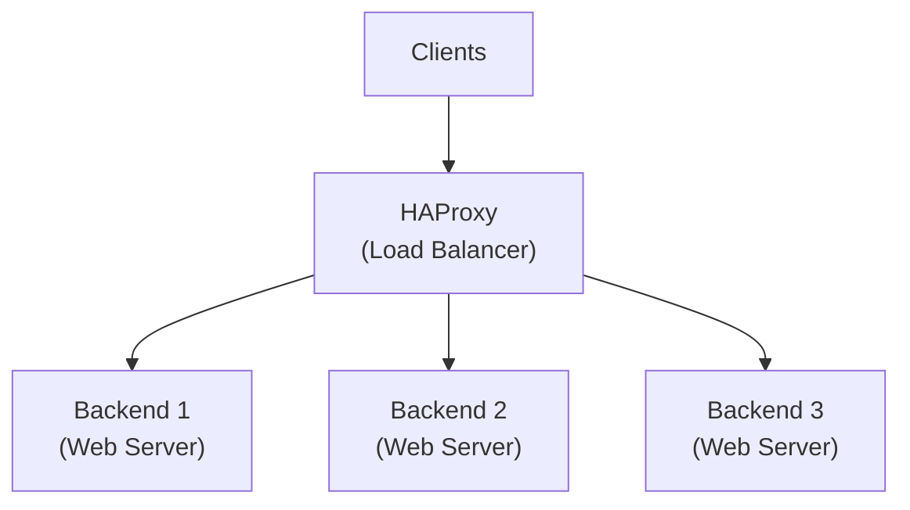

# How to Set Up a Load Balancer with HAProxy on Ubuntu

Author: [nawazdhandala](https://github.com/nawazdhandala)

Tags: Ubuntu, Linux, HAProxy, Load Balancing, High Availability, DevOps

Description: Configure HAProxy on Ubuntu as a high-performance load balancer with health checks, SSL termination, and advanced routing rules.

---

## Introduction

Load balancing is a critical component of modern infrastructure, distributing incoming traffic across multiple backend servers to ensure high availability, reliability, and optimal performance. HAProxy (High Availability Proxy) is one of the most popular and battle-tested open-source load balancers, trusted by companies like GitHub, Stack Overflow, and Twitter to handle millions of connections.

In this comprehensive guide, you will learn how to set up HAProxy on Ubuntu as a powerful load balancer. We will cover everything from basic installation to advanced configurations including health checks, SSL termination, sticky sessions, and the stats dashboard.

## Prerequisites

Before we begin, ensure you have:

- Ubuntu 22.04 or 24.04 LTS server with root or sudo access
- At least two backend servers to load balance (we will use web servers as examples)
- Basic understanding of networking concepts
- Domain name (optional, for SSL configuration)

## Understanding HAProxy Architecture

HAProxy operates as a reverse proxy that sits between clients and your backend servers. Here is a conceptual overview:



HAProxy configuration consists of four main sections:
- **global**: Process-wide settings
- **defaults**: Default parameters for all other sections
- **frontend**: Defines how requests are forwarded to backends
- **backend**: Defines the pool of servers that handle requests

## Installing HAProxy on Ubuntu

First, let us update the system and install HAProxy from the official Ubuntu repositories.

### Update system packages and install HAProxy
```bash
sudo apt update && sudo apt upgrade -y
sudo apt install haproxy -y
```

### Verify the installation by checking the version
```bash
haproxy -v
```

You should see output similar to:
```
HAProxy version 2.8.x-xxxxxx-xx
```

### Enable HAProxy to start on boot
```bash
sudo systemctl enable haproxy
```

### Check the default HAProxy status
```bash
sudo systemctl status haproxy
```

## Basic HAProxy Configuration

The main HAProxy configuration file is located at `/etc/haproxy/haproxy.cfg`. Before making changes, create a backup of the original configuration.

### Backup the original configuration file
```bash
sudo cp /etc/haproxy/haproxy.cfg /etc/haproxy/haproxy.cfg.backup
```

Now, let us create a basic load balancer configuration. This example assumes you have two web servers running on ports 8080 and 8081.

### Open the configuration file for editing
```bash
sudo nano /etc/haproxy/haproxy.cfg
```

### Basic HAProxy configuration with global and defaults sections
```haproxy
# Global settings apply to the HAProxy process itself
global
    # Run HAProxy as a daemon in the background
    daemon

    # Maximum number of concurrent connections across all frontends
    maxconn 50000

    # User and group to run HAProxy as (for security)
    user haproxy
    group haproxy

    # Logging configuration - send logs to local syslog
    log /dev/log local0
    log /dev/log local1 notice

    # Location of the chroot jail for added security
    chroot /var/lib/haproxy

    # Stats socket for runtime API access
    stats socket /run/haproxy/admin.sock mode 660 level admin
    stats timeout 30s

# Default settings inherited by all frontend and backend sections
defaults
    # Use HTTP mode (alternative is TCP mode)
    mode http

    # Enable HTTP logging format
    log global
    option httplog

    # Log null connections (connections with no data)
    option dontlognull

    # Connection timeouts
    timeout connect 5s      # Time to establish connection to backend
    timeout client 30s      # Inactivity timeout for client
    timeout server 30s      # Inactivity timeout for server

    # Number of retries on connection failure
    retries 3

    # Redispatch to another server if connection fails
    option redispatch
```

## Configuring Frontend and Backend

The frontend section defines how HAProxy accepts incoming connections, while the backend section specifies the pool of servers to handle requests.

### Add frontend configuration to accept HTTP traffic on port 80
```haproxy
# Frontend section - accepts incoming client connections
frontend http_front
    # Bind to all interfaces on port 80
    bind *:80

    # Set the default backend for incoming requests
    default_backend http_back

    # Add X-Forwarded-For header to preserve client IP
    option forwardfor

    # Enable HTTP connection closing after each request
    option http-server-close

    # Add custom header to identify the load balancer
    http-request add-header X-Load-Balancer haproxy
```

### Add backend configuration with your web servers
```haproxy
# Backend section - pool of servers handling requests
backend http_back
    # Use round-robin load balancing algorithm
    balance roundrobin

    # Cookie-based session persistence
    cookie SERVERID insert indirect nocache

    # Define backend servers with health checks
    # Format: server <name> <address>:<port> [options]
    server web1 192.168.1.101:8080 check cookie web1
    server web2 192.168.1.102:8080 check cookie web2
    server web3 192.168.1.103:8080 check cookie web3
```

### Validate the configuration before applying
```bash
sudo haproxy -c -f /etc/haproxy/haproxy.cfg
```

If the configuration is valid, you will see:
```
Configuration file is valid
```

### Restart HAProxy to apply the new configuration
```bash
sudo systemctl restart haproxy
```

## Load Balancing Algorithms

HAProxy supports several load balancing algorithms. Choose the one that best fits your use case.

### Round Robin - Distributes requests sequentially across servers
```haproxy
backend http_back
    # Each server receives requests in turn
    # Best for servers with equal capacity
    balance roundrobin

    server web1 192.168.1.101:8080 check
    server web2 192.168.1.102:8080 check
    server web3 192.168.1.103:8080 check
```

### Least Connections - Sends requests to the server with fewest active connections
```haproxy
backend http_back
    # Ideal for varying request processing times
    # Prevents overloading slower servers
    balance leastconn

    server web1 192.168.1.101:8080 check
    server web2 192.168.1.102:8080 check
    server web3 192.168.1.103:8080 check
```

### Source IP Hash - Routes requests from the same client IP to the same server
```haproxy
backend http_back
    # Ensures session persistence based on client IP
    # Useful when cookies are not available
    balance source

    # Hash type can be consistent for better distribution during server changes
    hash-type consistent

    server web1 192.168.1.101:8080 check
    server web2 192.168.1.102:8080 check
    server web3 192.168.1.103:8080 check
```

### URI Hash - Routes based on the request URI
```haproxy
backend http_back
    # Same URI always goes to the same server
    # Useful for caching scenarios
    balance uri

    server web1 192.168.1.101:8080 check
    server web2 192.168.1.102:8080 check
    server web3 192.168.1.103:8080 check
```

### Weighted Round Robin - Distributes based on server capacity
```haproxy
backend http_back
    balance roundrobin

    # Server weights determine distribution ratio
    # web1 handles 50% of traffic, web2 handles 30%, web3 handles 20%
    server web1 192.168.1.101:8080 weight 50 check
    server web2 192.168.1.102:8080 weight 30 check
    server web3 192.168.1.103:8080 weight 20 check
```

## Health Checks Configuration

Health checks are essential for detecting failed servers and removing them from the pool. HAProxy supports both basic and advanced health checks.

### Basic TCP health check (default when using 'check' option)
```haproxy
backend http_back
    balance roundrobin

    # 'check' enables basic TCP connect health check
    # Default interval is 2 seconds
    server web1 192.168.1.101:8080 check
    server web2 192.168.1.102:8080 check
```

### HTTP health check with custom endpoint
```haproxy
backend http_back
    balance roundrobin

    # Enable HTTP health checks
    option httpchk

    # Check specific endpoint and expect HTTP 200 response
    http-check send meth GET uri /health
    http-check expect status 200

    # Check every 5 seconds, consider server down after 3 failures
    # Consider server up after 2 successful checks
    server web1 192.168.1.101:8080 check inter 5s fall 3 rise 2
    server web2 192.168.1.102:8080 check inter 5s fall 3 rise 2
```

### Advanced HTTP health check with custom headers and body validation
```haproxy
backend http_back
    balance roundrobin

    option httpchk

    # Send GET request to /health with custom Host header
    http-check send meth GET uri /health hdr Host www.example.com

    # Expect 2xx or 3xx status codes
    http-check expect status 200-399

    # Or check for specific string in response body
    # http-check expect string "healthy"

    # Configure check timeouts
    timeout check 3s

    server web1 192.168.1.101:8080 check inter 10s fall 3 rise 2
    server web2 192.168.1.102:8080 check inter 10s fall 3 rise 2
```

### TCP health check with specific port
```haproxy
backend mysql_back
    mode tcp
    balance leastconn

    # Check on a different port than the service port
    # Useful when health check runs on separate port
    server mysql1 192.168.1.101:3306 check port 9200 inter 5s
    server mysql2 192.168.1.102:3306 check port 9200 inter 5s
```

### Agent health check for dynamic weight adjustment
```haproxy
backend http_back
    balance roundrobin

    # Agent check allows external script to control server state
    # Agent can return: ready, drain, maint, down, up, or weight percentage
    server web1 192.168.1.101:8080 check agent-check agent-port 8888 inter 5s
    server web2 192.168.1.102:8080 check agent-check agent-port 8888 inter 5s
```

## SSL/TLS Termination

SSL termination at the load balancer offloads encryption overhead from backend servers and simplifies certificate management.

### Generate a self-signed certificate for testing (use Let's Encrypt for production)
```bash
# Create directory for SSL certificates
sudo mkdir -p /etc/haproxy/certs

# Generate self-signed certificate and key
sudo openssl req -x509 -nodes -days 365 -newkey rsa:2048 \
    -keyout /etc/haproxy/certs/example.key \
    -out /etc/haproxy/certs/example.crt \
    -subj "/CN=example.com"

# Combine certificate and key into a single PEM file (required by HAProxy)
sudo cat /etc/haproxy/certs/example.crt /etc/haproxy/certs/example.key \
    | sudo tee /etc/haproxy/certs/example.pem > /dev/null

# Set proper permissions
sudo chmod 600 /etc/haproxy/certs/example.pem
```

### Frontend configuration with SSL termination
```haproxy
frontend https_front
    # Bind to port 443 with SSL using the certificate
    bind *:443 ssl crt /etc/haproxy/certs/example.pem

    # Redirect HTTP to HTTPS
    bind *:80
    http-request redirect scheme https unless { ssl_fc }

    # Add security headers
    http-response set-header Strict-Transport-Security "max-age=31536000; includeSubDomains"

    # Forward client's original protocol to backend
    http-request set-header X-Forwarded-Proto https if { ssl_fc }
    http-request set-header X-Forwarded-Proto http unless { ssl_fc }

    # Preserve original client IP
    option forwardfor

    default_backend http_back
```

### Advanced SSL configuration with modern cipher suites
```haproxy
global
    # SSL/TLS tuning
    ssl-default-bind-ciphers ECDHE-ECDSA-AES128-GCM-SHA256:ECDHE-RSA-AES128-GCM-SHA256:ECDHE-ECDSA-AES256-GCM-SHA384:ECDHE-RSA-AES256-GCM-SHA384
    ssl-default-bind-ciphersuites TLS_AES_128_GCM_SHA256:TLS_AES_256_GCM_SHA384:TLS_CHACHA20_POLY1305_SHA256
    ssl-default-bind-options ssl-min-ver TLSv1.2 no-tls-tickets

    # Enable SSL session caching for performance
    tune.ssl.default-dh-param 2048

frontend https_front
    # Enable HTTP/2 for better performance
    bind *:443 ssl crt /etc/haproxy/certs/example.pem alpn h2,http/1.1

    # OCSP stapling for faster SSL handshakes
    # bind *:443 ssl crt /etc/haproxy/certs/example.pem alpn h2,http/1.1 ocsp-update on

    default_backend http_back
```

### SSL passthrough for end-to-end encryption
```haproxy
frontend tcp_front
    # TCP mode for SSL passthrough
    mode tcp
    bind *:443

    # Use TCP content inspection to route based on SNI
    tcp-request inspect-delay 5s
    tcp-request content accept if { req_ssl_hello_type 1 }

    # Route to appropriate backend based on SNI hostname
    use_backend web1_backend if { req_ssl_sni -i web1.example.com }
    use_backend web2_backend if { req_ssl_sni -i web2.example.com }

    default_backend default_ssl_backend

backend default_ssl_backend
    mode tcp
    server web1 192.168.1.101:443 check
```

### Using Let's Encrypt certificates with Certbot
```bash
# Install Certbot
sudo apt install certbot -y

# Obtain certificate (HAProxy must be stopped temporarily)
sudo systemctl stop haproxy
sudo certbot certonly --standalone -d example.com -d www.example.com

# Combine fullchain and private key for HAProxy
sudo cat /etc/letsencrypt/live/example.com/fullchain.pem \
    /etc/letsencrypt/live/example.com/privkey.pem \
    | sudo tee /etc/haproxy/certs/example.com.pem > /dev/null

sudo chmod 600 /etc/haproxy/certs/example.com.pem
sudo systemctl start haproxy
```

### Automated certificate renewal script
```bash
#!/bin/bash
# Save as /etc/haproxy/renew-cert.sh

DOMAIN="example.com"
HAPROXY_CERT="/etc/haproxy/certs/${DOMAIN}.pem"
LE_CERT_DIR="/etc/letsencrypt/live/${DOMAIN}"

# Renew certificate
certbot renew --quiet

# Combine renewed certificates
cat "${LE_CERT_DIR}/fullchain.pem" "${LE_CERT_DIR}/privkey.pem" > "${HAPROXY_CERT}"

# Reload HAProxy to pick up new certificate
systemctl reload haproxy
```

## Sticky Sessions (Session Persistence)

Sticky sessions ensure that requests from the same user are always directed to the same backend server, which is essential for applications that store session data locally.

### Cookie-based sticky sessions (recommended approach)
```haproxy
backend http_back
    balance roundrobin

    # Insert a cookie named SERVERID to track the backend server
    # indirect: do not add cookie if one is already present
    # nocache: prevent caching of responses containing the cookie
    cookie SERVERID insert indirect nocache

    # Each server needs a unique cookie value
    server web1 192.168.1.101:8080 check cookie s1
    server web2 192.168.1.102:8080 check cookie s2
    server web3 192.168.1.103:8080 check cookie s3
```

### Application cookie persistence (use existing session cookie)
```haproxy
backend http_back
    balance roundrobin

    # Use the application's existing session cookie (e.g., JSESSIONID)
    # prefix: add server identifier as prefix to existing cookie value
    cookie JSESSIONID prefix nocache

    server web1 192.168.1.101:8080 check cookie s1
    server web2 192.168.1.102:8080 check cookie s2
```

### Source IP-based persistence (when cookies are not available)
```haproxy
backend http_back
    # Use source IP hashing for persistence
    balance source

    # Use consistent hashing to minimize redistribution when servers change
    hash-type consistent

    server web1 192.168.1.101:8080 check
    server web2 192.168.1.102:8080 check
```

### Stick table for advanced persistence scenarios
```haproxy
backend http_back
    balance roundrobin

    # Create a stick table to store session mappings
    # Store source IP -> server mapping for 30 minutes
    stick-table type ip size 100k expire 30m

    # Stick on source IP address
    stick on src

    server web1 192.168.1.101:8080 check
    server web2 192.168.1.102:8080 check
```

### Stick table with cookie-based tracking
```haproxy
backend http_back
    balance roundrobin

    # Store based on session cookie value
    stick-table type string len 52 size 100k expire 30m

    # Extract session ID from cookie and stick on it
    stick store-response res.cook(PHPSESSID)
    stick match req.cook(PHPSESSID)

    server web1 192.168.1.101:8080 check
    server web2 192.168.1.102:8080 check
```

## HAProxy Stats Dashboard

The stats dashboard provides real-time visibility into HAProxy's operation, showing server health, traffic statistics, and connection details.

### Enable the stats dashboard with authentication
```haproxy
frontend stats
    # Bind stats dashboard to port 8404
    bind *:8404

    # Enable statistics reporting
    stats enable

    # Set the URI path for accessing stats
    stats uri /stats

    # Refresh stats page every 10 seconds
    stats refresh 10s

    # Require authentication to access stats
    stats auth admin:YourSecurePassword123

    # Enable admin mode to allow server management from the dashboard
    stats admin if TRUE

    # Hide HAProxy version for security
    stats hide-version

    # Set page title
    stats realm HAProxy\ Statistics
```

### Alternative: Stats as part of main frontend
```haproxy
frontend http_front
    bind *:80

    # Route stats requests to stats backend
    acl is_stats path_beg /haproxy-stats
    use_backend stats_backend if is_stats

    default_backend http_back

backend stats_backend
    stats enable
    stats uri /haproxy-stats
    stats refresh 5s
    stats auth admin:YourSecurePassword123
    stats admin if TRUE
```

### Expose stats via Unix socket for monitoring tools
```haproxy
global
    # Stats socket for external monitoring and automation
    stats socket /run/haproxy/admin.sock mode 660 level admin expose-fd listeners
    stats timeout 30s
```

### Query stats from command line using socat
```bash
# Install socat for socket communication
sudo apt install socat -y

# Get server status
echo "show stat" | sudo socat stdio /run/haproxy/admin.sock

# Get detailed info
echo "show info" | sudo socat stdio /run/haproxy/admin.sock

# Disable a server for maintenance
echo "disable server http_back/web1" | sudo socat stdio /run/haproxy/admin.sock

# Enable a server after maintenance
echo "enable server http_back/web1" | sudo socat stdio /run/haproxy/admin.sock

# Set server weight dynamically
echo "set server http_back/web1 weight 50" | sudo socat stdio /run/haproxy/admin.sock
```

## Advanced Routing with ACLs

Access Control Lists (ACLs) allow you to route traffic based on various request attributes.

### Route traffic based on URL path
```haproxy
frontend http_front
    bind *:80

    # Define ACLs for different paths
    acl is_api path_beg /api
    acl is_static path_beg /static /images /css /js
    acl is_admin path_beg /admin

    # Route to appropriate backends based on path
    use_backend api_backend if is_api
    use_backend static_backend if is_static
    use_backend admin_backend if is_admin

    default_backend http_back

backend api_backend
    balance leastconn
    server api1 192.168.1.111:8080 check
    server api2 192.168.1.112:8080 check

backend static_backend
    balance roundrobin
    server static1 192.168.1.121:80 check
    server static2 192.168.1.122:80 check

backend admin_backend
    balance roundrobin
    server admin1 192.168.1.131:8080 check
```

### Route based on HTTP headers
```haproxy
frontend http_front
    bind *:80

    # Route mobile users to mobile backend
    acl is_mobile hdr_sub(User-Agent) -i mobile android iphone

    # Route based on custom header
    acl is_premium hdr(X-Customer-Type) -i premium

    # Route based on Accept header for API versioning
    acl is_v2_api hdr(Accept) -i application/vnd.api.v2+json

    use_backend mobile_backend if is_mobile
    use_backend premium_backend if is_premium
    use_backend api_v2_backend if is_v2_api

    default_backend http_back
```

### Route based on hostname (virtual hosting)
```haproxy
frontend http_front
    bind *:80

    # Route based on Host header
    acl host_app1 hdr(host) -i app1.example.com
    acl host_app2 hdr(host) -i app2.example.com
    acl host_api hdr(host) -i api.example.com

    use_backend app1_backend if host_app1
    use_backend app2_backend if host_app2
    use_backend api_backend if host_api

    default_backend default_backend
```

### Rate limiting with stick tables
```haproxy
frontend http_front
    bind *:80

    # Track request rates per source IP
    stick-table type ip size 100k expire 30s store http_req_rate(10s)

    # Track current connection count
    tcp-request connection track-sc0 src

    # Deny if request rate exceeds 100 requests per 10 seconds
    acl rate_abuse sc0_http_req_rate gt 100
    http-request deny deny_status 429 if rate_abuse

    default_backend http_back
```

## Complete Production Configuration Example

Here is a complete, production-ready HAProxy configuration combining all the features we have covered.

### Full production configuration file
```haproxy
#---------------------------------------------------------------------
# Global settings
#---------------------------------------------------------------------
global
    log /dev/log local0
    log /dev/log local1 notice
    chroot /var/lib/haproxy
    stats socket /run/haproxy/admin.sock mode 660 level admin expose-fd listeners
    stats timeout 30s
    user haproxy
    group haproxy
    daemon
    maxconn 50000

    # SSL configuration
    ssl-default-bind-ciphers ECDHE-ECDSA-AES128-GCM-SHA256:ECDHE-RSA-AES128-GCM-SHA256:ECDHE-ECDSA-AES256-GCM-SHA384:ECDHE-RSA-AES256-GCM-SHA384
    ssl-default-bind-ciphersuites TLS_AES_128_GCM_SHA256:TLS_AES_256_GCM_SHA384:TLS_CHACHA20_POLY1305_SHA256
    ssl-default-bind-options ssl-min-ver TLSv1.2 no-tls-tickets
    tune.ssl.default-dh-param 2048

#---------------------------------------------------------------------
# Default settings
#---------------------------------------------------------------------
defaults
    mode http
    log global
    option httplog
    option dontlognull
    option http-server-close
    option forwardfor except 127.0.0.0/8
    option redispatch
    retries 3
    timeout http-request 10s
    timeout queue 1m
    timeout connect 5s
    timeout client 30s
    timeout server 30s
    timeout http-keep-alive 10s
    timeout check 5s
    maxconn 30000

    # Custom error pages (optional)
    errorfile 400 /etc/haproxy/errors/400.http
    errorfile 403 /etc/haproxy/errors/403.http
    errorfile 408 /etc/haproxy/errors/408.http
    errorfile 500 /etc/haproxy/errors/500.http
    errorfile 502 /etc/haproxy/errors/502.http
    errorfile 503 /etc/haproxy/errors/503.http
    errorfile 504 /etc/haproxy/errors/504.http

#---------------------------------------------------------------------
# Stats Dashboard
#---------------------------------------------------------------------
frontend stats
    bind *:8404
    stats enable
    stats uri /stats
    stats refresh 10s
    stats auth admin:YourSecurePassword123
    stats admin if TRUE
    stats hide-version

#---------------------------------------------------------------------
# Main HTTP/HTTPS Frontend
#---------------------------------------------------------------------
frontend http_https_front
    # HTTP binding - redirect to HTTPS
    bind *:80

    # HTTPS binding with SSL certificate
    bind *:443 ssl crt /etc/haproxy/certs/example.com.pem alpn h2,http/1.1

    # Security headers
    http-response set-header Strict-Transport-Security "max-age=31536000; includeSubDomains; preload"
    http-response set-header X-Frame-Options "SAMEORIGIN"
    http-response set-header X-Content-Type-Options "nosniff"
    http-response set-header X-XSS-Protection "1; mode=block"

    # Redirect HTTP to HTTPS
    http-request redirect scheme https code 301 unless { ssl_fc }

    # Forward original protocol and client IP
    http-request set-header X-Forwarded-Proto https if { ssl_fc }
    http-request set-header X-Real-IP %[src]

    # Rate limiting
    stick-table type ip size 100k expire 30s store http_req_rate(10s)
    tcp-request connection track-sc0 src
    acl rate_abuse sc0_http_req_rate gt 100
    http-request deny deny_status 429 if rate_abuse

    # Routing ACLs
    acl is_api path_beg /api
    acl is_static path_beg /static /assets
    acl is_websocket hdr(Upgrade) -i websocket

    # Route to appropriate backends
    use_backend api_backend if is_api
    use_backend static_backend if is_static
    use_backend websocket_backend if is_websocket

    default_backend web_backend

#---------------------------------------------------------------------
# Web Application Backend
#---------------------------------------------------------------------
backend web_backend
    balance roundrobin

    # Cookie-based session persistence
    cookie SERVERID insert indirect nocache

    # HTTP health checks
    option httpchk
    http-check send meth GET uri /health
    http-check expect status 200

    # Compression for better performance
    compression algo gzip
    compression type text/html text/plain text/css application/javascript application/json

    # Backend servers
    server web1 192.168.1.101:8080 check inter 5s fall 3 rise 2 cookie w1
    server web2 192.168.1.102:8080 check inter 5s fall 3 rise 2 cookie w2
    server web3 192.168.1.103:8080 check inter 5s fall 3 rise 2 cookie w3

    # Backup server (only used when all primary servers are down)
    server web_backup 192.168.1.199:8080 backup check

#---------------------------------------------------------------------
# API Backend
#---------------------------------------------------------------------
backend api_backend
    balance leastconn

    option httpchk
    http-check send meth GET uri /api/health
    http-check expect status 200

    # Higher timeout for API calls
    timeout server 60s

    server api1 192.168.1.111:8080 check inter 5s fall 3 rise 2 weight 100
    server api2 192.168.1.112:8080 check inter 5s fall 3 rise 2 weight 100

#---------------------------------------------------------------------
# Static Content Backend
#---------------------------------------------------------------------
backend static_backend
    balance roundrobin

    # Simple TCP health check is sufficient for static content
    server static1 192.168.1.121:80 check
    server static2 192.168.1.122:80 check

#---------------------------------------------------------------------
# WebSocket Backend
#---------------------------------------------------------------------
backend websocket_backend
    balance source

    # Longer timeouts for WebSocket connections
    timeout tunnel 1h
    timeout server 1h

    server ws1 192.168.1.131:8080 check
    server ws2 192.168.1.132:8080 check
```

## Logging and Monitoring

Proper logging is essential for troubleshooting and monitoring your load balancer.

### Configure rsyslog to capture HAProxy logs
```bash
# Create HAProxy log configuration for rsyslog
sudo tee /etc/rsyslog.d/49-haproxy.conf << 'EOF'
# Collect HAProxy logs
local0.* /var/log/haproxy/haproxy.log
local1.* /var/log/haproxy/haproxy-info.log

# Prevent duplicate logging
& stop
EOF

# Create log directory
sudo mkdir -p /var/log/haproxy

# Restart rsyslog to apply changes
sudo systemctl restart rsyslog
```

### Enable detailed HTTP logging format
```haproxy
defaults
    # Custom log format with detailed request information
    log-format "%ci:%cp [%tr] %ft %b/%s %TR/%Tw/%Tc/%Tr/%Ta %ST %B %CC %CS %tsc %ac/%fc/%bc/%sc/%rc %sq/%bq %hr %hs %{+Q}r"
```

### Log format field descriptions
```
# %ci - Client IP
# %cp - Client port
# %tr - Time request was accepted
# %ft - Frontend name
# %b  - Backend name
# %s  - Server name
# %TR - Time to receive full request from client
# %Tw - Time waiting in queue
# %Tc - Time to connect to server
# %Tr - Server response time
# %Ta - Total active time
# %ST - HTTP status code
# %B  - Bytes read from server
# %CC - Client cookie
# %CS - Server cookie
# %tsc - Termination state code
# %ac - Active connections
# %fc - Frontend connections
# %bc - Backend connections
# %sc - Server connections
# %rc - Retries
# %sq - Server queue
# %bq - Backend queue
# %hr - Request headers
# %hs - Response headers
# %r  - HTTP request
```

### Set up log rotation
```bash
# Create logrotate configuration for HAProxy
sudo tee /etc/logrotate.d/haproxy << 'EOF'
/var/log/haproxy/*.log {
    daily
    rotate 14
    missingok
    notifempty
    compress
    delaycompress
    sharedscripts
    postrotate
        /bin/kill -HUP $(cat /run/rsyslogd.pid 2>/dev/null) 2>/dev/null || true
    endscript
}
EOF
```

## Troubleshooting Common Issues

### Check HAProxy service status and recent logs
```bash
# Check service status
sudo systemctl status haproxy

# View recent logs
sudo journalctl -u haproxy -n 50 --no-pager

# Check HAProxy access logs
sudo tail -f /var/log/haproxy/haproxy.log
```

### Validate configuration syntax
```bash
# Check configuration for errors
sudo haproxy -c -f /etc/haproxy/haproxy.cfg

# Check with verbose output
sudo haproxy -c -f /etc/haproxy/haproxy.cfg -V
```

### Debug connection issues
```bash
# Check if HAProxy is listening on expected ports
sudo ss -tlnp | grep haproxy

# Test backend connectivity from HAProxy server
curl -v http://192.168.1.101:8080/health

# Check firewall rules
sudo ufw status
```

### Monitor real-time stats via socket
```bash
# Show backend server status
echo "show servers state" | sudo socat stdio /run/haproxy/admin.sock

# Show current sessions
echo "show sess" | sudo socat stdio /run/haproxy/admin.sock

# Show error counters
echo "show errors" | sudo socat stdio /run/haproxy/admin.sock
```

### Common configuration mistakes and fixes
```haproxy
# WRONG: Missing 'check' option means no health checks
server web1 192.168.1.101:8080

# CORRECT: Enable health checks
server web1 192.168.1.101:8080 check

# WRONG: Timeout values without units
timeout connect 5000

# CORRECT: Always include time units
timeout connect 5s

# WRONG: SSL without certificate
bind *:443 ssl

# CORRECT: SSL with certificate path
bind *:443 ssl crt /etc/haproxy/certs/example.pem
```

## Performance Tuning

Optimize HAProxy for high-traffic scenarios.

### Kernel tuning for high connection counts
```bash
# Add to /etc/sysctl.conf
sudo tee -a /etc/sysctl.conf << 'EOF'

# HAProxy performance tuning
net.core.somaxconn = 65535
net.ipv4.tcp_max_syn_backlog = 65535
net.core.netdev_max_backlog = 65535
net.ipv4.ip_local_port_range = 1024 65535
net.ipv4.tcp_tw_reuse = 1
net.ipv4.tcp_fin_timeout = 15
net.ipv4.tcp_keepalive_time = 300
net.ipv4.tcp_keepalive_probes = 5
net.ipv4.tcp_keepalive_intvl = 15
EOF

# Apply changes
sudo sysctl -p
```

### HAProxy global tuning parameters
```haproxy
global
    # Maximum connections (tune based on available memory)
    maxconn 100000

    # Number of processing threads (set to number of CPU cores)
    nbthread 4

    # CPU affinity for better cache utilization
    cpu-map auto:1/1-4 0-3

    # Spread load across all threads
    tune.bufsize 16384
    tune.maxrewrite 1024

    # Connection rate limiting
    tune.rcvbuf.client 33554432
    tune.rcvbuf.server 33554432
    tune.sndbuf.client 33554432
    tune.sndbuf.server 33554432
```

## Conclusion

You have now learned how to set up a comprehensive load balancing solution with HAProxy on Ubuntu. This guide covered:

- **Installation**: Setting up HAProxy from Ubuntu repositories
- **Basic Configuration**: Understanding global, defaults, frontend, and backend sections
- **Load Balancing Algorithms**: Round robin, least connections, source IP hash, and weighted distribution
- **Health Checks**: TCP, HTTP, and agent-based health monitoring
- **SSL Termination**: Configuring HTTPS with modern cipher suites
- **Sticky Sessions**: Cookie-based and IP-based session persistence
- **Stats Dashboard**: Real-time monitoring and server management
- **Advanced Routing**: URL-based, header-based, and hostname-based routing with ACLs
- **Logging and Monitoring**: Comprehensive logging setup with rsyslog
- **Performance Tuning**: Kernel and HAProxy optimizations for high traffic

HAProxy is an incredibly powerful tool that can handle millions of concurrent connections when properly configured. As your infrastructure grows, consider implementing HAProxy in a high-availability pair with keepalived for automatic failover.

For production deployments, always test your configuration thoroughly in a staging environment before rolling out changes. Use the stats dashboard and logging to monitor your load balancer's performance and quickly identify any issues.

## Additional Resources

- [HAProxy Official Documentation](http://docs.haproxy.org/)
- [HAProxy Configuration Manual](http://cbonte.github.io/haproxy-dconv/)
- [HAProxy Enterprise Features](https://www.haproxy.com/documentation/)
- [HAProxy Community Forums](https://discourse.haproxy.org/)
