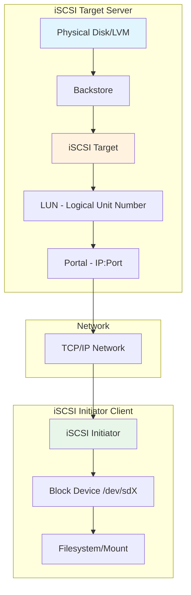
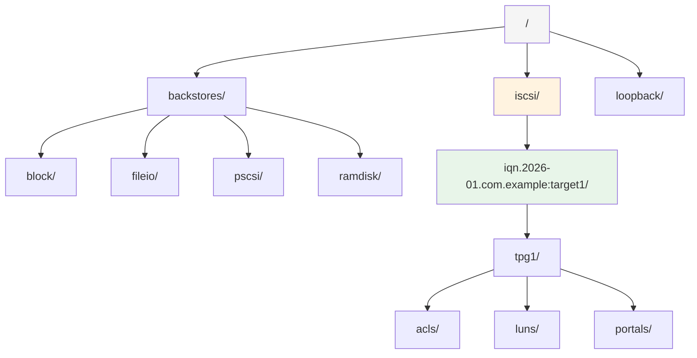
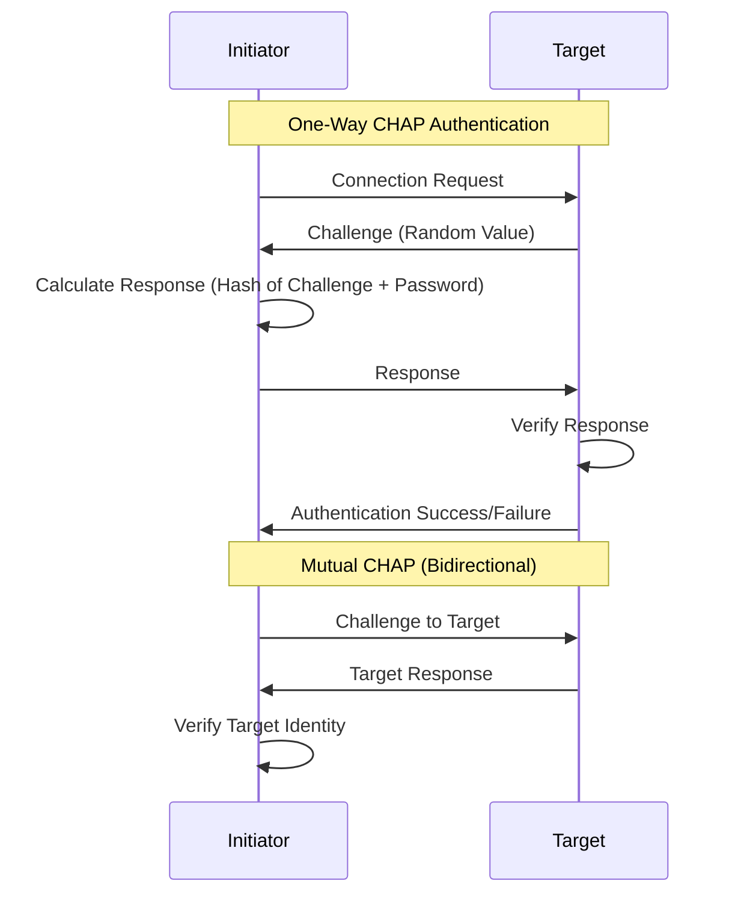
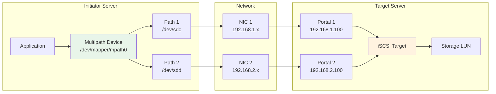

# How to Configure iSCSI Storage for Network Block Devices on Ubuntu

Author: [nawazdhandala](https://github.com/nawazdhandala)

Tags: Ubuntu, Linux, Storage, iSCSI, Networking, Infrastructure

Description: A complete guide to setting up iSCSI targets and initiators for network-attached block storage on Ubuntu.

---

## Introduction

iSCSI (Internet Small Computer Systems Interface) is a transport layer protocol that enables SCSI commands to be sent over standard TCP/IP networks. This technology allows you to create network-attached block storage devices, effectively turning any server with available storage into a SAN (Storage Area Network) without the need for expensive Fibre Channel infrastructure.

In this comprehensive guide, we will walk through the complete process of configuring iSCSI storage on Ubuntu, including:

- Setting up an iSCSI target (storage server)
- Configuring iSCSI initiators (clients)
- Implementing CHAP authentication for security
- Setting up multipath I/O for high availability and performance

## Understanding iSCSI Architecture

Before diving into the configuration, let's understand the key components of an iSCSI setup:



### Key Terminology

- **Target**: The server that provides the storage (exports LUNs)
- **Initiator**: The client that connects to and uses the storage
- **LUN (Logical Unit Number)**: A logical representation of a portion of storage
- **Portal**: The IP address and TCP port combination for iSCSI connections
- **IQN (iSCSI Qualified Name)**: Unique identifier for targets and initiators
- **CHAP (Challenge Handshake Authentication Protocol)**: Authentication mechanism for iSCSI

## Prerequisites

Before starting, ensure you have:

- Two Ubuntu servers (22.04 LTS or later recommended)
  - One for the iSCSI target (storage server)
  - One for the iSCSI initiator (client)
- Root or sudo access on both servers
- Network connectivity between the servers
- Available storage on the target server (physical disk, partition, or LVM volume)

## Part 1: Configuring the iSCSI Target Server

### Step 1: Install the Target Software

First, we need to install the `targetcli-fb` package which provides the modern Linux-IO (LIO) target framework.

```bash
# Update the package repository to ensure we get the latest package versions
sudo apt update

# Install targetcli-fb (the 'fb' stands for 'free branch' - the community-maintained version)
# This package provides the targetcli command-line interface for managing iSCSI targets
sudo apt install -y targetcli-fb
```

### Step 2: Prepare the Storage Backend

You can use various storage backends for iSCSI. We'll cover the three most common options:

#### Option A: Using a Block Device (Physical Disk or Partition)

```bash
# List available block devices to identify which disk to use
# Look for unused disks (those without mount points)
lsblk

# Example output might show /dev/sdb as an unused 100GB disk
# We'll use this disk as our iSCSI backend storage
```

#### Option B: Using an LVM Logical Volume (Recommended for Flexibility)

```bash
# Create a physical volume on the disk
# This initializes the disk for use with LVM
sudo pvcreate /dev/sdb

# Create a volume group named 'iscsi_vg' using the physical volume
# A volume group pools storage from one or more physical volumes
sudo vgcreate iscsi_vg /dev/sdb

# Create a logical volume of 50GB for iSCSI storage
# The -L flag specifies the size, -n specifies the name
sudo lvcreate -L 50G -n iscsi_lv iscsi_vg

# Verify the logical volume was created successfully
sudo lvdisplay /dev/iscsi_vg/iscsi_lv
```

#### Option C: Using a File-Based Backend (For Testing Only)

```bash
# Create a directory to store the backing file
sudo mkdir -p /var/lib/iscsi_disks

# Create a 10GB sparse file to use as the backing store
# Using dd with seek creates a sparse file that doesn't consume full disk space initially
# NOTE: File-based backends are slower and should only be used for testing
sudo dd if=/dev/zero of=/var/lib/iscsi_disks/disk01.img bs=1 count=0 seek=10G
```

### Step 3: Configure the iSCSI Target with targetcli

Now we'll use `targetcli` to configure the iSCSI target. This is an interactive shell that manages the LIO kernel target.

```bash
# Launch the targetcli interactive shell
# All commands below are executed within this shell
sudo targetcli
```

The following diagram illustrates the targetcli configuration hierarchy:



Within the targetcli shell, execute the following commands:

```bash
# Navigate to the backstores/block section
# This is where we define our storage backends
cd /backstores/block

# Create a backstore using our LVM logical volume
# Syntax: create <name> <device_path>
# 'disk0' is the name we're giving to this backstore
create disk0 /dev/iscsi_vg/iscsi_lv

# Alternatively, for a file-based backend:
# cd /backstores/fileio
# create disk0 /var/lib/iscsi_disks/disk01.img 10G

# Navigate to the iSCSI section to create our target
cd /iscsi

# Create a new iSCSI target with an IQN (iSCSI Qualified Name)
# IQN format: iqn.YYYY-MM.reverse_domain:unique_identifier
# Replace 'com.example' with your actual domain in reverse notation
create iqn.2026-01.com.example:storage.target1

# Navigate to the Target Portal Group (TPG) of our new target
# TPG1 is automatically created when we create the target
cd iqn.2026-01.com.example:storage.target1/tpg1

# Create a LUN (Logical Unit Number) using our backstore
# This exposes the backstore as LUN 0 to connected initiators
cd luns
create /backstores/block/disk0

# Configure the portal (network endpoint) for the target
# By default, it listens on all interfaces (0.0.0.0) on port 3260
cd ../portals

# Delete the default portal and create one bound to a specific IP
# Replace 192.168.1.100 with your target server's IP address
delete 0.0.0.0 3260
create 192.168.1.100 3260

# Create an ACL (Access Control List) entry for the initiator
# This controls which initiators can connect to this target
# Replace the IQN with your initiator's IQN (we'll get this later)
cd ../acls
create iqn.2026-01.com.example:initiator1

# Save the configuration and exit
cd /
saveconfig
exit
```

### Step 4: Enable and Start the Target Service

```bash
# Enable the target service to start automatically on boot
# This ensures your iSCSI target is available after system restarts
sudo systemctl enable rtslib-fb-targetctl

# Start the target service immediately
sudo systemctl start rtslib-fb-targetctl

# Verify the service is running correctly
sudo systemctl status rtslib-fb-targetctl
```

### Step 5: Configure the Firewall

```bash
# Allow iSCSI traffic through the firewall
# iSCSI uses TCP port 3260 by default
sudo ufw allow 3260/tcp

# If using multiple portals or custom ports, allow those as well
# sudo ufw allow <custom_port>/tcp

# Reload the firewall rules to apply changes
sudo ufw reload

# Verify the firewall rules
sudo ufw status
```

## Part 2: Configuring the iSCSI Initiator (Client)

### Step 1: Install the Initiator Software

```bash
# Update the package repository
sudo apt update

# Install the open-iscsi package
# This provides the iSCSI initiator tools and daemon
sudo apt install -y open-iscsi
```

### Step 2: Configure the Initiator Name

```bash
# View the current initiator name (IQN)
# This is the unique identifier for this initiator
cat /etc/iscsi/initiatorname.iscsi

# If you need to change the initiator name, edit the file
# The IQN should match the ACL you created on the target
sudo nano /etc/iscsi/initiatorname.iscsi
```

Set the initiator name to match the ACL on the target:

```bash
# The InitiatorName must match an ACL entry on the target server
# Format: iqn.YYYY-MM.reverse_domain:unique_identifier
InitiatorName=iqn.2026-01.com.example:initiator1
```

After changing the initiator name:

```bash
# Restart the iSCSI initiator service to apply the new name
sudo systemctl restart iscsid
```

### Step 3: Discover Available Targets

```bash
# Discover iSCSI targets on the target server
# Replace 192.168.1.100 with your target server's IP address
# The -t sendtargets option uses the SendTargets discovery method
sudo iscsiadm -m discovery -t sendtargets -p 192.168.1.100

# This will output discovered targets in the format:
# <portal_ip>:<port>,<tpg> <target_iqn>
# Example: 192.168.1.100:3260,1 iqn.2026-01.com.example:storage.target1
```

### Step 4: Connect to the Target

```bash
# Log in to the discovered target
# The -m node option specifies we're working with a node (target) record
# The -T option specifies the target IQN
# The -p option specifies the portal (IP:port)
# The --login option initiates the connection
sudo iscsiadm -m node \
    -T iqn.2026-01.com.example:storage.target1 \
    -p 192.168.1.100:3260 \
    --login

# Verify the connection was successful
# This shows all active iSCSI sessions
sudo iscsiadm -m session

# Check for the new block device
# iSCSI devices appear as regular SCSI disks (/dev/sdX)
lsblk
```

### Step 5: Configure Automatic Connection on Boot

```bash
# Set the target to automatically connect on system boot
# The -o update option modifies the node record
# node.startup = automatic means connect during system startup
sudo iscsiadm -m node \
    -T iqn.2026-01.com.example:storage.target1 \
    -p 192.168.1.100:3260 \
    -o update \
    -n node.startup \
    -v automatic

# Enable and start the iSCSI service
sudo systemctl enable iscsid open-iscsi
sudo systemctl start iscsid open-iscsi
```

### Step 6: Create a Filesystem and Mount the iSCSI Device

```bash
# Identify the new iSCSI disk device
# Look for the disk without partitions that matches the expected size
lsblk -o NAME,SIZE,TYPE,TRAN

# Create a partition table and partition on the iSCSI disk
# Replace /dev/sdc with your actual device name
# WARNING: This will erase all data on the device
sudo parted /dev/sdc mklabel gpt
sudo parted /dev/sdc mkpart primary ext4 0% 100%

# Format the partition with ext4 filesystem
# The -L flag sets a label for easy identification
sudo mkfs.ext4 -L iscsi_data /dev/sdc1

# Create a mount point directory
sudo mkdir -p /mnt/iscsi_storage

# Mount the filesystem
sudo mount /dev/sdc1 /mnt/iscsi_storage

# Verify the mount
df -h /mnt/iscsi_storage
```

### Step 7: Configure Persistent Mounting with /etc/fstab

```bash
# Get the UUID of the partition for reliable mounting
# Using UUID is more reliable than device names which can change
sudo blkid /dev/sdc1

# Add an entry to /etc/fstab for automatic mounting
# The _netdev option ensures the mount waits for network availability
# The nofail option prevents boot failures if the iSCSI target is unavailable
echo "UUID=<your-uuid-here> /mnt/iscsi_storage ext4 _netdev,nofail 0 0" | sudo tee -a /etc/fstab

# Test the fstab entry by unmounting and remounting
sudo umount /mnt/iscsi_storage
sudo mount -a

# Verify the mount is successful
df -h /mnt/iscsi_storage
```

## Part 3: Configuring CHAP Authentication

CHAP (Challenge Handshake Authentication Protocol) adds a layer of security to your iSCSI connections by requiring authentication before allowing access.



### Step 1: Configure CHAP on the Target

```bash
# Enter the targetcli shell
sudo targetcli

# Navigate to the ACL for the initiator
cd /iscsi/iqn.2026-01.com.example:storage.target1/tpg1/acls/iqn.2026-01.com.example:initiator1

# Set the CHAP username and password for one-way authentication
# The initiator must provide these credentials to connect
# Use a strong password (12+ characters with mixed case, numbers, symbols)
set auth userid=iscsi_user
set auth password=SecurePassword123!

# For mutual CHAP (bidirectional authentication), also set:
# This allows the initiator to verify the target's identity
set auth mutual_userid=target_user
set auth mutual_password=TargetSecure456!

# Save and exit
cd /
saveconfig
exit
```

### Step 2: Configure CHAP on the Initiator

```bash
# First, log out from the current session (if connected)
sudo iscsiadm -m node \
    -T iqn.2026-01.com.example:storage.target1 \
    -p 192.168.1.100:3260 \
    --logout

# Configure CHAP authentication credentials
# Set the authentication method to CHAP
sudo iscsiadm -m node \
    -T iqn.2026-01.com.example:storage.target1 \
    -p 192.168.1.100:3260 \
    -o update \
    -n node.session.auth.authmethod \
    -v CHAP

# Set the CHAP username (must match target configuration)
sudo iscsiadm -m node \
    -T iqn.2026-01.com.example:storage.target1 \
    -p 192.168.1.100:3260 \
    -o update \
    -n node.session.auth.username \
    -v iscsi_user

# Set the CHAP password (must match target configuration)
sudo iscsiadm -m node \
    -T iqn.2026-01.com.example:storage.target1 \
    -p 192.168.1.100:3260 \
    -o update \
    -n node.session.auth.password \
    -v SecurePassword123!

# For mutual CHAP, also configure the target credentials:
# Set the mutual (reverse) username
sudo iscsiadm -m node \
    -T iqn.2026-01.com.example:storage.target1 \
    -p 192.168.1.100:3260 \
    -o update \
    -n node.session.auth.username_in \
    -v target_user

# Set the mutual (reverse) password
sudo iscsiadm -m node \
    -T iqn.2026-01.com.example:storage.target1 \
    -p 192.168.1.100:3260 \
    -o update \
    -n node.session.auth.password_in \
    -v TargetSecure456!

# Log back in with CHAP authentication
sudo iscsiadm -m node \
    -T iqn.2026-01.com.example:storage.target1 \
    -p 192.168.1.100:3260 \
    --login
```

### Step 3: Verify CHAP Authentication

```bash
# Check the session details to verify CHAP is active
sudo iscsiadm -m session -P 3 | grep -A 5 "CHAP"

# The output should show the authentication status
# Look for "CHAP:" followed by the username
```

## Part 4: Configuring Multipath I/O for High Availability

Multipath I/O (MPIO) provides redundancy and load balancing for iSCSI connections by using multiple network paths to the same storage target.



### Step 1: Configure Multiple Portals on the Target

```bash
# Enter the targetcli shell on the target server
sudo targetcli

# Navigate to the portals section of your target
cd /iscsi/iqn.2026-01.com.example:storage.target1/tpg1/portals

# Add a second portal on a different network interface
# This assumes you have a second NIC with IP 192.168.2.100
create 192.168.2.100 3260

# Verify both portals are configured
ls

# Save and exit
cd /
saveconfig
exit
```

### Step 2: Install and Configure Multipath on the Initiator

```bash
# Install the multipath-tools package
# This provides the multipathd daemon and management tools
sudo apt install -y multipath-tools

# Enable and start the multipath daemon
sudo systemctl enable multipathd
sudo systemctl start multipathd
```

### Step 3: Configure the Multipath Settings

Create or edit the multipath configuration file:

```bash
# Create the multipath configuration file
sudo nano /etc/multipath.conf
```

Add the following configuration:

```bash
# /etc/multipath.conf - Multipath I/O Configuration
# This file configures how the system handles multiple paths to the same storage device

# Default settings applied to all multipath devices
defaults {
    # Use friendly names like /dev/mapper/mpath0 instead of WWID-based names
    user_friendly_names yes

    # Path grouping policy: group paths by priority
    # Options: failover, multibus, group_by_serial, group_by_prio, group_by_node_name
    path_grouping_policy multibus

    # Path selector algorithm: round-robin distributes I/O across all active paths
    path_selector "round-robin 0"

    # Failback policy: immediate means switch back to preferred path as soon as it recovers
    # Options: immediate, manual, followover, or a number (seconds to wait)
    failback immediate

    # Disable path checking during controller handover
    no_path_retry fail

    # How often to check path status (in seconds)
    polling_interval 5
}

# Blacklist section: exclude devices from multipath management
blacklist {
    # Exclude local disks (not iSCSI) from multipath
    # Adjust these patterns based on your local disk configuration
    devnode "^sd[a-b]$"

    # Exclude device mapper devices
    devnode "^dm-"

    # Exclude any devices not using iSCSI
    protocol ".*"
}

# Blacklist exceptions: include specific devices even if they match blacklist rules
blacklist_exceptions {
    # Include all iSCSI devices
    protocol "scsi:iscsi"
}

# Device-specific settings for iSCSI targets
devices {
    device {
        # Vendor string as reported by the device
        vendor "LIO-ORG"

        # Product string (wildcard matches all)
        product "*"

        # Use queue-length path selector for better load balancing
        path_selector "queue-length 0"

        # Number of I/O operations to send down a path before switching
        rr_min_io_rq 1

        # Path checker to use: tur (Test Unit Ready) is reliable for iSCSI
        path_checker tur

        # Number of times to retry a failed path before giving up
        no_path_retry 12

        # Hardware handler for this device type
        hardware_handler "0"
    }
}
```

### Step 4: Discover and Connect Multiple Paths

```bash
# Discover targets on the first portal
sudo iscsiadm -m discovery -t sendtargets -p 192.168.1.100

# Discover targets on the second portal
sudo iscsiadm -m discovery -t sendtargets -p 192.168.2.100

# Log in to all discovered portals for the target
# The --login option connects to all portals for this target
sudo iscsiadm -m node \
    -T iqn.2026-01.com.example:storage.target1 \
    --login

# Restart multipath daemon to detect the new paths
sudo systemctl restart multipathd
```

### Step 5: Verify Multipath Configuration

```bash
# Display the multipath topology
# This shows all multipath devices and their paths
sudo multipath -ll

# Example output:
# mpath0 (360000000000000001) dm-2 LIO-ORG,disk0
# size=50G features='0' hwhandler='0' wp=rw
# `-+- policy='queue-length 0' prio=1 status=active
#   |- 3:0:0:0 sdc 8:32 active ready running
#   `- 4:0:0:0 sdd 8:48 active ready running

# Check the status of all paths
sudo multipathd show paths

# Monitor multipath events in real-time
sudo multipathd show daemon
```

### Step 6: Use the Multipath Device

```bash
# The multipath device is available at /dev/mapper/mpath0
# (or the friendly name shown in multipath -ll output)

# Create a filesystem on the multipath device
# Always use the /dev/mapper/mpathX device, not the individual paths
sudo mkfs.ext4 -L iscsi_mpath /dev/mapper/mpath0

# Create mount point
sudo mkdir -p /mnt/iscsi_mpath

# Mount using the multipath device
sudo mount /dev/mapper/mpath0 /mnt/iscsi_mpath

# For persistent mounting, add to /etc/fstab
# Use the multipath device path, not individual disk paths
echo "/dev/mapper/mpath0 /mnt/iscsi_mpath ext4 _netdev,nofail 0 0" | sudo tee -a /etc/fstab
```

## Part 5: Performance Tuning and Best Practices

### Network Optimization

```bash
# Increase the network buffer sizes for better iSCSI performance
# Add these settings to /etc/sysctl.conf

# Maximum receive socket buffer size (16MB)
net.core.rmem_max = 16777216

# Maximum send socket buffer size (16MB)
net.core.wmem_max = 16777216

# TCP receive buffer sizes: min, default, max (4KB, 1MB, 16MB)
net.ipv4.tcp_rmem = 4096 1048576 16777216

# TCP send buffer sizes: min, default, max (4KB, 1MB, 16MB)
net.ipv4.tcp_wmem = 4096 1048576 16777216

# Apply the settings immediately without reboot
sudo sysctl -p
```

### iSCSI Timeout Configuration

```bash
# Configure iSCSI timeout values for better resilience
# These settings are on the initiator

# Set the login timeout (seconds to wait for login to complete)
sudo iscsiadm -m node \
    -T iqn.2026-01.com.example:storage.target1 \
    -p 192.168.1.100:3260 \
    -o update \
    -n node.conn[0].timeo.login_timeout \
    -v 30

# Set the logout timeout
sudo iscsiadm -m node \
    -T iqn.2026-01.com.example:storage.target1 \
    -p 192.168.1.100:3260 \
    -o update \
    -n node.conn[0].timeo.logout_timeout \
    -v 15

# Set the NOP-Out interval (keepalive)
# Sends periodic probes to detect path failures
sudo iscsiadm -m node \
    -T iqn.2026-01.com.example:storage.target1 \
    -p 192.168.1.100:3260 \
    -o update \
    -n node.conn[0].timeo.noop_out_interval \
    -v 5

# Set the NOP-Out timeout
sudo iscsiadm -m node \
    -T iqn.2026-01.com.example:storage.target1 \
    -p 192.168.1.100:3260 \
    -o update \
    -n node.conn[0].timeo.noop_out_timeout \
    -v 5
```

### Queue Depth Optimization

```bash
# Adjust the queue depth for better throughput
# Higher values can improve performance but use more memory

# Set the command queue depth (number of outstanding commands)
sudo iscsiadm -m node \
    -T iqn.2026-01.com.example:storage.target1 \
    -p 192.168.1.100:3260 \
    -o update \
    -n node.session.cmds_max \
    -v 128

# Set the queue depth per LUN
sudo iscsiadm -m node \
    -T iqn.2026-01.com.example:storage.target1 \
    -p 192.168.1.100:3260 \
    -o update \
    -n node.session.queue_depth \
    -v 32
```

## Part 6: Troubleshooting Common Issues

### Checking iSCSI Target Status

```bash
# On the target server, verify the configuration
sudo targetcli ls

# Check if the target service is running
sudo systemctl status rtslib-fb-targetctl

# View target-related kernel messages
sudo dmesg | grep -i iscsi

# Check listening ports
sudo ss -tlnp | grep 3260
```

### Checking iSCSI Initiator Status

```bash
# View all discovered targets
sudo iscsiadm -m node

# View current sessions with detailed information
# -P 3 provides the most detailed output
sudo iscsiadm -m session -P 3

# Check initiator service status
sudo systemctl status iscsid open-iscsi

# View iSCSI-related system logs
sudo journalctl -u iscsid -u open-iscsi --since "1 hour ago"
```

### Common Problems and Solutions

```bash
# Problem: Discovery returns no targets
# Solution: Check firewall, network connectivity, and target configuration
sudo ufw status                      # Check firewall on target
ping 192.168.1.100                   # Test network connectivity
sudo targetcli ls                    # Verify target is configured

# Problem: Login fails with authentication error
# Solution: Verify CHAP credentials match on both sides
sudo iscsiadm -m node -T <target> -p <portal> -o show | grep auth

# Problem: Connection drops frequently
# Solution: Check network stability and adjust timeouts
# Increase the replacement timeout to tolerate brief outages
sudo iscsiadm -m node \
    -T iqn.2026-01.com.example:storage.target1 \
    -p 192.168.1.100:3260 \
    -o update \
    -n node.session.timeo.replacement_timeout \
    -v 120

# Problem: Poor performance
# Solution: Check network configuration and enable jumbo frames if supported
sudo ip link set eth0 mtu 9000       # Enable jumbo frames (both ends)
```

### Disconnecting and Reconnecting

```bash
# Safely disconnect from a target
# First, unmount any filesystems using the iSCSI device
sudo umount /mnt/iscsi_storage

# Log out from the target
sudo iscsiadm -m node \
    -T iqn.2026-01.com.example:storage.target1 \
    -p 192.168.1.100:3260 \
    --logout

# Remove the target from the local database (optional)
# This removes all configuration for this target
sudo iscsiadm -m node \
    -T iqn.2026-01.com.example:storage.target1 \
    -p 192.168.1.100:3260 \
    -o delete

# Reconnect by running discovery and login again
sudo iscsiadm -m discovery -t sendtargets -p 192.168.1.100
sudo iscsiadm -m node \
    -T iqn.2026-01.com.example:storage.target1 \
    -p 192.168.1.100:3260 \
    --login
```

## Security Best Practices

1. **Always use CHAP authentication** - Never deploy iSCSI in production without authentication
2. **Use mutual CHAP** - Bidirectional authentication prevents man-in-the-middle attacks
3. **Isolate iSCSI traffic** - Use a dedicated VLAN or network segment for iSCSI
4. **Implement ACLs** - Only allow specific initiators to connect to targets
5. **Enable IPsec** - For additional encryption (especially over untrusted networks)
6. **Monitor and log** - Set up monitoring for failed authentication attempts
7. **Regular updates** - Keep both target and initiator systems patched

## Conclusion

You have now learned how to configure a complete iSCSI storage solution on Ubuntu, including:

- Setting up an iSCSI target server using targetcli
- Configuring iSCSI initiators to connect to targets
- Implementing CHAP authentication for secure connections
- Setting up multipath I/O for high availability and load balancing
- Performance tuning and troubleshooting techniques

iSCSI provides an excellent way to implement network-attached block storage without the complexity and cost of traditional Fibre Channel SANs. With proper configuration, including CHAP authentication and multipath I/O, you can build a reliable and performant storage infrastructure suitable for production environments.

## Additional Resources

- [Linux-IO Target Wiki](http://linux-iscsi.org/)
- [Ubuntu iSCSI Documentation](https://ubuntu.com/server/docs/service-iscsi)
- [Open-iSCSI Project](https://www.open-iscsi.com/)
- [Device Mapper Multipath Documentation](https://access.redhat.com/documentation/en-us/red_hat_enterprise_linux/8/html/configuring_device_mapper_multipath/index)
