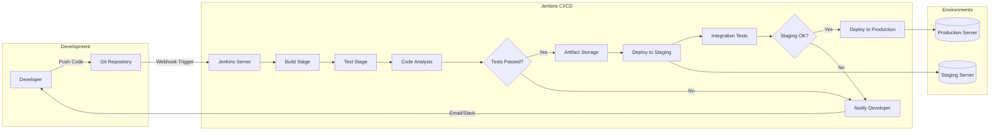
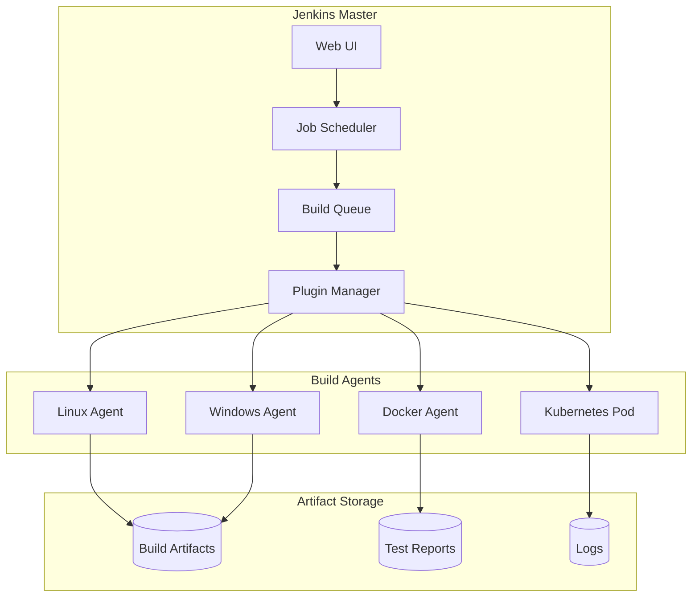
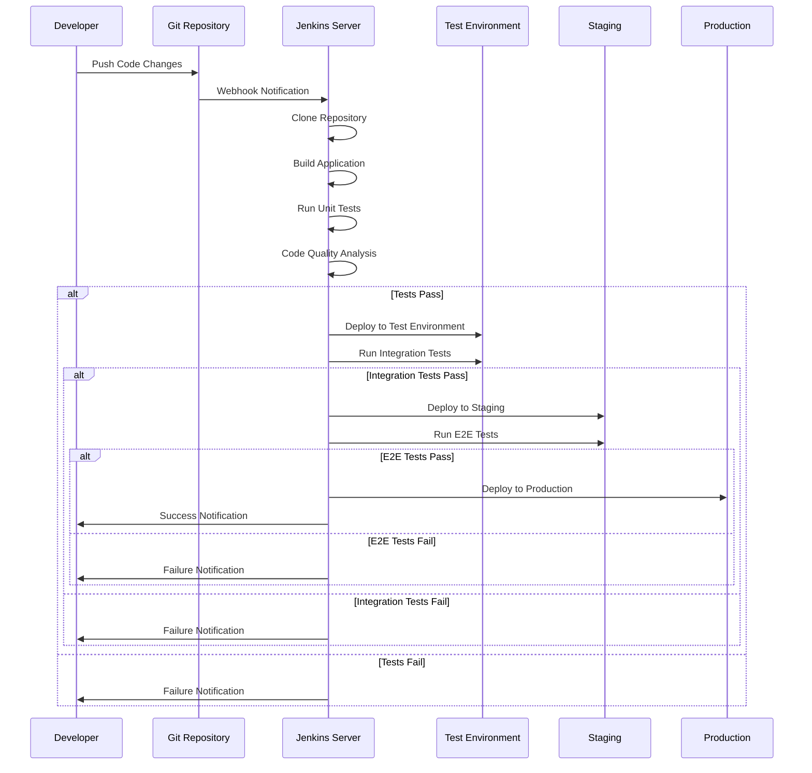
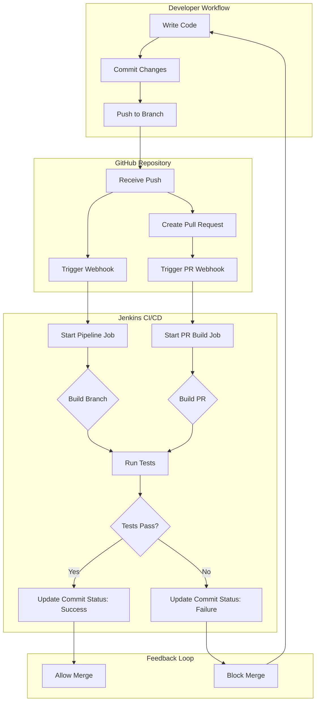
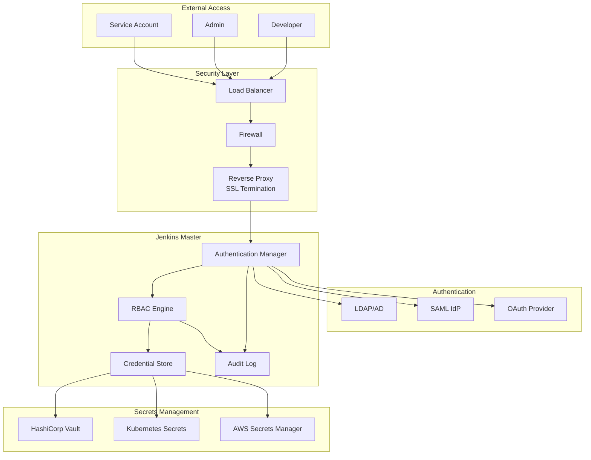
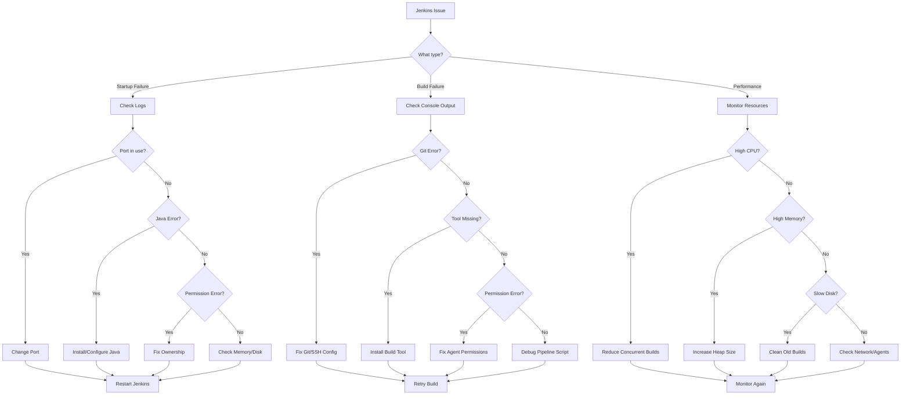

# How to Install and Configure Jenkins for CI/CD on Ubuntu

Author: [nawazdhandala](https://github.com/nawazdhandala)

Tags: Ubuntu, Linux, Jenkins, CI/CD, DevOps, Automation

Description: A complete guide to installing and configuring Jenkins for continuous integration and deployment on Ubuntu.

---

Jenkins is the leading open-source automation server that enables developers to build, test, and deploy their software reliably. This comprehensive guide will walk you through installing Jenkins on Ubuntu, configuring it for CI/CD workflows, integrating with Git repositories, and implementing security best practices.

## Table of Contents

1. [Understanding Jenkins and CI/CD](#understanding-jenkins-and-cicd)
2. [Prerequisites](#prerequisites)
3. [Installing Jenkins on Ubuntu](#installing-jenkins-on-ubuntu)
4. [Initial Jenkins Setup](#initial-jenkins-setup)
5. [Configuring Jenkins for CI/CD](#configuring-jenkins-for-cicd)
6. [Creating Your First Pipeline](#creating-your-first-pipeline)
7. [Git Repository Integration](#git-repository-integration)
8. [Advanced Pipeline Configuration](#advanced-pipeline-configuration)
9. [Security Best Practices](#security-best-practices)
10. [Monitoring and Maintenance](#monitoring-and-maintenance)
11. [Troubleshooting Common Issues](#troubleshooting-common-issues)

## Understanding Jenkins and CI/CD

Before diving into the installation, let's understand the CI/CD workflow and how Jenkins fits into it.

### CI/CD Pipeline Architecture

The following diagram illustrates a typical Jenkins CI/CD pipeline workflow:



### Jenkins Architecture Overview

This diagram shows the distributed architecture of Jenkins with master and agent nodes:



## Prerequisites

Before installing Jenkins, ensure your Ubuntu system meets the following requirements:

- Ubuntu 20.04 LTS, 22.04 LTS, or 24.04 LTS
- Minimum 2 GB RAM (4 GB recommended for production)
- Java Development Kit (JDK) 11 or 17
- Root or sudo access
- Stable network connection

### Verify your Ubuntu version using the following command:

```bash
# Display the current Ubuntu version and release information
# This helps ensure compatibility with Jenkins requirements
lsb_release -a
```

## Installing Jenkins on Ubuntu

### Step 1: Update System Packages

First, update your system to ensure all packages are current:

```bash
# Update the package list to get information about the newest versions
# of packages and their dependencies
sudo apt update

# Upgrade all installed packages to their latest versions
# The -y flag automatically confirms the upgrade
sudo apt upgrade -y
```

### Step 2: Install Java Development Kit

Jenkins requires Java to run. We'll install OpenJDK 17, which is the recommended version:

```bash
# Install OpenJDK 17 JDK package
# Jenkins requires Java Runtime Environment (JRE) at minimum,
# but JDK is recommended for building Java projects
sudo apt install openjdk-17-jdk -y

# Verify the Java installation by checking the version
# This should display "openjdk version 17.x.x" or similar
java -version

# Set JAVA_HOME environment variable for system-wide Java configuration
# This is required by many build tools and Jenkins plugins
echo 'export JAVA_HOME=/usr/lib/jvm/java-17-openjdk-amd64' | sudo tee -a /etc/profile.d/java.sh

# Apply the environment variable to the current session
source /etc/profile.d/java.sh

# Verify JAVA_HOME is set correctly
echo $JAVA_HOME
```

### Step 3: Add Jenkins Repository

Add the official Jenkins repository to ensure you get the latest stable version:

```bash
# Download and add the Jenkins GPG key for package verification
# This ensures packages are authentic and haven't been tampered with
curl -fsSL https://pkg.jenkins.io/debian-stable/jenkins.io-2023.key | sudo tee \
  /usr/share/keyrings/jenkins-keyring.asc > /dev/null

# Add the Jenkins apt repository to your system's software sources
# The signed-by option ensures only packages signed with the Jenkins key are accepted
echo deb [signed-by=/usr/share/keyrings/jenkins-keyring.asc] \
  https://pkg.jenkins.io/debian-stable binary/ | sudo tee \
  /etc/apt/sources.list.d/jenkins.list > /dev/null

# Update apt package index to include Jenkins packages
sudo apt update
```

### Step 4: Install Jenkins

Install Jenkins and start the service:

```bash
# Install Jenkins package from the official repository
sudo apt install jenkins -y

# Start the Jenkins service
# This initializes Jenkins and begins the setup process
sudo systemctl start jenkins

# Enable Jenkins to start automatically on system boot
# This ensures Jenkins remains available after server restarts
sudo systemctl enable jenkins

# Check the status of Jenkins service
# Look for "active (running)" in the output
sudo systemctl status jenkins
```

### Step 5: Configure Firewall

If you have UFW (Uncomplicated Firewall) enabled, allow Jenkins traffic:

```bash
# Allow incoming connections on port 8080 (default Jenkins port)
# This enables web browser access to the Jenkins UI
sudo ufw allow 8080

# Optionally, allow OpenSSH if you're accessing remotely
# This ensures you don't lose SSH access after enabling the firewall
sudo ufw allow OpenSSH

# Enable the firewall if not already active
sudo ufw enable

# Verify the firewall rules are in place
sudo ufw status
```

## Initial Jenkins Setup

### Step 1: Retrieve Initial Admin Password

When you first access Jenkins, you'll need the initial admin password:

```bash
# Display the initial admin password generated during installation
# This password is required for the first-time setup wizard
sudo cat /var/lib/jenkins/secrets/initialAdminPassword
```

### Step 2: Access Jenkins Web Interface

Open your web browser and navigate to:

```
http://your-server-ip:8080
```

Or if accessing locally:

```
http://localhost:8080
```

### Step 3: Complete Setup Wizard

Follow these steps in the web interface:

1. **Unlock Jenkins**: Paste the initial admin password
2. **Install Plugins**: Choose "Install suggested plugins" for a standard setup
3. **Create Admin User**: Set up your administrator account
4. **Configure Instance URL**: Set the Jenkins URL for external access

### Recommended Initial Plugins

After the initial setup, install these essential plugins for CI/CD:

```bash
# These plugins can be installed via Manage Jenkins > Plugins
# or using the Jenkins CLI

# Essential plugins for CI/CD workflows:
# - Pipeline: Core pipeline functionality
# - Git: Git repository integration
# - GitHub: GitHub webhook and authentication integration
# - Docker Pipeline: Docker build and push support
# - Blue Ocean: Modern UI for pipelines
# - Credentials Binding: Secure credential management
# - Email Extension: Advanced email notifications
# - Slack Notification: Slack integration for alerts
```

## Configuring Jenkins for CI/CD

### Jenkins Global Configuration

Navigate to "Manage Jenkins" > "System" to configure global settings:

```bash
# Configure Jenkins home directory location (default)
# This directory contains all Jenkins data including jobs, builds, and plugins
JENKINS_HOME=/var/lib/jenkins

# Configure Jenkins to run on a different port if needed
# Edit the Jenkins systemd service file
sudo systemctl edit jenkins

# Add these lines to change the port to 9090
# [Service]
# Environment="JENKINS_PORT=9090"

# Reload systemd and restart Jenkins to apply changes
sudo systemctl daemon-reload
sudo systemctl restart jenkins
```

### Configure JDK and Build Tools

Set up the Java Development Kit and other build tools:

```bash
# Navigate to: Manage Jenkins > Tools

# Configure JDK Installation:
# Name: JDK17
# JAVA_HOME: /usr/lib/jvm/java-17-openjdk-amd64

# Install Maven for Java projects
sudo apt install maven -y

# Verify Maven installation
mvn -version

# Install Node.js for JavaScript/TypeScript projects
curl -fsSL https://deb.nodesource.com/setup_20.x | sudo -E bash -
sudo apt install nodejs -y

# Verify Node.js and npm installation
node -v
npm -v

# Install Gradle (alternative to Maven)
sudo apt install gradle -y
gradle -version
```

### CI/CD Pipeline Flow

The following diagram shows the complete CI/CD flow with Jenkins:



## Creating Your First Pipeline

### Declarative Pipeline Syntax

Create a new Pipeline job and use the following Jenkinsfile:

```groovy
// Jenkinsfile - Declarative Pipeline Example
// This pipeline demonstrates a complete CI/CD workflow
// with build, test, and deployment stages

pipeline {
    // Define where the pipeline should run
    // 'any' means it can run on any available agent
    agent any

    // Environment variables available throughout the pipeline
    // These can be overridden at the stage level if needed
    environment {
        // Application name used in build artifacts and notifications
        APP_NAME = 'my-application'

        // Version derived from build number for traceability
        APP_VERSION = "1.0.${BUILD_NUMBER}"

        // Docker registry URL for container image storage
        DOCKER_REGISTRY = 'docker.io/mycompany'

        // Credential ID for Docker Hub authentication
        // This references credentials stored in Jenkins Credential Manager
        DOCKER_CREDENTIALS = credentials('docker-hub-credentials')
    }

    // Define when to discard old builds to save disk space
    options {
        // Keep only the last 10 builds
        buildDiscarder(logRotator(numToKeepStr: '10'))

        // Abort build if it takes longer than 1 hour
        timeout(time: 1, unit: 'HOURS')

        // Add timestamps to console output for debugging
        timestamps()

        // Prevent concurrent builds of the same job
        disableConcurrentBuilds()
    }

    // Build stages - each stage represents a phase in the CI/CD process
    stages {
        // Checkout stage - retrieve source code from version control
        stage('Checkout') {
            steps {
                // Clean workspace before checkout to ensure fresh build
                cleanWs()

                // Checkout code from the configured SCM (Git)
                checkout scm

                // Display the current commit for traceability
                sh 'git log -1 --oneline'
            }
        }

        // Build stage - compile the application
        stage('Build') {
            steps {
                // Echo stage information for logging
                echo "Building ${APP_NAME} version ${APP_VERSION}"

                // Run the build command (adjust based on your project)
                // For Maven projects:
                sh 'mvn clean compile -DskipTests'

                // For Node.js projects, use:
                // sh 'npm ci'
                // sh 'npm run build'

                // For Gradle projects, use:
                // sh './gradlew build -x test'
            }
        }

        // Test stage - run unit tests
        stage('Test') {
            // Run tests in parallel for faster feedback
            parallel {
                // Unit tests stage
                stage('Unit Tests') {
                    steps {
                        // Run unit tests with Maven
                        sh 'mvn test'
                    }
                    // Post-actions for this specific stage
                    post {
                        always {
                            // Publish JUnit test results for visibility
                            junit '**/target/surefire-reports/*.xml'
                        }
                    }
                }

                // Integration tests stage
                stage('Integration Tests') {
                    steps {
                        // Run integration tests (assuming they're in a separate profile)
                        sh 'mvn verify -P integration-tests'
                    }
                }
            }
        }

        // Code quality analysis stage
        stage('Code Analysis') {
            steps {
                // Run SonarQube analysis for code quality metrics
                // Requires SonarQube plugin and server configuration
                withSonarQubeEnv('SonarQube') {
                    sh 'mvn sonar:sonar'
                }
            }
        }

        // Package stage - create deployable artifacts
        stage('Package') {
            steps {
                // Package the application (skip tests as they've already run)
                sh 'mvn package -DskipTests'

                // Archive the built artifacts for later use
                archiveArtifacts artifacts: 'target/*.jar', fingerprint: true
            }
        }

        // Docker build stage - create container image
        stage('Docker Build') {
            steps {
                script {
                    // Build Docker image with application name and version tag
                    docker.build("${DOCKER_REGISTRY}/${APP_NAME}:${APP_VERSION}")

                    // Also tag as 'latest' for convenience
                    docker.build("${DOCKER_REGISTRY}/${APP_NAME}:latest")
                }
            }
        }

        // Docker push stage - upload image to registry
        stage('Docker Push') {
            steps {
                script {
                    // Authenticate with Docker registry using stored credentials
                    docker.withRegistry('https://docker.io', 'docker-hub-credentials') {
                        // Push both versioned and latest tags
                        docker.image("${DOCKER_REGISTRY}/${APP_NAME}:${APP_VERSION}").push()
                        docker.image("${DOCKER_REGISTRY}/${APP_NAME}:latest").push()
                    }
                }
            }
        }

        // Deploy to staging environment
        stage('Deploy to Staging') {
            // Only deploy if on the main branch
            when {
                branch 'main'
            }
            steps {
                // Deploy using kubectl (requires Kubernetes plugin)
                sh """
                    kubectl set image deployment/${APP_NAME} \
                        ${APP_NAME}=${DOCKER_REGISTRY}/${APP_NAME}:${APP_VERSION} \
                        --namespace=staging
                """

                // Wait for rollout to complete
                sh 'kubectl rollout status deployment/${APP_NAME} --namespace=staging --timeout=300s'
            }
        }

        // Deploy to production (requires manual approval)
        stage('Deploy to Production') {
            when {
                branch 'main'
            }
            steps {
                // Request manual approval before production deployment
                input message: 'Deploy to production?', ok: 'Deploy'

                // Deploy to production namespace
                sh """
                    kubectl set image deployment/${APP_NAME} \
                        ${APP_NAME}=${DOCKER_REGISTRY}/${APP_NAME}:${APP_VERSION} \
                        --namespace=production
                """

                // Wait for production rollout
                sh 'kubectl rollout status deployment/${APP_NAME} --namespace=production --timeout=300s'
            }
        }
    }

    // Post-build actions - run regardless of build result
    post {
        // Always run these actions
        always {
            // Clean up workspace to free disk space
            cleanWs()
        }

        // Run only on successful build
        success {
            // Send success notification
            slackSend(
                color: 'good',
                message: "SUCCESS: ${APP_NAME} v${APP_VERSION} deployed successfully!"
            )
        }

        // Run only on failed build
        failure {
            // Send failure notification with build URL for debugging
            slackSend(
                color: 'danger',
                message: "FAILURE: ${APP_NAME} build failed. Check: ${BUILD_URL}"
            )

            // Send email notification to the development team
            emailext(
                subject: "Build Failed: ${APP_NAME} #${BUILD_NUMBER}",
                body: "The build has failed. Please check the console output at ${BUILD_URL}",
                to: 'dev-team@company.com'
            )
        }

        // Run when build becomes unstable (e.g., test failures)
        unstable {
            slackSend(
                color: 'warning',
                message: "UNSTABLE: ${APP_NAME} build has test failures"
            )
        }
    }
}
```

### Scripted Pipeline Example

For more complex logic, use scripted pipeline syntax:

```groovy
// Jenkinsfile - Scripted Pipeline Example
// Provides more flexibility for complex build logic

// Define the node where the pipeline will run
node('linux') {
    // Wrap the entire pipeline in a try-catch for error handling
    try {
        // Stage 1: Checkout source code
        stage('Checkout') {
            // Delete workspace contents to ensure clean build
            deleteDir()

            // Clone the repository
            checkout scm

            // Store the git commit hash for later use
            env.GIT_COMMIT = sh(
                script: 'git rev-parse HEAD',
                returnStdout: true
            ).trim()

            echo "Building commit: ${env.GIT_COMMIT}"
        }

        // Stage 2: Build based on project type
        stage('Build') {
            // Detect project type and build accordingly
            if (fileExists('pom.xml')) {
                // Maven project
                sh 'mvn clean compile -DskipTests'
            } else if (fileExists('package.json')) {
                // Node.js project
                sh 'npm ci'
                sh 'npm run build'
            } else if (fileExists('build.gradle')) {
                // Gradle project
                sh './gradlew build -x test'
            } else {
                error 'Unknown project type - no build file found'
            }
        }

        // Stage 3: Run tests with retry logic
        stage('Test') {
            // Retry tests up to 3 times in case of flaky tests
            retry(3) {
                timeout(time: 30, unit: 'MINUTES') {
                    if (fileExists('pom.xml')) {
                        sh 'mvn test'
                        // Collect test results
                        junit '**/target/surefire-reports/*.xml'
                    } else if (fileExists('package.json')) {
                        sh 'npm test'
                        // Collect coverage report if available
                        if (fileExists('coverage/lcov.info')) {
                            publishCoverage adapters: [
                                coberturaAdapter('coverage/cobertura.xml')
                            ]
                        }
                    }
                }
            }
        }

        // Stage 4: Conditional deployment based on branch
        stage('Deploy') {
            // Get current branch name
            def branchName = env.BRANCH_NAME ?: sh(
                script: 'git rev-parse --abbrev-ref HEAD',
                returnStdout: true
            ).trim()

            // Deploy based on branch
            switch(branchName) {
                case 'main':
                case 'master':
                    // Production deployment with approval
                    input message: 'Deploy to production?', ok: 'Deploy'
                    deployTo('production')
                    break
                case 'develop':
                    // Automatic staging deployment
                    deployTo('staging')
                    break
                case ~/^feature\/.*/:
                    // Deploy feature branches to development
                    deployTo('development')
                    break
                default:
                    echo "No deployment configured for branch: ${branchName}"
            }
        }

        // Mark build as successful
        currentBuild.result = 'SUCCESS'

    } catch (Exception e) {
        // Mark build as failed
        currentBuild.result = 'FAILURE'

        // Log the error
        echo "Build failed with error: ${e.getMessage()}"

        // Re-throw to fail the build
        throw e

    } finally {
        // Always clean up, regardless of build result
        stage('Cleanup') {
            // Clean Docker images to save disk space
            sh 'docker system prune -f || true'

            // Send notification
            notifyBuildResult()
        }
    }
}

// Helper function to deploy to specified environment
def deployTo(String environment) {
    echo "Deploying to ${environment}..."

    // Use withCredentials to securely access deployment credentials
    withCredentials([
        usernamePassword(
            credentialsId: "${environment}-deploy-creds",
            usernameVariable: 'DEPLOY_USER',
            passwordVariable: 'DEPLOY_PASS'
        )
    ]) {
        sh """
            # Deploy using your preferred method
            # This example uses a simple SSH deployment
            sshpass -p "\${DEPLOY_PASS}" ssh \${DEPLOY_USER}@${environment}.example.com \
                "cd /app && docker-compose pull && docker-compose up -d"
        """
    }
}

// Helper function to send build notifications
def notifyBuildResult() {
    def color = currentBuild.result == 'SUCCESS' ? 'good' : 'danger'
    def status = currentBuild.result ?: 'SUCCESS'

    // Send Slack notification
    slackSend(
        color: color,
        message: "${status}: Job '${env.JOB_NAME}' #${env.BUILD_NUMBER}\n${env.BUILD_URL}"
    )
}
```

## Git Repository Integration

### Configure Git Credentials

Set up Git credentials for secure repository access:

```bash
# Generate SSH key for Jenkins (run as jenkins user)
sudo -u jenkins ssh-keygen -t ed25519 -C "jenkins@example.com" -f /var/lib/jenkins/.ssh/id_ed25519 -N ""

# Display the public key to add to your Git provider (GitHub, GitLab, etc.)
sudo cat /var/lib/jenkins/.ssh/id_ed25519.pub

# Configure SSH for Git operations (create config file)
sudo -u jenkins bash -c 'cat > /var/lib/jenkins/.ssh/config << EOF
Host github.com
    HostName github.com
    User git
    IdentityFile /var/lib/jenkins/.ssh/id_ed25519
    StrictHostKeyChecking no

Host gitlab.com
    HostName gitlab.com
    User git
    IdentityFile /var/lib/jenkins/.ssh/id_ed25519
    StrictHostKeyChecking no
EOF'

# Set proper permissions on SSH directory and files
sudo chmod 700 /var/lib/jenkins/.ssh
sudo chmod 600 /var/lib/jenkins/.ssh/id_ed25519
sudo chmod 644 /var/lib/jenkins/.ssh/id_ed25519.pub
sudo chmod 600 /var/lib/jenkins/.ssh/config
sudo chown -R jenkins:jenkins /var/lib/jenkins/.ssh
```

### GitHub Webhook Configuration

Configure GitHub to trigger Jenkins builds on code changes:

```bash
# In your GitHub repository settings:
# 1. Go to Settings > Webhooks > Add webhook
# 2. Set Payload URL to: http://your-jenkins-url:8080/github-webhook/
# 3. Set Content type to: application/json
# 4. Select events: Push events, Pull request events
# 5. Save the webhook

# For Jenkins, configure the GitHub plugin:
# 1. Go to Manage Jenkins > System
# 2. Find "GitHub" section
# 3. Add GitHub Server with API URL: https://api.github.com
# 4. Create a Personal Access Token with required scopes:
#    - repo (full control)
#    - admin:repo_hook (manage webhooks)
#    - admin:org_hook (if using organization repositories)
```

### Git Integration Workflow

The following diagram shows how Git integrates with Jenkins:



### Multibranch Pipeline Configuration

Create a multibranch pipeline for automatic branch detection:

```groovy
// Jenkinsfile for Multibranch Pipeline
// This file should be placed in the root of your repository

pipeline {
    agent any

    // Trigger builds on push and periodically scan for new branches
    triggers {
        // Poll SCM every 5 minutes for changes
        pollSCM('H/5 * * * *')
    }

    // Define different behaviors based on branch name
    stages {
        stage('Determine Environment') {
            steps {
                script {
                    // Set environment based on branch name
                    // BRANCH_NAME is automatically set by multibranch pipeline
                    if (env.BRANCH_NAME == 'main' || env.BRANCH_NAME == 'master') {
                        env.DEPLOY_ENV = 'production'
                        env.DEPLOY_ENABLED = 'true'
                    } else if (env.BRANCH_NAME == 'develop') {
                        env.DEPLOY_ENV = 'staging'
                        env.DEPLOY_ENABLED = 'true'
                    } else if (env.BRANCH_NAME.startsWith('feature/')) {
                        env.DEPLOY_ENV = 'development'
                        env.DEPLOY_ENABLED = 'true'
                    } else if (env.BRANCH_NAME.startsWith('hotfix/')) {
                        env.DEPLOY_ENV = 'hotfix'
                        env.DEPLOY_ENABLED = 'true'
                    } else {
                        env.DEPLOY_ENV = 'none'
                        env.DEPLOY_ENABLED = 'false'
                    }

                    echo "Branch: ${env.BRANCH_NAME}"
                    echo "Deploy Environment: ${env.DEPLOY_ENV}"
                }
            }
        }

        stage('Build') {
            steps {
                sh 'make build'
            }
        }

        stage('Test') {
            steps {
                sh 'make test'
            }
        }

        stage('Deploy') {
            // Only deploy if DEPLOY_ENABLED is true
            when {
                expression { env.DEPLOY_ENABLED == 'true' }
            }
            steps {
                echo "Deploying to ${env.DEPLOY_ENV}"
                sh "make deploy ENV=${env.DEPLOY_ENV}"
            }
        }
    }

    post {
        // Set GitHub commit status based on build result
        success {
            // Update GitHub commit status to success
            githubNotify status: 'SUCCESS',
                description: 'Build succeeded',
                context: 'jenkins/build'
        }
        failure {
            // Update GitHub commit status to failure
            githubNotify status: 'FAILURE',
                description: 'Build failed',
                context: 'jenkins/build'
        }
    }
}
```

## Advanced Pipeline Configuration

### Shared Libraries

Create reusable pipeline code with shared libraries:

```groovy
// vars/standardPipeline.groovy
// This file should be in your shared library repository

// Define a reusable pipeline template
def call(Map config = [:]) {
    // Default configuration values
    def defaultConfig = [
        buildTool: 'maven',
        dockerEnabled: true,
        sonarEnabled: true,
        deployEnabled: true,
        slackChannel: '#builds'
    ]

    // Merge user config with defaults
    config = defaultConfig + config

    pipeline {
        agent any

        environment {
            APP_NAME = config.appName ?: env.JOB_BASE_NAME
            APP_VERSION = config.version ?: "1.0.${BUILD_NUMBER}"
        }

        stages {
            stage('Build') {
                steps {
                    script {
                        switch(config.buildTool) {
                            case 'maven':
                                sh 'mvn clean package -DskipTests'
                                break
                            case 'gradle':
                                sh './gradlew build -x test'
                                break
                            case 'npm':
                                sh 'npm ci && npm run build'
                                break
                            default:
                                error "Unknown build tool: ${config.buildTool}"
                        }
                    }
                }
            }

            stage('Test') {
                steps {
                    script {
                        switch(config.buildTool) {
                            case 'maven':
                                sh 'mvn test'
                                junit '**/target/surefire-reports/*.xml'
                                break
                            case 'gradle':
                                sh './gradlew test'
                                junit '**/build/test-results/test/*.xml'
                                break
                            case 'npm':
                                sh 'npm test'
                                break
                        }
                    }
                }
            }

            stage('SonarQube Analysis') {
                when {
                    expression { config.sonarEnabled }
                }
                steps {
                    withSonarQubeEnv('SonarQube') {
                        sh 'mvn sonar:sonar'
                    }
                }
            }

            stage('Quality Gate') {
                when {
                    expression { config.sonarEnabled }
                }
                steps {
                    timeout(time: 10, unit: 'MINUTES') {
                        waitForQualityGate abortPipeline: true
                    }
                }
            }

            stage('Docker Build & Push') {
                when {
                    expression { config.dockerEnabled }
                }
                steps {
                    script {
                        def image = docker.build("${config.dockerRegistry}/${APP_NAME}:${APP_VERSION}")
                        docker.withRegistry("https://${config.dockerRegistry}", config.dockerCredentials) {
                            image.push()
                            image.push('latest')
                        }
                    }
                }
            }

            stage('Deploy') {
                when {
                    expression { config.deployEnabled }
                    branch 'main'
                }
                steps {
                    script {
                        // Call custom deploy function if provided
                        if (config.deployFunction) {
                            config.deployFunction()
                        } else {
                            // Default Kubernetes deployment
                            sh """
                                kubectl set image deployment/${APP_NAME} \
                                    ${APP_NAME}=${config.dockerRegistry}/${APP_NAME}:${APP_VERSION}
                            """
                        }
                    }
                }
            }
        }

        post {
            always {
                cleanWs()
            }
            success {
                slackSend channel: config.slackChannel,
                    color: 'good',
                    message: "SUCCESS: ${APP_NAME} v${APP_VERSION}"
            }
            failure {
                slackSend channel: config.slackChannel,
                    color: 'danger',
                    message: "FAILURE: ${APP_NAME} - ${BUILD_URL}"
            }
        }
    }
}
```

### Using the Shared Library

Reference the shared library in your Jenkinsfile:

```groovy
// Jenkinsfile using shared library
// Import the shared library at the top of your Jenkinsfile
@Library('my-shared-library@main') _

// Use the standardPipeline with custom configuration
standardPipeline(
    appName: 'my-web-app',
    version: "2.0.${BUILD_NUMBER}",
    buildTool: 'maven',
    dockerEnabled: true,
    dockerRegistry: 'docker.io/mycompany',
    dockerCredentials: 'docker-hub-creds',
    sonarEnabled: true,
    deployEnabled: true,
    slackChannel: '#web-app-builds'
)
```

### Pipeline with Docker Agents

Run pipeline stages in Docker containers:

```groovy
// Jenkinsfile with Docker agents
// Each stage runs in its own isolated container

pipeline {
    // No agent at top level - each stage specifies its own
    agent none

    stages {
        stage('Build Java') {
            // Run this stage in a Maven container
            agent {
                docker {
                    image 'maven:3.9-eclipse-temurin-17'
                    // Mount Maven cache for faster builds
                    args '-v $HOME/.m2:/root/.m2'
                }
            }
            steps {
                sh 'mvn clean package -DskipTests'
                stash includes: 'target/*.jar', name: 'app-jar'
            }
        }

        stage('Test') {
            agent {
                docker {
                    image 'maven:3.9-eclipse-temurin-17'
                    args '-v $HOME/.m2:/root/.m2'
                }
            }
            steps {
                unstash 'app-jar'
                sh 'mvn test'
            }
            post {
                always {
                    junit '**/target/surefire-reports/*.xml'
                }
            }
        }

        stage('Build Frontend') {
            // Run frontend build in Node.js container
            agent {
                docker {
                    image 'node:20-alpine'
                    // Mount npm cache
                    args '-v $HOME/.npm:/root/.npm'
                }
            }
            steps {
                dir('frontend') {
                    sh 'npm ci'
                    sh 'npm run build'
                    stash includes: 'dist/**', name: 'frontend-dist'
                }
            }
        }

        stage('Security Scan') {
            // Run security scanning in dedicated container
            agent {
                docker {
                    image 'aquasec/trivy:latest'
                    args '--entrypoint=""'
                }
            }
            steps {
                unstash 'app-jar'
                sh 'trivy fs --exit-code 1 --severity HIGH,CRITICAL .'
            }
        }

        stage('Build Docker Image') {
            // Use Docker-in-Docker for building images
            agent {
                docker {
                    image 'docker:24-dind'
                    args '--privileged -v /var/run/docker.sock:/var/run/docker.sock'
                }
            }
            steps {
                unstash 'app-jar'
                unstash 'frontend-dist'
                sh 'docker build -t myapp:${BUILD_NUMBER} .'
            }
        }
    }
}
```

## Security Best Practices

### Credential Management

Securely manage credentials in Jenkins:

```bash
# Jenkins stores credentials encrypted in:
# /var/lib/jenkins/credentials.xml

# Never store credentials in:
# - Jenkinsfiles (version controlled)
# - Environment variables in plain text
# - Build logs

# Use the Credentials Binding plugin for secure access
```

```groovy
// Jenkinsfile - Secure credential usage
pipeline {
    agent any

    // Define credentials as environment variables
    // The actual values are never exposed in logs
    environment {
        // Username/password credential
        DB_CREDS = credentials('database-credentials')
        // This creates: DB_CREDS (combined), DB_CREDS_USR, DB_CREDS_PSW

        // Secret text credential
        API_KEY = credentials('api-secret-key')

        // SSH key credential
        SSH_KEY = credentials('ssh-deploy-key')
    }

    stages {
        stage('Secure Build') {
            steps {
                // Use credentials in shell commands
                // Jenkins automatically masks these values in logs
                sh '''
                    # Connect to database using credentials
                    mysql -u $DB_CREDS_USR -p$DB_CREDS_PSW -h db.example.com

                    # Use API key in curl request
                    curl -H "Authorization: Bearer $API_KEY" https://api.example.com/data
                '''
            }
        }

        stage('Deploy with SSH') {
            steps {
                // Use SSH key for deployment
                // The withCredentials block provides additional isolation
                withCredentials([
                    sshUserPrivateKey(
                        credentialsId: 'ssh-deploy-key',
                        keyFileVariable: 'SSH_KEY_FILE',
                        usernameVariable: 'SSH_USER'
                    )
                ]) {
                    sh '''
                        # Use SSH key for secure deployment
                        ssh -i $SSH_KEY_FILE $SSH_USER@prod.example.com "deploy.sh"
                    '''
                }
            }
        }

        stage('Docker Registry Push') {
            steps {
                // Use Docker credentials securely
                withCredentials([
                    usernamePassword(
                        credentialsId: 'docker-hub-creds',
                        usernameVariable: 'DOCKER_USER',
                        passwordVariable: 'DOCKER_PASS'
                    )
                ]) {
                    sh '''
                        # Login to Docker registry
                        echo $DOCKER_PASS | docker login -u $DOCKER_USER --password-stdin

                        # Push image
                        docker push myapp:${BUILD_NUMBER}

                        # Logout to clean up credentials
                        docker logout
                    '''
                }
            }
        }
    }
}
```

### Role-Based Access Control (RBAC)

Configure granular access control:

```bash
# Install the Role-Based Authorization Strategy plugin
# Navigate to: Manage Jenkins > Plugins > Available
# Search for "Role-based Authorization Strategy"

# Configure RBAC:
# 1. Go to Manage Jenkins > Security
# 2. Under Authorization, select "Role-Based Strategy"
# 3. Save the configuration

# Define roles at: Manage Jenkins > Manage and Assign Roles
```

```groovy
// Example: Matrix-based security in Jenkins Configuration as Code
// jenkins.yaml

jenkins:
  securityRealm:
    ldap:
      configurations:
        - server: "ldap://ldap.example.com"
          rootDN: "dc=example,dc=com"
          userSearchBase: "ou=users"
          groupSearchBase: "ou=groups"

  authorizationStrategy:
    roleBased:
      roles:
        global:
          - name: "admin"
            description: "Full administrative access"
            permissions:
              - "Overall/Administer"
            entries:
              - group: "jenkins-admins"

          - name: "developer"
            description: "Build and view access"
            permissions:
              - "Overall/Read"
              - "Job/Build"
              - "Job/Cancel"
              - "Job/Read"
              - "Job/Workspace"
            entries:
              - group: "developers"

          - name: "viewer"
            description: "Read-only access"
            permissions:
              - "Overall/Read"
              - "Job/Read"
            entries:
              - group: "viewers"

        items:
          - name: "project-lead"
            description: "Full project management"
            pattern: ".*"
            permissions:
              - "Job/Build"
              - "Job/Cancel"
              - "Job/Configure"
              - "Job/Create"
              - "Job/Delete"
              - "Job/Read"
              - "Job/Workspace"
```

### Security Hardening

Implement additional security measures:

```bash
# 1. Enable CSRF Protection (enabled by default in recent versions)
# Navigate to: Manage Jenkins > Security
# Ensure "Prevent Cross Site Request Forgery exploits" is checked

# 2. Configure agent-to-controller security
# Navigate to: Manage Jenkins > Security
# Set "Agent -> Controller Security" to "Enabled"

# 3. Disable Jenkins CLI over remoting (security risk)
# Add to /etc/default/jenkins or systemd service file:
JAVA_ARGS="-Djenkins.CLI.disabled=true"

# 4. Enable Content Security Policy headers
# Add to JAVA_ARGS:
JAVA_ARGS="$JAVA_ARGS -Dhudson.model.DirectoryBrowserSupport.CSP=\"default-src 'self'; script-src 'self' 'unsafe-inline'; style-src 'self' 'unsafe-inline'\""

# 5. Configure reverse proxy with SSL/TLS
# Example Nginx configuration for Jenkins:
```

```nginx
# /etc/nginx/sites-available/jenkins
# Nginx reverse proxy configuration for Jenkins with SSL

server {
    listen 80;
    server_name jenkins.example.com;

    # Redirect all HTTP traffic to HTTPS
    return 301 https://$server_name$request_uri;
}

server {
    listen 443 ssl http2;
    server_name jenkins.example.com;

    # SSL certificate configuration
    ssl_certificate /etc/letsencrypt/live/jenkins.example.com/fullchain.pem;
    ssl_certificate_key /etc/letsencrypt/live/jenkins.example.com/privkey.pem;

    # Strong SSL configuration
    ssl_protocols TLSv1.2 TLSv1.3;
    ssl_ciphers ECDHE-ECDSA-AES128-GCM-SHA256:ECDHE-RSA-AES128-GCM-SHA256;
    ssl_prefer_server_ciphers off;
    ssl_session_timeout 1d;
    ssl_session_cache shared:SSL:50m;

    # Security headers
    add_header Strict-Transport-Security "max-age=63072000" always;
    add_header X-Frame-Options "SAMEORIGIN" always;
    add_header X-Content-Type-Options "nosniff" always;
    add_header X-XSS-Protection "1; mode=block" always;

    # Proxy configuration for Jenkins
    location / {
        proxy_pass http://127.0.0.1:8080;
        proxy_set_header Host $host;
        proxy_set_header X-Real-IP $remote_addr;
        proxy_set_header X-Forwarded-For $proxy_add_x_forwarded_for;
        proxy_set_header X-Forwarded-Proto $scheme;

        # Required for Jenkins websocket agents
        proxy_http_version 1.1;
        proxy_set_header Upgrade $http_upgrade;
        proxy_set_header Connection "upgrade";

        # Increase timeouts for long-running builds
        proxy_connect_timeout 300;
        proxy_send_timeout 300;
        proxy_read_timeout 300;
        send_timeout 300;
    }
}
```

### Security Architecture

The following diagram shows Jenkins security architecture:



## Monitoring and Maintenance

### Jenkins Monitoring Setup

Configure monitoring for Jenkins health and performance:

```bash
# Install Prometheus metrics plugin for monitoring
# Navigate to: Manage Jenkins > Plugins
# Install: Prometheus Metrics Plugin

# After installation, metrics are available at:
# http://jenkins:8080/prometheus/

# Configure Prometheus to scrape Jenkins metrics:
```

```yaml
# prometheus.yml
# Prometheus configuration for scraping Jenkins metrics

scrape_configs:
  - job_name: 'jenkins'
    metrics_path: '/prometheus/'
    static_configs:
      - targets: ['jenkins.example.com:8080']
    # Basic auth if Jenkins requires authentication
    basic_auth:
      username: 'prometheus'
      password: 'your-api-token'
    # Or use bearer token
    # bearer_token: 'your-bearer-token'
```

```groovy
// Jenkinsfile with built-in metrics
// Use the Performance plugin for detailed metrics

pipeline {
    agent any

    options {
        // Enable build timestamps for performance analysis
        timestamps()
    }

    stages {
        stage('Build with Metrics') {
            steps {
                script {
                    // Record stage start time
                    def startTime = currentBuild.startTimeInMillis

                    // Run build
                    sh 'mvn clean package'

                    // Calculate and record duration
                    def duration = System.currentTimeMillis() - startTime
                    echo "Build stage completed in ${duration}ms"

                    // You can push custom metrics to your monitoring system
                    // using HTTP requests or dedicated plugins
                }
            }
        }
    }

    post {
        always {
            // Archive build performance data
            perfReport(
                sourceDataFiles: '**/target/jmeter/*.jtl',
                errorFailedThreshold: 5,
                errorUnstableThreshold: 10
            )
        }
    }
}
```

### Backup and Disaster Recovery

Implement regular backups of Jenkins configuration:

```bash
#!/bin/bash
# jenkins-backup.sh
# Script to backup Jenkins configuration and jobs

# Configuration variables
JENKINS_HOME="/var/lib/jenkins"
BACKUP_DIR="/backup/jenkins"
DATE=$(date +%Y%m%d-%H%M%S)
BACKUP_NAME="jenkins-backup-${DATE}.tar.gz"
RETENTION_DAYS=30

# Create backup directory if it doesn't exist
mkdir -p "${BACKUP_DIR}"

# Files and directories to backup
# Excludes large directories like workspace and build artifacts
BACKUP_ITEMS=(
    "config.xml"                    # Main Jenkins configuration
    "credentials.xml"               # Encrypted credentials
    "jenkins.model.JenkinsLocationConfiguration.xml"
    "jobs"                          # Job configurations
    "nodes"                         # Agent configurations
    "plugins"                       # Installed plugins
    "secrets"                       # Secret keys
    "users"                         # User configurations
    "userContent"                   # User-uploaded content
    "*.xml"                         # Other XML configurations
)

# Create the backup archive
echo "Starting Jenkins backup at $(date)"

# Build the tar command with all items to backup
tar -czvf "${BACKUP_DIR}/${BACKUP_NAME}" \
    --exclude='*/workspace/*' \
    --exclude='*/builds/*/archive/*' \
    --exclude='*/builds/*/htmlreports/*' \
    --exclude='*.log' \
    -C "${JENKINS_HOME}" \
    ${BACKUP_ITEMS[@]}

# Check if backup was successful
if [ $? -eq 0 ]; then
    echo "Backup completed successfully: ${BACKUP_DIR}/${BACKUP_NAME}"

    # Calculate backup size
    BACKUP_SIZE=$(du -h "${BACKUP_DIR}/${BACKUP_NAME}" | cut -f1)
    echo "Backup size: ${BACKUP_SIZE}"

    # Clean up old backups
    echo "Cleaning up backups older than ${RETENTION_DAYS} days..."
    find "${BACKUP_DIR}" -name "jenkins-backup-*.tar.gz" -mtime +${RETENTION_DAYS} -delete

    # List remaining backups
    echo "Current backups:"
    ls -lh "${BACKUP_DIR}"/jenkins-backup-*.tar.gz
else
    echo "ERROR: Backup failed!"
    exit 1
fi

echo "Backup process completed at $(date)"
```

```bash
# Schedule automated backups using cron
# Add to root's crontab: sudo crontab -e

# Run backup daily at 2 AM
0 2 * * * /usr/local/bin/jenkins-backup.sh >> /var/log/jenkins-backup.log 2>&1

# Verify cron job is scheduled
sudo crontab -l
```

### Restore from Backup

```bash
#!/bin/bash
# jenkins-restore.sh
# Script to restore Jenkins from backup

# Configuration
JENKINS_HOME="/var/lib/jenkins"
BACKUP_FILE="$1"

# Validate input
if [ -z "$BACKUP_FILE" ]; then
    echo "Usage: $0 <backup-file.tar.gz>"
    exit 1
fi

if [ ! -f "$BACKUP_FILE" ]; then
    echo "ERROR: Backup file not found: $BACKUP_FILE"
    exit 1
fi

# Stop Jenkins before restore
echo "Stopping Jenkins service..."
sudo systemctl stop jenkins

# Create a backup of current state before restore
echo "Creating pre-restore backup..."
CURRENT_BACKUP="/tmp/jenkins-pre-restore-$(date +%Y%m%d-%H%M%S).tar.gz"
tar -czvf "${CURRENT_BACKUP}" -C "${JENKINS_HOME}" .

# Clear current Jenkins home (except some directories)
echo "Clearing current configuration..."
cd "${JENKINS_HOME}"
find . -maxdepth 1 -type f -name "*.xml" -delete
rm -rf jobs/* nodes/* plugins/* users/*

# Extract the backup
echo "Restoring from backup: ${BACKUP_FILE}"
tar -xzvf "${BACKUP_FILE}" -C "${JENKINS_HOME}"

# Fix ownership
echo "Fixing file ownership..."
sudo chown -R jenkins:jenkins "${JENKINS_HOME}"

# Start Jenkins
echo "Starting Jenkins service..."
sudo systemctl start jenkins

# Wait for Jenkins to start
echo "Waiting for Jenkins to start..."
sleep 30

# Check status
if sudo systemctl is-active --quiet jenkins; then
    echo "Jenkins restored and running successfully!"
    echo "Pre-restore backup saved to: ${CURRENT_BACKUP}"
else
    echo "WARNING: Jenkins may not have started correctly"
    echo "Check logs: sudo journalctl -u jenkins -f"
fi
```

## Troubleshooting Common Issues

### Issue 1: Jenkins Fails to Start

```bash
# Check Jenkins service status and logs
sudo systemctl status jenkins

# View detailed logs
sudo journalctl -u jenkins -f

# Common causes and solutions:

# 1. Port already in use
# Check if port 8080 is in use
sudo netstat -tlnp | grep 8080

# Change Jenkins port if needed
sudo sed -i 's/HTTP_PORT=8080/HTTP_PORT=9090/' /etc/default/jenkins
sudo systemctl restart jenkins

# 2. Java not found or wrong version
# Verify Java installation
java -version

# Set JAVA_HOME explicitly
echo 'JAVA_HOME=/usr/lib/jvm/java-17-openjdk-amd64' | sudo tee -a /etc/default/jenkins

# 3. Insufficient memory
# Increase heap size in /etc/default/jenkins
sudo sed -i 's/JAVA_ARGS="-Djava.awt.headless=true"/JAVA_ARGS="-Djava.awt.headless=true -Xmx2048m -Xms1024m"/' /etc/default/jenkins
sudo systemctl restart jenkins

# 4. Permission issues
# Fix ownership of Jenkins home directory
sudo chown -R jenkins:jenkins /var/lib/jenkins
```

### Issue 2: Pipeline Build Failures

```groovy
// Debug pipeline issues with verbose output
pipeline {
    agent any

    // Enable debug options
    options {
        // Print timestamps for each step
        timestamps()

        // Retry the entire pipeline on failure
        retry(2)
    }

    stages {
        stage('Debug Environment') {
            steps {
                // Print all environment variables
                sh 'printenv | sort'

                // Print Jenkins-specific information
                echo "BUILD_NUMBER: ${env.BUILD_NUMBER}"
                echo "WORKSPACE: ${env.WORKSPACE}"
                echo "NODE_NAME: ${env.NODE_NAME}"

                // Check tool availability
                sh 'which java && java -version'
                sh 'which mvn && mvn -version || echo "Maven not found"'
                sh 'which docker && docker --version || echo "Docker not found"'
            }
        }

        stage('Debug Build') {
            steps {
                script {
                    try {
                        // Run build with debug output
                        sh 'mvn clean package -X'
                    } catch (Exception e) {
                        // Print detailed error information
                        echo "Build failed with error: ${e.getMessage()}"
                        echo "Stack trace: ${e.getStackTrace()}"

                        // Archive logs for debugging
                        archiveArtifacts artifacts: '**/target/*.log', allowEmptyArchive: true

                        throw e
                    }
                }
            }
        }
    }

    post {
        failure {
            // Collect diagnostic information on failure
            sh 'df -h'  // Check disk space
            sh 'free -m'  // Check memory
            sh 'docker ps -a || true'  // List containers
        }
    }
}
```

### Issue 3: Git Clone Failures

```bash
# Debug Git connection issues

# 1. Test SSH connectivity to GitHub
sudo -u jenkins ssh -T git@github.com

# 2. Check SSH key permissions
sudo ls -la /var/lib/jenkins/.ssh/

# 3. Verify known_hosts file
sudo -u jenkins cat /var/lib/jenkins/.ssh/known_hosts

# 4. Add host to known_hosts if missing
sudo -u jenkins ssh-keyscan github.com >> /var/lib/jenkins/.ssh/known_hosts

# 5. Test Git clone manually
sudo -u jenkins git clone git@github.com:org/repo.git /tmp/test-clone

# 6. Check for proxy issues
# Add Git proxy configuration if needed
sudo -u jenkins git config --global http.proxy http://proxy.example.com:8080
sudo -u jenkins git config --global https.proxy http://proxy.example.com:8080
```

### Issue 4: Docker Permission Errors

```bash
# Fix Docker socket permissions for Jenkins

# 1. Add jenkins user to docker group
sudo usermod -aG docker jenkins

# 2. Restart Jenkins to apply group changes
sudo systemctl restart jenkins

# 3. Verify docker access
sudo -u jenkins docker ps

# 4. If still failing, check socket permissions
ls -la /var/run/docker.sock

# 5. Alternative: Use Docker socket with sudo
# In Jenkinsfile, prefix docker commands with sudo
# And configure sudoers for jenkins user
echo "jenkins ALL=(ALL) NOPASSWD: /usr/bin/docker" | sudo tee /etc/sudoers.d/jenkins-docker
```

### Issue 5: Out of Disk Space

```bash
# Clean up disk space on Jenkins server

# 1. Check current disk usage
df -h

# 2. Find large directories in Jenkins home
du -sh /var/lib/jenkins/* | sort -h

# 3. Clean old builds (keeps last 10)
# Add to each job configuration or use globally:
# Manage Jenkins > System > Global Build Discarders

# 4. Clean Docker resources
docker system prune -af

# 5. Clean workspace manually
sudo rm -rf /var/lib/jenkins/workspace/*

# 6. Clean old logs
find /var/lib/jenkins/jobs -name "*.log" -mtime +30 -delete

# 7. Run Jenkins built-in cleanup
# Navigate to: Manage Jenkins > System > Global Build Discarders
# Configure: Days to keep builds, Max # of builds to keep
```

### Troubleshooting Flowchart



## Conclusion

You have now learned how to install, configure, and manage Jenkins for CI/CD on Ubuntu. This guide covered:

- **Installation**: Setting up Jenkins with Java and required dependencies
- **Initial Configuration**: Completing the setup wizard and installing essential plugins
- **Pipeline Creation**: Building declarative and scripted pipelines for automation
- **Git Integration**: Connecting Jenkins with GitHub/GitLab repositories
- **Security**: Implementing credentials management, RBAC, and SSL/TLS
- **Monitoring**: Setting up Prometheus metrics and backup strategies
- **Troubleshooting**: Resolving common issues with Jenkins

### Next Steps

1. **Explore Blue Ocean**: Install the Blue Ocean plugin for a modern pipeline UI
2. **Set up agents**: Configure distributed builds with Jenkins agents
3. **Implement GitOps**: Combine Jenkins with ArgoCD for Kubernetes deployments
4. **Add quality gates**: Integrate SonarQube for code quality analysis
5. **Automate infrastructure**: Use Terraform with Jenkins for infrastructure as code

### Additional Resources

- [Official Jenkins Documentation](https://www.jenkins.io/doc/)
- [Jenkins Pipeline Syntax Reference](https://www.jenkins.io/doc/book/pipeline/syntax/)
- [Jenkins Plugin Index](https://plugins.jenkins.io/)
- [Jenkins Security Advisories](https://www.jenkins.io/security/advisories/)
- [Jenkins Community Forums](https://community.jenkins.io/)
