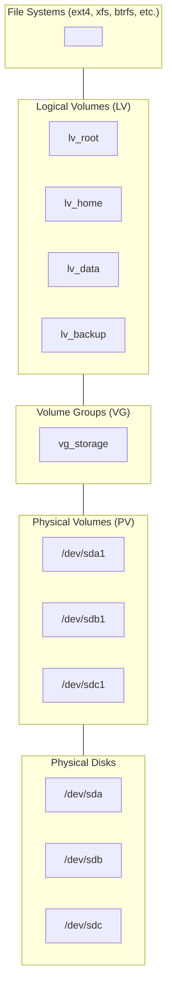

# How to Set Up LVM (Logical Volume Manager) on Ubuntu

Author: [nawazdhandala](https://github.com/nawazdhandala)

Tags: Ubuntu, Linux, LVM, Storage, DevOps

Description: Set up and manage LVM on Ubuntu for flexible disk partitioning, online volume extension, and snapshot capabilities.

---

## Introduction

Logical Volume Manager (LVM) is a powerful storage management framework for Linux that provides a layer of abstraction between your physical storage devices and the file systems mounted on them. Unlike traditional partitioning, LVM offers remarkable flexibility, allowing you to resize volumes on the fly, create snapshots for backups, and span storage across multiple physical disks.

In this comprehensive guide, we will explore how to set up and manage LVM on Ubuntu, covering everything from basic concepts to advanced operations like online volume extension and snapshot management.

## Why Use LVM?

Before diving into the technical details, let us understand why LVM is essential for modern server environments:

1. **Flexible Storage Management**: Resize volumes without unmounting file systems
2. **Snapshots**: Create point-in-time copies for backups or testing
3. **Spanning**: Combine multiple physical disks into a single logical volume
4. **Striping**: Improve performance by distributing data across multiple disks
5. **Mirroring**: Create redundant copies of data for high availability
6. **Thin Provisioning**: Allocate storage on demand rather than upfront

## Understanding LVM Architecture

LVM operates on three layers of abstraction:

### Physical Volumes (PV)

Physical Volumes are the foundation of LVM. They represent physical storage devices like hard drives, SSDs, or partitions. When you initialize a disk or partition for use with LVM, you are creating a Physical Volume.

### Volume Groups (VG)

Volume Groups are pools of storage created by combining one or more Physical Volumes. Think of a Volume Group as a virtual disk that can span multiple physical devices. All storage from the underlying Physical Volumes becomes available in the Volume Group.

### Logical Volumes (LV)

Logical Volumes are the virtual partitions you create from Volume Groups. These are the volumes that you format with a file system and mount for actual use. The key advantage is that Logical Volumes can be resized, moved, and modified independently of the underlying physical storage.



## Prerequisites

Before we begin, ensure you have:

- Ubuntu 20.04 LTS or later (this guide uses Ubuntu 22.04/24.04)
- Root or sudo access
- One or more available disks or partitions
- Basic familiarity with Linux command line

## Installing LVM Tools

First, install the LVM2 package if it is not already installed on your system.

```bash
# Update package lists and install LVM2 utilities
sudo apt update
sudo apt install lvm2 -y

# Verify the installation by checking the LVM version
sudo lvm version
```

You should see output showing the LVM version and library information:

```
  LVM version:     2.03.16(2) (2022-05-18)
  Library version: 1.02.185 (2022-05-18)
  Driver version:  4.47.0
  Configuration:   ./configure --build=x86_64-linux-gnu ...
```

## Identifying Available Disks

Before creating Physical Volumes, identify the available disks on your system.

```bash
# List all block devices with their sizes and types
lsblk

# For more detailed information including partition tables
sudo fdisk -l

# Display disk information using parted
sudo parted -l
```

Example output from `lsblk`:

```
NAME   MAJ:MIN RM   SIZE RO TYPE MOUNTPOINT
sda      8:0    0   100G  0 disk
├─sda1   8:1    0     1G  0 part /boot
└─sda2   8:2    0    99G  0 part
sdb      8:16   0   200G  0 disk
sdc      8:32   0   200G  0 disk
sdd      8:48   0   500G  0 disk
```

In this example, `/dev/sdb`, `/dev/sdc`, and `/dev/sdd` are available for LVM.

## Creating Physical Volumes

Now we will initialize the disks as Physical Volumes. This prepares them for use with LVM.

### Option 1: Using Entire Disks

This approach uses the entire disk without partitioning.

```bash
# Create Physical Volumes on entire disks
# This writes LVM metadata to the beginning of each disk
sudo pvcreate /dev/sdb /dev/sdc /dev/sdd

# Verify the Physical Volumes were created successfully
sudo pvs

# Display detailed information about Physical Volumes
sudo pvdisplay
```

### Option 2: Using Partitions

If you prefer to partition the disks first, use fdisk or parted.

```bash
# Create a partition using fdisk (interactive mode)
sudo fdisk /dev/sdb

# Within fdisk, use these commands:
# n - create new partition
# p - primary partition
# 1 - partition number
# Enter - accept default first sector
# Enter - accept default last sector (use entire disk)
# t - change partition type
# 8e - Linux LVM type
# w - write changes and exit

# Alternatively, use parted for scripted partitioning
sudo parted /dev/sdb --script mklabel gpt mkpart primary 0% 100% set 1 lvm on

# Create Physical Volume on the partition
sudo pvcreate /dev/sdb1
```

### Viewing Physical Volume Details

```bash
# Short summary of all Physical Volumes
sudo pvs

# Output example:
#   PV         VG          Fmt  Attr PSize   PFree
#   /dev/sdb   vg_storage  lvm2 a--  199.99g 199.99g
#   /dev/sdc   vg_storage  lvm2 a--  199.99g 199.99g
#   /dev/sdd   vg_storage  lvm2 a--  499.99g 499.99g

# Detailed view of a specific Physical Volume
sudo pvdisplay /dev/sdb

# Scan for all Physical Volumes on the system
sudo pvscan
```

## Creating Volume Groups

A Volume Group combines Physical Volumes into a storage pool from which Logical Volumes are allocated.

```bash
# Create a Volume Group named 'vg_storage' using multiple Physical Volumes
# This pools all the storage together for flexible allocation
sudo vgcreate vg_storage /dev/sdb /dev/sdc /dev/sdd

# Verify the Volume Group was created
sudo vgs

# Display detailed Volume Group information
sudo vgdisplay vg_storage
```

Example `vgdisplay` output:

```
  --- Volume group ---
  VG Name               vg_storage
  System ID
  Format                lvm2
  Metadata Areas        3
  Metadata Sequence No  1
  VG Access             read/write
  VG Status             resizable
  MAX LV                0
  Cur LV                0
  Open LV               0
  Max PV                0
  Cur PV                3
  Act PV                3
  VG Size               899.97 GiB
  PE Size               4.00 MiB
  Total PE              230393
  Alloc PE / Size       0 / 0
  Free  PE / Size       230393 / 899.97 GiB
  VG UUID               xxxxxx-xxxx-xxxx-xxxx-xxxx-xxxx-xxxxxx
```

### Customizing Physical Extent Size

Physical Extents (PE) are the smallest allocatable units in LVM. The default size is 4 MiB.

```bash
# Create a Volume Group with a custom PE size of 16 MiB
# Larger PE sizes can improve performance for large volumes
# but may waste space on smaller allocations
sudo vgcreate -s 16M vg_large /dev/sdd

# View the PE size
sudo vgdisplay vg_large | grep "PE Size"
```

## Creating Logical Volumes

Logical Volumes are the usable storage units that you format and mount.

### Creating Basic Logical Volumes

```bash
# Create a 50GB Logical Volume for the root filesystem
sudo lvcreate -L 50G -n lv_root vg_storage

# Create a 100GB Logical Volume for home directories
sudo lvcreate -L 100G -n lv_home vg_storage

# Create a 200GB Logical Volume for data storage
sudo lvcreate -L 200G -n lv_data vg_storage

# Verify the Logical Volumes were created
sudo lvs

# Display detailed information about all Logical Volumes
sudo lvdisplay
```

### Using Percentage-Based Allocation

```bash
# Create a Logical Volume using 50% of the free space in the VG
sudo lvcreate -l 50%FREE -n lv_backup vg_storage

# Create a Logical Volume using 100% of remaining free space
sudo lvcreate -l 100%FREE -n lv_archive vg_storage

# Use percentage of total VG size (not free space)
sudo lvcreate -l 25%VG -n lv_logs vg_storage
```

### Viewing Logical Volume Information

```bash
# Short summary of all Logical Volumes
sudo lvs

# Output example:
#   LV        VG         Attr       LSize   Pool Origin Data%  Meta%
#   lv_root   vg_storage -wi-a----- 50.00g
#   lv_home   vg_storage -wi-a----- 100.00g
#   lv_data   vg_storage -wi-a----- 200.00g

# Detailed view of a specific Logical Volume
sudo lvdisplay /dev/vg_storage/lv_data

# Alternative path notation
sudo lvdisplay vg_storage/lv_data
```

## Formatting and Mounting Logical Volumes

After creating Logical Volumes, format them with a file system and mount them.

### Formatting with ext4

```bash
# Format the Logical Volumes with ext4 file system
# The -L flag sets a label for easy identification
sudo mkfs.ext4 -L "Root" /dev/vg_storage/lv_root
sudo mkfs.ext4 -L "Home" /dev/vg_storage/lv_home
sudo mkfs.ext4 -L "Data" /dev/vg_storage/lv_data
```

### Formatting with XFS

```bash
# XFS is often preferred for large volumes and high-performance workloads
# It supports online growth but not shrinking
sudo mkfs.xfs -L "Data" /dev/vg_storage/lv_data
```

### Mounting Logical Volumes

```bash
# Create mount points
sudo mkdir -p /mnt/data /mnt/home /mnt/backup

# Mount the Logical Volumes
sudo mount /dev/vg_storage/lv_data /mnt/data
sudo mount /dev/vg_storage/lv_home /mnt/home

# Verify the mounts
df -h | grep vg_storage

# Check the mount options
mount | grep vg_storage
```

### Configuring Persistent Mounts

Add entries to `/etc/fstab` for automatic mounting at boot.

```bash
# Get the UUID of the Logical Volume (recommended over device paths)
sudo blkid /dev/vg_storage/lv_data

# Add entries to /etc/fstab for persistent mounting
# Using device mapper paths
echo '/dev/vg_storage/lv_data /mnt/data ext4 defaults 0 2' | sudo tee -a /etc/fstab
echo '/dev/vg_storage/lv_home /mnt/home ext4 defaults 0 2' | sudo tee -a /etc/fstab

# Or using UUIDs (more reliable if device names change)
# Replace UUID with the actual UUID from blkid output
echo 'UUID=xxxxxxxx-xxxx-xxxx-xxxx-xxxxxxxxxxxx /mnt/data ext4 defaults 0 2' | sudo tee -a /etc/fstab

# Test the fstab entries without rebooting
sudo mount -a

# Verify all mounts are working
df -h
```

## Extending Logical Volumes Online

One of LVM's most powerful features is the ability to extend volumes while they are mounted and in use.

### Extending a Logical Volume with Available Space

```bash
# Check available space in the Volume Group
sudo vgs

# Extend the Logical Volume by an additional 50GB
sudo lvextend -L +50G /dev/vg_storage/lv_data

# Or extend to a specific size (not adding, but setting total size)
sudo lvextend -L 250G /dev/vg_storage/lv_data

# Extend using all available free space in the VG
sudo lvextend -l +100%FREE /dev/vg_storage/lv_data
```

### Resizing the File System

After extending the Logical Volume, resize the file system to use the new space.

```bash
# For ext4 file systems - resize online without unmounting
sudo resize2fs /dev/vg_storage/lv_data

# For XFS file systems - use xfs_growfs with the mount point
sudo xfs_growfs /mnt/data

# Combine lvextend and resize in one command (recommended)
# The -r flag automatically resizes the file system
sudo lvextend -r -L +50G /dev/vg_storage/lv_data

# Verify the new size
df -h /mnt/data
```

### Adding New Physical Volumes to Extend Storage

When you run out of space in the Volume Group, add more Physical Volumes.

```bash
# Initialize a new disk as a Physical Volume
sudo pvcreate /dev/sde

# Add the new Physical Volume to the existing Volume Group
sudo vgextend vg_storage /dev/sde

# Verify the Volume Group now has more space
sudo vgs

# Now you can extend Logical Volumes using the new space
sudo lvextend -r -L +100G /dev/vg_storage/lv_data
```

## Reducing Logical Volumes

Shrinking volumes requires more care as it involves reducing the file system first.

**Warning**: Always backup data before shrinking volumes. XFS file systems cannot be shrunk.

```bash
# Unmount the Logical Volume first
sudo umount /mnt/data

# Check and repair the file system before shrinking
sudo e2fsck -f /dev/vg_storage/lv_data

# Reduce the file system to a specific size (slightly smaller than target LV size)
sudo resize2fs /dev/vg_storage/lv_data 180G

# Reduce the Logical Volume
sudo lvreduce -L 200G /dev/vg_storage/lv_data

# Or combine both operations (safer as it calculates sizes automatically)
sudo lvreduce -r -L 200G /dev/vg_storage/lv_data

# Remount the volume
sudo mount /dev/vg_storage/lv_data /mnt/data

# Verify the new size
df -h /mnt/data
```

## LVM Snapshots

Snapshots create point-in-time copies of Logical Volumes, essential for backups and testing.

### Understanding Snapshot Types

LVM supports two types of snapshots:

1. **Traditional (thick) snapshots**: Pre-allocated space that stores changes
2. **Thin snapshots**: Space-efficient snapshots using thin provisioning

### Creating Traditional Snapshots

```bash
# Create a snapshot with 10GB allocated for changes
# The snapshot will become invalid if it fills up completely
sudo lvcreate -s -L 10G -n lv_data_snap /dev/vg_storage/lv_data

# Verify the snapshot was created
sudo lvs

# Output shows snapshot relationship:
#   LV            VG         Attr       LSize   Pool Origin  Data%
#   lv_data       vg_storage owi-a-s--- 200.00g
#   lv_data_snap  vg_storage swi-a-s---  10.00g      lv_data  0.00

# Check snapshot space usage
sudo lvdisplay /dev/vg_storage/lv_data_snap | grep -E "LV Size|Allocated|Origin"
```

### Mounting and Using Snapshots

```bash
# Mount the snapshot as read-only for backup purposes
sudo mkdir -p /mnt/snap
sudo mount -o ro /dev/vg_storage/lv_data_snap /mnt/snap

# Create a backup from the snapshot
sudo tar -czvf /backup/data_backup.tar.gz /mnt/snap

# Unmount when done
sudo umount /mnt/snap
```

### Restoring from a Snapshot

```bash
# To restore the original volume to the snapshot state
# First unmount both volumes
sudo umount /mnt/data
sudo umount /mnt/snap

# Merge the snapshot back into the original volume
# This reverts all changes made since the snapshot was created
sudo lvconvert --merge /dev/vg_storage/lv_data_snap

# The merge happens on next activation
# Deactivate and reactivate the volume, or reboot
sudo lvchange -an /dev/vg_storage/lv_data
sudo lvchange -ay /dev/vg_storage/lv_data

# Mount the restored volume
sudo mount /dev/vg_storage/lv_data /mnt/data
```

### Removing Snapshots

```bash
# Unmount the snapshot if mounted
sudo umount /mnt/snap

# Remove the snapshot
sudo lvremove /dev/vg_storage/lv_data_snap

# Confirm removal when prompted
```

### Monitoring Snapshot Usage

```bash
# Check snapshot usage percentage
# Snapshots become invalid if they reach 100% usage
sudo lvs -o +snap_percent

# Set up monitoring to alert when snapshots are filling up
# Check usage in a script
USAGE=$(sudo lvs --noheadings -o snap_percent /dev/vg_storage/lv_data_snap | tr -d ' ')
if (( $(echo "$USAGE > 80" | bc -l) )); then
    echo "Warning: Snapshot usage is at ${USAGE}%"
fi

# Extend a snapshot if it is filling up
sudo lvextend -L +5G /dev/vg_storage/lv_data_snap
```

## Thin Provisioning

Thin provisioning allows over-allocation of storage and more efficient snapshot management.

### Creating a Thin Pool

```bash
# Create a thin pool with 100GB capacity
# The thin pool stores data for multiple thin volumes
sudo lvcreate -L 100G -T vg_storage/thin_pool

# Or create with metadata size specified
sudo lvcreate -L 100G --thinpool thin_pool vg_storage
```

### Creating Thin Logical Volumes

```bash
# Create a thin volume that can grow up to 200GB
# But only uses actual storage as data is written
sudo lvcreate -V 200G -T vg_storage/thin_pool -n thin_lv_data

# Create another thin volume - you can over-provision
sudo lvcreate -V 300G -T vg_storage/thin_pool -n thin_lv_backup

# Check thin pool usage
sudo lvs -o +data_percent,metadata_percent vg_storage/thin_pool
```

### Thin Snapshots

```bash
# Thin snapshots are more efficient as they share data with the origin
sudo lvcreate -s -n thin_snap /dev/vg_storage/thin_lv_data

# Thin snapshots do not require pre-allocated space
# They grow as changes are made
sudo lvs

# Create multiple snapshots without significant overhead
sudo lvcreate -s -n thin_snap_v2 /dev/vg_storage/thin_lv_data
sudo lvcreate -s -n thin_snap_v3 /dev/vg_storage/thin_lv_data
```

## LVM Cache

LVM cache uses fast storage (SSD) to accelerate access to slower storage (HDD).

```bash
# Create a cache pool on fast storage
# First, create a Physical Volume on the SSD
sudo pvcreate /dev/nvme0n1

# Add it to the Volume Group
sudo vgextend vg_storage /dev/nvme0n1

# Create cache data and metadata volumes
sudo lvcreate -L 50G -n cache_data vg_storage /dev/nvme0n1
sudo lvcreate -L 1G -n cache_meta vg_storage /dev/nvme0n1

# Convert to a cache pool
sudo lvconvert --type cache-pool --poolmetadata vg_storage/cache_meta vg_storage/cache_data

# Attach cache to an existing Logical Volume
sudo lvconvert --type cache --cachepool vg_storage/cache_data vg_storage/lv_data

# Verify cache is active
sudo lvs -o +cache_mode,cache_policy
```

## Removing LVM Components

When you need to remove LVM components, work in reverse order: LV, then VG, then PV.

### Removing Logical Volumes

```bash
# Unmount the Logical Volume first
sudo umount /mnt/data

# Remove the fstab entry to prevent boot issues
sudo sed -i '/lv_data/d' /etc/fstab

# Remove the Logical Volume
sudo lvremove /dev/vg_storage/lv_data

# Confirm with 'y' when prompted
```

### Removing Volume Groups

```bash
# Remove all Logical Volumes in the VG first
# Then remove the Volume Group
sudo vgremove vg_storage
```

### Removing Physical Volumes

```bash
# Remove the Physical Volume
sudo pvremove /dev/sdb /dev/sdc /dev/sdd

# The disks are now available for other uses
```

## Moving Data Between Physical Volumes

When replacing a disk or redistributing data, use pvmove.

```bash
# Move all data from one Physical Volume to others in the same VG
# This is useful when removing or replacing a disk
sudo pvmove /dev/sdb

# Move data to a specific Physical Volume
sudo pvmove /dev/sdb /dev/sdd

# Move a specific Logical Volume's data
sudo pvmove -n lv_data /dev/sdb /dev/sdc

# Monitor the progress
watch -n 1 'sudo pvs -o pv_name,pv_used,pv_free'

# After moving all data, remove the PV from the VG
sudo vgreduce vg_storage /dev/sdb

# Remove the PV label
sudo pvremove /dev/sdb
```

## Best Practices for Production

### Planning and Design

1. **Leave headroom**: Never allocate 100% of VG space to Logical Volumes. Keep 10-20% free for snapshots and emergencies.

2. **Use meaningful names**: Adopt a consistent naming convention for VGs and LVs.

```bash
# Good naming examples
vg_production, vg_backup, vg_dev
lv_mysql_data, lv_app_logs, lv_web_static
```

3. **Document your layout**: Keep records of your LVM configuration.

```bash
# Export LVM configuration for documentation
sudo vgcfgbackup -f /backup/vg_storage_config vg_storage

# Display current configuration
sudo vgs -o +vg_extent_size,vg_free_count
sudo lvs -o +devices,seg_pe_ranges
```

### Monitoring and Maintenance

```bash
# Create a monitoring script for LVM health
#!/bin/bash
# lvm_health_check.sh

# Check VG free space
VG_FREE=$(sudo vgs --noheadings -o vg_free --units g vg_storage | tr -d ' ')
echo "Volume Group free space: $VG_FREE"

# Check for any snapshots filling up
sudo lvs -o lv_name,snap_percent --select 'lv_attr=~[sS]' 2>/dev/null

# Check thin pool usage
sudo lvs -o lv_name,data_percent,metadata_percent --select 'lv_attr=~[tT]' 2>/dev/null

# Check for any LVM errors
sudo vgck vg_storage
```

### Backup Strategy

```bash
# Regular backup script using LVM snapshots
#!/bin/bash
# lvm_backup.sh

LV_NAME="lv_data"
VG_NAME="vg_storage"
SNAP_NAME="${LV_NAME}_backup_snap"
BACKUP_DIR="/backup"
DATE=$(date +%Y%m%d_%H%M%S)

# Create snapshot
sudo lvcreate -s -L 10G -n "$SNAP_NAME" "/dev/${VG_NAME}/${LV_NAME}"

# Mount snapshot read-only
sudo mkdir -p /mnt/snap
sudo mount -o ro "/dev/${VG_NAME}/${SNAP_NAME}" /mnt/snap

# Perform backup
sudo tar -czf "${BACKUP_DIR}/backup_${DATE}.tar.gz" /mnt/snap

# Cleanup
sudo umount /mnt/snap
sudo lvremove -f "/dev/${VG_NAME}/${SNAP_NAME}"
```

### High Availability Considerations

1. **Use mirroring for critical data**:

```bash
# Create a mirrored Logical Volume
sudo lvcreate --type mirror -m 1 -L 50G -n lv_critical vg_storage

# Verify mirror status
sudo lvs -o +devices vg_storage/lv_critical
```

2. **Regular configuration backups**:

```bash
# Backup LVM metadata regularly
sudo vgcfgbackup

# Metadata is stored in /etc/lvm/backup/
ls -la /etc/lvm/backup/

# Restore if needed
sudo vgcfgrestore vg_storage
```

### Performance Tuning

```bash
# Check current read-ahead setting
sudo blockdev --getra /dev/vg_storage/lv_data

# Set optimal read-ahead for sequential workloads (in 512-byte sectors)
sudo lvchange --readahead 4096 /dev/vg_storage/lv_data

# For database workloads, use striping across multiple PVs
sudo lvcreate -L 100G -n lv_db -i 3 -I 64K vg_storage

# Check stripe configuration
sudo lvdisplay /dev/vg_storage/lv_db | grep -E "Stripe|Segments"
```

## Troubleshooting Common Issues

### Recovering from a Failed Physical Volume

```bash
# If a PV becomes unavailable
# First, check the status
sudo pvs
sudo vgs

# If a PV shows as missing
# Try to activate VG in partial mode
sudo vgchange -ay --partial vg_storage

# Remove the missing PV from the VG
sudo vgreduce --removemissing vg_storage

# Replace and rebuild
sudo pvcreate /dev/sdb_replacement
sudo vgextend vg_storage /dev/sdb_replacement
```

### Fixing Duplicate UUIDs

```bash
# Can occur when cloning disks
# Generate new UUID for the PV
sudo pvchange -u /dev/sdb
```

### Recovering Deleted Logical Volumes

```bash
# Check for archived metadata
ls -la /etc/lvm/archive/

# Find the configuration before deletion
sudo vgcfgrestore -l vg_storage

# Restore from a specific archive
sudo vgcfgrestore -f /etc/lvm/archive/vg_storage_00042.vg vg_storage

# Reactivate the Volume Group
sudo vgchange -ay vg_storage
```

## Conclusion

LVM provides powerful and flexible storage management capabilities for Ubuntu systems. The key advantages include:

- **Dynamic resizing**: Extend volumes online without downtime
- **Snapshots**: Create point-in-time copies for backups and testing
- **Pooled storage**: Combine multiple physical disks into unified storage
- **Thin provisioning**: Efficiently allocate storage on demand

By following the best practices outlined in this guide, you can build a robust and maintainable storage infrastructure. Remember to:

1. Plan your storage layout carefully before implementation
2. Maintain adequate free space in your Volume Groups
3. Regularly backup your LVM metadata
4. Monitor snapshot usage to prevent invalidation
5. Document your configuration for disaster recovery

LVM is an essential tool for any Linux administrator managing storage in development or production environments. Its flexibility makes it invaluable for growing systems where storage requirements evolve over time.

## Additional Resources

- [Ubuntu LVM Documentation](https://ubuntu.com/server/docs/lvm)
- [Red Hat LVM Administrator Guide](https://access.redhat.com/documentation/en-us/red_hat_enterprise_linux/9/html/configuring_and_managing_logical_volumes/index)
- [LVM HOWTO](https://tldp.org/HOWTO/LVM-HOWTO/)
- [dm-cache Documentation](https://www.kernel.org/doc/Documentation/device-mapper/cache.txt)

## Quick Reference

### Essential Commands

| Command | Description |
|---------|-------------|
| `pvcreate` | Initialize a Physical Volume |
| `pvs`, `pvdisplay` | Show Physical Volume information |
| `vgcreate` | Create a Volume Group |
| `vgs`, `vgdisplay` | Show Volume Group information |
| `lvcreate` | Create a Logical Volume |
| `lvs`, `lvdisplay` | Show Logical Volume information |
| `lvextend -r` | Extend LV and resize filesystem |
| `lvreduce -r` | Reduce LV and resize filesystem |
| `lvcreate -s` | Create a snapshot |
| `pvmove` | Move data between Physical Volumes |
| `vgcfgbackup` | Backup VG metadata |
