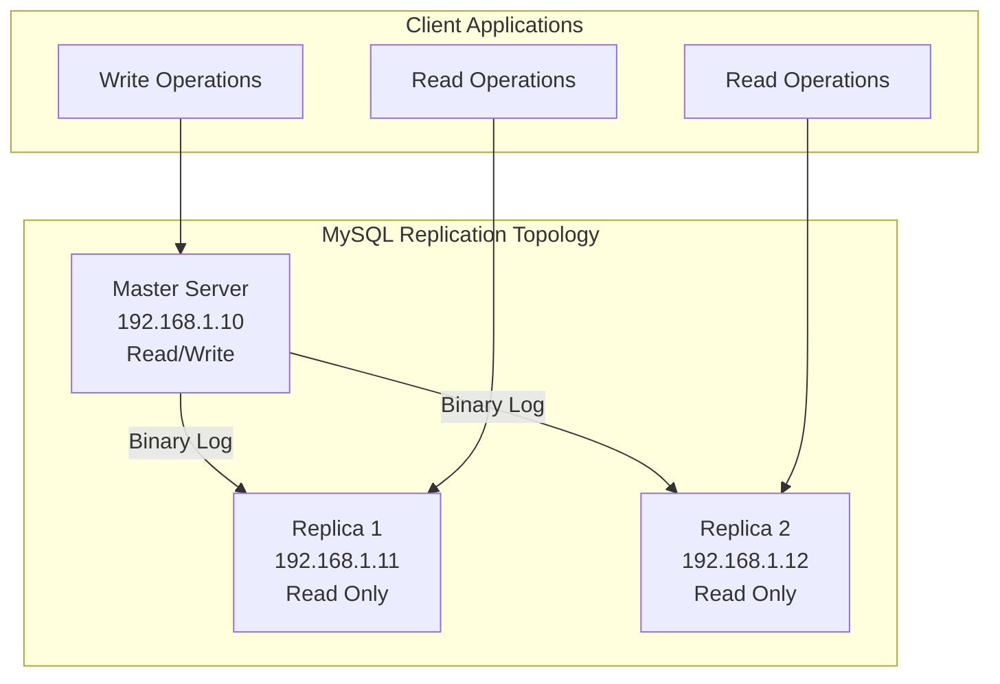
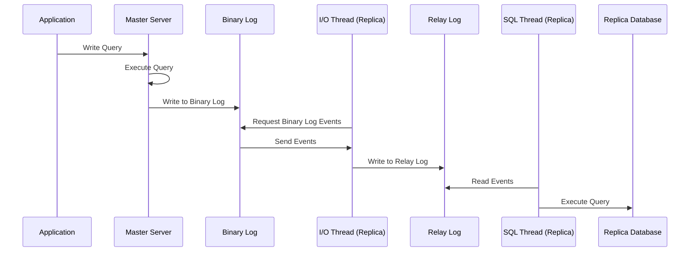
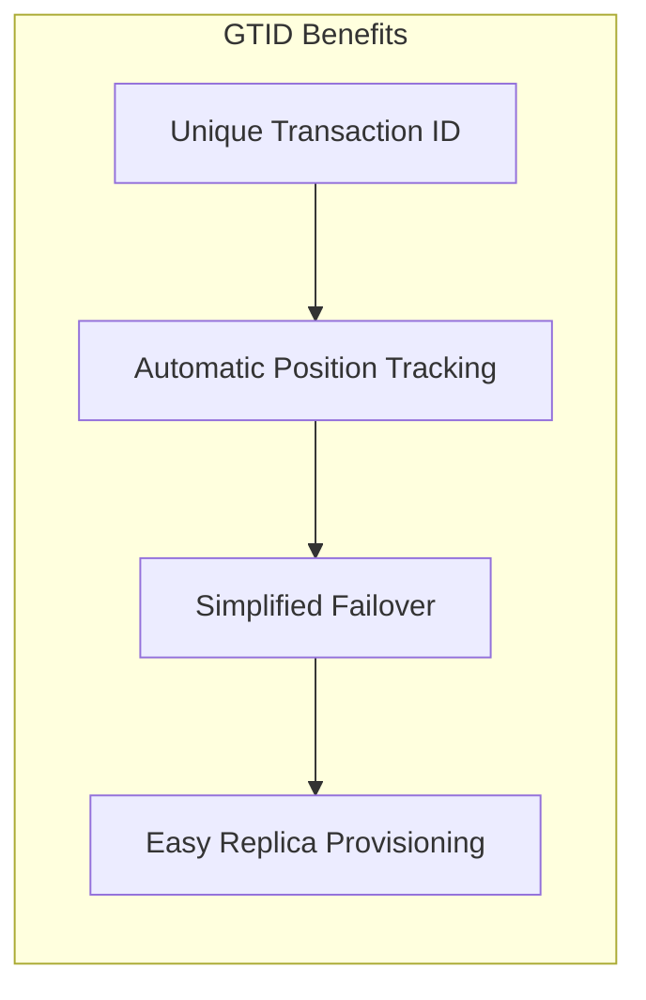
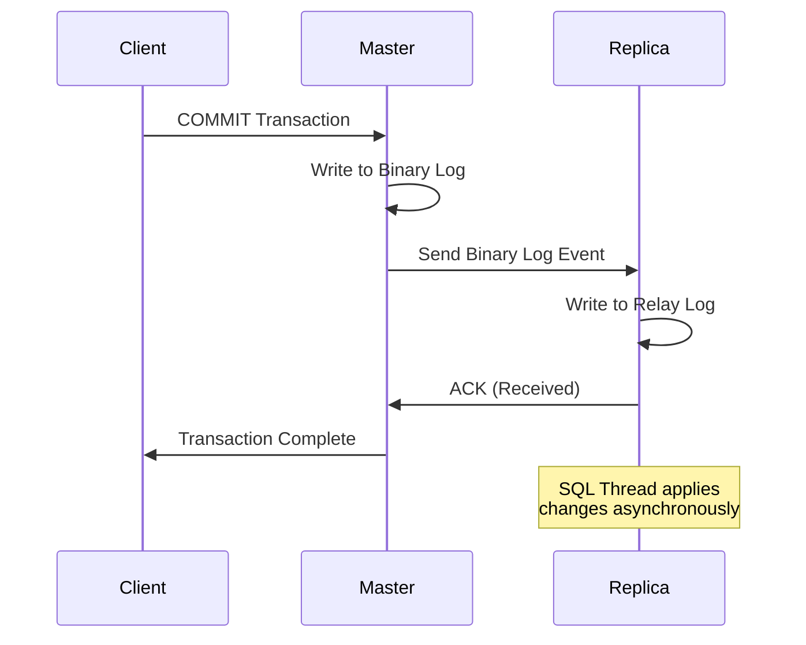
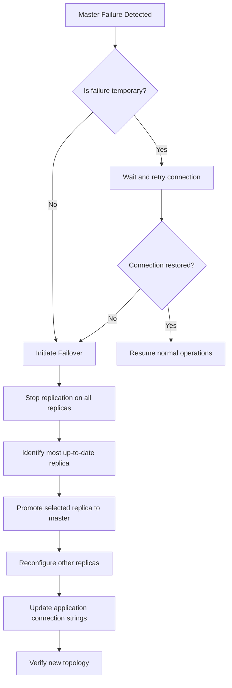

# How to Set Up MySQL with Replication for High Availability on Ubuntu

Author: [nawazdhandala](https://github.com/nawazdhandala)

Tags: Ubuntu, Linux, MySQL, Database, High Availability, Replication

Description: Learn how to configure MySQL replication for high availability and disaster recovery on Ubuntu.

---

## Introduction

MySQL replication is a critical technology for building highly available database systems. It allows data from one MySQL database server (the source/master) to be copied to one or more MySQL database servers (replicas/slaves). This setup provides several benefits including load balancing for read operations, data backup without impacting the primary server, and disaster recovery capabilities.

In this comprehensive guide, we will walk through setting up MySQL replication on Ubuntu, covering both traditional binary log-based replication and the more modern GTID-based replication approach.

## Replication Architecture Overview

Before diving into the configuration, let's understand the replication topology we'll be implementing:



## Data Flow in MySQL Replication

The following diagram illustrates how data flows through the replication system:



## Prerequisites

Before starting, ensure you have:

- Two or more Ubuntu 22.04/24.04 servers
- Root or sudo access on all servers
- Network connectivity between all servers
- Firewall configured to allow MySQL traffic (port 3306)

## Server Configuration

For this guide, we'll use the following server configuration:

| Role | Hostname | IP Address |
|------|----------|------------|
| Master | mysql-master | 192.168.1.10 |
| Replica 1 | mysql-replica1 | 192.168.1.11 |
| Replica 2 | mysql-replica2 | 192.168.1.12 |

## Part 1: Installing MySQL on All Servers

First, we need to install MySQL on all servers that will participate in replication.

### Update system packages and install MySQL Server

Run these commands on all servers (master and replicas) to install MySQL:

```bash
# Update the package index to ensure we get the latest package information
sudo apt update

# Install MySQL server package
# The -y flag automatically answers yes to prompts
sudo apt install mysql-server -y

# Start MySQL service and enable it to start on boot
sudo systemctl start mysql
sudo systemctl enable mysql

# Verify MySQL is running properly
sudo systemctl status mysql
```

### Secure the MySQL Installation

Run the security script to set up basic security measures:

```bash
# This interactive script helps secure your MySQL installation
# It will prompt you to:
# - Set a root password
# - Remove anonymous users
# - Disable remote root login
# - Remove test database
# - Reload privilege tables
sudo mysql_secure_installation
```

### Verify MySQL version and connectivity

Confirm MySQL is installed correctly:

```bash
# Check the installed MySQL version
mysql --version

# Connect to MySQL as root to verify access
sudo mysql -u root -p -e "SELECT VERSION();"
```

## Part 2: Configuring the Master Server

Now we'll configure the master server to enable binary logging and prepare it for replication.

### Edit the MySQL configuration file

Open the MySQL configuration file for editing:

```bash
# Open the MySQL configuration file with your preferred editor
sudo nano /etc/mysql/mysql.conf.d/mysqld.cnf
```

### Add replication configuration to the master

Add or modify these settings in the [mysqld] section of the configuration file:

```ini
[mysqld]
# Unique server identifier - must be different on each server
# Use a simple numbering scheme: 1 for master, 2 for replica1, etc.
server-id = 1

# Enable binary logging - this is required for replication
# Binary logs record all changes to the database
log_bin = /var/log/mysql/mysql-bin.log

# Specify which databases to replicate (optional)
# If not specified, all databases are replicated
# binlog_do_db = myapp_production

# Binary log format - ROW is recommended for most use cases
# ROW: logs actual row changes (most accurate)
# STATEMENT: logs SQL statements (smaller logs but may have issues)
# MIXED: uses statement when possible, row when needed
binlog_format = ROW

# Retain binary logs for 7 days before automatic deletion
# Adjust based on your recovery needs and disk space
binlog_expire_logs_seconds = 604800

# Maximum size for each binary log file before rotation
max_binlog_size = 100M

# Bind to all interfaces to allow remote connections
# In production, consider binding to specific IP for security
bind-address = 0.0.0.0

# Sync binary log to disk after each transaction for durability
# Set to 1 for maximum safety, higher values for better performance
sync_binlog = 1

# InnoDB settings for crash-safe replication
# Ensures transactions are durable before acknowledging
innodb_flush_log_at_trx_commit = 1
```

### Restart MySQL to apply the configuration changes

```bash
# Restart MySQL service to load new configuration
sudo systemctl restart mysql

# Verify MySQL restarted successfully
sudo systemctl status mysql
```

### Create a dedicated replication user

Create a MySQL user that replicas will use to connect and replicate data:

```bash
# Connect to MySQL as root
sudo mysql -u root -p
```

Execute the following SQL commands to create the replication user:

```sql
-- Create a dedicated user for replication
-- Use a strong password in production environments
-- The '%' allows connections from any host (restrict in production)
CREATE USER 'replication_user'@'%' IDENTIFIED WITH mysql_native_password BY 'SecureRepl!cationP@ss123';

-- Grant replication privileges to the user
-- REPLICATION SLAVE: allows reading binary log events
-- REPLICATION CLIENT: allows checking replication status
GRANT REPLICATION SLAVE, REPLICATION CLIENT ON *.* TO 'replication_user'@'%';

-- Apply the privilege changes immediately
FLUSH PRIVILEGES;

-- Verify the user was created with correct privileges
SHOW GRANTS FOR 'replication_user'@'%';
```

### Get the current binary log position

For traditional replication, we need to record the current binary log position:

```sql
-- Lock tables to get a consistent snapshot
-- This prevents any writes during the backup process
FLUSH TABLES WITH READ LOCK;

-- Record the binary log file name and position
-- You'll need these values when configuring replicas
SHOW MASTER STATUS;
```

The output will look similar to:

```
+------------------+----------+--------------+------------------+
| File             | Position | Binlog_Do_DB | Binlog_Ignore_DB |
+------------------+----------+--------------+------------------+
| mysql-bin.000001 |      857 |              |                  |
+------------------+----------+--------------+------------------+
```

**Important:** Keep this terminal open and note these values. You'll need them for replica configuration.

### Create a database backup for replicas

If you have existing data, create a backup to initialize replicas:

```bash
# Create a consistent backup of all databases
# --master-data includes binary log position in the dump
# --single-transaction ensures consistency without locking InnoDB tables
sudo mysqldump -u root -p --all-databases --master-data=2 --single-transaction > /tmp/master_backup.sql

# Copy the backup to replica servers
scp /tmp/master_backup.sql user@192.168.1.11:/tmp/
scp /tmp/master_backup.sql user@192.168.1.12:/tmp/
```

### Unlock the tables after backup

```sql
-- Release the read lock so the master can accept writes again
UNLOCK TABLES;
```

## Part 3: Configuring Replica Servers

Now we'll configure each replica server to connect to and replicate from the master.

### Edit the MySQL configuration on replicas

On each replica server, edit the MySQL configuration:

```bash
# Open the MySQL configuration file
sudo nano /etc/mysql/mysql.conf.d/mysqld.cnf
```

### Add replica configuration settings

Add these settings to the [mysqld] section:

```ini
[mysqld]
# Unique server identifier - must be different from master and other replicas
# Replica 1 uses ID 2, Replica 2 uses ID 3, etc.
server-id = 2

# Enable relay log for receiving and storing replicated events
relay-log = /var/log/mysql/mysql-relay-bin.log

# Enable binary logging on replica (useful for cascading replication)
log_bin = /var/log/mysql/mysql-bin.log

# Make the replica read-only to prevent accidental writes
# Super users can still write; use super_read_only for stricter control
read_only = ON

# Optional: prevent super users from writing as well
# super_read_only = ON

# Bind to all interfaces for monitoring access
bind-address = 0.0.0.0

# Log replica updates to binary log (needed for cascading replication)
log_replica_updates = ON

# Preserve commit order for parallel replication consistency
replica_preserve_commit_order = ON
```

### Restart MySQL on the replica

```bash
# Restart MySQL to apply configuration changes
sudo systemctl restart mysql

# Verify MySQL is running
sudo systemctl status mysql
```

### Import the master backup on replicas

If you created a backup from an existing master:

```bash
# Import the backup from the master server
# This synchronizes the replica with the master's data
sudo mysql -u root -p < /tmp/master_backup.sql

# Restart MySQL after import
sudo systemctl restart mysql
```

### Configure the replica to connect to master

Connect to MySQL on the replica and configure the replication source:

```bash
# Connect to MySQL as root
sudo mysql -u root -p
```

Execute the following SQL commands:

```sql
-- Stop any existing replication process
STOP REPLICA;

-- Configure the connection to the master server
-- Replace values with your actual master server details
-- MASTER_LOG_FILE and MASTER_LOG_POS from SHOW MASTER STATUS output
CHANGE REPLICATION SOURCE TO
    SOURCE_HOST='192.168.1.10',
    SOURCE_USER='replication_user',
    SOURCE_PASSWORD='SecureRepl!cationP@ss123',
    SOURCE_LOG_FILE='mysql-bin.000001',
    SOURCE_LOG_POS=857,
    SOURCE_PORT=3306;

-- Start the replication process
START REPLICA;

-- Check the replication status to verify it's working
SHOW REPLICA STATUS\G
```

### Verify replication is working

Look for these key indicators in the SHOW REPLICA STATUS output:

```sql
-- Key fields to verify in SHOW REPLICA STATUS:
-- Replica_IO_Running: Yes (I/O thread is connecting and reading from master)
-- Replica_SQL_Running: Yes (SQL thread is executing replicated events)
-- Seconds_Behind_Source: 0 (replica is caught up with master)
-- Last_Error: (should be empty)

-- Quick check command
SHOW REPLICA STATUS\G
```

Expected output showing successful replication:

```
*************************** 1. row ***************************
             Replica_IO_State: Waiting for source to send event
                  Source_Host: 192.168.1.10
                  Source_User: replication_user
                  Source_Port: 3306
                Connect_Retry: 60
              Source_Log_File: mysql-bin.000001
          Read_Source_Log_Pos: 857
               Relay_Log_File: mysql-relay-bin.000002
                Relay_Log_Pos: 326
        Relay_Source_Log_File: mysql-bin.000001
           Replica_IO_Running: Yes
          Replica_SQL_Running: Yes
              ...
        Seconds_Behind_Source: 0
              ...
```

## Part 4: Setting Up GTID-Based Replication

Global Transaction Identifiers (GTIDs) provide a more robust replication method. Each transaction gets a unique identifier, making failover and recovery much simpler.

### GTID Replication Architecture



### Configure GTID on the Master

Add these settings to the master's configuration:

```bash
# Edit the MySQL configuration file
sudo nano /etc/mysql/mysql.conf.d/mysqld.cnf
```

Add GTID-specific settings:

```ini
[mysqld]
# Enable GTID mode for transaction tracking
# This assigns a unique ID to each transaction
gtid_mode = ON

# Enforce GTID consistency
# Prevents operations that cannot be logged with GTIDs
enforce_gtid_consistency = ON

# Enable binary logging (required for GTID)
log_bin = /var/log/mysql/mysql-bin.log

# Binary log format must be ROW for GTID
binlog_format = ROW

# Server identification
server-id = 1

# Sync binary log for durability
sync_binlog = 1

# Bind to all interfaces
bind-address = 0.0.0.0
```

### Configure GTID on Replicas

Add these settings to each replica's configuration:

```ini
[mysqld]
# Enable GTID mode (must match master)
gtid_mode = ON

# Enforce GTID consistency (must match master)
enforce_gtid_consistency = ON

# Unique server identifier
server-id = 2

# Enable relay logging
relay-log = /var/log/mysql/mysql-relay-bin.log

# Enable binary logging for potential cascading
log_bin = /var/log/mysql/mysql-bin.log

# Log replica updates to binary log
log_replica_updates = ON

# Make replica read-only
read_only = ON

# Bind to all interfaces
bind-address = 0.0.0.0
```

### Restart MySQL on all servers

```bash
# Restart MySQL to enable GTID mode
sudo systemctl restart mysql

# Verify GTID is enabled
sudo mysql -u root -p -e "SHOW VARIABLES LIKE 'gtid_mode';"
```

### Configure GTID-based replication on replicas

Connect to each replica and configure GTID replication:

```sql
-- Stop any existing replication
STOP REPLICA;

-- Reset replica configuration
RESET REPLICA ALL;

-- Configure replication using GTID auto-positioning
-- No need to specify log file and position - GTID handles this automatically
CHANGE REPLICATION SOURCE TO
    SOURCE_HOST='192.168.1.10',
    SOURCE_USER='replication_user',
    SOURCE_PASSWORD='SecureRepl!cationP@ss123',
    SOURCE_PORT=3306,
    SOURCE_AUTO_POSITION=1;

-- Start replication
START REPLICA;

-- Verify GTID replication status
SHOW REPLICA STATUS\G
```

### Verify GTID replication

Check that GTID-based replication is working:

```sql
-- Check executed GTID set on master
SHOW MASTER STATUS\G

-- Check executed GTID set on replica
SHOW REPLICA STATUS\G

-- Compare GTID sets - they should match when replica is caught up
SELECT @@global.gtid_executed;
```

## Part 5: Semi-Synchronous Replication

For enhanced data durability, configure semi-synchronous replication where the master waits for at least one replica to acknowledge receipt of events.

### Semi-Synchronous Replication Flow



### Install semi-synchronous replication plugin on master

```sql
-- Connect to MySQL and install the source plugin
-- This plugin enables semi-synchronous behavior on the master
INSTALL PLUGIN rpl_semi_sync_source SONAME 'semisync_source.so';

-- Enable semi-synchronous replication
SET GLOBAL rpl_semi_sync_source_enabled = ON;

-- Set timeout for waiting for replica acknowledgment (in milliseconds)
-- If no replica acknowledges within this time, fall back to async
SET GLOBAL rpl_semi_sync_source_timeout = 10000;

-- Verify the plugin is active
SHOW VARIABLES LIKE 'rpl_semi_sync_source%';
```

### Install semi-synchronous replication plugin on replicas

```sql
-- Install the replica plugin
INSTALL PLUGIN rpl_semi_sync_replica SONAME 'semisync_replica.so';

-- Enable semi-synchronous mode on the replica
SET GLOBAL rpl_semi_sync_replica_enabled = ON;

-- Restart replication to activate semi-sync
STOP REPLICA IO_THREAD;
START REPLICA IO_THREAD;

-- Verify the plugin is active
SHOW VARIABLES LIKE 'rpl_semi_sync_replica%';
```

### Make semi-sync settings persistent

Add these settings to the MySQL configuration files:

Master configuration (`/etc/mysql/mysql.conf.d/mysqld.cnf`):

```ini
[mysqld]
# Semi-synchronous replication settings for master
# Load the plugin at startup
plugin-load-add = semisync_source.so

# Enable semi-sync source
rpl_semi_sync_source_enabled = ON

# Timeout before falling back to async (milliseconds)
rpl_semi_sync_source_timeout = 10000

# Minimum number of replicas that must acknowledge
rpl_semi_sync_source_wait_for_replica_count = 1
```

Replica configuration:

```ini
[mysqld]
# Semi-synchronous replication settings for replica
# Load the plugin at startup
plugin-load-add = semisync_replica.so

# Enable semi-sync replica
rpl_semi_sync_replica_enabled = ON
```

## Part 6: Monitoring Replication

Effective monitoring is crucial for maintaining healthy replication.

### Create a monitoring script

Save this script to check replication health:

```bash
#!/bin/bash
# MySQL Replication Monitoring Script
# This script checks the health of MySQL replication and alerts on issues

# Configuration - update these values for your environment
MYSQL_USER="monitor_user"
MYSQL_PASS="MonitorP@ss123"
ALERT_EMAIL="dba@example.com"

# Function to check replication status
check_replication() {
    # Query replica status and extract key metrics
    status=$(mysql -u"$MYSQL_USER" -p"$MYSQL_PASS" -e "SHOW REPLICA STATUS\G" 2>/dev/null)

    # Check if I/O thread is running
    io_running=$(echo "$status" | grep "Replica_IO_Running:" | awk '{print $2}')

    # Check if SQL thread is running
    sql_running=$(echo "$status" | grep "Replica_SQL_Running:" | awk '{print $2}')

    # Get seconds behind master
    seconds_behind=$(echo "$status" | grep "Seconds_Behind_Source:" | awk '{print $2}')

    # Get any error messages
    last_error=$(echo "$status" | grep "Last_Error:" | cut -d':' -f2-)

    # Output current status
    echo "=== MySQL Replication Status ==="
    echo "Timestamp: $(date)"
    echo "I/O Thread Running: $io_running"
    echo "SQL Thread Running: $sql_running"
    echo "Seconds Behind Source: $seconds_behind"

    # Check for problems and alert
    if [ "$io_running" != "Yes" ] || [ "$sql_running" != "Yes" ]; then
        echo "CRITICAL: Replication is broken!"
        echo "Last Error: $last_error"
        # Send alert email
        echo "MySQL replication is broken on $(hostname). Error: $last_error" | \
            mail -s "ALERT: MySQL Replication Failure" "$ALERT_EMAIL"
        exit 2
    fi

    # Check for replication lag (alert if more than 60 seconds behind)
    if [ "$seconds_behind" != "NULL" ] && [ "$seconds_behind" -gt 60 ]; then
        echo "WARNING: Replication lag is $seconds_behind seconds"
        exit 1
    fi

    echo "OK: Replication is healthy"
    exit 0
}

# Run the check
check_replication
```

### Create a monitoring user in MySQL

```sql
-- Create a dedicated user for monitoring
-- This user has minimal privileges needed for status checks
CREATE USER 'monitor_user'@'localhost' IDENTIFIED BY 'MonitorP@ss123';

-- Grant necessary privileges for monitoring
GRANT REPLICATION CLIENT ON *.* TO 'monitor_user'@'localhost';
GRANT PROCESS ON *.* TO 'monitor_user'@'localhost';

-- Apply privileges
FLUSH PRIVILEGES;
```

### Set up automated monitoring with cron

```bash
# Save the monitoring script
sudo nano /usr/local/bin/check_mysql_replication.sh

# Make it executable
sudo chmod +x /usr/local/bin/check_mysql_replication.sh

# Add to crontab to run every 5 minutes
# This ensures quick detection of replication issues
(crontab -l 2>/dev/null; echo "*/5 * * * * /usr/local/bin/check_mysql_replication.sh >> /var/log/mysql_replication_check.log 2>&1") | crontab -
```

### Monitor replication with MySQL commands

Useful commands for checking replication status:

```sql
-- Comprehensive replica status
SHOW REPLICA STATUS\G

-- Check binary log status on master
SHOW MASTER STATUS\G

-- View connected replicas on master
SHOW REPLICAS;

-- Check replication filters
SHOW REPLICA STATUS\G

-- Monitor replication performance
SELECT * FROM performance_schema.replication_connection_status\G
SELECT * FROM performance_schema.replication_applier_status\G

-- Check GTID execution status
SELECT @@global.gtid_executed\G

-- View binary log events (useful for debugging)
SHOW BINLOG EVENTS IN 'mysql-bin.000001' LIMIT 10\G
```

## Part 7: Failover Procedures

When the master fails, you need to promote a replica to become the new master.

### Failover Decision Flow



### Manual Failover Procedure

Follow these steps to promote a replica to master:

#### Step 1: Stop replication on all replicas

```sql
-- Execute on all replicas
-- This ensures no more data is being received from the failed master
STOP REPLICA;
```

#### Step 2: Identify the most current replica

```sql
-- Check each replica's GTID position
-- The replica with the highest GTID should be promoted
SHOW REPLICA STATUS\G

-- Look for:
-- - Executed_Gtid_Set: Shows all GTIDs executed
-- - Retrieved_Gtid_Set: Shows GTIDs received but not yet executed
-- - Seconds_Behind_Source: Should be 0 or very low

-- Also check
SELECT @@global.gtid_executed;
```

#### Step 3: Prepare the chosen replica to become master

Execute these commands on the replica being promoted:

```sql
-- Stop the replica completely
STOP REPLICA;

-- Reset replica configuration
RESET REPLICA ALL;

-- Disable read-only mode to allow writes
SET GLOBAL read_only = OFF;
SET GLOBAL super_read_only = OFF;

-- Verify the server can now accept writes
SHOW VARIABLES LIKE '%read_only%';

-- Note the current GTID executed set
SHOW MASTER STATUS\G
```

#### Step 4: Update MySQL configuration on the new master

Edit the configuration file on the promoted server:

```bash
# Edit MySQL configuration
sudo nano /etc/mysql/mysql.conf.d/mysqld.cnf
```

Update the settings:

```ini
[mysqld]
# This server is now the master
server-id = 2

# Remove or comment out replica-specific settings
# read_only = OFF (or remove this line)

# Keep binary logging enabled (already should be)
log_bin = /var/log/mysql/mysql-bin.log

# GTID settings should remain the same
gtid_mode = ON
enforce_gtid_consistency = ON
```

#### Step 5: Create replication user on new master

```sql
-- Create replication user if it doesn't exist
CREATE USER IF NOT EXISTS 'replication_user'@'%'
    IDENTIFIED WITH mysql_native_password BY 'SecureRepl!cationP@ss123';

-- Grant replication privileges
GRANT REPLICATION SLAVE, REPLICATION CLIENT ON *.* TO 'replication_user'@'%';

FLUSH PRIVILEGES;
```

#### Step 6: Point remaining replicas to the new master

On each remaining replica:

```sql
-- Stop current replication
STOP REPLICA;

-- Reset replica configuration
RESET REPLICA ALL;

-- Configure replication to the new master (192.168.1.11)
CHANGE REPLICATION SOURCE TO
    SOURCE_HOST='192.168.1.11',
    SOURCE_USER='replication_user',
    SOURCE_PASSWORD='SecureRepl!cationP@ss123',
    SOURCE_PORT=3306,
    SOURCE_AUTO_POSITION=1;

-- Start replication
START REPLICA;

-- Verify replication is working
SHOW REPLICA STATUS\G
```

#### Step 7: Update application configuration

Update your application's database connection strings to point to the new master:

```bash
# Example: Update environment variables
export DB_MASTER_HOST=192.168.1.11

# Example: Update application configuration file
# Modify your application's database.yml, .env, or similar config file
```

### Recover the old master as a replica

Once the old master is repaired, you can add it back as a replica:

```sql
-- On the recovered server (old master)
-- First, ensure the server is stopped and data is synchronized

-- Reset to clean state
RESET MASTER;

-- Configure as replica of the new master
CHANGE REPLICATION SOURCE TO
    SOURCE_HOST='192.168.1.11',
    SOURCE_USER='replication_user',
    SOURCE_PASSWORD='SecureRepl!cationP@ss123',
    SOURCE_PORT=3306,
    SOURCE_AUTO_POSITION=1;

-- Enable read-only mode
SET GLOBAL read_only = ON;
SET GLOBAL super_read_only = ON;

-- Start replication
START REPLICA;

-- Verify it's working
SHOW REPLICA STATUS\G
```

## Part 8: Troubleshooting Common Issues

### Issue 1: Replica I/O Thread Not Running

Symptoms and solutions:

```sql
-- Check the exact error
SHOW REPLICA STATUS\G
-- Look at: Last_IO_Error

-- Common causes and fixes:

-- 1. Network connectivity issue
-- Test connection from replica to master
-- On replica server:
-- mysql -h 192.168.1.10 -u replication_user -p

-- 2. Wrong credentials
-- Verify replication user exists on master:
SELECT user, host FROM mysql.user WHERE user='replication_user';

-- 3. Firewall blocking port 3306
-- Check firewall rules:
-- sudo ufw status
-- sudo ufw allow 3306/tcp

-- 4. Binary log file doesn't exist
-- The specified log file may have been purged
-- Use GTID or re-initialize the replica
```

### Issue 2: Replica SQL Thread Not Running

```sql
-- Check the error message
SHOW REPLICA STATUS\G
-- Look at: Last_SQL_Error

-- Common causes:

-- 1. Duplicate key error
-- Skip the problematic transaction (use with caution!)
STOP REPLICA;
SET GLOBAL sql_replica_skip_counter = 1;
START REPLICA;

-- For GTID replication, inject empty transaction:
SET GTID_NEXT='problematic-gtid';
BEGIN; COMMIT;
SET GTID_NEXT='AUTOMATIC';
START REPLICA;

-- 2. Missing table or database
-- Ensure schema is synchronized
-- May need to re-initialize from backup

-- 3. Data inconsistency
-- Use pt-table-checksum to verify data consistency
-- pt-table-checksum --replicate=percona.checksums h=192.168.1.10
```

### Issue 3: High Replication Lag

```sql
-- Check current lag
SHOW REPLICA STATUS\G
-- Look at: Seconds_Behind_Source

-- Investigate slow queries in relay log
SHOW PROCESSLIST;

-- Check for long-running transactions on replica
SELECT * FROM information_schema.innodb_trx;

-- Enable parallel replication to reduce lag
-- Add to replica configuration:
-- replica_parallel_workers = 4
-- replica_parallel_type = LOGICAL_CLOCK

-- Monitor replication performance
SELECT * FROM performance_schema.replication_applier_status_by_worker\G
```

### Issue 4: GTID Consistency Errors

```sql
-- Check GTID executed on both servers
-- Master:
SELECT @@global.gtid_executed;

-- Replica:
SELECT @@global.gtid_executed;

-- If GTID sets don't match, check for errant transactions
-- Compare the sets to find missing transactions

-- Reset replica if needed (data loss warning!)
STOP REPLICA;
RESET MASTER;  -- Clears GTID executed set
RESET REPLICA ALL;

-- Re-initialize from backup with GTID position
```

### Useful Diagnostic Commands

```sql
-- Check replication configuration
SHOW VARIABLES LIKE 'server_id';
SHOW VARIABLES LIKE 'log_bin';
SHOW VARIABLES LIKE 'gtid_mode';
SHOW VARIABLES LIKE 'read_only';

-- Check binary log status
SHOW MASTER STATUS;
SHOW BINARY LOGS;

-- Check replica threads
SHOW PROCESSLIST;

-- Performance schema replication tables
SELECT * FROM performance_schema.replication_connection_status\G
SELECT * FROM performance_schema.replication_applier_status\G
SELECT * FROM performance_schema.replication_applier_status_by_coordinator\G
SELECT * FROM performance_schema.replication_applier_status_by_worker\G
```

## Part 9: Performance Tuning

### Optimize Master Performance

Add these settings to improve replication performance on the master:

```ini
[mysqld]
# Increase binary log cache for transactions
binlog_cache_size = 1M

# Group commit settings for better throughput
binlog_group_commit_sync_delay = 100
binlog_group_commit_sync_no_delay_count = 10

# Transaction settings
innodb_flush_log_at_trx_commit = 1
sync_binlog = 1

# If you can tolerate some durability loss for performance:
# innodb_flush_log_at_trx_commit = 2
# sync_binlog = 0
```

### Optimize Replica Performance

Add these settings to improve replica apply performance:

```ini
[mysqld]
# Enable parallel replication
# Uses multiple threads to apply transactions in parallel
replica_parallel_workers = 4

# Parallel type - LOGICAL_CLOCK provides best parallelism
replica_parallel_type = LOGICAL_CLOCK

# Preserve commit order for consistency
replica_preserve_commit_order = ON

# Increase relay log size
max_relay_log_size = 500M

# Skip network round-trips for relay log sync
sync_relay_log = 0

# Batch size for relay log info updates
sync_relay_log_info = 1000
```

### Network Optimization

```bash
# Increase network buffer sizes on all servers
sudo sysctl -w net.core.rmem_max=16777216
sudo sysctl -w net.core.wmem_max=16777216
sudo sysctl -w net.ipv4.tcp_rmem="4096 87380 16777216"
sudo sysctl -w net.ipv4.tcp_wmem="4096 87380 16777216"

# Make settings persistent
echo "net.core.rmem_max=16777216" | sudo tee -a /etc/sysctl.conf
echo "net.core.wmem_max=16777216" | sudo tee -a /etc/sysctl.conf
```

## Part 10: Security Best Practices

### Secure Replication Traffic with SSL

Generate SSL certificates for encrypted replication:

```bash
# On the master server, generate CA and server certificates

# Create directory for certificates
sudo mkdir -p /etc/mysql/ssl
cd /etc/mysql/ssl

# Generate CA key and certificate
sudo openssl genrsa 2048 > ca-key.pem
sudo openssl req -new -x509 -nodes -days 3650 \
    -key ca-key.pem -out ca-cert.pem \
    -subj "/CN=MySQL-CA/O=MyOrganization"

# Generate server key and certificate
sudo openssl genrsa 2048 > server-key.pem
sudo openssl req -new -key server-key.pem -out server-req.pem \
    -subj "/CN=mysql-master/O=MyOrganization"
sudo openssl x509 -req -in server-req.pem -days 3650 \
    -CA ca-cert.pem -CAkey ca-key.pem -CAcreateserial \
    -out server-cert.pem

# Generate client key and certificate (for replicas)
sudo openssl genrsa 2048 > client-key.pem
sudo openssl req -new -key client-key.pem -out client-req.pem \
    -subj "/CN=mysql-replica/O=MyOrganization"
sudo openssl x509 -req -in client-req.pem -days 3650 \
    -CA ca-cert.pem -CAkey ca-key.pem -CAcreateserial \
    -out client-cert.pem

# Set proper permissions
sudo chown mysql:mysql *.pem
sudo chmod 600 *-key.pem
sudo chmod 644 *-cert.pem ca-cert.pem
```

### Configure SSL in MySQL

Master configuration:

```ini
[mysqld]
# SSL settings for encrypted connections
ssl-ca = /etc/mysql/ssl/ca-cert.pem
ssl-cert = /etc/mysql/ssl/server-cert.pem
ssl-key = /etc/mysql/ssl/server-key.pem

# Require SSL for replication user
# This ensures all replication traffic is encrypted
```

### Create replication user with SSL requirement

```sql
-- Create or modify replication user to require SSL
CREATE USER 'replication_user'@'%'
    IDENTIFIED WITH mysql_native_password BY 'SecureRepl!cationP@ss123'
    REQUIRE SSL;

GRANT REPLICATION SLAVE, REPLICATION CLIENT ON *.* TO 'replication_user'@'%';
FLUSH PRIVILEGES;
```

### Configure SSL on replicas

Copy certificates to replicas and configure:

```bash
# Copy certificates to replica
scp /etc/mysql/ssl/ca-cert.pem user@192.168.1.11:/etc/mysql/ssl/
scp /etc/mysql/ssl/client-cert.pem user@192.168.1.11:/etc/mysql/ssl/
scp /etc/mysql/ssl/client-key.pem user@192.168.1.11:/etc/mysql/ssl/
```

Configure SSL in replica's MySQL:

```sql
-- Configure replication with SSL
STOP REPLICA;

CHANGE REPLICATION SOURCE TO
    SOURCE_HOST='192.168.1.10',
    SOURCE_USER='replication_user',
    SOURCE_PASSWORD='SecureRepl!cationP@ss123',
    SOURCE_PORT=3306,
    SOURCE_AUTO_POSITION=1,
    SOURCE_SSL=1,
    SOURCE_SSL_CA='/etc/mysql/ssl/ca-cert.pem',
    SOURCE_SSL_CERT='/etc/mysql/ssl/client-cert.pem',
    SOURCE_SSL_KEY='/etc/mysql/ssl/client-key.pem';

START REPLICA;

-- Verify SSL is being used
SHOW REPLICA STATUS\G
-- Look for: Source_SSL_Allowed: Yes
```

### Additional Security Measures

```sql
-- Limit replication user to specific IP addresses
CREATE USER 'replication_user'@'192.168.1.11'
    IDENTIFIED WITH mysql_native_password BY 'SecureRepl!cationP@ss123'
    REQUIRE SSL;

CREATE USER 'replication_user'@'192.168.1.12'
    IDENTIFIED WITH mysql_native_password BY 'SecureRepl!cationP@ss123'
    REQUIRE SSL;

-- Configure password policy
SET GLOBAL validate_password.policy = STRONG;
SET GLOBAL validate_password.length = 12;
```

## Conclusion

You have now learned how to set up MySQL replication for high availability on Ubuntu. This guide covered:

1. **Basic Installation**: Setting up MySQL on master and replica servers
2. **Traditional Replication**: Binary log position-based replication
3. **GTID Replication**: Modern transaction-based replication with automatic positioning
4. **Semi-Synchronous Replication**: Enhanced durability with replica acknowledgments
5. **Monitoring**: Scripts and commands to monitor replication health
6. **Failover Procedures**: Manual steps to promote a replica to master
7. **Troubleshooting**: Common issues and their solutions
8. **Performance Tuning**: Optimizations for better replication throughput
9. **Security**: SSL encryption for replication traffic

For production environments, consider using automated failover solutions like MySQL Group Replication, Orchestrator, or ProxySQL to manage your replication topology and handle failovers automatically.

## Additional Resources

- [MySQL 8.0 Replication Documentation](https://dev.mysql.com/doc/refman/8.0/en/replication.html)
- [MySQL GTID Concepts](https://dev.mysql.com/doc/refman/8.0/en/replication-gtids-concepts.html)
- [MySQL High Availability Solutions](https://dev.mysql.com/doc/mysql-ha-scalability/en/)
- [Percona Toolkit for MySQL](https://www.percona.com/software/database-tools/percona-toolkit)
