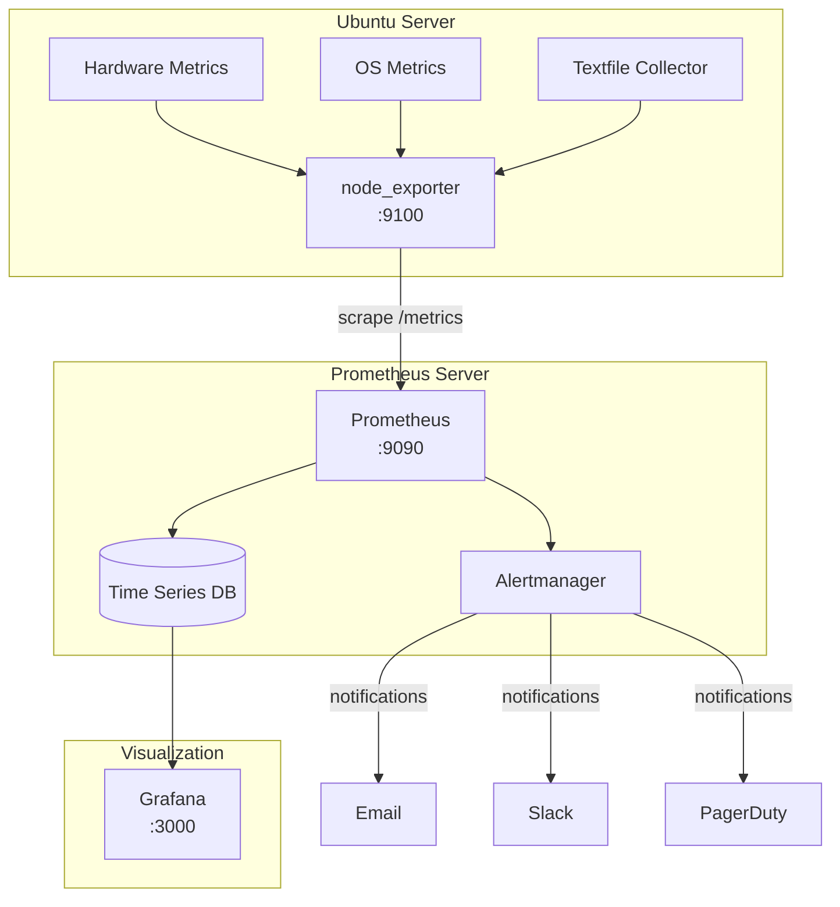
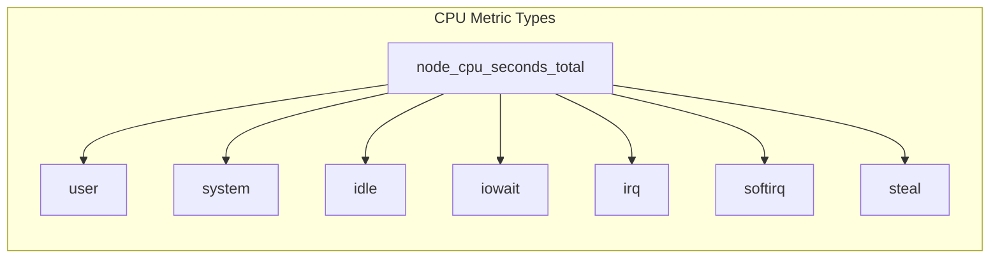
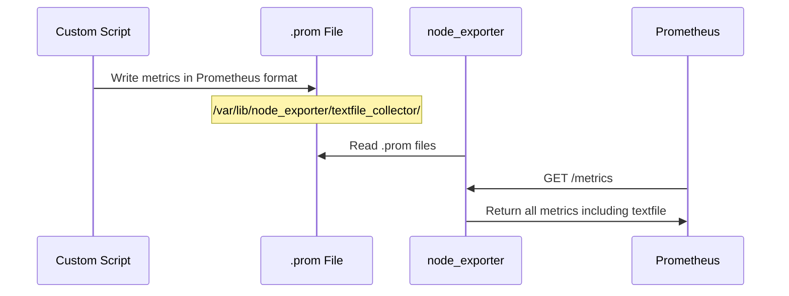

# How to Monitor Ubuntu Servers with Prometheus node_exporter

Author: [nawazdhandala](https://github.com/nawazdhandala)

Tags: Ubuntu, Linux, Prometheus, Monitoring, Metrics, Observability

Description: Learn how to install and configure node_exporter for comprehensive Ubuntu server monitoring with Prometheus.

---

Monitoring your Ubuntu servers is essential for maintaining system health, identifying performance bottlenecks, and preventing outages before they impact your users. Prometheus node_exporter is one of the most powerful and widely-used tools for collecting hardware and OS metrics from Linux servers. In this comprehensive guide, we will walk through installing node_exporter as a systemd service, understanding key metrics, setting up custom collectors, and creating alerting rules for common issues.

## Understanding the Monitoring Architecture

Before diving into the installation, let's understand how Prometheus and node_exporter work together to provide comprehensive server monitoring.



The architecture consists of three main components:

1. **node_exporter**: Runs on each Ubuntu server and exposes hardware and OS metrics via HTTP endpoint
2. **Prometheus**: Scrapes metrics from node_exporter endpoints and stores them in a time-series database
3. **Alertmanager**: Handles alerts sent by Prometheus and routes notifications to various channels

## Prerequisites

Before starting, ensure you have:

- Ubuntu 20.04 LTS or later (this guide uses Ubuntu 22.04/24.04)
- Root or sudo access to the server
- A Prometheus server (can be on the same or different machine)
- Basic familiarity with systemd and the Linux command line

## Installing node_exporter as a Systemd Service

### Step 1: Create a Dedicated System User

Creating a dedicated user for node_exporter follows the principle of least privilege, ensuring the exporter runs with minimal permissions.

```bash
# Create a system user named 'node_exporter' with no login shell and no home directory
# --no-create-home: Prevents creating a home directory (not needed for service accounts)
# --shell /bin/false: Prevents interactive login for security
sudo useradd --no-create-home --shell /bin/false node_exporter
```

### Step 2: Download and Install node_exporter

We will download the latest stable release from the official Prometheus GitHub repository.

```bash
# Define the version to install (check https://github.com/prometheus/node_exporter/releases for latest)
NODE_EXPORTER_VERSION="1.8.2"

# Download the node_exporter binary archive
# Using wget to fetch the tarball from GitHub releases
wget https://github.com/prometheus/node_exporter/releases/download/v${NODE_EXPORTER_VERSION}/node_exporter-${NODE_EXPORTER_VERSION}.linux-amd64.tar.gz

# Extract the downloaded archive
# -x: extract, -z: decompress gzip, -v: verbose, -f: file
tar xzvf node_exporter-${NODE_EXPORTER_VERSION}.linux-amd64.tar.gz

# Move the binary to a system-wide location
# /usr/local/bin is the standard location for locally installed programs
sudo mv node_exporter-${NODE_EXPORTER_VERSION}.linux-amd64/node_exporter /usr/local/bin/

# Set ownership to the node_exporter user we created earlier
sudo chown node_exporter:node_exporter /usr/local/bin/node_exporter

# Clean up the downloaded files
rm -rf node_exporter-${NODE_EXPORTER_VERSION}.linux-amd64*

# Verify the installation by checking the version
node_exporter --version
```

### Step 3: Create the Systemd Service File

Systemd manages the node_exporter service, ensuring it starts automatically on boot and restarts if it crashes.

```bash
# Create the systemd service file using a heredoc
# This allows us to write multi-line content directly to the file
sudo tee /etc/systemd/system/node_exporter.service << 'EOF'
[Unit]
# Description shown in systemctl status and logs
Description=Prometheus Node Exporter
# Ensure network is available before starting
Wants=network-online.target
After=network-online.target

[Service]
# Run as the dedicated node_exporter user for security
User=node_exporter
Group=node_exporter
# Simple type means systemd considers the service started immediately
Type=simple
# Path to the node_exporter binary
ExecStart=/usr/local/bin/node_exporter \
    # Enable specific collectors for detailed metrics
    --collector.systemd \
    --collector.processes \
    # Enable textfile collector for custom metrics
    --collector.textfile.directory=/var/lib/node_exporter/textfile_collector

# Restart the service if it exits unexpectedly
Restart=always
# Wait 3 seconds before restarting
RestartSec=3

[Install]
# Start this service when the system reaches multi-user mode (normal boot)
WantedBy=multi-user.target
EOF
```

### Step 4: Create Directory for Textfile Collector

The textfile collector allows you to expose custom metrics by writing them to files.

```bash
# Create the directory for textfile collector metrics
# This directory will hold .prom files with custom metrics
sudo mkdir -p /var/lib/node_exporter/textfile_collector

# Set ownership so the node_exporter user can read files here
sudo chown node_exporter:node_exporter /var/lib/node_exporter/textfile_collector
```

### Step 5: Start and Enable the Service

Now we can start the node_exporter service and enable it to run on boot.

```bash
# Reload systemd to recognize the new service file
sudo systemctl daemon-reload

# Start the node_exporter service
sudo systemctl start node_exporter

# Enable the service to start automatically on boot
sudo systemctl enable node_exporter

# Check the status to verify it's running correctly
sudo systemctl status node_exporter
```

### Step 6: Verify the Installation

Confirm that node_exporter is working by accessing its metrics endpoint.

```bash
# Test the metrics endpoint locally
# node_exporter listens on port 9100 by default
curl http://localhost:9100/metrics | head -50

# Check if the port is listening
sudo ss -tlnp | grep 9100
```

You should see output containing metrics like `node_cpu_seconds_total`, `node_memory_MemTotal_bytes`, and many others.

## Understanding Key node_exporter Metrics

node_exporter exposes hundreds of metrics. Here's a breakdown of the most important ones organized by category.

### CPU Metrics



| Metric | Description | Usage |
|--------|-------------|-------|
| `node_cpu_seconds_total` | Total CPU time spent in each mode | Calculate CPU utilization percentage |
| `node_load1` | 1-minute load average | Quick system load indicator |
| `node_load5` | 5-minute load average | Medium-term load trend |
| `node_load15` | 15-minute load average | Long-term load baseline |

Here's a PromQL query to calculate CPU utilization percentage:

```promql
# Calculate the percentage of CPU time spent NOT idle
# rate() calculates per-second average rate of increase
# sum by (instance) aggregates across all CPU cores
100 - (avg by (instance) (rate(node_cpu_seconds_total{mode="idle"}[5m])) * 100)
```

### Memory Metrics

| Metric | Description | Usage |
|--------|-------------|-------|
| `node_memory_MemTotal_bytes` | Total physical memory | Capacity planning |
| `node_memory_MemAvailable_bytes` | Memory available for new processes | Real usable memory |
| `node_memory_MemFree_bytes` | Completely free memory | Often misleading, prefer MemAvailable |
| `node_memory_Buffers_bytes` | Memory used for I/O buffers | Understanding memory allocation |
| `node_memory_Cached_bytes` | Memory used for page cache | Understanding memory allocation |
| `node_memory_SwapTotal_bytes` | Total swap space | Swap monitoring |
| `node_memory_SwapFree_bytes` | Free swap space | Swap pressure indicator |

Here's a PromQL query to calculate memory utilization:

```promql
# Calculate memory usage percentage
# MemAvailable is the best indicator of actually available memory
# It accounts for buffers and cache that can be reclaimed
(1 - (node_memory_MemAvailable_bytes / node_memory_MemTotal_bytes)) * 100
```

### Disk Metrics

| Metric | Description | Usage |
|--------|-------------|-------|
| `node_filesystem_size_bytes` | Total filesystem size | Capacity monitoring |
| `node_filesystem_avail_bytes` | Available space for unprivileged users | Space alerts |
| `node_filesystem_free_bytes` | Free space (includes reserved) | Raw free space |
| `node_disk_read_bytes_total` | Total bytes read from disk | I/O throughput |
| `node_disk_written_bytes_total` | Total bytes written to disk | I/O throughput |
| `node_disk_io_time_seconds_total` | Time spent doing I/O | Disk saturation |

Here's a PromQL query to calculate disk usage:

```promql
# Calculate disk usage percentage for root filesystem
# Exclude special filesystems like tmpfs
(1 - (node_filesystem_avail_bytes{mountpoint="/"} / node_filesystem_size_bytes{mountpoint="/"})) * 100
```

### Network Metrics

| Metric | Description | Usage |
|--------|-------------|-------|
| `node_network_receive_bytes_total` | Total bytes received | Network throughput |
| `node_network_transmit_bytes_total` | Total bytes transmitted | Network throughput |
| `node_network_receive_errs_total` | Receive errors | Network health |
| `node_network_transmit_errs_total` | Transmit errors | Network health |
| `node_network_receive_drop_total` | Dropped received packets | Network issues |
| `node_network_transmit_drop_total` | Dropped transmitted packets | Network issues |

Here's a PromQL query to calculate network throughput:

```promql
# Calculate network receive rate in megabits per second
# rate() gives per-second rate, multiply by 8 to convert bytes to bits
# divide by 1e6 to get megabits
rate(node_network_receive_bytes_total{device="eth0"}[5m]) * 8 / 1e6
```

### System Metrics

| Metric | Description | Usage |
|--------|-------------|-------|
| `node_boot_time_seconds` | Unix timestamp of last boot | Uptime calculation |
| `node_time_seconds` | Current system time | Clock drift detection |
| `node_uname_info` | System information (kernel, OS) | Inventory management |
| `node_systemd_unit_state` | State of systemd units | Service health monitoring |

## Configuring Prometheus to Scrape node_exporter

Add the following job to your Prometheus configuration to scrape metrics from node_exporter.

```yaml
# prometheus.yml - Add this to your existing scrape_configs section
scrape_configs:
  # Job name appears in labels and helps identify the source
  - job_name: 'node'
    # How often to scrape metrics from targets
    scrape_interval: 15s
    # How long to wait for a scrape to complete
    scrape_timeout: 10s

    # Static configuration for target servers
    static_configs:
      # List of node_exporter endpoints to scrape
      # Replace with your actual server IPs or hostnames
      - targets:
        - 'server1.example.com:9100'
        - 'server2.example.com:9100'
        - '192.168.1.10:9100'
        # Custom labels applied to all metrics from these targets
        labels:
          env: 'production'
          team: 'platform'
```

For dynamic service discovery with multiple servers, consider using file-based service discovery:

```yaml
# prometheus.yml - Using file-based service discovery
scrape_configs:
  - job_name: 'node'
    scrape_interval: 15s
    # File-based service discovery reads targets from JSON/YAML files
    # Prometheus automatically reloads when files change
    file_sd_configs:
      - files:
        - '/etc/prometheus/targets/nodes/*.yml'
        # How often to check for file changes
        refresh_interval: 30s
```

Example target file (`/etc/prometheus/targets/nodes/production.yml`):

```yaml
# Production server targets for node_exporter
# Each entry in the list is a target group
- targets:
    - 'prod-web-01.example.com:9100'
    - 'prod-web-02.example.com:9100'
    - 'prod-db-01.example.com:9100'
  labels:
    env: 'production'
    datacenter: 'us-east-1'

- targets:
    - 'prod-cache-01.example.com:9100'
  labels:
    env: 'production'
    datacenter: 'us-west-2'
    role: 'cache'
```

## Using the Textfile Collector for Custom Metrics

The textfile collector allows you to expose custom metrics that node_exporter cannot collect natively. This is useful for application-specific metrics, batch job results, or any custom data.

### How the Textfile Collector Works



### Example 1: Monitoring Backup Status

Create a script that tracks backup job completion and recency.

```bash
# Create a script to track backup status
# This script should be run by your backup cron job after completion
sudo tee /usr/local/bin/backup_metrics.sh << 'EOF'
#!/bin/bash
# backup_metrics.sh - Generate Prometheus metrics for backup monitoring
# This script creates metrics in the Prometheus exposition format

# Define the output file path
# Note: We write to a temp file first, then atomically move it
# This prevents Prometheus from reading a partially written file
OUTPUT_FILE="/var/lib/node_exporter/textfile_collector/backup.prom"
TEMP_FILE="${OUTPUT_FILE}.tmp"

# Get the timestamp of the last successful backup
# Adjust this path to match your backup location
BACKUP_DIR="/var/backups"
LATEST_BACKUP=$(find ${BACKUP_DIR} -name "*.tar.gz" -type f -printf '%T@\n' 2>/dev/null | sort -n | tail -1)

# Calculate backup age in seconds (time since last backup)
if [ -n "${LATEST_BACKUP}" ]; then
    CURRENT_TIME=$(date +%s)
    BACKUP_AGE=$(echo "${CURRENT_TIME} - ${LATEST_BACKUP%.*}" | bc)
    BACKUP_EXISTS=1
else
    BACKUP_AGE=0
    BACKUP_EXISTS=0
fi

# Get backup size in bytes
BACKUP_SIZE=$(find ${BACKUP_DIR} -name "*.tar.gz" -type f -exec du -b {} + 2>/dev/null | sort -n | tail -1 | cut -f1)
BACKUP_SIZE=${BACKUP_SIZE:-0}

# Write metrics in Prometheus exposition format
# HELP provides a description for the metric
# TYPE specifies the metric type (gauge, counter, histogram, summary)
cat << METRICS > ${TEMP_FILE}
# HELP node_backup_last_success_timestamp_seconds Unix timestamp of the last successful backup
# TYPE node_backup_last_success_timestamp_seconds gauge
node_backup_last_success_timestamp_seconds ${LATEST_BACKUP:-0}

# HELP node_backup_age_seconds Seconds since the last successful backup
# TYPE node_backup_age_seconds gauge
node_backup_age_seconds ${BACKUP_AGE}

# HELP node_backup_size_bytes Size of the most recent backup in bytes
# TYPE node_backup_size_bytes gauge
node_backup_size_bytes ${BACKUP_SIZE}

# HELP node_backup_exists Whether a backup file exists (1=yes, 0=no)
# TYPE node_backup_exists gauge
node_backup_exists ${BACKUP_EXISTS}
METRICS

# Atomically move the temp file to the final location
# This ensures node_exporter never reads a partial file
mv ${TEMP_FILE} ${OUTPUT_FILE}
EOF

# Make the script executable
sudo chmod +x /usr/local/bin/backup_metrics.sh

# Test the script
sudo /usr/local/bin/backup_metrics.sh

# View the generated metrics
cat /var/lib/node_exporter/textfile_collector/backup.prom
```

Add a cron job to run the metrics script periodically:

```bash
# Add cron job to update backup metrics every 5 minutes
# The output is redirected to /dev/null to avoid cron emails
echo "*/5 * * * * root /usr/local/bin/backup_metrics.sh > /dev/null 2>&1" | sudo tee /etc/cron.d/backup_metrics
```

### Example 2: Monitoring SSL Certificate Expiry

Create a script to track SSL certificate expiration dates.

```bash
# Create a script to check SSL certificate expiration
sudo tee /usr/local/bin/ssl_cert_metrics.sh << 'EOF'
#!/bin/bash
# ssl_cert_metrics.sh - Generate metrics for SSL certificate monitoring
# Checks certificates and reports days until expiration

OUTPUT_FILE="/var/lib/node_exporter/textfile_collector/ssl_certs.prom"
TEMP_FILE="${OUTPUT_FILE}.tmp"

# Start with empty temp file and add header
cat << HEADER > ${TEMP_FILE}
# HELP node_ssl_cert_expiry_days Days until SSL certificate expires
# TYPE node_ssl_cert_expiry_days gauge
# HELP node_ssl_cert_not_after_timestamp Unix timestamp when certificate expires
# TYPE node_ssl_cert_not_after_timestamp gauge
HEADER

# Function to check a certificate file and append metrics
check_cert() {
    local cert_path="$1"
    local cert_name="$2"

    # Check if certificate file exists
    if [ ! -f "${cert_path}" ]; then
        return
    fi

    # Extract expiration date from certificate using OpenSSL
    # -noout: Don't output the certificate itself
    # -enddate: Show the expiration date
    local expiry_date=$(openssl x509 -in "${cert_path}" -noout -enddate 2>/dev/null | cut -d= -f2)

    if [ -n "${expiry_date}" ]; then
        # Convert expiry date to Unix timestamp
        local expiry_timestamp=$(date -d "${expiry_date}" +%s 2>/dev/null)
        local current_timestamp=$(date +%s)

        # Calculate days until expiration
        local seconds_remaining=$((expiry_timestamp - current_timestamp))
        local days_remaining=$((seconds_remaining / 86400))

        # Append metrics for this certificate
        echo "node_ssl_cert_expiry_days{certificate=\"${cert_name}\",path=\"${cert_path}\"} ${days_remaining}" >> ${TEMP_FILE}
        echo "node_ssl_cert_not_after_timestamp{certificate=\"${cert_name}\",path=\"${cert_path}\"} ${expiry_timestamp}" >> ${TEMP_FILE}
    fi
}

# Check common certificate locations
# Add or modify these paths based on your environment
check_cert "/etc/ssl/certs/server.crt" "server"
check_cert "/etc/letsencrypt/live/example.com/fullchain.pem" "letsencrypt"
check_cert "/etc/nginx/ssl/nginx.crt" "nginx"

# Also check any certificates in a custom directory
for cert in /etc/ssl/custom/*.crt; do
    [ -f "$cert" ] && check_cert "$cert" "$(basename ${cert%.crt})"
done

# Atomically replace the metrics file
mv ${TEMP_FILE} ${OUTPUT_FILE}
EOF

# Make executable and set up cron job to run daily
sudo chmod +x /usr/local/bin/ssl_cert_metrics.sh
echo "0 */6 * * * root /usr/local/bin/ssl_cert_metrics.sh > /dev/null 2>&1" | sudo tee /etc/cron.d/ssl_cert_metrics
```

### Example 3: Monitoring Application Health

Create a script that checks if critical services are running.

```bash
# Create a script to monitor critical services
sudo tee /usr/local/bin/service_metrics.sh << 'EOF'
#!/bin/bash
# service_metrics.sh - Generate metrics for service health monitoring
# Reports whether critical services are active

OUTPUT_FILE="/var/lib/node_exporter/textfile_collector/services.prom"
TEMP_FILE="${OUTPUT_FILE}.tmp"

# Define the services to monitor
# Modify this list based on your environment
SERVICES="nginx mysql redis-server docker"

# Start the metrics file with type definitions
cat << HEADER > ${TEMP_FILE}
# HELP node_service_up Whether the service is running (1=up, 0=down)
# TYPE node_service_up gauge
# HELP node_service_uptime_seconds How long the service has been running
# TYPE node_service_uptime_seconds gauge
HEADER

# Check each service and generate metrics
for service in ${SERVICES}; do
    # Check if service is active using systemctl
    # is-active returns "active" if running, other states if not
    if systemctl is-active --quiet ${service} 2>/dev/null; then
        status=1

        # Get service uptime by parsing the "Active" line from systemctl status
        # The timestamp shows when the service started
        active_since=$(systemctl show ${service} --property=ActiveEnterTimestamp 2>/dev/null | cut -d= -f2)
        if [ -n "${active_since}" ]; then
            start_ts=$(date -d "${active_since}" +%s 2>/dev/null || echo 0)
            current_ts=$(date +%s)
            uptime=$((current_ts - start_ts))
        else
            uptime=0
        fi
    else
        status=0
        uptime=0
    fi

    # Append metrics for this service
    echo "node_service_up{service=\"${service}\"} ${status}" >> ${TEMP_FILE}
    echo "node_service_uptime_seconds{service=\"${service}\"} ${uptime}" >> ${TEMP_FILE}
done

# Atomically replace the metrics file
mv ${TEMP_FILE} ${OUTPUT_FILE}
EOF

# Make executable and run every minute
sudo chmod +x /usr/local/bin/service_metrics.sh
echo "* * * * * root /usr/local/bin/service_metrics.sh > /dev/null 2>&1" | sudo tee /etc/cron.d/service_metrics
```

## Alerting Rules for Common Issues

Create comprehensive alerting rules to catch common server issues before they become critical.

```yaml
# /etc/prometheus/rules/node_alerts.yml
# Alerting rules for node_exporter metrics
# Save this file and add it to your Prometheus rule_files configuration

groups:
  # Group for instance availability alerts
  - name: node_instance_alerts
    rules:
      # Alert when a node_exporter target is unreachable
      - alert: NodeExporterDown
        # up{} is a special metric that equals 1 when the target is reachable
        expr: up{job="node"} == 0
        # Wait 2 minutes before firing to avoid flapping
        for: 2m
        labels:
          severity: critical
        annotations:
          summary: "Node exporter is down on {{ $labels.instance }}"
          description: "The node_exporter on {{ $labels.instance }} has been unreachable for more than 2 minutes."
          runbook_url: "https://wiki.example.com/runbooks/node-exporter-down"

  # Group for CPU-related alerts
  - name: node_cpu_alerts
    rules:
      # Alert when CPU usage is consistently high
      - alert: HighCpuUsage
        # Calculate CPU usage: 100% minus idle percentage
        # avg by (instance) aggregates across all CPU cores
        expr: 100 - (avg by (instance) (rate(node_cpu_seconds_total{mode="idle"}[5m])) * 100) > 80
        for: 10m
        labels:
          severity: warning
        annotations:
          summary: "High CPU usage detected on {{ $labels.instance }}"
          description: "CPU usage has been above 80% for more than 10 minutes. Current value: {{ $value | printf \"%.1f\" }}%"

      # Alert when CPU usage is critically high
      - alert: CriticalCpuUsage
        expr: 100 - (avg by (instance) (rate(node_cpu_seconds_total{mode="idle"}[5m])) * 100) > 95
        for: 5m
        labels:
          severity: critical
        annotations:
          summary: "Critical CPU usage on {{ $labels.instance }}"
          description: "CPU usage has been above 95% for more than 5 minutes. Current value: {{ $value | printf \"%.1f\" }}%"

      # Alert when system load is too high relative to CPU count
      - alert: HighSystemLoad
        # Compare 5-minute load average to number of CPU cores
        # Load > cores means processes are waiting for CPU time
        expr: node_load5 / count by (instance) (node_cpu_seconds_total{mode="idle"}) > 2
        for: 15m
        labels:
          severity: warning
        annotations:
          summary: "High system load on {{ $labels.instance }}"
          description: "System load is more than 2x the number of CPU cores. Load: {{ $value | printf \"%.2f\" }}"

  # Group for memory-related alerts
  - name: node_memory_alerts
    rules:
      # Alert when available memory is low
      - alert: LowMemoryAvailable
        # MemAvailable is the best indicator of usable memory
        expr: (node_memory_MemAvailable_bytes / node_memory_MemTotal_bytes) * 100 < 15
        for: 5m
        labels:
          severity: warning
        annotations:
          summary: "Low memory available on {{ $labels.instance }}"
          description: "Less than 15% of memory is available. Current available: {{ $value | printf \"%.1f\" }}%"

      # Alert when memory is critically low
      - alert: CriticalMemoryUsage
        expr: (node_memory_MemAvailable_bytes / node_memory_MemTotal_bytes) * 100 < 5
        for: 2m
        labels:
          severity: critical
        annotations:
          summary: "Critical memory usage on {{ $labels.instance }}"
          description: "Less than 5% of memory is available. System may become unresponsive."

      # Alert when swap usage is high (indicates memory pressure)
      - alert: HighSwapUsage
        # High swap usage often indicates the system needs more RAM
        expr: (1 - (node_memory_SwapFree_bytes / node_memory_SwapTotal_bytes)) * 100 > 80
        for: 10m
        labels:
          severity: warning
        annotations:
          summary: "High swap usage on {{ $labels.instance }}"
          description: "Swap usage is above 80%. Current usage: {{ $value | printf \"%.1f\" }}%"

      # Alert when OOM killer has been triggered
      - alert: OOMKillerActive
        # Detect increase in OOM kill count
        expr: increase(node_vmstat_oom_kill[5m]) > 0
        labels:
          severity: critical
        annotations:
          summary: "OOM killer triggered on {{ $labels.instance }}"
          description: "The Out-Of-Memory killer has terminated processes in the last 5 minutes."

  # Group for disk-related alerts
  - name: node_disk_alerts
    rules:
      # Alert when disk space is running low
      - alert: DiskSpaceLow
        # Exclude special filesystems that don't need monitoring
        expr: |
          (1 - (node_filesystem_avail_bytes{fstype!~"tmpfs|overlay"} / node_filesystem_size_bytes{fstype!~"tmpfs|overlay"})) * 100 > 80
        for: 10m
        labels:
          severity: warning
        annotations:
          summary: "Disk space low on {{ $labels.instance }}"
          description: "Disk usage on {{ $labels.mountpoint }} is above 80%. Current usage: {{ $value | printf \"%.1f\" }}%"

      # Alert when disk space is critically low
      - alert: DiskSpaceCritical
        expr: |
          (1 - (node_filesystem_avail_bytes{fstype!~"tmpfs|overlay"} / node_filesystem_size_bytes{fstype!~"tmpfs|overlay"})) * 100 > 90
        for: 5m
        labels:
          severity: critical
        annotations:
          summary: "Critical disk space on {{ $labels.instance }}"
          description: "Disk usage on {{ $labels.mountpoint }} is above 90%. Immediate action required!"

      # Predict disk space exhaustion
      - alert: DiskSpaceExhaustionPredicted
        # predict_linear estimates future values based on trend
        # This predicts when available space will reach 0
        expr: |
          predict_linear(node_filesystem_avail_bytes{fstype!~"tmpfs|overlay"}[24h], 7*24*3600) < 0
        for: 30m
        labels:
          severity: warning
        annotations:
          summary: "Disk space exhaustion predicted on {{ $labels.instance }}"
          description: "Based on current trends, disk {{ $labels.mountpoint }} will be full within 7 days."

      # Alert when inode usage is high
      - alert: InodeUsageHigh
        # Running out of inodes prevents creating new files even with free space
        expr: (1 - (node_filesystem_files_free / node_filesystem_files)) * 100 > 80
        for: 10m
        labels:
          severity: warning
        annotations:
          summary: "High inode usage on {{ $labels.instance }}"
          description: "Inode usage on {{ $labels.mountpoint }} is above 80%. Too many small files may cause issues."

      # Alert when disk I/O is saturated
      - alert: DiskIOSaturation
        # io_time_seconds_total > 0.9 means disk is busy >90% of the time
        expr: rate(node_disk_io_time_seconds_total[5m]) > 0.9
        for: 15m
        labels:
          severity: warning
        annotations:
          summary: "Disk I/O saturation on {{ $labels.instance }}"
          description: "Disk {{ $labels.device }} is saturated. I/O utilization: {{ $value | printf \"%.1f\" }}"

  # Group for network-related alerts
  - name: node_network_alerts
    rules:
      # Alert when network receive errors are occurring
      - alert: NetworkReceiveErrors
        # Any sustained error rate is concerning
        expr: rate(node_network_receive_errs_total{device!~"lo|veth.*"}[5m]) > 0
        for: 5m
        labels:
          severity: warning
        annotations:
          summary: "Network receive errors on {{ $labels.instance }}"
          description: "Interface {{ $labels.device }} is experiencing receive errors."

      # Alert when network transmit errors are occurring
      - alert: NetworkTransmitErrors
        expr: rate(node_network_transmit_errs_total{device!~"lo|veth.*"}[5m]) > 0
        for: 5m
        labels:
          severity: warning
        annotations:
          summary: "Network transmit errors on {{ $labels.instance }}"
          description: "Interface {{ $labels.device }} is experiencing transmit errors."

      # Alert on unusual network traffic (possible DDoS or data exfiltration)
      - alert: UnusualNetworkTraffic
        # Trigger if traffic is 3x higher than typical (customize threshold)
        expr: |
          rate(node_network_receive_bytes_total{device!~"lo|veth.*"}[5m]) > 100000000
          or rate(node_network_transmit_bytes_total{device!~"lo|veth.*"}[5m]) > 100000000
        for: 10m
        labels:
          severity: warning
        annotations:
          summary: "Unusual network traffic on {{ $labels.instance }}"
          description: "Network traffic on {{ $labels.device }} exceeds 100MB/s. Investigate possible issues."

  # Group for system health alerts
  - name: node_system_alerts
    rules:
      # Alert when clock is out of sync
      - alert: ClockSkewDetected
        # Compare node time to Prometheus server time
        expr: abs(node_time_seconds - time()) > 60
        for: 5m
        labels:
          severity: warning
        annotations:
          summary: "Clock skew detected on {{ $labels.instance }}"
          description: "System clock is more than 60 seconds out of sync with Prometheus server."

      # Alert when system has been up for too long (may need patches)
      - alert: SystemNeedsReboot
        # 30 days without reboot might mean security patches aren't applied
        expr: (time() - node_boot_time_seconds) > (30 * 24 * 3600)
        labels:
          severity: info
        annotations:
          summary: "System needs reboot on {{ $labels.instance }}"
          description: "System has been running for more than 30 days. Consider rebooting to apply kernel updates."

      # Alert when too many file descriptors are in use
      - alert: HighFileDescriptorUsage
        expr: node_filefd_allocated / node_filefd_maximum * 100 > 80
        for: 10m
        labels:
          severity: warning
        annotations:
          summary: "High file descriptor usage on {{ $labels.instance }}"
          description: "File descriptor usage is above 80%. Current usage: {{ $value | printf \"%.1f\" }}%"

      # Alert on zombie processes
      - alert: ZombieProcesses
        # Zombie processes indicate parent not handling child exits
        expr: node_procs_zombie > 10
        for: 10m
        labels:
          severity: warning
        annotations:
          summary: "Zombie processes detected on {{ $labels.instance }}"
          description: "{{ $value }} zombie processes detected. This may indicate a process not handling child exits."

  # Group for custom textfile collector alerts
  - name: node_custom_alerts
    rules:
      # Alert when backup is too old
      - alert: BackupTooOld
        # Customize the threshold based on your backup schedule
        expr: node_backup_age_seconds > 86400  # 24 hours
        for: 1h
        labels:
          severity: warning
        annotations:
          summary: "Backup is too old on {{ $labels.instance }}"
          description: "Last successful backup was {{ $value | humanizeDuration }} ago."

      # Alert when no backup exists
      - alert: NoBackupFound
        expr: node_backup_exists == 0
        for: 1h
        labels:
          severity: critical
        annotations:
          summary: "No backup found on {{ $labels.instance }}"
          description: "No backup files were found. Verify backup jobs are running."

      # Alert when SSL certificate is expiring soon
      - alert: SSLCertificateExpiringSoon
        expr: node_ssl_cert_expiry_days < 30
        labels:
          severity: warning
        annotations:
          summary: "SSL certificate expiring soon on {{ $labels.instance }}"
          description: "Certificate {{ $labels.certificate }} expires in {{ $value }} days."

      # Alert when SSL certificate is about to expire
      - alert: SSLCertificateExpiryCritical
        expr: node_ssl_cert_expiry_days < 7
        labels:
          severity: critical
        annotations:
          summary: "SSL certificate critical on {{ $labels.instance }}"
          description: "Certificate {{ $labels.certificate }} expires in {{ $value }} days! Renew immediately!"

      # Alert when a critical service is down
      - alert: CriticalServiceDown
        expr: node_service_up == 0
        for: 1m
        labels:
          severity: critical
        annotations:
          summary: "Service {{ $labels.service }} is down on {{ $labels.instance }}"
          description: "The {{ $labels.service }} service has been down for more than 1 minute."
```

## Security Best Practices

When exposing node_exporter metrics, follow these security practices:

### 1. Restrict Network Access

Use firewall rules to limit access to the node_exporter port.

```bash
# Using ufw (Ubuntu's default firewall)
# Allow access only from Prometheus server IP

# Enable ufw if not already enabled
sudo ufw enable

# Allow node_exporter access only from Prometheus server
# Replace 10.0.0.100 with your Prometheus server IP
sudo ufw allow from 10.0.0.100 to any port 9100 proto tcp

# Deny all other access to port 9100
sudo ufw deny 9100

# Verify the rules
sudo ufw status numbered
```

### 2. Enable TLS Encryption

Configure node_exporter to use TLS for encrypted communication.

```bash
# Generate a self-signed certificate (or use your CA-signed certificate)
sudo mkdir -p /etc/node_exporter

# Generate private key and self-signed certificate
# In production, use certificates signed by your internal CA
sudo openssl req -new -newkey rsa:2048 -days 365 -nodes -x509 \
    -keyout /etc/node_exporter/node_exporter.key \
    -out /etc/node_exporter/node_exporter.crt \
    -subj "/CN=$(hostname -f)/O=YourOrganization"

# Set proper permissions
sudo chown node_exporter:node_exporter /etc/node_exporter/node_exporter.*
sudo chmod 600 /etc/node_exporter/node_exporter.key
```

Create a web configuration file:

```bash
# Create web configuration for TLS
sudo tee /etc/node_exporter/web.yml << 'EOF'
# TLS configuration for node_exporter
tls_server_config:
  # Path to the TLS certificate
  cert_file: /etc/node_exporter/node_exporter.crt
  # Path to the private key
  key_file: /etc/node_exporter/node_exporter.key
EOF

# Set proper ownership
sudo chown node_exporter:node_exporter /etc/node_exporter/web.yml
```

Update the systemd service to use the web configuration:

```bash
# Update the ExecStart line in the service file
sudo sed -i 's|ExecStart=/usr/local/bin/node_exporter|ExecStart=/usr/local/bin/node_exporter --web.config.file=/etc/node_exporter/web.yml|' /etc/systemd/system/node_exporter.service

# Reload and restart
sudo systemctl daemon-reload
sudo systemctl restart node_exporter
```

### 3. Enable Basic Authentication

Add basic authentication for an additional security layer.

```bash
# Generate a password hash using Python
# The bcrypt library is used for secure password hashing
sudo apt-get install -y python3-bcrypt

# Generate hashed password (replace 'your-password' with a strong password)
python3 -c "import bcrypt; print(bcrypt.hashpw('your-password'.encode(), bcrypt.gensalt()).decode())"
```

Update the web configuration to include authentication:

```bash
# Update web.yml with basic auth
sudo tee /etc/node_exporter/web.yml << 'EOF'
tls_server_config:
  cert_file: /etc/node_exporter/node_exporter.crt
  key_file: /etc/node_exporter/node_exporter.key

# Basic authentication configuration
basic_auth_users:
  # Username: prometheus (replace hash with your generated hash)
  prometheus: '$2b$12$hNf2lSsxfm0.i4a.1kVpSOVyBCfIB51VRjgBUyv6kdnyTlgWj81Ay'
EOF

# Restart node_exporter to apply changes
sudo systemctl restart node_exporter
```

Update Prometheus configuration to use authentication:

```yaml
# prometheus.yml - Update the node job configuration
scrape_configs:
  - job_name: 'node'
    # Scheme should be https when TLS is enabled
    scheme: https

    # TLS configuration for connecting to node_exporter
    tls_config:
      # Path to CA certificate (or use insecure_skip_verify for self-signed)
      ca_file: /etc/prometheus/node_exporter.crt
      # For self-signed certs in development (not recommended for production)
      # insecure_skip_verify: true

    # Basic auth credentials
    basic_auth:
      username: prometheus
      password: your-password

    static_configs:
      - targets:
        - 'server1.example.com:9100'
```

## Troubleshooting Common Issues

### node_exporter Fails to Start

Check the logs for error messages.

```bash
# View recent logs from node_exporter
# journalctl is used to query the systemd journal
sudo journalctl -u node_exporter -n 50 --no-pager

# Check if another process is using port 9100
sudo ss -tlnp | grep 9100

# Verify the binary has correct permissions
ls -la /usr/local/bin/node_exporter

# Test running node_exporter manually to see errors
sudo -u node_exporter /usr/local/bin/node_exporter
```

### Metrics Not Appearing in Prometheus

Verify connectivity between Prometheus and node_exporter.

```bash
# Test connectivity from Prometheus server
curl -v http://target-server:9100/metrics

# Check if firewall is blocking
sudo iptables -L -n | grep 9100

# Verify Prometheus can resolve the hostname
nslookup target-server

# Check Prometheus targets page
curl http://prometheus-server:9090/api/v1/targets | jq '.data.activeTargets[] | select(.labels.job=="node")'
```

### High Resource Usage by node_exporter

If node_exporter is using too many resources:

```bash
# Disable collectors that you don't need
# Edit the systemd service file
sudo tee /etc/systemd/system/node_exporter.service << 'EOF'
[Unit]
Description=Prometheus Node Exporter
Wants=network-online.target
After=network-online.target

[Service]
User=node_exporter
Group=node_exporter
Type=simple
ExecStart=/usr/local/bin/node_exporter \
    --collector.disable-defaults \
    --collector.cpu \
    --collector.meminfo \
    --collector.diskstats \
    --collector.filesystem \
    --collector.netdev \
    --collector.loadavg \
    --collector.textfile \
    --collector.textfile.directory=/var/lib/node_exporter/textfile_collector

Restart=always
RestartSec=3

[Install]
WantedBy=multi-user.target
EOF

sudo systemctl daemon-reload
sudo systemctl restart node_exporter
```

### Textfile Collector Not Working

Verify the textfile collector is properly configured.

```bash
# Check if the directory exists and has correct permissions
ls -la /var/lib/node_exporter/textfile_collector/

# Verify .prom files are valid
for f in /var/lib/node_exporter/textfile_collector/*.prom; do
    echo "=== $f ==="
    cat "$f"
    echo ""
done

# Check for parsing errors in the metrics endpoint
curl -s http://localhost:9100/metrics | grep -i "textfile"

# Look for collector errors in the output
curl -s http://localhost:9100/metrics | grep "node_textfile_scrape_error"
```

## Useful PromQL Queries for Dashboards

Here are some useful queries for creating Grafana dashboards.

```promql
# CPU Usage by Mode (for stacked graph)
# Shows breakdown of CPU time across different modes
sum by (mode) (rate(node_cpu_seconds_total[5m]))

# Memory Usage Breakdown (for pie chart)
# Shows how memory is allocated
node_memory_MemTotal_bytes - node_memory_MemAvailable_bytes  # Used
node_memory_Buffers_bytes                                     # Buffers
node_memory_Cached_bytes                                      # Cached
node_memory_MemFree_bytes                                     # Free

# Disk I/O Throughput (for time series)
# Read throughput in bytes per second
rate(node_disk_read_bytes_total[5m])
# Write throughput in bytes per second
rate(node_disk_written_bytes_total[5m])

# Network Traffic (for time series)
# Receive rate in bytes per second
rate(node_network_receive_bytes_total{device!~"lo|veth.*"}[5m])
# Transmit rate in bytes per second
rate(node_network_transmit_bytes_total{device!~"lo|veth.*"}[5m])

# System Uptime (for single stat)
# Time since last boot in seconds
time() - node_boot_time_seconds

# Top 5 Processes by CPU (requires process exporter)
# This requires the process-exporter, not node_exporter
topk(5, sum by (groupname) (rate(namedprocess_namegroup_cpu_seconds_total[5m])))

# Filesystem Usage by Mountpoint (for table)
# Shows usage percentage for each mounted filesystem
(1 - (node_filesystem_avail_bytes / node_filesystem_size_bytes)) * 100
```

## Conclusion

Prometheus node_exporter is an essential tool for monitoring Ubuntu servers. By following this guide, you have:

1. **Installed node_exporter** as a robust systemd service that starts automatically and recovers from failures
2. **Learned key metrics** and how to interpret them for CPU, memory, disk, and network monitoring
3. **Set up custom metrics** using the textfile collector for application-specific monitoring
4. **Created comprehensive alerting rules** to catch issues before they impact your users
5. **Implemented security best practices** including TLS encryption and authentication

The combination of node_exporter's comprehensive metrics, Prometheus's powerful querying capabilities, and well-designed alerting rules provides complete visibility into your Ubuntu server health. This foundation enables proactive infrastructure management and helps maintain high availability for your services.

## Further Reading

- [Official node_exporter Documentation](https://prometheus.io/docs/guides/node-exporter/)
- [Prometheus Alerting Best Practices](https://prometheus.io/docs/practices/alerting/)
- [Grafana Node Exporter Dashboard](https://grafana.com/grafana/dashboards/1860)
- [PromQL Query Examples](https://prometheus.io/docs/prometheus/latest/querying/examples/)
