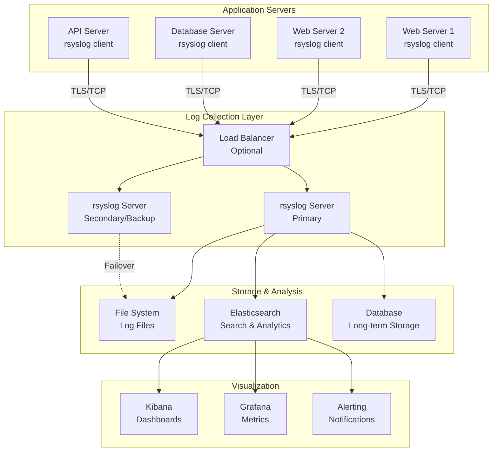
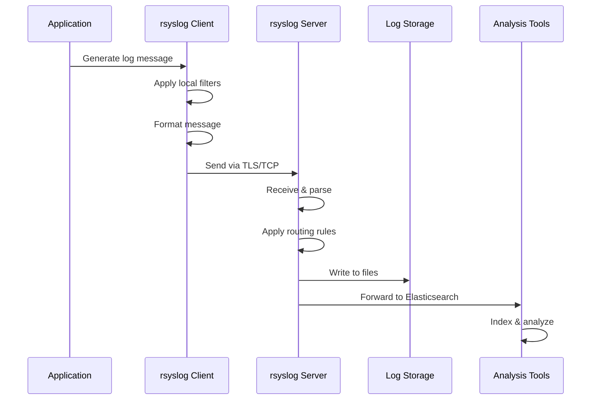
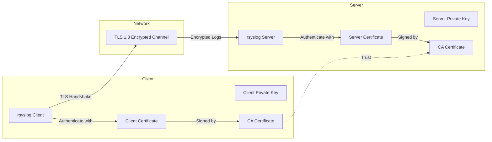
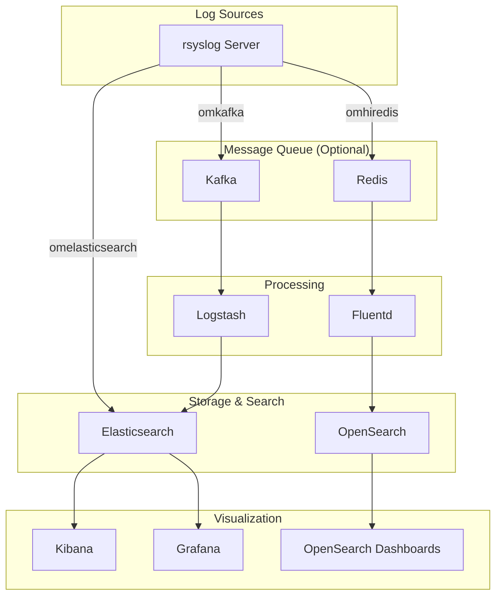
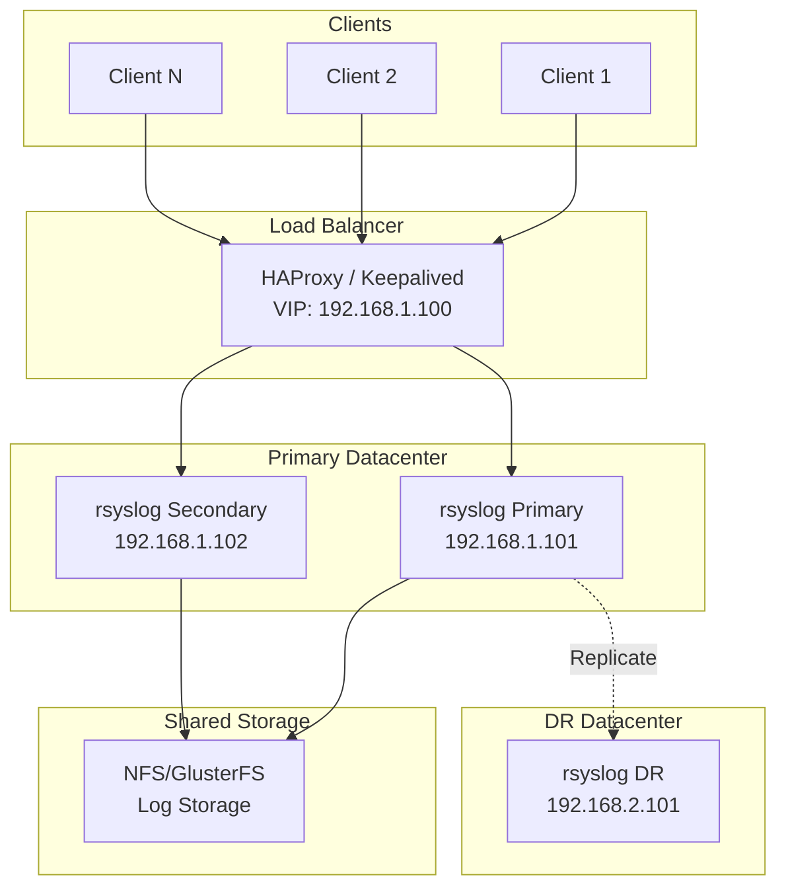

# How to Configure Centralized Logging with rsyslog on Ubuntu

Author: [nawazdhandala](https://github.com/nawazdhandala)

Tags: Ubuntu, Linux, Logging, Monitoring, Infrastructure, Security

Description: A complete guide to setting up centralized log collection and management with rsyslog on Ubuntu.

---

Centralized logging is a critical component of any production infrastructure. Instead of logging into individual servers to troubleshoot issues, centralized logging aggregates logs from all your systems into a single location, making it easier to search, analyze, and correlate events across your entire infrastructure. rsyslog is the default syslog daemon on Ubuntu and provides a powerful, flexible, and high-performance solution for centralized log management.

In this comprehensive guide, we will walk through setting up a complete centralized logging infrastructure using rsyslog on Ubuntu, including secure TLS encryption, advanced filtering rules, and integration with log analysis tools.

## Table of Contents

1. [Understanding rsyslog Architecture](#understanding-rsyslog-architecture)
2. [Prerequisites](#prerequisites)
3. [Configuring the rsyslog Server](#configuring-the-rsyslog-server)
4. [Configuring rsyslog Clients](#configuring-rsyslog-clients)
5. [Securing Log Transmission with TLS](#securing-log-transmission-with-tls)
6. [Log Filtering and Routing Rules](#log-filtering-and-routing-rules)
7. [Log Rotation and Retention](#log-rotation-and-retention)
8. [Integration with Log Analysis Tools](#integration-with-log-analysis-tools)
9. [Monitoring and Alerting](#monitoring-and-alerting)
10. [Troubleshooting](#troubleshooting)
11. [Best Practices](#best-practices)

## Understanding rsyslog Architecture

Before diving into configuration, let's understand how centralized logging with rsyslog works:



The architecture consists of three main components:

1. **rsyslog Clients**: Installed on each server that generates logs. They collect local logs and forward them to the central server.
2. **rsyslog Server**: The central collection point that receives, processes, filters, and stores logs from all clients.
3. **Analysis Layer**: Tools like Elasticsearch, Kibana, or Grafana that provide search, visualization, and alerting capabilities.

### rsyslog Message Flow



## Prerequisites

Before we begin, ensure you have:

- Ubuntu 20.04 LTS or later (this guide uses Ubuntu 22.04)
- Root or sudo access on all servers
- Network connectivity between client and server machines
- Firewall configured to allow syslog traffic (ports 514/TCP, 514/UDP, or 6514/TCP for TLS)

The following command checks your Ubuntu version and installed rsyslog version:

```bash
# Check Ubuntu version to ensure compatibility
lsb_release -a

# Verify rsyslog is installed (it comes pre-installed on Ubuntu)
rsyslogd -v
```

## Configuring the rsyslog Server

The central log server will receive and store logs from all client machines. Let's set it up step by step.

### Step 1: Install rsyslog (if not already installed)

rsyslog is pre-installed on Ubuntu, but let's ensure we have the latest version with all necessary modules:

```bash
# Update package lists to get the latest available versions
sudo apt update

# Install rsyslog and additional modules for extended functionality
# rsyslog-gnutls: Provides TLS encryption support
# rsyslog-elasticsearch: Enables direct forwarding to Elasticsearch
# rsyslog-relp: Reliable Event Logging Protocol for guaranteed delivery
sudo apt install -y rsyslog rsyslog-gnutls rsyslog-elasticsearch rsyslog-relp
```

### Step 2: Configure rsyslog to Accept Remote Logs

The main configuration file is `/etc/rsyslog.conf`. We need to enable TCP and UDP listeners:

```bash
# Create a backup of the original configuration before making changes
sudo cp /etc/rsyslog.conf /etc/rsyslog.conf.backup

# Edit the main rsyslog configuration file
sudo nano /etc/rsyslog.conf
```

Add or uncomment the following lines to enable remote log reception:

```bash
# /etc/rsyslog.conf - Main rsyslog configuration
# This configuration sets up rsyslog as a central log server

#################
#### MODULES ####
#################

# Load the imuxsock module for local system logging support
# This handles logs from the local system via /dev/log socket
module(load="imuxsock")

# Load the imklog module for kernel log support
# This captures messages from the kernel ring buffer
module(load="imklog")

# Load the immark module to provide periodic mark messages
# Useful for detecting log gaps and ensuring log flow
module(load="immark" interval="600")

# Load UDP syslog reception module
# UDP is faster but doesn't guarantee delivery
module(load="imudp")

# Configure UDP listener on standard syslog port 514
# Binds to all interfaces (0.0.0.0) by default
input(type="imudp" port="514")

# Load TCP syslog reception module
# TCP provides reliable delivery with acknowledgment
module(load="imtcp")

# Configure TCP listener on port 514
# TCP is recommended for important logs due to guaranteed delivery
input(type="imtcp" port="514")

###########################
#### GLOBAL DIRECTIVES ####
###########################

# Use traditional timestamp format for compatibility
# Set to "off" to use high-precision timestamps
$ActionFileDefaultTemplate RSYSLOG_TraditionalFileFormat

# Set the default permissions for newly created log files
# Owner: read/write, Group: read, Others: read
$FileOwner syslog
$FileGroup adm
$FileCreateMode 0640

# Set default permissions for log directories
$DirCreateMode 0755

# Enable high-precision timestamps for better log correlation
$ActionFileEnableSync on

# Configure the work directory for rsyslog
$WorkDirectory /var/spool/rsyslog

# Include all configuration files from /etc/rsyslog.d/
# This allows modular configuration management
$IncludeConfig /etc/rsyslog.d/*.conf
```

### Step 3: Create a Custom Configuration for Remote Logs

It's best practice to keep custom configurations in separate files under `/etc/rsyslog.d/`:

```bash
# Create a configuration file for remote log handling
sudo nano /etc/rsyslog.d/10-remote-logs.conf
```

Add the following configuration to organize remote logs by hostname:

```bash
# /etc/rsyslog.d/10-remote-logs.conf
# Configuration for receiving and organizing remote logs

# Define a template for organizing logs by hostname and date
# This creates a directory structure: /var/log/remote/<hostname>/<facility>.log
# %HOSTNAME% - the hostname of the sending machine
# %PROGRAMNAME% - the program that generated the log
# %syslogfacility-text% - the facility (auth, kern, mail, etc.)
template(name="RemoteLogs" type="string"
    string="/var/log/remote/%HOSTNAME%/%PROGRAMNAME%.log"
)

# Alternative template that organizes by date for easier log rotation
# Creates structure: /var/log/remote/<hostname>/<year>/<month>/<day>/<facility>.log
template(name="RemoteLogsByDate" type="string"
    string="/var/log/remote/%HOSTNAME%/%$year%/%$month%/%$day%/%syslogfacility-text%.log"
)

# Template for detailed log format with additional metadata
# Includes timestamp, hostname, program, PID, and message
template(name="DetailedFormat" type="string"
    string="%timegenerated% %HOSTNAME% %syslogtag%%msg:::sp-if-no-1st-sp%%msg:::drop-last-lf%\n"
)

# Template for JSON output (useful for log analysis tools)
# Structures log data as JSON for easy parsing
template(name="JsonFormat" type="list") {
    constant(value="{")
    constant(value="\"@timestamp\":\"")     property(name="timereported" dateFormat="rfc3339")
    constant(value="\",\"host\":\"")        property(name="hostname")
    constant(value="\",\"severity\":\"")    property(name="syslogseverity-text")
    constant(value="\",\"facility\":\"")    property(name="syslogfacility-text")
    constant(value="\",\"program\":\"")     property(name="programname")
    constant(value="\",\"message\":\"")     property(name="msg" format="json")
    constant(value="\"}\n")
}

# Create the remote logs directory with proper permissions
# This is executed only once when rsyslog starts
# Ensure the directory exists before rsyslog tries to write logs
# Run manually: sudo mkdir -p /var/log/remote && sudo chown syslog:adm /var/log/remote

# Rule to write all remote logs to their respective files
# The "if" condition excludes localhost to prevent duplicate logging
if $fromhost-ip != "127.0.0.1" then {
    # Write to hostname-based directory structure
    action(type="omfile" dynaFile="RemoteLogs" template="DetailedFormat")

    # Stop processing to prevent duplicate entries in default log files
    stop
}
```

### Step 4: Create the Remote Logs Directory

Set up the directory structure with appropriate permissions:

```bash
# Create the directory for storing remote logs
sudo mkdir -p /var/log/remote

# Set ownership to syslog user and adm group
# syslog user: the user rsyslog runs as
# adm group: allows administrators to read logs
sudo chown syslog:adm /var/log/remote

# Set permissions: owner can read/write/execute, group can read/execute
sudo chmod 755 /var/log/remote
```

### Step 5: Configure Firewall Rules

Allow incoming syslog traffic through the firewall:

```bash
# Allow TCP syslog traffic on port 514
sudo ufw allow 514/tcp comment "rsyslog TCP"

# Allow UDP syslog traffic on port 514
sudo ufw allow 514/udp comment "rsyslog UDP"

# If using TLS (recommended), allow port 6514
sudo ufw allow 6514/tcp comment "rsyslog TLS"

# Verify firewall rules
sudo ufw status verbose
```

### Step 6: Validate Configuration and Restart rsyslog

Before restarting, validate the configuration:

```bash
# Check configuration syntax for errors
# This command parses the config without starting rsyslog
sudo rsyslogd -N1

# If no errors, restart rsyslog to apply changes
sudo systemctl restart rsyslog

# Verify rsyslog is running properly
sudo systemctl status rsyslog

# Check that rsyslog is listening on the configured ports
sudo ss -tulnp | grep rsyslog
```

## Configuring rsyslog Clients

Now let's configure the client machines to send their logs to the central server.

### Step 1: Install rsyslog on Client

Ensure rsyslog is installed on the client machine:

```bash
# Update packages and install rsyslog with TLS support
sudo apt update
sudo apt install -y rsyslog rsyslog-gnutls
```

### Step 2: Configure Client to Forward Logs

Create a configuration file for forwarding logs:

```bash
# Create client forwarding configuration
sudo nano /etc/rsyslog.d/50-remote-forward.conf
```

Add the following configuration:

```bash
# /etc/rsyslog.d/50-remote-forward.conf
# Client configuration for forwarding logs to central server

# Define the central log server address
# Replace with your actual log server IP or hostname
$ActionQueueType LinkedList
$ActionQueueFileName fwdRule1
$ActionResumeRetryCount -1
$ActionQueueSaveOnShutdown on

# Queue configuration for reliable delivery
# These settings ensure logs are not lost during network issues

# ActionQueueType: LinkedList provides memory-efficient queuing
# ActionQueueFileName: Base name for disk-assisted queue files
# ActionResumeRetryCount: -1 means infinite retries
# ActionQueueSaveOnShutdown: Save queue to disk on shutdown

# Forward all logs to central server via TCP (port 514)
# The @@ prefix indicates TCP; a single @ would use UDP
# Format: @@<server>:<port>
# TCP is recommended as it provides guaranteed delivery
*.* @@192.168.1.100:514

# Alternative: Forward only specific facilities/priorities
# The following examples show selective forwarding:

# Forward only authentication logs (useful for security monitoring)
# auth,authpriv.* @@192.168.1.100:514

# Forward all logs with priority warning or higher
# *.warn @@192.168.1.100:514

# Forward kernel messages (useful for hardware/driver issues)
# kern.* @@192.168.1.100:514

# Forward everything except mail and debug messages
# *.*;mail.none;*.!=debug @@192.168.1.100:514
```

### Step 3: Configure Action Queues for Reliability

For production environments, configure disk-assisted queues to prevent log loss:

```bash
# Create an enhanced configuration with queue management
sudo nano /etc/rsyslog.d/50-remote-forward-queued.conf
```

Add the following advanced configuration:

```bash
# /etc/rsyslog.d/50-remote-forward-queued.conf
# Advanced client configuration with disk-assisted queuing

# Define the remote server using the newer RainerScript syntax
# This provides more flexibility and clearer configuration

# Main forwarding rule with full queue configuration
module(load="omfwd")

action(
    # Use omfwd (output module forward) for remote logging
    type="omfwd"

    # Target server configuration
    target="192.168.1.100"
    port="514"
    protocol="tcp"

    # Enable disk-assisted queuing for reliability
    # This prevents log loss during network outages
    queue.type="LinkedList"
    queue.filename="fwdToLogServer"

    # Queue size and behavior settings
    # queue.maxdiskspace: Maximum disk space for queue (1GB)
    queue.maxdiskspace="1g"

    # queue.saveonshutdown: Preserve queue contents during restart
    queue.saveonshutdown="on"

    # queue.size: Maximum number of messages in memory queue
    queue.size="50000"

    # queue.highwatermark: Start disk queuing at this threshold
    queue.highwatermark="40000"

    # queue.lowwatermark: Return to memory-only at this threshold
    queue.lowwatermark="20000"

    # Retry settings
    # action.resumeRetryCount: -1 for infinite retries
    action.resumeRetryCount="-1"

    # action.resumeInterval: Seconds between retry attempts
    action.resumeInterval="30"

    # Timeout settings
    # conn.timeout: Connection timeout in milliseconds
    conn.timeout="5000"
)
```

### Step 4: Test and Apply Client Configuration

Validate and restart rsyslog on the client:

```bash
# Verify configuration syntax
sudo rsyslogd -N1

# Restart rsyslog to apply changes
sudo systemctl restart rsyslog

# Verify service is running
sudo systemctl status rsyslog

# Send a test message to verify forwarding
logger -t "TEST" "Test message from $(hostname) to central log server"
```

### Step 5: Verify Logs on Server

On the central log server, check if the test message arrived:

```bash
# Check the remote logs directory for client hostname
ls -la /var/log/remote/

# View recent entries (replace <client-hostname> with actual hostname)
tail -f /var/log/remote/<client-hostname>/TEST.log

# Alternative: Check the main syslog file
sudo tail -f /var/log/syslog | grep TEST
```

## Securing Log Transmission with TLS

Sending logs in plain text over the network is a security risk. TLS encryption ensures confidentiality and integrity of log data in transit.

### TLS Architecture



### Step 1: Generate TLS Certificates

First, create a Certificate Authority (CA) and generate certificates for the server and clients:

```bash
# Create a directory for certificates
sudo mkdir -p /etc/rsyslog/ssl
cd /etc/rsyslog/ssl

# Generate the Certificate Authority (CA) private key
# The CA will sign all other certificates
# Using 4096-bit RSA for strong security
sudo openssl genrsa -out ca-key.pem 4096

# Generate the CA certificate
# This certificate will be distributed to all clients and servers
# Valid for 10 years (3650 days)
sudo openssl req -new -x509 -days 3650 -key ca-key.pem -out ca-cert.pem \
    -subj "/C=US/ST=State/L=City/O=Organization/OU=IT/CN=Logging-CA"

# Generate the server private key
sudo openssl genrsa -out server-key.pem 4096

# Create a Certificate Signing Request (CSR) for the server
# Replace the CN with your actual server hostname or IP
sudo openssl req -new -key server-key.pem -out server-csr.pem \
    -subj "/C=US/ST=State/L=City/O=Organization/OU=IT/CN=logserver.example.com"

# Create a file for Subject Alternative Names (SANs)
# This allows the certificate to work with multiple hostnames/IPs
cat > server-ext.cnf << EOF
authorityKeyIdentifier=keyid,issuer
basicConstraints=CA:FALSE
keyUsage = digitalSignature, keyEncipherment
subjectAltName = @alt_names

[alt_names]
DNS.1 = logserver.example.com
DNS.2 = logserver
IP.1 = 192.168.1.100
EOF

# Sign the server certificate with the CA
sudo openssl x509 -req -days 3650 -in server-csr.pem -CA ca-cert.pem \
    -CAkey ca-key.pem -CAcreateserial -out server-cert.pem \
    -extfile server-ext.cnf

# Verify the server certificate
openssl verify -CAfile ca-cert.pem server-cert.pem
```

### Step 2: Generate Client Certificates

For each client machine, generate a unique certificate:

```bash
# Run this on the CA server/machine for each client
# Replace "client1" with the actual client hostname

CLIENT_NAME="client1"

# Generate client private key
sudo openssl genrsa -out ${CLIENT_NAME}-key.pem 4096

# Create client CSR
sudo openssl req -new -key ${CLIENT_NAME}-key.pem -out ${CLIENT_NAME}-csr.pem \
    -subj "/C=US/ST=State/L=City/O=Organization/OU=IT/CN=${CLIENT_NAME}.example.com"

# Sign client certificate with CA
sudo openssl x509 -req -days 3650 -in ${CLIENT_NAME}-csr.pem -CA ca-cert.pem \
    -CAkey ca-key.pem -CAcreateserial -out ${CLIENT_NAME}-cert.pem

# Verify the client certificate
openssl verify -CAfile ca-cert.pem ${CLIENT_NAME}-cert.pem

# The client needs these three files:
# - ca-cert.pem (CA certificate for verification)
# - ${CLIENT_NAME}-cert.pem (client certificate)
# - ${CLIENT_NAME}-key.pem (client private key)
```

### Step 3: Configure TLS on the Server

Update the server configuration to use TLS:

```bash
# Create TLS server configuration
sudo nano /etc/rsyslog.d/05-tls-server.conf
```

Add the following configuration:

```bash
# /etc/rsyslog.d/05-tls-server.conf
# TLS configuration for rsyslog server

# Set global TLS parameters
# These apply to all TLS connections

global(
    # Path to CA certificate for verifying client certificates
    defaultNetstreamDriverCAFile="/etc/rsyslog/ssl/ca-cert.pem"

    # Path to server certificate
    defaultNetstreamDriverCertFile="/etc/rsyslog/ssl/server-cert.pem"

    # Path to server private key
    defaultNetstreamDriverKeyFile="/etc/rsyslog/ssl/server-key.pem"

    # Use GnuTLS as the TLS driver
    defaultNetstreamDriver="gtls"
)

# Load the TLS-enabled TCP input module
module(
    load="imtcp"
    # Set maximum number of concurrent sessions
    maxSessions="500"
    # Enable flow control
    flowControl="on"
    # Set stream driver for TLS
    streamDriver.name="gtls"
    streamDriver.mode="1"
    streamDriver.authMode="x509/name"
)

# Configure TLS listener on port 6514 (standard TLS syslog port)
input(
    type="imtcp"
    port="6514"
    # Require valid client certificates
    streamDriver.authMode="x509/name"
    streamDriver.mode="1"
    # Optionally restrict to specific client CNs
    # permittedPeer=["client1.example.com", "client2.example.com"]
)

# Keep the plain TCP listener on 514 for backward compatibility
# Comment out if you want to enforce TLS-only connections
# input(type="imtcp" port="514")
```

Set proper permissions on certificate files:

```bash
# Secure the private key - only root and rsyslog should read it
sudo chmod 600 /etc/rsyslog/ssl/server-key.pem
sudo chmod 644 /etc/rsyslog/ssl/server-cert.pem
sudo chmod 644 /etc/rsyslog/ssl/ca-cert.pem

# Set ownership
sudo chown syslog:syslog /etc/rsyslog/ssl/*.pem
```

### Step 4: Configure TLS on Clients

Copy the necessary certificates to each client and configure TLS forwarding:

```bash
# Create SSL directory on client
sudo mkdir -p /etc/rsyslog/ssl

# Copy certificates to client (use scp, ansible, or another secure method)
# Files needed: ca-cert.pem, client1-cert.pem, client1-key.pem

# Set permissions
sudo chmod 600 /etc/rsyslog/ssl/client1-key.pem
sudo chmod 644 /etc/rsyslog/ssl/client1-cert.pem
sudo chmod 644 /etc/rsyslog/ssl/ca-cert.pem
sudo chown -R syslog:syslog /etc/rsyslog/ssl/

# Create TLS client configuration
sudo nano /etc/rsyslog.d/50-tls-forward.conf
```

Add the client TLS configuration:

```bash
# /etc/rsyslog.d/50-tls-forward.conf
# TLS client configuration for secure log forwarding

# Set global TLS parameters for client
global(
    # CA certificate to verify server
    defaultNetstreamDriverCAFile="/etc/rsyslog/ssl/ca-cert.pem"

    # Client certificate for authentication
    defaultNetstreamDriverCertFile="/etc/rsyslog/ssl/client1-cert.pem"

    # Client private key
    defaultNetstreamDriverKeyFile="/etc/rsyslog/ssl/client1-key.pem"

    # Use GnuTLS driver
    defaultNetstreamDriver="gtls"
)

# Configure TLS forwarding action
action(
    type="omfwd"
    target="192.168.1.100"
    port="6514"
    protocol="tcp"

    # Enable TLS
    streamDriver="gtls"
    streamDriverMode="1"
    streamDriverAuthMode="x509/name"

    # Verify server certificate CN
    streamDriverPermittedPeers="logserver.example.com"

    # Queue configuration for reliability
    queue.type="LinkedList"
    queue.filename="tlsFwdRule"
    queue.maxdiskspace="1g"
    queue.saveonshutdown="on"

    # Retry forever
    action.resumeRetryCount="-1"
    action.resumeInterval="30"
)
```

### Step 5: Restart Services and Verify TLS

Restart rsyslog on both server and client:

```bash
# On the server
sudo rsyslogd -N1  # Validate configuration
sudo systemctl restart rsyslog
sudo systemctl status rsyslog

# Verify TLS listener is active
sudo ss -tulnp | grep 6514

# On the client
sudo rsyslogd -N1
sudo systemctl restart rsyslog

# Send a test message
logger -t "TLS-TEST" "Secure test message from $(hostname)"

# On the server, verify the message arrived
sudo tail -f /var/log/remote/*/TLS-TEST.log
```

## Log Filtering and Routing Rules

rsyslog's powerful filtering capabilities allow you to route different types of logs to different destinations based on various criteria.

### Filter Architecture

```mermaid
graph TD
    subgraph "Input Sources"
        I1[Local Syslog]
        I2[Remote Clients]
        I3[Journal Import]
    end

    subgraph "Filter Rules"
        F1{Priority<br/>Filter}
        F2{Facility<br/>Filter}
        F3{Host<br/>Filter}
        F4{Program<br/>Filter}
        F5{Content<br/>Filter}
    end

    subgraph "Actions/Destinations"
        A1[/var/log/secure.log]
        A2[/var/log/mail.log]
        A3[/var/log/errors.log]
        A4[Elasticsearch]
        A5[Email Alert]
        A6[/var/log/apps/*.log]
    end

    I1 --> F1
    I2 --> F1
    I3 --> F1

    F1 --> F2
    F2 --> F3
    F3 --> F4
    F4 --> F5

    F5 -->|auth.*| A1
    F5 -->|mail.*| A2
    F5 -->|*.err| A3
    F5 -->|All logs| A4
    F5 -->|*.crit| A5
    F5 -->|app-*| A6
```

### Priority-Based Filtering

Create a configuration for priority-based log routing:

```bash
# Create priority-based filtering configuration
sudo nano /etc/rsyslog.d/20-priority-filters.conf
```

Add the following:

```bash
# /etc/rsyslog.d/20-priority-filters.conf
# Priority-based log filtering and routing

# Syslog priorities (severity levels) from most to least severe:
# 0 - emerg   : System is unusable
# 1 - alert   : Action must be taken immediately
# 2 - crit    : Critical conditions
# 3 - err     : Error conditions
# 4 - warning : Warning conditions
# 5 - notice  : Normal but significant conditions
# 6 - info    : Informational messages
# 7 - debug   : Debug-level messages

# Route all emergency messages to a dedicated file
# These indicate the system is unusable
*.emerg action(type="omfile" file="/var/log/emergency.log")

# Route all critical and higher priority messages to errors log
# This includes emerg, alert, and crit levels
*.crit action(type="omfile" file="/var/log/critical.log")

# Route errors and above to a general errors file
# Useful for quick troubleshooting
*.err action(type="omfile" file="/var/log/errors.log")

# Route warnings to a warnings file
# Helps identify potential issues before they become errors
*.warn action(type="omfile" file="/var/log/warnings.log")

# Debug logging - disable in production to save disk space
# Only enable when troubleshooting specific issues
# *.debug action(type="omfile" file="/var/log/debug.log")
```

### Facility-Based Filtering

Route logs based on the source facility:

```bash
# Create facility-based filtering configuration
sudo nano /etc/rsyslog.d/21-facility-filters.conf
```

Add the following:

```bash
# /etc/rsyslog.d/21-facility-filters.conf
# Facility-based log filtering and routing

# Syslog facilities:
# kern     - Kernel messages
# user     - User-level messages
# mail     - Mail system
# daemon   - System daemons
# auth     - Security/authorization
# syslog   - Syslog internal messages
# lpr      - Line printer subsystem
# news     - Network news subsystem
# uucp     - UUCP subsystem
# cron     - Clock daemon (cron and at)
# authpriv - Security/authorization (private)
# ftp      - FTP daemon
# local0-7 - Local use

# Authentication logs - critical for security monitoring
# Captures login attempts, sudo usage, SSH authentication
auth,authpriv.* action(
    type="omfile"
    file="/var/log/auth.log"
    fileOwner="root"
    fileGroup="adm"
    fileCreateMode="0640"
)

# Kernel messages - hardware and driver issues
kern.* action(
    type="omfile"
    file="/var/log/kern.log"
)

# Mail system logs
mail.* action(
    type="omfile"
    file="/var/log/mail.log"
)

# Separate mail errors for quick reference
mail.err action(
    type="omfile"
    file="/var/log/mail.err"
)

# Cron job execution logs
cron.* action(
    type="omfile"
    file="/var/log/cron.log"
)

# Daemon messages (services and background processes)
daemon.* action(
    type="omfile"
    file="/var/log/daemon.log"
)

# Local facilities for custom applications
# local0: Reserved for custom application logging
local0.* action(
    type="omfile"
    file="/var/log/local0.log"
)

# local1: Another custom logging facility
local1.* action(
    type="omfile"
    file="/var/log/local1.log"
)
```

### Property-Based Filtering

Use RainerScript for advanced property-based filtering:

```bash
# Create property-based filtering configuration
sudo nano /etc/rsyslog.d/22-property-filters.conf
```

Add the following:

```bash
# /etc/rsyslog.d/22-property-filters.conf
# Advanced property-based filtering using RainerScript

# Filter by hostname - route specific hosts to dedicated files
if $hostname == 'webserver1' then {
    action(type="omfile" file="/var/log/hosts/webserver1.log")
}

if $hostname == 'dbserver1' then {
    action(type="omfile" file="/var/log/hosts/dbserver1.log")
}

# Filter by program name - route application logs separately
# Nginx access and error logs
if $programname == 'nginx' then {
    action(type="omfile" file="/var/log/apps/nginx.log")
}

# Apache logs
if $programname startswith 'apache' or $programname == 'httpd' then {
    action(type="omfile" file="/var/log/apps/apache.log")
}

# MySQL/MariaDB logs
if $programname == 'mysqld' or $programname == 'mariadbd' then {
    action(type="omfile" file="/var/log/apps/mysql.log")
}

# Docker container logs
if $programname startswith 'docker' then {
    action(type="omfile" file="/var/log/apps/docker.log")
}

# Filter by message content - extract specific patterns
# Capture all SSH login attempts
if $msg contains 'sshd' and ($msg contains 'Accepted' or $msg contains 'Failed') then {
    action(type="omfile" file="/var/log/ssh-logins.log")
}

# Capture sudo commands for audit trail
if $programname == 'sudo' then {
    action(type="omfile" file="/var/log/sudo-audit.log")
}

# Capture all failed authentication attempts (security monitoring)
if $msg contains 'authentication failure' or $msg contains 'Failed password' then {
    action(type="omfile" file="/var/log/auth-failures.log")
}

# Filter by source IP address for network segmentation
if $fromhost-ip startswith '10.0.1.' then {
    # Production network
    action(type="omfile" dynaFile="ProductionLogs")
}

if $fromhost-ip startswith '10.0.2.' then {
    # Development network
    action(type="omfile" dynaFile="DevelopmentLogs")
}

# Complex filter combining multiple conditions
# Critical errors from production database servers
if $hostname startswith 'db' and $syslogseverity <= 3 and $fromhost-ip startswith '10.0.1.' then {
    action(type="omfile" file="/var/log/critical-db-alerts.log")
    # Also send email alert (requires ommail module)
    # action(type="ommail" server="smtp.example.com"
    #        mailfrom="alerts@example.com" mailto="admin@example.com"
    #        subject="Critical DB Alert")
}
```

### Creating Custom Templates

Define custom log formats for different use cases:

```bash
# Create template configuration
sudo nano /etc/rsyslog.d/01-templates.conf
```

Add the following:

```bash
# /etc/rsyslog.d/01-templates.conf
# Custom log format templates

# Standard template with precise timestamp
template(name="PreciseTimestamp" type="string"
    string="%timegenerated:::date-rfc3339% %HOSTNAME% %syslogtag%%msg:::sp-if-no-1st-sp%%msg:::drop-last-lf%\n"
)

# Template for CEF (Common Event Format) - SIEM integration
template(name="CEFFormat" type="string"
    string="CEF:0|Rsyslog|Log|1.0|%syslogseverity%|%msg%|%syslogseverity%|src=%fromhost% shost=%HOSTNAME% sproc=%programname% msg=%msg%\n"
)

# Template for CSV output - spreadsheet analysis
template(name="CSVFormat" type="string"
    string="\"%timegenerated:::date-rfc3339%\",\"%HOSTNAME%\",\"%syslogfacility-text%\",\"%syslogseverity-text%\",\"%programname%\",\"%msg:::csv%\"\n"
)

# Template for JSON output - log analysis tools
template(name="JSONFormat" type="list") {
    constant(value="{")
    constant(value="\"@timestamp\":\"")
    property(name="timegenerated" dateFormat="rfc3339")
    constant(value="\",\"@version\":\"1\"")
    constant(value=",\"host\":\"")
    property(name="hostname")
    constant(value="\",\"source_ip\":\"")
    property(name="fromhost-ip")
    constant(value="\",\"facility\":\"")
    property(name="syslogfacility-text")
    constant(value="\",\"severity\":\"")
    property(name="syslogseverity-text")
    constant(value="\",\"severity_num\":")
    property(name="syslogseverity")
    constant(value=",\"program\":\"")
    property(name="programname")
    constant(value="\",\"pid\":\"")
    property(name="procid")
    constant(value="\",\"message\":\"")
    property(name="msg" format="json")
    constant(value="\"}\n")
}

# Template for GELF format - Graylog integration
template(name="GELFFormat" type="list") {
    constant(value="{\"version\":\"1.1\"")
    constant(value=",\"host\":\"")
    property(name="hostname")
    constant(value="\",\"short_message\":\"")
    property(name="msg" format="json")
    constant(value="\",\"timestamp\":")
    property(name="timegenerated" dateFormat="unixtimestamp")
    constant(value=",\"level\":")
    property(name="syslogseverity")
    constant(value=",\"_facility\":\"")
    property(name="syslogfacility-text")
    constant(value="\",\"_program\":\"")
    property(name="programname")
    constant(value="\"}\n")
}

# Dynamic file template - creates files based on hostname and date
template(name="DynRemoteLogs" type="string"
    string="/var/log/remote/%HOSTNAME%/%$year%-%$month%-%$day%.log"
)
```

## Log Rotation and Retention

Proper log rotation prevents disk space exhaustion and ensures compliance with retention policies.

### Configure logrotate for rsyslog

Create a logrotate configuration for remote logs:

```bash
# Create logrotate configuration for remote logs
sudo nano /etc/logrotate.d/rsyslog-remote
```

Add the following configuration:

```bash
# /etc/logrotate.d/rsyslog-remote
# Log rotation configuration for centralized remote logs

# Rotate all logs in the remote directory
/var/log/remote/*/*.log {
    # Rotate logs daily
    daily

    # Keep 30 days of logs (adjust based on retention requirements)
    rotate 30

    # Compress rotated logs to save disk space
    compress

    # Delay compression by one rotation cycle
    # This allows for easier access to recent rotated logs
    delaycompress

    # Don't error if log file is missing
    missingok

    # Don't rotate empty files
    notifempty

    # Create new log file with these permissions after rotation
    create 0640 syslog adm

    # Use date extension for rotated files (e.g., syslog-20240115)
    dateext
    dateformat -%Y%m%d

    # Run commands after log rotation is complete
    postrotate
        # Reload rsyslog to release file handles
        /usr/lib/rsyslog/rsyslog-rotate
    endscript

    # Share scripts between all matched files
    sharedscripts
}

# Separate configuration for high-volume logs with shorter retention
/var/log/remote/*/debug.log {
    daily
    rotate 7
    compress
    delaycompress
    missingok
    notifempty
    create 0640 syslog adm
    dateext
    postrotate
        /usr/lib/rsyslog/rsyslog-rotate
    endscript
}

# Critical logs with longer retention for compliance
/var/log/remote/*/auth.log /var/log/remote/*/secure.log {
    daily
    # Keep 365 days for compliance requirements
    rotate 365
    compress
    delaycompress
    missingok
    notifempty
    create 0640 root adm
    dateext
    postrotate
        /usr/lib/rsyslog/rsyslog-rotate
    endscript
}
```

### Automated Cleanup Script

Create a script for cleaning old logs and managing disk space:

```bash
# Create the cleanup script
sudo nano /usr/local/bin/rsyslog-cleanup.sh
```

Add the following:

```bash
#!/bin/bash
# rsyslog-cleanup.sh
# Automated cleanup script for centralized rsyslog server

# Configuration
LOG_DIR="/var/log/remote"
MAX_AGE_DAYS=90          # Maximum age for uncompressed logs
MAX_ARCHIVE_DAYS=365     # Maximum age for compressed logs
MIN_FREE_SPACE_GB=10     # Minimum free space to maintain
ALERT_EMAIL="admin@example.com"

# Logging function
log_message() {
    echo "[$(date '+%Y-%m-%d %H:%M:%S')] $1" >> /var/log/rsyslog-cleanup.log
    logger -t "rsyslog-cleanup" "$1"
}

log_message "Starting rsyslog cleanup..."

# Function to check disk space
check_disk_space() {
    local available_gb=$(df -BG "$LOG_DIR" | awk 'NR==2 {print $4}' | tr -d 'G')
    echo "$available_gb"
}

# Remove logs older than MAX_AGE_DAYS that aren't compressed
find "$LOG_DIR" -name "*.log" -type f -mtime +$MAX_AGE_DAYS -exec rm -f {} \;
log_message "Removed uncompressed logs older than $MAX_AGE_DAYS days"

# Remove compressed logs older than MAX_ARCHIVE_DAYS
find "$LOG_DIR" -name "*.log.gz" -type f -mtime +$MAX_ARCHIVE_DAYS -exec rm -f {} \;
log_message "Removed compressed logs older than $MAX_ARCHIVE_DAYS days"

# Remove empty directories
find "$LOG_DIR" -type d -empty -delete 2>/dev/null
log_message "Removed empty directories"

# Check free space and alert if low
available_space=$(check_disk_space)
if [ "$available_space" -lt "$MIN_FREE_SPACE_GB" ]; then
    log_message "WARNING: Low disk space - ${available_space}GB remaining"
    echo "Low disk space on rsyslog server: ${available_space}GB remaining" | \
        mail -s "Rsyslog Server Low Disk Space Alert" "$ALERT_EMAIL"
fi

# Print summary
total_size=$(du -sh "$LOG_DIR" 2>/dev/null | awk '{print $1}')
log_message "Cleanup complete. Total log directory size: $total_size"
log_message "Available disk space: ${available_space}GB"
```

Make the script executable and schedule it:

```bash
# Make the script executable
sudo chmod +x /usr/local/bin/rsyslog-cleanup.sh

# Schedule daily execution via cron
# Run at 3 AM every day
echo "0 3 * * * root /usr/local/bin/rsyslog-cleanup.sh" | sudo tee /etc/cron.d/rsyslog-cleanup

# Set proper permissions on the cron file
sudo chmod 644 /etc/cron.d/rsyslog-cleanup
```

## Integration with Log Analysis Tools

Centralized logs are most valuable when integrated with analysis and visualization tools.

### Integration Architecture



### Elasticsearch Integration

Configure rsyslog to send logs directly to Elasticsearch:

```bash
# Install the Elasticsearch output module
sudo apt install -y rsyslog-elasticsearch

# Create Elasticsearch output configuration
sudo nano /etc/rsyslog.d/30-elasticsearch.conf
```

Add the following configuration:

```bash
# /etc/rsyslog.d/30-elasticsearch.conf
# Elasticsearch integration for rsyslog

# Load the Elasticsearch output module
module(load="omelasticsearch")

# Define Elasticsearch template (matches Elasticsearch bulk API format)
template(name="ElasticsearchIndex" type="list") {
    constant(value="{\"index\":{\"_index\":\"logs-")
    property(name="$year")
    constant(value=".")
    property(name="$month")
    constant(value=".")
    property(name="$day")
    constant(value="\"}}")
}

template(name="ElasticsearchDoc" type="list") {
    constant(value="{")
    constant(value="\"@timestamp\":\"")
    property(name="timegenerated" dateFormat="rfc3339")
    constant(value="\",\"host\":\"")
    property(name="hostname")
    constant(value="\",\"source_ip\":\"")
    property(name="fromhost-ip")
    constant(value="\",\"facility\":\"")
    property(name="syslogfacility-text")
    constant(value="\",\"severity\":\"")
    property(name="syslogseverity-text")
    constant(value="\",\"severity_num\":")
    property(name="syslogseverity")
    constant(value=",\"program\":\"")
    property(name="programname")
    constant(value="\",\"message\":\"")
    property(name="msg" format="json")
    constant(value="\"}")
}

# Ruleset for Elasticsearch forwarding
ruleset(name="sendToElasticsearch") {
    action(
        type="omelasticsearch"

        # Elasticsearch server configuration
        # For multiple nodes, use: server=["es1:9200", "es2:9200", "es3:9200"]
        server="elasticsearch.example.com"
        serverport="9200"

        # Index settings
        # Dynamic index name based on date (logs-YYYY.MM.DD)
        searchIndex="logs"
        dynSearchIndex="on"
        searchType="_doc"

        # Use our custom templates
        template="ElasticsearchDoc"
        bulkmode="on"

        # Batching configuration for performance
        queue.type="linkedlist"
        queue.size="5000"
        queue.dequeuebatchsize="300"
        queue.workerThreads="4"

        # Retry settings
        action.resumeretrycount="-1"

        # Error handling
        errorFile="/var/log/rsyslog/elasticsearch-errors.log"

        # Authentication (if required)
        # uid="elastic"
        # pwd="your-password"

        # TLS settings (if using HTTPS)
        # tls="on"
        # tls.cacert="/etc/rsyslog/ssl/elasticsearch-ca.pem"
    )
}

# Send all logs to Elasticsearch
# Modify the filter to be more selective if needed
*.* call sendToElasticsearch
```

### Kafka Integration

For high-volume environments, use Kafka as a message buffer:

```bash
# Install the Kafka output module
sudo apt install -y rsyslog-kafka

# Create Kafka output configuration
sudo nano /etc/rsyslog.d/31-kafka.conf
```

Add the following:

```bash
# /etc/rsyslog.d/31-kafka.conf
# Kafka integration for rsyslog

# Load the Kafka output module
module(load="omkafka")

# JSON template for Kafka messages
template(name="KafkaJsonFormat" type="list") {
    constant(value="{")
    constant(value="\"timestamp\":\"")
    property(name="timegenerated" dateFormat="rfc3339")
    constant(value="\",\"host\":\"")
    property(name="hostname")
    constant(value="\",\"facility\":\"")
    property(name="syslogfacility-text")
    constant(value="\",\"severity\":\"")
    property(name="syslogseverity-text")
    constant(value="\",\"program\":\"")
    property(name="programname")
    constant(value="\",\"message\":\"")
    property(name="msg" format="json")
    constant(value="\"}")
}

# Topic name template - creates topics based on hostname
template(name="KafkaTopic" type="string" string="logs-%hostname%")

# Kafka output action
action(
    type="omkafka"

    # Kafka broker(s)
    # For clusters: broker=["kafka1:9092","kafka2:9092","kafka3:9092"]
    broker="kafka.example.com:9092"

    # Topic configuration
    topic="syslog"
    # Or use dynamic topics: dynatopic="on" template="KafkaTopic"

    # Message template
    template="KafkaJsonFormat"

    # Partitioning strategy
    # "random": Random partition assignment
    # "consistent": Same key always goes to same partition
    partitions.auto="on"

    # Message key (for consistent partitioning)
    # key="hostname"

    # Compression
    compression.codec="snappy"

    # Reliability settings
    # acks: 0=no ack, 1=leader ack, all=all replicas
    confParam=[
        "socket.timeout.ms=5000",
        "socket.keepalive.enable=true",
        "request.required.acks=1",
        "queue.buffering.max.ms=1000"
    ]

    # Queue for reliability
    queue.type="linkedlist"
    queue.size="10000"
    queue.saveOnShutdown="on"

    # Retry settings
    action.resumeRetryCount="-1"
    action.resumeInterval="10"
)
```

### Graylog Integration (GELF)

Configure rsyslog to send logs to Graylog using GELF format:

```bash
# Create Graylog GELF configuration
sudo nano /etc/rsyslog.d/32-graylog.conf
```

Add the following:

```bash
# /etc/rsyslog.d/32-graylog.conf
# Graylog GELF integration for rsyslog

# GELF (Graylog Extended Log Format) template
template(name="GELF" type="list") {
    constant(value="{\"version\":\"1.1\"")
    constant(value=",\"host\":\"")
    property(name="hostname")
    constant(value="\",\"short_message\":\"")
    property(name="msg" format="json" position.from="1" position.to="100")
    constant(value="\",\"full_message\":\"")
    property(name="msg" format="json")
    constant(value="\",\"timestamp\":")
    property(name="timegenerated" dateFormat="unixtimestamp")
    constant(value=",\"level\":")
    property(name="syslogseverity")
    constant(value=",\"_facility\":\"")
    property(name="syslogfacility-text")
    constant(value="\",\"_source_ip\":\"")
    property(name="fromhost-ip")
    constant(value="\",\"_application\":\"")
    property(name="programname")
    constant(value="\",\"_pid\":\"")
    property(name="procid")
    constant(value="\"}\n")
}

# Send to Graylog via TCP GELF input
action(
    type="omfwd"
    target="graylog.example.com"
    port="12201"
    protocol="tcp"
    template="GELF"

    # Queue configuration
    queue.type="linkedlist"
    queue.filename="graylog_queue"
    queue.size="10000"
    queue.saveOnShutdown="on"

    # Retry settings
    action.resumeRetryCount="-1"
)
```

## Monitoring and Alerting

Implement monitoring for your rsyslog infrastructure to ensure reliability.

### rsyslog Statistics

Enable rsyslog's built-in statistics module:

```bash
# Create statistics configuration
sudo nano /etc/rsyslog.d/40-statistics.conf
```

Add the following:

```bash
# /etc/rsyslog.d/40-statistics.conf
# rsyslog statistics and monitoring

# Load the statistics module
module(load="impstats"
    # Generate statistics every 60 seconds
    interval="60"

    # Reset counters after each output
    resetCounters="on"

    # Format as JSON for easier parsing
    format="json"

    # Log statistics messages
    log.syslog="off"
    log.file="/var/log/rsyslog-stats.log"
)

# Alternative: Write statistics to a separate file in JSON format
# This can be consumed by monitoring systems
template(name="StatsFormat" type="string"
    string="%msg%\n"
)

# Create a ruleset for stats
ruleset(name="rsyslogStats") {
    action(
        type="omfile"
        file="/var/log/rsyslog/stats.json"
        template="StatsFormat"
    )
}
```

### Prometheus Integration

Export rsyslog metrics to Prometheus:

```bash
# Install the Prometheus metrics exporter
# First, create a script to parse rsyslog stats

sudo nano /usr/local/bin/rsyslog-prometheus-exporter.py
```

Add the following Python script:

```python
#!/usr/bin/env python3
"""
rsyslog-prometheus-exporter.py
Exports rsyslog statistics to Prometheus format

This script reads rsyslog statistics from the stats file
and exposes them as Prometheus metrics on port 9199
"""

import json
import time
from http.server import HTTPServer, BaseHTTPRequestHandler
import threading

# Configuration
STATS_FILE = '/var/log/rsyslog/stats.json'
PORT = 9199
REFRESH_INTERVAL = 30  # seconds

# Global metrics storage
metrics = {}

def parse_rsyslog_stats():
    """Parse rsyslog statistics file and extract metrics"""
    global metrics
    try:
        with open(STATS_FILE, 'r') as f:
            # Read the last line (most recent stats)
            lines = f.readlines()
            if lines:
                last_line = lines[-1].strip()
                if last_line:
                    stats = json.loads(last_line)

                    # Extract relevant metrics
                    if 'name' in stats:
                        name = stats['name'].replace('.', '_').replace('-', '_')
                        for key, value in stats.items():
                            if isinstance(value, (int, float)):
                                metrics[f'rsyslog_{name}_{key}'] = value
    except Exception as e:
        print(f"Error parsing stats: {e}")

def format_prometheus_metrics():
    """Format metrics in Prometheus exposition format"""
    output = []
    for name, value in metrics.items():
        output.append(f"# HELP {name} rsyslog statistic")
        output.append(f"# TYPE {name} gauge")
        output.append(f"{name} {value}")
    return '\n'.join(output)

class PrometheusHandler(BaseHTTPRequestHandler):
    """HTTP handler for Prometheus metrics endpoint"""

    def do_GET(self):
        if self.path == '/metrics':
            metrics_output = format_prometheus_metrics()
            self.send_response(200)
            self.send_header('Content-Type', 'text/plain')
            self.end_headers()
            self.wfile.write(metrics_output.encode())
        else:
            self.send_response(404)
            self.end_headers()

    def log_message(self, format, *args):
        # Suppress logging
        pass

def stats_updater():
    """Background thread to update metrics periodically"""
    while True:
        parse_rsyslog_stats()
        time.sleep(REFRESH_INTERVAL)

if __name__ == '__main__':
    # Start background stats updater
    updater_thread = threading.Thread(target=stats_updater, daemon=True)
    updater_thread.start()

    # Start HTTP server
    server = HTTPServer(('', PORT), PrometheusHandler)
    print(f"rsyslog Prometheus exporter running on port {PORT}")
    server.serve_forever()
```

Create a systemd service for the exporter:

```bash
# Make the script executable
sudo chmod +x /usr/local/bin/rsyslog-prometheus-exporter.py

# Create systemd service
sudo nano /etc/systemd/system/rsyslog-prometheus-exporter.service
```

Add the service configuration:

```ini
# /etc/systemd/system/rsyslog-prometheus-exporter.service
# Systemd service for rsyslog Prometheus metrics exporter

[Unit]
Description=rsyslog Prometheus Metrics Exporter
After=network.target rsyslog.service

[Service]
Type=simple
ExecStart=/usr/bin/python3 /usr/local/bin/rsyslog-prometheus-exporter.py
Restart=always
RestartSec=5
User=syslog
Group=syslog

[Install]
WantedBy=multi-user.target
```

Enable and start the service:

```bash
# Reload systemd configuration
sudo systemctl daemon-reload

# Enable the service to start on boot
sudo systemctl enable rsyslog-prometheus-exporter

# Start the service
sudo systemctl start rsyslog-prometheus-exporter

# Verify it's running
sudo systemctl status rsyslog-prometheus-exporter

# Test the metrics endpoint
curl http://localhost:9199/metrics
```

### Email Alerting

Configure rsyslog to send email alerts for critical events:

```bash
# Install the mail output module
sudo apt install -y rsyslog-pgsql mailutils

# Create alerting configuration
sudo nano /etc/rsyslog.d/50-alerting.conf
```

Add the following:

```bash
# /etc/rsyslog.d/50-alerting.conf
# Email alerting for critical log events

# Load the mail output module
module(load="ommail")

# Template for alert email body
template(name="AlertEmailBody" type="string"
    string="RSYSLOG ALERT\n\nTime: %timegenerated%\nHost: %HOSTNAME%\nSource IP: %fromhost-ip%\nFacility: %syslogfacility-text%\nSeverity: %syslogseverity-text%\nProgram: %programname%\n\nMessage:\n%msg%\n"
)

# Template for alert email subject
template(name="AlertEmailSubject" type="string"
    string="[ALERT] %syslogseverity-text% from %HOSTNAME%: %programname%"
)

# Rule for critical alerts (severity 0-2: emerg, alert, crit)
if $syslogseverity <= 2 then {
    action(
        type="ommail"
        server="smtp.example.com"
        port="587"
        mailfrom="rsyslog-alerts@example.com"
        mailto="admin@example.com"
        subject.template="AlertEmailSubject"
        body.enable="on"
        template="AlertEmailBody"
    )
}

# Rule for authentication failures
if $programname == 'sshd' and $msg contains 'Failed' then {
    action(
        type="ommail"
        server="smtp.example.com"
        port="587"
        mailfrom="rsyslog-alerts@example.com"
        mailto="security@example.com"
        subject.text="SSH Authentication Failure Alert"
        body.enable="on"
        template="AlertEmailBody"
    )
}

# Rule for disk space warnings
if $msg contains 'No space left on device' or $msg contains 'disk full' then {
    action(
        type="ommail"
        server="smtp.example.com"
        port="587"
        mailfrom="rsyslog-alerts@example.com"
        mailto="ops@example.com"
        subject.text="Disk Space Alert"
        body.enable="on"
        template="AlertEmailBody"
    )
}
```

## Troubleshooting

Common issues and their solutions when working with rsyslog.

### Verify rsyslog is Running

Check the service status and listening ports:

```bash
# Check rsyslog service status
sudo systemctl status rsyslog

# View recent rsyslog logs
sudo journalctl -u rsyslog -n 50 --no-pager

# Check listening ports
sudo ss -tulnp | grep rsyslog

# Verify configuration syntax
sudo rsyslogd -N1

# Check for configuration errors with more detail
sudo rsyslogd -N1 -f /etc/rsyslog.conf 2>&1
```

### Debug Mode

Enable debug logging to troubleshoot issues:

```bash
# Create a debug configuration
sudo nano /etc/rsyslog.d/99-debug.conf
```

Add the following:

```bash
# /etc/rsyslog.d/99-debug.conf
# Temporary debug configuration - REMOVE IN PRODUCTION

# Enable debug output
$DebugLevel 2
$DebugFile /var/log/rsyslog-debug.log

# Log all received messages for debugging
*.* /var/log/rsyslog-all.log
```

Then restart and monitor:

```bash
# Restart rsyslog
sudo systemctl restart rsyslog

# Monitor the debug log
sudo tail -f /var/log/rsyslog-debug.log

# Send a test message
logger -t "DEBUG-TEST" "Test debug message from $(hostname)"

# Remember to remove debug configuration when done!
sudo rm /etc/rsyslog.d/99-debug.conf
sudo systemctl restart rsyslog
```

### Common Issues and Solutions

Here are solutions to frequently encountered problems:

```bash
# Issue: Logs not being received from clients
# Solution 1: Check firewall rules
sudo ufw status
sudo ufw allow 514/tcp
sudo ufw allow 514/udp

# Solution 2: Verify client is sending logs
# On the client, run:
logger -n 192.168.1.100 -P 514 -T "Test message"
# Check server: tail -f /var/log/syslog

# Issue: Permission denied errors
# Solution: Fix permissions on log directories
sudo chown -R syslog:adm /var/log/remote
sudo chmod 755 /var/log/remote

# Issue: TLS handshake failures
# Solution: Verify certificates
openssl verify -CAfile /etc/rsyslog/ssl/ca-cert.pem /etc/rsyslog/ssl/server-cert.pem
openssl x509 -in /etc/rsyslog/ssl/server-cert.pem -text -noout | grep -A1 "Subject:"

# Issue: High memory usage
# Solution: Adjust queue settings in rsyslog.conf
# Reduce queue.size and add queue.discardMark

# Issue: Disk queue growing large
# Check queue files
ls -la /var/spool/rsyslog/

# Clear queues if necessary (WARNING: logs will be lost)
sudo systemctl stop rsyslog
sudo rm /var/spool/rsyslog/*
sudo systemctl start rsyslog
```

### Testing Log Flow

Create a comprehensive test script:

```bash
# Create test script
sudo nano /usr/local/bin/test-rsyslog.sh
```

Add the following:

```bash
#!/bin/bash
# test-rsyslog.sh
# Comprehensive rsyslog testing script

echo "=== rsyslog Testing Script ==="
echo ""

# Check service status
echo "1. Checking rsyslog service..."
if systemctl is-active --quiet rsyslog; then
    echo "   [OK] rsyslog is running"
else
    echo "   [FAIL] rsyslog is not running"
    exit 1
fi

# Check listening ports
echo ""
echo "2. Checking listening ports..."
for port in 514 6514; do
    if ss -tulnp | grep -q ":$port "; then
        echo "   [OK] Port $port is listening"
    else
        echo "   [WARN] Port $port is not listening"
    fi
done

# Check configuration
echo ""
echo "3. Validating configuration..."
if rsyslogd -N1 2>&1 | grep -q "rsyslogd: End of conf validation run"; then
    echo "   [OK] Configuration is valid"
else
    echo "   [FAIL] Configuration has errors:"
    rsyslogd -N1 2>&1
fi

# Send test messages
echo ""
echo "4. Sending test messages..."
TIMESTAMP=$(date +%s)
logger -t "RSYSLOG-TEST" -p local0.info "Test info message $TIMESTAMP"
logger -t "RSYSLOG-TEST" -p local0.error "Test error message $TIMESTAMP"
logger -t "RSYSLOG-TEST" -p auth.info "Test auth message $TIMESTAMP"
echo "   Test messages sent with timestamp: $TIMESTAMP"

# Check if messages arrived
sleep 2
echo ""
echo "5. Checking for test messages..."
if grep -q "$TIMESTAMP" /var/log/syslog 2>/dev/null; then
    echo "   [OK] Test messages found in /var/log/syslog"
else
    echo "   [WARN] Test messages not found in /var/log/syslog"
fi

# Check disk space
echo ""
echo "6. Checking disk space..."
df -h /var/log | tail -1 | awk '{print "   Disk usage: " $5 " (" $4 " free)"}'

# Check log file sizes
echo ""
echo "7. Largest log files:"
du -sh /var/log/* 2>/dev/null | sort -rh | head -5 | sed 's/^/   /'

echo ""
echo "=== Testing Complete ==="
```

Make the script executable:

```bash
# Make executable and run
sudo chmod +x /usr/local/bin/test-rsyslog.sh
sudo /usr/local/bin/test-rsyslog.sh
```

## Best Practices

Follow these recommendations for a robust centralized logging infrastructure:

### Security Best Practices

```bash
# 1. Always use TLS for log transmission in production
# 2. Implement certificate rotation (automate with certbot or custom scripts)
# 3. Restrict access to log files
sudo chmod 640 /var/log/remote/*/*.log

# 4. Use dedicated service account
# rsyslog already runs as 'syslog' user by default

# 5. Enable SELinux or AppArmor policies
# Check AppArmor status
sudo aa-status | grep rsyslog

# 6. Regular security audits of log access
sudo ausearch -k log-access 2>/dev/null || echo "Install auditd for log access auditing"
```

### Performance Best Practices

Create an optimized configuration:

```bash
# Create performance optimization configuration
sudo nano /etc/rsyslog.d/00-performance.conf
```

Add the following:

```bash
# /etc/rsyslog.d/00-performance.conf
# Performance optimization settings

# Use async file writing for better performance
# Creates a small delay but significantly improves throughput
$MainMsgQueueType LinkedList
$MainMsgQueueFileName mainqueue
$MainMsgQueueHighWaterMark 60000
$MainMsgQueueLowWaterMark 40000
$MainMsgQueueDiscardMark 80000
$MainMsgQueueSaveOnShutdown on
$MainMsgQueueSize 100000
$MainMsgQueueWorkerThreads 4

# Reduce DNS lookups (improves performance)
$ActionFileDefaultTemplate RSYSLOG_FileFormat
$RepeatedMsgReduction on

# Rate limiting to prevent log flooding
# Limit to 5000 messages per second per source
$IMUXSockRateLimitInterval 1
$IMUXSockRateLimitBurst 5000

# Batch writes to files for better I/O performance
$OMFileAsyncWriting on
$OMFileFlushInterval 1
$OMFileFlushOnTXEnd off

# Disable hostname resolution for remote hosts (use IPs)
$DNSCacheEnable on
$DNSCacheTTL 60

# Worker threads for input processing
module(load="imtcp"
    maxSessions="1000"
    keepAlive="on"
    keepAlive.probes="3"
    keepAlive.time="300"
    keepAlive.interval="60"
)
```

### Operational Best Practices

Follow these operational guidelines:

```bash
# 1. Regular configuration backups
# Add to crontab
echo "0 2 * * * root cp -r /etc/rsyslog* /backup/rsyslog-\$(date +\%Y\%m\%d)" | sudo tee -a /etc/crontab

# 2. Monitor rsyslog health
# Add to monitoring system (example using cron):
cat << 'EOF' | sudo tee /etc/cron.d/rsyslog-healthcheck
*/5 * * * * root systemctl is-active rsyslog > /dev/null || systemctl restart rsyslog
EOF

# 3. Regular log analysis
# Example: Find most frequent error sources
sudo grep -h "error\|Error\|ERROR" /var/log/remote/*/*.log 2>/dev/null | \
    awk '{print $4}' | sort | uniq -c | sort -rn | head -10

# 4. Capacity planning
# Monitor log growth rate
echo "Daily log growth:"
find /var/log/remote -type f -name "*.log" -mtime -1 -exec du -ch {} + | tail -1

# 5. Document your configuration
# Keep a changelog of rsyslog configuration changes
# Store in version control (git)
```

### High Availability Setup

For production environments, consider a high-availability configuration:



Configure failover on clients:

```bash
# Client configuration with primary and backup servers
sudo nano /etc/rsyslog.d/50-ha-forward.conf
```

Add the following:

```bash
# /etc/rsyslog.d/50-ha-forward.conf
# High availability configuration with failover

# Primary action with failover to backup
action(
    type="omfwd"
    target="192.168.1.101"
    port="6514"
    protocol="tcp"
    streamDriver="gtls"
    streamDriverMode="1"
    streamDriverAuthMode="x509/name"

    # Queue configuration
    queue.type="LinkedList"
    queue.filename="primaryFwd"
    queue.size="50000"
    queue.saveOnShutdown="on"

    # Failover settings
    action.execOnlyWhenPreviousIsSuspended="off"
    action.resumeRetryCount="-1"
    action.resumeInterval="10"
)

# Backup action - only used when primary fails
action(
    type="omfwd"
    target="192.168.1.102"
    port="6514"
    protocol="tcp"
    streamDriver="gtls"
    streamDriverMode="1"
    streamDriverAuthMode="x509/name"

    # Only execute when primary is suspended
    action.execOnlyWhenPreviousIsSuspended="on"

    queue.type="LinkedList"
    queue.filename="backupFwd"
    queue.size="50000"
    queue.saveOnShutdown="on"

    action.resumeRetryCount="-1"
    action.resumeInterval="10"
)
```

## Conclusion

You have now configured a comprehensive centralized logging infrastructure using rsyslog on Ubuntu. This setup includes:

- **Central log server** receiving logs from multiple clients
- **TLS encryption** for secure log transmission
- **Advanced filtering rules** for log routing and organization
- **Integration with analysis tools** like Elasticsearch, Kafka, and Graylog
- **Monitoring and alerting** for operational visibility
- **Best practices** for security, performance, and operations

Centralized logging is essential for:
- **Troubleshooting**: Quickly search and correlate events across all systems
- **Security**: Detect and investigate security incidents
- **Compliance**: Meet regulatory requirements for log retention and auditing
- **Operations**: Monitor system health and performance

Remember to regularly review and update your logging configuration as your infrastructure grows. Consider implementing log analytics and SIEM solutions for advanced threat detection and automated incident response.

## Additional Resources

- [rsyslog Official Documentation](https://www.rsyslog.com/doc/master/)
- [Ubuntu Server Guide - Logging](https://ubuntu.com/server/docs)
- [Elasticsearch ELK Stack](https://www.elastic.co/what-is/elk-stack)
- [Graylog Documentation](https://docs.graylog.org/)
- [NIST Guidelines on Log Management](https://csrc.nist.gov/publications/detail/sp/800-92/final)
