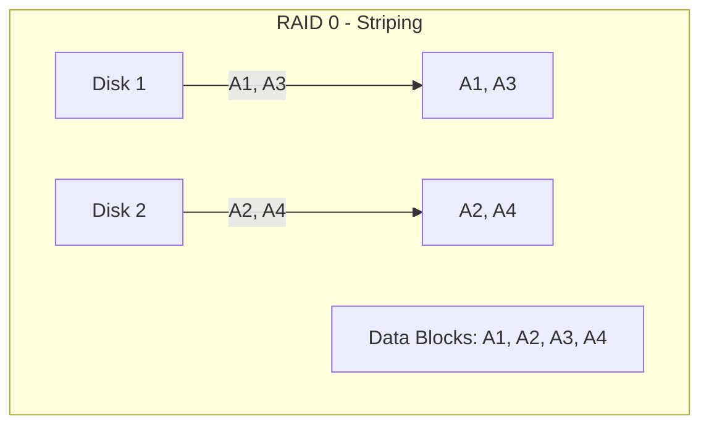
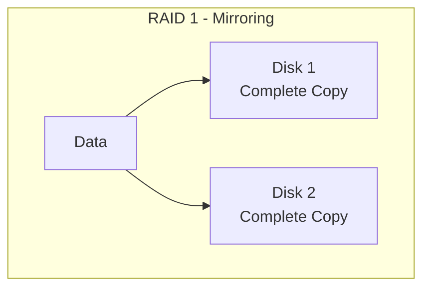
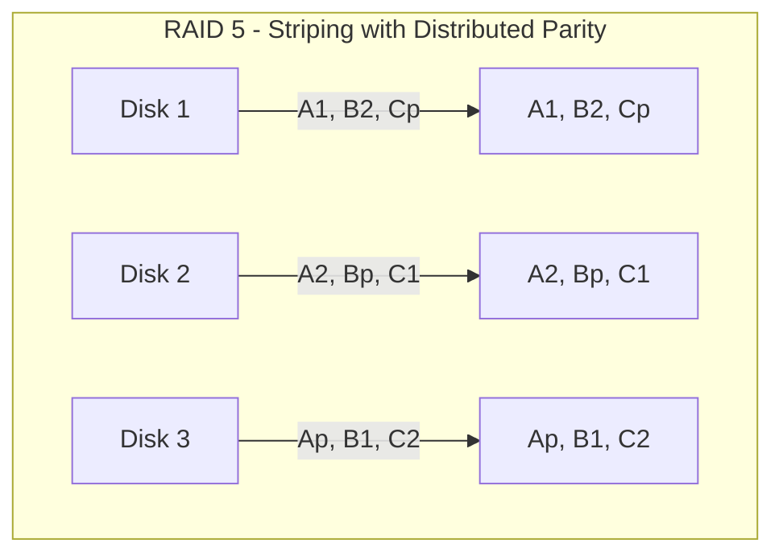
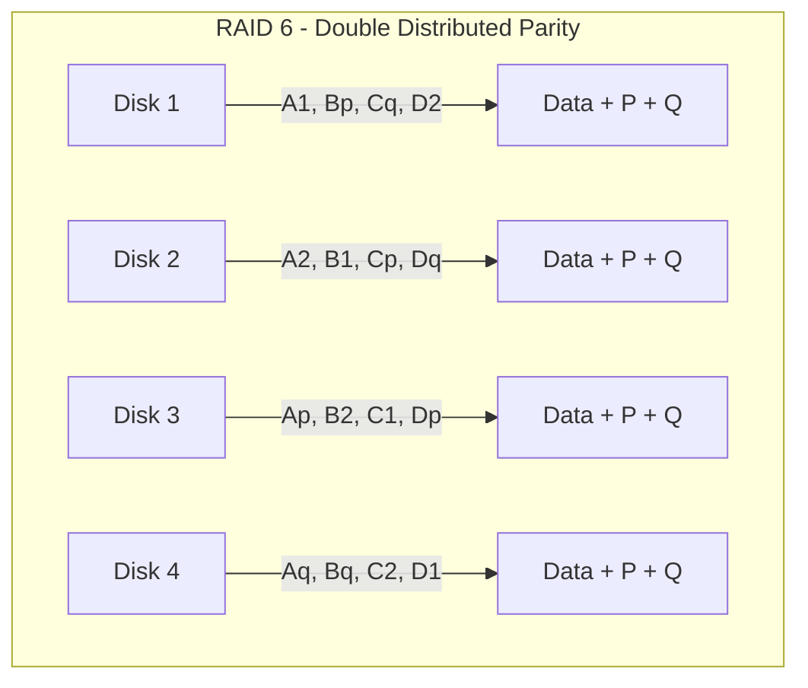
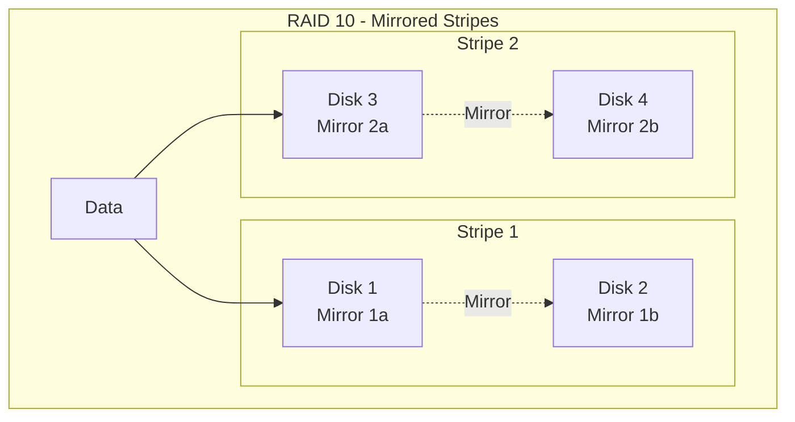
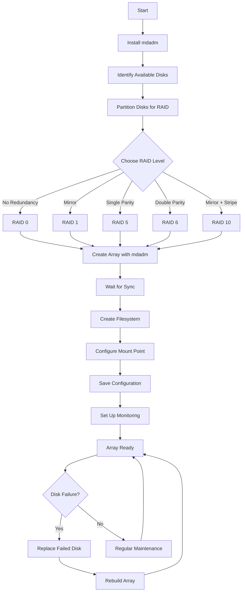
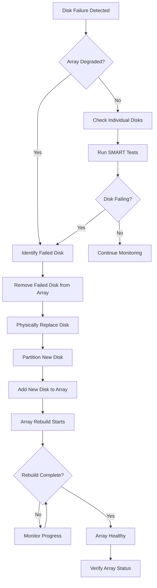

# How to Configure Software RAID (mdadm) for Data Redundancy on Ubuntu

Author: [nawazdhandala](https://github.com/nawazdhandala)

Tags: Ubuntu, Linux, Storage, RAID, High Availability, Data Protection

Description: Learn how to set up software RAID using mdadm on Ubuntu for data redundancy and improved storage performance.

---

## Introduction

Software RAID (Redundant Array of Independent Disks) using mdadm is a powerful solution for achieving data redundancy and improved storage performance on Ubuntu systems. Unlike hardware RAID controllers, software RAID is managed by the operating system, offering flexibility, cost-effectiveness, and portability across different hardware platforms.

In this comprehensive guide, you'll learn how to configure various RAID levels using mdadm, monitor array health, perform maintenance tasks, and recover from disk failures.

## Understanding RAID Levels

Before diving into configuration, it's essential to understand the different RAID levels and their characteristics.

### RAID Level Comparison

| RAID Level | Minimum Disks | Fault Tolerance | Storage Efficiency | Read Performance | Write Performance | Best Use Case |
|------------|---------------|-----------------|-------------------|------------------|-------------------|---------------|
| RAID 0 | 2 | None | 100% | Excellent | Excellent | Temporary data, caching |
| RAID 1 | 2 | 1 disk | 50% | Good | Normal | OS drives, critical data |
| RAID 5 | 3 | 1 disk | (n-1)/n | Good | Fair | General storage |
| RAID 6 | 4 | 2 disks | (n-2)/n | Good | Poor | Large arrays, archival |
| RAID 10 | 4 | 1 per mirror | 50% | Excellent | Good | Databases, VMs |

### RAID Architecture Diagrams

The following diagram illustrates how data is distributed across disks in different RAID levels:











## Prerequisites

Before configuring software RAID, ensure you have:

- Ubuntu 20.04 LTS or newer (this guide uses Ubuntu 22.04/24.04)
- Root or sudo access
- Multiple disks or partitions for the RAID array
- Backup of any existing data (RAID creation will destroy existing data)

## Installing mdadm

First, update your package index and install the mdadm package, which provides all the tools needed for managing software RAID arrays.

```bash
# Update package lists to ensure we get the latest version
sudo apt update

# Install mdadm along with useful utilities for disk management
sudo apt install -y mdadm smartmontools

# Verify the installation by checking the mdadm version
mdadm --version
```

## Preparing Disks for RAID

Before creating a RAID array, you need to identify and prepare your disks. This section covers disk identification, partitioning, and preparation.

### Identifying Available Disks

Use lsblk to list all block devices and identify disks available for RAID configuration.

```bash
# List all block devices with their sizes and mount points
# This helps identify which disks are available for RAID
lsblk -o NAME,SIZE,TYPE,MOUNTPOINT,FSTYPE

# For more detailed information including disk models and serial numbers
# Useful for identifying physical disks in a server
sudo lshw -class disk -short

# Check for existing RAID arrays to avoid conflicts
cat /proc/mdstat
```

### Partitioning Disks for RAID

While you can use entire disks for RAID, using partitions is recommended as it allows for proper disk identification and metadata storage.

```bash
# Create a GPT partition table on each disk
# Replace /dev/sdX with your actual disk devices (e.g., /dev/sdb, /dev/sdc)
# WARNING: This will destroy all data on the disk!

# Partition the first disk
sudo parted /dev/sdb --script mklabel gpt

# Create a partition using the entire disk
# The 'raid' flag marks this partition for RAID use
sudo parted /dev/sdb --script mkpart primary 0% 100%
sudo parted /dev/sdb --script set 1 raid on

# Repeat for additional disks
sudo parted /dev/sdc --script mklabel gpt
sudo parted /dev/sdc --script mkpart primary 0% 100%
sudo parted /dev/sdc --script set 1 raid on

# For RAID 5/6/10, repeat for more disks as needed
sudo parted /dev/sdd --script mklabel gpt
sudo parted /dev/sdd --script mkpart primary 0% 100%
sudo parted /dev/sdd --script set 1 raid on

sudo parted /dev/sde --script mklabel gpt
sudo parted /dev/sde --script mkpart primary 0% 100%
sudo parted /dev/sde --script set 1 raid on
```

### Verifying Partition Setup

After creating partitions, verify they are correctly configured for RAID use.

```bash
# Verify the partition layout on each disk
# The 'raid' flag should be visible in the output
sudo parted /dev/sdb print
sudo parted /dev/sdc print

# Alternative: use gdisk to verify partition type
# Type code 'fd00' indicates Linux RAID
sudo gdisk -l /dev/sdb
```

## Creating RAID Arrays

This section covers creating different RAID levels with mdadm.

### Creating a RAID 0 Array (Striping)

RAID 0 stripes data across disks for maximum performance but provides no redundancy. Use only for non-critical data.

```bash
# Create a RAID 0 array with two disks
# --level=0: Specifies RAID 0 (striping)
# --raid-devices=2: Number of disks in the array
# /dev/md0: The name of the RAID device to create
# /dev/sdb1 /dev/sdc1: The partitions to include
sudo mdadm --create /dev/md0 \
    --level=0 \
    --raid-devices=2 \
    /dev/sdb1 /dev/sdc1

# Monitor the array creation progress
# RAID 0 creation is instant as there's no synchronization needed
cat /proc/mdstat
```

### Creating a RAID 1 Array (Mirroring)

RAID 1 mirrors data across two disks, providing fault tolerance against single disk failure.

```bash
# Create a RAID 1 array for data mirroring
# --level=1: Specifies RAID 1 (mirroring)
# --raid-devices=2: Both disks will contain identical data
sudo mdadm --create /dev/md1 \
    --level=1 \
    --raid-devices=2 \
    /dev/sdb1 /dev/sdc1

# Watch the synchronization progress
# Initial sync copies data from one disk to another
watch -n 1 cat /proc/mdstat
```

### Creating a RAID 5 Array (Striping with Parity)

RAID 5 distributes parity information across all disks, allowing recovery from single disk failure while providing good storage efficiency.

```bash
# Create a RAID 5 array with three disks
# --level=5: Specifies RAID 5 (striping with distributed parity)
# --raid-devices=3: Minimum of 3 disks required for RAID 5
# Usable capacity = (n-1) * smallest disk size
sudo mdadm --create /dev/md5 \
    --level=5 \
    --raid-devices=3 \
    /dev/sdb1 /dev/sdc1 /dev/sdd1

# Optional: Add a spare disk for automatic rebuild
# The spare will automatically replace a failed disk
sudo mdadm --create /dev/md5 \
    --level=5 \
    --raid-devices=3 \
    --spare-devices=1 \
    /dev/sdb1 /dev/sdc1 /dev/sdd1 /dev/sde1

# Check the initial parity synchronization
# This can take significant time for large disks
cat /proc/mdstat
```

### Creating a RAID 6 Array (Double Parity)

RAID 6 uses two independent parity blocks, allowing survival of two simultaneous disk failures.

```bash
# Create a RAID 6 array with four disks
# --level=6: Specifies RAID 6 (double distributed parity)
# --raid-devices=4: Minimum of 4 disks required for RAID 6
# Usable capacity = (n-2) * smallest disk size
sudo mdadm --create /dev/md6 \
    --level=6 \
    --raid-devices=4 \
    /dev/sdb1 /dev/sdc1 /dev/sdd1 /dev/sde1

# RAID 6 initial sync takes longer due to double parity calculation
# Monitor progress with verbose output
sudo mdadm --detail /dev/md6
```

### Creating a RAID 10 Array (Mirrored Stripes)

RAID 10 combines mirroring and striping for excellent performance and redundancy. It requires an even number of disks (minimum 4).

```bash
# Create a RAID 10 array with four disks
# --level=10: Specifies RAID 10 (mirrored stripes)
# --raid-devices=4: Creates 2 mirrored pairs, then stripes across them
# --layout=f2: far layout with 2 copies (alternatives: n2 for near, o2 for offset)
sudo mdadm --create /dev/md10 \
    --level=10 \
    --raid-devices=4 \
    --layout=n2 \
    /dev/sdb1 /dev/sdc1 /dev/sdd1 /dev/sde1

# Verify the RAID 10 layout
# The output shows the mirrored pairs and stripe configuration
sudo mdadm --detail /dev/md10
```

## RAID Array Workflow Diagram

The following diagram shows the complete workflow for creating and managing RAID arrays:



## Creating Filesystems and Mounting

After creating a RAID array, you need to create a filesystem and mount it for use.

### Creating a Filesystem

Choose an appropriate filesystem based on your workload requirements.

```bash
# Create an ext4 filesystem on the RAID array
# -L option sets a label for easy identification
# ext4 is recommended for general-purpose storage
sudo mkfs.ext4 -L raid-storage /dev/md0

# Alternative: Create an XFS filesystem for large files/databases
# XFS offers better performance for large sequential I/O
sudo mkfs.xfs -L raid-storage /dev/md0

# For high-performance workloads, consider tuning options
# -E stride and stripe-width optimize for RAID arrays
# stride = chunk_size / block_size (e.g., 512KB / 4KB = 128)
# stripe-width = stride * (number of data disks)
sudo mkfs.ext4 -L raid-storage \
    -E stride=128,stripe-width=256 \
    /dev/md0
```

### Mounting the RAID Array

Create a mount point and mount the RAID array for immediate use.

```bash
# Create a mount point directory
sudo mkdir -p /mnt/raid-storage

# Mount the RAID array
sudo mount /dev/md0 /mnt/raid-storage

# Set appropriate ownership (adjust user/group as needed)
sudo chown -R $USER:$USER /mnt/raid-storage

# Verify the mount
df -h /mnt/raid-storage
```

### Configuring Persistent Mounts

To ensure the RAID array mounts automatically at boot, add an entry to /etc/fstab.

```bash
# First, find the UUID of the RAID array
# Using UUID is more reliable than device names which can change
sudo blkid /dev/md0

# Add an entry to /etc/fstab for persistent mounting
# Replace the UUID with your actual array UUID
echo 'UUID=your-uuid-here /mnt/raid-storage ext4 defaults,nofail 0 2' | sudo tee -a /etc/fstab

# Alternative: Use the mdadm device name (less recommended)
echo '/dev/md0 /mnt/raid-storage ext4 defaults,nofail 0 2' | sudo tee -a /etc/fstab

# Test the fstab entry without rebooting
sudo mount -a

# Verify the mount is working
mount | grep raid-storage
```

## Saving RAID Configuration

The RAID configuration must be saved to ensure the array is recognized after system reboots.

```bash
# Scan for all RAID arrays and append configuration to mdadm.conf
# This allows the system to assemble arrays automatically at boot
sudo mdadm --detail --scan | sudo tee -a /etc/mdadm/mdadm.conf

# Update the initial ramdisk to include RAID modules and configuration
# This ensures the array is available during early boot
sudo update-initramfs -u

# Verify the configuration was saved correctly
cat /etc/mdadm/mdadm.conf
```

## Monitoring RAID Arrays

Regular monitoring is essential for maintaining RAID array health and detecting issues early.

### Checking Array Status

Use these commands to check the current status of your RAID arrays.

```bash
# View status of all RAID arrays
# Shows array state, rebuild progress, and disk status
cat /proc/mdstat

# Get detailed information about a specific array
# Includes UUID, creation time, chunk size, and component status
sudo mdadm --detail /dev/md0

# Check the state of individual component disks
# Shows whether disks are active, spare, or failed
sudo mdadm --examine /dev/sdb1
sudo mdadm --examine /dev/sdc1
```

### Setting Up Email Notifications

Configure mdadm to send email alerts when array issues occur.

```bash
# Edit the mdadm configuration to set the monitoring email
sudo nano /etc/mdadm/mdadm.conf

# Add or modify the MAILADDR line with your email address
# MAILADDR admin@example.com

# Alternative: Set email using sed command
sudo sed -i 's/^#MAILADDR.*/MAILADDR admin@example.com/' /etc/mdadm/mdadm.conf

# Restart the mdadm monitor service to apply changes
sudo systemctl restart mdadm-monitor.service
sudo systemctl enable mdadm-monitor.service

# Test the email notification system
# This sends a test email to verify configuration
sudo mdadm --monitor --scan --test --oneshot
```

### Creating a Monitoring Script

Create a custom monitoring script for comprehensive RAID health checks.

```bash
#!/bin/bash
# RAID Health Check Script
# Save this as /usr/local/bin/raid-health-check.sh

# Script: raid-health-check.sh
# Purpose: Monitor RAID array health and send alerts
# Usage: Run via cron for automated monitoring

LOGFILE="/var/log/raid-health.log"
EMAIL="admin@example.com"
DATE=$(date '+%Y-%m-%d %H:%M:%S')

# Function to log messages with timestamps
log_message() {
    echo "[$DATE] $1" >> "$LOGFILE"
}

# Function to send alert emails
send_alert() {
    echo "$1" | mail -s "RAID Alert: $2" "$EMAIL"
    log_message "ALERT: $2 - $1"
}

# Check all RAID arrays for degraded state
check_arrays() {
    # Parse /proc/mdstat for array status
    while read -r line; do
        if [[ $line =~ ^md[0-9]+ ]]; then
            array=$(echo "$line" | awk '{print $1}')

            # Check for degraded status
            if grep -q "\[.*_.*\]" <<< "$(cat /proc/mdstat)"; then
                send_alert "Array /dev/$array is DEGRADED!" "Degraded Array"
            fi

            # Check for rebuilding status
            if grep -q "recovery" /proc/mdstat; then
                progress=$(grep -A1 "$array" /proc/mdstat | grep "recovery" | awk '{print $4}')
                log_message "Array /dev/$array is rebuilding: $progress complete"
            fi
        fi
    done < /proc/mdstat
}

# Check SMART status of component disks
check_disk_health() {
    for array in /dev/md*; do
        if [ -b "$array" ]; then
            components=$(mdadm --detail "$array" | grep "/dev/sd" | awk '{print $7}')
            for disk in $components; do
                # Extract base device (e.g., /dev/sdb from /dev/sdb1)
                base_disk=$(echo "$disk" | sed 's/[0-9]*$//')

                # Check SMART health
                smart_status=$(sudo smartctl -H "$base_disk" 2>/dev/null | grep "SMART overall-health")
                if [[ ! $smart_status =~ "PASSED" ]]; then
                    send_alert "Disk $base_disk SMART check FAILED!" "Disk Health Alert"
                fi
            done
        fi
    done
}

# Main execution
log_message "Starting RAID health check"
check_arrays
check_disk_health
log_message "RAID health check completed"
```

Make the script executable and schedule it with cron.

```bash
# Make the script executable
sudo chmod +x /usr/local/bin/raid-health-check.sh

# Add a cron job to run the health check every hour
# Open the root crontab for editing
sudo crontab -e

# Add this line to run the check every hour
# 0 * * * * /usr/local/bin/raid-health-check.sh
```

## Disk Replacement and Recovery

One of the main benefits of RAID is the ability to recover from disk failures. This section covers the disk replacement process.

### RAID Recovery Workflow



### Identifying Failed Disks

When a disk fails, you need to identify which disk has failed before replacement.

```bash
# Check for failed or degraded arrays
# Failed disks show as 'faulty' or are indicated by underscore in status
cat /proc/mdstat

# Get detailed information about the degraded array
# This shows which specific disk has failed
sudo mdadm --detail /dev/md0

# Example output shows failed disk:
# Number   Major   Minor   RaidDevice State
#    0       8       17        0      active sync   /dev/sdb1
#    -       0        0        1      removed

# Check system logs for RAID-related errors
# Look for I/O errors or device failures
sudo dmesg | grep -i "md\|raid\|sdb\|sdc"
sudo journalctl -u mdadm-monitor --since "1 hour ago"
```

### Removing a Failed Disk

Before physically replacing a disk, remove it from the RAID array.

```bash
# Mark the disk as failed (if not already)
# This is necessary if the disk is still responding but degraded
sudo mdadm --manage /dev/md0 --fail /dev/sdc1

# Remove the failed disk from the array
# The array will continue operating in degraded mode
sudo mdadm --manage /dev/md0 --remove /dev/sdc1

# Verify the disk has been removed
sudo mdadm --detail /dev/md0
```

### Adding a Replacement Disk

After physically installing a new disk, prepare and add it to the array.

```bash
# Identify the new disk (will appear as unpartitioned)
lsblk -o NAME,SIZE,TYPE,MOUNTPOINT

# Partition the new disk to match the failed disk
# Use the same partitioning scheme as other array members
sudo parted /dev/sdc --script mklabel gpt
sudo parted /dev/sdc --script mkpart primary 0% 100%
sudo parted /dev/sdc --script set 1 raid on

# Verify the partition was created correctly
sudo parted /dev/sdc print

# Add the new disk to the RAID array
# The array will automatically begin rebuilding
sudo mdadm --manage /dev/md0 --add /dev/sdc1

# Monitor the rebuild progress
# Rebuild time depends on array size and system load
watch -n 5 cat /proc/mdstat
```

### Monitoring Rebuild Progress

During array rebuilding, monitor progress and system performance.

```bash
# Watch rebuild progress in real-time
# Shows percentage complete and estimated time remaining
watch -n 2 'cat /proc/mdstat'

# Get detailed rebuild statistics
sudo mdadm --detail /dev/md0 | grep -E "State|Rebuild"

# Check system I/O during rebuild
# High I/O is expected during rebuild operations
iostat -x 2

# Optionally, adjust rebuild speed limits
# Increase speed if the system is not heavily loaded
# Default values: min=1000KB/s, max=200000KB/s
echo 100000 | sudo tee /proc/sys/dev/raid/speed_limit_min
echo 500000 | sudo tee /proc/sys/dev/raid/speed_limit_max
```

## RAID Maintenance Tasks

Regular maintenance helps ensure long-term RAID array health.

### Checking and Repairing Arrays

Periodically verify array integrity to detect silent data corruption.

```bash
# Initiate a data scrub (check) on the array
# This reads all data and verifies parity/mirror consistency
echo check | sudo tee /sys/block/md0/md/sync_action

# Monitor the check progress
cat /proc/mdstat

# View the results after check completes
# mismatch_cnt shows number of mismatched sectors
cat /sys/block/md0/md/mismatch_cnt

# If mismatches are found, initiate a repair
# This corrects any detected inconsistencies
echo repair | sudo tee /sys/block/md0/md/sync_action

# Cancel an ongoing check or repair if needed
echo idle | sudo tee /sys/block/md0/md/sync_action
```

### Setting Up Automatic Scrubs

Schedule regular array scrubs using cron.

```bash
# Create a weekly scrub script
sudo tee /etc/cron.weekly/raid-scrub << 'EOF'
#!/bin/bash
# Weekly RAID array scrub script
# Checks all RAID arrays for data consistency

LOG="/var/log/raid-scrub.log"
DATE=$(date '+%Y-%m-%d %H:%M:%S')

echo "[$DATE] Starting weekly RAID scrub" >> $LOG

# Iterate through all md devices
for md in /sys/block/md*/md/sync_action; do
    if [ -f "$md" ]; then
        device=$(echo $md | cut -d'/' -f4)
        echo "[$DATE] Starting scrub on /dev/$device" >> $LOG
        echo check > "$md"
    fi
done

echo "[$DATE] Scrub initiated on all arrays" >> $LOG
EOF

# Make the script executable
sudo chmod +x /etc/cron.weekly/raid-scrub
```

### Growing and Reshaping Arrays

You can expand RAID arrays by adding disks or changing RAID levels.

```bash
# Add a new disk to expand array capacity
# First, prepare the new disk as shown previously
sudo mdadm --add /dev/md0 /dev/sde1

# Grow the array to use the additional disk
# For RAID 5, this adds the disk as an active member
sudo mdadm --grow /dev/md0 --raid-devices=4

# After growth completes, resize the filesystem
# For ext4 filesystems:
sudo resize2fs /dev/md0

# For XFS filesystems:
sudo xfs_growfs /mnt/raid-storage

# Change RAID level (reshape) - example: RAID 5 to RAID 6
# Note: This is a complex operation requiring backup
sudo mdadm --grow /dev/md0 --level=6 --raid-devices=4 --backup-file=/root/md0-backup
```

## Advanced Configuration Options

### Bitmap for Faster Rebuilds

Bitmaps track which blocks have changed, enabling faster partial rebuilds after unclean shutdowns.

```bash
# Add an internal bitmap to an existing array
# Internal bitmaps are stored on the array itself
sudo mdadm --grow /dev/md0 --bitmap=internal

# Alternative: Use an external bitmap file
# Useful when array disks have limited metadata space
sudo mdadm --grow /dev/md0 --bitmap=/var/lib/mdadm/md0-bitmap

# Verify bitmap is active
sudo mdadm --detail /dev/md0 | grep -i bitmap

# Remove bitmap if no longer needed
sudo mdadm --grow /dev/md0 --bitmap=none
```

### Configuring Chunk Size

Chunk size affects performance for different workloads.

```bash
# When creating a new array, specify chunk size
# Larger chunks (256K-512K) are better for sequential I/O (video, backups)
# Smaller chunks (64K) are better for random I/O (databases)
sudo mdadm --create /dev/md0 \
    --level=5 \
    --raid-devices=3 \
    --chunk=256 \
    /dev/sdb1 /dev/sdc1 /dev/sdd1

# View current chunk size of an existing array
sudo mdadm --detail /dev/md0 | grep "Chunk Size"
```

### Write-Intent Bitmap Tuning

Fine-tune bitmap behavior for optimal performance.

```bash
# Set bitmap chunk size (larger = less overhead, slower recovery)
sudo mdadm --grow /dev/md0 --bitmap-chunk=65536

# Configure bitmap to be written behind (improves write performance)
# This delays bitmap updates but may slow recovery
echo 256 | sudo tee /sys/block/md0/md/bitmap/max_backlog_used
```

## Troubleshooting Common Issues

### Array Won't Assemble

If an array fails to assemble automatically, try manual assembly.

```bash
# Scan for arrays and show what would be assembled
sudo mdadm --assemble --scan --verbose

# Force assembly of a specific array
# Use when array metadata is slightly inconsistent
sudo mdadm --assemble --force /dev/md0 /dev/sdb1 /dev/sdc1

# If assembly fails due to missing superblock, examine disks
sudo mdadm --examine /dev/sdb1

# Recreate array with existing data (dangerous - backup first!)
# --assume-clean prevents initial sync, preserving existing data
sudo mdadm --create /dev/md0 \
    --level=1 \
    --raid-devices=2 \
    --assume-clean \
    /dev/sdb1 /dev/sdc1
```

### Resolving Duplicate Array Names

Sometimes arrays can have conflicting names or UUIDs.

```bash
# List all arrays and their UUIDs
sudo mdadm --detail --scan

# Stop a conflicting array
sudo mdadm --stop /dev/md127

# Clear superblocks from disks to remove old metadata
# WARNING: This destroys RAID configuration on the disk!
sudo mdadm --zero-superblock /dev/sdb1

# Re-scan and update configuration
sudo mdadm --detail --scan | sudo tee /etc/mdadm/mdadm.conf
sudo update-initramfs -u
```

### Performance Optimization

Tune RAID parameters for optimal performance.

```bash
# Increase read-ahead for sequential workloads
sudo blockdev --setra 65536 /dev/md0

# Set stripe cache size for RAID 5/6 (improves random I/O)
# Value is in pages (4KB each), higher uses more memory
echo 8192 | sudo tee /sys/block/md0/md/stripe_cache_size

# View current settings
cat /sys/block/md0/md/stripe_cache_size
sudo blockdev --getra /dev/md0

# Make read-ahead persistent using udev rules
echo 'SUBSYSTEM=="block", KERNEL=="md*", ACTION=="add", RUN+="/sbin/blockdev --setra 65536 /dev/%k"' | \
    sudo tee /etc/udev/rules.d/60-raid-readahead.rules
```

## Best Practices Summary

1. **Use RAID 1 or RAID 10 for critical data**: These levels offer the best balance of redundancy and performance.

2. **Always have hot spares**: Configure spare disks to automatically replace failed drives.

3. **Monitor continuously**: Set up email alerts and regular health checks.

4. **Regular scrubs**: Schedule weekly or monthly array checks to detect silent corruption.

5. **Save configuration**: Always update `/etc/mdadm/mdadm.conf` and run `update-initramfs -u` after changes.

6. **RAID is not backup**: RAID protects against disk failure, not against accidental deletion, ransomware, or catastrophic events. Always maintain separate backups.

7. **Use UPS protection**: Unexpected power loss during write operations can cause data inconsistency.

8. **Test recovery procedures**: Periodically practice disk replacement and recovery in a test environment.

9. **Document your setup**: Keep records of disk serial numbers, array configurations, and recovery procedures.

10. **Match disk models and sizes**: Use identical or similar disks for consistent performance and capacity.

## Conclusion

Software RAID with mdadm provides a flexible, cost-effective solution for data redundancy on Ubuntu systems. By understanding the different RAID levels, properly configuring your arrays, and implementing robust monitoring and maintenance procedures, you can build reliable storage systems that protect your data against hardware failures.

Remember that while RAID significantly improves availability, it should always be combined with a comprehensive backup strategy for complete data protection. Regular testing of your recovery procedures ensures you're prepared when disk failures occur.

## Additional Resources

- [mdadm Manual Page](https://linux.die.net/man/8/mdadm)
- [Linux RAID Wiki](https://raid.wiki.kernel.org/)
- [Ubuntu Server Guide - Software RAID](https://ubuntu.com/server/docs/device-mapper-multipathing-introduction)
- [Red Hat RAID Configuration Guide](https://access.redhat.com/documentation/en-us/red_hat_enterprise_linux/8/html/managing_storage_devices/managing-raid_managing-storage-devices)
