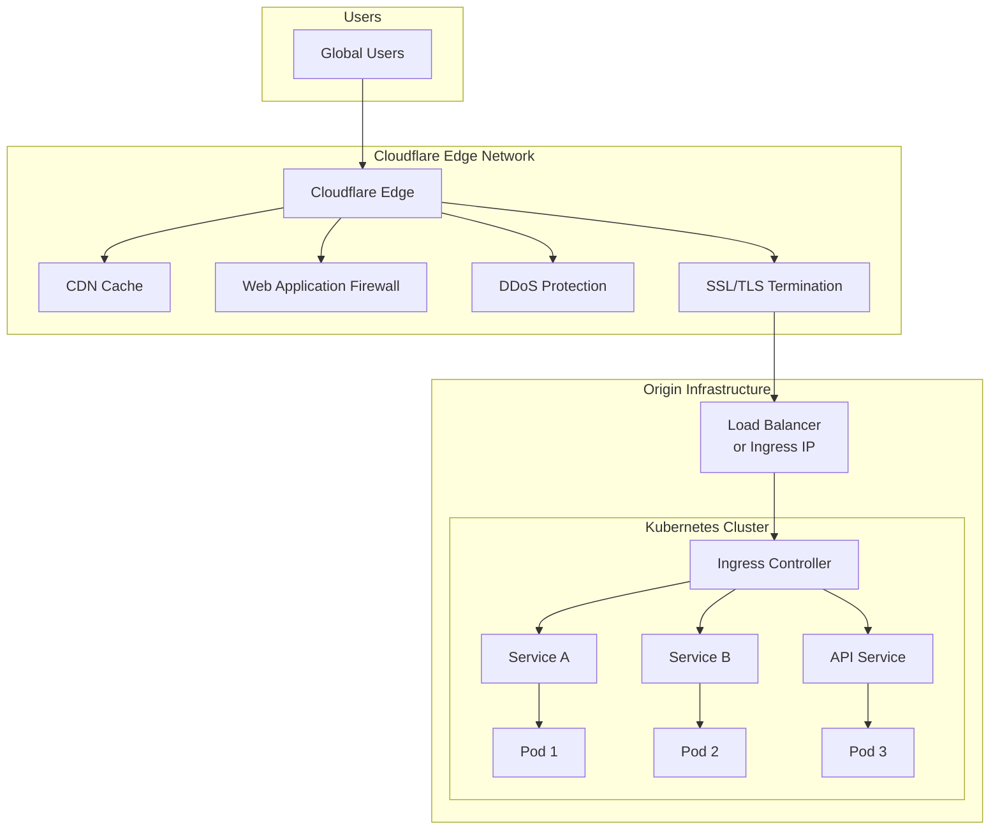
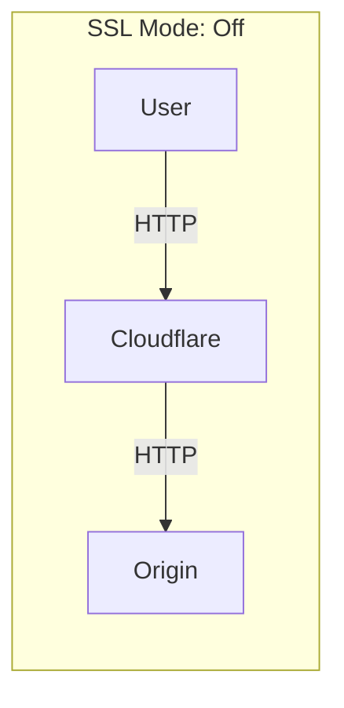
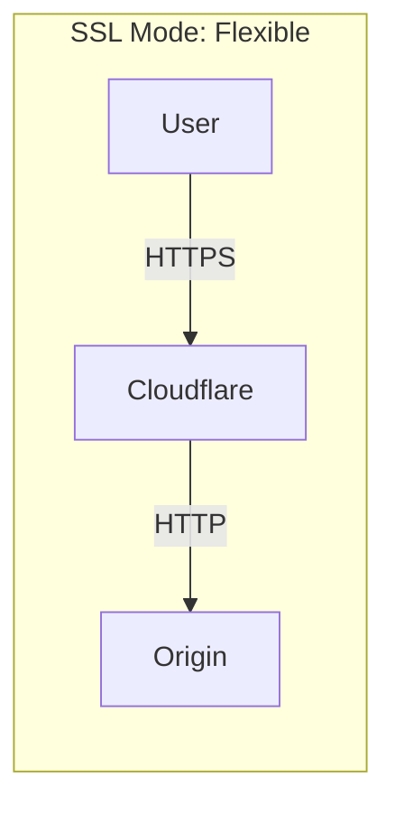
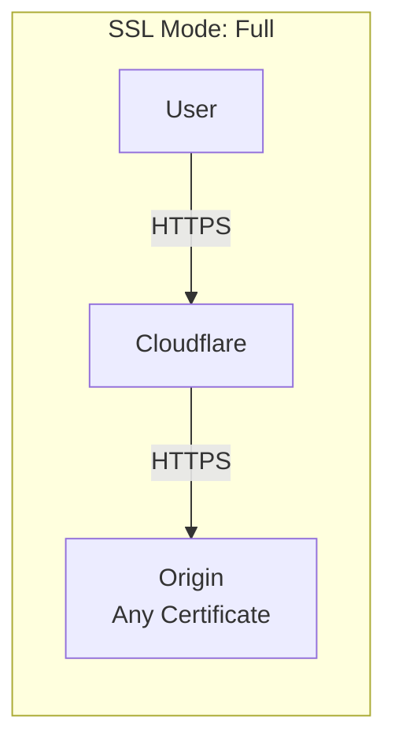
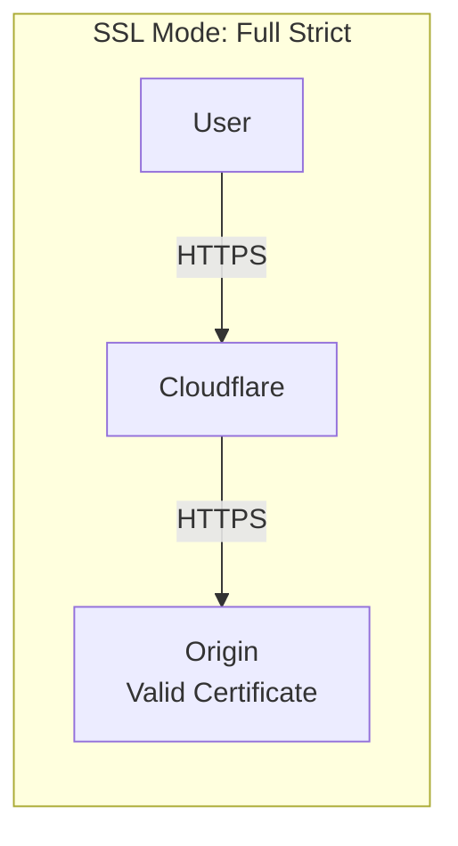
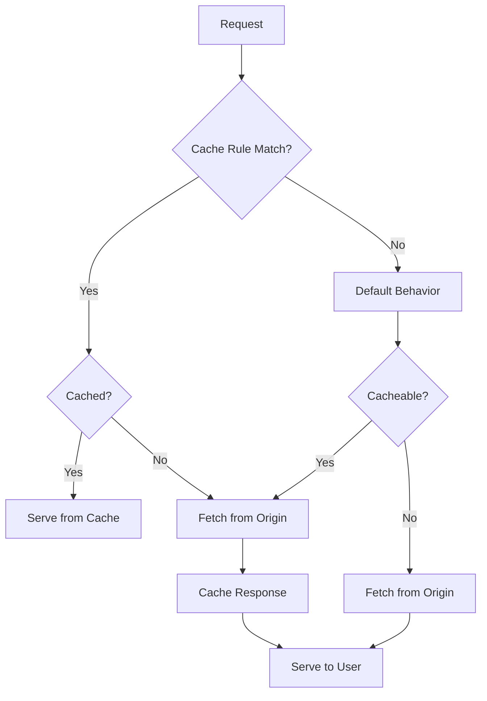
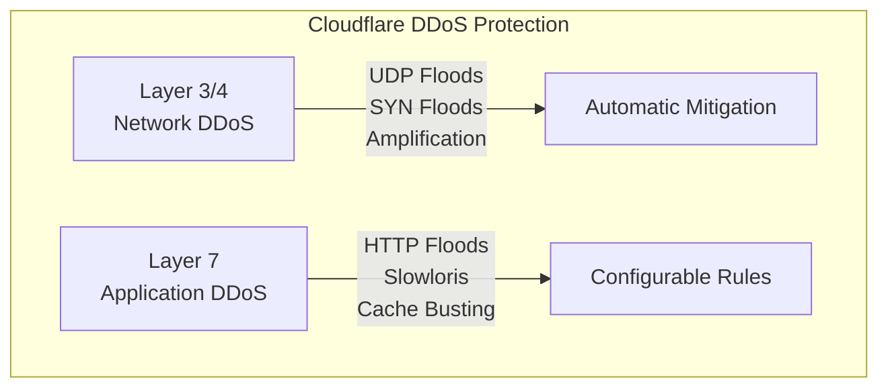

# How to Set Up Cloudflare as a CDN and DDoS Protection for Kubernetes Services

Author: [nawazdhandala](https://www.github.com/nawazdhandala)

Tags: cloudflare, cdn, ddos-protection, kubernetes, waf, ssl, caching, security, web-application-firewall

Description: Learn how to configure Cloudflare as a CDN and DDoS protection layer for your Kubernetes services with SSL modes, caching rules, WAF configuration, and security best practices.

---

## Introduction

Cloudflare provides a comprehensive suite of services including Content Delivery Network (CDN), DDoS protection, Web Application Firewall (WAF), and SSL/TLS encryption. When combined with Kubernetes, Cloudflare acts as a powerful shield protecting your services while improving global performance through edge caching.

This guide covers the complete setup of Cloudflare in front of your Kubernetes cluster, including DNS configuration, SSL modes, caching optimization, WAF rules, and DDoS protection settings.

## Architecture Overview



## Prerequisites

- A registered domain name
- Cloudflare account (Free tier works, but Pro/Business recommended for production)
- Running Kubernetes cluster with an Ingress controller
- Public IP address or load balancer for your cluster
- kubectl configured to access your cluster

## Step 1: Adding Your Domain to Cloudflare

### 1.1 Create Cloudflare Account and Add Site

1. Sign up at [cloudflare.com](https://cloudflare.com)
2. Click "Add a Site" and enter your domain name
3. Select your plan (Free, Pro, Business, or Enterprise)
4. Cloudflare will scan your existing DNS records

### 1.2 Update Nameservers

After adding your site, Cloudflare provides nameservers:

```
ns1.cloudflare.com
ns2.cloudflare.com
```

Update these at your domain registrar. Propagation typically takes 24-48 hours.

### 1.3 Verify Domain Activation

```bash
# Check nameserver propagation
dig NS yourdomain.com +short

# Verify Cloudflare is active
curl -I https://yourdomain.com | grep -i "cf-ray"
```

## Step 2: DNS Configuration

### 2.1 Basic DNS Records Setup

Navigate to DNS settings in Cloudflare dashboard and create these records:

| Type | Name | Content | Proxy Status | TTL |
|------|------|---------|--------------|-----|
| A | @ | 203.0.113.10 | Proxied | Auto |
| A | www | 203.0.113.10 | Proxied | Auto |
| A | api | 203.0.113.10 | Proxied | Auto |
| CNAME | app | yourdomain.com | Proxied | Auto |
| A | direct | 203.0.113.10 | DNS Only | Auto |

### 2.2 Managing DNS via Cloudflare API

```bash
# Set your credentials
export CF_API_EMAIL="your-email@example.com"
export CF_API_KEY="your-global-api-key"
export CF_ZONE_ID="your-zone-id"

# Create an A record
curl -X POST "https://api.cloudflare.com/client/v4/zones/${CF_ZONE_ID}/dns_records" \
     -H "X-Auth-Email: ${CF_API_EMAIL}" \
     -H "X-Auth-Key: ${CF_API_KEY}" \
     -H "Content-Type: application/json" \
     --data '{
       "type": "A",
       "name": "api",
       "content": "203.0.113.10",
       "ttl": 1,
       "proxied": true
     }'

# List all DNS records
curl -X GET "https://api.cloudflare.com/client/v4/zones/${CF_ZONE_ID}/dns_records" \
     -H "X-Auth-Email: ${CF_API_EMAIL}" \
     -H "X-Auth-Key: ${CF_API_KEY}" \
     -H "Content-Type: application/json"
```

### 2.3 Terraform Configuration for DNS

```hcl
terraform {
  required_providers {
    cloudflare = {
      source  = "cloudflare/cloudflare"
      version = "~> 4.0"
    }
  }
}

provider "cloudflare" {
  api_token = var.cloudflare_api_token
}

variable "cloudflare_api_token" {
  type      = string
  sensitive = true
}

variable "zone_id" {
  type = string
}

variable "origin_ip" {
  type    = string
  default = "203.0.113.10"
}

# Root domain
resource "cloudflare_record" "root" {
  zone_id = var.zone_id
  name    = "@"
  value   = var.origin_ip
  type    = "A"
  proxied = true
  ttl     = 1
}

# WWW subdomain
resource "cloudflare_record" "www" {
  zone_id = var.zone_id
  name    = "www"
  value   = var.origin_ip
  type    = "A"
  proxied = true
  ttl     = 1
}

# API subdomain
resource "cloudflare_record" "api" {
  zone_id = var.zone_id
  name    = "api"
  value   = var.origin_ip
  type    = "A"
  proxied = true
  ttl     = 1
}

# Direct access (bypass Cloudflare)
resource "cloudflare_record" "direct" {
  zone_id = var.zone_id
  name    = "direct"
  value   = var.origin_ip
  type    = "A"
  proxied = false
  ttl     = 300
}
```

## Step 3: SSL/TLS Configuration

### 3.1 Understanding SSL Modes









### 3.2 Recommended: Full (Strict) Mode with Origin Certificate

Generate a Cloudflare Origin Certificate:

1. Go to SSL/TLS > Origin Server
2. Click "Create Certificate"
3. Select RSA or ECDSA
4. Set validity (up to 15 years)
5. Download the certificate and private key

### 3.3 Kubernetes Secret for Origin Certificate

```yaml
apiVersion: v1
kind: Secret
metadata:
  name: cloudflare-origin-cert
  namespace: ingress-nginx
type: kubernetes.io/tls
data:
  tls.crt: |
    <base64-encoded-certificate>
  tls.key: |
    <base64-encoded-private-key>
```

Create the secret from files:

```bash
# Encode and create secret
kubectl create secret tls cloudflare-origin-cert \
  --cert=origin-cert.pem \
  --key=origin-key.pem \
  -n ingress-nginx
```

### 3.4 Configure Ingress with Origin Certificate

```yaml
apiVersion: networking.k8s.io/v1
kind: Ingress
metadata:
  name: main-ingress
  namespace: production
  annotations:
    nginx.ingress.kubernetes.io/ssl-redirect: "true"
    nginx.ingress.kubernetes.io/proxy-body-size: "100m"
    # Trust Cloudflare IPs for real client IP
    nginx.ingress.kubernetes.io/use-forwarded-headers: "true"
    nginx.ingress.kubernetes.io/compute-full-forwarded-for: "true"
    nginx.ingress.kubernetes.io/forwarded-for-header: "CF-Connecting-IP"
spec:
  ingressClassName: nginx
  tls:
    - hosts:
        - yourdomain.com
        - www.yourdomain.com
        - api.yourdomain.com
      secretName: cloudflare-origin-cert
  rules:
    - host: yourdomain.com
      http:
        paths:
          - path: /
            pathType: Prefix
            backend:
              service:
                name: web-frontend
                port:
                  number: 80
    - host: api.yourdomain.com
      http:
        paths:
          - path: /
            pathType: Prefix
            backend:
              service:
                name: api-service
                port:
                  number: 80
```

### 3.5 SSL/TLS Settings via API

```bash
# Enable Full (Strict) SSL mode
curl -X PATCH "https://api.cloudflare.com/client/v4/zones/${CF_ZONE_ID}/settings/ssl" \
     -H "X-Auth-Email: ${CF_API_EMAIL}" \
     -H "X-Auth-Key: ${CF_API_KEY}" \
     -H "Content-Type: application/json" \
     --data '{"value":"strict"}'

# Enable Always Use HTTPS
curl -X PATCH "https://api.cloudflare.com/client/v4/zones/${CF_ZONE_ID}/settings/always_use_https" \
     -H "X-Auth-Email: ${CF_API_EMAIL}" \
     -H "X-Auth-Key: ${CF_API_KEY}" \
     -H "Content-Type: application/json" \
     --data '{"value":"on"}'

# Enable Automatic HTTPS Rewrites
curl -X PATCH "https://api.cloudflare.com/client/v4/zones/${CF_ZONE_ID}/settings/automatic_https_rewrites" \
     -H "X-Auth-Email: ${CF_API_EMAIL}" \
     -H "X-Auth-Key: ${CF_API_KEY}" \
     -H "Content-Type: application/json" \
     --data '{"value":"on"}'

# Set minimum TLS version
curl -X PATCH "https://api.cloudflare.com/client/v4/zones/${CF_ZONE_ID}/settings/min_tls_version" \
     -H "X-Auth-Email: ${CF_API_EMAIL}" \
     -H "X-Auth-Key: ${CF_API_KEY}" \
     -H "Content-Type: application/json" \
     --data '{"value":"1.2"}'
```

## Step 4: Caching Configuration

### 4.1 Cache Rules Overview



### 4.2 Creating Cache Rules

Navigate to Caching > Cache Rules in the dashboard, or use the API:

```bash
# Create cache rule for static assets
curl -X POST "https://api.cloudflare.com/client/v4/zones/${CF_ZONE_ID}/rulesets" \
     -H "Authorization: Bearer ${CF_API_TOKEN}" \
     -H "Content-Type: application/json" \
     --data '{
       "name": "Static Asset Caching",
       "kind": "zone",
       "phase": "http_request_cache_settings",
       "rules": [
         {
           "action": "set_cache_settings",
           "action_parameters": {
             "cache": true,
             "edge_ttl": {
               "mode": "override_origin",
               "default": 2592000
             },
             "browser_ttl": {
               "mode": "override_origin",
               "default": 86400
             }
           },
           "expression": "(http.request.uri.path.extension in {\"css\" \"js\" \"jpg\" \"jpeg\" \"png\" \"gif\" \"svg\" \"ico\" \"woff\" \"woff2\" \"ttf\" \"eot\"})",
           "description": "Cache static assets for 30 days at edge, 1 day in browser"
         }
       ]
     }'
```

### 4.3 Terraform Cache Rules Configuration

```hcl
# Cache rule for static assets
resource "cloudflare_ruleset" "cache_static_assets" {
  zone_id = var.zone_id
  name    = "Static Asset Caching"
  kind    = "zone"
  phase   = "http_request_cache_settings"

  rules {
    action = "set_cache_settings"
    action_parameters {
      cache = true
      edge_ttl {
        mode    = "override_origin"
        default = 2592000  # 30 days
      }
      browser_ttl {
        mode    = "override_origin"
        default = 86400    # 1 day
      }
    }
    expression  = "(http.request.uri.path.extension in {\"css\" \"js\" \"jpg\" \"jpeg\" \"png\" \"gif\" \"svg\" \"ico\" \"woff\" \"woff2\" \"ttf\" \"eot\"})"
    description = "Cache static assets"
    enabled     = true
  }
}

# Bypass cache for API endpoints
resource "cloudflare_ruleset" "bypass_api_cache" {
  zone_id = var.zone_id
  name    = "API Cache Bypass"
  kind    = "zone"
  phase   = "http_request_cache_settings"

  rules {
    action = "set_cache_settings"
    action_parameters {
      cache = false
    }
    expression  = "(http.host eq \"api.yourdomain.com\") or (starts_with(http.request.uri.path, \"/api/\"))"
    description = "Bypass cache for API"
    enabled     = true
  }
}

# Cache HTML with short TTL
resource "cloudflare_ruleset" "cache_html" {
  zone_id = var.zone_id
  name    = "HTML Caching"
  kind    = "zone"
  phase   = "http_request_cache_settings"

  rules {
    action = "set_cache_settings"
    action_parameters {
      cache = true
      edge_ttl {
        mode    = "override_origin"
        default = 3600  # 1 hour
      }
      browser_ttl {
        mode    = "override_origin"
        default = 300   # 5 minutes
      }
    }
    expression  = "(http.request.uri.path.extension eq \"html\") or (http.request.uri.path eq \"/\")"
    description = "Cache HTML pages"
    enabled     = true
  }
}
```

### 4.4 Page Rules for Caching (Legacy but still useful)

```hcl
# Cache everything for static subdomain
resource "cloudflare_page_rule" "static_cache" {
  zone_id  = var.zone_id
  target   = "static.yourdomain.com/*"
  priority = 1

  actions {
    cache_level       = "cache_everything"
    edge_cache_ttl    = 2592000
    browser_cache_ttl = 86400
  }
}

# Bypass cache for admin area
resource "cloudflare_page_rule" "admin_bypass" {
  zone_id  = var.zone_id
  target   = "yourdomain.com/admin/*"
  priority = 2

  actions {
    cache_level          = "bypass"
    disable_performance  = true
    security_level       = "high"
  }
}
```

### 4.5 Configure Cache Headers in Kubernetes

```yaml
apiVersion: v1
kind: ConfigMap
metadata:
  name: nginx-cache-config
  namespace: production
data:
  cache-headers.conf: |
    # Static assets
    location ~* \.(css|js|jpg|jpeg|png|gif|svg|ico|woff|woff2|ttf|eot)$ {
        add_header Cache-Control "public, max-age=31536000, immutable";
        add_header CF-Cache-Status "HIT";
    }

    # HTML files
    location ~* \.html$ {
        add_header Cache-Control "public, max-age=300, stale-while-revalidate=60";
    }

    # API responses
    location /api/ {
        add_header Cache-Control "no-store, no-cache, must-revalidate";
        add_header CF-Cache-Status "DYNAMIC";
    }
```

## Step 5: Web Application Firewall (WAF) Configuration

### 5.1 Understanding WAF Rule Categories

| Category | Description | Use Case |
|----------|-------------|----------|
| Managed Rules | Cloudflare-maintained rules | General protection |
| OWASP Rules | OWASP Core Rule Set | SQL injection, XSS |
| Custom Rules | User-defined rules | Application-specific |
| Rate Limiting | Request rate controls | Brute force, DDoS |

### 5.2 Enable Managed WAF Rules

```bash
# Enable Cloudflare Managed Rules
curl -X PUT "https://api.cloudflare.com/client/v4/zones/${CF_ZONE_ID}/firewall/waf/packages/c504870194831cd12c3fc0284f294efa" \
     -H "X-Auth-Email: ${CF_API_EMAIL}" \
     -H "X-Auth-Key: ${CF_API_KEY}" \
     -H "Content-Type: application/json" \
     --data '{"sensitivity":"high","action_mode":"challenge"}'

# Enable OWASP ModSecurity Rules
curl -X PUT "https://api.cloudflare.com/client/v4/zones/${CF_ZONE_ID}/firewall/waf/packages/a25a9a7e9c00afc1fb2e0245519d725b" \
     -H "X-Auth-Email: ${CF_API_EMAIL}" \
     -H "X-Auth-Key: ${CF_API_KEY}" \
     -H "Content-Type: application/json" \
     --data '{"sensitivity":"medium","action_mode":"challenge"}'
```

### 5.3 Custom WAF Rules with Terraform

```hcl
# Block known bad user agents
resource "cloudflare_ruleset" "waf_custom_rules" {
  zone_id = var.zone_id
  name    = "Custom WAF Rules"
  kind    = "zone"
  phase   = "http_request_firewall_custom"

  # Block bad bots
  rules {
    action = "block"
    expression = "(http.user_agent contains \"curl\") or (http.user_agent contains \"wget\") or (http.user_agent contains \"python-requests\")"
    description = "Block common scraping tools"
    enabled = true
  }

  # Block requests without user agent
  rules {
    action = "block"
    expression = "(http.user_agent eq \"\")"
    description = "Block empty user agent"
    enabled = true
  }

  # Challenge suspicious login attempts
  rules {
    action = "managed_challenge"
    expression = "(http.request.uri.path contains \"/login\") and (http.request.method eq \"POST\") and (not cf.client.bot)"
    description = "Challenge login attempts"
    enabled = true
  }

  # Block SQL injection attempts
  rules {
    action = "block"
    expression = "(http.request.uri.query contains \"UNION\") or (http.request.uri.query contains \"SELECT\") or (http.request.uri.query contains \"DROP\")"
    description = "Block SQL injection in query params"
    enabled = true
  }

  # Block access to sensitive files
  rules {
    action = "block"
    expression = "(http.request.uri.path contains \".env\") or (http.request.uri.path contains \".git\") or (http.request.uri.path contains \".htaccess\")"
    description = "Block access to sensitive files"
    enabled = true
  }

  # Geo-blocking (block specific countries)
  rules {
    action = "block"
    expression = "(ip.geoip.country in {\"CN\" \"RU\" \"KP\"})"
    description = "Block specific countries"
    enabled = false  # Enable as needed
  }

  # Rate limit API endpoints
  rules {
    action = "block"
    action_parameters {
      response {
        status_code = 429
        content     = "{\"error\":\"Rate limit exceeded\"}"
        content_type = "application/json"
      }
    }
    ratelimit {
      characteristics = ["cf.colo.id", "ip.src"]
      period          = 60
      requests_per_period = 100
      mitigation_timeout = 600
    }
    expression = "(http.request.uri.path contains \"/api/\")"
    description = "Rate limit API"
    enabled = true
  }
}

# IP Access Rules
resource "cloudflare_access_rule" "office_whitelist" {
  zone_id = var.zone_id
  mode    = "whitelist"
  notes   = "Office IP whitelist"

  configuration {
    target = "ip"
    value  = "203.0.113.50"
  }
}

resource "cloudflare_access_rule" "block_bad_ip" {
  zone_id = var.zone_id
  mode    = "block"
  notes   = "Known malicious IP"

  configuration {
    target = "ip"
    value  = "198.51.100.100"
  }
}
```

### 5.4 WAF Exceptions for Legitimate Traffic

```hcl
# Skip WAF for internal health checks
resource "cloudflare_ruleset" "waf_skip_rules" {
  zone_id = var.zone_id
  name    = "WAF Skip Rules"
  kind    = "zone"
  phase   = "http_request_firewall_custom"

  rules {
    action = "skip"
    action_parameters {
      ruleset = "current"
    }
    expression = "(http.request.uri.path eq \"/health\") or (http.request.uri.path eq \"/ready\")"
    description = "Skip WAF for health checks"
    enabled = true
  }

  rules {
    action = "skip"
    action_parameters {
      ruleset = "current"
    }
    expression = "(ip.src in {10.0.0.0/8 172.16.0.0/12 192.168.0.0/16})"
    description = "Skip WAF for internal IPs"
    enabled = true
  }
}
```

## Step 6: DDoS Protection Configuration

### 6.1 DDoS Protection Levels



### 6.2 Configure DDoS Protection Settings

```bash
# Set DDoS protection sensitivity
curl -X PATCH "https://api.cloudflare.com/client/v4/zones/${CF_ZONE_ID}/settings/security_level" \
     -H "X-Auth-Email: ${CF_API_EMAIL}" \
     -H "X-Auth-Key: ${CF_API_KEY}" \
     -H "Content-Type: application/json" \
     --data '{"value":"high"}'

# Enable Bot Fight Mode
curl -X PUT "https://api.cloudflare.com/client/v4/zones/${CF_ZONE_ID}/bot_management" \
     -H "X-Auth-Email: ${CF_API_EMAIL}" \
     -H "X-Auth-Key: ${CF_API_KEY}" \
     -H "Content-Type: application/json" \
     --data '{"fight_mode":true}'

# Enable Under Attack Mode (use during active attack)
curl -X PATCH "https://api.cloudflare.com/client/v4/zones/${CF_ZONE_ID}/settings/security_level" \
     -H "X-Auth-Email: ${CF_API_EMAIL}" \
     -H "X-Auth-Key: ${CF_API_KEY}" \
     -H "Content-Type: application/json" \
     --data '{"value":"under_attack"}'
```

### 6.3 Terraform DDoS Configuration

```hcl
# Security settings
resource "cloudflare_zone_settings_override" "security_settings" {
  zone_id = var.zone_id

  settings {
    # DDoS and security
    security_level = "high"
    challenge_ttl  = 1800
    browser_check  = "on"

    # Additional security
    email_obfuscation   = "on"
    server_side_exclude = "on"
    hotlink_protection  = "on"

    # Performance with security
    minify {
      css  = "on"
      js   = "on"
      html = "on"
    }
  }
}

# Rate limiting rules for DDoS protection
resource "cloudflare_ruleset" "ddos_protection" {
  zone_id = var.zone_id
  name    = "DDoS Protection Rules"
  kind    = "zone"
  phase   = "http_request_firewall_custom"

  # Global rate limit
  rules {
    action = "managed_challenge"
    ratelimit {
      characteristics     = ["ip.src"]
      period              = 10
      requests_per_period = 50
      mitigation_timeout  = 3600
    }
    expression  = "true"
    description = "Global rate limit - 50 req/10s per IP"
    enabled     = true
  }

  # Strict limit on sensitive endpoints
  rules {
    action = "block"
    ratelimit {
      characteristics     = ["ip.src"]
      period              = 60
      requests_per_period = 5
      mitigation_timeout  = 3600
    }
    expression  = "(http.request.uri.path contains \"/login\") or (http.request.uri.path contains \"/register\")"
    description = "Strict limit on auth endpoints"
    enabled     = true
  }

  # Challenge high-request IPs
  rules {
    action = "managed_challenge"
    ratelimit {
      characteristics     = ["ip.src"]
      period              = 60
      requests_per_period = 200
      mitigation_timeout  = 600
    }
    expression  = "(http.request.method eq \"GET\")"
    description = "Challenge high-volume GET requests"
    enabled     = true
  }
}

# DDoS protection override (L7)
resource "cloudflare_ruleset" "ddos_l7_override" {
  zone_id = var.zone_id
  name    = "HTTP DDoS Override"
  kind    = "zone"
  phase   = "ddos_l7"

  rules {
    action = "execute"
    action_parameters {
      id = "4d21379b4f9f4bb088e0729962c8b3cf"  # Cloudflare HTTP DDoS Attack Protection
      overrides {
        sensitivity_level = "high"
      }
    }
    expression  = "true"
    description = "Override HTTP DDoS protection sensitivity"
    enabled     = true
  }
}
```

### 6.4 Emergency DDoS Response Script

```bash
#!/bin/bash

# Cloudflare Emergency DDoS Response Script

CF_API_EMAIL="your-email@example.com"
CF_API_KEY="your-api-key"
CF_ZONE_ID="your-zone-id"

ACTION=$1

enable_under_attack_mode() {
    echo "Enabling Under Attack Mode..."
    curl -X PATCH "https://api.cloudflare.com/client/v4/zones/${CF_ZONE_ID}/settings/security_level" \
         -H "X-Auth-Email: ${CF_API_EMAIL}" \
         -H "X-Auth-Key: ${CF_API_KEY}" \
         -H "Content-Type: application/json" \
         --data '{"value":"under_attack"}'
    echo "Under Attack Mode ENABLED"
}

disable_under_attack_mode() {
    echo "Disabling Under Attack Mode..."
    curl -X PATCH "https://api.cloudflare.com/client/v4/zones/${CF_ZONE_ID}/settings/security_level" \
         -H "X-Auth-Email: ${CF_API_EMAIL}" \
         -H "X-Auth-Key: ${CF_API_KEY}" \
         -H "Content-Type: application/json" \
         --data '{"value":"high"}'
    echo "Under Attack Mode DISABLED"
}

block_country() {
    COUNTRY=$2
    echo "Blocking country: ${COUNTRY}..."
    curl -X POST "https://api.cloudflare.com/client/v4/zones/${CF_ZONE_ID}/firewall/access_rules/rules" \
         -H "X-Auth-Email: ${CF_API_EMAIL}" \
         -H "X-Auth-Key: ${CF_API_KEY}" \
         -H "Content-Type: application/json" \
         --data "{\"mode\":\"block\",\"configuration\":{\"target\":\"country\",\"value\":\"${COUNTRY}\"},\"notes\":\"Emergency block during DDoS\"}"
}

purge_cache() {
    echo "Purging entire cache..."
    curl -X POST "https://api.cloudflare.com/client/v4/zones/${CF_ZONE_ID}/purge_cache" \
         -H "X-Auth-Email: ${CF_API_EMAIL}" \
         -H "X-Auth-Key: ${CF_API_KEY}" \
         -H "Content-Type: application/json" \
         --data '{"purge_everything":true}'
    echo "Cache PURGED"
}

case $ACTION in
    "enable")
        enable_under_attack_mode
        ;;
    "disable")
        disable_under_attack_mode
        ;;
    "block-country")
        block_country $2
        ;;
    "purge")
        purge_cache
        ;;
    *)
        echo "Usage: $0 {enable|disable|block-country <COUNTRY_CODE>|purge}"
        exit 1
        ;;
esac
```

## Step 7: Kubernetes Integration

### 7.1 Cloudflare IP Whitelist for Origin

Create a ConfigMap with Cloudflare IPs:

```yaml
apiVersion: v1
kind: ConfigMap
metadata:
  name: cloudflare-ips
  namespace: ingress-nginx
data:
  cloudflare-ips.conf: |
    # Cloudflare IPv4 ranges
    set_real_ip_from 173.245.48.0/20;
    set_real_ip_from 103.21.244.0/22;
    set_real_ip_from 103.22.200.0/22;
    set_real_ip_from 103.31.4.0/22;
    set_real_ip_from 141.101.64.0/18;
    set_real_ip_from 108.162.192.0/18;
    set_real_ip_from 190.93.240.0/20;
    set_real_ip_from 188.114.96.0/20;
    set_real_ip_from 197.234.240.0/22;
    set_real_ip_from 198.41.128.0/17;
    set_real_ip_from 162.158.0.0/15;
    set_real_ip_from 104.16.0.0/13;
    set_real_ip_from 104.24.0.0/14;
    set_real_ip_from 172.64.0.0/13;
    set_real_ip_from 131.0.72.0/22;

    # Cloudflare IPv6 ranges
    set_real_ip_from 2400:cb00::/32;
    set_real_ip_from 2606:4700::/32;
    set_real_ip_from 2803:f800::/32;
    set_real_ip_from 2405:b500::/32;
    set_real_ip_from 2405:8100::/32;
    set_real_ip_from 2a06:98c0::/29;
    set_real_ip_from 2c0f:f248::/32;

    real_ip_header CF-Connecting-IP;
```

### 7.2 Network Policy for Cloudflare-Only Access

```yaml
apiVersion: networking.k8s.io/v1
kind: NetworkPolicy
metadata:
  name: allow-cloudflare-only
  namespace: production
spec:
  podSelector:
    matchLabels:
      app: web-application
  policyTypes:
    - Ingress
  ingress:
    - from:
        # Cloudflare IPv4 ranges
        - ipBlock:
            cidr: 173.245.48.0/20
        - ipBlock:
            cidr: 103.21.244.0/22
        - ipBlock:
            cidr: 103.22.200.0/22
        - ipBlock:
            cidr: 103.31.4.0/22
        - ipBlock:
            cidr: 141.101.64.0/18
        - ipBlock:
            cidr: 108.162.192.0/18
        - ipBlock:
            cidr: 190.93.240.0/20
        - ipBlock:
            cidr: 188.114.96.0/20
        - ipBlock:
            cidr: 197.234.240.0/22
        - ipBlock:
            cidr: 198.41.128.0/17
        - ipBlock:
            cidr: 162.158.0.0/15
        - ipBlock:
            cidr: 104.16.0.0/13
        - ipBlock:
            cidr: 104.24.0.0/14
        - ipBlock:
            cidr: 172.64.0.0/13
        - ipBlock:
            cidr: 131.0.72.0/22
      ports:
        - protocol: TCP
          port: 80
        - protocol: TCP
          port: 443
```

### 7.3 External-DNS Integration

```yaml
apiVersion: apps/v1
kind: Deployment
metadata:
  name: external-dns
  namespace: kube-system
spec:
  replicas: 1
  selector:
    matchLabels:
      app: external-dns
  template:
    metadata:
      labels:
        app: external-dns
    spec:
      serviceAccountName: external-dns
      containers:
        - name: external-dns
          image: registry.k8s.io/external-dns/external-dns:v0.14.0
          args:
            - --source=service
            - --source=ingress
            - --provider=cloudflare
            - --cloudflare-proxied
            - --policy=sync
            - --registry=txt
            - --txt-owner-id=kubernetes
            - --txt-prefix=external-dns-
          env:
            - name: CF_API_TOKEN
              valueFrom:
                secretKeyRef:
                  name: cloudflare-credentials
                  key: api-token
---
apiVersion: v1
kind: Secret
metadata:
  name: cloudflare-credentials
  namespace: kube-system
type: Opaque
stringData:
  api-token: "your-cloudflare-api-token"
```

### 7.4 Ingress with External-DNS Annotations

```yaml
apiVersion: networking.k8s.io/v1
kind: Ingress
metadata:
  name: web-app-ingress
  namespace: production
  annotations:
    external-dns.alpha.kubernetes.io/hostname: app.yourdomain.com
    external-dns.alpha.kubernetes.io/cloudflare-proxied: "true"
    external-dns.alpha.kubernetes.io/ttl: "120"
spec:
  ingressClassName: nginx
  tls:
    - hosts:
        - app.yourdomain.com
      secretName: cloudflare-origin-cert
  rules:
    - host: app.yourdomain.com
      http:
        paths:
          - path: /
            pathType: Prefix
            backend:
              service:
                name: web-app
                port:
                  number: 80
```

## Step 8: Monitoring and Analytics

### 8.1 Cloudflare Analytics API

```bash
# Get traffic analytics
curl -X GET "https://api.cloudflare.com/client/v4/zones/${CF_ZONE_ID}/analytics/dashboard?since=-1440&until=0" \
     -H "X-Auth-Email: ${CF_API_EMAIL}" \
     -H "X-Auth-Key: ${CF_API_KEY}" \
     -H "Content-Type: application/json"

# Get security analytics
curl -X GET "https://api.cloudflare.com/client/v4/zones/${CF_ZONE_ID}/firewall/events?per_page=50" \
     -H "X-Auth-Email: ${CF_API_EMAIL}" \
     -H "X-Auth-Key: ${CF_API_KEY}" \
     -H "Content-Type: application/json"
```

### 8.2 Prometheus Exporter for Cloudflare

```yaml
apiVersion: apps/v1
kind: Deployment
metadata:
  name: cloudflare-exporter
  namespace: monitoring
spec:
  replicas: 1
  selector:
    matchLabels:
      app: cloudflare-exporter
  template:
    metadata:
      labels:
        app: cloudflare-exporter
      annotations:
        prometheus.io/scrape: "true"
        prometheus.io/port: "8080"
    spec:
      containers:
        - name: cloudflare-exporter
          image: wehkamp/cloudflare-exporter:latest
          ports:
            - containerPort: 8080
          env:
            - name: CF_API_KEY
              valueFrom:
                secretKeyRef:
                  name: cloudflare-credentials
                  key: api-key
            - name: CF_API_EMAIL
              valueFrom:
                secretKeyRef:
                  name: cloudflare-credentials
                  key: email
            - name: CF_ZONE_ID
              value: "your-zone-id"
---
apiVersion: v1
kind: Service
metadata:
  name: cloudflare-exporter
  namespace: monitoring
  labels:
    app: cloudflare-exporter
spec:
  ports:
    - port: 8080
      targetPort: 8080
  selector:
    app: cloudflare-exporter
```

### 8.3 Grafana Dashboard for Cloudflare Metrics

Create a dashboard JSON or use the provided template:

```json
{
  "dashboard": {
    "title": "Cloudflare Metrics",
    "panels": [
      {
        "title": "Requests by Country",
        "type": "piechart",
        "targets": [
          {
            "expr": "cloudflare_zone_requests_country{zone=\"yourdomain.com\"}"
          }
        ]
      },
      {
        "title": "Cache Hit Ratio",
        "type": "gauge",
        "targets": [
          {
            "expr": "cloudflare_zone_cached_bytes / cloudflare_zone_total_bytes * 100"
          }
        ]
      },
      {
        "title": "Threats Blocked",
        "type": "stat",
        "targets": [
          {
            "expr": "sum(cloudflare_zone_threats_total{zone=\"yourdomain.com\"})"
          }
        ]
      },
      {
        "title": "Bandwidth Over Time",
        "type": "graph",
        "targets": [
          {
            "expr": "rate(cloudflare_zone_bandwidth_total{zone=\"yourdomain.com\"}[5m])"
          }
        ]
      }
    ]
  }
}
```

## Troubleshooting

### Common Issues and Solutions

#### 1. SSL Certificate Errors

```bash
# Verify origin certificate
openssl s_client -connect yourdomain.com:443 -servername yourdomain.com

# Check certificate dates
echo | openssl s_client -connect direct.yourdomain.com:443 2>/dev/null | openssl x509 -noout -dates

# Test with Cloudflare bypassed
curl -v --resolve direct.yourdomain.com:443:YOUR_ORIGIN_IP https://direct.yourdomain.com
```

#### 2. 521 Error (Web Server is Down)

```bash
# Check origin server is responding
curl -v http://YOUR_ORIGIN_IP

# Check from Cloudflare IP range
# Use a server in Cloudflare's IP range or test via Cloudflare

# Verify firewall allows Cloudflare IPs
iptables -L -n | grep -E "173.245|103.21|141.101"
```

#### 3. 522 Error (Connection Timed Out)

```bash
# Check origin server TCP connectivity
nc -zv YOUR_ORIGIN_IP 443

# Check keepalive settings
curl -v --max-time 30 https://direct.yourdomain.com

# Verify there's no rate limiting blocking Cloudflare
```

#### 4. 523 Error (Origin is Unreachable)

```bash
# Verify DNS resolution
dig +short YOUR_ORIGIN_IP

# Check routing to origin
traceroute YOUR_ORIGIN_IP

# Verify origin is not blocking datacenter IPs
```

#### 5. Cache Not Working

```bash
# Check cache headers
curl -I https://yourdomain.com/static/style.css | grep -i "cf-cache"

# Verify cache rules are applied
curl -I https://yourdomain.com/test.jpg | grep -i "cache-control"

# Purge and retest
curl -X POST "https://api.cloudflare.com/client/v4/zones/${CF_ZONE_ID}/purge_cache" \
     -H "Authorization: Bearer ${CF_API_TOKEN}" \
     --data '{"files":["https://yourdomain.com/static/style.css"]}'
```

#### 6. WAF Blocking Legitimate Requests

```bash
# Check firewall events
curl -X GET "https://api.cloudflare.com/client/v4/zones/${CF_ZONE_ID}/firewall/events" \
     -H "Authorization: Bearer ${CF_API_TOKEN}"

# Add IP to allowlist
curl -X POST "https://api.cloudflare.com/client/v4/zones/${CF_ZONE_ID}/firewall/access_rules/rules" \
     -H "Authorization: Bearer ${CF_API_TOKEN}" \
     --data '{"mode":"whitelist","configuration":{"target":"ip","value":"YOUR_IP"},"notes":"Legitimate user"}'
```

### Debugging Headers

Add these headers to your origin to help debug:

```yaml
# Add to your Kubernetes Ingress or application
apiVersion: v1
kind: ConfigMap
metadata:
  name: debug-headers
data:
  add-headers.conf: |
    add_header X-Debug-Origin-Server $hostname;
    add_header X-Debug-Request-ID $request_id;
    add_header X-Debug-Upstream-Status $upstream_status;
```

### Useful Cloudflare Headers

| Header | Description |
|--------|-------------|
| CF-Ray | Unique request identifier |
| CF-Connecting-IP | Original visitor IP |
| CF-IPCountry | Visitor's country code |
| CF-Cache-Status | HIT, MISS, EXPIRED, DYNAMIC |
| CF-Worker | If processed by Workers |

## Best Practices Summary

1. **Always use Full (Strict) SSL mode** with Cloudflare Origin Certificates
2. **Enable automatic HTTPS redirects** to ensure all traffic is encrypted
3. **Configure proper caching rules** - cache static assets aggressively, bypass for dynamic content
4. **Use WAF managed rules** as a baseline and add custom rules for your application
5. **Implement rate limiting** to prevent abuse and reduce origin load
6. **Whitelist Cloudflare IPs** at your firewall/load balancer
7. **Use CF-Connecting-IP** header to get real visitor IPs
8. **Monitor Cloudflare analytics** and set up alerts for anomalies
9. **Test failover** by temporarily disabling Cloudflare proxy
10. **Keep Cloudflare IP lists updated** for network policies

## Conclusion

You now have a comprehensive Cloudflare setup protecting your Kubernetes services with:

- Global CDN for improved performance and reduced latency
- Full SSL/TLS encryption with origin certificates
- Intelligent caching rules for static and dynamic content
- Web Application Firewall with managed and custom rules
- DDoS protection at Layer 3/4 and Layer 7
- Proper Kubernetes integration with network policies and ingress configuration

This setup provides enterprise-grade security and performance while maintaining flexibility for your specific application needs. Regular monitoring and tuning of rules will help maintain optimal protection as your application grows.
