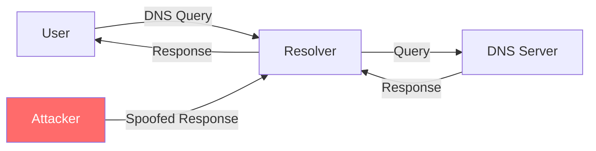
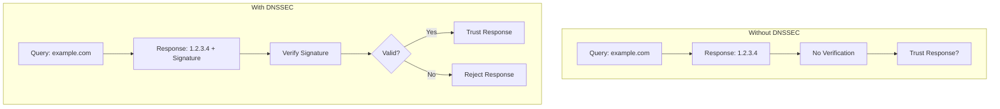
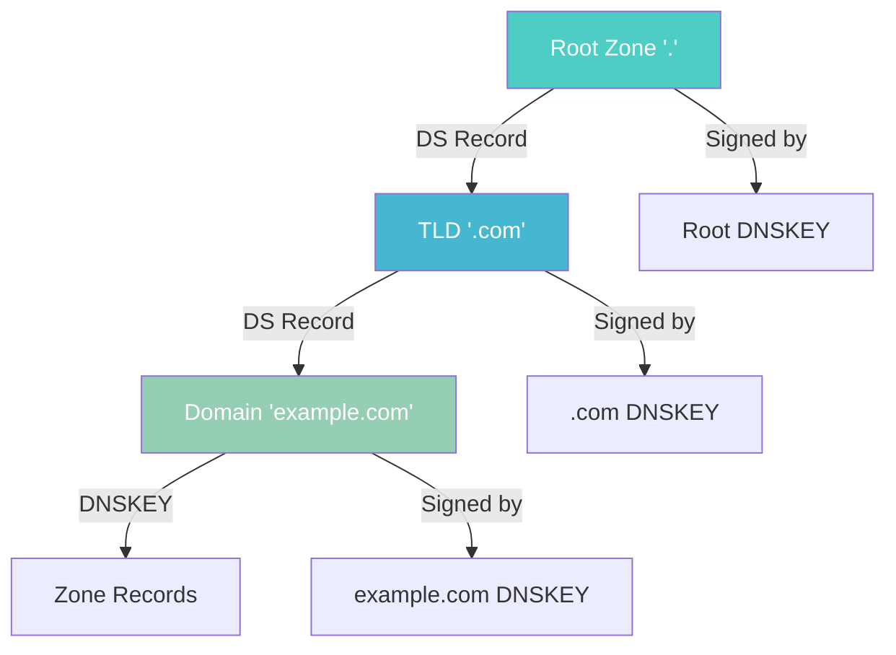
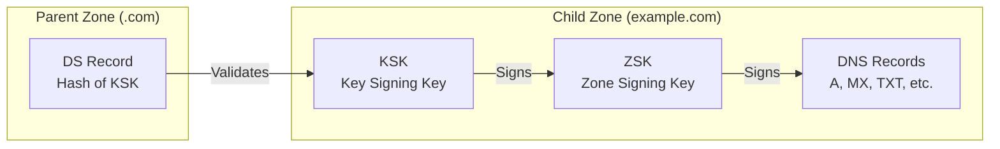
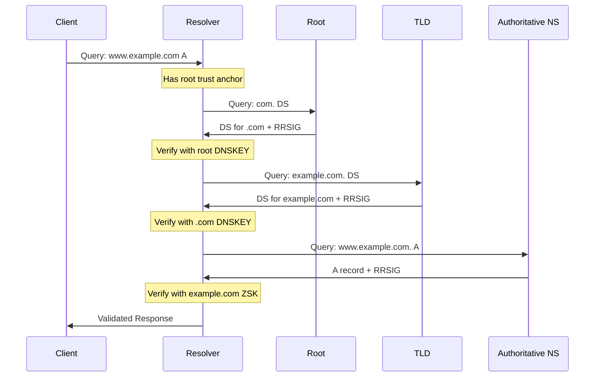
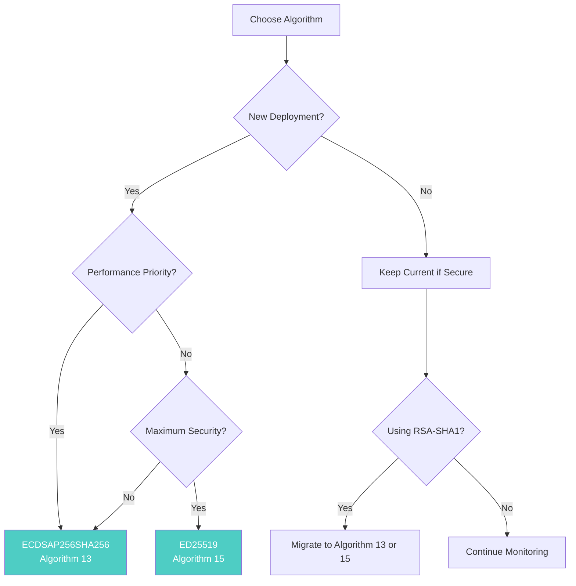
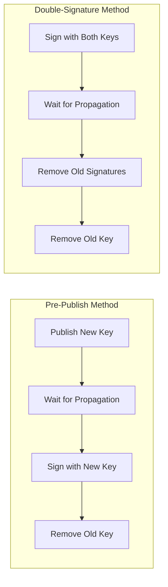

# How to Understand DNSSEC: A Complete Beginner's Guide to DNS Security

Author: [nawazdhandala](https://www.github.com/nawazdhandala)

Tags: DNSSEC, DNS, Security, Networking, Cryptography, Domain Security, Chain of Trust

Description: A comprehensive beginner's guide to understanding DNSSEC, covering the chain of trust, key concepts like DNSKEY, RRSIG, DS records, and how DNS validation protects against attacks.

---

## Introduction

The Domain Name System (DNS) is often called the "phonebook of the internet." It translates human-readable domain names like `example.com` into IP addresses that computers use to communicate. However, the original DNS protocol was designed in the 1980s without security in mind, making it vulnerable to various attacks.

DNSSEC (Domain Name System Security Extensions) adds a layer of trust to DNS by digitally signing DNS records. This guide will walk you through everything you need to know about DNSSEC, from basic concepts to how validation works.

## Why DNS Security Matters

### The Problem with Traditional DNS

Traditional DNS has several vulnerabilities:



**Common DNS Attacks:**

1. **DNS Cache Poisoning**: Attackers inject false DNS records into resolver caches
2. **Man-in-the-Middle Attacks**: Intercepting and modifying DNS responses
3. **DNS Spoofing**: Returning fraudulent IP addresses for domain queries

### Real-World Impact

Without DNSSEC, attackers can:
- Redirect users to phishing sites
- Intercept email by manipulating MX records
- Steal credentials and sensitive data
- Distribute malware through fake downloads

## What is DNSSEC?

DNSSEC is a suite of extensions that add cryptographic signatures to DNS records. It provides:

- **Authentication**: Verify that DNS responses come from the authorized source
- **Data Integrity**: Ensure DNS records haven't been modified in transit
- **Authenticated Denial of Existence**: Prove that a domain doesn't exist



### What DNSSEC Does NOT Provide

It's important to understand DNSSEC's limitations:

- **No encryption**: DNS queries and responses are still visible
- **No privacy**: DNSSEC doesn't hide what domains you're visiting
- **No DDoS protection**: It doesn't prevent denial-of-service attacks

## The Chain of Trust

DNSSEC operates on a hierarchical chain of trust that mirrors the DNS hierarchy itself.



### How the Chain Works

1. **Root Zone**: The starting point of trust, managed by ICANN
2. **TLD Zone**: Top-level domains (.com, .org, .net) are signed and linked to the root
3. **Domain Zone**: Your domain is signed and linked to the TLD
4. **Resource Records**: All DNS records in your zone are signed

### Trust Anchors

A trust anchor is a DNSKEY that a resolver trusts implicitly. The root zone's DNSKEY serves as the global trust anchor:

```bash
# View the root trust anchor
dig . DNSKEY +dnssec

# Example root DNSKEY (KSK)
# . 172800 IN DNSKEY 257 3 8 AwEAAaz/tAm8...
```

## Key DNSSEC Concepts

### 1. DNSKEY Records

DNSKEY records contain the public keys used to verify signatures. There are two types:

```
; Zone Signing Key (ZSK) - Flag 256
example.com. 86400 IN DNSKEY 256 3 13 (
    mdsswUyr3DPW132mOi8V9xESWE8jTo0dxCjj
    dnopqLiRW0y9GJkvwLNbQCkZu4v5X+2s4M4+
    IgFkL0THBO4VU1nHSjnjxCs=
)

; Key Signing Key (KSK) - Flag 257
example.com. 86400 IN DNSKEY 257 3 13 (
    kBDgEGTHKOQ5Q+0A4sHFUvZUJPKyHWVdX8u0
    CwTsJE8F0MVxZnKVvO4jECfZWUj4DvM5RXMH
    R0dFYnRiRnMjOTM5R1pjM28=
)
```

**Key Types Explained:**

| Key Type | Flag | Purpose | Rotation Frequency |
|----------|------|---------|-------------------|
| ZSK (Zone Signing Key) | 256 | Signs zone records | Monthly to quarterly |
| KSK (Key Signing Key) | 257 | Signs DNSKEY records | Annually or less |

### 2. RRSIG Records

RRSIG (Resource Record Signature) records contain the cryptographic signatures for DNS records:

```
; RRSIG for an A record
example.com. 86400 IN A 93.184.216.34
example.com. 86400 IN RRSIG A 13 2 86400 (
    20260215000000 20260108000000 12345 example.com.
    oJB1W6WNGv+ldvQ3WDG0MQkg5IEhjRip8WTr
    PYGv07h108dUKGMeDPKijVCHX3DDKdfb+v6o
    B9wfuh3DTJXUAfI/M0zmO/zz8bW0Rznl8O3t
    GNazPwQKkRN20XPXV6nwwfoXmJQbsLNNLfkf
    JV2+VLNzn4VL+2aVJy3QyBRy )
```

**RRSIG Components:**

- **Type Covered**: The record type being signed (A, AAAA, MX, etc.)
- **Algorithm**: Cryptographic algorithm used
- **Labels**: Number of labels in the owner name
- **Original TTL**: TTL of the signed record
- **Signature Expiration**: When the signature expires
- **Signature Inception**: When the signature became valid
- **Key Tag**: Identifier for the signing key
- **Signer's Name**: The zone that created the signature
- **Signature**: The actual cryptographic signature

### 3. DS Records

DS (Delegation Signer) records link child zones to parent zones, creating the chain of trust:

```
; DS record in parent zone (.com)
example.com. 86400 IN DS 12345 13 2 (
    49FD46E6C4B45C55D4AC69CBD3CD34AC1AFE51DE
    7AB62E87E24F0A6D4A5F5B97E8FE7F3D )
```

**DS Record Components:**

- **Key Tag**: Matches the DNSKEY it references
- **Algorithm**: Must match the DNSKEY algorithm
- **Digest Type**: Hash algorithm (1=SHA-1, 2=SHA-256, 4=SHA-384)
- **Digest**: Hash of the child's DNSKEY



### 4. NSEC and NSEC3 Records

These records provide authenticated denial of existence - proving that a domain or record type doesn't exist.

#### NSEC (Next Secure)

NSEC records list the next domain name in the zone and what record types exist:

```
; NSEC record showing 'alpha.example.com' is followed by 'beta.example.com'
alpha.example.com. 86400 IN NSEC beta.example.com. A AAAA RRSIG NSEC
```

**Problem with NSEC**: Zone walking - attackers can enumerate all domains in a zone.

#### NSEC3 (Hashed)

NSEC3 uses hashed domain names to prevent zone enumeration:

```
; NSEC3 record with hashed names
CK0POJMG874LJREF7EFN8430QVIT8BSM.example.com. 86400 IN NSEC3 (
    1 0 10 AABBCCDD
    MIFDNDT3NFF3OD53O7TLA1HRFF95JKUK
    A AAAA RRSIG )
```

**NSEC3 Parameters:**

| Parameter | Description |
|-----------|-------------|
| Algorithm | Hash algorithm (1 = SHA-1) |
| Flags | 0 = no opt-out, 1 = opt-out |
| Iterations | Number of hash iterations |
| Salt | Additional randomness |

## How DNSSEC Validation Works

Let's walk through the complete validation process:



### Step-by-Step Validation

1. **Obtain the DNSKEY records** for the target zone
2. **Verify the DNSKEY** using the DS record from the parent zone
3. **Verify the DS record** signature using the parent's DNSKEY
4. **Repeat** up the chain until reaching the root trust anchor
5. **Verify the response** signature using the zone's ZSK

### Validation Example with dig

```bash
# Query with DNSSEC validation
dig +dnssec +multi www.example.com A

# Example output showing AD (Authenticated Data) flag
;; flags: qr rd ra ad; QUERY: 1, ANSWER: 2, AUTHORITY: 0, ADDITIONAL: 1

;; ANSWER SECTION:
www.example.com. 86400 IN A 93.184.216.34
www.example.com. 86400 IN RRSIG A 13 3 86400 (
                20260215000000 20260108000000 12345 example.com.
                [signature data] )
```

**Important Flags:**

- **AD (Authenticated Data)**: Response has been validated
- **CD (Checking Disabled)**: Validation was skipped

## DNSSEC Algorithms

DNSSEC supports multiple cryptographic algorithms:

| Algorithm Number | Name | Status | Key Size |
|-----------------|------|--------|----------|
| 5 | RSASHA1 | Deprecated | 1024-4096 bits |
| 7 | RSASHA1-NSEC3-SHA1 | Deprecated | 1024-4096 bits |
| 8 | RSASHA256 | Recommended | 2048-4096 bits |
| 10 | RSASHA512 | Acceptable | 2048-4096 bits |
| 13 | ECDSAP256SHA256 | Recommended | 256 bits |
| 14 | ECDSAP384SHA384 | Acceptable | 384 bits |
| 15 | ED25519 | Recommended | 256 bits |
| 16 | ED448 | Acceptable | 456 bits |

### Algorithm Recommendations



## Checking DNSSEC Status

### Using dig

```bash
# Check if a domain has DNSSEC
dig +dnssec example.com DNSKEY

# Trace the full chain of trust
dig +trace +dnssec example.com A

# Check DS records at the parent
dig example.com DS @a.gtld-servers.net
```

### Using Online Tools

Several online tools can verify DNSSEC:

1. **DNSViz** (https://dnsviz.net) - Visual DNSSEC analysis
2. **Verisign DNSSEC Debugger** - Chain validation
3. **DNSSEC Analyzer** - Comprehensive testing

### Checking Validation Status

```bash
# Test if your resolver validates DNSSEC
dig +dnssec sigfail.verteiltesysteme.net A

# If DNSSEC validation is working, this should return SERVFAIL
# The domain has intentionally broken DNSSEC
```

## Common DNSSEC Issues

### 1. Signature Expiration

```bash
# Check signature expiration dates
dig +dnssec +multi example.com A | grep -A1 RRSIG

# Signatures typically valid for 1-4 weeks
# Expiration: 20260215000000 (YYYYMMDDHHMMSS)
```

### 2. Key Rollover Problems

Key rollovers must be done carefully to maintain the chain of trust:



### 3. DS Record Mismatch

```bash
# Verify DS record matches DNSKEY
# Generate DS from DNSKEY
dnssec-dsfromkey -2 Kexample.com.+013+12345.key

# Compare with published DS
dig example.com DS
```

## Best Practices

### For Domain Owners

1. **Enable DNSSEC** through your registrar or DNS provider
2. **Monitor signatures** to prevent expiration
3. **Use algorithm 13 or 15** for new deployments
4. **Plan key rollovers** in advance
5. **Test before production** using staging environments

### For Resolver Operators

1. **Enable DNSSEC validation** on recursive resolvers
2. **Keep root trust anchors updated** (RFC 5011 auto-updates)
3. **Monitor validation failures** for troubleshooting
4. **Consider negative trust anchors** for known-broken domains

### Configuration Example (Unbound Resolver)

```yaml
server:
    # Enable DNSSEC validation
    module-config: "validator iterator"

    # Auto-trust anchor management
    auto-trust-anchor-file: "/var/lib/unbound/root.key"

    # Harden DNSSEC validation
    harden-dnssec-stripped: yes
    harden-below-nxdomain: yes
```

## Summary

DNSSEC is essential for securing DNS infrastructure:

| Concept | Purpose |
|---------|---------|
| DNSKEY | Contains public keys for signature verification |
| RRSIG | Cryptographic signatures for DNS records |
| DS | Links child zones to parent zones |
| NSEC/NSEC3 | Proves non-existence of domains |
| Chain of Trust | Hierarchical validation from root to domain |

### Key Takeaways

1. DNSSEC adds authentication and integrity to DNS
2. The chain of trust starts at the root zone
3. Both KSK and ZSK work together to sign zones
4. DS records connect the chain between zones
5. Proper key management is critical for security

## Next Steps

Now that you understand DNSSEC fundamentals:

1. **Enable DNSSEC** on your domains
2. **Learn key generation** with dnssec-keygen
3. **Practice zone signing** with BIND
4. **Set up monitoring** for your DNSSEC deployment

## Additional Resources

- RFC 4033: DNS Security Introduction and Requirements
- RFC 4034: Resource Records for DNS Security Extensions
- RFC 4035: Protocol Modifications for DNS Security Extensions
- RFC 5155: DNS Security (DNSSEC) Hashed Authenticated Denial of Existence
- ICANN DNSSEC Training Materials
