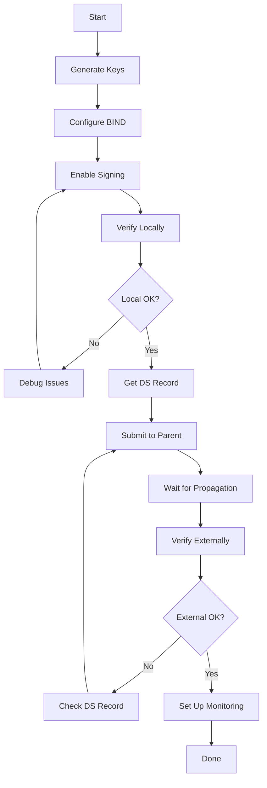

# How to Sign Your DNS Zone with DNSSEC Using BIND

Author: [nawazdhandala](https://www.github.com/nawazdhandala)

Tags: DNSSEC, DNS, BIND, Zone Signing, Security, dnssec-signzone, Inline Signing, Key Management

Description: A comprehensive guide to signing DNS zones with DNSSEC using BIND, covering both manual signing with dnssec-signzone and automatic inline signing for production deployments.

---

## Introduction

Once you have generated your DNSSEC keys, the next step is signing your DNS zone. BIND provides two methods for zone signing: manual signing with `dnssec-signzone` and automatic inline signing. This guide covers both approaches with practical examples and best practices.

## Prerequisites

Before proceeding, ensure you have:

1. BIND installed and configured
2. DNSSEC keys generated (KSK and ZSK)
3. A working unsigned DNS zone
4. Root or sudo access to the server

```bash
# Verify BIND installation
named -v
# BIND 9.18.x

# Verify zone files exist
ls -la /etc/bind/zones/

# Verify keys exist
ls -la /etc/bind/keys/example.com/
```

## Understanding Zone Signing

### Signing Process Overview


### What Gets Added During Signing

| Record Type | Purpose | Count |
|-------------|---------|-------|
| DNSKEY | Public keys (KSK + ZSK) | 2+ |
| RRSIG | Signature for each RRset | Many |
| NSEC/NSEC3 | Authenticated denial | One per name |

## Method 1: Manual Signing with dnssec-signzone

Manual signing is useful for learning, testing, and environments with specific signing requirements.

### Step 1: Prepare Your Zone File

```bash
# Example unsigned zone file: /etc/bind/zones/example.com.zone
```

```dns
$TTL 86400
$ORIGIN example.com.
@       IN      SOA     ns1.example.com. admin.example.com. (
                        2026010801      ; Serial
                        3600            ; Refresh
                        1800            ; Retry
                        604800          ; Expire
                        86400 )         ; Minimum TTL

; Nameservers
        IN      NS      ns1.example.com.
        IN      NS      ns2.example.com.

; A Records
@       IN      A       93.184.216.34
www     IN      A       93.184.216.34
mail    IN      A       93.184.216.35

; MX Record
@       IN      MX      10 mail.example.com.

; TXT Record
@       IN      TXT     "v=spf1 mx -all"

; Nameserver A Records
ns1     IN      A       93.184.216.36
ns2     IN      A       93.184.216.37
```

### Step 2: Include DNSKEY Records

```bash
# Method 1: Include keys directly in zone file
cat /etc/bind/keys/example.com/*.key >> /etc/bind/zones/example.com.zone

# Method 2: Use $INCLUDE directive
echo '$INCLUDE "/etc/bind/keys/example.com/Kexample.com.+013+12345.key"' >> /etc/bind/zones/example.com.zone
echo '$INCLUDE "/etc/bind/keys/example.com/Kexample.com.+013+54321.key"' >> /etc/bind/zones/example.com.zone
```

### Step 3: Sign the Zone

```bash
# Basic signing
cd /etc/bind/zones
dnssec-signzone -o example.com example.com.zone

# With specific key directory
dnssec-signzone -K /etc/bind/keys/example.com \
    -o example.com \
    example.com.zone

# Full options for production
dnssec-signzone \
    -K /etc/bind/keys/example.com \
    -o example.com \
    -N INCREMENT \
    -S \
    -e +30d \
    -3 $(head -c 8 /dev/urandom | xxd -p) \
    example.com.zone
```

### dnssec-signzone Options

| Option | Description | Example |
|--------|-------------|---------|
| `-o` | Zone origin | `-o example.com` |
| `-K` | Key directory | `-K /etc/bind/keys/example.com` |
| `-N` | SOA serial format | `-N INCREMENT` (or `UNIXTIME`, `DATE`, `KEEP`) |
| `-S` | Smart signing (use all available keys) | `-S` |
| `-e` | Signature expiration | `-e +30d` |
| `-i` | Signature inception (offset) | `-i -1h` |
| `-3` | Use NSEC3 with salt | `-3 abc123` |
| `-H` | NSEC3 iterations | `-H 10` |
| `-A` | NSEC3 opt-out | `-A` |
| `-f` | Output file | `-f example.com.zone.signed` |

### Step 4: Review Signed Zone

```bash
# View the signed zone
head -100 example.com.zone.signed
```

```dns
; File written on Thu Jan  8 12:00:00 2026
; dnssec_signzone version 9.18.x
example.com.            86400   IN SOA  ns1.example.com. admin.example.com. (
                                        2026010802 ; serial
                                        3600       ; refresh
                                        1800       ; retry
                                        604800     ; expire
                                        86400      ; minimum
                                        )
                        86400   RRSIG   SOA 13 2 86400 (
                                        20260207120000 20260108120000 54321 example.com.
                                        [signature data] )
                        86400   NS      ns1.example.com.
                        86400   NS      ns2.example.com.
                        86400   RRSIG   NS 13 2 86400 (
                                        20260207120000 20260108120000 54321 example.com.
                                        [signature data] )
                        86400   A       93.184.216.34
                        86400   RRSIG   A 13 2 86400 (
                                        20260207120000 20260108120000 54321 example.com.
                                        [signature data] )
                        86400   MX      10 mail.example.com.
                        86400   RRSIG   MX 13 2 86400 (
                                        20260207120000 20260108120000 54321 example.com.
                                        [signature data] )
                        86400   TXT     "v=spf1 mx -all"
                        86400   RRSIG   TXT 13 2 86400 (
                                        20260207120000 20260108120000 54321 example.com.
                                        [signature data] )
                        86400   DNSKEY  256 3 13 (
                                        [ZSK public key]
                                        ) ; ZSK; alg = ECDSAP256SHA256 ; key id = 54321
                        86400   DNSKEY  257 3 13 (
                                        [KSK public key]
                                        ) ; KSK; alg = ECDSAP256SHA256 ; key id = 12345
                        86400   RRSIG   DNSKEY 13 2 86400 (
                                        20260207120000 20260108120000 12345 example.com.
                                        [signature data] )
```

### Step 5: Configure BIND to Use Signed Zone

```bash
# Edit named.conf.local
nano /etc/bind/named.conf.local
```

```bind
zone "example.com" {
    type primary;
    file "/etc/bind/zones/example.com.zone.signed";
    allow-transfer { secondary_servers; };
    notify yes;
};
```

### Step 6: Reload BIND

```bash
# Check configuration
named-checkconf
named-checkzone example.com /etc/bind/zones/example.com.zone.signed

# Reload BIND
rndc reload example.com
# or
systemctl reload bind9
```

## Method 2: BIND Inline Signing (Recommended)

Inline signing automatically maintains DNSSEC signatures without manual intervention.


### Configure Inline Signing

```bash
# Edit named.conf.local
nano /etc/bind/named.conf.local
```

```bind
// Key directory must be specified
key-directory "/etc/bind/keys/example.com";

zone "example.com" {
    type primary;
    file "/etc/bind/zones/example.com.zone";

    // Enable inline signing
    inline-signing yes;
    auto-dnssec maintain;

    // Optional: Update policy for dynamic updates
    update-policy local;

    // Transfer settings
    allow-transfer { secondary_servers; };
    notify yes;
};
```

### BIND 9.16+ DNSSEC Policy (Recommended)

BIND 9.16 introduced `dnssec-policy` for automated key and signing management:

```bind
// Define DNSSEC policy
dnssec-policy "standard" {
    // Key parameters
    keys {
        ksk key-directory lifetime unlimited algorithm ecdsap256sha256;
        zsk key-directory lifetime 90d algorithm ecdsap256sha256;
    };

    // Signature lifetime
    signatures-validity 14d;
    signatures-refresh 5d;
    signatures-validity-dnskey 14d;

    // NSEC3 parameters
    nsec3param iterations 0 optout no salt-length 8;

    // Key rollover timing
    dnskey-ttl 3600;
    publish-safety 1h;
    retire-safety 1h;
    purge-keys 90d;

    // Parent DS update timing
    parent-ds-ttl 86400;
    parent-propagation-delay 2h;
};

zone "example.com" {
    type primary;
    file "/etc/bind/zones/example.com.zone";
    dnssec-policy "standard";
    inline-signing yes;
};
```

### Pre-defined DNSSEC Policies

BIND includes built-in policies:

```bind
// Use the default policy
zone "example.com" {
    type primary;
    file "/etc/bind/zones/example.com.zone";
    dnssec-policy default;
    inline-signing yes;
};

// Disable DNSSEC (explicitly)
zone "internal.example.com" {
    type primary;
    file "/etc/bind/zones/internal.zone";
    dnssec-policy insecure;
};
```

### Complete named.conf Example

```bind
// /etc/bind/named.conf

acl "secondary_servers" {
    192.168.1.2;
    192.168.1.3;
};

options {
    directory "/var/cache/bind";

    // DNSSEC validation for recursive queries
    dnssec-validation auto;

    // Listen addresses
    listen-on { any; };
    listen-on-v6 { any; };

    // Security
    allow-query { any; };
    allow-recursion { localhost; };

    // Logging
    querylog yes;
};

// DNSSEC policy definition
dnssec-policy "production" {
    keys {
        ksk key-directory lifetime unlimited algorithm ecdsap256sha256;
        zsk key-directory lifetime P90D algorithm ecdsap256sha256;
    };

    dnskey-ttl PT1H;
    publish-safety PT1H;
    retire-safety PT1H;
    purge-keys P90D;

    signatures-refresh P5D;
    signatures-validity P14D;
    signatures-validity-dnskey P14D;

    max-zone-ttl P1D;
    zone-propagation-delay PT5M;

    parent-ds-ttl P1D;
    parent-propagation-delay PT1H;
    parent-registration-delay P1D;

    nsec3param iterations 0 optout no salt-length 8;
};

// Zone configuration
zone "example.com" {
    type primary;
    file "/etc/bind/zones/example.com.zone";
    key-directory "/etc/bind/keys/example.com";

    dnssec-policy "production";
    inline-signing yes;

    allow-transfer { secondary_servers; };
    notify yes;
};

// Logging
logging {
    channel dnssec_log {
        file "/var/log/bind/dnssec.log" versions 3 size 10m;
        severity info;
        print-time yes;
        print-severity yes;
    };

    category dnssec { dnssec_log; };
};
```

## NSEC vs NSEC3

### Configuring NSEC (Default)

```bash
# Manual signing with NSEC
dnssec-signzone -o example.com example.com.zone
```

### Configuring NSEC3

```bash
# Manual signing with NSEC3
dnssec-signzone \
    -3 $(head -c 8 /dev/urandom | xxd -p) \
    -H 0 \
    -o example.com \
    example.com.zone
```

### NSEC3 Parameters Explained


| Parameter | Recommended | Description |
|-----------|-------------|-------------|
| Algorithm | 1 (SHA-1) | Only supported algorithm |
| Iterations | 0 | Higher values increase CPU load |
| Salt | Random | Change during key rollover |
| Opt-out | No | Yes only for large zones with unsigned delegations |

### NSEC3 in named.conf

```bind
// Using dnssec-policy
dnssec-policy "with-nsec3" {
    keys {
        ksk lifetime unlimited algorithm ecdsap256sha256;
        zsk lifetime 90d algorithm ecdsap256sha256;
    };
    nsec3param iterations 0 optout no salt-length 8;
};

// Legacy method (auto-dnssec)
zone "example.com" {
    type primary;
    file "/etc/bind/zones/example.com.zone";
    auto-dnssec maintain;
    inline-signing yes;
    key-directory "/etc/bind/keys/example.com";
};

// Then use rndc to set NSEC3
// rndc signing -nsec3param 1 0 10 auto example.com
```

## Maintaining Signatures

### Signature Lifecycle


### Manual Re-signing

```bash
# Re-sign the zone with updated signatures
dnssec-signzone \
    -K /etc/bind/keys/example.com \
    -o example.com \
    -N INCREMENT \
    -S \
    -e +30d \
    example.com.zone

# Reload BIND
rndc reload example.com
```

### Automated Re-signing Script

```bash
#!/bin/bash
# /usr/local/bin/resign-zone.sh

ZONE="example.com"
ZONE_FILE="/etc/bind/zones/${ZONE}.zone"
KEY_DIR="/etc/bind/keys/${ZONE}"
SIGNED_FILE="${ZONE_FILE}.signed"
LOG_FILE="/var/log/dnssec-resign.log"

log() {
    echo "$(date '+%Y-%m-%d %H:%M:%S') - $1" >> "$LOG_FILE"
}

log "Starting re-signing for ${ZONE}"

# Backup current signed zone
cp "$SIGNED_FILE" "${SIGNED_FILE}.bak"

# Re-sign the zone
cd /etc/bind/zones
dnssec-signzone \
    -K "$KEY_DIR" \
    -o "$ZONE" \
    -N INCREMENT \
    -S \
    -e +30d \
    "${ZONE}.zone" 2>> "$LOG_FILE"

if [ $? -eq 0 ]; then
    log "Zone signed successfully"

    # Verify signed zone
    named-checkzone "$ZONE" "$SIGNED_FILE" >> "$LOG_FILE" 2>&1

    if [ $? -eq 0 ]; then
        log "Zone verification passed"
        rndc reload "$ZONE"
        log "Zone reloaded"
    else
        log "ERROR: Zone verification failed, reverting"
        mv "${SIGNED_FILE}.bak" "$SIGNED_FILE"
    fi
else
    log "ERROR: Zone signing failed"
    mv "${SIGNED_FILE}.bak" "$SIGNED_FILE"
fi
```

### Cron Job for Regular Re-signing

```bash
# Add to crontab
# Re-sign weekly (for 30-day signatures)
0 2 * * 0 /usr/local/bin/resign-zone.sh

# Or daily for shorter signature validity
0 2 * * * /usr/local/bin/resign-zone.sh
```

## Verifying Your Signed Zone

### Local Verification

```bash
# Check zone syntax
named-checkzone example.com /etc/bind/zones/example.com.zone.signed

# Verify DNSSEC records
dig @localhost example.com DNSKEY +dnssec +multi

# Check RRSIG
dig @localhost example.com A +dnssec

# Verify NSEC3 chain
dig @localhost example.com NSEC3PARAM
```

### External Verification

```bash
# Test against public resolvers
dig @8.8.8.8 example.com A +dnssec

# Check AD (Authenticated Data) flag
dig @8.8.8.8 example.com A +dnssec | grep flags

# Expected output:
# ;; flags: qr rd ra ad; QUERY: 1, ANSWER: 2, AUTHORITY: 0, ADDITIONAL: 1

# Use delv for detailed validation
delv @8.8.8.8 example.com A +rtrace
```

### Comprehensive Test Script

```bash
#!/bin/bash
# /usr/local/bin/verify-dnssec.sh

ZONE=$1
NS=${2:-"localhost"}

echo "=== DNSSEC Verification for ${ZONE} ==="
echo ""

echo "1. Checking DNSKEY records..."
dig @${NS} ${ZONE} DNSKEY +short | head -4
echo ""

echo "2. Checking DS record (from parent)..."
dig ${ZONE} DS +short
echo ""

echo "3. Checking A record with DNSSEC..."
dig @${NS} ${ZONE} A +dnssec +short
echo ""

echo "4. Checking SOA RRSIG..."
dig @${NS} ${ZONE} SOA +dnssec | grep RRSIG | head -2
echo ""

echo "5. Checking NSEC3PARAM..."
dig @${NS} ${ZONE} NSEC3PARAM +short
echo ""

echo "6. Validation test (using Google DNS)..."
RESULT=$(dig @8.8.8.8 ${ZONE} A +dnssec | grep "flags:")
if echo "$RESULT" | grep -q " ad"; then
    echo "SUCCESS: AD flag present - DNSSEC validated"
else
    echo "WARNING: AD flag not present - Check DNSSEC chain"
fi
echo "$RESULT"
echo ""

echo "7. Chain of trust test..."
delv ${ZONE} A +rtrace 2>&1 | head -10
```

## Troubleshooting Common Issues

### Issue 1: Signatures Not Loading

```bash
# Check BIND logs
tail -f /var/log/syslog | grep named

# Common error: key not found
# Solution: Ensure key files are readable by BIND
chown bind:bind /etc/bind/keys/example.com/*
chmod 640 /etc/bind/keys/example.com/*.key
chmod 600 /etc/bind/keys/example.com/*.private
```

### Issue 2: Zone Transfer Failing

```bash
# Ensure signed zone is being transferred
dig @secondary_server example.com DNSKEY

# Check transfer settings
rndc zonestatus example.com
```

### Issue 3: Signature Expiration


```bash
# Check signature expiration
dig @localhost example.com SOA +dnssec | grep RRSIG

# Look for expiration timestamp
# Format: 20260207120000 (YYYYMMDDHHMMSS)

# Force re-signing (inline signing)
rndc sign example.com

# Or for manual zones
/usr/local/bin/resign-zone.sh
```

### Issue 4: NSEC3 Chain Broken

```bash
# Check NSEC3 chain
dig @localhost example.com NSEC3PARAM

# Regenerate NSEC3 chain
rndc signing -nsec3param 1 0 10 auto example.com

# Or re-sign the zone
dnssec-signzone -3 $(head -c 8 /dev/urandom | xxd -p) \
    -o example.com example.com.zone
```

### Debug Logging

```bind
// Add to named.conf for debugging
logging {
    channel dnssec_debug {
        file "/var/log/bind/dnssec-debug.log" versions 3 size 50m;
        severity debug 3;
        print-time yes;
        print-severity yes;
        print-category yes;
    };

    category dnssec { dnssec_debug; };
    category general { dnssec_debug; };
};
```

## Complete Deployment Workflow

### Step-by-Step Deployment



### Full Deployment Script

```bash
#!/bin/bash
# deploy-dnssec.sh - Complete DNSSEC deployment

set -e

ZONE="example.com"
ZONE_DIR="/etc/bind/zones"
KEY_DIR="/etc/bind/keys/${ZONE}"
ALGORITHM="ECDSAP256SHA256"

echo "=== DNSSEC Deployment for ${ZONE} ==="

# Step 1: Create directories
echo "Step 1: Creating directories..."
mkdir -p "$KEY_DIR"
chmod 750 "$KEY_DIR"
chown bind:bind "$KEY_DIR"

# Step 2: Generate keys
echo "Step 2: Generating DNSSEC keys..."
cd "$KEY_DIR"

KSK=$(dnssec-keygen -a $ALGORITHM -f KSK -n ZONE $ZONE)
echo "KSK: $KSK"

ZSK=$(dnssec-keygen -a $ALGORITHM -n ZONE $ZONE)
echo "ZSK: $ZSK"

# Set permissions
chmod 640 *.key
chmod 600 *.private
chown bind:bind *

# Step 3: Configure BIND
echo "Step 3: Configuring BIND..."
cat >> /etc/bind/named.conf.local << EOF

// DNSSEC for ${ZONE}
zone "${ZONE}" {
    type primary;
    file "${ZONE_DIR}/${ZONE}.zone";
    key-directory "${KEY_DIR}";
    inline-signing yes;
    auto-dnssec maintain;
    allow-transfer { secondary_servers; };
};
EOF

# Step 4: Check configuration
echo "Step 4: Verifying configuration..."
named-checkconf
named-checkzone $ZONE ${ZONE_DIR}/${ZONE}.zone

# Step 5: Reload BIND
echo "Step 5: Reloading BIND..."
systemctl reload bind9

# Step 6: Wait for signing
echo "Step 6: Waiting for zone signing..."
sleep 10

# Step 7: Verify
echo "Step 7: Verifying DNSSEC..."
dig @localhost $ZONE DNSKEY +short | head -2

# Step 8: Generate DS record
echo ""
echo "=== DS Record for Parent Zone ==="
dnssec-dsfromkey -2 "${KEY_DIR}/${KSK}.key"

echo ""
echo "=== Deployment Complete ==="
echo "Next steps:"
echo "1. Submit the DS record above to your registrar"
echo "2. Wait 24-48 hours for propagation"
echo "3. Verify with: dig @8.8.8.8 ${ZONE} A +dnssec"
```

## Summary

### Key Concepts

| Concept | Description |
|---------|-------------|
| Manual Signing | Using dnssec-signzone for explicit control |
| Inline Signing | Automatic signing by BIND |
| dnssec-policy | Modern BIND configuration for automated management |
| NSEC vs NSEC3 | NSEC3 prevents zone enumeration |
| Signature Refresh | Signatures must be renewed before expiration |

### Quick Reference

```bash
# Manual signing
dnssec-signzone -K /path/to/keys -o example.com -S zone.file

# Check zone
named-checkzone example.com /path/to/signed.zone

# Reload zone
rndc reload example.com

# Force re-sign (inline)
rndc sign example.com

# View zone status
rndc zonestatus example.com

# Verify DNSSEC
dig @localhost example.com A +dnssec
delv @8.8.8.8 example.com A +rtrace
```

### Best Practices

1. **Use inline signing** for production environments
2. **Use dnssec-policy** in BIND 9.16+
3. **Monitor signature expiration** proactively
4. **Test thoroughly** before enabling in production
5. **Keep backups** of keys and zone files
6. **Document your configuration** for the team
7. **Set up alerting** for DNSSEC failures

## Next Steps

After signing your zone:

1. **Submit DS record** to your registrar
2. **Set up monitoring** for DNSSEC health
3. **Plan key rollover** procedures
4. **Configure secondary servers** for DNSSEC
5. **Test disaster recovery** procedures

## Additional Resources

- BIND 9 Administrator Reference Manual
- RFC 4035 - Protocol Modifications for DNSSEC
- RFC 5155 - DNSSEC Hashed Authenticated Denial of Existence
- RFC 6781 - DNSSEC Operational Practices
- ISC BIND DNSSEC Guide
