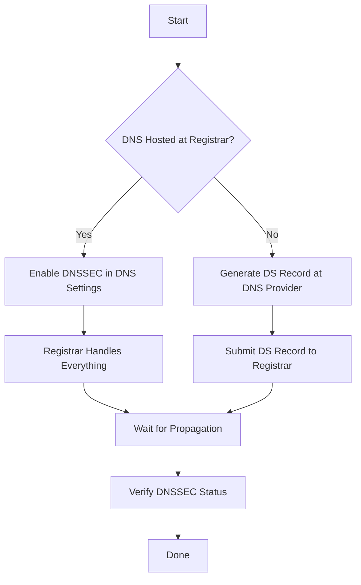
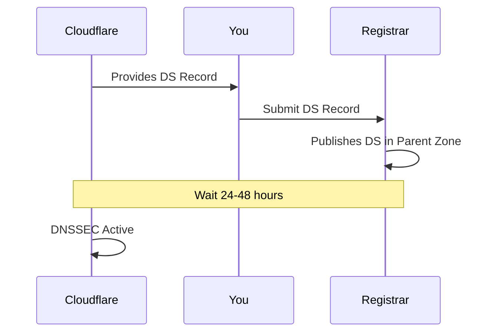
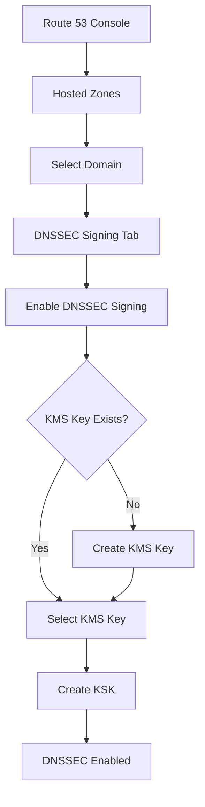
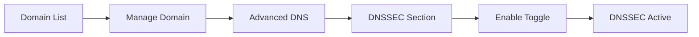
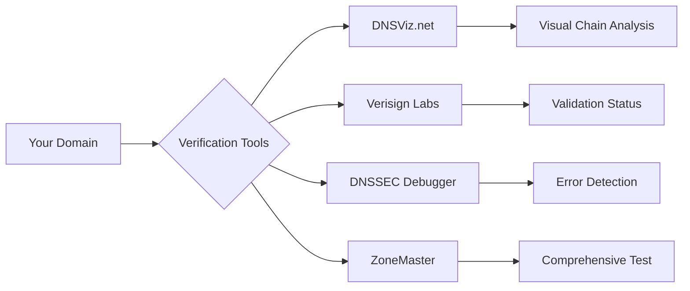
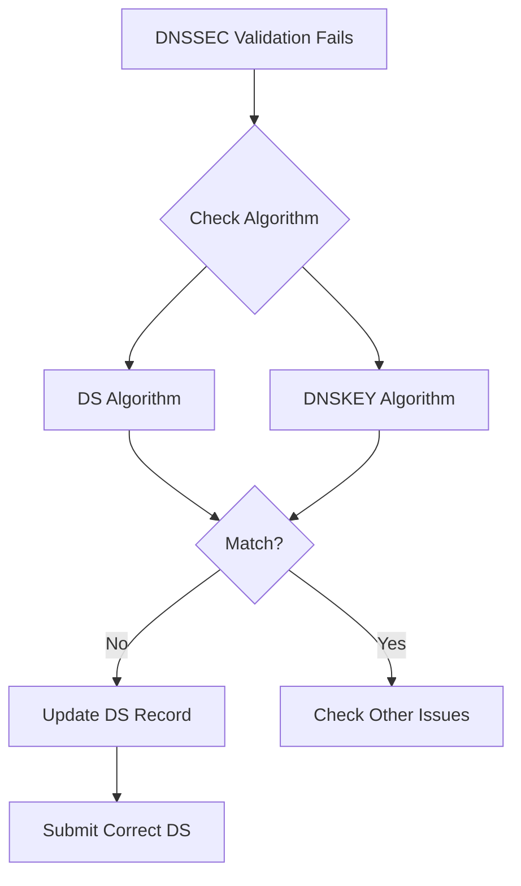
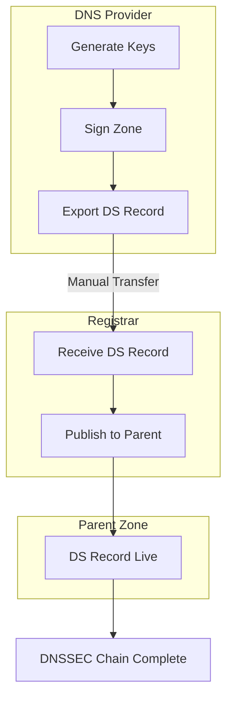

# How to Enable DNSSEC on Your Domain with Popular Registrars

Author: [nawazdhandala](https://www.github.com/nawazdhandala)

Tags: DNSSEC, DNS, Domain Security, Cloudflare, Route53, GoDaddy, Namecheap, Google Domains, Registrar

Description: Step-by-step guides for enabling DNSSEC on your domain using popular registrars including Cloudflare, AWS Route53, GoDaddy, Namecheap, and Google Domains.

---

## Introduction

Enabling DNSSEC on your domain is one of the most important steps you can take to protect your users from DNS-based attacks. While the technical details of DNSSEC can be complex, most modern registrars and DNS providers have simplified the process significantly.

This guide provides step-by-step instructions for enabling DNSSEC on the most popular registrars and DNS providers.

## Understanding the DNSSEC Enablement Process

Before diving into specific registrars, let's understand the general workflow:



### Key Terminology

| Term | Description |
|------|-------------|
| DS Record | Delegation Signer - Links your domain to the parent zone |
| Key Tag | Unique identifier for the DNSKEY |
| Algorithm | Cryptographic algorithm number |
| Digest Type | Hash algorithm (usually SHA-256) |
| Digest | The actual hash value |

## Cloudflare

Cloudflare provides one of the simplest DNSSEC implementations with one-click enablement.

### Prerequisites

- Domain registered and active on Cloudflare
- DNS managed by Cloudflare (nameservers pointing to Cloudflare)

### Step 1: Enable DNSSEC in Cloudflare Dashboard

```bash
# Navigate to:
# Dashboard > Your Domain > DNS > Settings
```

1. Log in to your Cloudflare dashboard
2. Select your domain
3. Go to **DNS** in the left sidebar
4. Scroll down to **DNSSEC**
5. Click **Enable DNSSEC**

### Step 2: Copy DS Record Information

Cloudflare will display the DS record information:

```
DS Record:
example.com. 3600 IN DS 2371 13 2 1F987CC6583E92DF0890718C42A5B6B4B8A6F8B74E2C350E6F7E6D2F8E9A0B1C

Digest Type: SHA-256 (2)
Algorithm: ECDSAP256SHA256 (13)
Key Tag: 2371
Digest: 1F987CC6583E92DF0890718C42A5B6B4B8A6F8B74E2C350E6F7E6D2F8E9A0B1C
```

### Step 3: Add DS Record at Your Registrar

If your registrar is different from Cloudflare:



### Cloudflare API Method

```bash
# Enable DNSSEC via API
curl -X PATCH "https://api.cloudflare.com/client/v4/zones/{zone_id}/dnssec" \
     -H "Authorization: Bearer YOUR_API_TOKEN" \
     -H "Content-Type: application/json" \
     --data '{"status":"active"}'

# Get DS record details
curl -X GET "https://api.cloudflare.com/client/v4/zones/{zone_id}/dnssec" \
     -H "Authorization: Bearer YOUR_API_TOKEN" \
     -H "Content-Type: application/json"
```

### Example Response

```json
{
  "result": {
    "status": "active",
    "flags": 257,
    "algorithm": "13",
    "key_type": "ECDSAP256SHA256",
    "digest_type": "SHA256",
    "digest_algorithm": "SHA256",
    "digest": "1F987CC6583E92DF0890718C42A5B6B4B8A6F8B74E2C350E6F7E6D2F8E9A0B1C",
    "ds": "example.com. 3600 IN DS 2371 13 2 1F987CC6583E92DF...",
    "key_tag": 2371,
    "public_key": "mdsswUyr3DPW132mOi8V9xESWE8jTo0dxCjj..."
  }
}
```

## AWS Route 53

Route 53 supports DNSSEC for both domain registration and DNS hosting.

### Option 1: Domains Registered with Route 53

### Step 1: Enable DNSSEC Signing

```bash
# Using AWS CLI
aws route53 enable-hosted-zone-dnssec \
    --hosted-zone-id Z1234567890ABC
```

### Step 2: Create Key-Signing Key (KSK)

```bash
# Create a KSK
aws route53 create-key-signing-key \
    --hosted-zone-id Z1234567890ABC \
    --name "example-com-ksk" \
    --key-management-service-arn arn:aws:kms:us-east-1:123456789012:key/12345678-1234-1234-1234-123456789012 \
    --status ACTIVE

# Response includes DS record information
```

### Step 3: Enable DNSSEC for the Hosted Zone

```bash
# Enable DNSSEC signing
aws route53 enable-hosted-zone-dnssec \
    --hosted-zone-id Z1234567890ABC

# Verify status
aws route53 get-dnssec \
    --hosted-zone-id Z1234567890ABC
```

### Console Method

1. Open Route 53 console
2. Navigate to **Hosted zones**
3. Select your domain
4. Go to **DNSSEC signing** tab
5. Click **Enable DNSSEC signing**
6. Create or select a KMS key
7. Configure key-signing key settings



### Option 2: Domain Registered Elsewhere

If your domain is registered outside Route 53:

```bash
# Get the DS record from Route 53
aws route53 get-dnssec \
    --hosted-zone-id Z1234567890ABC

# Output includes:
# - Key Tag
# - Algorithm
# - Digest Type
# - Digest (Public Key Hash)
```

Then add the DS record at your registrar.

### Complete AWS CLI Script

```bash
#!/bin/bash

HOSTED_ZONE_ID="Z1234567890ABC"
KMS_KEY_ARN="arn:aws:kms:us-east-1:123456789012:key/your-key-id"
KSK_NAME="my-domain-ksk"

# Step 1: Create KSK
echo "Creating Key-Signing Key..."
aws route53 create-key-signing-key \
    --hosted-zone-id $HOSTED_ZONE_ID \
    --name $KSK_NAME \
    --key-management-service-arn $KMS_KEY_ARN \
    --status ACTIVE

# Step 2: Enable DNSSEC
echo "Enabling DNSSEC..."
aws route53 enable-hosted-zone-dnssec \
    --hosted-zone-id $HOSTED_ZONE_ID

# Step 3: Get DS record
echo "Retrieving DS record..."
aws route53 get-dnssec \
    --hosted-zone-id $HOSTED_ZONE_ID \
    --query 'KeySigningKeys[0].{KeyTag:KeyTag,Algorithm:SigningAlgorithmType,DigestValue:DigestValue}'

echo "DNSSEC enabled successfully!"
```

## GoDaddy

GoDaddy supports DNSSEC for domains using GoDaddy DNS.

### For Domains Using GoDaddy DNS

### Step 1: Access DNS Management

1. Log in to your GoDaddy account
2. Go to **My Products**
3. Click **DNS** next to your domain

### Step 2: Enable DNSSEC

1. Scroll to **DNSSEC** section
2. Click **Add**
3. GoDaddy will automatically:
   - Generate signing keys
   - Sign your zone
   - Publish DS records

### For Domains Using External DNS

If you use external DNS (like Cloudflare or Route 53):

### Step 1: Get DS Record from DNS Provider

Your DNS provider will give you:
- Key Tag
- Algorithm
- Digest Type
- Digest

### Step 2: Add DS Record in GoDaddy

1. Go to **My Products** > **Domains**
2. Select your domain
3. Click **DNS** > **DNSSEC**
4. Click **Add**
5. Enter DS record details:

```
Key Tag: 2371
Algorithm: 13 (ECDSAP256SHA256)
Digest Type: 2 (SHA-256)
Digest: 1F987CC6583E92DF0890718C42A5B6B4B8A6F8B74E2C350E6F7E6D2F8E9A0B1C
```

### GoDaddy API Method

```bash
# Add DS record via GoDaddy API
curl -X POST "https://api.godaddy.com/v1/domains/example.com/records/DS" \
     -H "Authorization: sso-key YOUR_API_KEY:YOUR_API_SECRET" \
     -H "Content-Type: application/json" \
     -d '[{
       "data": "2371 13 2 1F987CC6583E92DF0890718C42A5B6B4B8A6F8B74E2C350E6F7E6D2F8E9A0B1C",
       "ttl": 3600
     }]'
```

## Namecheap

Namecheap offers DNSSEC support for domains using Namecheap DNS or external providers.

### For Domains Using Namecheap DNS

### Step 1: Access Domain Settings

1. Log in to Namecheap
2. Go to **Domain List**
3. Click **Manage** next to your domain

### Step 2: Enable DNSSEC

1. Navigate to **Advanced DNS** tab
2. Find **DNSSEC** section
3. Toggle **DNSSEC** to **Enabled**



### For External DNS Providers

### Step 1: Get DS Record Details

From your DNS provider, obtain:
- Key Tag (e.g., 12345)
- Algorithm (e.g., 13)
- Digest Type (e.g., 2)
- Digest (e.g., 49FD46E6C4B45C55...)

### Step 2: Add DS Record

1. Go to **Domain List** > **Manage**
2. Click **Advanced DNS**
3. Scroll to **DNSSEC**
4. Click **Add new DS record**
5. Fill in the details:

| Field | Value |
|-------|-------|
| Key Tag | 12345 |
| Algorithm | 13 - ECDSAP256SHA256 |
| Digest Type | 2 - SHA-256 |
| Digest | 49FD46E6C4B45C55D4AC... |

### Namecheap DS Record Form

```
┌─────────────────────────────────────────────┐
│ Add DS Record                               │
├─────────────────────────────────────────────┤
│ Key Tag:     [12345            ]            │
│                                             │
│ Algorithm:   [13 - ECDSAP256SHA256    ▼]   │
│                                             │
│ Digest Type: [2 - SHA-256             ▼]   │
│                                             │
│ Digest:      [49FD46E6C4B45C55D4AC...  ]   │
│                                             │
│              [Add DS Record]                │
└─────────────────────────────────────────────┘
```

## Google Domains (Now Squarespace)

Note: Google Domains has been acquired by Squarespace, but the DNSSEC functionality remains similar.

### For Domains Using Google DNS

### Step 1: Access DNS Settings

1. Log in to Google Domains / Squarespace Domains
2. Select your domain
3. Go to **DNS** settings

### Step 2: Enable DNSSEC

1. Find **DNSSEC** section
2. Click **Enable DNSSEC**
3. Confirm the action

Google/Squarespace handles key generation and zone signing automatically.

### For External DNS

### Step 1: Prepare DS Record

Get the following from your DNS provider:

```bash
# Example DS record information
Key Tag: 54321
Algorithm: 13
Digest Type: 2
Digest: 8F5B2D4C6E7A9B0C1D2E3F4A5B6C7D8E9F0A1B2C3D4E5F6A7B8C9D0E1F2A3B4C
```

### Step 2: Add DS Record

1. Navigate to **DNS** > **DNSSEC**
2. Click **Manage DS records**
3. Click **Create new record**
4. Enter the DS record details
5. Save changes

### API Method (Squarespace)

```bash
# Using the Squarespace Domains API
curl -X POST "https://api.squarespace.com/1.0/domains/example.com/dns/dnssec" \
     -H "Authorization: Bearer YOUR_API_KEY" \
     -H "Content-Type: application/json" \
     -d '{
       "dsRecords": [{
         "keyTag": 54321,
         "algorithm": 13,
         "digestType": 2,
         "digest": "8F5B2D4C6E7A9B0C1D2E3F4A5B6C7D8E9F0A1B2C3D4E5F6A7B8C9D0E1F2A3B4C"
       }]
     }'
```

## Verifying DNSSEC Configuration

After enabling DNSSEC, verify your configuration:

### Using dig

```bash
# Check for DNSKEY records
dig example.com DNSKEY +short

# Check for DS records at parent
dig example.com DS +short

# Verify the chain of trust
dig +sigchase +trusted-key=./root.keys example.com A

# Check with DNSSEC validation
dig +dnssec example.com A
```

### Using delv (DNSSEC Lookup and Validation)

```bash
# Validate DNSSEC
delv @8.8.8.8 example.com A +rtrace

# Expected output for valid DNSSEC:
# ; fully validated
# example.com.        300     IN      A       93.184.216.34
# example.com.        300     IN      RRSIG   A 13 2 300 ...
```

### Online Verification Tools



### DNSViz Check

```bash
# Use DNSViz for visual analysis
# Visit: https://dnsviz.net/d/example.com/analyze/

# Or use the CLI tool
dnsviz probe example.com
dnsviz graph example.com | dot -Tpng -o dnssec-graph.png
```

## Troubleshooting Common Issues

### Issue 1: DS Record Not Propagating

```bash
# Check DS at parent nameservers
dig example.com DS @a.gtld-servers.net

# If empty, DS hasn't propagated yet
# Wait 24-48 hours for propagation
```

### Issue 2: Key Tag Mismatch

```bash
# Verify key tag matches
dig example.com DNSKEY +short | head -1
# Output: 257 3 13 [public key]

# Calculate key tag
echo "257 3 13 [public key]" | dnssec-keygen -f KSK -a 13 -n ZONE example.com -C
```

### Issue 3: Algorithm Mismatch



### Issue 4: Expired Signatures

```bash
# Check signature expiration
dig +dnssec example.com A | grep RRSIG

# Look for expiration date in RRSIG
# Format: YYYYMMDDHHMMSS
# If expired, re-sign the zone
```

### Debug Script

```bash
#!/bin/bash

DOMAIN=$1

echo "=== DNSSEC Diagnostics for $DOMAIN ==="

echo -e "\n--- DS Record at Parent ---"
dig $DOMAIN DS +short

echo -e "\n--- DNSKEY Records ---"
dig $DOMAIN DNSKEY +short

echo -e "\n--- RRSIG for A Record ---"
dig +dnssec $DOMAIN A | grep RRSIG

echo -e "\n--- Validation Test ---"
delv @8.8.8.8 $DOMAIN A 2>&1 | head -5

echo -e "\n--- Chain of Trust ---"
dig +trace +dnssec $DOMAIN A | grep -E "(DS|DNSKEY|RRSIG)" | head -20
```

## DS Record Format Reference

When submitting DS records, different registrars expect different formats:

### Format Variations

```bash
# Standard format
2371 13 2 1F987CC6583E92DF0890718C42A5B6B4B8A6F8B74E2C350E6F7E6D2F8E9A0B1C

# With domain name
example.com. 3600 IN DS 2371 13 2 1F987CC6583E92DF...

# Separate fields (most registrar forms)
Key Tag: 2371
Algorithm: 13
Digest Type: 2
Digest: 1F987CC6583E92DF0890718C42A5B6B4B8A6F8B74E2C350E6F7E6D2F8E9A0B1C
```

### Algorithm Numbers Reference

| Number | Name | Recommended |
|--------|------|-------------|
| 8 | RSASHA256 | Yes |
| 10 | RSASHA512 | Yes |
| 13 | ECDSAP256SHA256 | Yes (Preferred) |
| 14 | ECDSAP384SHA384 | Yes |
| 15 | ED25519 | Yes (Preferred) |
| 16 | ED448 | Yes |

### Digest Type Numbers

| Number | Algorithm | Recommended |
|--------|-----------|-------------|
| 1 | SHA-1 | No (Deprecated) |
| 2 | SHA-256 | Yes (Required) |
| 4 | SHA-384 | Yes |

## Multi-Provider Setup

When using different registrar and DNS provider:



### Best Practices for Multi-Provider

1. **Document your DS records** - Keep a copy of all DS record details
2. **Set calendar reminders** - For key rollovers and signature renewals
3. **Test before go-live** - Use staging domains when possible
4. **Monitor regularly** - Set up alerts for DNSSEC failures

## Summary

| Registrar/Provider | One-Click Enable | API Support | DS Record Input |
|-------------------|------------------|-------------|-----------------|
| Cloudflare | Yes | Yes | Yes |
| AWS Route 53 | Yes | Yes | Yes |
| GoDaddy | Yes | Yes | Yes |
| Namecheap | Yes | Limited | Yes |
| Google/Squarespace | Yes | Yes | Yes |

### Quick Checklist

- [ ] Identify your registrar and DNS provider
- [ ] Enable DNSSEC at DNS provider (generates keys and signs zone)
- [ ] Obtain DS record details
- [ ] Submit DS record to registrar
- [ ] Wait for propagation (24-48 hours)
- [ ] Verify DNSSEC with dig or online tools
- [ ] Set up monitoring for ongoing validation

## Next Steps

After enabling DNSSEC:

1. **Monitor your DNSSEC status** using automated tools
2. **Plan for key rollovers** before keys expire
3. **Document your configuration** for team reference
4. **Test disaster recovery** procedures

## Additional Resources

- Cloudflare DNSSEC Documentation
- AWS Route 53 DNSSEC Guide
- ICANN DNSSEC Deployment Guide
- DNSViz Visualization Tool
- Verisign DNSSEC Debugger
