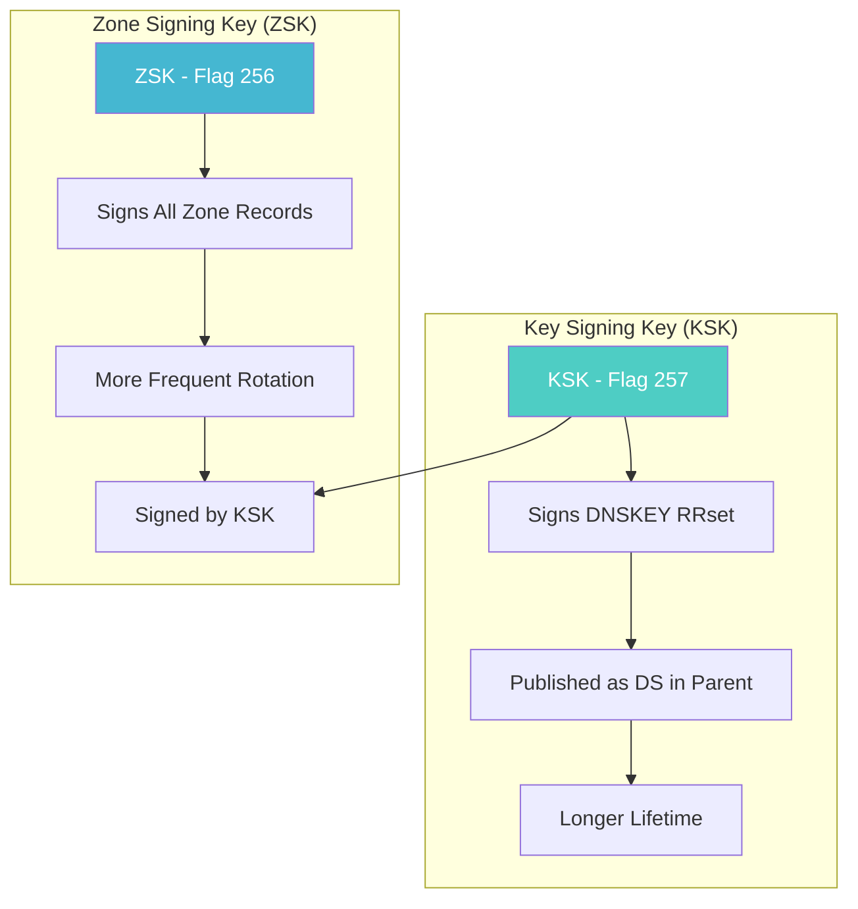
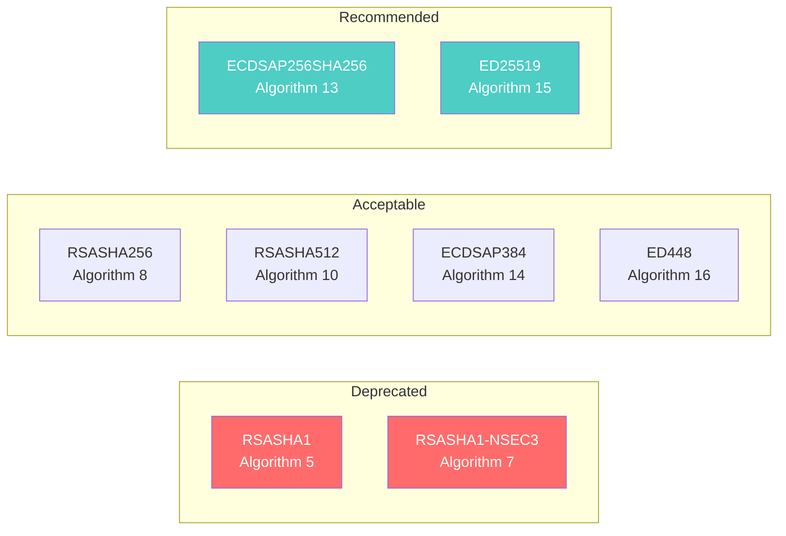
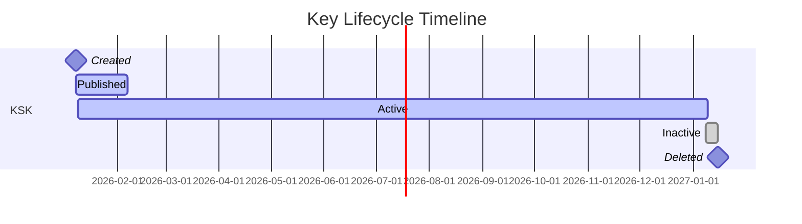
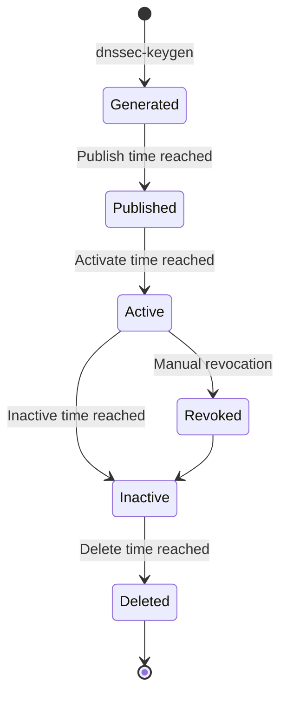

# How to Generate DNSSEC Keys (KSK and ZSK) with dnssec-keygen

Author: [nawazdhandala](https://www.github.com/nawazdhandala)

Tags: DNSSEC, DNS, Security, Cryptography, dnssec-keygen, KSK, ZSK, Key Management, BIND

Description: A comprehensive guide to generating DNSSEC keys using dnssec-keygen, covering key types, algorithms, key sizes, lifecycle management, and file formats.

---

## Introduction

DNSSEC relies on cryptographic keys to sign and validate DNS records. The `dnssec-keygen` utility, part of the BIND DNS software suite, is the standard tool for generating these keys. This guide covers everything you need to know about generating and managing DNSSEC keys.

## Prerequisites

Before starting, ensure you have BIND utilities installed:

```bash
# Debian/Ubuntu
sudo apt-get update
sudo apt-get install bind9-utils bind9-dnsutils

# RHEL/CentOS/Fedora
sudo dnf install bind-utils

# macOS (Homebrew)
brew install bind

# Verify installation
dnssec-keygen -h
```

## Understanding DNSSEC Key Types

DNSSEC uses a two-key system for security and operational flexibility:



### Key Signing Key (KSK)

- **Purpose**: Signs the DNSKEY RRset only
- **Flag Value**: 257
- **Lifetime**: Typically 1-2 years
- **Key Size**: Usually larger (2048-4096 bits for RSA)
- **Parent Interaction**: DS record derived from KSK

### Zone Signing Key (ZSK)

- **Purpose**: Signs all other zone records
- **Flag Value**: 256
- **Lifetime**: Typically 1-3 months
- **Key Size**: Can be smaller (1024-2048 bits for RSA)
- **Parent Interaction**: None (only internal to zone)

## Basic dnssec-keygen Usage

### Command Syntax

```bash
dnssec-keygen [options] name
```

### Essential Options

| Option | Description | Example |
|--------|-------------|---------|
| `-a` | Algorithm | `-a ECDSAP256SHA256` |
| `-b` | Key size (bits) | `-b 2048` |
| `-n` | Key type | `-n ZONE` |
| `-f` | Key flag | `-f KSK` |
| `-K` | Key directory | `-K /etc/bind/keys` |
| `-L` | Default TTL | `-L 3600` |

### Generate a KSK

```bash
# Generate KSK with ECDSA P-256
dnssec-keygen -a ECDSAP256SHA256 -f KSK -n ZONE example.com

# Output:
# Generating key pair.
# Kexample.com.+013+12345
```

### Generate a ZSK

```bash
# Generate ZSK with ECDSA P-256
dnssec-keygen -a ECDSAP256SHA256 -n ZONE example.com

# Output:
# Generating key pair.
# Kexample.com.+013+54321
```

## Algorithm Selection

### Supported Algorithms



### Algorithm Comparison

| Algorithm | Number | Key Size | Signature Size | Performance |
|-----------|--------|----------|----------------|-------------|
| RSASHA256 | 8 | 2048-4096 bits | 256-512 bytes | Slower |
| RSASHA512 | 10 | 2048-4096 bits | 256-512 bytes | Slower |
| ECDSAP256SHA256 | 13 | 256 bits | 64 bytes | Fast |
| ECDSAP384SHA384 | 14 | 384 bits | 96 bytes | Fast |
| ED25519 | 15 | 256 bits | 64 bytes | Fastest |
| ED448 | 16 | 456 bits | 114 bytes | Fast |

### Algorithm Examples

```bash
# RSA SHA-256 (Algorithm 8) - 2048 bit
dnssec-keygen -a RSASHA256 -b 2048 -f KSK -n ZONE example.com
dnssec-keygen -a RSASHA256 -b 1024 -n ZONE example.com

# ECDSA P-256 (Algorithm 13) - Recommended
dnssec-keygen -a ECDSAP256SHA256 -f KSK -n ZONE example.com
dnssec-keygen -a ECDSAP256SHA256 -n ZONE example.com

# ECDSA P-384 (Algorithm 14)
dnssec-keygen -a ECDSAP384SHA384 -f KSK -n ZONE example.com
dnssec-keygen -a ECDSAP384SHA384 -n ZONE example.com

# ED25519 (Algorithm 15) - Recommended
dnssec-keygen -a ED25519 -f KSK -n ZONE example.com
dnssec-keygen -a ED25519 -n ZONE example.com

# ED448 (Algorithm 16)
dnssec-keygen -a ED448 -f KSK -n ZONE example.com
dnssec-keygen -a ED448 -n ZONE example.com
```

## Key Size Recommendations

### RSA Keys

```bash
# KSK: Use 2048 or 4096 bits
dnssec-keygen -a RSASHA256 -b 2048 -f KSK -n ZONE example.com
dnssec-keygen -a RSASHA256 -b 4096 -f KSK -n ZONE example.com

# ZSK: Use 1024 or 2048 bits (1024 for performance)
dnssec-keygen -a RSASHA256 -b 1024 -n ZONE example.com
dnssec-keygen -a RSASHA256 -b 2048 -n ZONE example.com
```

### ECDSA and EdDSA Keys

ECDSA and EdDSA key sizes are fixed by the algorithm:

```bash
# ECDSAP256SHA256: 256-bit key (fixed)
dnssec-keygen -a ECDSAP256SHA256 -n ZONE example.com

# ECDSAP384SHA384: 384-bit key (fixed)
dnssec-keygen -a ECDSAP384SHA384 -n ZONE example.com

# ED25519: 256-bit key (fixed)
dnssec-keygen -a ED25519 -n ZONE example.com

# ED448: 456-bit key (fixed)
dnssec-keygen -a ED448 -n ZONE example.com
```

## Understanding Key File Formats

### Generated Files

For each key, dnssec-keygen creates two files:

```bash
# After generating a key, you get:
Kexample.com.+013+12345.key      # Public key (DNSKEY record)
Kexample.com.+013+12345.private  # Private key (for signing)
```

### File Naming Convention

```
K<zone>+<algorithm>+<key-tag>.<extension>

Where:
- K: Prefix indicating key file
- <zone>: Domain name (e.g., example.com)
- <algorithm>: Algorithm number (e.g., 013 for ECDSAP256SHA256)
- <key-tag>: 5-digit identifier for the key
- <extension>: .key (public) or .private (private)
```

### Public Key File (.key)

```bash
# View public key file
cat Kexample.com.+013+12345.key
```

```
; This is a key-signing key, keyid 12345, for example.com.
; Created: 20260108120000 (Thu Jan  8 12:00:00 2026)
; Publish: 20260108120000 (Thu Jan  8 12:00:00 2026)
; Activate: 20260108120000 (Thu Jan  8 12:00:00 2026)
example.com. IN DNSKEY 257 3 13 (
        mdsswUyr3DPW132mOi8V9xESWE8jTo0dxCjj
        dnopqLiRW0y9GJkvwLNbQCkZu4v5X+2s4M4+
        IgFkL0THBO4VU1nHSjnjxCs=
        ) ; KSK; alg = ECDSAP256SHA256 ; key id = 12345
```

### Private Key File (.private)

```bash
# View private key file (protect this!)
cat Kexample.com.+013+12345.private
```

```
Private-key-format: v1.3
Algorithm: 13 (ECDSAP256SHA256)
PrivateKey: [base64-encoded private key material]
Created: 20260108120000
Publish: 20260108120000
Activate: 20260108120000
```

## Key Timing Options

### Setting Key Timing Metadata

```bash
# Generate key with custom timing
dnssec-keygen -a ECDSAP256SHA256 -f KSK -n ZONE \
    -P 20260108120000 \    # Publish time
    -A 20260109120000 \    # Activate time
    -I 20270108120000 \    # Inactive time
    -D 20270115120000 \    # Delete time
    example.com
```

### Timing Options Explained



| Option | Flag | Description |
|--------|------|-------------|
| Created | `-C` | When the key was created |
| Publish | `-P` | When to publish the DNSKEY |
| Activate | `-A` | When to start signing with this key |
| Revoke | `-R` | When to set the REVOKE flag |
| Inactive | `-I` | When to stop signing with this key |
| Delete | `-D` | When to remove the DNSKEY |

### Modifying Key Timing

```bash
# Modify existing key timing with dnssec-settime
dnssec-settime -I 20270601120000 -D 20270615120000 \
    Kexample.com.+013+12345

# View key timing information
dnssec-settime -p all Kexample.com.+013+12345
```

## Complete Key Generation Script

### Production-Ready Script

```bash
#!/bin/bash

# DNSSEC Key Generation Script
# Usage: ./generate-keys.sh example.com

set -e

ZONE=$1
KEY_DIR="/etc/bind/keys/${ZONE}"
ALGORITHM="ECDSAP256SHA256"

# Timing settings (in YYYYMMDDHHMMSS format)
NOW=$(date +%Y%m%d%H%M%S)
PUBLISH_DATE=$NOW
ACTIVATE_DATE=$(date -d "+1 day" +%Y%m%d%H%M%S)

# KSK lifecycle (1 year active)
KSK_INACTIVE=$(date -d "+1 year" +%Y%m%d%H%M%S)
KSK_DELETE=$(date -d "+1 year +7 days" +%Y%m%d%H%M%S)

# ZSK lifecycle (3 months active)
ZSK_INACTIVE=$(date -d "+3 months" +%Y%m%d%H%M%S)
ZSK_DELETE=$(date -d "+3 months +7 days" +%Y%m%d%H%M%S)

# Validate input
if [ -z "$ZONE" ]; then
    echo "Usage: $0 <zone>"
    exit 1
fi

# Create key directory
mkdir -p "$KEY_DIR"
chmod 750 "$KEY_DIR"

echo "Generating DNSSEC keys for ${ZONE}..."
echo "Algorithm: ${ALGORITHM}"
echo "Key directory: ${KEY_DIR}"

# Generate KSK
echo -e "\n--- Generating Key Signing Key (KSK) ---"
KSK=$(dnssec-keygen -a $ALGORITHM -f KSK -n ZONE \
    -K "$KEY_DIR" \
    -P $PUBLISH_DATE \
    -A $ACTIVATE_DATE \
    -I $KSK_INACTIVE \
    -D $KSK_DELETE \
    $ZONE)

echo "KSK generated: $KSK"

# Generate ZSK
echo -e "\n--- Generating Zone Signing Key (ZSK) ---"
ZSK=$(dnssec-keygen -a $ALGORITHM -n ZONE \
    -K "$KEY_DIR" \
    -P $PUBLISH_DATE \
    -A $ACTIVATE_DATE \
    -I $ZSK_INACTIVE \
    -D $ZSK_DELETE \
    $ZONE)

echo "ZSK generated: $ZSK"

# Set proper permissions
chmod 640 "${KEY_DIR}"/*.key
chmod 600 "${KEY_DIR}"/*.private

# Display summary
echo -e "\n=== Key Generation Summary ==="
echo "Zone: $ZONE"
echo "KSK: $KSK"
echo "ZSK: $ZSK"
echo ""
echo "Key files location: $KEY_DIR"
echo ""

# Display DS record for parent zone
echo "=== DS Record for Parent Zone ==="
dnssec-dsfromkey -2 "${KEY_DIR}/${KSK}.key"

echo -e "\n=== Key Timing Information ==="
echo "KSK:"
dnssec-settime -p all "${KEY_DIR}/${KSK}" | grep -E "(Publish|Activate|Inactive|Delete)"

echo -e "\nZSK:"
dnssec-settime -p all "${KEY_DIR}/${ZSK}" | grep -E "(Publish|Activate|Inactive|Delete)"
```

### Using the Script

```bash
# Make executable
chmod +x generate-keys.sh

# Generate keys
./generate-keys.sh example.com

# Output:
# Generating DNSSEC keys for example.com...
# Algorithm: ECDSAP256SHA256
# Key directory: /etc/bind/keys/example.com
#
# --- Generating Key Signing Key (KSK) ---
# KSK generated: Kexample.com.+013+12345
#
# --- Generating Zone Signing Key (ZSK) ---
# ZSK generated: Kexample.com.+013+54321
#
# === DS Record for Parent Zone ===
# example.com. IN DS 12345 13 2 49FD46E6C4B45C55...
```

## Generating DS Records

### Using dnssec-dsfromkey

```bash
# Generate DS record with SHA-256 (recommended)
dnssec-dsfromkey -2 Kexample.com.+013+12345.key

# Generate DS record with SHA-384
dnssec-dsfromkey -4 Kexample.com.+013+12345.key

# Generate multiple digest types
dnssec-dsfromkey -a SHA-256 -a SHA-384 Kexample.com.+013+12345.key
```

### DS Record Output

```
# SHA-256 DS record
example.com. IN DS 12345 13 2 (
    49FD46E6C4B45C55D4AC69CBD3CD34AC1AFE51DE
    7AB62E87E24F0A6D4A5F5B97E8FE7F3D )

# SHA-384 DS record
example.com. IN DS 12345 13 4 (
    72A3B8C9D0E1F2A3B4C5D6E7F8A9B0C1D2E3F4A5
    B6C7D8E9F0A1B2C3D4E5F6A7B8C9D0E1F2A3B4C5
    D6E7F8A9B0C1D2E3F4 )
```

## Key Storage and Security

### Directory Structure

```bash
# Recommended directory structure
/etc/bind/keys/
├── example.com/
│   ├── Kexample.com.+013+12345.key
│   ├── Kexample.com.+013+12345.private
│   ├── Kexample.com.+013+54321.key
│   └── Kexample.com.+013+54321.private
└── example.org/
    ├── Kexample.org.+013+11111.key
    ├── Kexample.org.+013+11111.private
    ├── Kexample.org.+013+22222.key
    └── Kexample.org.+013+22222.private
```

### Permission Settings

```bash
# Set secure permissions
chmod 750 /etc/bind/keys/
chmod 750 /etc/bind/keys/example.com/
chmod 640 /etc/bind/keys/example.com/*.key
chmod 600 /etc/bind/keys/example.com/*.private

# Set ownership (bind user)
chown -R bind:bind /etc/bind/keys/
```

### Key Backup

```bash
#!/bin/bash
# Backup DNSSEC keys

BACKUP_DIR="/backup/dnssec/$(date +%Y%m%d)"
KEY_DIR="/etc/bind/keys"

mkdir -p "$BACKUP_DIR"

# Create encrypted backup
tar -czf - "$KEY_DIR" | \
    gpg --symmetric --cipher-algo AES256 \
    -o "${BACKUP_DIR}/dnssec-keys.tar.gz.gpg"

# Verify backup
gpg -d "${BACKUP_DIR}/dnssec-keys.tar.gz.gpg" | tar -tzf -

echo "Backup created: ${BACKUP_DIR}/dnssec-keys.tar.gz.gpg"
```

## Key Lifecycle Management

### Key States



### Key Rollover Preparation

```bash
# Generate new ZSK for rollover
NEW_ZSK=$(dnssec-keygen -a ECDSAP256SHA256 -n ZONE \
    -K /etc/bind/keys/example.com \
    -P +0 \          # Publish immediately
    -A +1w \         # Activate in 1 week
    -I +3mo1w \      # Inactive in 3 months + 1 week
    -D +3mo2w \      # Delete in 3 months + 2 weeks
    example.com)

echo "New ZSK: $NEW_ZSK"
```

### Viewing Key Status

```bash
# List all keys for a zone
ls -la /etc/bind/keys/example.com/

# Check key timing
for key in /etc/bind/keys/example.com/K*.key; do
    echo "=== $(basename $key) ==="
    dnssec-settime -p all "${key%.key}"
    echo ""
done
```

### Key Status Script

```bash
#!/bin/bash
# Check DNSSEC key status

KEY_DIR="/etc/bind/keys"
NOW=$(date +%Y%m%d%H%M%S)

echo "DNSSEC Key Status Report"
echo "========================"
echo "Current time: $(date)"
echo ""

for zone_dir in "$KEY_DIR"/*/; do
    zone=$(basename "$zone_dir")
    echo "Zone: $zone"
    echo "---"

    for key_file in "${zone_dir}"K*.key; do
        [ -f "$key_file" ] || continue

        key_base="${key_file%.key}"
        key_name=$(basename "$key_base")

        # Get key type
        if grep -q "257" "$key_file"; then
            key_type="KSK"
        else
            key_type="ZSK"
        fi

        # Get timing info
        activate=$(dnssec-settime -p activate "$key_base" 2>/dev/null | awk '{print $2}')
        inactive=$(dnssec-settime -p inactive "$key_base" 2>/dev/null | awk '{print $2}')

        # Determine status
        if [ "$NOW" -lt "$activate" ]; then
            status="PENDING"
        elif [ -z "$inactive" ] || [ "$NOW" -lt "$inactive" ]; then
            status="ACTIVE"
        else
            status="INACTIVE"
        fi

        echo "  $key_type: $key_name - $status"
    done
    echo ""
done
```

## Advanced Options

### Random Number Source

```bash
# Specify random source (for high-security environments)
dnssec-keygen -a ECDSAP256SHA256 -f KSK -n ZONE \
    -r /dev/random \
    example.com
```

### Key Tag Specification

```bash
# Ensure specific key tag (for predictable deployments)
# Note: This may require multiple attempts
dnssec-keygen -a ECDSAP256SHA256 -n ZONE \
    example.com

# Check the generated key tag
grep "key id" Kexample.com.+013+*.key
```

### Generating Keys for Split DNS

```bash
# Internal zone keys
dnssec-keygen -a ECDSAP256SHA256 -f KSK -n ZONE \
    -K /etc/bind/keys/internal/ \
    internal.example.com

# External zone keys
dnssec-keygen -a ECDSAP256SHA256 -f KSK -n ZONE \
    -K /etc/bind/keys/external/ \
    example.com
```

## Troubleshooting

### Common Issues

#### Issue: "algorithm is unsupported"

```bash
# Check supported algorithms
dnssec-keygen -h 2>&1 | grep -A20 "algorithm:"

# Use a supported algorithm
dnssec-keygen -a RSASHA256 -b 2048 -f KSK -n ZONE example.com
```

#### Issue: Permission Denied

```bash
# Ensure proper permissions
sudo mkdir -p /etc/bind/keys
sudo chown $(whoami):bind /etc/bind/keys
sudo chmod 750 /etc/bind/keys

# Or run as bind user
sudo -u bind dnssec-keygen -a ECDSAP256SHA256 -n ZONE example.com
```

#### Issue: Key Tag Collision

```bash
# If you need a specific key tag, regenerate
# Key tags are derived from the public key
dnssec-keygen -a ECDSAP256SHA256 -n ZONE example.com
# Repeat until desired key tag is generated
```

### Verification Commands

```bash
# Verify key file format
named-checkconf -z
named-checkzone example.com /etc/bind/zones/example.com.zone

# Verify key can be used for signing
dnssec-signzone -S -K /etc/bind/keys/example.com \
    -o example.com \
    /etc/bind/zones/example.com.zone
```

## Summary

### Quick Reference

| Task | Command |
|------|---------|
| Generate KSK | `dnssec-keygen -a ECDSAP256SHA256 -f KSK -n ZONE example.com` |
| Generate ZSK | `dnssec-keygen -a ECDSAP256SHA256 -n ZONE example.com` |
| Generate DS | `dnssec-dsfromkey -2 Kexample.com.+013+12345.key` |
| View timing | `dnssec-settime -p all Kexample.com.+013+12345` |
| Modify timing | `dnssec-settime -I 20270101 Kexample.com.+013+12345` |

### Best Practices

1. **Use ECDSA or EdDSA** algorithms for new deployments
2. **Store private keys securely** with restricted permissions
3. **Plan key lifecycles** before generation
4. **Back up keys** with encryption
5. **Document key tags** and timing information
6. **Automate key generation** for consistency
7. **Monitor key expiration** proactively

## Next Steps

After generating your DNSSEC keys:

1. **Sign your DNS zone** using dnssec-signzone or BIND inline signing
2. **Submit DS records** to your parent zone
3. **Set up key rollover automation**
4. **Monitor DNSSEC health** with validation tools

## Additional Resources

- BIND 9 Administrator Reference Manual
- RFC 4034 - Resource Records for DNSSEC
- RFC 6781 - DNSSEC Operational Practices
- RFC 8624 - Algorithm Implementation Requirements
