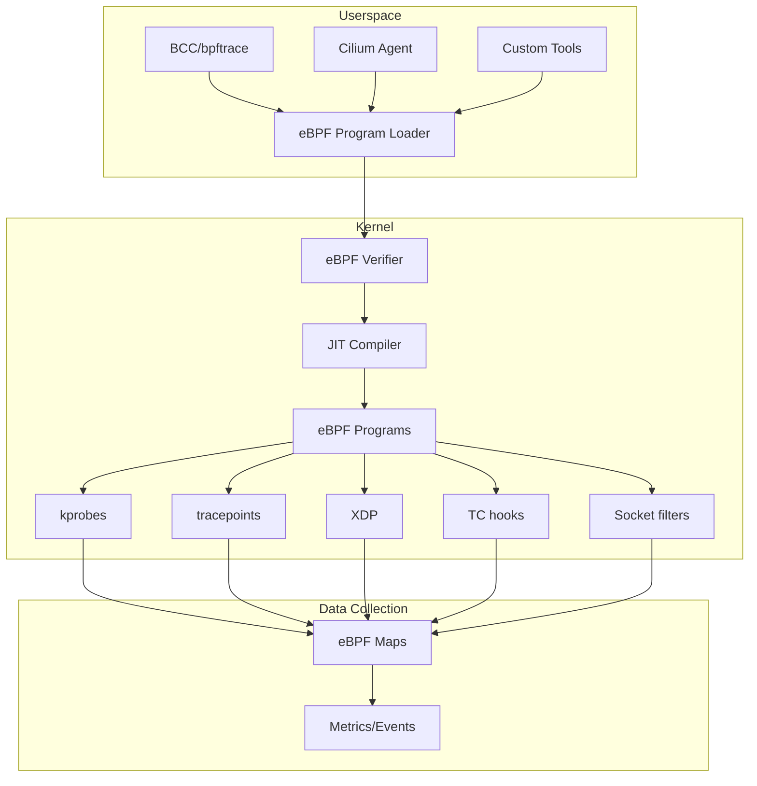
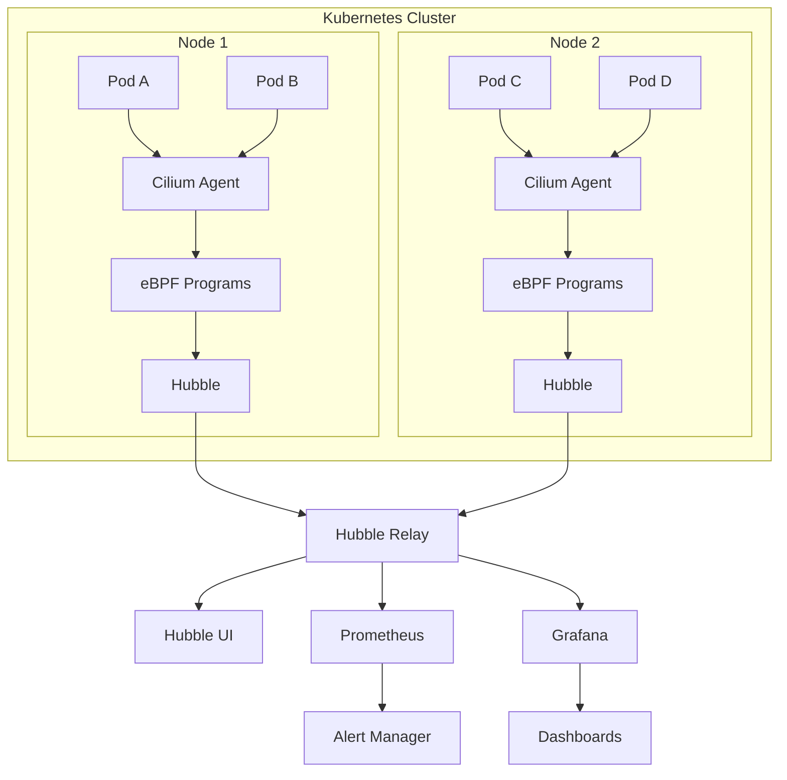
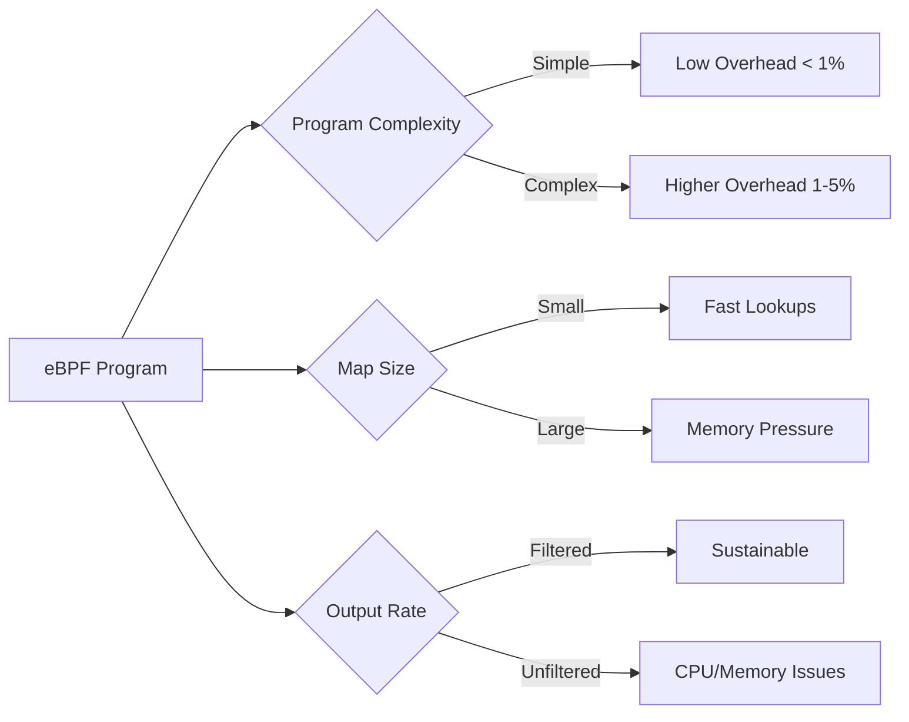

# How to Monitor Network Traffic with eBPF on Kubernetes

Author: [nawazdhandala](https://www.github.com/nawazdhandala)

Tags: eBPF, Kubernetes, Cilium, network monitoring, BCC, observability, performance analysis, Linux kernel, cloud-native

Description: Learn how to leverage eBPF technology for deep network observability and monitoring in Kubernetes clusters using Cilium, BCC tools, and custom probes.

---

## Introduction

eBPF (extended Berkeley Packet Filter) has revolutionized Linux system observability by allowing safe execution of custom programs within the kernel. For Kubernetes network monitoring, eBPF provides unprecedented visibility into network flows, packet processing, and connection behavior without the overhead of traditional monitoring approaches. This guide covers practical eBPF-based monitoring techniques using Cilium, BCC tools, and purpose-built observability solutions.

## Understanding eBPF for Network Monitoring

### What is eBPF?

eBPF allows you to run sandboxed programs in the Linux kernel without changing kernel source code or loading kernel modules. For networking, this means:

- **Zero-copy packet inspection** - Analyze packets without copying to userspace
- **Dynamic tracing** - Attach probes to kernel functions at runtime
- **Low overhead** - Kernel-level execution with minimal performance impact
- **Safety** - Verified programs that can't crash the kernel



### eBPF Hook Points for Networking

| Hook Type | Location | Use Case |
|-----------|----------|----------|
| XDP | NIC driver | High-performance packet processing |
| TC (Traffic Control) | Network stack | Packet filtering and modification |
| Socket | Socket operations | Connection tracking |
| kprobes | Kernel functions | Deep system tracing |
| tracepoints | Predefined trace points | Stable kernel event tracing |

## Setting Up Cilium for Network Observability

Cilium is the most popular eBPF-based CNI for Kubernetes, providing built-in network observability.

### Installing Cilium

```bash
# Install Cilium CLI
CILIUM_CLI_VERSION=$(curl -s https://raw.githubusercontent.com/cilium/cilium-cli/main/stable.txt)
CLI_ARCH=amd64
curl -L --fail --remote-name-all https://github.com/cilium/cilium-cli/releases/download/${CILIUM_CLI_VERSION}/cilium-linux-${CLI_ARCH}.tar.gz
sudo tar xzvfC cilium-linux-${CLI_ARCH}.tar.gz /usr/local/bin
rm cilium-linux-${CLI_ARCH}.tar.gz

# Install Cilium with Hubble observability enabled
cilium install --version 1.14.5 \
  --set hubble.relay.enabled=true \
  --set hubble.ui.enabled=true \
  --set hubble.metrics.enabled="{dns,drop,tcp,flow,icmp,http}"

# Verify installation
cilium status --wait
```

### Enabling Hubble for Flow Visibility

```bash
# Enable Hubble
cilium hubble enable --ui

# Port-forward Hubble UI
cilium hubble ui &

# Install Hubble CLI
HUBBLE_VERSION=$(curl -s https://raw.githubusercontent.com/cilium/hubble/master/stable.txt)
curl -L --fail --remote-name-all https://github.com/cilium/hubble/releases/download/$HUBBLE_VERSION/hubble-linux-${CLI_ARCH}.tar.gz
sudo tar xzvfC hubble-linux-${CLI_ARCH}.tar.gz /usr/local/bin
rm hubble-linux-${CLI_ARCH}.tar.gz

# Port-forward Hubble Relay
cilium hubble port-forward &

# Verify Hubble status
hubble status
```

### Observing Network Flows with Hubble

```bash
# Watch all flows in real-time
hubble observe --follow

# Filter flows by namespace
hubble observe --namespace production

# Filter flows by pod
hubble observe --pod default/nginx-pod

# Filter by verdict (dropped packets)
hubble observe --verdict DROPPED

# Filter by protocol
hubble observe --protocol tcp

# Filter by destination port
hubble observe --to-port 443

# Filter HTTP flows
hubble observe --http-status 500

# Export flows as JSON for analysis
hubble observe --output json > flows.json

# Combine filters for specific debugging
hubble observe \
  --namespace production \
  --verdict DROPPED \
  --protocol tcp \
  --to-port 8080 \
  --follow
```

### Hubble Metrics Configuration

```yaml
# cilium-config.yaml
apiVersion: v1
kind: ConfigMap
metadata:
  name: cilium-config
  namespace: kube-system
data:
  enable-hubble: "true"
  hubble-listen-address: ":4244"
  hubble-metrics-server: ":9965"
  hubble-metrics:
    - dns:query;ignoreAAAA
    - drop:sourceContext=identity;destinationContext=identity
    - tcp:sourceContext=identity;destinationContext=identity
    - flow:sourceContext=identity;destinationContext=identity
    - icmp:sourceContext=identity;destinationContext=identity
    - http:sourceContext=identity;destinationContext=identity
```

### Prometheus Integration

```yaml
# hubble-servicemonitor.yaml
apiVersion: monitoring.coreos.com/v1
kind: ServiceMonitor
metadata:
  name: hubble
  namespace: kube-system
  labels:
    app: hubble
spec:
  selector:
    matchLabels:
      k8s-app: hubble
  namespaceSelector:
    matchNames:
    - kube-system
  endpoints:
  - port: hubble-metrics
    interval: 30s
    path: /metrics
```

## Using BCC Tools for Deep Analysis

BCC (BPF Compiler Collection) provides powerful tools for system-wide network analysis.

### Installing BCC Tools

```bash
# Ubuntu/Debian
sudo apt-get install bpfcc-tools linux-headers-$(uname -r)

# RHEL/CentOS
sudo dnf install bcc-tools kernel-devel-$(uname -r)

# Verify installation
sudo tcplife-bpfcc --help
```

### Running BCC Tools in Kubernetes

```yaml
# bcc-debug-pod.yaml
apiVersion: v1
kind: Pod
metadata:
  name: bcc-debug
  namespace: kube-system
spec:
  hostNetwork: true
  hostPID: true
  containers:
  - name: bcc
    image: quay.io/iovisor/bcc:latest
    securityContext:
      privileged: true
    volumeMounts:
    - name: lib-modules
      mountPath: /lib/modules
      readOnly: true
    - name: kernel-src
      mountPath: /usr/src
      readOnly: true
    - name: kernel-debug
      mountPath: /sys/kernel/debug
    command: ["sleep", "infinity"]
  volumes:
  - name: lib-modules
    hostPath:
      path: /lib/modules
  - name: kernel-src
    hostPath:
      path: /usr/src
  - name: kernel-debug
    hostPath:
      path: /sys/kernel/debug
  nodeSelector:
    kubernetes.io/hostname: target-node
```

### Essential BCC Network Tools

#### tcplife - TCP Connection Lifespan

```bash
# Track TCP connection lifespans
sudo tcplife-bpfcc

# Output example:
# PID    COMM         LADDR           LPORT  RADDR           RPORT TX_KB  RX_KB  MS
# 12345  nginx        10.0.0.5        80     10.0.0.10       43256 1024   512    150

# Filter by port
sudo tcplife-bpfcc -L 8080

# Filter by remote address
sudo tcplife-bpfcc -r 10.0.0.0/24
```

#### tcpconnect - New Connection Tracing

```bash
# Trace new TCP connections
sudo tcpconnect-bpfcc

# With timestamps
sudo tcpconnect-bpfcc -t

# Include DNS names
sudo tcpconnect-bpfcc -d

# Filter by UID
sudo tcpconnect-bpfcc -U 1000
```

#### tcpretrans - Retransmission Monitoring

```bash
# Monitor TCP retransmissions (indicates network issues)
sudo tcpretrans-bpfcc

# Include TLP (Tail Loss Probe) events
sudo tcpretrans-bpfcc -l

# Count retransmissions
sudo tcpretrans-bpfcc -c
```

#### tcpdrop - Dropped Packet Analysis

```bash
# Trace TCP packet drops with stack traces
sudo tcpdrop-bpfcc

# Output shows why kernel dropped packets:
# TIME     PID    IP SADDR:SPORT       > DADDR:DPORT     STATE     (FLAGS)
# 12:00:01 0      4  10.0.0.5:80       > 10.0.0.10:43256 ESTABLISHED (ACK)
#         tcp_drop+0x1
#         tcp_rcv_established+0x3a2
#         ...
```

#### tcpstates - Connection State Changes

```bash
# Monitor TCP state transitions
sudo tcpstates-bpfcc

# Output:
# SKADDR           C-PID C-COMM     LADDR     LPORT RADDR     RPORT OLDSTATE    -> NEWSTATE    MS
# ffff9a8b7c3d0000 12345 nginx      10.0.0.5  80    10.0.0.10 43256 ESTABLISHED -> FIN_WAIT1   0.00
```

#### netqtop - Network Queue Analysis

```bash
# Monitor network queue latency
sudo netqtop-bpfcc

# Filter by interface
sudo netqtop-bpfcc -i eth0
```

### Custom BCC Script for Kubernetes Network Analysis

```python
#!/usr/bin/env python3
# k8s-netflow.py - eBPF script for Kubernetes network flow analysis

from bcc import BPF
from socket import inet_ntop, AF_INET, AF_INET6
import struct

# eBPF program
bpf_program = """
#include <uapi/linux/ptrace.h>
#include <net/sock.h>
#include <bcc/proto.h>
#include <linux/tcp.h>

struct flow_key {
    u32 saddr;
    u32 daddr;
    u16 sport;
    u16 dport;
};

struct flow_data {
    u64 bytes_sent;
    u64 bytes_recv;
    u64 packets;
    u64 start_ts;
    u64 last_ts;
};

BPF_HASH(flows, struct flow_key, struct flow_data);

int trace_tcp_sendmsg(struct pt_regs *ctx, struct sock *sk, struct msghdr *msg, size_t size) {
    u16 family = sk->__sk_common.skc_family;
    if (family != AF_INET)
        return 0;

    struct flow_key key = {};
    key.saddr = sk->__sk_common.skc_rcv_saddr;
    key.daddr = sk->__sk_common.skc_daddr;
    key.sport = sk->__sk_common.skc_num;
    key.dport = sk->__sk_common.skc_dport;

    struct flow_data *data = flows.lookup(&key);
    if (data) {
        data->bytes_sent += size;
        data->packets += 1;
        data->last_ts = bpf_ktime_get_ns();
    } else {
        struct flow_data new_data = {};
        new_data.bytes_sent = size;
        new_data.packets = 1;
        new_data.start_ts = bpf_ktime_get_ns();
        new_data.last_ts = new_data.start_ts;
        flows.update(&key, &new_data);
    }

    return 0;
}
"""

def main():
    b = BPF(text=bpf_program)
    b.attach_kprobe(event="tcp_sendmsg", fn_name="trace_tcp_sendmsg")

    print("Tracing TCP flows... Ctrl+C to stop")
    print("%-20s %-20s %-10s %-10s %-10s" %
          ("SOURCE", "DEST", "BYTES_TX", "PACKETS", "DURATION"))

    try:
        while True:
            import time
            time.sleep(5)

            flows = b["flows"]
            for k, v in flows.items():
                saddr = inet_ntop(AF_INET, struct.pack("I", k.saddr))
                daddr = inet_ntop(AF_INET, struct.pack("I", k.daddr))
                duration = (v.last_ts - v.start_ts) / 1e9

                print("%-20s %-20s %-10d %-10d %-10.2f" %
                      (f"{saddr}:{k.sport}", f"{daddr}:{k.dport}",
                       v.bytes_sent, v.packets, duration))

            flows.clear()
            print("-" * 80)

    except KeyboardInterrupt:
        pass

if __name__ == "__main__":
    main()
```

## Network Flow Monitoring Architecture



## Performance Analysis with eBPF

### Latency Histograms

```bash
# TCP round-trip time histogram
sudo tcprtt-bpfcc

# Network latency by stack level
sudo funclatency-bpfcc ip_rcv
sudo funclatency-bpfcc tcp_v4_rcv
```

### Creating Custom Latency Probes

```python
#!/usr/bin/env python3
# tcp-latency-histogram.py

from bcc import BPF
import time

bpf_program = """
#include <uapi/linux/ptrace.h>
#include <net/sock.h>
#include <linux/tcp.h>

BPF_HISTOGRAM(tcp_rtt, int);

int trace_tcp_rcv(struct pt_regs *ctx, struct sock *sk) {
    struct tcp_sock *tp = (struct tcp_sock *)sk;
    u32 srtt = tp->srtt_us >> 3;  // Smoothed RTT in microseconds

    // Convert to milliseconds and store in histogram
    int ms = srtt / 1000;
    if (ms > 0 && ms < 1000) {
        tcp_rtt.increment(bpf_log2l(ms));
    }

    return 0;
}
"""

b = BPF(text=bpf_program)
b.attach_kprobe(event="tcp_rcv_established", fn_name="trace_tcp_rcv")

print("Collecting TCP RTT data... Press Ctrl+C to show histogram")

try:
    while True:
        time.sleep(1)
except KeyboardInterrupt:
    print("\nTCP RTT Histogram (ms):")
    b["tcp_rtt"].print_log2_hist("ms")
```

### Monitoring Packet Drops

```yaml
# Grafana dashboard query for Hubble drop metrics
# Panel: Dropped Packets by Reason

# PromQL queries:
# Total drops
sum(rate(hubble_drop_total[5m])) by (reason)

# Drops by source namespace
sum(rate(hubble_drop_total[5m])) by (source_namespace, reason)

# Drops by destination service
sum(rate(hubble_drop_total[5m])) by (destination_service, reason)
```

## Advanced Hubble Observability

### Layer 7 HTTP Observability

```bash
# Enable L7 visibility for a namespace
kubectl annotate namespace production \
  policy.cilium.io/proxy-visibility="<Ingress/80/TCP/HTTP>"

# Watch HTTP flows
hubble observe --namespace production --http-status "5[0-9][0-9]"

# Monitor HTTP latency
hubble observe --namespace production --protocol http --output json | \
  jq '.flow.l7.http | {method: .method, url: .url, latency: .latency_ns}'
```

### DNS Monitoring

```bash
# Monitor DNS queries
hubble observe --protocol dns

# Find DNS resolution failures
hubble observe --protocol dns --verdict DROPPED

# DNS query latency analysis
hubble observe --protocol dns --output json | \
  jq '.flow.l7.dns | {query: .query, rcode: .rcode}'
```

### Network Policy Audit Mode

```yaml
# Enable policy audit mode for debugging
apiVersion: cilium.io/v2
kind: CiliumNetworkPolicy
metadata:
  name: audit-policy
spec:
  endpointSelector:
    matchLabels:
      app: web
  ingress:
  - fromEndpoints:
    - matchLabels:
        app: frontend
    toPorts:
    - ports:
      - port: "80"
        protocol: TCP
  # Audit mode - log but don't enforce
  enableDefaultDeny:
    ingress: false
```

```bash
# Watch policy decisions
hubble observe --verdict AUDIT
```

## Integrating with Observability Stack

### Grafana Dashboard for Network Flows

```json
{
  "dashboard": {
    "title": "Kubernetes Network Flows - eBPF",
    "panels": [
      {
        "title": "Network Throughput by Namespace",
        "type": "timeseries",
        "targets": [
          {
            "expr": "sum(rate(hubble_flows_processed_total[5m])) by (source_namespace)",
            "legendFormat": "{{source_namespace}}"
          }
        ]
      },
      {
        "title": "Dropped Packets",
        "type": "stat",
        "targets": [
          {
            "expr": "sum(rate(hubble_drop_total[5m]))",
            "legendFormat": "Drops/sec"
          }
        ]
      },
      {
        "title": "TCP Connection States",
        "type": "piechart",
        "targets": [
          {
            "expr": "sum(hubble_tcp_flags_total) by (flag)",
            "legendFormat": "{{flag}}"
          }
        ]
      },
      {
        "title": "HTTP Error Rate",
        "type": "gauge",
        "targets": [
          {
            "expr": "sum(rate(hubble_http_requests_total{status=~\"5..\"}[5m])) / sum(rate(hubble_http_requests_total[5m])) * 100",
            "legendFormat": "Error %"
          }
        ]
      }
    ]
  }
}
```

### Alert Rules

```yaml
# prometheus-rules.yaml
apiVersion: monitoring.coreos.com/v1
kind: PrometheusRule
metadata:
  name: network-ebpf-alerts
  namespace: monitoring
spec:
  groups:
  - name: network-ebpf
    rules:
    - alert: HighPacketDropRate
      expr: sum(rate(hubble_drop_total[5m])) > 100
      for: 5m
      labels:
        severity: warning
      annotations:
        summary: "High packet drop rate detected"
        description: "Packet drop rate is {{ $value }} drops/sec"

    - alert: TCPRetransmissionSpike
      expr: sum(rate(hubble_tcp_flags_total{flag="RST"}[5m])) > 50
      for: 5m
      labels:
        severity: warning
      annotations:
        summary: "TCP retransmission spike detected"

    - alert: DNSResolutionFailures
      expr: sum(rate(hubble_dns_queries_total{rcode!="NoError"}[5m])) > 10
      for: 5m
      labels:
        severity: warning
      annotations:
        summary: "DNS resolution failures detected"
```

## Troubleshooting eBPF Monitoring

### Common Issues

#### 1. Kernel Version Compatibility

```bash
# Check kernel version (eBPF requires 4.8+, Cilium requires 4.19+)
uname -r

# Verify BPF support
ls /sys/fs/bpf/

# Check kernel config for BPF
grep BPF /boot/config-$(uname -r)
```

#### 2. Permissions Issues

```bash
# Check if running with sufficient privileges
capsh --print | grep bpf

# Required capabilities for BPF
# CAP_SYS_ADMIN or CAP_BPF (kernel 5.8+)
# CAP_PERFMON for performance monitoring
# CAP_NET_ADMIN for network programs
```

#### 3. Cilium/Hubble Not Collecting Data

```bash
# Check Cilium status
cilium status

# Verify Hubble is enabled
kubectl -n kube-system get cm cilium-config -o yaml | grep hubble

# Check Cilium agent logs
kubectl -n kube-system logs -l k8s-app=cilium -c cilium-agent

# Verify Hubble relay
kubectl -n kube-system logs -l k8s-app=hubble-relay
```

### Performance Considerations



**Best Practices:**
1. Filter at the eBPF level, not in userspace
2. Use per-CPU maps for high-throughput scenarios
3. Batch event processing when possible
4. Set appropriate ring buffer sizes

## Conclusion

eBPF-based network monitoring provides unparalleled visibility into Kubernetes network traffic with minimal overhead. Key takeaways:

1. **Cilium + Hubble** provides production-ready eBPF networking and observability out of the box
2. **BCC tools** offer deep system-level analysis for troubleshooting specific issues
3. **Custom eBPF programs** can be written for specialized monitoring needs
4. **Integration with Prometheus/Grafana** enables comprehensive dashboards and alerting
5. **Layer 7 visibility** through eBPF proxy enables HTTP, DNS, and gRPC monitoring

By leveraging eBPF for network monitoring, you gain kernel-level insights that were previously impossible or extremely expensive to obtain, enabling faster troubleshooting and more efficient operations.

## Additional Resources

- [Cilium Documentation](https://docs.cilium.io/)
- [BCC Tools Reference](https://github.com/iovisor/bcc)
- [eBPF.io - Official eBPF Documentation](https://ebpf.io/)
- [Hubble Documentation](https://docs.cilium.io/en/stable/gettingstarted/hubble/)
- [Linux Kernel BPF Documentation](https://www.kernel.org/doc/html/latest/bpf/)
