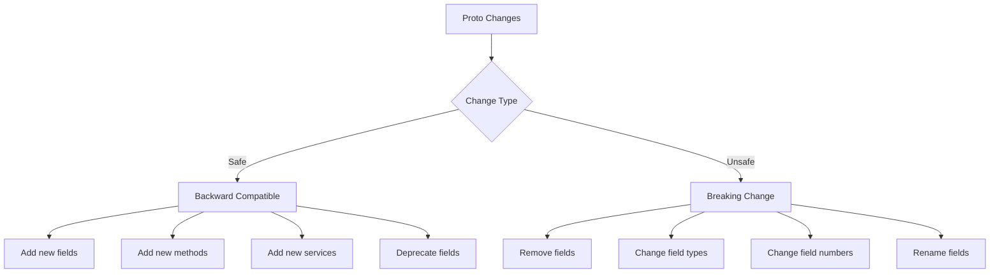
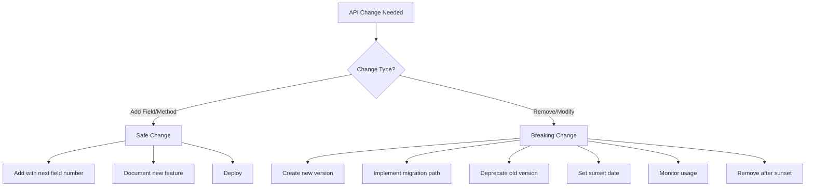

# How to Version gRPC APIs Without Breaking Clients

Author: [nawazdhandala](https://www.github.com/nawazdhandala)

Tags: gRPC, API versioning, protocol buffers, backward compatibility, deprecation, microservices, API design

Description: Master gRPC API versioning strategies including field numbering rules, backward compatibility patterns, additive changes, and proper deprecation workflows.

---

API versioning is crucial for maintaining service reliability while evolving your APIs. gRPC and Protocol Buffers provide built-in mechanisms for backward compatibility, but understanding how to use them correctly is essential. This guide covers comprehensive versioning strategies to evolve your gRPC APIs without breaking existing clients.

## Understanding Protocol Buffer Compatibility



## Field Numbering Rules

Field numbers are critical in Protocol Buffers. They are used to identify fields in the binary format.

### Reserved Numbers and Names

```protobuf
// user.proto
syntax = "proto3";

package api.v1;

message User {
    // Active fields
    string id = 1;
    string email = 2;
    string name = 3;
    string phone = 5;
    UserStatus status = 6;

    // Reserve removed field numbers to prevent reuse
    reserved 4;                    // Was: string password (moved to separate auth service)
    reserved 10 to 15;            // Reserved for future use
    reserved 100 to max;          // Reserved for extensions

    // Reserve removed field names to prevent confusion
    reserved "password", "pwd";
}

enum UserStatus {
    USER_STATUS_UNSPECIFIED = 0;
    USER_STATUS_ACTIVE = 1;
    USER_STATUS_INACTIVE = 2;
    USER_STATUS_SUSPENDED = 3;

    // Reserve removed enum values
    reserved 4, 5;
    reserved "USER_STATUS_DELETED";
}
```

### Field Number Best Practices

```protobuf
// Organize field numbers by category
message Order {
    // Core identifiers: 1-10
    string id = 1;
    string customer_id = 2;
    string merchant_id = 3;

    // Order details: 11-30
    repeated OrderItem items = 11;
    Money subtotal = 12;
    Money tax = 13;
    Money total = 14;
    string currency = 15;

    // Shipping: 31-50
    Address shipping_address = 31;
    string shipping_method = 32;
    Money shipping_cost = 33;

    // Payment: 51-70
    PaymentInfo payment = 51;
    string payment_method = 52;

    // Status and timestamps: 71-90
    OrderStatus status = 71;
    google.protobuf.Timestamp created_at = 72;
    google.protobuf.Timestamp updated_at = 73;

    // Metadata: 91-100
    map<string, string> metadata = 91;

    // Reserved for future categories
    reserved 101 to 200;
}
```

## Package-Based Versioning

The most common approach is to version your API using package names.

### Directory Structure

```
proto/
├── api/
│   ├── v1/
│   │   ├── user.proto
│   │   ├── order.proto
│   │   └── service.proto
│   ├── v2/
│   │   ├── user.proto
│   │   ├── order.proto
│   │   └── service.proto
│   └── common/
│       ├── money.proto
│       ├── address.proto
│       └── pagination.proto
```

### Version 1 API

```protobuf
// api/v1/user.proto
syntax = "proto3";

package api.v1;

option go_package = "github.com/example/api/v1";
option java_package = "com.example.api.v1";

import "api/common/address.proto";

service UserService {
    rpc GetUser(GetUserRequest) returns (User);
    rpc CreateUser(CreateUserRequest) returns (User);
    rpc UpdateUser(UpdateUserRequest) returns (User);
    rpc DeleteUser(DeleteUserRequest) returns (DeleteUserResponse);
    rpc ListUsers(ListUsersRequest) returns (ListUsersResponse);
}

message User {
    string id = 1;
    string email = 2;
    string name = 3;
    string phone = 4;
    api.common.Address address = 5;
    UserType type = 6;
    google.protobuf.Timestamp created_at = 7;
}

enum UserType {
    USER_TYPE_UNSPECIFIED = 0;
    USER_TYPE_INDIVIDUAL = 1;
    USER_TYPE_BUSINESS = 2;
}

message GetUserRequest {
    string id = 1;
}

message CreateUserRequest {
    string email = 1;
    string name = 2;
    string phone = 3;
    api.common.Address address = 4;
    UserType type = 5;
}

message UpdateUserRequest {
    string id = 1;
    string email = 2;
    string name = 3;
    string phone = 4;
    api.common.Address address = 5;
}

message DeleteUserRequest {
    string id = 1;
}

message DeleteUserResponse {
    bool success = 1;
}

message ListUsersRequest {
    int32 page_size = 1;
    string page_token = 2;
}

message ListUsersResponse {
    repeated User users = 1;
    string next_page_token = 2;
}
```

### Version 2 API (Evolved)

```protobuf
// api/v2/user.proto
syntax = "proto3";

package api.v2;

option go_package = "github.com/example/api/v2";
option java_package = "com.example.api.v2";

import "api/common/address.proto";
import "google/protobuf/field_mask.proto";
import "google/protobuf/timestamp.proto";

service UserService {
    // Unchanged methods
    rpc GetUser(GetUserRequest) returns (User);
    rpc CreateUser(CreateUserRequest) returns (User);
    rpc DeleteUser(DeleteUserRequest) returns (DeleteUserResponse);
    rpc ListUsers(ListUsersRequest) returns (ListUsersResponse);

    // Enhanced update with field mask
    rpc UpdateUser(UpdateUserRequest) returns (User);

    // New methods in v2
    rpc BatchGetUsers(BatchGetUsersRequest) returns (BatchGetUsersResponse);
    rpc SearchUsers(SearchUsersRequest) returns (SearchUsersResponse);
}

message User {
    string id = 1;
    string email = 2;

    // Split name into components (v2 enhancement)
    string first_name = 3;
    string last_name = 4;
    string display_name = 5;  // Computed or custom

    string phone = 6;
    api.common.Address address = 7;
    UserType type = 8;

    // New fields in v2
    UserStatus status = 9;
    repeated string roles = 10;
    UserPreferences preferences = 11;

    // Audit fields
    google.protobuf.Timestamp created_at = 12;
    google.protobuf.Timestamp updated_at = 13;
    string created_by = 14;
    string updated_by = 15;
}

enum UserType {
    USER_TYPE_UNSPECIFIED = 0;
    USER_TYPE_INDIVIDUAL = 1;
    USER_TYPE_BUSINESS = 2;
    USER_TYPE_ADMIN = 3;      // New in v2
    USER_TYPE_SERVICE = 4;    // New in v2
}

enum UserStatus {
    USER_STATUS_UNSPECIFIED = 0;
    USER_STATUS_PENDING = 1;
    USER_STATUS_ACTIVE = 2;
    USER_STATUS_SUSPENDED = 3;
    USER_STATUS_DELETED = 4;
}

message UserPreferences {
    string locale = 1;
    string timezone = 2;
    bool email_notifications = 3;
    bool sms_notifications = 4;
}

message GetUserRequest {
    string id = 1;
    google.protobuf.FieldMask field_mask = 2;  // New: partial responses
}

message CreateUserRequest {
    string email = 1;
    string first_name = 2;
    string last_name = 3;
    string phone = 4;
    api.common.Address address = 5;
    UserType type = 6;
    UserPreferences preferences = 7;
}

message UpdateUserRequest {
    string id = 1;
    User user = 2;
    google.protobuf.FieldMask update_mask = 3;  // Specify which fields to update
}

message DeleteUserRequest {
    string id = 1;
    bool hard_delete = 2;  // New: soft vs hard delete
}

message DeleteUserResponse {
    bool success = 1;
    string message = 2;
}

message ListUsersRequest {
    int32 page_size = 1;
    string page_token = 2;
    string filter = 3;           // New: filtering
    string order_by = 4;         // New: sorting
    google.protobuf.FieldMask field_mask = 5;
}

message ListUsersResponse {
    repeated User users = 1;
    string next_page_token = 2;
    int32 total_count = 3;       // New: total count
}

// New in v2
message BatchGetUsersRequest {
    repeated string ids = 1;
    google.protobuf.FieldMask field_mask = 2;
}

message BatchGetUsersResponse {
    repeated User users = 1;
    repeated string not_found_ids = 2;
}

message SearchUsersRequest {
    string query = 1;
    int32 page_size = 2;
    string page_token = 3;
}

message SearchUsersResponse {
    repeated User users = 1;
    string next_page_token = 2;
    int32 total_results = 3;
}
```

## Server-Side Version Support

### Multi-Version Server

```go
// server/versioned_server.go
package server

import (
    "context"

    v1 "github.com/example/api/v1"
    v2 "github.com/example/api/v2"
    "github.com/example/internal/service"
)

// V1UserServer implements the v1 API
type V1UserServer struct {
    v1.UnimplementedUserServiceServer
    userService *service.UserService
}

func NewV1UserServer(svc *service.UserService) *V1UserServer {
    return &V1UserServer{userService: svc}
}

func (s *V1UserServer) GetUser(ctx context.Context, req *v1.GetUserRequest) (*v1.User, error) {
    user, err := s.userService.GetUser(ctx, req.Id)
    if err != nil {
        return nil, err
    }
    return convertToV1User(user), nil
}

func (s *V1UserServer) CreateUser(ctx context.Context, req *v1.CreateUserRequest) (*v1.User, error) {
    // Convert v1 request to internal model
    input := &service.CreateUserInput{
        Email: req.Email,
        Name:  req.Name,  // v1 uses single name field
        Phone: req.Phone,
    }

    user, err := s.userService.CreateUser(ctx, input)
    if err != nil {
        return nil, err
    }
    return convertToV1User(user), nil
}

// V2UserServer implements the v2 API
type V2UserServer struct {
    v2.UnimplementedUserServiceServer
    userService *service.UserService
}

func NewV2UserServer(svc *service.UserService) *V2UserServer {
    return &V2UserServer{userService: svc}
}

func (s *V2UserServer) GetUser(ctx context.Context, req *v2.GetUserRequest) (*v2.User, error) {
    user, err := s.userService.GetUser(ctx, req.Id)
    if err != nil {
        return nil, err
    }

    v2User := convertToV2User(user)

    // Apply field mask if specified
    if req.FieldMask != nil && len(req.FieldMask.Paths) > 0 {
        v2User = applyFieldMask(v2User, req.FieldMask)
    }

    return v2User, nil
}

func (s *V2UserServer) CreateUser(ctx context.Context, req *v2.CreateUserRequest) (*v2.User, error) {
    // v2 uses split name fields
    input := &service.CreateUserInput{
        Email:     req.Email,
        FirstName: req.FirstName,
        LastName:  req.LastName,
        Phone:     req.Phone,
    }

    user, err := s.userService.CreateUser(ctx, input)
    if err != nil {
        return nil, err
    }
    return convertToV2User(user), nil
}

func (s *V2UserServer) UpdateUser(ctx context.Context, req *v2.UpdateUserRequest) (*v2.User, error) {
    // Use field mask for partial updates
    if req.UpdateMask == nil || len(req.UpdateMask.Paths) == 0 {
        return nil, status.Error(codes.InvalidArgument, "update_mask is required")
    }

    updates := make(map[string]interface{})
    for _, path := range req.UpdateMask.Paths {
        switch path {
        case "email":
            updates["email"] = req.User.Email
        case "first_name":
            updates["first_name"] = req.User.FirstName
        case "last_name":
            updates["last_name"] = req.User.LastName
        case "phone":
            updates["phone"] = req.User.Phone
        // ... handle other fields
        }
    }

    user, err := s.userService.UpdateUser(ctx, req.Id, updates)
    if err != nil {
        return nil, err
    }
    return convertToV2User(user), nil
}

func (s *V2UserServer) BatchGetUsers(ctx context.Context, req *v2.BatchGetUsersRequest) (*v2.BatchGetUsersResponse, error) {
    users, notFound, err := s.userService.BatchGetUsers(ctx, req.Ids)
    if err != nil {
        return nil, err
    }

    v2Users := make([]*v2.User, len(users))
    for i, user := range users {
        v2Users[i] = convertToV2User(user)
    }

    return &v2.BatchGetUsersResponse{
        Users:       v2Users,
        NotFoundIds: notFound,
    }, nil
}
```

### Conversion Functions

```go
// server/converters.go
package server

import (
    "strings"

    v1 "github.com/example/api/v1"
    v2 "github.com/example/api/v2"
    "github.com/example/internal/model"
    "google.golang.org/protobuf/types/known/timestamppb"
)

// convertToV1User converts internal model to v1 proto
func convertToV1User(user *model.User) *v1.User {
    // Combine first and last name for v1 (which uses single name)
    name := strings.TrimSpace(user.FirstName + " " + user.LastName)

    return &v1.User{
        Id:        user.ID,
        Email:     user.Email,
        Name:      name,
        Phone:     user.Phone,
        Type:      convertToV1UserType(user.Type),
        CreatedAt: timestamppb.New(user.CreatedAt),
    }
}

// convertToV2User converts internal model to v2 proto
func convertToV2User(user *model.User) *v2.User {
    return &v2.User{
        Id:          user.ID,
        Email:       user.Email,
        FirstName:   user.FirstName,
        LastName:    user.LastName,
        DisplayName: user.DisplayName,
        Phone:       user.Phone,
        Type:        convertToV2UserType(user.Type),
        Status:      convertToV2UserStatus(user.Status),
        Roles:       user.Roles,
        Preferences: convertToV2Preferences(user.Preferences),
        CreatedAt:   timestamppb.New(user.CreatedAt),
        UpdatedAt:   timestamppb.New(user.UpdatedAt),
        CreatedBy:   user.CreatedBy,
        UpdatedBy:   user.UpdatedBy,
    }
}

func convertToV1UserType(t model.UserType) v1.UserType {
    switch t {
    case model.UserTypeIndividual:
        return v1.UserType_USER_TYPE_INDIVIDUAL
    case model.UserTypeBusiness:
        return v1.UserType_USER_TYPE_BUSINESS
    default:
        return v1.UserType_USER_TYPE_UNSPECIFIED
    }
}

func convertToV2UserType(t model.UserType) v2.UserType {
    switch t {
    case model.UserTypeIndividual:
        return v2.UserType_USER_TYPE_INDIVIDUAL
    case model.UserTypeBusiness:
        return v2.UserType_USER_TYPE_BUSINESS
    case model.UserTypeAdmin:
        return v2.UserType_USER_TYPE_ADMIN
    case model.UserTypeService:
        return v2.UserType_USER_TYPE_SERVICE
    default:
        return v2.UserType_USER_TYPE_UNSPECIFIED
    }
}

func convertToV2UserStatus(s model.UserStatus) v2.UserStatus {
    switch s {
    case model.UserStatusPending:
        return v2.UserStatus_USER_STATUS_PENDING
    case model.UserStatusActive:
        return v2.UserStatus_USER_STATUS_ACTIVE
    case model.UserStatusSuspended:
        return v2.UserStatus_USER_STATUS_SUSPENDED
    case model.UserStatusDeleted:
        return v2.UserStatus_USER_STATUS_DELETED
    default:
        return v2.UserStatus_USER_STATUS_UNSPECIFIED
    }
}

func convertToV2Preferences(p *model.UserPreferences) *v2.UserPreferences {
    if p == nil {
        return nil
    }
    return &v2.UserPreferences{
        Locale:             p.Locale,
        Timezone:           p.Timezone,
        EmailNotifications: p.EmailNotifications,
        SmsNotifications:   p.SMSNotifications,
    }
}
```

### Server Registration

```go
// cmd/server/main.go
package main

import (
    "log"
    "net"

    v1 "github.com/example/api/v1"
    v2 "github.com/example/api/v2"
    "github.com/example/internal/service"
    "github.com/example/server"
    "google.golang.org/grpc"
    "google.golang.org/grpc/reflection"
)

func main() {
    lis, err := net.Listen("tcp", ":50051")
    if err != nil {
        log.Fatalf("Failed to listen: %v", err)
    }

    // Create shared service layer
    userService := service.NewUserService()

    grpcServer := grpc.NewServer()

    // Register both v1 and v2 services
    v1Server := server.NewV1UserServer(userService)
    v2Server := server.NewV2UserServer(userService)

    v1.RegisterUserServiceServer(grpcServer, v1Server)
    v2.RegisterUserServiceServer(grpcServer, v2Server)

    // Enable reflection for debugging
    reflection.Register(grpcServer)

    log.Println("Server starting on :50051 (serving v1 and v2 APIs)")
    if err := grpcServer.Serve(lis); err != nil {
        log.Fatalf("Failed to serve: %v", err)
    }
}
```

## Backward Compatibility Patterns

### Safe Changes (Always Backward Compatible)

```protobuf
// SAFE: Adding new fields
message User {
    string id = 1;
    string email = 2;
    string name = 3;
    // New field - old clients ignore, new clients use
    string avatar_url = 4;
}

// SAFE: Adding new enum values
enum UserStatus {
    USER_STATUS_UNSPECIFIED = 0;
    USER_STATUS_ACTIVE = 1;
    USER_STATUS_INACTIVE = 2;
    // New value - old clients treat as UNSPECIFIED
    USER_STATUS_PENDING = 3;
}

// SAFE: Adding new methods
service UserService {
    rpc GetUser(GetUserRequest) returns (User);
    rpc CreateUser(CreateUserRequest) returns (User);
    // New method - old clients don't call it
    rpc ArchiveUser(ArchiveUserRequest) returns (ArchiveUserResponse);
}

// SAFE: Adding new services
service UserAdminService {
    rpc BulkDeleteUsers(BulkDeleteRequest) returns (BulkDeleteResponse);
}
```

### Breaking Changes (Require Version Bump)

```protobuf
// BREAKING: Removing fields
message User {
    string id = 1;
    string email = 2;
    // string name = 3;  // REMOVED - breaks existing clients
    reserved 3;
    reserved "name";
}

// BREAKING: Changing field types
message Order {
    string id = 1;
    // Was: int32 amount = 2;
    // Now: Money amount = 2;  // Type change - breaks wire format
}

// BREAKING: Changing field numbers
message Product {
    string id = 1;
    // Was: string name = 2;
    string name = 3;  // Number changed - breaks wire format
}

// BREAKING: Renaming fields (in some languages)
message Config {
    // Was: string api_key = 1;
    string apiKey = 1;  // May break JSON mapping
}
```

## Deprecation Strategies

### Field Deprecation

```protobuf
// user.proto
syntax = "proto3";

package api.v1;

import "google/protobuf/descriptor.proto";

// Custom option for deprecation details
extend google.protobuf.FieldOptions {
    DeprecationInfo deprecation_info = 50000;
}

message DeprecationInfo {
    string since_version = 1;
    string removal_version = 2;
    string replacement = 3;
    string migration_guide = 4;
}

message User {
    string id = 1;
    string email = 2;

    // Deprecated single name field - use first_name and last_name instead
    string name = 3 [
        deprecated = true,
        (deprecation_info) = {
            since_version: "1.5.0"
            removal_version: "2.0.0"
            replacement: "first_name and last_name"
            migration_guide: "https://docs.example.com/migration/user-name"
        }
    ];

    string first_name = 4;
    string last_name = 5;
}
```

### Service Method Deprecation

```protobuf
service UserService {
    // Deprecated: Use GetUserV2 instead
    rpc GetUser(GetUserRequest) returns (User) {
        option deprecated = true;
    }

    // New method with enhanced features
    rpc GetUserV2(GetUserV2Request) returns (UserV2);
}
```

### Server-Side Deprecation Handling

```go
// server/deprecation.go
package server

import (
    "context"
    "log"

    "google.golang.org/grpc"
    "google.golang.org/grpc/metadata"
)

// DeprecationInterceptor logs deprecated method usage
func DeprecationInterceptor(
    ctx context.Context,
    req interface{},
    info *grpc.UnaryServerInfo,
    handler grpc.UnaryHandler,
) (interface{}, error) {
    // Check if method is deprecated
    deprecatedMethods := map[string]string{
        "/api.v1.UserService/GetUser": "Use /api.v2.UserService/GetUser instead",
        "/api.v1.UserService/ListUsers": "Use /api.v2.UserService/ListUsers instead",
    }

    if warning, ok := deprecatedMethods[info.FullMethod]; ok {
        // Log usage
        log.Printf("DEPRECATED: Client called %s - %s", info.FullMethod, warning)

        // Add warning header
        header := metadata.Pairs(
            "x-deprecation-warning", warning,
            "x-sunset-date", "2025-06-01",
        )
        grpc.SendHeader(ctx, header)
    }

    return handler(ctx, req)
}

// Client middleware to handle deprecation warnings
func DeprecationClientInterceptor(
    ctx context.Context,
    method string,
    req, reply interface{},
    cc *grpc.ClientConn,
    invoker grpc.UnaryInvoker,
    opts ...grpc.CallOption,
) error {
    var header metadata.MD
    opts = append(opts, grpc.Header(&header))

    err := invoker(ctx, method, req, reply, cc, opts...)

    // Check for deprecation warnings
    if warnings := header.Get("x-deprecation-warning"); len(warnings) > 0 {
        log.Printf("WARNING: %s is deprecated: %s", method, warnings[0])
    }
    if sunsetDates := header.Get("x-sunset-date"); len(sunsetDates) > 0 {
        log.Printf("WARNING: %s will be removed on %s", method, sunsetDates[0])
    }

    return err
}
```

## Migration Patterns

### Gradual Migration with Feature Flags

```go
// server/migration.go
package server

import (
    "context"

    v1 "github.com/example/api/v1"
    v2 "github.com/example/api/v2"
)

type MigrationConfig struct {
    EnableV2Behavior bool
    EnableNewFields  bool
    LogMigration     bool
}

type MigratingUserServer struct {
    v1.UnimplementedUserServiceServer
    v2Server *V2UserServer
    config   *MigrationConfig
}

func (s *MigratingUserServer) GetUser(ctx context.Context, req *v1.GetUserRequest) (*v1.User, error) {
    if s.config.EnableV2Behavior {
        // Use v2 implementation internally
        v2Req := &v2.GetUserRequest{Id: req.Id}
        v2User, err := s.v2Server.GetUser(ctx, v2Req)
        if err != nil {
            return nil, err
        }
        return convertV2ToV1User(v2User), nil
    }

    // Original v1 behavior
    return s.legacyGetUser(ctx, req)
}

func (s *MigratingUserServer) legacyGetUser(ctx context.Context, req *v1.GetUserRequest) (*v1.User, error) {
    // Original implementation
    return nil, nil
}

func convertV2ToV1User(v2User *v2.User) *v1.User {
    return &v1.User{
        Id:    v2User.Id,
        Email: v2User.Email,
        Name:  v2User.FirstName + " " + v2User.LastName,
        Phone: v2User.Phone,
    }
}
```

### Version Negotiation

```protobuf
// version.proto
syntax = "proto3";

package api.common;

service VersionService {
    rpc GetSupportedVersions(GetVersionsRequest) returns (GetVersionsResponse);
    rpc NegotiateVersion(NegotiateVersionRequest) returns (NegotiateVersionResponse);
}

message GetVersionsRequest {}

message GetVersionsResponse {
    repeated ApiVersion supported_versions = 1;
    ApiVersion recommended_version = 2;
    repeated ApiVersion deprecated_versions = 3;
}

message ApiVersion {
    string version = 1;           // e.g., "v1", "v2"
    string status = 2;            // "stable", "beta", "deprecated"
    string sunset_date = 3;       // ISO date when version will be removed
    repeated string features = 4; // List of features in this version
}

message NegotiateVersionRequest {
    repeated string requested_versions = 1;  // Client's preferred versions
    string client_id = 2;
    string client_version = 3;
}

message NegotiateVersionResponse {
    string selected_version = 1;
    string endpoint = 2;          // Base endpoint for selected version
}
```

### Server-Side Version Negotiation

```go
// server/version_service.go
package server

import (
    "context"

    pb "github.com/example/api/common"
)

type VersionServer struct {
    pb.UnimplementedVersionServiceServer
    versions map[string]*pb.ApiVersion
}

func NewVersionServer() *VersionServer {
    return &VersionServer{
        versions: map[string]*pb.ApiVersion{
            "v1": {
                Version:    "v1",
                Status:     "deprecated",
                SunsetDate: "2025-06-01",
                Features:   []string{"basic-crud", "pagination"},
            },
            "v2": {
                Version:    "v2",
                Status:     "stable",
                SunsetDate: "",
                Features:   []string{"basic-crud", "pagination", "field-mask", "batch-operations", "search"},
            },
            "v3-beta": {
                Version:    "v3-beta",
                Status:     "beta",
                SunsetDate: "",
                Features:   []string{"all-v2-features", "streaming", "webhooks"},
            },
        },
    }
}

func (s *VersionServer) GetSupportedVersions(
    ctx context.Context,
    req *pb.GetVersionsRequest,
) (*pb.GetVersionsResponse, error) {
    var supported, deprecated []*pb.ApiVersion
    var recommended *pb.ApiVersion

    for _, v := range s.versions {
        switch v.Status {
        case "stable":
            supported = append(supported, v)
            if recommended == nil || v.Version > recommended.Version {
                recommended = v
            }
        case "beta":
            supported = append(supported, v)
        case "deprecated":
            deprecated = append(deprecated, v)
            supported = append(supported, v)
        }
    }

    return &pb.GetVersionsResponse{
        SupportedVersions:  supported,
        RecommendedVersion: recommended,
        DeprecatedVersions: deprecated,
    }, nil
}

func (s *VersionServer) NegotiateVersion(
    ctx context.Context,
    req *pb.NegotiateVersionRequest,
) (*pb.NegotiateVersionResponse, error) {
    // Find best matching version
    for _, requested := range req.RequestedVersions {
        if v, ok := s.versions[requested]; ok {
            if v.Status != "deprecated" {
                return &pb.NegotiateVersionResponse{
                    SelectedVersion: requested,
                    Endpoint:        "/api/" + requested,
                }, nil
            }
        }
    }

    // Fall back to recommended version
    return &pb.NegotiateVersionResponse{
        SelectedVersion: "v2",
        Endpoint:        "/api/v2",
    }, nil
}
```

## Best Practices Summary



### Version Lifecycle

| Phase | Duration | Actions |
|-------|----------|---------|
| Beta | 1-3 months | Gather feedback, iterate |
| Stable | 12+ months | Full support, bug fixes |
| Deprecated | 6-12 months | Security fixes only, migration warnings |
| Sunset | After sunset date | Remove from service |

### Key Rules

1. **Never reuse field numbers** - Once assigned, a field number is forever tied to that semantic meaning
2. **Always reserve removed fields** - Prevents accidental reuse
3. **Add, don't modify** - New fields are always safe; modifications require new versions
4. **Version at the package level** - Keep all related messages in sync
5. **Provide migration guides** - Help clients upgrade smoothly
6. **Monitor deprecated API usage** - Know when it's safe to sunset
7. **Support multiple versions** - Run v1 and v2 simultaneously during migration
8. **Test backward compatibility** - Verify old clients work with new servers

By following these patterns, you can evolve your gRPC APIs confidently while maintaining reliability for existing clients.
