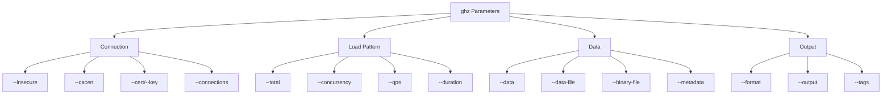
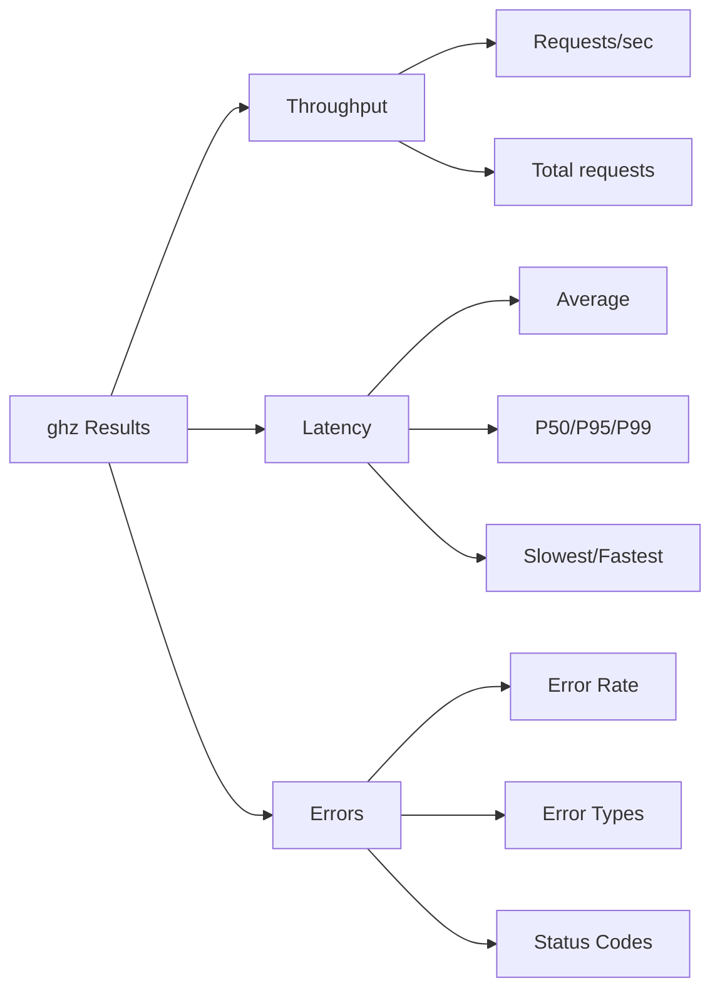

# How to Benchmark gRPC Services with ghz

Author: [nawazdhandala](https://www.github.com/nawazdhandala)

Tags: gRPC, benchmarking, ghz, load testing, performance, testing, CI/CD, metrics

Description: Learn how to use ghz to benchmark gRPC services, run load tests, interpret results, and integrate performance testing into your CI/CD pipeline.

---

## Introduction

ghz is a powerful command-line tool for load testing and benchmarking gRPC services. It provides detailed performance metrics, supports various load patterns, and can output results in multiple formats suitable for analysis and CI/CD integration.

This guide covers everything from basic usage to advanced scenarios, helping you establish comprehensive performance baselines for your gRPC services.

## Installing ghz

### macOS

```bash
# Using Homebrew
brew install ghz

# Verify installation
ghz --version
```

### Linux

```bash
# Download latest release
curl -LO https://github.com/bojand/ghz/releases/download/v0.120.0/ghz-linux-x86_64.tar.gz

# Extract
tar -xzf ghz-linux-x86_64.tar.gz

# Move to PATH
sudo mv ghz /usr/local/bin/

# Verify installation
ghz --version
```

### Docker

```bash
# Run ghz from Docker
docker run --rm bojand/ghz --help

# With network access to host services
docker run --rm --network host bojand/ghz \
  --insecure \
  --proto /protos/service.proto \
  --call myservice.MyService/MyMethod \
  localhost:50051
```

### Go Install

```bash
go install github.com/bojand/ghz/cmd/ghz@latest
```

## Basic Usage

### Simple Benchmark

```bash
# Basic benchmark with 200 requests
ghz --insecure \
    --proto ./protos/service.proto \
    --call myservice.MyService/GetUser \
    --data '{"user_id": "123"}' \
    --total 200 \
    localhost:50051
```

### Using Reflection

If your server supports gRPC reflection, you don't need the proto file:

```bash
ghz --insecure \
    --call myservice.MyService/GetUser \
    --data '{"user_id": "123"}' \
    --total 200 \
    localhost:50051
```

## Understanding ghz Parameters



### Key Parameters

| Parameter | Description | Example |
|-----------|-------------|---------|
| `--total` | Total number of requests | `--total 10000` |
| `--concurrency` | Number of concurrent workers | `--concurrency 50` |
| `--qps` | Queries per second limit | `--qps 100` |
| `--duration` | Duration of the test | `--duration 30s` |
| `--connections` | Number of connections | `--connections 10` |
| `--timeout` | Request timeout | `--timeout 20s` |

## Load Testing Scenarios

### Scenario 1: Constant Load Test

Test with a steady number of concurrent requests:

```bash
ghz --insecure \
    --proto ./protos/user.proto \
    --call user.UserService/GetUser \
    --data '{"user_id": "123"}' \
    --concurrency 50 \
    --total 10000 \
    --connections 10 \
    localhost:50051
```

### Scenario 2: Rate-Limited Test

Control the exact request rate:

```bash
ghz --insecure \
    --proto ./protos/user.proto \
    --call user.UserService/GetUser \
    --data '{"user_id": "123"}' \
    --qps 500 \
    --duration 60s \
    --connections 5 \
    localhost:50051
```

### Scenario 3: Stress Test (Find Breaking Point)

Gradually increase load until failure:

```bash
#!/bin/bash
# stress_test.sh

TARGET="localhost:50051"
PROTO="./protos/user.proto"
METHOD="user.UserService/GetUser"
DATA='{"user_id": "123"}'

for QPS in 100 200 500 1000 2000 5000; do
    echo "Testing at $QPS QPS..."
    ghz --insecure \
        --proto $PROTO \
        --call $METHOD \
        --data "$DATA" \
        --qps $QPS \
        --duration 30s \
        --format json \
        --output "results_${QPS}qps.json" \
        $TARGET

    # Extract error rate
    ERROR_RATE=$(jq '.errorDistribution | length' "results_${QPS}qps.json")
    if [ "$ERROR_RATE" -gt 0 ]; then
        echo "Errors detected at $QPS QPS"
        break
    fi

    sleep 5
done
```

### Scenario 4: Duration-Based Test

Run for a specific time period:

```bash
ghz --insecure \
    --proto ./protos/user.proto \
    --call user.UserService/GetUser \
    --data '{"user_id": "123"}' \
    --concurrency 100 \
    --duration 5m \
    --connections 20 \
    localhost:50051
```

### Scenario 5: Streaming RPC Test

Test server streaming:

```bash
ghz --insecure \
    --proto ./protos/stream.proto \
    --call stream.StreamService/ServerStream \
    --data '{"count": 100}' \
    --concurrency 20 \
    --total 1000 \
    localhost:50051
```

Test bidirectional streaming:

```bash
ghz --insecure \
    --proto ./protos/stream.proto \
    --call stream.StreamService/BidirectionalStream \
    --data '{"message": "hello"}' \
    --stream-call-count 10 \
    --concurrency 20 \
    --total 500 \
    localhost:50051
```

## Advanced Data Input

### Using Data Files

Create a JSON file with multiple test cases:

```json
[
    {"user_id": "user_001", "include_profile": true},
    {"user_id": "user_002", "include_profile": false},
    {"user_id": "user_003", "include_profile": true},
    {"user_id": "user_004", "include_profile": false}
]
```

```bash
ghz --insecure \
    --proto ./protos/user.proto \
    --call user.UserService/GetUser \
    --data-file ./test_data.json \
    --total 10000 \
    --concurrency 50 \
    localhost:50051
```

### Using Binary Data

For binary protobuf input:

```bash
# First, create binary data using protoc
echo '{"user_id": "123"}' | protoc --encode=user.GetUserRequest user.proto > request.bin

# Then use with ghz
ghz --insecure \
    --proto ./protos/user.proto \
    --call user.UserService/GetUser \
    --binary-file ./request.bin \
    --total 1000 \
    localhost:50051
```

### Dynamic Data with Templates

ghz supports Go templates for dynamic data:

```bash
ghz --insecure \
    --proto ./protos/user.proto \
    --call user.UserService/GetUser \
    --data '{"user_id": "user_{{.RequestNumber}}", "timestamp": "{{.TimestampUnix}}"}' \
    --total 1000 \
    localhost:50051
```

Available template variables:
- `{{.RequestNumber}}` - Current request number
- `{{.FullyQualifiedMethod}}` - Full method name
- `{{.MethodName}}` - Short method name
- `{{.ServiceName}}` - Service name
- `{{.InputName}}` - Input message name
- `{{.OutputName}}` - Output message name
- `{{.IsClientStreaming}}` - Boolean
- `{{.IsServerStreaming}}` - Boolean
- `{{.Timestamp}}` - RFC3339 timestamp
- `{{.TimestampUnix}}` - Unix timestamp
- `{{.TimestampUnixMilli}}` - Unix timestamp in milliseconds
- `{{.TimestampUnixNano}}` - Unix timestamp in nanoseconds
- `{{.UUID}}` - Random UUID

## Interpreting Results

### Understanding the Output

```
Summary:
  Count:        10000
  Total:        15.23 s
  Slowest:      245.32 ms
  Fastest:      1.23 ms
  Average:      7.52 ms
  Requests/sec: 656.79

Response time histogram:
  1.230  [1]     |
  2.461  [2341]  |∎∎∎∎∎∎∎∎∎∎∎∎∎∎∎∎∎∎∎∎∎∎∎∎∎∎∎∎∎∎∎∎∎∎∎∎∎∎∎∎
  3.692  [3521]  |∎∎∎∎∎∎∎∎∎∎∎∎∎∎∎∎∎∎∎∎∎∎∎∎∎∎∎∎∎∎∎∎∎∎∎∎∎∎∎∎
  4.923  [2156]  |∎∎∎∎∎∎∎∎∎∎∎∎∎∎∎∎∎∎∎∎∎∎∎∎∎
  ...

Latency distribution:
  10 % in 2.15 ms
  25 % in 2.89 ms
  50 % in 4.21 ms
  75 % in 7.65 ms
  90 % in 15.32 ms
  95 % in 25.67 ms
  99 % in 85.43 ms

Status code distribution:
  [OK]            9985 responses
  [Unavailable]   15 responses

Error distribution:
  [15]   rpc error: code = Unavailable desc = connection error
```

### Key Metrics to Monitor



### Analyzing Results Script

```python
#!/usr/bin/env python3
"""Analyze ghz benchmark results."""

import json
import sys
from dataclasses import dataclass
from typing import Dict, List


@dataclass
class BenchmarkResult:
    count: int
    total_time: float
    average: float
    fastest: float
    slowest: float
    rps: float
    p50: float
    p95: float
    p99: float
    error_count: int
    status_codes: Dict[str, int]


def parse_ghz_json(filepath: str) -> BenchmarkResult:
    """Parse ghz JSON output file."""
    with open(filepath) as f:
        data = json.load(f)

    latency_dist = data.get('latencyDistribution', [])
    percentiles = {item['percentage']: item['latency'] for item in latency_dist}

    status_dist = data.get('statusCodeDistribution', {})
    error_count = sum(v for k, v in status_dist.items() if k != 'OK')

    return BenchmarkResult(
        count=data['count'],
        total_time=data['total'] / 1e9,  # Convert from nanoseconds
        average=data['average'] / 1e6,    # Convert to milliseconds
        fastest=data['fastest'] / 1e6,
        slowest=data['slowest'] / 1e6,
        rps=data['rps'],
        p50=percentiles.get(50, 0) / 1e6,
        p95=percentiles.get(95, 0) / 1e6,
        p99=percentiles.get(99, 0) / 1e6,
        error_count=error_count,
        status_codes=status_dist,
    )


def check_sla(result: BenchmarkResult, sla: dict) -> List[str]:
    """Check if results meet SLA requirements."""
    violations = []

    if result.p99 > sla.get('max_p99_ms', float('inf')):
        violations.append(f"P99 latency {result.p99:.2f}ms exceeds limit {sla['max_p99_ms']}ms")

    if result.p95 > sla.get('max_p95_ms', float('inf')):
        violations.append(f"P95 latency {result.p95:.2f}ms exceeds limit {sla['max_p95_ms']}ms")

    error_rate = (result.error_count / result.count) * 100
    if error_rate > sla.get('max_error_rate', 100):
        violations.append(f"Error rate {error_rate:.2f}% exceeds limit {sla['max_error_rate']}%")

    if result.rps < sla.get('min_rps', 0):
        violations.append(f"RPS {result.rps:.2f} below minimum {sla['min_rps']}")

    return violations


def main():
    if len(sys.argv) < 2:
        print("Usage: analyze_results.py <results.json>")
        sys.exit(1)

    result = parse_ghz_json(sys.argv[1])

    print("=" * 60)
    print("BENCHMARK RESULTS ANALYSIS")
    print("=" * 60)
    print(f"Total Requests:     {result.count:,}")
    print(f"Total Time:         {result.total_time:.2f}s")
    print(f"Requests/sec:       {result.rps:,.2f}")
    print()
    print("LATENCY:")
    print(f"  Average:          {result.average:.2f}ms")
    print(f"  P50:              {result.p50:.2f}ms")
    print(f"  P95:              {result.p95:.2f}ms")
    print(f"  P99:              {result.p99:.2f}ms")
    print(f"  Fastest:          {result.fastest:.2f}ms")
    print(f"  Slowest:          {result.slowest:.2f}ms")
    print()
    print("ERRORS:")
    print(f"  Error Count:      {result.error_count}")
    print(f"  Error Rate:       {(result.error_count/result.count)*100:.2f}%")
    print()

    # Check against SLA
    sla = {
        'max_p99_ms': 100,
        'max_p95_ms': 50,
        'max_error_rate': 0.1,
        'min_rps': 500,
    }

    violations = check_sla(result, sla)
    if violations:
        print("SLA VIOLATIONS:")
        for v in violations:
            print(f"  - {v}")
        sys.exit(1)
    else:
        print("SLA CHECK: PASSED")


if __name__ == '__main__':
    main()
```

## Output Formats

### JSON Output

```bash
ghz --insecure \
    --proto ./protos/user.proto \
    --call user.UserService/GetUser \
    --data '{"user_id": "123"}' \
    --total 1000 \
    --format json \
    --output results.json \
    localhost:50051
```

### CSV Output

```bash
ghz --insecure \
    --proto ./protos/user.proto \
    --call user.UserService/GetUser \
    --data '{"user_id": "123"}' \
    --total 1000 \
    --format csv \
    --output results.csv \
    localhost:50051
```

### HTML Report

```bash
ghz --insecure \
    --proto ./protos/user.proto \
    --call user.UserService/GetUser \
    --data '{"user_id": "123"}' \
    --total 1000 \
    --format html \
    --output report.html \
    localhost:50051
```

### InfluxDB Output (for Grafana)

```bash
ghz --insecure \
    --proto ./protos/user.proto \
    --call user.UserService/GetUser \
    --data '{"user_id": "123"}' \
    --total 1000 \
    --format influx-summary \
    --output results.influx \
    --tags 'env=staging,version=1.2.3' \
    localhost:50051
```

## CI/CD Integration

### GitHub Actions Workflow

```yaml
# .github/workflows/grpc-benchmark.yml
name: gRPC Benchmark

on:
  push:
    branches: [main]
  pull_request:
    branches: [main]

jobs:
  benchmark:
    runs-on: ubuntu-latest

    services:
      grpc-server:
        image: myregistry/myservice:latest
        ports:
          - 50051:50051

    steps:
      - uses: actions/checkout@v3

      - name: Install ghz
        run: |
          curl -LO https://github.com/bojand/ghz/releases/download/v0.120.0/ghz-linux-x86_64.tar.gz
          tar -xzf ghz-linux-x86_64.tar.gz
          sudo mv ghz /usr/local/bin/

      - name: Wait for service
        run: |
          for i in {1..30}; do
            grpcurl -plaintext localhost:50051 list && break
            sleep 1
          done

      - name: Run benchmark
        run: |
          ghz --insecure \
              --proto ./protos/user.proto \
              --call user.UserService/GetUser \
              --data '{"user_id": "123"}' \
              --concurrency 50 \
              --total 5000 \
              --format json \
              --output benchmark-results.json \
              localhost:50051

      - name: Check SLA
        run: |
          python3 scripts/check_sla.py benchmark-results.json

      - name: Upload results
        uses: actions/upload-artifact@v3
        with:
          name: benchmark-results
          path: benchmark-results.json

      - name: Comment PR with results
        if: github.event_name == 'pull_request'
        uses: actions/github-script@v6
        with:
          script: |
            const fs = require('fs');
            const results = JSON.parse(fs.readFileSync('benchmark-results.json'));

            const comment = `## Benchmark Results

            | Metric | Value |
            |--------|-------|
            | Requests/sec | ${results.rps.toFixed(2)} |
            | Average Latency | ${(results.average / 1e6).toFixed(2)}ms |
            | P95 Latency | ${(results.latencyDistribution.find(d => d.percentage === 95)?.latency / 1e6).toFixed(2)}ms |
            | P99 Latency | ${(results.latencyDistribution.find(d => d.percentage === 99)?.latency / 1e6).toFixed(2)}ms |
            | Error Rate | ${((results.count - results.statusCodeDistribution.OK) / results.count * 100).toFixed(2)}% |
            `;

            github.rest.issues.createComment({
              issue_number: context.issue.number,
              owner: context.repo.owner,
              repo: context.repo.repo,
              body: comment
            });
```

### Jenkins Pipeline

```groovy
// Jenkinsfile
pipeline {
    agent any

    environment {
        GHZ_VERSION = '0.120.0'
        GRPC_TARGET = 'localhost:50051'
    }

    stages {
        stage('Setup') {
            steps {
                sh '''
                    curl -LO https://github.com/bojand/ghz/releases/download/v${GHZ_VERSION}/ghz-linux-x86_64.tar.gz
                    tar -xzf ghz-linux-x86_64.tar.gz
                    chmod +x ghz
                '''
            }
        }

        stage('Start Service') {
            steps {
                sh 'docker-compose up -d grpc-server'
                sh 'sleep 10'  // Wait for service
            }
        }

        stage('Benchmark') {
            steps {
                sh '''
                    ./ghz --insecure \
                        --proto ./protos/user.proto \
                        --call user.UserService/GetUser \
                        --data '{"user_id": "123"}' \
                        --concurrency 50 \
                        --total 10000 \
                        --format json \
                        --output benchmark-results.json \
                        ${GRPC_TARGET}
                '''
            }
        }

        stage('Analyze') {
            steps {
                script {
                    def results = readJSON file: 'benchmark-results.json'
                    def p99 = results.latencyDistribution.find { it.percentage == 99 }?.latency / 1e6
                    def errorRate = (results.count - results.statusCodeDistribution.OK) / results.count * 100

                    echo "P99 Latency: ${p99}ms"
                    echo "Error Rate: ${errorRate}%"

                    if (p99 > 100 || errorRate > 0.1) {
                        error "Performance SLA violated!"
                    }
                }
            }
        }

        stage('Archive') {
            steps {
                archiveArtifacts artifacts: 'benchmark-results.json'
                publishHTML([
                    allowMissing: false,
                    alwaysLinkToLastBuild: true,
                    keepAll: true,
                    reportDir: '.',
                    reportFiles: 'report.html',
                    reportName: 'Benchmark Report'
                ])
            }
        }
    }

    post {
        always {
            sh 'docker-compose down'
        }
    }
}
```

### GitLab CI

```yaml
# .gitlab-ci.yml
stages:
  - build
  - test
  - benchmark

variables:
  GHZ_VERSION: "0.120.0"

benchmark:
  stage: benchmark
  image: golang:1.21
  services:
    - name: myregistry/myservice:latest
      alias: grpc-server
  before_script:
    - apt-get update && apt-get install -y curl jq
    - curl -LO https://github.com/bojand/ghz/releases/download/v${GHZ_VERSION}/ghz-linux-x86_64.tar.gz
    - tar -xzf ghz-linux-x86_64.tar.gz
    - mv ghz /usr/local/bin/
  script:
    - |
      ghz --insecure \
          --proto ./protos/user.proto \
          --call user.UserService/GetUser \
          --data '{"user_id": "123"}' \
          --concurrency 50 \
          --total 5000 \
          --format json \
          --output benchmark-results.json \
          grpc-server:50051
    - python3 scripts/check_sla.py benchmark-results.json
  artifacts:
    paths:
      - benchmark-results.json
    reports:
      metrics: benchmark-metrics.txt
```

## Comparison Benchmarks

### Comparing Different Configurations

```bash
#!/bin/bash
# compare_configs.sh

TARGET="localhost:50051"
PROTO="./protos/user.proto"
METHOD="user.UserService/GetUser"
DATA='{"user_id": "123"}'

echo "Running comparison benchmarks..."

# Test 1: Different concurrency levels
for CONCURRENCY in 10 25 50 100 200; do
    echo "Testing concurrency: $CONCURRENCY"
    ghz --insecure \
        --proto $PROTO \
        --call $METHOD \
        --data "$DATA" \
        --concurrency $CONCURRENCY \
        --total 5000 \
        --format json \
        --output "results_c${CONCURRENCY}.json" \
        $TARGET
done

# Test 2: Different connection counts
for CONNECTIONS in 1 5 10 20; do
    echo "Testing connections: $CONNECTIONS"
    ghz --insecure \
        --proto $PROTO \
        --call $METHOD \
        --data "$DATA" \
        --concurrency 50 \
        --connections $CONNECTIONS \
        --total 5000 \
        --format json \
        --output "results_conn${CONNECTIONS}.json" \
        $TARGET
done

# Generate comparison report
python3 << 'EOF'
import json
import glob

print("\n" + "="*80)
print("COMPARISON RESULTS")
print("="*80)

# Concurrency comparison
print("\nConcurrency Comparison:")
print(f"{'Concurrency':<15} {'RPS':<12} {'Avg (ms)':<12} {'P99 (ms)':<12} {'Errors':<10}")
print("-" * 60)

for f in sorted(glob.glob("results_c*.json")):
    with open(f) as fp:
        data = json.load(fp)
    conc = f.split("_c")[1].split(".")[0]
    p99 = next((d['latency']/1e6 for d in data['latencyDistribution'] if d['percentage'] == 99), 0)
    errors = sum(v for k, v in data.get('statusCodeDistribution', {}).items() if k != 'OK')
    print(f"{conc:<15} {data['rps']:<12.2f} {data['average']/1e6:<12.2f} {p99:<12.2f} {errors:<10}")

# Connection comparison
print("\nConnection Count Comparison:")
print(f"{'Connections':<15} {'RPS':<12} {'Avg (ms)':<12} {'P99 (ms)':<12} {'Errors':<10}")
print("-" * 60)

for f in sorted(glob.glob("results_conn*.json")):
    with open(f) as fp:
        data = json.load(fp)
    conns = f.split("_conn")[1].split(".")[0]
    p99 = next((d['latency']/1e6 for d in data['latencyDistribution'] if d['percentage'] == 99), 0)
    errors = sum(v for k, v in data.get('statusCodeDistribution', {}).items() if k != 'OK')
    print(f"{conns:<15} {data['rps']:<12.2f} {data['average']/1e6:<12.2f} {p99:<12.2f} {errors:<10}")
EOF
```

### Comparing gRPC vs REST

```bash
#!/bin/bash
# grpc_vs_rest.sh

echo "Comparing gRPC vs REST performance..."

# gRPC benchmark
echo "Running gRPC benchmark..."
ghz --insecure \
    --proto ./protos/user.proto \
    --call user.UserService/GetUser \
    --data '{"user_id": "123"}' \
    --concurrency 50 \
    --total 10000 \
    --format json \
    --output grpc_results.json \
    localhost:50051

# REST benchmark (using hey)
echo "Running REST benchmark..."
hey -n 10000 \
    -c 50 \
    -m POST \
    -H "Content-Type: application/json" \
    -d '{"user_id": "123"}' \
    -o csv \
    http://localhost:8080/api/users/123 > rest_results.csv

# Compare results
python3 << 'EOF'
import json
import csv

# Parse gRPC results
with open('grpc_results.json') as f:
    grpc = json.load(f)

# Parse REST results (hey CSV format)
rest_latencies = []
with open('rest_results.csv') as f:
    reader = csv.DictReader(f)
    for row in reader:
        rest_latencies.append(float(row['response-time']))

rest_latencies.sort()
rest_count = len(rest_latencies)
rest_avg = sum(rest_latencies) / rest_count * 1000  # Convert to ms
rest_p99 = rest_latencies[int(rest_count * 0.99)] * 1000

grpc_p99 = next((d['latency']/1e6 for d in grpc['latencyDistribution'] if d['percentage'] == 99), 0)

print("\n" + "="*60)
print("gRPC vs REST COMPARISON")
print("="*60)
print(f"{'Metric':<20} {'gRPC':<20} {'REST':<20}")
print("-" * 60)
print(f"{'Requests/sec':<20} {grpc['rps']:<20.2f} {rest_count/grpc['total']*1e9:<20.2f}")
print(f"{'Avg Latency (ms)':<20} {grpc['average']/1e6:<20.2f} {rest_avg:<20.2f}")
print(f"{'P99 Latency (ms)':<20} {grpc_p99:<20.2f} {rest_p99:<20.2f}")
EOF
```

## Configuration File

For complex benchmarks, use a configuration file:

```json
{
  "proto": "./protos/user.proto",
  "call": "user.UserService/GetUser",
  "host": "localhost:50051",
  "insecure": true,
  "data": {
    "user_id": "{{.UUID}}"
  },
  "metadata": {
    "authorization": "Bearer token123"
  },
  "total": 10000,
  "concurrency": 50,
  "connections": 10,
  "timeout": "20s",
  "dial-timeout": "10s",
  "keepalive": "10s",
  "format": "json",
  "output": "results.json",
  "tags": {
    "env": "staging",
    "version": "1.2.3"
  }
}
```

Run with config file:

```bash
ghz --config benchmark-config.json
```

## Best Practices

### 1. Warm-Up Period

```bash
# Run warm-up requests first
ghz --insecure \
    --proto ./protos/user.proto \
    --call user.UserService/GetUser \
    --data '{"user_id": "123"}' \
    --total 1000 \
    --concurrency 10 \
    localhost:50051 > /dev/null

# Then run actual benchmark
ghz --insecure \
    --proto ./protos/user.proto \
    --call user.UserService/GetUser \
    --data '{"user_id": "123"}' \
    --total 10000 \
    --concurrency 50 \
    --format json \
    --output results.json \
    localhost:50051
```

### 2. Multiple Runs for Consistency

```bash
#!/bin/bash
# Run benchmark multiple times and average

for i in {1..5}; do
    ghz --insecure \
        --proto ./protos/user.proto \
        --call user.UserService/GetUser \
        --data '{"user_id": "123"}' \
        --total 5000 \
        --concurrency 50 \
        --format json \
        --output "run_${i}.json" \
        localhost:50051
    sleep 5
done

# Calculate averages
python3 -c "
import json
import glob
import statistics

rps_values = []
avg_values = []
p99_values = []

for f in glob.glob('run_*.json'):
    with open(f) as fp:
        data = json.load(fp)
    rps_values.append(data['rps'])
    avg_values.append(data['average'] / 1e6)
    p99 = next((d['latency']/1e6 for d in data['latencyDistribution'] if d['percentage'] == 99), 0)
    p99_values.append(p99)

print(f'RPS: {statistics.mean(rps_values):.2f} (+/- {statistics.stdev(rps_values):.2f})')
print(f'Avg: {statistics.mean(avg_values):.2f}ms (+/- {statistics.stdev(avg_values):.2f})')
print(f'P99: {statistics.mean(p99_values):.2f}ms (+/- {statistics.stdev(p99_values):.2f})')
"
```

### 3. Realistic Data Distribution

```bash
# Use varied test data
ghz --insecure \
    --proto ./protos/user.proto \
    --call user.UserService/GetUser \
    --data-file ./realistic_test_data.json \
    --total 10000 \
    --concurrency 50 \
    localhost:50051
```

## Conclusion

ghz is an essential tool for benchmarking gRPC services. Key takeaways:

1. **Start simple**: Begin with basic benchmarks before complex scenarios
2. **Understand metrics**: Focus on P99 latency and error rates for SLA compliance
3. **Automate**: Integrate benchmarks into CI/CD for continuous performance monitoring
4. **Compare fairly**: Use consistent configurations when comparing implementations
5. **Warm up**: Always warm up services before benchmarking

By following these practices, you can establish reliable performance baselines and catch regressions early in your development cycle.

## Additional Resources

- [ghz Documentation](https://ghz.sh/)
- [ghz GitHub Repository](https://github.com/bojand/ghz)
- [gRPC Performance Best Practices](https://grpc.io/docs/guides/performance/)
- [Protocol Buffers Benchmarks](https://github.com/protocolbuffers/protobuf/blob/main/benchmarks/README.md)
