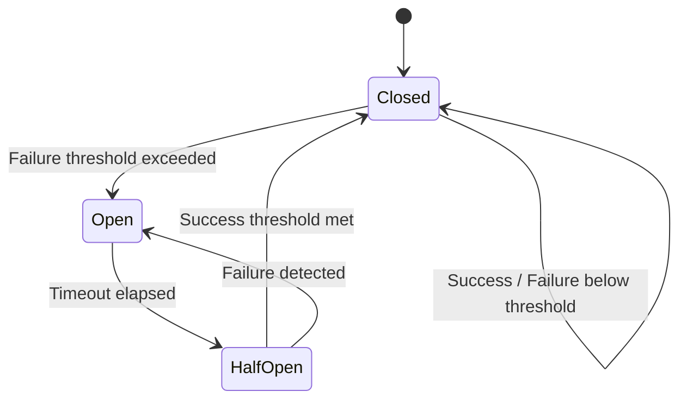
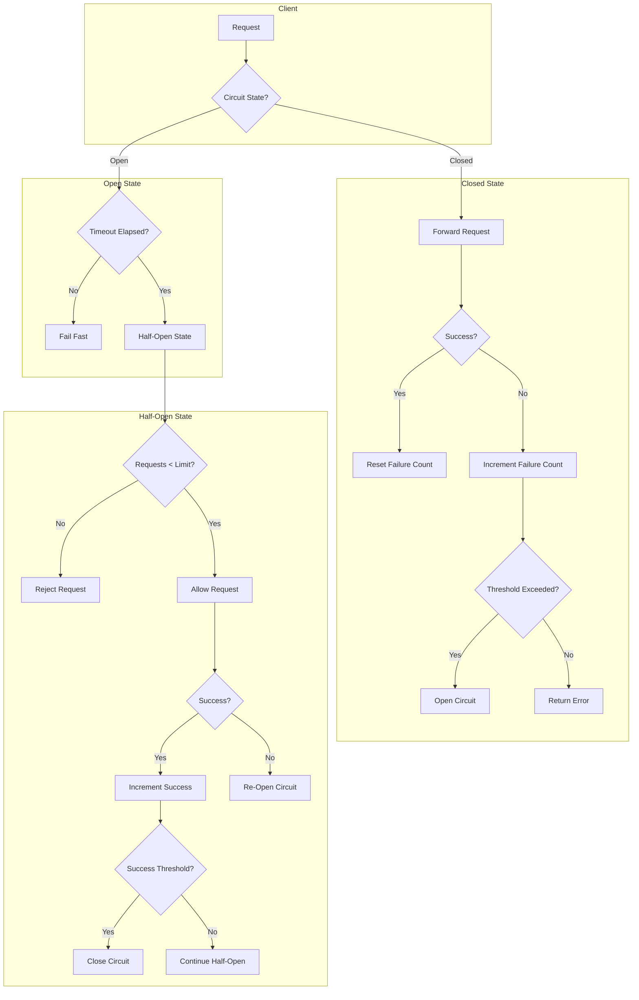

# How to Implement Circuit Breakers for gRPC Services

Author: [nawazdhandala](https://www.github.com/nawazdhandala)

Tags: gRPC, circuit breaker, resilience, fault tolerance, microservices, distributed systems, hystrix, gobreaker

Description: Learn how to implement the circuit breaker pattern for gRPC services to prevent cascading failures and improve system resilience in distributed architectures.

---

The circuit breaker pattern is a critical resilience mechanism for distributed systems. When a service is experiencing issues, the circuit breaker prevents cascading failures by failing fast and allowing the troubled service time to recover. This guide covers implementing circuit breakers for gRPC services with practical examples and best practices.

## Understanding the Circuit Breaker Pattern

The circuit breaker has three states that control how requests flow through the system:



### Circuit Breaker States

| State | Behavior | Transitions |
|-------|----------|-------------|
| **Closed** | Requests flow normally, failures are counted | Opens when failure threshold is exceeded |
| **Open** | Requests fail immediately without calling the service | Transitions to Half-Open after timeout |
| **Half-Open** | Limited requests are allowed through for testing | Closes on success, Opens on failure |

## Basic Circuit Breaker Implementation in Go

Let's start with a basic implementation to understand the core concepts:

```go
package circuitbreaker

import (
    "errors"
    "sync"
    "time"
)

// State represents the circuit breaker state
type State int

const (
    StateClosed State = iota
    StateOpen
    StateHalfOpen
)

func (s State) String() string {
    switch s {
    case StateClosed:
        return "CLOSED"
    case StateOpen:
        return "OPEN"
    case StateHalfOpen:
        return "HALF_OPEN"
    default:
        return "UNKNOWN"
    }
}

var (
    ErrCircuitOpen    = errors.New("circuit breaker is open")
    ErrTooManyRequests = errors.New("too many requests in half-open state")
)

// Config holds circuit breaker configuration
type Config struct {
    // Number of failures before opening the circuit
    FailureThreshold int
    // Number of successes needed to close the circuit from half-open
    SuccessThreshold int
    // Time to wait before transitioning from open to half-open
    Timeout time.Duration
    // Maximum requests allowed in half-open state
    MaxHalfOpenRequests int
    // Function to determine if an error should count as a failure
    IsFailure func(error) bool
}

// DefaultConfig returns sensible defaults
func DefaultConfig() Config {
    return Config{
        FailureThreshold:    5,
        SuccessThreshold:    3,
        Timeout:             30 * time.Second,
        MaxHalfOpenRequests: 3,
        IsFailure: func(err error) bool {
            return err != nil
        },
    }
}

// CircuitBreaker implements the circuit breaker pattern
type CircuitBreaker struct {
    mu sync.RWMutex

    config Config
    state  State

    failureCount  int
    successCount  int
    halfOpenCount int

    lastFailureTime time.Time
}

// New creates a new circuit breaker
func New(config Config) *CircuitBreaker {
    return &CircuitBreaker{
        config: config,
        state:  StateClosed,
    }
}

// Execute runs the given function with circuit breaker protection
func (cb *CircuitBreaker) Execute(fn func() error) error {
    if err := cb.beforeRequest(); err != nil {
        return err
    }

    err := fn()

    cb.afterRequest(err)

    return err
}

func (cb *CircuitBreaker) beforeRequest() error {
    cb.mu.Lock()
    defer cb.mu.Unlock()

    switch cb.state {
    case StateClosed:
        return nil

    case StateOpen:
        // Check if timeout has elapsed
        if time.Since(cb.lastFailureTime) > cb.config.Timeout {
            cb.state = StateHalfOpen
            cb.halfOpenCount = 0
            cb.successCount = 0
            return nil
        }
        return ErrCircuitOpen

    case StateHalfOpen:
        if cb.halfOpenCount >= cb.config.MaxHalfOpenRequests {
            return ErrTooManyRequests
        }
        cb.halfOpenCount++
        return nil
    }

    return nil
}

func (cb *CircuitBreaker) afterRequest(err error) {
    cb.mu.Lock()
    defer cb.mu.Unlock()

    isFailure := cb.config.IsFailure(err)

    switch cb.state {
    case StateClosed:
        if isFailure {
            cb.failureCount++
            cb.lastFailureTime = time.Now()
            if cb.failureCount >= cb.config.FailureThreshold {
                cb.state = StateOpen
            }
        } else {
            // Reset failure count on success
            cb.failureCount = 0
        }

    case StateHalfOpen:
        if isFailure {
            // Back to open state
            cb.state = StateOpen
            cb.lastFailureTime = time.Now()
        } else {
            cb.successCount++
            if cb.successCount >= cb.config.SuccessThreshold {
                // Circuit is healthy, close it
                cb.state = StateClosed
                cb.failureCount = 0
            }
        }
    }
}

// State returns the current state
func (cb *CircuitBreaker) State() State {
    cb.mu.RLock()
    defer cb.mu.RUnlock()
    return cb.state
}

// Counts returns current failure and success counts
func (cb *CircuitBreaker) Counts() (failures, successes int) {
    cb.mu.RLock()
    defer cb.mu.RUnlock()
    return cb.failureCount, cb.successCount
}
```

## gRPC Circuit Breaker Interceptor

Now let's integrate the circuit breaker with gRPC using interceptors:

```go
package grpccb

import (
    "context"
    "sync"

    "google.golang.org/grpc"
    "google.golang.org/grpc/codes"
    "google.golang.org/grpc/status"
    "myapp/circuitbreaker"
)

// CircuitBreakerManager manages circuit breakers per service/method
type CircuitBreakerManager struct {
    mu       sync.RWMutex
    breakers map[string]*circuitbreaker.CircuitBreaker
    config   circuitbreaker.Config
}

// NewManager creates a new circuit breaker manager
func NewManager(config circuitbreaker.Config) *CircuitBreakerManager {
    return &CircuitBreakerManager{
        breakers: make(map[string]*circuitbreaker.CircuitBreaker),
        config:   config,
    }
}

// GetBreaker returns the circuit breaker for a method
func (m *CircuitBreakerManager) GetBreaker(method string) *circuitbreaker.CircuitBreaker {
    m.mu.RLock()
    cb, exists := m.breakers[method]
    m.mu.RUnlock()

    if exists {
        return cb
    }

    m.mu.Lock()
    defer m.mu.Unlock()

    // Double-check after acquiring write lock
    if cb, exists = m.breakers[method]; exists {
        return cb
    }

    cb = circuitbreaker.New(m.config)
    m.breakers[method] = cb
    return cb
}

// UnaryClientInterceptor returns a gRPC interceptor with circuit breaker
func (m *CircuitBreakerManager) UnaryClientInterceptor() grpc.UnaryClientInterceptor {
    return func(
        ctx context.Context,
        method string,
        req, reply interface{},
        cc *grpc.ClientConn,
        invoker grpc.UnaryInvoker,
        opts ...grpc.CallOption,
    ) error {
        cb := m.GetBreaker(method)

        var invokeErr error
        cbErr := cb.Execute(func() error {
            invokeErr = invoker(ctx, method, req, reply, cc, opts...)
            return invokeErr
        })

        // If circuit breaker blocked the request
        if cbErr == circuitbreaker.ErrCircuitOpen {
            return status.Error(codes.Unavailable, "circuit breaker is open")
        }
        if cbErr == circuitbreaker.ErrTooManyRequests {
            return status.Error(codes.ResourceExhausted, "circuit breaker: too many requests")
        }

        return invokeErr
    }
}

// StreamClientInterceptor returns a streaming interceptor with circuit breaker
func (m *CircuitBreakerManager) StreamClientInterceptor() grpc.StreamClientInterceptor {
    return func(
        ctx context.Context,
        desc *grpc.StreamDesc,
        cc *grpc.ClientConn,
        method string,
        streamer grpc.Streamer,
        opts ...grpc.CallOption,
    ) (grpc.ClientStream, error) {
        cb := m.GetBreaker(method)

        var stream grpc.ClientStream
        var invokeErr error

        cbErr := cb.Execute(func() error {
            stream, invokeErr = streamer(ctx, desc, cc, method, opts...)
            return invokeErr
        })

        if cbErr == circuitbreaker.ErrCircuitOpen {
            return nil, status.Error(codes.Unavailable, "circuit breaker is open")
        }

        return stream, invokeErr
    }
}
```

## Using gobreaker Library

For production use, consider using the well-tested `gobreaker` library:

```go
package main

import (
    "context"
    "log"
    "time"

    "github.com/sony/gobreaker"
    "google.golang.org/grpc"
    "google.golang.org/grpc/codes"
    "google.golang.org/grpc/credentials/insecure"
    "google.golang.org/grpc/status"
    pb "myapp/proto"
)

// GoBreakerManager manages gobreaker circuit breakers
type GoBreakerManager struct {
    breakers sync.Map
    settings gobreaker.Settings
}

func NewGoBreakerManager() *GoBreakerManager {
    return &GoBreakerManager{
        settings: gobreaker.Settings{
            Name:        "grpc-circuit-breaker",
            MaxRequests: 3,                // Max requests in half-open
            Interval:    10 * time.Second, // Interval to clear counts in closed state
            Timeout:     30 * time.Second, // Timeout in open state
            ReadyToTrip: func(counts gobreaker.Counts) bool {
                // Open circuit if failure rate > 50% with at least 10 requests
                failureRatio := float64(counts.TotalFailures) / float64(counts.Requests)
                return counts.Requests >= 10 && failureRatio >= 0.5
            },
            OnStateChange: func(name string, from gobreaker.State, to gobreaker.State) {
                log.Printf("Circuit breaker %s: %s -> %s", name, from.String(), to.String())
            },
            IsSuccessful: func(err error) bool {
                if err == nil {
                    return true
                }
                // Don't count client errors as failures
                st, ok := status.FromError(err)
                if !ok {
                    return false
                }
                switch st.Code() {
                case codes.InvalidArgument,
                    codes.NotFound,
                    codes.AlreadyExists,
                    codes.PermissionDenied,
                    codes.Unauthenticated:
                    return true // Client errors don't trip the breaker
                default:
                    return false
                }
            },
        },
    }
}

func (m *GoBreakerManager) GetBreaker(name string) *gobreaker.CircuitBreaker {
    if cb, ok := m.breakers.Load(name); ok {
        return cb.(*gobreaker.CircuitBreaker)
    }

    settings := m.settings
    settings.Name = name

    cb := gobreaker.NewCircuitBreaker(settings)
    actual, _ := m.breakers.LoadOrStore(name, cb)
    return actual.(*gobreaker.CircuitBreaker)
}

func (m *GoBreakerManager) UnaryInterceptor() grpc.UnaryClientInterceptor {
    return func(
        ctx context.Context,
        method string,
        req, reply interface{},
        cc *grpc.ClientConn,
        invoker grpc.UnaryInvoker,
        opts ...grpc.CallOption,
    ) error {
        cb := m.GetBreaker(method)

        _, err := cb.Execute(func() (interface{}, error) {
            return nil, invoker(ctx, method, req, reply, cc, opts...)
        })

        if err == gobreaker.ErrOpenState {
            return status.Error(codes.Unavailable, "service temporarily unavailable (circuit open)")
        }
        if err == gobreaker.ErrTooManyRequests {
            return status.Error(codes.ResourceExhausted, "too many requests (circuit half-open)")
        }

        return err
    }
}

// Usage
func main() {
    cbManager := NewGoBreakerManager()

    conn, err := grpc.Dial(
        "localhost:50051",
        grpc.WithTransportCredentials(insecure.NewCredentials()),
        grpc.WithUnaryInterceptor(cbManager.UnaryInterceptor()),
    )
    if err != nil {
        log.Fatalf("Failed to connect: %v", err)
    }
    defer conn.Close()

    client := pb.NewUserServiceClient(conn)

    // Make requests - circuit breaker is automatic
    for i := 0; i < 100; i++ {
        ctx, cancel := context.WithTimeout(context.Background(), 5*time.Second)
        _, err := client.GetUser(ctx, &pb.GetUserRequest{UserId: "123"})
        if err != nil {
            log.Printf("Request %d failed: %v", i, err)
        } else {
            log.Printf("Request %d succeeded", i)
        }
        cancel()
        time.Sleep(100 * time.Millisecond)
    }
}
```

## Python Circuit Breaker Implementation

```python
import grpc
import time
import threading
from enum import Enum
from dataclasses import dataclass, field
from typing import Callable, Optional, Any
from functools import wraps

class CircuitState(Enum):
    CLOSED = "CLOSED"
    OPEN = "OPEN"
    HALF_OPEN = "HALF_OPEN"


@dataclass
class CircuitBreakerConfig:
    """Configuration for circuit breaker."""
    failure_threshold: int = 5
    success_threshold: int = 3
    timeout_seconds: float = 30.0
    max_half_open_requests: int = 3
    is_failure: Callable[[Exception], bool] = field(
        default_factory=lambda: lambda e: True
    )


class CircuitBreakerError(Exception):
    """Base exception for circuit breaker errors."""
    pass


class CircuitOpenError(CircuitBreakerError):
    """Raised when circuit is open."""
    pass


class TooManyRequestsError(CircuitBreakerError):
    """Raised when too many requests in half-open state."""
    pass


class CircuitBreaker:
    """Thread-safe circuit breaker implementation."""

    def __init__(self, config: CircuitBreakerConfig = None):
        self.config = config or CircuitBreakerConfig()
        self._state = CircuitState.CLOSED
        self._failure_count = 0
        self._success_count = 0
        self._half_open_count = 0
        self._last_failure_time = 0.0
        self._lock = threading.RLock()

    @property
    def state(self) -> CircuitState:
        with self._lock:
            return self._state

    def execute(self, fn: Callable[[], Any]) -> Any:
        """Execute function with circuit breaker protection."""
        self._before_request()

        try:
            result = fn()
            self._on_success()
            return result
        except Exception as e:
            self._on_failure(e)
            raise

    def _before_request(self):
        with self._lock:
            if self._state == CircuitState.CLOSED:
                return

            if self._state == CircuitState.OPEN:
                if time.time() - self._last_failure_time > self.config.timeout_seconds:
                    self._state = CircuitState.HALF_OPEN
                    self._half_open_count = 0
                    self._success_count = 0
                else:
                    raise CircuitOpenError("Circuit breaker is open")

            if self._state == CircuitState.HALF_OPEN:
                if self._half_open_count >= self.config.max_half_open_requests:
                    raise TooManyRequestsError("Too many requests in half-open state")
                self._half_open_count += 1

    def _on_success(self):
        with self._lock:
            if self._state == CircuitState.CLOSED:
                self._failure_count = 0
            elif self._state == CircuitState.HALF_OPEN:
                self._success_count += 1
                if self._success_count >= self.config.success_threshold:
                    self._state = CircuitState.CLOSED
                    self._failure_count = 0

    def _on_failure(self, error: Exception):
        with self._lock:
            if not self.config.is_failure(error):
                self._on_success()
                return

            self._last_failure_time = time.time()

            if self._state == CircuitState.CLOSED:
                self._failure_count += 1
                if self._failure_count >= self.config.failure_threshold:
                    self._state = CircuitState.OPEN
            elif self._state == CircuitState.HALF_OPEN:
                self._state = CircuitState.OPEN


class CircuitBreakerInterceptor(grpc.UnaryUnaryClientInterceptor):
    """gRPC client interceptor with circuit breaker."""

    def __init__(self, config: CircuitBreakerConfig = None):
        self.config = config or CircuitBreakerConfig()
        self._breakers: dict[str, CircuitBreaker] = {}
        self._lock = threading.Lock()

    def _get_breaker(self, method: str) -> CircuitBreaker:
        with self._lock:
            if method not in self._breakers:
                self._breakers[method] = CircuitBreaker(self.config)
            return self._breakers[method]

    def intercept_unary_unary(
        self,
        continuation: Callable,
        client_call_details: grpc.ClientCallDetails,
        request
    ):
        method = client_call_details.method
        breaker = self._get_breaker(method)

        try:
            def call():
                return continuation(client_call_details, request)

            return breaker.execute(call)
        except CircuitOpenError:
            raise grpc.RpcError(
                grpc.StatusCode.UNAVAILABLE,
                "Circuit breaker is open"
            )
        except TooManyRequestsError:
            raise grpc.RpcError(
                grpc.StatusCode.RESOURCE_EXHAUSTED,
                "Too many requests"
            )


def is_server_error(error: Exception) -> bool:
    """Check if error should trip the circuit breaker."""
    if not isinstance(error, grpc.RpcError):
        return True

    # Don't trip on client errors
    code = error.code()
    client_errors = {
        grpc.StatusCode.INVALID_ARGUMENT,
        grpc.StatusCode.NOT_FOUND,
        grpc.StatusCode.ALREADY_EXISTS,
        grpc.StatusCode.PERMISSION_DENIED,
        grpc.StatusCode.UNAUTHENTICATED,
    }
    return code not in client_errors


# Usage example
def create_channel_with_circuit_breaker(target: str) -> grpc.Channel:
    """Create a gRPC channel with circuit breaker."""
    config = CircuitBreakerConfig(
        failure_threshold=5,
        success_threshold=3,
        timeout_seconds=30.0,
        is_failure=is_server_error,
    )

    interceptor = CircuitBreakerInterceptor(config)
    channel = grpc.insecure_channel(target)

    return grpc.intercept_channel(channel, interceptor)


# Decorator for individual calls
def with_circuit_breaker(breaker: CircuitBreaker):
    """Decorator to wrap functions with circuit breaker."""
    def decorator(fn):
        @wraps(fn)
        def wrapper(*args, **kwargs):
            return breaker.execute(lambda: fn(*args, **kwargs))
        return wrapper
    return decorator
```

## Advanced Circuit Breaker Patterns

### Per-Service Circuit Breakers

```go
package circuitbreaker

import (
    "sync"
    "time"

    "github.com/sony/gobreaker"
    "google.golang.org/grpc"
)

// ServiceBreakerConfig holds per-service circuit breaker configuration
type ServiceBreakerConfig struct {
    Name            string
    FailureThreshold int
    SuccessThreshold int
    Timeout         time.Duration
}

// MultiServiceBreaker manages circuit breakers for multiple services
type MultiServiceBreaker struct {
    mu       sync.RWMutex
    breakers map[string]*gobreaker.CircuitBreaker
    configs  map[string]ServiceBreakerConfig
    defaults ServiceBreakerConfig
}

func NewMultiServiceBreaker(defaults ServiceBreakerConfig) *MultiServiceBreaker {
    return &MultiServiceBreaker{
        breakers: make(map[string]*gobreaker.CircuitBreaker),
        configs:  make(map[string]ServiceBreakerConfig),
        defaults: defaults,
    }
}

func (m *MultiServiceBreaker) RegisterService(config ServiceBreakerConfig) {
    m.mu.Lock()
    defer m.mu.Unlock()
    m.configs[config.Name] = config
}

func (m *MultiServiceBreaker) GetBreaker(service string) *gobreaker.CircuitBreaker {
    m.mu.RLock()
    if cb, ok := m.breakers[service]; ok {
        m.mu.RUnlock()
        return cb
    }
    m.mu.RUnlock()

    m.mu.Lock()
    defer m.mu.Unlock()

    // Double-check
    if cb, ok := m.breakers[service]; ok {
        return cb
    }

    // Get config for this service or use defaults
    config, ok := m.configs[service]
    if !ok {
        config = m.defaults
        config.Name = service
    }

    settings := gobreaker.Settings{
        Name:        config.Name,
        MaxRequests: uint32(config.SuccessThreshold),
        Timeout:     config.Timeout,
        ReadyToTrip: func(counts gobreaker.Counts) bool {
            return int(counts.ConsecutiveFailures) >= config.FailureThreshold
        },
    }

    cb := gobreaker.NewCircuitBreaker(settings)
    m.breakers[service] = cb
    return cb
}
```

### Circuit Breaker with Fallback

```go
package circuitbreaker

import (
    "context"

    "google.golang.org/grpc"
    "google.golang.org/grpc/codes"
    "google.golang.org/grpc/status"
)

// Fallback defines a fallback function type
type Fallback func(ctx context.Context, method string, req interface{}) (interface{}, error)

// FallbackInterceptor wraps circuit breaker with fallback support
type FallbackInterceptor struct {
    manager  *GoBreakerManager
    fallback Fallback
}

func NewFallbackInterceptor(manager *GoBreakerManager, fallback Fallback) *FallbackInterceptor {
    return &FallbackInterceptor{
        manager:  manager,
        fallback: fallback,
    }
}

func (f *FallbackInterceptor) UnaryInterceptor() grpc.UnaryClientInterceptor {
    return func(
        ctx context.Context,
        method string,
        req, reply interface{},
        cc *grpc.ClientConn,
        invoker grpc.UnaryInvoker,
        opts ...grpc.CallOption,
    ) error {
        cb := f.manager.GetBreaker(method)

        _, err := cb.Execute(func() (interface{}, error) {
            return nil, invoker(ctx, method, req, reply, cc, opts...)
        })

        // If circuit is open or error occurred, try fallback
        if err != nil && f.fallback != nil {
            st, _ := status.FromError(err)
            if st.Code() == codes.Unavailable || st.Code() == codes.ResourceExhausted {
                fallbackReply, fallbackErr := f.fallback(ctx, method, req)
                if fallbackErr == nil {
                    // Copy fallback result to reply
                    // Note: This requires proper type handling in production
                    return nil
                }
            }
        }

        return err
    }
}

// Example fallback implementation
func CacheFallback(cache *Cache) Fallback {
    return func(ctx context.Context, method string, req interface{}) (interface{}, error) {
        // Try to get from cache
        key := fmt.Sprintf("%s:%v", method, req)
        if cached, ok := cache.Get(key); ok {
            return cached, nil
        }
        return nil, status.Error(codes.Unavailable, "no fallback available")
    }
}
```

### Health-Aware Circuit Breaker

```go
package circuitbreaker

import (
    "context"
    "sync"
    "time"

    "google.golang.org/grpc"
    "google.golang.org/grpc/health/grpc_health_v1"
)

// HealthAwareBreaker combines circuit breaker with health checks
type HealthAwareBreaker struct {
    breaker      *gobreaker.CircuitBreaker
    healthClient grpc_health_v1.HealthClient
    service      string

    mu            sync.RWMutex
    lastHealthy   bool
    lastCheckTime time.Time
    checkInterval time.Duration
}

func NewHealthAwareBreaker(
    conn *grpc.ClientConn,
    service string,
    settings gobreaker.Settings,
) *HealthAwareBreaker {
    return &HealthAwareBreaker{
        breaker:       gobreaker.NewCircuitBreaker(settings),
        healthClient:  grpc_health_v1.NewHealthClient(conn),
        service:       service,
        checkInterval: 5 * time.Second,
    }
}

func (h *HealthAwareBreaker) checkHealth(ctx context.Context) bool {
    h.mu.RLock()
    if time.Since(h.lastCheckTime) < h.checkInterval {
        healthy := h.lastHealthy
        h.mu.RUnlock()
        return healthy
    }
    h.mu.RUnlock()

    h.mu.Lock()
    defer h.mu.Unlock()

    // Double-check
    if time.Since(h.lastCheckTime) < h.checkInterval {
        return h.lastHealthy
    }

    ctx, cancel := context.WithTimeout(ctx, 2*time.Second)
    defer cancel()

    resp, err := h.healthClient.Check(ctx, &grpc_health_v1.HealthCheckRequest{
        Service: h.service,
    })

    h.lastCheckTime = time.Now()
    h.lastHealthy = err == nil && resp.Status == grpc_health_v1.HealthCheckResponse_SERVING

    return h.lastHealthy
}

func (h *HealthAwareBreaker) Execute(ctx context.Context, fn func() error) error {
    // If service is known to be unhealthy, fail fast
    if !h.checkHealth(ctx) {
        return status.Error(codes.Unavailable, "service unhealthy")
    }

    _, err := h.breaker.Execute(func() (interface{}, error) {
        return nil, fn()
    })

    return err
}
```

## Circuit Breaker Visualization



## Monitoring Circuit Breakers

```go
package metrics

import (
    "github.com/prometheus/client_golang/prometheus"
    "github.com/prometheus/client_golang/prometheus/promauto"
    "github.com/sony/gobreaker"
)

var (
    circuitState = promauto.NewGaugeVec(
        prometheus.GaugeOpts{
            Name: "grpc_circuit_breaker_state",
            Help: "Current state of circuit breaker (0=closed, 1=half-open, 2=open)",
        },
        []string{"service", "method"},
    )

    circuitStateChanges = promauto.NewCounterVec(
        prometheus.CounterOpts{
            Name: "grpc_circuit_breaker_state_changes_total",
            Help: "Total number of circuit breaker state changes",
        },
        []string{"service", "method", "from", "to"},
    )

    circuitFailures = promauto.NewCounterVec(
        prometheus.CounterOpts{
            Name: "grpc_circuit_breaker_failures_total",
            Help: "Total number of failures recorded by circuit breaker",
        },
        []string{"service", "method"},
    )

    circuitRejections = promauto.NewCounterVec(
        prometheus.CounterOpts{
            Name: "grpc_circuit_breaker_rejections_total",
            Help: "Total number of requests rejected by circuit breaker",
        },
        []string{"service", "method"},
    )
)

func stateToFloat(state gobreaker.State) float64 {
    switch state {
    case gobreaker.StateClosed:
        return 0
    case gobreaker.StateHalfOpen:
        return 1
    case gobreaker.StateOpen:
        return 2
    default:
        return -1
    }
}

// InstrumentedBreakerSettings returns settings with metrics instrumentation
func InstrumentedBreakerSettings(service, method string, base gobreaker.Settings) gobreaker.Settings {
    originalOnStateChange := base.OnStateChange

    base.OnStateChange = func(name string, from gobreaker.State, to gobreaker.State) {
        circuitState.WithLabelValues(service, method).Set(stateToFloat(to))
        circuitStateChanges.WithLabelValues(
            service, method, from.String(), to.String(),
        ).Inc()

        if originalOnStateChange != nil {
            originalOnStateChange(name, from, to)
        }
    }

    return base
}
```

## Complete Production Example

```go
package main

import (
    "context"
    "log"
    "net"
    "time"

    "github.com/sony/gobreaker"
    "google.golang.org/grpc"
    "google.golang.org/grpc/codes"
    "google.golang.org/grpc/credentials/insecure"
    "google.golang.org/grpc/status"
    pb "myapp/proto"
)

func main() {
    // Configure circuit breaker
    cbSettings := gobreaker.Settings{
        Name:        "user-service",
        MaxRequests: 3,
        Interval:    10 * time.Second,
        Timeout:     30 * time.Second,
        ReadyToTrip: func(counts gobreaker.Counts) bool {
            failureRatio := float64(counts.TotalFailures) / float64(counts.Requests)
            return counts.Requests >= 10 && failureRatio >= 0.5
        },
        OnStateChange: func(name string, from gobreaker.State, to gobreaker.State) {
            log.Printf("Circuit breaker %s: %s -> %s", name, from.String(), to.String())
        },
        IsSuccessful: isSuccessful,
    }

    cbManager := NewGoBreakerManager()
    cbManager.settings = cbSettings

    // Create connection with circuit breaker
    conn, err := grpc.Dial(
        "localhost:50051",
        grpc.WithTransportCredentials(insecure.NewCredentials()),
        grpc.WithChainUnaryInterceptor(
            LoggingInterceptor(),
            cbManager.UnaryInterceptor(),
            RetryInterceptor(3),
        ),
    )
    if err != nil {
        log.Fatalf("Failed to connect: %v", err)
    }
    defer conn.Close()

    client := pb.NewUserServiceClient(conn)

    // Simulate traffic with failures
    for i := 0; i < 50; i++ {
        ctx, cancel := context.WithTimeout(context.Background(), 5*time.Second)

        resp, err := client.GetUser(ctx, &pb.GetUserRequest{UserId: "123"})
        if err != nil {
            log.Printf("[%d] Error: %v", i, err)
        } else {
            log.Printf("[%d] Success: %v", i, resp.Name)
        }

        cancel()
        time.Sleep(200 * time.Millisecond)
    }
}

func isSuccessful(err error) bool {
    if err == nil {
        return true
    }

    st, ok := status.FromError(err)
    if !ok {
        return false
    }

    // Client errors don't count as failures
    switch st.Code() {
    case codes.InvalidArgument,
        codes.NotFound,
        codes.AlreadyExists,
        codes.PermissionDenied,
        codes.Unauthenticated,
        codes.FailedPrecondition:
        return true
    default:
        return false
    }
}

func LoggingInterceptor() grpc.UnaryClientInterceptor {
    return func(
        ctx context.Context,
        method string,
        req, reply interface{},
        cc *grpc.ClientConn,
        invoker grpc.UnaryInvoker,
        opts ...grpc.CallOption,
    ) error {
        start := time.Now()
        err := invoker(ctx, method, req, reply, cc, opts...)
        log.Printf("Method: %s, Duration: %v, Error: %v", method, time.Since(start), err)
        return err
    }
}
```

## Best Practices

1. **Choose appropriate thresholds**: Base thresholds on your service's normal error rates and SLOs
2. **Distinguish error types**: Don't trip on client errors (4xx), only on server errors (5xx)
3. **Use per-service/method breakers**: Different endpoints may have different reliability characteristics
4. **Implement fallbacks**: Provide degraded functionality when the circuit is open
5. **Monitor circuit state**: Alert when circuits open frequently
6. **Test circuit breaker behavior**: Include circuit breaker scenarios in integration tests
7. **Combine with retries**: Use circuit breakers with retry logic for comprehensive resilience
8. **Set appropriate timeouts**: Ensure circuit breaker timeout is longer than retry timeout

## Conclusion

Circuit breakers are essential for building resilient gRPC services in distributed architectures. By implementing proper circuit breaker patterns, you can prevent cascading failures, allow services to recover, and maintain system stability under adverse conditions. Remember to tune your circuit breaker configurations based on your specific service characteristics and monitor their behavior in production.
