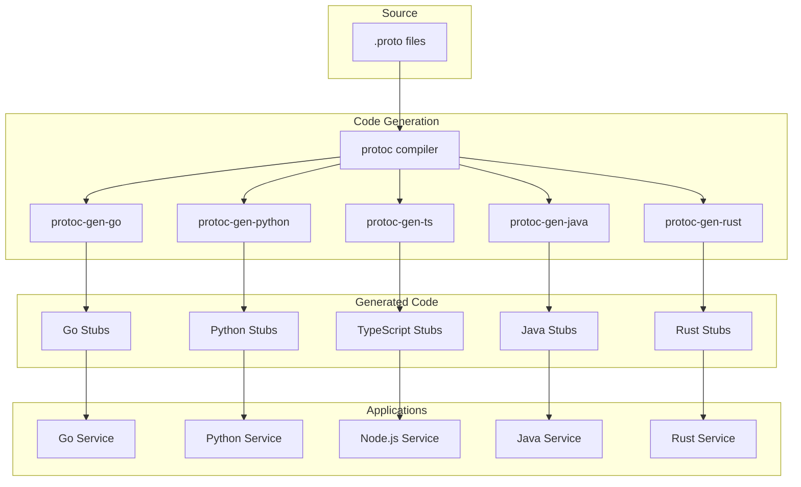
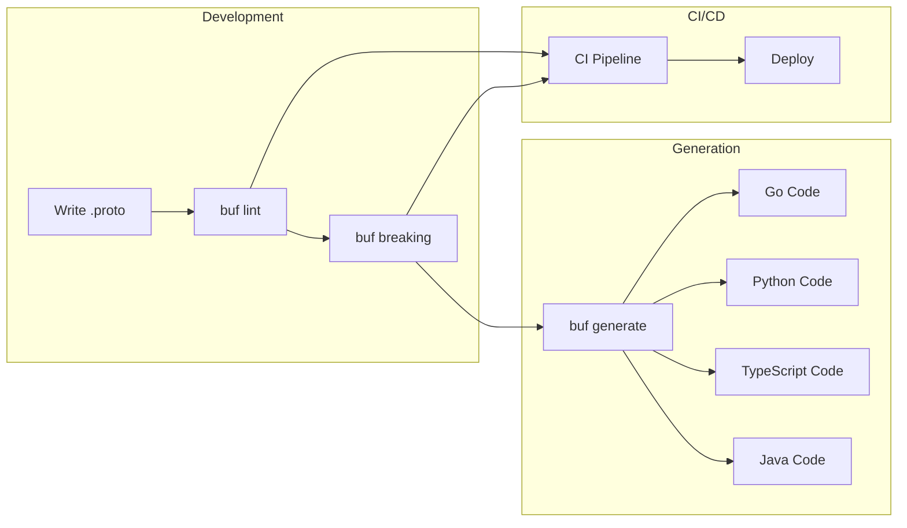

# How to Generate gRPC Code from Proto Files in Multiple Languages

Author: [nawazdhandala](https://www.github.com/nawazdhandala)

Tags: gRPC, Protocol Buffers, Code Generation, protoc, Buf, Go, Python, Node.js, Java, Rust

Description: Learn how to set up protoc and generate gRPC client/server code in Go, Python, Node.js, Java, and Rust with build automation using Buf.

---

## Introduction

One of gRPC's greatest strengths is its ability to generate client and server code in multiple programming languages from a single Protocol Buffer definition. This ensures type safety, reduces boilerplate, and keeps your API implementations consistent across different services.

In this guide, you will learn how to install and configure the Protocol Buffer compiler (protoc), set up language-specific plugins, and automate code generation with Buf.

## Architecture Overview



## Installing protoc

### macOS

```bash
# Using Homebrew
brew install protobuf

# Verify installation
protoc --version
# libprotoc 25.1
```

### Linux (Ubuntu/Debian)

```bash
# Using apt (may have older version)
sudo apt-get update
sudo apt-get install -y protobuf-compiler

# Or install latest version manually
PROTOC_VERSION=25.1
curl -LO "https://github.com/protocolbuffers/protobuf/releases/download/v${PROTOC_VERSION}/protoc-${PROTOC_VERSION}-linux-x86_64.zip"
unzip "protoc-${PROTOC_VERSION}-linux-x86_64.zip" -d $HOME/.local
export PATH="$HOME/.local/bin:$PATH"

# Add to ~/.bashrc or ~/.zshrc
echo 'export PATH="$HOME/.local/bin:$PATH"' >> ~/.bashrc
```

### Windows

```powershell
# Using Chocolatey
choco install protoc

# Or using Scoop
scoop install protobuf

# Or download from GitHub releases
# https://github.com/protocolbuffers/protobuf/releases
```

### Docker

```dockerfile
FROM golang:1.21-alpine

# Install protoc
RUN apk add --no-cache protobuf protobuf-dev

# Install Go plugins
RUN go install google.golang.org/protobuf/cmd/protoc-gen-go@latest \
    && go install google.golang.org/grpc/cmd/protoc-gen-go-grpc@latest
```

## Sample Proto File

We will use this proto file for all examples:

```protobuf
// proto/user/v1/user.proto
syntax = "proto3";

package user.v1;

import "google/protobuf/timestamp.proto";
import "google/protobuf/empty.proto";

option go_package = "github.com/example/gen/go/user/v1;userv1";
option java_package = "com.example.user.v1";
option java_multiple_files = true;

// User represents a user in the system
message User {
  string id = 1;
  string email = 2;
  string name = 3;
  UserStatus status = 4;
  google.protobuf.Timestamp created_at = 5;
  google.protobuf.Timestamp updated_at = 6;
}

enum UserStatus {
  USER_STATUS_UNSPECIFIED = 0;
  USER_STATUS_ACTIVE = 1;
  USER_STATUS_INACTIVE = 2;
  USER_STATUS_SUSPENDED = 3;
}

// UserService provides user management operations
service UserService {
  // CreateUser creates a new user
  rpc CreateUser(CreateUserRequest) returns (User);

  // GetUser retrieves a user by ID
  rpc GetUser(GetUserRequest) returns (User);

  // ListUsers returns a paginated list of users
  rpc ListUsers(ListUsersRequest) returns (ListUsersResponse);

  // UpdateUser updates an existing user
  rpc UpdateUser(UpdateUserRequest) returns (User);

  // DeleteUser removes a user
  rpc DeleteUser(DeleteUserRequest) returns (google.protobuf.Empty);

  // WatchUsers streams user updates
  rpc WatchUsers(WatchUsersRequest) returns (stream UserEvent);
}

message CreateUserRequest {
  string email = 1;
  string name = 2;
  string password = 3;
}

message GetUserRequest {
  string id = 1;
}

message ListUsersRequest {
  int32 page_size = 1;
  string page_token = 2;
  string filter = 3;
}

message ListUsersResponse {
  repeated User users = 1;
  string next_page_token = 2;
  int32 total_count = 3;
}

message UpdateUserRequest {
  string id = 1;
  string email = 2;
  string name = 3;
}

message DeleteUserRequest {
  string id = 1;
}

message WatchUsersRequest {
  repeated string user_ids = 1;
}

message UserEvent {
  enum EventType {
    EVENT_TYPE_UNSPECIFIED = 0;
    EVENT_TYPE_CREATED = 1;
    EVENT_TYPE_UPDATED = 2;
    EVENT_TYPE_DELETED = 3;
  }

  EventType type = 1;
  User user = 2;
  google.protobuf.Timestamp occurred_at = 3;
}
```

## Go Code Generation

### Install Go Plugins

```bash
# Install the protobuf and gRPC plugins for Go
go install google.golang.org/protobuf/cmd/protoc-gen-go@latest
go install google.golang.org/grpc/cmd/protoc-gen-go-grpc@latest

# Ensure $GOPATH/bin is in your PATH
export PATH="$PATH:$(go env GOPATH)/bin"
```

### Generate Go Code

```bash
# Create output directory
mkdir -p gen/go

# Generate code
protoc \
  --proto_path=proto \
  --go_out=gen/go \
  --go_opt=paths=source_relative \
  --go-grpc_out=gen/go \
  --go-grpc_opt=paths=source_relative \
  proto/user/v1/user.proto
```

### Generated Files Structure

```
gen/go/
└── user/
    └── v1/
        ├── user.pb.go          # Message types
        └── user_grpc.pb.go     # Service client/server interfaces
```

### Using Generated Go Code

```go
// server/main.go
package main

import (
    "context"
    "log"
    "net"
    "time"

    "google.golang.org/grpc"
    "google.golang.org/protobuf/types/known/emptypb"
    "google.golang.org/protobuf/types/known/timestamppb"

    userv1 "github.com/example/gen/go/user/v1"
)

type userServer struct {
    userv1.UnimplementedUserServiceServer
    users map[string]*userv1.User
}

func (s *userServer) CreateUser(ctx context.Context, req *userv1.CreateUserRequest) (*userv1.User, error) {
    user := &userv1.User{
        Id:        generateID(),
        Email:     req.GetEmail(),
        Name:      req.GetName(),
        Status:    userv1.UserStatus_USER_STATUS_ACTIVE,
        CreatedAt: timestamppb.Now(),
        UpdatedAt: timestamppb.Now(),
    }
    s.users[user.Id] = user
    return user, nil
}

func (s *userServer) GetUser(ctx context.Context, req *userv1.GetUserRequest) (*userv1.User, error) {
    user, ok := s.users[req.GetId()]
    if !ok {
        return nil, status.Errorf(codes.NotFound, "user not found: %s", req.GetId())
    }
    return user, nil
}

func (s *userServer) DeleteUser(ctx context.Context, req *userv1.DeleteUserRequest) (*emptypb.Empty, error) {
    delete(s.users, req.GetId())
    return &emptypb.Empty{}, nil
}

func main() {
    lis, err := net.Listen("tcp", ":50051")
    if err != nil {
        log.Fatalf("failed to listen: %v", err)
    }

    grpcServer := grpc.NewServer()
    userv1.RegisterUserServiceServer(grpcServer, &userServer{
        users: make(map[string]*userv1.User),
    })

    log.Println("Server listening on :50051")
    if err := grpcServer.Serve(lis); err != nil {
        log.Fatalf("failed to serve: %v", err)
    }
}
```

## Python Code Generation

### Install Python Tools

```bash
# Install grpcio-tools
pip install grpcio grpcio-tools

# Or using pipenv/poetry
pipenv install grpcio grpcio-tools
poetry add grpcio grpcio-tools
```

### Generate Python Code

```bash
# Create output directory
mkdir -p gen/python

# Generate code
python -m grpc_tools.protoc \
  --proto_path=proto \
  --python_out=gen/python \
  --pyi_out=gen/python \
  --grpc_python_out=gen/python \
  proto/user/v1/user.proto
```

### Generated Files Structure

```
gen/python/
└── user/
    └── v1/
        ├── user_pb2.py           # Message classes
        ├── user_pb2.pyi          # Type hints
        └── user_pb2_grpc.py      # Service stubs
```

### Fix Python Imports

Python's generated imports can be problematic. Create an `__init__.py` and fix imports:

```bash
# Create __init__.py files
touch gen/python/__init__.py
touch gen/python/user/__init__.py
touch gen/python/user/v1/__init__.py
```

### Using Generated Python Code

```python
# server.py
import grpc
from concurrent import futures
from datetime import datetime
import uuid

from gen.python.user.v1 import user_pb2
from gen.python.user.v1 import user_pb2_grpc
from google.protobuf.timestamp_pb2 import Timestamp
from google.protobuf.empty_pb2 import Empty


class UserServiceServicer(user_pb2_grpc.UserServiceServicer):
    def __init__(self):
        self.users = {}

    def CreateUser(self, request, context):
        user_id = str(uuid.uuid4())
        now = Timestamp()
        now.FromDatetime(datetime.utcnow())

        user = user_pb2.User(
            id=user_id,
            email=request.email,
            name=request.name,
            status=user_pb2.USER_STATUS_ACTIVE,
            created_at=now,
            updated_at=now,
        )
        self.users[user_id] = user
        return user

    def GetUser(self, request, context):
        user = self.users.get(request.id)
        if not user:
            context.abort(grpc.StatusCode.NOT_FOUND, f"User not found: {request.id}")
        return user

    def ListUsers(self, request, context):
        users_list = list(self.users.values())
        return user_pb2.ListUsersResponse(
            users=users_list,
            total_count=len(users_list),
        )

    def DeleteUser(self, request, context):
        if request.id in self.users:
            del self.users[request.id]
        return Empty()


def serve():
    server = grpc.server(futures.ThreadPoolExecutor(max_workers=10))
    user_pb2_grpc.add_UserServiceServicer_to_server(
        UserServiceServicer(), server
    )
    server.add_insecure_port('[::]:50051')
    server.start()
    print("Server started on port 50051")
    server.wait_for_termination()


if __name__ == '__main__':
    serve()
```

```python
# client.py
import grpc
from gen.python.user.v1 import user_pb2
from gen.python.user.v1 import user_pb2_grpc


def run():
    with grpc.insecure_channel('localhost:50051') as channel:
        stub = user_pb2_grpc.UserServiceStub(channel)

        # Create a user
        response = stub.CreateUser(user_pb2.CreateUserRequest(
            email="alice@example.com",
            name="Alice",
            password="secret123",
        ))
        print(f"Created user: {response.id}")

        # Get the user
        user = stub.GetUser(user_pb2.GetUserRequest(id=response.id))
        print(f"Got user: {user.name} ({user.email})")

        # List users
        users = stub.ListUsers(user_pb2.ListUsersRequest(page_size=10))
        print(f"Total users: {users.total_count}")


if __name__ == '__main__':
    run()
```

## Node.js/TypeScript Code Generation

### Install Node.js Tools

```bash
# Install required packages
npm install @grpc/grpc-js @grpc/proto-loader

# For TypeScript code generation
npm install -D grpc-tools grpc_tools_node_protoc_ts

# Or use ts-proto for better TypeScript support
npm install -D ts-proto
```

### Method 1: Using grpc-tools

```bash
# Generate JavaScript and TypeScript definitions
npx grpc_tools_node_protoc \
  --proto_path=proto \
  --js_out=import_style=commonjs,binary:gen/node \
  --grpc_out=grpc_js:gen/node \
  --plugin=protoc-gen-grpc=`which grpc_tools_node_protoc_plugin` \
  proto/user/v1/user.proto

# Generate TypeScript definitions
npx grpc_tools_node_protoc \
  --proto_path=proto \
  --ts_out=grpc_js:gen/node \
  --plugin=protoc-gen-ts=./node_modules/.bin/protoc-gen-ts \
  proto/user/v1/user.proto
```

### Method 2: Using ts-proto (Recommended for TypeScript)

```bash
# Install ts-proto
npm install -D ts-proto

# Generate TypeScript code
protoc \
  --proto_path=proto \
  --plugin=./node_modules/.bin/protoc-gen-ts_proto \
  --ts_proto_out=gen/ts \
  --ts_proto_opt=outputServices=grpc-js \
  --ts_proto_opt=esModuleInterop=true \
  --ts_proto_opt=env=node \
  proto/user/v1/user.proto
```

### Using Generated TypeScript Code (ts-proto)

```typescript
// server.ts
import * as grpc from '@grpc/grpc-js';
import { UserServiceServer, UserServiceService } from './gen/ts/user/v1/user';
import { User, UserStatus, CreateUserRequest, GetUserRequest, ListUsersRequest, ListUsersResponse, DeleteUserRequest, WatchUsersRequest, UserEvent } from './gen/ts/user/v1/user';
import { Empty } from './gen/ts/google/protobuf/empty';
import { Timestamp } from './gen/ts/google/protobuf/timestamp';
import { v4 as uuidv4 } from 'uuid';

const users = new Map<string, User>();

const userService: UserServiceServer = {
  createUser(
    call: grpc.ServerUnaryCall<CreateUserRequest, User>,
    callback: grpc.sendUnaryData<User>
  ): void {
    const now = Timestamp.fromPartial({ seconds: BigInt(Date.now() / 1000) });
    const user: User = {
      id: uuidv4(),
      email: call.request.email,
      name: call.request.name,
      status: UserStatus.USER_STATUS_ACTIVE,
      createdAt: now,
      updatedAt: now,
    };
    users.set(user.id, user);
    callback(null, user);
  },

  getUser(
    call: grpc.ServerUnaryCall<GetUserRequest, User>,
    callback: grpc.sendUnaryData<User>
  ): void {
    const user = users.get(call.request.id);
    if (!user) {
      callback({
        code: grpc.status.NOT_FOUND,
        message: `User not found: ${call.request.id}`,
      });
      return;
    }
    callback(null, user);
  },

  listUsers(
    call: grpc.ServerUnaryCall<ListUsersRequest, ListUsersResponse>,
    callback: grpc.sendUnaryData<ListUsersResponse>
  ): void {
    const userList = Array.from(users.values());
    callback(null, {
      users: userList,
      nextPageToken: '',
      totalCount: userList.length,
    });
  },

  updateUser(call, callback): void {
    const user = users.get(call.request.id);
    if (!user) {
      callback({ code: grpc.status.NOT_FOUND, message: 'User not found' });
      return;
    }
    user.email = call.request.email || user.email;
    user.name = call.request.name || user.name;
    user.updatedAt = Timestamp.fromPartial({ seconds: BigInt(Date.now() / 1000) });
    callback(null, user);
  },

  deleteUser(
    call: grpc.ServerUnaryCall<DeleteUserRequest, Empty>,
    callback: grpc.sendUnaryData<Empty>
  ): void {
    users.delete(call.request.id);
    callback(null, {});
  },

  watchUsers(call: grpc.ServerWritableStream<WatchUsersRequest, UserEvent>): void {
    // Implement streaming logic
    call.end();
  },
};

function main(): void {
  const server = new grpc.Server();
  server.addService(UserServiceService, userService);
  server.bindAsync(
    '0.0.0.0:50051',
    grpc.ServerCredentials.createInsecure(),
    (err, port) => {
      if (err) {
        console.error(err);
        return;
      }
      console.log(`Server running on port ${port}`);
    }
  );
}

main();
```

```typescript
// client.ts
import * as grpc from '@grpc/grpc-js';
import { UserServiceClient } from './gen/ts/user/v1/user';

async function main(): Promise<void> {
  const client = new UserServiceClient(
    'localhost:50051',
    grpc.credentials.createInsecure()
  );

  // Create user
  const createResponse = await new Promise<User>((resolve, reject) => {
    client.createUser(
      { email: 'bob@example.com', name: 'Bob', password: 'secret' },
      (err, response) => {
        if (err) reject(err);
        else resolve(response!);
      }
    );
  });
  console.log('Created user:', createResponse.id);

  // Get user
  const user = await new Promise<User>((resolve, reject) => {
    client.getUser({ id: createResponse.id }, (err, response) => {
      if (err) reject(err);
      else resolve(response!);
    });
  });
  console.log('Got user:', user.name);

  client.close();
}

main().catch(console.error);
```

## Java Code Generation

### Using Maven

Add to `pom.xml`:

```xml
<dependencies>
    <dependency>
        <groupId>io.grpc</groupId>
        <artifactId>grpc-netty-shaded</artifactId>
        <version>1.60.0</version>
    </dependency>
    <dependency>
        <groupId>io.grpc</groupId>
        <artifactId>grpc-protobuf</artifactId>
        <version>1.60.0</version>
    </dependency>
    <dependency>
        <groupId>io.grpc</groupId>
        <artifactId>grpc-stub</artifactId>
        <version>1.60.0</version>
    </dependency>
    <dependency>
        <groupId>javax.annotation</groupId>
        <artifactId>javax.annotation-api</artifactId>
        <version>1.3.2</version>
    </dependency>
</dependencies>

<build>
    <extensions>
        <extension>
            <groupId>kr.motd.maven</groupId>
            <artifactId>os-maven-plugin</artifactId>
            <version>1.7.1</version>
        </extension>
    </extensions>
    <plugins>
        <plugin>
            <groupId>org.xolstice.maven.plugins</groupId>
            <artifactId>protobuf-maven-plugin</artifactId>
            <version>0.6.1</version>
            <configuration>
                <protocArtifact>com.google.protobuf:protoc:3.25.1:exe:${os.detected.classifier}</protocArtifact>
                <pluginId>grpc-java</pluginId>
                <pluginArtifact>io.grpc:protoc-gen-grpc-java:1.60.0:exe:${os.detected.classifier}</pluginArtifact>
                <protoSourceRoot>${project.basedir}/proto</protoSourceRoot>
            </configuration>
            <executions>
                <execution>
                    <goals>
                        <goal>compile</goal>
                        <goal>compile-custom</goal>
                    </goals>
                </execution>
            </executions>
        </plugin>
    </plugins>
</build>
```

Generate code:

```bash
mvn compile
```

### Using Gradle

Add to `build.gradle`:

```groovy
plugins {
    id 'java'
    id 'com.google.protobuf' version '0.9.4'
}

repositories {
    mavenCentral()
}

dependencies {
    implementation 'io.grpc:grpc-netty-shaded:1.60.0'
    implementation 'io.grpc:grpc-protobuf:1.60.0'
    implementation 'io.grpc:grpc-stub:1.60.0'
    compileOnly 'javax.annotation:javax.annotation-api:1.3.2'
}

protobuf {
    protoc {
        artifact = 'com.google.protobuf:protoc:3.25.1'
    }
    plugins {
        grpc {
            artifact = 'io.grpc:protoc-gen-grpc-java:1.60.0'
        }
    }
    generateProtoTasks {
        all()*.plugins {
            grpc {}
        }
    }
}

sourceSets {
    main {
        proto {
            srcDir 'proto'
        }
    }
}
```

Generate code:

```bash
gradle generateProto
```

### Using Generated Java Code

```java
// UserServer.java
package com.example.user;

import io.grpc.Server;
import io.grpc.ServerBuilder;
import io.grpc.stub.StreamObserver;
import com.example.user.v1.*;
import com.google.protobuf.Empty;
import com.google.protobuf.Timestamp;

import java.io.IOException;
import java.time.Instant;
import java.util.Map;
import java.util.UUID;
import java.util.concurrent.ConcurrentHashMap;

public class UserServer {
    private final int port;
    private final Server server;

    public UserServer(int port) {
        this.port = port;
        this.server = ServerBuilder.forPort(port)
            .addService(new UserServiceImpl())
            .build();
    }

    public void start() throws IOException {
        server.start();
        System.out.println("Server started on port " + port);
        Runtime.getRuntime().addShutdownHook(new Thread(UserServer.this::stop));
    }

    public void stop() {
        if (server != null) {
            server.shutdown();
        }
    }

    public void blockUntilShutdown() throws InterruptedException {
        if (server != null) {
            server.awaitTermination();
        }
    }

    public static void main(String[] args) throws Exception {
        UserServer server = new UserServer(50051);
        server.start();
        server.blockUntilShutdown();
    }

    private static class UserServiceImpl extends UserServiceGrpc.UserServiceImplBase {
        private final Map<String, User> users = new ConcurrentHashMap<>();

        @Override
        public void createUser(CreateUserRequest request, StreamObserver<User> responseObserver) {
            Instant now = Instant.now();
            Timestamp timestamp = Timestamp.newBuilder()
                .setSeconds(now.getEpochSecond())
                .setNanos(now.getNano())
                .build();

            User user = User.newBuilder()
                .setId(UUID.randomUUID().toString())
                .setEmail(request.getEmail())
                .setName(request.getName())
                .setStatus(UserStatus.USER_STATUS_ACTIVE)
                .setCreatedAt(timestamp)
                .setUpdatedAt(timestamp)
                .build();

            users.put(user.getId(), user);
            responseObserver.onNext(user);
            responseObserver.onCompleted();
        }

        @Override
        public void getUser(GetUserRequest request, StreamObserver<User> responseObserver) {
            User user = users.get(request.getId());
            if (user == null) {
                responseObserver.onError(
                    io.grpc.Status.NOT_FOUND
                        .withDescription("User not found: " + request.getId())
                        .asRuntimeException()
                );
                return;
            }
            responseObserver.onNext(user);
            responseObserver.onCompleted();
        }

        @Override
        public void listUsers(ListUsersRequest request, StreamObserver<ListUsersResponse> responseObserver) {
            ListUsersResponse response = ListUsersResponse.newBuilder()
                .addAllUsers(users.values())
                .setTotalCount(users.size())
                .build();
            responseObserver.onNext(response);
            responseObserver.onCompleted();
        }

        @Override
        public void deleteUser(DeleteUserRequest request, StreamObserver<Empty> responseObserver) {
            users.remove(request.getId());
            responseObserver.onNext(Empty.getDefaultInstance());
            responseObserver.onCompleted();
        }
    }
}
```

## Rust Code Generation

### Using tonic

Add to `Cargo.toml`:

```toml
[package]
name = "user-service"
version = "0.1.0"
edition = "2021"

[dependencies]
tonic = "0.10"
prost = "0.12"
prost-types = "0.12"
tokio = { version = "1", features = ["full"] }

[build-dependencies]
tonic-build = "0.10"
```

Create `build.rs`:

```rust
fn main() -> Result<(), Box<dyn std::error::Error>> {
    tonic_build::configure()
        .build_server(true)
        .build_client(true)
        .out_dir("src/gen")
        .compile(
            &["proto/user/v1/user.proto"],
            &["proto"],
        )?;
    Ok(())
}
```

### Using Generated Rust Code

```rust
// src/main.rs
use tonic::{transport::Server, Request, Response, Status};
use std::collections::HashMap;
use std::sync::Arc;
use tokio::sync::RwLock;
use uuid::Uuid;

mod gen {
    include!("gen/user.v1.rs");
}

use gen::{
    user_service_server::{UserService, UserServiceServer},
    CreateUserRequest, DeleteUserRequest, GetUserRequest,
    ListUsersRequest, ListUsersResponse, UpdateUserRequest,
    User, UserStatus, WatchUsersRequest, UserEvent,
};

#[derive(Debug, Default)]
pub struct UserServiceImpl {
    users: Arc<RwLock<HashMap<String, User>>>,
}

#[tonic::async_trait]
impl UserService for UserServiceImpl {
    async fn create_user(
        &self,
        request: Request<CreateUserRequest>,
    ) -> Result<Response<User>, Status> {
        let req = request.into_inner();
        let now = prost_types::Timestamp {
            seconds: chrono::Utc::now().timestamp(),
            nanos: 0,
        };

        let user = User {
            id: Uuid::new_v4().to_string(),
            email: req.email,
            name: req.name,
            status: UserStatus::Active as i32,
            created_at: Some(now.clone()),
            updated_at: Some(now),
        };

        let mut users = self.users.write().await;
        users.insert(user.id.clone(), user.clone());

        Ok(Response::new(user))
    }

    async fn get_user(
        &self,
        request: Request<GetUserRequest>,
    ) -> Result<Response<User>, Status> {
        let id = request.into_inner().id;
        let users = self.users.read().await;

        match users.get(&id) {
            Some(user) => Ok(Response::new(user.clone())),
            None => Err(Status::not_found(format!("User not found: {}", id))),
        }
    }

    async fn list_users(
        &self,
        _request: Request<ListUsersRequest>,
    ) -> Result<Response<ListUsersResponse>, Status> {
        let users = self.users.read().await;
        let user_list: Vec<User> = users.values().cloned().collect();
        let total = user_list.len() as i32;

        Ok(Response::new(ListUsersResponse {
            users: user_list,
            next_page_token: String::new(),
            total_count: total,
        }))
    }

    async fn update_user(
        &self,
        request: Request<UpdateUserRequest>,
    ) -> Result<Response<User>, Status> {
        let req = request.into_inner();
        let mut users = self.users.write().await;

        match users.get_mut(&req.id) {
            Some(user) => {
                if !req.email.is_empty() {
                    user.email = req.email;
                }
                if !req.name.is_empty() {
                    user.name = req.name;
                }
                user.updated_at = Some(prost_types::Timestamp {
                    seconds: chrono::Utc::now().timestamp(),
                    nanos: 0,
                });
                Ok(Response::new(user.clone()))
            }
            None => Err(Status::not_found(format!("User not found: {}", req.id))),
        }
    }

    async fn delete_user(
        &self,
        request: Request<DeleteUserRequest>,
    ) -> Result<Response<()>, Status> {
        let id = request.into_inner().id;
        let mut users = self.users.write().await;
        users.remove(&id);
        Ok(Response::new(()))
    }

    type WatchUsersStream = tokio_stream::wrappers::ReceiverStream<Result<UserEvent, Status>>;

    async fn watch_users(
        &self,
        _request: Request<WatchUsersRequest>,
    ) -> Result<Response<Self::WatchUsersStream>, Status> {
        let (tx, rx) = tokio::sync::mpsc::channel(100);
        // Implement streaming logic here
        Ok(Response::new(tokio_stream::wrappers::ReceiverStream::new(rx)))
    }
}

#[tokio::main]
async fn main() -> Result<(), Box<dyn std::error::Error>> {
    let addr = "[::1]:50051".parse()?;
    let service = UserServiceImpl::default();

    println!("Server listening on {}", addr);

    Server::builder()
        .add_service(UserServiceServer::new(service))
        .serve(addr)
        .await?;

    Ok(())
}
```

## Build Automation with Buf

Buf is a modern tool for working with Protocol Buffers that simplifies code generation and provides linting, breaking change detection, and more.

### Install Buf

```bash
# macOS
brew install bufbuild/buf/buf

# Linux
curl -sSL https://github.com/bufbuild/buf/releases/latest/download/buf-Linux-x86_64 \
  -o /usr/local/bin/buf && chmod +x /usr/local/bin/buf

# Go
go install github.com/bufbuild/buf/cmd/buf@latest
```

### Configure Buf

Create `buf.yaml` in your project root:

```yaml
# buf.yaml
version: v2
modules:
  - path: proto
lint:
  use:
    - DEFAULT
  except:
    - FIELD_LOWER_SNAKE_CASE
breaking:
  use:
    - FILE
deps:
  - buf.build/googleapis/googleapis
```

Create `buf.gen.yaml` for code generation:

```yaml
# buf.gen.yaml
version: v2
managed:
  enabled: true
  override:
    - file_option: go_package_prefix
      value: github.com/example/gen/go
plugins:
  # Go
  - remote: buf.build/protocolbuffers/go
    out: gen/go
    opt:
      - paths=source_relative
  - remote: buf.build/grpc/go
    out: gen/go
    opt:
      - paths=source_relative

  # Python
  - remote: buf.build/protocolbuffers/python
    out: gen/python
  - remote: buf.build/grpc/python
    out: gen/python

  # TypeScript (using ts-proto)
  - remote: buf.build/community/timostamm-protobuf-ts
    out: gen/ts
    opt:
      - long_type_string
      - output_javascript

  # Java
  - remote: buf.build/protocolbuffers/java
    out: gen/java
  - remote: buf.build/grpc/java
    out: gen/java
```

### Generate Code with Buf

```bash
# Lint proto files
buf lint

# Check for breaking changes
buf breaking --against '.git#branch=main'

# Generate code for all configured languages
buf generate

# Generate code for specific path
buf generate --path proto/user/v1/user.proto
```

### Buf Workflow



### Using Buf Schema Registry

```yaml
# buf.yaml with BSR dependencies
version: v2
modules:
  - path: proto
deps:
  - buf.build/googleapis/googleapis
  - buf.build/grpc-ecosystem/grpc-gateway
```

```bash
# Push to Buf Schema Registry
buf push

# Pull dependencies
buf dep update
```

## Makefile for Multi-Language Generation

```makefile
# Makefile
PROTO_DIR := proto
GEN_DIR := gen

.PHONY: all clean generate lint go python typescript java rust

all: generate

clean:
	rm -rf $(GEN_DIR)

lint:
	buf lint

generate: go python typescript java

go:
	@mkdir -p $(GEN_DIR)/go
	protoc \
		--proto_path=$(PROTO_DIR) \
		--go_out=$(GEN_DIR)/go \
		--go_opt=paths=source_relative \
		--go-grpc_out=$(GEN_DIR)/go \
		--go-grpc_opt=paths=source_relative \
		$(shell find $(PROTO_DIR) -name '*.proto')

python:
	@mkdir -p $(GEN_DIR)/python
	python -m grpc_tools.protoc \
		--proto_path=$(PROTO_DIR) \
		--python_out=$(GEN_DIR)/python \
		--pyi_out=$(GEN_DIR)/python \
		--grpc_python_out=$(GEN_DIR)/python \
		$(shell find $(PROTO_DIR) -name '*.proto')
	@find $(GEN_DIR)/python -type d -exec touch {}/__init__.py \;

typescript:
	@mkdir -p $(GEN_DIR)/ts
	protoc \
		--proto_path=$(PROTO_DIR) \
		--plugin=./node_modules/.bin/protoc-gen-ts_proto \
		--ts_proto_out=$(GEN_DIR)/ts \
		--ts_proto_opt=outputServices=grpc-js \
		--ts_proto_opt=esModuleInterop=true \
		$(shell find $(PROTO_DIR) -name '*.proto')

java:
	@mkdir -p $(GEN_DIR)/java
	protoc \
		--proto_path=$(PROTO_DIR) \
		--java_out=$(GEN_DIR)/java \
		--grpc-java_out=$(GEN_DIR)/java \
		--plugin=protoc-gen-grpc-java=$(shell which protoc-gen-grpc-java) \
		$(shell find $(PROTO_DIR) -name '*.proto')

rust:
	cargo build

# Using Buf (recommended)
buf-generate:
	buf generate

buf-lint:
	buf lint

buf-breaking:
	buf breaking --against '.git#branch=main'
```

## Conclusion

Code generation is a fundamental part of the gRPC workflow. By using protoc directly or through build tools like Buf, you can maintain consistent API implementations across multiple programming languages while benefiting from:

- Type-safe clients and servers
- Automatic serialization/deserialization
- IDE support with generated types
- Reduced boilerplate code

Key takeaways:

1. Install protoc and language-specific plugins for each target language
2. Use consistent project structure for proto files
3. Automate generation with Makefiles or Buf
4. Consider Buf for linting, breaking change detection, and simplified configuration
5. Store generated code in version control or regenerate as part of CI/CD

With proper code generation setup, your team can focus on implementing business logic rather than writing repetitive API boilerplate.
