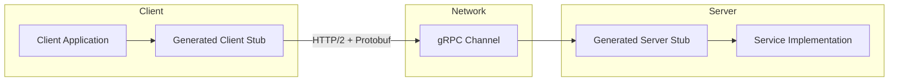
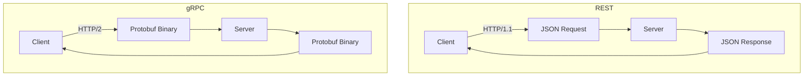
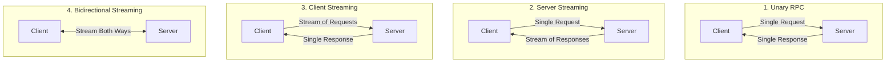
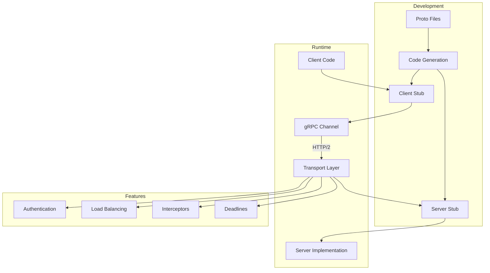

# How to Get Started with gRPC: A Complete Beginner's Guide

Author: [nawazdhandala](https://www.github.com/nawazdhandala)

Tags: gRPC, API, Protocol Buffers, Microservices, RPC, Tutorial, Beginner

Description: A comprehensive introduction to gRPC covering core concepts, comparison with REST, and building your first gRPC service from scratch.

---

## Introduction

gRPC (gRPC Remote Procedure Calls) is a modern, high-performance RPC framework developed by Google. It enables efficient communication between services and has become the de facto standard for microservices communication in cloud-native applications.

In this guide, you will learn what gRPC is, why it matters, and how to build your first gRPC service step by step.

## What is gRPC?

gRPC is an open-source remote procedure call framework that allows a client application to directly call methods on a server application on a different machine as if it were a local object. It uses HTTP/2 for transport, Protocol Buffers as its interface definition language, and provides features such as authentication, bidirectional streaming, and flow control.



## Why Use gRPC?

### Key Benefits

1. **High Performance**: Binary serialization with Protocol Buffers is significantly faster than JSON
2. **Strong Typing**: Contract-first API development with automatic code generation
3. **HTTP/2 Support**: Multiplexing, header compression, and bidirectional streaming out of the box
4. **Language Agnostic**: Generate client and server code in 10+ programming languages
5. **Built-in Features**: Deadlines, cancellation, load balancing, and authentication

### Performance Comparison

| Aspect | gRPC | REST/JSON |
|--------|------|-----------|
| Serialization | Binary (Protobuf) | Text (JSON) |
| Transport | HTTP/2 | HTTP/1.1 or HTTP/2 |
| Payload Size | Smaller (~30-50%) | Larger |
| Latency | Lower | Higher |
| Streaming | Native support | Requires WebSockets |

## gRPC vs REST: Understanding the Differences



### When to Choose gRPC

- Microservices communication
- Low-latency, high-throughput systems
- Polyglot environments
- Real-time streaming applications
- Mobile applications with bandwidth constraints

### When to Stick with REST

- Public-facing APIs
- Browser-based clients (without gRPC-Web)
- Simple CRUD operations
- When human readability is important
- Teams unfamiliar with gRPC

## Core Concepts

### Protocol Buffers (Protobuf)

Protocol Buffers is a language-neutral, platform-neutral mechanism for serializing structured data. It serves as both the interface definition language and the message interchange format for gRPC.

```protobuf
// user.proto
syntax = "proto3";

package user;

// Message definition
message User {
  int32 id = 1;
  string name = 2;
  string email = 3;
  repeated string roles = 4;
}
```

### Services and Methods

A gRPC service defines the methods that can be called remotely along with their parameters and return types.

```protobuf
// user_service.proto
syntax = "proto3";

package user;

service UserService {
  // Unary RPC
  rpc GetUser(GetUserRequest) returns (GetUserResponse);

  // Server streaming RPC
  rpc ListUsers(ListUsersRequest) returns (stream User);

  // Client streaming RPC
  rpc CreateUsers(stream User) returns (CreateUsersResponse);

  // Bidirectional streaming RPC
  rpc Chat(stream ChatMessage) returns (stream ChatMessage);
}
```

### Four Types of gRPC Communication



## Building Your First gRPC Service

Let's build a simple greeting service to understand the complete workflow.

### Step 1: Define the Proto File

Create a file named `greeter.proto`:

```protobuf
syntax = "proto3";

package greeter;

option go_package = "github.com/example/greeter";

// The greeting service definition
service Greeter {
  // Sends a greeting
  rpc SayHello (HelloRequest) returns (HelloReply) {}

  // Server streaming - sends multiple greetings
  rpc SayHelloStream (HelloRequest) returns (stream HelloReply) {}
}

// The request message containing the user's name
message HelloRequest {
  string name = 1;
  int32 greeting_count = 2;  // Number of greetings for streaming
}

// The response message containing the greeting
message HelloReply {
  string message = 1;
  string timestamp = 2;
}
```

### Step 2: Generate Code (Go Example)

First, install the required tools:

```bash
# Install protoc compiler
# macOS
brew install protobuf

# Linux
apt-get install -y protobuf-compiler

# Install Go plugins
go install google.golang.org/protobuf/cmd/protoc-gen-go@latest
go install google.golang.org/grpc/cmd/protoc-gen-go-grpc@latest
```

Generate the Go code:

```bash
protoc --go_out=. --go_opt=paths=source_relative \
       --go-grpc_out=. --go-grpc_opt=paths=source_relative \
       greeter.proto
```

### Step 3: Implement the Server

```go
// server/main.go
package main

import (
    "context"
    "fmt"
    "log"
    "net"
    "time"

    "google.golang.org/grpc"
    pb "github.com/example/greeter"
)

type server struct {
    pb.UnimplementedGreeterServer
}

// Unary RPC implementation
func (s *server) SayHello(ctx context.Context, req *pb.HelloRequest) (*pb.HelloReply, error) {
    log.Printf("Received request from: %s", req.GetName())

    return &pb.HelloReply{
        Message:   fmt.Sprintf("Hello, %s!", req.GetName()),
        Timestamp: time.Now().Format(time.RFC3339),
    }, nil
}

// Server streaming RPC implementation
func (s *server) SayHelloStream(req *pb.HelloRequest, stream pb.Greeter_SayHelloStreamServer) error {
    log.Printf("Streaming %d greetings to: %s", req.GetGreetingCount(), req.GetName())

    count := req.GetGreetingCount()
    if count == 0 {
        count = 5 // Default to 5 greetings
    }

    for i := int32(0); i < count; i++ {
        reply := &pb.HelloReply{
            Message:   fmt.Sprintf("Hello #%d, %s!", i+1, req.GetName()),
            Timestamp: time.Now().Format(time.RFC3339),
        }

        if err := stream.Send(reply); err != nil {
            return err
        }

        time.Sleep(500 * time.Millisecond) // Simulate work
    }

    return nil
}

func main() {
    // Create a TCP listener
    lis, err := net.Listen("tcp", ":50051")
    if err != nil {
        log.Fatalf("Failed to listen: %v", err)
    }

    // Create a gRPC server
    grpcServer := grpc.NewServer()

    // Register our service
    pb.RegisterGreeterServer(grpcServer, &server{})

    log.Println("gRPC server listening on :50051")

    // Start serving
    if err := grpcServer.Serve(lis); err != nil {
        log.Fatalf("Failed to serve: %v", err)
    }
}
```

### Step 4: Implement the Client

```go
// client/main.go
package main

import (
    "context"
    "io"
    "log"
    "time"

    "google.golang.org/grpc"
    "google.golang.org/grpc/credentials/insecure"
    pb "github.com/example/greeter"
)

func main() {
    // Connect to the server
    conn, err := grpc.Dial(
        "localhost:50051",
        grpc.WithTransportCredentials(insecure.NewCredentials()),
    )
    if err != nil {
        log.Fatalf("Failed to connect: %v", err)
    }
    defer conn.Close()

    // Create a client
    client := pb.NewGreeterClient(conn)

    // Call unary RPC
    callUnaryRPC(client)

    // Call streaming RPC
    callStreamingRPC(client)
}

func callUnaryRPC(client pb.GreeterClient) {
    ctx, cancel := context.WithTimeout(context.Background(), time.Second)
    defer cancel()

    resp, err := client.SayHello(ctx, &pb.HelloRequest{Name: "World"})
    if err != nil {
        log.Fatalf("SayHello failed: %v", err)
    }

    log.Printf("Unary Response: %s (at %s)", resp.GetMessage(), resp.GetTimestamp())
}

func callStreamingRPC(client pb.GreeterClient) {
    ctx, cancel := context.WithTimeout(context.Background(), 10*time.Second)
    defer cancel()

    stream, err := client.SayHelloStream(ctx, &pb.HelloRequest{
        Name:          "Stream User",
        GreetingCount: 3,
    })
    if err != nil {
        log.Fatalf("SayHelloStream failed: %v", err)
    }

    log.Println("Receiving stream responses:")
    for {
        resp, err := stream.Recv()
        if err == io.EOF {
            break
        }
        if err != nil {
            log.Fatalf("Stream receive error: %v", err)
        }
        log.Printf("  - %s (at %s)", resp.GetMessage(), resp.GetTimestamp())
    }
}
```

### Step 5: Run the Application

```bash
# Terminal 1: Start the server
go run server/main.go

# Terminal 2: Run the client
go run client/main.go
```

Expected output:

```
# Server output
2024/01/15 10:00:00 gRPC server listening on :50051
2024/01/15 10:00:05 Received request from: World
2024/01/15 10:00:05 Streaming 3 greetings to: Stream User

# Client output
2024/01/15 10:00:05 Unary Response: Hello, World! (at 2024-01-15T10:00:05Z)
2024/01/15 10:00:05 Receiving stream responses:
2024/01/15 10:00:05   - Hello #1, Stream User! (at 2024-01-15T10:00:05Z)
2024/01/15 10:00:06   - Hello #2, Stream User! (at 2024-01-15T10:00:06Z)
2024/01/15 10:00:06   - Hello #3, Stream User! (at 2024-01-15T10:00:06Z)
```

## Project Structure Best Practices

```
myproject/
├── proto/
│   ├── greeter/
│   │   └── greeter.proto
│   └── user/
│       └── user.proto
├── gen/
│   ├── go/
│   │   ├── greeter/
│   │   └── user/
│   └── python/
│       ├── greeter/
│       └── user/
├── server/
│   └── main.go
├── client/
│   └── main.go
├── buf.yaml
└── buf.gen.yaml
```

## gRPC Architecture Overview



## Common gRPC Tools

### grpcurl - Command-line gRPC Client

```bash
# Install grpcurl
brew install grpcurl  # macOS
go install github.com/fullstorydev/grpcurl/cmd/grpcurl@latest  # Go

# List services (requires reflection enabled on server)
grpcurl -plaintext localhost:50051 list

# Describe a service
grpcurl -plaintext localhost:50051 describe greeter.Greeter

# Call a method
grpcurl -plaintext -d '{"name": "World"}' \
    localhost:50051 greeter.Greeter/SayHello
```

### Enable Server Reflection

```go
import "google.golang.org/grpc/reflection"

func main() {
    grpcServer := grpc.NewServer()
    pb.RegisterGreeterServer(grpcServer, &server{})

    // Enable reflection for debugging tools
    reflection.Register(grpcServer)

    // ... rest of server setup
}
```

## Error Handling in gRPC

gRPC uses status codes similar to HTTP but more specific to RPC scenarios:

```go
import (
    "google.golang.org/grpc/codes"
    "google.golang.org/grpc/status"
)

func (s *server) SayHello(ctx context.Context, req *pb.HelloRequest) (*pb.HelloReply, error) {
    if req.GetName() == "" {
        return nil, status.Errorf(codes.InvalidArgument, "name cannot be empty")
    }

    // Check if user exists
    user, err := s.db.FindUser(req.GetName())
    if err != nil {
        return nil, status.Errorf(codes.Internal, "database error: %v", err)
    }
    if user == nil {
        return nil, status.Errorf(codes.NotFound, "user %s not found", req.GetName())
    }

    return &pb.HelloReply{Message: fmt.Sprintf("Hello, %s!", user.Name)}, nil
}
```

### Common gRPC Status Codes

| Code | Name | Description |
|------|------|-------------|
| 0 | OK | Success |
| 1 | CANCELLED | Operation cancelled |
| 2 | UNKNOWN | Unknown error |
| 3 | INVALID_ARGUMENT | Invalid request parameters |
| 4 | DEADLINE_EXCEEDED | Timeout |
| 5 | NOT_FOUND | Resource not found |
| 7 | PERMISSION_DENIED | Not authorized |
| 13 | INTERNAL | Internal server error |
| 14 | UNAVAILABLE | Service unavailable |

## Next Steps

Now that you understand the basics of gRPC, here are recommended topics to explore:

1. **Protocol Buffers Deep Dive**: Learn advanced message definitions, nested types, and best practices
2. **Code Generation**: Set up automated code generation for multiple languages
3. **Authentication**: Implement TLS/SSL and token-based authentication
4. **Interceptors**: Add logging, metrics, and tracing to your services
5. **Load Balancing**: Configure client-side and server-side load balancing
6. **Error Handling**: Implement rich error details and retry policies

## Conclusion

gRPC provides a powerful, efficient, and type-safe way to build distributed systems. Its combination of Protocol Buffers, HTTP/2, and excellent tooling makes it ideal for microservices communication. While it has a steeper learning curve than REST, the performance benefits and developer experience improvements are well worth the investment.

Start with simple unary RPCs, then gradually explore streaming patterns as your application requirements evolve. The strong typing and code generation will catch many errors at compile time, leading to more robust systems.
