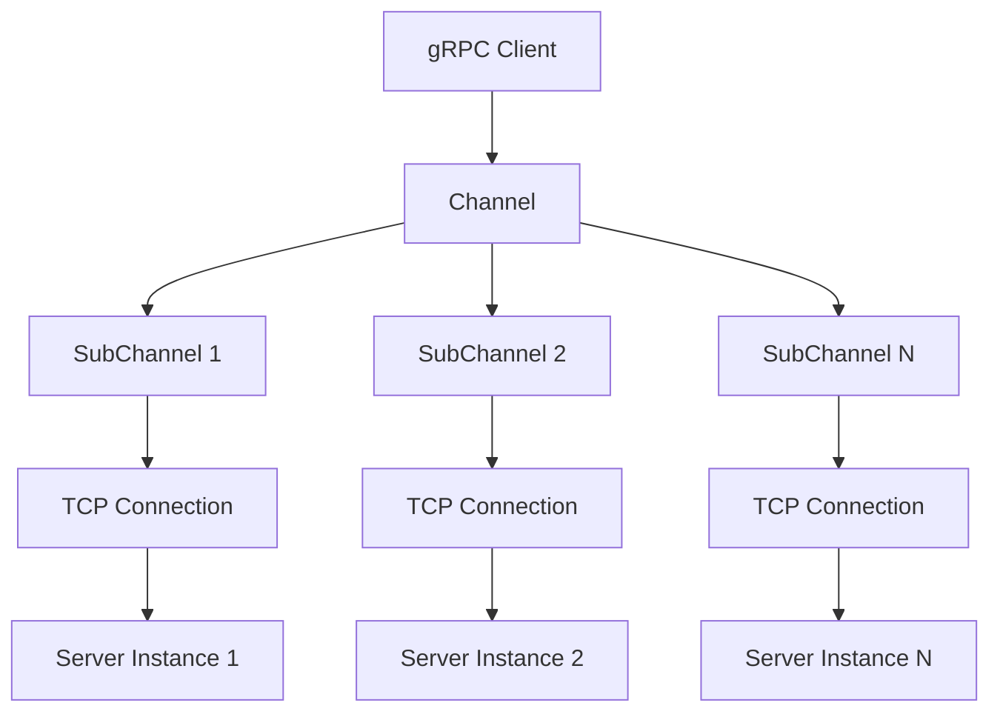
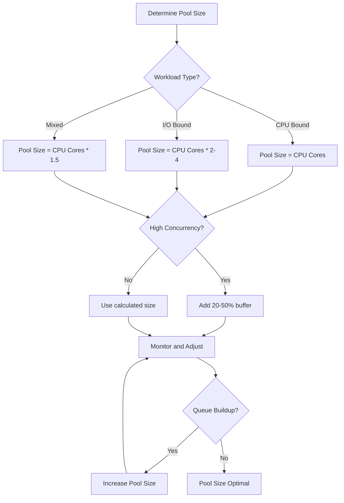

# How to Optimize gRPC Performance with Connection Pooling

Author: [nawazdhandala](https://www.github.com/nawazdhandala)

Tags: gRPC, performance, connection pooling, optimization, microservices, Go, Python, Java

Description: Learn how to implement connection pooling in gRPC to maximize throughput, reduce latency, and efficiently manage resources in distributed systems.

---

## Introduction

Connection pooling is a critical optimization technique for gRPC applications that need to handle high throughput while maintaining low latency. Unlike REST APIs that typically use short-lived HTTP connections, gRPC leverages HTTP/2's multiplexing capabilities, but proper channel management is still essential for optimal performance.

In this guide, you'll learn how to implement effective connection pooling strategies, manage channel lifecycles, and optimize your gRPC infrastructure for production workloads.

## Understanding gRPC Channels and Connections

Before diving into pooling strategies, it's important to understand how gRPC handles connections.



### Key Concepts

- **Channel**: A virtual connection to a gRPC endpoint that manages one or more subchannels
- **SubChannel**: Represents a single TCP connection to a backend server
- **Stream**: An individual RPC call multiplexed over a subchannel

## Basic Connection Pool Implementation in Go

Here's a production-ready connection pool implementation in Go:

```go
package grpcpool

import (
    "context"
    "sync"
    "sync/atomic"
    "time"

    "google.golang.org/grpc"
    "google.golang.org/grpc/connectivity"
    "google.golang.org/grpc/credentials/insecure"
    "google.golang.org/grpc/keepalive"
)

// Pool manages a pool of gRPC client connections
type Pool struct {
    connections []*grpc.ClientConn
    size        int
    target      string
    opts        []grpc.DialOption
    mu          sync.RWMutex
    counter     uint64
    healthCheck time.Duration
    stopHealth  chan struct{}
}

// PoolConfig holds configuration for the connection pool
type PoolConfig struct {
    Target          string
    Size            int
    HealthCheckInterval time.Duration
    DialTimeout     time.Duration
    MaxRetries      int
}

// NewPool creates a new connection pool
func NewPool(config PoolConfig) (*Pool, error) {
    if config.Size <= 0 {
        config.Size = 5 // Default pool size
    }
    if config.HealthCheckInterval <= 0 {
        config.HealthCheckInterval = 30 * time.Second
    }
    if config.DialTimeout <= 0 {
        config.DialTimeout = 10 * time.Second
    }

    opts := []grpc.DialOption{
        grpc.WithTransportCredentials(insecure.NewCredentials()),
        grpc.WithKeepaliveParams(keepalive.ClientParameters{
            Time:                10 * time.Second,
            Timeout:             3 * time.Second,
            PermitWithoutStream: true,
        }),
        grpc.WithDefaultServiceConfig(`{
            "loadBalancingPolicy": "round_robin",
            "healthCheckConfig": {
                "serviceName": ""
            }
        }`),
    }

    pool := &Pool{
        connections: make([]*grpc.ClientConn, config.Size),
        size:        config.Size,
        target:      config.Target,
        opts:        opts,
        healthCheck: config.HealthCheckInterval,
        stopHealth:  make(chan struct{}),
    }

    // Initialize connections
    for i := 0; i < config.Size; i++ {
        ctx, cancel := context.WithTimeout(context.Background(), config.DialTimeout)
        conn, err := grpc.DialContext(ctx, config.Target, opts...)
        cancel()
        if err != nil {
            pool.Close()
            return nil, err
        }
        pool.connections[i] = conn
    }

    // Start health check goroutine
    go pool.healthChecker()

    return pool, nil
}

// Get returns a connection from the pool using round-robin
func (p *Pool) Get() *grpc.ClientConn {
    idx := atomic.AddUint64(&p.counter, 1) % uint64(p.size)
    p.mu.RLock()
    conn := p.connections[idx]
    p.mu.RUnlock()
    return conn
}

// GetHealthy returns a healthy connection from the pool
func (p *Pool) GetHealthy(ctx context.Context) (*grpc.ClientConn, error) {
    p.mu.RLock()
    defer p.mu.RUnlock()

    startIdx := atomic.AddUint64(&p.counter, 1) % uint64(p.size)

    for i := 0; i < p.size; i++ {
        idx := (startIdx + uint64(i)) % uint64(p.size)
        conn := p.connections[idx]

        state := conn.GetState()
        if state == connectivity.Ready || state == connectivity.Idle {
            return conn, nil
        }
    }

    // All connections unhealthy, return first and let it reconnect
    return p.connections[startIdx], nil
}

// healthChecker periodically checks connection health
func (p *Pool) healthChecker() {
    ticker := time.NewTicker(p.healthCheck)
    defer ticker.Stop()

    for {
        select {
        case <-ticker.C:
            p.checkAndReconnect()
        case <-p.stopHealth:
            return
        }
    }
}

// checkAndReconnect checks all connections and reconnects unhealthy ones
func (p *Pool) checkAndReconnect() {
    p.mu.Lock()
    defer p.mu.Unlock()

    for i, conn := range p.connections {
        state := conn.GetState()
        if state == connectivity.TransientFailure || state == connectivity.Shutdown {
            // Close old connection
            conn.Close()

            // Create new connection
            ctx, cancel := context.WithTimeout(context.Background(), 10*time.Second)
            newConn, err := grpc.DialContext(ctx, p.target, p.opts...)
            cancel()

            if err == nil {
                p.connections[i] = newConn
            }
        }
    }
}

// Size returns the current pool size
func (p *Pool) Size() int {
    return p.size
}

// Stats returns pool statistics
func (p *Pool) Stats() map[string]int {
    p.mu.RLock()
    defer p.mu.RUnlock()

    stats := map[string]int{
        "total":             p.size,
        "ready":             0,
        "connecting":        0,
        "idle":              0,
        "transient_failure": 0,
        "shutdown":          0,
    }

    for _, conn := range p.connections {
        switch conn.GetState() {
        case connectivity.Ready:
            stats["ready"]++
        case connectivity.Connecting:
            stats["connecting"]++
        case connectivity.Idle:
            stats["idle"]++
        case connectivity.TransientFailure:
            stats["transient_failure"]++
        case connectivity.Shutdown:
            stats["shutdown"]++
        }
    }

    return stats
}

// Close closes all connections in the pool
func (p *Pool) Close() error {
    close(p.stopHealth)

    p.mu.Lock()
    defer p.mu.Unlock()

    var lastErr error
    for _, conn := range p.connections {
        if conn != nil {
            if err := conn.Close(); err != nil {
                lastErr = err
            }
        }
    }
    return lastErr
}
```

### Using the Connection Pool

```go
package main

import (
    "context"
    "log"
    "time"

    pb "myapp/proto"
    "myapp/grpcpool"
)

func main() {
    // Create pool
    pool, err := grpcpool.NewPool(grpcpool.PoolConfig{
        Target:              "dns:///myservice.default.svc.cluster.local:50051",
        Size:                10,
        HealthCheckInterval: 30 * time.Second,
        DialTimeout:         10 * time.Second,
    })
    if err != nil {
        log.Fatalf("Failed to create pool: %v", err)
    }
    defer pool.Close()

    // Use pool for RPC calls
    for i := 0; i < 100; i++ {
        conn := pool.Get()
        client := pb.NewMyServiceClient(conn)

        ctx, cancel := context.WithTimeout(context.Background(), 5*time.Second)
        resp, err := client.MyMethod(ctx, &pb.MyRequest{})
        cancel()

        if err != nil {
            log.Printf("RPC failed: %v", err)
            continue
        }
        log.Printf("Response: %v", resp)
    }

    // Check pool stats
    stats := pool.Stats()
    log.Printf("Pool stats: %+v", stats)
}
```

## Connection Pool Implementation in Python

```python
import grpc
import threading
import time
from typing import List, Optional
from dataclasses import dataclass
from enum import Enum
import logging

logger = logging.getLogger(__name__)


class ConnectionState(Enum):
    IDLE = "idle"
    CONNECTING = "connecting"
    READY = "ready"
    TRANSIENT_FAILURE = "transient_failure"
    SHUTDOWN = "shutdown"


@dataclass
class PoolConfig:
    target: str
    size: int = 5
    health_check_interval: float = 30.0
    connect_timeout: float = 10.0
    max_message_size: int = 4 * 1024 * 1024  # 4MB


class GRPCConnectionPool:
    """A thread-safe gRPC connection pool."""

    def __init__(self, config: PoolConfig):
        self.config = config
        self._connections: List[grpc.Channel] = []
        self._lock = threading.RLock()
        self._counter = 0
        self._running = True
        self._health_thread: Optional[threading.Thread] = None

        # Channel options for performance
        self._options = [
            ('grpc.keepalive_time_ms', 10000),
            ('grpc.keepalive_timeout_ms', 3000),
            ('grpc.keepalive_permit_without_calls', True),
            ('grpc.http2.max_pings_without_data', 0),
            ('grpc.max_send_message_length', config.max_message_size),
            ('grpc.max_receive_message_length', config.max_message_size),
            ('grpc.enable_retries', True),
            ('grpc.service_config', '{"loadBalancingPolicy": "round_robin"}'),
        ]

        self._initialize_connections()
        self._start_health_checker()

    def _initialize_connections(self):
        """Initialize all connections in the pool."""
        for i in range(self.config.size):
            channel = self._create_channel()
            self._connections.append(channel)
            logger.info(f"Created connection {i + 1}/{self.config.size}")

    def _create_channel(self) -> grpc.Channel:
        """Create a new gRPC channel."""
        return grpc.insecure_channel(
            self.config.target,
            options=self._options
        )

    def get(self) -> grpc.Channel:
        """Get a connection from the pool using round-robin."""
        with self._lock:
            idx = self._counter % self.config.size
            self._counter += 1
            return self._connections[idx]

    def get_healthy(self, timeout: float = 5.0) -> grpc.Channel:
        """Get a healthy connection from the pool."""
        with self._lock:
            start_idx = self._counter % self.config.size
            self._counter += 1

            for i in range(self.config.size):
                idx = (start_idx + i) % self.config.size
                channel = self._connections[idx]

                # Check connectivity state
                try:
                    state = channel._channel.check_connectivity_state(False)
                    if state in (grpc.ChannelConnectivity.READY,
                                grpc.ChannelConnectivity.IDLE):
                        return channel
                except Exception:
                    pass

            # Return first connection if none are healthy
            return self._connections[start_idx]

    def _start_health_checker(self):
        """Start the background health checker thread."""
        self._health_thread = threading.Thread(
            target=self._health_check_loop,
            daemon=True
        )
        self._health_thread.start()

    def _health_check_loop(self):
        """Periodically check and reconnect unhealthy connections."""
        while self._running:
            time.sleep(self.config.health_check_interval)
            if not self._running:
                break
            self._check_and_reconnect()

    def _check_and_reconnect(self):
        """Check all connections and reconnect unhealthy ones."""
        with self._lock:
            for i, channel in enumerate(self._connections):
                try:
                    state = channel._channel.check_connectivity_state(False)
                    if state == grpc.ChannelConnectivity.TRANSIENT_FAILURE:
                        logger.warning(f"Connection {i} unhealthy, reconnecting...")
                        channel.close()
                        self._connections[i] = self._create_channel()
                        logger.info(f"Connection {i} reconnected")
                except Exception as e:
                    logger.error(f"Error checking connection {i}: {e}")

    def stats(self) -> dict:
        """Return pool statistics."""
        stats = {
            "total": self.config.size,
            "ready": 0,
            "connecting": 0,
            "idle": 0,
            "transient_failure": 0,
            "shutdown": 0,
        }

        with self._lock:
            for channel in self._connections:
                try:
                    state = channel._channel.check_connectivity_state(False)
                    if state == grpc.ChannelConnectivity.READY:
                        stats["ready"] += 1
                    elif state == grpc.ChannelConnectivity.CONNECTING:
                        stats["connecting"] += 1
                    elif state == grpc.ChannelConnectivity.IDLE:
                        stats["idle"] += 1
                    elif state == grpc.ChannelConnectivity.TRANSIENT_FAILURE:
                        stats["transient_failure"] += 1
                    elif state == grpc.ChannelConnectivity.SHUTDOWN:
                        stats["shutdown"] += 1
                except Exception:
                    stats["shutdown"] += 1

        return stats

    def close(self):
        """Close all connections in the pool."""
        self._running = False

        with self._lock:
            for channel in self._connections:
                try:
                    channel.close()
                except Exception as e:
                    logger.error(f"Error closing channel: {e}")
            self._connections.clear()

    def __enter__(self):
        return self

    def __exit__(self, exc_type, exc_val, exc_tb):
        self.close()


# Usage example
if __name__ == "__main__":
    import my_service_pb2_grpc as pb2_grpc
    import my_service_pb2 as pb2

    config = PoolConfig(
        target="dns:///myservice.default.svc.cluster.local:50051",
        size=10,
        health_check_interval=30.0
    )

    with GRPCConnectionPool(config) as pool:
        for i in range(100):
            channel = pool.get()
            stub = pb2_grpc.MyServiceStub(channel)

            try:
                response = stub.MyMethod(pb2.MyRequest())
                print(f"Response: {response}")
            except grpc.RpcError as e:
                print(f"RPC failed: {e}")

        print(f"Pool stats: {pool.stats()}")
```

## Connection Pool Implementation in Java

```java
package com.example.grpcpool;

import io.grpc.ManagedChannel;
import io.grpc.ManagedChannelBuilder;
import io.grpc.ConnectivityState;

import java.util.ArrayList;
import java.util.List;
import java.util.Map;
import java.util.HashMap;
import java.util.concurrent.TimeUnit;
import java.util.concurrent.atomic.AtomicLong;
import java.util.concurrent.locks.ReentrantReadWriteLock;
import java.util.concurrent.Executors;
import java.util.concurrent.ScheduledExecutorService;
import java.util.logging.Logger;

public class GrpcConnectionPool implements AutoCloseable {
    private static final Logger logger = Logger.getLogger(GrpcConnectionPool.class.getName());

    private final List<ManagedChannel> channels;
    private final int size;
    private final String target;
    private final AtomicLong counter;
    private final ReentrantReadWriteLock lock;
    private final ScheduledExecutorService healthChecker;
    private volatile boolean running;

    public static class Config {
        private String target;
        private int size = 5;
        private long healthCheckIntervalSeconds = 30;
        private long connectTimeoutSeconds = 10;
        private int maxMessageSize = 4 * 1024 * 1024;

        public Config target(String target) {
            this.target = target;
            return this;
        }

        public Config size(int size) {
            this.size = size;
            return this;
        }

        public Config healthCheckInterval(long seconds) {
            this.healthCheckIntervalSeconds = seconds;
            return this;
        }

        public Config connectTimeout(long seconds) {
            this.connectTimeoutSeconds = seconds;
            return this;
        }

        public Config maxMessageSize(int bytes) {
            this.maxMessageSize = bytes;
            return this;
        }

        public GrpcConnectionPool build() {
            return new GrpcConnectionPool(this);
        }
    }

    private GrpcConnectionPool(Config config) {
        this.size = config.size;
        this.target = config.target;
        this.channels = new ArrayList<>(size);
        this.counter = new AtomicLong(0);
        this.lock = new ReentrantReadWriteLock();
        this.running = true;

        // Initialize channels
        for (int i = 0; i < size; i++) {
            ManagedChannel channel = createChannel(config);
            channels.add(channel);
            logger.info("Created channel " + (i + 1) + "/" + size);
        }

        // Start health checker
        healthChecker = Executors.newSingleThreadScheduledExecutor();
        healthChecker.scheduleAtFixedRate(
            this::checkAndReconnect,
            config.healthCheckIntervalSeconds,
            config.healthCheckIntervalSeconds,
            TimeUnit.SECONDS
        );
    }

    private ManagedChannel createChannel(Config config) {
        return ManagedChannelBuilder.forTarget(target)
            .usePlaintext()
            .keepAliveTime(10, TimeUnit.SECONDS)
            .keepAliveTimeout(3, TimeUnit.SECONDS)
            .keepAliveWithoutCalls(true)
            .maxInboundMessageSize(config.maxMessageSize)
            .defaultLoadBalancingPolicy("round_robin")
            .enableRetry()
            .build();
    }

    public ManagedChannel get() {
        long idx = counter.getAndIncrement() % size;
        lock.readLock().lock();
        try {
            return channels.get((int) idx);
        } finally {
            lock.readLock().unlock();
        }
    }

    public ManagedChannel getHealthy() {
        lock.readLock().lock();
        try {
            long startIdx = counter.getAndIncrement() % size;

            for (int i = 0; i < size; i++) {
                int idx = (int) ((startIdx + i) % size);
                ManagedChannel channel = channels.get(idx);
                ConnectivityState state = channel.getState(false);

                if (state == ConnectivityState.READY ||
                    state == ConnectivityState.IDLE) {
                    return channel;
                }
            }

            return channels.get((int) startIdx);
        } finally {
            lock.readLock().unlock();
        }
    }

    private void checkAndReconnect() {
        if (!running) return;

        lock.writeLock().lock();
        try {
            for (int i = 0; i < channels.size(); i++) {
                ManagedChannel channel = channels.get(i);
                ConnectivityState state = channel.getState(false);

                if (state == ConnectivityState.TRANSIENT_FAILURE ||
                    state == ConnectivityState.SHUTDOWN) {
                    logger.warning("Channel " + i + " unhealthy, reconnecting...");

                    try {
                        channel.shutdownNow();
                        channel.awaitTermination(5, TimeUnit.SECONDS);
                    } catch (InterruptedException e) {
                        Thread.currentThread().interrupt();
                    }

                    Config config = new Config()
                        .target(target)
                        .size(size);
                    channels.set(i, createChannel(config));
                    logger.info("Channel " + i + " reconnected");
                }
            }
        } finally {
            lock.writeLock().unlock();
        }
    }

    public Map<String, Integer> stats() {
        Map<String, Integer> stats = new HashMap<>();
        stats.put("total", size);
        stats.put("ready", 0);
        stats.put("connecting", 0);
        stats.put("idle", 0);
        stats.put("transient_failure", 0);
        stats.put("shutdown", 0);

        lock.readLock().lock();
        try {
            for (ManagedChannel channel : channels) {
                ConnectivityState state = channel.getState(false);
                switch (state) {
                    case READY:
                        stats.merge("ready", 1, Integer::sum);
                        break;
                    case CONNECTING:
                        stats.merge("connecting", 1, Integer::sum);
                        break;
                    case IDLE:
                        stats.merge("idle", 1, Integer::sum);
                        break;
                    case TRANSIENT_FAILURE:
                        stats.merge("transient_failure", 1, Integer::sum);
                        break;
                    case SHUTDOWN:
                        stats.merge("shutdown", 1, Integer::sum);
                        break;
                }
            }
        } finally {
            lock.readLock().unlock();
        }

        return stats;
    }

    @Override
    public void close() {
        running = false;
        healthChecker.shutdown();

        lock.writeLock().lock();
        try {
            for (ManagedChannel channel : channels) {
                try {
                    channel.shutdown();
                    if (!channel.awaitTermination(5, TimeUnit.SECONDS)) {
                        channel.shutdownNow();
                    }
                } catch (InterruptedException e) {
                    channel.shutdownNow();
                    Thread.currentThread().interrupt();
                }
            }
            channels.clear();
        } finally {
            lock.writeLock().unlock();
        }
    }
}
```

## Pool Sizing Strategies

Choosing the right pool size is crucial for performance. Here's a decision guide:



### Pool Sizing Calculator

```go
package main

import (
    "fmt"
    "runtime"
)

type WorkloadType int

const (
    CPUBound WorkloadType = iota
    IOBound
    Mixed
)

func CalculatePoolSize(workload WorkloadType, highConcurrency bool) int {
    cpuCores := runtime.NumCPU()
    var baseSize int

    switch workload {
    case CPUBound:
        baseSize = cpuCores
    case IOBound:
        baseSize = cpuCores * 3
    case Mixed:
        baseSize = int(float64(cpuCores) * 1.5)
    }

    if highConcurrency {
        baseSize = int(float64(baseSize) * 1.3)
    }

    // Minimum pool size
    if baseSize < 2 {
        baseSize = 2
    }

    // Maximum pool size (prevent resource exhaustion)
    maxSize := cpuCores * 10
    if baseSize > maxSize {
        baseSize = maxSize
    }

    return baseSize
}

func main() {
    fmt.Printf("CPU Cores: %d\n", runtime.NumCPU())
    fmt.Printf("CPU Bound (normal): %d\n", CalculatePoolSize(CPUBound, false))
    fmt.Printf("CPU Bound (high concurrency): %d\n", CalculatePoolSize(CPUBound, true))
    fmt.Printf("I/O Bound (normal): %d\n", CalculatePoolSize(IOBound, false))
    fmt.Printf("I/O Bound (high concurrency): %d\n", CalculatePoolSize(IOBound, true))
    fmt.Printf("Mixed (normal): %d\n", CalculatePoolSize(Mixed, false))
    fmt.Printf("Mixed (high concurrency): %d\n", CalculatePoolSize(Mixed, true))
}
```

## DNS Resolution Caching

DNS resolution can add significant latency. Implement DNS caching for better performance:

```go
package dns

import (
    "context"
    "net"
    "sync"
    "time"
)

// CachingResolver implements a DNS resolver with caching
type CachingResolver struct {
    cache    map[string]*cacheEntry
    mu       sync.RWMutex
    ttl      time.Duration
    resolver *net.Resolver
}

type cacheEntry struct {
    addresses []string
    expiresAt time.Time
}

// NewCachingResolver creates a new caching DNS resolver
func NewCachingResolver(ttl time.Duration) *CachingResolver {
    return &CachingResolver{
        cache: make(map[string]*cacheEntry),
        ttl:   ttl,
        resolver: &net.Resolver{
            PreferGo: true,
        },
    }
}

// Resolve resolves a hostname to IP addresses with caching
func (r *CachingResolver) Resolve(ctx context.Context, host string) ([]string, error) {
    // Check cache first
    r.mu.RLock()
    entry, exists := r.cache[host]
    r.mu.RUnlock()

    if exists && time.Now().Before(entry.expiresAt) {
        return entry.addresses, nil
    }

    // Cache miss or expired, resolve DNS
    addrs, err := r.resolver.LookupHost(ctx, host)
    if err != nil {
        // Return stale cache on error if available
        if exists {
            return entry.addresses, nil
        }
        return nil, err
    }

    // Update cache
    r.mu.Lock()
    r.cache[host] = &cacheEntry{
        addresses: addrs,
        expiresAt: time.Now().Add(r.ttl),
    }
    r.mu.Unlock()

    return addrs, nil
}

// Custom gRPC resolver with DNS caching
type cachedResolverBuilder struct {
    resolver *CachingResolver
}

func (b *cachedResolverBuilder) Build(target resolver.Target,
    cc resolver.ClientConn, opts resolver.BuildOptions) (resolver.Resolver, error) {

    r := &cachedResolver{
        target:   target,
        cc:       cc,
        resolver: b.resolver,
        done:     make(chan struct{}),
    }

    go r.watch()
    return r, nil
}

func (b *cachedResolverBuilder) Scheme() string {
    return "cached-dns"
}
```

## Connection Health Checking

Implement comprehensive health checking for your connection pool:

```go
package grpcpool

import (
    "context"
    "time"

    "google.golang.org/grpc"
    "google.golang.org/grpc/connectivity"
    "google.golang.org/grpc/health/grpc_health_v1"
)

// HealthChecker performs health checks on gRPC connections
type HealthChecker struct {
    interval    time.Duration
    timeout     time.Duration
    serviceName string
}

// NewHealthChecker creates a new health checker
func NewHealthChecker(interval, timeout time.Duration, serviceName string) *HealthChecker {
    return &HealthChecker{
        interval:    interval,
        timeout:     timeout,
        serviceName: serviceName,
    }
}

// CheckConnection performs a health check on a single connection
func (h *HealthChecker) CheckConnection(ctx context.Context, conn *grpc.ClientConn) (bool, error) {
    // First check connectivity state
    state := conn.GetState()
    if state == connectivity.Shutdown {
        return false, nil
    }

    // If idle, trigger connection
    if state == connectivity.Idle {
        conn.Connect()
        // Wait briefly for connection
        ctx, cancel := context.WithTimeout(ctx, 2*time.Second)
        defer cancel()
        conn.WaitForStateChange(ctx, connectivity.Idle)
        state = conn.GetState()
    }

    if state == connectivity.TransientFailure {
        return false, nil
    }

    // Perform gRPC health check if service supports it
    if h.serviceName != "" {
        return h.grpcHealthCheck(ctx, conn)
    }

    return state == connectivity.Ready, nil
}

// grpcHealthCheck performs a gRPC health check
func (h *HealthChecker) grpcHealthCheck(ctx context.Context, conn *grpc.ClientConn) (bool, error) {
    ctx, cancel := context.WithTimeout(ctx, h.timeout)
    defer cancel()

    client := grpc_health_v1.NewHealthClient(conn)
    resp, err := client.Check(ctx, &grpc_health_v1.HealthCheckRequest{
        Service: h.serviceName,
    })
    if err != nil {
        return false, err
    }

    return resp.Status == grpc_health_v1.HealthCheckResponse_SERVING, nil
}

// HealthStats holds health check statistics
type HealthStats struct {
    Total     int
    Healthy   int
    Unhealthy int
    Unknown   int
}

// CheckPool performs health checks on all connections in the pool
func (h *HealthChecker) CheckPool(ctx context.Context, connections []*grpc.ClientConn) HealthStats {
    stats := HealthStats{
        Total: len(connections),
    }

    for _, conn := range connections {
        healthy, err := h.CheckConnection(ctx, conn)
        if err != nil {
            stats.Unknown++
        } else if healthy {
            stats.Healthy++
        } else {
            stats.Unhealthy++
        }
    }

    return stats
}
```

## Performance Monitoring

Track pool performance with metrics:

```go
package grpcpool

import (
    "sync/atomic"
    "time"

    "github.com/prometheus/client_golang/prometheus"
    "github.com/prometheus/client_golang/prometheus/promauto"
)

var (
    poolSize = promauto.NewGauge(prometheus.GaugeOpts{
        Name: "grpc_pool_size",
        Help: "Current number of connections in the pool",
    })

    poolHealthy = promauto.NewGauge(prometheus.GaugeOpts{
        Name: "grpc_pool_healthy_connections",
        Help: "Number of healthy connections in the pool",
    })

    poolGetLatency = promauto.NewHistogram(prometheus.HistogramOpts{
        Name:    "grpc_pool_get_duration_seconds",
        Help:    "Time to get a connection from the pool",
        Buckets: prometheus.ExponentialBuckets(0.0001, 2, 10),
    })

    poolReconnects = promauto.NewCounter(prometheus.CounterOpts{
        Name: "grpc_pool_reconnects_total",
        Help: "Total number of reconnection attempts",
    })

    connectionUsage = promauto.NewCounterVec(prometheus.CounterOpts{
        Name: "grpc_pool_connection_usage_total",
        Help: "Number of times each connection was used",
    }, []string{"connection_id"})
)

// InstrumentedPool wraps a pool with metrics
type InstrumentedPool struct {
    *Pool
    getCount uint64
}

// NewInstrumentedPool creates a new instrumented pool
func NewInstrumentedPool(config PoolConfig) (*InstrumentedPool, error) {
    pool, err := NewPool(config)
    if err != nil {
        return nil, err
    }

    poolSize.Set(float64(pool.Size()))

    return &InstrumentedPool{Pool: pool}, nil
}

// Get returns a connection and records metrics
func (p *InstrumentedPool) Get() *grpc.ClientConn {
    start := time.Now()
    conn := p.Pool.Get()
    poolGetLatency.Observe(time.Since(start).Seconds())

    idx := atomic.AddUint64(&p.getCount, 1) % uint64(p.Size())
    connectionUsage.WithLabelValues(fmt.Sprintf("%d", idx)).Inc()

    return conn
}

// UpdateMetrics updates pool metrics
func (p *InstrumentedPool) UpdateMetrics() {
    stats := p.Stats()
    poolSize.Set(float64(stats["total"]))
    poolHealthy.Set(float64(stats["ready"] + stats["idle"]))
}
```

## Best Practices

### 1. Connection Lifecycle Management

```go
// Good: Reuse channels across requests
pool, _ := grpcpool.NewPool(config)
defer pool.Close()

for _, req := range requests {
    conn := pool.Get()
    // Use connection
}

// Bad: Creating new channels per request
for _, req := range requests {
    conn, _ := grpc.Dial(target, opts...)
    // Use connection
    conn.Close() // Expensive!
}
```

### 2. Graceful Shutdown

```go
func gracefulShutdown(pool *Pool, timeout time.Duration) error {
    // Stop accepting new requests
    // ... application-specific logic ...

    // Wait for in-flight requests
    ctx, cancel := context.WithTimeout(context.Background(), timeout)
    defer cancel()

    done := make(chan struct{})
    go func() {
        // Wait for requests to complete
        // ... application-specific logic ...
        close(done)
    }()

    select {
    case <-done:
        return pool.Close()
    case <-ctx.Done():
        pool.Close()
        return ctx.Err()
    }
}
```

### 3. Load Balancing Configuration

```go
// Configure client-side load balancing
serviceConfig := `{
    "loadBalancingPolicy": "round_robin",
    "healthCheckConfig": {
        "serviceName": "my-service"
    },
    "retryPolicy": {
        "maxAttempts": 3,
        "initialBackoff": "0.1s",
        "maxBackoff": "1s",
        "backoffMultiplier": 2,
        "retryableStatusCodes": ["UNAVAILABLE"]
    }
}`

conn, err := grpc.Dial(
    "dns:///my-service:50051",
    grpc.WithDefaultServiceConfig(serviceConfig),
)
```

## Conclusion

Connection pooling is essential for high-performance gRPC applications. Key takeaways:

1. **Reuse channels**: gRPC channels are designed to be long-lived and thread-safe
2. **Size appropriately**: Pool size should match your workload characteristics
3. **Monitor health**: Implement health checking to detect and replace unhealthy connections
4. **Cache DNS**: Reduce latency by caching DNS resolutions
5. **Track metrics**: Monitor pool performance to identify bottlenecks

By implementing these strategies, you can significantly improve throughput and reduce latency in your gRPC microservices architecture.

## Additional Resources

- [gRPC Performance Best Practices](https://grpc.io/docs/guides/performance/)
- [gRPC Connection Backoff Protocol](https://github.com/grpc/grpc/blob/master/doc/connection-backoff.md)
- [HTTP/2 Multiplexing](https://developers.google.com/web/fundamentals/performance/http2)
